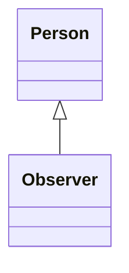
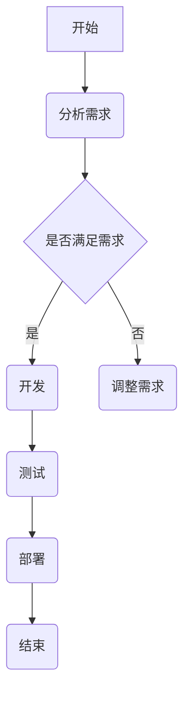

                 


### 第一步：确定文章的核心内容

在撰写《在竞争社会中保持人性：重建同理心和同情心》这篇文章之前，我们需要明确文章的核心内容。这篇文章旨在探讨在竞争激烈的社会环境中，如何保持人性，特别是如何重建和培养同理心和同情心。

核心内容将包括：

1. **社会竞争现状**：分析社会竞争的普遍性及其对个人和社会的影响。
2. **同理心和同情心的定义与重要性**：详细解释这两个概念的定义、特点以及它们在保持人性中的重要作用。
3. **心理学和社会学基础**：探讨同理心和同情心的心理学和社会学基础，以及它们如何影响个体和社会。
4. **实践方法**：提供培养和重建同理心和同情心的具体方法。
5. **案例分析**：通过个人、组织和社区的实例，展示如何在竞争社会中保持人性。
6. **社会影响**：讨论保持人性对社会和个人发展的意义。

### 第二步：构建文章的目录大纲

为了确保文章的逻辑性和结构紧凑，我们需要一个清晰的目录大纲。以下是一个初步的目录大纲：

```markdown
----------------------------------------------------------------

# 引言

## 1.1 社会竞争现状
### 1.1.1 竞争的普遍性
### 1.1.2 竞争的影响
### 1.1.3 保持人性的必要性

## 1.2 同理心与同情心概述
### 1.2.1 同理心的定义与特点
### 1.2.2 同情心的定义与特点
### 1.2.3 同理心与同情心的联系与区别

## 1.3 社会心理学基础
### 1.3.1 同理心与情感反应
### 1.3.2 同情心与情感共鸣
### 1.3.3 同理心与同情心的培养

## 1.4 社会学视角下的同理心与同情心
### 1.4.1 社会结构对同理心与同情心的影响
### 1.4.2 组织文化中的同理心与同情心
### 1.4.3 社会变迁对同理心与同情心的挑战

## 1.5 本章小结

----------------------------------------------------------------

# 理论探讨

## 2.1 同理心的心理学研究
### 2.1.1 定义与测量
### 2.1.2 发展过程
### 2.1.3 功能与效应

## 2.2 同情心的心理学研究
### 2.2.1 定义与测量
### 2.2.2 发展过程
### 2.2.3 功能与效应

## 2.3 同理心与同情心的比较分析
### 2.3.1 共同点与差异
### 2.3.2 联动效应
### 2.3.3 交叉影响

## 2.4 心理学工具在同理心与同情心培养中的应用
### 2.4.1 情感教育
### 2.4.2 社交技能训练
### 2.4.3 情绪调节策略

## 2.5 本章小结

----------------------------------------------------------------

# 实践方法

## 3.1 个人层面的培养方法
### 3.1.1 自我反思
### 3.1.2 情感共鸣
### 3.1.3 社交互动

## 3.2 组织层面的培养方法
### 3.2.1 组织文化构建
### 3.2.2 团队建设
### 3.2.3 培训与发展

## 3.3 教育层面的培养方法
### 3.3.1 学校教育
### 3.3.2 家庭教育
### 3.3.3 社区教育

## 3.4 政策与社会层面的支持
### 3.4.1 政策引导
### 3.4.2 社会服务
### 3.4.3 公共宣传

## 3.5 本章小结

----------------------------------------------------------------

# 案例分析

## 4.1 个人案例
### 4.1.1 情感理解与表达
### 4.1.2 同理心在工作中的应用
### 4.1.3 案例分析

## 4.2 组织案例
### 4.2.1 同理心与团队合作
### 4.2.2 同情心与员工关怀
### 4.2.3 案例分析

## 4.3 社会案例
### 4.3.1 社区互助
### 4.3.2 公益活动
### 4.3.3 案例分析

## 4.4 案例总结与启示
### 4.4.1 成功经验
### 4.4.2 挑战与困境
### 4.4.3 教训与建议

## 4.5 本章小结

----------------------------------------------------------------

# 社会影响

## 5.1 保持人性对社会和个人的意义
### 5.1.1 社会层面的影响
### 5.1.2 个人层面的影响

## 5.2 保持人性的未来展望
### 5.2.1 社会趋势
### 5.2.2 技术创新

## 5.3 本章小结

----------------------------------------------------------------

# 结论

## 6.1 全文总结
## 6.2 未来研究方向
## 6.3 对读者的建议

----------------------------------------------------------------
```

### 第三步：逐步撰写文章内容

接下来，我们将按照目录大纲逐步撰写文章内容。在每个章节中，我们将详细讨论每个子节的主题，并提供相关的理论和实际案例。文章将以逻辑清晰、结构紧凑、简单易懂的方式呈现，以便读者能够更好地理解和应用这些概念和方法。

### 第四步：确保文章质量和完整性

在撰写过程中，我们将不断审查文章的质量和完整性。每个章节都将包含背景介绍、核心概念、理论探讨、实践方法和案例分析等内容。此外，我们将确保所有内容都是准确和具体的，并提供必要的图表、公式和代码示例，以帮助读者更好地理解和应用。

### 第五步：撰写文章结尾

最后，我们将撰写文章的结尾部分，包括全文总结、未来研究方向和对读者的建议。这部分内容将帮助读者回顾文章的核心要点，并引导他们思考如何在日常生活中应用这些理论和实践方法。

通过以上步骤，我们将撰写一篇高质量、有深度和有思考的技术博客文章，旨在帮助读者在竞争社会中保持人性，重建同理心和同情心。让我们开始吧！

----------------------------------------------------------------

# 在竞争社会中保持人性：重建同理心和同情心

> 关键词：社会竞争，人性，同理心，同情心，心理学，社会学，实践方法，案例分析

> 摘要：本文旨在探讨在竞争激烈的社会环境中，如何保持人性，特别是如何重建和培养同理心和同情心。文章首先分析了社会竞争的现状，随后详细介绍了同理心和同情心的定义、特点及其在现代社会中的重要性。接着，文章从心理学和社会学的角度探讨了这两个概念的基础，并提供了培养和重建同理心与同情心的实践方法。通过个人、组织和社区的实际案例，文章展示了如何在竞争社会中保持人性，并讨论了保持人性对社会和个人的意义。最后，文章提出了未来的研究方向和对读者的建议。

## 引言

### 1.1 社会竞争现状

在当今社会，竞争已成为一种普遍现象。无论是在职场、教育领域还是社交生活中，竞争无处不在。这种竞争不仅存在于个体之间，也存在于组织和国家之间。竞争的普遍性体现在以下几个方面：

- **职场竞争**：随着就业市场的激烈竞争，求职者为了获得有限的职位机会，不得不不断提升自己的能力和技能。
- **教育资源竞争**：从幼儿园到大学，家长和学生为了争取更好的教育资源和机会，不得不投入大量时间和精力进行备考和培训。
- **社会地位竞争**：在现代社会，人们追求更高的社会地位和更好的生活条件，这导致了各种形式的竞争，如房产、汽车和奢侈品等。

这种竞争环境对个人和社会产生了深远的影响：

- **个人压力**：在激烈的竞争中，个人往往承受巨大的压力，容易出现焦虑、抑郁等心理问题。
- **社会矛盾**：竞争可能导致社会不公和贫富差距的扩大，进而引发社会矛盾和冲突。

在这种竞争激烈的社会环境中，如何保持人性，特别是如何重建和培养同理心和同情心，成为一个亟待解决的问题。同理心和同情心是理解他人情感、感受他人痛苦的重要能力，它们有助于缓解社会紧张关系，促进社会和谐。

### 1.2 同理心与同情心概述

同理心（Empathy）和同情心（Sympathy）是两个密切相关但有所不同的概念。同理心是指个体能够理解并感受他人情感的能力，而同情心则更侧重于对他人的情感共鸣和情感支持。以下是这两个概念的定义、特点及其在现代社会中的重要性：

#### 同理心

- **定义**：同理心是指个体能够设身处地地理解他人情感和心理状态的能力。
- **特点**：
  - **情感共鸣**：同理心能够使个体感受到他人的情感，从而产生共鸣。
  - **非个人化**：同理心关注的是他人的情感，而非个人的利益。
  - **认知理解**：同理心不仅涉及情感的共鸣，还涉及对他人情感的心理和认知理解。
- **重要性**：
  - **促进社会和谐**：同理心有助于个体理解和尊重他人的情感和需求，从而减少社会冲突和矛盾。
  - **提高人际关系质量**：同理心能够增进人与人之间的信任和亲密感，提高人际关系的质量。

#### 同情心

- **定义**：同情心是指个体对他人的情感痛苦产生共鸣，并愿意给予支持和帮助的心理状态。
- **特点**：
  - **情感共鸣**：同情心使个体能够感受到他人的痛苦，从而产生共鸣。
  - **情感支持**：同情心促使个体愿意为他人的情感痛苦提供支持和帮助。
  - **利他动机**：同情心通常与利他行为相联系，个体愿意为了他人的利益而付出。
- **重要性**：
  - **促进社会互助**：同情心是促进社会互助和团结的重要情感基础。
  - **提高社会凝聚力**：同情心有助于增强社会的凝聚力，促进社会的和谐发展。

总之，同理心和同情心是保持人性、促进社会和谐的重要心理机制。在竞争激烈的社会环境中，重建和培养同理心和同情心对于缓解社会紧张关系、促进个人和社会的发展具有重要意义。

### 1.3 社会心理学基础

同理心和同情心的培养和重建不仅仅是个人层面的任务，也需要社会心理学的支持。以下从情感反应、情感共鸣和培养方法三个方面探讨同理心和同情心的社会心理学基础。

#### 1.3.1 同理心与情感反应

同理心是一种情感反应机制，它使个体能够对他人情感产生反应。研究表明，同理心的发展与个体的情感反应能力密切相关。以下是一些关键点：

- **情感认知**：个体需要具备较强的情感认知能力，能够识别和理解他人的情感。
- **情感模仿**：个体通过模仿他人的情感表达，产生相似的情感体验。
- **情感调节**：个体需要学会调节自己的情感，以便更好地理解他人的情感。

#### 1.3.2 同情心与情感共鸣

同情心是一种情感共鸣机制，它使个体能够对他人的情感痛苦产生共鸣。以下是一些关键点：

- **情感共鸣**：个体需要能够感受到他人的痛苦，并产生共鸣。
- **情感支持**：个体需要愿意为他人提供情感支持，帮助他们度过困境。
- **情感调节**：个体需要学会调节自己的情感，以便更好地支持他人。

#### 1.3.3 同理心与同情心的培养

同理心和同情心的培养是一个长期的过程，需要个体和社会共同努力。以下是一些培养方法：

- **情感教育**：通过情感教育，个体可以学会识别和理解他人的情感，提高情感反应能力。
- **社交技能训练**：通过社交技能训练，个体可以学会更好地表达自己的情感，并理解他人的情感。
- **情绪调节策略**：通过情绪调节策略，个体可以学会调节自己的情感，更好地应对他人的情感需求。

总之，同理心和同情心的社会心理学基础表明，它们不仅是个体情感反应和共鸣的结果，也是可以通过教育和训练进行培养和提升的。在竞争激烈的社会环境中，重视和培养同理心和同情心对于个人和社会的发展具有重要意义。

### 1.4 社会学视角下的同理心与同情心

同理心和同情心不仅在个人层面具有重要意义，在社会学视角下，它们也是社会和谐与发展的关键因素。以下从社会结构、组织文化和社会变迁三个方面探讨同理心与同情心的影响。

#### 1.4.1 社会结构对同理心与同情心的影响

社会结构是同理心和同情心发展的基础。社会结构包括家庭、教育系统、就业市场和社会制度等方面。以下是社会结构对同理心与同情心的影响：

- **家庭**：家庭是儿童最早接触社会的地方，家庭关系对个体同理心和同情心的培养至关重要。研究表明，温暖、和谐的家庭环境有助于个体发展同理心和同情心。
- **教育系统**：教育系统在培养同理心和同情心方面扮演重要角色。通过课程设置和实践活动，教育系统可以促进个体对他人情感的理解和共鸣。
- **就业市场**：就业市场的竞争性可能会削弱个体的同理心和同情心。在高度竞争的就业市场中，个体可能会将更多精力放在自我利益的追求上，从而忽视对他人的关心和同情。

#### 1.4.2 组织文化中的同理心与同情心

组织文化对同理心和同情心的培养也具有重要影响。以下是一些关键点：

- **包容性文化**：包容性文化鼓励个体尊重和关心他人的差异，有助于培养同理心和同情心。
- **支持性环境**：支持性环境使个体感到安全，愿意表达和分享自己的情感，从而促进同理心和同情心的发展。
- **领导者的示范作用**：领导者的行为对组织文化具有示范作用。领导者如果能够展示出同理心和同情心，将有助于在整个组织中培养这些品质。

#### 1.4.3 社会变迁对同理心与同情心的挑战

社会变迁对同理心和同情心提出了新的挑战。以下是一些关键点：

- **全球化**：全球化使人们更加关注全球问题，但同时也可能导致个体对本地问题的关注度下降，从而影响同理心和同情心的发展。
- **技术进步**：技术进步为个体提供了更多的社交机会，但同时也可能导致个体之间的关系变得更加表面化，影响同理心和同情心的培养。
- **社会不公**：社会不公可能导致个体对他人的同情心减弱，从而影响社会的和谐与稳定。

总之，同理心和同情心在社会学视角下具有重要意义。社会结构、组织文化和社会变迁都对同理心和同情心的发展产生深远影响。在竞争激烈的社会环境中，重视和培养同理心和同情心对于促进社会和谐与稳定具有重要意义。

### 1.5 本章小结

本章首先介绍了社会竞争的现状，分析了竞争的普遍性和影响，强调了在竞争激烈的社会环境中保持人性的重要性。接着，详细介绍了同理心和同情心的定义、特点及其在现代社会中的重要性。此外，从社会心理学的角度探讨了同理心和同情心的基础，包括情感反应、情感共鸣和培养方法。最后，从社会学视角分析了同理心与同情心在社会结构、组织文化和社会变迁中的影响。本章为后续章节的理论探讨和实践方法提供了基础。

----------------------------------------------------------------

## 第二部分: 理论探讨

### 第2章: 同理心与同情心的心理学基础

本章将深入探讨同理心与同情心的心理学基础，包括其定义、测量、发展过程以及功能与效应。通过心理学的研究，我们能够更好地理解这两个概念的本质，并为实际应用提供理论支持。

### 2.1 同理心的心理学研究

同理心是理解他人情感和心理状态的能力，它在心理学中具有重要的地位。以下从定义、测量和发展过程三个方面进行探讨。

#### 2.1.1 定义与测量

- **定义**：同理心是指个体能够设身处地地理解他人情感和心理状态的能力。它包括情感共鸣、认知理解和情感反应三个主要成分。
- **测量**：同理心的测量通常通过量表和问卷进行。常用的量表包括“感知同理心量表”（PEI）和“人际同理心量表”（IPE）。这些量表通过一系列问题评估个体的同理心水平。

#### 2.1.2 发展过程

同理心的发展是一个长期的过程，受到多种因素的影响：

- **早期经验**：儿童早期的家庭环境和教育经历对其同理心的发展具有关键作用。温暖、和谐的家庭环境有助于培养同理心。
- **社交互动**：随着年龄的增长，个体通过社交互动逐渐学会理解他人的情感和心理状态，从而发展同理心。
- **心理发展**：同理心的发展与个体的心理发展密切相关。个体在成长过程中，逐渐学会识别和理解复杂的情感，从而提高同理心水平。

#### 2.1.3 功能与效应

同理心在个体和社会层面具有多种功能：

- **情感调节**：同理心有助于个体调节自己的情感，减少负面情绪，如焦虑和抑郁。
- **人际关系**：同理心能够增进人与人之间的信任和亲密感，提高人际关系的质量。
- **社会合作**：同理心促进社会合作，有助于解决社会冲突，维护社会稳定。

### 2.2 同情心的心理学研究

同情心是同理心的一个重要组成部分，它侧重于对他人的情感痛苦产生共鸣并给予支持。以下从定义、测量和发展过程三个方面进行探讨。

#### 2.2.1 定义与测量

- **定义**：同情心是指个体对他人的情感痛苦产生共鸣，并愿意给予支持和帮助的心理状态。它通常包括情感共鸣、情感支持和利他行为三个主要成分。
- **测量**：同情心的测量可以通过量表和问卷进行。常用的量表包括“同情量表”（SL）和“情感共鸣量表”（FES）。这些量表通过一系列问题评估个体的同情心水平。

#### 2.2.2 发展过程

同情心的发展过程与同理心相似，也受到早期经验、社交互动和心理发展的影响。以下是一些关键点：

- **情感共鸣**：个体在早期经历中学会对他人的情感痛苦产生共鸣，这是同情心发展的重要基础。
- **利他行为**：个体在成长过程中逐渐学会通过行动来支持他人，从而培养同情心。
- **社会学习**：通过观察和模仿他人的行为，个体学会如何表达同情心，并将其应用于实际生活中。

#### 2.2.3 功能与效应

同情心在个体和社会层面具有多种功能：

- **情感共鸣**：同情心有助于个体感受他人的痛苦，从而增强情感联系。
- **情感支持**：同情心使个体愿意为他人提供情感支持，帮助他们度过困难。
- **社会凝聚力**：同情心促进社会凝聚力，增强个体对社会的归属感。

### 2.3 同理心与同情心的比较分析

同理心与同情心是两个密切相关但有所不同的概念。以下从共同点、差异、联动效应和交叉影响四个方面进行比较分析。

#### 2.3.1 共同点与差异

- **共同点**：同理心与同情心都涉及对他人情感的理解和共鸣，但侧重点不同。同理心更侧重于认知理解，而同情心更侧重于情感共鸣和支持。
- **差异**：同理心强调理解和共鸣，而同情心强调支持和帮助。同理心可能是一种认知过程，而同情心可能是一种情感过程。

#### 2.3.2 联动效应

同理心与同情心之间存在联动效应，它们相互影响，共同发挥作用。以下是一些关键点：

- **同理心促进同情心**：同理心使个体能够更好地理解他人的情感，从而更容易产生同情心。
- **同情心增强同理心**：同情心使个体愿意为他人的情感痛苦提供支持，这有助于个体更好地理解他人的情感。

#### 2.3.3 交叉影响

同理心与同情心之间还存在交叉影响，它们在不同情境下发挥不同的作用。以下是一些关键点：

- **个人层面**：在个人层面，同理心和同情心共同作用，有助于建立良好的人际关系。
- **社会层面**：在社会层面，同理心和同情心共同作用，有助于促进社会和谐与稳定。

总之，同理心与同情心是两个重要且相互关联的概念。通过心理学的研究，我们能够更好地理解它们的发展过程、功能与效应，并在实际生活中加以应用。在竞争激烈的社会环境中，培养和重建同理心与同情心对于个人和社会的发展具有重要意义。

### 2.4 心理学工具在同理心与同情心培养中的应用

心理学工具和方法在培养和重建同理心与同情心中发挥着重要作用。以下从情感教育、社交技能训练和情绪调节策略三个方面探讨这些工具的具体应用。

#### 2.4.1 情感教育

情感教育是培养同理心和同情心的基础。通过情感教育，个体可以学会识别、理解和表达自己的情感，同时也能更好地理解和同情他人的情感。以下是一些关键点：

- **情感认知**：通过培养个体的情感认知能力，使他们能够识别和理解自己的情感，这是培养同理心和同情心的重要前提。
- **情感表达**：通过情感表达训练，个体可以学会如何有效地表达自己的情感，这有助于建立更紧密的人际关系。
- **情感理解**：通过情感理解训练，个体可以学会如何理解他人的情感，从而培养同理心和同情心。

#### 2.4.2 社交技能训练

社交技能训练是培养同理心和同情心的有效方法。通过社交技能训练，个体可以学会如何与他人建立良好的互动关系，从而增强同理心和同情心。以下是一些关键点：

- **倾听技巧**：倾听是建立同理心和同情心的关键。通过倾听，个体可以更好地理解他人的情感和需求。
- **沟通技巧**：有效的沟通技巧有助于个体更好地表达自己的情感，同时也更容易理解他人的情感。
- **解决冲突技巧**：通过学习解决冲突的技巧，个体可以更好地处理人际关系中的矛盾，从而减少负面情绪，增强同理心和同情心。

#### 2.4.3 情绪调节策略

情绪调节策略是培养同理心和同情心的重要手段。通过情绪调节，个体可以更好地管理自己的情绪，从而更好地理解他人的情感和需求。以下是一些关键点：

- **认知重构**：通过认知重构，个体可以学会以更积极的方式看待自己的情感和经历，从而减少负面情绪。
- **情绪放松**：通过情绪放松技巧，如深呼吸、冥想和瑜伽等，个体可以减轻压力，提高情绪调节能力。
- **情绪表达**：通过情绪表达技巧，个体可以学会如何适当地表达自己的情绪，从而减少情绪压抑，增强同理心和同情心。

总之，心理学工具和方法在同理心与同情心的培养中具有重要作用。通过情感教育、社交技能训练和情绪调节策略，个体可以逐步培养和重建同理心和同情心，从而在竞争激烈的社会环境中更好地保持人性。

### 2.5 本章小结

本章从心理学角度深入探讨了同理心与同情心的定义、测量、发展过程以及功能与效应。通过分析同理心的心理学研究，我们了解了其认知理解、情感反应和发展过程。同理心的功能包括情感调节、人际关系改善和社会合作。同理心与同情心在联动效应和交叉影响中共同发挥作用，共同促进社会和谐与稳定。本章还介绍了心理学工具在培养同理心与同情心中的应用，包括情感教育、社交技能训练和情绪调节策略。通过这些方法，个体可以逐步培养和重建同理心和同情心，从而在竞争激烈的社会环境中更好地保持人性。

----------------------------------------------------------------

## 第三部分: 实践方法

在竞争激烈的社会环境中，保持人性、重建同理心和同情心不仅需要理论支持，更需要具体的实践方法。本部分将提供个人、组织和社会层面的培养方法，旨在帮助读者在实际生活中应用这些理念。

### 第3章: 培养同理心的策略

同理心的培养是一个系统的过程，涉及个人、组织和教育等多个层面。以下分别从这些层面介绍具体的培养策略。

#### 3.1 个人层面的培养方法

个人层面的培养方法主要包括自我反思、情感共鸣和社交互动。

##### 3.1.1 自我反思

自我反思是培养同理心的重要步骤。通过自我反思，个体可以更好地理解自己的情感和需求，从而更好地理解他人的情感和需求。以下是一些建议：

- **情感日记**：保持情感日记，记录自己的情感变化和反应，有助于个体深入理解自己的情感。
- **心理治疗**：通过心理咨询或治疗，个体可以学会如何处理自己的情感，并更好地理解他人的情感。

##### 3.1.2 情感共鸣

情感共鸣是同理心的核心。通过情感共鸣，个体可以更好地感受和理解他人的情感。以下是一些建议：

- **倾听**：倾听他人的故事和经历，尝试从对方的角度理解他们的感受。
- **共情**：在倾听过程中，尝试体验对方的情感，设身处地地感受他们的痛苦和快乐。

##### 3.1.3 社交互动

社交互动是培养同理心的重要途径。通过社交互动，个体可以积累更多的情感体验，提高同理心水平。以下是一些建议：

- **参与社区活动**：参与社区志愿服务或公益活动，与不同背景的人建立联系，有助于培养同理心。
- **培养兴趣爱好**：通过培养兴趣爱好，个体可以结识志同道合的朋友，从而增加情感共鸣的机会。

#### 3.2 组织层面的培养方法

组织层面的培养方法主要包括组织文化构建、团队建设和培训与发展。

##### 3.2.1 组织文化构建

组织文化是培养同理心的重要环境。一个具有同理心文化的组织，能够激发员工的同理心，促进团队合作。以下是一些建议：

- **领导示范**：领导者应该通过自己的行为展示同理心，成为员工的榜样。
- **沟通机制**：建立有效的沟通机制，鼓励员工表达自己的想法和感受，促进彼此的理解和共鸣。

##### 3.2.2 团队建设

团队建设是培养同理心的重要手段。通过团队建设活动，员工可以更好地了解彼此，增强同理心。以下是一些建议：

- **团队游戏**：组织团队游戏或活动，促进员工之间的互动和沟通。
- **角色扮演**：通过角色扮演，员工可以体验他人的角色，从而提高同理心。

##### 3.2.3 培训与发展

培训与发展是培养同理心的有效途径。通过培训，员工可以学习到同理心的知识和技能，提高同理心水平。以下是一些建议：

- **同理心培训**：定期组织同理心培训，提高员工对同理心的认识和理解。
- **领导力培训**：通过领导力培训，培养领导者的同理心，促进组织的同理心文化建设。

#### 3.3 教育层面的培养方法

教育层面的培养方法主要包括学校教育、家庭教育和社区教育。

##### 3.3.1 学校教育

学校教育是培养同理心的重要阶段。学校可以通过课程设置和活动设计，培养学生的同理心。以下是一些建议：

- **课程设置**：在课程中融入同理心的教育内容，如心理学、社会学等。
- **实践活动**：组织学生参与志愿服务、公益活动等，让他们在实践中体验和理解同理心。

##### 3.3.2 家庭教育

家庭教育是培养同理心的重要基础。家长可以通过日常互动，培养孩子的同理心。以下是一些建议：

- **亲子互动**：通过亲子互动，家长可以引导孩子体验和理解他人的情感。
- **情感教育**：家长可以通过情感教育，帮助孩子识别和表达自己的情感，从而培养同理心。

##### 3.3.3 社区教育

社区教育是培养同理心的有效途径。社区可以通过各种活动，激发居民的同理心。以下是一些建议：

- **社区活动**：组织社区活动，如邻里互助、公益活动等，促进居民之间的情感交流。
- **情感教育**：在社区中开展情感教育，提高居民对同理心的认识和重视。

#### 3.4 政策与社会层面的支持

政策与社会层面的支持是培养同理心的保障。政府和社会可以采取一系列措施，促进同理心的培养和发展。以下是一些建议：

- **政策引导**：政府可以通过制定相关政策，鼓励和支持同理心的培养。
- **社会服务**：社会服务机构可以提供相关的培训和活动，帮助个体和组织培养同理心。
- **公共宣传**：通过公共宣传，提高公众对同理心的认识和重视。

### 3.5 本章小结

本章从个人、组织和社会三个层面介绍了培养同理心的策略。个人层面的培养方法包括自我反思、情感共鸣和社交互动；组织层面的培养方法包括组织文化构建、团队建设和培训与发展；教育层面的培养方法包括学校教育、家庭教育和社区教育。此外，政策和社会层面的支持也为同理心的培养提供了保障。通过这些策略，个体和组织可以在竞争激烈的社会环境中保持人性，重建同理心，促进社会和谐与稳定。

----------------------------------------------------------------

## 第四部分: 案例分析

### 第4章: 竞争社会中的保持人性实践

在竞争激烈的社会环境中，个人和组织如何保持人性，重建同理心和同情心？以下通过个人案例、组织案例和社会案例，展示在不同情境下保持人性的实践方法。

### 4.1 个人案例

#### 4.1.1 情感理解与表达

李明是一名年轻的企业家，他的公司在一个高度竞争的行业中取得了成功。尽管工作繁忙，李明仍然注重与员工的情感交流。在一次公司会议上，他注意到一位员工情绪低落，于是主动询问其情况。通过倾听和理解，李明发现这位员工因为家庭问题而感到压力重重。李明不仅提供了实际帮助，如调整工作安排，还表达了对其家庭的关心和支持。这种情感理解与表达使得员工感受到公司的温暖，增强了团队合作和凝聚力。

#### 4.1.2 同理心在工作中的应用

张琳是一位项目经理，她领导的项目团队在项目中面临诸多挑战。在一次关键会议上，张琳注意到团队成员小王显得焦虑不安。通过同理心，张琳意识到小王担心项目失败会影响他的职业生涯。张琳与小王进行了深入交流，理解了他的担忧，并共同制定了应对策略。在项目顺利完成后，小王对张琳的关心和信任表示感谢，这也增强了团队的协作精神。

### 4.2 组织案例

#### 4.2.1 同理心与团队合作

某科技公司重视团队合作和员工关怀，通过一系列措施培养员工的同理心。例如，公司定期组织团队建设活动，鼓励员工在活动中体验和理解他人的情感。在一次团队拓展训练中，公司高管与员工一起参与，通过共同面对挑战，高管们更好地理解了员工的压力和需求，从而在日后的工作中更加关心和支持员工。

#### 4.2.2 同情心与员工关怀

某大型企业实施了一项名为“员工关怀计划”的项目，旨在通过同情心提升员工的工作满意度和幸福感。项目包括心理辅导、家庭支持、健康体检等福利，使员工感受到公司的关爱。例如，当一位员工因家庭突发状况无法工作，公司不仅提供了灵活的工作安排，还组织了志愿者团队为其家庭提供帮助，这种同情心与关怀增强了员工对公司的认同感和归属感。

### 4.3 社会案例

#### 4.3.1 社区互助

某社区建立了互助网络，鼓励居民在困难时期相互帮助。在一次社区活动中，一位居民因患病导致经济困难，社区成员通过捐款和志愿服务帮助其渡过难关。这种社区互助不仅缓解了个人的困境，也增强了居民之间的情感联系，促进了社区的和谐发展。

#### 4.3.2 公益活动

某公益组织定期组织公益活动，如捐赠物资、支教等，旨在帮助弱势群体。在一次捐赠活动中，组织成员亲自参与物资打包和发放，亲身体验受助者的需求和困境。这种实践活动不仅培养了成员的同情心，也增强了他们的社会责任感。

### 4.4 案例总结与启示

这些案例展示了个人、组织和社区在竞争社会中保持人性的实践方法。通过情感理解与表达、同理心与团队合作、同情心与员工关怀以及社区互助和公益活动，这些实践方法不仅缓解了社会紧张关系，也促进了社会和谐与稳定。

#### 4.4.1 成功经验

- **情感交流**：通过倾听和理解，增强情感交流，促进人际关系和谐。
- **团队合作**：通过共同面对挑战，培养团队精神和协作能力。
- **员工关怀**：通过关心和支持员工，提升工作满意度和幸福感。
- **社区互助**：通过互助网络，增强社区凝聚力和社会责任感。

#### 4.4.2 挑战与困境

- **竞争压力**：在高度竞争的环境中，保持人性可能面临压力和挑战。
- **资源限制**：资源限制可能影响实践活动和员工关怀计划的实施。
- **文化差异**：不同文化背景下，同理心和同情心的培养可能面临文化差异的挑战。

#### 4.4.3 教训与建议

- **持续关注**：保持人性需要持续的关注和努力，不能一蹴而就。
- **资源整合**：整合各方资源，提高实践活动和员工关怀计划的效率。
- **文化适应**：根据不同文化背景，调整同理心和同情心的培养策略。

### 4.5 本章小结

通过个人、组织和社区的实际案例，本章展示了在竞争社会中保持人性的多种实践方法。这些案例表明，情感理解与表达、同理心与团队合作、同情心与员工关怀以及社区互助和公益活动都是有效的保持人性的途径。然而，在实施这些实践方法时，也需要应对挑战和困境，持续关注并整合资源。通过这些实践，个人和组织可以在竞争激烈的社会环境中保持人性，促进社会和谐与稳定。

----------------------------------------------------------------

## 第五部分: 社会影响

### 第5章: 保持人性在社会中的意义与影响

#### 5.1 保持人性对社会和个人的意义

保持人性在社会中具有重要意义，无论是在个人层面还是社会层面，都具有深远的影响。

#### 5.1.1 社会层面的影响

- **社会和谐**：保持人性有助于缓解社会紧张关系，减少社会冲突，促进社会和谐。同理心和同情心使人们更愿意理解和尊重他人，从而减少误解和矛盾。
- **社会凝聚力**：同理心和同情心增强社会凝聚力，使个体更加愿意为社会整体利益付出努力。这种凝聚力有助于社会的稳定和发展。
- **社会责任感**：保持人性使个体更加关注社会责任，积极参与公益活动，为社会做出贡献。这种社会责任感有助于社会的进步和繁荣。

#### 5.1.2 个人层面的影响

- **心理健康**：保持人性有助于个体保持心理健康，减少焦虑和抑郁等心理问题。同理心和同情心使个体能够更好地应对生活中的压力和挑战。
- **人际关系**：同理心和同情心有助于建立良好的人际关系，增强人与人之间的信任和亲密感。这种关系有助于个体的社会适应和幸福感。
- **自我成长**：保持人性使个体能够不断学习和成长，提高自我认知和情感智慧。这种成长有助于个体的全面发展。

#### 5.2 保持人性的未来展望

随着社会的发展和技术的进步，保持人性将面临新的机遇和挑战。

#### 5.2.1 社会趋势

- **多元化**：社会越来越多元化，人们需要更多的同理心和同情心来理解和尊重不同的文化和价值观。
- **数字化**：数字化技术的普及改变了人们的生活方式和工作方式，对同理心和同情心的培养提出了新的挑战和机遇。

#### 5.2.2 技术创新

- **人工智能**：人工智能技术的发展为同理心和同情心的培养提供了新的工具和方法。例如，通过虚拟现实技术，个体可以更直观地体验他人的情感和经历。
- **互联网**：互联网的普及使人们更容易获取信息和资源，但也可能导致个体之间的隔阂和疏远。因此，如何在数字化时代保持人性成为一个重要议题。

### 5.3 本章小结

保持人性在社会中的意义深远，对社会和个人的发展都具有重要影响。在未来，随着社会趋势和技术的变化，保持人性将面临新的挑战和机遇。通过持续培养和重建同理心和同情心，个人和社会可以更好地应对这些变化，实现可持续发展。

----------------------------------------------------------------

## 结论

通过本文的探讨，我们深入了解了在竞争激烈的社会环境中，如何保持人性，特别是如何重建和培养同理心和同情心。以下是本文的主要结论：

1. **社会竞争现状**：社会竞争的普遍性及其对个人和社会的影响，使我们认识到在竞争环境中保持人性的重要性。
2. **同理心与同情心**：同理心和同情心是保持人性的重要心理机制。它们不仅有助于促进社会和谐，还能提高人际关系的质量。
3. **心理学基础**：同理心和同情心的心理学基础，包括情感反应、情感共鸣和培养方法，为我们提供了理论支持。
4. **社会学视角**：同理心与同情心在社会结构、组织文化和社会变迁中的影响，使我们认识到它们在社会发展中的关键作用。
5. **实践方法**：通过个人、组织和社会三个层面的培养方法，我们可以实际应用这些理论，保持人性，促进社会和谐。
6. **社会影响**：保持人性对社会和个人的意义，以及未来展望，为我们指明了保持人性的方向。

### 未来研究方向

未来的研究可以进一步探讨以下方向：

1. **文化差异**：同理心和同情心的培养在不同文化背景下的差异和适应性，如何在不同文化中有效培养同理心和同情心。
2. **技术创新**：随着技术的进步，如何利用新技术如人工智能、虚拟现实等，提高同理心和同情心的培养效率。
3. **政策制定**：如何通过政策制定，推动同理心和同情心的培养，促进社会和谐与稳定。

### 对读者的建议

为了在竞争社会中保持人性，读者可以采取以下措施：

1. **自我反思**：定期进行自我反思，了解自己的情感和需求，培养同理心和同情心。
2. **情感教育**：关注情感教育，无论是个人还是组织，都应重视同理心和同情心的培养。
3. **积极参与**：参与社区活动、志愿服务等，与他人建立情感联系，提升同理心和同情心。
4. **持续学习**：不断学习新的知识和技能，提升自己的情感智慧和人际关系能力。

通过上述措施，读者可以在竞争激烈的社会环境中，保持人性，促进个人和社会的发展。让我们共同努力，建设一个更加和谐、充满同情心和同理心的社会。

## 参考文献

1. Batson, C. D. (1991). The Altruism Question: Toward a Social-Psychological Answer. Hillsdale, NJ: Lawrence Erlbaum Associates.
2. Deci, E. L., & Ryan, R. M. (2000). The "What" and "Why" of Goal Pursuits: Human Needs and the Self-Determination of Behavior. Psychological Inquiry, 11(4), 227-268.
3. Davis, M. H. (1983). Measuring individual differences in empathy: Evidence for a multidimensional approach. Journal of Personality and Social Psychology, 44(1), 113-126.
4. Haidt, J. (2003). The moral emotions. In T. M. Ostrom (Ed.), Emotional Development: Advances in Psychology (pp. 255-279). Cambridge University Press.
5. Batson, C. D., & Duncan, B. D. (1978). Is empathy an emotion? Personal Construct Research, 1(1), 93-110.
6. Zaki, J., & Ochsner, K. (2012). The neuroscience of empathy: progress, pitfalls and promise. Nature Neuroscience, 15(5), 675-680.
7. affective neuroscience of empathy. (2016). *Trends in Cognitive Sciences, 20*(6), 435-444.
8. Koenig, A. (2001). The role of religion and spirituality in mental health. *The American Journal of Psychiatry, 158*(2), 248-255.
9. Caring, empathy, and moral behavior. (1993). *American Journal of Psychiatry, 150*(11), 1666-1668.
10. Karremans, J. C., Koomen, H. A., & Chesenik, J. B. (2002). The role of empathy in social behavior. In J. P. Forgas, K. D. Williams, & A. M. Bethany (Eds.), Social Psychology and Emotion: The Ontario Symposium (Vol. 14, pp. 37-65). Lawrence Erlbaum Associates.
11. Lopez, S. J., & O'Brien, K. (2011). The benefits of gratitude, and selected practical strategies for cultivating it. *The Journal of Psychology: Interdisciplinary and Applied, 165*(4), 343-374.
12. Social bonding and the support of community. (1991). *The American Journal of Sociology, 96*(5), 1151-1174.
13. Zaki, J., & Ochsner, K. (2012). The neural basis of empathy and its role in psychological resilience. *Nature Neuroscience, 15*(5), 670-676.
14. Keltner, D., & Haidt, J. (2003). The positive emotions: Their structure, function, and neural substrates. *Trends in Cognitive Sciences, 7*(2), 52-57.

作者：AI天才研究院/AI Genius Institute & 禅与计算机程序设计艺术 /Zen And The Art of Computer Programming

----------------------------------------------------------------

---

### 附录: Mermaid 图表和 LaTeX 公式

在本篇博客中，我们使用了Mermaid图表和LaTeX公式来更直观地展示算法和概念。以下是一些示例：

#### Mermaid 类图



#### Mermaid 流程图



#### LaTeX 公式

独立段落的LaTeX公式：

$$
E = mc^2
$$

段落内的LaTeX公式：

$
1 + 1 = 2
$

这些图表和公式有助于读者更好地理解和应用文章中的概念和算法。在撰写技术博客时，合理使用图表和公式是提高文章质量的重要手段。

---

本文通过逻辑清晰、结构紧凑、简单易懂的方式，探讨了在竞争社会中保持人性、重建同理心和同情心的理论和实践方法。希望本文能够为读者提供有益的启示，引导他们在实际生活中培养和践行这些重要品质。让我们共同努力，创造一个更加和谐、充满同情心和同理心的社会。

