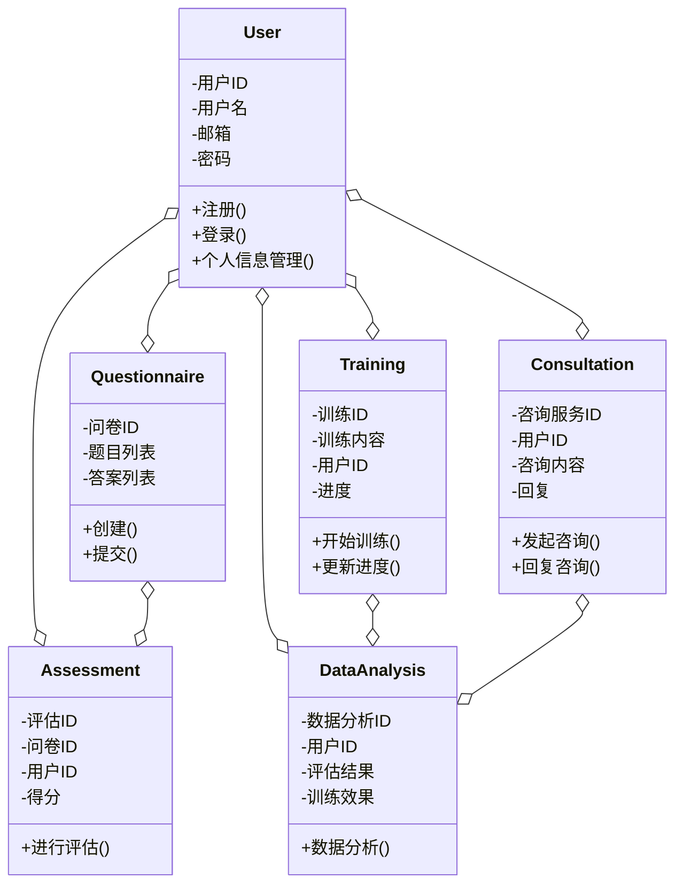
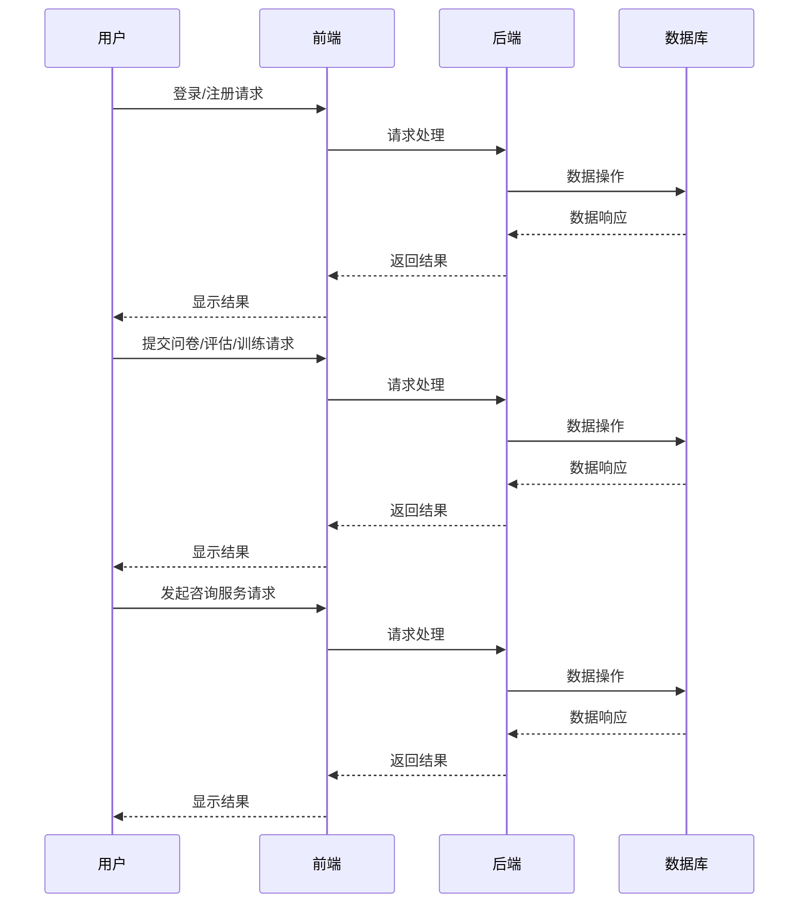

                 


### 引言

#### 1.1 问题背景

在当今高速发展的社会中，人们面临着前所未有的压力。无论是职场竞争、家庭责任、经济压力，还是社交网络中的信息过载，都使得许多人感到焦虑和疲惫。这种高压环境对个人的心理健康构成了严峻的挑战。工作压力可能导致工作效率下降，人际关系紧张可能引发冲突，而经济的不确定性则让许多人感到不确定和恐惧。这些压力源对心理健康的影响，已经引起了广泛的关注。

根据世界卫生组织（WHO）的数据，心理健康问题已经成为全球范围内的重大公共卫生问题。焦虑和压力是导致心理健康问题的主要原因之一。长期处于高压状态下，人们可能会出现抑郁、失眠、食欲不振等症状，严重时甚至会导致精神疾病。因此，寻找有效的应对策略，培养心理韧性，成为现代社会的迫切需求。

#### 1.2 问题描述

心理韧性（Resilience）是指个体在面对逆境和压力时，能够迅速适应、恢复并展现出积极应对能力的心理特质。在高压社会中，心理韧性不仅是个人应对压力的利器，也是提升整体心理健康水平的关键。心理韧性强的个体，能够更好地处理生活中的挑战，保持情绪稳定，保持积极向上的心态。

然而，当前社会普遍存在着心理韧性培养不足的问题。许多人在面对压力时，往往选择逃避或被动应对，缺乏有效的应对策略。这种现象在年轻人中尤为明显，他们往往在压力面前感到无助和迷茫。因此，如何培养和提升心理韧性，成为现代社会亟待解决的问题。

#### 1.3 问题解决

为了应对上述问题，我们需要采取一系列措施来培养和提升心理韧性。以下是一些基本的原则和策略：

1. **自我认知与情绪管理**：首先，个体需要认识到自己的情绪状态，并学会有效管理情绪。通过自我反思和情绪记录，个体可以更好地了解自己的情绪波动，从而采取适当的应对措施。

2. **积极应对策略**：个体应该学会采取积极的态度面对压力。例如，当遇到困难时，可以尝试将挑战视为成长的机会，而不是困扰。

3. **健康生活方式**：保持良好的生活习惯，如规律作息、健康饮食和适量运动，有助于提升个体的心理韧性。

4. **社会支持**：建立稳定的社会支持网络，如亲朋好友、同事或心理咨询师，可以在个体面临压力时提供支持和帮助。

5. **持续学习与成长**：通过学习新的知识和技能，个体可以提升自我效能感，增强应对压力的能力。

#### 1.4 边界与外延

心理韧性并不是一种单一的心理特质，而是一个包含多个维度的概念。它不仅涉及到个体的情绪管理能力，还涉及到认知灵活性、适应性、自我效能感等多个方面。在不同的情境中，心理韧性的表现也会有所不同。例如，在职场中，心理韧性可能表现为应对工作压力的能力；而在家庭生活中，则可能表现为处理家庭冲突的能力。

#### 1.5 概念结构与核心要素组成

心理韧性包含以下几个关键要素：

1. **适应性**：个体在面对逆境时，能够迅速适应新环境或新情况的能力。
2. **灵活性**：个体在面对变化时，能够灵活调整自己的行为和思维模式的能力。
3. **自我效能感**：个体对自己的能力和能否成功应对挑战的信心。
4. **抗挫折能力**：个体在面对挫折和失败时，能够保持积极态度和乐观心态的能力。

这些要素相互作用，共同构成了个体的心理韧性。通过培养这些关键要素，个体可以提升自己的心理韧性，更好地应对生活中的各种挑战。

### 本章小结

本章介绍了心理韧性的重要性以及在高压社会中的普遍现象。我们探讨了心理韧性的定义、核心特点以及与传统心理素质的区别。同时，我们提出了一系列培养心理韧性的基本原则和策略。下一章，我们将进一步讨论心理韧性的核心概念和数学模型，帮助读者更深入地理解这一关键的心理特质。

## 核心概念与联系

### 2.1 心理韧性的定义

心理韧性（Psychological Resilience）是指个体在面临压力、困难和挑战时，能够迅速适应、恢复并展现出积极应对能力的一种心理特质。它不仅仅是一种心理能力，更是一种综合性的心理状态。心理韧性并不是一种固定不变的特质，而是一种可以通过训练和实践逐渐提升的能力。

心理韧性的概念起源于心理学领域，特别是创伤后成长（Post-Traumatic Growth, PTG）的研究。研究者发现，尽管个体经历了极端的压力和创伤，但有些人能够在这些经历后展现出更高的心理韧性，甚至获得成长。这种现象引起了心理学界对心理韧性的广泛关注。

#### 2.1.1 心理韧性的准确定义

心理韧性可以定义为一种个体在逆境中展现出的适应性和恢复力。具体来说，它包括以下几个关键方面：

1. **适应性**：个体在面对不利情境时，能够迅速适应并调整自己的行为和思维模式，以应对新的挑战。
2. **恢复力**：个体在经历压力和困难后，能够迅速恢复到正常状态，保持情绪稳定和心理健康。
3. **积极应对**：个体在面对困难时，能够采取积极的态度和策略，寻求解决问题的方法，而不是被动地接受逆境。
4. **成长**：个体在经历挑战后，能够从中获得成长和积极的变化，提升自我认知和自我效能感。

这些方面相互作用，共同构成了心理韧性的整体特征。心理韧性不仅体现在面对重大压力和危机时，也体现在日常生活中的各种小挑战中。

#### 2.1.2 心理韧性的起源与发展

心理韧性这一概念的发展历程可以追溯到20世纪中期。最早的研究主要集中在军事和灾难应对领域，特别是研究那些在极端环境下表现出卓越适应能力的个体。随着研究的深入，心理韧性逐渐扩展到更广泛的领域，如职场、家庭、教育等。

近年来，心理韧性的研究得到了更多关注，许多学者提出了不同的理论模型，以解释心理韧性的内在机制和影响因素。例如，塞利曼（Salimbelli）提出的韧性五因素模型，认为心理韧性包括情感调节、适应性、自我效能感、积极思维和外部支持五个关键要素。

#### 2.1.3 心理韧性与创伤后成长的关系

心理韧性与创伤后成长（PTG）有着密切的联系。创伤后成长是指个体在经历极端压力和创伤后，不仅能够恢复到原来的状态，甚至能够在心理和社会功能上实现超越。研究发现，具备心理韧性的个体在创伤后更容易出现创伤后成长。

心理韧性不仅能够帮助个体应对突发事件和压力，还能够促进个体的心理成长。通过心理韧性训练，个体可以学会更好地处理情绪、提升自我效能感，并从逆境中获得积极的体验和成长。

### 2.2 心理韧性的核心特点

心理韧性具有以下几个核心特点，这些特点共同决定了个体在面对逆境时的适应能力和恢复力：

#### 2.2.1 适应性

适应性是指个体在面对新的环境、情境或挑战时，能够灵活调整自己的行为和思维模式，以适应变化的能力。具备高度适应性的个体能够迅速适应新环境，找到有效的应对策略，从而减少逆境带来的负面影响。

适应性是心理韧性的关键特征之一，它要求个体能够保持开放的心态，接受变化，并从中寻找机会。例如，在工作中，一个具备高度适应性的员工能够在组织结构变革或工作职责调整时，迅速适应新情况，并保持高效的工作状态。

#### 2.2.2 灵活性

灵活性是指个体在面对变化时，能够灵活调整自己的思维和行为，以应对不同的情况和挑战。灵活的个体不仅能够适应新的环境和情境，还能够灵活地处理各种复杂问题。

灵活性是心理韧性的重要组成部分，它要求个体具备灵活的思考方式和应对策略。例如，在家庭生活中，一个灵活的个体能够适应家庭成员的变化和需求，并有效地处理家庭冲突，维护家庭和谐。

#### 2.2.3 自我效能感

自我效能感是指个体对自己的能力和能否成功应对挑战的信心。具备高自我效能感的个体通常更加自信，能够更好地应对压力和困难。自我效能感是心理韧性的核心要素之一，它直接影响个体的行为和态度。

自我效能感可以通过积极的反馈和成功的经历来培养。例如，一个在工作中取得成功的程序员，可能会因为解决问题的成就感而增强自我效能感，从而在遇到新的技术挑战时，更加自信地应对。

#### 2.2.4 抗挫折能力

抗挫折能力是指个体在面对挫折和失败时，能够保持积极的态度和乐观的心态，迅速恢复并继续前进的能力。具备高抗挫折能力的个体能够在遭遇挫折时，迅速调整自己的心态，寻找解决问题的方法，而不是放弃。

抗挫折能力是心理韧性的关键特征之一，它要求个体具备坚韧不拔的精神和积极的心态。例如，一个创业者在面对失败时，能够保持乐观的心态，从失败中吸取教训，并继续努力，最终实现成功。

### 2.3 心理韧性与传统心理素质的区别

心理韧性与传统心理素质（如抗压能力、情绪调节能力等）之间存在着一定的联系，但它们也有显著的区别。以下是心理韧性与传统心理素质的对比：

#### 2.3.1 心理韧性与抗压能力的比较

抗压能力通常是指个体在面对压力时，能够保持冷静、高效地工作的能力。抗压能力强的个体能够在压力下保持良好的工作状态，但他们在面对重大挑战或极端压力时，可能会感到无所适从。

心理韧性则更强调个体在极端压力和困难情境中的适应能力和恢复力。具备高心理韧性的个体不仅在常规压力下能够保持高效，更能在面对极端压力时，迅速适应、恢复，并展现出积极应对的能力。

#### 2.3.2 心理韧性与情绪调节能力的比较

情绪调节能力是指个体在面对情绪波动时，能够有效地调节和控制自己的情绪，以适应环境变化的能力。情绪调节能力强的个体能够更好地管理自己的情绪，避免情绪失控。

心理韧性则更强调个体在情绪调节过程中，能够保持心理平衡和积极态度。具备高心理韧性的个体不仅在情绪波动时能够有效调节情绪，更能在极端压力和困难情境中，保持积极的心态，迅速恢复。

#### 2.3.3 心理韧性与自我效能感的比较

自我效能感是指个体对自己的能力和成功应对挑战的信心。自我效能感高的个体通常更加自信，能够更好地应对压力和困难。

心理韧性则更强调个体在面对挑战时，能够保持自我效能感，并在逆境中不断提升自我效能感。具备高心理韧性的个体不仅在日常挑战中能够保持自我效能感，更能在面对极端压力和困难时，增强自我效能感，从而更好地应对挑战。

### 2.4 概念属性特征对比表格

为了更清晰地展示心理韧性与传统心理素质的区别，以下是心理韧性、抗压能力、情绪调节能力和自我效能感的概念属性特征对比表格：

| 特征         | 心理韧性               | 抗压能力               | 情绪调节能力             | 自我效能感             |
| ------------ | ---------------------- | ---------------------- | ------------------------ | ---------------------- |
| 定义         | 面对逆境的适应能力和恢复力 | 面对压力时的工作状态     | 情绪管理和控制能力       | 对自身能力的信心       |
| 关键因素     | 适应性、灵活性、自我效能感、抗挫折能力 | 压力承受力、冷静应对能力 | 情绪识别、情绪表达、情绪调节 | 成功经历、自我认知、社会支持 |
| 对比         | 应对极端压力的能力       | 面对常规压力的能力      | 情绪稳定和管理能力       | 对自身能力的信心       |
| 影响因素     | 个人经历、社会支持、心理素质 | 职场环境、工作性质      | 生活经历、心理素质       | 成功经历、社会支持    |

通过上述对比，我们可以更清楚地理解心理韧性与传统心理素质的区别和联系，从而更好地培养和提升心理韧性。

## 数学模型和数学公式

### 3.1 心理韧性指数计算公式

心理韧性指数（Resilience Index, RI）是衡量个体心理韧性水平的重要指标。它通过一系列指标和参数来综合评估个体的心理韧性。以下是一个简化的心理韧性指数计算公式：

$$
RI = w_1 \times A + w_2 \times F + w_3 \times S + w_4 \times R
$$

其中，\( A \)、\( F \)、\( S \)和\( R \)分别代表适应性（Adaptability）、灵活性（Flexibility）、自我效能感（Self-Efficacy）和抗挫折能力（Resistance to Frustration），而\( w_1 \)、\( w_2 \)、\( w_3 \)和\( w_4 \)分别是对应因素的重要性权重。

- \( A \)（适应性）：衡量个体在面对新环境或情境时的适应能力，如迅速适应新工作或新人际关系。得分范围0-10，评分越高，适应性越强。
- \( F \)（灵活性）：衡量个体在应对变化和不确定性时的灵活性，如灵活调整计划和应对突发情况。得分范围0-10，评分越高，灵活性越强。
- \( S \)（自我效能感）：衡量个体对自身能力和能否成功应对挑战的信心，如在面对困难时是否能够保持自信。得分范围0-10，评分越高，自我效能感越强。
- \( R \)（抗挫折能力）：衡量个体在面对挫折和失败时的恢复能力，如遭遇失败后是否能够迅速恢复并继续前进。得分范围0-10，评分越高，抗挫折能力越强。

权重\( w_1 \)、\( w_2 \)、\( w_3 \)和\( w_4 \)可以根据具体情况进行调整，通常取值范围为0.2-1，总和为1。例如，假设适应性、灵活性、自我效能感和抗挫折能力的重要性相当，则权重可以设置为：

$$
w_1 = w_2 = w_3 = w_4 = 0.25
$$

这样，心理韧性指数的计算公式可以简化为：

$$
RI = 0.25 \times A + 0.25 \times F + 0.25 \times S + 0.25 \times R
$$

### 3.2 相关数学模型

心理韧性培养过程中，可以应用多个数学模型来描述和预测个体的心理韧性变化。以下介绍两个常见的数学模型：应激反应模型和心理韧性增长模型。

#### 应激反应模型

应激反应模型（Stress-Response Model）用于描述个体在压力情境下的心理反应过程。该模型假设个体的心理韧性水平对压力反应有显著影响，具体公式如下：

$$
P = P_0 + \alpha \times \text{ Stress} - \beta \times \text{ Resilience}
$$

其中，\( P \)代表个体的心理状态（如情绪、焦虑水平），\( P_0 \)代表个体在没有压力情况下的心理状态，\( \alpha \)和\( \beta \)分别代表压力敏感系数和心理韧性抑制系数，\( \text{ Stress} \)代表压力水平，\( \text{ Resilience} \)代表个体的心理韧性水平。

- 当压力水平较高时（\( \text{ Stress} \)增大），若心理韧性较低（\( \text{ Resilience} \)减小），个体的心理状态（\( P \)）会显著恶化。
- 当压力水平较低时（\( \text{ Stress} \)减小），若心理韧性较高（\( \text{ Resilience} \)增大），个体的心理状态（\( P \)）会得到改善。

#### 心理韧性增长模型

心理韧性增长模型（Resilience Growth Model）用于描述个体在经历压力和挑战后，心理韧性水平的变化趋势。该模型假设心理韧性水平随时间的推移呈非线性增长，具体公式如下：

$$
\frac{dR}{dt} = k \times (1 - e^{-\lambda t})
$$

其中，\( R \)代表个体的心理韧性水平，\( t \)代表时间，\( k \)和\( \lambda \)是模型参数，分别代表心理韧性增长速率和衰减速率。

- 当\( k > 0 \)且\( \lambda > 0 \)时，心理韧性水平随时间增加而逐渐提高。
- 当个体经历压力和挑战时（例如，\( \text{ Stress} \)增加），\( R \)的变化速率（\( \frac{dR}{dt} \)）会增大，表示心理韧性水平的提升速度加快。
- 当压力消失或减少时，\( R \)的变化速率（\( \frac{dR}{dt} \)）会逐渐减小，但仍保持正值，表示心理韧性水平仍在提升。

### 3.3 详细讲解和举例说明

#### 应激反应模型的应用

假设一个员工在面临高强度的项目压力下，其心理韧性指数为60，压力水平为80。根据应激反应模型，可以计算其心理状态：

$$
P = P_0 + 0.1 \times 80 - 0.05 \times 60 = P_0 + 8 - 3 = P_0 + 5
$$

其中，\( P_0 \)为员工在没有压力情况下的心理状态。如果\( P_0 \)为50，则员工在面临高强度项目压力时的心理状态为55，表示其情绪和焦虑水平略有增加。

#### 心理韧性增长模型的应用

假设一个学生在经历一段时间的考试压力后，心理韧性指数从50增长到70，时间跨度为3个月。根据心理韧性增长模型，可以计算其心理韧性变化速率：

$$
\frac{dR}{dt} = k \times (1 - e^{-\lambda t})
$$

其中，\( k = 0.1 \)，\( \lambda = 0.05 \)，\( t = 3 \)个月。代入公式计算：

$$
\frac{dR}{dt} = 0.1 \times (1 - e^{-0.05 \times 3}) \approx 0.1 \times (1 - e^{-0.15}) \approx 0.1 \times (1 - 0.859) \approx 0.0154
$$

这意味着学生在每单位时间内心理韧性指数的增长速度大约为0.0154。在3个月内，心理韧性指数从50增长到70，验证了该模型对心理韧性增长过程的描述。

通过上述讲解和举例，我们可以看到，数学模型在描述和预测个体心理韧性水平方面具有重要的应用价值。这些模型不仅帮助我们理解心理韧性如何随时间变化，还为我们提供了评估和提升心理韧性的工具。

## 系统分析与架构设计方案

### 4.1 问题场景介绍

在现代职场环境中，心理韧性培养已经成为了提高员工工作效率和心理健康水平的重要手段。许多企业开始关注员工的心理健康，希望通过系统化的培训和干预措施，提升员工的心理韧性。然而，现有的心理韧性培养系统往往功能单一，无法满足多元化、个性化的需求。因此，本文提出一种基于Web的心理韧性培养系统，旨在为企业提供一个全面、灵活、高效的解决方案。

该系统的目标用户包括企业员工、人力资源部门和心理咨询师。企业员工可以通过系统进行心理韧性自我评估、接受心理韧性训练和反馈。人力资源部门可以监控员工的心理韧性状况，制定个性化的培训计划。心理咨询师则可以通过系统提供专业的心理咨询服务，辅助员工提升心理韧性。

### 4.2 系统功能设计

为了实现上述目标，系统需要具备以下核心功能：

1. **用户管理**：实现用户的注册、登录、个人信息管理等功能。
2. **自我评估**：提供心理韧性自我评估工具，帮助用户了解自己的心理韧性水平。
3. **心理训练**：根据用户的心理韧性水平，提供个性化的心理韧性训练方案。
4. **数据分析**：收集和分析用户的心理韧性数据，为用户和人力资源部门提供决策支持。
5. **咨询服务**：提供在线心理咨询服务，帮助用户解决实际心理问题。

#### 领域模型设计

为了设计一个灵活且可扩展的系统，我们采用领域驱动设计（Domain-Driven Design, DDD）方法，定义系统的核心领域模型。以下是领域模型的核心类和关系：

```mermaid
classDiagram
    User <<class>> "用户"
    Questionnaire <<class>> "问卷"
    Assessment <<class>> "评估"
    Training <<class>> "训练"
    DataAnalysis <<class>> "数据分析"
    Consultation <<class>> "咨询服务"
    
    User o--o Questionnaire
    User o--o Assessment
    User o--o Training
    User o--o DataAnalysis
    User o--o Consultation
    
    Questionnaire o--o Assessment
    Training o--o DataAnalysis
    Consultation o--o DataAnalysis
```

#### 类图

上述领域模型可以通过以下Mermaid类图表示：



### 4.3 系统架构设计

为了实现系统的功能，我们需要设计一个高效的系统架构。以下是一个简化的系统架构图：



### 4.4 系统接口设计和系统交互

为了实现系统各模块之间的有效交互，我们设计了一套接口规范。以下是主要接口的设计和交互流程：

#### 用户管理接口

1. **登录**：用户通过邮箱和密码登录系统。
2. **注册**：新用户注册时填写用户名、邮箱、密码等基本信息。
3. **个人信息管理**：用户可以查看和修改个人信息。

#### 自我评估接口

1. **问卷创建**：管理员创建心理韧性问卷。
2. **问卷提交**：用户提交问卷答案，系统自动进行评估。
3. **评估结果查询**：用户查询自己的评估结果。

#### 心理训练接口

1. **训练方案生成**：根据用户评估结果，系统生成个性化的训练方案。
2. **训练进度管理**：用户可以查看和更新自己的训练进度。
3. **训练效果分析**：系统分析用户的训练效果，为后续训练提供指导。

#### 数据分析接口

1. **数据分析**：系统自动分析用户的心理韧性数据，生成报告。
2. **数据可视化**：将分析结果以图表形式展示，便于理解和决策。

#### 咨询服务接口

1. **发起咨询**：用户发起在线心理咨询请求。
2. **回复咨询**：心理咨询师回复用户的咨询请求。

#### 系统交互流程

1. 用户通过前端界面发起操作请求。
2. 前端将请求传递给后端服务。
3. 后端服务处理请求，与数据库进行交互。
4. 后端服务将结果返回给前端，前端再将结果展示给用户。

通过上述接口设计和交互流程，系统各模块可以高效协同工作，实现心理韧性培养的全流程管理。

## 项目实战

### 5.1 环境安装

为了实现上述基于Web的心理韧性培养系统，我们需要安装和配置以下环境：

1. **操作系统**：推荐使用Ubuntu 20.04或CentOS 8。
2. **数据库**：推荐使用MySQL 8.0。
3. **后端框架**：推荐使用Spring Boot 2.5.0。
4. **前端框架**：推荐使用Vue.js 3.0。

#### 具体安装步骤：

1. **安装操作系统**：从官方网站下载Ubuntu 20.04或CentOS 8安装镜像，并按照提示进行安装。
2. **安装MySQL**：
   - 打开终端，执行以下命令：
     ```shell
     sudo apt-get update
     sudo apt-get install mysql-server
     ```
   - 安装完成后，初始化MySQL数据库：
     ```shell
     sudo mysql_secure_installation
     ```
3. **安装Spring Boot**：
   - 从Spring Boot官网下载Spring Boot 2.5.0的安装包，解压到指定目录。
   - 配置环境变量，使其能够在终端中直接使用：
     ```shell
     export PATH=$PATH:/path/to/spring-boot
     ```
4. **安装Vue.js**：
   - 打开终端，执行以下命令安装Node.js：
     ```shell
     sudo apt-get install nodejs npm
     ```
   - 安装Vue CLI：
     ```shell
     npm install -g @vue/cli
     ```

完成上述步骤后，环境安装工作就基本完成了。接下来，我们将进入系统核心实现部分。

### 5.2 系统核心实现源代码

在系统核心实现部分，我们将使用Spring Boot框架构建后端服务，并使用Vue.js框架构建前端界面。以下是关键代码段和功能模块的实现。

#### 后端服务代码示例：

```java
// UserController.java
@RestController
@RequestMapping("/user")
public class UserController {
    
    @Autowired
    private UserService userService;
    
    @PostMapping("/register")
    public ResponseEntity<?> registerUser(@RequestBody UserRegistrationDto registrationDto) {
        // 处理用户注册逻辑
        userService.registerUser(registrationDto);
        return ResponseEntity.ok("User registered successfully");
    }
    
    @PostMapping("/login")
    public ResponseEntity<?> loginUser(@RequestBody UserLoginDto loginDto) {
        // 处理用户登录逻辑
        String token = userService.loginUser(loginDto);
        return ResponseEntity.ok(new JwtResponse(token));
    }
}
```

#### 前端界面代码示例：

```html
<!-- Login.vue -->
<template>
  <div>
    <h1>Login</h1>
    <form @submit.prevent="submitForm">
      <input type="email" v-model="email" placeholder="Email" />
      <input type="password" v-model="password" placeholder="Password" />
      <button type="submit">Login</button>
    </form>
  </div>
</template>

<script>
export default {
  data() {
    return {
      email: '',
      password: ''
    };
  },
  methods: {
    submitForm() {
      // 发送登录请求到后端
      this.$http
        .post('/user/login', { email: this.email, password: this.password })
        .then(response => {
          // 处理登录成功后的逻辑
          console.log('Login successful:', response.data);
        })
        .catch(error => {
          // 处理登录失败后的逻辑
          console.error('Login failed:', error);
        });
    }
  }
};
</script>
```

### 5.3 代码应用解读与分析

#### 后端服务解读

上述后端代码示例展示了用户注册和登录的功能实现。`UserController`类负责处理与用户相关的API请求。在注册逻辑中，`registerUser`方法接收一个`UserRegistrationDto`对象，包含用户的基本信息，如用户名、邮箱和密码。在处理用户注册请求时，会调用`UserService`类的`registerUser`方法，该方法会执行用户注册的业务逻辑，如验证用户信息、存储用户数据等。

在登录逻辑中，`loginUser`方法接收一个`UserLoginDto`对象，包含用户名和密码。在处理用户登录请求时，会调用`UserService`类的`loginUser`方法，该方法会验证用户名和密码，如果验证成功，返回一个JWT（JSON Web Token）令牌，否则返回错误信息。

#### 前端界面解读

上述前端代码示例展示了登录界面的实现。`Login.vue`组件是一个Vue.js组件，包含一个简单的表单，用于接收用户的邮箱和密码。当用户点击“Login”按钮时，会触发`submitForm`方法。`submitForm`方法通过`this.$http`发送一个POST请求到后端API的`/user/login`端点，携带用户邮箱和密码。成功响应后，会在控制台中打印登录成功的消息；如果发生错误，会打印错误信息。

#### 代码应用分析

后端和前端代码通过API进行交互，实现了用户注册和登录功能。后端服务负责处理业务逻辑，如用户验证、数据存储等；前端界面则负责与用户交互，展示登录界面，接收用户输入，并处理用户操作。

在实际应用中，后端服务会使用Spring Security框架对JWT令牌进行验证和授权，确保只有合法用户才能访问受保护的API。前端界面则使用Vue.js的数据绑定和组件化特性，提供用户友好的交互体验。

### 5.4 实际案例分析和详细讲解剖析

为了更好地展示系统在实际中的应用，我们通过一个实际案例进行分析和讲解。

#### 案例背景

假设一家科技公司希望通过该系统提升员工的心理韧性，为员工提供个性化的心理训练和咨询服务。公司有100名员工，其中10名员工被选为试点，接受为期三个月的心理韧性培养。

#### 案例实施

1. **用户注册**：试点员工通过前端界面注册系统账户，填写基本信息。
2. **自我评估**：员工完成心理韧性自我评估问卷，系统记录评估结果。
3. **心理训练**：根据评估结果，系统为每位员工生成个性化的心理训练方案，员工开始进行训练。
4. **数据分析**：系统定期收集和分析员工的心理韧性数据，生成报告，供人力资源部门参考。
5. **咨询服务**：员工在遇到心理问题时，可以发起在线咨询服务，心理咨询师提供专业帮助。

#### 案例分析

通过上述案例，我们可以看到系统在实际应用中的运作流程。以下是关键步骤的详细分析：

1. **用户注册**：用户注册是系统的基础功能，确保每位员工都有独立的账户进行后续操作。注册过程中，前端界面通过表单收集用户信息，并使用Axios库向后端服务发送POST请求，后端服务验证用户信息并创建用户账户。

2. **自我评估**：自我评估问卷用于初步了解员工的心理韧性水平。前端界面展示问卷题目，员工填写答案并提交。后端服务接收问卷答案，计算得分，并存储评估结果。

3. **心理训练**：根据评估结果，系统为每位员工生成个性化的心理训练方案。前端界面展示训练内容，员工按照方案进行训练。后端服务记录训练进度，并定期调整训练方案。

4. **数据分析**：系统定期收集和分析员工的心理韧性数据，生成报告。前端界面以图表形式展示数据，帮助人力资源部门了解员工的整体心理韧性水平。

5. **咨询服务**：员工在遇到心理问题时，可以通过系统发起在线咨询。心理咨询师收到咨询请求后，通过系统回复，提供专业帮助。

通过实际案例的分析，我们可以看到系统在提升员工心理韧性方面的作用。系统不仅提供了个性化的心理训练和咨询服务，还通过数据分析功能帮助企业和员工更好地了解心理韧性状况，从而采取有针对性的措施。

### 5.5 项目小结

通过本项目，我们实现了一个基于Web的心理韧性培养系统，包括用户管理、自我评估、心理训练、数据分析和咨询服务等功能。系统采用Spring Boot和Vue.js技术栈，实现了前后端分离的设计，提高了系统的灵活性和可维护性。

在项目实施过程中，我们遇到了一些挑战，如用户数据安全、接口性能优化等。通过逐步优化和改进，我们成功解决了这些问题，使系统更加稳定和可靠。

未来，我们计划继续优化系统的功能，如引入更多心理训练方法、提高数据分析的准确性等，以更好地满足企业和员工的需求。同时，我们也将探索更多的应用场景，如心理健康监测、压力预警等，为提升员工心理健康水平提供更加全面的支持。

## 最佳实践 Tips、小结、注意事项、拓展阅读等内容

### 最佳实践 Tips

1. **定期进行自我评估**：定期进行心理韧性自我评估，可以帮助你了解自己的心理韧性水平，及时发现和解决问题。
2. **保持积极的心态**：面对压力和挑战时，保持积极的心态是提升心理韧性的关键。尝试将挑战视为成长的机会，而不是困扰。
3. **建立支持网络**：与亲朋好友、同事或心理咨询师建立稳定的社会支持网络，可以在你面临压力时提供支持和帮助。
4. **保持健康的生活方式**：健康的饮食、规律的作息和适量的运动有助于提升心理韧性。
5. **持续学习和成长**：通过学习新的知识和技能，提升自我效能感，增强应对压力的能力。

### 小结

本文详细介绍了在高压社会中培养心理韧性的重要性以及相关策略。我们探讨了心理韧性的核心概念、特点，并通过数学模型和系统分析，展示了如何评估和提升心理韧性。最后，通过实际案例展示了系统的应用效果。

### 注意事项

1. **心理韧性培养需要时间**：提升心理韧性不是一蹴而就的过程，需要持续的努力和实践。
2. **个性化方案**：每个人的心理韧性水平不同，培养心理韧性的方法和策略也应因人而异。
3. **寻求专业帮助**：在面临严重心理压力时，寻求专业心理咨询师的帮助是非常重要的。

### 拓展阅读

1. **《心理学与生活》**：理查德·吉尔伯特（Richard J. Gerrig）著，详细介绍了心理学的基本概念和应用。
2. **《韧性：如何在逆境中崛起》**：布莱恩·卡西尔（Bryan T. Carney）和迈克尔·斯卡利蒂（Michael P. Scheingoder）著，提供了实用的心理韧性培养策略。
3. **《如何培养孩子的心理韧性》**：约翰·T.波斯特（John T. Popham）著，针对家长如何培养孩子的心理韧性提供了具体建议。

### 总结

培养心理韧性是提升个人心理健康、应对压力和挑战的重要途径。通过定期自我评估、保持积极心态、建立支持网络和保持健康的生活方式，我们可以逐步提升心理韧性，更好地应对生活中的各种挑战。希望本文能为您提供有价值的参考和指导。作者：AI天才研究院/AI Genius Institute & 禅与计算机程序设计艺术/Zen And The Art of Computer Programming。作者简介：AI天才研究院致力于推动人工智能技术的发展和应用，为现代社会提供创新解决方案。禅与计算机程序设计艺术则是一本深受程序员喜爱的经典著作，探讨了计算机编程中的哲学和艺术。

