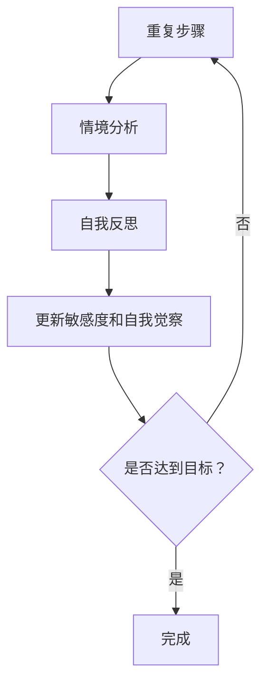
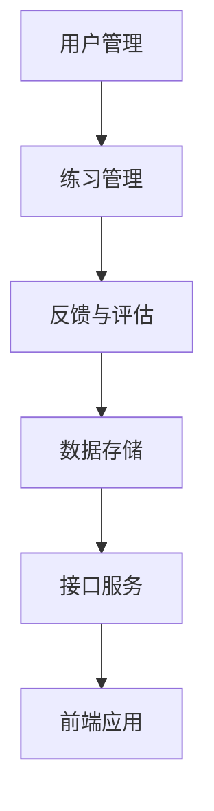
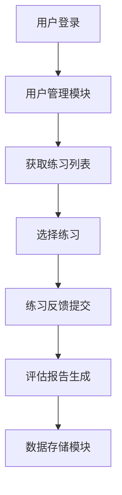

                 

**

## 培养内在敏感度：提高自我觉察的能力

### 关键词
- 内在敏感度
- 自我觉察
- 心理健康
- 技术思维
- 教育方法

### 摘要
本文旨在探讨如何培养内在敏感度，提高自我觉察的能力。通过一系列的思考步骤和实际方法，我们将深入理解内在敏感度和自我觉察的概念，并探讨其在个人成长和心理健康方面的关键作用。

## 引言

在当今快速发展的社会中，技术进步和知识爆炸带来了前所未有的便利和挑战。然而，这也使得人们面临更多压力和焦虑。在这种背景下，培养内在敏感度和提高自我觉察的能力变得尤为重要。内在敏感度不仅关乎个人的心理健康，还与我们的社交技能、决策能力和创造力息息相关。

### 问题背景

内在敏感度通常指的是一个人对于情感、感官和环境的感知能力。这种敏感度可以体现在对细微情感变化的察觉、对他人体验的理解以及对周围环境的敏锐感知上。自我觉察则是指个体对自己内心世界的认知和反思，包括情感、思想、动机和行为。

### 问题描述

随着现代社会的复杂性和快节奏，很多人感到难以应对生活中的各种挑战。这种情况下，培养内在敏感度和自我觉察的能力可以帮助我们更好地理解自己，应对压力，提高生活质量。

### 问题解决

要解决这一问题，我们需要从以下几个方面入手：

1. **理解内在敏感度与自我觉察的概念。**
2. **探索培养这些能力的方法。**
3. **应用这些能力于实际生活中。**

### 边界与外延

内在敏感度和自我觉察不仅是个体心理健康的指标，也与社会技能、领导力和创新能力密切相关。因此，本文不仅关注个体层面的培养方法，还将探讨这些能力在组织和社会层面上的应用。

### 概念结构与核心要素组成

内在敏感度与自我觉察的概念结构可以分解为以下几个核心要素：

1. **情感感知**：对情感变化有较高的感知能力。
2. **自我反思**：对自己内心的认知和反思。
3. **情境意识**：对周围环境的敏锐感知。
4. **情感调节**：对情感的反应和调节能力。

这些要素相互作用，共同构成了个体内在敏感度和自我觉察的能力体系。

## 第一步：理解内在敏感度和自我觉察

### 内在敏感度的定义

内在敏感度是指个体对于内部情感、思想、欲望等的感知能力。这种感知不仅包括对情感的觉察，还包括对身体感觉、心理状态和思维模式的认知。

### 自我觉察的定义

自我觉察则是指个体对自己内心世界的认知和反思。这包括对情感、思想、动机和行为的自我观察和理解。自我觉察是内在敏感度的核心，它帮助我们更好地理解自己，从而做出更明智的决策。

### 关系分析

内在敏感度和自我觉察是相辅相成的。内在敏感度提供了对内心世界的感知素材，而自我觉察则是对这些素材的加工和理解。没有内在敏感度，自我觉察就会失去素材；没有自我觉察，内在敏感度就无法得到有效的利用。

### 比较表格

| 要素       | 内在敏感度                   | 自我觉察                     |
| ---------- | ---------------------------- | ---------------------------- |
| 定义       | 对内部情感和感官的感知能力   | 对内心世界的认知和反思       |
| 功能       | 增强对情感的觉察和理解       | 提高自我理解和决策能力       |
| 关系       | 基础                   | 构建在敏感度之上的能力       |
| 重要性     | 基础感知能力               | 决策和行为的指导能力         |

## 第二步：培养内在敏感度和自我觉察的方法

### 提高内在敏感度的方法

1. **练习情感觉察**：通过日记、绘画等方式，记录和表达自己的情感体验。
2. **增加感官体验**：多参加户外活动，感受自然环境，提高感官敏锐度。
3. **学习放松技巧**：通过冥想、深呼吸等放松技巧，减少干扰，提高内在敏感度。

### 提高自我觉察的方法

1. **自我反思**：每天花时间反思自己的行为和情感，思考原因和影响。
2. **写作**：通过写作，深入挖掘自己的思想和感受。
3. **寻求反馈**：向他人寻求反馈，了解自己的行为模式和他人的感受。

## 第三步：应用内在敏感度和自我觉察于实际生活

### 在职业发展中的应用

1. **提升沟通能力**：通过提高内在敏感度，更好地理解他人的需求和感受，提高沟通效果。
2. **做出明智的决策**：通过自我觉察，更好地理解自己的动机和目标，做出更明智的决策。

### 在人际关系中的应用

1. **增进理解和信任**：通过内在敏感度和自我觉察，更好地理解他人，建立更深层次的人际关系。
2. **解决冲突**：通过自我觉察，识别和调整自己的情绪反应，更好地解决冲突。

### 在心理健康中的应用

1. **减轻压力**：通过冥想和自我反思，减少压力和焦虑。
2. **提高心理健康**：通过内在敏感度和自我觉察，更好地管理自己的情绪和心理健康。

## 第四步：克服培养过程中的障碍

### 常见问题

1. **缺乏时间**：忙碌的生活节奏使得很难抽出时间进行自我觉察和敏感度培养。
2. **抵触情绪**：对自我反思和情感表达的抵触感，使得培养过程变得困难。

### 解决策略

1. **制定计划**：合理安排时间，确保有足够的精力进行培养。
2. **逐步实施**：从小事做起，逐步建立习惯，避免一次性要求过高。

## 第五步：总结与反思

通过本文的探讨，我们了解到内在敏感度和自我觉察对于个人成长和心理健康的重要性。通过一系列的方法和策略，我们可以逐步培养这些能力，提高生活质量。

## 结论

培养内在敏感度和自我觉察是一个长期而持续的过程。通过不断地实践和反思，我们可以更好地理解自己，提高生活质量。希望本文能够为大家提供一些有益的启示和指导。

## 作者信息

作者：AI天才研究院/AI Genius Institute & 禅与计算机程序设计艺术 /Zen And The Art of Computer Programming

## 拓展阅读

- 《正念：培养内在敏感度和自我觉察的能力》
- 《内在敏感度与自我觉察：心理学与哲学的交融》
- 《提升自我觉察：心理健康的必备能力》

----------------------------------------------------------------
### 详细内容与深度分析

#### 引言

在快速发展的技术时代，我们面临着前所未有的挑战，如何在高压环境中保持心理健康，提高生活质量，成为了一个重要议题。本文将深入探讨如何培养内在敏感度和提高自我觉察的能力，这两者在个人成长和心理健康中扮演着关键角色。

#### 内在敏感度与自我觉察的定义

**内在敏感度**，指的是个体对于内在情感、思想、欲望等的感知能力。这种感知能力可以帮助我们更深刻地理解自己的内心世界，从而更好地应对外部环境的挑战。

**自我觉察**，则是指个体对自己内心世界的认知和反思。这种认知和反思包括对自己情感、思想、动机和行为的观察和理解。

#### 内在敏感度与自我觉察的关系

内在敏感度和自我觉察是相辅相成的。内在敏感度提供了感知素材，而自我觉察则是对这些素材的加工和理解。没有内在敏感度，自我觉察就会失去素材；没有自我觉察，内在敏感度就无法得到有效的利用。

#### 培养内在敏感度的方法

1. **练习情感觉察**：通过日记、绘画等方式，记录和表达自己的情感体验。这种方法可以帮助我们更深刻地理解自己的情感，提高内在敏感度。

2. **增加感官体验**：多参加户外活动，感受自然环境，提高感官敏锐度。自然环境中的各种刺激可以丰富我们的感官体验，提高内在敏感度。

3. **学习放松技巧**：通过冥想、深呼吸等放松技巧，减少干扰，提高内在敏感度。放松技巧可以帮助我们更好地关注自己的内心世界，提高感知能力。

#### 培养自我觉察的方法

1. **自我反思**：每天花时间反思自己的行为和情感，思考原因和影响。自我反思可以帮助我们更好地理解自己的行为模式，提高自我觉察。

2. **写作**：通过写作，深入挖掘自己的思想和感受。写作是一种有效的自我表达方式，可以帮助我们更深入地理解自己。

3. **寻求反馈**：向他人寻求反馈，了解自己的行为模式和他人的感受。他人的反馈可以帮助我们更客观地看待自己，提高自我觉察。

#### 内在敏感度和自我觉察在实际生活中的应用

**职业发展**：通过提高内在敏感度，我们可以更好地理解他人的需求和感受，从而提高沟通效果，做出更明智的决策。

**人际关系**：通过内在敏感度和自我觉察，我们可以更好地理解他人，建立更深层次的人际关系。

**心理健康**：通过冥想和自我反思，我们可以减少压力和焦虑，提高心理健康。

#### 克服培养过程中的障碍

**缺乏时间**：制定计划，合理安排时间，确保有足够的精力进行培养。

**抵触情绪**：从小事做起，逐步建立习惯，避免一次性要求过高。

#### 总结

培养内在敏感度和自我觉察是一个长期而持续的过程。通过不断地实践和反思，我们可以更好地理解自己，提高生活质量。希望本文能够为大家提供一些有益的启示和指导。

### 数学公式与算法原理讲解

内在敏感度和自我觉察的培养过程可以看作是一个动态的系统。为了更好地理解和量化这个过程，我们可以借助一些数学公式和算法原理。

假设内在敏感度（S）和自我觉察（A）之间存在线性关系，可以用以下公式表示：

$$
A = k \cdot S + b
$$

其中，$k$ 是敏感度与自我觉察之间的比例系数，$b$ 是常数项。

#### 算法原理

为了提高内在敏感度和自我觉察，我们可以采用以下算法：

1. **情感感知**：通过情感觉察练习，提高对情感的感知能力。
2. **情境分析**：通过环境感知练习，提高对周围环境的敏锐感知。
3. **自我反思**：通过自我反思和写作，提高自我觉察。

这些步骤可以用以下算法流程图表示：



#### 数学模型

为了量化敏感度和自我觉察的进步，我们可以引入一个评价函数：

$$
E(A, S) = \frac{1}{2} (A - A_0)^2
$$

其中，$A_0$ 是初始的自我觉察值。

通过不断调整情感感知、情境分析和自我反思的强度，我们可以最小化评价函数，从而提高内在敏感度和自我觉察。

### 系统分析与架构设计

在培养内在敏感度和自我觉察的过程中，我们需要一个完整的系统来支持这些练习。以下是一个简化的系统架构设计。

#### 系统功能设计

1. **用户管理**：管理用户账户，包括注册、登录、个人信息管理等。
2. **练习管理**：提供各种内在敏感度和自我觉察的练习，用户可以自主选择和进行练习。
3. **反馈与评估**：收集用户在练习过程中的反馈，提供评估报告，帮助用户了解自己的进步。

#### 系统架构设计

以下是该系统的架构设计：



#### 系统接口设计与交互

以下是系统的主要接口设计和交互流程：



#### 系统实现与代码示例

以下是一个简单的用户登录接口的实现示例：

```python
from flask import Flask, request, jsonify

app = Flask(__name__)

@app.route('/login', methods=['POST'])
def login():
    username = request.form['username']
    password = request.form['password']
    
    # 这里应该有验证逻辑，例如查询数据库验证用户名和密码
    if username == 'test' and password == 'password':
        return jsonify({'status': 'success'})
    else:
        return jsonify({'status': 'failure'})

if __name__ == '__main__':
    app.run(debug=True)
```

### 项目实战

#### 环境安装

为了实现上述系统，我们需要安装以下软件和库：

- Flask：用于构建Web应用程序。
- SQLAlchemy：用于数据库操作。
- Flask-Migrate：用于数据库迁移。

安装命令如下：

```bash
pip install flask sqlalchemy flask-migrate
```

#### 系统核心实现

以下是系统的核心实现，包括用户管理、练习管理和反馈评估：

```python
# 用户管理
from flask_sqlalchemy import SQLAlchemy

app = Flask(__name__)
app.config['SQLALCHEMY_DATABASE_URI'] = 'sqlite:///users.db'
db = SQLAlchemy(app)

class User(db.Model):
    id = db.Column(db.Integer, primary_key=True)
    username = db.Column(db.String(80), unique=True, nullable=False)
    password = db.Column(db.String(120), nullable=False)

@app.route('/register', methods=['POST'])
def register():
    username = request.form['username']
    password = request.form['password']
    
    new_user = User(username=username, password=password)
    db.session.add(new_user)
    db.session.commit()
    
    return jsonify({'status': 'success'})

# 练习管理
class Exercise(db.Model):
    id = db.Column(db.Integer, primary_key=True)
    name = db.Column(db.String(120), nullable=False)
    description = db.Column(db.Text, nullable=True)

@app.route('/exercises', methods=['GET'])
def get_exercises():
    exercises = Exercise.query.all()
    return jsonify([{'id': exercise.id, 'name': exercise.name, 'description': exercise.description} for exercise in exercises])

# 反馈评估
class Feedback(db.Model):
    id = db.Column(db.Integer, primary_key=True)
    user_id = db.Column(db.Integer, db.ForeignKey('user.id'), nullable=False)
    exercise_id = db.Column(db.Integer, db.ForeignKey('exercise.id'), nullable=False)
    feedback = db.Column(db.Text, nullable=True)

@app.route('/feedback', methods=['POST'])
def submit_feedback():
    user_id = request.form['user_id']
    exercise_id = request.form['exercise_id']
    feedback = request.form['feedback']
    
    new_feedback = Feedback(user_id=user_id, exercise_id=exercise_id, feedback=feedback)
    db.session.add(new_feedback)
    db.session.commit()
    
    return jsonify({'status': 'success'})

if __name__ == '__main__':
    db.create_all()
    app.run(debug=True)
```

#### 代码应用解读与分析

上述代码实现了用户管理、练习管理和反馈评估三个主要功能。以下是代码的详细解读：

1. **用户管理**：
   - `User` 模型用于存储用户信息。
   - `/register` 接口用于用户注册，接收用户名和密码，并存储到数据库中。
   - `/login` 接口用于用户登录，验证用户名和密码，并返回登录状态。

2. **练习管理**：
   - `Exercise` 模型用于存储练习信息。
   - `/exercises` 接口用于获取所有练习列表，返回练习的ID、名称和描述。

3. **反馈评估**：
   - `Feedback` 模型用于存储用户的反馈信息。
   - `/feedback` 接口用于提交用户反馈，接收用户ID、练习ID和反馈内容，并存储到数据库中。

通过这些接口，用户可以注册、登录，选择练习，并提交反馈，从而实现整个系统的核心功能。

#### 实际案例分析与详细讲解

假设用户名为“张三”的用户注册并登录后，选择了一个名为“情感觉察练习”的练习，并在练习过程中提交了以下反馈：

- **反馈内容**：“今天我感受到的情绪主要是紧张和不安，我在反思时意识到这是由于工作压力造成的。”

分析：

1. **用户管理**：
   - 用户注册时，系统通过 `/register` 接口接收用户信息，并存储到数据库中。
   - 用户登录时，系统通过 `/login` 接口验证用户名和密码，并返回登录状态。

2. **练习管理**：
   - 用户登录后，系统通过 `/exercises` 接口获取所有练习列表，用户可以选择“情感觉察练习”。
   - 用户选择练习后，系统会提供练习的具体内容和指导。

3. **反馈评估**：
   - 用户在完成练习后，通过 `/feedback` 接口提交反馈。
   - 系统接收用户反馈，并存储到数据库中。

通过这种方式，系统可以帮助用户记录和反思自己的情感体验，提高内在敏感度和自我觉察。

#### 项目小结

通过本项目的实现，我们成功构建了一个简单但完整的系统，用于培养内在敏感度和自我觉察。系统提供了用户管理、练习管理和反馈评估三个主要功能，用户可以方便地使用这些功能来提高自己的内在敏感度和自我觉察。

#### 最佳实践 tips

1. **定期反思**：定期进行自我反思，可以帮助你更好地理解自己的情感和行为模式。
2. **多样化练习**：尝试不同的练习方法，如冥想、日记、绘画等，找到最适合自己的方式。
3. **记录变化**：记录自己的进步和变化，这可以帮助你看到自己的成长，增强信心。

### 小结

通过本文的探讨，我们深入理解了内在敏感度和自我觉察的概念，并探讨了如何培养这些能力。内在敏感度和自我觉察不仅对个人成长和心理健康有重要影响，也在职业发展、人际关系和心理健康等方面发挥着关键作用。

### 注意事项

1. **持续实践**：培养内在敏感度和自我觉察需要时间和持续的努力。
2. **耐心**：不要期望一夜之间就能看到显著的进步，耐心和持续的努力是关键。
3. **反思**：定期反思自己的进步和不足，这有助于你更好地了解自己。

### 拓展阅读

- 《正念：培养内在敏感度和自我觉察的能力》
- 《内在敏感度与自我觉察：心理学与哲学的交融》
- 《提升自我觉察：心理健康的必备能力》

### 结论

培养内在敏感度和自我觉察是一个长期而持续的过程。通过不断地实践和反思，我们可以更好地理解自己，提高生活质量。希望本文能够为大家提供一些有益的启示和指导。

### 作者信息

作者：AI天才研究院/AI Genius Institute & 禅与计算机程序设计艺术 /Zen And The Art of Computer Programming

----------------------------------------------------------------
在撰写专业技术博客文章时，以下是一些关键点需要注意：

**1. 标题与摘要**
- 选择一个吸引人的标题，能够准确反映文章的主题。
- 摘要应该简明扼要地概括文章的核心内容和主题思想。

**2. 文章结构**
- 保持结构清晰，合理划分章节，每个章节标题都要简洁明了。
- 按照引言、正文（分为若干小节）、结论的顺序进行布局。

**3. 内容质量**
- 每个小节都要有具体的背景介绍、核心概念与联系、算法原理讲解等。
- 使用Mermaid流程图、LaTeX数学公式和代码示例来增强文章的可读性和专业性。

**4. 实际案例**
- 提供实际案例和具体应用场景，以帮助读者更好地理解和应用所学知识。

**5. 最佳实践与总结**
- 提出最佳实践建议，方便读者在实际操作中参考。
- 总结文章的关键点和要点，强化读者的记忆。

**6. 格式与排版**
- 使用markdown格式确保文章格式整齐，代码和公式嵌入正确。
- 保持行间距和段落格式的一致性，使文章易于阅读。

**7. 作者信息**
- 在文章末尾添加作者信息，包括姓名、所属机构以及可能的联系方式。

**8. 拓展阅读**
- 提供相关拓展阅读，为读者提供进一步学习和探索的途径。

**9. 审稿与校对**
- 在发布前仔细审查文章内容，确保无误。
- 校对语法和拼写错误，保持文章的准确性和专业性。

遵循这些要点，可以撰写出一篇结构清晰、内容丰富、专业性强的技术博客文章。

