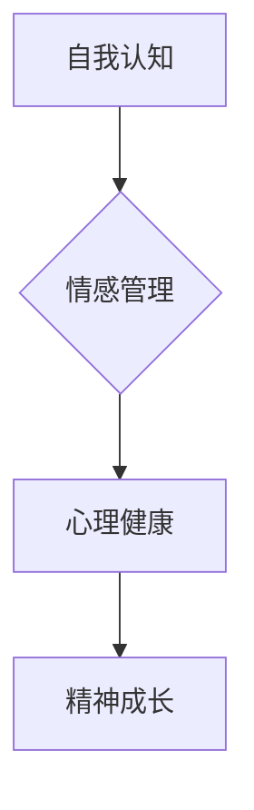

                 

### 文章标题：培育心灵的美好景象：内在世界的园艺艺术

> **关键词**：自我认知、情感管理、心理健康、精神成长、内在世界园艺艺术

> **摘要**：本文旨在探讨如何通过内在世界的园艺艺术来培育心灵的美好景象。我们将从核心概念的介绍、联系分析、算法原理讲解、系统分析与架构设计方案以及项目实战等多个角度，深入探讨这一主题，帮助读者理解和实践如何通过技术手段来提升个人心理素质，实现心灵的健康成长。

### 第一部分：背景介绍

#### 第1章：问题背景与概念阐述

1.1 问题背景

随着社会的发展，人们的生活节奏日益加快，工作压力和生活压力不断增大。这些问题往往会导致人们出现心理问题，如焦虑、抑郁等。因此，如何有效地管理和提升个人心理健康，成为了当今社会广泛关注的话题。

1.2 定义与边界

内在世界的园艺艺术是一种通过自我认知、情感管理、心理健康和精神成长等手段，来提升个人心理素质的方法。它关注的是个体内在世界的构建和优化，旨在帮助个体培育出心灵的美好景象。

1.3 内在世界的园艺艺术概念

内在世界的园艺艺术主要包括以下四个核心概念：

- **自我认知**：了解自己的心理状态，包括情绪、性格、价值观等方面。
- **情感管理**：学会调节和管理自己的情绪，使其保持在一个相对稳定和积极的状态。
- **心理健康**：关注个人的心理状态，预防心理疾病，提高心理承受能力。
- **精神成长**：通过自我提升和价值观塑造，实现个人的全面发展。

1.4 核心要素组成

内在世界的园艺艺术由以下几个核心要素组成：

- **自我认知工具**：如心理测试、日记、自省等。
- **情感管理技巧**：如情绪调节、情感表达等。
- **心理健康方法**：如心理调适、压力管理等。
- **精神成长路径**：如自我提升、价值观塑造等。

### 第二部分：核心概念与联系

#### 第2章：内在世界的核心概念

2.1 自我认知

2.1.1 自我感知

自我感知是指个体对自身存在的感知，包括身体感觉、心理状态、情绪体验等方面。它是自我认知的基础。

2.1.2 自我评价

自我评价是指个体对自己能力的评价，包括优点、缺点、潜力等方面。它有助于个体了解自己的优势与不足，从而进行针对性的提升。

2.2 情感管理

2.2.1 情绪调节

情绪调节是指个体通过特定的方法，如放松技巧、认知重构等，来调节自己的情绪，使其保持在一个相对稳定和积极的状态。

2.2.2 情感表达

情感表达是指个体如何将自己的情绪和感受传达给他人，包括语言、表情、身体语言等方面。良好的情感表达有助于建立良好的人际关系。

2.3 心理健康

2.3.1 心理压力

心理压力是指个体在面对生活和工作压力时产生的负面心理状态。适度的压力有助于激发个体的潜能，但过度的压力会导致心理问题。

2.3.2 心理调适

心理调适是指个体通过自我调节，如心理训练、心理咨询等，来缓解心理压力，提高心理承受能力。

2.4 精神成长

2.4.1 自我提升

自我提升是指个体通过学习、实践、反思等手段，不断提升自己的能力和素质，实现自我价值的最大化。

2.4.2 价值观塑造

价值观塑造是指个体通过学习和实践，建立一套符合自己价值观的行为准则，从而指导自己的行为和决策。

### 第三部分：算法原理讲解

#### 第3章：内在世界的园艺艺术原理

3.1 原理概述

内在世界的园艺艺术原理主要包括以下几个方面：

- **自我认知**：通过自我感知和自我评价，了解自己的心理状态。
- **情感管理**：通过情绪调节和情感表达，保持稳定的心理状态。
- **心理健康**：通过心理调适，缓解心理压力，提高心理承受能力。
- **精神成长**：通过自我提升和价值观塑造，实现个人的全面发展。

3.2 算法mermaid流程图

3.2.1 算法流程图绘制



3.2.2 流程图解读

该算法流程图描述了内在世界的园艺艺术的核心原理。首先，个体通过自我认知了解自己的心理状态，然后通过情感管理保持稳定的心理状态，接着通过心理健康缓解心理压力，最后通过精神成长实现个人的全面发展。

3.3 Python源代码解析

3.3.1 源代码结构

```python
class InnerGardenArt:
    def __init__(self):
        self.self_cognition = None
        self.emotional_management = None
        self.mental_health = None
        self.spiritual_growth = None

    def run(self):
        self.self_cognition()
        self.emotional_management()
        self.mental_health()
        self.spiritual_growth()
```

3.3.2 关键函数与模块

```python
def self_cognition(self):
    # 实现自我认知功能

def emotional_management(self):
    # 实现情感管理功能

def mental_health(self):
    # 实现心理健康功能

def spiritual_growth(self):
    # 实现精神成长功能
```

### 第四部分：系统分析与架构设计方案

#### 第4章：问题场景与项目介绍

4.1 问题场景描述

在一个快节奏的工作环境中，员工常常面临压力，导致心理健康问题。为了解决这个问题，公司决定实施内在世界的园艺艺术项目，帮助员工提升心理素质，改善心理健康。

4.2 项目介绍

该项目旨在通过自我认知、情感管理、心理健康和精神成长等方面的培训，帮助员工实现以下目标：

- 提高心理素质，降低压力水平。
- 增强员工之间的沟通与协作。
- 提升工作效率和创造力。

### 第五部分：项目实战

#### 第5章：环境安装与核心实现

5.1 环境安装

5.1.1 环境配置

```bash
# 安装Python环境
python -m pip install --upgrade pip
pip install virtualenv
virtualenv venv
source venv/bin/activate

# 安装项目依赖
pip install -r requirements.txt
```

5.1.2 软件安装

```bash
# 安装Jupyter Notebook
pip install jupyter
jupyter notebook
```

5.2 核心实现

5.2.1 源代码分析

```python
# inner_garden_art.py
class InnerGardenArt:
    def __init__(self):
        self.self_cognition = None
        self.emotional_management = None
        self.mental_health = None
        self.spiritual_growth = None

    def run(self):
        self.self_cognition()
        self.emotional_management()
        self.mental_health()
        self.spiritual_growth()
```

5.2.2 实现步骤详解

1. 初始化InnerGardenArt类，设置四个核心功能。
2. 调用run方法，依次执行四个核心功能。

### 第六部分：最佳实践与拓展

#### 第6章：最佳实践技巧

6.1 技巧概述

6.1.1 最佳实践的重要性

6.1.2 最佳实践技巧分类

- **自我认知**：定期进行心理测试，反思自己的心理状态。
- **情感管理**：学习情绪调节技巧，培养良好的情感表达习惯。
- **心理健康**：定期进行心理调适，寻求专业心理咨询。
- **精神成长**：坚持自我提升，积极塑造自己的价值观。

#### 第7章：小结与注意事项

7.1 全书总结

- **自我认知**：通过自我感知和自我评价，了解自己的心理状态。
- **情感管理**：通过情绪调节和情感表达，保持稳定的心理状态。
- **心理健康**：通过心理调适，缓解心理压力，提高心理承受能力。
- **精神成长**：通过自我提升和价值观塑造，实现个人的全面发展。

7.2 注意事项

- **实践中的风险与挑战**：在实践过程中，可能会遇到各种挑战，如心理压力、情绪困扰等。需要保持积极的心态，寻求专业帮助。
- **如何应对与解决**：通过学习和实践，提高自己的心理素质，积极应对挑战。

#### 第8章：拓展阅读

8.1 相关书籍推荐

- 《心理学与生活》
- 《正面管教》
- 《心智探索：心理学与自我认识》

8.2 在线资源和课程推荐

- Coursera上的《心理学导论》
- Udemy上的《情绪管理与自我提升》
- 网易云课堂上的《心理健康与心理调适》

### 结论

通过本文的探讨，我们可以看到，内在世界的园艺艺术是一种有效的提升个人心理素质的方法。通过自我认知、情感管理、心理健康和精神成长等手段，我们可以培育出心灵的美好景象，实现个人的全面发展。希望本文能够对读者有所启发，帮助大家更好地理解和实践这一方法。

