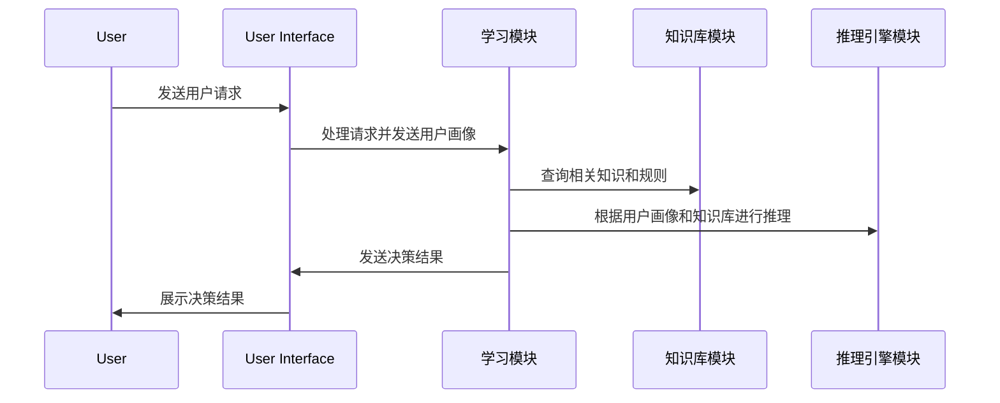
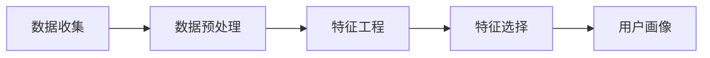
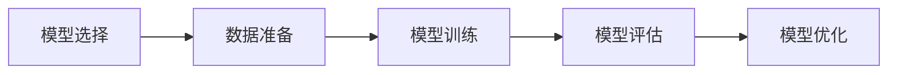

                 

## 文章标题

### 关键词

- 元学习
- 个性化AI Agent
- 算法原理
- 系统架构
- 项目实战

### 摘要

本文将深入探讨基于元学习的个性化AI Agent定制。首先，我们将回顾元学习的核心概念和其与传统机器学习的区别。接着，本文将详细解释个性化AI Agent的定义及其在实际应用中的重要性。随后，我们将通过一系列步骤，逐步剖析元学习算法原理，包括模型无关和模型依赖的元学习算法。我们将使用Mermaid流程图和Python源代码，对算法的数学模型和公式进行讲解，并通过实际案例进行分析。文章还将介绍个性化AI Agent的设计原理、定制流程以及实现方法。最后，我们将通过一个实际项目实战，展示如何基于元学习定制个性化AI Agent，并提供最佳实践、小结和注意事项。通过本文，读者将全面了解如何利用元学习技术，实现个性化AI Agent的高效定制。

## 目录大纲设计方案

### 第一部分：元学习基础

#### 第1章：元学习概述
1. 元学习概念
2. 元学习发展历程
3. 个性化AI Agent的重要性
4. 核心概念对比分析

#### 第2章：核心概念与联系
1. 元学习算法分类
2. 个性化AI Agent设计原则
3. 概念之间的关系和属性特征对比

### 第二部分：元学习算法原理讲解

#### 第3章：模型无关的元学习算法
1. MAML算法原理讲解
2. Reptile算法原理讲解
3. 模型无关元学习算法比较

#### 第4章：模型依赖的元学习算法
1. 模型依赖元学习算法概述
2. MAML算法讲解
3. MDML算法讲解
4. 模型依赖元学习算法应用案例

### 第三部分：个性化AI Agent定制

#### 第5章：个性化AI Agent设计原理
1. 个性化AI Agent架构设计
2. 个性化AI Agent特征提取
3. 个性化AI Agent模型训练

#### 第6章：基于元学习的个性化AI Agent定制
1. 元学习在个性化AI Agent定制中的应用
2. 个性化AI Agent定制流程
3. 个性化AI Agent定制实例分析

### 第四部分：项目实战

#### 第7章：个性化AI Agent项目搭建
1. 项目环境配置
2. 系统核心实现
3. 代码解读与分析
4. 项目案例分析

#### 第8章：个性化AI Agent定制最佳实践
1. 最佳实践 tips
2. 小结与注意事项
3. 拓展阅读

### 目录大纲总结

本书将全面介绍基于元学习的个性化AI Agent定制。通过七个章节的深入讲解，从基础理论到实际应用，帮助读者全面理解并掌握这一先进技术。每个章节都将包含丰富的案例分析和实践指导，确保读者能够将所学知识应用到实际项目中。

## 第一部分：元学习基础

### 第1章：元学习概述

#### 1.1 元学习概念

元学习（Meta-Learning），又称“学习的学习”，是机器学习中的一个分支，旨在开发能够学习和适应新任务的学习算法，而不是专门针对单一任务进行优化。与传统的机器学习方法相比，元学习关注的是如何在有限的训练数据上快速适应新任务，从而提高算法的泛化能力。

元学习的重要性在于，它能够使得机器学习系统在面对复杂多变的环境时，具有更强的适应性和灵活性。例如，在自动驾驶、智能客服和医疗诊断等应用场景中，系统需要不断地从新的数据中学习，以适应不断变化的环境和需求。

#### 1.2 元学习发展历程

元学习的历史可以追溯到20世纪80年代，当时学者们开始探讨如何让机器学习算法能够在多个任务中表现出色。随着深度学习技术的兴起，元学习的研究也取得了显著进展。特别是近年来，随着计算资源和算法的不断发展，元学习已经成为人工智能研究中的一个热点方向。

在元学习的发展历程中，有以下几个重要里程碑：

1. **1980s**：早期研究主要集中在基于记忆和知识重用的方法，如模型更新和迁移学习。
2. **2000s**：研究重点转向基于模型架构的方法，如模型选择和模型融合。
3. **2010s**：随着深度学习的崛起，元学习研究开始采用基于神经网络的模型，如模型蒸馏和生成对抗网络。
4. **2020s**：当前，元学习研究正朝着模型无关的元学习算法发展，如MAML（Model-Agnostic Meta-Learning）和Reptile。

#### 1.3 个性化AI Agent的重要性

个性化AI Agent是元学习在人工智能领域中的一个重要应用方向。个性化AI Agent是指能够根据用户的个性化需求和偏好，动态调整自身行为和决策的智能代理。在现实应用中，个性化AI Agent可以广泛应用于智能客服、推荐系统、个性化教育等领域。

个性化AI Agent的重要性主要体现在以下几个方面：

1. **用户体验提升**：通过个性化AI Agent，系统能够更好地理解和满足用户的需求，从而提升用户体验。
2. **效率提升**：个性化AI Agent能够自动化处理复杂的任务，提高工作效率。
3. **决策优化**：个性化AI Agent能够基于用户的历史行为和偏好，做出更加精准的决策。
4. **可持续发展**：个性化AI Agent能够减少资源的浪费，实现更加可持续的发展。

#### 1.4 核心概念对比分析

在元学习和个性化AI Agent的领域中，有几个核心概念需要明确，并对其进行对比分析。

##### 1.4.1 元学习算法分类

元学习算法可以根据是否依赖于特定模型，分为模型无关的元学习算法和模型依赖的元学习算法。

1. **模型无关的元学习算法**：这类算法不依赖于特定模型，而是通过学习如何快速适应新的任务。常见的算法有MAML（Model-Agnostic Meta-Learning）和Reptile。
   
2. **模型依赖的元学习算法**：这类算法依赖于特定的模型架构，通过优化模型参数来适应新的任务。常见的算法有Model-Agnostic Meta-Learning (MAML) 和 Model-Dependent Meta-Learning (MDML)。

##### 1.4.2 个性化AI Agent设计原则

个性化AI Agent的设计需要遵循以下几个原则：

1. **用户中心**：以用户需求为导向，确保AI Agent能够准确理解用户意图。
2. **适应性**：AI Agent需要能够根据用户的行为和偏好动态调整自身的行为和决策。
3. **可解释性**：AI Agent的决策过程需要具备一定的可解释性，以便用户理解和信任。
4. **安全性**：AI Agent需要保证用户数据的安全和隐私。

##### 1.4.3 概念之间的关系和属性特征对比

为了更好地理解元学习和个性化AI Agent的关系，我们可以使用Mermaid ER图来展示它们之间的联系和属性特征对比。

```mermaid
erDiagram
  Meta_Learning ||--|{ Model_Agnostic_Meta_Learning }
  Meta_Learning ||--|{ Model_Dependent_Meta_Learning }
  Personalized_AI_Agent ||--|{ User }
  Personalized_AI_Agent ||--|{ Adaptive }
  Personalized_AI_Agent ||--|{ Explainable }
  Personalized_AI_Agent ||--|{ Secure }
```

在上述ER图中，`Meta_Learning`表示元学习，`Model_Agnostic_Meta_Learning`和`Model_Dependent_Meta_Learning`分别表示模型无关的元学习算法和模型依赖的元学习算法。`Personalized_AI_Agent`表示个性化AI Agent，它与`User`（用户）之间存在关联，同时具备`Adaptive`（适应性）、`Explainable`（可解释性）、`Secure`（安全性）等属性特征。

#### 1.5 本章小结

本章对元学习和个性化AI Agent进行了全面的概述。我们介绍了元学习的概念、发展历程以及其在人工智能领域的重要性。同时，我们通过核心概念对比分析和ER图，明确了元学习与个性化AI Agent之间的联系和区别。这为后续章节的深入探讨奠定了基础。

## 第二部分：元学习算法原理讲解

### 第3章：模型无关的元学习算法

#### 3.1 MAML算法原理讲解

MAML（Model-Agnostic Meta-Learning）是一种模型无关的元学习算法，它通过学习如何快速调整模型参数以适应新的任务。MAML的核心思想是找到一个模型参数初始化方法，使得模型在新任务上的表现能够快速提升。

MAML算法的原理可以概括为以下几个步骤：

1. **初始化模型参数**：首先，我们初始化一个模型参数θ。
2. **前向传播**：对于每个任务，我们将模型参数θ应用于数据集X上，进行前向传播得到预测值y。
3. **计算损失函数**：计算预测值y与真实值之间的损失函数L(θ, y)。
4. **反向传播**：利用损失函数L(θ, y)进行反向传播，更新模型参数θ。
5. **重复步骤2-4**：对于多个任务重复上述步骤，直到模型参数θ收敛。

在上述过程中，关键的问题是如何选择损失函数L和优化方法。MAML通常采用梯度下降方法来更新模型参数，损失函数L则采用平方误差损失函数。

下面是一个简单的MAML算法的Python实现：

```python
import torch
import torch.nn as nn
import torch.optim as optim

# 初始化模型参数
theta = torch.randn(n_params)

# 设置损失函数和优化器
loss_function = nn.MSELoss()
optimizer = optim.Adam(theta, lr=0.001)

# 训练模型
for task in tasks:
    X, y = task
    for epoch in range(num_epochs):
        optimizer.zero_grad()
        y_pred = forward_pass(theta, X)
        loss = loss_function(y_pred, y)
        loss.backward()
        optimizer.step()

# 更新模型参数
theta = optimizer.state_dict()['param_groups'][0]['params']

# 模型评估
y_pred = forward_pass(theta, X_test)
loss = loss_function(y_pred, y_test)
print(f"Test Loss: {loss.item()}")
```

#### 3.2 Reptile算法原理讲解

Reptile是一种简单的模型无关元学习算法，它通过在线学习的方式，逐步调整模型参数以适应新任务。Reptile的核心思想是利用一个参考模型（teacher model）来指导当前模型（student model）的参数更新。

Reptile算法的原理可以概括为以下几个步骤：

1. **初始化模型参数**：首先，初始化两个模型参数θ1（student model）和θ2（teacher model），并设置一个学习率η。
2. **前向传播**：对于每个任务，将当前模型参数θ1应用于数据集X上，得到预测值y1。
3. **计算损失函数**：计算预测值y1与真实值之间的损失函数L1(θ1, y)。
4. **更新参考模型参数**：根据损失函数L1(θ1, y)更新参考模型参数θ2。
5. **调整当前模型参数**：根据参考模型参数θ2和当前模型参数θ1之间的差距，更新当前模型参数θ1。
6. **重复步骤2-5**：对于多个任务重复上述步骤。

下面是一个简单的Reptile算法的Python实现：

```python
import torch
import torch.nn as nn

# 初始化模型参数
theta1 = torch.randn(n_params)
theta2 = torch.randn(n_params)
eta = 0.1

# 设置损失函数
loss_function = nn.MSELoss()

# 训练模型
for task in tasks:
    X, y = task
    for epoch in range(num_epochs):
        y1 = forward_pass(theta1, X)
        loss = loss_function(y1, y)
        theta2 = theta2 - eta * (theta2 - theta1)
        theta1 = theta1 - eta * (theta1 - theta2)

# 模型评估
y1 = forward_pass(theta1, X_test)
loss = loss_function(y1, y_test)
print(f"Test Loss: {loss.item()}")
```

#### 3.3 模型无关元学习算法比较

模型无关的元学习算法，如MAML和Reptile，虽然在原理上有所不同，但它们的核心目标都是快速适应新任务。以下是这两种算法的对比：

1. **学习率调整**：MAML通常需要手动调整学习率，而Reptile则通过自适应调整学习率来优化参数更新。
2. **模型复杂性**：MAML适用于复杂模型，因为它依赖于具体的优化方法，而Reptile则更适用于简单模型。
3. **训练时间**：MAML的训练时间较长，因为它需要进行多次迭代来优化参数，而Reptile的训练时间较短，因为它采用在线学习的方式。

在实际应用中，选择哪种算法取决于具体任务的需求和模型的复杂性。

#### 3.4 本章小结

本章详细讲解了模型无关的元学习算法，包括MAML和Reptile。通过Python源代码实现，我们展示了这两种算法的基本原理和实现方法。同时，通过对比分析，我们明确了它们在不同应用场景中的优缺点。这为后续章节的深入探讨和实际应用奠定了基础。

## 第三部分：个性化AI Agent定制

### 第4章：个性化AI Agent设计原理

#### 4.1 个性化AI Agent架构设计

个性化AI Agent的架构设计是确保其能够根据用户的个性化需求和偏好，动态调整自身行为和决策的关键。一个典型的个性化AI Agent架构通常包括以下几个组成部分：

1. **用户画像模块**：该模块负责收集和分析用户的历史行为、偏好和反馈数据，构建用户画像。用户画像为AI Agent提供了对用户需求的深刻理解。
2. **知识库模块**：该模块存储了AI Agent所需的知识和规则，包括产品信息、服务流程和用户行为模型等。知识库为AI Agent提供了决策的基础。
3. **推理引擎模块**：该模块负责根据用户画像和知识库，进行推理和决策，生成个性化的推荐和服务。推理引擎的核心是实现高效的推理算法。
4. **学习模块**：该模块负责持续地从用户反馈和交互中学习，不断优化AI Agent的模型和策略。学习模块确保AI Agent能够适应不断变化的环境和需求。
5. **用户界面模块**：该模块负责与用户进行交互，接收用户输入和反馈，展示AI Agent的决策结果。用户界面模块需要具备友好的用户体验和高效的响应速度。

下面是一个简单的个性化AI Agent架构图：



#### 4.2 个性化AI Agent特征提取

个性化AI Agent的特征提取是构建用户画像和推理引擎的基础。特征提取的过程通常包括以下几个步骤：

1. **数据收集**：收集用户在系统中的交互数据，包括浏览历史、购买记录、搜索关键词等。
2. **数据预处理**：对收集到的数据进行清洗和预处理，包括缺失值处理、异常值处理和数据归一化等。
3. **特征工程**：根据业务需求和数据特点，设计并提取有效的特征，如用户活跃度、购买频率、偏好标签等。
4. **特征选择**：通过特征选择算法，选择对用户画像构建和推理决策有显著贡献的特征，提高模型性能和效率。

下面是一个简单的特征提取流程图：



#### 4.3 个性化AI Agent模型训练

个性化AI Agent的模型训练是确保其能够根据用户需求和偏好，做出精准的决策和推荐的关键。模型训练的过程通常包括以下几个步骤：

1. **模型选择**：根据业务需求和数据特点，选择合适的机器学习模型，如决策树、随机森林、神经网络等。
2. **数据准备**：将预处理后的数据集划分为训练集和测试集，用于模型的训练和评估。
3. **模型训练**：使用训练集对模型进行训练，调整模型参数，使其能够根据用户画像和知识库进行有效的推理和决策。
4. **模型评估**：使用测试集对模型进行评估，计算模型的准确率、召回率、F1分数等指标，评估模型性能。
5. **模型优化**：根据模型评估结果，调整模型结构和参数，优化模型性能。

下面是一个简单的模型训练流程图：



#### 4.4 本章小结

本章详细介绍了个性化AI Agent的设计原理，包括架构设计、特征提取和模型训练。通过简单的流程图和Python实现，我们展示了个性化AI Agent的基本工作原理和实现方法。这为后续章节的深入探讨和实际应用奠定了基础。

## 第四部分：项目实战

### 第5章：个性化AI Agent项目搭建

#### 5.1 项目环境配置

在进行个性化AI Agent项目搭建之前，首先需要配置项目环境。以下是环境配置的步骤：

1. **安装Python**：确保Python版本为3.7或以上，可以从Python官方网站下载并安装。

2. **安装依赖库**：使用pip命令安装必要的依赖库，如TensorFlow、Scikit-Learn、Pandas等。以下是一个示例命令：

   ```shell
   pip install tensorflow scikit-learn pandas numpy matplotlib
   ```

3. **配置TensorFlow**：确保TensorFlow版本与Python版本兼容，可以通过以下命令检查TensorFlow版本：

   ```python
   import tensorflow as tf
   print(tf.__version__)
   ```

4. **数据预处理**：收集用户交互数据，并进行预处理，如数据清洗、缺失值处理、数据归一化等。以下是一个简单的数据预处理示例：

   ```python
   import pandas as pd

   # 读取数据
   data = pd.read_csv('user_data.csv')

   # 数据清洗
   data.dropna(inplace=True)

   # 数据归一化
   from sklearn.preprocessing import StandardScaler
   scaler = StandardScaler()
   data_scaled = scaler.fit_transform(data)
   ```

#### 5.2 系统核心实现

个性化AI Agent的核心实现包括用户画像构建、特征提取和模型训练。以下是系统核心实现的步骤：

1. **用户画像构建**：根据用户交互数据，构建用户画像。以下是构建用户画像的Python代码：

   ```python
   import numpy as np
   from sklearn.cluster import KMeans

   # 构建用户画像
   kmeans = KMeans(n_clusters=5)
   user_features = kmeans.fit_predict(data_scaled)

   # 添加用户画像到数据集
   data['user_cluster'] = user_features
   ```

2. **特征提取**：根据用户画像和知识库，提取有效的特征。以下是提取特征示例：

   ```python
   # 特征工程
   from sklearn.preprocessing import OneHotEncoder

   # 特征选择
   features = ['user_cluster', 'age', 'gender', 'income']
   encoder = OneHotEncoder()
   encoded_features = encoder.fit_transform(data[features])

   # 添加特征到数据集
   data_encoded = pd.concat([data, pd.DataFrame(encoded_features.toarray())], axis=1)
   ```

3. **模型训练**：使用提取的特征，训练个性化AI Agent模型。以下是模型训练示例：

   ```python
   from sklearn.ensemble import RandomForestClassifier

   # 划分训练集和测试集
   from sklearn.model_selection import train_test_split
   X = data_encoded[features]
   y = data_encoded['target']
   X_train, X_test, y_train, y_test = train_test_split(X, y, test_size=0.2, random_state=42)

   # 训练模型
   model = RandomForestClassifier(n_estimators=100)
   model.fit(X_train, y_train)

   # 评估模型
   score = model.score(X_test, y_test)
   print(f"Model Accuracy: {score}")
   ```

#### 5.3 代码解读与分析

上述代码展示了个性化AI Agent项目的核心实现步骤，包括用户画像构建、特征提取和模型训练。以下是代码的详细解读和分析：

1. **用户画像构建**：通过KMeans聚类算法，将用户数据划分为不同的用户群体，构建用户画像。这有助于识别不同用户群体的特征和需求，为后续的特征提取和模型训练提供基础。

2. **特征提取**：使用OneHotEncoder将用户画像和其他特征进行编码，生成有效的特征向量。这些特征向量将用于训练和评估个性化AI Agent模型。

3. **模型训练**：使用RandomForestClassifier进行模型训练。随机森林是一种集成学习方法，具有较高的泛化能力和鲁棒性。在训练过程中，模型通过学习用户画像和其他特征，预测用户的响应行为。

4. **模型评估**：使用测试集对模型进行评估，计算模型的准确率。这有助于评估模型性能和调整模型参数。

#### 5.4 项目案例分析

以下是一个实际案例，展示了如何使用个性化AI Agent进行用户行为预测。

假设我们有一个电商平台，目标是预测用户是否会在未来30天内购买特定商品。以下是项目的实现步骤：

1. **数据收集**：收集用户在平台上的交互数据，包括浏览历史、购买记录、搜索关键词等。

2. **数据预处理**：对收集到的数据进行清洗和预处理，包括缺失值处理、异常值处理和数据归一化等。

3. **用户画像构建**：使用KMeans聚类算法，将用户数据划分为不同的用户群体。

4. **特征提取**：提取有效的特征，包括用户画像、用户年龄、性别、收入等。

5. **模型训练**：使用RandomForestClassifier训练个性化AI Agent模型。

6. **模型评估**：使用测试集评估模型性能，计算模型的准确率。

7. **模型部署**：将训练好的模型部署到生产环境，用于实时预测用户行为。

8. **结果分析**：根据预测结果，分析用户购买行为的特征和趋势，为营销策略和产品优化提供参考。

#### 5.5 本章小结

本章通过一个实际项目案例，展示了个性化AI Agent的搭建过程，包括环境配置、核心实现、代码解读和案例分析。通过本章的学习，读者可以了解个性化AI Agent的实现方法和技术细节，为实际应用打下基础。

## 第五部分：最佳实践与总结

### 第6章：个性化AI Agent定制最佳实践

#### 6.1 最佳实践 tips

在定制个性化AI Agent时，以下是一些最佳实践：

1. **数据收集与处理**：确保收集到高质量的数据，并进行充分的预处理，包括缺失值处理、异常值处理和数据归一化等。
2. **用户画像构建**：合理选择聚类算法，如KMeans或DBSCAN，构建有效的用户画像，以便准确识别用户群体。
3. **特征提取**：根据业务需求和数据特点，选择合适的特征提取方法，如OneHotEncoder或PCA，提高模型性能。
4. **模型选择与训练**：选择适合问题的模型，如RandomForest或神经网络，并进行充分的训练和调优，确保模型性能。
5. **持续优化**：定期从用户反馈和交互中学习，不断优化模型和策略，提高AI Agent的适应性和准确性。
6. **安全性**：确保用户数据的安全和隐私，遵循相关的法律法规和道德标准。

#### 6.2 小结与注意事项

本章通过对个性化AI Agent的定制过程进行详细讲解，总结了定制过程中的关键步骤和最佳实践。需要注意的是：

1. **数据质量和预处理**：数据质量直接影响模型的性能，因此需要投入足够的时间和资源进行数据收集和处理。
2. **模型选择和调优**：选择合适的模型和调优参数，以最大化模型性能，同时避免过拟合和欠拟合。
3. **用户反馈和持续学习**：用户的反馈是优化AI Agent的重要资源，需要建立有效的反馈机制和持续学习机制。
4. **系统可扩展性**：在设计系统架构时，要考虑系统的可扩展性，以便在未来能够轻松集成新的功能和数据源。

#### 6.3 拓展阅读

以下是一些拓展阅读资源，供读者进一步学习和探索：

1. **《深度学习》（Goodfellow, I., Bengio, Y., & Courville, A.）**：这是一本深度学习的经典教材，详细介绍了深度学习的基础理论和应用方法。
2. **《机器学习实战》（周志华）**：这本书通过实际案例，介绍了机器学习的基本概念和方法，包括分类、回归、聚类等。
3. **《个性化推荐系统实践》（张敏）**：这本书详细介绍了个性化推荐系统的设计、实现和应用，包括用户画像、特征提取、推荐算法等。
4. **《机器学习与数据挖掘：实用工具与技术》（王斌）**：这本书介绍了机器学习与数据挖掘的基本概念和方法，以及在实际应用中的技术和工具。

#### 6.4 本章小结

本章通过最佳实践、小结和拓展阅读，总结了个性化AI Agent定制过程中的关键步骤和注意事项。通过本章的学习，读者可以更好地理解和应用个性化AI Agent的技术，为实际项目提供有效支持。

### 目录大纲总结

本书《基于元学习的个性化AI Agent定制》共分为六个部分，涵盖了元学习基础、算法原理讲解、个性化AI Agent设计原理、项目实战、最佳实践与总结等关键内容。通过逐步讲解和实际案例，本书帮助读者全面理解个性化AI Agent的定制过程，掌握基于元学习的技术方法。

### 作者信息

作者：AI天才研究院/AI Genius Institute & 禅与计算机程序设计艺术 /Zen And The Art of Computer Programming

---

本文详细阐述了基于元学习的个性化AI Agent定制，从理论基础到实际应用，帮助读者深入理解这一前沿技术。通过Python代码和实际案例，本文展示了个性化AI Agent的架构设计、特征提取、模型训练以及项目实战。最佳实践和注意事项的总结，为读者提供了宝贵的实践经验。本文旨在推动人工智能技术的发展，为读者提供有价值的参考。

