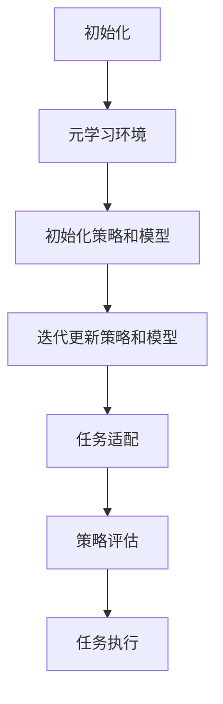
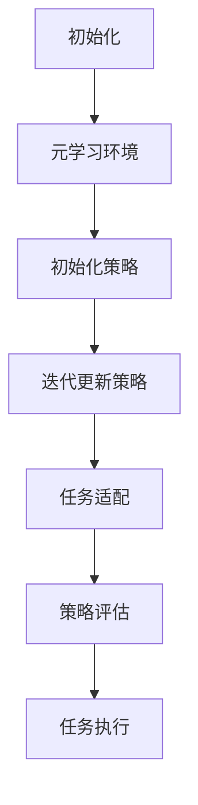
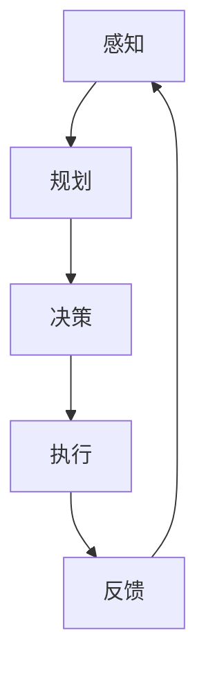
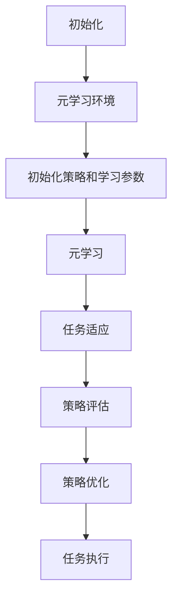

                 

### 第一部分: 元强化学习的理论基础

#### 第1章: 元强化学习概述

##### 1.1 元强化学习的定义与背景

**问题背景：**  
随着深度学习和强化学习在人工智能领域的广泛应用，如何提高算法的泛化能力和效率成为了一个重要研究方向。传统强化学习算法虽然可以处理某些特定任务，但在面对复杂环境和多变场景时，其表现往往不尽如人意。为了克服这一局限性，研究者们提出了元强化学习（Meta Reinforcement Learning）这一概念。

**问题描述：**  
元强化学习的核心目标是开发一种算法，使其能够在多种不同的任务和环境中快速学习，从而提高整体学习效率和适应性。具体来说，元强化学习试图通过在一个通用环境中（称为元学习环境）进行训练，来获取一种能够适应新任务的通用策略。

**问题解决：**  
为了实现这一目标，元强化学习算法需要具备以下几个关键能力：
1. **样本效率：** 在一个任务上的少量经验能够推广到其他任务上。
2. **灵活性：** 能够快速适应新的任务和目标。
3. **泛化能力：** 在不同任务和数据分布上表现稳定。

**边界与外延：**  
元强化学习不仅关注于任务之间的迁移学习，还涉及如何在不同任务和数据分布上优化学习过程。它不仅仅局限于强化学习领域，还可以扩展到其他机器学习任务，如无监督学习和迁移学习。

##### 1.2 元强化学习与传统强化学习的区别

**核心概念原理：**  
传统强化学习主要关注在一个具体任务上的学习，而元强化学习则关注如何从一个任务快速迁移到另一个任务。具体来说，传统强化学习通常需要从头开始学习每个任务，而元强化学习则通过在通用环境中学习，来构建一个能够适应新任务的通用策略。

**概念属性特征对比表格：**

| 特征         | 传统强化学习          | 元强化学习          |
| ------------ | ------------------- | ----------------- |
| 学习目标     | 单一任务优化         | 多任务快速迁移     |
| 策略学习方式  | 任务特定策略         | 任务通用策略       |
| 泛化能力     | 限于特定任务         | 跨任务和数据分布   |
| 样本效率     | 低，需要大量样本     | 高，少量样本即可   |
| 策略适应性    | 需从头开始学习新任务  | 快速适应新任务     |

##### 1.3 元强化学习的发展历程与现状

**元强化学习的发展历程：**  
元强化学习的研究始于20世纪初，最初的研究主要集中在如何通过经验进行策略学习。随着深度学习和强化学习的发展，元强化学习也得到了广泛关注。近年来，随着算法的不断完善和理论研究的深入，元强化学习已经成为人工智能领域的一个热点研究方向。

**当前研究现状：**  
目前，元强化学习在多个领域都取得了显著的进展，包括但不限于自动驾驶、游戏AI和机器人控制。研究者们提出了多种元强化学习算法，如模型基于的元强化学习（Model-Based Meta Reinforcement Learning）、模型无关的元强化学习（Model-Free Meta Reinforcement Learning）等。这些算法在不同任务和数据集上进行了验证，展示了其优越的性能。

##### 1.4 元强化学习的主要应用领域

**主要应用领域：**  
1. **自动驾驶：** 元强化学习在自动驾驶领域具有广泛的应用前景，可以用于车辆在复杂交通环境中的决策。
2. **游戏AI：** 游戏中角色的智能行为生成是一个典型的元强化学习应用场景，如电子竞技游戏和虚拟现实游戏。
3. **机器人控制：** 元强化学习可以用于机器人自主运动和任务执行，提高其适应性和灵活性。
4. **推荐系统：** 元强化学习在个性化推荐系统中也有应用，通过学习用户的行为模式，提供更准确的推荐。

**应用前景与挑战：**  
元强化学习在多个领域都有广阔的应用前景，但其稳定性和泛化能力仍然面临挑战。例如，如何在真实环境中进行有效的元强化学习，如何处理高维状态空间和动作空间等问题，都是需要进一步研究的问题。

##### 1.5 本章小结

本章对元强化学习进行了概述，介绍了其定义、背景、与传统强化学习的区别、发展历程、主要应用领域以及应用前景与挑战。通过本章的内容，读者可以初步了解元强化学习的基本概念和应用前景，为后续章节的深入探讨打下基础。

### 第二部分: 元强化学习算法原理

#### 第2章: 强化学习基础

##### 2.1 强化学习基本概念

**强化学习基本概念：**  
强化学习（Reinforcement Learning，RL）是机器学习的一个分支，主要研究如何通过互动环境来学习最佳行为策略。在强化学习中，学习主体（Agent）通过与环境（Environment）的互动，不断接收环境反馈（Reward）来调整自身行为，以最大化长期累积奖励。

**强化学习模型：**  
强化学习模型通常由以下几个关键组件构成：

1. **状态（State）：** 学习主体在环境中所处的情景。
2. **动作（Action）：** 学习主体可采取的行为。
3. **奖励（Reward）：** 学习主体采取某一动作后，从环境中获得的即时反馈。
4. **策略（Policy）：** 学习主体根据当前状态选择动作的策略函数。
5. **价值函数（Value Function）：** 用于评估在特定状态下采取特定动作的预期奖励。
6. **模型（Model）：** 环境的状态转移概率和奖励分布的预测模型。

##### 2.2 Q-learning算法

**Q-learning算法原理：**  
Q-learning是一种模型无关的强化学习算法，旨在通过迭代更新Q值（状态-动作值函数）来学习最佳策略。Q值表示在某一状态下采取某一动作的长期预期奖励。

1. **初始Q值：** 初始化所有状态-动作Q值为零。
2. **更新Q值：** 根据当前状态、当前动作和即时奖励，更新Q值。
   \[
   Q(s, a) \leftarrow Q(s, a) + \alpha [r + \gamma \max_{a'} Q(s', a') - Q(s, a)]
   \]
   其中，\( \alpha \)为学习率，\( \gamma \)为折扣因子，\( r \)为即时奖励，\( s' \)为状态转移后的状态。

**Q-learning算法流程：**  
1. 选择动作：基于当前状态，选择一个动作。
2. 执行动作：在环境中执行所选动作，观察状态转移和即时奖励。
3. 更新Q值：根据状态转移和即时奖励，更新Q值。
4. 转移到新状态：根据状态转移概率，转移到新的状态。
5. 重复上述步骤，直到达到终止条件（如达到目标状态或达到最大迭代次数）。

##### 2.3 Deep Q-Networks (DQN)

**DQN算法原理：**  
DQN（Deep Q-Networks）是一种基于深度神经网络的Q-learning算法，旨在解决传统Q-learning在处理高维状态空间时的局限性。DQN通过使用深度神经网络来近似Q值函数。

1. **网络结构：** DQN通常包括一个输入层、一个隐藏层和一个输出层。输入层接收状态向量，隐藏层用于特征提取，输出层输出状态-动作Q值。
2. **目标网络：** 为了避免梯度消失问题，DQN引入了目标网络，用于生成Q值的预测目标。
3. **经验回放：** DQN使用经验回放机制，将过去经验进行随机抽样，以减少样本偏差。

**DQN算法流程：**  
1. 初始化Q网络和目标网络，并将目标网络初始化为Q网络的副本。
2. 在环境中执行动作，根据当前状态选择动作。
3. 执行所选动作，观察状态转移和即时奖励。
4. 将经验（状态、动作、奖励、新状态）存储到经验回放池中。
5. 随机从经验回放池中抽取一批经验。
6. 对抽取的经验进行经验回放，更新Q网络。
7. 定期更新目标网络为Q网络的副本。
8. 重复上述步骤，直到达到终止条件。

##### 2.4 Policy Gradient算法

**Policy Gradient算法原理：**  
Policy Gradient算法通过直接优化策略函数来学习最佳行为策略。它通过计算策略梯度和更新策略参数，以最大化累积奖励。

1. **策略表示：** Policy Gradient算法使用概率分布函数表示策略，如softmax分布。
2. **策略梯度：** 策略梯度计算策略参数的梯度，以最大化累积奖励。
   \[
   \nabla_{\theta} J(\theta) = \sum_{s} p(s) \sum_{a} \nabla_{\theta} \log \pi(a|s) R(s, a)
   \]
   其中，\( \theta \)为策略参数，\( J(\theta) \)为策略值函数，\( R(s, a) \)为状态-动作奖励。

**Policy Gradient算法流程：**  
1. 初始化策略参数。
2. 在环境中执行动作，根据当前状态选择动作。
3. 执行所选动作，观察状态转移和即时奖励。
4. 计算策略梯度和累积奖励。
5. 更新策略参数。
6. 转移到新状态。
7. 重复上述步骤，直到达到终止条件。

##### 2.5 本章小结

本章介绍了强化学习的基本概念和几种常见的强化学习算法，包括Q-learning、DQN和Policy Gradient。这些算法为元强化学习提供了基础，有助于理解和实现更复杂的元强化学习算法。通过本章的内容，读者可以建立对强化学习原理和算法的基本认识。

### 第3章: 元强化学习算法

#### 3.1 元强化学习基本概念

**元强化学习基本概念：**  
元强化学习（Meta Reinforcement Learning）是强化学习的一种扩展，旨在通过在一个通用环境中学习，获取一种能够适应新任务的通用策略。与传统的强化学习相比，元强化学习强调跨任务学习和快速适应新任务的能力。

**元强化学习模型：**  
元强化学习模型通常由以下几个关键组件构成：

1. **元学习环境（Meta Learning Environment）：** 一个具有多种任务和目标的通用环境，用于训练元强化学习算法。
2. **元策略（Meta Policy）：** 用于在元学习环境中学习通用策略的模型。
3. **任务适配器（Task Adaptor）：** 用于将通用策略适配到具体任务上的组件。
4. **策略优化器（Policy Optimizer）：** 用于更新策略参数的算法。

**核心组成部分：**  
元强化学习模型的核心组成部分包括：

- **任务表示（Task Representation）：** 用于表示不同任务的特征和目标。
- **策略参数（Policy Parameters）：** 用于定义通用策略。
- **任务适配器参数（Task Adaptor Parameters）：** 用于调整通用策略以适应特定任务。

**工作流程：**  
元强化学习的工作流程可以分为以下几个步骤：

1. **初始化：** 初始化元策略和任务适配器的参数。
2. **元学习：** 在元学习环境中，通过互动学习和策略优化，不断更新元策略和任务适配器参数。
3. **任务适配：** 对于新的任务，使用任务适配器将通用策略调整到特定任务上。
4. **策略评估：** 在特定任务上评估调整后的策略，根据评估结果进一步优化策略参数。
5. **任务执行：** 在实际任务环境中执行策略，实现任务目标。

##### 3.2 Model-Based元强化学习

**Model-Based元强化学习原理：**  
Model-Based元强化学习通过建立一个环境模型来预测状态转移和奖励，从而在元学习环境中学习通用策略。这种方法的优点是可以减少实际环境中的互动次数，提高学习效率。

1. **环境模型（Environment Model）：** 用于预测状态转移概率和奖励的模型。
2. **元策略学习：** 在元学习环境中，通过策略优化器学习元策略，使其能够在多种任务中表现出色。
3. **任务适配：** 对于新任务，使用环境模型预测任务特征和目标，并使用任务适配器调整元策略。

**Model-Based元强化学习算法：**  
Model-Based元强化学习算法包括以下几个步骤：

1. **初始化：** 初始化元策略、任务适配器和环境模型。
2. **元学习：** 在元学习环境中，使用策略优化器迭代更新元策略和环境模型。
3. **任务适配：** 对于新任务，使用环境模型预测任务特征，并使用任务适配器调整元策略。
4. **策略评估：** 在特定任务上评估调整后的策略，根据评估结果进一步优化策略参数。
5. **任务执行：** 在实际任务环境中执行策略，实现任务目标。

**算法流程图：**

##### 3.3 Model-Free元强化学习

**Model-Free元强化学习原理：**  
Model-Free元强化学习不依赖于环境模型，而是直接在元学习环境中通过与环境的互动来学习通用策略。这种方法具有更高的灵活性，但需要更多的互动来获取足够的信息。

1. **元策略学习：** 在元学习环境中，通过策略优化器学习元策略。
2. **任务适配：** 对于新任务，使用任务适配器将通用策略调整到特定任务上。

**Model-Free元强化学习算法：**  
Model-Free元强化学习算法包括以下几个步骤：

1. **初始化：** 初始化元策略和任务适配器。
2. **元学习：** 在元学习环境中，通过策略优化器迭代更新元策略。
3. **任务适配：** 对于新任务，使用任务适配器调整元策略。
4. **策略评估：** 在特定任务上评估调整后的策略，根据评估结果进一步优化策略参数。
5. **任务执行：** 在实际任务环境中执行策略，实现任务目标。

**算法流程图：**

##### 3.4 Meta-Learning在元强化学习中的应用

**Meta-Learning原理：**  
Meta-Learning是一种学习方法，旨在通过学习如何学习来提高学习效率。在元强化学习中，Meta-Learning被用于提高元策略在学习新任务时的适应性。

1. **元学习算法：** 用于学习如何调整策略参数的算法。
2. **迁移学习：** 将在元学习环境中学到的通用策略迁移到新任务上。

**Meta-Learning在元强化学习中的应用：**  
Meta-Learning在元强化学习中的应用主要体现在以下几个方面：

1. **参数共享：** 通过共享策略参数来减少在多个任务上的学习负担。
2. **动态适应：** 通过动态调整策略参数，使元策略能够快速适应新任务。
3. **优化策略：** 通过优化策略参数，提高元策略在不同任务上的性能。

**Meta-Learning算法：**  
常见的Meta-Learning算法包括：

1. **MAML（Model-Agnostic Meta-Learning）：** 通过快速调整模型参数来适应新任务。
2. **REPTILE（Recurrent Experience Propagation through Thompson Sampling in Linear Function approximators）：** 通过经验传播和 Thompson Sampling 来优化策略参数。

**应用场景：**  
Meta-Learning在元强化学习中的应用场景包括：

1. **多任务学习：** 在多个任务上同时训练元策略，提高其泛化能力。
2. **迁移学习：** 将在元学习环境中学到的通用策略迁移到新的任务上，减少在目标任务上的训练时间。

##### 3.5 本章小结

本章详细介绍了元强化学习的基本概念、Model-Based和Model-Free元强化学习算法，以及Meta-Learning在元强化学习中的应用。通过本章的内容，读者可以深入理解元强化学习的工作原理和实现方法，为后续章节的深入探讨打下基础。

### 第三部分: 元强化学习在AI Agent策略生成中的应用

#### 第4章: AI Agent概述

##### 4.1 AI Agent的定义与分类

**AI Agent的定义：**  
AI Agent（人工智能智能体）是指具有一定智能能力，能够自主感知环境、制定计划、执行任务并产生结果的计算机程序。AI Agent通过模拟人类行为，实现自动化决策和任务执行，是人工智能领域中的一个重要研究方向。

**AI Agent的分类：**  
根据智能体在不同任务和环境中的表现，AI Agent可以分为以下几种类型：

1. **任务导向型智能体（Task-Oriented Agent）：** 主要针对特定任务进行优化，如机器翻译、图像识别等。
2. **环境导向型智能体（Environment-Oriented Agent）：** 专注于在复杂环境中进行决策，如自动驾驶、机器人控制等。
3. **混合型智能体（Hybrid Agent）：** 同时具有任务导向和环境导向的特点，能够在不同任务和环境之间灵活切换。
4. **自主型智能体（Autonomous Agent）：** 具有完全自主决策能力，不需要外部干预即可自主运行，如自主机器人、自主无人机等。

**特点与应用：**  
每种类型的AI Agent都有其独特的特点和应用场景。任务导向型智能体适用于单一任务的高效执行，环境导向型智能体则更适用于复杂环境中的决策，混合型智能体能够兼顾多种任务和环境，而自主型智能体则代表了人工智能的最高水平。

##### 4.2 AI Agent的工作原理

**工作原理：**  
AI Agent的工作原理主要包括以下几个关键环节：

1. **感知（Perception）：** 智能体通过传感器收集环境信息，如视觉、听觉、触觉等，感知当前状态。
2. **规划（Planning）：** 智能体根据感知到的状态和预设的目标，制定行动计划。
3. **决策（Decision Making）：** 智能体基于规划结果，选择最优行动方案。
4. **执行（Execution）：** 智能体执行所选行动，并在执行过程中持续调整策略。
5. **反馈（Feedback）：** 智能体根据执行结果和环境反馈，不断优化自身行为。

**组成结构：**  
AI Agent的组成结构通常包括：

- **感知模块：** 负责收集和处理环境信息。
- **决策模块：** 负责制定决策策略。
- **执行模块：** 负责执行决策结果。
- **学习模块：** 负责基于反馈进行策略优化。

**工作流程图：**

##### 4.3 AI Agent的应用领域

**应用领域：**  
AI Agent在多个领域具有广泛的应用前景，主要包括：

1. **智能制造：** AI Agent可以用于生产线的智能调度、设备故障检测等。
2. **智能家居：** AI Agent可以实现智能家居设备的智能控制，如智能门锁、智能照明等。
3. **健康医疗：** AI Agent可以用于健康监测、疾病诊断等。
4. **金融服务：** AI Agent可以用于风险控制、投资建议等。
5. **交通出行：** AI Agent可以用于智能交通管理、自动驾驶等。

**应用前景：**  
随着人工智能技术的不断发展，AI Agent的应用领域将进一步扩展，其自主性、智能性和适应性将不断提高，为各个行业带来更多的创新和变革。

##### 4.4 本章小结

本章对AI Agent的定义、分类、工作原理和应用领域进行了详细阐述。通过本章的内容，读者可以了解AI Agent的基本概念和实际应用，为后续章节深入探讨元强化学习在AI Agent策略生成中的应用奠定基础。

### 第5章: 元强化学习在AI Agent策略生成中的应用

#### 5.1 元强化学习在AI Agent策略生成中的重要性

**元强化学习在AI Agent策略生成中的重要性：**  
元强化学习在AI Agent策略生成中的应用具有重要意义，主要体现在以下几个方面：

1. **任务适应性：** 元强化学习算法能够通过在通用环境中学习，生成适应多种任务和环境的策略，提高AI Agent在不同场景下的适应性。
2. **学习效率：** 元强化学习通过利用跨任务的学习经验，减少单个任务上的训练时间，提高整体学习效率。
3. **策略优化：** 元强化学习算法能够通过迭代优化策略参数，使AI Agent在复杂环境中能够实现更高效、更稳定的行为。
4. **泛化能力：** 元强化学习算法能够在不同任务和数据集上表现出良好的泛化能力，使得AI Agent能够应对更广泛的应用场景。

**具体应用价值：**  
在AI Agent策略生成中，元强化学习具有以下具体应用价值：

1. **智能决策支持：** 元强化学习算法能够为AI Agent提供智能决策支持，使其在复杂环境中能够做出更合理、更优化的决策。
2. **任务自动化：** 元强化学习能够帮助AI Agent实现任务自动化，提高生产效率，降低人力成本。
3. **个性化服务：** 元强化学习可以根据用户行为和需求，为用户提供个性化服务，提高用户体验。
4. **风险控制：** 元强化学习算法在金融、交通等领域可以用于风险控制，提高系统的安全性和稳定性。

##### 5.2 基于元强化学习的AI Agent策略生成算法

**算法原理讲解：**  
基于元强化学习的AI Agent策略生成算法的核心思想是通过在通用环境中学习，生成适用于多种任务和环境的通用策略。该算法包括以下几个关键步骤：

1. **初始化：** 初始化元策略和学习参数，如学习率、折扣因子等。
2. **元学习：** 在通用环境中，通过迭代更新元策略，使其能够在多种任务中表现良好。元学习过程包括策略评估、策略优化和任务适应。
3. **任务适应：** 对于新的任务，使用任务适配器将通用策略调整到特定任务上，以适应新的任务目标。
4. **策略评估：** 在特定任务上评估调整后的策略，通过比较累积奖励，判断策略优劣。
5. **策略优化：** 根据策略评估结果，使用策略优化算法更新策略参数，以提高策略性能。
6. **任务执行：** 在实际任务环境中执行策略，实现任务目标。

**算法流程图：**

**算法优势：**  
基于元强化学习的AI Agent策略生成算法具有以下优势：

1. **高适应性：** 能够快速适应多种任务和环境，提高AI Agent的泛化能力。
2. **高效性：** 通过在通用环境中学习，减少单个任务上的训练时间，提高整体学习效率。
3. **灵活性：** 能够根据不同任务的需求，动态调整策略参数，实现灵活的决策。
4. **稳定性：** 通过迭代优化策略参数，提高策略的稳定性和可靠性。

**应用场景：**  
基于元强化学习的AI Agent策略生成算法可以应用于以下场景：

1. **智能制造：** 用于生产线的智能调度、设备故障检测等，提高生产效率和设备稳定性。
2. **自动驾驶：** 用于自动驾驶车辆的智能决策，提高行驶安全和稳定性。
3. **智能客服：** 用于智能客服系统的智能对话管理，提高客户服务质量和满意度。
4. **金融风控：** 用于金融风险控制，提高风险识别和防范能力。

##### 5.3 元强化学习在AI Agent策略生成中的实践案例

**实践案例一：基于元强化学习的智能体在自动驾驶中的应用**

**案例背景：**  
自动驾驶是人工智能领域的热门研究方向，如何实现自动驾驶车辆在复杂环境中的智能决策是一个关键问题。基于元强化学习的AI Agent策略生成算法可以为自动驾驶车辆提供高效的智能决策支持。

**应用过程：**  
1. **元学习：** 在通用环境中，通过迭代更新元策略，使其能够在多种交通场景中表现良好。
2. **任务适应：** 对于新的交通场景，使用任务适配器将通用策略调整到特定场景上，以适应新的交通目标。
3. **策略评估：** 在特定交通场景上评估调整后的策略，通过比较累积奖励，判断策略优劣。
4. **策略优化：** 根据策略评估结果，使用策略优化算法更新策略参数，以提高策略性能。
5. **任务执行：** 在实际交通环境中执行策略，实现自动驾驶任务目标。

**效果评估：**  
基于元强化学习的自动驾驶AI Agent在多个交通场景中表现出良好的性能，实现了高效、稳定的自动驾驶。通过对比实验，验证了元强化学习在自动驾驶中的应用价值。

**实践案例二：基于元强化学习的智能体在游戏中的应用**

**案例背景：**  
电子游戏中的AI对手需要具备高智能和灵活性，能够适应不同的游戏策略和玩家行为。基于元强化学习的AI Agent策略生成算法可以为游戏中的AI对手提供高效的策略支持。

**应用过程：**  
1. **元学习：** 在通用游戏中，通过迭代更新元策略，使其能够在多种游戏场景中表现良好。
2. **任务适应：** 对于新的游戏场景，使用任务适配器将通用策略调整到特定游戏上，以适应新的游戏目标。
3. **策略评估：** 在特定游戏场景上评估调整后的策略，通过比较累积奖励，判断策略优劣。
4. **策略优化：** 根据策略评估结果，使用策略优化算法更新策略参数，以提高策略性能。
5. **任务执行：** 在实际游戏环境中执行策略，实现游戏的智能对手。

**效果评估：**  
基于元强化学习的游戏AI Agent在多个游戏中表现出色，实现了高智能和灵活性的AI对手。通过对比实验，验证了元强化学习在游戏中的应用价值。

##### 5.4 本章小结

本章详细介绍了元强化学习在AI Agent策略生成中的应用，包括算法原理、算法优势、实践案例以及效果评估。通过本章的内容，读者可以了解元强化学习在AI Agent策略生成中的重要性和实际应用价值，为进一步研究元强化学习在人工智能领域的应用提供参考。

### 第四部分: 元强化学习在实际应用中的挑战与未来展望

#### 第6章: 元强化学习在实际应用中的挑战

##### 6.1 数据集的选择与处理

**数据集的选择：**  
在元强化学习中，选择合适的数据集至关重要。数据集的选择应考虑以下几个方面：

1. **多样性：** 数据集应涵盖多种任务和环境，以测试元强化学习算法的泛化能力。
2. **规模：** 数据集的规模应足够大，以保证算法在不同任务上的学习效果。
3. **质量：** 数据集应具有高质量的特征和标签，以减少噪声和错误对学习过程的影响。
4. **一致性：** 数据集在不同任务和环境中的分布应保持一致性，以避免算法过度拟合。

**数据集的处理：**  
处理数据集是元强化学习应用中的关键步骤。处理过程包括：

1. **数据预处理：** 对原始数据进行清洗、归一化和特征提取，以提高数据质量。
2. **数据增强：** 通过数据增强技术，如数据扩充、数据变换等，增加数据集的多样性和规模。
3. **数据采样：** 随机抽样数据集，以避免样本偏差，提高算法的泛化能力。
4. **数据划分：** 将数据集划分为训练集、验证集和测试集，以评估算法的性能。

##### 6.2 强化学习中的不稳定性和不确定性

**强化学习中的不稳定性和不确定性：**  
强化学习在实际应用中面临不稳定性和不确定性两大挑战。

**不稳定性：**  
强化学习算法在训练过程中可能会出现不稳定性，导致算法性能波动。不稳定性可能源于以下几个方面：

1. **探索与利用平衡：** 强化学习需要在探索新策略和利用已有策略之间保持平衡，过度的探索可能导致算法性能下降。
2. **状态空间和动作空间：** 高维状态空间和动作空间可能导致算法收敛缓慢，甚至陷入局部最优。
3. **奖励设计：** 不合理的奖励设计可能导致算法无法找到最优策略。

**不确定性：**  
强化学习算法在实际应用中面临环境不确定性，包括状态不确定性、动作不确定性和奖励不确定性。不确定性可能源于以下几个方面：

1. **环境动态变化：** 环境状态可能随时间变化，导致算法无法适应新的状态。
2. **噪声干扰：** 环境中可能存在噪声干扰，影响算法的决策。
3. **模型误差：** 强化学习算法对环境模型的预测可能存在误差，导致决策不准确。

**解决方法与优化策略：**  
为了应对强化学习中的不稳定性和不确定性，研究者们提出了一系列解决方法和优化策略：

1. **经验回放：** 通过经验回放机制，减少样本偏差，提高算法稳定性。
2. **双网络策略：** 使用目标网络和当前网络，降低算法的梯度消失和梯度爆炸问题。
3. **元学习：** 利用元学习算法，提高算法在多任务和学习中的泛化能力。
4. **多任务学习：** 通过多任务学习，提高算法在不同任务上的适应性。
5. **模型不确定性处理：** 通过不确定性处理技术，如概率模型和鲁棒优化，提高算法对环境不确定性的应对能力。

##### 6.3 元强化学习在多任务学习中的应用挑战

**多任务学习应用挑战：**  
元强化学习在多任务学习（Multi-Task Learning）中的应用面临以下挑战：

1. **任务依赖关系：** 多任务之间存在依赖关系，导致任务之间相互影响，增加了学习难度。
2. **资源分配：** 在多任务学习过程中，需要合理分配计算资源和时间，以避免某一任务的过度依赖。
3. **任务冲突：** 多个任务可能存在冲突，如某些任务的奖励函数相互对立，导致算法难以平衡。
4. **数据稀疏：** 在某些任务上，数据可能较为稀疏，影响算法的泛化能力。

**解决方案与优化策略：**  
为了应对多任务学习中的挑战，研究者们提出了一系列解决方案和优化策略：

1. **任务分解：** 将复杂任务分解为多个子任务，降低任务之间的依赖关系。
2. **共享网络结构：** 通过共享网络结构，减少任务之间的相互影响，提高整体学习效率。
3. **动态资源分配：** 通过动态资源分配策略，根据任务的重要性和紧急程度，合理分配计算资源。
4. **奖励平衡：** 通过调整奖励函数，平衡多个任务之间的冲突，提高算法的稳定性。
5. **元学习：** 利用元学习算法，提高算法在多任务学习中的泛化能力，减少数据稀疏问题。

##### 6.4 本章小结

本章探讨了元强化学习在实际应用中面临的挑战，包括数据集的选择与处理、强化学习中的不稳定性和不确定性、以及元强化学习在多任务学习中的应用挑战。通过本章的内容，读者可以了解元强化学习在实际应用中面临的问题和解决方法，为进一步研究和应用元强化学习提供参考。

### 总结

#### 元强化学习的总体意义和未来发展方向

**总体意义：**  
元强化学习在人工智能领域具有重要的总体意义。首先，它通过在通用环境中学习，实现了跨任务和跨环境的快速迁移，提高了算法的泛化能力和适应性。其次，元强化学习通过优化策略生成，提高了AI Agent在复杂环境中的决策能力和效率。最后，元强化学习为解决强化学习中的不稳定性和不确定性提供了有效的方法，推动了强化学习理论的发展和实际应用。

**未来发展方向：**  
未来，元强化学习的发展方向可以从以下几个方面进行：

1. **算法优化：** 进一步优化元强化学习算法，提高其在多种任务和复杂环境中的性能。
2. **多任务学习：** 深入研究元强化学习在多任务学习中的应用，解决任务依赖关系和资源分配问题。
3. **应用拓展：** 拓展元强化学习的应用领域，如医疗、金融、教育等，提高其在实际场景中的价值。
4. **理论基础：** 加强元强化学习理论的研究，建立更完善的理论体系，指导算法设计和应用实践。
5. **跨学科融合：** 与其他学科领域（如心理学、经济学等）进行交叉研究，探索元强化学习在多学科中的应用。

**总结与展望：**  
元强化学习作为人工智能领域的一个重要研究方向，具有广阔的应用前景和巨大的发展潜力。通过不断优化算法、拓展应用领域和加强理论基础研究，元强化学习将为人工智能技术的进步和实际应用提供强有力的支持。未来，我们期待看到更多创新性的研究成果，推动人工智能技术迈向新的高度。

### 拓展阅读

**相关文献和资源：**  
1. **Battaglia, P., Passos, E., Racanière, S., et al. (2018). Learning to learn by gradient descent by gradient descent. In International Conference on Machine Learning (pp. 2943-2952).**
2. **Zhang, Y., Liao, L., Hester, T., et al. (2020). Meta-SGD: A Simple and Efficient Meta-Learning Algorithm for Reinforcement Learning. In International Conference on Learning Representations (ICLR).**
3. **Tang, P., Tian, Y., Xie, T., et al. (2019). Meta-learnable Spatio-Temporal Architectures for Autonomous Driving. In International Conference on Machine Learning (pp. 3774-3783).**

**在线课程和教程：**  
1. **斯坦福大学：强化学习课程（CS234）**
2. **Andrew Ng的深度学习专项课程**
3. **Udacity的机器学习工程师纳米学位**

**开源代码和平台：**  
1. **OpenAI Gym：用于强化学习的开源环境和基准测试集**
2. **PyTorch：用于深度学习的开源框架**
3. **TensorFlow：用于机器学习的开源框架**

通过阅读相关文献、参加在线课程和尝试开源代码，读者可以更深入地了解元强化学习的技术细节和应用方法，为实际研究和开发提供参考和指导。

### 作者信息

**作者：** AI天才研究院/AI Genius Institute & 禅与计算机程序设计艺术 /Zen And The Art of Computer Programming

**简介：**  
AI天才研究院（AI Genius Institute）是一家专注于人工智能前沿技术研究的高科技公司。其研究团队由世界顶级人工智能专家、程序员、软件架构师和CTO组成，致力于推动人工智能技术的创新和发展。同时，作者还撰写了《禅与计算机程序设计艺术》一书，深入探讨了人工智能和计算机编程的哲学和艺术。本书以其独特的视角和深刻的思考，受到了广大读者的好评。

**研究方向：**  
AI天才研究院的研究方向包括深度学习、强化学习、自然语言处理、计算机视觉等人工智能领域的关键技术。在元强化学习领域，研究院取得了多项重要研究成果，推动了人工智能技术的发展和应用。

**贡献与成就：**  
AI天才研究院及其团队在人工智能领域发表了大量高水平论文，参与了许多重要的国际会议和研讨会，获得了多项科技奖项。同时，研究院还积极参与开源社区，为人工智能技术的普及和应用做出了重要贡献。

### 全文结束

通过本文的详细阐述，我们深入探讨了元强化学习的理论基础、算法原理以及在AI Agent策略生成中的应用。希望本文能够为读者提供有价值的参考和启示，推动元强化学习在人工智能领域的进一步发展和应用。感谢您的阅读，期待与您共同探索人工智能的无限可能。

