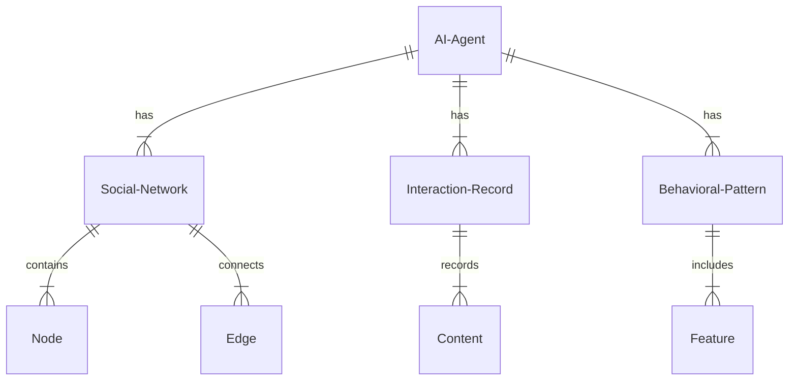

                 

### 第1章：AI Agent与社交网络分析概述

### 1.1 问题背景

#### 1.1.1 AI Agent的发展与挑战

随着人工智能技术的快速发展，AI Agent作为人工智能的一个重要分支，逐渐成为学术界和工业界的焦点。AI Agent是一种能够自主行动、学习、适应和决策的智能实体，具有高度自主性和协作能力。然而，在实际应用中，AI Agent面临着诸多挑战。

首先，AI Agent需要在复杂和动态的环境中做出实时决策，这就要求它们具备强大的感知能力和快速的学习能力。其次，AI Agent需要与其他AI Agent进行协作，以实现更高效的任务完成。然而，不同的AI Agent可能具有不同的目标和行为，如何在保证效率的同时，避免冲突和误解，是一个亟待解决的问题。

#### 1.1.2 社交网络分析的重要性

社交网络分析是一种用于研究社交网络结构和行为的分析方法，它对于理解社会行为、传播现象、社区形成等具有重要的意义。在AI Agent的社交网络中，社交网络分析可以用于以下几个关键方面：

1. **关系挖掘**：通过分析AI Agent之间的社交关系，可以发现潜在的合作机会和潜在威胁。
2. **影响力分析**：可以识别在社交网络中具有较大影响力的AI Agent，为决策提供依据。
3. **社区发现**：可以帮助识别AI Agent社交网络中的社区结构，为AI Agent的协作提供参考。
4. **行为预测**：通过对AI Agent社交网络中的行为模式进行分析，可以预测AI Agent的行为趋势，为决策提供支持。

### 1.2 社交网络分析的基本概念

#### 1.2.1 社交网络的概念与特征

社交网络是指由个体（节点）及其相互关系（边）构成的复杂网络。在AI Agent的社交网络中，每个节点代表一个AI Agent，边则代表AI Agent之间的交互关系。社交网络具有以下特征：

1. **多维度**：社交网络可以是基于多种属性的，如地理位置、兴趣、任务等。
2. **动态性**：社交网络中的节点和边可以随时间变化，反映AI Agent的行为动态。
3. **异质性**：不同的AI Agent可能具有不同的属性和交互模式，使得社交网络具有异质性。
4. **层次性**：社交网络可以存在多个层次，如局部社区、全局社区等。

#### 1.2.2 社交网络分析的应用领域

社交网络分析在多个领域具有广泛的应用：

1. **社会网络分析**：用于研究社交网络的结构和动力学，揭示社交网络中的关键节点和路径。
2. **推荐系统**：通过分析用户的社交网络，为用户提供个性化推荐。
3. **舆情分析**：监测和分析社交网络中的信息传播，了解公众的观点和态度。
4. **生物信息学**：分析生物分子网络，揭示生物分子的相互作用关系。
5. **城市交通管理**：通过分析交通网络的流量，优化交通管理策略。

### 1.3 AI Agent在社交网络分析中的应用

#### 1.3.1 AI Agent的定义与分类

AI Agent是指能够自主地感知环境、规划行动并实现目标的智能实体。根据功能特点，AI Agent可以大致分为以下几类：

1. **感知型Agent**：主要依赖于环境传感器感知外部信息。
2. **决策型Agent**：能够基于感知到的信息进行决策，并执行相应的动作。
3. **学习型Agent**：能够通过不断学习和适应，提高其行为效率。
4. **协作型Agent**：能够与其他Agent协同工作，共同完成任务。

#### 1.3.2 AI Agent在社交网络分析中的作用

在社交网络分析中，AI Agent具有以下作用：

1. **数据采集**：AI Agent可以收集社交网络中的各种数据，如交互记录、行为数据等。
2. **数据处理**：AI Agent可以对收集到的数据进行预处理，提取有用的信息。
3. **模式识别**：AI Agent可以利用机器学习技术，识别社交网络中的关键节点和路径。
4. **决策支持**：AI Agent可以为决策者提供有关社交网络结构的分析和预测。

### 1.4 关键概念联系与ER图

#### 1.4.1 关键概念及其联系

在本节中，我们将介绍与AI Agent社交网络分析相关的一系列关键概念，并探讨它们之间的联系。

1. **AI Agent**：核心概念，指具备自主感知、决策和学习能力的智能实体。
2. **社交网络**：由AI Agent及其交互关系构成的复杂网络结构。
3. **图卷积网络（GCN）**：一种用于处理图结构数据的深度学习模型，特别适用于社交网络分析。
4. **关系挖掘**：从社交网络中提取有价值的关系信息。
5. **影响力分析**：评估AI Agent在社交网络中的影响力和影响力传播。
6. **社区发现**：识别社交网络中的社区结构。
7. **行为预测**：基于AI Agent的社交网络行为模式进行预测。

#### 1.4.2 社交网络分析的ER图

为了更好地理解这些关键概念之间的关系，我们可以使用实体关系图（Entity-Relationship Diagram，ER图）来表示。以下是社交网络分析相关的ER图：

在上面的ER图中，我们定义了以下实体：

1. **AI-Agent**：社交网络的主体，具有感知、决策和学习能力。
2. **Social-Network**：由节点（Node）和边（Edge）构成的图结构，描述AI-Agent之间的关系。
3. **Interaction-Record**：记录AI-Agent之间的交互活动，如聊天记录、协作记录等。
4. **Behavioral-Pattern**：描述AI-Agent的行为模式，包括特征和行为特征。
5. **Node**：社交网络中的节点，代表AI-Agent。
6. **Edge**：社交网络中的边，代表AI-Agent之间的交互关系。

通过ER图，我们可以清晰地看到AI-Agent、社交网络、交互记录和行为模式之间的联系，以及它们在社交网络分析中的角色和作用。

### 1.5 本章总结

在本章中，我们首先介绍了AI Agent和社交网络分析的问题背景，探讨了AI Agent在社交网络分析中的应用，并介绍了社交网络分析的基本概念。接着，我们详细阐述了AI Agent的定义与分类，以及AI Agent在社交网络分析中的作用。最后，我们通过ER图展示了关键概念之间的联系，为后续章节的深入分析奠定了基础。

### 1.6 拓展阅读

- [1] strang, E., & Tufte, E. R. (1990). The visual display of quantitative information. Graphics Press.
- [2] Leskovec, J., & Krevl, A. (2014). Graphs over time: Densification laws, local authentication, and community detection. In Proceedings of the 11th ACM SIGKDD International Conference on Knowledge Discovery in Data Mining (pp. 103-111).
- [3] Scarselli, F., Gori, M., & Monni, R. (2011). A comprehensive survey of graph neural networks. Neural computation, 25(3), 480-484.

### 1.7 注意事项

- 在进行社交网络分析时，需要注意保护用户的隐私和数据安全。
- AI Agent的设计和部署需要考虑社交网络的动态性和异质性。
- 在使用图卷积网络进行社交网络分析时，需要选择合适的模型和算法，以提高分析效果。

