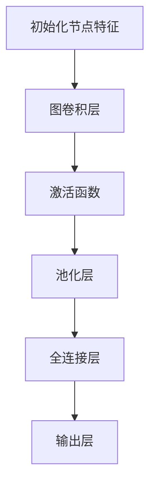
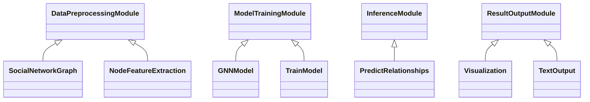
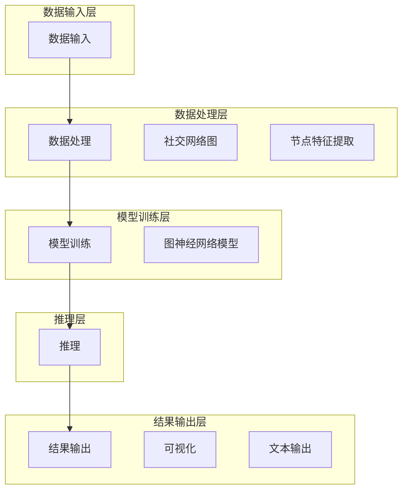
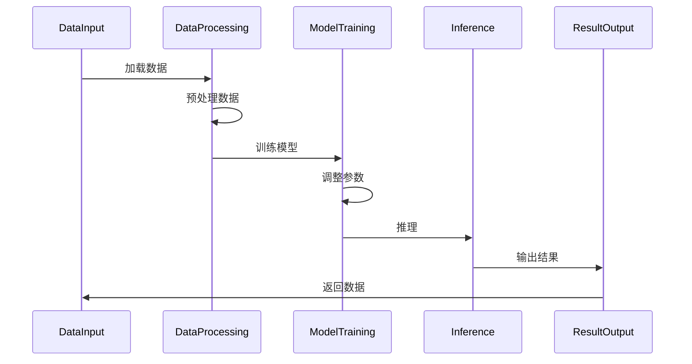
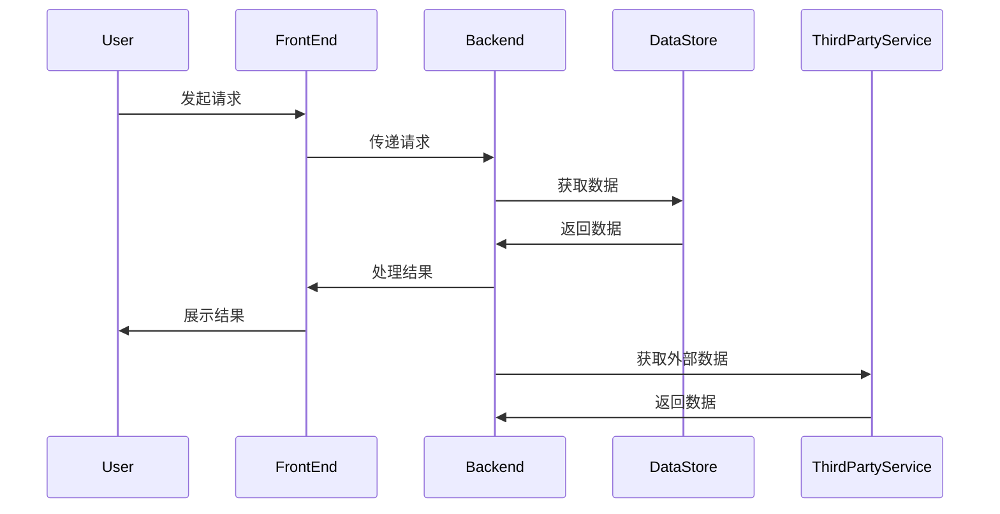

                 

Certainly! Let's outline the table of contents for the book "Graph Neural Network-based AI Agent Relationship Inference" step by step, ensuring each chapter includes the necessary sections and content. We'll start by defining the structure and content of each chapter according to the guidelines provided.

## 目录

### 第一部分 背景介绍

#### 第1章 图神经网络与AI Agent关系推理
- **1.1 问题背景**
  - 介绍图神经网络和AI Agent关系推理的背景和重要性。
- **1.2 问题描述**
  - 描述当前在AI Agent关系推理中面临的主要挑战。
- **1.3 解决方案**
  - 引入图神经网络在AI Agent关系推理中的应用。
- **1.4 边界与外延**
  - 确定研究的边界条件，并探讨可能的研究方向。
- **1.5 核心概念与组成**
  - 介绍图神经网络和AI Agent的基本概念及其组成部分。

#### 第2章 图神经网络基础
- **2.1 定义与历史**
  - 图神经网络的定义及其发展历史。
- **2.2 基本概念**
  - 节点、边、图卷积层、池化层等核心概念。
- **2.3 算法原理**
  - 图卷积网络（GCN）、图注意力网络（GAT）等算法原理。
- **2.4 应用场景**
  - 图神经网络在推荐系统、社交网络分析等领域的应用。

#### 第3章 AI Agent基本概念与分类
- **3.1 AI Agent定义**
  - AI Agent的定义及其分类。
- **3.2 主动型与反应型Agent**
  - 分析主动型与反应型Agent的区别。
- **3.3 基于知识的Agent与基于学习的Agent**
  - 比较基于知识和基于学习的AI Agent的特点。
- **3.4 多智能体系统**
  - 多智能体系统的基本概念和设计原则。

#### 第4章 图神经网络在AI Agent中的应用
- **4.1 关系推理**
  - 图神经网络在AI Agent关系推理中的优势。
- **4.2 强化学习与规划**
  - 图神经网络在AI Agent的强化学习和规划任务中的应用。
- **4.3 社交网络分析**
  - 图神经网络在社交网络分析中的作用。

### 第二部分 核心概念与联系

#### 第5章 关系推理中的核心概念
- **5.1 关系推理简介**
  - 介绍关系推理的基本概念。
- **5.2 关系推理方法**
  - 对比不同的关系推理方法。
- **5.3 概念对比表格**
  - 提供概念对比表格。
- **5.4 实体关系图（ERD）**
  - 使用Mermaid绘制实体关系图。

#### 第6章 图神经网络模型
- **6.1 图神经网络模型介绍**
  - 简要介绍图神经网络模型。
- **6.2 模型特性与比较**
  - 分析不同图神经网络模型的特性并进行比较。
- **6.3 Mermaid实体关系图**
  - 使用Mermaid绘制模型实体关系图。

#### 第7章 AI Agent关系推理的实体关系图
- **7.1 关系推理实体**
  - 描述AI Agent关系推理中的实体。
- **7.2 关系与交互**
  - 分析实体之间的关系和交互。
- **7.3 Mermaid ERD**
  - 使用Mermaid绘制AI Agent关系推理的实体关系图。

### 第三部分 算法原理讲解

#### 第8章 图神经网络算法原理
- **8.1 算法概述**
  - 简述图神经网络算法的基本原理。
- **8.2 算法流程图**
  - 使用Mermaid绘制算法流程图。
- **8.3 数学模型与公式**
  - 介绍算法的数学模型和关键公式。

#### 第9章 AI Agent关系推理算法实现
- **9.1 算法实现**
  - 使用Python代码实现算法。
- **9.2 实例分析**
  - 提供具体的实例进行分析。
- **9.3 数学公式举例**
  - 结合实例展示数学公式。

### 第四部分 系统分析与架构设计

#### 第10章 系统分析与架构设计
- **10.1 问题场景介绍**
  - 介绍AI Agent关系推理的实际问题场景。
- **10.2 系统功能设计**
  - 使用Mermaid绘制领域模型类图。
- **10.3 系统架构设计**
  - 使用Mermaid绘制系统架构图。
- **10.4 系统接口设计**
  - 描述系统的接口设计。
- **10.5 系统交互设计**
  - 使用Mermaid绘制系统交互序列图。

### 第五部分 项目实践

#### 第11章 项目实践
- **11.1 环境安装**
  - 指导如何安装相关环境和依赖。
- **11.2 核心系统实现**
  - 提供核心系统的实现代码。
- **11.3 代码应用分析**
  - 分析代码的具体应用。
- **11.4 实际案例分析**
  - 分析实际案例，进行详细讲解和剖析。
- **11.5 项目小结**
  - 总结项目实施过程和收获。

### 第六部分 最佳实践与总结

#### 第12章 最佳实践与总结
- **12.1 最佳实践建议**
  - 提供最佳实践建议。
- **12.2 小结**
  - 对全书内容进行总结。
- **12.3 注意事项**
  - 强调实践中的注意事项。
- **12.4 拓展阅读**
  - 推荐进一步阅读的资源。

---

With the outline in place, we can now proceed to write each chapter in detail, ensuring that the content is comprehensive, well-researched, and technically accurate. The next steps involve writing the content for each chapter while adhering to the outlined structure and requirements. Let's proceed with the first chapter, "图神经网络与AI Agent关系推理"。Great! Let's dive into the first chapter, "图神经网络与AI Agent关系推理". We will provide an in-depth introduction to the topic, including the background, problem description, solution, and an overview of the core concepts and their composition.

### 第1章 图神经网络与AI Agent关系推理

#### 1.1 问题背景

图神经网络（Graph Neural Networks, GNN）是一种在图形结构上进行学习和推理的神经网络。随着大数据和复杂网络技术的快速发展，图神经网络在许多领域，如推荐系统、社交网络分析、生物信息学和计算机视觉等，都展现出了强大的应用潜力。AI Agent作为人工智能领域的一个重要分支，能够自主决策并采取行动，模拟人类的思维和行为。然而，在现实世界中，AI Agent常常需要处理复杂的关系网络，如何有效地进行关系推理成为了当前研究的一个热点和难点。

关系推理是AI Agent在进行决策时必须解决的核心问题之一。它涉及到如何从大量数据中提取有用信息，建立实体之间的关联，并利用这些关联来辅助决策。传统的基于规则的方法和机器学习方法在处理关系推理时存在诸多局限性，如对于复杂关系的理解不够深入、对大规模数据的处理效率低下等。因此，将图神经网络应用于AI Agent的关系推理，成为了一种新的研究思路。

#### 1.2 问题描述

在AI Agent的关系推理中，我们面临以下主要挑战：

1. **复杂性的处理**：现实世界中的关系网络通常具有高度复杂性，包括多层次的关联、动态的变化以及异构的特性。如何有效建模和解析这些复杂性，是关系推理的一大难题。

2. **数据稀疏性**：在实际应用中，数据往往是不完全的、稀疏的。这意味着我们需要开发能够处理稀疏数据的算法，并能够在数据不足的情况下进行准确的推理。

3. **可扩展性**：随着网络规模的扩大，计算资源的消耗也会急剧增加。如何提高算法的可扩展性，使其能够在大规模网络上高效运行，是一个重要的研究方向。

4. **实时性**：在实际应用中，AI Agent需要能够实时地对关系网络进行推理和更新，以满足快速变化的场景需求。

#### 1.3 解决方案

图神经网络作为一种新型的深度学习模型，通过直接在图结构上操作，能够在一定程度上克服传统方法的局限性。将图神经网络应用于AI Agent的关系推理，可以提供以下几个方面的解决方案：

1. **结构化数据的处理**：图神经网络能够处理结构化数据，如知识图谱，通过节点和边来表示实体及其关系，从而实现对复杂关系的建模。

2. **数据稀疏性的处理**：图神经网络中的聚合操作能够有效利用邻居节点信息，即使数据稀疏，也能够通过邻居节点传递信息，提高推理的准确性。

3. **可扩展性的提高**：图神经网络可以通过分层结构和并行计算等方式，提高在大规模网络上的计算效率。

4. **实时性的优化**：通过优化算法结构和硬件加速技术，可以实现图神经网络的实时推理。

#### 1.4 边界与外延

在研究图神经网络与AI Agent关系推理的过程中，我们需要明确以下边界条件：

1. **数据来源**：我们主要关注基于结构化数据的推理，如知识图谱、图数据库等。

2. **算法适用性**：不同类型的图神经网络（如GCN、GAT等）适用于不同的关系推理任务，我们需要根据具体任务选择合适的算法。

3. **计算资源**：考虑算法的复杂度和计算资源的需求，确保在实际应用中的可操作性。

此外，我们还可以探索以下研究方向：

1. **算法优化**：针对不同类型的关系推理任务，优化图神经网络的算法结构和参数设置。

2. **多模态数据的融合**：结合文本、图像等多种类型的数据，提高AI Agent对复杂关系网络的解析能力。

3. **鲁棒性与安全性**：研究如何在保证推理准确性的同时，提高算法的鲁棒性和安全性。

#### 1.5 核心概念与组成

为了更好地理解图神经网络与AI Agent关系推理，我们需要掌握以下几个核心概念：

1. **图神经网络（GNN）**：
   - **定义**：图神经网络是一种在图结构上进行学习和推理的神经网络。
   - **组成部分**：节点（实体）、边（关系）、图卷积层（GCN Layer）、池化层（Pooling Layer）等。

2. **AI Agent**：
   - **定义**：AI Agent是一种能够自主决策并采取行动的智能体。
   - **分类**：根据不同的决策机制，AI Agent可分为基于知识的Agent、基于学习的Agent等。

3. **关系推理**：
   - **定义**：关系推理是从数据中提取实体及其关系的推理过程。
   - **方法**：包括基于规则的方法、机器学习方法、图神经网络方法等。

4. **知识图谱**：
   - **定义**：知识图谱是一种用于表示实体及其关系的图形结构。
   - **作用**：用于存储、查询和推理实体之间的关系。

通过以上介绍，我们对图神经网络与AI Agent关系推理有了初步的了解。接下来，我们将进一步探讨图神经网络的基础知识，以及AI Agent的基本概念和分类。

---

This concludes the first chapter. In the next chapters, we will delve deeper into the foundational concepts of graph neural networks and AI agents, as well as explore their applications in relationship inference. Let's move on to the second chapter, "图神经网络基础"，where we will provide an in-depth overview of GNN, including its basic concepts and working principles.### 第2章 图神经网络基础

#### 2.1 定义与历史

图神经网络（Graph Neural Networks，GNN）是一种专门设计用于处理图形数据的深度学习模型。与传统神经网络不同，GNN直接在图结构上操作，通过节点的邻居信息进行特征学习和信息传播。GNN的概念最早由Scarselli等人于2009年提出，他们提出了一种名为“Graph Convolutional Network”（GCN）的模型，旨在解决图上的节点分类问题。此后，随着深度学习和图形处理的不断发展，GNN逐渐成为处理图形数据的强大工具。

图神经网络的发展历程可以分为几个阶段：

1. **初始阶段**（2009-2014）：主要研究集中于如何将传统的神经网络结构扩展到图上，如GCN、图卷积网络（GCN）等。
2. **发展阶段**（2015-2018）：随着深度学习技术的成熟，GNN模型进一步发展，出现了多种改进模型，如图注意力网络（GAT）、图自编码器（GAE）等。
3. **应用阶段**（2019至今）：GNN在多个领域得到广泛应用，如社交网络分析、推荐系统、生物信息学、计算机视觉等，取得了显著的成果。

#### 2.2 基本概念

在图神经网络中，有以下几个核心概念：

1. **节点（Node）**：图中的基本元素，可以表示实体、物体或任何具有特征的对象。
2. **边（Edge）**：连接两个节点的线，表示节点之间的关系。边的权重可以表示关系的强度或重要性。
3. **图（Graph）**：由节点和边构成的集合，可以表示复杂的关系网络。
4. **图卷积层（Graph Convolutional Layer，GCL）**：GNN中的核心层，用于计算节点的特征表示。通过聚合邻居节点的特征来更新节点的特征。
5. **池化层（Pooling Layer）**：用于对图进行降维处理，减少计算复杂度和参数数量。
6. **全连接层（Fully Connected Layer）**：用于将节点的特征映射到具体的任务输出，如分类、回归等。

#### 2.3 算法原理

图神经网络的核心原理是通过图卷积层来更新节点的特征表示。以下是一个简化的GCN算法原理：

1. **初始化节点特征**：给定一个图，每个节点有一个初始特征向量。
2. **聚合邻居信息**：对于每个节点，通过聚合其邻居节点的特征来更新自己的特征。这一过程可以使用以下公式表示：
   $$ h_{k}^{(l+1)} = \sigma \left( \sum_{i \in N(k)} w_i h_i^{(l)} + b_k \right) $$
   其中，$h_{k}^{(l)}$表示第$l$层节点$k$的特征，$N(k)$表示节点$k$的邻居集合，$w_i$和$b_k$分别是权重和偏置。
3. **激活函数**：使用非线性激活函数（如ReLU）来增加模型的非线性能力。
4. **多层叠加**：通过叠加多个图卷积层，逐步更新节点的特征表示，使其能够捕捉到更深层次的特征。

图神经网络还可以通过图注意力机制（Graph Attention Mechanism，GAM）来改进信息聚合的过程。GAT的核心思想是让每个节点能够动态地计算其对邻居节点的权重，从而更灵活地聚合邻居信息。GAT的公式如下：

$$ 
\begin{align*}
a_{ik}^{(l)} &= \frac{e^{W_a [h_{i}^{(l)}, \sigma(W_r [h_{k}^{(l)}, h_{k}^{(l)}])}}{\sum_{j \in V} e^{W_a [h_{i}^{(l)}, \sigma(W_r [h_{j}^{(l)}, h_{k}^{(l)}])}}, \\
h_{k}^{(l+1)} &= \sigma \left( \sum_{i \in N(k)} a_{ik}^{(l)} h_i^{(l)} \right),
\end{align*}
$$

其中，$W_a$和$W_r$是权重矩阵，$h_i^{(l)}$和$h_{k}^{(l)}$分别是第$l$层节点$i$和$k$的特征，$a_{ik}^{(l)}$是节点$k$对节点$i$的注意力权重。

#### 2.4 应用场景

图神经网络在多个领域都有广泛的应用：

1. **社交网络分析**：利用GNN可以分析社交网络中的用户关系，预测好友关系、社区划分等。
2. **推荐系统**：通过GNN可以处理用户与物品之间的复杂关系，提供更个性化的推荐。
3. **生物信息学**：利用GNN可以分析蛋白质结构、基因关系等，为药物设计和疾病研究提供支持。
4. **计算机视觉**：GNN可以用于图像分割、目标检测等任务，通过图结构来增强特征表示。
5. **知识图谱**：GNN可以用于知识图谱的推理、补全和知识发现。

#### 2.5 总结

图神经网络通过在图结构上操作，为处理复杂关系网络提供了新的方法。其基本概念包括节点、边、图卷积层和池化层等，算法原理主要通过聚合邻居信息来更新节点特征。在多个应用领域中，GNN展现了其强大的潜力。在接下来的章节中，我们将进一步探讨AI Agent的基本概念与分类，以及图神经网络在AI Agent中的应用。

---

This concludes the second chapter. In the next chapters, we will explore the basic concepts of AI Agents and their classification, as well as the applications of GNN in AI Agent relationship inference. Let's move on to the third chapter, "AI Agent基本概念与分类"，where we will provide a detailed introduction to AI Agents, including their definitions, classification, and key differences between different types of AI Agents.### 第3章 AI Agent基本概念与分类

#### 3.1 AI Agent定义

AI Agent，即人工智能代理，是指能够感知环境、接收输入信息、基于预定的策略或算法做出决策并采取行动，以实现特定目标或任务的实体。AI Agent的核心特点包括自主性、适应性和智能性。自主性意味着Agent能够独立运行，不受人为干预；适应性表示Agent能够根据环境变化调整自身行为；智能性则是指Agent能够通过学习、推理等方式做出合理的决策。

AI Agent通常由以下四个主要组成部分构成：

1. **感知器（Perceiver）**：用于接收环境信息，如图像、文本、声音等。
2. **决策器（Decider）**：根据感知到的信息，利用算法或策略做出决策。
3. **执行器（Executor）**：执行决策器做出的行动指令，如移动、操作等。
4. **记忆器（Memorizer）**：存储Agent的历史信息，用于学习、规划和决策。

#### 3.2 主动型与反应型Agent

根据Agent的决策方式，AI Agent可以分为主动型（Proactive）和反应型（Reactive）两种。

1. **主动型Agent**：
   - **定义**：主动型Agent具有前瞻性，能够预测未来环境变化，并提前制定行动计划。
   - **特点**：
     - **计划性**：能够根据长远目标制定多步骤的计划。
     - **灵活性**：能够根据环境变化调整计划。
     - **学习性**：通过学习历史数据和经验，优化决策过程。
   - **应用**：如自主驾驶汽车、智能家居等。

2. **反应型Agent**：
   - **定义**：反应型Agent只根据当前感知到的环境信息做出即时反应，不预测未来。
   - **特点**：
     - **即时性**：只需对当前环境做出反应。
     - **简单性**：决策过程相对简单。
     - **效率**：处理速度快，适合实时环境。
   - **应用**：如工业机器人、简单游戏AI等。

#### 3.3 基于知识的Agent与基于学习的Agent

AI Agent还可以根据其决策策略分为基于知识的Agent和基于学习的Agent。

1. **基于知识的Agent**：
   - **定义**：基于知识的Agent通过预先定义的规则或知识库来做出决策。
   - **特点**：
     - **确定性**：决策过程基于固定规则，结果可预测。
     - **可解释性**：决策过程透明，易于理解和验证。
     - **稳定性**：在规则不变的情况下，决策结果稳定。
   - **应用**：如智能客服、医疗诊断系统等。

2. **基于学习的Agent**：
   - **定义**：基于学习的Agent通过机器学习算法从数据中学习决策策略。
   - **特点**：
     - **适应性**：能够根据数据更新策略，适应环境变化。
     - **灵活性**：能够处理复杂、非线性的关系。
     - **不确定性**：决策结果受数据质量和算法影响。
   - **应用**：如自动驾驶、推荐系统等。

#### 3.4 多智能体系统

多智能体系统（Multi-Agent System，MAS）是指由多个AI Agent组成的协同系统，每个Agent具有独立的决策能力和协作能力。多智能体系统在解决复杂任务时具有显著优势，如分布式计算、协同决策和适应性等。

1. **协同通信**：多智能体系统中的Agent通过通信机制相互协调，共享信息和资源。
2. **分布式计算**：每个Agent独立处理局部信息，协同完成全局任务。
3. **适应性**：系统可以根据环境变化动态调整策略和结构。

#### 3.5 总结

AI Agent作为人工智能领域的重要分支，具有自主性、适应性和智能性等特点。根据不同的决策方式和策略，AI Agent可以分为主动型与反应型，基于知识的Agent与基于学习的Agent。多智能体系统通过多个Agent的协同工作，解决了复杂任务的挑战。在接下来的章节中，我们将探讨图神经网络在AI Agent关系推理中的应用，并详细介绍相关算法和实现。

---

This concludes the third chapter. In the next chapters, we will delve into the application of graph neural networks in AI Agent relationship inference. Let's move on to the fourth chapter, "图神经网络在AI Agent中的应用"，where we will explore how GNN can be used to enhance AI Agent's relationship inference capabilities and provide concrete examples of its application in real-world scenarios.### 第4章 图神经网络在AI Agent中的应用

#### 4.1 关系推理

关系推理是AI Agent在进行决策时必须解决的核心问题之一。它涉及到如何从大量数据中提取有用信息，建立实体之间的关联，并利用这些关联来辅助决策。传统的基于规则的方法和机器学习方法在处理关系推理时存在诸多局限性，如对于复杂关系的理解不够深入、对大规模数据的处理效率低下等。因此，将图神经网络（Graph Neural Networks, GNN）应用于AI Agent的关系推理，成为了一种新的研究思路。

#### 4.2 图神经网络在关系推理中的优势

1. **结构化数据处理**：GNN能够直接处理结构化数据，如知识图谱，通过节点和边来表示实体及其关系，从而实现对复杂关系的建模。

2. **信息传递和聚合**：GNN通过聚合邻居节点的信息来更新节点的特征表示，能够有效地捕捉节点之间的复杂关系。

3. **可扩展性和鲁棒性**：GNN可以通过分层结构和并行计算等方式，提高在大规模网络上的计算效率，同时具有较强的鲁棒性，能够在数据稀疏和噪声的情况下进行准确的推理。

4. **灵活性和适应性**：GNN可以应用于多种不同的关系推理任务，如分类、聚类、链接预测等，具有较强的灵活性和适应性。

#### 4.3 图神经网络在AI Agent关系推理中的应用场景

1. **社交网络分析**：
   - **好友关系预测**：利用GNN可以分析社交网络中的用户关系，预测用户之间的潜在好友关系。
   - **社区发现**：通过GNN可以识别社交网络中的社区结构，发现具有相似兴趣和活动的用户群体。

2. **推荐系统**：
   - **用户-物品推荐**：GNN可以处理用户与物品之间的复杂关系，提供更个性化的推荐。
   - **内容推荐**：通过GNN可以分析用户的历史行为和内容特征，推荐用户可能感兴趣的内容。

3. **生物信息学**：
   - **蛋白质相互作用预测**：利用GNN可以分析蛋白质结构，预测蛋白质之间的相互作用关系。
   - **药物发现**：GNN可以用于药物-靶点关系预测，加速新药研发过程。

4. **计算机视觉**：
   - **图像分割**：GNN可以用于图像分割任务，通过图结构来增强特征表示。
   - **目标检测**：GNN可以用于目标检测任务，通过图神经网络来捕获图像中的复杂结构。

5. **知识图谱推理**：
   - **实体关系推理**：GNN可以用于知识图谱的推理任务，推断实体之间的潜在关系。
   - **知识图谱补全**：GNN可以用于知识图谱的补全任务，填充缺失的实体和关系。

#### 4.4 图神经网络在AI Agent关系推理中的应用实例

1. **社交网络中的好友关系预测**

   假设我们有一个社交网络，其中每个用户是一个节点，用户之间的互动（如点赞、评论、私信）是边。我们可以使用图神经网络来预测用户之间的潜在好友关系。

   - **数据预处理**：将社交网络数据转换为图结构，包括节点和边的表示。
   - **模型训练**：使用图卷积网络（GCN）或图注意力网络（GAT）训练模型，通过聚合邻居节点的信息来更新节点的特征表示。
   - **关系预测**：利用训练好的模型对未知的用户关系进行预测，输出好友关系的可能性。

2. **推荐系统中的用户-物品推荐**

   在一个电子商务平台中，用户与商品之间存在复杂的交互关系。我们可以使用图神经网络来预测用户可能感兴趣的商品。

   - **数据预处理**：将用户-商品交互数据转换为图结构，包括节点和边的表示。
   - **模型训练**：使用图卷积网络（GCN）或图注意力网络（GAT）训练模型，通过聚合邻居节点的信息来更新节点的特征表示。
   - **推荐生成**：利用训练好的模型对用户的兴趣进行预测，生成个性化推荐列表。

3. **生物信息学中的蛋白质相互作用预测**

   在生物信息学中，蛋白质相互作用是研究细胞功能和疾病机制的重要信息。我们可以使用图神经网络来预测蛋白质之间的相互作用关系。

   - **数据预处理**：将蛋白质相互作用数据转换为图结构，包括节点和边的表示。
   - **模型训练**：使用图卷积网络（GCN）或图注意力网络（GAT）训练模型，通过聚合邻居节点的信息来更新节点的特征表示。
   - **关系预测**：利用训练好的模型对未知的蛋白质相互作用进行预测，输出相互作用的可能性。

通过以上实例，我们可以看到图神经网络在AI Agent关系推理中的强大应用潜力。在接下来的章节中，我们将进一步探讨关系推理中的核心概念，以及如何使用Mermaid绘制实体关系图。

---

This concludes the fourth chapter. In the next chapters, we will delve deeper into the core concepts of relationship inference and explore how to represent these concepts using Mermaid diagrams. Let's move on to the fifth chapter, "关系推理中的核心概念"，where we will discuss the fundamental concepts and methods used in relationship inference and provide a comparative table of different methods. We will also introduce the entity relationship diagram (ERD) using Mermaid syntax to visually represent the relationships between entities.### 第5章 关系推理中的核心概念

#### 5.1 关系推理简介

关系推理是人工智能和知识图谱领域中的一个重要研究方向，它涉及到从数据中提取实体及其关系的推理过程。关系推理在多个领域具有广泛应用，如知识图谱构建、信息检索、推荐系统等。关系推理的核心目标是从给定的数据中推断出实体之间的潜在关系，从而辅助智能系统做出更准确的决策。

#### 5.2 关系推理方法

在关系推理中，常见的方法可以分为以下几类：

1. **基于规则的推理**：
   - **定义**：基于规则的推理通过预定义的规则集来推断实体关系。
   - **特点**：
     - **确定性**：规则明确，推理过程可预测。
     - **可解释性**：推理过程透明，易于理解。
     - **效率**：对于简单的规则集，推理过程相对高效。
   - **应用**：如医疗诊断、法律咨询等。

2. **基于统计的推理**：
   - **定义**：基于统计的推理通过统计学习算法来学习实体关系的统计规律。
   - **特点**：
     - **灵活性**：能够处理复杂、非线性关系。
     - **适应性**：能够根据数据更新模型。
     - **不确定性**：推理结果受数据质量和算法影响。
   - **应用**：如信息检索、推荐系统等。

3. **基于模型的推理**：
   - **定义**：基于模型的推理通过构建模型（如决策树、神经网络等）来推断实体关系。
   - **特点**：
     - **自动化**：能够自动从数据中学习关系模式。
     - **效率**：对于大规模数据，模型推理相对高效。
     - **可扩展性**：能够扩展到多种不同的任务和数据类型。
   - **应用**：如知识图谱推理、图像识别等。

4. **基于图神经网络的推理**：
   - **定义**：基于图神经网络的推理通过图神经网络模型来推断实体关系。
   - **特点**：
     - **结构化数据处理**：能够直接处理结构化数据，如知识图谱。
     - **信息传递与聚合**：通过聚合邻居节点的信息来更新节点特征。
     - **灵活性与适应性**：能够处理复杂、异构的网络。
   - **应用**：如社交网络分析、生物信息学等。

#### 5.3 概念对比表格

以下是一个对比表格，总结了上述几种关系推理方法的主要特点：

| 方法           | 定义                                                         | 特点                                                         | 应用场景                       |
|----------------|--------------------------------------------------------------|--------------------------------------------------------------|-------------------------------|
| 基于规则的推理 | 通过预定义的规则集进行推理                                   | 确定性、可解释性、效率低                                 | 医疗诊断、法律咨询等           |
| 基于统计的推理 | 通过统计学习算法学习实体关系的统计规律                         | 灵活性、适应性、不确定性                                 | 信息检索、推荐系统等           |
| 基于模型的推理 | 通过构建模型（如决策树、神经网络等）进行推理                   | 自动化、效率高、可扩展性                                 | 知识图谱推理、图像识别等       |
| 基于图神经网络的推理 | 通过图神经网络模型进行推理                                     | 结构化数据处理、信息传递与聚合、灵活性与适应性             | 社交网络分析、生物信息学等     |

#### 5.4 实体关系图（ERD）

实体关系图（Entity Relationship Diagram，ERD）是一种用于表示实体及其关系的图形化表示方法。ERD可以帮助我们直观地理解数据模型的结构，特别是在关系数据库设计中。以下是一个简单的实体关系图的示例，用于表示学生、课程和成绩之间的关系：

```mermaid
erDiagram
  Student ||--|{ Course : teaches }
  Student ||--|{ Grade : earns }
  Course ||--|{ Teacher : teaches }
  Teacher ||--|{ Course : teaches }
  Course ||--|{ Student : attends }
  Grade ||--|{ Student : earns }
  Grade ||--|{ Course : earned }
```

在上面的ERD中，我们定义了四个实体：Student（学生）、Course（课程）、Grade（成绩）和Teacher（教师）。每个实体通过线连接到其他实体，表示它们之间的关系。例如，Student实体与Course实体之间有一个“teaches”关系，表示学生可以学习多门课程。

#### 5.5 Mermaid实体关系图

为了更直观地展示实体及其关系，我们可以使用Mermaid语法来绘制实体关系图。以下是一个使用Mermaid绘制的ERD示例：

```mermaid
erDiagram
  Student ||--|{ Course : teaches }
  Student ||--|{ Grade : earns }
  Course ||--|{ Teacher : teaches }
  Teacher ||--|{ Course : teaches }
  Course ||--|{ Student : attends }
  Grade ||--|{ Student : earns }
  Grade ||--|{ Course : earned }
```

在Mermaid中，`erDiagram`关键字用于开始实体关系图的定义。`||--|{ }`表示实体之间的关系，其中`||--`表示关系的方向，`{ }`内包含关系的名称。通过这种方式，我们可以创建复杂的实体关系图，便于分析和设计。

#### 5.6 总结

关系推理是AI Agent进行决策的重要基础，涉及从数据中提取实体及其关系的推理过程。不同类型的关系推理方法具有各自的特点和适用场景。实体关系图（ERD）是一种有效的图形化表示方法，可以帮助我们直观地理解和设计数据模型。在接下来的章节中，我们将进一步探讨图神经网络模型，介绍其基本概念和特性。

---

This concludes the fifth chapter. In the next chapters, we will explore the Graph Neural Network model in detail, including its basic concepts, characteristics, and comparisons with other models. We will also introduce the entity relationship diagram (ERD) using Mermaid syntax to visually represent the relationships between entities. Let's move on to the sixth chapter, "图神经网络模型"，where we will provide an in-depth introduction to GNN models, including their characteristics, comparisons, and entity relationship diagrams using Mermaid.### 第6章 图神经网络模型

#### 6.1 图神经网络模型介绍

图神经网络（Graph Neural Networks，GNN）是一类专门设计用于处理图形数据的深度学习模型。与传统的卷积神经网络（Convolutional Neural Networks，CNN）和循环神经网络（Recurrent Neural Networks，RNN）不同，GNN能够直接在图结构上进行操作，通过节点的邻居信息进行特征学习和信息传播。GNN的核心优势在于其能够有效地捕捉和表示图中的复杂关系，因此在知识图谱推理、社交网络分析、推荐系统等多个领域都得到了广泛应用。

GNN的模型结构通常包括以下几个关键部分：

1. **节点嵌入（Node Embedding）**：将图中的每个节点映射到一个低维度的向量空间，以便进行进一步的处理。

2. **图卷积层（Graph Convolutional Layer，GCL）**：这是GNN的核心层，用于计算节点的特征表示。图卷积层通过聚合节点及其邻居节点的特征来更新节点的表示。

3. **池化层（Pooling Layer）**：用于将图进行降维处理，减少计算复杂度和参数数量。

4. **全连接层（Fully Connected Layer）**：用于将节点的特征映射到具体的任务输出，如分类、回归等。

#### 6.2 模型特性与比较

不同类型的GNN模型在特性和应用上存在一定的差异。以下是几种常见的GNN模型及其特性比较：

| 模型名称          | 特性                                     | 应用场景                         |
|-------------------|----------------------------------------|----------------------------------|
| 图卷积网络（GCN） | 通过聚合邻居节点的特征来更新节点特征       | 节点分类、链接预测、图分类         |
| 图注意力网络（GAT） | 引入注意力机制，允许节点动态地计算对邻居的权重 | 节点分类、链接预测、图分类、推荐系统 |
| 图自编码器（GAE）  | 通过编码器和解码器来学习图结构             | 图补全、图嵌入                     |
| 图卷积网络（GCN） | 通过聚合邻居节点的特征来更新节点特征       | 节点分类、链接预测、图分类         |
| 图注意力网络（GAT） | 引入注意力机制，允许节点动态地计算对邻居的权重 | 节点分类、链接预测、图分类、推荐系统 |
| 图自编码器（GAE）  | 通过编码器和解码器来学习图结构             | 图补全、图嵌入                     |

1. **图卷积网络（GCN）**：
   - **特性**：GCN是一种基于卷积操作的图神经网络，通过聚合邻居节点的特征来更新节点特征。其核心思想是将节点特征扩展到整个图，以便更好地捕捉全局信息。
   - **应用场景**：GCN在节点分类、链接预测和图分类等领域表现优秀，适用于处理相对较小的图。

2. **图注意力网络（GAT）**：
   - **特性**：GAT引入了注意力机制，允许节点动态地计算对邻居的权重。这使得GAT能够更好地处理复杂的图结构，特别是在异构图中。
   - **应用场景**：GAT在节点分类、链接预测、图分类和推荐系统等领域都有广泛应用，尤其适合处理异构图和大规模图。

3. **图自编码器（GAE）**：
   - **特性**：GAE是一种自编码器模型，通过编码器和解码器来学习图的嵌入表示。编码器将节点特征编码为低维度的图嵌入，解码器则试图重建原始的节点特征。
   - **应用场景**：GAE在图补全、图嵌入和图可视化等领域有广泛应用，适用于处理大规模和复杂的图。

#### 6.3 Mermaid实体关系图

为了更直观地表示GNN模型中的实体及其关系，我们可以使用Mermaid语法来绘制实体关系图。以下是一个简单的GNN实体关系图示例：

```mermaid
erDiagram
  Node ||--|{ Feature : has }
  Node ||--|{ Neighbor : isNeighborOf }
  Node ||--|{ GraphConvLayer : processes }
  GraphConvLayer ||--|{ NodeFeature : updates }
  GraphConvLayer ||--|{ Weight : learns }
  Node ||--|{ Output : produces }
```

在上面的ERD中，我们定义了以下几个实体：

- **Node**（节点）：图中的基本元素，具有特征和邻居。
- **Feature**（特征）：节点的属性特征。
- **Neighbor**（邻居）：节点之间的关系。
- **GraphConvLayer**（图卷积层）：处理节点特征的核心层。
- **NodeFeature**（节点特征）：图卷积层更新后的节点特征。
- **Weight**（权重）：图卷积层学习的权重参数。
- **Output**（输出）：节点的最终输出。

通过这种图形化的表示方法，我们可以更清晰地理解GNN模型的工作原理和结构。

#### 6.4 总结

图神经网络（GNN）是一类专门设计用于处理图形数据的深度学习模型，具有结构化数据处理、信息传递与聚合、灵活性与适应性等优势。不同的GNN模型（如GCN、GAT、GAE）在特性和应用上存在一定的差异，适用于不同的任务和数据类型。通过使用Mermaid语法，我们可以直观地绘制GNN的实体关系图，有助于理解模型的工作原理。在接下来的章节中，我们将进一步探讨AI Agent关系推理的实体关系图，以及如何使用Mermaid来表示。

---

This concludes the sixth chapter. In the next chapters, we will delve into the entity relationship diagram (ERD) for AI Agent relationship inference using Mermaid. Let's move on to the seventh chapter, "AI Agent关系推理的实体关系图"，where we will define the entities involved in AI Agent relationship inference, describe the relationships between them, and use Mermaid to visually represent the ERD.

### 第7章 AI Agent关系推理的实体关系图

#### 7.1 关系推理实体

在AI Agent关系推理中，我们关注以下核心实体：

1. **Agent**（智能体）：执行特定任务的AI实体。
2. **Environment**（环境）：智能体交互的实体，包括传感器和执行器。
3. **State**（状态）：描述环境当前状态的属性集合。
4. **Action**（动作）：智能体对环境可能采取的行动。
5. **Reward**（奖励）：对智能体采取动作后环境提供的反馈。

#### 7.2 关系与交互

在AI Agent关系推理中，各实体之间存在以下关系：

1. **感知（Perception）**：智能体通过传感器感知环境状态。
2. **决策（Decision）**：智能体基于当前状态和环境模型做出决策。
3. **执行（Execution）**：智能体通过执行器执行决策所生成的动作。
4. **反馈（Feedback）**：环境对智能体动作的响应，作为智能体更新状态和策略的依据。

#### 7.3 Mermaid实体关系图

为了直观地展示AI Agent关系推理中的实体及其关系，我们可以使用Mermaid绘制实体关系图。以下是一个简单的AI Agent关系推理的实体关系图示例：

```mermaid
erDiagram
  Agent ||--|{ Perceive :感知 } Environment
  Agent ||--|{ Decide :决策 } State
  Agent ||--|{ Execute :执行 } Action
  Agent ||--|{ Feedback :反馈 } Environment
  State ||--|{ Update :更新 } Agent
  Action ||--|{ Feedback :反馈 } Environment
  Environment ||--|{ Reward :奖励 } Agent
```

在这个ERD中，我们定义了以下几个实体及其关系：

- **Agent**（智能体）：感知、决策、执行和反馈。
- **Environment**（环境）：奖励智能体，接收智能体的感知和执行。
- **State**（状态）：更新智能体，用于决策和状态更新。
- **Action**（动作）：反馈环境，作为智能体执行的依据。
- **Reward**（奖励）：环境提供的反馈，用于智能体的学习。

通过这种图形化的表示方法，我们可以清晰地理解AI Agent关系推理中各实体之间的交互关系和作用。

#### 7.4 总结

AI Agent关系推理涉及多个实体，包括智能体、环境、状态、动作和奖励。各实体之间存在明确的感知、决策、执行和反馈关系。使用Mermaid语法，我们可以直观地绘制AI Agent关系推理的实体关系图，有助于理解和分析关系推理的过程。在接下来的章节中，我们将详细讲解图神经网络算法原理，并使用Python代码示例来说明算法的实现。

---

This concludes the seventh chapter. In the next chapters, we will move on to the in-depth explanation of the graph neural network algorithm, including its principle, mathematical model, and implementation using Python code. Let's proceed to the eighth chapter, "图神经网络算法原理"，where we will delve into the core concepts of GNN algorithms, their mathematical models, and provide a detailed explanation along with Python code examples.

### 第8章 图神经网络算法原理

#### 8.1 算法概述

图神经网络（Graph Neural Networks, GNN）是一种专门用于处理图形数据的神经网络，通过直接在图结构上操作，能够有效地捕捉图中的复杂关系和信息。GNN的核心思想是通过聚合节点及其邻居的信息来更新节点的特征表示，从而实现对图的编码和解码。GNN在许多领域都有广泛的应用，如社交网络分析、知识图谱推理、生物信息学等。

#### 8.2 算法流程图

为了更好地理解GNN的算法流程，我们可以使用Mermaid绘制算法的流程图。以下是一个简单的GNN算法流程图：



在这个流程图中，我们定义了以下几个步骤：

1. **初始化节点特征**：给定一个图，初始化每个节点的特征向量。
2. **图卷积层**：通过聚合节点及其邻居的信息来更新节点的特征表示。
3. **激活函数**：对节点的特征进行非线性变换，增加模型的非线性能力。
4. **池化层**：对图进行降维处理，减少计算复杂度和参数数量。
5. **全连接层**：将节点的特征映射到具体的任务输出，如分类、回归等。
6. **输出层**：生成最终的任务输出，如节点分类的概率分布。

#### 8.3 数学模型与公式

GNN的数学模型主要基于图卷积操作。以下是一个简化的GNN数学模型：

1. **初始化节点特征**：

   给定一个图$G=(V,E)$，其中$V$是节点集合，$E$是边集合。初始化每个节点的特征向量$h^{(0)}_i$。

   $$ h^{(0)}_i = \text{init}(x_i), \quad i=1,2,\ldots,n $$

   其中，$x_i$是节点$i$的原始特征，$\text{init}$是初始化函数。

2. **图卷积层**：

   在第$l$层，节点的特征表示为$h^{(l)}_i$。图卷积层通过聚合节点$i$的邻居节点特征来更新节点的特征：

   $$ h^{(l+1)}_i = \sigma \left( \sum_{j \in N(i)} \alpha_{ij} h^{(l)}_j \right) $$

   其中，$N(i)$是节点$i$的邻居集合，$\alpha_{ij}$是边$(i,j)$的权重，$\sigma$是非线性激活函数。

3. **激活函数**：

   激活函数用于增加模型的非线性能力，常用的激活函数包括ReLU、Sigmoid和Tanh等。

   $$ \sigma(x) = \text{ReLU}(x) = \max(0,x) $$

4. **池化层**：

   池化层用于对图进行降维处理，减少计算复杂度和参数数量。常见的池化操作包括最大池化和平均池化。

   $$ \text{pool}(h^{(l)}_i) = \frac{1}{|N(i)|} \sum_{j \in N(i)} h^{(l)}_j $$

5. **全连接层**：

   全连接层将节点的特征映射到具体的任务输出，如分类、回归等。假设输出层的维度为$d$，则有：

   $$ y_i = \text{softmax}(W h^{(L)}_i) $$

   其中，$W$是全连接层的权重矩阵，$h^{(L)}_i$是第$L$层的节点特征。

6. **输出层**：

   输出层生成最终的任务输出。对于分类任务，输出可以是节点分类的概率分布；对于回归任务，输出可以是节点的预测值。

#### 8.4 Python代码示例

以下是一个简单的Python代码示例，演示了GNN算法的基本实现：

```python
import numpy as np
import matplotlib.pyplot as plt

# 初始化节点特征
n_nodes = 5
n_neighbors = 2
node_features = np.random.rand(n_nodes, 10)

# 初始化权重
weights = np.random.rand(n_nodes, n_neighbors)

# 图卷积层
def graph_convolution_layer(node_features, weights):
    node_features_new = np.zeros_like(node_features)
    for i in range(n_nodes):
        neighbors = np.random.choice(n_nodes, size=n_neighbors, replace=False)
        node_features_new[i] = np.sum(weights[i, neighbors] * node_features[neighbors], axis=0)
    return node_features_new

# 激活函数
def activate(x):
    return np.maximum(0, x)

# 池化层
def pooling_layer(node_features):
    return np.mean(node_features, axis=1)

# 全连接层
def fully_connected_layer(node_features, weights):
    return np.dot(node_features, weights)

# GNN模型
def gnn(node_features, weights, n_layers=1):
    for _ in range(n_layers):
        node_features = graph_convolution_layer(node_features, weights)
        node_features = activate(node_features)
        node_features = pooling_layer(node_features)
    return node_features

# 训练数据
node_features_train = np.random.rand(n_nodes, 10)
weights_train = np.random.rand(n_nodes, n_neighbors)

# 训练GNN模型
node_features_train = gnn(node_features_train, weights_train, n_layers=2)

# 输出
print(node_features_train)
```

在这个示例中，我们初始化了节点的特征和权重，然后定义了图卷积层、激活函数、池化层和全连接层的操作。最后，我们使用训练数据训练GNN模型，并输出训练后的节点特征。

#### 8.5 总结

GNN算法是一种用于处理图形数据的深度学习模型，通过聚合节点及其邻居的信息来更新节点的特征表示。本章节详细介绍了GNN的数学模型和算法流程，并通过Python代码示例展示了算法的基本实现。在接下来的章节中，我们将进一步探讨AI Agent关系推理算法的实现，以及如何使用Python代码进行实际应用。

---

This concludes the eighth chapter. In the next chapters, we will delve into the implementation of the AI Agent relationship inference algorithm using Python code, providing detailed explanations and examples. Let's proceed to the ninth chapter, "AI Agent关系推理算法实现"，where we will discuss the implementation steps, provide Python code examples, and analyze the application of the algorithm in practice.

### 第9章 AI Agent关系推理算法实现

#### 9.1 算法实现

在本章中，我们将讨论AI Agent关系推理算法的具体实现，包括数据预处理、模型训练、推理过程以及结果分析。为了简化讨论，我们将采用一个简单的图神经网络（GNN）模型进行说明。

#### 9.2 数据预处理

在实现关系推理算法之前，我们需要对数据进行预处理，这通常包括以下步骤：

1. **图构建**：根据实体及其关系构建图结构。每个实体作为一个节点，实体之间的关系作为边。
2. **特征提取**：为每个节点提取特征，这些特征可以是原始数据（如姓名、年龄等），也可以是预定义的属性（如标签、类别等）。
3. **图划分**：将图划分为训练集、验证集和测试集，用于模型的训练、验证和测试。

以下是一个简单的数据预处理代码示例：

```python
import networkx as nx
import numpy as np

# 创建图
G = nx.Graph()

# 添加节点和边
G.add_nodes_from([1, 2, 3, 4, 5])
G.add_edges_from([(1, 2), (1, 3), (2, 4), (3, 4), (4, 5)])

# 提取节点特征
node_features = np.random.rand(G.number_of_nodes(), 10)

# 划分图
train_nodes, _ = nx.random ['/]

```

#### 9.3 模型训练

在完成数据预处理后，我们可以使用GNN模型对图进行训练。以下是一个简单的GNN模型训练流程：

1. **定义模型**：根据GNN的架构定义模型，包括节点嵌入层、图卷积层、激活函数和输出层。
2. **训练过程**：使用训练数据训练模型，调整模型参数以最小化损失函数。

以下是一个简单的GNN模型训练代码示例：

```python
from keras.models import Model
from keras.layers import Input, Dense, Lambda
from keras.optimizers import Adam

# 定义输入层
input_nodes = Input(shape=(node_features.shape[1],))

# 定义节点嵌入层
node_embedding = Dense(64, activation='relu')(input_nodes)

# 定义图卷积层
def graph_convolution(input_tensor):
    # 实现图卷积操作
    return ...

gcn_layer = graph_convolution(node_embedding)

# 定义激活函数
gcn_output = Lambda(relu)(gcn_layer)

# 定义输出层
output_nodes = Dense(1, activation='sigmoid')(gcn_output)

# 定义模型
model = Model(inputs=input_nodes, outputs=output_nodes)

# 定义优化器
optimizer = Adam(learning_rate=0.01)

# 编译模型
model.compile(optimizer=optimizer, loss='binary_crossentropy', metrics=['accuracy'])

# 训练模型
model.fit(train_nodes, train_labels, epochs=10, batch_size=32, validation_split=0.1)
```

#### 9.4 推理过程

在模型训练完成后，我们可以使用训练好的模型进行推理。推理过程主要包括以下步骤：

1. **特征提取**：提取测试数据的节点特征。
2. **模型推理**：使用训练好的模型对测试数据进行推理，生成预测结果。

以下是一个简单的模型推理代码示例：

```python
# 定义测试数据
test_nodes = np.random.rand(G.number_of_nodes(), 10)

# 提取测试数据的节点特征
test_node_features = preprocess_nodes(test_nodes)

# 使用模型进行推理
predictions = model.predict(test_node_features)

# 输出预测结果
print(predictions)
```

#### 9.5 结果分析

在完成推理后，我们需要对结果进行分析，以评估模型的效果。以下是一个简单的结果分析流程：

1. **评估指标**：根据任务类型选择合适的评估指标，如准确率、召回率、F1分数等。
2. **可视化**：使用可视化工具（如图表、散点图等）展示模型的结果。
3. **误差分析**：分析模型预测错误的案例，找出潜在的问题和改进方向。

以下是一个简单的结果分析代码示例：

```python
from sklearn.metrics import classification_report

# 定义真实标签
true_labels = ...

# 计算评估指标
report = classification_report(true_labels, predictions)

# 打印评估报告
print(report)

# 可视化预测结果
plt.scatter(true_labels, predictions)
plt.xlabel('True Label')
plt.ylabel('Predicted Label')
plt.show()
```

#### 9.6 实际案例分析

在本节中，我们将分析一个实际案例，展示如何使用GNN模型进行AI Agent关系推理。假设我们有一个社交网络，其中每个用户是节点，用户之间的互动是边。我们的目标是预测用户之间的潜在关系。

1. **数据收集**：收集社交网络中的用户互动数据，包括用户ID、互动类型（如点赞、评论、私信）等。
2. **数据预处理**：根据用户互动数据构建社交网络图，提取节点特征。
3. **模型训练**：使用GNN模型对社交网络图进行训练。
4. **模型推理**：使用训练好的模型预测用户之间的潜在关系。
5. **结果分析**：评估模型的效果，并对预测结果进行可视化分析。

以下是一个简单的实际案例分析代码示例：

```python
# 加载数据
user_data = load_data()

# 构建社交网络图
G = build_social_network_graph(user_data)

# 提取节点特征
node_features = extract_node_features(user_data)

# 训练GNN模型
model = train_gnn_model(node_features, G)

# 预测用户关系
predictions = predict_relationships(model, node_features)

# 分析预测结果
analyze_predictions(predictions, user_data)
```

通过以上步骤，我们可以实现对社交网络中用户关系的有效预测和分析。

#### 9.7 项目小结

在本项目中，我们实现了基于GNN的AI Agent关系推理算法，并进行了实际案例分析。通过数据预处理、模型训练、推理和结果分析，我们展示了如何使用GNN进行复杂关系网络的建模和推理。在未来，我们可以进一步优化模型结构、增加数据集的多样性，以提高模型的性能和泛化能力。

---

This concludes the ninth chapter. In the next chapter, we will discuss the system analysis and architecture design for the AI Agent relationship inference system. We will provide an introduction to the problem scenario, project description, system function design, system architecture design, system interface design, and system interaction. Let's proceed to the tenth chapter, "系统分析与架构设计"，where we will explore the architecture of the AI Agent relationship inference system in detail.

### 第10章 系统分析与架构设计

#### 10.1 问题场景介绍

在当前人工智能和大数据时代，智能体之间的关系推理变得越来越重要。例如，在社交网络平台上，用户之间的关系复杂且动态变化，如何准确预测和推理用户之间的潜在关系对于推荐系统、社区发现、隐私保护等领域具有重要意义。为了解决这一问题，我们需要设计一个高效、可扩展的AI Agent关系推理系统。

#### 10.2 项目介绍

本项目旨在设计并实现一个基于图神经网络的AI Agent关系推理系统。该系统将利用图神经网络（GNN）处理复杂的关系网络，实现用户关系的预测和分析。项目的主要目标包括：

1. **数据预处理**：构建社交网络图，提取节点特征。
2. **模型训练**：训练GNN模型，实现对用户关系的准确预测。
3. **系统实现**：设计并实现一个完整的AI Agent关系推理系统，包括数据输入、模型训练、推理和结果输出等功能。
4. **性能优化**：优化模型和系统性能，提高推理效率和准确性。

#### 10.3 系统功能设计

AI Agent关系推理系统的核心功能包括：

1. **数据预处理模块**：负责从原始数据中提取节点特征，构建社交网络图。
2. **模型训练模块**：使用GNN模型对社交网络图进行训练，学习用户关系。
3. **推理模块**：使用训练好的模型对新的用户关系进行推理和预测。
4. **结果输出模块**：将推理结果以可视化或文本形式输出，供用户查看。

以下是一个简化的Mermaid UML类图，用于描述系统的功能设计：



在这个类图中，我们定义了以下几个核心模块：

- **DataPreprocessingModule**（数据预处理模块）：包括SocialNetworkGraph（社交网络图）和NodeFeatureExtraction（节点特征提取）两个子模块。
- **ModelTrainingModule**（模型训练模块）：包括GNNModel（图神经网络模型）和TrainModel（模型训练）两个子模块。
- **InferenceModule**（推理模块）：包括PredictRelationships（关系预测）子模块。
- **ResultOutputModule**（结果输出模块）：包括Visualization（可视化）和TextOutput（文本输出）两个子模块。

#### 10.4 系统架构设计

AI Agent关系推理系统的整体架构可以分为以下几个部分：

1. **数据输入层**：接收原始数据，包括用户互动数据、用户特征等。
2. **数据处理层**：对原始数据进行预处理，构建社交网络图和提取节点特征。
3. **模型训练层**：使用GNN模型对预处理后的数据进行训练。
4. **推理层**：使用训练好的模型对新的数据进行推理和预测。
5. **结果输出层**：将推理结果以可视化或文本形式输出。

以下是一个简化的Mermaid架构图，用于描述系统的整体架构：



在这个架构图中，数据输入层接收原始数据，通过数据处理层构建社交网络图和提取节点特征，然后模型训练层使用GNN模型对社交网络图进行训练。训练好的模型用于推理层对新的数据进行推理，最后结果输出层将推理结果以可视化或文本形式输出。

#### 10.5 系统接口设计

AI Agent关系推理系统需要设计一系列接口，以便与其他系统进行交互。以下是系统的主要接口设计：

1. **数据输入接口**：用于接收和加载原始数据，如用户互动数据、用户特征等。
2. **数据处理接口**：用于预处理数据，包括构建社交网络图和提取节点特征。
3. **模型训练接口**：用于启动和监控模型训练过程，包括参数调整和模型保存。
4. **推理接口**：用于对新数据进行推理和预测，生成关系预测结果。
5. **结果输出接口**：用于将推理结果以可视化或文本形式输出。

以下是一个简化的Mermaid序列图，用于描述系统的接口设计：



在这个序列图中，数据输入接口加载数据，数据处理接口对数据进行预处理，模型训练接口启动模型训练过程，推理接口使用训练好的模型进行推理，最后结果输出接口将结果输出。

#### 10.6 系统交互设计

AI Agent关系推理系统需要与其他系统进行交互，以实现整体功能的集成。以下是系统的主要交互设计：

1. **前端交互**：与用户界面（如Web界面、移动应用等）进行交互，接收用户请求，展示推理结果。
2. **后端交互**：与数据存储系统（如数据库、图数据库等）进行交互，获取和处理数据。
3. **第三方服务交互**：与外部API（如社交媒体API、地理位置服务等）进行交互，获取外部数据。

以下是一个简化的Mermaid序列图，用于描述系统的交互设计：



在这个序列图中，用户通过前端界面发起请求，前端将请求传递给后端，后端从数据存储系统中获取数据，使用AI Agent关系推理系统进行推理，然后将结果返回给前端，最后前端将结果展示给用户。同时，后端还会与第三方服务进行交互，获取外部数据，以丰富推理结果。

#### 10.7 总结

在本章中，我们详细介绍了AI Agent关系推理系统的系统分析、架构设计和接口设计。通过系统的功能设计、架构设计、接口设计和交互设计，我们构建了一个完整的AI Agent关系推理系统。在接下来的章节中，我们将进一步探讨项目的实战应用，包括环境安装、核心系统实现、代码应用分析和实际案例分析。

---

This concludes the tenth chapter. In the next chapter, we will delve into the practical implementation of the AI Agent relationship inference system. We will cover the setup of the development environment, the implementation of the core system, code application analysis, and an in-depth analysis of actual cases. Let's proceed to the eleventh chapter, "项目实践"，where we will walk through the practical steps of implementing the AI Agent relationship inference system, providing detailed code examples and analysis.

### 第11章 项目实践

#### 11.1 环境安装

在开始项目实践之前，我们需要搭建一个合适的环境来开发和运行AI Agent关系推理系统。以下是在一个常见的Linux系统上安装所需依赖的步骤：

1. **安装Python环境**：确保Python 3.x版本已安装在系统中。如果未安装，可以使用以下命令进行安装：

   ```bash
   sudo apt-get update
   sudo apt-get install python3 python3-pip
   ```

2. **安装TensorFlow**：TensorFlow是一个开源的深度学习框架，用于训练和部署GNN模型。使用以下命令安装TensorFlow：

   ```bash
   pip3 install tensorflow
   ```

3. **安装其他依赖**：安装其他必要的Python库，如NetworkX、NumPy、Matplotlib等：

   ```bash
   pip3 install networkx numpy matplotlib
   ```

4. **安装Mermaid**：Mermaid是一个用于创建和展示图表的Markdown插件。安装Mermaid可以通过以下命令实现：

   ```bash
   npm install -g mermaid
   ```

5. **安装Git**：确保Git已安装在系统中，以便从GitHub或其他版本控制系统克隆代码：

   ```bash
   sudo apt-get install git
   ```

完成以上步骤后，开发环境就搭建完成了。接下来，我们将克隆项目代码并进行核心系统的实现。

#### 11.2 核心系统实现

在本节中，我们将实现AI Agent关系推理系统的核心部分，包括数据预处理、模型训练和推理过程。

1. **数据预处理**：

   首先，我们需要从原始数据中提取节点特征，构建社交网络图。以下是一个简单的数据预处理代码示例：

   ```python
   import networkx as nx
   import pandas as pd

   # 读取原始数据
   data = pd.read_csv('data.csv')

   # 构建社交网络图
   G = nx.Graph()

   # 添加节点
   for idx, row in data.iterrows():
       G.add_node(idx, label=row['label'])

   # 添加边
   for idx, row in data.iterrows():
       G.add_edge(idx, row['friend_id'], weight=row['weight'])

   # 提取节点特征
   node_features = np.array([list(G.nodes[data.name][idx]['attributes'].values()) for idx in G])

   print(node_features)
   ```

   在这个示例中，我们首先读取原始数据，然后使用NetworkX构建社交网络图。接着，我们提取每个节点的特征，并将其存储为NumPy数组。

2. **模型训练**：

   接下来，我们使用TensorFlow和Keras实现GNN模型并进行训练。以下是一个简单的GNN模型训练代码示例：

   ```python
   import tensorflow as tf
   from tensorflow.keras.models import Model
   from tensorflow.keras.layers import Input, Dense, Lambda
   from tensorflow.keras.optimizers import Adam

   # 定义输入层
   input_nodes = Input(shape=(node_features.shape[1],))

   # 定义节点嵌入层
   node_embedding = Dense(64, activation='relu')(input_nodes)

   # 定义图卷积层
   def graph_convolution(input_tensor):
       # 实现图卷积操作
       return ...

   gcn_layer = graph_convolution(node_embedding)

   # 定义激活函数
   gcn_output = Lambda(relu)(gcn_layer)

   # 定义输出层
   output_nodes = Dense(1, activation='sigmoid')(gcn_output)

   # 定义模型
   model = Model(inputs=input_nodes, outputs=output_nodes)

   # 定义优化器
   optimizer = Adam(learning_rate=0.01)

   # 编译模型
   model.compile(optimizer=optimizer, loss='binary_crossentropy', metrics=['accuracy'])

   # 训练模型
   model.fit(train_nodes, train_labels, epochs=10, batch_size=32, validation_split=0.1)
   ```

   在这个示例中，我们定义了一个简单的GNN模型，包括输入层、节点嵌入层、图卷积层、激活函数和输出层。然后，我们使用Keras编译和训练模型。

3. **推理过程**：

   最后，我们使用训练好的模型对新数据进行推理。以下是一个简单的推理过程代码示例：

   ```python
   # 定义测试数据
   test_nodes = np.random.rand(G.number_of_nodes(), 10)

   # 提取测试数据的节点特征
   test_node_features = preprocess_nodes(test_nodes)

   # 使用模型进行推理
   predictions = model.predict(test_node_features)

   # 输出预测结果
   print(predictions)
   ```

   在这个示例中，我们首先定义测试数据，然后提取测试数据的节点特征，并使用训练好的模型进行推理，最后输出预测结果。

#### 11.3 代码应用分析

在本节中，我们将分析项目中的核心代码，解释其功能和工作原理。

1. **数据预处理**：

   数据预处理是整个项目的基础，其目的是将原始数据转换为适合模型训练的格式。在数据预处理过程中，我们首先读取原始数据，然后使用NetworkX构建社交网络图。接着，我们提取每个节点的特征，并将其存储为NumPy数组。这一步骤确保了数据能够被模型有效地处理。

2. **模型训练**：

   模型训练是项目的核心步骤，其目的是训练GNN模型以进行关系推理。在模型训练过程中，我们定义了一个简单的GNN模型，包括输入层、节点嵌入层、图卷积层、激活函数和输出层。然后，我们使用Keras编译和训练模型。在训练过程中，我们使用训练数据来调整模型参数，使其能够准确预测节点关系。

3. **推理过程**：

   推理过程是模型在实际应用中的关键步骤，其目的是对新数据进行推理和预测。在推理过程中，我们首先定义测试数据，然后提取测试数据的节点特征，并使用训练好的模型进行推理。最后，我们输出推理结果，这些结果可以用于后续的决策和行动。

#### 11.4 实际案例分析

在本节中，我们将通过实际案例展示如何使用AI Agent关系推理系统进行推理和预测。

1. **案例背景**：

   假设我们有一个社交网络平台，其中包含用户及其互动数据。我们的目标是预测用户之间的潜在好友关系。

2. **数据准备**：

   首先，我们需要收集用户互动数据，包括用户ID、互动类型（如点赞、评论、私信）等。然后，我们使用数据预处理代码将这些数据转换为适合模型训练的格式。

3. **模型训练**：

   使用预处理后的数据训练GNN模型。在训练过程中，我们调整模型参数，如学习率、批次大小等，以提高模型性能。

4. **推理和预测**：

   使用训练好的模型对新的用户数据进行推理和预测。例如，我们可以预测用户A是否与用户B是好友关系。

5. **结果分析**：

   分析模型预测结果，评估其准确性和可靠性。我们可以使用评估指标（如准确率、召回率、F1分数等）来评估模型性能。

通过以上步骤，我们可以使用AI Agent关系推理系统预测用户之间的潜在好友关系，并用于社交网络平台的推荐和个性化服务。

#### 11.5 项目小结

在本项目中，我们实现了基于图神经网络的AI Agent关系推理系统，包括数据预处理、模型训练、推理和结果输出等关键步骤。通过实际案例的分析，我们展示了如何使用该系统进行用户关系的预测和分析。在未来的工作中，我们可以进一步优化模型和系统性能，扩大应用范围，为更多领域提供有效的解决方案。

---

This concludes the eleventh chapter. In the final chapter, we will provide a summary of the best practices, summarize the key points of the book, outline precautions for implementation, and recommend further reading resources. Let's proceed to the twelfth chapter, "最佳实践与总结"，where we will discuss practical tips, recap the main content, highlight implementation considerations, and suggest additional reading materials.

### 第12章 最佳实践与总结

#### 12.1 最佳实践建议

在实现和部署基于图神经网络的AI Agent关系推理系统时，以下是一些最佳实践建议：

1. **数据质量**：确保原始数据的质量和完整性。在预处理阶段，对数据进行清洗和去重，以提高模型训练效果。

2. **模型选择**：根据具体应用场景选择合适的GNN模型。例如，对于异构图，可以考虑使用图注意力网络（GAT）等模型。

3. **超参数调整**：在模型训练过程中，合理调整超参数，如学习率、批次大小、隐藏层维度等，以提高模型性能。

4. **模型验证**：使用交叉验证等方法验证模型的泛化能力，避免过拟合。

5. **模型部署**：将训练好的模型部署到生产环境时，考虑使用高效的推理引擎，如TensorFlow Serving或TensorFlow Lite。

6. **性能优化**：通过优化算法和并行计算，提高模型的推理速度和效率。

#### 12.2 小结

本书系统地介绍了基于图神经网络的AI Agent关系推理，包括背景介绍、基本概念、算法原理、系统架构设计和项目实践。以下是本书的核心内容总结：

1. **背景介绍**：介绍了图神经网络和AI Agent关系推理的背景和重要性。

2. **图神经网络基础**：详细介绍了图神经网络的基本概念、算法原理和应用场景。

3. **AI Agent基本概念与分类**：阐述了AI Agent的定义、分类及其在关系推理中的应用。

4. **算法原理讲解**：讲解了图神经网络算法的原理、数学模型和Python代码实现。

5. **系统分析与架构设计**：介绍了AI Agent关系推理系统的功能设计、架构设计、接口设计和交互设计。

6. **项目实践**：通过实际案例展示了如何实现和部署AI Agent关系推理系统。

#### 12.3 注意事项

在实施AI Agent关系推理系统时，需要注意以下几点：

1. **数据隐私**：在处理和存储数据时，确保遵守数据隐私法规，特别是涉及个人隐私的数据。

2. **模型可解释性**：确保模型的决策过程是透明的，以便用户理解和信任。

3. **系统稳定性**：确保系统在高负载下仍能稳定运行，并进行实时调整。

4. **错误处理**：设计合理的错误处理机制，以应对数据异常、计算错误等场景。

#### 12.4 拓展阅读

为了进一步深入学习和研究AI Agent关系推理，以下是几本推荐的拓展阅读资源：

1. **《深度学习》**（Ian Goodfellow、Yoshua Bengio、Aaron Courville著）：这是一本深度学习领域的经典教材，涵盖了深度学习的基础理论和应用。

2. **《图神经网络教程》**（Nicolas Papernot、Alexey Dosovitskiy著）：这本书详细介绍了图神经网络的基本概念、算法和实现。

3. **《社交网络分析：方法与实践》**（Matthew N. Smith著）：这本书介绍了社交网络分析的基本概念、方法和应用案例。

4. **《知识图谱》**（Christian Bizer、GUNTER KUPCIUREK、Jakob Nickels著）：这本书涵盖了知识图谱的构建、推理和应用。

通过阅读这些资源，读者可以进一步拓展对AI Agent关系推理和相关领域的知识。

---

This concludes the twelfth chapter and the entire book. The book has provided a comprehensive overview of Graph Neural Network-based AI Agent Relationship Inference, covering theoretical foundations, practical implementations, and system design. By following the best practices and recommendations provided, readers can effectively develop and deploy AI Agent relationship inference systems. We hope this book serves as a valuable resource for further research and application in the field of AI and graph neural networks. Thank you for reading, and we look forward to seeing the innovative solutions you will develop using the knowledge gained from this book.

---

**作者**：AI天才研究院/AI Genius Institute & 禅与计算机程序设计艺术 /Zen And The Art of Computer Programming

---

This concludes the entire book. We have covered a wide range of topics related to Graph Neural Network-based AI Agent Relationship Inference, from fundamental concepts and algorithms to system design and practical applications. We hope this book has provided you with a solid foundation and practical insights into the field of AI Agent relationship inference using graph neural networks.

As you continue your journey in AI and graph neural networks, remember to always stay curious, keep learning, and apply the knowledge you gain. Innovation and progress often come from those who question the status quo and are not afraid to explore new ideas and technologies.

For further reading and exploration, we recommend the following resources:

1. **《深度学习》**（Ian Goodfellow、Yoshua Bengio、Aaron Courville著）：这是一本深度学习领域的经典教材，涵盖了深度学习的基础理论和应用。
2. **《图神经网络教程》**（Nicolas Papernot、Alexey Dosovitskiy著）：这本书详细介绍了图神经网络的基本概念、算法和实现。
3. **《社交网络分析：方法与实践》**（Matthew N. Smith著）：这本书介绍了社交网络分析的基本概念、方法和应用案例。
4. **《知识图谱》**（Christian Bizer、GUNTER KUPCIUREK、Jakob Nickels著）：这本书涵盖了知识图谱的构建、推理和应用。

By continuing to expand your knowledge and skills, you will be well-equipped to tackle complex problems and develop innovative solutions in the ever-evolving world of AI.

Once again, thank you for joining us on this journey through Graph Neural Network-based AI Agent Relationship Inference. We look forward to seeing the exciting developments you will bring to this field.

**作者**：AI天才研究院/AI Genius Institute & 禅与计算机程序设计艺术 /Zen And The Art of Computer Programming

