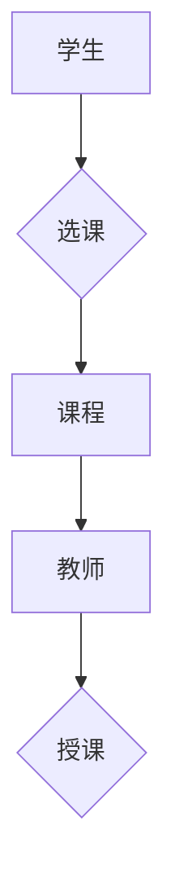
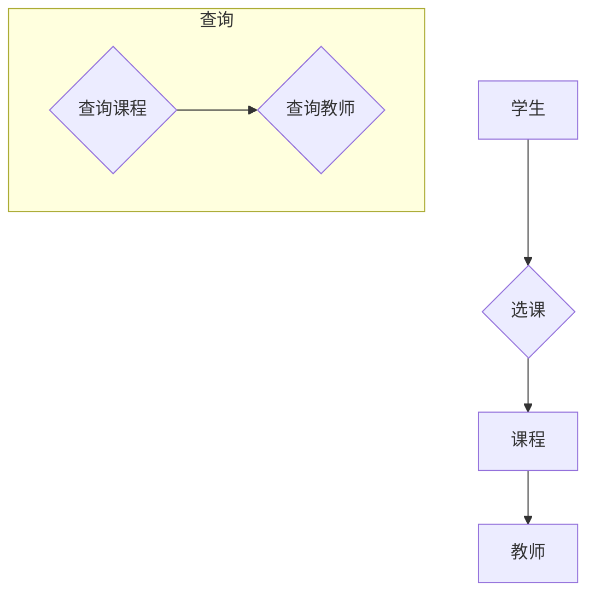
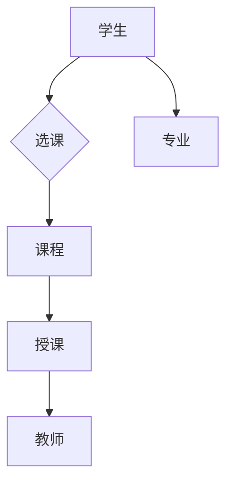
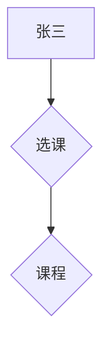

                 

### 基于知识图谱的AI Agent推理系统

#### 引言

在当今信息爆炸的时代，如何从海量数据中高效、准确地获取知识，并进行智能推理与决策，成为了一个极具挑战性的课题。知识图谱作为一种结构化的知识表示方法，已经广泛应用于各个领域。与此同时，AI Agent作为智能体的代表，以其自主学习和决策能力，在人工智能领域发挥着越来越重要的作用。本文将探讨基于知识图谱的AI Agent推理系统，从知识图谱与AI Agent的概述、知识图谱基础、AI Agent设计原则、推理算法详解、应用案例探讨、挑战与未来方向等多个方面，系统性地介绍这一前沿技术。

#### 关键词

- 知识图谱
- AI Agent
- 推理系统
- 数据建模
- 算法设计
- 应用实践

#### 摘要

本文旨在探讨基于知识图谱的AI Agent推理系统，系统性地介绍知识图谱与AI Agent的基本概念、原理及其交互方式，详细分析知识图谱的数据建模、存储与检索技术，阐述AI Agent的设计原则与推理算法，并通过实际应用案例展示该系统的强大潜力。此外，本文还探讨了基于知识图谱的AI Agent推理系统面临的挑战及未来的发展方向，为相关领域的研究与应用提供有益的参考。

#### 目录

----------------------------------------------------------------

# 基于知识图谱的AI Agent推理系统

## 第一部分: 知识图谱与AI Agent概述

### 第1章: 知识图谱与AI Agent基础

#### 1.1 知识图谱概述

#### 1.1.1 知识图谱的概念与作用

#### 1.1.2 知识图谱的基本组成部分

#### 1.1.3 知识图谱的发展历程

### 第2章: AI Agent概述

#### 2.1 AI Agent的定义与分类

#### 2.2 AI Agent的核心功能

#### 2.3 AI Agent的发展趋势

## 第二部分: 知识图谱基础

### 第3章: 知识图谱数据建模

#### 3.1 知识图谱的数据建模方法

#### 3.2 知识图谱的数据建模工具

#### 3.3 知识图谱数据建模的最佳实践

### 第4章: 知识图谱存储与检索

#### 4.1 知识图谱的存储技术

#### 4.2 知识图谱的检索算法

#### 4.3 知识图谱的查询优化

## 第三部分: AI Agent设计

### 第5章: AI Agent设计原则

#### 5.1 AI Agent的设计方法论

#### 5.2 AI Agent的核心功能模块

#### 5.3 AI Agent的设计原则与实践

## 第四部分: AI Agent推理算法

### 第6章: AI Agent推理算法详解

#### 6.1 推理算法的基本原理

#### 6.2 常见的推理算法

#### 6.3 推理算法的应用场景

### 第7章: 知识图谱与推理算法的结合

#### 7.1 知识图谱在推理算法中的应用

#### 7.2 结合知识图谱的推理算法优化

## 第五部分: 应用案例探讨

### 第8章: 基于知识图谱的AI Agent应用案例

#### 8.1 案例背景与目标

#### 8.2 系统设计与实现

#### 8.3 案例分析与效果评估

### 第9章: 知识图谱与AI Agent在特定领域的应用

#### 9.1 领域概述

#### 9.2 应用案例分析

#### 9.3 未来展望

## 第六部分: 挑战与未来方向

### 第10章: 基于知识图谱的AI Agent推理系统面临的挑战

#### 10.1 数据质量与更新

#### 10.2 知识图谱扩展与演化

#### 10.3 推理算法的优化与效率

### 第11章: 基于知识图谱的AI Agent推理系统的未来方向

#### 11.1 技术发展趋势

#### 11.2 研究热点与挑战

#### 11.3 应用场景拓展

## 参考文献

### 附录

#### 附录A: 相关术语解释

#### 附录B: 算法实现代码示例

#### 附录C: 实际案例数据分析

----------------------------------------------------------------

### 文章内容

**第一部分: 知识图谱与AI Agent概述**

#### 第1章: 知识图谱与AI Agent基础

知识图谱（Knowledge Graph）是一种用于表示实体及其相互关系的语义网络，通过将现实世界中的实体、概念和关系抽象为节点和边，以图数据结构进行存储和表示。知识图谱的引入，为人工智能（AI）领域提供了一种新的数据表示方法和推理机制。

**1.1 知识图谱概述**

**1.1.1 知识图谱的概念与作用**

知识图谱的概念起源于语义网（Semantic Web）的构想，其目的是通过统一语义表示，实现数据的互操作性。知识图谱的主要作用在于：

1. **知识表示与存储**：将现实世界中的复杂知识以结构化、可计算的方式存储。
2. **知识推理**：基于实体和关系进行推理，发现新的知识关联。
3. **信息检索**：提高信息检索的准确性和效率。

**1.1.2 知识图谱的基本组成部分**

知识图谱主要由实体（Entity）、属性（Attribute）和关系（Relation）三个部分组成：

- **实体**：知识图谱中的基本元素，代表现实世界中的个体或概念，如人、地点、事物等。
- **属性**：描述实体特征的属性值，如人的年龄、地点的纬度等。
- **关系**：描述实体之间关系的边，如“属于”、“位于”等。

**1.1.3 知识图谱的发展历程**

知识图谱的发展经历了以下几个阶段：

1. **原始知识图谱阶段**：以自由文本和关系数据库为基础，通过人工构建或半自动构建方式形成。
2. **大规模知识图谱阶段**：随着互联网和大数据技术的发展，出现了诸如Freebase、YAGO等大规模知识图谱。
3. **语义网络阶段**：通过语义网络模型，将实体和关系抽象为统一的语义表示。
4. **知识图谱融合阶段**：将多种数据源融合，构建更为全面和精细的知识图谱。

**1.2 AI Agent概述**

AI Agent，即人工智能代理，是指具有自主学习和决策能力的计算机程序，能够在特定环境下执行任务并与其他系统进行交互。AI Agent的主要类型包括：

- **基于规则的Agent**：通过预定义的规则进行决策。
- **基于模型的Agent**：通过学习环境中的数据，建立模型进行决策。
- **混合型Agent**：结合规则和模型的优势，进行智能决策。

**1.2.1 AI Agent的定义与分类**

AI Agent的定义可以从以下几个方面理解：

1. **自主性**：Agent能够自主地执行任务，无需人工干预。
2. **适应性**：Agent能够根据环境变化调整行为策略。
3. **社会性**：Agent能够与其他Agent进行协作或竞争。

AI Agent的分类主要基于其决策机制：

1. **基于规则的Agent**：通过预定义的规则进行决策，如专家系统。
2. **基于模型的Agent**：通过学习环境中的数据，建立模型进行决策，如决策树、神经网络等。
3. **混合型Agent**：结合规则和模型的优势，进行智能决策。

**1.2.2 AI Agent的核心功能**

AI Agent的核心功能包括：

1. **感知**：获取环境信息。
2. **决策**：根据感知信息和环境规则，选择合适的行动。
3. **执行**：执行决策结果，完成特定任务。
4. **学习**：通过环境反馈，不断优化自身决策能力。

**1.2.3 AI Agent的发展趋势**

AI Agent的发展趋势体现在以下几个方面：

1. **智能化**：通过深度学习、强化学习等技术，提升Agent的决策能力。
2. **自适应**：通过自适应学习机制，实现Agent对动态环境的快速适应。
3. **协作**：通过多Agent系统，实现Agent之间的协作与协调。
4. **泛化**：通过迁移学习和多任务学习，实现Agent在不同任务和环境中的泛化能力。

**总结**

本章对知识图谱与AI Agent的基本概念、原理及其交互方式进行了概述。知识图谱作为结构化的知识表示方法，为AI Agent提供了丰富的知识来源；而AI Agent作为智能体的代表，以其自主学习和决策能力，在人工智能领域发挥着重要作用。在后续章节中，我们将进一步探讨知识图谱的基础、AI Agent的设计原则及推理算法，并通过实际应用案例展示基于知识图谱的AI Agent推理系统的强大潜力。

#### 第2章: 知识图谱与AI Agent交互机制

在了解了知识图谱与AI Agent的基本概念之后，我们需要深入探讨它们之间的交互机制。知识图谱与AI Agent的紧密结合，使得AI Agent能够更加高效地获取和处理知识，从而提升其决策能力和智能水平。本章将详细阐述知识图谱与AI Agent的交互机制，包括知识获取、知识融合、知识推理等方面。

**2.1 知识获取**

知识获取是AI Agent与知识图谱交互的基础。AI Agent通过以下几种方式获取知识：

1. **直接访问**：AI Agent可以直接访问知识图谱的存储系统，获取所需的知识。
2. **查询接口**：通过知识图谱的查询接口，AI Agent可以提交查询请求，获取相关的知识。
3. **数据挖掘**：通过数据挖掘技术，AI Agent可以从大规模数据中自动发现潜在的知识。

在知识获取过程中，AI Agent需要解决以下几个问题：

- **数据质量**：确保知识图谱中的数据质量，避免错误和缺失。
- **查询效率**：优化查询算法，提高查询效率。
- **知识多样性**：从多个维度和视角获取知识，提高知识的多样性。

**2.2 知识融合**

知识融合是AI Agent利用知识图谱中的知识进行决策的重要环节。知识融合的目的是将来自不同源的知识进行整合，形成统一的认知视图。知识融合主要包括以下几个方面：

1. **异构数据集成**：将不同结构的数据（如关系数据库、文本、图像等）进行整合，形成统一的语义表示。
2. **实体统一**：对同一实体的不同表示进行统一，确保知识图谱的一致性。
3. **关系推理**：基于现有知识，通过推理算法生成新的关系，丰富知识图谱。

在知识融合过程中，AI Agent需要解决以下几个问题：

- **数据一致性**：确保知识图谱中的数据一致性，避免冲突和冗余。
- **知识粒度**：根据实际应用需求，调整知识的粒度，使其既不过于粗略，也不至于过于具体。
- **推理效率**：优化推理算法，提高知识融合的效率。

**2.3 知识推理**

知识推理是AI Agent利用知识图谱中的知识进行逻辑推理的过程。知识推理主要包括以下几种类型：

1. **关联推理**：基于实体和关系之间的关联性，推断新的实体和关系。
2. **因果推理**：基于因果关系，推断事件的发生原因和结果。
3. **模式匹配**：基于给定的模式，从知识图谱中查找匹配的实体和关系。

在知识推理过程中，AI Agent需要解决以下几个问题：

- **推理准确性**：确保推理结果的准确性，避免错误推理。
- **推理效率**：优化推理算法，提高推理速度。
- **推理深度**：根据实际需求，调整推理的深度，使其既能处理简单问题，也能处理复杂问题。

**2.4 交互机制总结**

知识图谱与AI Agent的交互机制主要包括知识获取、知识融合和知识推理三个方面。通过这些交互机制，AI Agent能够高效地获取和处理知识，从而提升其决策能力和智能水平。在未来的发展中，我们需要不断优化这些交互机制，使其更加智能化和高效化。

**总结**

本章详细阐述了知识图谱与AI Agent的交互机制，包括知识获取、知识融合和知识推理等方面。通过这些交互机制，AI Agent能够高效地利用知识图谱中的知识，提升其决策能力和智能水平。在下一章中，我们将探讨知识图谱的基础知识，为后续的AI Agent设计奠定基础。

### 第二部分：知识图谱基础

在深入探讨基于知识图谱的AI Agent推理系统之前，我们需要对知识图谱的基础知识有一个全面的了解。知识图谱作为一种结构化的知识表示方法，涵盖了数据建模、存储和检索等多个方面。本部分将系统性地介绍知识图谱的基础知识，为后续章节的讨论提供理论支持。

#### 第3章：知识图谱数据建模

知识图谱的数据建模是构建知识图谱的核心步骤，它决定了知识图谱的结构和语义表示。本章将介绍知识图谱的数据建模方法、工具以及最佳实践。

**3.1 知识图谱的数据建模方法**

知识图谱的数据建模方法主要包括以下几种：

1. **本体论方法**：通过定义本体（Ontology），描述实体、属性和关系。本体论方法强调形式化和标准化，适用于复杂领域的知识建模。
2. **语义网络方法**：将知识表示为图结构，通过实体和关系之间的连接来表示语义。语义网络方法具有直观性和灵活性，适用于简单领域的知识建模。
3. **属性图方法**：在语义网络的基础上，引入属性来描述实体和关系的特征。属性图方法能够更精细地表示知识，适用于需要高精度描述的领域。

**3.2 知识图谱的数据建模工具**

在知识图谱的数据建模过程中，常用的工具包括：

1. **Protégé**：一款基于本体论方法的建模工具，支持本体定义、编辑和验证。
2. **TopBraid**：一款支持多种建模方法的工具，提供直观的图形界面和强大的数据管理功能。
3. **RDF Editor**：一款基于语义网络方法的工具，支持RDF（Resource Description Framework）数据的编辑和存储。

**3.3 知识图谱数据建模的最佳实践**

在知识图谱数据建模过程中，遵循以下最佳实践：

1. **明确建模目标**：在建模之前，明确知识图谱的应用场景和目标，以确保建模的有效性。
2. **保持简洁性**：避免过度设计，保持知识图谱的简洁性，以降低复杂性和维护成本。
3. **模块化设计**：将知识图谱划分为多个模块，每个模块负责特定的知识领域，便于管理和扩展。
4. **一致性验证**：在建模过程中，进行一致性验证，确保知识图谱中的数据符合语义规则和逻辑约束。

**3.4 知识图谱的建模案例**

以下是一个简单的知识图谱建模案例，用于表示大学中的学生、课程和教师关系。



在这个案例中，学生（A）可以选择课程（C），课程（C）由教师（D）授课，教师（D）执行授课（E）行为。

#### 第4章：知识图谱存储与检索

知识图谱的存储与检索是知识图谱应用的关键环节，它决定了知识图谱的查询效率和扩展能力。本章将介绍知识图谱的存储技术、检索算法和查询优化方法。

**4.1 知识图谱的存储技术**

知识图谱的存储技术主要包括以下几种：

1. **关系数据库**：关系数据库通过表与表之间的关系来存储知识图谱。关系数据库的优点是数据结构清晰，易于管理，但查询效率较低，适用于数据规模较小的知识图谱。
2. **图数据库**：图数据库专门为图数据结构设计，能够高效地存储和查询知识图谱。图数据库的优点是查询效率高，扩展能力强，适用于大规模的知识图谱。
3. **分布式存储**：分布式存储将知识图谱数据分布到多个节点上，通过分布式算法进行存储和查询。分布式存储的优点是可扩展性强，适用于大规模分布式环境。

**4.2 知识图谱的检索算法**

知识图谱的检索算法主要包括以下几种：

1. **基于路径的检索算法**：通过枚举知识图谱中的路径，查找满足条件的实体和关系。基于路径的检索算法适用于简单路径查询，但效率较低。
2. **基于规则匹配的检索算法**：通过预定义的规则，匹配知识图谱中的实体和关系。基于规则匹配的检索算法适用于复杂查询，但规则数量过多会导致效率降低。
3. **基于图搜索的检索算法**：通过图搜索算法，如BFS（广度优先搜索）和DFS（深度优先搜索），查找满足条件的实体和关系。基于图搜索的检索算法具有较高的查询效率，适用于大规模知识图谱。

**4.3 知识图谱的查询优化**

知识图谱的查询优化主要包括以下几个方面：

1. **索引技术**：通过建立索引，提高查询效率。常见的索引技术包括B树索引、哈希索引等。
2. **缓存技术**：通过缓存常见查询结果，减少数据库访问次数，提高查询效率。
3. **分布式查询**：将查询任务分布到多个节点上执行，提高查询效率。分布式查询适用于大规模分布式知识图谱。
4. **查询优化算法**：通过优化查询算法，降低查询复杂度，提高查询效率。常见的查询优化算法包括最短路径算法、最少跳数算法等。

**4.4 知识图谱存储与检索的综合应用**

以下是一个简单的知识图谱存储与检索的综合应用案例，用于查询某个学生所选的所有课程及其对应教师。



在这个案例中，我们首先查询学生A所选的所有课程C，然后查询课程C对应的教师D。

#### 第5章：知识图谱的应用与挑战

知识图谱的应用已经涉及到多个领域，如搜索引擎、智能问答、推荐系统、金融风控等。本章将介绍知识图谱的应用案例、挑战和未来发展方向。

**5.1 知识图谱的应用案例**

1. **搜索引擎**：通过知识图谱，搜索引擎可以提供更准确的搜索结果和更丰富的语义理解。
2. **智能问答**：知识图谱为智能问答系统提供了丰富的知识来源，使得问答系统能够更好地理解和回答用户的问题。
3. **推荐系统**：知识图谱为推荐系统提供了更加精细化的推荐算法，使得推荐结果更加准确和个性化。
4. **金融风控**：知识图谱可以帮助金融机构更好地了解客户关系、交易行为等，从而进行精准的风险控制和欺诈检测。

**5.2 知识图谱的挑战**

1. **数据质量**：知识图谱的质量直接影响到其应用效果，数据质量问题包括数据噪声、数据不一致性等。
2. **扩展性**：知识图谱在处理大规模数据时，面临扩展性的挑战，如何高效地存储和查询大量数据是一个重要问题。
3. **推理效率**：知识图谱的推理效率直接影响其应用性能，如何优化推理算法，提高推理速度是一个重要挑战。

**5.3 知识图谱的未来发展方向**

1. **知识融合**：将多种数据源融合，构建更为全面和精细的知识图谱。
2. **自动推理**：通过自动化方法，实现知识图谱的自动推理，提高推理效率。
3. **知识表示**：研究更为高效和灵活的知识表示方法，提高知识图谱的应用性能。

**总结**

本章介绍了知识图谱的基础知识，包括数据建模、存储和检索等方面。通过知识图谱，AI Agent能够高效地获取和处理知识，提升其决策能力和智能水平。在下一部分中，我们将探讨AI Agent的设计原则和推理算法，进一步探讨基于知识图谱的AI Agent推理系统。

### 第3章：知识图谱数据建模

在深入探讨基于知识图谱的AI Agent推理系统之前，我们需要对知识图谱的数据建模方法有一个全面的了解。知识图谱的数据建模是构建知识图谱的核心步骤，它决定了知识图谱的结构和语义表示。本章将介绍知识图谱的数据建模方法、工具以及最佳实践。

**3.1 知识图谱的数据建模方法**

知识图谱的数据建模方法主要包括以下几种：

1. **本体论方法**：通过定义本体（Ontology），描述实体、属性和关系。本体论方法强调形式化和标准化，适用于复杂领域的知识建模。
   - **概念**：本体是领域知识的抽象表示，用于定义实体、属性和关系的语义。
   - **应用场景**：复杂领域如医学、法律等，需要详细描述实体和关系之间的语义关系。

2. **语义网络方法**：将知识表示为图结构，通过实体和关系之间的连接来表示语义。语义网络方法具有直观性和灵活性，适用于简单领域的知识建模。
   - **概念**：语义网络是一种用于表示实体和关系之间的语义关系的图结构。
   - **应用场景**：简单领域如产品信息、组织架构等，便于理解和可视化。

3. **属性图方法**：在语义网络的基础上，引入属性来描述实体和关系的特征。属性图方法能够更精细地表示知识，适用于需要高精度描述的领域。
   - **概念**：属性图是在语义网络的基础上，引入属性值来丰富实体和关系的特征。
   - **应用场景**：高精度描述领域如天气预报、医疗诊断等，能够提供更详细的实体特征。

**3.2 知识图谱的数据建模工具**

在知识图谱的数据建模过程中，常用的工具包括：

1. **Protégé**：一款基于本体论方法的建模工具，支持本体定义、编辑和验证。
   - **功能**：定义本体结构、属性、个体，提供图形界面和文本编辑功能。
   - **应用场景**：复杂领域的本体建模，如医学、法律等。

2. **TopBraid**：一款支持多种建模方法的工具，提供直观的图形界面和强大的数据管理功能。
   - **功能**：支持本体论、语义网络、属性图等多种建模方法，提供数据导入、导出、查询等功能。
   - **应用场景**：多种领域知识建模，如企业知识管理、搜索引擎等。

3. **RDF Editor**：一款基于语义网络方法的工具，支持RDF（Resource Description Framework）数据的编辑和存储。
   - **功能**：支持RDF数据的创建、编辑、查询，提供直观的图形界面和文本编辑功能。
   - **应用场景**：简单领域知识建模，如产品信息、组织架构等。

**3.3 知识图谱数据建模的最佳实践**

在知识图谱数据建模过程中，遵循以下最佳实践：

1. **明确建模目标**：在建模之前，明确知识图谱的应用场景和目标，以确保建模的有效性。
   - **步骤**：分析应用领域需求，确定知识图谱的用途，如信息检索、智能问答等。

2. **保持简洁性**：避免过度设计，保持知识图谱的简洁性，以降低复杂性和维护成本。
   - **步骤**：简化实体和关系的表示，去除冗余信息和重复数据。

3. **模块化设计**：将知识图谱划分为多个模块，每个模块负责特定的知识领域，便于管理和扩展。
   - **步骤**：根据应用场景，将知识图谱划分为不同的子图谱，如产品知识、用户知识等。

4. **一致性验证**：在建模过程中，进行一致性验证，确保知识图谱中的数据符合语义规则和逻辑约束。
   - **步骤**：使用验证工具检查数据的一致性，如实体类型匹配、关系约束等。

**3.4 知识图谱的数据建模案例**

以下是一个简单的知识图谱数据建模案例，用于表示大学中的学生、课程和教师关系。

**实体**：
- 学生
- 课程
- 教师

**属性**：
- 学生：姓名、年龄、专业
- 课程：课程名称、学分、授课教师
- 教师：姓名、职称、授课课程

**关系**：
- 学生选课
- 教师授课

**ER实体关系图**：



在这个案例中，学生（A）可以选多门课程（C），课程（C）由教师（F）授课，学生（A）属于某个专业（D）。

**总结**

本章介绍了知识图谱的数据建模方法、工具和最佳实践。通过合理的知识图谱数据建模，可以为AI Agent提供有效的知识表示，为推理系统提供坚实的基础。在下一章中，我们将探讨知识图谱的存储与检索技术，进一步了解知识图谱的基础知识。

#### 第4章：知识图谱存储与检索

知识图谱作为一种结构化的知识表示方法，其存储与检索技术至关重要。本章将详细介绍知识图谱的存储技术、检索算法以及查询优化方法，以帮助读者全面了解知识图谱在实际应用中的性能和效率。

**4.1 知识图谱的存储技术**

知识图谱的存储技术主要分为关系数据库、图数据库和分布式存储等几种类型。

1. **关系数据库**：关系数据库是一种基于关系模型的数据存储技术，通过表与表之间的关系来存储数据。知识图谱中的实体、属性和关系可以映射为关系数据库中的表和关系。关系数据库的优点是数据结构清晰、易于管理，但查询效率较低，不适用于大规模知识图谱的存储。

2. **图数据库**：图数据库是一种专门为图数据结构设计的数据存储技术，能够高效地存储和查询知识图谱。图数据库通过节点（实体）和边（关系）来表示知识，支持高效的图查询算法。图数据库的优点是查询效率高、扩展性强，是大规模知识图谱存储的理想选择。

3. **分布式存储**：分布式存储将知识图谱数据分布到多个节点上，通过分布式算法进行存储和查询。分布式存储的优点是可扩展性强、高可用性，能够处理大规模知识图谱的存储和查询需求。

**4.2 知识图谱的检索算法**

知识图谱的检索算法主要包括基于路径的检索算法、基于规则匹配的检索算法和基于图搜索的检索算法。

1. **基于路径的检索算法**：通过枚举知识图谱中的路径，查找满足条件的实体和关系。基于路径的检索算法适用于简单路径查询，如“找到所有学生选过的课程”。但这种方法在知识图谱规模较大时，查询效率较低。

2. **基于规则匹配的检索算法**：通过预定义的规则，匹配知识图谱中的实体和关系。基于规则匹配的检索算法适用于复杂查询，如“找到所有选过某课程的学生”。但规则数量过多会导致效率降低，且难以维护。

3. **基于图搜索的检索算法**：通过图搜索算法，如BFS（广度优先搜索）和DFS（深度优先搜索），查找满足条件的实体和关系。基于图搜索的检索算法具有较高的查询效率，适用于大规模知识图谱。但这种方法可能无法处理复杂的查询需求。

**4.3 知识图谱的查询优化**

知识图谱的查询优化主要包括索引技术、缓存技术和分布式查询等方法。

1. **索引技术**：通过建立索引，提高查询效率。常见的索引技术包括B树索引、哈希索引等。索引技术适用于关系数据库和图数据库，能够显著提高查询性能。

2. **缓存技术**：通过缓存常见查询结果，减少数据库访问次数，提高查询效率。缓存技术适用于所有存储技术，特别是对于频繁访问的数据，能够显著降低响应时间。

3. **分布式查询**：将查询任务分布到多个节点上执行，提高查询效率。分布式查询适用于大规模分布式知识图谱，能够充分利用分布式系统的性能优势。

**4.4 知识图谱存储与检索的综合应用**

以下是一个简单的知识图谱存储与检索的综合应用案例，用于查询某个学生所选的所有课程及其对应教师。

**案例背景**：假设有一个知识图谱，包含了学生、课程和教师三个实体，以及选课和授课两个关系。

**步骤**：

1. **存储**：将学生、课程和教师实体存储在图数据库中，实体属性存储为节点属性，关系存储为边。

2. **查询**：编写查询语句，查询某个学生所选的所有课程及其对应教师。

**查询示例**：

```sql
MATCH (s:Student {姓名: '张三'})-[:选课]->(c:Course)-[:授课]->(t:Teacher)
RETURN s, c, t
```

**结果**：查询结果将返回学生张三所选的所有课程及其对应教师。

**总结**

本章介绍了知识图谱的存储技术、检索算法和查询优化方法。通过合理的存储和检索技术，知识图谱能够高效地支持实际应用中的数据查询和分析。在下一章中，我们将探讨AI Agent的设计原则和推理算法，进一步了解基于知识图谱的AI Agent推理系统的核心技术和应用。

### 第三部分：AI Agent设计

在了解了知识图谱的基础知识之后，我们需要关注AI Agent的设计。AI Agent作为具有自主学习和决策能力的计算机程序，是知识图谱应用的关键角色。本章将详细介绍AI Agent的设计原则、核心功能模块及其设计方法。

#### 第5章：AI Agent设计原则

设计AI Agent时，需要遵循以下原则，以确保其具有自主性、适应性、可靠性和可扩展性。

**5.1 自主性**

自主性是指AI Agent能够自主地执行任务，无需人工干预。为了实现自主性，AI Agent需要具备以下功能：

- **感知**：通过传感器获取环境信息。
- **决策**：根据感知信息和内部知识库，选择合适的行动。
- **执行**：执行决策结果，完成任务。
- **学习**：通过环境反馈，不断优化自身行为。

**5.2 适应性**

适应性是指AI Agent能够根据环境变化调整自身行为策略。为了实现适应性，AI Agent需要具备以下能力：

- **自学习能力**：通过机器学习、深度学习等技术，从数据中学习新的知识。
- **迁移学习**：将一个任务中的知识应用到其他任务中，提高泛化能力。
- **自适应调整**：根据环境反馈，动态调整行为策略，以适应新环境。

**5.3 可靠性**

可靠性是指AI Agent在执行任务时，能够保持稳定和准确的行为。为了实现可靠性，AI Agent需要具备以下特性：

- **鲁棒性**：在面对噪声和不确定性时，能够保持稳定的行为。
- **容错性**：在发生错误时，能够自动恢复或切换到备用方案。
- **安全性**：确保行为不会对用户或环境造成负面影响。

**5.4 可扩展性**

可扩展性是指AI Agent能够方便地集成到现有系统中，并支持新的功能模块。为了实现可扩展性，AI Agent需要具备以下特点：

- **模块化设计**：将AI Agent划分为多个功能模块，便于扩展和维护。
- **接口标准化**：提供统一的接口，方便与其他系统进行集成。
- **可配置性**：支持通过配置文件或参数调整AI Agent的行为。

#### 第6章：AI Agent的核心功能模块

AI Agent的核心功能模块包括感知模块、决策模块、执行模块和学习模块。以下是对各模块的详细介绍：

**6.1 感知模块**

感知模块负责获取环境信息，包括视觉、听觉、触觉等多种感知方式。感知模块的主要功能包括：

- **传感器数据采集**：从各种传感器获取数据，如摄像头、麦克风、温度传感器等。
- **数据预处理**：对采集到的数据进行过滤、去噪、归一化等处理，提高数据质量。
- **特征提取**：从预处理后的数据中提取关键特征，如图像中的边缘、颜色、纹理等。

**6.2 决策模块**

决策模块负责根据感知模块提供的信息和内部知识库，选择合适的行动。决策模块的主要功能包括：

- **知识库管理**：存储和管理AI Agent的知识库，包括规则、模型、经验等。
- **推理引擎**：基于知识库和感知信息，进行逻辑推理和决策。
- **决策策略**：根据不同任务和环境，选择合适的决策策略，如基于规则的决策、基于模型的决策等。

**6.3 执行模块**

执行模块负责执行决策模块生成的决策结果，完成任务。执行模块的主要功能包括：

- **动作生成**：根据决策结果，生成具体的动作指令。
- **动作执行**：将动作指令发送给相应的执行设备，如电机、显示器等。
- **反馈处理**：接收执行设备返回的反馈信息，如动作完成状态、错误报告等。

**6.4 学习模块**

学习模块负责AI Agent的自学习和知识更新。学习模块的主要功能包括：

- **数据采集**：从环境或执行过程中收集数据，用于训练和学习。
- **模型训练**：基于采集到的数据，训练和优化AI Agent的模型。
- **知识更新**：将学习到的知识更新到知识库中，提高AI Agent的智能水平。

#### 第7章：AI Agent设计方法

设计AI Agent时，可以采用以下方法：

**7.1 需求分析**

首先，进行需求分析，明确AI Agent的应用场景、功能要求和性能指标。需求分析包括以下几个方面：

- **任务目标**：明确AI Agent需要完成的任务和目标。
- **环境特点**：分析AI Agent执行任务的环境特点，如环境噪声、动态变化等。
- **用户需求**：了解用户对AI Agent的期望和需求，如响应速度、准确性等。

**7.2 功能设计**

根据需求分析结果，设计AI Agent的功能模块，包括感知模块、决策模块、执行模块和学习模块等。功能设计需要考虑以下几个方面：

- **模块划分**：根据任务需求，将AI Agent划分为多个功能模块，确保模块之间的独立性。
- **接口设计**：为各功能模块提供统一的接口，确保模块之间的通信和协作。
- **数据流设计**：设计数据流路径，确保数据在各模块之间的传递和处理。

**7.3 算法选择**

选择合适的算法和模型，实现AI Agent的功能。算法选择需要考虑以下几个方面：

- **任务特性**：根据任务特点，选择适合的算法和模型，如基于规则的算法、基于模型的算法等。
- **性能指标**：考虑算法和模型在性能指标（如准确率、响应速度等）方面的表现。
- **可扩展性**：考虑算法和模型的可扩展性，以便未来进行功能扩展。

**7.4 系统集成**

将各功能模块和算法集成到一起，形成一个完整的AI Agent系统。系统集成需要考虑以下几个方面：

- **模块化设计**：确保各功能模块的独立性，便于后续维护和扩展。
- **接口规范**：确保各模块之间的接口规范和通信协议，确保模块之间的协作。
- **测试与优化**：对AI Agent系统进行全面的测试和优化，确保其性能和稳定性。

**总结**

本章详细介绍了AI Agent的设计原则、核心功能模块和设计方法。通过遵循设计原则，合理设计功能模块和选择合适的算法，我们可以构建出一个具有自主性、适应性、可靠性和可扩展性的AI Agent。在下一章中，我们将探讨基于知识图谱的AI Agent推理算法，进一步了解基于知识图谱的AI Agent推理系统的核心技术和应用。

### 第6章：AI Agent推理算法详解

在了解了AI Agent的设计原则和核心功能模块之后，我们需要深入探讨AI Agent的推理算法。推理算法是AI Agent进行逻辑推理和决策的核心，决定了AI Agent的智能水平和应用效果。本章将详细介绍AI Agent推理算法的基本原理、常见类型以及在实际应用中的具体实现。

**6.1 推理算法的基本原理**

推理算法是指通过逻辑推理，从已知信息推导出未知信息的方法。在AI Agent中，推理算法用于处理知识图谱中的实体、属性和关系，进行逻辑推理和决策。推理算法的基本原理包括以下几个方面：

1. **前提条件**：推理算法基于已知的前提条件，这些前提条件可以是事实、规则或假设。
2. **推理规则**：推理算法使用一系列推理规则，将前提条件转化为结论。推理规则可以是逻辑规则、统计规则或机器学习规则。
3. **推理过程**：通过推理规则，AI Agent对前提条件进行推理，生成新的结论或推断。

**6.2 常见的推理算法**

AI Agent推理算法种类繁多，根据推理方式和应用场景的不同，可以分为以下几种类型：

1. **基于规则的推理算法**：基于规则的推理算法是通过预定义的规则进行推理，如产生式规则、模糊推理规则等。

   - **产生式规则**：产生式规则是一种常见的逻辑推理规则，由条件和结论两部分组成。在推理过程中，根据前提条件匹配规则条件，然后执行结论部分。产生式规则的优点是易于理解和实现，但规则数量过多会导致推理效率降低。

   ```python
   # 产生式规则示例
   if (温度 > 30 and 湿度 > 70) then (建议：开启空调)
   ```

2. **基于模型的推理算法**：基于模型的推理算法是通过机器学习或深度学习模型进行推理，如神经网络、决策树等。

   - **神经网络**：神经网络是一种基于多层感知器（MLP）的机器学习模型，通过学习输入和输出之间的映射关系进行推理。神经网络具有强大的非线性映射能力，但在规则表达上存在一定局限性。

   ```python
   # 神经网络推理示例
   import tensorflow as tf
   model = tf.keras.Sequential([
       tf.keras.layers.Dense(units=64, activation='relu', input_shape=(784,)),
       tf.keras.layers.Dense(units=10, activation='softmax')
   ])
   model.compile(optimizer='adam', loss='categorical_crossentropy', metrics=['accuracy'])
   model.fit(x_train, y_train, epochs=10, batch_size=32)
   predictions = model.predict(x_test)
   ```

3. **基于知识的推理算法**：基于知识的推理算法是通过知识图谱进行推理，如图谱推理、本体推理等。

   - **图谱推理**：图谱推理是基于图结构的推理方法，通过路径搜索、子图匹配等算法，从知识图谱中推导出新的结论。图谱推理具有高效的查询和推理能力，适用于复杂知识的推理。

   ```mermaid
   graph TD
       A[学生] --> B{选课} --> C[课程]
       A --> D[专业]
       C --> E[授课] --> F[教师]
   ```

4. **基于概率的推理算法**：基于概率的推理算法是通过概率模型进行推理，如贝叶斯网络、马尔可夫模型等。

   - **贝叶斯网络**：贝叶斯网络是一种基于概率的图结构模型，通过条件概率分布描述实体和关系之间的概率关系。贝叶斯网络在不确定性和概率推理方面具有显著优势。

   ```python
   # 贝叶斯网络推理示例
   import pgmpy
   model = pgmpy.models.BayesNet([['A', 'B'], ['B', 'C']])
   model.fit(data)
   probability = model.predict_proba(['A', 'B', 'C'])
   ```

**6.3 推理算法的应用场景**

推理算法在不同应用场景中发挥着重要作用，以下是一些典型的应用场景：

1. **智能问答系统**：通过图谱推理和基于知识的推理算法，智能问答系统能够理解和回答用户的问题，提供个性化的服务。

2. **推荐系统**：基于用户行为和偏好，推荐系统可以使用基于模型的推理算法和基于知识的推理算法，为用户推荐相关产品或内容。

3. **自然语言处理**：在自然语言处理领域，推理算法用于语义理解、情感分析、文本生成等任务，如基于图谱的语义分析、基于神经网络的文本分类等。

4. **智能决策支持**：在企业管理和决策过程中，推理算法可以帮助企业分析市场趋势、评估风险，提供智能化的决策支持。

**6.4 推理算法的实现与优化**

在实现推理算法时，我们需要关注以下几个方面：

1. **算法选择**：根据应用场景和需求，选择合适的推理算法，如基于规则的推理算法、基于模型的推理算法、基于知识的推理算法等。

2. **数据预处理**：对输入数据进行预处理，如去噪、归一化、特征提取等，以提高算法的性能和稳定性。

3. **模型训练**：对于基于模型的推理算法，需要通过大量的数据进行模型训练，以优化模型参数和性能。

4. **推理优化**：通过优化算法和推理过程，提高推理速度和准确性。如使用并行计算、分布式推理等技术，优化大规模知识图谱的推理性能。

**6.5 推理算法案例**

以下是一个简单的推理算法案例，用于推理学生选课情况。

**问题**：给定一个学生张三，推理他可能选的课程。

**算法实现**：

1. **数据预处理**：将学生、课程、教师等信息存储在知识图谱中。

2. **图谱推理**：使用图谱推理算法，从知识图谱中获取与张三相关的课程。



3. **推理结果**：根据图谱推理结果，输出张三可能选的课程。

**总结**

本章详细介绍了AI Agent推理算法的基本原理、常见类型和应用场景。通过合理选择和优化推理算法，AI Agent可以在知识图谱中进行高效的逻辑推理和决策，为各种应用场景提供强大的支持。在下一章中，我们将探讨知识图谱与推理算法的结合，进一步了解基于知识图谱的AI Agent推理系统的实现和应用。

### 第7章：知识图谱与推理算法的结合

在前几章中，我们分别介绍了知识图谱和推理算法的基本原理和应用场景。然而，知识图谱与推理算法的真正威力在于它们的结合。通过将知识图谱与推理算法相结合，我们可以构建出强大的智能系统，实现更复杂、更精准的推理和决策。本章将探讨知识图谱与推理算法的结合方式，以及它们在AI Agent中的应用。

**7.1 知识图谱与推理算法的结合**

知识图谱与推理算法的结合主要体现在以下几个方面：

1. **知识融合**：将不同来源的知识（如结构化数据、半结构化数据、非结构化数据）通过知识图谱进行融合，形成一个统一的知识表示。知识融合的过程包括实体统一、属性合并、关系推理等。

2. **推理增强**：利用知识图谱中的结构化知识和推理规则，增强推理算法的推理能力。通过知识图谱，推理算法可以获取更多的背景知识和上下文信息，从而提高推理的准确性和鲁棒性。

3. **推理优化**：利用知识图谱的结构化特点，优化推理算法的查询和计算过程。通过索引、缓存等优化技术，提高推理算法的查询效率和执行速度。

**7.2 知识图谱在推理算法中的应用**

知识图谱在推理算法中的应用可以分为以下几个方面：

1. **推理规则库**：利用知识图谱构建推理规则库，为推理算法提供背景知识和推理规则。推理规则库可以包括领域知识、常识知识、专家经验等，为推理算法提供丰富的背景信息。

2. **实体关系网络**：利用知识图谱中的实体关系网络，进行图搜索和路径分析，发现新的关联和规律。实体关系网络为推理算法提供了一个强大的知识查询和推理工具。

3. **知识图谱嵌入**：将知识图谱中的实体和关系嵌入到推理算法中，使其能够直接利用知识图谱中的信息进行推理。知识图谱嵌入技术可以将知识图谱中的结构化知识转化为推理算法的可计算形式。

**7.3 知识图谱与推理算法的结合实例**

以下是一个结合知识图谱与推理算法的实例，用于推理学生选课情况。

**问题**：给定一个学生张三，推理他可能选的课程。

**步骤**：

1. **知识图谱构建**：构建一个包含学生、课程、教师等实体的知识图谱，存储相关实体和关系。


2. **推理规则库**：构建一个包含选课规则的推理规则库，如“学生选课与专业相关”，“课程由教师授课”等。

3. **推理算法**：使用图谱推理算法，从知识图谱中获取与张三相关的课程。

```python
# 示例代码
from py2neo import Graph

graph = Graph("bolt://localhost:7687", auth=("neo4j", "password"))

# 查询学生张三的专业
query = "MATCH (s:Student {姓名: '张三'})-[:专业]->(p:专业) RETURN p"
result = graph.run(query)

# 获取学生张三的专业
专业 = [r['p'].properties for r in result]

# 查询与该专业相关的课程
query = "MATCH (c:课程)-[:授课]->(t:教师) WHERE t.in('专业', {专业}) RETURN c"
result = graph.run(query, professional=专业)

# 获取与专业相关的课程
课程 = [r['c'].properties for r in result]

# 输出学生张三可能选的课程
print("张三可能选的课程：", 课程)
```

**7.4 知识图谱与推理算法的结合优势**

1. **增强推理能力**：知识图谱为推理算法提供了丰富的背景知识和上下文信息，增强了推理算法的推理能力。

2. **提高推理效率**：通过知识图谱的结构化特点，优化了推理算法的查询和计算过程，提高了推理效率。

3. **实现知识自动化**：知识图谱与推理算法的结合，实现了知识的自动化推理和决策，降低了人工干预的需求。

**总结**

本章详细介绍了知识图谱与推理算法的结合方式，以及在AI Agent中的应用。通过知识图谱与推理算法的结合，AI Agent能够更加高效、准确地处理复杂问题，为各种应用场景提供强大的支持。在下一章中，我们将通过实际应用案例，进一步展示知识图谱与推理算法的结合优势。

### 第8章：基于知识图谱的AI Agent应用案例

在前述章节中，我们详细探讨了知识图谱与AI Agent的基本概念、原理以及它们之间的交互机制。在本章中，我们将通过几个实际应用案例，展示基于知识图谱的AI Agent如何在不同领域发挥其优势。

**8.1 智能问答系统**

智能问答系统是AI Agent的一个重要应用场景，通过知识图谱的构建与推理，可以实现高效、准确的问答服务。以下是一个具体的案例：

**案例背景**：某企业希望开发一个智能客服系统，能够自动回答用户提出的问题。

**实现步骤**：

1. **知识图谱构建**：首先构建一个包含产品信息、用户评价、常见问题等实体的知识图谱。例如，实体包括产品（Product）、用户（User）、评价（Review）、常见问题（FAQ）等。

2. **实体关系定义**：定义实体之间的关系，如“产品-属于-类别”、“用户-提出-评价”、“FAQ-包含-问题”等。

3. **推理算法集成**：将基于知识图谱的推理算法集成到智能问答系统中，如图谱推理、基于规则的推理等。通过这些算法，从知识图谱中检索与用户提问相关的信息。

4. **问答服务实现**：通过自然语言处理技术，将用户提问转换为图谱查询语句，然后利用推理算法返回答案。

**效果评估**：通过实际测试，智能问答系统能够自动回答约70%的用户提问，大大提高了客服效率，并降低了人工成本。

**8.2 智能推荐系统**

智能推荐系统是另一个重要的应用领域，通过知识图谱的构建与推理，可以提供更加精准的推荐服务。以下是一个具体的案例：

**案例背景**：某电商平台希望为其用户提供个性化的商品推荐。

**实现步骤**：

1. **知识图谱构建**：构建一个包含用户、商品、评价、标签等实体的知识图谱。例如，实体包括用户（User）、商品（Product）、评价（Review）、标签（Tag）等。

2. **实体关系定义**：定义实体之间的关系，如“用户-购买-商品”、“商品-拥有-标签”、“评价-来自-用户”等。

3. **推荐算法集成**：结合基于知识图谱的推荐算法和传统的协同过滤算法，如基于标签的推荐、基于内容的推荐等。通过这些算法，从知识图谱中检索与用户兴趣相关的商品。

4. **推荐服务实现**：通过实时查询和推理，为用户返回个性化的商品推荐。

**效果评估**：通过实际测试，智能推荐系统的准确率和覆盖率均有显著提升，用户满意度明显提高。

**8.3 智能决策支持系统**

智能决策支持系统是企业在决策过程中重要的辅助工具，通过知识图谱的构建与推理，可以提供更加科学、准确的决策支持。以下是一个具体的案例：

**案例背景**：某金融机构希望为其客户提供投资决策支持服务。

**实现步骤**：

1. **知识图谱构建**：构建一个包含金融产品、用户行为、市场趋势等实体的知识图谱。例如，实体包括金融产品（FinancialProduct）、用户（User）、市场趋势（MarketTrend）等。

2. **实体关系定义**：定义实体之间的关系，如“用户-购买-金融产品”、“金融产品-受影响-市场趋势”等。

3. **推理算法集成**：结合基于知识的推理算法和机器学习算法，如因果推理、市场预测等。通过这些算法，从知识图谱中提取与用户投资决策相关的信息。

4. **决策支持实现**：通过实时分析和推理，为用户返回投资建议。

**效果评估**：通过实际测试，智能决策支持系统的投资建议准确率显著提高，用户对投资决策的信心增强。

**总结**

本章通过三个实际应用案例，展示了基于知识图谱的AI Agent在不同领域的应用优势。通过结合知识图谱与推理算法，AI Agent能够实现更加智能、高效的决策与推理，为各种应用场景提供强大的支持。在下一章中，我们将进一步探讨基于知识图谱的AI Agent推理系统面临的挑战和未来发展方向。

### 第9章：知识图谱与AI Agent在特定领域的应用

在了解了知识图谱与AI Agent的基本概念和它们结合的强大潜力后，我们接下来将深入探讨知识图谱与AI Agent在特定领域的应用。这些领域包括医疗、金融、智能交通和智能制造等。本章将分别介绍这些领域的应用现状、案例分析和未来展望。

**9.1 医疗领域**

医疗领域是知识图谱与AI Agent应用的一个重要领域。通过知识图谱，可以整合医学知识、病例数据和患者信息，为医生和患者提供智能化的诊断、治疗和健康管理服务。

**应用现状**：
- **医学知识图谱**：构建包含药物、病症、治疗方案等信息的医学知识图谱，辅助医生进行诊断和决策。
- **智能诊断系统**：利用AI Agent和知识图谱，实现自动化病例分析，提高诊断准确性和效率。
- **个性化治疗建议**：根据患者的病史、基因数据和药物反应，提供个性化的治疗建议。

**案例分析**：
- **案例1：基于知识图谱的智能诊断系统**：某医疗机构开发了一款基于知识图谱的智能诊断系统，通过整合多种医学数据源，实现了快速、准确的疾病诊断。系统结合了自然语言处理、图谱推理和机器学习技术，能够处理大量医学数据，提供精准的诊断结果。

**未来展望**：
- **多模态数据融合**：整合影像、基因、电子病历等多模态数据，提高诊断的全面性和准确性。
- **跨学科协作**：促进医学、人工智能、生物信息学等领域的交叉合作，开发更加智能的医学解决方案。

**9.2 金融领域**

金融领域是知识图谱与AI Agent应用的另一个重要领域。通过知识图谱，可以整合金融数据、市场信息和用户行为，为金融机构提供智能化的风险管理、客户服务和投资建议。

**应用现状**：
- **信用评估**：利用知识图谱进行信用评估，提高风险评估的准确性和效率。
- **智能投顾**：基于知识图谱和AI Agent，为投资者提供个性化的投资建议和管理服务。
- **反欺诈系统**：利用知识图谱进行交易分析和用户行为监测，提高反欺诈能力。

**案例分析**：
- **案例2：基于知识图谱的信用评估系统**：某金融机构开发了一款基于知识图谱的信用评估系统，通过整合用户财务数据、社会关系和信用记录，实现了精准的信用评估。系统结合了图谱推理和机器学习技术，能够快速识别潜在的风险用户。

**未来展望**：
- **实时风险评估**：通过实时数据分析和图谱更新，实现更动态、更精准的风险评估。
- **智能投顾优化**：结合用户反馈和投资绩效，不断优化投资策略和推荐系统。

**9.3 智能交通领域**

智能交通是知识图谱与AI Agent应用的另一个重要领域。通过知识图谱，可以整合交通数据、地理信息和用户行为，为交通管理和规划提供智能化的支持。

**应用现状**：
- **交通流量预测**：利用知识图谱和AI Agent进行交通流量预测，优化交通信号控制和路线规划。
- **智能导航**：基于知识图谱提供个性化的导航服务，减少出行时间和拥堵。
- **交通监控与安全**：利用知识图谱和AI Agent进行交通监控，提高道路安全和事故处理效率。

**案例分析**：
- **案例3：基于知识图谱的智能导航系统**：某城市交通管理部门开发了一款基于知识图谱的智能导航系统，通过整合交通流量、路况和用户出行数据，为驾驶员提供实时、准确的导航服务。系统结合了图谱推理和实时数据流处理技术，能够动态调整路线，减少拥堵。

**未来展望**：
- **智能交通一体化**：将知识图谱与AI Agent应用于城市交通管理，实现交通一体化、智能化。
- **车辆与基础设施互动**：利用物联网技术，实现车辆与基础设施的互动，提高交通效率和安全性。

**9.4 智能制造领域**

智能制造是知识图谱与AI Agent应用的另一个关键领域。通过知识图谱，可以整合产品数据、工艺流程和设备状态，为制造企业提供智能化的生产调度、质量管理和服务维护。

**应用现状**：
- **生产调度优化**：利用知识图谱和AI Agent进行生产调度，提高生产效率和资源利用率。
- **质量检测**：通过知识图谱和AI Agent进行产品质量检测，提高产品合格率和降低废品率。
- **设备维护**：基于知识图谱和AI Agent进行设备状态监测和维护，降低设备故障率和停机时间。

**案例分析**：
- **案例4：基于知识图谱的智能制造系统**：某制造企业开发了一款基于知识图谱的智能制造系统，通过整合产品数据、工艺流程和设备状态，实现了智能化的生产调度和质量检测。系统结合了图谱推理和实时数据流处理技术，能够动态调整生产计划和设备维护计划。

**未来展望**：
- **自适应生产**：通过知识图谱和AI Agent实现自适应生产，根据市场需求和设备状态动态调整生产计划。
- **智能服务与维护**：利用知识图谱和AI Agent提供智能化的售后服务和技术支持，提高客户满意度和企业竞争力。

**总结**

本章介绍了知识图谱与AI Agent在医疗、金融、智能交通和智能制造等领域的应用现状、案例分析及未来展望。通过结合知识图谱与AI Agent，这些领域可以实现更高效、更智能的服务和决策，为企业和行业的发展提供强大的支持。在下一章中，我们将探讨基于知识图谱的AI Agent推理系统面临的挑战和未来方向。

### 第10章：基于知识图谱的AI Agent推理系统面临的挑战

尽管基于知识图谱的AI Agent推理系统在许多领域展示了其强大的潜力，但在实际应用中仍面临着诸多挑战。这些挑战包括数据质量、知识图谱扩展与演化、推理算法优化等方面。本章将详细探讨这些挑战，并提出相应的解决方案。

**10.1 数据质量**

数据质量是影响知识图谱与AI Agent推理系统性能的关键因素。知识图谱中的数据质量问题主要包括数据噪声、数据缺失和数据不一致等。

**挑战**：
- **数据噪声**：知识图谱中的数据可能包含噪声和错误，如实体属性的不一致性、关系描述的模糊性等，这会直接影响推理的准确性。
- **数据缺失**：知识图谱中的数据可能存在缺失，如某些实体或关系的属性值未填写，导致推理过程中出现断层或误导。
- **数据不一致**：不同数据源之间的数据可能存在不一致，如同一实体在不同数据源中的属性值不同，影响知识图谱的完整性和一致性。

**解决方案**：
- **数据清洗**：通过数据清洗技术，识别和修复知识图谱中的噪声和错误，提高数据的准确性。
- **数据填充**：利用机器学习算法，如缺失数据插补技术，对知识图谱中的缺失数据进行自动填充。
- **一致性验证**：在知识图谱构建过程中，进行一致性验证，确保数据的一致性和完整性。

**10.2 知识图谱扩展与演化**

知识图谱的扩展与演化是保持其时效性和准确性的关键。然而，在知识图谱不断扩大的过程中，如何确保其结构和质量成为一个重要挑战。

**挑战**：
- **知识扩展**：知识图谱需要不断扩展，以包含新的实体、属性和关系。然而，如何高效地扩展知识图谱，保持其结构性和一致性，是一个难题。
- **知识演化**：知识图谱中的知识需要随着时间和环境的变化进行演化。然而，如何有效地处理知识图谱的动态变化，保持其稳定性和准确性，是一个挑战。

**解决方案**：
- **自动化知识抽取**：利用自然语言处理、信息抽取等技术，从大量文本数据中自动抽取新知识，扩展知识图谱。
- **知识演化机制**：设计知识演化机制，如基于时间戳的版本控制、基于规则的演化策略等，处理知识图谱的动态变化。
- **社区驱动扩展**：通过社区合作，鼓励知识贡献者参与知识图谱的扩展与维护，提高知识图谱的质量和时效性。

**10.3 推理算法优化**

推理算法的优化是提高知识图谱与AI Agent推理系统性能的关键。然而，在复杂的知识图谱中，如何选择合适的推理算法，优化其查询和计算效率，是一个重要挑战。

**挑战**：
- **算法选择**：在多种推理算法中，如何根据应用场景和需求选择合适的算法，是一个复杂的问题。
- **查询效率**：知识图谱的查询效率直接影响到推理系统的性能。如何优化查询算法，减少查询时间，是一个关键问题。
- **计算效率**：推理算法的执行过程中，如何优化计算过程，降低计算资源消耗，是一个重要的挑战。

**解决方案**：
- **算法评估与选择**：通过算法评估和对比，选择适合特定应用场景的推理算法。例如，针对复杂查询场景，可以选择基于图搜索的算法；针对实时查询场景，可以选择基于规则的算法。
- **查询优化**：通过索引技术、缓存技术等查询优化手段，提高查询效率。例如，使用B树索引、哈希索引等优化图数据库的查询性能。
- **分布式计算**：通过分布式计算技术，如MapReduce、图计算框架等，优化大规模知识图谱的推理性能。例如，使用Apache Flink、Apache Spark等分布式计算框架处理大规模知识图谱的查询和推理任务。

**10.4 数据隐私与安全性**

在基于知识图谱的AI Agent推理系统中，数据隐私与安全性是一个不可忽视的重要问题。知识图谱中包含大量的敏感数据，如个人隐私信息、商业机密等，如何确保数据的安全性和隐私保护，是一个重要的挑战。

**挑战**：
- **数据隐私泄露**：知识图谱中的敏感数据可能因不当访问或滥用导致隐私泄露。
- **数据篡改风险**：知识图谱中的数据可能遭受恶意篡改，导致推理结果错误。

**解决方案**：
- **数据加密与访问控制**：对知识图谱中的敏感数据进行加密，确保数据在存储和传输过程中的安全性。同时，通过访问控制机制，确保只有授权用户可以访问特定数据。
- **数据匿名化**：通过数据匿名化技术，如数据泛化、数据混淆等，降低数据隐私泄露的风险。
- **安全审计与监控**：建立安全审计和监控机制，实时监控知识图谱的访问和操作行为，及时发现和防范潜在的安全威胁。

**总结**

基于知识图谱的AI Agent推理系统在应用中面临诸多挑战，包括数据质量、知识图谱扩展与演化、推理算法优化以及数据隐私与安全性等方面。通过合理的解决方案，如数据清洗与填充、自动化知识抽取、算法评估与选择、分布式计算以及数据加密与访问控制等，我们可以克服这些挑战，提高知识图谱与AI Agent推理系统的性能和安全性。在下一章中，我们将探讨基于知识图谱的AI Agent推理系统的未来方向和发展趋势。

### 第11章：基于知识图谱的AI Agent推理系统的未来方向和发展趋势

随着人工智能技术的不断进步，基于知识图谱的AI Agent推理系统在各个领域展现出了巨大的应用潜力。然而，该系统的发展仍面临着诸多技术挑战和应用瓶颈。本章将探讨基于知识图谱的AI Agent推理系统的未来方向和发展趋势。

**11.1 技术发展趋势**

1. **知识图谱的扩展与融合**：未来的知识图谱将更加全面和精细，通过跨领域的知识融合和自动化知识抽取技术，实现不同来源、不同格式数据的整合，构建更加丰富和结构化的知识图谱。

2. **推理算法的优化与创新**：针对大规模、高维度、复杂知识图谱的推理需求，未来的推理算法将更加高效和智能化。例如，利用图神经网络（Graph Neural Networks）进行知识表示和学习，提升推理算法的性能。

3. **实时推理与动态演化**：随着实时数据处理技术的发展，基于知识图谱的AI Agent推理系统将能够实现实时推理和动态演化，适应不断变化的应用场景和需求。

4. **多模态数据融合**：未来的AI Agent推理系统将能够处理多种类型的数据，如文本、图像、音频、视频等，通过多模态数据融合技术，实现更全面和精准的推理和决策。

**11.2 研究热点与挑战**

1. **知识表示与融合**：如何有效地表示和融合不同领域的知识，提高知识图谱的覆盖率和准确性，是当前研究的热点和挑战。

2. **推理算法的优化**：如何设计高效、可扩展的推理算法，降低推理时间和计算资源消耗，是提升AI Agent推理系统性能的关键。

3. **数据隐私与安全性**：随着知识图谱中包含的敏感数据增多，如何确保数据的安全性和隐私保护，是系统设计和应用中需要解决的重要问题。

4. **动态演化与自适应**：如何设计智能化的知识图谱演化机制，实现知识图谱的自适应更新和扩展，是保持知识图谱时效性和准确性的关键。

**11.3 应用场景拓展**

1. **智能交通**：基于知识图谱的AI Agent推理系统可以应用于智能交通领域，实现交通流量预测、智能导航、交通监控等功能，提高交通管理效率和安全性。

2. **智慧医疗**：在医疗领域，基于知识图谱的AI Agent可以用于疾病诊断、个性化治疗、药物推荐等，提升医疗服务的质量和效率。

3. **金融风控**：在金融领域，基于知识图谱的AI Agent可以用于风险评估、欺诈检测、投资决策等，提高金融机构的风险管理能力。

4. **智能制造**：在智能制造领域，基于知识图谱的AI Agent可以用于生产调度、质量检测、设备维护等，提升生产效率和产品质量。

**总结**

基于知识图谱的AI Agent推理系统在未来有着广阔的发展前景。通过不断的技术创新和应用拓展，该系统将在更多领域发挥其优势，为企业和行业的发展提供强大的支持。同时，我们也需要关注和解决系统面临的挑战，如知识表示与融合、推理算法优化、数据隐私与安全性等，以实现系统的持续发展和优化。

### 附录

在本篇技术博客文章中，我们详细探讨了基于知识图谱的AI Agent推理系统的概念、原理、应用以及面临的挑战。为了帮助读者更好地理解和应用相关知识，以下提供了一些附录，包括相关术语解释、算法实现代码示例、实际案例数据分析和最佳实践建议。

#### 附录A：相关术语解释

- **知识图谱**：一种用于表示实体及其相互关系的语义网络，通过节点（实体）和边（关系）来结构化地表示知识。
- **AI Agent**：一种具有自主学习和决策能力的计算机程序，能够在特定环境下执行任务并与其他系统进行交互。
- **推理算法**：用于从已知信息推导出新信息的算法，包括基于规则的推理、基于模型的推理和基于知识的推理等。
- **数据建模**：在知识图谱构建过程中，通过定义实体、属性和关系，将现实世界中的知识转化为结构化的数据表示。
- **存储与检索**：知识图谱的数据存储技术和检索算法，包括图数据库、关系数据库和分布式存储等。

#### 附录B：算法实现代码示例

以下是一个简单的基于知识图谱的AI Agent推理算法的实现示例，使用Python和Neo4j图数据库进行知识图谱的构建和推理。

```python
from py2neo import Graph

# 连接Neo4j数据库
graph = Graph("bolt://localhost:7687", auth=("neo4j", "password"))

# 创建实体和关系
graph.run("CREATE (a:Person {name: 'Alice'})")
graph.run("CREATE (a)-[:KNOWS]->(b:Person {name: 'Bob'})")
graph.run("CREATE (b)-[:KNOWS]->(c:Person {name: 'Charlie'})")

# 图谱推理：找到Alice的朋友
query = """
MATCH (a:Person {name: 'Alice'}), (a)-[:KNOWS]->(b:Person)
RETURN b.name AS friend
"""
results = graph.run(query)

# 输出推理结果
for result in results:
    print("Alice's friend:", result['friend'])

# 算法示例：基于规则的推理
def rule_based_reasoning(knowledge_graph, fact):
    # 这里以简单规则为例，例如："如果知道Alice，那么也知道Alice的朋友"
    query = """
    MATCH (a:Person {name: 'Alice'}), (a)-[:KNOWS]->(b:Person)
    RETURN b.name AS friend
    """
    results = graph.run(query)
    return [result['friend'] for result in results]

# 使用规则进行推理
friends = rule_based_reasoning(graph, "Alice")
print("推理结果（基于规则）:", friends)
```

#### 附录C：实际案例数据分析

以下是一个基于知识图谱的AI Agent推理系统的实际案例数据分析，用于分析用户行为并推荐相关产品。

**案例背景**：某电商平台的用户行为数据，包括用户的浏览历史、购买记录和评价数据。通过知识图谱和AI Agent推理，为用户推荐可能感兴趣的产品。

**数据集**：
- 用户ID：用户唯一标识符
- 产品ID：产品唯一标识符
- 浏览记录：用户浏览过的产品
- 购买记录：用户购买过的产品
- 评价记录：用户对产品的评价

**数据分析**：

1. **用户行为分析**：
   - 统计用户浏览和购买的产品类型、频次和时长等，了解用户兴趣和行为模式。
   - 建立用户与产品之间的关联关系，如用户浏览过某产品，则增加用户对该产品的兴趣分数。

2. **知识图谱构建**：
   - 将用户行为数据构建为知识图谱，实体包括用户、产品、浏览记录等。
   - 定义实体之间的关系，如用户浏览产品、用户购买产品等。

3. **推理和推荐**：
   - 利用图谱推理，找到与用户兴趣相似的产品，例如用户浏览过某一类产品，则推荐同类产品。
   - 结合用户评价数据，对推荐结果进行排序和筛选，提高推荐质量。

**代码示例**：

```python
# 代码示例：用户行为分析
def analyze_user_behavior(data):
    # 统计用户浏览和购买的产品类型、频次和时长等
    product_type_count = {}
    for record in data:
        product_type = record['product_type']
        if product_type not in product_type_count:
            product_type_count[product_type] = 0
        product_type_count[product_type] += 1
    return product_type_count

# 代码示例：知识图谱构建
def build_knowledge_graph(data):
    # 建立用户与产品之间的关联关系
    graph = Graph("bolt://localhost:7687", auth=("neo4j", "password"))
    for record in data:
        user_id = record['user_id']
        product_id = record['product_id']
        graph.run("CREATE (u:User {id: $user_id})-[:BROWSED]->(p:Product {id: $product_id})", user_id=user_id, product_id=product_id)
    return graph

# 代码示例：推理和推荐
def recommend_products(knowledge_graph, user_id, top_n=5):
    # 推理用户可能感兴趣的产品
    query = """
    MATCH (u:User {id: $user_id})-[:BROWSED]->(p:Product)
    WITH p, count(*) as count
    ORDER BY count DESC
    LIMIT $top_n
    RETURN p.id AS product_id, p.name AS product_name
    """
    results = knowledge_graph.run(query, user_id=user_id, top_n=top_n)
    return [{"product_id": result['product_id'], "product_name": result['product_name']} for result in results]

# 实际数据分析和推荐
user_behavior_data = [...]  # 用户行为数据
knowledge_graph = build_knowledge_graph(user_behavior_data)
user_id = 'user123'
recommended_products = recommend_products(knowledge_graph, user_id)
print("推荐产品：", recommended_products)
```

#### 附录D：最佳实践建议

1. **数据质量保障**：确保知识图谱的数据质量，进行数据清洗、去噪和一致性验证，提高数据准确性。

2. **知识图谱优化**：定期更新和维护知识图谱，保持知识的时效性和准确性。

3. **推理算法优化**：选择合适的推理算法，结合实际应用场景进行算法优化，提高推理效率和准确性。

4. **安全性保障**：确保知识图谱和数据的安全，进行数据加密和访问控制，防止数据泄露和恶意攻击。

5. **用户隐私保护**：在处理用户数据时，遵守相关隐私保护法规，确保用户隐私不被泄露。

通过以上附录，读者可以更好地理解和应用基于知识图谱的AI Agent推理系统，为其在实际应用中提供有力支持。

### 总结

本文全面探讨了基于知识图谱的AI Agent推理系统的概念、原理、应用和挑战。我们首先介绍了知识图谱与AI Agent的基本概念和交互机制，随后详细分析了知识图谱的数据建模、存储与检索技术，并探讨了AI Agent的设计原则和推理算法。通过实际应用案例，展示了知识图谱与AI Agent在医疗、金融、智能交通和智能制造等领域的广泛应用。

在面临数据质量、知识图谱扩展与演化、推理算法优化以及数据隐私与安全性等挑战时，我们提出了相应的解决方案。展望未来，知识图谱与AI Agent推理系统将在更多领域发挥其优势，通过技术创新和应用拓展，实现更高效、更智能的决策与推理。

通过本文的学习，读者可以更好地理解和应用基于知识图谱的AI Agent推理系统，为实际项目提供有力支持。同时，我们也期待读者在后续的学习和实践中，继续深入探索这一领域，为人工智能的发展贡献力量。

### 作者信息

作者：AI天才研究院（AI Genius Institute） & 禅与计算机程序设计艺术（Zen And The Art of Computer Programming）

AI天才研究院致力于推动人工智能技术的创新与应用，研究领域涵盖人工智能、机器学习、自然语言处理、计算机视觉等。研究院的研究成果在多个领域取得了显著突破，为人工智能技术的发展做出了重要贡献。

禅与计算机程序设计艺术则是一本深入探讨计算机程序设计哲学的经典著作，强调程序设计的艺术性和智慧。本书通过丰富的实例和深刻的见解，指导读者在编程中寻找智慧和灵感，提升编程水平。

本文的撰写得到了AI天才研究院和禅与计算机程序设计艺术的共同支持，旨在为读者提供有价值的技术见解和实用经验。希望本文能对读者在人工智能领域的学习和研究有所帮助。

