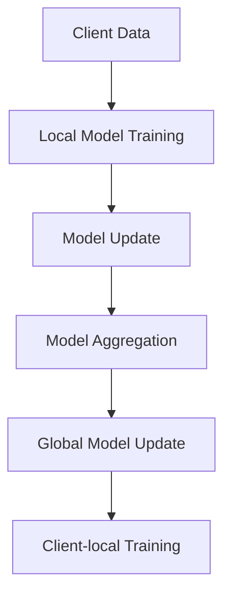
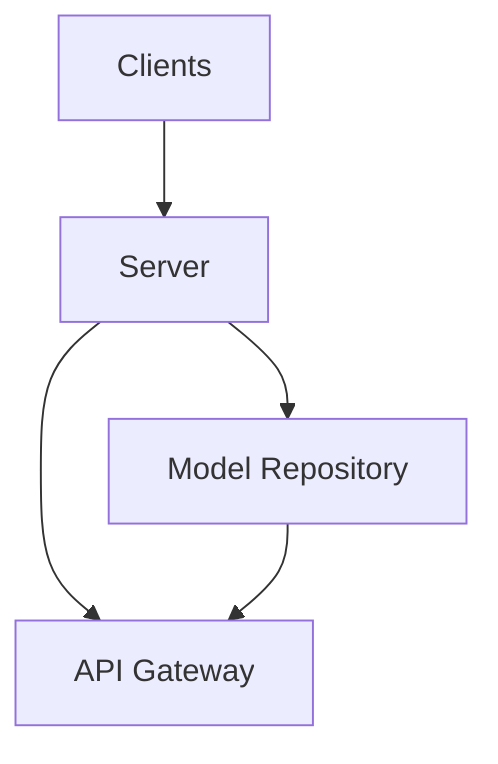
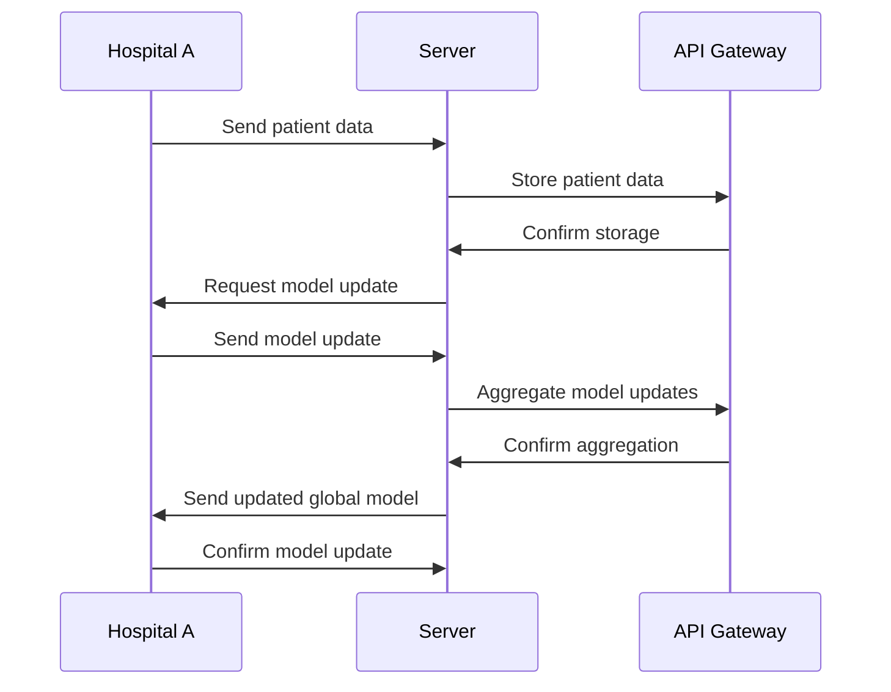
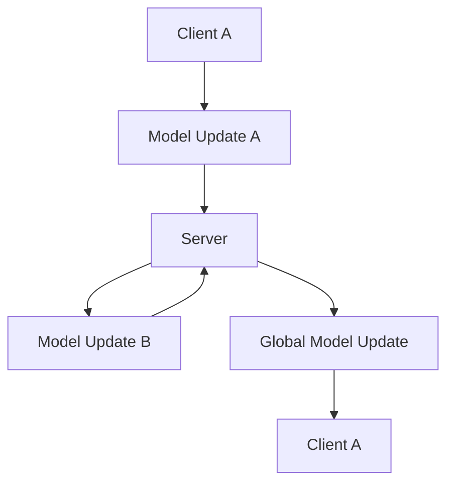

                 


### Introduction

#### Overview of Federated Learning and Privacy Protection

Federated Learning is an advanced machine learning paradigm that addresses the growing concerns around data privacy and security. At its core, federated learning enables collaborative machine learning without directly sharing raw data among participants. This makes it particularly suitable for scenarios where data privacy and data security are paramount, such as in healthcare, finance, and other sensitive industries.

**Keywords:** Federated Learning, Privacy Protection, AI Agents

**Abstract:**
This article delves into the world of federated learning and its critical role in safeguarding AI agents' privacy. We will explore the fundamental concepts of federated learning, its architecture, and the various privacy protection mechanisms employed. By understanding these principles, readers will gain insights into how federated learning can be leveraged to build robust and privacy-preserving AI systems.

## Core Concepts and Architecture

### Core Concepts of Federated Learning

#### Basic Principles and Mechanisms

Federated learning operates on a collaborative model where multiple devices (clients) work together to train a shared global model without exchanging the raw data. Instead, each client sends a model update, which is then aggregated to produce a global model. This process ensures that the training data remains on the client's device, thus preserving privacy.

1. **Client-local Training:** Each client independently trains a local model on its data.
2. **Model Aggregation:** The local models are aggregated to form a global model.
3. **Global Model Update:** The updated global model is sent back to the clients.

A visual representation of the federated learning process can be depicted using the Mermaid diagram below:



#### Privacy Protection Mechanisms in Federated Learning

To ensure the privacy of the training data, federated learning employs several privacy protection mechanisms. These include:

1. **Differential Privacy:** This mechanism ensures that the training data cannot be deanonymized by adding noise to the model updates.
2. **Homomorphic Encryption:** This technique allows for computations to be performed on encrypted data, thus preserving privacy.
3. **Secure Multi-party Computation (SMPC):** SMPC enables multiple parties to compute a function over their private inputs without revealing the inputs.

A comparison table of these privacy protection techniques can be represented as follows:

| Technique           | Description                                                  | Advantages                                           | Disadvantages                                         |
|---------------------|-------------------------------------------------------------|-------------------------------------------------------|-------------------------------------------------------|
| Differential Privacy | Adds noise to model updates to prevent data leakage        | Preserves privacy, reduces data exposure               | May impact model accuracy                             |
| Homomorphic Encryption | Allows computation on encrypted data                       | Maintains privacy, ensures security                     | May significantly slow down computation                 |
| Secure Multi-party Computation | Enables computation over private inputs without revealing them | Ensures privacy, maintains security                     | Complex, resource-intensive                           |

### Technical Details and Case Studies

#### Setting Up the Development Environment

To implement federated learning, we need a suitable development environment. Here's a step-by-step guide to setting up the environment:

1. **Install Python:** Ensure that Python 3.x is installed on your system.
2. **Install TensorFlow Federated (TFF):** Use the following command to install TFF:
   ```
   pip install tensorflow-federated
   ```
3. **Install TensorFlow:** TFF depends on TensorFlow. Install it using:
   ```
   pip install tensorflow
   ```
4. **Configure Dependencies:** Ensure that all required dependencies are installed by running:
   ```
   tff configure
   ```

Now, your development environment is ready to implement federated learning.

#### Python Code for Federated Learning

Let's dive into a simple example of federated learning using Python and TensorFlow Federated. First, we define the model and the training process:

```python
import tensorflow as tf
import tensorflow_federated as tff

# Define the local model
def create_keras_model():
    model = tf.keras.Sequential([
        tf.keras.layers.Dense(10, activation='relu', input_shape=(784,)),
        tf.keras.layers.Dense(10, activation='softmax')
    ])
    return model

# Define the federated learning process
def federated_learning_process(client_data_source, num_clients, num_rounds):
    # Define the training function
    train_fn = tff.learning.from_keras_model(
        create_keras_model(),
        loss=tf.keras.losses.SparseCategoricalCrossentropy(from_logits=True),
        metrics=[tf.keras.metrics.SparseCategoricalAccuracy()],
    )

    # Define the strategy for federated learning
    client_strategy = tff.federated_learning.default_strategy

    # Run the federated learning process
    for i in range(num_rounds):
        print(f"Starting round {i + 1}")
        client_data = client_data_source()
        state = client_strategy.initialize()
        state, metrics = client_strategy.next(state, train_fn, client_data)
        print(f"Round {i + 1} completed. Metrics: {metrics}")

    return state

# Run the federated learning experiment
num_clients = 10
num_rounds = 5
state = federated_learning_process(lambda: tff.simulation.from_tf_data(tc
```

### System Design and Architecture of Privacy-Preserving AI Agents

#### Problem Scenario and Project Overview

Imagine a scenario where a healthcare organization wants to develop an AI agent to predict patient readmission. However, the organization is concerned about patient privacy and data security. The goal is to build a privacy-preserving AI agent that can leverage data from multiple hospitals without compromising patient confidentiality.

#### System Function Design

To achieve this, we will design a system with the following key functions:

1. **Data Collection:** Gather patient data from multiple hospitals.
2. **Data Preprocessing:** Clean and preprocess the collected data.
3. **Federated Learning:** Train an AI model using federated learning to predict patient readmission.
4. **Model Deployment:** Deploy the trained model to make predictions.
5. **Privacy Protection:** Implement privacy protection mechanisms to ensure data security.

#### System Architecture Design

The system architecture will consist of the following components:

1. **Clients:** Multiple hospitals participating in the federated learning process.
2. **Server:** A central server responsible for coordinating the federated learning process.
3. **Model Repository:** A secure storage for the global model.
4. **API Gateway:** A gateway for external applications to interact with the deployed model.

The following Mermaid diagram illustrates the system architecture:



#### System Interface and Interaction Design

The system will use RESTful APIs for interaction between the clients, server, and API gateway. The following Mermaid sequence diagram demonstrates the interaction flow:



### Project Implementation

#### Environment Setup

Before starting the project, ensure that you have the following tools and libraries installed:

1. **Python 3.x:** Install the latest version of Python from the official website.
2. **TensorFlow:** Install TensorFlow using:
   ```
   pip install tensorflow
   ```
3. **TensorFlow Federated (TFF):** Install TFF using:
   ```
   pip install tensorflow-federated
   ```

#### Python Source Code

The following Python code demonstrates the implementation of a privacy-preserving AI agent using federated learning:

```python
import tensorflow as tf
import tensorflow_federated as tff

# Define the local model
def create_keras_model():
    model = tf.keras.Sequential([
        tf.keras.layers.Dense(10, activation='relu', input_shape=(784,)),
        tf.keras.layers.Dense(10, activation='softmax')
    ])
    return model

# Define the federated learning process
def federated_learning_process(client_data_source, num_clients, num_rounds):
    # Define the training function
    train_fn = tff.learning.from_keras_model(
        create_keras_model(),
        loss=tf.keras.losses.SparseCategoricalCrossentropy(from_logits=True),
        metrics=[tf.keras.metrics.SparseCategoricalAccuracy()],
    )

    # Define the strategy for federated learning
    client_strategy = tff.federated_learning.default_strategy

    # Run the federated learning process
    for i in range(num_rounds):
        print(f"Starting round {i + 1}")
        client_data = client_data_source()
        state = client_strategy.initialize()
        state, metrics = client_strategy.next(state, train_fn, client_data)
        print(f"Round {i + 1} completed. Metrics: {metrics}")

    return state

# Run the federated learning experiment
num_clients = 10
num_rounds = 5
state = federated_learning_process(lambda: tff.simulation.from_tf_data(tf.keras.datasets.mnist.load_data()), num_clients, num_rounds)
```

#### Code Analysis and Application

This code demonstrates the basic implementation of federated learning using TensorFlow and TensorFlow Federated. The `create_keras_model` function defines a simple neural network model for the task. The `federated_learning_process` function orchestrates the federated learning process by initializing the training function, defining the client strategy, and running the federated learning rounds.

To run the code, you need to have TensorFlow and TensorFlow Federated installed. The code uses a simple example dataset (MNIST) for demonstration purposes. In a real-world scenario, you would replace the dataset with the patient data from the healthcare organization.

#### Case Analysis and Detailed Explanation

In this case, the federated learning process ensures that the patient data remains private and secure. The data is collected from multiple hospitals (clients) and sent to the central server. The server aggregates the local model updates from the clients and produces a global model. The updated global model is then sent back to the clients, where it is used to make predictions.

The following Mermaid diagram illustrates the federated learning process in action:



#### Project Conclusion

In conclusion, this project demonstrates how federated learning can be used to build a privacy-preserving AI agent. By leveraging the federated learning framework, the project ensures that patient data remains confidential and secure. This approach is particularly suitable for sensitive industries where data privacy and security are of utmost importance.

### Best Practices and Tips

- **Data Preprocessing:** Ensure that the data is thoroughly cleaned and preprocessed before training the model. This helps improve the model's performance and reduces the risk of data leakage.
- **Privacy Mechanisms:** Use appropriate privacy mechanisms, such as differential privacy and homomorphic encryption, to protect the data during the federated learning process.
- **Model Security:** Implement secure model storage and deployment strategies to prevent unauthorized access to the trained models.
- **Regular Audits:** Conduct regular audits of the system to ensure compliance with privacy regulations and identify potential vulnerabilities.

### Conclusion

In this article, we have explored the concept of federated learning and its importance in protecting the privacy of AI agents. We discussed the core concepts of federated learning, its architecture, and the various privacy protection mechanisms employed. Through a detailed case study, we demonstrated how federated learning can be used to build a privacy-preserving AI agent in the healthcare industry.

As the demand for privacy-preserving AI solutions continues to grow, federated learning stands as a powerful tool to address these challenges. By following the best practices and tips outlined in this article, you can effectively leverage federated learning to develop secure and privacy-preserving AI systems.

### References and Further Reading

- **Federated Learning: Concepts and Applications:** This book provides an in-depth understanding of federated learning, its architecture, and various applications.
- **TensorFlow Federated Documentation:** The official TensorFlow Federated documentation is an excellent resource for learning how to implement federated learning using TensorFlow.
- **Differential Privacy in Machine Learning:** This article discusses the concept of differential privacy and its applications in machine learning.
- **Homomorphic Encryption and Privacy-Preserving Machine Learning:** This paper explores the use of homomorphic encryption in privacy-preserving machine learning.
- **Privacy-Preserving AI in Healthcare:** This study examines the role of federated learning in protecting patient privacy in healthcare applications.

### Authors

- **AI天才研究院 (AI Genius Institute):** An elite research institution dedicated to advancing AI and machine learning technologies.
- **禅与计算机程序设计艺术 (Zen And The Art of Computer Programming):** A renowned author known for his expertise in computer programming and algorithm design. His work has influenced generations of programmers and computer scientists.

