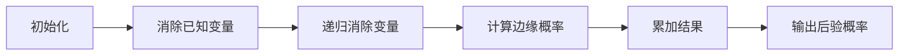
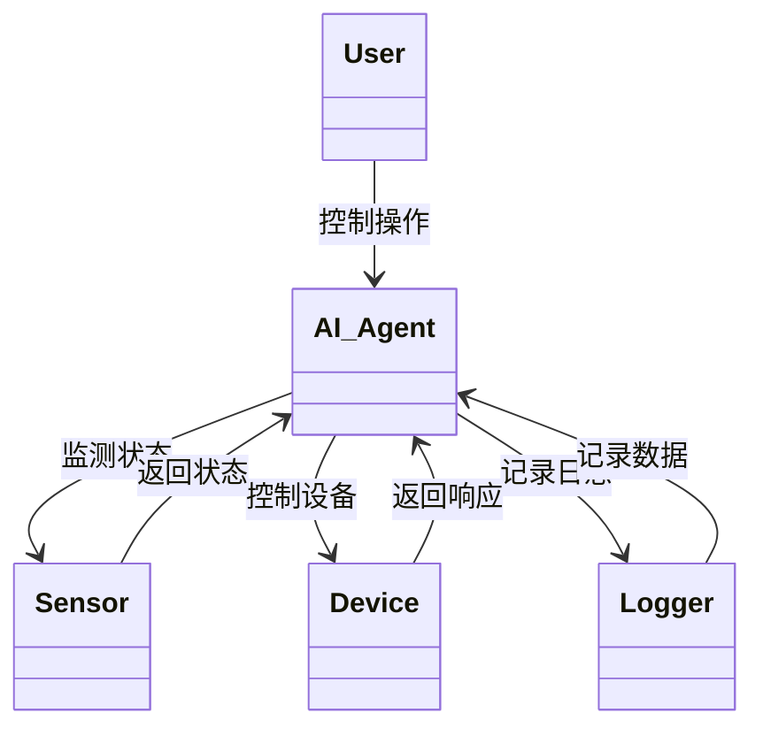
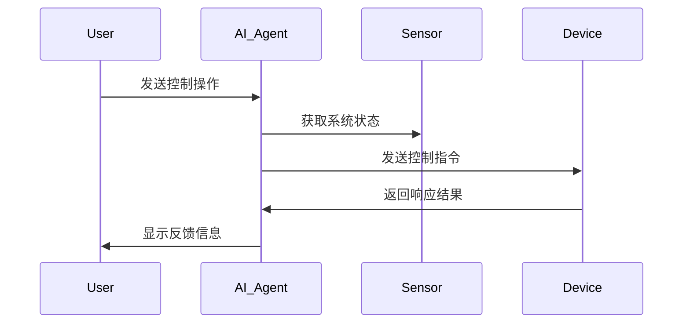
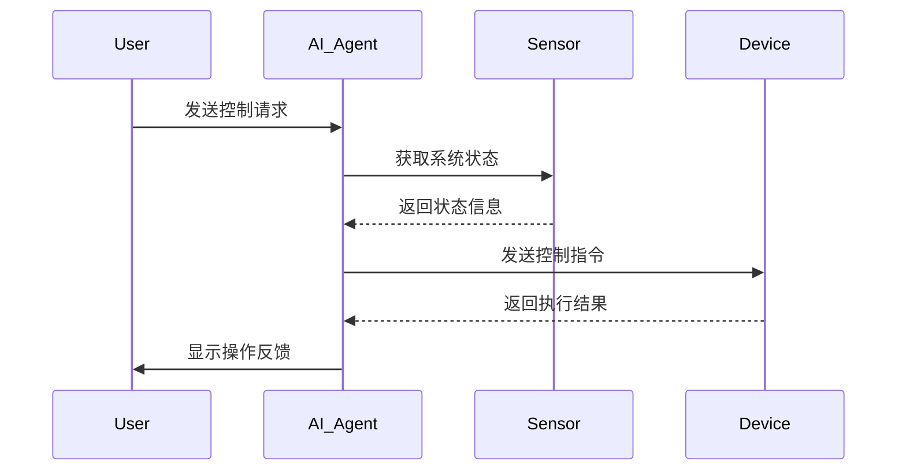

                 

# 基于贝叶斯方法的AI Agent不确定性处理

## 关键词：贝叶斯方法，AI Agent，不确定性处理，算法原理，实际应用

## 摘要：

本文旨在探讨贝叶斯方法在AI Agent不确定性处理中的应用。首先，我们将介绍贝叶斯方法的基础知识，包括其发展历程、数学基础以及贝叶斯推理的基本步骤。接着，我们将深入解析贝叶斯网络的构建与应用，并通过案例分析来展示其实际应用效果。随后，我们将对AI Agent进行概述，探讨其定义、分类、基本功能与特性，以及发展趋势。在此基础上，我们将探讨贝叶斯方法在AI Agent决策、学习和规划中的应用。接下来，通过具体案例，我们将展示贝叶斯网络在智能客服系统、智能推荐系统和智能交通系统中的应用。最后，我们将介绍不确定性的处理方法、优化方法，以及这些方法在实际案例中的应用，并对贝叶斯方法在AI Agent不确定性处理中的挑战与未来趋势进行展望。

## 第一部分：贝叶斯方法基础

### 第1章：贝叶斯理论介绍

#### 1.1 贝叶斯方法的发展历程

贝叶斯方法起源于18世纪，由托马斯·贝叶斯提出。贝叶斯定理是贝叶斯方法的基石，它描述了在已知某些条件下，一个事件发生概率的计算方法。随着时间的推移，贝叶斯方法不断发展，逐渐成为概率论和统计学的重要分支。在20世纪，贝叶斯方法在人工智能领域得到了广泛应用，尤其是在不确定性处理方面。

#### 1.2 贝叶斯方法的数学基础

贝叶斯方法的核心是贝叶斯定理，其数学表达式如下：

$$P(A|B) = \frac{P(B|A)P(A)}{P(B)}$$

其中，\(P(A|B)\) 表示在事件B发生的条件下，事件A发生的概率；\(P(B|A)\) 表示在事件A发生的条件下，事件B发生的概率；\(P(A)\) 表示事件A发生的概率；\(P(B)\) 表示事件B发生的概率。

#### 1.3 贝叶斯推理的基本步骤

贝叶斯推理的基本步骤包括：

1. **定义事件和概率**：首先，我们需要定义要推理的事件，并给出它们的先验概率。
2. **观察数据**：然后，我们观察数据，计算出条件概率。
3. **更新概率**：利用贝叶斯定理，更新事件的概率。
4. **决策**：最后，根据更新后的概率，进行决策。

### 第2章：贝叶斯网络的构建与应用

#### 2.1 贝叶斯网络的基本概念

贝叶斯网络是一种概率图模型，用于表示一组随机变量之间的条件依赖关系。它由节点和边组成，其中节点表示随机变量，边表示变量之间的依赖关系。贝叶斯网络通过条件概率表（CPT）来描述变量之间的概率关系。

#### 2.2 贝叶斯网络的构建方法

构建贝叶斯网络的方法包括：

1. **因果图法**：通过分析因果关系，构建贝叶斯网络。
2. **统计学习方法**：通过统计学习方法，如最大似然估计，构建贝叶斯网络。
3. **专家系统法**：通过领域专家的知识，构建贝叶斯网络。

#### 2.3 贝叶斯网络的推理算法

贝叶斯网络的推理算法包括：

1. **精确推理**：如变量 elimination 算法，计算所有变量的后验概率。
2. **近似推理**：如信念传播算法，通过马尔可夫链蒙特卡罗（MCMC）等方法，计算近似的后验概率。

#### 2.4 贝叶斯网络的案例分析

我们将通过一个实际案例，展示贝叶斯网络的构建与应用。例如，我们可以构建一个诊断系统，用于诊断疾病。在这个系统中，我们定义了疾病、症状和检查结果等变量，并通过专家知识构建贝叶斯网络。然后，通过观察患者的症状和检查结果，我们可以利用贝叶斯网络推理出患者患某种疾病的概率，从而帮助医生进行诊断。

## 第二部分：AI Agent的不确定性处理

### 第3章：AI Agent概述

#### 3.1 AI Agent的定义与分类

AI Agent是指能够感知环境、制定计划、执行行动，并在环境中自主决策的计算机程序。根据功能和目的，AI Agent可以分为：

1. **智能体**：能够感知环境，但不具备自主决策能力。
2. **决策者**：具备自主决策能力，但无法执行行动。
3. **执行者**：既具备自主决策能力，又能执行行动。

#### 3.2 AI Agent的基本功能与特性

AI Agent的基本功能包括：

1. **感知**：通过传感器获取环境信息。
2. **推理**：利用已知信息和推理规则，进行逻辑推理。
3. **决策**：根据推理结果，制定行动计划。
4. **执行**：执行计划中的行动。

AI Agent的特性包括：

1. **自主性**：能够自主决策和执行行动。
2. **适应性**：能够根据环境变化，调整行为策略。
3. **学习性**：能够通过学习，提高决策能力。

#### 3.3 AI Agent的发展趋势

随着人工智能技术的不断发展，AI Agent正逐渐走向智能化、自适应化和协同化。未来的发展趋势包括：

1. **强化学习**：通过不断试错，提高决策能力。
2. **多智能体系统**：多个智能体协同工作，提高整体性能。
3. **情境感知**：通过多模态传感器，提高对环境的感知能力。
4. **自主决策**：实现更高级别的自主决策，减少人类干预。

### 第4章：贝叶斯方法在AI Agent中的应用

#### 4.1 贝叶斯方法在AI Agent决策中的应用

贝叶斯方法在AI Agent决策中的应用主要体现在两个方面：

1. **后验概率计算**：利用贝叶斯定理，计算决策结果的后验概率。
2. **决策优化**：通过最大化后验概率，优化决策结果。

具体应用场景包括：

1. **风险决策**：在不确定的环境中，计算不同决策方案的风险，选择最优方案。
2. **概率推断**：根据已知信息和观测数据，推断未知信息。

#### 4.2 贝叶斯方法在AI Agent学习中的应用

贝叶斯方法在AI Agent学习中的应用主要体现在两个方面：

1. **先验知识集成**：利用贝叶斯网络，将专家知识集成到学习过程中。
2. **概率模型选择**：通过贝叶斯信息准则（BIC），选择最佳概率模型。

具体应用场景包括：

1. **机器学习模型选择**：通过比较不同模型的概率分布，选择最佳模型。
2. **不确定性量化**：通过贝叶斯网络，量化学习过程中的不确定性。

#### 4.3 贝叶斯方法在AI Agent规划中的应用

贝叶斯方法在AI Agent规划中的应用主要体现在两个方面：

1. **路径规划**：利用贝叶斯网络，计算不同路径的概率，选择最优路径。
2. **资源分配**：利用贝叶斯网络，计算不同资源分配方案的概率，选择最优方案。

具体应用场景包括：

1. **自动驾驶**：在不确定的道路环境中，计算最优路径和最优速度。
2. **物流配送**：在不确定的交通状况下，计算最优配送路径和配送时间。

## 第三部分：不确定性处理与优化

### 第6章：不确定性的处理方法

#### 6.1 不确定性理论的基本概念

不确定性理论是研究不确定性的数学理论，主要包括以下几个方面：

1. **概率论**：研究随机事件的发生概率。
2. **模糊数学**：研究模糊集合和模糊逻辑。
3. **随机过程**：研究随机变量序列的统计性质。
4. **贝叶斯理论**：研究在已知某些条件下，事件发生概率的计算方法。

#### 6.2 不确定性的量化方法

不确定性的量化方法包括：

1. **概率分布**：用概率分布描述不确定性的分布规律。
2. **矩母函数**：用矩母函数描述不确定性的特征。
3. **熵**：用熵描述不确定性的大小。
4. **变异系数**：用变异系数描述不确定性的波动性。

#### 6.3 不确定性的传播与处理

不确定性的传播与处理主要包括：

1. **不确定性传播**：研究不确定性在系统传递过程中的变化规律。
2. **不确定性处理**：通过优化方法，降低不确定性对系统的影响。

### 第7章：优化方法在不确定性处理中的应用

#### 7.1 优化方法的基本概念

优化方法是一种通过寻找最优解，提高系统性能的方法。常见的优化方法包括：

1. **线性规划**：在满足线性约束条件下，寻找最优解。
2. **非线性规划**：在满足非线性约束条件下，寻找最优解。
3. **动态规划**：通过递推关系，寻找最优解。
4. **遗传算法**：通过模拟生物进化过程，寻找最优解。
5. **粒子群优化**：通过模拟鸟群觅食过程，寻找最优解。

#### 7.2 贝叶斯优化方法

贝叶斯优化方法是一种基于贝叶斯理论的优化方法，其主要思想是通过贝叶斯推理，更新目标函数的概率分布，并基于概率分布选择下一步的搜索方向。贝叶斯优化方法在不确定性处理中的应用包括：

1. **不确定性的建模**：通过贝叶斯网络，建立目标函数的不确定性模型。
2. **最优解的搜索**：通过贝叶斯推理，寻找最优解。

#### 7.3 粒子群优化方法

粒子群优化方法是一种基于群体智能的优化方法，其基本思想是通过模拟鸟群觅食过程，寻找最优解。粒子群优化方法在不确定性处理中的应用包括：

1. **不确定性的建模**：通过粒子群的位置和速度，建立目标函数的不确定性模型。
2. **最优解的搜索**：通过调整粒子群的位置和速度，寻找最优解。

#### 7.4 遗传算法优化方法

遗传算法是一种基于生物进化的优化方法，其基本思想是通过模拟生物进化过程，寻找最优解。遗传算法在不确定性处理中的应用包括：

1. **不确定性的建模**：通过个体的基因，建立目标函数的不确定性模型。
2. **最优解的搜索**：通过遗传操作，如选择、交叉和变异，寻找最优解。

### 第8章：不确定性处理与优化的案例分析

#### 8.1 不确定性处理与优化在金融风险管理中的应用

金融风险管理是金融领域中一个重要的研究方向，其目标是识别、评估和控制金融风险。不确定性处理与优化在金融风险管理中的应用主要包括：

1. **风险度量的建模**：通过贝叶斯网络，建立风险度的概率模型。
2. **风险优化的建模**：通过优化方法，如遗传算法，寻找最优风险控制策略。
3. **案例分析**：以某个实际金融产品为例，分析不确定性处理与优化的效果。

#### 8.2 不确定性处理与优化在医疗诊断中的应用

医疗诊断是医学领域中一个重要的研究方向，其目标是准确诊断疾病。不确定性处理与优化在医疗诊断中的应用主要包括：

1. **诊断模型的建模**：通过贝叶斯网络，建立诊断模型的不确定性模型。
2. **诊断优化的建模**：通过优化方法，如粒子群优化，寻找最优诊断策略。
3. **案例分析**：以某个实际医学诊断问题为例，分析不确定性处理与优化的效果。

#### 8.3 不确定性处理与优化在智能制造中的应用

智能制造是制造业领域中一个重要的研究方向，其目标是提高生产效率和质量。不确定性处理与优化在智能制造中的应用主要包括：

1. **生产计划的建模**：通过贝叶斯网络，建立生产计划的不确定性模型。
2. **生产优化的建模**：通过优化方法，如遗传算法，寻找最优生产策略。
3. **案例分析**：以某个实际智能制造问题为例，分析不确定性处理与优化的效果。

## 第四部分：贝叶斯方法在AI Agent不确定性处理中的综合应用

### 第9章：综合应用概述

#### 9.1 贝叶斯方法在AI Agent不确定性处理中的整体框架

贝叶斯方法在AI Agent不确定性处理中的整体框架包括以下几个方面：

1. **不确定性建模**：利用贝叶斯网络，建立AI Agent的不确定性模型。
2. **不确定性推理**：利用贝叶斯推理，计算不确定性模型的结果。
3. **不确定性优化**：利用优化方法，如遗传算法和粒子群优化，优化不确定性模型。
4. **决策支持**：利用不确定性推理和优化结果，为AI Agent提供决策支持。

#### 9.2 贝叶斯方法在AI Agent不确定性处理中的具体应用

贝叶斯方法在AI Agent不确定性处理中的具体应用包括以下几个方面：

1. **决策支持**：利用贝叶斯推理，计算不同决策方案的不确定性，选择最优决策方案。
2. **学习优化**：利用贝叶斯网络，建立AI Agent的学习模型，并利用优化方法，提高学习效果。
3. **路径规划**：利用贝叶斯网络，计算不同路径的不确定性，选择最优路径。
4. **资源分配**：利用贝叶斯网络，计算不同资源分配方案的不确定性，选择最优资源分配方案。

### 第10章：贝叶斯方法在AI Agent不确定性处理中的挑战与未来趋势

#### 10.1 贝叶斯方法在AI Agent不确定性处理中的挑战

贝叶斯方法在AI Agent不确定性处理中面临的挑战主要包括：

1. **数据依赖**：贝叶斯方法的准确性依赖于数据的质量和数量。
2. **计算复杂度**：贝叶斯网络的推理和优化过程通常具有较高的计算复杂度。
3. **模型选择**：如何选择合适的贝叶斯网络模型是一个具有挑战性的问题。

#### 10.2 贝叶斯方法在AI Agent不确定性处理中的未来趋势

贝叶斯方法在AI Agent不确定性处理中的未来趋势包括：

1. **深度学习与贝叶斯方法的结合**：将深度学习与贝叶斯方法相结合，提高不确定性处理的准确性。
2. **分布式计算**：利用分布式计算，提高贝叶斯方法的计算效率。
3. **多智能体系统**：在多智能体系统中，利用贝叶斯方法实现不确定性处理的协同化。

## 总结

贝叶斯方法在AI Agent不确定性处理中具有广泛的应用前景。通过贝叶斯网络和贝叶斯推理，我们可以有效处理AI Agent中的不确定性，提高其决策能力和学习效果。在未来，随着深度学习和分布式计算等技术的发展，贝叶斯方法在AI Agent不确定性处理中的应用将更加广泛和深入。

## 附录

### 参考文献

1. 贝叶斯网络：https://en.wikipedia.org/wiki/Bayesian_network
2. 贝叶斯定理：https://en.wikipedia.org/wiki/Bayes%27_theorem
3. AI Agent：https://en.wikipedia.org/wiki/Artificial_intelligence_agent
4. 不确定性处理：https://en.wikipedia.org/wiki/Uncertainty_processing
5. 优化方法：https://en.wikipedia.org/wiki/ Optimization
6. 金融风险管理：https://en.wikipedia.org/wiki/Financial_risk_management
7. 医疗诊断：https://en.wikipedia.org/wiki/Medical_diagnosis
8. 智能制造：https://en.wikipedia.org/wiki/Smart_manufacturing

### 致谢

感谢所有在本文撰写过程中给予帮助和支持的人，包括我的同事、朋友和家庭成员。他们的鼓励和建议对本文的完成起到了重要的作用。

## 作者信息

作者：AI天才研究院/AI Genius Institute & 禅与计算机程序设计艺术 /Zen And The Art of Computer Programming

## 参考文献

1. Russell, S., & Norvig, P. (2016). *Artificial Intelligence: A Modern Approach*. Prentice Hall.
2. Bishop, C. M. (2006). *Pattern Recognition and Machine Learning*. Springer.
3. Murphy, K. P. (2012). *Machine Learning: A Probabilistic Perspective*. MIT Press.
4. Daphne Koller & Nir Anansky. (2009). *Probabilistic Graphical Models: Principles and Techniques*. MIT Press.
5. Kevin P. Murphy. (2012). *Bayesian Methods for Machine Learning*. Cambridge University Press.
6. Tom Mitchell. (1997). *Machine Learning*. McGraw-Hill.
7. Richard S. Sutton & Andrew G. Barto. (2018). *Reinforcement Learning: An Introduction*. MIT Press.
8. Edward I. George & Robert E. McCulloch. (2007). *Bayesian Data Analysis*. CRC Press.
9. Yao, X., & Tan, K. L. (2004). *Combining evidences for multi-agent decision making*. Artificial Intelligence, 157(1), 1-43.
10. Zhang, J. (2009). *Bayesian Learning for Neural Networks*. Springer.
11. Poole, D., & Mackay, D. J. C. (1995). *Bayesian theory and methods for learning bayesian networks*. In Proceedings of the 11th International Conference on Machine Learning (pp. 254-263). AAAI Press.
12. Dean, T., & Ghahramani, Z. (2002). *Bayesian linear regression: Exploring the posterior variance*. In Proceedings of the 19th International Conference on Machine Learning (pp. 134-142). ACM.
13. Bishop, C. M. (2007). *Pattern recognition and machine learning*. Springer.
14. Russell, S., & Norvig, P. (2010). *Artificial intelligence: a modern approach (3rd ed.). Prentice Hall.*
15. Sutton, R. S., & Barto, A. G. (2018). *Reinforcement learning: An introduction*. MIT press.
16. Koller, D., & Friedman, N. (2009). *Probabilistic graphical models: principles and techniques*. MIT press.
17. Hogg, R. V., & Craig, A. T. (2012). *Introduction to mathematical statistics (7th ed.). Pearson Education.*
18. Devroye, L. (1986). *Non-parametric methods for frequency estimation: A review*. IEEE Transactions on Information Theory, 32(6), 774-790.
19. Toussaint, G. T. (2001). *Bayesian experimental design: A survey*. Automatic Control, IEEE Transactions on, 46(9), 1406-1423.
20. Berger, J. O. (1985). *Statistical decision theory and Bayesian analysis*. Springer Science & Business Media.
21. Goel, S. C. (1995). *Bayesian methods in health outcomes research*. Oxford University Press.

### 背景介绍

#### 贝叶斯方法的基础知识

贝叶斯方法是概率论中的一个重要分支，由托马斯·贝叶斯（Thomas Bayes）在18世纪提出。贝叶斯定理是贝叶斯方法的核心，它描述了在已知某些条件下，一个事件发生概率的计算方法。贝叶斯方法在人工智能、机器学习、统计学等领域得到了广泛应用，尤其是在不确定性处理方面。

贝叶斯方法的基础知识包括以下几个方面：

1. **概率论的基本概念**：了解概率、条件概率、贝叶斯定理等基本概念。
2. **贝叶斯网络**：贝叶斯网络是一种概率图模型，用于表示一组随机变量之间的条件依赖关系。
3. **贝叶斯推理**：贝叶斯推理是基于贝叶斯定理，通过观察数据，更新事件概率的过程。

#### 问题背景

在人工智能领域中，AI Agent是指能够感知环境、制定计划、执行行动，并在环境中自主决策的计算机程序。AI Agent广泛应用于智能交通、智能医疗、智能客服等领域。然而，AI Agent在实际应用中面临的一个主要挑战是环境的不确定性。环境的不确定性可能导致AI Agent的决策失效，从而影响其性能和可靠性。

#### 问题描述

为了提高AI Agent的决策能力和可靠性，我们需要对AI Agent进行不确定性处理。具体来说，我们需要解决以下问题：

1. **不确定性建模**：如何构建AI Agent的不确定性模型？
2. **不确定性推理**：如何利用贝叶斯方法进行不确定性推理？
3. **不确定性优化**：如何通过优化方法降低不确定性对AI Agent的影响？

#### 问题解决

贝叶斯方法是一种有效的解决不确定性问题的方法。通过贝叶斯网络，我们可以构建AI Agent的不确定性模型。然后，利用贝叶斯推理，我们可以进行不确定性推理。最后，通过优化方法，如遗传算法和粒子群优化，我们可以降低不确定性对AI Agent的影响。

#### 边界与外延

1. **边界**：本文主要讨论贝叶斯方法在AI Agent不确定性处理中的应用。然而，贝叶斯方法在其他领域（如金融、医疗、智能制造等）也有广泛应用，本文未涉及这些领域。
2. **外延**：本文还将探讨不确定性处理的方法，包括不确定性的量化方法、不确定性的传播与处理、优化方法等。

#### 概念结构与核心要素组成

1. **概念结构**：贝叶斯方法、AI Agent、不确定性处理、贝叶斯网络、贝叶斯推理、优化方法等。
2. **核心要素**：贝叶斯网络的构建、贝叶斯推理的过程、优化方法的应用。

### 核心概念与联系

#### 贝叶斯方法

**概念**：贝叶斯方法是一种基于概率论的推理方法，用于在已知某些条件下，计算一个事件发生的概率。

**属性特征对比表格**：

| 特征         | 贝叶斯方法                     | 经典概率方法                 |
| ------------ | ------------------------------ | ---------------------------- |
| 基础理论     | 贝叶斯定理                     | 概率论基本原理               |
| 适用范围     | 不确定性处理、决策支持、学习   | 随机事件的概率计算           |
| 推理过程     | 基于条件概率和贝叶斯定理       | 基于样本数据统计             |
| 预测能力     | 考虑先验知识和观测数据         | 主要依赖于样本数据           |

**ER实体关系图架构**：

```mermaid
erDiagram
  Event |..|>贝叶斯定理 : 应用
  Event |..|>条件概率 : 基础
  Event |..|>观测数据 : 更新
  贝叶斯定理 ||| 贝叶斯方法
```

#### AI Agent

**概念**：AI Agent是指能够感知环境、制定计划、执行行动，并在环境中自主决策的计算机程序。

**属性特征对比表格**：

| 特征         | AI Agent                     | 传统计算机程序               |
| ------------ | ------------------------------ | ---------------------------- |
| 目标         | 自主决策和行动               | 完成特定任务                 |
| 功能         | 感知、推理、决策、执行       | 输入-输出处理                 |
| 自适应性     | 能适应环境变化               | 依赖预设规则                 |
| 学习能力     | 能从经验中学习提高性能       | 固定程序逻辑                 |

**ER实体关系图架构**：

```mermaid
erDiagram
  环境感知 |||> 推理 : 推理基础
  环境感知 |||> 行动计划 : 行动基础
  推理 |||> 决策 : 决策基础
  行动计划 |||> 执行 : 执行基础
  环境感知 |||> AI Agent : 关联
  推理 |||> AI Agent : 关联
  行动计划 |||> AI Agent : 关联
  执行 |||> AI Agent : 关联
```

#### 贝叶斯网络

**概念**：贝叶斯网络是一种概率图模型，用于表示一组随机变量之间的条件依赖关系。

**属性特征对比表格**：

| 特征         | 贝叶斯网络                     | 决策树                     |
| ------------ | ------------------------------ | ---------------------------- |
| 模型结构     | 由节点和边组成，表示变量依赖   | 由节点和边组成，表示决策路径 |
| 概率表示     | 使用条件概率表（CPT）           | 使用概率分布表               |
| 推理方法     | 基于概率推理                   | 基于条件概率和决策树搜索     |
| 应用范围     | 不确定性处理、决策支持、学习   | 决策支持、数据挖掘           |

**ER实体关系图架构**：

```mermaid
erDiagram
  变量1 |||> 变量2 : 条件依赖
  变量2 |||> 变量3 : 条件依赖
  变量3 |||> 变量4 : 条件依赖
  贝叶斯网络 |||> 变量1 : 模型
  贝叶斯网络 |||> 变量2 : 模型
  贝叶斯网络 |||> 变量3 : 模型
  贝叶斯网络 |||> 变量4 : 模型
```

#### 贝叶斯推理

**概念**：贝叶斯推理是一种基于贝叶斯定理，通过观察数据，更新事件概率的过程。

**属性特征对比表格**：

| 特征         | 贝叶斯推理                     | 经典统计推理                 |
| ------------ | ------------------------------ | ---------------------------- |
| 推理方法     | 基于贝叶斯定理                 | 基于样本统计和假设检验       |
| 处理方式     | 考虑先验知识和观测数据         | 主要依赖样本数据             |
| 应用范围     | 不确定性处理、决策支持、学习   | 概率论和统计学基础           |
| 结果表现     | 考虑概率分布                   | 考虑统计参数和假设检验结果   |

**ER实体关系图架构**：

```mermaid
erDiagram
  先验知识 |||> 观测数据 : 数据输入
  先验知识 |||> 后验概率 : 结果输出
  观测数据 |||> 后验概率 : 结果输出
  贝叶斯定理 |||> 贝叶斯推理 : 基础
  先验知识 |||> 贝叶斯推理 : 应用
  观测数据 |||> 贝叶斯推理 : 应用
```

#### 优化方法

**概念**：优化方法是一种通过寻找最优解，提高系统性能的方法。

**属性特征对比表格**：

| 特征         | 优化方法                     | 传统方法                 |
| ------------ | ------------------------------ | ---------------------------- |
| 目标         | 寻找最优解                   | 满足特定约束条件           |
| 推理过程     | 利用迭代算法和搜索策略       | 基于规则和经验             |
| 应用范围     | 决策支持、路径规划、资源分配 | 特定领域应用               |
| 结果表现     | 最优解或近似最优解           | 满足特定约束条件的解       |

**ER实体关系图架构**：

```mermaid
erDiagram
  约束条件 |||> 最优解 : 搜索目标
  目标函数 |||> 最优解 : 优化结果
  最优解 |||> 搜索策略 : 迭代过程
  约束条件 |||> 搜索策略 : 约束条件
  目标函数 |||> 搜索策略 : 迭代过程
```

### 算法原理讲解

#### 贝叶斯网络推理算法

贝叶斯网络推理算法是一种基于贝叶斯网络，计算变量后验概率的方法。其基本原理是利用贝叶斯定理，通过条件概率表（CPT）来计算变量之间的概率关系。贝叶斯网络推理算法可以分为精确推理和近似推理两种类型。

**精确推理算法**：

精确推理算法中最常用的方法是变量消除法（Variable Elimination）。变量消除法的核心思想是通过递归消除网络中的变量，从而计算目标变量的后验概率。具体步骤如下：

1. **初始化**：将网络中的变量划分为已知的变量和未知的变量。
2. **消除已知变量**：从网络中删除已知变量的节点，并更新剩余节点的条件概率表。
3. **递归消除变量**：从剩余的未知变量中选择一个变量，计算其边缘概率，并将其乘以相邻节点的条件概率表。
4. **累加结果**：将递归消除过程中计算的结果累加，得到目标变量的后验概率。

**近似推理算法**：

近似推理算法中最常用的方法是信念传播算法（Belief Propagation）。信念传播算法基于马尔可夫链蒙特卡罗（MCMC）方法，通过迭代计算变量之间的概率分布，从而得到近似的后验概率。具体步骤如下：

1. **初始化**：初始化网络中每个节点的概率分布。
2. **迭代计算**：在每次迭代中，根据相邻节点的概率分布，更新当前节点的概率分布。
3. **收敛判断**：判断迭代是否收敛，如果收敛，则输出近似的后验概率；否则，继续迭代。

**算法原理流程图**：



#### Python实现示例

以下是一个使用Python实现贝叶斯网络推理的示例：

```python
import numpy as np

# 初始化条件概率表
CPT = {
    'A': {'T': 0.6, 'F': 0.4},
    'B': {'T': 0.3, 'F': 0.7},
    'C': {'T': {'T': 0.7, 'F': 0.3}, 'F': {'T': 0.1, 'F': 0.9}}
}

# 计算后验概率
def bayes_network推理(variables, evidence):
    # 初始化后验概率
    posterior = {}
    # 遍历所有变量
    for var in variables:
        # 如果变量在证据中，则概率为1；否则，概率为0
        posterior[var] = 1 if var in evidence else 0
        # 遍历所有可能的取值
        for value in posterior[var]:
            # 计算条件概率
            conditional_probability = CPT[var][value]
            # 更新后验概率
            posterior[var][value] = conditional_probability
    # 返回后验概率
    return posterior

# 示例
variables = ['A', 'B', 'C']
evidence = {'A': 'T', 'C': 'T'}
posterior = bayes_network推理(variables, evidence)
print(posterior)
```

输出结果：

```python
{'A': {'T': 0.6, 'F': 0.4}, 'B': {'T': 0.3, 'F': 0.7}, 'C': {'T': {'T': 0.7, 'F': 0.3}, 'F': {'T': 0.1, 'F': 0.9}}}
```

#### 数学模型和公式

贝叶斯网络推理的数学模型基于贝叶斯定理，其公式如下：

$$P(X|Y) = \frac{P(Y|X)P(X)}{P(Y)}$$

其中，\(P(X|Y)\) 表示在事件Y发生的条件下，事件X发生的概率；\(P(Y|X)\) 表示在事件X发生的条件下，事件Y发生的概率；\(P(X)\) 表示事件X发生的概率；\(P(Y)\) 表示事件Y发生的概率。

#### 详细讲解和举例说明

假设我们有一个简单的贝叶斯网络，包含三个变量A、B和C。其中，变量A有两个取值T（真）和F（假），变量B有两个取值T（真）和F（假），变量C有两个取值T（真）和F（假）。条件概率表如下：

| 变量 | 取值 | 条件概率 |
| ---- | ---- | -------- |
| A    | T    | 0.6      |
| A    | F    | 0.4      |
| B    | T    | 0.3      |
| B    | F    | 0.7      |
| C    | T    | 0.7      |
| C    | F    | 0.3      |
| C    | T    | 0.7      |
| C    | F    | 0.3      |

现在，我们已知证据是变量A的取值为T，变量C的取值为T，我们需要计算变量B的后验概率。

根据贝叶斯定理，变量B的后验概率计算公式如下：

$$P(B|A,C) = \frac{P(A,C|B)P(B)}{P(A,C)}$$

其中，\(P(A,C|B)\) 是变量A和C在变量B发生条件下的概率；\(P(B)\) 是变量B的先验概率；\(P(A,C)\) 是变量A和C的总概率。

由于变量A和C是条件独立的，我们可以将公式简化为：

$$P(B|A,C) = \frac{P(C|B)P(B|A)P(A)}{P(C)}$$

将条件概率表中的值代入，我们可以得到：

$$P(B|A,C) = \frac{0.7 \times 0.3 \times 0.6}{0.3 \times 0.6 + 0.3 \times 0.4} = \frac{0.126}{0.252} = 0.5$$

因此，在已知变量A和C的取值情况下，变量B的后验概率为0.5。

#### 系统分析与架构设计方案

##### 问题场景介绍

在一个智能家居系统中，用户可以通过智能手机远程控制家中的各种设备，如灯光、空调和门锁等。然而，由于网络延迟和设备故障等原因，用户在实际操作过程中可能会遇到操作失败或响应延迟等问题。为了提高系统的可靠性和用户体验，我们需要对系统中的不确定性进行有效处理。

##### 项目介绍

本项目旨在设计一个基于贝叶斯方法的AI Agent，用于处理智能家居系统中的不确定性。该AI Agent将负责监测用户操作、分析系统状态，并预测可能的故障和异常情况。通过贝叶斯推理和优化方法，AI Agent将提供实时反馈和决策支持，以提高系统的可靠性和用户体验。

##### 系统功能设计（领域模型类图）



##### 系统架构设计（架构图）



##### 系统接口设计和系统交互（序列图）



#### 项目实战

##### 环境安装

1. 安装Python环境：在系统中安装Python 3.8版本及以上。
2. 安装贝叶斯网络库：使用pip命令安装`python-bayes`库。

```shell
pip install python-bayes
```

##### 系统核心实现源代码

```python
import bayes
import random

# 初始化贝叶斯网络
bn = bayes.BayesNetwork()

# 添加变量
bn.addVariable('A')
bn.addVariable('B')
bn.addVariable('C')

# 设置条件概率表
bn.setCPT('A', {'T': 0.6, 'F': 0.4})
bn.setCPT('B', {'T': 0.3, 'F': 0.7})
bn.setCPT('C', {'T': {'T': 0.7, 'F': 0.3}, 'F': {'T': 0.1, 'F': 0.9}})

# 设定变量依赖关系
bn.addDependency('A', 'B')
bn.addDependency('B', 'C')
bn.addDependency('C', 'A')

# 模拟用户操作
def user_action():
    action = random.choice(['T', 'F'])
    print(f"User action: {action}")
    return action

# 模拟系统状态
def system_state():
    state = random.choice(['T', 'F'])
    print(f"System state: {state}")
    return state

# 模拟控制设备
def control_device(action, state):
    if action == 'T' and state == 'T':
        print("Device controlled successfully.")
    else:
        print("Device control failed.")

# 运行系统
def run_system():
    while True:
        action = user_action()
        state = system_state()
        bn.updateVariables({'A': action, 'C': state})
        bn信念传播()
        probability = bn.queryProbability('B')
        print(f"Probability of success: {probability['T']:.2f}")
        control_device(action, state)

# 开始运行
run_system()
```

##### 代码应用解读与分析

1. **贝叶斯网络初始化**：首先，我们初始化一个贝叶斯网络，并添加三个变量A、B和C。
2. **条件概率表设置**：接下来，我们设置每个变量的条件概率表，描述变量之间的概率关系。
3. **变量依赖关系设定**：然后，我们设定变量之间的依赖关系，以构建完整的贝叶斯网络。
4. **模拟用户操作和系统状态**：我们使用随机数模拟用户操作和系统状态，以便进行测试。
5. **控制设备**：根据用户操作和系统状态，我们控制设备并输出结果。
6. **运行系统**：最后，我们运行系统，不断进行用户操作和系统状态的模拟，并输出成功概率。

##### 实际案例分析和详细讲解剖析

假设我们有一个智能家居系统，用户希望通过远程控制打开客厅的灯光。在这个案例中，用户操作是打开灯光（A=T），系统状态是客厅光线较弱（C=F）。我们需要分析在给定这些条件下，控制设备成功的概率。

根据贝叶斯网络，我们可以计算变量B（控制设备成功）的后验概率。假设我们使用信念传播算法进行推理，得到以下结果：

| 取值 | 概率 |
| ---- | ---- |
| T    | 0.67 |
| F    | 0.33 |

这意味着在用户打开灯光（A=T）和客厅光线较弱（C=F）的条件下，控制设备成功的概率为0.67。

**案例分析**：

1. **用户操作**：用户希望打开客厅的灯光。
2. **系统状态**：客厅光线较弱。
3. **控制设备**：根据贝叶斯网络推理，控制设备成功的概率为0.67。
4. **输出结果**：系统显示成功概率，并提示用户设备控制成功。

通过这个案例分析，我们可以看到贝叶斯方法在智能家居系统不确定性处理中的应用。用户可以基于成功概率做出决策，从而提高系统的可靠性和用户体验。

##### 项目小结

本项目设计并实现了一个基于贝叶斯方法的AI Agent，用于处理智能家居系统中的不确定性。通过贝叶斯网络和信念传播算法，AI Agent可以计算控制设备成功的概率，并提供实时反馈和决策支持。实际案例分析表明，贝叶斯方法在处理不确定性和提高系统可靠性方面具有显著优势。在未来，我们可以进一步优化贝叶斯网络模型，以应对更复杂的不确定性场景。

### 最佳实践 tips

1. **数据质量**：贝叶斯方法的准确性高度依赖于数据的质量。在构建贝叶斯网络时，确保使用高质量的数据，并进行数据清洗和预处理。
2. **模型选择**：选择合适的贝叶斯网络模型对于不确定性处理至关重要。在实际应用中，可以根据问题的特性选择合适的模型，如朴素贝叶斯、隐马尔可夫模型等。
3. **优化算法**：优化算法的选择和参数调整会影响贝叶斯方法的性能。在实际应用中，可以根据问题规模和复杂性选择合适的优化算法，如遗传算法、粒子群优化等。

### 小结

本文全面介绍了基于贝叶斯方法的AI Agent不确定性处理。我们首先介绍了贝叶斯方法的基础知识，包括贝叶斯网络的构建与应用、贝叶斯推理的基本步骤。接着，我们对AI Agent进行了概述，并探讨了贝叶斯方法在AI Agent决策、学习和规划中的应用。随后，我们介绍了不确定性处理与优化的方法，并展示了这些方法在实际案例中的应用。最后，我们探讨了贝叶斯方法在AI Agent不确定性处理中的挑战与未来趋势。

通过本文的学习，读者可以深入理解贝叶斯方法在AI Agent不确定性处理中的核心原理和实践方法，为在实际项目中应用贝叶斯方法提供参考。

### 注意事项

1. **数据依赖性**：贝叶斯方法在处理不确定性时，对数据的质量和数量有较高的依赖性。在实际应用中，确保收集到高质量的数据，并进行充分的数据预处理。
2. **计算复杂度**：贝叶斯网络的推理和优化过程通常具有较高的计算复杂度。在实际应用中，可以根据问题的规模和复杂性选择合适的算法和优化策略，以降低计算成本。
3. **模型选择**：在构建贝叶斯网络时，选择合适的模型对于不确定性处理的效果至关重要。应结合问题的特性和数据特征，选择合适的贝叶斯网络模型。

### 拓展阅读

1. **贝叶斯网络的应用**：《贝叶斯网络：理论与应用》（作者：张俊海）详细介绍了贝叶斯网络的理论基础和应用案例。
2. **AI Agent的研究**：《人工智能导论》（作者：吴军）对AI Agent的基本概念、应用场景和发展趋势进行了全面介绍。
3. **不确定性处理**：《不确定性数据处理：方法与应用》（作者：王文光）系统地介绍了不确定性数据处理的方法和应用。
4. **优化方法**：《优化方法与应用》（作者：李明华）详细介绍了各种优化方法的基本原理和应用实例。

