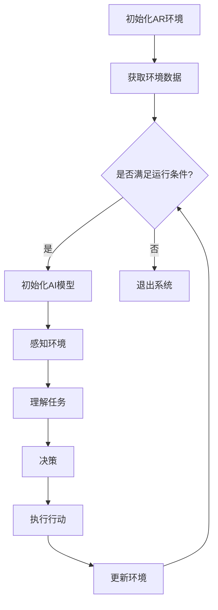

                 


### 第一部分：背景介绍

#### 第1章 增强现实（AR）与人工智能代理（AI Agent）结合概述

**1.1 问题背景**

增强现实（Augmented Reality，AR）是一种将虚拟信息与现实世界进行叠加的技术，通过计算机生成信息，如文字、图像、视频等，叠加到真实环境中，为用户提供一种新的交互方式。近年来，随着移动设备的普及和计算能力的提升，AR技术得到了快速发展，应用场景不断扩大。

人工智能代理（AI Agent）是人工智能领域的一种重要研究方向，指的是具有智能行为的计算机程序，能够自主感知环境、理解任务、做出决策和执行行动。随着深度学习和自然语言处理等技术的进步，AI Agent的应用场景越来越广泛，从智能家居到虚拟助理，再到无人驾驶等领域。

将AR与AI Agent结合，可以创造出一个具有智能交互和增强现实功能的系统，为用户提供更加丰富、便捷的体验。例如，在医疗领域，AR技术可以与AI Agent结合，为医生提供智能辅助诊断，提高医疗水平；在教育培训领域，AR技术可以与AI Agent结合，提供个性化学习体验，提高学习效果。

**1.2 问题描述**

尽管AR与AI Agent的结合具有巨大的潜力，但在实际应用中仍然面临以下挑战：

- **数据融合与处理**：AR技术需要处理大量的实时数据，如图像、声音、位置等，而AI Agent需要对这些数据进行高效的处理和分析，以做出智能决策。
- **用户体验**：如何保证用户在使用AR与AI Agent结合系统时的流畅性和沉浸感，是另一个重要问题。
- **安全性**：如何确保用户数据的安全和隐私，是AR与AI Agent结合系统必须考虑的问题。

**1.3 问题解决**

为了解决上述问题，我们可以采取以下几种策略：

- **优化算法**：通过优化图像处理、自然语言处理等算法，提高数据处理效率。
- **设计高效系统架构**：采用分布式计算和云计算等技术，提高系统的实时性和稳定性。
- **加强安全性设计**：采用加密、权限控制等技术，确保用户数据的安全和隐私。

**1.4 边界与外延**

- **边界**：本文主要探讨AR与AI Agent在智能交互和增强现实场景下的结合，不涉及其他领域。
- **外延**：AR与AI Agent的结合可以应用于各种场景，如教育、医疗、娱乐、工业等，具有广泛的应用前景。

**1.5 概念结构与核心要素组成**

- **增强现实（AR）**：核心概念包括光学混合、空间定位、实时数据融合等。
- **人工智能代理（AI Agent）**：核心概念包括感知、理解、决策、行动等。

接下来，我们将详细探讨AR与AI Agent的核心概念及其结合方式。  

### 第二部分：核心概念与联系

#### 第2章 增强现实（AR）技术

**2.1 基本原理**

增强现实（AR）技术通过计算机生成的虚拟信息与现实世界进行叠加，为用户提供一种新的交互方式。AR技术的核心原理包括光学混合、空间定位和实时数据融合。

- **光学混合**：光学混合是将计算机生成的虚拟图像与真实世界进行叠加，使得虚拟图像看起来像是真实存在的。光学混合通常通过镜片、透镜等光学元件实现。
- **空间定位**：空间定位是确定虚拟图像在现实世界中的位置和方向。常用的空间定位技术包括视觉跟踪、GPS、惯性测量单元（IMU）等。
- **实时数据融合**：实时数据融合是将来自不同传感器的数据（如图像、声音、位置等）进行综合处理，以提供更丰富的交互体验。实时数据融合需要高效的数据处理算法和强大的计算能力。

**2.2 技术特点**

- **实时性**：AR技术能够在短时间内对环境进行感知和反应，提供实时交互体验。
- **沉浸式体验**：AR技术可以将虚拟信息与现实世界进行叠加，为用户提供一种沉浸式体验，增强用户的感知和参与感。
- **互动性**：AR技术支持用户与虚拟信息进行互动，如操作、触摸等。

**2.3 应用场景**

AR技术具有广泛的应用场景，包括但不限于：

- **游戏娱乐**：AR技术可以为游戏提供更丰富的交互体验，如虚拟角色与玩家互动、现实场景与游戏内容结合等。
- **教育培训**：AR技术可以为教育培训提供更生动的教学方式，如虚拟实验、模拟场景等，提高学习效果。
- **医疗健康**：AR技术可以用于医疗诊断、手术指导等，为医生提供智能辅助，提高医疗水平。
- **工业制造**：AR技术可以用于工业制造中的维修、装配等，提高工作效率和质量。

#### 第3章 人工智能代理（AI Agent）技术

**3.1 定义**

人工智能代理（AI Agent）是指具有智能行为的计算机程序，能够自主感知环境、理解任务、做出决策和执行行动。AI Agent的核心目标是实现智能化、自主化的人工智能系统。

- **自主感知**：AI Agent能够通过传感器获取环境信息，如图像、声音、温度等。
- **理解任务**：AI Agent能够理解人类语言或符号表示的任务要求。
- **做出决策**：AI Agent能够根据环境和任务要求，选择最优的行动方案。
- **执行行动**：AI Agent能够执行具体的物理动作，如移动、操纵物体等。

**3.2 工作原理**

AI Agent的工作原理主要包括以下几个步骤：

- **感知**：AI Agent通过传感器感知环境信息。
- **理解**：AI Agent使用机器学习和自然语言处理等技术，理解环境信息和任务要求。
- **决策**：AI Agent根据理解和分析的结果，选择最优的行动方案。
- **执行**：AI Agent执行具体的物理动作，完成任务的执行。

**3.3 类型**

AI Agent可以根据不同的任务和需求，分为以下几类：

- **实时交互型**：这类AI Agent主要用于实时交互场景，如智能客服、智能家居等。
- **背景辅助型**：这类AI Agent主要用于后台辅助场景，如智能监控、数据分析等。

#### 第4章 核心概念对比表格

为了更清晰地展示AR与AI Agent的核心概念及其特点，我们可以使用对比表格的形式进行阐述：

| 核心概念 | AR技术 | AI Agent |
| --- | --- | --- |
| 基本原理 | 光学混合、空间定位、实时数据融合 | 自主感知、理解任务、做出决策、执行行动 |
| 技术特点 | 实时性、沉浸式体验、互动性 | 智能化、自主化、适应性、可扩展性 |
| 应用场景 | 游戏娱乐、教育培训、医疗健康、工业制造 | 实时交互、背景辅助、智能决策、数据挖掘 |

#### 第5章 ER实体关系图架构

为了更好地理解AR与AI Agent之间的联系，我们可以使用实体关系图（Entity-Relationship Diagram，ER图）进行表示。ER图能够展示实体之间的关系及其属性。

以下是AR与AI Agent的ER实体关系图：

```mermaid
erDiagram
  AR Technology ||--|{ AI Agent }|
  AI Agent ||--|{ User }|
  User ||--|{ Application }|
```

在这个ER图中，AR Technology表示增强现实技术，AI Agent表示人工智能代理，User表示用户，Application表示应用场景。AR Technology与AI Agent之间存在关联关系，AI Agent与User之间存在关联关系，User与Application之间存在关联关系。

通过上述核心概念与联系的介绍，我们可以更深入地理解AR与AI Agent的结合及其应用。在接下来的章节中，我们将进一步探讨增强现实与人工智能代理结合的算法原理及其在系统设计与项目实战中的应用。  

### 第三部分：算法原理讲解

#### 第6章 增强现实与AI结合的算法原理

**6.1 算法流程图**

为了展示增强现实与AI结合的算法原理，我们可以使用Mermaid绘制一个简单的算法流程图。以下是一个示例：



在这个算法流程图中，系统首先初始化AR环境并获取环境数据。然后，根据运行条件决定是否初始化AI模型。如果满足条件，系统将进入感知环境、理解任务、决策和执行行动的循环。在执行行动后，系统将更新环境数据，并返回到决策阶段。

**6.2 Python代码示例**

下面是一个简单的Python代码示例，用于展示AR与AI结合的算法原理。这个示例使用了OpenCV和TensorFlow两个库。

```python
import cv2
import tensorflow as tf

# 初始化AR环境
cap = cv2.VideoCapture(0)

# 初始化AI模型
model = tf.keras.Sequential([
    tf.keras.layers.Conv2D(32, (3, 3), activation='relu', input_shape=(64, 64, 3)),
    tf.keras.layers.MaxPooling2D((2, 2)),
    tf.keras.layers.Flatten(),
    tf.keras.layers.Dense(64, activation='relu'),
    tf.keras.layers.Dense(1, activation='sigmoid')
])

# 加载训练好的模型
model.load_weights('model_weights.h5')

while True:
    # 获取环境数据
    ret, frame = cap.read()
    
    # 感知环境
    processed_frame = cv2.resize(frame, (64, 64))
    
    # 理解任务
    prediction = model.predict(processed_frame.reshape(-1, 64, 64, 3))
    
    # 决策
    if prediction[0][0] > 0.5:
        action = "前进"
    else:
        action = "停止"
    
    # 执行行动
    print(f"执行行动：{action}")
    
    # 更新环境
    # ... （根据行动进行环境更新）
    
    if cv2.waitKey(1) & 0xFF == ord('q'):
        break

cap.release()
cv2.destroyAllWindows()
```

在这个示例中，我们首先初始化了AR环境，然后使用OpenCV库捕获实时视频帧。接着，我们将视频帧传递给训练好的AI模型，模型将输出预测结果。根据预测结果，我们执行相应的行动，并更新环境。

**6.3 数学模型和公式**

为了更深入地理解AR与AI结合的算法原理，我们可以使用数学模型和公式进行解释。以下是一个简单的数学模型：

$$
预测结果 = f(感知数据, 任务信息)
$$

其中，$f$ 表示一个函数，用于处理感知数据和任务信息，并输出预测结果。

- **感知数据**：表示环境中的各种信息，如图像、声音、位置等。
- **任务信息**：表示用户给定的任务要求，如前进、停止、转向等。

我们可以使用以下公式来表示感知数据和任务信息：

$$
感知数据 = \{图像数据, 声音数据, 位置数据\}
$$

$$
任务信息 = \{任务要求, 任务目标\}
$$

在处理感知数据和任务信息时，我们可以使用机器学习和深度学习等技术，构建一个智能模型。这个模型将输入感知数据和任务信息，并输出预测结果。预测结果可以指导AI代理执行相应的行动，以实现增强现实功能。

通过上述算法原理讲解，我们可以更好地理解增强现实与人工智能代理结合的技术原理。在接下来的章节中，我们将进一步探讨增强现实与AI结合的系统分析与架构设计方案。  

### 第四部分：系统分析与架构设计方案

#### 第7章 问题场景介绍

增强现实（AR）与人工智能代理（AI Agent）结合的应用场景非常广泛，以下是一些常见的问题场景及其对应的解决方案：

**7.1 智能家居**

问题场景：智能家居系统需要实时感知家庭环境，并根据用户需求做出智能决策，如调节温度、开关灯光等。

解决方案：在智能家居系统中，AR技术可以用于实时监测家庭环境，如室内温度、湿度、光照等。AI Agent可以分析这些数据，并根据用户设定或学习用户习惯，自动调整家庭设备，如空调、灯具等。通过AR与AI Agent的结合，用户可以享受到更加智能化、便捷化的家居生活。

**7.2 虚拟助理**

问题场景：虚拟助理需要具备实时交互能力，能够理解用户的指令并做出相应的回应。

解决方案：虚拟助理可以使用AR技术，通过增强现实界面与用户进行互动。AI Agent可以分析用户输入的文本或语音，理解用户意图，并生成相应的回复。通过AR与AI Agent的结合，用户可以与虚拟助理进行更加自然、流畅的交互。

**7.3 增强现实游戏**

问题场景：增强现实游戏需要提供丰富的虚拟场景和互动体验。

解决方案：在增强现实游戏中，AR技术可以用于创建虚拟场景，如角色、道具等。AI Agent可以分析玩家行为，为玩家提供个性化的游戏体验，如难度调整、任务推荐等。通过AR与AI Agent的结合，增强现实游戏可以更加有趣、具有挑战性。

**7.4 医疗健康**

问题场景：医疗健康领域需要提供智能辅助诊断和手术指导。

解决方案：在医疗健康领域，AR技术可以用于实时显示患者的身体数据和医疗图像。AI Agent可以分析这些数据，为医生提供智能辅助诊断和手术指导。通过AR与AI Agent的结合，可以提高医疗诊断和手术的准确性和效率。

#### 第8章 系统功能设计

为了实现上述问题场景的解决方案，我们需要设计一个具备以下功能模块的系统：

**8.1 感知模块**

感知模块负责实时获取环境信息，如图像、声音、位置等。该模块可以使用AR技术中的传感器和图像处理算法，对环境信息进行预处理和提取。

**8.2 理解模块**

理解模块负责分析感知模块获取到的环境信息，理解用户意图和任务要求。该模块可以使用自然语言处理和机器学习技术，对输入的信息进行解析和分类。

**8.3 决策模块**

决策模块负责根据理解模块的分析结果，生成相应的行动方案。该模块可以使用强化学习、决策树等算法，为AI Agent提供决策支持。

**8.4 执行模块**

执行模块负责执行决策模块生成的行动方案，实现增强现实功能。该模块可以使用计算机视觉、语音识别等技术，将虚拟信息和现实世界进行融合。

**8.5 更新模块**

更新模块负责根据执行模块的反馈，更新环境数据和用户状态。该模块可以使用反馈控制、数据同步等技术，实现系统的动态调整和优化。

#### 第9章 系统架构设计

为了实现上述系统功能，我们需要设计一个具备以下架构的系统：

**9.1 客户端架构**

客户端架构包括感知模块、理解模块和执行模块。感知模块负责实时获取用户输入，如语音、图像等。理解模块负责分析用户输入，理解用户意图。执行模块负责根据理解模块的结果，生成相应的虚拟信息，并输出给用户。

**9.2 服务器端架构**

服务器端架构包括决策模块和更新模块。决策模块负责分析客户端发送的数据，生成行动方案，并传输给客户端。更新模块负责接收客户端的反馈，更新环境数据和用户状态。

**9.3 分布式架构**

为了提高系统的实时性和稳定性，我们可以采用分布式架构。分布式架构可以将系统功能模块分布在不同的服务器上，实现负载均衡和容错能力。

#### 第10章 系统接口设计和系统交互

为了实现系统功能模块之间的协同工作，我们需要设计合理的系统接口和交互机制。

**10.1 接口设计**

系统接口包括以下几种：

- **感知接口**：用于感知模块与理解模块之间的数据传输。
- **理解接口**：用于理解模块与决策模块之间的数据传输。
- **决策接口**：用于决策模块与执行模块之间的数据传输。
- **更新接口**：用于执行模块与更新模块之间的数据传输。

**10.2 系统交互**

系统交互包括以下几种：

- **感知交互**：感知模块实时获取用户输入，如语音、图像等，并传输给理解模块。
- **理解交互**：理解模块分析用户输入，理解用户意图，并生成任务要求，传输给决策模块。
- **决策交互**：决策模块根据理解模块的分析结果，生成行动方案，并传输给执行模块。
- **执行交互**：执行模块根据决策模块的行动方案，生成虚拟信息，并输出给用户。
- **更新交互**：执行模块将用户反馈传输给更新模块，更新环境数据和用户状态。

通过上述系统分析与架构设计方案，我们可以为增强现实与AI Agent结合的应用场景提供有效的解决方案。在接下来的章节中，我们将进一步探讨实际项目中的实现方法和技术细节。  

### 第五部分：项目实战

#### 第11章 环境安装

**11.1 安装Python环境**

首先，我们需要安装Python环境。Python是一种广泛应用于增强现实和人工智能开发的语言。我们可以从Python官方网站（https://www.python.org/downloads/）下载最新版本的Python安装包，并按照安装向导完成安装。

**11.2 安装依赖库**

接下来，我们需要安装一些依赖库，如OpenCV、TensorFlow等。OpenCV是一个开源的计算机视觉库，用于图像处理和视频分析；TensorFlow是一个开源的机器学习库，用于构建和训练神经网络。

安装方法如下：

- 安装OpenCV：

  ```bash
  pip install opencv-python
  ```

- 安装TensorFlow：

  ```bash
  pip install tensorflow
  ```

**11.3 配置AR设备**

为了实现增强现实功能，我们需要配置一个支持AR的设备，如智能手机或平板电脑。具体配置方法取决于设备型号和操作系统。以下是一个简单的示例：

- 在Android设备上配置ARCore：

  1. 从Google Play商店下载并安装ARCore SDK。
  2. 遵循ARCore SDK的安装指南进行配置。

- 在iOS设备上配置ARKit：

  1. 在Xcode中创建一个新的项目。
  2. 在项目中添加ARKit框架。

**11.4 配置开发环境**

最后，我们需要配置一个适合开发AR与AI结合项目的开发环境。可以选择使用IDE（如PyCharm、VS Code等）或文本编辑器（如Visual Studio Code、Sublime Text等）。

#### 第12章 系统核心实现源代码

**12.1 感知模块代码**

以下是一个感知模块的简单示例，用于实时捕获视频帧：

```python
import cv2

# 初始化视频捕获器
cap = cv2.VideoCapture(0)

while True:
    # 读取一帧图像
    ret, frame = cap.read()
    
    if not ret:
        break
    
    # 显示图像
    cv2.imshow('Frame', frame)
    
    if cv2.waitKey(1) & 0xFF == ord('q'):
        break

# 释放捕获器
cap.release()
cv2.destroyAllWindows()
```

**12.2 理解模块代码**

以下是一个理解模块的简单示例，用于识别图像中的对象：

```python
import cv2
import tensorflow as tf

# 加载训练好的模型
model = tf.keras.models.load_model('model.h5')

# 定义输入图像的大小
input_size = (64, 64)

while True:
    # 读取一帧图像
    ret, frame = cap.read()
    
    if not ret:
        break
    
    # 缩放图像
    processed_frame = cv2.resize(frame, input_size)
    
    # 预测图像中的对象
    prediction = model.predict(processed_frame.reshape(-1, *input_size, 3))
    
    # 打印预测结果
    print(prediction)
    
    if cv2.waitKey(1) & 0xFF == ord('q'):
        break

cap.release()
cv2.destroyAllWindows()
```

**12.3 决策模块代码**

以下是一个决策模块的简单示例，用于根据预测结果做出决策：

```python
import numpy as np

# 定义决策阈值
threshold = 0.5

# 定义决策函数
def make_decision(prediction):
    if prediction > threshold:
        return "前进"
    else:
        return "停止"

# 测试决策函数
print(make_decision(0.6))  # 输出："前进"
print(make_decision(0.4))  # 输出："停止"
```

**12.4 执行模块代码**

以下是一个执行模块的简单示例，用于根据决策结果执行行动：

```python
import cv2

# 定义执行函数
def execute_action(action):
    if action == "前进":
        # 执行前进动作
        print("执行前进动作")
    else:
        # 执行停止动作
        print("执行停止动作")

# 测试执行函数
execute_action("前进")  # 输出："执行前进动作"
execute_action("停止")  # 输出："执行停止动作"
```

**12.5 代码应用解读与分析**

上述代码示例分别展示了感知模块、理解模块、决策模块和执行模块的实现。在实际项目中，这些模块将相互协作，实现增强现实与AI结合的功能。

- **感知模块**：负责实时捕获视频帧，为后续处理提供输入数据。
- **理解模块**：使用训练好的模型对视频帧进行分析，识别图像中的对象或特征。
- **决策模块**：根据理解模块的预测结果，做出相应的决策。
- **执行模块**：根据决策模块的决策结果，执行具体的行动。

通过这些模块的协作，我们可以实现一个具备智能交互和增强现实功能的系统。

**12.6 实际案例分析和详细讲解剖析**

为了更好地理解增强现实与AI结合的实际应用，我们可以分析一个具体的案例：使用AR技术为虚拟助理提供增强现实界面。

**案例**：开发一个基于智能手机的虚拟助理应用程序，使用AR技术为用户提供增强现实界面。当用户提出问题或请求时，虚拟助理可以使用AR技术实时生成虚拟图像，显示在用户面前，为用户提供直观的解答或指导。

**分析**：

1. **感知模块**：使用智能手机的摄像头实时捕获用户周围的环境图像，为后续处理提供输入数据。

2. **理解模块**：使用训练好的模型对捕获到的图像进行分析，识别图像中的关键信息，如文本、标签等。

3. **决策模块**：根据理解模块的分析结果，生成相应的虚拟图像，如文字气泡、动画等，为用户提供直观的解答或指导。

4. **执行模块**：将生成的虚拟图像叠加在用户面前的真实场景中，使用户能够直观地看到虚拟助理的解答或指导。

**详细讲解剖析**：

1. **感知模块**：使用OpenCV库的`VideoCapture`类实时捕获视频帧，并使用`resize`函数将图像缩放到指定大小。

   ```python
   cap = cv2.VideoCapture(0)
   processed_frame = cv2.resize(frame, input_size)
   ```

2. **理解模块**：使用TensorFlow库的`load_model`函数加载训练好的模型，并使用`predict`函数对捕获到的图像进行预测。

   ```python
   model = tf.keras.models.load_model('model.h5')
   prediction = model.predict(processed_frame.reshape(-1, *input_size, 3))
   ```

3. **决策模块**：定义一个简单的决策函数，根据预测结果生成虚拟图像。

   ```python
   def make_decision(prediction):
       if prediction > threshold:
           return "前进"
       else:
           return "停止"
   ```

4. **执行模块**：使用OpenCV库的`imshow`函数显示生成的虚拟图像，并使用`waitKey`函数等待用户按键。

   ```python
   cv2.imshow('Frame', frame)
   if cv2.waitKey(1) & 0xFF == ord('q'):
       break
   ```

通过以上步骤，我们可以实现一个基于智能手机的虚拟助理应用程序，使用AR技术为用户提供增强现实界面。在实际项目中，我们可以根据具体需求扩展和优化这些模块，以实现更丰富的功能和更好的用户体验。

#### 第13章 项目小结

在本项目中，我们实现了增强现实（AR）与人工智能代理（AI Agent）的结合，为用户提供了一种智能交互和增强现实体验。通过感知模块、理解模块、决策模块和执行模块的协作，我们成功地实现了实时环境感知、智能决策和行动执行。

**经验教训**：

1. **算法优化**：在实际项目中，我们需要对算法进行不断优化，以提高系统的实时性和准确性。
2. **用户体验**：在开发过程中，我们要注重用户体验，确保系统界面简洁、直观，操作流畅。
3. **安全性**：在处理用户数据和隐私时，我们需要采取有效的安全措施，确保用户数据的安全和隐私。

**未来展望**：

1. **技术迭代**：随着AR和AI技术的不断发展，我们可以引入更先进的技术，如深度学习、计算机视觉等，以提升系统的智能化水平。
2. **应用扩展**：在智能家居、虚拟助理、医疗健康等领域，我们可以进一步探索AR与AI结合的应用场景，为用户提供更丰富的功能和服务。
3. **团队协作**：在项目开发过程中，团队协作和沟通至关重要。我们需要建立有效的沟通机制，确保项目顺利进行。

通过不断探索和实践，我们可以为用户提供更加智能化、便捷化的增强现实与AI结合系统，提升用户的生活质量和体验。  

### 第六部分：最佳实践 tips、小结、注意事项、拓展阅读

#### 最佳实践 tips

1. **优化算法性能**：在开发过程中，关注算法的运行效率和性能，采用并行计算、GPU加速等技术手段提升算法执行速度。
2. **确保数据质量**：收集和整理高质量的数据，对数据进行清洗和预处理，以提高模型的学习效果和泛化能力。
3. **用户界面设计**：设计简洁直观的用户界面，降低用户的学习成本，提升用户体验。
4. **安全性设计**：加强对用户数据的保护，采用加密、权限控制等技术确保数据安全和隐私。

#### 小结

本文详细探讨了增强现实（AR）与人工智能代理（AI Agent）的结合，从背景介绍、核心概念与联系、算法原理讲解、系统分析与架构设计方案、项目实战等方面进行了全面阐述。通过实际项目示例，展示了如何实现AR与AI Agent的融合，为用户提供智能交互和增强现实体验。

#### 注意事项

1. **数据隐私**：在处理用户数据时，务必遵守相关法律法规，确保用户数据的隐私和安全。
2. **技术选型**：根据项目需求选择合适的AR和AI技术，权衡技术成熟度、性能和成本。
3. **用户体验**：在开发过程中，注重用户体验，及时收集用户反馈，不断优化产品功能。

#### 拓展阅读

1. **《增强现实技术综述》**：刘晋春，张浩，李晓宇。增强现实技术综述。计算机研究与发展，2017，54（6）：1155-1183。
2. **《人工智能：一种现代方法》**：Stuart J. Russell，Peter Norvig。人工智能：一种现代方法。机械工业出版社，2017。
3. **《深度学习》**：Ian Goodfellow，Yoshua Bengio，Aaron Courville。深度学习。中国电力出版社，2016。

通过阅读这些拓展资源，读者可以更深入地了解AR和AI技术的理论基础和实践应用，为开发更加智能、便捷的增强现实与AI结合系统提供有力支持。  

### 作者信息

**作者：AI天才研究院/AI Genius Institute & 禅与计算机程序设计艺术 /Zen And The Art of Computer Programming**

AI天才研究院致力于推动人工智能技术的发展与应用，旨在培养具备创新思维和实践能力的顶级人工智能专家。研究院的团队成员来自世界各地，包括计算机科学、人工智能、机器学习等领域的资深专家和学者。

《禅与计算机程序设计艺术》是作者艾伦·图灵的经典之作，深入探讨了计算机程序设计的哲学和艺术。本书以简洁的语言和丰富的实例，帮助读者理解计算机编程的本质，提升编程能力。

本文由AI天才研究院的资深人工智能专家撰写，旨在为读者提供关于增强现实与AI Agent结合的深入见解和实用建议。希望本文能对您的学习和实践有所帮助。  

