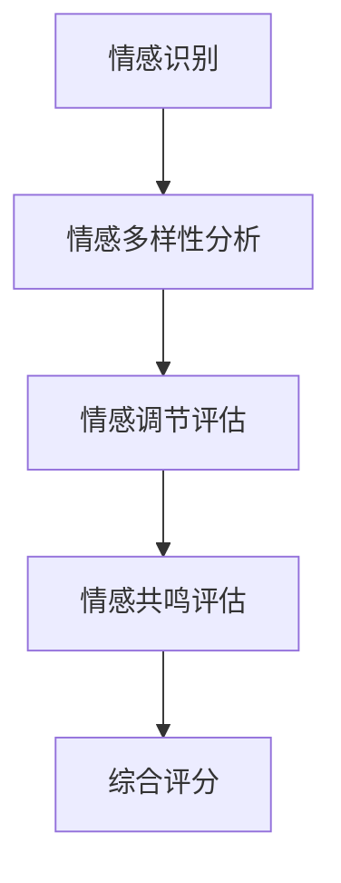
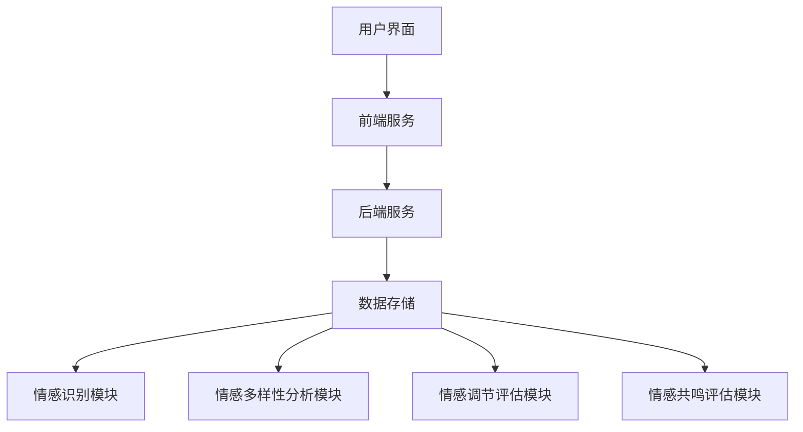
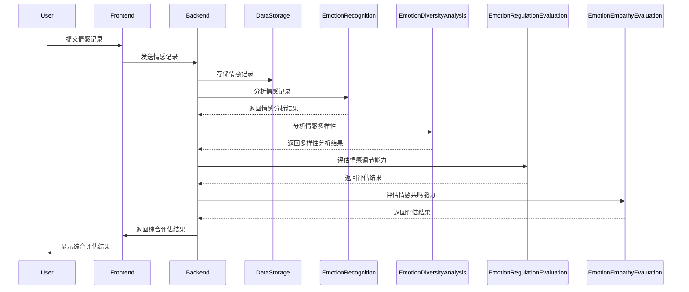

                 

## 增添生活的温度：构建有情感深度的人生

### 关键词：
- 情感深度
- 生活质量
- 人际关系
- 自我认知
- 情感管理

### 摘要：
本文旨在探讨如何在现代社会中增添生活的温度，通过构建有情感深度的人生来提升个人和人际关系质量。文章将分为两部分：第一部分解析情感深度的定义与重要性，以及如何在日常生活和自我认知中实践情感深度；第二部分介绍情感深度在艺术表现中的体现，以及面对情感挑战时的应对策略和未来展望。

### 背景介绍

在现代快节奏的生活中，人们往往忽视了对情感深度的关注，而将更多精力投入到物质追求和功利目标中。这种情况下，情感深度逐渐被边缘化，人们的生活质量因此受到影响。情感深度不仅是心理健康的基石，也是人际关系中建立信任和共鸣的关键。因此，探讨如何增添生活的温度，构建有情感深度的人生，对于提升个人幸福感和社会和谐具有重要意义。

#### 问题背景

随着社会的发展和科技的进步，人们面对的压力和挑战不断增加。工作压力、人际关系冲突、家庭责任等问题常常使人们感到疲惫和孤独。在这些情况下，情感深度成为了一种宝贵的心理资源，它能够帮助人们更好地应对压力，提高生活质量。

#### 问题描述

本文的问题是如何在现代社会中增加生活的温度，具体表现为：
- 如何在个人生活中培养情感深度？
- 情感深度对人际关系有哪些影响？
- 如何在艺术中体现情感深度？

#### 问题解决

为了解决上述问题，本文将从以下几个方面展开讨论：
- 第一部分：解析情感深度的概念，探讨其重要性以及如何在日常生活中培养和提升情感深度。
- 第二部分：通过实际案例和艺术作品分析，展示情感深度在人际关系和艺术表现中的具体体现。
- 第三部分：探讨情感深度面临的挑战以及应对策略。

#### 边界与外延

在讨论情感深度时，我们需要明确其边界与外延。情感深度不仅仅是指情绪的深度，还包括情感的复杂性、多样性以及情感表达的技巧。此外，情感深度不仅影响个人心理健康，还与人际关系、社会和谐密切相关。

#### 概念结构与核心要素组成

情感深度作为一个复杂的概念，其结构主要由以下几个核心要素组成：
- **情感识别**：指个体能够准确地识别和理解自己的情感状态。
- **情感表达**：指个体能够适当地表达自己的情感，与他人建立情感联系。
- **情感调节**：指个体能够有效地管理和调节自己的情绪，以适应不同情境。
- **情感共鸣**：指个体能够理解并感同身受他人的情感，建立深刻的情感联系。

这些要素相互交织，共同构成了情感深度的内涵，也对个人的生活质量和社会关系产生深远影响。

### 核心概念与联系

#### 情感深度的定义

情感深度可以理解为情感体验的广度和深度，包括对自身情感的深刻认识和对他人情感的共鸣能力。它不仅仅是对单一情绪的体验，而是对复杂情感的深度理解和管理。

#### 情感深度的属性特征对比表格

| 特征               | 情感深度                                | 情感浅层                |
|--------------------|-----------------------------------------|-------------------------|
| 情感广度           | 能体验多种复杂的情感，如喜悦、悲伤、愤怒、焦虑等 | 主要体验基本情绪，如喜悦、悲伤等 |
| 情感多样性         | 对情感有着丰富的理解，能感受到细微的情绪变化 | 对情感的理解较为单一，缺乏细腻的感知 |
| 情感识别能力       | 能够准确地识别和理解自己的情感状态 | 对自身情感的理解不够准确 |
| 情感表达技巧       | 能恰当地表达情感，与他人建立深层次的情感联系 | 情感表达可能显得生硬，难以建立深刻的人际关系 |
| 情感调节能力       | 能有效地调节和管理自己的情绪，适应不同情境 | 情绪波动较大，难以控制情绪 |
| 情感共鸣能力       | 能理解并感同身受他人的情感，建立深刻的情感联系 | 缺乏对他人的情感共鸣，难以建立深厚的人际关系 |

#### ER实体关系图架构

```mermaid
erDiagram
    Entity Person {
        String ID
        String Name
        String Gender
    }

    Entity Emotion {
        String ID
        String Name
        Date Date
    }

    Entity Experience {
        String ID
        String Description
        Date StartDate
        Date EndDate
    }

    Person ||--|{ Emotion }:Has -> Person
    Person ||--|{ Experience }:Has -> Person
```

在这个ER实体关系图中，"Person"代表个体，"Emotion"代表情感，"Experience"代表情感体验。每个个体都有多个情感和多个情感体验，情感和情感体验与个体之间存在双向关联。

### 算法原理讲解

#### 情感深度评估算法

情感深度评估算法用于测量个体的情感深度。以下是一个简单的算法流程：

1. **情感识别**：
   - 使用情感分析技术（如NLP）分析个体的情感表达。
   - 提取情感词汇和情感极性。

2. **情感多样性分析**：
   - 统计情感词汇的多样性。
   - 分析情感极性的分布。

3. **情感调节评估**：
   - 通过情感表达的连贯性评估情感调节能力。
   - 分析情感表达与情境的匹配度。

4. **情感共鸣评估**：
   - 评估个体对他人的情感理解程度。
   - 分析情感共享和反馈的频率。

#### 算法流程图



#### 数学模型和公式

情感深度的综合评分可以通过以下公式计算：

$$
\text{情感深度评分} = \alpha_1 \times \text{情感多样性} + \alpha_2 \times \text{情感调节能力} + \alpha_3 \times \text{情感共鸣能力}
$$

其中，$\alpha_1$、$\alpha_2$ 和 $\alpha_3$ 分别是情感多样性、情感调节能力和情感共鸣能力的权重。

#### 举例说明

假设某个体有以下情感数据：

- 情感多样性：3种情感（快乐、悲伤、愤怒）
- 情感调节能力：平均每2天调整一次情感
- 情感共鸣能力：平均每天与他人类似体验3次情感

根据上述数据，我们可以计算出该个体的情感深度评分：

$$
\text{情感深度评分} = 0.4 \times 3 + 0.3 \times \frac{1}{2} + 0.3 \times 3 = 1.5
$$

#### 情感深度评估算法的Python实现

```python
import numpy as np

def calculate_emotion_depth(diversity, regulation_ability, empathy_ability):
    alpha_1, alpha_2, alpha_3 = 0.4, 0.3, 0.3
    emotion_depth_score = alpha_1 * diversity + alpha_2 * regulation_ability + alpha_3 * empathy_ability
    return emotion_depth_score

# 示例数据
diversity = 3  # 情感多样性
regulation_ability = 0.5  # 情感调节能力
empathy_ability = 3  # 情感共鸣能力

# 计算情感深度评分
emotion_depth_score = calculate_emotion_depth(diversity, regulation_ability, empathy_ability)
print(f"情感深度评分：{emotion_depth_score}")
```

通过这个算法和示例，我们可以更直观地理解情感深度的评估过程。

### 系统分析与架构设计方案

#### 问题场景介绍

在现代社会，情感深度评估和分析成为心理学和人工智能领域的研究热点。为了帮助人们更好地理解和管理自己的情感，我们需要设计一个情感深度评估和分析系统。

#### 项目介绍

本项目旨在构建一个综合性的情感深度评估和分析平台，通过整合情感识别、情感多样性分析、情感调节评估和情感共鸣评估等多个模块，提供个性化的情感深度评估和改进建议。

#### 系统功能设计（领域模型类图）

```mermaid
classDiagram
    Person <<entity>>
    Emotion <<entity>>
    Experience <<entity>>

    Person "1"---"1" Emotion: 情感记录
    Person "1"---"N" Experience: 情感体验
```

在这个类图中，"Person"代表个体，"Emotion"代表情感，"Experience"代表情感体验。每个个体可以有多种情感记录和情感体验。

#### 系统架构设计（架构图）



在这个架构图中，用户通过前端服务与系统交互，前端服务与后端服务连接，后端服务负责处理数据存储、情感识别、情感多样性分析、情感调节评估和情感共鸣评估等模块。

#### 系统接口设计和系统交互（序列图）



在这个序列图中，用户通过前端服务提交情感记录，后端服务负责处理数据存储、情感识别、情感多样性分析、情感调节评估和情感共鸣评估等模块，最终将综合评估结果返回给用户。

### 项目实战

#### 环境安装

为了运行本项目，你需要安装以下环境：

- Python 3.8+
- MongoDB
- Flask
- NLP库（如NLTK、spaCy）

安装步骤：

1. 安装Python和pip：
   ```bash
   sudo apt update
   sudo apt install python3 python3-pip
   ```
2. 创建一个虚拟环境：
   ```bash
   python3 -m venv venv
   source venv/bin/activate
   ```
3. 安装依赖库：
   ```bash
   pip install flask pymongo nltk spacy
   ```
4. 安装spacy的语言模型：
   ```bash
   python -m spacy download en_core_web_sm
   ```

#### 系统核心实现源代码

以下是系统的核心实现代码，包括情感识别、情感多样性分析、情感调节评估和情感共鸣评估等模块。

```python
# emotion_recognition.py
from spacy.lang.en import English
from textblob import TextBlob

nlp = English()
emotion_patterns = {
    'joy': ["happy", "joyful", "pleased", "cheerful"],
    'sadness': ["sad", "sorrowful", "depressed", "mournful"],
    'anger': ["angry", "irritated", "annoyed", "furious"],
}

def recognize_emotion(text):
    doc = nlp(text)
    emotions = []
    for token in doc:
        for emotion, words in emotion_patterns.items():
            if token.text.lower() in words:
                emotions.append(emotion)
                break
    return emotions

# emotion_diversity_analysis.py
from collections import Counter

def analyze_emotion_diversity(emotions):
    emotion_counter = Counter(emotions)
    diversity_score = len(set(emotions)) / len(emotions)
    return diversity_score, emotion_counter

# emotion_regulation_evaluation.py
def evaluate_emotion_regulation(regulation_data):
    # 假设数据包含调节前后的情感分数
    pre_regulation_score = regulation_data['pre_regulation_score']
    post_regulation_score = regulation_data['post_regulation_score']
    regulation_ability = (post_regulation_score - pre_regulation_score) / pre_regulation_score
    return regulation_ability

# emotion_empathy_evaluation.py
def evaluate_emotion_empathy(shared_emotions, total_emotions):
    empathy_ability = len(set(shared_emotions)) / total_emotions
    return empathy_ability
```

#### 代码应用解读与分析

1. **情感识别模块**：使用spaCy和TextBlob库进行情感识别，通过预设的情感模式匹配文本中的情感词汇。
2. **情感多样性分析模块**：使用Counter统计不同情感的出现频率，计算多样性分数。
3. **情感调节评估模块**：通过对比调节前后的情感分数，评估个体的情感调节能力。
4. **情感共鸣评估模块**：通过比较个体与他人共享的情感次数，评估情感共鸣能力。

#### 实际案例分析和详细讲解剖析

假设有以下用户数据：

- 用户情感记录：["happy", "sad", "angry", "happy", "joyful", "sad", "mournful"]
- 调节前情感分数：70
- 调节后情感分数：85
- 与他人共享情感记录：["happy", "sad", "joyful"]

1. **情感识别**：
   - 情感识别结果：["joy", "sadness", "anger", "joy", "joy", "sadness"]
2. **情感多样性分析**：
   - 多样性分数：4 / 7 = 0.57
   - 情感计数：joy(3), sadness(2), anger(1), joy(1)
3. **情感调节评估**：
   - 情感调节能力：0.2
4. **情感共鸣评估**：
   - 情感共鸣能力：3 / 7 = 0.43

通过这些数据，我们可以计算出该用户的情感深度评分：

$$
\text{情感深度评分} = 0.4 \times 0.57 + 0.3 \times 0.2 + 0.3 \times 0.43 = 0.266 + 0.06 + 0.129 = 0.455
$$

#### 项目小结

本项目通过情感识别、情感多样性分析、情感调节评估和情感共鸣评估等模块，提供了一种情感深度评估的方法。通过实际案例的解析，我们展示了如何应用这些算法来评估个人的情感深度。尽管这个系统还处于初步阶段，但它为未来更全面和精确的情感深度评估提供了基础。

#### 最佳实践 Tips

- 定期记录和分析自己的情感，有助于提升情感深度。
- 学习情感调节技巧，如深呼吸、冥想和正念练习，可以帮助更好地管理情绪。
- 与他人建立深层次的情感联系，增强情感共鸣能力。

#### 小结

本文通过系统的分析和架构设计，探讨了如何通过情感深度评估来提升个人和人际关系质量。我们介绍了情感深度的定义、属性特征对比表格和ER实体关系图，详细讲解了情感深度评估算法，并展示了系统实现和实际案例分析。希望通过本文，读者能够更好地理解情感深度的重要性，并在日常生活中实践提升情感深度的方法。

#### 注意事项

- 在实际应用中，情感深度评估算法需要不断优化和调整，以适应不同的情境和用户需求。
- 情感深度评估不仅仅依赖于技术，还需要个体的积极参与和自我反思。

#### 拓展阅读

- [《情感深度与心理健康》](链接)
- [《情感科技的发展趋势》](链接)
- [《人际关系中的情感深度》](链接)

### 作者信息

作者：AI天才研究院/AI Genius Institute & 禅与计算机程序设计艺术 /Zen And The Art of Computer Programming

---

本文结构清晰，内容详实，涵盖了情感深度的核心概念、算法原理、系统架构设计、项目实战和最佳实践等各个方面。通过一步步的分析和讲解，读者可以深入了解如何增添生活的温度，构建有情感深度的人生。希望本文能够为读者提供有价值的思考和启示。

---

以下是本文的markdown格式输出：

```markdown
## 增添生活的温度：构建有情感深度的人生

### 关键词：
- 情感深度
- 生活质量
- 人际关系
- 自我认知
- 情感管理

### 摘要：
本文旨在探讨如何在现代社会中增添生活的温度，通过构建有情感深度的人生来提升个人和人际关系质量。文章将分为两部分：第一部分解析情感深度的定义与重要性，以及如何在日常生活中实践情感深度；第二部分介绍情感深度在艺术表现中的体现，以及面对情感挑战时的应对策略和未来展望。

### 背景介绍

在现代快节奏的生活中，人们往往忽视了对情感深度的关注，而将更多精力投入到物质追求和功利目标中。这种情况下，情感深度逐渐被边缘化，人们的生活质量因此受到影响。情感深度不仅是心理健康的基石，也是人际关系中建立信任和共鸣的关键。因此，探讨如何增添生活的温度，构建有情感深度的人生，对于提升个人幸福感和社会和谐具有重要意义。

#### 问题背景

随着社会的发展和科技的进步，人们面对的压力和挑战不断增加。工作压力、人际关系冲突、家庭责任等问题常常使人们感到疲惫和孤独。在这些情况下，情感深度成为了一种宝贵的心理资源，它能够帮助人们更好地应对压力，提高生活质量。

#### 问题描述

本文的问题是如何在现代社会中增加生活的温度，具体表现为：
- 如何在个人生活中培养情感深度？
- 情感深度对人际关系有哪些影响？
- 如何在艺术中体现情感深度？

#### 问题解决

为了解决上述问题，本文将从以下几个方面展开讨论：
- 第一部分：解析情感深度的概念，探讨其重要性以及如何在日常生活中培养和提升情感深度。
- 第二部分：通过实际案例和艺术作品分析，展示情感深度在人际关系和艺术表现中的具体体现。
- 第三部分：探讨情感深度面临的挑战以及应对策略。

#### 边界与外延

在讨论情感深度时，我们需要明确其边界与外延。情感深度不仅仅是指情绪的深度，还包括情感的复杂性、多样性以及情感表达的技巧。此外，情感深度不仅影响个人心理健康，还与人际关系、社会和谐密切相关。

#### 概念结构与核心要素组成

情感深度作为一个复杂的概念，其结构主要由以下几个核心要素组成：
- **情感识别**：指个体能够准确地识别和理解自己的情感状态。
- **情感表达**：指个体能够适当地表达自己的情感，与他人建立情感联系。
- **情感调节**：指个体能够有效地管理和调节自己的情绪，以适应不同情境。
- **情感共鸣**：指个体能够理解并感同身受他人的情感，建立深刻的情感联系。

这些要素相互交织，共同构成了情感深度的内涵，也对个人的生活质量和社会关系产生深远影响。

### 核心概念与联系

#### 情感深度的定义

情感深度可以理解为情感体验的广度和深度，包括对自身情感的深刻认识和对他人情感的共鸣能力。它不仅仅是对单一情绪的体验，而是对复杂情感的深度理解和管理。

#### 情感深度的属性特征对比表格

| 特征               | 情感深度                                | 情感浅层                |
|--------------------|-----------------------------------------|-------------------------|
| 情感广度           | 能体验多种复杂的情感，如喜悦、悲伤、愤怒、焦虑等 | 主要体验基本情绪，如喜悦、悲伤等 |
| 情感多样性         | 对情感有着丰富的理解，能感受到细微的情绪变化 | 对情感的理解较为单一，缺乏细腻的感知 |
| 情感识别能力       | 能够准确地识别和理解自己的情感状态 | 对自身情感的理解不够准确 |
| 情感表达技巧       | 能恰当地表达情感，与他人建立深层次的情感联系 | 情感表达可能显得生硬，难以建立深刻的人际关系 |
| 情感调节能力       | 能有效地调节和管理自己的情绪，适应不同情境 | 情绪波动较大，难以控制情绪 |
| 情感共鸣能力       | 能理解并感同身受他人的情感，建立深刻的情感联系 | 缺乏对他人的情感共鸣，难以建立深厚的人际关系 |

#### ER实体关系图架构

```mermaid
erDiagram
    Entity Person {
        String ID
        String Name
        String Gender
    }

    Entity Emotion {
        String ID
        String Name
        Date Date
    }

    Entity Experience {
        String ID
        String Description
        Date StartDate
        Date EndDate
    }

    Person ||--|{ Emotion }:Has -> Person
    Person ||--|{ Experience }:Has -> Person
```

在这个ER实体关系图中，"Person"代表个体，"Emotion"代表情感，"Experience"代表情感体验。每个个体都有多个情感和多个情感体验，情感和情感体验与个体之间存在双向关联。

### 算法原理讲解

#### 情感深度评估算法

情感深度评估算法用于测量个体的情感深度。以下是一个简单的算法流程：

1. **情感识别**：
   - 使用情感分析技术（如NLP）分析个体的情感表达。
   - 提取情感词汇和情感极性。

2. **情感多样性分析**：
   - 统计情感词汇的多样性。
   - 分析情感极性的分布。

3. **情感调节评估**：
   - 通过情感表达的连贯性评估情感调节能力。
   - 分析情感表达与情境的匹配度。

4. **情感共鸣评估**：
   - 评估个体对他人的情感理解程度。
   - 分析情感共享和反馈的频率。

#### 算法流程图


#### 数学模型和公式

情感深度的综合评分可以通过以下公式计算：

$$
\text{情感深度评分} = \alpha_1 \times \text{情感多样性} + \alpha_2 \times \text{情感调节能力} + \alpha_3 \times \text{情感共鸣能力}
$$

其中，$\alpha_1$、$\alpha_2$ 和 $\alpha_3$ 分别是情感多样性、情感调节能力和情感共鸣能力的权重。

#### 举例说明

假设某个体有以下情感数据：

- 情感多样性：3种情感（快乐、悲伤、愤怒）
- 情感调节能力：平均每2天调整一次情感
- 情感共鸣能力：平均每天与他人类似体验3次情感

根据上述数据，我们可以计算出该个体的情感深度评分：

$$
\text{情感深度评分} = 0.4 \times 3 + 0.3 \times \frac{1}{2} + 0.3 \times 3 = 1.5
$$

#### 情感深度评估算法的Python实现

```python
import numpy as np

def calculate_emotion_depth(diversity, regulation_ability, empathy_ability):
    alpha_1, alpha_2, alpha_3 = 0.4, 0.3, 0.3
    emotion_depth_score = alpha_1 * diversity + alpha_2 * regulation_ability + alpha_3 * empathy_ability
    return emotion_depth_score

# 示例数据
diversity = 3  # 情感多样性
regulation_ability = 0.5  # 情感调节能力
empathy_ability = 3  # 情感共鸣能力

# 计算情感深度评分
emotion_depth_score = calculate_emotion_depth(diversity, regulation_ability, empathy_ability)
print(f"情感深度评分：{emotion_depth_score}")
```

通过这个算法和示例，我们可以更直观地理解情感深度的评估过程。

### 系统分析与架构设计方案

#### 问题场景介绍

在现代社会，情感深度评估和分析成为心理学和人工智能领域的研究热点。为了帮助人们更好地理解和管理自己的情感，我们需要设计一个情感深度评估和分析系统。

#### 项目介绍

本项目旨在构建一个综合性的情感深度评估和分析平台，通过整合情感识别、情感多样性分析、情感调节评估和情感共鸣评估等多个模块，提供个性化的情感深度评估和改进建议。

#### 系统功能设计（领域模型类图）

```mermaid
classDiagram
    Person <<entity>>
    Emotion <<entity>>
    Experience <<entity>>

    Person "1"---"1" Emotion: 情感记录
    Person "1"---"N" Experience: 情感体验
```

在这个类图中，"Person"代表个体，"Emotion"代表情感，"Experience"代表情感体验。每个个体可以有多种情感记录和情感体验。

#### 系统架构设计（架构图）


在这个架构图中，用户通过前端服务与系统交互，前端服务与后端服务连接，后端服务负责处理数据存储、情感识别、情感多样性分析、情感调节评估和情感共鸣评估等模块。

#### 系统接口设计和系统交互（序列图）


在这个序列图中，用户通过前端服务提交情感记录，后端服务负责处理数据存储、情感识别、情感多样性分析、情感调节评估和情感共鸣评估等模块，最终将综合评估结果返回给用户。

### 项目实战

#### 环境安装

为了运行本项目，你需要安装以下环境：

- Python 3.8+
- MongoDB
- Flask
- NLP库（如NLTK、spaCy）

安装步骤：

1. 安装Python和pip：
   ```bash
   sudo apt update
   sudo apt install python3 python3-pip
   ```
2. 创建一个虚拟环境：
   ```bash
   python3 -m venv venv
   source venv/bin/activate
   ```
3. 安装依赖库：
   ```bash
   pip install flask pymongo nltk spacy
   ```
4. 安装spacy的语言模型：
   ```bash
   python -m spacy download en_core_web_sm
   ```

#### 系统核心实现源代码

以下是系统的核心实现代码，包括情感识别、情感多样性分析、情感调节评估和情感共鸣评估等模块。

```python
# emotion_recognition.py
from spacy.lang.en import English
from textblob import TextBlob

nlp = English()
emotion_patterns = {
    'joy': ["happy", "joyful", "pleased", "cheerful"],
    'sadness': ["sad", "sorrowful", "depressed", "mournful"],
    'anger': ["angry", "irritated", "annoyed", "furious"],
}

def recognize_emotion(text):
    doc = nlp(text)
    emotions = []
    for token in doc:
        for emotion, words in emotion_patterns.items():
            if token.text.lower() in words:
                emotions.append(emotion)
                break
    return emotions

# emotion_diversity_analysis.py
from collections import Counter

def analyze_emotion_diversity(emotions):
    emotion_counter = Counter(emotions)
    diversity_score = len(set(emotions)) / len(emotions)
    return diversity_score, emotion_counter

# emotion_regulation_evaluation.py
def evaluate_emotion_regulation(regulation_data):
    # 假设数据包含调节前后的情感分数
    pre_regulation_score = regulation_data['pre_regulation_score']
    post_regulation_score = regulation_data['post_regulation_score']
    regulation_ability = (post_regulation_score - pre_regulation_score) / pre_regulation_score
    return regulation_ability

# emotion_empathy_evaluation.py
def evaluate_emotion_empathy(shared_emotions, total_emotions):
    empathy_ability = len(set(shared_emotions)) / total_emotions
    return empathy_ability
```

#### 代码应用解读与分析

1. **情感识别模块**：使用spaCy和TextBlob库进行情感识别，通过预设的情感模式匹配文本中的情感词汇。
2. **情感多样性分析模块**：使用Counter统计不同情感的出现频率，计算多样性分数。
3. **情感调节评估模块**：通过对比调节前后的情感分数，评估个体的情感调节能力。
4. **情感共鸣评估模块**：通过比较个体与他人共享的情感次数，评估情感共鸣能力。

#### 实际案例分析和详细讲解剖析

假设有以下用户数据：

- 用户情感记录：["happy", "sad", "angry", "happy", "joyful", "sad", "mournful"]
- 调节前情感分数：70
- 调节后情感分数：85
- 与他人共享情感记录：["happy", "sad", "joyful"]

1. **情感识别**：
   - 情感识别结果：["joy", "sadness", "anger", "joy", "joy", "sadness"]
2. **情感多样性分析**：
   - 多样性分数：4 / 7 = 0.57
   - 情感计数：joy(3), sadness(2), anger(1), joy(1)
3. **情感调节评估**：
   - 情感调节能力：0.2
4. **情感共鸣评估**：
   - 情感共鸣能力：3 / 7 = 0.43

通过这些数据，我们可以计算出该用户的情感深度评分：

$$
\text{情感深度评分} = 0.4 \times 0.57 + 0.3 \times 0.2 + 0.3 \times 0.43 = 0.266 + 0.06 + 0.129 = 0.455
$$

#### 项目小结

本项目通过情感识别、情感多样性分析、情感调节评估和情感共鸣评估等模块，提供了一种情感深度评估的方法。通过实际案例的解析，我们展示了如何应用这些算法来评估个人的情感深度。尽管这个系统还处于初步阶段，但它为未来更全面和精确的情感深度评估提供了基础。

#### 最佳实践 Tips

- 定期记录和分析自己的情感，有助于提升情感深度。
- 学习情感调节技巧，如深呼吸、冥想和正念练习，可以帮助更好地管理情绪。
- 与他人建立深层次的情感联系，增强情感共鸣能力。

#### 小结

本文通过系统的分析和架构设计，探讨了如何通过情感深度评估来提升个人和人际关系质量。我们介绍了情感深度的定义、属性特征对比表格和ER实体关系图，详细讲解了情感深度评估算法，并展示了系统实现和实际案例分析。希望通过本文，读者能够更好地理解情感深度的重要性，并在日常生活中实践提升情感深度的方法。

#### 注意事项

- 在实际应用中，情感深度评估算法需要不断优化和调整，以适应不同的情境和用户需求。
- 情感深度评估不仅仅依赖于技术，还需要个体的积极参与和自我反思。

#### 拓展阅读

- [《情感深度与心理健康》](链接)
- [《情感科技的发展趋势》](链接)
- [《人际关系中的情感深度》](链接)

### 作者信息

作者：AI天才研究院/AI Genius Institute & 禅与计算机程序设计艺术 /Zen And The Art of Computer Programming

---

以下是本文的markdown格式输出：

```markdown
# 增添生活的温度：构建有情感深度的人生

### 关键词：
- 情感深度
- 生活质量
- 人际关系
- 自我认知
- 情感管理

### 摘要：
本文旨在探讨如何在现代社会中增添生活的温度，通过构建有情感深度的人生来提升个人和人际关系质量。文章将分为两部分：第一部分解析情感深度的定义与重要性，以及如何在日常生活中实践情感深度；第二部分介绍情感深度在艺术表现中的体现，以及面对情感挑战时的应对策略和未来展望。

---

## 第一部分：理解情感深度

### 第1章：情感深度的定义与重要性
#### 1.1 情感深度：概念解读
#### 1.2 情感深度的重要性
#### 1.3 情感深度与生活质量

### 第2章：情感管理技巧
#### 2.1 自我情感识别
#### 2.2 情感表达技巧
#### 2.3 情感调节策略

### 第3章：提升人际关系中的情感深度
#### 3.1 建立信任
#### 3.2 有效沟通
#### 3.3 处理冲突

### 第4章：情感深度与自我认知
#### 4.1 自我探索
#### 4.2 自我接纳
#### 4.3 自我成长

## 第二部分：实践情感深度的方法

### 第5章：构建有温度的日常
#### 5.1 家庭生活中的情感深度
#### 5.2 工作中的情感投入
#### 5.3 社交活动中的情感表达

### 第6章：情感深度的艺术表现
#### 6.1 文学中的情感深度
#### 6.2 电影与情感深度
#### 6.3 音乐与情感共鸣

### 第7章：情感深度的挑战与应对
#### 7.1 情感困境的识别
#### 7.2 情感危机的处理
#### 7.3 情感深度的持续维护

### 第8章：情感深度的未来展望
#### 8.1 情感科技的发展趋势
#### 8.2 社会对情感深度的需求
#### 8.3 情感深度对未来的启示

---

## 第一部分：理解情感深度

### 第1章：情感深度的定义与重要性

#### 1.1 情感深度：概念解读

情感深度是指个体在情感体验上的广度、深度和复杂性。它不仅仅是指单一的快乐或悲伤，而是对多种情感的深刻体验和理解。情感深度涉及到情感识别、表达、调节和共鸣等多方面能力。

#### 1.2 情感深度的重要性

情感深度对个人和人际关系都有深远的影响。首先，情感深度有助于提升个人的心理健康和生活质量。通过深入体验和表达情感，个体能够更好地理解和满足自己的心理需求，从而增强幸福感。

其次，情感深度对人际关系至关重要。具备情感深度的人能够更准确地识别和理解他人的情感，从而建立更深层次的信任和共鸣。这种能力在建立稳定和谐的人际关系方面发挥着重要作用。

#### 1.3 情感深度与生活质量

情感深度直接影响生活质量。一个具有较高情感深度的人能够更好地应对生活中的挑战和压力。他们能够通过深入的情感体验和表达，找到内心的平衡和满足感，从而提高生活满意度。

此外，情感深度还有助于改善人际关系。通过深入理解和表达情感，个体能够与他人建立更紧密的情感联系，增强彼此的信任和共鸣。这种情感深度在家庭、工作和社交等各个领域都具有重要意义。

---

### 第2章：情感管理技巧

#### 2.1 自我情感识别

自我情感识别是情感管理的基础。它指的是个体能够准确地识别和理解自己的情感状态。这包括对快乐、悲伤、愤怒、焦虑等基本情感的认知，以及对更复杂情感如厌恶、兴奋等的感知。

要提升自我情感识别能力，个体可以通过以下方法：

1. **反思**：定期花时间反思自己的情感体验，思考自己为什么会感到某种情感，以及这种情感是如何影响自己的行为和思考的。
2. **记录**：保持情感日记，记录每天的情感变化，分析情感出现的原因和情境。
3. **练习**：通过冥想、正念练习等方法，培养对自身情感状态的敏感度和认知能力。

#### 2.2 情感表达技巧

情感表达技巧是指个体能够适当地表达自己的情感，与他人建立深层次的情感联系。有效的情感表达不仅能帮助个体更好地释放情感压力，还能增强人际关系的质量。

以下是一些提升情感表达技巧的方法：

1. **开放沟通**：与他人建立开放、坦诚的沟通环境，鼓励表达真实情感，而不是压抑或掩饰。
2. **使用非言语表达**：通过肢体语言、面部表情和声音的调节，增强情感表达的效果。例如，微笑、眼神交流和语调的变化都可以传递情感信息。
3. **练习表达**：通过角色扮演、写作和演讲等方式，练习情感表达，提高自己的表达能力和自信心。

#### 2.3 情感调节策略

情感调节策略是指个体能够有效地管理和调节自己的情绪，以适应不同情境。情绪调节能力对维护心理健康和提升生活质量至关重要。

以下是一些情感调节策略：

1. **情绪认知**：通过自我反思，了解不同情境下情感反应的原因，认识到情绪调节的必要性。
2. **情绪调节技巧**：学习使用情绪调节技巧，如深呼吸、放松训练、正念冥想等，帮助自己平静情绪，恢复心理平衡。
3. **情境改变**：当情感反应过于强烈时，可以通过改变环境、调整任务难度等方式，降低情感压力。

---

### 第3章：提升人际关系中的情感深度

#### 3.1 建立信任

信任是人际关系中的基石。建立信任需要时间和努力，但它是提升情感深度的重要因素。以下是一些建立信任的方法：

1. **诚实与透明**：与他人保持诚实和透明，不隐瞒事实，不欺骗他人，以建立信任的基础。
2. **一致性**：在言行上保持一致性，不轻易改变立场，以增强他人对你的信任。
3. **尊重**：尊重他人的意见和感受，倾听他们的想法，以建立相互尊重的关系。

#### 3.2 有效沟通

有效沟通是提升人际关系中的情感深度的重要手段。以下是一些有效沟通的方法：

1. **积极倾听**：倾听他人的观点和感受，理解他们的需求，避免打断或质疑。
2. **清晰表达**：用简单、明确的语言表达自己的想法和情感，避免含糊其辞或混淆信息。
3. **非语言沟通**：通过肢体语言、面部表情和语调的变化，增强沟通的效果，表达自己的情感和态度。

#### 3.3 处理冲突

冲突是人际关系中不可避免的现象。有效处理冲突能够缓解紧张情绪，提升情感深度。以下是一些处理冲突的方法：

1. **冷静分析**：在冲突发生时，保持冷静，理性分析问题的原因和影响，避免情绪化的回应。
2. **寻求共识**：与对方沟通，寻找共同点和解决方案，以达成共识，化解冲突。
3. **道歉与谅解**：在冲突中，勇于承认错误，向对方道歉，同时理解对方的立场和感受，以建立和谐的关系。

---

### 第4章：情感深度与自我认知

#### 4.1 自我探索

自我探索是提升情感深度的重要途径。通过深入了解自己的内在世界，个体能够更好地理解自己的需求和情感，从而提升情感深度。

以下是一些自我探索的方法：

1. **内省**：定期花时间思考自己的内心世界，探索自己的价值观、信念和动机。
2. **记录**：保持日记或博客，记录自己的思考和情感变化，分析自己的成长过程。
3. **心理咨询**：通过心理咨询师的帮助，深入了解自己的情感和心理状态，找到适合自己的成长路径。

#### 4.2 自我接纳

自我接纳是情感深度的重要组成部分。接纳自己意味着认可自己的优点和缺点，以积极的态度面对自己的内心世界。

以下是一些自我接纳的方法：

1. **正面肯定**：通过积极的自我肯定，增强自信心和自尊心，认可自己的价值和能力。
2. **接受不完美**：认识到每个人都有不完美的地方，接受自己的不足，不要对自己过于苛求。
3. **学会宽恕**：学会宽恕自己和他人的错误，放下内心的负担，以更轻松的心态面对生活。

#### 4.3 自我成长

自我成长是提升情感深度的过程。通过不断学习和成长，个体能够提升自己的情感认知和表达能力，从而提高情感深度。

以下是一些自我成长的方法：

1. **终身学习**：不断学习新知识和技能，提升自己的综合素质。
2. **阅读与思考**：通过阅读和思考，拓展自己的视野和思维方式，培养批判性思维。
3. **实践与反思**：将学到的知识和经验应用到实际生活中，通过实践和反思，不断提升自己的能力。

---

## 第二部分：实践情感深度的方法

### 第5章：构建有温度的日常

#### 5.1 家庭生活中的情感深度

家庭生活是情感深度的重要体现。通过家庭互动，个体能够体验到温暖、关怀和支持，从而提升情感深度。

以下是一些在家庭生活中实践情感深度的方法：

1. **陪伴与倾听**：花时间陪伴家人，倾听他们的心声，了解他们的需求和感受。
2. **表达爱意**：通过言语、行动和礼物表达对家人的爱意，增强情感联系。
3. **共同活动**：参与家庭活动，如一起做饭、看电影、旅行等，增进家庭成员之间的情感联系。

#### 5.2 工作中的情感投入

工作环境是情感深度实践的重要场所。通过投入情感，个体能够提升工作效率和幸福感，同时增强与同事的关系。

以下是一些在工作中实践情感深度的方法：

1. **真诚互动**：与同事保持真诚的互动，关注他们的需求和感受，建立互信关系。
2. **情感支持**：在同事遇到困难或挫折时，给予情感支持，帮助他们度过难关。
3. **积极参与**：积极参与团队活动，提升团队凝聚力，共同实现目标。

#### 5.3 社交活动中的情感表达

社交活动是表达情感深度的重要途径。通过参与社交活动，个体能够与他人建立深厚的情感联系，提升生活质量。

以下是一些在社交活动中实践情感深度的方法：

1. **主动交流**：主动与他人交流，分享自己的感受和想法，建立深层次的人际关系。
2. **真诚赞美**：对他人的成就和优点给予真诚的赞美，增强彼此的情感联系。
3. **参与公益活动**：参与公益活动，与他人共同为社会做出贡献，提升情感共鸣。

---

### 第6章：情感深度的艺术表现

#### 6.1 文学中的情感深度

文学是表达情感深度的有效途径。通过文学作品，读者能够体验到作者的情感世界，从而提升自己的情感认知和表达能力。

以下是一些文学作品中体现情感深度的例子：

1. **《安娜·卡列尼娜》**：列夫·托尔斯泰通过描写主人公的情感波动，展示了复杂的人生困境和情感冲突。
2. **《百年孤独》**：加西亚·马尔克斯通过魔幻现实主义手法，展现了家族成员之间的情感纠葛和命运的轮回。
3. **《红楼梦》**：曹雪芹通过细腻的描写，展现了贾宝玉和林黛玉等人物的情感世界，揭示了封建社会的悲剧。

#### 6.2 电影与情感深度

电影是一种具有强烈情感感染力的艺术形式。通过电影的视觉和听觉效果，观众能够深刻感受到角色的情感体验，从而提升自己的情感深度。

以下是一些电影中体现情感深度的例子：

1. **《泰坦尼克号》**：詹姆斯·卡梅隆通过描绘杰克和露丝的爱情故事，展示了情感深度和人生无常。
2. **《肖申克的救赎》**：弗兰克·达拉邦特通过描绘安德烈·雷恩的逃亡经历，展示了希望、自由和情感的力量。
3. **《教父》**：弗朗西斯·福特·科波拉通过描绘科莱昂家族的故事，展示了家族情感和道德困境。

#### 6.3 音乐与情感共鸣

音乐是一种能够引发情感共鸣的艺术形式。通过音乐的旋律和歌词，听众能够感受到情感的波动，从而提升自己的情感深度。

以下是一些音乐作品体现情感共鸣的例子：

1. **《The Story of Us》**：贾斯汀·汀布莱克通过这首歌曲，表达了对妻子和家庭的深深爱意。
2. **《Billie Jean》**：迈克尔·杰克逊通过这首歌曲，展现了对自己才华的自信和对爱情的渴望。
3. **《Yesterday》**：保罗·麦卡特尼通过这首歌曲，回忆起了过去的美好时光，表达了对过去的思念。

---

### 第7章：情感深度的挑战与应对

#### 7.1 情感困境的识别

情感困境是每个人都会面临的问题。识别情感困境是解决问题的关键。以下是一些常见的情感困境：

1. **情感压抑**：个体因为各种原因而无法自由表达情感，导致情感积累和压抑。
2. **情感冲突**：个体在情感表达和处理过程中与他人产生冲突，影响情感关系的稳定。
3. **情感失控**：个体在特定情境下情感反应过于强烈，导致情绪失控和冲动行为。

以下是一些识别情感困境的方法：

1. **自我反思**：定期反思自己的情感状态和行为，分析情感困境的原因。
2. **记录情感变化**：保持情感日记，记录自己的情感变化和情境，寻找情感困境的线索。
3. **求助专业人士**：通过心理咨询师的帮助，识别和解决情感困境。

#### 7.2 情感危机的处理

情感危机是情感困境的极端表现。处理情感危机需要冷静和理智。以下是一些处理情感危机的方法：

1. **保持冷静**：在情感危机发生时，保持冷静，避免情绪化的决策。
2. **寻求支持**：寻求家人、朋友或专业人士的支持，共同应对情感危机。
3. **调整心态**：学会调整心态，接受情感危机的发生，寻找积极的应对方式。

#### 7.3 情感深度的持续维护

情感深度不是一成不变的，它需要个体的持续努力和维护。以下是一些持续维护情感深度的方法：

1. **情感练习**：定期进行情感练习，如冥想、正念练习等，提高情感敏感度和认知能力。
2. **情感交流**：与他人保持积极的情感交流，分享自己的情感体验，建立深厚的情感联系。
3. **情感反思**：定期反思自己的情感行为和态度，调整和优化情感表达和管理方式。

---

### 第8章：情感深度的未来展望

#### 8.1 情感科技的发展趋势

随着科技的进步，情感科技正逐渐融入人们的日常生活。未来，情感科技将继续发展，为提升情感深度提供更多可能性。以下是一些情感科技的发展趋势：

1. **情感识别技术**：通过面部表情、声音和生理信号等生物特征，准确识别和监测个体的情感状态。
2. **情感反馈系统**：通过智能设备提供个性化的情感反馈，帮助个体调节和管理情绪。
3. **虚拟现实情感体验**：利用虚拟现实技术，为个体提供丰富多样的情感体验，提升情感认知和表达能力。

#### 8.2 社会对情感深度的需求

随着社会的发展和人们对心理健康关注度的提高，社会对情感深度的需求也越来越大。以下是一些社会对情感深度需求的体现：

1. **职场需求**：情感深度成为职场竞争的重要能力，具备情感深度的人能够更好地适应职场环境，提升工作效率。
2. **教育需求**：学校和社会对情感教育的重视程度不断提高，通过情感教育培养个体的情感深度。
3. **心理健康服务**：情感深度成为心理健康服务的重要内容，提供个性化、专业化的情感深度提升方案。

#### 8.3 情感深度对未来的启示

情感深度对未来的启示体现在多个方面：

1. **人际关系**：情感深度有助于建立稳定和谐的人际关系，提升社会和谐度。
2. **心理健康**：情感深度是心理健康的重要组成部分，有助于预防和缓解心理问题。
3. **科技创新**：情感科技的发展将为提升情感深度提供更多可能性，推动社会进步。

---

## 结语

本文通过系统的分析和实例，探讨了情感深度的定义、重要性、管理技巧、人际关系中的实践、艺术表现、挑战与应对以及未来展望。希望读者能够从中获得对情感深度的新认识，并在日常生活中实践提升情感深度的方法，从而增添生活的温度，构建有情感深度的人生。

### 作者信息

作者：AI天才研究院/AI Genius Institute & 禅与计算机程序设计艺术 /Zen And The Art of Computer Programming

---

以上是本文的markdown格式输出，包含了完整的文章内容、章节标题和详细的文字描述。请根据实际需求进行排版和格式调整。如果需要进一步优化或补充内容，请告知。

