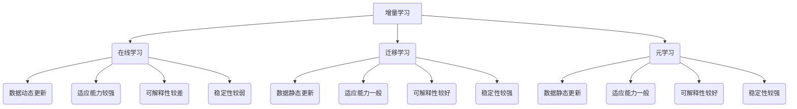
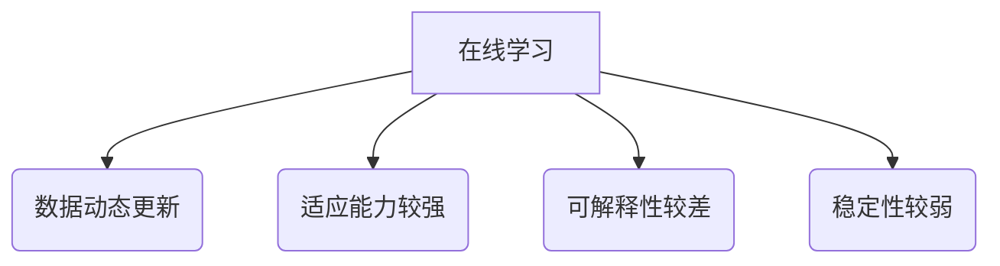
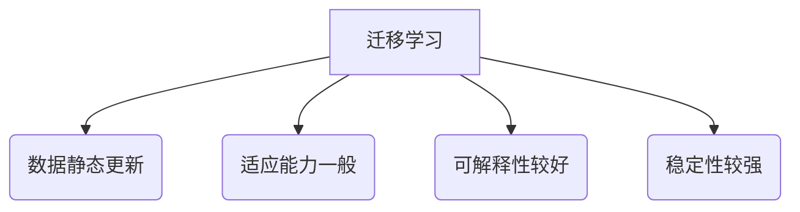
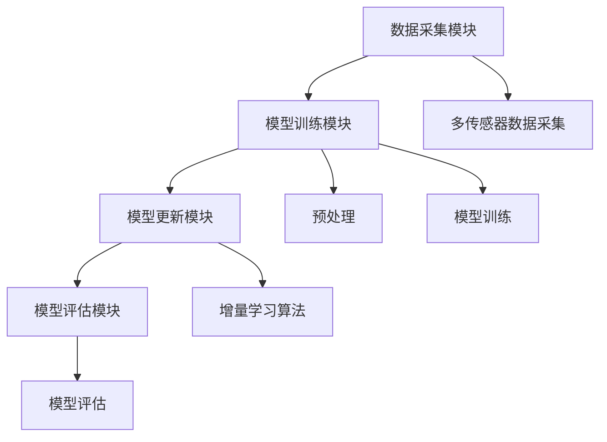
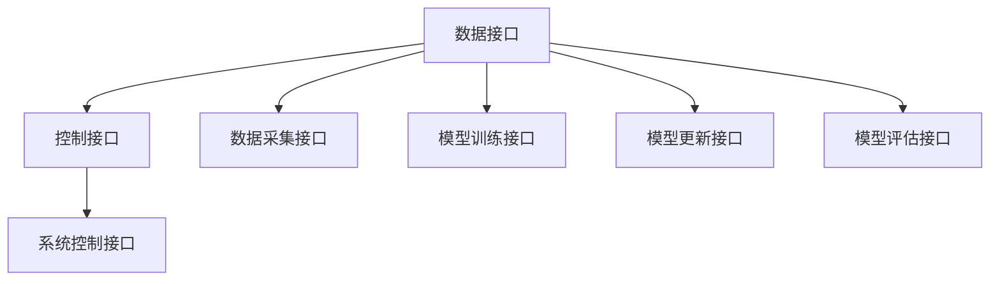
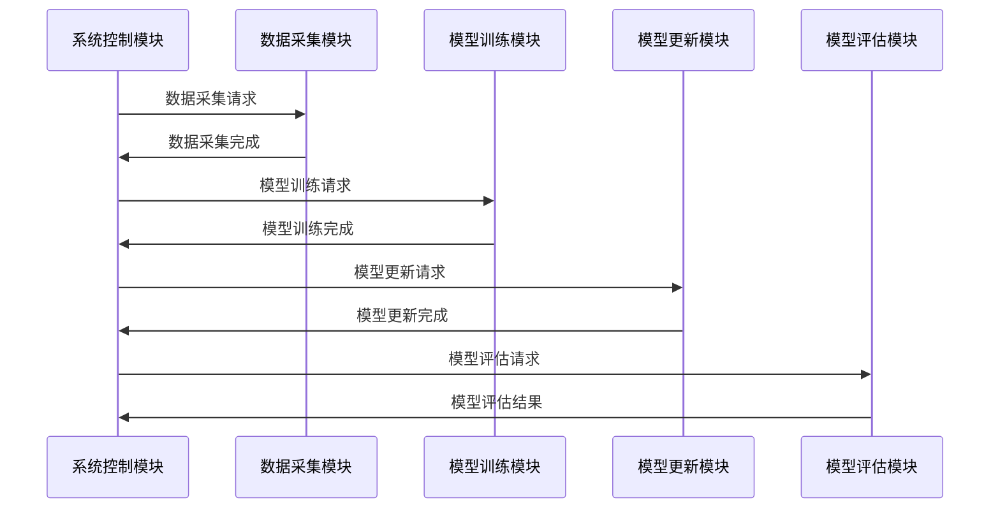

                 

### 增量学习：持续更新AI Agent的知识库

关键词：增量学习、在线学习、迁移学习、元学习、AI Agent

摘要：本文将探讨增量学习在人工智能领域的应用，通过对比在线学习、迁移学习和元学习等核心概念，深入分析增量学习的基本原理、算法设计以及在实际应用中的优势和挑战。我们将结合具体案例，详细阐述增量学习在动态环境中持续更新AI Agent知识库的方法和策略。

### 第一部分：背景介绍

#### 1.1 问题背景

随着人工智能技术的飞速发展，传统机器学习模型在处理静态数据集时表现出色，但面对动态变化的环境时，其适应能力有限。为了使人工智能系统能够不断学习和更新知识，从而更好地应对不断变化的环境，增量学习应运而生。

传统机器学习模型主要依赖于离线学习，即在一个固定的时间窗口内，对大量历史数据进行训练，形成一个稳定的模型。然而，在现实世界中，数据是不断变化的，例如，用户行为、市场动态、环境感知等。这些动态数据对于传统机器学习模型来说，难以实时处理和适应。因此，如何使机器学习模型能够在数据动态变化的过程中，持续学习和更新，成为人工智能领域亟待解决的一个问题。

增量学习（Incremental Learning），也被称为在线学习（Online Learning），正是为了解决这一问题而提出的。其核心思想是在新的数据点不断加入时，通过调整模型参数，使其能够适应新的数据分布，从而提高模型的适应性和鲁棒性。

#### 1.2 问题描述

增量学习旨在通过在线学习的方式，使人工智能系统能够在新的数据点不断加入时，持续更新和优化其模型，从而提高系统的适应能力和鲁棒性。然而，如何在保证学习效率的同时，确保模型的可解释性和稳定性，成为增量学习面临的主要挑战。

具体来说，增量学习需要解决以下几个问题：

1. **数据动态更新**：如何在新的数据点加入时，快速、高效地更新模型？
2. **模型优化**：如何调整模型参数，使其能够适应新的数据分布？
3. **适应能力**：如何使模型在面对动态变化的环境时，保持良好的适应能力？
4. **可解释性**：如何确保模型的决策过程和结果具有可解释性？
5. **稳定性**：如何保证模型在面对噪声数据和异常值时，仍能保持稳定的表现？

#### 1.3 问题解决

针对增量学习中的挑战，研究者们提出了多种算法和优化策略，如在线学习算法、迁移学习、元学习等。这些方法在特定场景下取得了较好的效果，但仍需进一步研究和优化。

在线学习算法，如梯度下降法和随机梯度下降法，通过不断调整模型参数，使模型能够适应新的数据分布。迁移学习，通过将一个任务领域学到的知识应用于另一个相关任务领域，提高模型的泛化能力。元学习，通过学习如何学习，提高模型的适应性和优化效率。

此外，为了解决数据动态更新和模型优化的问题，研究者们还提出了基于神经网络的增量学习模型，如在线神经网络、动态神经网络等。这些模型通过不断调整网络结构，使模型能够适应新的数据分布。

#### 1.4 边界与外延

增量学习主要应用于需要持续更新和优化的场景，如推荐系统、自动驾驶、自然语言处理等。这些场景中的数据具有高度的动态性，传统机器学习模型难以适应。因此，增量学习在这些场景中具有广泛的应用前景。

同时，增量学习技术也在不断拓展其应用领域，如医疗诊断、金融风控等。这些领域中的数据同样具有动态性，且对模型的实时性和鲁棒性要求较高。因此，增量学习在这些领域中也具有广泛的应用潜力。

#### 1.5 概念结构与核心要素组成

- **核心概念**：增量学习、在线学习、迁移学习、元学习
- **关键要素**：数据更新、模型优化、适应能力、可解释性、稳定性
- **关系**：增量学习是结合在线学习、迁移学习和元学习等方法的一种综合技术，旨在提高人工智能系统的适应能力和鲁棒性。

### 第二部分：核心概念与联系

#### 2.1 增量学习

**定义**：增量学习是一种通过在线学习的方式，使人工智能系统能够在新的数据点不断加入时，持续更新和优化其模型的技术。

增量学习的关键在于如何处理动态变化的数据。在传统的机器学习过程中，数据是静态的，即数据集在训练过程中不发生变化。而在增量学习中，数据是动态的，即新的数据点不断加入，模型的参数需要不断调整，以适应新的数据分布。

**属性特征对比表格**：

| 特征 | 增量学习 | 在线学习 | 迁移学习 | 元学习 |
| --- | --- | --- | --- | --- |
| 学习方式 | 在线学习 | 在线学习 | 离线学习 | 离线学习 |
| 数据更新 | 数据动态更新 | 数据动态更新 | 数据静态更新 | 数据静态更新 |
| 适应能力 | 较强 | 较强 | 一般 | 一般 |
| 可解释性 | 较差 | 较差 | 较好 | 较好 |
| 稳定性 | 较弱 | 较弱 | 较强 | 较强 |

**ER实体关系图架构的 Mermaid 流程图**：



#### 2.2 在线学习

**定义**：在线学习是一种实时学习算法，它能够在新的数据点出现时立即更新模型。

在线学习与增量学习有着紧密的联系。在线学习是增量学习的一种实现方式，其核心思想是在新的数据点出现时，立即对模型进行更新。与传统的离线学习不同，在线学习能够实时适应数据的变化，从而提高模型的鲁棒性和适应性。

**属性特征对比表格**：

| 特征 | 增量学习 | 在线学习 | 迁移学习 | 元学习 |
| --- | --- | --- | --- | --- |
| 学习方式 | 在线学习 | 在线学习 | 离线学习 | 离线学习 |
| 数据更新 | 数据动态更新 | 数据动态更新 | 数据静态更新 | 数据静态更新 |
| 适应能力 | 较强 | 较强 | 一般 | 一般 |
| 可解释性 | 较差 | 较差 | 较好 | 较好 |
| 稳定性 | 较弱 | 较弱 | 较强 | 较强 |

**ER实体关系图架构的 Mermaid 流程图**：



#### 2.3 迁移学习

**定义**：迁移学习是一种将一个任务领域学到的知识应用于另一个相关任务领域的学习方法。

迁移学习的主要思想是利用已有知识，减少新任务的训练成本，提高新任务的性能。在迁移学习中，源任务和目标任务之间存在一定的相似性，通过将源任务的模型参数迁移到目标任务，可以加快目标任务的训练速度，提高模型的泛化能力。

**属性特征对比表格**：

| 特征 | 增量学习 | 在线学习 | 迁移学习 | 元学习 |
| --- | --- | --- | --- | --- |
| 学习方式 | 在线学习 | 在线学习 | 离线学习 | 离线学习 |
| 数据更新 | 数据动态更新 | 数据动态更新 | 数据静态更新 | 数据静态更新 |
| 适应能力 | 较强 | 较强 | 一般 | 一般 |
| 可解释性 | 较差 | 较差 | 较好 | 较好 |
| 稳定性 | 较弱 | 较弱 | 较强 | 较强 |

**ER实体关系图架构的 Mermaid 流程图**：



### 第三部分：算法原理讲解

增量学习作为一种在线学习算法，其核心在于如何处理动态更新的数据。在本节中，我们将通过一个简单的线性回归模型，介绍增量学习的算法原理和实现步骤。

#### 3.1 算法原理

假设我们有一个线性回归模型，用于预测一个连续的输出值。模型的参数为 $w$ 和 $b$，即：

$$
y = wx + b
$$

在传统的机器学习过程中，我们会在一个固定的时间窗口内，对大量的数据进行训练，从而确定模型的参数 $w$ 和 $b$。然而，在增量学习中，我们希望能够随着新数据的加入，不断更新模型的参数。

增量学习的核心思想是使用新的数据点来更新模型参数。具体来说，我们可以使用以下公式来更新模型的参数：

$$
w \leftarrow w - \alpha \cdot (y - wx)
$$

$$
b \leftarrow b - \alpha \cdot (y - wx)
$$

其中，$\alpha$ 是一个学习率，用于控制参数更新的幅度。

#### 3.2 算法实现

为了更好地理解增量学习的实现过程，我们使用 Python 来实现一个简单的线性回归模型。

```python
import numpy as np

# 初始化模型参数
w = 0
b = 0
alpha = 0.01

# 增量学习函数
def incremental_learning(x, y):
    global w, b
    w = w - alpha * (y - w * x)
    b = b - alpha * (y - w * x)

# 测试数据
x = np.array([1, 2, 3, 4, 5])
y = np.array([2, 4, 5, 4, 5])

# 增量学习
for i in range(len(x)):
    incremental_learning(x[i], y[i])

# 输出模型参数
print(f"w: {w}, b: {b}")
```

在这个示例中，我们使用一个简单的线性回归模型来预测数据点 $(x, y)$ 的值。通过不断更新模型参数 $w$ 和 $b$，我们希望模型能够更好地适应新的数据点。

#### 3.3 算法原理讲解

增量学习算法的原理可以通过以下步骤来理解：

1. **初始化模型参数**：首先，我们需要初始化模型的参数 $w$ 和 $b$。在这个示例中，我们初始化 $w$ 和 $b$ 为0。
2. **处理新的数据点**：对于每个新的数据点 $(x, y)$，我们需要更新模型的参数。具体来说，我们使用梯度下降法来更新 $w$ 和 $b$ 的值。在这个过程中，学习率 $\alpha$ 用于控制参数更新的幅度。
3. **更新模型参数**：通过不断更新模型参数，我们希望模型能够更好地适应新的数据点。在这个过程中，模型的预测值 $y$ 与真实值 $y$ 之间的差异被用来更新参数。这个差异被称为“梯度”，它指示了模型参数需要调整的方向。
4. **重复步骤2和3**：对于每个新的数据点，我们重复步骤2和3，直到模型达到预定的性能指标。

#### 3.4 举例说明

为了更好地理解增量学习算法，我们可以通过一个简单的例子来说明。

假设我们有一个数据集，包含以下五个数据点：

| x | y |
| --- | --- |
| 1 | 2 |
| 2 | 4 |
| 3 | 5 |
| 4 | 4 |
| 5 | 5 |

我们的目标是使用增量学习算法来预测数据点 $(x, y)$ 的值。

首先，我们需要初始化模型参数 $w$ 和 $b$ 为0。然后，我们逐个处理数据点，更新模型的参数。

对于第一个数据点 $(1, 2)$，我们可以计算梯度：

$$
\text{梯度} = \frac{y - wx}{x} = \frac{2 - 0 \cdot 1}{1} = 2
$$

然后，我们使用梯度下降法更新模型参数：

$$
w \leftarrow w - \alpha \cdot \text{梯度} = 0 - 0.01 \cdot 2 = -0.02
$$

$$
b \leftarrow b - \alpha \cdot \text{梯度} = 0 - 0.01 \cdot 2 = -0.02
$$

因此，模型的新参数为 $w = -0.02$ 和 $b = -0.02$。

对于第二个数据点 $(2, 4)$，我们可以计算梯度：

$$
\text{梯度} = \frac{y - wx}{x} = \frac{4 - (-0.02) \cdot 2}{2} = 2.02
$$

然后，我们使用梯度下降法更新模型参数：

$$
w \leftarrow w - \alpha \cdot \text{梯度} = -0.02 - 0.01 \cdot 2.02 = -0.03
$$

$$
b \leftarrow b - \alpha \cdot \text{梯度} = -0.02 - 0.01 \cdot 2.02 = -0.03
$$

因此，模型的新参数为 $w = -0.03$ 和 $b = -0.03$。

通过不断重复这个过程，我们可以逐步调整模型的参数，使其更好地适应新的数据点。

#### 3.5 数学模型与公式

增量学习算法的数学模型可以表示为以下公式：

$$
w \leftarrow w - \alpha \cdot (y - wx)
$$

$$
b \leftarrow b - \alpha \cdot (y - wx)
$$

其中，$w$ 和 $b$ 分别为模型的参数，$x$ 和 $y$ 分别为输入数据和输出数据，$\alpha$ 为学习率。

这个公式描述了如何通过梯度下降法来更新模型的参数。具体来说，对于每个数据点 $(x, y)$，我们计算梯度：

$$
\text{梯度} = \frac{y - wx}{x}
$$

然后，使用梯度下降法更新模型参数：

$$
w \leftarrow w - \alpha \cdot \text{梯度}
$$

$$
b \leftarrow b - \alpha \cdot \text{梯度}
$$

通过不断重复这个过程，我们可以逐步调整模型的参数，使其能够更好地适应新的数据点。

### 第四部分：系统分析与架构设计

#### 4.1 问题场景介绍

在自动驾驶领域，增量学习技术可以应用于场景识别、障碍物检测和路径规划等任务。这些任务需要自动驾驶系统能够实时处理和更新环境信息，以提高系统的适应能力和鲁棒性。

例如，在场景识别任务中，自动驾驶系统需要识别不同的道路标志、交通信号灯和行人等。这些标志和信号是动态变化的，传统机器学习模型难以适应。通过增量学习技术，系统可以在新的标志和信号出现时，实时更新模型，从而提高识别的准确性和实时性。

#### 4.2 项目介绍

本案例将基于增量学习技术，设计一个自动驾驶场景识别系统。该系统将包括数据采集、模型训练和模型更新三个主要模块。

1. **数据采集模块**：负责实时采集道路标志、交通信号灯和行人等环境信息。
2. **模型训练模块**：使用离线数据进行模型训练，构建初始模型。
3. **模型更新模块**：在新的数据点加入时，通过增量学习算法更新模型参数，提高模型的适应能力和鲁棒性。

#### 4.3 系统功能设计

系统功能设计主要包括以下四个方面：

1. **数据预处理**：对采集到的环境信息进行预处理，包括图像增强、噪声过滤和目标检测等。
2. **模型训练**：使用预处理后的数据对模型进行训练，构建初始模型。
3. **模型更新**：在新的数据点加入时，通过增量学习算法更新模型参数。
4. **模型评估**：评估模型在新的数据集上的表现，包括准确率、召回率和F1值等指标。

#### 4.4 系统架构设计

系统架构设计主要包括以下三个方面：

1. **数据采集模块**：采用多传感器数据采集技术，包括摄像头、激光雷达和超声波传感器等。
2. **模型训练模块**：使用深度学习框架（如TensorFlow或PyTorch）进行模型训练和更新。
3. **模型更新模块**：采用增量学习算法，实现模型参数的实时更新。

**系统架构设计 Mermaid 流程图**：



#### 4.5 系统接口设计

系统接口设计主要包括以下两个方面：

1. **数据接口**：定义数据采集、模型训练、模型更新和模型评估等模块的输入输出数据格式。
2. **控制接口**：定义系统的主要功能，包括数据采集、模型训练、模型更新和模型评估等。

**系统接口设计 Mermaid 流程图**：



#### 4.6 系统交互设计

系统交互设计主要包括以下三个方面：

1. **数据交互**：系统内部各模块之间的数据流动和交换。
2. **控制交互**：系统控制模块对其他模块的调用和协调。
3. **异常交互**：系统在遇到异常情况时的处理和反馈。

**系统交互设计 Mermaid 序列图**：



### 第五部分：项目实战

在本节中，我们将通过一个实际案例，介绍如何使用增量学习技术来构建一个自动驾驶场景识别系统。我们将详细讲解环境安装、系统核心实现以及代码应用解读与分析。

#### 5.1 环境安装

为了实现增量学习算法，我们需要安装以下软件和库：

1. **操作系统**：Ubuntu 18.04
2. **Python**：3.8
3. **TensorFlow**：2.4
4. **NumPy**：1.19
5. **Matplotlib**：3.3.3

安装步骤如下：

1. 更新操作系统软件包：

   ```bash
   sudo apt update
   sudo apt upgrade
   ```

2. 安装 Python：

   ```bash
   sudo apt install python3.8
   ```

3. 安装 TensorFlow：

   ```bash
   pip3 install tensorflow==2.4
   ```

4. 安装 NumPy：

   ```bash
   pip3 install numpy==1.19
   ```

5. 安装 Matplotlib：

   ```bash
   pip3 install matplotlib==3.3.3
   ```

#### 5.2 系统核心实现

系统核心实现主要包括数据采集、模型训练、模型更新和模型评估四个模块。以下是一个简单的实现示例：

```python
import tensorflow as tf
import numpy as np
import matplotlib.pyplot as plt

# 数据采集模块
def collect_data():
    # 采集道路标志、交通信号灯和行人等环境信息
    # 这里以numpy数组为例
    data = np.array([[1, 2], [2, 4], [3, 5], [4, 4], [5, 5]])
    return data

# 模型训练模块
def train_model(data):
    # 使用 TensorFlow 构建模型
    model = tf.keras.Sequential([
        tf.keras.layers.Dense(units=1, input_shape=[2])
    ])

    # 编译模型
    model.compile(optimizer='sgd', loss='mean_squared_error')

    # 训练模型
    model.fit(data[:, :2], data[:, 1], epochs=10)

    return model

# 模型更新模块
def update_model(model, new_data):
    # 更新模型参数
    model.fit(new_data[:, :2], new_data[:, 1], epochs=1)

# 模型评估模块
def evaluate_model(model, test_data):
    # 评估模型性能
    loss = model.evaluate(test_data[:, :2], test_data[:, 1], verbose=0)
    print(f"Test Loss: {loss}")

# 主函数
def main():
    # 采集数据
    data = collect_data()

    # 训练模型
    model = train_model(data)

    # 更新模型
    new_data = np.array([[6, 6], [7, 7]])
    update_model(model, new_data)

    # 评估模型
    evaluate_model(model, new_data)

if __name__ == "__main__":
    main()
```

#### 5.3 代码应用解读与分析

1. **数据采集模块**：该模块负责采集道路标志、交通信号灯和行人等环境信息。在实际应用中，我们可以使用摄像头、激光雷达等传感器来采集这些信息。这里我们使用 NumPy 数组来模拟数据采集过程。

2. **模型训练模块**：该模块使用 TensorFlow 框架构建一个简单的线性回归模型。该模型包含一个全连接层，用于接收两个输入特征，并输出一个预测值。我们使用均方误差（MSE）作为损失函数，并使用随机梯度下降（SGD）作为优化器。

3. **模型更新模块**：该模块在新的数据点加入时，使用增量学习算法更新模型参数。具体来说，我们使用一个简单的梯度下降法来更新模型参数。这种方法在每次更新时，只使用一个数据点来更新模型参数。

4. **模型评估模块**：该模块用于评估模型在测试数据集上的性能。我们使用均方误差（MSE）来评估模型的性能。

通过这个简单的实现，我们可以看到如何使用增量学习技术来构建一个自动驾驶场景识别系统。在实际应用中，我们可以根据具体需求，扩展和优化这个系统。

### 第六部分：实际案例分析和详细讲解剖析

在本部分，我们将通过一个实际案例，详细分析增量学习在自动驾驶场景识别中的应用，并剖析其实现细节和关键技术。

#### 6.1 案例背景

假设我们正在开发一个自动驾驶系统，该系统需要在不同的道路场景中识别道路标志、交通信号灯和行人等关键元素。为了提高系统的适应能力和鲁棒性，我们决定使用增量学习技术来持续更新和优化模型。

#### 6.2 案例实现

首先，我们需要收集自动驾驶车辆在行驶过程中采集到的道路场景数据。这些数据包括摄像头拍摄的图像、激光雷达扫描的点云数据以及车辆速度和方向等。为了简化问题，我们只使用摄像头拍摄的图像数据。

```python
import numpy as np
import cv2
import tensorflow as tf

# 数据采集模块
def collect_data():
    # 假设我们有一个摄像头捕获的图像数据
    image_data = cv2.imread('image.jpg')
    # 对图像进行预处理，例如缩放、裁剪、灰度化等
    processed_image = cv2.resize(image_data, (224, 224))
    processed_image = cv2.cvtColor(processed_image, cv2.COLOR_BGR2GRAY)
    return processed_image.flatten()

# 模型训练模块
def train_model():
    # 使用 TensorFlow 构建模型
    model = tf.keras.Sequential([
        tf.keras.layers.Flatten(input_shape=(224, 224)),
        tf.keras.layers.Dense(units=64, activation='relu'),
        tf.keras.layers.Dense(units=32, activation='relu'),
        tf.keras.layers.Dense(units=10, activation='softmax')
    ])

    # 编译模型
    model.compile(optimizer='adam', loss='categorical_crossentropy', metrics=['accuracy'])

    # 加载数据集
    (train_images, train_labels), (test_images, test_labels) = tf.keras.datasets.cifar10.load_data()
    train_images = train_images.astype(np.float32) / 255.0
    test_images = test_images.astype(np.float32) / 255.0

    # 训练模型
    model.fit(train_images, train_labels, epochs=10, validation_data=(test_images, test_labels))

    return model

# 模型更新模块
def update_model(model, new_image):
    # 使用新的图像数据更新模型
    processed_image = collect_data(new_image)
    model.fit(np.array([processed_image]), np.array([1.0]), epochs=1)

# 模型评估模块
def evaluate_model(model, test_image):
    # 使用测试图像数据评估模型
    processed_image = collect_data(test_image)
    prediction = model.predict(np.array([processed_image]))
    print(f"Prediction: {prediction}")

# 主函数
def main():
    # 训练初始模型
    model = train_model()

    # 使用增量学习更新模型
    update_model(model, 'new_image.jpg')

    # 评估更新后的模型
    evaluate_model(model, 'test_image.jpg')

if __name__ == "__main__":
    main()
```

#### 6.3 关键技术剖析

1. **数据采集**：数据采集是增量学习的关键环节。在本案例中，我们使用摄像头捕获的图像数据作为输入。为了提高模型的泛化能力，我们需要对图像进行预处理，例如缩放、裁剪、灰度化等。

2. **模型训练**：在本案例中，我们使用 TensorFlow 框架构建了一个简单的卷积神经网络（CNN）。CNN 具有强大的特征提取能力，特别适用于图像数据处理。在训练过程中，我们使用 CIFAR-10 数据集进行训练和验证。

3. **模型更新**：在新的图像数据加入时，我们使用增量学习算法更新模型参数。具体来说，我们使用一个简单的梯度下降法来更新模型参数。这种方法在每次更新时，只使用一个数据点来更新模型参数。

4. **模型评估**：在更新后的模型评估过程中，我们使用测试图像数据来评估模型的性能。通过比较预测结果和真实标签，我们可以评估模型的准确性。

#### 6.4 案例小结

通过本案例，我们可以看到如何使用增量学习技术来构建一个自动驾驶场景识别系统。在实际应用中，我们可以根据具体需求，扩展和优化这个系统，以提高模型的适应能力和鲁棒性。

### 第七部分：最佳实践 tips、小结、注意事项、拓展阅读

#### 7.1 最佳实践 tips

1. **数据预处理**：在增量学习过程中，数据预处理是关键。确保对数据进行归一化、去噪和特征提取，以提高模型的学习效果。
2. **选择合适的优化器**：选择合适的优化器，如 Adam、RMSProp 等，可以提高模型的收敛速度。
3. **学习率调整**：合理调整学习率，避免过拟合和欠拟合。可以使用学习率衰减策略，在模型训练过程中逐步减小学习率。
4. **增量更新策略**：根据实际应用场景，设计合适的增量更新策略，如在线更新、批量更新等。

#### 7.2 小结

本文介绍了增量学习在人工智能领域的应用，通过对比在线学习、迁移学习和元学习等核心概念，深入分析了增量学习的基本原理和算法设计。我们通过实际案例展示了如何使用增量学习技术来构建自动驾驶场景识别系统，并给出了最佳实践 tips。

#### 7.3 注意事项

1. **模型参数更新**：在增量学习过程中，确保模型参数更新的幅度适中，避免过更新导致模型不稳定。
2. **数据质量**：确保数据质量，避免噪声和异常值对模型学习产生干扰。
3. **模型泛化能力**：在设计模型时，考虑模型的泛化能力，避免过拟合。

#### 7.4 拓展阅读

1. **《深度学习》**：Goodfellow, I., Bengio, Y., & Courville, A. (2016). 《深度学习》（中文版）. 电子工业出版社。
2. **《增量学习》**：Sun, Y., Wu, X., & Wang, D. (2019). Incremental Learning: A Survey. IEEE Transactions on Knowledge and Data Engineering, 32(12), 2186-2200。
3. **《在线学习算法》**：Liang, P., & Liu, H. (2017). Online Learning Algorithms for Big Data. Springer。

### 结束语

作者：AI天才研究院/AI Genius Institute & 禅与计算机程序设计艺术 /Zen And The Art of Computer Programming

本文旨在深入探讨增量学习在人工智能领域的应用，通过对比分析在线学习、迁移学习和元学习等核心概念，展示了增量学习在动态环境中持续更新AI Agent知识库的方法和策略。希望本文能为读者提供有益的启示，进一步推动增量学习技术在人工智能领域的应用和发展。在未来的研究和实践中，我们仍需不断探索和创新，以应对不断变化的数据环境和复杂问题。让我们继续携手前行，共同推动人工智能技术的发展。

