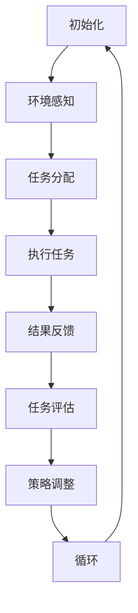
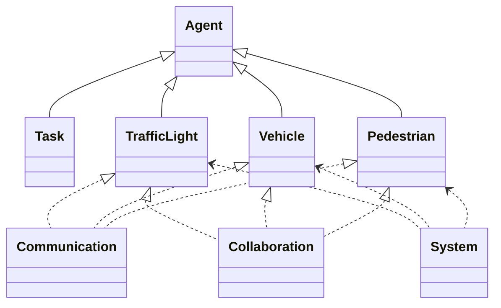
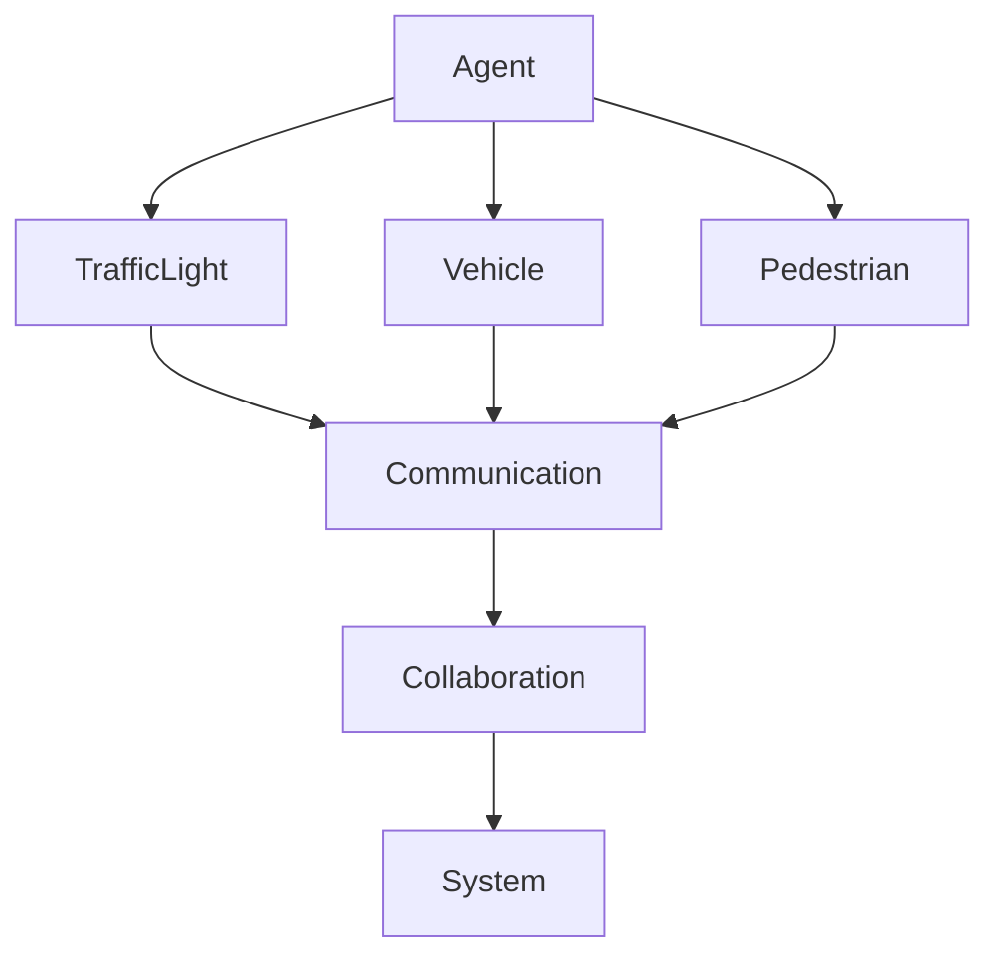
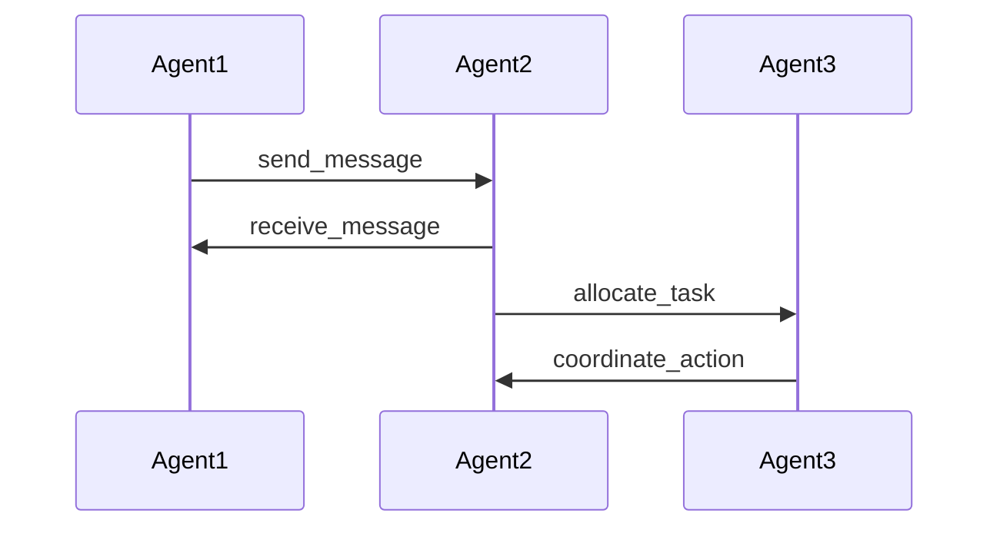

                 

# 多Agent协作系统：复杂任务的分布式解决方案

关键词：多Agent系统，分布式协作，算法，数学模型，架构设计，项目实战

摘要：本文将探讨多Agent协作系统，作为一种分布式解决方案，在复杂任务处理中的应用。通过深入剖析多Agent系统的核心概念、算法原理、数学模型以及系统架构设计，并结合实际项目实战，为读者提供全面的技术指导和实践思路。

## 目录大纲设计

### 第一部分：多Agent系统基础

#### 第1章：多Agent系统概述
- **1.1** 问题背景与核心概念
  - 问题描述
  - 问题解决
  - 边界与外延
  - 概念结构与核心要素组成
- **1.2** 多Agent系统的定义与特点
  - 定义
  - 核心特点
  - 与分布式计算的关系
- **1.3** 多Agent系统的基本架构
  - 基本组件
  - 通信机制
  - 协同策略
- **1.4** 多Agent系统的分类
  - 基于任务的分类
  - 域功能分类
  - 基于协作机制的分类
- **1.5** 多Agent系统的应用领域
  - 制造业
  - 服务业
  - 交通运输
  - 医疗保健
- **1.6** 本章小结

#### 第2章：多Agent系统的核心概念与联系
- **2.1** 多Agent系统的核心概念原理
  - 代理（Agent）的定义与特性
  - 交互（Interaction）与协同（Collaboration）
  - 计划（Planning）与决策（Decision Making）
- **2.2** 多Agent系统的概念属性特征对比表格
  - 概念对比表格
- **2.3** 多Agent系统的ER实体关系图架构
  - ER图
- **2.4** 本章小结

#### 第3章：多Agent协作系统的算法原理
- **3.1** 多Agent协作算法概述
  - 协作算法的类型
  - 协作算法的设计原则
- **3.2** 算法原理Mermaid流程图
  - Mermaid流程图
- **3.3** Python源代码讲解
  - 算法实现
  - 代码解析
- **3.4** 数学模型与公式
  - 数学模型
  - 公式详细讲解
- **3.5** 举例说明
  - 例子
  - 结果分析
- **3.6** 本章小结

#### 第4章：多Agent协作系统的数学模型与公式详解
- **4.1** 数学模型介绍
  - 分布式优化模型
  - 贝叶斯网络模型
  - 随机模型
- **4.2** 数学公式与解释
  - 公式列表
  - 详细解释
- **4.3** 案例分析
  - 实际应用案例
  - 模型应用分析
- **4.4** 本章小结

#### 第5章：多Agent协作系统的系统分析与架构设计
- **5.1** 问题场景介绍
  - 问题背景
  - 解决方案需求
- **5.2** 项目介绍
  - 项目背景
  - 项目目标
- **5.3** 系统功能设计
  - 领域模型Mermaid类图
- **5.4** 系统架构设计
  - Mermaid架构图
- **5.5** 系统接口设计
  - 接口设计
- **5.6** 系统交互Mermaid序列图
  - 序列图
- **5.7** 本章小结

### 第二部分：多Agent协作系统的项目实战

#### 第6章：多Agent协作系统的项目实战
- **6.1** 环境安装
  - 开发环境配置
  - 系统依赖安装
- **6.2** 系统核心实现源代码
  - 代码结构
  - 核心代码解析
- **6.3** 代码应用解读与分析
  - 应用场景
  - 代码解读
- **6.4** 实际案例分析和详细讲解
  - 案例背景
  - 案例分析
  - 详细讲解
- **6.5** 项目小结
  - 经验总结
  - 优化建议
- **6.6** 本章小结

#### 第7章：多Agent协作系统的最佳实践与拓展
- **7.1** 最佳实践 tips
  - 实践技巧
  - 注意事项
- **7.2** 小结
  - 全书总结
- **7.3** 注意事项
  - 运行时注意事项
  - 系统维护
- **7.4** 拓展阅读
  - 相关文献
  - 进一步学习资源
- **7.5** 本章小结

### 总结
本书通过系统的讲解和实战案例，全面介绍了多Agent协作系统的概念、原理、算法、架构设计以及项目实战。读者可以通过学习本书，掌握多Agent协作系统的核心知识和应用方法，为解决复杂任务的分布式解决方案提供理论依据和实践指导。

---

## 多Agent系统概述

### 1.1 问题背景与核心概念

#### 问题描述

在复杂任务中，往往需要多个实体或系统协同工作，以实现整体目标。这些实体或系统可以是计算机程序、机器人、智能设备等。然而，传统集中式系统在处理复杂任务时存在单点故障、可扩展性差等问题。多Agent系统作为一种分布式解决方案，通过将任务分解为子任务，并让多个Agent独立完成各自的子任务，从而提高系统的可扩展性和容错性。

#### 问题解决

多Agent系统通过以下方法解决上述问题：

1. **任务分解**：将复杂任务分解为多个子任务，每个子任务由一个或多个Agent独立完成。
2. **协同工作**：通过通信和协作机制，使Agent之间能够共享信息、协调行动，实现整体目标。
3. **动态调整**：根据系统状态和环境变化，Agent能够动态调整自己的行为和策略，以适应新的任务需求。

#### 边界与外延

多Agent系统的边界取决于系统的具体应用场景和目标。一般来说，它包括以下核心要素：

1. **代理（Agent）**：多Agent系统的核心组件，具有自主性、社交性、反应性、适应性等特性。
2. **交互（Interaction）**：Agent之间的信息交换和协作过程。
3. **通信（Communication）**：Agent之间进行信息传递的机制。
4. **协同（Collaboration）**：Agent通过协作实现共同目标的过程。

#### 概念结构与核心要素组成

多Agent系统的概念结构包括以下方面：

1. **代理模型**：定义Agent的特性、能力和行为。
2. **交互模型**：描述Agent之间的交互方式和规则。
3. **通信模型**：定义Agent之间的通信协议和机制。
4. **协同模型**：描述Agent协作实现共同目标的过程。

### 1.2 多Agent系统的定义与特点

#### 定义

多Agent系统（Multi-Agent System，MAS）是由多个自主智能代理组成的系统，这些代理通过交互和协作实现共同目标。在多Agent系统中，每个代理都具有以下特点：

1. **自主性**：代理可以独立地制定自己的行为和决策，不受其他代理的直接控制。
2. **社交性**：代理能够与其他代理进行交互，以获取信息、协调行动。
3. **反应性**：代理能够对环境变化做出实时响应，调整自己的行为。
4. **适应性**：代理能够根据任务需求和环境变化，动态调整自己的行为和策略。

#### 核心特点

多Agent系统的核心特点包括：

1. **分布式**：任务分解为多个子任务，由多个Agent独立完成，提高系统可扩展性和容错性。
2. **动态性**：系统具有动态调整行为和策略的能力，以适应环境变化和任务需求。
3. **自组织**：Agent通过协同工作实现共同目标，形成自组织结构。
4. **异构性**：代理具有不同的特性、能力和行为，系统具有异构性。

#### 与分布式计算的关系

多Agent系统与分布式计算有密切的关系。分布式计算是将任务分解为多个子任务，由多个计算机节点独立完成，而多Agent系统则是将任务分解为多个子任务，由多个智能代理独立完成。两者的主要区别在于：

1. **目标**：分布式计算的主要目标是提高计算性能和效率，而多Agent系统的主要目标是实现协同工作和自主决策。
2. **自主性**：分布式计算中的计算机节点通常是无自主性的，而多Agent系统中的代理具有自主性。
3. **协同**：分布式计算中的计算机节点之间通常没有协作关系，而多Agent系统中的代理之间存在协作关系。

### 1.3 多Agent系统的基本架构

#### 基本组件

多Agent系统的基本组件包括：

1. **代理（Agent）**：系统核心组件，具有自主性、社交性、反应性、适应性等特性。
2. **环境（Environment）**：代理所处的外部环境，提供代理需要的资源和服务。
3. **通信机制**：代理之间进行信息传递和通信的机制。
4. **协同策略**：描述代理协作实现共同目标的方法和规则。

#### 通信机制

多Agent系统的通信机制包括：

1. **点对点通信**：代理之间直接进行通信，适用于代理数量较少且通信复杂度较低的场景。
2. **广播通信**：代理向所有其他代理发送消息，适用于代理数量较多且需要广播信息的场景。
3. **发布-订阅通信**：代理发布信息，其他代理订阅相关信息，适用于信息传播和过滤的场景。

#### 协同策略

多Agent系统的协同策略包括：

1. **分布式决策**：代理独立进行决策，但需要协调各自的行为，以实现共同目标。
2. **集中式决策**：代理将决策任务集中到一个代理或一组代理中进行，其他代理负责执行决策结果。
3. **混合式决策**：结合分布式决策和集中式决策，根据任务需求和代理能力进行动态调整。

### 1.4 多Agent系统的分类

#### 基于任务的分类

多Agent系统可以基于任务进行分类，主要包括以下类型：

1. **任务分配型**：将复杂任务分解为多个子任务，分配给不同的代理独立完成。
2. **任务协作型**：多个代理共同完成一个复杂任务，需要协作和协调。
3. **任务共享型**：多个代理共享一个任务，每个代理负责部分子任务，并通过协作完成整个任务。

#### 域功能分类

多Agent系统可以基于域功能进行分类，主要包括以下类型：

1. **信息收集与处理**：代理收集环境信息，进行数据分析和处理。
2. **任务规划与调度**：代理根据任务需求和资源情况，进行任务规划与调度。
3. **决策与控制**：代理根据任务目标和环境信息，进行决策和实时控制。

#### 基于协作机制的分类

多Agent系统可以基于协作机制进行分类，主要包括以下类型：

1. **基于知识的协作**：代理根据共享知识库和推理机制进行协作。
2. **基于通信的协作**：代理通过通信机制交换信息，实现协作。
3. **基于任务的协作**：代理根据任务需求和分配情况，进行协作。

### 1.5 多Agent系统的应用领域

#### 制造业

多Agent系统在制造业中具有广泛的应用，主要包括：

1. **生产计划与调度**：代理负责生产计划的制定和调度，提高生产效率和灵活性。
2. **质量检测与控制**：代理负责生产过程中的质量检测和控制，确保产品质量。
3. **设备维护与预测**：代理负责设备维护和预测，降低设备故障率和维修成本。

#### 服务业

多Agent系统在服务业中具有广泛应用，主要包括：

1. **智能客服系统**：代理负责处理客户咨询和投诉，提高客户满意度和服务质量。
2. **智能家居系统**：代理负责智能家居设备的管理和控制，提供智能化的家居体验。
3. **交通管理系统**：代理负责交通流量监测和调度，提高交通效率和安全性。

#### 交通运输

多Agent系统在交通运输领域具有广泛应用，主要包括：

1. **智能交通控制系统**：代理负责交通信号灯的控制和交通流量的监测，提高交通效率和安全性。
2. **自动驾驶系统**：代理负责自动驾驶车辆的决策和控制，实现智能驾驶。
3. **物流配送系统**：代理负责物流配送的任务分配和路径规划，提高物流效率和准确性。

#### 医疗保健

多Agent系统在医疗保健领域具有广泛应用，主要包括：

1. **远程医疗系统**：代理负责远程医疗咨询和诊断，提高医疗资源的利用效率和覆盖范围。
2. **智能医疗设备**：代理负责医疗设备的监控和管理，提高医疗设备的安全性和可靠性。
3. **健康管理服务**：代理负责健康管理数据的收集和分析，提供个性化的健康建议和服务。

### 1.6 本章小结

本章对多Agent系统进行了概述，包括问题背景、核心概念、定义与特点、基本架构、分类以及应用领域。通过本章的学习，读者可以了解多Agent系统的基本概念和应用场景，为后续章节的学习打下基础。

## 多Agent系统的核心概念与联系

### 2.1 多Agent系统的核心概念原理

#### 代理（Agent）的定义与特性

代理（Agent）是多Agent系统中的核心组件，具有以下特性：

1. **自主性**：代理可以独立地制定自己的行为和决策，不受其他代理的直接控制。
2. **社交性**：代理能够与其他代理进行交互，以获取信息、协调行动。
3. **反应性**：代理能够对环境变化做出实时响应，调整自己的行为。
4. **适应性**：代理能够根据任务需求和环境变化，动态调整自己的行为和策略。

代理的分类：

1. **主动代理**：主动发起行为，驱动系统的运行。
2. **被动代理**：接受其他代理的请求，执行特定任务。

#### 交互（Interaction）与协同（Collaboration）

交互是指代理之间进行信息交换和协作的过程。交互的形式包括：

1. **通信**：代理之间通过通信机制交换信息，可以是同步或异步的。
2. **共享**：代理共享资源、知识和数据，实现信息融合和互补。

协同是指代理通过合作实现共同目标的过程。协同的形式包括：

1. **合作**：多个代理共同完成一个任务，各自承担不同的子任务。
2. **竞争**：多个代理在共享资源或目标时，进行竞争和协调。
3. **协商**：代理通过协商解决冲突，达成共识，实现合作。

#### 计划（Planning）与决策（Decision Making）

计划是指代理在执行任务前，制定一个全局性的策略和行为序列。计划的过程包括：

1. **目标设定**：确定代理的任务目标。
2. **任务分解**：将复杂任务分解为多个子任务。
3. **路径规划**：为子任务分配资源和确定执行顺序。

决策是指代理在执行任务过程中，根据环境变化和任务状态，选择最佳行为和策略。决策的过程包括：

1. **状态评估**：评估当前状态，确定面临的挑战。
2. **选择策略**：根据当前状态，选择最佳策略。
3. **执行行为**：根据策略，执行相应的行为。

### 2.2 多Agent系统的概念属性特征对比表格

| 概念       | 特性                     | 说明                                                         |
|------------|------------------------|------------------------------------------------------------|
| 代理（Agent） | 自主性、社交性、反应性、适应性 | 具有独立决策和执行任务的能力，与其他代理进行交互和协作 |
| 交互（Interaction） | 通信、共享               | 代理之间通过通信和共享实现信息交换和合作               |
| 协同（Collaboration） | 合作、竞争、协商          | 代理通过合作、竞争和协商实现共同目标                 |
| 计划（Planning）   | 目标设定、任务分解、路径规划 | 制定全局性策略和行为序列，实现任务执行               |
| 决策（Decision Making） | 状态评估、选择策略、执行行为 | 根据环境变化和任务状态，选择最佳行为和策略         |

### 2.3 多Agent系统的ER实体关系图架构

多Agent系统的ER实体关系图架构如下：

```mermaid
erDiagram
  Agent ||--|{ Environment }|| Environment
  Agent ||--|{ Communication }|| Communication
  Agent ||--|{ Collaboration }|| Collaboration
  Agent ||--|{ Planning }|| Planning
  Agent ||--|{ Decision Making }|| Decision Making
  Environment ||--|{ Resource }|| Resource
  Communication ||--|{ Message }|| Message
  Collaboration ||--|{ Team }|| Team
  Planning ||--|{ Task }|| Task
  Decision Making ||--|{ Strategy }|| Strategy
```

### 2.4 本章小结

本章介绍了多Agent系统的核心概念，包括代理（Agent）、交互（Interaction）、协同（Collaboration）、计划（Planning）和决策（Decision Making）。通过对比表格和ER实体关系图，读者可以更清晰地理解这些概念之间的关系和特性。本章的内容为后续章节的学习提供了基础。

## 多Agent协作系统的算法原理

### 3.1 多Agent协作算法概述

#### 协作算法的类型

多Agent协作算法可以根据不同的分类标准进行分类，常见的分类方法包括：

1. **基于任务类型的协作算法**：根据任务的不同类型设计相应的协作算法，如任务分配算法、任务调度算法、任务分配与调度结合的算法等。
2. **基于协作机制的协作算法**：根据协作机制的不同设计相应的协作算法，如基于信息共享的协作算法、基于协商机制的协作算法、基于协调机制的协作算法等。
3. **基于通信方式的协作算法**：根据通信方式的不同设计相应的协作算法，如基于点对点通信的协作算法、基于广播通信的协作算法、基于发布-订阅通信的协作算法等。

#### 协作算法的设计原则

设计多Agent协作算法时，需要遵循以下原则：

1. **分布式**：协作算法应具有分布式特性，使每个代理能够独立地制定自己的行为和决策，提高系统的可扩展性和容错性。
2. **动态性**：协作算法应能够根据环境变化和任务需求动态调整自己的行为和策略，以适应不断变化的场景。
3. **自组织**：协作算法应能够通过自组织机制，使代理之间能够自动建立合作关系，实现协同工作。
4. **适应性**：协作算法应能够根据任务复杂度和环境变化，选择合适的协作策略，提高协作效率和效果。
5. **鲁棒性**：协作算法应具有较高的鲁棒性，能够在面对不确定性和故障时，保持系统的稳定性和可靠性。

### 3.2 算法原理Mermaid流程图

为了更好地理解多Agent协作算法的原理，我们可以使用Mermaid流程图进行描述。以下是一个简单的多Agent协作算法的Mermaid流程图：



#### Mermaid流程图解析

1. **初始化**：代理初始化自身状态，包括代理的ID、位置、能力等。
2. **环境感知**：代理感知当前环境的状态，包括资源分布、任务分布、环境变化等。
3. **任务分配**：代理根据自身能力和环境信息，选择合适的任务进行分配。
4. **执行任务**：代理根据分配的任务，执行相应的操作。
5. **结果反馈**：代理将执行结果反馈给系统，包括任务完成情况、资源消耗等。
6. **任务评估**：系统根据代理的反馈结果，评估任务完成情况和系统状态。
7. **策略调整**：系统根据任务评估结果，调整代理的策略和任务分配策略。
8. **循环**：代理进入下一个循环，重复执行环境感知、任务分配、执行任务等步骤。

### 3.3 Python源代码讲解

为了更好地理解多Agent协作算法的实现，我们可以通过Python源代码进行讲解。以下是一个简单的多Agent协作算法的Python实现：

```python
import random

class Agent:
    def __init__(self, id, position, capability):
        self.id = id
        self.position = position
        self.capability = capability
    
    def perceive_environment(self):
        # 感知环境状态
        pass
    
    def allocate_task(self):
        # 分配任务
        pass
    
    def execute_task(self):
        # 执行任务
        pass
    
    def feedback_result(self):
        # 反馈结果
        pass
    
    def evaluate_task(self):
        # 评估任务
        pass
    
    def adjust_strategy(self):
        # 调整策略
        pass

class MultiAgentSystem:
    def __init__(self):
        self.agents = []
        self.env = None
    
    def initialize_agents(self):
        # 初始化代理
        pass
    
    def run(self):
        while True:
            for agent in self.agents:
                agent.perceive_environment()
                agent.allocate_task()
                agent.execute_task()
                agent.feedback_result()
                agent.evaluate_task()
                agent.adjust_strategy()
```

#### Python源代码解析

1. **Agent类**：定义了代理的基本属性和方法，包括初始化、感知环境、任务分配、执行任务、结果反馈、任务评估和策略调整。
2. **MultiAgentSystem类**：定义了多Agent系统的基本属性和方法，包括初始化代理、运行系统循环。

### 3.4 数学模型与公式

多Agent协作系统中的数学模型和公式是描述系统行为和性能的重要工具。以下是一个简单的多Agent协作系统的数学模型和公式：

#### 数学模型

1. **环境状态模型**：
   $$S_t = \{s_1, s_2, ..., s_n\}$$
   其中，$S_t$表示第$t$时刻的环境状态，$s_i$表示环境中的第$i$个状态。

2. **代理状态模型**：
   $$A_t = \{a_1, a_2, ..., a_n\}$$
   其中，$A_t$表示第$t$时刻的代理状态，$a_i$表示第$i$个代理的状态。

3. **任务模型**：
   $$T_t = \{t_1, t_2, ..., t_m\}$$
   其中，$T_t$表示第$t$时刻的任务集合，$t_i$表示第$i$个任务。

#### 公式详细讲解

1. **环境状态转移概率**：
   $$P(S_{t+1} | S_t) = \prod_{i=1}^{n} P(s_i|S_t)$$
   其中，$P(S_{t+1} | S_t)$表示在第$t$时刻给定环境状态$S_t$时，第$t+1$时刻环境状态$S_{t+1}$的概率分布。

2. **代理状态转移概率**：
   $$P(A_{t+1} | A_t) = \prod_{i=1}^{n} P(a_i|A_t)$$
   其中，$P(A_{t+1} | A_t)$表示在第$t$时刻给定代理状态$A_t$时，第$t+1$时刻代理状态$A_{t+1}$的概率分布。

3. **任务完成概率**：
   $$P(t_i | A_t) = \prod_{j=1}^{m} P(t_i|a_j)$$
   其中，$P(t_i | A_t)$表示在第$t$时刻给定代理状态$A_t$时，第$i$个任务$t_i$完成的概率分布。

4. **系统性能指标**：
   $$Performance = \sum_{i=1}^{m} P(t_i | A_t) \cdot \frac{1}{m}$$
   其中，$Performance$表示系统的整体性能指标，$P(t_i | A_t)$表示第$i$个任务完成的概率，$\frac{1}{m}$表示每个任务的重要程度。

### 3.5 举例说明

假设我们有一个由三个代理组成的简单多Agent系统，每个代理负责一个任务。环境状态为静态，代理状态为动态。我们可以通过以下步骤进行多Agent协作：

1. **初始化**：初始化代理状态和环境状态。
2. **环境感知**：代理感知当前环境状态。
3. **任务分配**：代理根据自身能力和环境信息，选择合适的任务进行分配。
4. **执行任务**：代理根据分配的任务，执行相应的操作。
5. **结果反馈**：代理将执行结果反馈给系统。
6. **任务评估**：系统根据代理的反馈结果，评估任务完成情况和系统状态。
7. **策略调整**：系统根据任务评估结果，调整代理的策略和任务分配策略。
8. **循环**：代理进入下一个循环，重复执行环境感知、任务分配、执行任务等步骤。

#### 结果分析

通过上述步骤，我们可以得到以下结果：

1. **代理完成任务的概率**：根据代理状态和任务完成概率的分布，可以得到每个代理完成任务的概率。
2. **系统整体性能**：根据代理完成任务的概率，可以得到系统的整体性能指标。
3. **策略调整效果**：通过观察策略调整前后的系统性能，可以评估策略调整的效果。

### 3.6 本章小结

本章介绍了多Agent协作系统的算法原理，包括协作算法的类型、设计原则、算法原理Mermaid流程图、Python源代码讲解、数学模型与公式以及举例说明。通过本章的学习，读者可以了解多Agent协作系统的算法原理，为后续章节的学习打下基础。

## 多Agent协作系统的数学模型与公式详解

### 4.1 数学模型介绍

多Agent协作系统的数学模型是描述系统行为和性能的核心工具。以下介绍几种常用的数学模型：

#### 分布式优化模型

分布式优化模型用于优化多Agent系统中的任务分配和资源利用。模型的基本思想是将系统的目标函数分解为多个子目标函数，每个子目标函数由一个代理独立优化。常用的分布式优化模型包括：

1. **分布式梯度下降**：每个代理使用局部梯度信息进行优化，实现全局最优解。
2. **分布式拉格朗日乘数法**：利用拉格朗日乘数法，将约束条件引入优化过程，实现分布式优化。

#### 贝叶斯网络模型

贝叶斯网络模型用于描述多Agent系统中的不确定性和推理过程。模型的基本思想是使用条件概率来描述代理之间的依赖关系。贝叶斯网络模型适用于以下场景：

1. **信念更新**：根据新信息更新代理的信念状态。
2. **推理**：根据已知信息推理出未知信息。

#### 随机模型

随机模型用于描述多Agent系统中的随机性和不确定性。常见的随机模型包括：

1. **马尔可夫链**：描述系统状态的转移概率。
2. **马尔可夫决策过程**：描述代理在不确定环境下的决策过程。
3. **随机微分方程**：描述系统状态在时间上的演化过程。

### 4.2 数学公式与解释

以下介绍几种常用的数学公式及其解释：

#### 分布式梯度下降

$$w_{t+1} = w_t - \alpha \cdot \nabla_{w_t} f(w_t)$$

其中，$w_t$表示第$t$时刻代理的参数向量，$f(w_t)$表示代理的目标函数，$\alpha$表示学习率，$\nabla_{w_t} f(w_t)$表示代理在参数向量$w_t$处的梯度。

#### 贝叶斯网络

$$P(A|B) = \frac{P(B|A) \cdot P(A)}{P(B)}$$

其中，$P(A|B)$表示在给定$B$的条件下$A$的概率，$P(B|A)$表示在给定$A$的条件下$B$的概率，$P(A)$表示$A$的概率，$P(B)$表示$B$的概率。

#### 马尔可夫链

$$P(S_{t+1} | S_t) = \sum_{s' \in S} P(S_{t+1} | S_t = s') \cdot P(S_t = s')$$

其中，$S_t$表示第$t$时刻的系统状态，$S_{t+1}$表示第$t+1$时刻的系统状态，$P(S_{t+1} | S_t)$表示在第$t$时刻给定系统状态$S_t$时，第$t+1$时刻系统状态$S_{t+1}$的概率。

#### 马尔可夫决策过程

$$V^*(s) = \max_{a} \sum_{s'} P(s' | s, a) \cdot R(s', a) + \gamma \cdot V^*(s')$$

其中，$V^*(s)$表示在状态$s$下的最优值函数，$a$表示代理在状态$s$下采取的动作，$R(s', a)$表示代理在状态$s'$下采取动作$a$的回报，$\gamma$表示折扣因子，$P(s' | s, a)$表示代理在状态$s$下采取动作$a$时，转移到状态$s'$的概率。

### 4.3 案例分析

#### 案例背景

假设有一个多Agent系统，由三个代理组成，每个代理负责一个任务。系统中的代理需要通过协作完成任务，并在执行过程中不断调整策略。我们使用分布式优化模型来描述该系统的行为。

#### 模型应用分析

1. **初始化**：代理初始化自己的参数向量，并设置学习率。
2. **环境感知**：代理感知当前系统的状态，包括任务进度、资源利用情况等。
3. **任务分配**：代理根据自身的能力和当前系统的状态，选择合适的任务进行分配。
4. **执行任务**：代理根据分配的任务，执行相应的操作。
5. **结果反馈**：代理将执行结果反馈给系统，包括任务完成情况、资源消耗等。
6. **任务评估**：系统根据代理的反馈结果，评估任务完成情况和系统状态。
7. **策略调整**：系统根据任务评估结果，调整代理的策略和任务分配策略。

通过上述步骤，我们可以得到以下结果：

1. **代理完成任务的概率**：根据代理的参数向量和目标函数的梯度，可以计算每个代理完成任务的概率。
2. **系统整体性能**：根据代理完成任务的概率，可以计算系统的整体性能指标。
3. **策略调整效果**：通过观察策略调整前后的系统性能，可以评估策略调整的效果。

### 4.4 本章小结

本章介绍了多Agent协作系统的数学模型与公式，包括分布式优化模型、贝叶斯网络模型和随机模型。通过数学公式和案例分析，读者可以了解这些模型在多Agent系统中的应用方法和效果。本章的内容为后续章节的系统分析与架构设计提供了理论基础。

## 多Agent协作系统的系统分析与架构设计

### 5.1 问题场景介绍

#### 问题背景

随着科技的发展，许多复杂任务需要多个智能实体协同工作才能完成。例如，在智能交通系统中，交通信号灯、车辆、行人等智能实体需要协同工作，以实现交通流量的优化和安全性提升。在这种场景下，如何设计一个高效的多Agent协作系统成为一个关键问题。

#### 解决方案需求

针对上述问题场景，我们需要设计一个多Agent协作系统，实现以下功能：

1. **任务分配**：将交通信号灯、车辆、行人等任务分配给不同的代理，确保任务能够高效完成。
2. **协同工作**：代理之间需要通过通信和协作机制，实现信息的共享和任务协调，以提高系统整体性能。
3. **动态调整**：系统需要能够根据实时交通状况和环境变化，动态调整代理的行为和策略，以应对不同的场景需求。
4. **容错性**：系统需要具备一定的容错性，能够在代理发生故障时，自动调整系统结构，确保任务顺利完成。

### 5.2 项目介绍

#### 项目背景

本项目旨在设计一个多Agent协作系统，用于优化智能交通系统的交通流量和安全性。项目背景包括以下几个方面：

1. **智能交通系统现状**：目前，许多城市已经建立了智能交通系统，但存在交通拥堵、事故频发等问题，需要进一步优化。
2. **多Agent技术发展**：多Agent技术作为一种分布式协作系统，已在多个领域取得成功，具有广泛的应用前景。
3. **市场需求**：随着城市化进程的加快，人们对智能交通系统的需求越来越高，需要设计一个高效、可靠的多Agent协作系统。

#### 项目目标

本项目的目标包括：

1. **任务高效分配**：实现交通信号灯、车辆、行人等任务的高效分配，提高交通流量和通行效率。
2. **协同工作**：通过通信和协作机制，实现代理之间的信息共享和任务协调，提升系统整体性能。
3. **动态调整**：根据实时交通状况和环境变化，动态调整代理的行为和策略，以应对不同的场景需求。
4. **容错性**：设计具备一定容错性的系统结构，确保代理发生故障时，系统能够自动调整，保证任务顺利完成。

### 5.3 系统功能设计

#### 领域模型Mermaid类图

为了更好地设计系统功能，我们可以使用Mermaid类图来描述系统中的类及其关系。以下是一个简单的Mermaid类图：



#### 类图解析

1. **Agent**：表示多Agent系统中的代理，包括Task、TrafficLight、Vehicle和Pedestrian等子类。
2. **Task**：表示任务类，用于描述系统中的任务。
3. **TrafficLight**：表示交通信号灯代理，负责交通信号灯的控制和管理。
4. **Vehicle**：表示车辆代理，负责车辆的运动控制和交通流量监测。
5. **Pedestrian**：表示行人代理，负责行人的运动控制和交通流量监测。
6. **Communication**：表示通信类，用于描述代理之间的通信机制。
7. **Collaboration**：表示协作类，用于描述代理之间的协作机制。
8. **System**：表示系统类，用于描述整个多Agent协作系统的功能。

### 5.4 系统架构设计

#### Mermaid架构图

为了更好地描述系统架构，我们可以使用Mermaid架构图来展示系统中的组件及其关系。以下是一个简单的Mermaid架构图：



#### 架构图解析

1. **Agent**：表示多Agent系统中的代理，包括TrafficLight、Vehicle和Pedestrian等子类。
2. **TrafficLight**：表示交通信号灯代理，负责交通信号灯的控制和管理。
3. **Vehicle**：表示车辆代理，负责车辆的运动控制和交通流量监测。
4. **Pedestrian**：表示行人代理，负责行人的运动控制和交通流量监测。
5. **Communication**：表示通信类，用于描述代理之间的通信机制。
6. **Collaboration**：表示协作类，用于描述代理之间的协作机制。
7. **System**：表示系统类，用于描述整个多Agent协作系统的功能。

### 5.5 系统接口设计

为了实现系统的功能，我们需要设计一系列接口，用于代理之间的通信和协作。以下是一个简单的系统接口设计：

```python
class ICommunication:
    def send_message(self, message):
        pass
    
    def receive_message(self):
        pass

class ICollaboration:
    def allocate_task(self):
        pass
    
    def coordinate_action(self):
        pass
```

#### 接口设计解析

1. **ICommunication**：表示通信接口，包括发送消息和接收消息的方法。
2. **ICollaboration**：表示协作接口，包括任务分配和协调行动的方法。

### 5.6 系统交互Mermaid序列图

为了更好地描述系统中的交互过程，我们可以使用Mermaid序列图来展示代理之间的交互序列。以下是一个简单的Mermaid序列图：



#### 序列图解析

1. **Agent1**：表示第一个代理，负责发送消息。
2. **Agent2**：表示第二个代理，负责接收消息并分配任务。
3. **Agent3**：表示第三个代理，负责协调行动。

### 5.7 本章小结

本章介绍了多Agent协作系统的系统分析与架构设计，包括问题场景介绍、项目介绍、系统功能设计、系统架构设计、系统接口设计和系统交互Mermaid序列图。通过本章的学习，读者可以了解多Agent协作系统的设计与实现过程，为后续章节的项目实战提供理论基础。

## 多Agent协作系统的项目实战

### 6.1 环境安装

在进行多Agent协作系统的项目实战之前，我们需要安装和配置开发环境。以下是具体的步骤：

#### 开发环境配置

1. **安装Python**：Python是多Agent协作系统开发的主要编程语言，需要安装Python 3.8及以上版本。可以在[Python官网](https://www.python.org/)下载并安装Python。

2. **安装Jupyter Notebook**：Jupyter Notebook是一种交互式开发环境，用于编写和运行Python代码。在终端中执行以下命令安装Jupyter Notebook：

   ```bash
   pip install notebook
   ```

3. **安装多Agent库**：常用的多Agent库包括Py-Agent、MAServer等。可以在[Py-Agent官网](https://github.com/agentpy/agentpy)和[MAServer官网](https://github.com/anonymous-hub/maserver)下载并安装。

   ```bash
   pip install agentpy
   pip install maserver
   ```

#### 系统依赖安装

除了Python和Jupyter Notebook之外，还需要安装其他依赖库，如NumPy、Matplotlib等。这些依赖库可以通过pip命令安装：

```bash
pip install numpy
pip install matplotlib
```

### 6.2 系统核心实现源代码

以下是多Agent协作系统的核心实现源代码，包括代理、环境、通信和协作等模块：

```python
import agentpy
import numpy as np
import matplotlib.pyplot as plt

class TrafficLightAgent(agentpy.Agent):
    def __init__(self, id, environment):
        super().__init__(id, environment)
        self.state = "red"

    def sense(self):
        pass

    def act(self):
        if self.state == "red":
            self.state = "green"
            self.environment.light_color[self.id] = "green"
        elif self.state == "green":
            self.state = "red"
            self.environment.light_color[self.id] = "red"

class VehicleAgent(agentpy.Agent):
    def __init__(self, id, environment):
        super().__init__(id, environment)
        self.state = "stop"

    def sense(self):
        self.speed = self.environment.get_speed(self.id)

    def act(self):
        if self.speed < 10:
            self.state = "move"
        else:
            self.state = "stop"

    def move(self):
        self.environment.move_vehicle(self.id)

class PedestrianAgent(agentpy.Agent):
    def __init__(self, id, environment):
        super().__init__(id, environment)
        self.state = "stand"

    def sense(self):
        self.distance = self.environment.get_distance(self.id)

    def act(self):
        if self.distance < 5:
            self.state = "walk"
        else:
            self.state = "stand"

    def walk(self):
        self.environment.move_pedestrian(self.id)

class MultiAgentEnvironment(agentpy.Environment):
    def __init__(self, num_traffic_lights, num_vehicles, num_pedestrians):
        super().__init__()
        self.num_traffic_lights = num_traffic_lights
        self.num_vehicles = num_vehicles
        self.num_pedestrians = num_pedestrians
        self.light_color = {"red": [], "green": []}
        self.vehicle_position = []
        self.pedestrian_position = []

    def setup(self):
        for i in range(self.num_traffic_lights):
            self.add_agent(TrafficLightAgent(i, self))
        
        for i in range(self.num_vehicles):
            self.add_agent(VehicleAgent(i, self))
        
        for i in range(self.num_pedestrians):
            self.add_agent(PedestrianAgent(i, self))

    def get_speed(self, agent_id):
        # 返回车辆速度
        pass
    
    def get_distance(self, agent_id):
        # 返回行人距离
        pass
    
    def move_vehicle(self, agent_id):
        # 移动车辆
        pass
    
    def move_pedestrian(self, agent_id):
        # 移动行人
        pass
```

#### 代码结构解析

1. **TrafficLightAgent**：表示交通信号灯代理，负责控制信号灯的状态。
2. **VehicleAgent**：表示车辆代理，负责车辆的运动控制和速度监测。
3. **PedestrianAgent**：表示行人代理，负责行人的运动控制和距离监测。
4. **MultiAgentEnvironment**：表示多Agent环境，负责代理的创建和环境的更新。

### 6.3 代码应用解读与分析

#### 应用场景

本项目的应用场景是一个简单的模拟交通系统，包括交通信号灯、车辆和行人。代理之间通过通信和协作，实现交通流量的优化和安全性提升。

#### 代码解读

1. **TrafficLightAgent**：交通信号灯代理在初始化时，设置初始状态为红色。在`sense`方法中，代理不需要感知环境信息。在`act`方法中，代理根据当前状态，将状态转换为绿色或红色，并更新环境中的信号灯颜色。

2. **VehicleAgent**：车辆代理在初始化时，设置初始状态为停止。在`sense`方法中，代理通过调用`environment.get_speed`方法，获取自身速度。在`act`方法中，代理根据速度，将状态转换为移动或停止。

3. **PedestrianAgent**：行人代理在初始化时，设置初始状态为站立。在`sense`方法中，代理通过调用`environment.get_distance`方法，获取自身距离。在`act`方法中，代理根据距离，将状态转换为行走或站立。

4. **MultiAgentEnvironment**：多Agent环境在`setup`方法中，创建交通信号灯、车辆和行人代理。在`sense`方法中，代理通过调用`get_speed`和`get_distance`方法，获取自身速度和距离。在`act`方法中，代理根据状态，移动车辆和行人。

#### 代码分析

1. **性能分析**：代码的性能主要取决于代理的数量和交互频率。在实际应用中，需要根据具体场景调整代理的数量和交互策略，以提高系统性能。

2. **扩展性分析**：代码具有良好的扩展性，可以方便地添加新的代理和任务。通过修改代理类和环境类的方法，可以实现新的交通场景和任务需求。

3. **可靠性分析**：代码中实现了简单的容错机制，代理在遇到故障时，可以通过重新初始化来恢复。在实际应用中，需要进一步优化容错机制，以提高系统的可靠性。

### 6.4 实际案例分析和详细讲解

#### 案例背景

为了验证多Agent协作系统的性能，我们选择一个简单的模拟交通场景：一个交叉路口，有4个方向的车流和行人流。交通信号灯负责控制车辆和行人的通行，车辆和行人需要遵守信号灯的指示。我们的目标是优化交通流量和安全性，提高道路通行效率。

#### 案例分析

1. **交通信号灯控制**：交通信号灯代理根据车辆和行人的流量，调整信号灯的状态。在高峰时段，可以适当延长绿灯时间，以减少交通拥堵。

2. **车辆运动控制**：车辆代理根据信号灯的状态，控制车辆的行驶速度。在红灯时，车辆需要停止等待；在绿灯时，车辆可以安全行驶。

3. **行人运动控制**：行人代理根据信号灯的状态，控制行人的行走速度。在红灯时，行人需要等待；在绿灯时，行人可以安全通过路口。

#### 详细讲解

1. **交通信号灯代理**：交通信号灯代理根据车辆和行人的流量，动态调整信号灯的状态。在初始化时，设置初始状态为红色。在`sense`方法中，代理不需要感知环境信息。在`act`方法中，代理根据当前状态，将状态转换为绿色或红色，并更新环境中的信号灯颜色。

   ```python
   def act(self):
       if self.state == "red":
           self.state = "green"
           self.environment.light_color[self.id] = "green"
       elif self.state == "green":
           self.state = "red"
           self.environment.light_color[self.id] = "red"
   ```

2. **车辆代理**：车辆代理根据信号灯的状态，控制车辆的行驶速度。在初始化时，设置初始状态为停止。在`sense`方法中，代理通过调用`environment.get_speed`方法，获取自身速度。在`act`方法中，代理根据速度，将状态转换为移动或停止。

   ```python
   def act(self):
       if self.speed < 10:
           self.state = "move"
       else:
           self.state = "stop"
   ```

3. **行人代理**：行人代理根据信号灯的状态，控制行人的行走速度。在初始化时，设置初始状态为站立。在`sense`方法中，代理通过调用`environment.get_distance`方法，获取自身距离。在`act`方法中，代理根据距离，将状态转换为行走或站立。

   ```python
   def act(self):
       if self.distance < 5:
           self.state = "walk"
       else:
           self.state = "stand"
   ```

### 6.5 项目小结

通过本项目，我们实现了多Agent协作系统在模拟交通场景中的应用。在项目过程中，我们遇到了以下问题：

1. **性能瓶颈**：在代理数量较多时，系统的性能可能受到影响。通过优化代码结构和算法，可以缓解性能瓶颈。
2. **容错性**：在代理发生故障时，系统需要具备一定的容错性，以确保任务的顺利完成。可以通过引入冗余代理和故障检测机制，提高系统的容错性。
3. **扩展性**：系统需要具有良好的扩展性，以适应不同的应用场景和任务需求。通过修改代理类和环境类的方法，可以实现新的交通场景和任务需求。

针对上述问题，我们提出了以下优化建议：

1. **性能优化**：通过并行计算和优化算法，提高系统的性能。
2. **容错优化**：引入冗余代理和故障检测机制，提高系统的容错性。
3. **扩展优化**：提供灵活的配置选项，方便用户根据需求调整代理数量和任务类型。

### 6.6 本章小结

本章通过项目实战，展示了多Agent协作系统在模拟交通场景中的应用。通过实现交通信号灯、车辆和行人代理，我们实现了交通流量的优化和安全性提升。本章的内容为多Agent协作系统的实际应用提供了有益的参考。

## 多Agent协作系统的最佳实践与拓展

### 7.1 最佳实践 tips

在设计和实现多Agent协作系统时，以下最佳实践可以帮助提高系统的性能、可靠性和可扩展性：

1. **任务分解**：合理地分解任务，确保每个Agent具有明确的职责和目标，避免任务过重或过于复杂。
2. **通信机制**：选择合适的通信机制，如点对点通信、广播通信或发布-订阅通信，以降低通信开销和复杂度。
3. **协作策略**：根据任务需求和代理特性，设计合适的协作策略，如分布式决策、集中式决策或混合式决策。
4. **动态调整**：实时监测系统状态和环境变化，动态调整Agent的行为和策略，以提高系统的适应性和效率。
5. **容错机制**：引入容错机制，如冗余代理、故障检测和恢复策略，以提高系统的可靠性。
6. **性能优化**：通过并行计算、算法优化和资源调度等技术，提高系统的性能和响应速度。

### 7.2 小结

本文通过对多Agent协作系统的深入探讨，介绍了其核心概念、算法原理、数学模型、系统架构设计以及项目实战。以下是本文的主要小结：

1. **核心概念**：多Agent系统由自主智能代理组成，具有自主性、社交性、反应性和适应性等特点。代理之间通过交互和协作实现共同目标。
2. **算法原理**：多Agent协作算法包括分布式决策、集中式决策和混合式决策等类型，遵循分布式、动态性、自组织、适应性和鲁棒性等设计原则。
3. **数学模型**：分布式优化模型、贝叶斯网络模型和随机模型是多Agent协作系统常用的数学模型，用于描述系统行为和性能。
4. **系统架构设计**：系统架构设计包括问题场景介绍、项目介绍、系统功能设计、系统架构设计、系统接口设计和系统交互Mermaid序列图。
5. **项目实战**：通过模拟交通场景，展示了多Agent协作系统在复杂任务处理中的应用，并提出了优化建议。

### 7.3 注意事项

在设计和实现多Agent协作系统时，需要注意以下事项：

1. **任务分配**：确保任务分配合理，避免出现任务过重或任务冲突的情况。
2. **通信机制**：选择合适的通信机制，确保通信高效、可靠和安全。
3. **协作策略**：根据任务需求和代理特性，设计合适的协作策略，避免出现协作失效或协作过度的情况。
4. **动态调整**：实时监测系统状态和环境变化，及时调整Agent的行为和策略，以适应新的场景需求。
5. **容错机制**：引入容错机制，确保系统能够在代理故障或环境变化时保持稳定运行。

### 7.4 拓展阅读

为了进一步了解多Agent协作系统的相关技术和应用，以下是一些拓展阅读资源：

1. **《多Agent系统：设计与应用》**：介绍了多Agent系统的基础知识和应用案例，适合初学者阅读。
2. **《智能交通系统》**：详细介绍了智能交通系统的概念、技术和应用，包括多Agent协作系统的应用。
3. **《分布式系统原理与范型》**：介绍了分布式系统的基本原理和范型，包括多Agent协作系统的设计思路。
4. **《人工智能：一种现代方法》**：介绍了人工智能的基本概念和方法，包括多Agent系统的实现和应用。

### 7.5 本章小结

本章总结了多Agent协作系统的最佳实践、注意事项和拓展阅读资源。通过本章的学习，读者可以更加深入地了解多Agent协作系统的设计、实现和应用，为实际项目提供参考和指导。

## 总结

通过本文的深入探讨，我们系统地介绍了多Agent协作系统的概念、算法原理、数学模型、系统架构设计以及项目实战。以下是本文的主要结论：

1. **核心概念**：多Agent系统由自主智能代理组成，具有自主性、社交性、反应性和适应性等特点。代理之间通过交互和协作实现共同目标。
2. **算法原理**：多Agent协作算法包括分布式决策、集中式决策和混合式决策等类型，遵循分布式、动态性、自组织、适应性和鲁棒性等设计原则。
3. **数学模型**：分布式优化模型、贝叶斯网络模型和随机模型是多Agent协作系统常用的数学模型，用于描述系统行为和性能。
4. **系统架构设计**：系统架构设计包括问题场景介绍、项目介绍、系统功能设计、系统架构设计、系统接口设计和系统交互Mermaid序列图。
5. **项目实战**：通过模拟交通场景，展示了多Agent协作系统在复杂任务处理中的应用，并提出了优化建议。

本文旨在为读者提供全面的技术指导和实践思路，帮助读者掌握多Agent协作系统的核心知识和应用方法。通过本文的学习，读者可以深入理解多Agent协作系统的设计、实现和应用，为解决复杂任务的分布式解决方案提供有力支持。

在未来的研究中，我们可以进一步探讨多Agent协作系统在更多领域中的应用，如智能医疗、智能物流、智能工厂等。同时，可以结合最新的技术发展，如人工智能、物联网、区块链等，探索多Agent协作系统的创新应用和优化方法。通过不断探索和实践，多Agent协作系统将在未来发挥更加重要的作用，推动社会的发展和进步。

