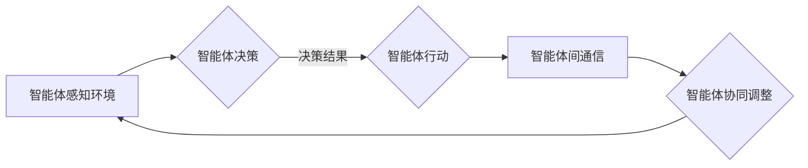
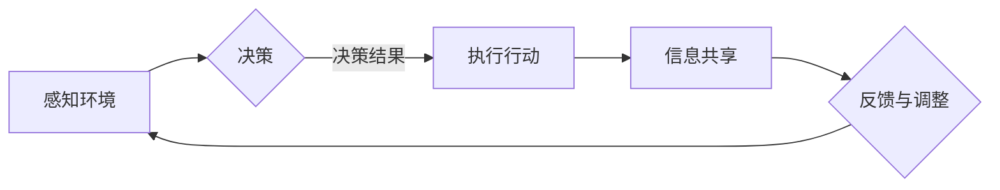
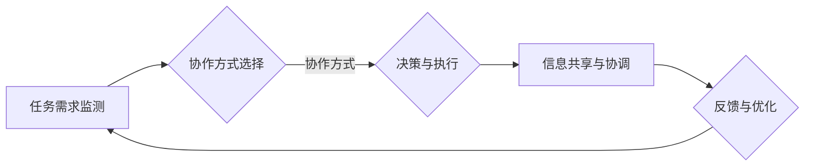

                 

# 多Agent协作：构建复杂的智能系统

## 关键词

多Agent系统，智能体，协作机制，算法，智能系统构建，分布式系统，复杂性理论，人工智能

## 摘要

随着信息技术的飞速发展，智能系统在各个领域的应用日益广泛。多Agent系统作为一种具有自主性、反应性、社交性和适应性的智能实体集合，为解决复杂问题提供了新的思路和方法。本文将从问题背景、核心概念、协作算法原理、系统分析与架构设计等方面，深入探讨多Agent协作在构建复杂智能系统中的应用，旨在为开发者提供系统性的理论指导和实战经验。

## 目录大纲设计

### 第一部分：背景介绍（1章）

**第1章 问题背景与概念介绍**

### 第二部分：多Agent系统的核心概念与联系（2章）

**第2章 多Agent系统的核心概念原理**

**第3章 多Agent系统的协作机制与联系

### 第三部分：多Agent系统的算法原理讲解（3章）

**第4章 多Agent系统的协作算法原理**

**第5章 多Agent系统的分布式算法原理**

**第6章 多Agent系统的混合式算法原理

### 第四部分：多Agent系统在实际应用中的案例分析（2章）

**第7章 多Agent系统在智能家居中的应用**

**第8章 多Agent系统在自动驾驶中的应用

### 第五部分：总结与展望（1章）

**第9章 多Agent协作：未来的趋势与挑战

## 第一部分：背景介绍（1章）

### 第1章 问题背景与概念介绍

#### 1.1 问题背景

在当今信息化社会中，复杂性问题层出不穷，如交通拥堵、环境监测、金融服务等。这些问题的解决往往需要大量的计算资源和智能处理能力。传统的集中式计算系统在应对这些复杂问题时显得力不从心。随着人工智能技术的不断发展，多Agent系统作为一种分布式计算和协作的框架，逐渐成为解决复杂问题的重要手段。

多Agent系统具有以下几个显著优势：

1. **分布式计算**：多Agent系统能够将复杂的任务分解为多个子任务，分布到不同的智能体上并行处理，从而提高了系统的计算效率。
2. **自主性**：每个智能体都具有一定的自主性，能够根据环境变化自主做出决策和调整行动策略。
3. **适应性**：多Agent系统能够根据环境变化动态调整系统结构和行为，适应复杂多变的应用场景。
4. **协作性**：智能体之间可以通过协作机制实现信息共享和协同工作，共同完成任务。

#### 1.2 问题解决

多Agent协作的核心在于如何通过智能体的协作机制解决复杂问题。具体而言，多Agent协作可以划分为以下几个步骤：

1. **任务分解**：将复杂任务分解为多个子任务，分配给不同的智能体处理。
2. **信息共享**：智能体之间通过通信机制共享必要的信息，以便于协同工作。
3. **决策协调**：智能体基于共享信息，通过决策算法和协调机制，共同制定行动策略。
4. **行动执行**：智能体根据决策结果执行相应的行动，完成任务。
5. **反馈调整**：智能体根据执行结果和环境变化，不断调整自己的行为和策略，以提高系统整体的效能。

#### 1.3 边界与外延

本文将主要探讨多Agent系统在复杂智能系统构建中的应用，涉及以下核心概念和主题：

- **多Agent系统**：由多个智能体组成的分布式计算系统，智能体具有自主性、反应性、社交性和适应性。
- **智能体（Agent）**：具有感知、决策和行动能力的智能实体。
- **协作机制**：智能体之间通过通信和协调实现共同目标的过程。
- **协作算法**：智能体之间协作的具体算法和策略，包括分布式算法、集中式算法和混合式算法等。

通过上述背景介绍，我们为接下来的深入探讨奠定了基础。在接下来的章节中，我们将详细阐述多Agent系统的核心概念、协作机制以及算法原理，以期为构建复杂的智能系统提供有效的理论支持和实战指导。

## 第二部分：多Agent系统的核心概念与联系（2章）

### 第2章 多Agent系统的核心概念原理

#### 2.1 Agent的定义与特点

多Agent系统中的核心实体是智能体（Agent）。智能体是一种具有感知、决策和行动能力的实体，能够在特定环境中自主执行任务。以下是智能体的几个关键定义和特点：

1. **定义**：智能体（Agent）是一种能够感知环境、做出决策并执行相应动作的智能实体。它可以是物理实体（如机器人），也可以是虚拟实体（如软件代理）。

2. **特点**：

   - **自主性**：智能体能够自主决定其行为，不受外部直接控制。
   - **反应性**：智能体能够根据环境变化迅速做出反应。
   - **社交性**：智能体能够与其他智能体进行通信和协作。
   - **适应性**：智能体能够根据环境变化和任务需求调整自身行为和策略。

#### 2.2 Agent的分类

智能体可以根据其行为特点、任务性质和实现方法进行分类。以下是一些常见的分类方式：

1. **静态Agent与动态Agent**：

   - **静态Agent**：环境固定，动作有限。例如，自动售货机。
   - **动态Agent**：环境动态变化，能够适应新环境。例如，自动驾驶车辆。

2. **独立Agent与合作Agent**：

   - **独立Agent**：自主完成任务，不需要与其他智能体交互。例如，自主清洁机器人。
   - **合作Agent**：与其他智能体协同完成任务。例如，多人合作游戏中的玩家。

3. **基于规则的Agent与基于模型的Agent**：

   - **基于规则的Agent**：根据预设规则执行任务。例如，基于规则的专家系统。
   - **基于模型的Agent**：基于模型和数据进行决策。例如，基于深度学习的自主驾驶系统。

#### 2.3 概念属性特征对比表格

| 类别                                                 | 特点                                                 | 应用场景                                         |
|----------------------------------------------|---------------------------------------------|----------------------------------------------|
| 静态Agent与动态Agent                                     | 静态Agent：环境固定，动作有限 | 动态Agent：环境动态变化，能够适应新环境 |
| 独立Agent与合作Agent                                     | 独立Agent：自主完成任务 | 合作Agent：与其他Agent协同完成任务 |
| 基于规则的Agent与基于模型的Agent                          | 基于规则的Agent：根据预设规则执行任务 | 基于模型的Agent：基于模型和数据进行决策 |

#### 2.4 多Agent系统的ER实体关系图架构

多Agent系统由多个智能体、环境、通信机制和协作策略等核心要素组成。以下是一个简单的ER实体关系图，用于描述这些实体之间的关系：

```mermaid
erDiagram
  Agent ||--|{协作机制}: CollaborationMechanism
  Agent ||--|{感知器}: Sensor
  Agent ||--|{决策器}: DecisionMaker
  Agent ||--|{行动器}: Actuator
  CollaborationMechanism ||--|{通信协议}: CommunicationProtocol
  CollaborationMechanism ||--|{协作策略}: CollaborationStrategy
```

在这个ER图中，智能体（Agent）是系统的核心实体，它通过感知器（Sensor）感知环境，通过决策器（DecisionMaker）做出决策，通过行动器（Actuator）执行行动。协作机制（CollaborationMechanism）负责协调不同智能体之间的协作，包括通信协议（CommunicationProtocol）和协作策略（CollaborationStrategy）。

通过上述对多Agent系统核心概念原理的介绍，我们为理解多Agent系统的协作机制和算法原理打下了基础。在接下来的章节中，我们将进一步探讨多Agent系统的协作机制和具体协作算法，以期为构建复杂的智能系统提供更加深入的指导。

### 第3章 多Agent系统的协作机制与联系

#### 2.1 协作机制的基本概念

协作机制是多Agent系统实现协同工作的核心，它定义了智能体之间如何通过通信和协调来共同完成任务。协作机制的基本概念包括以下几个方面：

1. **定义**：协作机制是指智能体之间通过通信和协调实现共同目标的过程。它包括通信协议、协作策略和协调算法等组成部分。

2. **目标**：协作机制的主要目标是通过智能体的协作，提高系统整体的效率和性能，实现复杂任务的分解和协同解决。

3. **核心要素**：

   - **通信协议**：定义智能体之间进行信息交换的格式、方式和规则。
   - **协作策略**：定义智能体在协作过程中应采取的行动和决策策略。
   - **协调算法**：用于智能体之间的协调和同步，确保协作过程的高效和有序。

#### 2.2 主要协作算法

多Agent系统中的协作算法可以分为以下几类：

1. **集中式协作算法**：

   - **定义**：集中式协作算法是指智能体之间的协作决策由一个中央控制实体进行协调。
   - **特点**：集中式算法在复杂性和协调性方面具有优势，但中央控制实体成为系统的瓶颈。
   - **应用场景**：适用于任务结构较为简单、智能体数量较少的场景。

2. **分布式协作算法**：

   - **定义**：分布式协作算法是指智能体之间通过局部信息交换和局部决策实现协作。
   - **特点**：分布式算法具有较好的灵活性和扩展性，能够适应复杂和动态的环境。
   - **应用场景**：适用于任务结构复杂、智能体数量较多、环境变化迅速的场景。

3. **混合式协作算法**：

   - **定义**：混合式协作算法是集中式和分布式协作算法的结合，根据任务需求和环境变化动态选择协作方式。
   - **特点**：混合式算法在效率和灵活性方面具有优势，能够根据不同情况优化协作过程。
   - **应用场景**：适用于任务需求和环境变化较为复杂、需要高效灵活协作的场景。

#### 2.3 协作算法的mermaid流程图

以下是一个简单的分布式协作算法的mermaid流程图，用于描述智能体之间协作的流程：



在这个流程图中，每个智能体首先感知环境，然后根据感知信息做出决策，并执行相应的行动。智能体之间通过通信共享决策结果，进行协同调整，从而实现整体目标的优化。

通过上述对多Agent系统协作机制和协作算法的介绍，我们可以看到，协作机制是多Agent系统能够实现高效协同工作的关键。在接下来的章节中，我们将进一步探讨这些协作算法的具体实现和性能优化，以期为构建复杂的智能系统提供更加实用的指导。

## 第三部分：多Agent系统的算法原理讲解（3章）

### 第4章 多Agent系统的协作算法原理

#### 4.1 协作算法的基本概念

协作算法是多Agent系统实现智能体之间协作的具体实现方式。协作算法的核心目标是提高系统整体的效率和性能，通过智能体之间的协同工作实现复杂任务的解决。以下是对协作算法的基本概念和目标的介绍：

1. **定义**：协作算法是多Agent系统中智能体之间通过信息交换和协调合作实现共同目标的算法。它包括决策算法、通信算法和协调算法等组成部分。

2. **目标**：

   - **提高系统效率**：通过智能体的协同工作，优化任务分配和执行过程，提高系统的整体计算效率。
   - **优化任务分配**：根据智能体的能力和环境条件，合理分配任务，确保系统资源得到最大化利用。
   - **提高系统性能**：通过协作算法，实现系统在面对动态环境变化时的自适应能力，提高系统整体的稳定性和鲁棒性。

#### 4.2 主要协作算法

多Agent系统中的协作算法可以分为以下几类：

1. **集中式协作算法**：

   - **定义**：集中式协作算法是指智能体之间的协作决策由一个中央控制实体进行协调。
   - **特点**：

     - **结构简单**：中央控制实体负责整个系统的决策和协调，结构较为简单。
     - **计算开销大**：中央控制实体成为系统的瓶颈，可能导致计算开销较大。
     - **适应性差**：在智能体数量较多、环境变化迅速的场景中，适应性较差。

   - **应用场景**：适用于任务结构较为简单、智能体数量较少的场景。

2. **分布式协作算法**：

   - **定义**：分布式协作算法是指智能体之间通过局部信息交换和局部决策实现协作。
   - **特点**：

     - **结构复杂**：智能体之间通过局部信息交换和局部决策进行协作，结构较为复杂。
     - **计算开销小**：分布式算法能够将计算任务分布在多个智能体上，降低计算开销。
     - **适应性较强**：能够适应复杂和动态的环境变化，具有较好的适应性。

   - **应用场景**：适用于任务结构复杂、智能体数量较多、环境变化迅速的场景。

3. **混合式协作算法**：

   - **定义**：混合式协作算法是集中式和分布式协作算法的结合，根据任务需求和环境变化动态选择协作方式。
   - **特点**：

     - **灵活性强**：能够根据不同情况动态选择集中式或分布式协作方式，具有较强的灵活性。
     - **计算开销适中**：通过混合式协作算法，能够在效率和灵活性之间找到平衡点。
     - **适应性较强**：适用于任务需求和环境变化较为复杂、需要高效灵活协作的场景。

   - **应用场景**：适用于任务需求和环境变化较为复杂、需要高效灵活协作的场景。

#### 4.3 协作算法的mermaid流程图

以下是一个简单的分布式协作算法的mermaid流程图，用于描述智能体之间协作的流程：


在这个流程图中，每个智能体首先感知环境，然后根据感知信息做出决策，并执行相应的行动。智能体之间通过通信共享决策结果，进行协同调整，从而实现整体目标的优化。

通过上述对多Agent系统协作算法的基本概念、主要协作算法和流程图的介绍，我们可以更好地理解多Agent系统协作算法的实现原理。在接下来的章节中，我们将进一步探讨这些协作算法的具体实现和性能优化，以期为构建复杂的智能系统提供更加实用的指导。

### 第5章 多Agent系统的分布式算法原理

#### 5.1 分布式算法的基本概念

分布式算法是多Agent系统中一种重要的协作算法，它强调智能体之间的局部信息交换和局部决策。分布式算法的核心思想是利用每个智能体的局部知识和能力，通过协同工作实现全局目标。以下是对分布式算法的基本概念和实现原理的介绍：

1. **定义**：分布式算法是指智能体之间通过局部信息交换和局部决策实现协作的算法。它不依赖于中央控制实体，而是依靠每个智能体自主做出决策和执行行动。

2. **基本原理**：

   - **局部信息交换**：智能体之间通过通信机制共享局部信息，以便进行局部决策。
   - **局部决策**：智能体根据自身感知的信息和预设的决策规则，做出局部决策。
   - **协同工作**：智能体根据局部决策，共同协作完成任务，实现全局目标。

3. **关键要素**：

   - **信息共享**：信息共享是分布式算法的基础，智能体之间需要通过通信机制高效地共享信息。
   - **决策规则**：决策规则是智能体做出局部决策的依据，通常基于某种智能方法（如规则推理、机器学习等）。
   - **协调机制**：协调机制用于确保智能体之间的协同工作，避免冲突和资源竞争。

#### 5.2 分布式算法的实现原理

分布式算法的实现通常包括以下几个步骤：

1. **感知与信息收集**：每个智能体感知自身周围的环境，收集必要的信息，如位置、状态、任务需求等。

2. **局部决策**：智能体根据收集到的信息和预设的决策规则，做出局部决策。决策过程通常包括以下步骤：

   - **目标确定**：根据全局目标和自身能力，确定局部目标。
   - **路径规划**：计算从当前状态到目标状态的路径，选择最优路径。
   - **行为选择**：根据路径规划结果，选择下一步的行为。

3. **信息共享与通信**：智能体之间通过通信机制共享决策信息，确保协同工作的顺利进行。

4. **执行与调整**：智能体根据决策结果执行行动，并在执行过程中不断调整自己的行为，以适应环境变化和任务需求。

5. **反馈与优化**：系统通过反馈机制收集智能体执行结果和环境变化信息，不断优化决策规则和协作策略。

#### 5.3 分布式算法的mermaid流程图

以下是一个简单的分布式算法的mermaid流程图，用于描述智能体之间协作的流程：



在这个流程图中，每个智能体首先感知环境，然后根据感知信息做出决策，并执行相应的行动。智能体之间通过通信共享决策信息，并在执行过程中进行反馈和调整，从而实现整体目标的优化。

通过上述对分布式算法的基本概念、实现原理和流程图的介绍，我们可以更好地理解分布式算法在多Agent系统中的应用。分布式算法具有灵活性强、适应性好的特点，适用于复杂和动态的环境。在接下来的章节中，我们将进一步探讨分布式算法的具体实现和性能优化，以期为构建复杂的智能系统提供更加实用的指导。

### 第6章 多Agent系统的混合式算法原理

#### 6.1 混合式算法的基本概念

混合式算法是多Agent系统中一种结合集中式和分布式算法优点的协作算法。它通过在不同情况下动态选择集中式或分布式协作方式，实现高效和灵活的协同工作。以下是对混合式算法的基本概念和实现原理的介绍：

1. **定义**：混合式算法是指根据任务需求和环境变化，动态选择集中式或分布式协作方式的算法。它通过结合集中式和分布式算法的优点，实现高效和灵活的协同工作。

2. **基本原理**：

   - **动态选择**：混合式算法通过实时监测任务需求和环境变化，动态选择集中式或分布式协作方式。
   - **集中式协作**：在任务结构简单、智能体数量较少的情况下，选择集中式协作方式，提高决策效率。
   - **分布式协作**：在任务结构复杂、智能体数量较多、环境变化迅速的情况下，选择分布式协作方式，提高系统适应性和灵活性。

3. **关键要素**：

   - **任务需求监测**：实时监测任务需求和环境变化，为协作方式的选择提供依据。
   - **协作方式选择**：根据监测结果，动态选择集中式或分布式协作方式。
   - **协调机制**：确保智能体之间在协作过程中的协调和同步。

#### 6.2 混合式算法的实现原理

混合式算法的实现通常包括以下几个步骤：

1. **任务需求监测**：系统通过传感器和其他监测设备，实时收集任务需求和环境变化信息。

2. **协作方式选择**：根据任务需求和环境变化，动态选择集中式或分布式协作方式。具体方法如下：

   - **集中式协作**：在任务结构简单、智能体数量较少的情况下，选择集中式协作方式，提高决策效率。
   - **分布式协作**：在任务结构复杂、智能体数量较多、环境变化迅速的情况下，选择分布式协作方式，提高系统适应性和灵活性。

3. **决策与执行**：

   - **集中式决策**：在集中式协作方式下，智能体将决策任务提交给中央控制实体，由中央控制实体进行决策和协调。
   - **分布式决策**：在分布式协作方式下，智能体根据局部信息和预设决策规则，独立进行决策和行动。

4. **信息共享与协调**：

   - **信息共享**：智能体之间通过通信机制共享决策信息，确保协作过程中的信息一致性和可靠性。
   - **协调机制**：在协作过程中，智能体通过协调算法进行协调和同步，避免冲突和资源竞争。

5. **反馈与优化**：系统通过反馈机制收集智能体执行结果和环境变化信息，不断优化决策规则和协作策略。

#### 6.3 混合式算法的mermaid流程图

以下是一个简单的混合式算法的mermaid流程图，用于描述智能体之间协作的流程：



在这个流程图中，系统首先监测任务需求和环境变化，然后根据监测结果动态选择协作方式。智能体根据协作方式执行决策和行动，进行信息共享和协调，并在执行过程中不断反馈和优化。

通过上述对混合式算法的基本概念、实现原理和流程图的介绍，我们可以更好地理解混合式算法在多Agent系统中的应用。混合式算法结合了集中式和分布式算法的优点，能够根据不同情况实现高效和灵活的协同工作。在接下来的章节中，我们将进一步探讨混合式算法的具体实现和性能优化，以期为构建复杂的智能系统提供更加实用的指导。

### 第四部分：多Agent系统在实际应用中的案例分析（2章）

### 第7章 多Agent系统在智能家居中的应用

#### 7.1 问题场景介绍

随着物联网技术的快速发展，智能家居系统逐渐成为家庭自动化的重要趋势。智能家居系统涉及多种设备，如智能灯泡、智能插座、智能空调等，这些设备通过互联网相互连接，形成一个智能化的家庭环境。然而，如何有效地管理和协调这些设备，实现智能家居系统的智能化和自动化，成为一个关键挑战。

#### 7.2 项目介绍

为了解决智能家居系统中的管理协调问题，我们开发了一个基于多Agent系统的智能家居控制系统。该系统通过多个智能体（如智能灯泡、智能插座、智能空调等）的协作，实现家庭设备的管理和自动化控制，提升居住环境的舒适性和便利性。

#### 7.3 系统功能设计

智能家居控制系统的主要功能包括：

1. **设备管理**：智能体能够识别和管理家庭中的各种设备，确保设备正常运行。
2. **环境监测**：智能体通过传感器实时监测家庭环境（如温度、湿度、光照等），为设备控制提供数据支持。
3. **自动控制**：根据环境监测数据和用户设定，智能体能够自动调整设备状态，实现家庭环境的智能化。
4. **用户交互**：通过手机应用或语音助手，用户可以远程控制和监控家庭设备，实现智能家居的便捷操作。

#### 7.4 系统架构设计

智能家居控制系统的架构设计如下：

1. **智能体层**：包括智能灯泡、智能插座、智能空调等智能设备，它们是系统的基本单元，具备感知、决策和执行功能。
2. **通信层**：智能体通过无线通信（如Wi-Fi、蓝牙等）与中心服务器进行数据交换，实现设备间的信息共享和协调。
3. **中心服务器**：负责接收智能体的数据，进行数据处理和决策，并向智能体发送控制指令。
4. **用户界面**：通过手机应用或语音助手，用户可以与系统进行交互，远程控制家庭设备。

#### 7.5 系统接口设计和系统交互

智能家居控制系统的接口设计和系统交互设计如下：

1. **接口设计**：智能体层与通信层之间采用标准化的通信协议（如HTTP、MQTT等），确保数据传输的可靠性和安全性。
2. **系统交互**：智能体通过通信层与中心服务器进行交互，实现数据上传、指令接收和状态反馈。用户通过用户界面与系统进行交互，发送控制指令和查询设备状态。

#### 7.6 实际案例分析和详细讲解剖析

以下是一个实际案例：

假设用户在家中通过手机应用关闭客厅的灯光，系统的工作流程如下：

1. **用户发送指令**：用户通过手机应用发送关闭客厅灯光的指令。
2. **用户界面处理**：用户界面接收到指令后，将指令发送给中心服务器。
3. **中心服务器处理**：中心服务器接收到指令后，通过通信层将指令发送给客厅智能灯泡。
4. **智能灯泡执行**：客厅智能灯泡接收到指令后，关闭灯光，并返回状态反馈给中心服务器。
5. **中心服务器处理**：中心服务器接收到状态反馈后，将结果返回给用户界面。
6. **用户界面显示**：用户界面接收到结果后，向用户显示灯光已关闭。

通过上述实际案例分析和详细讲解，我们可以看到多Agent系统在智能家居中的应用，实现了家庭设备的智能化管理和自动化控制。多Agent系统通过智能体的协作，提高了系统的效率和灵活性，为用户带来了更加便捷和舒适的居住体验。

### 第8章 多Agent系统在自动驾驶中的应用

#### 8.1 问题场景介绍

自动驾驶技术是人工智能领域的一个重要研究方向，它旨在实现车辆的自主驾驶，提高道路交通的安全性和效率。然而，自动驾驶系统在复杂的交通环境中面临诸多挑战，如环境感知、路径规划、决策控制等。如何利用多Agent系统实现自动驾驶车辆的协同工作，成为一个关键问题。

#### 8.2 项目介绍

为了解决自动驾驶系统中的协同工作问题，我们开发了一个基于多Agent系统的自动驾驶控制系统。该系统通过多个智能体（如车载传感器、导航系统、控制系统等）的协作，实现自动驾驶车辆在复杂环境中的自主导航和驾驶控制，提高系统的稳定性和安全性。

#### 8.3 系统功能设计

自动驾驶控制系统的功能设计主要包括以下几个方面：

1. **环境感知**：智能体通过传感器（如摄像头、激光雷达等）实时感知周围环境，获取道路、车辆、行人等数据。
2. **路径规划**：智能体根据环境感知数据，生成安全、高效的行驶路径。
3. **决策控制**：智能体根据路径规划结果，做出驾驶决策，控制车辆的加速、转向等动作。
4. **协同工作**：智能体之间通过协作机制，实现信息共享和协同工作，提高系统的整体效率和安全性。

#### 8.4 系统架构设计

自动驾驶控制系统的架构设计如下：

1. **智能体层**：包括车载传感器、导航系统、控制系统等智能设备，它们是系统的基本单元，具备感知、决策和执行功能。
2. **通信层**：智能体通过无线通信（如V2V通信、V2I通信等）与其他智能体和交通基础设施进行数据交换，实现信息共享和协同工作。
3. **中心服务器**：负责接收智能体的数据，进行数据处理和决策，并向智能体发送控制指令。
4. **用户界面**：通过手机应用或车载显示屏，用户可以与系统进行交互，监控车辆状态和驾驶过程。

#### 8.5 系统接口设计和系统交互

自动驾驶控制系统的接口设计和系统交互设计如下：

1. **接口设计**：智能体层与通信层之间采用标准化的通信协议（如ROS、CAN等），确保数据传输的可靠性和安全性。
2. **系统交互**：智能体通过通信层与中心服务器进行交互，实现数据上传、指令接收和状态反馈。用户通过用户界面与系统进行交互，监控车辆状态和驾驶过程。

#### 8.6 实际案例分析和详细讲解剖析

以下是一个实际案例：

假设自动驾驶车辆在行驶过程中需要通过一个十字路口，系统的工作流程如下：

1. **环境感知**：车载传感器感知到十字路口的信号灯状态和周围车辆、行人的情况。
2. **路径规划**：导航系统根据信号灯状态和交通情况，生成通过十字路口的安全行驶路径。
3. **决策控制**：控制系统根据路径规划结果，决定车辆的加速、减速和转向动作。
4. **协同工作**：车辆通过V2V通信与其他车辆和交通基础设施进行信息交换，确保行驶过程的安全和顺畅。
5. **用户交互**：用户通过车载显示屏查看车辆状态和驾驶过程，实时了解行驶情况。

通过上述实际案例分析和详细讲解，我们可以看到多Agent系统在自动驾驶中的应用，实现了车辆在复杂环境中的自主导航和驾驶控制。多Agent系统通过智能体的协作，提高了系统的稳定性和安全性，为自动驾驶技术的发展提供了有力的支持。

### 第五部分：总结与展望（1章）

#### 第9章 多Agent协作：未来的趋势与挑战

多Agent协作作为一种分布式智能系统的构建方法，已经在智能家居、自动驾驶、医疗保健等多个领域展示了其强大的应用潜力。在未来，多Agent协作将继续朝着以下几个趋势和方向发展：

1. **人工智能与多Agent系统的深度融合**：随着人工智能技术的不断发展，特别是深度学习、强化学习等算法的广泛应用，多Agent系统将具备更强的自主学习能力和决策能力，实现更加智能和高效的协作。

2. **跨领域应用与融合**：多Agent系统将在不同领域之间实现更多的融合与应用，如智能制造、智慧城市等，通过跨领域的协作，实现资源的优化配置和协同创新。

3. **边缘计算与多Agent系统的结合**：边缘计算技术的发展为多Agent系统提供了更多的计算资源和支持，使得智能体能够在更接近数据源的位置进行实时处理和决策，提高系统的响应速度和效率。

4. **量子计算与多Agent系统的结合**：量子计算具有强大的计算能力，未来将有可能与多Agent系统相结合，进一步提升系统的计算效率和智能化水平。

然而，多Agent协作在未来的发展过程中也将面临一系列挑战：

1. **系统复杂性**：随着智能体数量和协作关系的增加，系统的复杂度将呈指数级增长，如何有效管理复杂系统成为一大挑战。

2. **通信与协调**：在分布式环境中，智能体之间的通信和协调是系统高效运行的关键，如何设计高效、可靠的通信协议和协调算法，确保系统的稳定性和一致性，仍需深入研究。

3. **隐私与安全**：多Agent系统涉及大量敏感数据的交换和处理，如何保护用户隐私和数据安全，防止恶意攻击和隐私泄露，是一个亟待解决的问题。

4. **适应性**：多Agent系统需要具备良好的适应性，能够在动态变化的复杂环境中快速调整自身行为和策略，这对系统的设计和实现提出了更高的要求。

综上所述，多Agent协作在未来的发展中具有巨大的潜力和广阔的前景，但也面临着诸多挑战。通过持续的技术创新和深入研究，有望在不久的将来实现更加智能、高效和安全的分布式智能系统。

