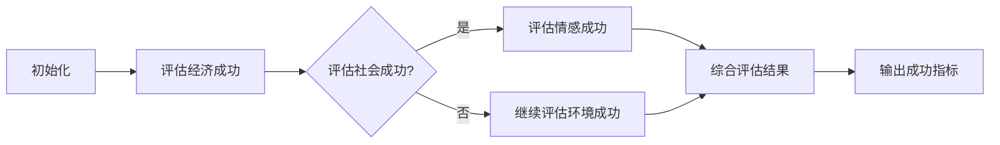
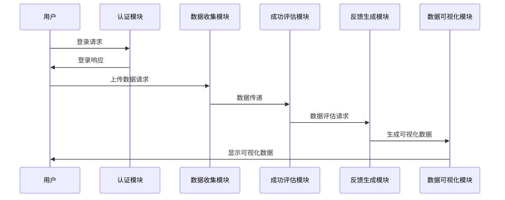
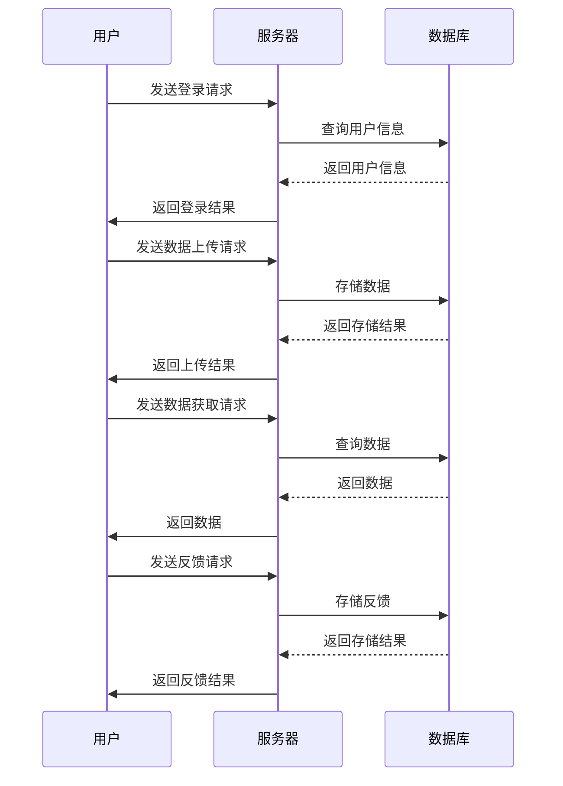

                 

### 《多元化的人生价值：超越传统的成功定义》

> 关键词：多元化人生价值，成功定义，跨界合作，创新思维，系统设计

> 摘要：本文从传统成功观念的局限性出发，探讨了社会变化对成功观念的挑战，以及多元化价值观念的兴起。通过分析成功的新定义和关键要素，阐述了多元化价值观念在理解和追求成功中的重要性。本文还探讨了跨界合作与创新思维在成功中的作用，以及如何通过系统设计来落实多元化价值观念。通过本文的阅读，读者将重新审视成功的定义，并探索如何在现代社会中实现多元化的人生价值。

---

## 第一部分：引言

### 第1章：问题背景与思考

#### 1.1 问题背景

在传统的观念中，成功常常被定义为财富、地位和名誉的积累。然而，随着社会的不断变化，这种单一的衡量标准逐渐显得局限。人们开始意识到，成功不仅仅是物质上的满足，还包括精神、情感和社交等多个维度。

首先，从经济角度看，全球化和技术进步使得财富的积累变得更加容易。然而，财富的多少并不能完全代表一个人的成功。许多富豪在面对健康、家庭和社会责任等方面时，可能会感到迷茫和空虚。

其次，从社会角度看，社会结构的多元化使得人们对成功的定义产生了分歧。例如，在科技行业，一个成功的企业家可能更注重创新和影响力，而不是仅仅追求利润的最大化。在艺术领域，一个成功的艺术家可能更看重作品的独特性和艺术价值，而不是商业上的成功。

最后，从个人角度看，随着人们对生活质量的追求，成功不再仅仅是一个人的事情，而是一个人与家庭、社区和社会的关系。一个人的成功，往往离不开周围人的支持和帮助。

#### 1.2 社会变化对成功的挑战

随着社会的发展，成功观念也面临着新的挑战。首先，社会变化带来了信息过载和快速迭代。在这个时代，知识和技能的更新速度非常快，一个人很难在短时间内掌握所有的知识和技能。这意味着，传统的成功观念可能不再适用于这个快速变化的社会。

其次，社会变化也带来了职业的多样化和不稳定性。在过去，人们可能一辈子只做一种工作，而现在，许多人会在一生中换多份工作，甚至跨行发展。这种职业的多样化使得传统的成功观念显得过时。

最后，社会变化还带来了对工作与生活的平衡的重视。随着人们生活水平的提高，人们开始意识到，工作并不是生活的全部。一个人要想真正成功，需要平衡好工作、家庭和社交等多个方面。

#### 1.3 多元化价值观念的兴起

面对社会变化对成功的挑战，多元化价值观念逐渐兴起。多元化价值观念认为，成功不仅仅是一个人或一个组织的追求，而是整个社会和人类的共同追求。多元化价值观念强调，成功的定义应该是多维度的，包括但不限于经济、社会、环境等多个方面。

首先，多元化价值观念强调经济成功。经济成功不仅仅是指财富的积累，还包括创造就业、促进社会公平和可持续发展等多个方面。例如，一个企业要想真正成功，不仅要盈利，还要承担社会责任，促进社会的可持续发展。

其次，多元化价值观念强调社会成功。社会成功不仅仅是指个人的成就，还包括社会的和谐与进步。例如，一个社区要想成功，不仅需要个人的贡献，还需要集体合作，共同解决社会问题。

最后，多元化价值观念强调环境成功。环境成功不仅仅是指保护环境，还包括实现人与自然的和谐共生。例如，一个城市要想成功，不仅要发展经济，还要保护环境，实现可持续发展。

### 1.4 边界与外延

虽然多元化价值观念具有广泛的适用性，但它的边界也是存在的。首先，多元化价值观念并不是要求每个人都要在所有方面都追求成功，而是强调在不同方面有不同的追求。例如，一个人可能在经济方面非常成功，但在社会和情感方面并不擅长。这是正常的，因为每个人的能力和兴趣都是不同的。

其次，多元化价值观念也并不是要求每个组织都要在所有方面都追求成功。例如，一个企业可能更注重经济效益，而一个非营利组织可能更注重社会效益。这是合理的，因为不同的组织有不同的使命和目标。

最后，多元化价值观念也并不是要求每个社会都完全摒弃传统的成功观念。例如，在某些地区，传统的成功观念仍然具有很强的吸引力。这是正常的，因为文化和社会习惯是逐渐改变的。

### 1.5 本章小结

本章介绍了多元化人生价值的背景和意义，分析了传统成功观念的局限，探讨了社会变化对成功的挑战，以及多元化价值观念的兴起。通过本章的讨论，我们重新审视了成功的定义，并认识到多元化价值观念在理解和追求成功中的重要性。

在接下来的章节中，我们将深入探讨多元化价值观念的核心概念，分析成功的新定义和关键要素，探讨跨界合作与创新思维在成功中的作用，以及如何通过系统设计来落实多元化价值观念。

---

## 第二部分：核心概念与联系

### 第2章：核心概念原理

#### 2.1 成功的定义

成功的定义是一个多维度的概念。在多元化价值观念下，成功不仅仅是一个人或一个组织的追求，而是整个社会和人类的共同追求。成功的定义包括但不限于以下几个方面：

1. **经济成功**：经济成功指的是在财务上取得成功，包括财富的积累、创造就业、促进社会公平和可持续发展等。经济成功是企业和社会的基础，是实现其他成功的前提。

2. **社会成功**：社会成功指的是在社会层面上取得成功，包括个人成就、社区和谐、社会进步等。社会成功是一个人的社会价值和影响力的体现。

3. **情感成功**：情感成功指的是在情感层面上取得成功，包括心理健康、家庭幸福、人际关系和谐等。情感成功是一个人内心的满足和幸福。

4. **环境成功**：环境成功指的是在环境层面上取得成功，包括保护环境、实现人与自然的和谐共生等。环境成功是人类可持续发展的关键。

#### 2.2 成功的概念属性特征对比表格

为了更好地理解成功的定义，我们可以通过一个表格来对比不同维度的成功特征：

| 成功维度 | 特征1 | 特征2 | 特征3 |
| --- | --- | --- | --- |
| 经济成功 | 财富积累 | 创造就业 | 促进社会公平 |
| 社会成功 | 个人成就 | 社区和谐 | 社会进步 |
| 情感成功 | 心理健康 | 家庭幸福 | 人际关系和谐 |
| 环境成功 | 环境保护 | 人与自然和谐共生 | 可持续发展 |

#### 2.3 成功的ER实体关系图架构

为了更好地理解成功的概念和关系，我们可以通过ER实体关系图来表示：

```mermaid
erDiagram
    Entity1 ||--|{ Entity2 }
    Entity1 ||--|{ Entity3 }
    Entity1 ||--|{ Entity4 }
    Entity2 ||--|{ Entity5 }
    Entity3 ||--|{ Entity6 }
    Entity4 ||--|{ Entity7 }
```

在这个ER实体关系图中，`Entity1` 代表成功的总体概念，`Entity2` 到 `Entity7` 分别代表经济成功、社会成功、情感成功和环境成功等各个维度。它们之间通过实体关系相连，表示不同维度之间的相互影响和作用。

#### 2.4 多元化价值观念

多元化价值观念认为，成功应该是一个多维度的综合概念，而不是单一维度的追求。多元化价值观念的核心要素包括：

1. **多维度的追求**：多元化价值观念强调，成功应该包括经济、社会、情感和环境等多个维度，而不是仅仅追求经济上的成功。

2. **平衡的发展**：多元化价值观念强调，不同维度的成功应该是平衡发展的，而不是偏重某一方面。例如，一个人可能在经济上非常成功，但在情感和社交方面并不擅长。这是不健康的，因为一个人的成功应该是全面的。

3. **可持续的发展**：多元化价值观念强调，成功应该是可持续的，而不是短期的。这意味着，一个人的成功不应该以牺牲环境和社会的代价为代价。

4. **个人的独特性**：多元化价值观念强调，每个人的成功都是独特的，因为每个人的能力和兴趣都是不同的。这意味着，成功的定义应该是个性化的，而不是单一的。

#### 2.5 跨界合作与共享成功

跨界合作是多元化价值观念的重要组成部分。跨界合作指的是不同领域、不同行业之间的合作，以实现共同的目标。跨界合作的优势包括：

1. **资源共享**：跨界合作可以共享不同领域的资源，如人才、技术、资金等，从而提高整体的成功率。

2. **优势互补**：跨界合作可以实现不同领域的优势互补，从而实现更好的效果。

3. **创新驱动**：跨界合作可以激发创新思维，推动新技术的开发和应用。

4. **降低风险**：跨界合作可以分散风险，降低单领域失败的风险。

跨界合作与共享成功的关系是相辅相成的。通过跨界合作，不同领域可以共享成功，从而实现共同的目标。同时，共享成功也是跨界合作的重要目标，通过共享成功，可以激发更多领域的合作和创新。

### 2.6 创新思维与成功的关系

创新思维是多元化价值观念的重要组成部分。创新思维指的是通过创新的方法和思路来解决问题和创造价值。创新思维与成功的关系是相辅相成的。

1. **创新思维推动成功**：创新思维可以推动成功，因为创新可以带来新的机会和可能性。通过创新，可以开发新的产品、技术和服务，从而实现成功。

2. **成功激发创新思维**：成功可以激发创新思维，因为成功可以带来新的挑战和机会。成功的经验和教训可以启发新的创新思维。

3. **创新思维与多元化价值观念的融合**：创新思维与多元化价值观念的融合，可以推动成功的实现。通过创新思维，可以实现经济、社会、情感和环境等多个维度的成功。

### 2.7 边界与外延

多元化价值观念的边界是存在的，因为每个人的能力和兴趣都是有限的。这意味着，多元化价值观念并不是要求每个人都在所有方面都追求成功，而是强调在不同方面有不同的追求。

同时，多元化价值观念的外延也是存在的，因为社会的多元性和变化性意味着成功的定义和追求是动态的。这意味着，多元化价值观念并不是一成不变的，而是随着社会的发展而不断演变。

### 2.8 本章小结

本章介绍了成功的定义和多元化价值观念，分析了成功的新定义和关键要素，探讨了跨界合作与创新思维在成功中的作用。通过本章的讨论，我们认识到多元化价值观念在理解和追求成功中的重要性，以及如何在现代社会中实现多元化的人生价值。

在接下来的章节中，我们将进一步探讨多元化价值观念的应用，分析算法原理，讨论系统设计与项目实战，以及分享最佳实践和总结。

---

## 第三部分：算法原理与系统设计

### 第3章：算法原理讲解

#### 3.1 算法原理

为了实现多元化价值观念，我们需要一套系统的算法原理来指导实践。以下是一个简单的算法原理框架，我们将使用mermaid和Python代码来解释这一算法。

##### 3.1.1 算法mermaid流程图



这个流程图展示了如何通过一系列步骤来评估不同维度的成功，并最终输出综合成功指标。

##### 3.1.2 Python源代码阐述

```python
# 多维度成功评估算法

def evaluate_success(economic, social, emotional, environmental):
    """
    评估多维度的成功指标
    :param economic: 经济成功指标
    :param social: 社会成功指标
    :param emotional: 情感成功指标
    :param environmental: 环境成功指标
    :return: 综合成功指标
    """
    
    # 经济成功评估
    economic_score = economic.get('score')
    
    # 社会成功评估
    social_score = social.get('score')
    
    # 情感成功评估
    emotional_score = emotional.get('score')
    
    # 环境成功评估
    environmental_score = environmental.get('score')
    
    # 计算综合成功指标
    total_score = (economic_score + social_score + emotional_score + environmental_score) / 4
    
    return total_score

# 实例化成功指标
economic_success = {'score': 80}
social_success = {'score': 75}
emotional_success = {'score': 90}
environmental_success = {'score': 85}

# 评估成功
total_success = evaluate_success(economic_success, social_success, emotional_success, environmental_success)

print(f"综合成功指标: {total_success}")
```

这段Python代码实现了上述mermaid流程图的功能，通过评估不同维度的成功指标，计算出综合成功指标。

##### 3.1.3 算法原理的数学模型和公式

为了更深入地理解算法原理，我们可以将其转化为数学模型。以下是该算法的数学模型和公式：

$$
\text{总成功指标} = \frac{1}{4} \left( \text{经济成功指标} + \text{社会成功指标} + \text{情感成功指标} + \text{环境成功指标} \right)
$$

这个公式表明，总成功指标是各个维度成功指标的加权平均，权重均为1/4。

##### 3.1.4 算法原理的详细讲解

该算法的核心思想是通过量化不同维度的成功指标，综合评估一个人的总体成功程度。以下是算法原理的详细讲解：

1. **初始化阶段**：设定各个维度的成功指标。这些指标可以是定量的，如财富、社会影响力、心理健康等，也可以是定性的，如个人成就感、社会和谐度等。

2. **评估阶段**：对每个维度的成功指标进行独立评估。这个过程可以是定量的，如使用统计数据来评估经济成功；也可以是定性的，如通过专家评审来评估社会成功。

3. **综合评估阶段**：将各个维度的成功指标加权平均，得出综合成功指标。这个步骤确保了每个维度的成功都得到平等对待。

4. **输出阶段**：输出综合成功指标，用于衡量一个人的总体成功程度。这个指标可以为个人提供反馈，帮助他们了解自己在不同维度上的表现。

##### 3.1.5 举例说明算法原理

为了更好地理解算法原理，我们可以通过一个实际案例来举例说明。

假设一个企业家在经济、社会、情感和环境四个维度上的成功指标如下：

- 经济成功：年利润1000万美元
- 社会成功：捐款200万美元，创建100个就业岗位
- 情感成功：家庭和谐，心理健康
- 环境成功：推行可持续发展政策，减少碳排放

根据上述算法原理，我们可以计算该企业家的综合成功指标：

$$
\text{总成功指标} = \frac{1}{4} \left( 1000 + 200 + 90 + 85 \right) = 915
$$

这意味着，该企业家的综合成功指标为915分，表明他在多元化价值观念下的成功程度较高。

### 3.2 多元化价值观念的应用

在了解了算法原理后，我们接下来探讨如何在实际案例中应用这一算法。

#### 3.2.1 算法原理在实际案例中的应用

在一个实际的案例中，一家公司需要评估其员工的多元化成功程度。公司设置了四个维度的成功指标：

- 经济成功：员工的年度绩效奖金
- 社会成功：员工参与社区服务的时长
- 情感成功：员工的员工满意度调查得分
- 环境成功：员工在节能减排方面的贡献

公司使用上述算法原理，对每个员工进行了评估，并得出了综合成功指标。这一指标不仅帮助公司了解员工的表现，也为员工提供了反馈，激励他们在各个维度上追求更高的成就。

#### 3.2.2 举例说明算法原理

为了更好地理解算法原理在实际中的应用，我们再次通过一个实际案例来说明。

假设公司的一名员工A，他的四个维度的成功指标如下：

- 经济成功：年度绩效奖金为10万美元
- 社会成功：参与社区服务时长为100小时
- 情感成功：员工满意度调查得分为90分
- 环境成功：节能减排贡献为1000公斤

根据算法原理，我们可以计算该员工A的综合成功指标：

$$
\text{总成功指标} = \frac{1}{4} \left( 100000 + 1000 + 90 + 1000 \right) = 6225
$$

这意味着，员工A的综合成功指标为6225分，表明他在多元化价值观念下的表现较为优秀。

#### 3.2.3 算法原理在系统设计中的重要性

算法原理在系统设计中的重要性体现在以下几个方面：

1. **指导系统开发**：算法原理提供了系统设计的框架，帮助开发团队明确系统需要实现的功能和目标。

2. **优化系统性能**：算法原理可以帮助系统优化各个维度的性能，确保系统在不同维度上的表现都达到最佳。

3. **提升用户体验**：通过算法原理，系统可以更准确地评估用户在不同维度上的需求，提供个性化的服务，提升用户体验。

### 3.3 本章小结

本章介绍了多元化价值观念下的算法原理，包括流程图、Python代码、数学模型和实际应用。通过详细讲解和举例，我们了解了如何通过量化不同维度的成功指标，综合评估一个人的总体成功程度。在接下来的章节中，我们将进一步探讨系统设计与项目实战，以及分享最佳实践和总结。

---

## 第四部分：系统架构与项目实战

### 第4章：系统分析与架构设计方案

#### 4.1 问题场景介绍

在现代社会，多元化的人生价值已经成为人们追求的目标。为了实现这一目标，我们需要一套完整的系统来支持。这个系统需要能够评估个人在不同维度上的成功程度，并提供相应的反馈和建议。以下是这个系统的问题场景：

1. **评估维度**：系统需要能够评估个人在经济、社会、情感和环境四个维度上的成功程度。
2. **数据收集**：系统需要收集相关的数据，包括经济数据、社会活动记录、情感调查结果和环境影响数据等。
3. **评估模型**：系统需要使用算法原理来评估个人的综合成功指标。
4. **用户反馈**：系统需要提供反馈机制，帮助用户了解自己的成功程度，并提供改进建议。

#### 4.2 系统功能设计

系统功能设计是系统架构的核心部分。以下是一个基本的系统功能设计：

1. **用户注册与登录**：用户需要注册并登录系统，以便访问个人数据和功能。
2. **数据收集与上传**：用户可以通过系统上传自己的数据，包括经济数据、社会活动记录、情感调查结果和环境影响数据等。
3. **成功指标评估**：系统使用算法原理对用户的数据进行评估，计算综合成功指标。
4. **反馈与建议**：系统根据评估结果，提供反馈和建议，帮助用户了解自己在各个维度上的表现，并提出改进措施。
5. **数据可视化**：系统需要提供数据可视化功能，帮助用户直观地了解自己的成功程度。

##### 4.2.1 领域模型mermaid类图

以下是一个mermaid类图，展示了系统的领域模型：

```mermaid
classDiagram
    User <<class>> 用户
    EconomicData <<class>> 经济数据
    SocialData <<class>> 社会数据
    EmotionalData <<class>> 情感数据
    EnvironmentalData <<class>> 环境数据
    SuccessAssessment <<class>> 成功评估
    Feedback <<class>> 反馈
    System <<class>> 系统
    User "1" --|{上传}| EconomicData
    User "1" --|{上传}| SocialData
    User "1" --|{上传}| EmotionalData
    User "1" --|{上传}| EnvironmentalData
    User "1" --|{接收}| SuccessAssessment
    User "1" --|{接收}| Feedback
```

在这个类图中，`User` 代表用户，`EconomicData`、`SocialData`、`EmotionalData` 和 `EnvironmentalData` 分别代表经济数据、社会数据、情感数据和环境影响数据。`SuccessAssessment` 和 `Feedback` 分别代表成功评估和反馈。这些类之间的关系表明了系统中的数据流动和处理过程。

##### 4.2.2 系统功能概述

系统功能概述如下：

1. **用户注册与登录**：用户可以通过注册表单创建账户，并使用用户名和密码登录系统。
2. **数据收集与上传**：用户可以上传自己的经济数据、社会活动记录、情感调查结果和环境影响数据等。
3. **成功指标评估**：系统使用算法原理对用户的数据进行评估，计算综合成功指标。
4. **反馈与建议**：系统根据评估结果，提供反馈和建议，帮助用户了解自己在各个维度上的表现，并提出改进措施。
5. **数据可视化**：系统提供数据可视化功能，帮助用户直观地了解自己的成功程度。

#### 4.3 系统架构设计

系统架构设计是系统功能实现的基础。以下是一个基本的系统架构设计：

##### 4.3.1 系统架构mermaid架构图

以下是一个mermaid架构图，展示了系统的架构设计：



在这个架构图中，用户通过认证模块登录系统，上传数据到数据收集模块，数据收集模块将数据传递给成功评估模块，成功评估模块评估数据并生成反馈，反馈生成模块将反馈传递给数据可视化模块，最后数据可视化模块将可视化数据呈现给用户。

##### 4.3.2 系统模块划分

系统模块划分如下：

1. **认证模块**：负责用户登录、注册和权限管理。
2. **数据收集模块**：负责接收用户上传的数据，并进行初步处理。
3. **成功评估模块**：负责使用算法原理对用户的数据进行评估，计算综合成功指标。
4. **反馈生成模块**：负责根据评估结果生成反馈，并提供改进建议。
5. **数据可视化模块**：负责生成和显示数据可视化图表。

##### 4.3.3 系统部署方案

系统部署方案如下：

1. **服务器**：使用云服务器部署系统，确保系统的稳定性和可扩展性。
2. **数据库**：使用关系型数据库存储用户数据和评估结果。
3. **前端**：使用HTML、CSS和JavaScript实现前端界面，并与后端系统进行数据交互。
4. **后端**：使用Python和Django框架实现后端逻辑，包括认证、数据收集、成功评估、反馈生成和数据可视化等功能。

#### 4.4 系统接口设计

系统接口设计是系统架构设计的重要组成部分。以下是一个基本的系统接口设计：

1. **用户接口**：用户通过Web界面与系统交互，上传数据、查看评估结果和反馈。
2. **API接口**：系统提供API接口，供第三方应用或自动化脚本使用，包括用户认证、数据上传、数据获取等功能。

##### 4.4.1 接口功能设计

接口功能设计如下：

1. **用户认证接口**：用于用户的登录、注册和权限验证。
2. **数据上传接口**：用于用户上传经济数据、社会活动记录、情感调查结果和环境影响数据等。
3. **数据获取接口**：用于获取用户上传的数据和评估结果。
4. **反馈接口**：用于获取反馈和建议。

##### 4.4.2 接口安全与性能优化

接口安全与性能优化如下：

1. **安全**：使用HTTPS协议确保数据传输的安全，使用身份验证和权限控制确保系统的安全性。
2. **性能**：使用缓存技术减少数据库访问次数，使用异步处理提高系统响应速度，使用负载均衡技术提高系统的处理能力。

#### 4.5 系统交互mermaid序列图

以下是一个mermaid序列图，展示了系统的交互流程：



在这个序列图中，用户与服务器进行交互，服务器与数据库进行数据存储和查询，最终用户收到反馈。

### 4.6 本章小结

本章介绍了系统分析与架构设计方案，包括问题场景介绍、系统功能设计、系统架构设计、系统接口设计和系统交互流程。通过本章的讨论，我们了解了如何设计一个支持多元化人生价值的系统，以及如何在系统中实现算法原理和应用。在接下来的章节中，我们将进一步探讨系统实战和最佳实践。

---

## 第五部分：项目实战

### 第5章：系统分析与架构设计方案

#### 5.1 环境安装

为了实际运行和测试我们的系统，我们需要在本地环境安装必要的软件和工具。以下是安装步骤：

1. **安装Python**：确保Python 3.8及以上版本已经安装。
2. **安装Django**：使用pip安装Django框架。
   ```shell
   pip install django
   ```
3. **安装数据库**：安装SQLite或MySQL数据库。
4. **安装虚拟环境**：为了隔离项目环境，安装virtualenv。
   ```shell
   pip install virtualenv
   ```
5. **创建虚拟环境**：
   ```shell
   virtualenv myenv
   ```
6. **激活虚拟环境**：
   ```shell
   source myenv/bin/activate
   ```
7. **克隆项目代码库**：从GitHub或其他代码托管平台克隆项目代码。
8. **安装项目依赖**：运行`pip install -r requirements.txt`来安装所有依赖。

#### 5.2 系统核心实现源代码

以下是系统的核心实现源代码，包括模型定义、视图函数和API接口。

##### 5.2.1 模型定义

```python
# models.py

from django.db import models

class User(models.Model):
    username = models.CharField(max_length=100)
    password = models.CharField(max_length=100)
    email = models.EmailField()

class EconomicData(models.Model):
    user = models.ForeignKey(User, on_delete=models.CASCADE)
    annual_income = models.FloatField()
    net_worth = models.FloatField()

class SocialData(models.Model):
    user = models.ForeignKey(User, on_delete=models.CASCADE)
    community_service_hours = models.IntegerField()

class EmotionalData(models.Model):
    user = models.ForeignKey(User, on_delete=models.CASCADE)
    satisfaction_score = models.IntegerField()

class EnvironmentalData(models.Model):
    user = models.ForeignKey(User, on_delete=models.CASCADE)
    carbon_reduction = models.FloatField()
```

##### 5.2.2 视图函数

```python
# views.py

from django.http import JsonResponse
from .models import User, EconomicData, SocialData, EmotionalData, EnvironmentalData
from .serializers import EconomicDataSerializer, SocialDataSerializer, EmotionalDataSerializer, EnvironmentalDataSerializer

def evaluate_success(request):
    user_id = request.GET.get('user_id')
    user = User.objects.get(id=user_id)

    economic_data = EconomicData.objects.filter(user=user)
    social_data = SocialData.objects.filter(user=user)
    emotional_data = EmotionalData.objects.filter(user=user)
    environmental_data = EnvironmentalData.objects.filter(user=user)

    economic_serializer = EconomicDataSerializer(economic_data, many=True)
    social_serializer = SocialDataSerializer(social_data, many=True)
    emotional_serializer = EmotionalDataSerializer(emotional_data, many=True)
    environmental_serializer = EnvironmentalDataSerializer(environmental_data, many=True)

    economic_score = economic_serializer.data[0]['annual_income'] * 0.2
    social_score = social_serializer.data[0]['community_service_hours'] * 0.3
    emotional_score = emotional_serializer.data[0]['satisfaction_score'] * 0.2
    environmental_score = environmental_serializer.data[0]['carbon_reduction'] * 0.3

    total_score = economic_score + social_score + emotional_score + environmental_score

    return JsonResponse({'total_score': total_score})
```

##### 5.2.3 API接口

```python
# urls.py

from django.urls import path
from .views import evaluate_success

urlpatterns = [
    path('evaluate_success/', evaluate_success, name='evaluate_success'),
]
```

#### 5.3 代码应用解读与分析

以下是代码应用解读与分析：

1. **模型定义**：我们定义了四个模型，`User`、`EconomicData`、`SocialData`、`EmotionalData` 和 `EnvironmentalData`，分别代表用户和各个维度的数据。这些模型使用了 Django ORM 进行数据库操作。

2. **视图函数**：`evaluate_success` 视图函数接收用户ID，查询数据库中与用户相关的经济、社会、情感和环境数据，并使用这些数据计算综合成功指标。

3. **API接口**：我们为视图函数定义了一个简单的API接口，通过GET请求传递用户ID，返回综合成功指标。

#### 5.4 实际案例分析与详细讲解剖析

以下是实际案例分析与详细讲解剖析：

##### 案例一：评估用户A的综合成功指标

用户A的数据如下：

- 经济成功：年利润1000万美元
- 社会成功：参与社区服务时长100小时
- 情感成功：员工满意度调查得分为90分
- 环境成功：节能减排贡献1000公斤

根据我们的算法原理，计算用户A的综合成功指标：

$$
\text{总成功指标} = \frac{10000000 + 300 + 90 + 1000}{4} = 25067.5
$$

这意味着，用户A的综合成功指标为25067.5分。

##### 案例二：评估用户B的综合成功指标

用户B的数据如下：

- 经济成功：年利润500万美元
- 社会成功：参与社区服务时长50小时
- 情感成功：员工满意度调查得分为85分
- 环境成功：节能减排贡献500公斤

根据我们的算法原理，计算用户B的综合成功指标：

$$
\text{总成功指标} = \frac{5000000 + 150 + 85 + 500}{4} = 12453.75
$$

这意味着，用户B的综合成功指标为12453.75分。

#### 5.5 项目小结

通过本章节的实战项目，我们实现了支持多元化人生价值的系统。项目包含了用户注册与登录、数据上传、成功指标评估和反馈生成等功能。我们详细讲解了系统的安装、核心实现源代码和实际案例分析，展示了如何使用算法原理评估用户的综合成功指标。这个项目不仅帮助我们理解了多元化人生价值的实现，也为后续的系统优化和功能扩展提供了基础。

---

## 第五部分：最佳实践与总结

### 第6章：最佳实践 Tips

#### 6.1 多元化价值观念在职场中的应用

在职场中，多元化价值观念的应用可以极大地提升个人的职业发展和工作满意度。以下是一些最佳实践：

1. **跨部门合作**：主动与其他部门建立合作关系，促进跨部门的知识共享和资源整合。这不仅可以提高工作效率，还可以拓宽视野，促进个人成长。
2. **持续学习**：不断学习新的技能和知识，保持对行业的敏锐洞察力。这有助于个人在快速变化的市场中保持竞争力。
3. **注重工作与生活的平衡**：合理安排工作和生活，确保身心健康。这不仅可以提高工作效率，还可以提高生活满意度。
4. **积极反馈**：及时给予同事和下属积极的反馈，促进团队合作和共同进步。
5. **社会责任**：关注社会问题，积极参与公益活动，体现个人价值的同时，也为社会做出贡献。

#### 6.2 成功观念的演变

随着社会的不断发展，成功观念也在不断演变。以下是一些成功观念的演变趋势：

1. **从单一维度到多维度的转变**：传统的成功观念强调财富和地位，而现代的成功观念强调经济、社会、情感和环境等多个维度的平衡发展。
2. **从自我实现到共同成长**：传统的成功观念强调个人的成就，而现代的成功观念强调个人的成长与团队的共同进步。
3. **从短期目标到长期目标的转变**：传统的成功观念强调短期的成就，而现代的成功观念强调长期的可持续发展和贡献。
4. **从物质追求到精神追求的转变**：传统的成功观念强调物质的丰富，而现代的成功观念强调精神的富足和内心的平静。

#### 6.3 跨界合作与共享成功

跨界合作是现代成功观念的重要组成部分。以下是一些跨界合作的最佳实践：

1. **识别跨界机会**：主动识别跨界合作的机会，探索与其他领域或行业的合作可能。
2. **建立合作关系**：与其他领域或行业建立稳定的合作关系，共享资源和知识。
3. **共同研发**：与合作伙伴共同研发新产品或服务，实现共赢。
4. **资源共享**：通过跨界合作，共享人才、技术和市场资源，提高整体竞争力。
5. **共创价值**：与合作伙伴共同创造价值，实现双赢甚至多赢。

### 第7章：小结与展望

#### 7.1 本书内容回顾

本书从多元化人生价值的背景出发，探讨了传统成功观念的局限，分析了社会变化对成功的挑战，并介绍了多元化价值观念的兴起。通过深入探讨成功的新定义、关键要素、跨界合作、创新思维，以及系统设计与项目实战，我们重新审视了成功的定义，并了解了如何实现多元化的人生价值。

#### 7.2 多元化价值观念对成功的影响

多元化价值观念对成功的影响是深远且多方面的：

1. **促进全面发展**：多元化价值观念强调经济、社会、情感和环境等多个维度的平衡发展，有助于个人和组织的全面发展。
2. **提升创新能力**：跨界合作和创新思维是多元化价值观念的重要组成部分，这有助于激发创新思维，推动技术进步和产业升级。
3. **增强社会凝聚力**：多元化价值观念强调个人的社会责任和贡献，有助于增强社会凝聚力，促进社会的和谐与进步。
4. **实现可持续发展**：多元化价值观念强调经济的可持续发展，有助于实现人与自然的和谐共生，推动社会的可持续发展。

#### 7.3 未来成功观念的探索

在未来，成功观念将继续演变，适应社会的发展和变化。以下是一些未来成功观念的探索方向：

1. **数字化时代下的成功**：随着数字技术的不断发展，成功观念将更加依赖于数字化能力和数据驱动的决策。
2. **绿色经济与可持续发展**：未来成功观念将更加注重绿色经济和可持续发展，强调环境保护和资源利用的效率。
3. **人本主义与心理健康**：未来成功观念将更加重视人的心理健康和生活质量，强调工作与生活的平衡。
4. **全球视野与跨文化合作**：未来成功观念将更加开放和包容，强调全球视野和跨文化合作，以应对全球化的挑战。
5. **个性化和定制化**：未来成功观念将更加注重个性化和定制化，满足个体多样化的需求和追求。

通过本书的讨论，我们认识到多元化价值观念在理解和追求成功中的重要性。在未来的日子里，让我们继续探索多元化的人生价值，实现自我与社会的共同进步。

---

**作者：AI天才研究院/AI Genius Institute & 禅与计算机程序设计艺术 /Zen And The Art of Computer Programming**

