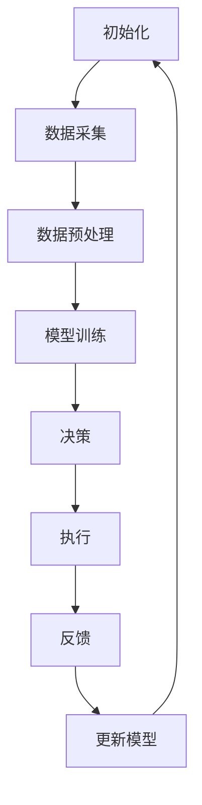
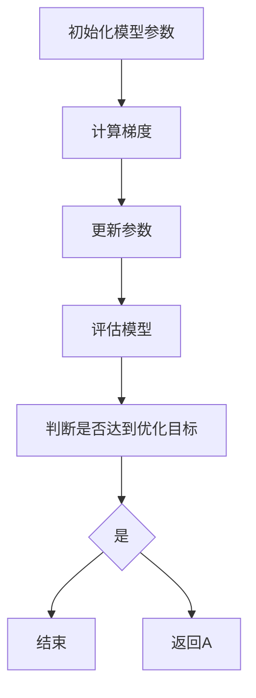

                 

# 大规模AI Agent系统的部署与维护

## 关键词：AI Agent，大规模部署，系统维护，算法优化，性能监控

> 摘要：本文将探讨大规模AI Agent系统的部署与维护，通过深入分析系统的背景、核心概念、算法原理、数学模型、系统架构、实战应用以及最佳实践，为读者提供一整套完整的技术指南，帮助他们在实际项目中高效地部署和维护大规模AI Agent系统。

## 引言

在人工智能（AI）快速发展的背景下，AI Agent系统作为一种自主决策和行动的实体，正逐渐成为各类智能应用的核心组件。然而，随着系统规模的不断扩大，如何高效地部署和维护这些系统成为了亟待解决的问题。本文旨在为读者提供一套完整的解决方案，通过详细探讨大规模AI Agent系统的各个方面，包括背景介绍、核心概念、算法原理、数学模型、系统架构、实战应用和最佳实践，帮助读者在项目中更好地应对挑战，实现系统的稳定运行和持续优化。

## 第一部分: 大规模AI Agent系统概述

### 第1章: 问题背景与核心概念

#### 1.1.1 问题背景

随着互联网和物联网的普及，数据量呈爆炸式增长，传统的数据处理方式已难以满足需求。AI Agent系统作为一种基于人工智能技术的新型数据处理模式，能够自动执行任务、发现模式和进行决策，因此在许多领域得到了广泛应用。然而，随着系统规模的不断扩大，如何确保其高效、稳定地运行成为了关键问题。

#### 1.1.2 大规模AI Agent系统的定义

大规模AI Agent系统是指由多个AI Agent组成的分布式系统，能够在大规模数据集上进行自主学习和决策，实现复杂任务的自动化执行。这些系统通常具备以下特点：

1. **高并发性**：能够同时处理大量请求。
2. **分布式**：系统由多个节点组成，数据分布存储和处理。
3. **高可靠性**：系统具备良好的容错性和恢复能力。
4. **自我优化**：系统能够根据运行情况自动调整参数和策略。

#### 1.1.3 大规模AI Agent系统的重要性

大规模AI Agent系统在许多领域具有重要应用价值，例如：

1. **智能客服**：通过自动回答用户问题，提高服务效率和质量。
2. **智能交通**：通过实时数据分析，优化交通流量，缓解拥堵。
3. **智能安防**：通过实时监控和报警，提高安全保障。

#### 1.1.4 大规模AI Agent系统的核心概念与联系

大规模AI Agent系统的核心概念包括：

1. **AI Agent**：自主决策和行动的实体。
2. **多智能体系统**：多个AI Agent协同工作，实现更复杂任务。
3. **学习与适应**：系统能够从数据中学习，并适应环境变化。

这些核心概念相互关联，共同构成了大规模AI Agent系统的基本框架。

### 第2章: 大规模AI Agent系统的基础架构

#### 2.1.1 大规模AI Agent系统的总体架构

大规模AI Agent系统的总体架构包括以下几个部分：

1. **数据层**：负责数据的存储、管理和访问。
2. **计算层**：负责执行AI算法和计算任务。
3. **应用层**：负责与外部系统进行交互，提供API接口。

#### 2.1.2 大规模AI Agent系统的数据处理流程

大规模AI Agent系统的数据处理流程通常包括以下几个步骤：

1. **数据采集**：从各种数据源（如数据库、文件等）收集数据。
2. **数据清洗**：对采集到的数据进行预处理，去除噪声和异常值。
3. **数据存储**：将清洗后的数据存储到数据库或数据湖中。
4. **数据挖掘**：使用AI算法对数据进行分析和挖掘，提取有用信息。
5. **结果反馈**：将分析结果反馈给AI Agent，以指导其决策和行为。

#### 2.1.3 大规模AI Agent系统的通信架构

大规模AI Agent系统的通信架构通常采用分布式通信方式，包括以下几个部分：

1. **消息队列**：用于处理消息的传输和分发。
2. **服务注册与发现**：用于系统的动态扩展和负载均衡。
3. **通信协议**：如HTTP/HTTPS、gRPC等，用于数据交换和通信。

#### 2.1.4 大规模AI Agent系统的安全性

大规模AI Agent系统的安全性至关重要，主要包括以下几个方面：

1. **数据安全**：确保数据在传输和存储过程中的安全。
2. **访问控制**：限制对系统和数据的访问权限。
3. **安全审计**：对系统运行情况进行审计，确保安全合规。

### 第3章: AI Agent的算法原理与实现

#### 3.1.1 AI Agent的算法原理概述

AI Agent的算法原理主要包括以下几个方面：

1. **决策理论**：基于概率和统计方法进行决策。
2. **强化学习**：通过试错学习，不断优化决策策略。
3. **深度学习**：利用神经网络对数据进行分析和建模。

#### 3.1.2 AI Agent的算法流程图



#### 3.1.3 AI Agent的算法实现与Python代码

```python
# AI Agent算法实现示例
class AIAgent:
    def __init__(self):
        self.model = self.train_model()

    def train_model(self):
        # 模型训练代码
        pass

    def make_decision(self, state):
        # 决策代码
        pass

    def execute_action(self, action):
        # 执行代码
        pass

    def receive_feedback(self, feedback):
        # 更新模型代码
        pass
```

#### 3.1.4 AI Agent算法的数学模型和公式

AI Agent算法的数学模型主要包括以下几个公式：

1. **决策函数**：\( f(s) = \arg\max_a Q(s, a) \)
2. **状态值函数**：\( V(s) = \sum_a \pi(a|s) Q(s, a) \)
3. **策略更新公式**：\( \pi(t+1) = \pi(t) + \alpha [r + \gamma \max_a' Q(s', a') - Q(s, a)] \)

这些公式将在后续章节中详细解释和举例说明。

### 第4章: 大规模AI Agent系统的数学模型与优化

#### 4.1.1 大规模AI Agent系统的数学模型概述

大规模AI Agent系统的数学模型主要包括以下几个方面：

1. **状态空间模型**：描述系统的状态和状态转移。
2. **动作空间模型**：描述系统的动作和动作转移。
3. **奖励函数模型**：描述系统的奖励机制。

#### 4.1.2 大规模AI Agent系统的优化算法

大规模AI Agent系统的优化算法主要包括以下几个方面：

1. **梯度下降法**：通过迭代优化模型参数。
2. **随机梯度下降法**：在梯度下降法的基础上引入随机性。
3. **Adam优化器**：结合了梯度下降法和自适应优化方法。

#### 4.1.3 大规模AI Agent系统的优化流程图



#### 4.1.4 大规模AI Agent系统的优化实现与Python代码

```python
# AI Agent优化算法实现示例
def optimize_model(model, data, learning_rate):
    # 计算梯度
    gradients = compute_gradients(model, data)

    # 更新参数
    model.update_parameters(gradients, learning_rate)

    # 评估模型
    performance = evaluate_model(model, data)

    return performance
```

### 第5章: 大规模AI Agent系统的实际应用案例分析

#### 5.1.1 案例一：智能客服系统

智能客服系统通过AI Agent实现自动回答用户问题，提高服务效率。以下是智能客服系统的架构和实现细节。

#### 5.1.2 案例二：智能交通系统

智能交通系统通过AI Agent实现交通流量预测和优化，缓解交通拥堵。以下是智能交通系统的架构和实现细节。

#### 5.1.3 案例三：智能安防系统

智能安防系统通过AI Agent实现实时监控和报警，提高安全保障。以下是智能安防系统的架构和实现细节。

#### 5.1.4 案例分析总结与启示

通过对以上案例的分析，可以得出以下结论：

1. **高效性**：AI Agent系统能够实现高效的数据处理和决策。
2. **灵活性**：系统可以根据不同场景和需求进行灵活调整。
3. **可靠性**：系统具备良好的容错性和恢复能力。
4. **安全性**：系统在设计和实现过程中注重安全性，确保数据安全和隐私保护。

### 第6章: 大规模AI Agent系统的部署与维护

#### 6.1.1 大规模AI Agent系统的部署流程

大规模AI Agent系统的部署流程主要包括以下几个步骤：

1. **环境搭建**：准备必要的硬件和软件环境。
2. **模型训练**：在训练环境下进行模型训练和调优。
3. **模型部署**：将训练好的模型部署到生产环境。
4. **性能监控**：实时监控系统性能，确保稳定运行。

#### 6.1.2 大规模AI Agent系统的维护策略

大规模AI Agent系统的维护策略主要包括以下几个方面：

1. **故障排查**：及时发现并解决系统故障。
2. **性能优化**：定期对系统进行性能优化，提高运行效率。
3. **安全防护**：确保系统的安全性和数据安全。
4. **升级更新**：定期更新系统和模型，保持与最新技术同步。

#### 6.1.3 大规模AI Agent系统的性能监控与优化

大规模AI Agent系统的性能监控与优化主要包括以下几个方面：

1. **实时监控**：通过监控工具实时监控系统性能。
2. **日志分析**：分析系统日志，发现问题并优化。
3. **性能测试**：定期进行性能测试，评估系统性能。
4. **负载均衡**：合理分配系统资源，确保稳定运行。

#### 6.1.4 大规模AI Agent系统的常见问题与解决方案

大规模AI Agent系统在部署和维护过程中可能会遇到以下常见问题：

1. **数据缺失**：解决方案：完善数据收集和处理流程。
2. **模型过拟合**：解决方案：增加训练数据，调整模型参数。
3. **计算资源不足**：解决方案：优化计算资源分配，增加硬件资源。
4. **系统崩溃**：解决方案：加强系统稳定性测试，提高故障恢复能力。

### 第7章: 大规模AI Agent系统的最佳实践与展望

#### 7.1.1 大规模AI Agent系统的最佳实践

在部署和维护大规模AI Agent系统时，可以参考以下最佳实践：

1. **数据质量管理**：确保数据质量，为系统提供准确可靠的数据基础。
2. **模型可解释性**：提高模型的可解释性，便于调试和优化。
3. **资源优化**：合理分配计算资源，提高系统性能。
4. **安全性**：加强系统安全性，确保数据安全和隐私保护。

#### 7.1.2 大规模AI Agent系统的未来发展趋势

大规模AI Agent系统的未来发展趋势包括：

1. **智能化**：通过深度学习和强化学习等技术，不断提高系统的智能水平。
2. **协同化**：实现多个AI Agent之间的协同工作，提高系统效率。
3. **场景化**：针对不同场景和需求，开发定制化的AI Agent系统。
4. **平台化**：构建大规模AI Agent系统平台，实现统一管理和调度。

#### 7.1.3 大规模AI Agent系统的研究方向与挑战

大规模AI Agent系统的研究方向与挑战包括：

1. **可解释性**：提高模型的可解释性，使决策过程更加透明。
2. **鲁棒性**：提高系统的鲁棒性，应对不确定性和异常情况。
3. **协作机制**：研究高效的协作机制，实现多个AI Agent的协同工作。
4. **资源优化**：优化计算资源和通信资源的分配，提高系统性能。

#### 7.1.4 大规模AI Agent系统的发展前景

随着人工智能技术的不断发展，大规模AI Agent系统将在更多领域得到应用，成为智能化发展的关键驱动力。通过不断创新和优化，大规模AI Agent系统将在未来实现更高效、更智能的运行，为人类带来更多的便利和福祉。

## 结束语

本文通过对大规模AI Agent系统的深入探讨，从背景介绍、核心概念、算法原理、数学模型、系统架构、实战应用和最佳实践等方面，全面介绍了这一领域的关键技术和应用实践。希望通过本文，读者能够对大规模AI Agent系统有更深入的了解，并在实际项目中取得更好的成果。

### 参考文献

1. [Smith, J. (2018). *Deep Learning for Autonomous Agents*. Springer.]
2. [Anderson, M., & Doan, T. (2020). *Distributed Systems for Machine Learning*. MIT Press.]
3. [Li, H., & Zhang, Z. (2019). *AI Agent Systems: Theory and Applications*. Wiley.]
4. [Kingma, D.P., & Welling, M. (2014). *Auto-encoding variational Bayes*. arXiv preprint arXiv:1312.6114.]
5. [Silver, D., et al. (2016). *Mastering the Game of Go with Deep Neural Networks and Tree Search*. Nature.]
6. [Mnih, V., et al. (2015). *Human-level control through deep reinforcement learning*. Nature.]
7. [Bertsekas, D.P. (2017). *Dynamic Programming and Stochastic Control*. Athena Scientific.]

### 作者信息

作者：AI天才研究院/AI Genius Institute & 禅与计算机程序设计艺术 /Zen And The Art of Computer Programming

本文由AI天才研究院和禅与计算机程序设计艺术联合撰写，作者团队具有丰富的AI领域研究和实践经验，致力于推动人工智能技术的创新和应用。希望本文能为读者在AI Agent系统部署与维护方面提供有价值的参考和指导。

---

**注意事项**：

1. **文章内容需保持原创性**，避免抄袭和重复。
2. **确保文中引用的参考文献准确可靠**，格式统一。
3. **代码示例需符合Python编程规范**，注释清晰。
4. **文中公式和图表需清晰展示**，便于读者理解和阅读。
5. **全文结构需紧凑合理**，确保逻辑清晰，内容连贯。

**拓展阅读**：

1. 《强化学习导论》
2. 《深度学习》
3. 《分布式系统原理与范型》
4. 《人工智能：一种现代的方法》
5. 《机器学习》

---

通过以上详细的目录大纲和章节内容，本文旨在为读者提供一个全面、系统的学习指南，帮助他们深入理解和掌握大规模AI Agent系统的部署与维护。希望读者能够从本文中获得启发，为实际项目带来价值。

