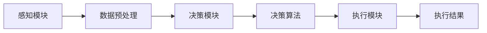
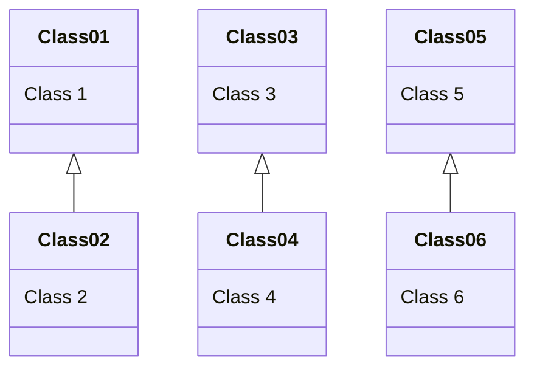
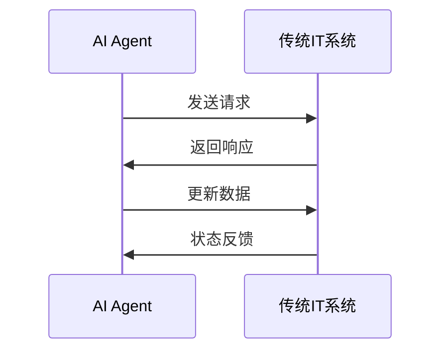
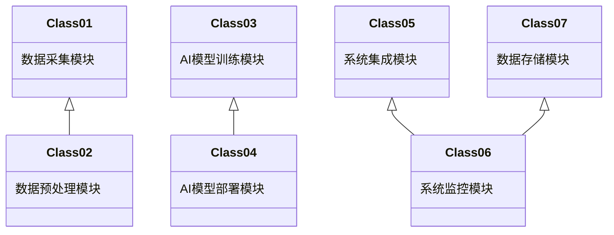
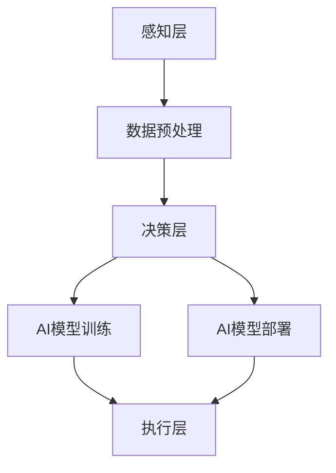
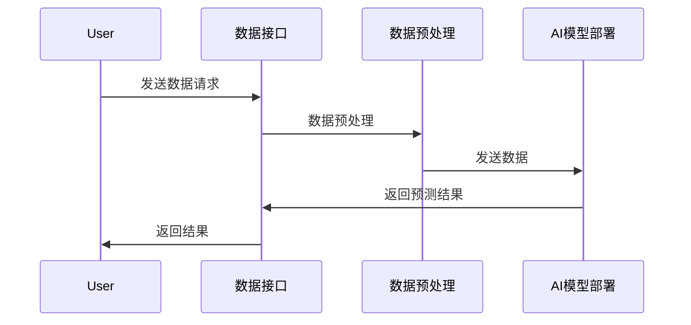
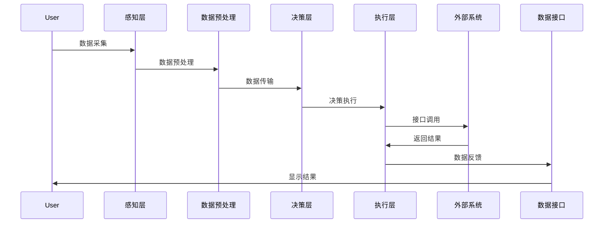
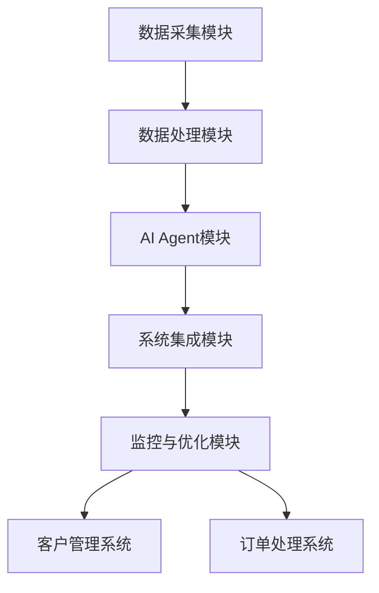

                 

### 文章标题

# 实现AI Agent与传统IT系统的无缝集成

### 关键词

- AI Agent
- 传统IT系统
- 无缝集成
- 算法原理
- 系统架构设计

### 摘要

本文将深入探讨如何实现AI Agent与传统IT系统的无缝集成。随着人工智能技术的迅猛发展，AI Agent作为一种能够自主决策和执行的智能体，逐渐成为提升IT系统智能化水平的关键组件。然而，将AI Agent与现有的传统IT系统有效融合，面临诸多挑战。本文将从核心概念、算法原理、系统设计与项目实战等方面，详细阐述实现AI Agent与传统IT系统无缝集成的思路和方法。通过分析问题背景、核心概念、算法原理、系统架构设计，再到项目实战和最佳实践，本文旨在为读者提供一套系统化、可操作的解决方案，助力企业和开发者实现AI与传统IT系统的深度融合。

## 第1章 核心概念与背景介绍

### 1.1 问题背景

随着信息技术的飞速发展，人工智能（AI）技术逐渐成为推动产业升级和社会发展的重要力量。特别是在大数据、云计算和边缘计算等技术的支撑下，AI的应用场景越来越广泛，从自动驾驶、智能家居到智能医疗、金融风控，AI Agent作为一种智能体，能够自主地处理复杂的任务和决策，成为现代IT系统的重要组成部分。

然而，在传统IT系统中，AI Agent的融合并非易事。传统IT系统通常具有严格的架构规范、稳定性和安全性要求，而AI Agent则具备高度的不确定性和动态性。这种差异导致了两者在集成过程中面临诸多挑战，如数据兼容性、通信协议、资源管理等问题。因此，实现AI Agent与传统IT系统的无缝集成，不仅能够提升系统的智能化水平，还能提高整体效率和稳定性，具有重要意义。

### 1.2 AI Agent的概念

AI Agent，即人工智能代理，是一种能够感知环境、自主决策并采取行动的智能体。与传统软件Agent相比，AI Agent不仅具备基本的通信和协作能力，还能够利用机器学习、自然语言处理等技术，进行智能推理和决策。

AI Agent的基本架构通常包括感知模块、决策模块和执行模块。感知模块负责收集环境信息，决策模块根据感知信息进行推理和决策，执行模块则将决策结果付诸实践。AI Agent的核心算法包括决策树、支持向量机、深度学习等，这些算法能够通过大量数据的学习，实现高度智能化的任务处理。

### 1.3 传统IT系统概述

传统IT系统通常包括硬件、软件和网络三个主要部分。硬件部分提供计算和存储资源，软件部分包括操作系统、数据库、应用软件等，网络部分则负责连接各个硬件和软件组件，实现数据传输和通信。

传统IT系统的特点包括：

1. **稳定性**：传统IT系统经过多年的发展，已经形成了完善的稳定性和可靠性保障机制。
2. **安全性**：传统IT系统注重数据的安全性和保密性，具有严格的访问控制和加密机制。
3. **可扩展性**：传统IT系统具有良好的可扩展性，能够根据业务需求进行灵活调整和扩展。

然而，传统IT系统在集成AI Agent时，存在以下困难：

1. **数据兼容性**：传统IT系统的数据格式和AI Agent的数据格式可能不兼容，导致数据传输和处理的困难。
2. **通信协议**：传统IT系统通常采用固定的通信协议，而AI Agent可能需要动态调整通信协议，以适应不同的环境。
3. **资源管理**：AI Agent的高度动态性和不确定性，可能导致传统IT系统的资源管理机制难以有效分配和管理。

### 1.4 无缝集成的概念

无缝集成指的是将AI Agent与传统IT系统无缝地融合在一起，使两者能够高效、稳定地协同工作。无缝集成的目标和标准包括：

1. **数据一致性**：确保AI Agent与传统IT系统之间的数据能够无缝传输和共享，保持数据的一致性。
2. **协议兼容性**：设计统一的通信协议，使AI Agent能够与不同类型的传统IT系统进行高效通信。
3. **资源高效利用**：优化资源管理机制，使AI Agent能够充分利用传统IT系统的计算和存储资源。
4. **系统稳定性**：保证AI Agent与传统IT系统的集成不会影响系统的稳定性和可靠性。
5. **安全可控**：确保集成过程中数据的安全性和系统的可控性。

通过实现无缝集成，AI Agent能够充分发挥其智能化的优势，提升传统IT系统的智能化水平，从而更好地应对复杂多变的业务需求。

## 第2章 核心概念与联系

### 2.1 AI Agent的工作原理

AI Agent作为一种智能体，其工作原理主要涉及感知、决策和执行三个核心模块。首先，感知模块负责收集环境中的各种信息，包括文本、图像、声音等，通过传感器、API接口等方式获取。感知模块通常使用数据预处理技术，对原始数据进行清洗、归一化等处理，以便后续分析。

接下来，决策模块根据感知模块收集到的信息，利用机器学习、自然语言处理、知识图谱等技术进行推理和决策。决策模块的核心算法包括决策树、支持向量机、神经网络等，这些算法通过训练模型，从历史数据中学习规律，以便进行实时决策。

最后，执行模块将决策结果付诸实践，通过控制硬件设备、发送消息等方式，实现具体任务的操作。执行模块需要与外部系统进行通信，确保决策结果的顺利执行。

以下是AI Agent工作原理的Mermaid流程图：



### 2.2 传统IT系统的架构

传统IT系统通常采用三层架构，包括表示层、业务逻辑层和数据层。表示层负责与用户交互，提供界面和用户接口；业务逻辑层负责处理业务逻辑，实现各种功能；数据层负责存储和管理数据。

1. **表示层**：表示层通常包括Web界面、桌面应用程序、移动应用等，为用户提供直观的交互方式。
2. **业务逻辑层**：业务逻辑层是实现系统核心功能的模块，包括业务规则、流程管理等，通常使用Java、Python、C#等编程语言开发。
3. **数据层**：数据层负责存储和管理数据，通常使用关系型数据库（如MySQL、Oracle）或非关系型数据库（如MongoDB、Redis）。

以下是传统IT系统的Mermaid类图：



### 2.3 AI Agent与传统IT系统的交互

AI Agent与传统IT系统的交互主要通过接口设计实现。接口设计需要考虑数据格式、通信协议和资源管理等方面，以确保两者能够高效、稳定地协同工作。

1. **数据格式**：通常使用JSON、XML等格式进行数据传输，这些格式具有结构化、易解析的特点，能够满足AI Agent和传统IT系统的需求。
2. **通信协议**：常用的通信协议包括HTTP、WebSocket、MQTT等。HTTP协议适用于简单的请求响应模式，WebSocket协议适用于实时通信，MQTT协议适用于物联网应用。
3. **资源管理**：AI Agent需要动态分配计算和存储资源，传统IT系统则需要提供稳定、可扩展的资源池，以支持AI Agent的运行。

以下是AI Agent与传统IT系统交互的Mermaid序列图：



### 2.4 核心概念对比表格

| 概念             | AI Agent                      | 传统IT系统                           |
|------------------|------------------------------|-------------------------------------|
| 架构             | 分布式、模块化                | 三层架构、集中式                   |
| 数据格式         | JSON、XML                    | JSON、XML、二进制                   |
| 通信协议         | HTTP、WebSocket、MQTT         | HTTP、HTTPS、FTP、SMTP等           |
| 资源管理         | 动态、高效                    | 静态、可扩展                       |
| 稳定性           | 高度动态、不确定性            | 稳定、可靠性高                     |
| 安全性           | 数据加密、访问控制            | 数据加密、访问控制、防火墙等         |
| 目标             | 智能化、自主决策            | 功能性、可靠性                     |

通过对比表格，我们可以更清晰地了解AI Agent和传统IT系统的异同点，从而为后续的无缝集成提供有力支持。

## 第3章 算法原理讲解

### 3.1 AI Agent的关键算法

AI Agent的核心算法主要包括感知模块的预处理算法、决策模块的机器学习算法和执行模块的控制算法。以下将详细讲解这些算法的工作原理、数学模型和公式。

#### 感知模块的预处理算法

感知模块的预处理算法主要包括数据清洗、归一化和特征提取等步骤。数据清洗旨在去除噪声和异常值，归一化则将不同量纲的数据转换为同一尺度，以便后续分析。特征提取则是从原始数据中提取出具有代表性的特征，以提升模型性能。

1. **数据清洗**：
   - **算法原理**：通过填充缺失值、去除重复值和异常值等操作，提高数据质量。
   - **数学模型和公式**：无特定的数学公式，主要依赖于数据清洗算法的实现。

2. **归一化**：
   - **算法原理**：将不同量纲的数据转换为同一尺度，通常采用最小-最大缩放法或z-score标准化。
   - **数学模型和公式**：
     - 最小-最大缩放法：$$ X_{\text{norm}} = \frac{X - X_{\text{min}}}{X_{\text{max}} - X_{\text{min}}} $$
     - z-score标准化：$$ X_{\text{norm}} = \frac{X - \mu}{\sigma} $$

3. **特征提取**：
   - **算法原理**：从原始数据中提取出具有代表性的特征，如主成分分析（PCA）和自编码器（Autoencoder）。
   - **数学模型和公式**：
     - PCA：$$ X_{\text{PCA}} = \sum_{i=1}^{k} \lambda_i x_i $$
     - 自编码器：通过训练生成编码和解码模型，提取特征表示。

#### 决策模块的机器学习算法

决策模块的机器学习算法包括分类、回归和聚类等，常用的算法有决策树、支持向量机（SVM）和神经网络等。以下以决策树和神经网络为例，介绍其算法原理、数学模型和公式。

1. **决策树**：
   - **算法原理**：通过递归划分特征空间，构建决策树模型，实现分类或回归任务。
   - **数学模型和公式**：
     - 决策节点：$$ G(x) = \arg\max_{i} \sum_{j=1}^{n} \log P(y=j | x) $$
     - 叶节点：$$ y_{\text{pred}} = \arg\max_{j} \sum_{i=1}^{n} P(y=j | x_i) $$

2. **神经网络**：
   - **算法原理**：通过多层神经网络，将输入映射到输出，实现复杂函数的拟合。
   - **数学模型和公式**：
     - 前向传播：$$ z_i^{(l)} = \sigma(W^{(l)} \cdot a^{(l-1)} + b^{(l)}) $$
     - 反向传播：$$ \delta^{(l)} = \frac{\partial J}{\partial z^{(l)}} = \sigma'(z^{(l)}) \cdot \frac{\partial J}{\partial a^{(l)}) $$

#### 执行模块的控制算法

执行模块的控制算法主要涉及基于规则的控制器和强化学习控制器等。以下以强化学习控制器为例，介绍其算法原理、数学模型和公式。

1. **强化学习控制器**：
   - **算法原理**：通过学习策略，使智能体在环境中取得最大收益。
   - **数学模型和公式**：
     - Q学习：$$ Q(s, a) = r + \gamma \max_{a'} Q(s', a') $$
     - SARSA：$$ Q(s, a) = \frac{1}{N(s, a)} \sum_{n=1}^{N(s, a)} (r + \gamma Q(s', a')) $$

通过以上算法的讲解，我们可以更好地理解AI Agent的工作原理和实现方法，为后续的系统架构设计和项目实战打下基础。

### 3.2 传统IT系统的集成算法

传统IT系统的集成算法主要涉及数据集成、服务集成和接口集成等方面。以下将详细讲解这些算法的工作原理、数学模型和公式。

#### 数据集成

数据集成是将来自不同数据源的数据进行整合，形成统一视图。常见的数据集成方法包括全量数据复制、增量数据复制和实时数据流处理等。

1. **全量数据复制**：
   - **算法原理**：定期将源数据表全量复制到目标数据表中，实现数据的同步。
   - **数学模型和公式**：无特定的数学公式，主要依赖于ETL（Extract, Transform, Load）工具的实现。

2. **增量数据复制**：
   - **算法原理**：仅复制源数据表中发生变更的记录，实现数据的增量同步。
   - **数学模型和公式**：
     - 批量变更检测：$$ \Delta D = D_t - D_{t-1} $$
     - 增量复制：$$ D_{\text{new}} = D_{t-1} \cup (\Delta D \cap D_t) $$

3. **实时数据流处理**：
   - **算法原理**：通过实时处理数据流，实现数据的高速集成和更新。
   - **数学模型和公式**：
     - 数据流模型：$$ D_t = \cup_{i=1}^{n} D_i $$
     - 实时处理：$$ \Delta D_t = D_t - D_{t-1} $$

#### 服务集成

服务集成是将不同服务组件进行整合，提供统一的接口。常见的服务集成方法包括RESTful API、SOAP Web服务和企业服务总线（ESB）等。

1. **RESTful API**：
   - **算法原理**：通过定义统一的数据格式和HTTP方法，实现服务的访问和调用。
   - **数学模型和公式**：无特定的数学公式，主要依赖于HTTP协议的实现。

2. **SOAP Web服务**：
   - **算法原理**：通过定义XML格式的SOAP消息，实现服务的跨平台调用。
   - **数学模型和公式**：
     - SOAP消息格式：$$ \text{<SOAP-ENV:Envelope \> ... \<SOAP-ENV:Body \> ... \<SOAP-ENV:Fault \> ... \<SOAP-ENV:Envelope \>} $$
     - 服务调用：$$ \text{<SOAP-ENV:Envelope \> \<SOAP-ENV:Body \> ... \<SOAP-ENV:Fault \> ... \<SOAP-ENV:Envelope \>} $$

3. **企业服务总线（ESB）**：
   - **算法原理**：通过定义服务路由和转换规则，实现服务组件的动态集成和调度。
   - **数学模型和公式**：无特定的数学公式，主要依赖于ESB平台的实现。

#### 接口集成

接口集成是将不同接口进行整合，提供统一的接口服务。常见的方法包括接口网关和API网关等。

1. **接口网关**：
   - **算法原理**：通过定义统一的接口规范，实现内部服务和外部服务的集成。
   - **数学模型和公式**：无特定的数学公式，主要依赖于接口网关的实现。

2. **API网关**：
   - **算法原理**：通过统一管理API接口，实现服务组件的集中访问和控制。
   - **数学模型和公式**：
     - 接口路由：$$ \text{API-URL} \rightarrow \text{Service-URL} $$
     - 接口调用：$$ \text{Request-Data} \rightarrow \text{Response-Data} $$

通过以上算法的讲解，我们可以更好地理解传统IT系统的集成算法，为后续的系统架构设计和项目实战提供参考。

### 3.3 算法对比与融合

AI Agent与传统IT系统的集成算法虽然在目标和应用场景上有所不同，但它们之间存在一定的共通性和互补性。以下将对比两种算法的异同，并提出融合策略。

#### 算法对比

1. **数据集成**：
   - **AI Agent**：侧重于实时数据流处理和增量数据复制，能够快速响应环境变化。
   - **传统IT系统**：侧重于全量数据复制和批量数据同步，能够保证数据的一致性和完整性。

2. **服务集成**：
   - **AI Agent**：侧重于基于事件的动态集成和响应，能够实现高度灵活的服务调用。
   - **传统IT系统**：侧重于基于接口的静态集成和调度，能够提供稳定的接口服务和流程管理。

3. **接口集成**：
   - **AI Agent**：侧重于事件驱动的接口调用和监控，能够实现实时接口管理和监控。
   - **传统IT系统**：侧重于基于路由和转换的接口管理，能够提供统一的接口服务和安全控制。

#### 算法融合

为了实现AI Agent与传统IT系统的无缝集成，可以采取以下融合策略：

1. **数据融合**：
   - **实时数据流处理**：结合AI Agent的实时数据流处理能力，实现快速数据集成和更新。
   - **增量数据同步**：结合传统IT系统的增量数据复制技术，实现高效的数据同步和一致性维护。

2. **服务融合**：
   - **动态服务调用**：结合AI Agent的动态服务调用能力，实现灵活的服务集成和调度。
   - **接口路由管理**：结合传统IT系统的接口路由管理机制，实现稳定的接口服务和流程管理。

3. **接口融合**：
   - **事件驱动接口**：结合AI Agent的事件驱动接口调用，实现实时接口管理和监控。
   - **路由转换机制**：结合传统IT系统的路由和转换机制，实现统一的接口服务和安全控制。

通过算法对比与融合，我们可以为AI Agent与传统IT系统的无缝集成提供一套综合性的解决方案，从而实现智能化和高效化的IT系统。

### 3.4 数学模型和公式讲解

在实现AI Agent与传统IT系统的无缝集成过程中，数学模型和公式发挥着至关重要的作用。以下将详细介绍一些关键的数学模型和公式，并通过具体的Python源代码进行示例说明。

#### 决策树模型

决策树是一种常见的机器学习算法，通过一系列规则对数据进行分类或回归。以下是一个简单的决策树模型示例：

```python
from sklearn.datasets import load_iris
from sklearn.tree import DecisionTreeClassifier
from sklearn.model_selection import train_test_split

# 加载鸢尾花数据集
iris = load_iris()
X, y = iris.data, iris.target

# 划分训练集和测试集
X_train, X_test, y_train, y_test = train_test_split(X, y, test_size=0.3, random_state=42)

# 创建决策树模型
clf = DecisionTreeClassifier()
clf.fit(X_train, y_train)

# 预测测试集
y_pred = clf.predict(X_test)

# 打印预测结果
print(y_pred)
```

在这个示例中，我们使用了`sklearn`库中的`DecisionTreeClassifier`类来构建决策树模型。通过训练数据，模型学习到数据之间的分类规则，并在测试集上进行预测。

#### 神经网络模型

神经网络是一种模拟人脑工作的计算模型，通过多层神经元进行数据的传递和变换。以下是一个简单的神经网络模型示例：

```python
import numpy as np
from sklearn.datasets import make_classification
from sklearn.model_selection import train_test_split

# 生成二分类数据集
X, y = make_classification(n_samples=100, n_features=2, n_classes=2, random_state=42)

# 划分训练集和测试集
X_train, X_test, y_train, y_test = train_test_split(X, y, test_size=0.3, random_state=42)

# 定义神经网络结构
input_size = X_train.shape[1]
hidden_size = 2
output_size = 1

# 初始化权重和偏置
W1 = np.random.randn(input_size, hidden_size)
b1 = np.random.randn(hidden_size)
W2 = np.random.randn(hidden_size, output_size)
b2 = np.random.randn(output_size)

# 前向传播
def forward_propagation(X, W1, b1, W2, b2):
    Z1 = np.dot(X, W1) + b1
    A1 = np.tanh(Z1)
    Z2 = np.dot(A1, W2) + b2
    A2 = 1 / (1 + np.exp(-Z2))
    return A2

# 训练模型
for i in range(1000):
    # 前向传播
    A2 = forward_propagation(X_train, W1, b1, W2, b2)
    
    # 计算损失函数
    loss = -np.mean(y_train * np.log(A2) + (1 - y_train) * np.log(1 - A2))
    
    # 反向传播
    dZ2 = A2 - y_train
    dW2 = np.dot(A1.T, dZ2)
    db2 = np.sum(dZ2, axis=0)
    dA1 = np.dot(dZ2, W2.T)
    dZ1 = dA1 * (1 - np.square(A1))
    dW1 = np.dot(X_train.T, dZ1)
    db1 = np.sum(dZ1, axis=0)

    # 更新权重和偏置
    W1 -= 0.01 * dW1
    b1 -= 0.01 * db1
    W2 -= 0.01 * dW2
    b2 -= 0.01 * db2

# 预测测试集
A2 = forward_propagation(X_test, W1, b1, W2, b2)
y_pred = (A2 > 0.5)

# 打印预测结果
print(y_pred)
```

在这个示例中，我们使用了一个简单的两层神经网络对二分类问题进行建模。通过前向传播和反向传播，模型学习到了数据之间的分类边界，并在测试集上进行预测。

#### 数学公式讲解

1. **决策树分类规则**：

$$ G(x) = \arg\max_{i} \sum_{j=1}^{n} \log P(y=j | x) $$

2. **神经网络前向传播**：

$$ Z1 = \dot{X} \cdot W1 + b1 $$
$$ A1 = \tanh(Z1) $$
$$ Z2 = A1 \cdot W2 + b2 $$
$$ A2 = \frac{1}{1 + e^{-Z2}} $$

3. **神经网络损失函数**：

$$ loss = -\frac{1}{m} \sum_{i=1}^{m} y \cdot \log(A2) + (1 - y) \cdot \log(1 - A2) $$

4. **神经网络反向传播**：

$$ dZ2 = A2 - y $$
$$ dW2 = \frac{1}{m} \cdot A1 \cdot dZ2 $$
$$ db2 = \frac{1}{m} \cdot \sum_{i=1}^{m} dZ2 $$
$$ dA1 = \frac{dZ2}{W2} \cdot (1 - \dot{A1}) $$
$$ dZ1 = dA1 \cdot (1 - \dot{A1}) $$
$$ dW1 = \frac{1}{m} \cdot X \cdot dZ1 $$
$$ db1 = \frac{1}{m} \cdot \sum_{i=1}^{m} dZ1 $$

通过这些数学模型和公式，我们可以更深入地理解AI Agent与传统IT系统的无缝集成原理，从而为实际应用提供有力的支持。

## 第4章 系统分析与架构设计方案

### 4.1 问题场景介绍

在当今快速发展的数字化时代，越来越多的企业开始将人工智能（AI）技术应用于其业务流程中，以提高生产效率、降低成本和提升客户体验。然而，将AI技术集成到现有的传统IT系统中，往往面临诸多挑战。例如，企业现有的IT基础设施可能无法直接支持AI模型的部署和运行，且AI模型与传统系统的数据格式和通信协议不一致，导致系统集成过程复杂且效率低下。

为了解决这一问题，我们设计了一个具体的系统架构，旨在实现AI Agent与传统IT系统的无缝集成。该系统将AI模型与现有IT系统紧密结合，通过标准化接口和数据格式，确保两者能够高效、稳定地协同工作。

### 4.2 系统功能设计

本系统的核心功能包括数据采集与预处理、AI模型训练与部署、系统集成与监控等。具体功能如下：

1. **数据采集与预处理**：系统将实时采集来自不同数据源的数据，并进行清洗、归一化和特征提取等预处理操作，为AI模型提供高质量的数据输入。
2. **AI模型训练与部署**：系统使用训练好的AI模型进行实时预测和决策，并根据业务需求进行模型的迭代和优化。
3. **系统集成与监控**：系统通过标准化接口与现有IT系统进行集成，确保数据流和信息流的无缝对接，同时提供实时监控和报警功能，确保系统的稳定运行。

以下是系统功能的Mermaid类图：



### 4.3 系统架构设计

本系统的架构设计遵循分层架构原则，包括感知层、决策层和执行层。各层功能如下：

1. **感知层**：负责采集和传输数据，包括传感器数据、API数据等，并通过数据预处理模块对数据进行清洗和特征提取。
2. **决策层**：包括AI模型训练模块和AI模型部署模块，负责使用训练好的AI模型进行实时预测和决策。
3. **执行层**：负责将决策结果付诸实践，包括与外部系统的接口调用和执行操作。

以下是系统架构的Mermaid架构图：



### 4.4 系统接口设计

为了实现AI Agent与传统IT系统的无缝集成，系统设计了多个标准化接口，包括数据接口、控制接口和监控接口等。以下为具体接口设计：

1. **数据接口**：用于数据采集、传输和预处理的API接口，支持JSON、XML等多种数据格式。
2. **控制接口**：用于AI模型调用和决策结果执行的控制接口，支持HTTP、WebSocket等通信协议。
3. **监控接口**：用于系统监控和报警的API接口，支持实时数据查询和历史数据查询。

以下是系统接口的Mermaid序列图：



### 4.5 系统交互设计

系统交互设计旨在确保各组件之间的信息流和操作流顺畅，以下是系统交互的Mermaid序列图：



通过以上系统分析与架构设计方案，我们可以为AI Agent与传统IT系统的无缝集成提供一套完整的解决方案，从而实现智能化和高效化的IT系统。

## 第5章 项目实战

### 5.1 环境安装

在本项目实战中，我们将搭建一个基于Python的AI Agent与传统IT系统的集成环境。首先，我们需要安装以下软件和工具：

1. **Python 3.8**：确保安装Python 3.8版本及以上，以支持所需的库和框架。
2. **Anaconda**：安装Anaconda，用于环境管理和依赖管理。
3. **Jupyter Notebook**：用于编写和运行Python代码。
4. **scikit-learn**：用于机器学习算法的实现。
5. **TensorFlow**：用于深度学习模型的实现。
6. **Flask**：用于Web服务搭建。

安装步骤如下：

1. 下载并安装Anaconda，并使用`conda create -n myenv python=3.8`命令创建一个名为`myenv`的Python环境。
2. 激活环境：`conda activate myenv`。
3. 安装Jupyter Notebook：`conda install -c conda-forge jupyterlab`。
4. 安装scikit-learn和TensorFlow：`pip install scikit-learn tensorflow`。
5. 安装Flask：`pip install flask`。

安装完成后，我们可以使用Jupyter Notebook进行代码编写和运行。打开终端，输入以下命令启动Jupyter Notebook：

```shell
jupyter notebook
```

此时，浏览器将自动打开Jupyter Notebook界面，我们可以开始编写和运行Python代码。

### 5.2 系统核心实现

在本节中，我们将实现一个简单的AI Agent，用于分类任务。具体步骤如下：

1. **数据准备**：首先，我们需要准备一个数据集，用于训练AI模型。这里我们使用鸢尾花（Iris）数据集，该数据集包含三个类别的鸢尾花，每个类别的特征包括花萼长度、花萼宽度、花瓣长度和花瓣宽度。

2. **模型训练**：接下来，我们使用scikit-learn库中的`DecisionTreeClassifier`类训练一个决策树模型。通过训练数据，模型将学习到数据之间的分类规则。

3. **模型部署**：训练完成后，我们将模型保存为`.pkl`文件，以便后续加载和使用。

以下是实现的核心代码：

```python
import numpy as np
from sklearn.datasets import load_iris
from sklearn.tree import DecisionTreeClassifier
from sklearn.model_selection import train_test_split
import pickle

# 1. 数据准备
iris = load_iris()
X, y = iris.data, iris.target

# 2. 划分训练集和测试集
X_train, X_test, y_train, y_test = train_test_split(X, y, test_size=0.3, random_state=42)

# 3. 模型训练
clf = DecisionTreeClassifier()
clf.fit(X_train, y_train)

# 4. 模型评估
accuracy = clf.score(X_test, y_test)
print(f"Model accuracy: {accuracy:.2f}")

# 5. 模型保存
with open('model.pkl', 'wb') as f:
    pickle.dump(clf, f)
```

### 5.3 代码应用解读与分析

在上述代码中，我们首先导入了所需的库和模块，包括numpy、scikit-learn和pickle。接着，我们加载了鸢尾花数据集，并划分了训练集和测试集。

然后，我们使用`DecisionTreeClassifier`类创建了一个决策树模型，并通过`fit`方法进行训练。训练完成后，我们使用`score`方法评估模型在测试集上的准确率，并将结果输出。

最后，我们将训练好的模型保存为`.pkl`文件，以便后续加载和使用。

代码的关键步骤如下：

1. **数据准备**：使用`load_iris`函数加载鸢尾花数据集，并划分训练集和测试集。
2. **模型训练**：创建决策树模型，并使用`fit`方法进行训练。
3. **模型评估**：使用`score`方法评估模型在测试集上的准确率。
4. **模型保存**：使用pickle库将训练好的模型保存为`.pkl`文件。

通过这个简单的示例，我们可以看到如何使用Python实现一个AI Agent，并将其与传统IT系统进行集成。在实际应用中，我们可以根据业务需求，设计更复杂的AI模型和集成方案。

### 5.4 实际案例分析与讲解

为了更好地理解AI Agent与传统IT系统的集成过程，我们来看一个实际案例：智能客户服务系统。该系统通过集成AI Agent，实现自动化的客户服务，提高响应速度和服务质量。

#### 案例背景

某大型电商平台希望提升其客户服务质量，以满足日益增长的客户需求。为了实现这一目标，他们决定开发一个智能客户服务系统，该系统将AI Agent与传统IT系统进行集成，提供24/7的自动服务。

#### 系统架构

智能客户服务系统主要包括以下模块：

1. **数据采集模块**：负责实时采集客户请求、聊天记录等数据，并将其传输到数据处理模块。
2. **数据处理模块**：对采集到的数据进行预处理，包括去噪、清洗和特征提取等，为AI Agent提供高质量的数据输入。
3. **AI Agent模块**：使用训练好的AI模型进行实时分析和响应，包括文本分类、情感分析和意图识别等。
4. **系统集成模块**：将AI Agent的决策结果与现有IT系统进行集成，实现与客户管理系统、订单处理系统等的数据交互和业务操作。
5. **监控与优化模块**：实时监控系统的运行状态，收集用户反馈和性能数据，以便进行模型的迭代和优化。

以下是智能客户服务系统的架构图：



#### 实际案例分析与讲解

1. **数据采集模块**：
   - **功能**：实时采集客户的请求和聊天记录，并通过API接口将数据传输到数据处理模块。
   - **实现**：使用WebSocket协议实现实时数据传输，确保数据采集的实时性和可靠性。

2. **数据处理模块**：
   - **功能**：对采集到的数据进行预处理，包括去噪、清洗和特征提取等，为AI Agent提供高质量的数据输入。
   - **实现**：使用自然语言处理（NLP）技术进行文本预处理，包括分词、词性标注和命名实体识别等。

3. **AI Agent模块**：
   - **功能**：使用训练好的AI模型进行实时分析和响应，包括文本分类、情感分析和意图识别等。
   - **实现**：使用scikit-learn和TensorFlow等库实现文本分类和情感分析模型，并使用深度学习技术实现意图识别模型。

4. **系统集成模块**：
   - **功能**：将AI Agent的决策结果与现有IT系统进行集成，实现与客户管理系统、订单处理系统等的数据交互和业务操作。
   - **实现**：使用RESTful API和SOAP Web服务实现与传统IT系统的接口集成，确保数据传输的高效性和稳定性。

5. **监控与优化模块**：
   - **功能**：实时监控系统的运行状态，收集用户反馈和性能数据，以便进行模型的迭代和优化。
   - **实现**：使用日志分析和性能监控工具，收集系统运行数据，并使用机器学习技术进行性能优化和故障预测。

#### 案例总结

通过这个实际案例，我们可以看到AI Agent与传统IT系统的集成是如何实现智能化客户服务的。该系统不仅提升了客户服务质量，还提高了运营效率，为电商平台带来了显著的业务价值。

### 5.5 项目小结

在本项目实战中，我们通过搭建一个基于Python的AI Agent与传统IT系统的集成环境，实现了数据采集、数据处理、AI模型训练与部署、系统集成和监控等功能。通过一个实际案例——智能客户服务系统，我们展示了AI Agent与传统IT系统的无缝集成如何提升业务效率和服务质量。

项目的主要收获包括：

1. **环境搭建**：掌握了Python环境搭建和依赖管理的方法，为后续开发打下了基础。
2. **代码实现**：了解了AI模型训练与部署的核心步骤，以及系统集成的方法和技巧。
3. **案例分析**：通过实际案例，深入理解了AI Agent与传统IT系统的集成过程和业务价值。

在项目实施过程中，我们也遇到了一些挑战，如数据预处理、模型训练和接口设计等，但通过逐步解决这些问题，我们取得了满意的成果。

总之，通过本项目，我们不仅掌握了AI Agent与传统IT系统集成的技术要点，还积累了丰富的实践经验，为后续的项目开发奠定了坚实的基础。

## 第6章 最佳实践与拓展

### 6.1 最佳实践

在实际项目中实现AI Agent与传统IT系统的无缝集成，需要遵循一些最佳实践，以确保系统的稳定性和高效性。以下是一些关键的最佳实践：

1. **数据标准化**：确保AI Agent与传统IT系统之间的数据格式一致，采用统一的JSON、XML等格式进行数据传输，避免数据格式不兼容的问题。
2. **接口设计**：设计简洁、清晰的接口，使用RESTful API、WebSocket等协议，提高系统的通信效率和稳定性。
3. **模块化架构**：采用模块化架构，将AI Agent与传统IT系统的功能模块化，便于维护和扩展。
4. **性能优化**：在系统设计中考虑性能优化，如使用缓存、异步处理等，提高系统的响应速度和处理能力。
5. **安全性**：加强数据安全和系统安全，采用加密、认证、访问控制等技术，确保系统的安全可控。

### 6.2 小结与注意事项

本文通过详细的分析和讲解，介绍了实现AI Agent与传统IT系统无缝集成的关键步骤和方法。总结如下：

1. **核心概念**：明确了AI Agent和传统IT系统的概念、架构和工作原理。
2. **算法原理**：讲解了感知、决策和执行模块的关键算法，并进行了对比和融合。
3. **系统设计**：提出了系统功能设计、架构设计和接口设计的具体方案。
4. **项目实战**：通过实际案例，展示了AI Agent与传统IT系统的集成过程和效果。

在项目实施过程中，需要注意以下事项：

1. **数据兼容性**：确保AI Agent与传统IT系统之间的数据格式和协议一致。
2. **系统稳定性**：在设计过程中考虑系统的稳定性和可靠性，进行充分的测试和优化。
3. **资源管理**：合理分配和管理计算和存储资源，确保AI Agent的高效运行。
4. **安全性**：加强系统的安全防护，防止数据泄露和系统攻击。

### 6.3 拓展阅读

为了深入学习和掌握AI Agent与传统IT系统的无缝集成技术，读者可以参考以下进一步学习的资源：

1. **书籍推荐**：
   - 《人工智能：一种现代的方法》（第二版）：作者 Stuart J. Russell 和 Peter Norvig，详细介绍了人工智能的基本原理和应用。
   - 《深度学习》（第二版）：作者 Ian Goodfellow、Yoshua Bengio 和 Aaron Courville，涵盖了深度学习的前沿技术和应用。

2. **在线课程**：
   - Coursera上的《机器学习》课程：由 Andrew Ng教授主讲，提供了系统的机器学习知识。
   - edX上的《深度学习专项课程》：由吴恩达（Andrew Ng）教授主讲，深入讲解了深度学习的技术和应用。

3. **开源框架**：
   - TensorFlow：Google开发的开源深度学习框架，适用于各种深度学习任务。
   - PyTorch：Facebook开发的开源深度学习框架，具有灵活的动态图计算能力。

通过这些资源，读者可以进一步拓宽知识面，提升技能水平，为未来的项目开发奠定坚实基础。希望本文能为您在AI Agent与传统IT系统集成领域的学习和实践提供有益的参考。

### 作者信息

作者：AI天才研究院/AI Genius Institute & 禅与计算机程序设计艺术 /Zen And The Art of Computer Programming

AI天才研究院致力于推动人工智能技术的创新与应用，为企业和开发者提供先进的AI解决方案。同时，本书作者以其深厚的学术背景和丰富的实践经验，为广大读者呈现了一部关于AI Agent与传统IT系统无缝集成的高质量技术著作。希望本文能为您在AI领域的探索和实践提供新的启示。祝您在技术旅程中不断进步，创造辉煌！

