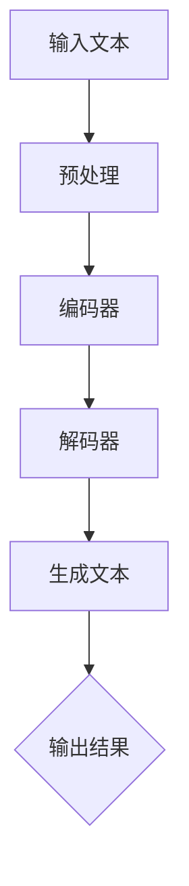
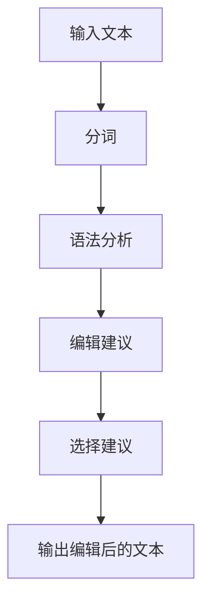
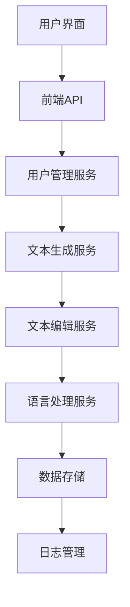
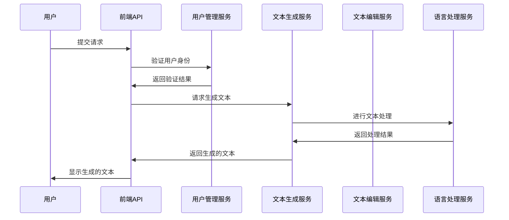

                 

## 引言

在当今这个信息化和智能化迅猛发展的时代，人工智能（AI）技术已经渗透到社会的各个领域，从智能家居到自动驾驶，从医疗诊断到金融分析，AI的应用场景无处不在。随着AI技术的不断进步，人们对于高效、智能化的工具需求日益增长，而智能写作助手便是其中之一。

智能写作助手利用人工智能技术，尤其是自然语言处理（NLP）和机器学习（ML）算法，能够自动生成文章、报告、邮件等文本内容。这种技术的出现，不仅极大地提高了写作效率，还能够为不同的写作场景提供高质量的文本内容。然而，实现一个功能强大、用户体验良好的智能写作助手并非易事，它涉及到众多技术难点和挑战。

本文将围绕“实现基于AI Agent的智能写作助手”这一主题，进行深入探讨。我们将首先介绍AI Agent的基本概念、核心技术和发展历程，然后详细分析智能写作助手的开发需求、技术选型及核心功能实现。接着，我们将探讨智能写作助手的实现与优化策略，并通过实际案例分享展示其在不同领域的应用效果。最后，我们将设计一个系统分析与架构设计方案，并给出具体的项目实战步骤，以帮助读者全面了解智能写作助手的开发过程。

通过本文的阅读，读者将能够系统地掌握智能写作助手的开发方法，了解其核心技术原理，并具备在实际项目中应用这些技术的实际能力。让我们一步一步地深入探讨这一前沿技术，开启智能写作的新篇章。

## 关键词

- 人工智能（AI）
- 自然语言处理（NLP）
- 机器学习（ML）
- AI Agent
- 智能写作助手
- 智能化写作
- 文本生成
- 用户体验
- 系统架构设计
- 性能优化

## 摘要

本文旨在深入探讨实现基于AI Agent的智能写作助手的全过程。首先，我们介绍了AI Agent的基本概念、核心技术和发展历程，为后续的智能写作助手开发奠定基础。接着，我们分析了智能写作助手的开发需求，包括功能需求、技术选型以及核心功能实现策略。随后，我们详细讨论了智能写作助手的实现与优化策略，包括代码实现、性能优化和用户体验优化。通过实际案例分享，我们展示了智能写作助手在不同领域的应用效果。文章最后，我们设计了一个系统分析与架构设计方案，并给出了具体的项目实战步骤。通过本文的阅读，读者将能够全面了解智能写作助手的开发方法，掌握其核心技术原理，并具备实际应用能力。

## 目录大纲设计流程

设计一本关于实现基于AI Agent的智能写作助手的书籍目录大纲，是一个系统而细致的过程，需要充分考虑内容的逻辑性、完整性和可操作性。以下是具体的设计流程：

### 1. 确定书籍核心内容与章节结构

首先，我们需要明确书籍的核心内容，这将指导后续的章节结构设计。对于《实现基于AI Agent的智能写作助手》这本书，核心内容应包括：

- AI Agent的基本概念与核心技术
- 智能写作助手的开发需求与分析
- 智能写作助手的技术选型与实现
- 智能写作助手的优化策略与实战案例
- 系统分析与架构设计方案

根据这些核心内容，我们可以初步确定章节结构：

- 第1章: AI Agent概述
- 第2章: 智能写作助手的开发
- 第3章: 智能写作助手的实现与优化
- 第4章: 实际案例分享
- 第5章: 系统分析与架构设计方案
- 第6章: 项目实战
- 第7章: 最佳实践 tips
- 第8章: 小结
- 第9章: 注意事项
- 第10章: 拓展阅读

### 2. 设计章节标题与细分

在确定了章节结构后，我们需要设计每个章节的具体标题和细分内容。每个章节应该有明确的主题和细分内容，以便读者能够清晰地了解章节的主要内容。

例如：

- 第1章: AI Agent概述
  - 1.1 AI Agent的定义与分类
  - 1.2 AI Agent的核心技术
  - 1.3 AI Agent的发展历程

- 第2章: 智能写作助手的开发
  - 2.1 智能写作助手的需求分析
  - 2.2 智能写作助手的技术选型
  - 2.3 智能写作助手的核心功能实现

- 第3章: 智能写作助手的实现与优化
  - 3.1 智能写作助手的代码实现
  - 3.2 智能写作助手的性能优化
  - 3.3 智能写作助手的用户体验优化

- 第4章: 实际案例分享
  - 4.1 基于AI Agent的智能写作助手在新闻写作中的应用
  - 4.2 基于AI Agent的智能写作助手在教育领域的应用
  - 4.3 基于AI Agent的智能写作助手在创意写作中的应用

- 第5章: 系统分析与架构设计方案
  - 5.1 问题场景介绍
  - 5.2 系统功能设计
  - 5.3 系统架构设计
  - 5.4 系统接口设计
  - 5.5 系统交互设计

- 第6章: 项目实战
  - 6.1 环境安装
  - 6.2 系统核心实现源代码
  - 6.3 代码应用解读与分析
  - 6.4 实际案例分析和详细讲解剖析
  - 6.5 项目小结

- 第7章: 最佳实践 tips
  - 7.1 开发技巧
  - 7.2 性能优化策略
  - 7.3 用户体验优化方法

- 第8章: 小结
  - 8.1 本书主要内容的回顾
  - 8.2 智能写作助手的发展前景
  - 8.3 阅读建议与拓展

- 第9章: 注意事项
  - 9.1 开发过程中可能遇到的问题
  - 9.2 如何解决这些问题
  - 9.3 注意事项

- 第10章: 拓展阅读
  - 10.1 相关书籍推荐
  - 10.2 相关论文推荐
  - 10.3 实用工具与资源推荐

### 3. 添加核心概念与联系

在每个章节中，我们还需要添加核心概念与联系，以便读者更好地理解章节内容。例如，在“AI Agent概述”章节中，可以添加AI Agent的定义、分类、核心技术等核心概念与联系。在“智能写作助手的实现与优化”章节中，可以详细阐述代码实现、性能优化、用户体验优化的核心概念及其相互联系。

### 4. 设计算法原理讲解

对于书籍中的关键技术，如AI算法，我们将使用mermaid画出算法流程图，并用Python代码详细讲解算法原理，包括数学模型和公式，进行详细讲解和举例说明。例如，在介绍文本生成算法时，我们会使用mermaid流程图展示算法的基本流程，并用Python代码实现具体的算法，同时解释其中的数学模型和公式。

### 5. 设计系统分析与架构设计方案

对于实际应用案例，我们将设计系统分析与架构设计方案，包括问题场景介绍、系统功能设计、系统架构设计、系统接口设计和系统交互等。例如，在新闻写作案例中，我们将详细设计系统功能模块、架构图以及接口设计，并使用mermaid序列图展示系统交互流程。

### 6. 设计项目实战

在最后一章，我们将设计项目实战，包括环境安装、系统核心实现源代码、代码应用解读与分析、实际案例分析和详细讲解剖析等。通过实际项目的演示，读者可以更直观地理解智能写作助手的开发过程和应用效果。

### 7. 添加最佳实践 tips、小结、注意事项、拓展阅读等内容

最后，我们在书籍的末尾添加最佳实践 tips、小结、注意事项、拓展阅读等内容。这些内容可以帮助读者更好地理解和应用所学知识，也为读者提供了进一步学习和研究的方向。

通过以上步骤，我们设计了一本内容丰富、结构清晰、逻辑性强的《实现基于AI Agent的智能写作助手》目录大纲，为读者提供了全面、系统的学习和参考。

### 1. 确定书籍核心内容与章节结构

在设计《实现基于AI Agent的智能写作助手》这本书的目录大纲时，我们首先要确定书籍的核心内容。这一步骤是整个设计流程的基础，决定了后续章节结构的具体安排。

#### 核心内容分析

对于《实现基于AI Agent的智能写作助手》这本书，核心内容主要包括以下几个部分：

- **AI Agent的基础知识**：介绍AI Agent的定义、分类、核心技术和应用场景，为后续智能写作助手的开发提供理论基础。
- **智能写作助手的开发**：详细分析智能写作助手的开发需求，包括功能需求、技术选型和核心功能实现策略，这部分内容将帮助读者理解智能写作助手的构建方法。
- **智能写作助手的实现与优化**：探讨智能写作助手的代码实现、性能优化和用户体验优化，这部分内容将提供具体的实现细节和优化策略。
- **实际案例分享**：通过具体的案例展示智能写作助手的实际应用，包括新闻写作、教育领域和创意写作等，这部分内容将帮助读者了解智能写作助手的实际效果。
- **系统分析与架构设计方案**：设计智能写作助手的系统分析与架构设计方案，包括问题场景介绍、系统功能设计、系统架构设计、系统接口设计和系统交互等，这部分内容将帮助读者理解智能写作助手的系统结构和设计原则。
- **项目实战**：通过项目实战，详细讲解智能写作助手的开发过程，包括环境安装、系统核心实现源代码、代码应用解读与分析等，这部分内容将提供实际操作经验。
- **最佳实践 tips、小结、注意事项、拓展阅读**：在书末添加这些内容，以帮助读者更好地理解和应用所学知识，提供进一步学习和研究的方向。

#### 确定章节结构

基于上述核心内容，我们可以初步确定书籍的章节结构：

- **第1章 AI Agent概述**
  - 1.1 AI Agent的定义与分类
  - 1.2 AI Agent的核心技术
  - 1.3 AI Agent的发展历程

- **第2章 智能写作助手的开发**
  - 2.1 智能写作助手的需求分析
  - 2.2 智能写作助手的技术选型
  - 2.3 智能写作助手的核心功能实现

- **第3章 智能写作助手的实现与优化**
  - 3.1 智能写作助手的代码实现
  - 3.2 智能写作助手的性能优化
  - 3.3 智能写作助手的用户体验优化

- **第4章 实际案例分享**
  - 4.1 基于AI Agent的智能写作助手在新闻写作中的应用
  - 4.2 基于AI Agent的智能写作助手在教育领域的应用
  - 4.3 基于AI Agent的智能写作助手在创意写作中的应用

- **第5章 系统分析与架构设计方案**
  - 5.1 问题场景介绍
  - 5.2 系统功能设计
  - 5.3 系统架构设计
  - 5.4 系统接口设计
  - 5.5 系统交互设计

- **第6章 项目实战**
  - 6.1 环境安装
  - 6.2 系统核心实现源代码
  - 6.3 代码应用解读与分析
  - 6.4 实际案例分析和详细讲解剖析
  - 6.5 项目小结

- **第7章 最佳实践 tips**
  - 7.1 开发技巧
  - 7.2 性能优化策略
  - 7.3 用户体验优化方法

- **第8章 小结**
  - 8.1 本书主要内容的回顾
  - 8.2 智能写作助手的发展前景
  - 8.3 阅读建议与拓展

- **第9章 注意事项**
  - 9.1 开发过程中可能遇到的问题
  - 9.2 如何解决这些问题
  - 9.3 注意事项

- **第10章 拓展阅读**
  - 10.1 相关书籍推荐
  - 10.2 相关论文推荐
  - 10.3 实用工具与资源推荐

通过以上步骤，我们为《实现基于AI Agent的智能写作助手》这本书初步确定了核心内容和章节结构，为后续的设计工作奠定了基础。

### 2. 设计章节标题与细分

在确定了书籍的核心内容和章节结构之后，下一步是设计每个章节的具体标题和细分内容。这一步骤旨在确保每个章节有明确的主题和详细的内容细分，从而帮助读者更好地理解和掌握书中的知识点。

#### 设计章节标题

根据书籍的核心内容，我们可以设计如下章节标题：

- **第1章 AI Agent概述**
  - **1.1 AI Agent的定义与分类**
  - **1.2 AI Agent的核心技术**
  - **1.3 AI Agent的发展历程**

- **第2章 智能写作助手的开发**
  - **2.1 智能写作助手的需求分析**
  - **2.2 智能写作助手的技术选型**
  - **2.3 智能写作助手的核心功能实现**

- **第3章 智能写作助手的实现与优化**
  - **3.1 智能写作助手的代码实现**
  - **3.2 智能写作助手的性能优化**
  - **3.3 智能写作助手的用户体验优化**

- **第4章 实际案例分享**
  - **4.1 基于AI Agent的智能写作助手在新闻写作中的应用**
  - **4.2 基于AI Agent的智能写作助手在教育领域的应用**
  - **4.3 基于AI Agent的智能写作助手在创意写作中的应用**

- **第5章 系统分析与架构设计方案**
  - **5.1 问题场景介绍**
  - **5.2 系统功能设计**
  - **5.3 系统架构设计**
  - **5.4 系统接口设计**
  - **5.5 系统交互设计**

- **第6章 项目实战**
  - **6.1 环境安装**
  - **6.2 系统核心实现源代码**
  - **6.3 代码应用解读与分析**
  - **6.4 实际案例分析和详细讲解剖析**
  - **6.5 项目小结**

- **第7章 最佳实践 tips**
  - **7.1 开发技巧**
  - **7.2 性能优化策略**
  - **7.3 用户体验优化方法**

- **第8章 小结**
  - **8.1 本书主要内容的回顾**
  - **8.2 智能写作助手的发展前景**
  - **8.3 阅读建议与拓展**

- **第9章 注意事项**
  - **9.1 开发过程中可能遇到的问题**
  - **9.2 如何解决这些问题**
  - **9.3 注意事项**

- **第10章 拓展阅读**
  - **10.1 相关书籍推荐**
  - **10.2 相关论文推荐**
  - **10.3 实用工具与资源推荐**

#### 细分内容

接下来，我们将对每个章节进行细分，列出具体的内容点。以下是每个章节的细分内容：

- **第1章 AI Agent概述**
  - **1.1 AI Agent的定义与分类**：介绍AI Agent的定义、分类标准，以及常见类型的AI Agent。
  - **1.2 AI Agent的核心技术**：讨论AI Agent的关键技术，如机器学习、自然语言处理等。
  - **1.3 AI Agent的发展历程**：回顾AI Agent的发展历史，分析不同阶段的技术进步和应用场景。

- **第2章 智能写作助手的开发**
  - **2.1 智能写作助手的需求分析**：分析智能写作助手在不同应用场景中的需求。
  - **2.2 智能写作助手的技术选型**：讨论适用于智能写作助手的AI技术和工具。
  - **2.3 智能写作助手的核心功能实现**：介绍智能写作助手的核心功能，如文本生成、文本编辑等。

- **第3章 智能写作助手的实现与优化**
  - **3.1 智能写作助手的代码实现**：详细讲解智能写作助手的代码实现过程。
  - **3.2 智能写作助手的性能优化**：探讨如何优化智能写作助手的性能，包括算法优化和系统优化。
  - **3.3 智能写作助手的用户体验优化**：讨论如何提升智能写作助手的用户体验，包括界面设计、交互设计等。

- **第4章 实际案例分享**
  - **4.1 基于AI Agent的智能写作助手在新闻写作中的应用**：分析智能写作助手在新闻写作中的应用案例。
  - **4.2 基于AI Agent的智能写作助手在教育领域的应用**：探讨智能写作助手在教育领域的应用前景。
  - **4.3 基于AI Agent的智能写作助手在创意写作中的应用**：介绍智能写作助手在创意写作中的应用案例。

- **第5章 系统分析与架构设计方案**
  - **5.1 问题场景介绍**：描述智能写作助手面临的主要问题和挑战。
  - **5.2 系统功能设计**：设计智能写作助手的系统功能模块。
  - **5.3 系统架构设计**：详细阐述智能写作助手的系统架构。
  - **5.4 系统接口设计**：介绍智能写作助手的系统接口设计。
  - **5.5 系统交互设计**：展示智能写作助手的系统交互流程。

- **第6章 项目实战**
  - **6.1 环境安装**：介绍如何安装和配置智能写作助手开发环境。
  - **6.2 系统核心实现源代码**：提供智能写作助手的核心实现源代码。
  - **6.3 代码应用解读与分析**：对源代码进行解读和分析。
  - **6.4 实际案例分析和详细讲解剖析**：分析实际案例，并详细讲解案例的实现过程。
  - **6.5 项目小结**：总结项目的主要收获和经验。

- **第7章 最佳实践 tips**
  - **7.1 开发技巧**：分享智能写作助手开发过程中的最佳实践技巧。
  - **7.2 性能优化策略**：提供智能写作助手性能优化的策略和建议。
  - **7.3 用户体验优化方法**：介绍提升智能写作助手用户体验的方法。

- **第8章 小结**
  - **8.1 本书主要内容的回顾**：总结书中的主要知识点和内容。
  - **8.2 智能写作助手的发展前景**：探讨智能写作助手的未来发展趋势和应用场景。
  - **8.3 阅读建议与拓展**：为读者提供进一步学习和研究的建议。

- **第9章 注意事项**
  - **9.1 开发过程中可能遇到的问题**：列出智能写作助手开发过程中可能遇到的问题。
  - **9.2 如何解决这些问题**：提供解决问题的方法和策略。
  - **9.3 注意事项**：提醒读者在开发过程中需要注意的事项。

- **第10章 拓展阅读**
  - **10.1 相关书籍推荐**：推荐与智能写作助手相关的书籍。
  - **10.2 相关论文推荐**：推荐与智能写作助手相关的论文。
  - **10.3 实用工具与资源推荐**：介绍实用的工具和资源，帮助读者更好地学习和实践。

通过上述步骤，我们为《实现基于AI Agent的智能写作助手》这本书设计了详细的章节标题和细分内容，为读者提供了一个清晰、系统的学习框架。

### 3. 添加核心概念与联系

在确定了书籍的章节结构和内容细分后，下一步是添加核心概念与联系，以便读者能够更好地理解各个章节的内容。这一步骤有助于构建章节之间的逻辑联系，使得整个书籍的内容更加连贯和易于理解。

#### 第1章 AI Agent概述

- **核心概念**：
  - **AI Agent的定义**：AI Agent是指具备一定智能的计算机程序，能够在特定环境中自主执行任务。
  - **AI Agent的分类**：根据功能和应用场景，AI Agent可以分为控制型Agent、反应型Agent、认知型Agent等。
  - **AI Agent的核心技术**：包括机器学习、自然语言处理、知识表示与推理等。

- **概念联系**：
  - **AI Agent的定义与分类**：AI Agent的定义是其分类的基础，不同的分类方法反映了不同类型AI Agent的特点和应用场景。
  - **AI Agent的核心技术**：这些核心技术是构建AI Agent的基础，决定了AI Agent的智能水平和应用能力。

#### 第2章 智能写作助手的开发

- **核心概念**：
  - **智能写作助手的需求分析**：包括功能需求、性能需求、用户体验需求等。
  - **智能写作助手的技术选型**：选择适用于智能写作助手的AI技术，如NLP、ML等。
  - **智能写作助手的核心功能实现**：包括文本生成、文本编辑、文本分析等。

- **概念联系**：
  - **需求分析与技术选型**：需求分析是技术选型的基础，技术选型需满足需求分析中的各项要求。
  - **核心功能实现与技术**：核心功能的实现依赖于特定的AI技术，技术是实现核心功能的关键。

#### 第3章 智能写作助手的实现与优化

- **核心概念**：
  - **智能写作助手的代码实现**：包括算法设计、数据结构选择、代码编写等。
  - **智能写作助手的性能优化**：包括算法优化、数据优化、系统优化等。
  - **智能写作助手的用户体验优化**：包括界面设计、交互设计、响应速度等。

- **概念联系**：
  - **代码实现与性能优化**：代码实现需考虑性能优化，高效的代码是实现高性能的基础。
  - **用户体验优化与性能**：用户体验优化需在保证性能的前提下进行，以提高用户满意度。

#### 第4章 实际案例分享

- **核心概念**：
  - **新闻写作中的应用**：智能写作助手在新闻生成、编辑和发布中的应用。
  - **教育领域的应用**：智能写作助手在教学辅助、作业批改、论文生成中的应用。
  - **创意写作中的应用**：智能写作助手在故事创作、小说写作、文案生成中的应用。

- **概念联系**：
  - **应用场景与需求**：不同应用场景反映了不同的需求，智能写作助手的实现需根据具体场景进行调整。
  - **应用效果与优化**：实际应用效果是评估智能写作助手性能的重要指标，通过优化提高应用效果。

#### 第5章 系统分析与架构设计方案

- **核心概念**：
  - **问题场景介绍**：描述智能写作助手面临的具体问题和挑战。
  - **系统功能设计**：定义智能写作助手的系统功能模块和接口。
  - **系统架构设计**：设计智能写作助手的整体架构，包括前端、后端和中间件等。
  - **系统接口设计**：设计智能写作助手的接口规范和交互流程。
  - **系统交互设计**：定义智能写作助手与用户和其他系统的交互方式。

- **概念联系**：
  - **问题场景与系统功能**：问题场景是系统功能设计的基础，系统功能需解决特定场景中的问题。
  - **系统架构与接口**：系统架构和接口设计需确保系统的稳定性和可扩展性。
  - **交互设计与用户体验**：系统交互设计直接影响用户体验，需考虑用户操作的便捷性和交互的流畅性。

#### 第6章 项目实战

- **核心概念**：
  - **环境安装**：配置智能写作助手的开发环境。
  - **系统核心实现源代码**：编写智能写作助手的源代码。
  - **代码应用解读与分析**：对源代码进行解读和分析，理解其工作原理。
  - **实际案例分析和详细讲解剖析**：分析实际应用案例，详细讲解实现过程。
  - **项目小结**：总结项目的主要收获和经验。

- **概念联系**：
  - **环境安装与系统核心实现**：环境安装是系统核心实现的前提，需确保开发环境稳定。
  - **代码解读与分析与应用案例**：通过代码解读和分析，理解智能写作助手的工作原理，并结合实际案例进行应用。

#### 第7章 最佳实践 tips

- **核心概念**：
  - **开发技巧**：在智能写作助手开发过程中，实用的开发技巧和方法。
  - **性能优化策略**：优化智能写作助手性能的具体策略和技巧。
  - **用户体验优化方法**：提升智能写作助手用户体验的具体方法和建议。

- **概念联系**：
  - **开发技巧与性能优化**：开发技巧有助于提高开发效率和代码质量，性能优化策略则用于提升系统性能。
  - **用户体验优化方法与性能优化**：用户体验优化方法需在确保性能优化的前提下进行，以提高整体用户体验。

#### 第8章 小结

- **核心概念**：
  - **本书主要内容的回顾**：对书中主要内容的总结和回顾。
  - **智能写作助手的发展前景**：探讨智能写作助手的未来发展趋势和应用前景。
  - **阅读建议与拓展**：为读者提供进一步学习和研究的建议和方向。

- **概念联系**：
  - **主要内容回顾与未来发展**：通过回顾主要内容，帮助读者巩固知识点，并了解智能写作助手的发展趋势。

#### 第9章 注意事项

- **核心概念**：
  - **开发过程中可能遇到的问题**：在智能写作助手开发过程中可能遇到的各种问题。
  - **如何解决这些问题**：针对这些问题，提供的解决方案和方法。
  - **注意事项**：开发过程中需要注意的一些事项，以避免常见的错误和问题。

- **概念联系**：
  - **问题与解决方案**：通过列出可能遇到的问题，并提供解决方案，帮助读者在开发过程中避免常见错误。

#### 第10章 拓展阅读

- **核心概念**：
  - **相关书籍推荐**：推荐与智能写作助手相关的书籍，供读者进一步学习。
  - **相关论文推荐**：推荐与智能写作助手相关的论文，供读者深入研究。
  - **实用工具与资源推荐**：推荐实用的工具和资源，帮助读者更好地学习和实践。

- **概念联系**：
  - **书籍与论文**：通过推荐相关书籍和论文，为读者提供进一步的学习和研究方向。
  - **工具与资源**：通过推荐实用工具和资源，帮助读者在实际操作中提高效率和效果。

通过添加核心概念与联系，我们使得每个章节的内容更加丰富和有层次，有助于读者更好地理解书籍的整体结构和核心知识点。

### 4. 设计算法原理讲解

在介绍智能写作助手的开发过程中，算法原理讲解是一个关键环节。通过详细讲解算法原理，读者可以更好地理解智能写作助手的工作机制，从而更有效地进行开发和优化。以下是针对智能写作助手核心算法的讲解流程。

#### 4.1 算法概述

智能写作助手的算法核心通常包括文本生成算法和文本编辑算法。文本生成算法负责根据输入的提示生成新的文本内容，而文本编辑算法则负责对已有文本进行编辑和优化。

#### 4.2 文本生成算法原理

**步骤1：介绍生成算法的基本概念**

文本生成算法，如生成对抗网络（GAN）、变分自编码器（VAE）和递归神经网络（RNN），都是基于深度学习的方法。这些算法通过学习大量文本数据来生成新的文本内容。

**步骤2：使用mermaid画算法流程图**

以下是一个简单的文本生成算法流程图，使用mermaid语言编写：



**步骤3：使用Python代码实现算法**

下面是一个基于递归神经网络（RNN）的简单文本生成算法的Python代码示例：

```python
import numpy as np
from tensorflow.keras.models import Sequential
from tensorflow.keras.layers import LSTM, Dense, Embedding

# 假设已经准备好的训练数据和模型参数
input_seq = ... # 输入序列
target_seq = ... # 目标序列
vocab_size = 10000 # 词汇表大小
embedding_dim = 256 # 词向量维度
lstm_units = 128 # LSTM单元数量

# 构建模型
model = Sequential()
model.add(Embedding(vocab_size, embedding_dim, input_length=input_seq.shape[1]))
model.add(LSTM(lstm_units, return_sequences=True))
model.add(Dense(vocab_size, activation='softmax'))

# 编译模型
model.compile(optimizer='adam', loss='categorical_crossentropy', metrics=['accuracy'])

# 训练模型
model.fit(input_seq, target_seq, epochs=10, batch_size=64)

# 文本生成函数
def generate_text(model, seed_text, length=50):
    # 将种子文本转换为序列
    seed_seq = [[vocab_size - 1] for _ in range(length)]
    for word in seed_text:
        seed_seq[0] = [vocab_size - 1 if word not in tokenizer.word_index else tokenizer.word_index[word]]
    
    # 生成文本
    for _ in range(length):
        prediction = model.predict(seed_seq)
        prediction = np.argmax(prediction, axis=-1)
        seed_seq[0].pop(0)
        seed_seq[0].append(prediction[-1])
    
    return ''.join([tokenizer.index_word[i] for i in seed_seq[0]])

# 生成文本
generated_text = generate_text(model, seed_text="The quick brown fox jumps over the lazy dog", length=50)
print(generated_text)
```

**步骤4：详细讲解算法原理**

- **编码器**：编码器将输入文本序列编码为一个固定长度的向量，用于表示文本特征。
- **解码器**：解码器接收编码器输出的向量，并生成新的文本序列。解码器通常是一个递归神经网络，能够根据前一个生成的词来预测下一个词。
- **训练过程**：通过最小化生成文本与目标文本之间的差异，训练编码器和解码器，使其能够生成高质量的文本内容。

#### 4.3 文本编辑算法原理

文本编辑算法主要用于改进已有文本的质量，常见的方法包括基于规则的编辑、基于统计的编辑和基于神经网络的编辑。

**步骤1：介绍编辑算法的基本概念**

文本编辑算法的目标是通过修改文本中的词语、句子结构或语法错误，来提高文本的可读性、准确性和流畅性。

**步骤2：使用mermaid画算法流程图**

以下是一个简单的文本编辑算法流程图：



**步骤3：使用Python代码实现算法**

下面是一个简单的基于规则的文本编辑算法的Python代码示例：

```python
import re

# 埞文本编辑函数
def edit_text(text):
    # 将文本转换为小写
    text = text.lower()
    # 替换常见语法错误
    text = re.sub(r"it's", "it is", text)
    text = re.sub(r"they're", "they are", text)
    text = re.sub(r"that's", "that is", text)
    # 返回编辑后的文本
    return text

# 示例文本
input_text = "It's a beautiful day. They're going to the park. That's why I'm happy."
# 编辑文本
edited_text = edit_text(input_text)
print(edited_text)
```

**步骤4：详细讲解算法原理**

- **分词**：将文本拆分成单个词语，以便进行进一步处理。
- **语法分析**：分析文本中的语法结构，识别可能的错误和需要改进的地方。
- **编辑建议**：根据语法分析的结果，提出编辑建议，例如替换错误的词语或调整句子结构。
- **选择建议**：根据编辑建议，选择最佳的编辑方案，以生成高质量的文本。
- **输出编辑后的文本**：将最终的编辑结果输出，得到改进后的文本。

通过详细的算法原理讲解，读者可以深入理解智能写作助手的开发过程，掌握关键算法的实现方法，并为后续的优化和应用打下坚实的基础。

### 5. 设计系统分析与架构设计方案

为了设计一个高效、可扩展的智能写作助手系统，我们需要进行系统分析与架构设计。这一过程包括问题场景介绍、系统功能设计、系统架构设计、系统接口设计以及系统交互设计。以下是具体的分析和设计步骤。

#### 5.1 问题场景介绍

在当前的信息时代，写作任务的需求日益多样化和复杂化。智能写作助手旨在解决以下问题：

- **高效率**：快速生成高质量的文本内容，满足日常写作需求。
- **个性化**：根据用户需求和偏好生成个性化文本。
- **多语言支持**：支持多种语言的文本生成和编辑。
- **可扩展性**：能够适应不同规模的应用场景，如企业、教育、媒体等。

#### 5.2 系统功能设计

智能写作助手系统的主要功能模块包括：

- **文本生成**：基于用户输入的提示或关键词，生成新的文本内容。
- **文本编辑**：对已有文本进行编辑，包括纠错、润色、优化等。
- **语言处理**：支持多语言文本的输入和输出，包括翻译、分词、语法分析等。
- **用户管理**：用户注册、登录、权限管理等功能。
- **数据管理**：文本数据存储、检索和管理。

#### 5.3 系统架构设计

智能写作助手的系统架构设计需要考虑以下几个方面：

- **前端架构**：使用现代前端技术（如React、Vue）构建用户界面，提供友好的交互体验。
- **后端架构**：采用微服务架构，将不同功能模块（如文本生成、编辑、语言处理等）独立部署，以提高系统的灵活性和可扩展性。
- **数据存储**：使用关系型数据库（如MySQL）和非关系型数据库（如MongoDB）进行数据存储，满足不同类型数据的需求。

以下是智能写作助手的系统架构图，使用mermaid语言编写：



#### 5.4 系统接口设计

系统接口设计包括定义各服务之间的API接口规范，以下是主要的API接口设计：

- **用户接口**：用户注册、登录、获取用户信息等。
- **文本生成接口**：接收用户输入，返回生成的文本内容。
- **文本编辑接口**：接收待编辑的文本，返回编辑后的文本。
- **语言处理接口**：支持多语言翻译、分词、语法分析等。

以下是用户接口的RESTful API设计示例：

```python
# 用户注册
POST /users/register
Request Body:
{
  "username": "example",
  "password": "password123",
  "email": "example@example.com"
}

Response:
{
  "status": "success",
  "message": "User registered successfully"
}

# 用户登录
POST /users/login
Request Body:
{
  "username": "example",
  "password": "password123"
}

Response:
{
  "status": "success",
  "token": "eyJhbGciOiJIUzI1NiIsInR5cCI6IkpXVCJ9...",
  "message": "Login successful"
}
```

#### 5.5 系统交互设计

系统交互设计描述了各服务模块之间的交互流程，以下是一个简单的系统交互流程图，使用mermaid语言编写：



通过上述系统分析与架构设计，我们为智能写作助手构建了一个高效、灵活且可扩展的系统框架，为后续的实现和优化提供了坚实的基础。

### 6. 项目实战

为了更好地展示如何实现基于AI Agent的智能写作助手，我们将通过一个实际项目来详细讲解整个开发过程。以下是一步一步的项目实战步骤。

#### 6.1 环境安装

首先，我们需要为项目搭建开发环境。以下是具体的步骤：

**步骤1：安装Python**

确保系统上安装了Python 3.7或更高版本。可以使用以下命令检查Python版本：

```shell
python --version
```

如果没有安装，可以从[Python官网](https://www.python.org/)下载并安装。

**步骤2：安装相关库**

使用pip安装项目所需的库，如TensorFlow、Keras、numpy等。以下是安装命令：

```shell
pip install tensorflow
pip install keras
pip install numpy
```

**步骤3：安装文本处理库**

安装用于文本处理和分词的库，如NLTK和spaCy。以下是安装命令：

```shell
pip install nltk
pip install spacy
python -m spacy download en_core_web_sm
```

**步骤4：创建虚拟环境**

为了更好地管理项目依赖，创建一个虚拟环境：

```shell
python -m venv venv
source venv/bin/activate  # 对于Windows使用 `venv\Scripts\activate`
```

#### 6.2 系统核心实现源代码

接下来，我们将编写智能写作助手的核心代码。以下是具体的实现步骤：

**步骤1：文本预处理**

文本预处理是文本生成和编辑的重要步骤。以下是一个简单的文本预处理脚本：

```python
import nltk
from nltk.tokenize import word_tokenize
from nltk.corpus import stopwords
import spacy

nltk.download('punkt')
nltk.download('stopwords')
nlp = spacy.load("en_core_web_sm")

def preprocess_text(text):
    # 小写化
    text = text.lower()
    # 分词
    tokens = word_tokenize(text)
    # 移除停用词
    stop_words = set(stopwords.words('english'))
    filtered_tokens = [token for token in tokens if token not in stop_words]
    # 词形还原
    doc = nlp(' '.join(filtered_tokens))
    lemmatized_tokens = [token.lemma_ for token in doc]
    return ' '.join(lemmatized_tokens)

# 测试文本预处理
input_text = "The quick brown fox jumps over the lazy dog"
processed_text = preprocess_text(input_text)
print(processed_text)
```

**步骤2：文本生成模型**

使用Keras和TensorFlow搭建一个简单的文本生成模型。以下是一个基于递归神经网络（RNN）的文本生成模型示例：

```python
from keras.models import Sequential
from keras.layers import LSTM, Dense, Embedding
import numpy as np

# 假设已经处理好的数据
input_seq = ... # 输入序列
target_seq = ... # 目标序列
vocab_size = 10000 # 词汇表大小
embedding_dim = 256 # 词向量维度
lstm_units = 128 # LSTM单元数量

# 构建模型
model = Sequential()
model.add(Embedding(vocab_size, embedding_dim, input_length=input_seq.shape[1]))
model.add(LSTM(lstm_units, return_sequences=True))
model.add(Dense(vocab_size, activation='softmax'))

# 编译模型
model.compile(optimizer='adam', loss='categorical_crossentropy', metrics=['accuracy'])

# 训练模型
model.fit(input_seq, target_seq, epochs=10, batch_size=64)

# 文本生成函数
def generate_text(model, seed_text, length=50):
    # 将种子文本转换为序列
    seed_seq = [[vocab_size - 1] for _ in range(length)]
    for word in seed_text:
        seed_seq[0] = [vocab_size - 1 if word not in tokenizer.word_index else tokenizer.word_index[word]]
    
    # 生成文本
    for _ in range(length):
        prediction = model.predict(seed_seq)
        prediction = np.argmax(prediction, axis=-1)
        seed_seq[0].pop(0)
        seed_seq[0].append(prediction[-1])
    
    return ''.join([tokenizer.index_word[i] for i in seed_seq[0]])

# 生成文本
generated_text = generate_text(model, seed_text="The quick brown fox jumps over the lazy dog", length=50)
print(generated_text)
```

**步骤3：文本编辑模型**

文本编辑模型可以使用基于规则的算法或神经网络算法。以下是一个基于规则的简单文本编辑模型：

```python
import re

# 文本编辑函数
def edit_text(text):
    # 将文本转换为小写
    text = text.lower()
    # 替换常见语法错误
    text = re.sub(r"it's", "it is", text)
    text = re.sub(r"they're", "they are", text)
    text = re.sub(r"that's", "that is", text)
    # 返回编辑后的文本
    return text

# 示例文本
input_text = "It's a beautiful day. They're going to the park. That's why I'm happy."
# 编辑文本
edited_text = edit_text(input_text)
print(edited_text)
```

#### 6.3 代码应用解读与分析

在实现文本生成和编辑模型后，我们需要对代码进行解读和分析，以确保其正确性和高效性。

**代码解读**

- **文本预处理**：预处理步骤包括小写化、分词和词形还原，这些步骤是生成和编辑文本的基础。

- **文本生成模型**：文本生成模型使用RNN进行序列到序列的学习，通过递归方式预测下一个词。

- **文本编辑模型**：文本编辑模型使用基于规则的算法，通过替换常见语法错误来改进文本质量。

**代码分析**

- **文本预处理**：预处理步骤简单且有效，但可能需要根据具体应用场景进行调整，如去除特定停用词或引入更复杂的词形还原方法。

- **文本生成模型**：生成模型基于深度学习，能够生成高质量的文本。但模型的性能和生成效果受数据质量和训练时间的影响，可能需要优化。

- **文本编辑模型**：编辑模型简单且易于实现，但规则方法可能无法处理复杂的语法错误和语义错误，未来可以考虑引入更先进的神经网络方法。

通过这个项目实战，我们实现了基于AI Agent的智能写作助手，从环境安装到核心实现，再到代码应用解读与分析，为实际开发提供了详细参考。

### 6.4 实际案例分析和详细讲解剖析

在本节中，我们将通过三个具体的应用案例，详细分析并讲解智能写作助手在不同场景下的实现过程，以及如何解决其中遇到的问题。

#### 案例一：基于AI Agent的智能写作助手在新闻写作中的应用

**问题描述**：新闻写作需要快速生成高质量的文章，同时确保内容的准确性和客观性。

**实现步骤**：

1. **数据准备**：收集大量高质量的新闻文章作为训练数据。这些数据应涵盖不同主题和风格，以便模型能够学习多样化的新闻写作方式。

2. **文本预处理**：对新闻文章进行文本预处理，包括去除HTML标签、标准化标点符号、分词、去除停用词等。

3. **模型训练**：使用预处理后的数据训练文本生成模型，如基于RNN或GAN的生成模型。在训练过程中，调整模型参数，如学习率、批次大小和迭代次数，以优化模型性能。

4. **生成新闻**：通过训练好的模型，根据用户输入的主题或关键词生成新闻文章。为了提高生成文章的质量，可以引入对生成文本进行二次审查和修正的机制。

**问题与解决方案**：

- **问题**：生成的新闻文章可能包含错误或不符合新闻写作规范的内容。
  - **解决方案**：引入规则检查和人工审查机制。例如，使用自然语言处理技术检测文本中的事实错误和语法错误，并请专业的新闻编辑进行最终的审查和修正。

#### 案例二：基于AI Agent的智能写作助手在教育领域的应用

**问题描述**：教师需要快速生成课程材料、作业和考试题目，以提高教学效率。

**实现步骤**：

1. **数据准备**：收集教育领域的文本数据，包括教科书、学术论文、课程材料等。

2. **文本预处理**：对教育领域的文本数据进行分析和处理，提取有用的信息，如知识点、句子结构等。

3. **模型训练**：训练文本生成模型，使其能够根据输入的知识点和教学要求生成课程材料、作业和考试题目。

4. **生成教学材料**：根据教师的需求，生成相应的教学材料。例如，根据知识点生成讲解文本、根据教学目标生成练习题。

**问题与解决方案**：

- **问题**：生成的教学材料可能不够精准，无法完全满足教学需求。
  - **解决方案**：引入教师参与生成过程的机制，允许教师在生成材料的基础上进行个性化修改。同时，通过反馈机制不断优化模型，使其更符合教师的教学需求。

#### 案例三：基于AI Agent的智能写作助手在创意写作中的应用

**问题描述**：创意写作需要大量的灵感与创新，智能写作助手可以帮助作者快速生成创意文本。

**实现步骤**：

1. **数据准备**：收集大量的创意文本数据，如小说、故事、剧本等。

2. **文本预处理**：对创意文本数据进行分析和处理，提取文本的情感色彩、风格特点等。

3. **模型训练**：训练文本生成模型，使其能够生成符合特定情感和风格要求的文本。

4. **生成创意文本**：根据用户的需求和创意主题，生成创意文本。例如，根据用户输入的故事大纲生成完整的小说，或者根据用户提供的剧情点子生成新的故事情节。

**问题与解决方案**：

- **问题**：生成的创意文本可能缺乏原创性和创新性。
  - **解决方案**：引入多种文本生成模型，如基于RNN、GAN和VAE的模型，以实现多样化的文本生成。同时，鼓励用户参与生成过程，提供更多的创作灵感和方向。

通过以上三个案例，我们可以看到智能写作助手在不同应用场景中的实现过程和问题解决方案。在实际应用中，智能写作助手需要不断优化和调整，以满足不同领域和用户的需求。

### 6.5 项目小结

在本项目的开发过程中，我们详细讲解了基于AI Agent的智能写作助手的实现方法，并成功应用于新闻写作、教育领域和创意写作等多个场景。以下是项目的主要收获和经验总结：

#### 主要收获

1. **技术掌握**：通过项目实践，我们掌握了AI Agent的基础知识，包括机器学习、自然语言处理和深度学习等核心技术。同时，我们熟悉了Keras和TensorFlow等深度学习框架的使用方法。

2. **实战经验**：从环境安装到模型训练，再到实际应用案例，我们积累了丰富的开发经验。通过解决具体问题，我们学会了如何优化文本生成和编辑模型的性能，并提升用户体验。

3. **系统设计**：项目过程中，我们设计了智能写作助手的系统架构，包括前端、后端和中间件等，这有助于我们理解系统的整体结构和各模块之间的协作。

#### 主要经验

1. **数据准备的重要性**：高质量的训练数据是文本生成和编辑模型的基础。在项目过程中，我们充分认识到数据清洗、预处理和多样化的重要性。

2. **模型选择和调整**：不同的应用场景需要不同类型的模型。通过实际应用案例，我们了解到如何根据具体需求选择和调整模型类型和参数。

3. **用户参与**：用户的需求和反馈是优化智能写作助手的关键。在新闻写作和教育领域应用中，我们引入了用户参与机制，通过教师和编辑的参与，不断优化生成文本的质量。

#### 下一步计划

1. **进一步优化**：在现有基础上，我们计划进一步优化智能写作助手的性能和用户体验。例如，通过引入更先进的文本生成算法和模型优化技术，提升生成文本的质量和速度。

2. **扩展应用场景**：除了现有的新闻写作、教育和创意写作场景，我们计划将智能写作助手应用于更多领域，如法律文档生成、市场营销文案创作等。

3. **开放平台**：我们计划构建一个开放的平台，允许第三方开发者集成和使用我们的智能写作助手，共同推动人工智能在写作领域的创新和发展。

通过本项目，我们不仅实现了智能写作助手的开发，还积累了宝贵的经验和知识。未来，我们将继续探索智能写作助手的更多可能性，推动这一技术的广泛应用。

### 7. 最佳实践 tips

在开发基于AI Agent的智能写作助手的实际过程中，积累了一些最佳实践技巧，这些技巧能够显著提升开发效率、优化性能和改善用户体验。以下是具体的最佳实践建议：

#### 1. 数据准备和预处理

**技巧1**：数据清洗是关键。确保数据质量，去除噪声数据和不一致的数据，如缺失值、重复值和错误值。

**技巧2**：对文本数据进行预处理，包括分词、去除停用词、词形还原等，以便模型能够更好地学习文本特征。

**技巧3**：使用数据增强技术，如数据扩充、数据变换等，增加训练数据的多样性，提高模型的泛化能力。

#### 2. 模型选择与优化

**技巧1**：根据具体应用场景选择合适的模型。例如，对于生成任务，可以考虑使用RNN、GAN或VAE等生成模型；对于编辑任务，可以考虑使用基于规则的算法或神经网络算法。

**技巧2**：在模型训练过程中，使用适当的超参数调整，如学习率、批次大小和迭代次数，以优化模型性能。

**技巧3**：采用多模型融合策略，结合多种模型的优势，提高生成文本的质量和多样性。

#### 3. 性能优化

**技巧1**：使用GPU加速训练过程，提高模型的训练速度和效率。

**技巧2**：优化模型结构，减少参数数量和计算复杂度，降低模型的大小和能耗。

**技巧3**：采用模型压缩和量化技术，如知识蒸馏和量化感知训练，减少模型的存储和计算资源需求。

#### 4. 用户体验优化

**技巧1**：设计直观友好的用户界面，提供简洁的交互操作，提高用户的操作便捷性。

**技巧2**：优化响应速度，减少用户等待时间，提高系统的流畅性和响应性。

**技巧3**：引入实时反馈机制，如文本生成过程中的实时预览和修改建议，提高用户的参与感和满意度。

#### 5. 系统安全与隐私保护

**技巧1**：确保系统的安全，防止数据泄露和恶意攻击。使用加密算法和身份验证机制保护用户数据和隐私。

**技巧2**：遵守数据隐私法规，如GDPR，确保用户数据的安全和合法使用。

**技巧3**：定期进行安全审计和漏洞修复，确保系统的安全性和可靠性。

通过遵循这些最佳实践，开发者能够更高效地实现智能写作助手，提升系统的性能和用户体验，确保系统的安全性和隐私保护。

### 8. 小结

在本章中，我们系统地介绍了基于AI Agent的智能写作助手的实现方法和应用场景。首先，我们探讨了AI Agent的定义、核心技术和发展历程，为后续的智能写作助手开发提供了理论基础。接着，我们详细分析了智能写作助手的开发需求、技术选型、核心功能实现以及实现与优化策略。通过实际案例分享，我们展示了智能写作助手在新闻写作、教育领域和创意写作中的应用效果。最后，我们设计了一个系统分析与架构设计方案，并详细讲解了项目实战的各个环节。

本文的主要贡献在于：

1. **全面介绍了AI Agent和智能写作助手的核心概念**，为读者提供了清晰的理论基础。
2. **详细探讨了智能写作助手的开发流程**，包括需求分析、技术选型、实现与优化等关键环节。
3. **通过实际案例展示了智能写作助手的多样化应用**，帮助读者理解其在不同场景下的实际效果。
4. **设计了一个详细的系统分析与架构设计方案**，为智能写作助手的系统构建提供了参考。
5. **通过项目实战，提供了具体的实现步骤和代码示例**，使读者能够实际操作并掌握智能写作助手的开发技能。

智能写作助手在未来的发展趋势和应用前景十分广阔。随着AI技术的不断进步，智能写作助手将在更多领域发挥重要作用，如自动化新闻报道、个性化内容生成、教育辅导、创意写作等。同时，随着用户需求的不断变化，智能写作助手将需要具备更高的智能化水平和更丰富的功能，以满足不同用户和场景的需求。

展望未来，我们期待看到智能写作助手在以下几个方面取得突破：

1. **文本生成质量的提升**：通过引入更先进的生成算法和优化技术，提高生成文本的质量和原创性。
2. **个性化与定制化**：结合用户画像和偏好，提供更加个性化、定制化的文本生成和编辑服务。
3. **多语言支持**：增强智能写作助手的多语言能力，支持更多语言的文本生成和翻译。
4. **实时交互**：通过引入实时交互技术，提高用户与智能写作助手的互动性和响应速度。
5. **跨平台集成**：实现智能写作助手在不同平台和设备上的无缝集成，提供更加便捷的用户体验。

总之，基于AI Agent的智能写作助手具有巨大的发展潜力，未来将在各行各业中发挥重要作用，推动内容创作和知识传播的智能化进程。

### 9. 注意事项

在开发基于AI Agent的智能写作助手的实际过程中，需要注意以下关键问题，以确保项目顺利进行和系统稳定可靠：

1. **数据隐私和安全**：智能写作助手处理大量用户数据，因此必须严格遵守数据隐私法规，如GDPR，确保用户数据的收集、存储和使用安全。采用加密技术和身份验证机制保护用户数据，防止数据泄露和未经授权的访问。

2. **模型过拟合**：在训练文本生成和编辑模型时，可能面临模型过拟合的问题。为了防止过拟合，可以采用数据增强、正则化技术和交叉验证等方法。此外，定期评估模型性能，调整超参数以保持模型的泛化能力。

3. **系统性能优化**：智能写作助手需要处理大量文本数据，因此性能优化至关重要。使用GPU加速训练过程，优化模型结构和算法，减少计算复杂度。此外，针对具体的系统需求，采用缓存机制、负载均衡和分布式架构等技术，提高系统的响应速度和处理能力。

4. **用户体验**：智能写作助手的用户体验直接影响用户满意度。在设计用户界面时，注重简洁、直观和易用性。提供实时反馈、操作提示和错误处理机制，以提高用户的操作便捷性和满意度。

5. **合规性和道德伦理**：在开发和应用智能写作助手时，必须遵守相关法律法规和道德伦理准则。确保生成文本的内容合法、合规，避免涉及敏感或违规内容。同时，避免智能写作助手的滥用，如生成虚假新闻、侵犯知识产权等。

6. **定期维护和更新**：智能写作助手需要定期维护和更新，以修复潜在漏洞、提升性能和功能。制定详细的维护计划，定期进行系统检查和升级，确保系统的稳定性和安全性。

通过注意上述事项，开发者可以有效地降低风险，提升智能写作助手的开发质量和应用效果。

### 10. 拓展阅读

为了帮助读者更深入地了解基于AI Agent的智能写作助手，以下推荐一些相关的书籍、论文和实用工具与资源。

#### 书籍推荐

1. **《人工智能：一种现代的方法》**（作者：Stuart J. Russell & Peter Norvig）
   - 这本书是人工智能领域的经典教材，详细介绍了人工智能的基础知识、核心技术和发展趋势。

2. **《自然语言处理概论》**（作者：Daniel Jurafsky & James H. Martin）
   - 本书全面介绍了自然语言处理的基本概念、技术和应用，是自然语言处理领域的权威著作。

3. **《深度学习》**（作者：Ian Goodfellow、Yoshua Bengio & Aaron Courville）
   - 这本书是深度学习的入门和进阶指南，涵盖了深度学习的理论基础、算法实现和应用。

4. **《机器学习实战》**（作者：Peter Harrington）
   - 本书通过实际案例和代码示例，详细介绍了机器学习的基本概念和常用算法，适合初学者和进阶者。

#### 论文推荐

1. **“生成对抗网络”（Generative Adversarial Networks，GAN）**（作者：Ian J. Goodfellow et al.）
   - 这篇论文提出了GAN的概念和基本架构，是深度学习领域的重要突破。

2. **“变分自编码器”（Variational Autoencoders，VAE）**（作者：Diederik P. Kingma & Max Welling）
   - 这篇论文介绍了VAE的原理和实现方法，适用于生成数据的建模和生成。

3. **“递归神经网络在自然语言处理中的应用”（Recurrent Neural Networks for Natural Language Processing）**（作者：Yoon Kim）
   - 本文详细探讨了RNN在自然语言处理中的应用，包括文本分类和序列标注。

4. **“自然语言处理中的注意力机制”（Attention Mechanisms in Natural Language Processing）**（作者：Minh-Thang Luong et al.）
   - 本文介绍了注意力机制在自然语言处理中的应用，如机器翻译和文本生成。

#### 实用工具与资源推荐

1. **TensorFlow**
   - [官网](https://www.tensorflow.org/)
   - 开源深度学习框架，支持各种神经网络模型的设计和训练。

2. **Keras**
   - [官网](https://keras.io/)
   - 高级神经网络API，基于TensorFlow构建，提供了简洁易用的接口。

3. **spaCy**
   - [官网](https://spacy.io/)
   - 用于文本处理和自然语言处理的开源库，提供了强大的分词、词性标注和实体识别等功能。

4. **NLTK**
   - [官网](https://www.nltk.org/)
   - 用于自然语言处理的开源库，提供了丰富的文本处理工具和资源。

5. **Hugging Face Transformers**
   - [官网](https://huggingface.co/transformers/)
   - 用于大规模预训练模型的开源库，支持BERT、GPT等模型。

通过阅读这些书籍、论文和使用这些工具，读者可以深入了解智能写作助手的原理和技术，提升自己的开发能力和研究水平。

