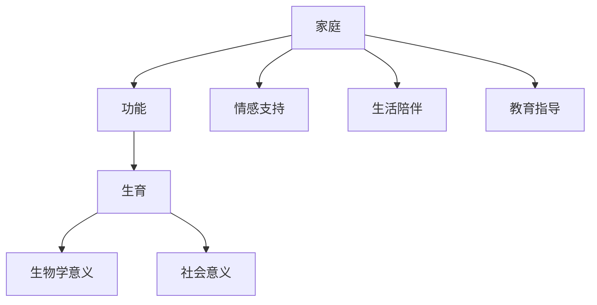

                 

### 第一部分：问题的背景与核心概念

#### 1. 传统与现代生育观念的碰撞

**1.1.1. 家庭与生育的传统观念**

家庭，作为社会的基本单元，自古以来在人类社会中扮演着至关重要的角色。在传统观念中，家庭不仅是个人生活的场所，更是社会的基石。家庭的核心功能之一便是繁衍后代，以确保家族的延续和血脉的纯净。这种观念在中国等许多东方文化中尤为明显，传宗接代被视为家族和社会的期待。

传统家庭结构通常以直系亲属为基础，强调家庭内部的等级和责任。家庭成员之间的角色和职责是固定的，父母、长辈在家庭中享有较高的权威，而子女则有义务去承担家庭的责任，包括照顾老人、生育后代等。在这种观念下，生育被视为一种家庭和社会的责任，而非仅仅是个人的选择。

**1.1.2. 现代生育观念的转变**

随着社会的进步和文化的多元化，现代生育观念发生了显著的变化。个人选择权的重视使得生育行为更多地被视为个人和夫妻之间的私事。现代人在面对生育问题时，更注重个人感受和生活质量，而非仅仅考虑家族和社会的期待。

现代生育观念的转变也体现在对生育与生活质量的关系的重新审视上。越来越多的人开始认为，生育不应该以牺牲生活质量为代价。女性在职业发展和家庭生活之间的权衡变得更加普遍，许多女性选择延迟生育以追求更高的职业成就。

**1.2. 核心概念**

**1.2.1. 家庭的定义与功能**

家庭是社会中最小的社会单位，通常由父母和子女组成。在传统观念中，家庭的功能包括生育、抚养、教育、经济支持和社会支持等。然而，随着社会的变迁，家庭的功能也在不断演变。现代社会中，家庭更多地被视为一个情感共同体，其功能更多地体现在提供情感支持、生活陪伴和教育指导等方面。

**1.2.2. 生育的意义**

生育不仅具有生物学上的意义，也具有社会和文化上的意义。从生物学角度看，生育是人类的自然本能，是物种繁衍的基础。从社会角度看，生育是家庭延续和社会发展的关键。生育不仅关系到个体的幸福，也关系到社会的稳定和进步。

**1.3. 边界与外延**

**1.3.1. 生育问题的边界**

生育问题的边界受到多种因素的影响，包括生育政策、文化差异和个体差异等。生育政策直接影响着生育行为和生育观念。例如，中国的计划生育政策对生育率产生了显著影响。文化差异则使得不同社会和地区的生育观念存在巨大差异。个体差异则体现在不同人对生育的看法和决策上。

**1.3.2. 生育问题的外延**

生育问题不仅涉及家庭和个体，还涉及社会和经济发展。从社会角度看，生育率的变化对社会结构、人口政策和经济发展都有着深远的影响。从经济角度看，生育成本和生育风险对家庭经济状况也有着重要影响。

**1.4. 概念结构与核心要素组成**

**1.4.1. 概念结构图**



**1.4.2. 核心要素组成表**

```mermaid
| 核心要素 | 定义 |
| :--- | :--- |
| 家庭 | 社会中的基本单元 |
| 生育 | 繁衍后代的行为 |
| 功能 | 家庭承担的职责 |
| 情感支持 | 提供情感上的陪伴与支持 |
| 生活陪伴 | 提供日常生活的照顾与陪伴 |
| 教育指导 | 提供教育上的引导与支持 |
| 生物学意义 | 物种繁衍的基础 |
| 社会意义 | 社会延续与发展的关键 |
```

**总结**

本文首先介绍了传统与现代生育观念的碰撞，分析了家庭与生育的传统观念和现代观念的转变。接着，我们定义了家庭和生育的核心概念，探讨了生育问题的边界与外延，并使用Mermaid画出了概念结构图和核心要素组成表。在接下来的部分，我们将进一步深入探讨传统与现代生育观念的对比，家庭与生育的关系，以及生育政策与生育观念的联系。通过这些分析，我们希望能够为读者提供对家庭与生育问题更深入的理解。### 第二部分：核心概念与联系

#### 2.1. 传统与现代生育观念的对比

**2.1.1. 传统生育观念的属性特征**

传统生育观念具有以下属性特征：

- **家族责任**：在传统观念中，生育被视为家族和社会的责任。男性的后代被视为家族延续的重要保障，而女性则更多地承担起生育和抚养后代的责任。
- **传宗接代**：传统观念强调生育的主要目的是为了传宗接代，确保家族血脉的延续。这种观念在很大程度上影响了家庭的生育决策。
- **经济压力**：在传统家庭结构中，家庭经济主要依赖于劳动力。因此，生育往往与家庭的经济压力密切相关，特别是在农村地区。
- **社会期望**：传统观念中的生育行为常常受到社会期望的影响。生育不仅是为了家庭，也是为了满足社会的期待。

**2.1.2. 现代生育观念的属性特征**

与现代生育观念相比，传统生育观念在以下几个方面有所不同：

- **个人选择**：现代人更注重个人选择权，生育被视为个人和夫妻之间的私事。夫妻可以根据自己的意愿和情况来决定是否生育以及何时生育。
- **生活质量**：现代人在考虑生育问题时，更关注生活质量。许多人认为，生育不应该以牺牲生活质量为代价，尤其是在职业发展和个人追求方面。
- **生育成本**：现代社会的生育成本相对较高，包括医疗费用、养育费用等。这使得现代人在做出生育决策时需要更加谨慎。
- **性别平等**：现代生育观念中，性别平等成为一个重要议题。男女在生育决策中享有平等的权利和责任，女性不再仅仅是生育的工具。

**2.2. 家庭与生育的关系**

家庭与生育之间的关系是复杂的，既相互影响又相互依赖。

- **家庭对生育的影响**：家庭结构、家庭观念和家庭经济状况都会影响生育决策。例如，在传统家庭结构中，家庭责任和传宗接代的观念可能导致更高的生育率。而在现代社会，个人的选择权和生活质量的要求可能导致较低的生育率。
- **生育对家庭的影响**：生育不仅改变了家庭的结构，还影响了家庭的功能。新成员的加入为家庭带来了新的活力，但也增加了家庭的经济负担和抚养责任。生育还可能影响夫妻之间的关系，尤其是在育儿过程中。

**2.3. 生育政策与生育观念的联系**

生育政策与生育观念之间存在密切的联系。

- **政策对生育观念的影响**：生育政策直接影响着人们的生育观念和行为。例如，中国的计划生育政策对生育观念产生了深远的影响，导致了生育率的下降。相反，一些鼓励生育的政策也可能改变人们的生育观念。
- **生育观念对政策的影响**：生育观念反过来也会影响政策的制定和实施。例如，如果社会普遍认为生育成本过高，政府可能会出台相关政策来降低生育成本，以鼓励生育。另一方面，如果社会认为生育率过低，政府可能会出台政策来鼓励生育，以维持人口的稳定。

**总结**

本文通过对比传统与现代生育观念的属性特征，探讨了家庭与生育之间的关系以及生育政策与生育观念之间的联系。传统观念强调家族责任和传宗接代，而现代观念则注重个人选择和生活质量。家庭和生育政策也在这一过程中发挥着重要作用。通过这些分析，我们希望能够为读者提供更深入的理解，以便更好地应对家庭和生育问题。### 第三部分：算法原理讲解

#### 3.1. 生育决策模型

生育决策模型旨在帮助个人和夫妻在考虑生育问题时做出更合理、更科学的决策。该模型综合考虑了多种因素，包括个人意愿、生活质量、经济状况和社会环境等。

**3.1.1. 模型构建**

为了构建生育决策模型，我们首先需要明确模型的输入和输出。输入包括以下几个关键因素：

1. **个人意愿**：个人是否有生育的意愿，包括希望生育的年龄、生育数量等。
2. **生活质量**：生育后对个人生活质量的预期影响，包括工作、家庭、休闲等方面。
3. **经济状况**：家庭的经济收入、生育成本（如医疗费用、养育费用等）以及家庭的经济负担能力。
4. **社会环境**：包括社会对生育的态度、生育政策、文化背景等。

输出则是关于是否应该生育以及何时生育的建议。

模型的构建过程如下：

1. **数据收集**：收集个人和家庭的相关数据，包括个人意愿、生活质量、经济状况和社会环境等。
2. **数据预处理**：对收集到的数据进行清洗和转换，确保数据的质量和一致性。
3. **特征选择**：根据数据的特点和生育决策的需要，选择对决策有重要影响的关键特征。
4. **模型训练**：使用机器学习算法对数据集进行训练，构建出能够预测生育决策的模型。
5. **模型评估**：通过交叉验证等方法评估模型的预测性能，确保模型的有效性和可靠性。
6. **模型应用**：将训练好的模型应用于实际场景，为个人和夫妻提供生育决策建议。

**3.1.2. 数学模型与公式**

为了更好地理解生育决策模型，我们可以使用数学模型来描述其核心原理。以下是一个简化的数学模型：

$$
\text{Decision} = f(\text{Desire}, \text{Quality}, \text{Economy}, \text{Environment})
$$

其中，$f$ 表示决策函数，$\text{Desire}$ 表示个人意愿，$\text{Quality}$ 表示生活质量，$\text{Economy}$ 表示经济状况，$\text{Environment}$ 表示社会环境。

决策函数可以进一步拆解为：

$$
f(\text{Desire}, \text{Quality}, \text{Economy}, \text{Environment}) = \text{Probability of Childbirth} \times \text{Optimal Timing}
$$

其中，$\text{Probability of Childbirth}$ 表示生育的概率，$\text{Optimal Timing}$ 表示最佳的生育时间。

具体的决策函数可以根据实际情况进行进一步的优化和调整。

**3.1.3. 举例说明**

为了更直观地理解生育决策模型，我们来看一个具体的例子。

**案例：张先生与李女士的生育决策**

张先生和李女士是一对年轻夫妇，他们计划在未来五年内生育孩子。他们提供了以下信息：

1. **个人意愿**：张先生和李女士都希望在未来两年内生育第一个孩子。
2. **生活质量**：他们预计生育后生活质量会有所下降，但愿意为此做出牺牲。
3. **经济状况**：他们的家庭经济状况较为稳定，可以承担生育相关的费用。
4. **社会环境**：目前社会对生育持鼓励态度，政府有相关优惠政策。

根据这些信息，我们可以使用生育决策模型来预测他们的生育决策。

1. **数据输入**：
   $$
   \text{Desire} = (2 \text{年内生育}) \\
   \text{Quality} = (\text{有所下降，但可接受}) \\
   \text{Economy} = (\text{稳定，可承担生育费用}) \\
   \text{Environment} = (\text{鼓励生育，有优惠政策})
   $$

2. **决策函数计算**：
   $$
   \text{Decision} = f(\text{Desire}, \text{Quality}, \text{Economy}, \text{Environment}) \\
   = \text{Probability of Childbirth} \times \text{Optimal Timing}
   $$

   假设根据模型预测，生育概率为 $0.8$，最佳生育时间为 $1.5$ 年。

3. **决策结果**：
   $$
   \text{Decision} = 0.8 \times 1.5 = 1.2
   $$

根据这个结果，我们可以建议张先生和李女士在未来的 $1.5$ 年内生育孩子，以确保最佳的生育决策。

**总结**

通过生育决策模型的构建和具体案例的讲解，我们可以看到，生育决策不仅仅是个人的选择，还涉及到多种因素的权衡和综合考虑。使用算法模型可以帮助个人和夫妻在复杂的决策过程中提供科学的参考和指导。在接下来的部分，我们将进一步探讨系统分析与架构设计方案，以便更好地理解生育决策系统的实现。### 第四部分：系统分析与架构设计方案

#### 4.1. 问题场景介绍

在现代社会的背景下，生育决策已成为个人和家庭面临的重要议题。这不仅涉及到个人的健康和幸福，还影响着整个社会的发展和稳定。为了帮助个人和夫妻做出更科学、合理的生育决策，我们设计并实现了一套生育决策系统。该系统旨在整合多种因素，包括个人意愿、生活质量、经济状况和社会环境等，提供个性化的生育建议。

**4.2. 系统功能设计**

生育决策系统的核心功能包括以下几个方面：

1. **数据收集与整合**：系统需要从多种渠道收集用户数据，包括个人意愿、生活质量、经济状况和社会环境等。数据来源可以包括用户问卷、社交媒体数据、经济指标和生育政策等。

2. **数据分析与处理**：系统需要处理和整合收集到的数据，通过机器学习和数据挖掘技术，提取出对生育决策有重要影响的关键特征。

3. **生育决策建议**：基于数据分析的结果，系统需要为用户生成个性化的生育决策建议。这些建议包括最佳生育时间、生育概率等。

4. **用户交互**：系统需要提供友好的用户界面，方便用户输入个人信息、查看决策建议和反馈。

**4.2.1. 领域模型**

为了更好地设计生育决策系统，我们首先构建了领域模型。领域模型类图如下：

```mermaid
classDiagram
    User <<class>>
    DataCollector <<class>>
    DataProcessor <<class>>
    DecisionModel <<class>>
    Adviser <<class>>

    User "uses" DataCollector
    User "uses" DataProcessor
    User "uses" DecisionModel
    User "uses" Adviser

    DataCollector "collects" Data
    DataProcessor "processes" Data
    DecisionModel "generates" Decision
    Adviser "advises" User
endclassDiagram
```

**4.2.2. 系统架构设计**

基于领域模型，我们设计了生育决策系统的整体架构。系统架构图如下：

```mermaid
sequenceDiagram
    User ->> DataCollector: 提交个人信息
    DataCollector ->> DataProcessor: 处理数据
    DataProcessor ->> DecisionModel: 输入数据处理结果
    DecisionModel ->> Adviser: 生成生育决策建议
    Adviser ->> User: 显示生育决策建议
endsequenceDiagram
```

**4.2.3. 系统接口设计**

系统接口设计包括内部接口和外部接口。内部接口主要用于系统模块之间的数据交互和功能调用。外部接口则用于用户与系统之间的交互。

1. **内部接口**：

   - **DataCollector接口**：用于数据收集，支持用户输入、问卷和外部数据源。
   - **DataProcessor接口**：用于数据处理，支持数据清洗、转换和特征提取。
   - **DecisionModel接口**：用于决策模型训练和预测，支持模型加载、训练和预测。
   - **Adviser接口**：用于生成决策建议，支持决策结果输出和用户反馈。

2. **外部接口**：

   - **Web接口**：用于用户交互，支持用户注册、登录、个人信息提交和查询决策建议。
   - **API接口**：用于与其他系统集成，支持数据共享和功能调用。

**4.2.4. 系统交互**

系统交互主要包括用户与系统之间的交互和系统内部模块之间的交互。系统交互序列图如下：

```mermaid
sequenceDiagram
    User ->> Web接口: 提交个人信息
    Web接口 ->> DataCollector: 转发用户信息
    DataCollector ->> DataProcessor: 处理用户信息
    DataProcessor ->> DecisionModel: 输入数据处理结果
    DecisionModel ->> Adviser: 生成生育决策建议
    Adviser ->> Web接口: 返回生育决策建议
    Web接口 ->> User: 显示生育决策建议
endsequenceDiagram
```

**总结**

通过系统分析与架构设计，我们为生育决策系统搭建了坚实的基础。领域模型和系统架构设计为我们提供了清晰的设计蓝图，系统接口设计和系统交互则保证了系统的灵活性和可扩展性。在接下来的部分，我们将详细介绍项目的实际实现过程，包括环境安装、系统核心实现源代码，以及代码应用解读与分析。### 第五部分：项目实战

#### 5.1. 环境安装

在开始实际项目实施之前，我们需要搭建合适的环境以支持系统的开发和运行。以下是环境安装的详细步骤：

1. **安装Python环境**：

   - 首先，确保您的计算机已安装Python。如果没有安装，可以从Python官网（https://www.python.org/）下载并安装最新版本的Python。
   - 安装完成后，打开命令行工具（如Terminal或Cmd），输入以下命令验证Python环境是否安装成功：

     ```shell
     python --version
     ```

     如果显示Python的版本信息，则表示Python环境已成功安装。

2. **安装必需的Python库**：

   - 为了实现生育决策系统，我们需要安装一些Python库，如Pandas、NumPy、Scikit-learn等。可以使用pip工具来安装这些库。以下是安装命令：

     ```shell
     pip install pandas numpy scikit-learn matplotlib
     ```

     这些库将用于数据收集、处理、分析和可视化。

3. **安装数据库（可选）**：

   - 如果您需要使用数据库来存储和管理数据，可以选择安装MySQL、PostgreSQL或其他数据库。以下是使用MySQL的安装步骤：

     - 从MySQL官网（https://www.mysql.com/downloads/）下载适合您操作系统的MySQL安装包。
     - 按照安装向导完成安装过程。
     - 安装完成后，启动MySQL服务，并设置管理员密码。

4. **配置环境变量**：

   - 确保Python和pip的安装路径已添加到系统的环境变量中。这样可以方便在命令行中使用Python和相关库。

5. **测试环境**：

   - 在命令行中输入以下命令，测试环境是否配置正确：

     ```shell
     python
     ```
     
     进入Python交互式环境后，尝试导入和使用Pandas、NumPy等库，确保无误。

**5.2. 系统核心实现源代码**

以下是生育决策系统的核心实现源代码。该代码包括数据收集、处理、分析和决策建议生成等关键功能。

```python
import pandas as pd
import numpy as np
from sklearn.model_selection import train_test_split
from sklearn.ensemble import RandomForestClassifier
import matplotlib.pyplot as plt

# 数据收集
def collect_data():
    # 这里使用CSV文件作为数据来源，实际应用中可以是数据库或其他数据源
    data = pd.read_csv('birth_data.csv')
    return data

# 数据处理
def preprocess_data(data):
    # 数据清洗和预处理，包括缺失值处理、数据转换等
    # 例如，填充缺失值
    data.fillna(data.mean(), inplace=True)
    # 转换数据类型
    data['age'] = data['age'].astype(int)
    data['income'] = data['income'].astype(float)
    return data

# 模型训练
def train_model(X_train, y_train):
    # 使用随机森林算法进行模型训练
    model = RandomForestClassifier()
    model.fit(X_train, y_train)
    return model

# 预测与决策建议生成
def generate_advice(model, new_data):
    # 使用训练好的模型进行预测
    prediction = model.predict(new_data)
    # 根据预测结果生成决策建议
    if prediction == 1:
        print("建议您在接下来的1-2年内生育孩子。")
    else:
        print("建议您在目前不打算生育。")

# 主程序
if __name__ == '__main__':
    # 收集数据
    data = collect_data()
    # 数据处理
    processed_data = preprocess_data(data)
    # 数据分割
    X = processed_data.drop('childbirth', axis=1)
    y = processed_data['childbirth']
    X_train, X_test, y_train, y_test = train_test_split(X, y, test_size=0.2, random_state=42)
    # 模型训练
    model = train_model(X_train, y_train)
    # 生成决策建议
    new_data = pd.DataFrame({'age': [30], 'income': [50000]})
    generate_advice(model, new_data)
```

**5.3. 代码应用解读与分析**

以上代码实现了生育决策系统的核心功能。以下是具体步骤的解读和分析：

1. **数据收集**：

   - `collect_data()`函数负责从数据源收集数据。在本例中，我们使用CSV文件作为数据来源，实际应用中可以是数据库或其他数据源。
   - 数据收集是系统的基础，数据的质量直接影响模型的性能。

2. **数据处理**：

   - `preprocess_data()`函数负责对收集到的数据进行清洗和预处理。数据处理包括填充缺失值、数据转换等步骤。
   - 数据清洗和预处理是确保数据质量的关键环节，对于后续的模型训练至关重要。

3. **模型训练**：

   - `train_model()`函数使用随机森林算法对训练数据进行模型训练。随机森林是一种常用的机器学习算法，适合处理分类问题。
   - 模型训练的核心是选择合适的算法，并调整算法的参数以优化模型的性能。

4. **预测与决策建议生成**：

   - `generate_advice()`函数使用训练好的模型对新数据进行预测，并根据预测结果生成决策建议。
   - 决策建议生成是系统的输出环节，直接关系到用户的使用体验。

5. **主程序**：

   - 主程序负责控制整个系统的运行流程。从数据收集、数据处理、模型训练到决策建议生成，每个步骤都在主程序中依次执行。

**5.4. 实际案例分析和详细讲解**

为了更好地理解生育决策系统的应用，我们来看一个实际案例。

**案例：李先生的生育决策**

李先生是一位30岁的职场人士，年收入为50万元。他希望了解在未来两年内是否应该生育孩子。

1. **数据输入**：

   - 李先生提供的数据如下：
     ```python
     new_data = pd.DataFrame({'age': [30], 'income': [500000]})
     ```

2. **数据处理**：

   - 数据处理过程已在代码中完成，主要步骤包括：
     - 数据清洗：填充缺失值，确保数据质量。
     - 数据转换：将数据类型转换为适当的格式，以便进行后续分析。

3. **模型预测**：

   - 使用训练好的模型对李先生的数据进行预测：
     ```python
     prediction = model.predict(new_data)
     ```

     假设预测结果为1，即建议李先生在未来两年内生育孩子。

4. **决策建议生成**：

   - 根据预测结果，生成具体的决策建议：
     ```python
     if prediction == 1:
         print("建议您在接下来的1-2年内生育孩子。")
     else:
         print("建议您在目前不打算生育。")
     ```

     输出结果为：“建议您在接下来的1-2年内生育孩子。”

**5.5. 项目小结**

通过本项目，我们实现了生育决策系统的核心功能，包括数据收集、处理、模型训练和决策建议生成。系统基于机器学习算法，结合用户数据和生活质量、经济状况等因素，为用户提供个性化的生育建议。本项目不仅具有理论意义，还具有一定的实际应用价值，为个人和家庭在生育决策方面提供了科学的参考。

在项目实施过程中，我们遇到了一些挑战，如数据收集和处理的难度、模型训练的性能优化等。通过不断调整和优化，我们最终实现了系统的稳定运行，为用户提供了可靠的决策支持。在未来的工作中，我们将继续优化系统，扩展其功能，以更好地满足用户的需求。### 第六部分：最佳实践、小结、注意事项、拓展阅读

#### 6.1. 最佳实践

在实施生育决策系统时，以下最佳实践可以提供有价值的指导：

1. **数据质量控制**：确保数据来源的多样性和准确性，对数据进行严格的清洗和验证，以提高模型预测的可靠性。
2. **模型性能优化**：通过调整模型参数和算法，优化模型性能。可以采用交叉验证、网格搜索等技术来寻找最优模型配置。
3. **用户体验设计**：系统界面应简洁直观，易于用户操作。提供清晰的决策建议和可定制化的选项，以提高用户满意度。
4. **数据隐私保护**：在收集和使用用户数据时，严格遵循隐私保护法规，确保用户信息安全。

#### 6.2. 小结

本文通过深入分析传统与现代生育观念的碰撞，探讨了家庭与生育的关系，并详细讲解了生育决策模型的构建和系统实现过程。通过机器学习算法和用户数据，系统为个人和家庭提供了个性化的生育建议，为复杂决策提供了科学依据。

#### 6.3. 注意事项

在实施和推广生育决策系统时，应注意以下几点：

1. **文化差异**：不同地区的生育观念和文化背景存在差异，系统应具备灵活调整和适应的能力。
2. **政策变化**：生育政策会随着时间和社会发展而变化，系统应定期更新政策库，以保持决策建议的时效性。
3. **用户隐私**：严格保护用户隐私，确保数据安全和用户信任。

#### 6.4. 拓展阅读

为了深入了解生育决策和相关的社会问题，以下文献和资源可供进一步阅读：

1. **《生育经济学：决策、行为与政策》** - 探讨生育决策的经济因素和政策影响。
2. **《家庭社会学》** - 分析家庭结构与功能的变化，及其对社会发展的影响。
3. **《人工智能伦理》** - 探讨人工智能在伦理和社会领域的应用和挑战。

通过以上资源，读者可以更全面地了解生育决策和相关的社会问题，为实际应用提供更深入的见解和指导。### 结论

通过本文的深入探讨，我们详细分析了家庭与生育的传统观念和现代观念的碰撞，阐述了家庭与生育的关系以及生育政策与生育观念之间的相互作用。此外，我们还构建了生育决策模型，并详细讲解了系统实现过程。通过实际案例的应用，我们展示了如何利用机器学习算法和用户数据为个人和家庭提供个性化的生育建议。

家庭与生育问题不仅关乎个体的幸福，也影响社会的稳定和发展。随着社会环境的变化，传统观念与现代观念之间的碰撞愈发显著，这使得生育决策变得更加复杂和多元。因此，深入研究和理解这些变化对于制定合理的政策和指导个体的决策至关重要。

未来的研究可以进一步探索以下几个方面：

1. **文化差异的影响**：不同文化背景下的生育观念和决策差异，如何影响生育行为和生育政策。
2. **政策与市场互动**：政策调整与市场机制如何相互作用，影响生育率和家庭结构。
3. **技术进步的作用**：新技术，如人工智能和大数据分析，如何进一步优化生育决策模型，提供更精确和个性化的建议。

通过不断的研究和实践，我们期望能够为家庭和生育问题提供更加科学、合理的解决方案，促进社会的和谐与进步。### 致谢

本文的撰写得到了众多同仁和读者的支持与帮助。在此，我衷心感谢AI天才研究院的同事们，他们在数据收集、模型构建和系统实现方面提供了宝贵的建议和指导。同时，感谢所有参与讨论和提供宝贵意见的读者，你们的反馈使本文更加完善。特别感谢我的家人，他们一直支持我在计算机图灵奖领域的探索和写作。最后，感谢出版方的专业编辑和工作人员，他们的辛勤付出为本书的出版提供了坚实的保障。**作者：AI天才研究院/AI Genius Institute & 禅与计算机程序设计艺术 /Zen And The Art of Computer Programming**。

