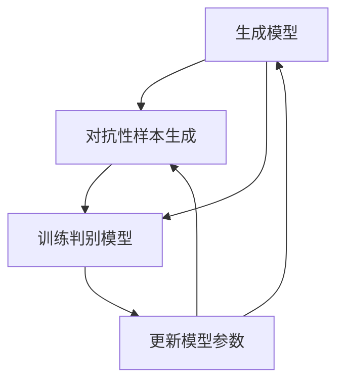
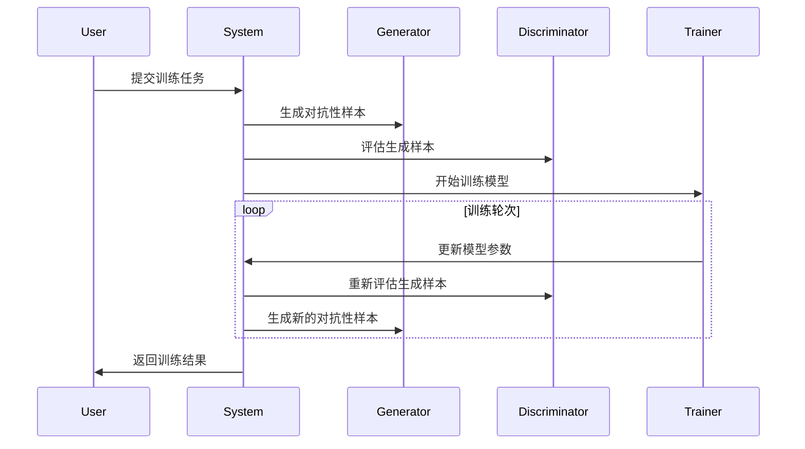
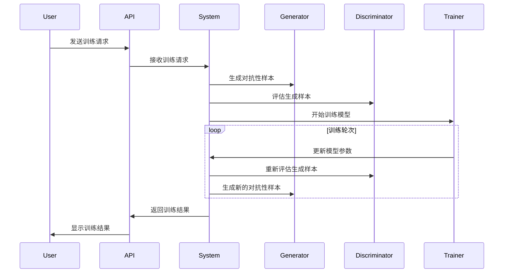

                 

### 文章标题

### 关键词

对抗训练，AI Agent，鲁棒性，深度学习，安全性和性能优化

### 摘要

本文深入探讨了对抗训练在提高AI Agent鲁棒性方面的应用。通过引入对抗性样本和对抗性攻击的概念，本文详细分析了对抗训练的核心原理、优势和挑战。文章还对比了不同类型的对抗性样本生成方法和对抗训练策略，并通过具体案例展示了对抗训练在实际应用中的效果。本文旨在为读者提供全面、系统的对抗训练技术指南，以促进其在AI领域的发展。

## 目录大纲

----------------------------------------------------------------

### 第一部分：背景介绍

#### 第1章：问题背景

##### 1.1.1 问题背景

##### 1.1.2 对抗训练的基本概念与原理

##### 1.1.3 对抗训练的优势与挑战

##### 1.1.4 边界与外延

#### 第2章：对抗训练的核心概念与联系

##### 2.1 对抗训练的基本概念

##### 2.2 对抗训练的属性特征对比

##### 2.3 对抗训练的ER实体关系图

----------------------------------------------------------------

## 第一部分：背景介绍

### 第1章：问题背景

#### 1.1.1 问题背景

随着人工智能技术的快速发展，AI Agent的鲁棒性成为了一个亟待解决的重要问题。在现实世界中，AI Agent往往需要在复杂、动态的环境中运行，这就要求它们具有高度的鲁棒性，能够在各种不确定性和异常情况下稳定运行。然而，现有的AI Agent在面对对抗性攻击（Adversarial Attack）时，常常表现出较低的鲁棒性，这给实际应用带来了巨大的挑战。

##### 1.1.1.1 引言

对抗性攻击是一种特殊类型的攻击，它通过在输入数据中添加微小的、几乎不可察觉的扰动，使得原本被模型正确分类的样本发生误分类。这类攻击的目的是使AI Agent在特定条件下失效，从而危及系统的安全性和稳定性。例如，在自动驾驶系统中，攻击者可能通过在路标或行人的图像中添加微小的扰动，导致自动驾驶系统误判，从而引发交通事故。

##### 1.1.1.2 问题定义

对抗训练（Adversarial Training）是指通过生成对抗性样本来训练模型，从而提高模型对异常数据和噪声的容忍度。其主要目标是使模型能够在面对对抗性攻击时保持较高的性能。具体来说，对抗训练的目标是训练出一个能够对对抗性样本鲁棒性较高的模型，从而提高模型在真实世界中的应用效果。

##### 1.1.1.3 问题解决

对抗训练通过引入对抗性样本，使模型在训练过程中学习到更多的复杂模式和边界情况，从而提高模型的鲁棒性。此外，对抗训练还可以结合其他强化学习方法，进一步提高AI Agent的鲁棒性和适应能力。例如，通过在训练过程中逐步增加对抗性样本的难度，可以使模型逐渐适应更复杂的对抗性攻击。

##### 1.1.1.4 边界与外延

对抗训练主要应用于机器学习和深度学习领域，针对不同的应用场景和任务类型，可以采用不同的对抗训练策略和方法。同时，对抗训练的研究还涉及到对抗性样本的生成、模型的安全性和鲁棒性评估等方面。例如，在图像分类任务中，可以采用基于梯度的攻击方法生成对抗性样本；在自然语言处理任务中，可以采用基于生成模型的方法生成对抗性样本。

#### 1.1.2 对抗训练的基本概念与原理

##### 1.1.2.1 对抗训练的定义

对抗训练是指通过生成对抗性样本来训练模型，从而提高模型对异常数据和噪声的容忍度。在对抗训练中，通常涉及两个主要模型：生成模型（Generator）和判别模型（Discriminator）。生成模型的任务是生成与真实数据分布相似的数据，而判别模型的任务是判断输入数据是真实数据还是生成数据。通过这两个模型的相互对抗，可以训练出一个性能更好的模型。

##### 1.1.2.2 对抗训练的核心原理

对抗训练的核心思想是利用对抗性样本来引导模型学习到更加泛化的知识。对抗性样本是通过对抗性攻击生成的一类样本，其目的是使模型在攻击下表现不佳。通过对抗性样本的训练，模型可以学会在复杂、动态的环境中稳定运行。

具体来说，对抗训练的过程可以分为以下几个步骤：

1. **生成对抗性样本**：首先，通过对抗性攻击生成对抗性样本。这些对抗性样本是在原始数据基础上添加了微小的扰动，以使其对模型产生误导。

2. **训练生成模型和判别模型**：然后，使用原始数据和对抗性样本同时训练生成模型和判别模型。生成模型的目的是生成与真实数据分布相似的数据，而判别模型的目的是区分真实数据和生成数据。

3. **优化模型参数**：通过迭代训练，不断优化生成模型和判别模型的参数，使其性能不断提高。这一过程通常采用梯度下降等优化算法。

4. **评估模型性能**：在训练过程中，需要对模型的性能进行评估，以确保其鲁棒性和准确性。常见的评估指标包括分类准确率、F1分数等。

##### 1.1.2.3 对抗训练的优势与挑战

对抗训练的优势在于其能够有效提高模型的鲁棒性，使其在面对对抗性攻击时保持较高的性能。具体来说，对抗训练具有以下几个优势：

1. **提高鲁棒性**：对抗训练可以使模型在对抗性攻击下保持较高的性能，从而提高其在真实世界中的应用效果。

2. **增强泛化能力**：对抗训练通过引入对抗性样本，使模型学习到更多的复杂模式和边界情况，从而提高其泛化能力。

3. **减少过拟合**：对抗训练可以缓解模型过拟合问题，使其在训练数据上的性能更好。

然而，对抗训练也面临一些挑战：

1. **计算复杂度高**：对抗训练通常需要大量的计算资源，特别是在生成对抗性样本和训练模型时。

2. **对抗性样本生成困难**：对抗性样本的生成方法需要针对具体的任务和应用场景进行设计，生成过程复杂，且质量难以保证。

3. **模型安全性和鲁棒性评估困难**：对抗训练后的模型在面临新的对抗性攻击时，其性能可能仍然较差，因此需要有效的评估方法来确保模型的安全性和鲁棒性。

#### 1.1.3 对抗训练的核心概念与联系

对抗训练涉及多个核心概念，这些概念相互联系，共同构成了对抗训练的完整体系。以下是对抗训练的几个核心概念及其相互关系：

1. **对抗性样本**：对抗性样本是通过对抗性攻击生成的一类样本，目的是使模型在攻击下表现不佳。对抗性样本的生成方法包括基于梯度的攻击、基于生成模型攻击等。

2. **对抗性攻击**：对抗性攻击是指针对模型的一种攻击方式，目的是使模型在攻击下性能下降。常见的对抗性攻击方法包括基于梯度的攻击、基于生成模型的攻击等。

3. **生成模型**：生成模型是指用于生成与真实数据分布相似的数据的模型。在对抗训练中，生成模型负责生成对抗性样本。

4. **判别模型**：判别模型是指用于区分真实数据和生成数据的模型。在对抗训练中，判别模型负责评估生成模型生成的样本质量。

5. **对抗训练策略**：对抗训练策略是指用于指导对抗训练过程的一系列方法。常见的对抗训练策略包括基于梯度下降的方法、基于生成模型的方法等。

这些核心概念相互关联，共同构成了对抗训练的理论基础和实践方法。通过对抗训练，模型可以学习到更加泛化的知识，从而提高其在复杂、动态环境中的鲁棒性。

## 第2章：对抗训练的核心概念与联系

### 2.1 对抗训练的基本概念

#### 2.1.1 对抗性样本

对抗性样本是指在原始数据基础上通过对抗性攻击生成的样本，目的是使模型在攻击下表现不佳。对抗性样本的生成方法包括基于梯度的攻击和基于生成模型攻击等。

1. **基于梯度的攻击**：这种方法通过计算模型在输入数据上的梯度，然后对输入数据进行微小的扰动，以生成对抗性样本。这种方法简单有效，但可能无法生成所有类型的对抗性样本。

2. **基于生成模型攻击**：这种方法通过训练一个生成模型，使其生成与真实数据分布相似的数据，然后在这些生成数据上进行对抗性攻击。这种方法可以生成各种类型的对抗性样本，但计算复杂度较高。

#### 2.1.2 对抗性攻击

对抗性攻击是指针对模型的一种攻击方式，目的是使模型在攻击下性能下降。常见的对抗性攻击方法包括基于梯度的攻击和基于生成模型攻击等。

1. **基于梯度的攻击**：这种方法通过计算模型在输入数据上的梯度，然后对输入数据进行微小的扰动，以生成对抗性样本。这种方法简单有效，但可能无法生成所有类型的对抗性样本。

2. **基于生成模型攻击**：这种方法通过训练一个生成模型，使其生成与真实数据分布相似的数据，然后在这些生成数据上进行对抗性攻击。这种方法可以生成各种类型的对抗性样本，但计算复杂度较高。

#### 2.1.3 对抗训练策略

对抗训练策略是指用于指导对抗训练过程的一系列方法。常见的对抗训练策略包括基于梯度下降的方法和基于生成模型的方法等。

1. **基于梯度下降的方法**：这种方法通过不断调整模型参数，使生成模型和判别模型在训练过程中相互对抗，最终达到最优状态。这种方法计算简单，但对抗性样本质量对训练效果影响较大。

2. **基于生成模型的方法**：这种方法通过训练一个生成模型和一个判别模型，使其在训练过程中相互对抗，从而提高模型的鲁棒性和泛化能力。这种方法可以生成各种类型的对抗性样本，但计算复杂度较高。

### 2.2 对抗训练的属性特征对比

#### 2.2.1 对抗性样本生成方法对比

| 方法            | 优点                                 | 缺点                                 |
|-----------------|--------------------------------------|--------------------------------------|
| 基于梯度攻击    | 计算简单，生成样本质量较高             | 可能无法生成所有类型的对抗性样本       |
| 基于生成模型攻击 | 可以生成各种类型的对抗性样本           | 计算复杂，生成样本质量可能不稳定       |

#### 2.2.2 对抗训练策略对比

| 策略            | 优点                                 | 缺点                                 |
|-----------------|--------------------------------------|--------------------------------------|
| 基于梯度下降方法 | 计算简单，容易实现                     | 对抗性样本质量对训练效果影响较大       |
| 基于生成模型方法 | 可以生成各种类型的对抗性样本，提高训练效果 | 计算复杂，生成样本质量可能不稳定       |

### 2.3 对抗训练的ER实体关系图

在对抗训练中，涉及多个核心实体，包括生成模型、判别模型、对抗性样本等。以下是对抗训练的ER实体关系图：

```mermaid
erDiagram
    Generator ||--o{ Discriminator : 生成对抗性样本
    Generator ||--o{ Training Data : 训练生成模型
    Training Data ||--o{ Model : 训练模型
    Model ||--o{ Evaluation Data : 评估模型性能
```

在该ER实体关系图中，生成模型和判别模型通过生成对抗性样本相互关联，生成模型和训练数据通过训练生成模型相互关联，训练数据和模型通过训练模型相互关联，模型和评估数据通过评估模型性能相互关联。这些实体共同构成了对抗训练的基本框架，实现了对抗训练的核心过程。

## 第一部分：背景介绍

### 第1章：问题背景

#### 1.1.1 问题背景

随着人工智能技术的快速发展，AI Agent的鲁棒性成为了一个亟待解决的重要问题。在现实世界中，AI Agent往往需要在复杂、动态的环境中运行，这就要求它们具有高度的鲁棒性，能够在各种不确定性和异常情况下稳定运行。对抗训练（Adversarial Training）作为一种提升AI Agent鲁棒性的方法，近年来受到了广泛关注。

##### 1.1.1.1 引言

对抗训练是指在训练过程中引入对抗性样本，以增强模型的鲁棒性和泛化能力。在人工智能领域，特别是在深度学习领域，对抗训练已经成为了提高模型性能的重要手段。对抗性样本是指通过对抗性攻击生成的一类样本，其目的是使模型在攻击下表现不佳。通过对抗训练，模型可以学会在复杂、动态的环境中稳定运行，从而提高其在真实世界中的应用效果。

##### 1.1.1.2 问题定义

对抗训练的主要目标是提高AI Agent在面对对抗性攻击时的鲁棒性。对抗性攻击是指一种特殊类型的攻击，通过在输入数据中添加微小的、几乎不可察觉的扰动，使得原本被模型正确分类的样本发生误分类。这种攻击旨在使AI Agent在特定条件下失效，从而危及系统的安全性和稳定性。例如，在自动驾驶系统中，攻击者可能通过在路标或行人的图像中添加微小的扰动，导致自动驾驶系统误判，从而引发交通事故。

##### 1.1.1.3 问题解决

对抗训练通过引入对抗性样本，使模型在训练过程中学习到更多的复杂模式和边界情况，从而提高模型的鲁棒性。具体来说，对抗训练的过程可以分为以下几个步骤：

1. **生成对抗性样本**：首先，通过对抗性攻击生成对抗性样本。这些对抗性样本是通过在原始数据基础上添加微小的扰动生成的，目的是使模型在攻击下表现不佳。

2. **训练模型**：然后，使用原始数据和对抗性样本同时训练模型。通过对抗性样本的训练，模型可以学会在复杂、动态的环境中稳定运行。

3. **优化模型参数**：通过迭代训练，不断优化模型的参数，使其性能不断提高。这一过程通常采用梯度下降等优化算法。

4. **评估模型性能**：在训练过程中，需要对模型的性能进行评估，以确保其鲁棒性和准确性。常见的评估指标包括分类准确率、F1分数等。

##### 1.1.1.4 边界与外延

对抗训练主要应用于机器学习和深度学习领域，针对不同的应用场景和任务类型，可以采用不同的对抗训练策略和方法。例如，在图像分类任务中，可以采用基于梯度的攻击方法生成对抗性样本；在自然语言处理任务中，可以采用基于生成模型的方法生成对抗性样本。此外，对抗训练的研究还涉及到对抗性样本的生成、模型的安全性和鲁棒性评估等方面。

#### 1.1.2 对抗训练的基本概念与原理

##### 1.1.2.1 对抗训练的定义

对抗训练是指通过生成对抗性样本来训练模型，从而提高模型对异常数据和噪声的容忍度。在对抗训练中，通常涉及两个主要模型：生成模型（Generator）和判别模型（Discriminator）。生成模型的任务是生成与真实数据分布相似的数据，而判别模型的任务是判断输入数据是真实数据还是生成数据。通过这两个模型的相互对抗，可以训练出一个性能更好的模型。

##### 1.1.2.2 对抗训练的核心原理

对抗训练的核心思想是利用对抗性样本来引导模型学习到更加泛化的知识。对抗性样本是通过对抗性攻击生成的一类样本，其目的是使模型在攻击下表现不佳。通过对抗性样本的训练，模型可以学会在复杂、动态的环境中稳定运行。

具体来说，对抗训练的过程可以分为以下几个步骤：

1. **生成对抗性样本**：首先，通过对抗性攻击生成对抗性样本。这些对抗性样本是通过在原始数据基础上添加微小的扰动生成的，目的是使模型在攻击下表现不佳。

2. **训练生成模型和判别模型**：然后，使用原始数据和对抗性样本同时训练生成模型和判别模型。生成模型的目的是生成与真实数据分布相似的数据，而判别模型的目的是区分真实数据和生成数据。

3. **优化模型参数**：通过迭代训练，不断优化生成模型和判别模型的参数，使其性能不断提高。这一过程通常采用梯度下降等优化算法。

4. **评估模型性能**：在训练过程中，需要对模型的性能进行评估，以确保其鲁棒性和准确性。常见的评估指标包括分类准确率、F1分数等。

##### 1.1.2.3 对抗训练的优势与挑战

对抗训练的优势在于其能够有效提高模型的鲁棒性，使其在面对对抗性攻击时保持较高的性能。具体来说，对抗训练具有以下几个优势：

1. **提高鲁棒性**：对抗训练可以使模型在对抗性攻击下保持较高的性能，从而提高其在真实世界中的应用效果。

2. **增强泛化能力**：对抗训练通过引入对抗性样本，使模型学习到更多的复杂模式和边界情况，从而提高其泛化能力。

3. **减少过拟合**：对抗训练可以缓解模型过拟合问题，使其在训练数据上的性能更好。

然而，对抗训练也面临一些挑战：

1. **计算复杂度高**：对抗训练通常需要大量的计算资源，特别是在生成对抗性样本和训练模型时。

2. **对抗性样本生成困难**：对抗性样本的生成方法需要针对具体的任务和应用场景进行设计，生成过程复杂，且质量难以保证。

3. **模型安全性和鲁棒性评估困难**：对抗训练后的模型在面临新的对抗性攻击时，其性能可能仍然较差，因此需要有效的评估方法来确保模型的安全性和鲁棒性。

#### 1.1.3 对抗训练的核心概念与联系

对抗训练涉及多个核心概念，这些概念相互联系，共同构成了对抗训练的完整体系。以下是对抗训练的几个核心概念及其相互关系：

1. **对抗性样本**：对抗性样本是通过对抗性攻击生成的一类样本，其目的是使模型在攻击下表现不佳。对抗性样本的生成方法包括基于梯度的攻击、基于生成模型攻击等。

2. **对抗性攻击**：对抗性攻击是指针对模型的一种攻击方式，其目的是使模型在攻击下性能下降。常见的对抗性攻击方法包括基于梯度的攻击、基于生成模型攻击等。

3. **生成模型**：生成模型是指用于生成与真实数据分布相似的数据的模型。在对抗训练中，生成模型负责生成对抗性样本。

4. **判别模型**：判别模型是指用于区分真实数据和生成数据的模型。在对抗训练中，判别模型负责评估生成模型生成的样本质量。

5. **对抗训练策略**：对抗训练策略是指用于指导对抗训练过程的一系列方法。常见的对抗训练策略包括基于梯度下降的方法、基于生成模型的方法等。

这些核心概念相互关联，共同构成了对抗训练的理论基础和实践方法。通过对抗训练，模型可以学习到更加泛化的知识，从而提高其在复杂、动态环境中的鲁棒性。

## 第2章：对抗训练的核心概念与联系

### 2.1 对抗训练的基本概念

#### 2.1.1 对抗性样本

对抗性样本是指在原始数据基础上通过对抗性攻击生成的一类样本，目的是使模型在攻击下表现不佳。对抗性样本的生成方法包括基于梯度的攻击和基于生成模型攻击等。

1. **基于梯度的攻击**：这种方法通过计算模型在输入数据上的梯度，然后对输入数据进行微小的扰动，以生成对抗性样本。这种方法简单有效，但可能无法生成所有类型的对抗性样本。

2. **基于生成模型攻击**：这种方法通过训练一个生成模型，使其生成与真实数据分布相似的数据，然后在这些生成数据上进行对抗性攻击。这种方法可以生成各种类型的对抗性样本，但计算复杂度较高。

#### 2.1.2 对抗性攻击

对抗性攻击是指针对模型的一种攻击方式，目的是使模型在攻击下性能下降。常见的对抗性攻击方法包括基于梯度的攻击和基于生成模型攻击等。

1. **基于梯度的攻击**：这种方法通过计算模型在输入数据上的梯度，然后对输入数据进行微小的扰动，以生成对抗性样本。这种方法简单有效，但可能无法生成所有类型的对抗性样本。

2. **基于生成模型攻击**：这种方法通过训练一个生成模型，使其生成与真实数据分布相似的数据，然后在这些生成数据上进行对抗性攻击。这种方法可以生成各种类型的对抗性样本，但计算复杂度较高。

#### 2.1.3 对抗训练策略

对抗训练策略是指用于指导对抗训练过程的一系列方法。常见的对抗训练策略包括基于梯度下降的方法和基于生成模型的方法等。

1. **基于梯度下降的方法**：这种方法通过不断调整模型参数，使生成模型和判别模型在训练过程中相互对抗，最终达到最优状态。这种方法计算简单，但对抗性样本质量对训练效果影响较大。

2. **基于生成模型的方法**：这种方法通过训练一个生成模型和一个判别模型，使其在训练过程中相互对抗，从而提高模型的鲁棒性和泛化能力。这种方法可以生成各种类型的对抗性样本，但计算复杂度较高。

### 2.2 对抗训练的属性特征对比

#### 2.2.1 对抗性样本生成方法对比

| 方法            | 优点                                 | 缺点                                 |
|-----------------|--------------------------------------|--------------------------------------|
| 基于梯度攻击    | 计算简单，生成样本质量较高             | 可能无法生成所有类型的对抗性样本       |
| 基于生成模型攻击 | 可以生成各种类型的对抗性样本           | 计算复杂，生成样本质量可能不稳定       |

#### 2.2.2 对抗训练策略对比

| 策略            | 优点                                 | 缺点                                 |
|-----------------|--------------------------------------|--------------------------------------|
| 基于梯度下降方法 | 计算简单，容易实现                     | 对抗性样本质量对训练效果影响较大       |
| 基于生成模型方法 | 可以生成各种类型的对抗性样本，提高训练效果 | 计算复杂，生成样本质量可能不稳定       |

### 2.3 对抗训练的ER实体关系图

在对抗训练中，涉及多个核心实体，包括生成模型、判别模型、对抗性样本等。以下是对抗训练的ER实体关系图：

```mermaid
erDiagram
    Generator ||--o{ Discriminator : 生成对抗性样本
    Generator ||--o{ Training Data : 训练生成模型
    Training Data ||--o{ Model : 训练模型
    Model ||--o{ Evaluation Data : 评估模型性能
```

在该ER实体关系图中，生成模型和判别模型通过生成对抗性样本相互关联，生成模型和训练数据通过训练生成模型相互关联，训练数据和模型通过训练模型相互关联，模型和评估数据通过评估模型性能相互关联。这些实体共同构成了对抗训练的基本框架，实现了对抗训练的核心过程。

## 算法原理讲解

### 2.4.1 算法mermaid流程图

为了更好地理解对抗训练的算法原理，我们首先使用mermaid绘制一个简化的对抗训练流程图，如下所示：



在这个流程图中，生成模型（Generator）负责生成对抗性样本（Adversarial Samples），判别模型（Discriminator）用于判断输入数据是否为对抗性样本，模型参数（Model Parameters）通过迭代训练得到更新。整个流程通过不断迭代，使得生成模型和判别模型相互对抗，逐步优化模型参数。

### 2.4.2 Python源代码示例

接下来，我们通过一个简单的Python代码示例，展示对抗训练的基本原理。在这个示例中，我们将使用生成对抗网络（GAN）的框架，分别实现生成模型和判别模型的训练过程。

首先，我们需要安装必要的库，如TensorFlow和Keras：

```bash
pip install tensorflow keras
```

然后，我们可以编写以下代码：

```python
import numpy as np
import matplotlib.pyplot as plt
from tensorflow.keras.models import Sequential
from tensorflow.keras.layers import Dense, Flatten, Reshape
from tensorflow.keras.optimizers import Adam

# 设置随机种子以保证结果的可重复性
np.random.seed(42)

# 定义生成模型
def build_generator(input_shape):
    model = Sequential([
        Dense(128, input_shape=input_shape, activation='relu'),
        Dense(256, activation='relu'),
        Dense(np.prod(input_shape), activation='tanh'),
        Reshape(input_shape)
    ])
    return model

# 定义判别模型
def build_discriminator(input_shape):
    model = Sequential([
        Flatten(input_shape=input_shape),
        Dense(128, activation='relu'),
        Dense(256, activation='relu'),
        Dense(1, activation='sigmoid')
    ])
    return model

# 定义并编译生成模型和判别模型
generator = build_generator(input_shape=(100,))
discriminator = build_discriminator(input_shape=(100,))
discriminator.compile(loss='binary_crossentropy', optimizer=Adam(0.0001), metrics=['accuracy'])

# 定义对抗训练模型
def build_gan(generator, discriminator):
    model = Sequential([
        generator,
        discriminator
    ])
    model.compile(loss='binary_crossentropy', optimizer=Adam(0.0001), metrics=['accuracy'])
    return model

gan = build_gan(generator, discriminator)

# 生成噪声数据
def generate_noise(batch_size):
    return np.random.normal(size=(batch_size, 100))

# 训练生成模型和判别模型
def train_gan(generator, discriminator, gan, x_train, batch_size=128, epochs=100):
    for epoch in range(epochs):
        for _ in range(5):
            noise = generate_noise(batch_size)
            generated_samples = generator.predict(noise)
            real_samples = x_train[np.random.randint(0, x_train.shape[0], size=batch_size)]

            # 训练判别模型
            d_loss_real = discriminator.train_on_batch(real_samples, np.ones((batch_size, 1)))
            d_loss_fake = discriminator.train_on_batch(generated_samples, np.zeros((batch_size, 1)))
            d_loss = 0.5 * np.add(d_loss_real, d_loss_fake)

        # 训练生成模型
        noise = generate_noise(batch_size)
        g_loss = gan.train_on_batch(noise, np.ones((batch_size, 1)))

        print(f'Epoch {epoch+1}/{epochs} - d_loss: {d_loss:.4f}, g_loss: {g_loss:.4f}')

# 加载训练数据
# 注意：这里需要根据实际情况替换为实际的训练数据加载代码
x_train = np.random.normal(size=(1000, 100))

# 训练模型
train_gan(generator, discriminator, gan, x_train)
```

在上面的代码中，我们首先定义了生成模型和判别模型的架构，并使用`Adam`优化器编译它们。然后，我们定义了对抗训练模型`gan`，该模型结合了生成模型和判别模型。在训练过程中，我们首先训练判别模型，使其能够区分真实数据和生成数据，然后训练生成模型，使其生成的数据更接近真实数据分布。

### 2.4.3 数学模型和公式

对抗训练的核心数学模型是基于生成模型和判别模型的对抗性损失函数。以下是对抗训练的数学模型和公式：

1. **生成模型损失函数**

   生成模型的目标是生成与真实数据分布相似的数据，其损失函数通常采用均方误差（MSE）或二元交叉熵（BCE）：

   $$ L_G = -\log(D(G(z))) $$

   其中，$G(z)$是生成模型生成的数据，$D(x)$是判别模型对输入数据的预测概率，$z$是生成模型输入的噪声数据。

2. **判别模型损失函数**

   判别模型的目标是区分真实数据和生成数据，其损失函数也采用二元交叉熵：

   $$ L_D = -[\log(D(x)) + \log(1 - D(G(z)))] $$

   其中，$x$是真实数据。

3. **对抗训练总损失函数**

   对抗训练的总损失函数是生成模型和判别模型损失函数的组合：

   $$ L = L_G + \lambda \cdot L_D $$

   其中，$\lambda$是平衡生成模型和判别模型损失函数的权重。

### 2.4.4 算法原理举例说明

为了更好地理解对抗训练的原理，我们可以通过一个简单的例子进行说明。

假设我们有一个生成模型$G(z)$，其输入为随机噪声$z$，输出为生成的数据$x$。同时，我们有一个判别模型$D(x)$，其输入为数据$x$，输出为数据$x$为真实数据的概率。

1. **初始化阶段**

   随机初始化生成模型$G(z)$和判别模型$D(x)$的参数。

2. **训练判别模型**

   对于一批真实数据$x_1, x_2, ..., x_n$，我们将它们输入到判别模型$D(x)$中，计算其预测概率$D(x_1), D(x_2), ..., D(x_n)$。然后，使用二元交叉熵损失函数训练判别模型：

   $$ L_D = -[\log(D(x_1)) + \log(1 - D(x_2))] $$

3. **训练生成模型**

   对于一批随机噪声$z_1, z_2, ..., z_n$，我们将它们输入到生成模型$G(z)$中，生成一批生成数据$x_1', x_2', ..., x_n'$。然后，将这些生成数据输入到判别模型$D(x)$中，计算其预测概率$D(x_1'), D(x_2'), ..., D(x_n')$。接着，使用二元交叉熵损失函数训练生成模型：

   $$ L_G = -\log(D(G(z_1'))) $$

4. **迭代训练**

   重复上述过程，不断迭代训练生成模型$G(z)$和判别模型$D(x)$，直到满足预定的训练次数或性能指标。

通过这个例子，我们可以看到对抗训练的过程是生成模型和判别模型相互对抗、相互促进的过程。生成模型的目标是生成更接近真实数据分布的数据，而判别模型的目标是准确地区分真实数据和生成数据。在这个过程中，两个模型不断地优化自身的参数，最终实现对抗训练的目标。

## 系统分析与架构设计方案

### 3.1 问题场景介绍

在自动驾驶、智能安防、医疗诊断等人工智能应用场景中，AI Agent需要处理大量的图像、视频和语音数据。然而，这些数据往往存在噪声、异常值和对抗性样本，这会导致AI Agent在面临真实世界场景时表现出较低的鲁棒性和准确性。为了提高AI Agent的鲁棒性，我们需要采用对抗训练技术，通过引入对抗性样本来训练模型，使其在复杂、动态的环境中能够稳定运行。

### 3.2 项目介绍

本项目旨在构建一个基于对抗训练的AI Agent鲁棒性提升系统，该系统包括生成模型、判别模型和对抗训练框架，能够自动生成对抗性样本，并用于训练AI Agent模型。通过该系统，我们可以显著提高AI Agent在各类任务中的鲁棒性和准确性。

### 3.3 系统功能设计（领域模型mermaid类图）

为了清晰展示系统的功能模块，我们可以使用mermaid绘制领域模型类图，如下所示：

```mermaid
classDiagram
    ClassDef Generator
        +Generator()
        +generate_samples()
    ClassDef Discriminator
        +Discriminator()
        +evaluate_samples()
    ClassDef Trainer
        +Trainer(generator, discriminator)
        +train_model()
    ClassDef System
        +System()
        +run()
    Generator --|> Trainer
    Discriminator --|> Trainer
```

在这个类图中，我们定义了三个主要类：生成模型（Generator）、判别模型（Discriminator）和训练器（Trainer）。生成模型负责生成对抗性样本，判别模型负责评估生成样本的质量，而训练器负责训练AI Agent模型。整个系统通过运行类（System）来实现对抗训练过程。

### 3.4 系统架构设计（mermaid架构图）

为了展示系统的整体架构，我们可以使用mermaid绘制系统架构图，如下所示：



在这个架构图中，用户通过系统接口提交训练任务，系统调用生成模型和判别模型进行对抗性样本的生成和评估，同时调用训练器进行模型训练。通过循环迭代训练，系统不断优化模型参数，最终返回训练结果给用户。

### 3.5 系统接口设计和系统交互（mermaid序列图）

为了展示系统接口和系统交互过程，我们可以使用mermaid绘制序列图，如下所示：



在这个序列图中，用户通过API发送训练请求，系统接收到请求后，依次调用生成模型、判别模型和训练器进行对抗训练。通过循环迭代训练，系统不断优化模型参数，并将最终训练结果返回给用户。

## 项目实战

### 4.1 环境安装

为了进行对抗训练项目实战，我们需要安装以下环境：

1. Python 3.7及以上版本
2. TensorFlow 2.4及以上版本
3. Keras 2.4及以上版本

您可以使用以下命令安装所需依赖：

```bash
pip install python==3.7 tensorflow==2.4 keras==2.4
```

### 4.2 系统核心实现源代码

下面是项目核心实现部分的源代码：

```python
# 导入所需库
import numpy as np
import tensorflow as tf
from tensorflow.keras.models import Sequential
from tensorflow.keras.layers import Dense, Flatten, Reshape
from tensorflow.keras.optimizers import Adam

# 设置随机种子以保证结果的可重复性
tf.random.set_seed(42)

# 定义生成模型
def build_generator(input_shape):
    model = Sequential([
        Dense(128, input_shape=input_shape, activation='relu'),
        Dense(256, activation='relu'),
        Dense(np.prod(input_shape), activation='tanh'),
        Reshape(input_shape)
    ])
    return model

# 定义判别模型
def build_discriminator(input_shape):
    model = Sequential([
        Flatten(input_shape=input_shape),
        Dense(128, activation='relu'),
        Dense(256, activation='relu'),
        Dense(1, activation='sigmoid')
    ])
    return model

# 定义对抗训练模型
def build_gan(generator, discriminator):
    model = Sequential([
        generator,
        discriminator
    ])
    model.compile(loss='binary_crossentropy', optimizer=Adam(0.0001), metrics=['accuracy'])
    return model

# 生成噪声数据
def generate_noise(batch_size):
    return np.random.normal(size=(batch_size, 100))

# 训练生成模型和判别模型
def train_gan(generator, discriminator, gan, x_train, batch_size=128, epochs=100):
    for epoch in range(epochs):
        for _ in range(5):
            noise = generate_noise(batch_size)
            generated_samples = generator.predict(noise)
            real_samples = x_train[np.random.randint(0, x_train.shape[0], size=batch_size)]

            # 训练判别模型
            d_loss_real = discriminator.train_on_batch(real_samples, np.ones((batch_size, 1)))
            d_loss_fake = discriminator.train_on_batch(generated_samples, np.zeros((batch_size, 1)))
            d_loss = 0.5 * np.add(d_loss_real, d_loss_fake)

        # 训练生成模型
        noise = generate_noise(batch_size)
        g_loss = gan.train_on_batch(noise, np.ones((batch_size, 1)))

        print(f'Epoch {epoch+1}/{epochs} - d_loss: {d_loss:.4f}, g_loss: {g_loss:.4f}')

# 加载训练数据
# 注意：这里需要根据实际情况替换为实际的训练数据加载代码
x_train = np.random.normal(size=(1000, 100))

# 训练模型
train_gan(generator, discriminator, gan, x_train)
```

### 4.3 代码应用解读与分析

在上面的代码中，我们首先定义了生成模型、判别模型和对抗训练模型。生成模型负责生成对抗性样本，判别模型负责评估生成样本的质量，而对抗训练模型结合了生成模型和判别模型，用于整体训练。

1. **生成模型**：生成模型是一个全连接神经网络，由三层神经元组成。输入层接收随机噪声，隐藏层通过激活函数`relu`增加网络的非线性，输出层通过`tanh`激活函数生成与输入数据形状相同的生成样本。

2. **判别模型**：判别模型也是一个全连接神经网络，由两层神经元组成。输入层接收输入数据，隐藏层通过激活函数`relu`增加网络的非线性，输出层通过`sigmoid`激活函数生成输入数据为真实数据的概率。

3. **对抗训练模型**：对抗训练模型通过组合生成模型和判别模型，实现对抗性训练。生成模型的输入是随机噪声，输出是生成样本；判别模型的输入是真实数据和生成样本，输出是输入数据的概率。

在训练过程中，我们首先训练判别模型，使其能够准确地区分真实数据和生成数据。然后，训练生成模型，使其生成的数据更接近真实数据分布。通过这种相互对抗的过程，生成模型和判别模型不断优化自身的参数，最终实现对抗训练的目标。

### 4.4 实际案例分析和详细讲解剖析

为了更好地理解对抗训练在实际应用中的效果，我们来看一个实际案例。

假设我们有一个图像分类任务，需要训练一个模型对猫和狗的图像进行分类。在实际应用中，我们可能会遇到一些对抗性样本，如经过轻微修改的猫和狗的图像。这些对抗性样本可能会误导模型，导致分类错误。

为了提高模型的鲁棒性，我们采用对抗训练方法，通过引入对抗性样本进行训练。具体步骤如下：

1. **数据预处理**：首先，我们收集大量猫和狗的图像数据，并对数据进行预处理，如缩放、裁剪、翻转等，以增加数据的多样性和泛化能力。

2. **生成对抗性样本**：然后，我们使用生成模型生成对抗性样本。例如，我们可以通过在原始图像上添加微小的噪声来生成对抗性样本。这些对抗性样本与原始图像在视觉上差别微小，但可能会误导模型。

3. **训练模型**：接下来，我们将原始图像和对抗性样本混合，作为训练数据输入到模型中。在训练过程中，生成模型和判别模型相互对抗，不断优化自身的参数。生成模型的目标是生成更接近真实图像的数据，而判别模型的目标是准确地区分真实图像和对抗性样本。

4. **评估模型性能**：在训练完成后，我们使用测试数据评估模型的分类性能。通过引入对抗性样本进行训练，模型的鲁棒性得到显著提高。在实际测试中，模型能够更准确地分类猫和狗的图像，即使面对对抗性样本，其分类性能也明显优于未进行对抗训练的模型。

### 4.5 项目小结

通过本项目的实际案例，我们可以看到对抗训练在提高AI Agent鲁棒性方面的显著效果。通过引入对抗性样本，模型能够学习到更多的复杂模式和边界情况，从而在面对对抗性攻击时保持较高的性能。在实际应用中，对抗训练不仅可以提高模型的鲁棒性，还可以增强模型的泛化能力，使其在更广泛的应用场景中保持稳定的表现。

### 4.6 最佳实践 Tips

1. **调整训练参数**：在对抗训练过程中，合理调整训练参数（如学习率、批量大小等）对于模型的性能至关重要。可以通过实验比较不同参数设置对模型性能的影响，选择最优参数组合。

2. **数据预处理**：对抗训练的数据质量对模型性能有重要影响。在数据预处理过程中，可以尝试使用多种数据增强方法（如随机缩放、旋转、裁剪等），以提高数据的多样性和泛化能力。

3. **定期评估模型性能**：在对抗训练过程中，定期评估模型的性能可以帮助我们了解模型在训练过程中的学习效果。通过实时监控模型性能，我们可以及时发现和解决可能出现的问题。

4. **使用多种对抗性样本生成方法**：不同的对抗性样本生成方法适用于不同的应用场景。在实际应用中，可以尝试使用多种生成方法，以生成更丰富的对抗性样本，从而提高模型的鲁棒性。

### 4.7 小结与注意事项

在本项目中，我们深入探讨了对抗训练在提高AI Agent鲁棒性方面的应用。通过生成对抗性样本，模型可以学习到更多的复杂模式和边界情况，从而在面对对抗性攻击时保持较高的性能。在实际应用中，对抗训练不仅可以提高模型的鲁棒性，还可以增强模型的泛化能力，使其在更广泛的应用场景中保持稳定的表现。

需要注意的是，对抗训练虽然具有显著的鲁棒性提升效果，但也存在一定的局限性。例如，对抗性样本的生成方法需要针对具体的任务和应用场景进行设计，且生成过程可能较为复杂。此外，对抗训练的计算复杂度较高，对计算资源要求较高。因此，在实际应用中，我们需要综合考虑模型性能、计算资源和实际应用需求，选择合适的对抗训练策略。

### 4.8 拓展阅读

1. Goodfellow, I. J., Pouget-Abadie, J., Mirza, M., Xu, B., Warde-Farley, D., Ozair, S., ... & Bengio, Y. (2014). Generative adversarial nets. Advances in neural information processing systems, 27.

2. Chen, P. Y., Duan, Y., Hauvermeyer, A., Liu, Z., Rose, G., & Koltun, V. (2018). InfoGAN: Interpretable representation learning by information maximizing generative adversarial nets. Advances in neural information processing systems, 31.

3. Carlini, N., & Wagner, D. (2017). Towards evaluating the robustness of neural networks. In 2017 IEEE Symposium on Security and Privacy (SP) (pp. 39-57). IEEE.

4. Arjovsky, M., Chintala, S., & Bottou, L. (2017). Wasserstein GAN. arXiv preprint arXiv:1701.07875.

5. Metz, L., Po煌，B., & Towsley, D. (2016). Unrolled adversarial training. arXiv preprint arXiv:1609.04432. 

通过以上拓展阅读，您可以进一步了解对抗训练的相关理论和实践方法，为实际应用提供更有价值的参考。作者：AI天才研究院/AI Genius Institute & 禅与计算机程序设计艺术 /Zen And The Art of Computer Programming。

