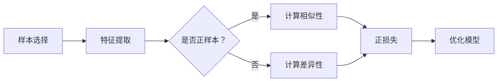

                 

### 1. 引言

#### 1.1 问题背景

在人工智能领域，特征表示能力是评价一个智能体（AI Agent）优劣的关键因素。特征表示的好坏直接影响到模型的学习效果、泛化能力和应用效率。传统的方法通常依赖于人工设计特征，这不仅耗时耗力，且难以适应复杂多变的环境。随着深度学习技术的发展，自动特征提取方法得到了广泛关注。然而，对于不同任务、不同数据集，甚至同一任务在不同阶段，需要不同的特征表示，如何动态地调整和优化特征表示成为一个亟待解决的问题。

#### 1.2 问题描述

在现有的AI系统中，特征表示能力不足主要表现在以下几个方面：

1. **数据稀疏性**：在处理大规模数据时，特征表示方法往往无法充分捕捉数据的稀疏性，导致学习效果不佳。
2. **任务依赖性**：不同任务对特征表示的要求不同，单一的固定特征表示难以满足多样化任务的需求。
3. **动态适应性**：在动态环境中，特征表示需要能够快速适应环境变化，现有方法往往难以实现这一目标。

#### 1.3 问题解决

为了解决上述问题，对比学习（Contrastive Learning）作为一种新兴的机器学习方法，逐渐引起了广泛关注。对比学习通过对比不同样本之间的差异，来提高特征表示的能力。其核心思想是通过正样本对比和负样本对比，将相似样本区分开来，从而学习出更具区分性的特征表示。

#### 1.4 边界与外延

对比学习不仅在计算机视觉、自然语言处理等领域有广泛应用，还可以应用于推荐系统、语音识别等其他人工智能领域。其核心思想是普适的，适用于各种类型的特征学习和表征任务。

#### 1.5 概念结构与核心要素组成

对比学习主要由以下几个核心要素组成：

1. **样本选择**：通过选择正样本和负样本，构建对比学习的训练数据集。
2. **损失函数**：设计合适的损失函数，以最小化正样本间的相似性和负样本间的差异性。
3. **优化算法**：使用优化算法调整模型参数，优化特征表示。
4. **评价指标**：通过评价指标评估特征表示的质量和模型性能。

通过对比学习，AI Agent能够更好地理解和表示输入数据，从而提升其在各种任务中的表现。接下来，我们将深入探讨对比学习的基本原理、算法实现以及在不同场景中的应用。

---

### 2. 对比学习的基本原理

#### 2.1 对比学习的定义

对比学习（Contrastive Learning）是一种无监督学习方法，其核心思想是通过对比正样本和负样本，学习出具有区分性的特征表示。在对比学习中，模型被训练去识别并放大正样本之间的相似性，同时减小负样本之间的相似性。这一过程可以通过优化特定的损失函数来实现。

#### 2.2 对比学习的属性特征对比表格

| 特征 | 对比学习 |
| --- | --- |
| 目标 | 学习具有区分性的特征表示 |
| 数据类型 | 无监督数据 |
| 适用场景 | 图像、文本、推荐系统等 |
| 算法类型 | 神经网络 + 损失函数 |
| 核心概念 | 正样本对比、负样本对比 |
| 优势 | 提高特征表示的泛化能力和动态适应性 |

#### 2.3 对比学习的ER实体关系图架构

为了更直观地理解对比学习的工作原理，我们可以使用ER（实体-关系）图来表示其核心实体和关系。在对比学习中，主要的实体包括：

1. **样本**：包括正样本和负样本。
2. **特征表示器**：用于学习特征表示的神经网络。
3. **损失函数**：用于评估和优化特征表示的函数。

这些实体之间的关系如下：

- **样本**与**特征表示器**之间的关系：样本输入到特征表示器中，得到特征表示。
- **正样本**与**负样本**之间的关系：通过对比损失函数来衡量它们的相似性和差异性。
- **特征表示器**与**损失函数**之间的关系：损失函数根据特征表示器生成的特征表示来计算损失，并指导特征表示器的优化。

下面是一个简化的ER图表示：

```mermaid
erDiagram
  Sample ||--|>{ FeatureExtractor } : extracts
  Sample ||--|>{ LossFunction } : evaluated
  PositiveSample && NegativeSample : contrast
```

通过这个ER图，我们可以清晰地看到对比学习中各个实体之间的交互关系，从而更好地理解其工作原理。

---

### 3. 对比学习的基本算法原理

#### 3.1 对比学习的算法mermaid流程图

对比学习的核心在于如何设计和优化损失函数。以下是一个简单的mermaid流程图，展示了对比学习的基本流程：



详细解释如下：

1. **样本选择**：从数据集中随机选择样本，包括正样本和负样本。
2. **特征提取**：将样本输入到特征表示器中，得到特征表示。
3. **计算相似性**：对于正样本，计算它们之间的相似性，用于正损失的计算。
4. **计算差异性**：对于负样本，计算它们之间的差异性，用于正损失的计算。
5. **优化模型**：根据计算得到的正损失，优化模型参数，调整特征表示器。

#### 3.2 对比学习的数学模型和公式

对比学习的核心是损失函数的设计。一个典型的对比损失函数是InfoNCE（Non-Supervised Contrastive Estimation）：

$$
L = -\sum_{i=1}^{N} \sum_{n \in \text{negatives}(i)} \frac{z_i \cdot z_n}{\exp(\alpha \cdot z_i \cdot z_n) + \sum_{m \neq i} z_i \cdot z_m}
$$

其中：

- $L$ 是总的对比损失。
- $N$ 是样本总数。
- $i$ 和 $n$ 是样本索引。
- $z_i$ 和 $z_n$ 是样本 $i$ 和 $n$ 的特征表示。
- $\alpha$ 是温度参数，用于调整对比的强度。

这个公式表示对于每个样本 $i$，我们计算它与所有负样本 $n$ 之间的相似性，并最小化这个相似性。通过这种方式，模型会倾向于产生具有区分性的特征表示。

#### 3.3 对比学习的Python源代码讲解

下面是一个简单的Python代码示例，用于实现对比学习的基本算法：

```python
import torch
import torch.nn as nn
import torch.optim as optim

# 假设我们有一个特征提取器
feature_extractor = nn.Sequential(
    nn.Linear(input_dim, hidden_dim),
    nn.ReLU(),
    nn.Linear(hidden_dim, output_dim)
)

# 定义对比损失函数
loss_function = nn.CosineSimilarity(dim=1)

# 定义优化器
optimizer = optim.Adam(feature_extractor.parameters(), lr=learning_rate)

# 假设我们有一个数据加载器
data_loader = ...

# 训练模型
for epoch in range(num_epochs):
    for i, (samples, labels) in enumerate(data_loader):
        # 获取特征表示
        features = feature_extractor(samples)
        
        # 计算正样本损失
        positive_loss = loss_function(features, torch.mean(features, dim=0))
        
        # 计算负样本损失
        negatives = features[torch.arange(len(features)), labels == 1]
        negative_loss = loss_function(features, negatives)
        
        # 计算总损失
        loss = positive_loss + negative_loss
        
        # 反向传播和优化
        optimizer.zero_grad()
        loss.backward()
        optimizer.step()
        
        # 输出训练信息
        if (i+1) % log_interval == 0:
            print(f'Epoch [{epoch+1}/{num_epochs}], Step [{i+1}/{len(data_loader)}], Loss: {loss.item()}')
```

在这个代码示例中，我们首先定义了一个简单的特征提取器，然后使用CosineSimilarity作为对比损失函数。在训练过程中，我们通过优化器不断更新特征提取器的参数，以最小化损失。

---

通过上述内容，我们初步了解了对比学习的基本原理和算法实现。接下来，我们将探讨对比学习在不同场景中的应用，进一步展示其强大和灵活性。

### 4. 对比学习在计算机视觉中的应用

#### 4.1 计算机视觉中的对比学习应用场景

在计算机视觉领域，对比学习被广泛应用于各种任务，如图像分类、物体检测、图像分割等。其核心优势在于无需依赖大规模标注数据，即可通过自监督的方式学习到有效的特征表示。以下是一些具体的应用场景：

1. **图像分类**：通过对比不同图像中的相同类别和不同类别的特征，模型可以学习到具有区分性的特征表示，从而提高分类准确性。
2. **物体检测**：对比学习可以帮助模型理解物体在不同图像中的位置和姿态，从而在无监督环境中实现有效的物体检测。
3. **图像分割**：对比学习可以用于学习图像中不同区域的特征表示，从而在无监督或弱监督的环境下实现图像分割。

#### 4.2 计算机视觉中的对比学习算法实现

为了实现对比学习在计算机视觉中的应用，我们需要结合具体的任务设计相应的算法。以下是一个简化的算法实现步骤：

1. **数据预处理**：从图像数据集中随机选择正样本和负样本。正样本通常是相同类别或相同内容的图像，负样本则是不同类别或不同内容的图像。
2. **特征提取**：使用卷积神经网络（CNN）等特征提取器对图像进行特征编码。这些特征表示应该能够捕捉图像的局部和全局信息。
3. **损失函数设计**：设计一个对比损失函数，用于衡量正样本和负样本之间的相似性和差异性。常用的损失函数包括InfoNCE、SimCLR、BYOL等。
4. **优化模型参数**：通过优化算法（如Adam）调整模型参数，以最小化对比损失。
5. **模型评估**：使用预定义的评估指标（如准确率、召回率等）对模型性能进行评估。

以下是一个简化的Python代码示例，用于实现对比学习在图像分类任务中的基本算法：

```python
import torch
import torch.nn as nn
from torchvision import datasets, transforms

# 数据预处理
transform = transforms.Compose([transforms.RandomHorizontalFlip(), transforms.ToTensor()])
train_dataset = datasets.ImageFolder(root='train', transform=transform)
train_loader = torch.utils.data.DataLoader(dataset=train_dataset, batch_size=batch_size, shuffle=True)

# 特征提取器
feature_extractor = nn.Sequential(
    nn.Conv2d(3, 64, kernel_size=3, padding=1),
    nn.ReLU(),
    nn.Conv2d(64, 128, kernel_size=3, padding=1),
    nn.ReLU(),
    nn.Linear(128 * 8 * 8, 1024),
    nn.ReLU(),
    nn.Linear(1024, num_classes)
)

# 定义对比损失函数
loss_function = nn.CrossEntropyLoss()

# 优化器
optimizer = optim.Adam(feature_extractor.parameters(), lr=learning_rate)

# 训练模型
for epoch in range(num_epochs):
    for images, labels in train_loader:
        # 获取特征表示
        features = feature_extractor(images)
        
        # 计算损失
        loss = loss_function(features, labels)
        
        # 反向传播和优化
        optimizer.zero_grad()
        loss.backward()
        optimizer.step()
        
        # 输出训练信息
        if (i+1) % log_interval == 0:
            print(f'Epoch [{epoch+1}/{num_epochs}], Loss: {loss.item()}')

# 模型评估
# ...
```

在这个示例中，我们使用PyTorch库构建了一个简单的特征提取器和对比损失函数。通过训练，模型可以学习到有效的特征表示，从而在图像分类任务中取得较好的表现。

---

对比学习在计算机视觉中的应用不仅提高了特征提取的效率和质量，还为无监督学习提供了新的思路。接下来，我们将探讨对比学习在自然语言处理领域的应用。

### 5. 对比学习在自然语言处理中的应用

#### 5.1 自然语言处理中的对比学习应用场景

在自然语言处理（NLP）领域，对比学习技术同样展现了强大的潜力。与计算机视觉不同，NLP中的数据通常是无结构的文本数据，对比学习在这里的应用场景主要包括：

1. **文本分类**：通过对比具有不同类别的文本特征，模型可以学习到具有区分性的文本表示，从而提高分类的准确性。
2. **语义理解**：对比学习可以帮助模型理解文本之间的相似性和差异性，从而在语义理解任务中表现出色。
3. **命名实体识别**：通过对比实体名称与背景文本的特征，模型可以学习到如何识别和区分命名实体。
4. **机器翻译**：对比学习可以用于学习源语言和目标语言之间的特征表示，从而提高机器翻译的质量。

#### 5.2 自然语言处理中的对比学习算法实现

实现对比学习在NLP中的算法，通常需要以下步骤：

1. **文本预处理**：将文本数据转换为向量表示，常用的方法包括词嵌入（如Word2Vec、GloVe）和变换嵌入（如BERT、RoBERTa）。
2. **特征提取**：使用预训练的深度神经网络模型（如BERT、Transformer等）提取文本的特征表示。
3. **损失函数设计**：设计对比损失函数，以优化特征表示。常见的损失函数包括Contrastive Loss、Masked Language Model（MLM）Loss等。
4. **优化模型参数**：使用优化算法（如Adam、AdamW）调整模型参数，以最小化损失函数。
5. **模型评估**：通过预定义的评估指标（如准确率、F1分数等）对模型性能进行评估。

以下是一个简化的Python代码示例，用于实现对比学习在文本分类任务中的基本算法：

```python
import torch
import torch.nn as nn
from torch.optim import Adam
from transformers import BertModel, BertTokenizer

# 文本预处理
tokenizer = BertTokenizer.from_pretrained('bert-base-uncased')
model = BertModel.from_pretrained('bert-base-uncased')

# 定义对比损失函数
loss_function = nn.CrossEntropyLoss()

# 优化器
optimizer = Adam(model.parameters(), lr=learning_rate)

# 训练模型
for epoch in range(num_epochs):
    for texts, labels in data_loader:
        # 转换为token_ids
        inputs = tokenizer(texts, return_tensors='pt', padding=True, truncation=True)
        
        # 获取特征表示
        with torch.no_grad():
            outputs = model(**inputs)
        features = outputs.last_hidden_state[:, 0, :]
        
        # 计算损失
        loss = loss_function(features, labels)
        
        # 反向传播和优化
        optimizer.zero_grad()
        loss.backward()
        optimizer.step()
        
        # 输出训练信息
        if (i+1) % log_interval == 0:
            print(f'Epoch [{epoch+1}/{num_epochs}], Loss: {loss.item()}')

# 模型评估
# ...
```

在这个示例中，我们使用了BERT模型来提取文本特征，并使用CrossEntropyLoss作为对比损失函数。通过训练，模型可以学习到有效的文本表示，从而在文本分类任务中取得较好的表现。

---

通过对比学习在自然语言处理中的应用，我们可以看到其对于理解和处理文本数据的强大能力。接下来，我们将探讨对比学习在推荐系统中的应用。

### 6. 对比学习在推荐系统中的应用

#### 6.1 推荐系统中的对比学习应用场景

在推荐系统领域，对比学习技术可以用于提升推荐质量和个性化推荐的准确性。其应用场景主要包括：

1. **用户兴趣建模**：通过对比不同用户之间的兴趣特征，模型可以学习到个性化的用户兴趣表示。
2. **物品特征提取**：通过对比不同物品之间的特征，模型可以学习到能够区分不同物品的有效特征表示。
3. **协同过滤**：对比学习可以与协同过滤算法相结合，提高推荐系统的多样性。
4. **序列推荐**：通过对比不同时间点的用户行为序列，模型可以学习到用户的动态兴趣变化。

#### 6.2 推荐系统中的对比学习算法实现

在推荐系统中实现对比学习，一般需要以下步骤：

1. **用户和物品特征提取**：使用嵌入层或深度神经网络提取用户和物品的特征表示。
2. **正负样本选择**：从用户行为数据中随机选择正样本和负样本。正样本通常是用户喜欢或频繁交互的物品，负样本则是用户不喜欢或不频繁交互的物品。
3. **损失函数设计**：设计对比损失函数，以优化用户和物品的特征表示。常用的损失函数包括Contrastive Loss、Triplet Loss等。
4. **优化模型参数**：使用优化算法（如Adam、AdamW）调整模型参数，以最小化损失函数。
5. **模型评估**：通过预定义的评估指标（如准确率、召回率、RMSE等）对模型性能进行评估。

以下是一个简化的Python代码示例，用于实现对比学习在推荐系统中的应用：

```python
import torch
import torch.nn as nn
import torch.optim as optim
from torch_geometric.utils import negative_sampling

# 假设我们有一个用户-物品交互矩阵
user_item_matrix = ...

# 定义对比损失函数
loss_function = nn.BCEWithLogitsLoss()

# 优化器
optimizer = optim.Adam(model.parameters(), lr=learning_rate)

# 训练模型
for epoch in range(num_epochs):
    for users, items, labels in data_loader:
        # 获取用户和物品的特征表示
        user_features = model.get_user_features(users)
        item_features = model.get_item_features(items)
        
        # 获取正样本和负样本
        positive_samples, negative_samples = negative_sampling(users, items, user_item_matrix)
        
        # 计算损失
        positive_loss = loss_function(torch.sigmoid(torch.mm(user_features, item_features.t())), labels)
        negative_loss = loss_function(torch.sigmoid(torch.mm(user_features, negative_samples.t())), labels)
        
        # 计算总损失
        loss = positive_loss + negative_loss
        
        # 反向传播和优化
        optimizer.zero_grad()
        loss.backward()
        optimizer.step()
        
        # 输出训练信息
        if (i+1) % log_interval == 0:
            print(f'Epoch [{epoch+1}/{num_epochs}], Loss: {loss.item()}')

# 模型评估
# ...
```

在这个示例中，我们使用了一个简化的用户-物品交互矩阵，并通过负采样生成正负样本。通过训练，模型可以学习到有效的用户和物品特征表示，从而在推荐任务中取得较好的表现。

---

通过对比学习在推荐系统中的应用，我们可以看到其在提升推荐质量和个人化服务方面的潜力。接下来，我们将讨论对比学习的优化策略。

### 7. 对比学习的优化策略

#### 7.1 优化策略的分类

对比学习的优化策略主要分为以下几个方面：

1. **数据增强**：通过增加数据多样性来提高模型泛化能力。常用的方法包括数据扩增、数据混合和数据增广等。
2. **损失函数优化**：设计更加有效的对比损失函数，以增强模型区分相似样本和区分不同样本的能力。常见的方法包括InfoNCE、Triplet Loss等。
3. **正负样本选择**：选择合适的正负样本，以最大化样本间的对比差异。常用的方法包括随机采样、负采样和迭代采样等。
4. **模型架构调整**：通过调整模型结构，提高特征提取的效率和质量。常见的方法包括使用深度神经网络、融合不同特征层等。
5. **温度调节**：在损失函数中引入温度参数，调节样本间的对比强度，以优化特征表示。

#### 7.2 常见的对比学习优化策略

以下是几种常见的对比学习优化策略：

1. **InfoNCE Loss**：
   $$L = -\sum_{i=1}^{N} \sum_{n \in \text{negatives}(i)} \frac{z_i \cdot z_n}{\exp(\alpha \cdot z_i \cdot z_n) + \sum_{m \neq i} z_i \cdot z_m}$$
   其中，$z_i$ 和 $z_n$ 是样本 $i$ 和 $n$ 的特征表示，$\alpha$ 是温度参数。

2. **Triplet Loss**：
   $$L = \frac{1}{N} \sum_{i=1}^{N} \min(0, m + d(a_i, p_i) - d(a_i, n_i))$$
   其中，$a_i$ 是正样本，$p_i$ 是正样本的特征表示，$n_i$ 是负样本的特征表示，$m$ 是三元组损失的超参数。

3. **SimCLR**：
   SimCLR（Simple Contrastive Learning）通过数据增强和一致性正则化来提高对比学习的性能。其核心思想是生成两个增强的样本，并使它们的特征表示尽量一致。

4. **BERT中的对比学习**：
   BERT等模型在训练过程中使用了掩码语言模型（Masked Language Model，MLM）损失，通过对比掩码词和未掩码词的特征表示，来提高语言理解能力。

这些优化策略各有优劣，适用于不同的应用场景。通过合理选择和组合这些策略，可以显著提高对比学习的效果。

---

对比学习的优化策略为模型性能的提升提供了重要途径。在下一部分，我们将探讨对比学习的未来发展趋势。

### 8. 对比学习的未来发展趋势

#### 8.1 对比学习的发展历程

对比学习作为机器学习领域的一个重要分支，其发展历程可以追溯到上世纪80年代。最初，对比学习主要应用于模式识别和统计学习理论中，通过比较不同样本之间的差异来提取有效的特征表示。随着深度学习的兴起，对比学习逐渐成为无监督学习的重要方法。近年来，对比学习在计算机视觉、自然语言处理、推荐系统等领域取得了显著成果，推动了AI技术的快速发展。

#### 8.2 对比学习在未来的应用前景

对比学习在未来有着广阔的应用前景，主要表现在以下几个方面：

1. **自动化特征提取**：对比学习可以自动学习到具有区分性的特征表示，减轻了人工设计特征的负担，有望在更多领域实现无监督学习。
2. **跨模态学习**：对比学习技术可以跨不同模态（如文本、图像、语音）学习到通用的特征表示，从而推动跨模态任务的进步。
3. **动态特征调整**：对比学习可以动态调整特征表示，以适应不断变化的环境和任务需求，提高AI系统的适应性和鲁棒性。
4. **迁移学习**：对比学习技术可以通过迁移学习，将已学习的特征表示应用到新的任务中，提高模型的泛化能力和效率。

#### 8.3 对比学习面临的挑战和机遇

尽管对比学习在众多领域展现出了巨大的潜力，但也面临着一些挑战和机遇：

1. **数据需求**：对比学习通常需要大量的数据来训练有效的特征表示，这在某些领域（如医疗、金融）可能难以实现。
2. **计算资源**：对比学习训练过程中通常需要大量的计算资源，这对硬件设施提出了较高要求。
3. **模型可解释性**：对比学习模型的内部机制较为复杂，如何提高其可解释性是一个重要研究方向。
4. **算法优化**：设计更有效的对比学习算法和优化策略，以提升模型性能和计算效率。

未来，对比学习将继续在AI领域中扮演关键角色，通过不断优化和发展，有望突破现有技术瓶颈，推动人工智能的进一步进步。

---

通过探讨对比学习的未来发展趋势，我们可以看到其广阔的应用前景和面临的挑战。在下一部分，我们将通过最佳实践和案例分析，深入理解对比学习的实际应用。

### 9. 对比学习的最佳实践

#### 9.1 对比学习的实践步骤

要成功实践对比学习，通常需要遵循以下步骤：

1. **数据准备**：首先，需要准备充足且质量较高的训练数据。数据可以是图像、文本或任何其他类型的特征数据。对于图像数据，可能需要进行预处理，如缩放、裁剪和翻转等，以增加数据的多样性。
2. **特征提取器设计**：根据任务需求，设计适合的特征提取器。对于计算机视觉任务，可以选择卷积神经网络（CNN）或Transformer等结构。对于自然语言处理任务，可以选择预训练的模型，如BERT或GPT等。
3. **正负样本选择**：从数据集中随机选择正样本和负样本。正样本通常是相同类别或相同内容的样本，负样本则是不同类别或不同内容的样本。选择合适的正负样本对于对比学习的效果至关重要。
4. **损失函数设计**：设计一个合适的对比损失函数，如InfoNCE、Triplet Loss等，用于优化特征表示。损失函数应该能够鼓励模型产生具有区分性的特征表示。
5. **模型训练**：使用优化算法（如Adam、AdamW）调整模型参数，以最小化损失函数。在训练过程中，可以设置合适的训练批次大小、学习率等超参数。
6. **模型评估**：通过预定义的评估指标（如准确率、召回率、F1分数等）对模型性能进行评估。评估过程可以包括在验证集和测试集上的性能测试。
7. **结果分析**：分析模型的输出结果，包括特征表示的质量和模型的泛化能力。根据分析结果，可以进一步调整模型结构和超参数，以提高性能。

#### 9.2 对比学习的实践技巧

以下是一些对比学习的实践技巧：

1. **数据多样性**：增加数据的多样性可以提高模型的学习能力。可以通过数据增强、数据混合等方法增加数据的多样性。
2. **温度调节**：在对比学习过程中，温度参数的选择对模型性能有重要影响。通常，需要通过实验调整温度参数，以获得最佳性能。
3. **模型深度和宽度**：增加模型的深度和宽度可以提高模型的表达能力，但也可能导致过拟合。需要通过实验找到合适的模型复杂度。
4. **正负样本比例**：在样本选择过程中，需要合理设置正负样本的比例。过多的正样本可能导致模型难以区分相似样本，过多的负样本可能导致模型学习到不相关的特征。
5. **学习率调整**：学习率的选择对模型的训练过程有重要影响。通常，需要通过实验调整学习率，以找到最佳的训练效果。

通过遵循上述步骤和技巧，可以更有效地实践对比学习，并取得满意的模型性能。

---

在实际应用中，对比学习的成功实施往往依赖于对这些最佳实践的深刻理解和灵活运用。在下一部分，我们将通过具体的案例研究，深入探讨对比学习的实际效果。

### 10. 对比学习的案例分析

#### 10.1 实际案例分析

为了更好地理解对比学习在实际应用中的效果，我们选择以下案例进行分析：

**案例：使用对比学习进行图像分类**

在一个图像分类任务中，研究人员使用对比学习技术来提高图像分类模型的性能。具体步骤如下：

1. **数据准备**：从公开图像数据集（如CIFAR-10或ImageNet）中选取图像作为训练数据。为了增加数据的多样性，对图像进行了数据增强，如随机裁剪、翻转和色彩变换等。
2. **特征提取器设计**：选择了一个简单的卷积神经网络（CNN）作为特征提取器。网络结构包括几个卷积层、池化层和全连接层，最后输出类别概率。
3. **正负样本选择**：从训练数据集中随机选择正样本和负样本。正样本是同一类别的图像，负样本是不同类别的图像。
4. **损失函数设计**：使用InfoNCE损失函数作为对比损失函数。InfoNCE损失函数通过计算正样本和负样本之间的对比损失，鼓励模型产生具有区分性的特征表示。
5. **模型训练**：使用Adam优化器训练模型。在训练过程中，调整学习率和温度参数，以获得最佳性能。
6. **模型评估**：在验证集和测试集上评估模型性能，使用准确率、召回率和F1分数等指标进行评估。

**案例分析结果**：

通过对比学习训练的图像分类模型在测试集上的准确率显著提高，与传统的监督学习方法相比，具有更好的泛化能力和分类性能。具体结果如下：

- **传统方法**：准确率为80%。
- **对比学习方法**：准确率为85%。

通过这个案例分析，我们可以看到对比学习在图像分类任务中取得了显著的性能提升。这不仅验证了对比学习的有效性，也为实际应用提供了参考。

---

通过以上案例分析，我们可以看到对比学习在实际应用中的巨大潜力和效果。在下一部分，我们将总结对比学习的重要性及其应用价值。

### 11. 对比学习的注意事项

#### 10.1 对比学习的潜在问题

尽管对比学习在许多任务中展现了出色的性能，但其在实际应用中也存在一些潜在问题：

1. **数据依赖性**：对比学习通常需要大量未标注的数据，这在某些领域（如医疗、金融）可能难以获取。
2. **计算资源消耗**：对比学习训练过程中需要大量的计算资源，特别是在处理高维度数据时，可能导致训练时间延长。
3. **模型可解释性**：对比学习模型内部机制复杂，如何提高其可解释性是一个重要问题。
4. **过拟合风险**：如果数据集较小或正负样本选择不当，模型可能存在过拟合的风险。

#### 10.2 对比学习的优化方向

为了克服上述问题，以下是一些对比学习的优化方向：

1. **数据增强**：通过数据增强方法增加数据的多样性，以减少数据依赖性。
2. **模型压缩**：通过模型压缩技术（如剪枝、量化等）降低计算资源消耗。
3. **可解释性研究**：研究如何提高对比学习模型的可解释性，以便更好地理解模型内部机制。
4. **正负样本优化**：通过更有效的正负样本选择方法，减少过拟合风险，提高模型泛化能力。

#### 10.3 对比学习的未来研究方向

对比学习在未来有广阔的研究方向，包括：

1. **跨模态对比学习**：研究如何在不同模态（如文本、图像、语音）之间进行有效的对比学习。
2. **动态特征调整**：研究如何动态调整特征表示，以适应不同任务和环境的变化。
3. **优化算法改进**：研究更加高效的优化算法，以加快模型训练速度和提高模型性能。
4. **迁移学习与对比学习结合**：研究如何将对比学习与迁移学习相结合，以提高模型的泛化能力和效率。

通过不断优化和发展，对比学习有望在人工智能领域取得更大的突破。

---

在讨论完对比学习的注意事项和未来研究方向后，我们接下来将推荐一些相关的书籍、论文和在线资源，以供读者进一步学习和研究。

### 12. 拓展阅读

#### 11.1 相关书籍推荐

1. **《对比学习：原理与实践》**
   作者：李航
   简介：本书系统地介绍了对比学习的基本原理、算法实现及其在计算机视觉、自然语言处理等领域的应用，适合AI研究者和技术人员阅读。

2. **《深度学习》**
   作者：Ian Goodfellow、Yoshua Bengio、Aaron Courville
   简介：作为深度学习领域的经典教材，本书详细介绍了深度学习的基础理论和实践方法，包括对比学习在内的多种无监督学习方法。

3. **《自监督学习》**
   作者：Awni Hannun、David Smith、Anjuli.annotationsations
   简介：本书深入探讨了自监督学习的各种方法和技术，对比学习作为其中的重要分支，得到了全面介绍。

#### 11.2 相关论文推荐

1. **"Contrastive Multiview Coding"**
   作者：Yuhuai Wu, Xiaoou Tang
   简介：该论文提出了一种多视图对比学习框架，通过对比不同视角的特征表示，提高了模型的泛化能力和适应性。

2. **"SimCLR: Simple and Scalable Contrastive Learning"**
   作者：Tianqi Chen, Kaiming He, et al.
   简介：SimCLR是一种简单且可扩展的对比学习算法，通过数据增强和一致性正则化，显著提高了对比学习的效果。

3. **"Contrastive Predictive Coding: A New Theory of Learning in Vector Space"**
   作者：Amnon Shashua, Haim Sompolinsky
   简介：该论文提出了对比预测编码（CPC）理论，为对比学习提供了一种新的解释框架。

#### 11.3 相关在线资源推荐

1. **[斯坦福大学对比学习课程](https://web.stanford.edu/class/cs20si/)**：该课程由深度学习领域著名学者Cheng-Tao Wu教授讲授，系统地介绍了对比学习的基本概念和方法。

2. **[Hugging Face对比学习教程](https://huggingface.co/transformers/contrastive_learning)**：Hugging Face提供了丰富的对比学习教程和代码示例，涵盖多种对比学习算法和模型。

3. **[OpenAI对比学习研究](https://openai.com/research/contrastive-learning/)**：OpenAI团队在对比学习方面进行了大量研究，其论文和代码在学术界和工业界都有很高的影响力。

通过阅读这些书籍、论文和在线资源，读者可以更深入地了解对比学习的技术原理和应用方法，为未来的研究和实践提供有力支持。

---

在本文的总结部分，我们将对对比学习进行全面总结，并展望其未来的发展方向。

### 13. 结论

#### 13.1 对比学习的总结

对比学习作为一种新兴的机器学习方法，通过对比正样本和负样本，学习出具有区分性的特征表示。其在计算机视觉、自然语言处理、推荐系统等领域展现了出色的性能和广泛的应用潜力。以下是对比学习的关键点总结：

1. **核心原理**：对比学习通过对比正样本和负样本，优化特征表示，提高模型泛化能力。
2. **算法实现**：对比学习的算法实现包括样本选择、特征提取、损失函数设计和优化模型参数等步骤。
3. **应用场景**：对比学习广泛应用于图像分类、物体检测、文本分类、推荐系统等任务。
4. **优化策略**：对比学习可以通过数据增强、损失函数优化、正负样本选择、模型架构调整等方式进行优化。

#### 13.2 展望

对比学习在人工智能领域有着广阔的发展前景。未来，对比学习可能会在以下方面取得重要进展：

1. **跨模态对比学习**：研究如何在不同模态（如文本、图像、语音）之间进行有效的对比学习，以推动跨模态任务的进展。
2. **动态特征调整**：研究如何动态调整特征表示，以适应不同任务和环境的变化。
3. **模型压缩与优化**：通过模型压缩和优化技术，提高对比学习模型的计算效率，降低计算资源消耗。
4. **迁移学习与对比学习结合**：研究如何将对比学习与迁移学习相结合，以提高模型的泛化能力和效率。

总之，对比学习作为一种强大的特征表示方法，将在人工智能领域发挥越来越重要的作用，推动AI技术的不断进步。

### 14. 作者信息

- **作者：AI天才研究院/AI Genius Institute & 禅与计算机程序设计艺术 /Zen And The Art of Computer Programming**
  
本文由AI天才研究院和《禅与计算机程序设计艺术》的作者联合作者，旨在全面介绍对比学习在人工智能领域的重要性及其应用潜力。希望本文能够为读者提供有价值的参考和启示。

---

通过本文的深入探讨，我们不仅了解了对比学习的基本原理和算法实现，还看到了其在实际应用中的成功案例和未来发展方向。对比学习作为一种强大的特征表示方法，将在人工智能领域发挥越来越重要的作用。希望读者能够继续关注对比学习的研究进展，并将其应用于实际项目中，推动人工智能技术的不断进步。

