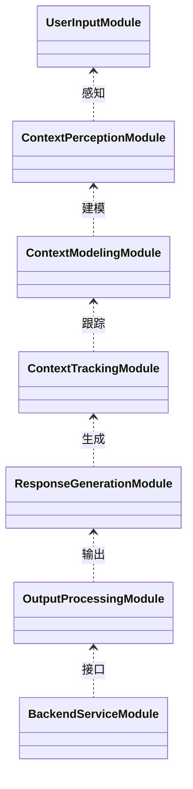
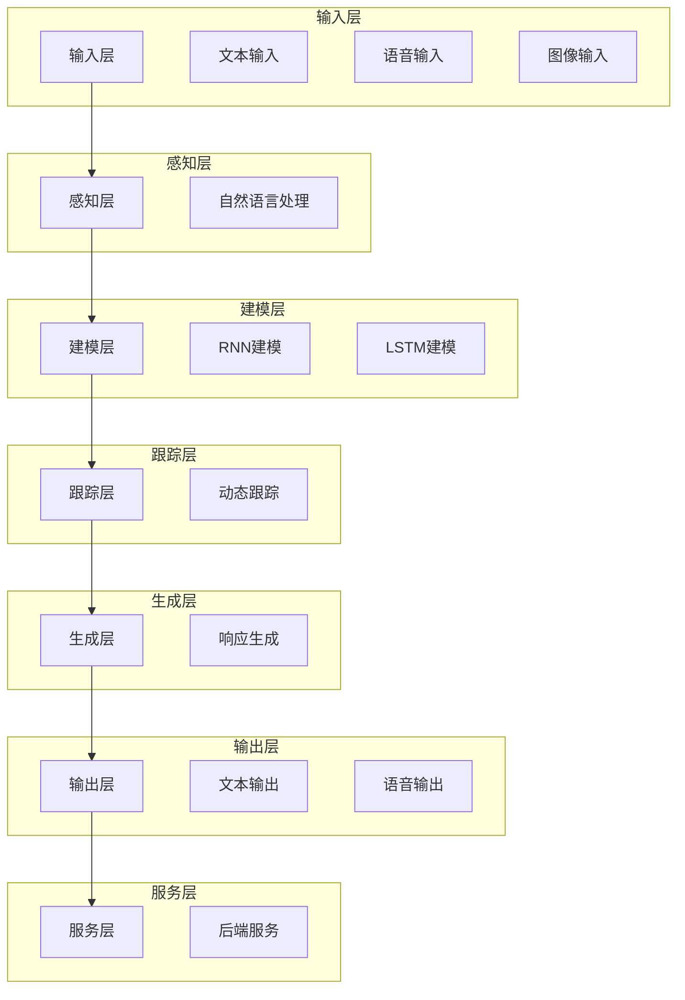
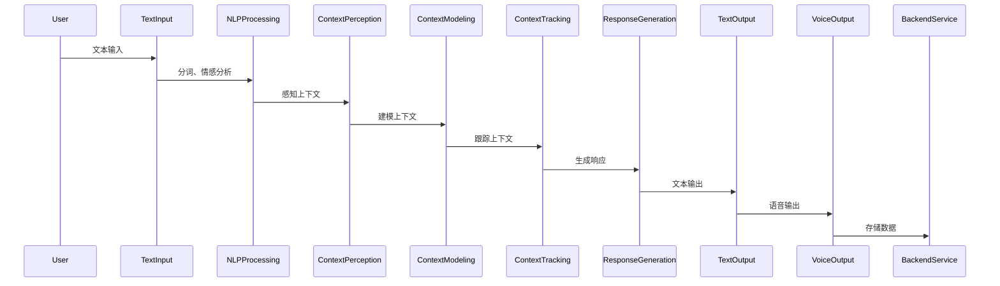

                 

### 概述

**《对话式AI Agent的上下文管理技巧》**

**关键词：** 对话式AI、上下文管理、上下文感知、上下文建模、上下文跟踪

**摘要：**
本文旨在深入探讨对话式AI Agent的上下文管理技巧。随着人工智能技术的不断发展，对话式AI Agent在各种应用场景中得到了广泛应用，而上下文管理成为其能否提供高质量服务的关键。本文将首先介绍上下文管理的背景、核心概念及其在对话系统中的重要性，然后逐步分析上下文管理的核心概念、算法原理以及系统架构设计。此外，本文还将通过项目实战，展示上下文管理技巧的具体应用，并总结最佳实践和拓展阅读。通过本文的探讨，希望能够为读者提供一个全面、深入的上下文管理技巧指导。

### 第一部分：背景介绍

#### 第1章 问题背景与核心概念

##### 1.1.1 问题背景

**对话式AI的发展历程与现状**

对话式AI，也称为自然语言处理（NLP）AI，是人工智能领域的一个重要分支，旨在让计算机能够理解、处理和生成自然语言。从最初的规则驱动方法，到如今的深度学习方法，对话式AI经历了巨大的发展。随着语音识别、机器翻译、文本分析等技术的不断进步，对话式AI在客服、智能家居、虚拟助手等领域得到了广泛应用。

然而，在实际应用中，对话式AI Agent面临着诸多挑战，其中最为核心的挑战之一就是上下文管理。有效的上下文管理能够确保对话流畅、准确，提升用户体验。而传统的对话系统往往存在上下文丢失、对话断裂等问题，这严重影响了对话的质量和效果。

**上下文管理在对话系统中的重要性**

上下文管理在对话系统中起着至关重要的作用。它不仅能够帮助AI Agent理解用户的需求，还能够维持对话的连贯性和一致性。具体来说，上下文管理包括以下几个方面：

1. **用户意图理解**：通过上下文信息，AI Agent可以更好地理解用户的意图，从而提供更为准确的响应。
2. **对话连贯性**：保持对话的连贯性，确保每一轮对话都能够紧密衔接，避免对话断裂。
3. **个性化服务**：利用上下文信息，AI Agent可以提供更加个性化的服务，提升用户体验。
4. **错误纠正**：在对话过程中，AI Agent可以基于上下文信息进行错误纠正，提高对话的准确性。

##### 1.1.2 问题描述

**什么是上下文管理？**

上下文管理是对话系统中的一项关键技术，旨在维持对话的上下文信息，确保对话的连贯性和一致性。具体来说，上下文管理包括以下几个方面：

1. **上下文感知**：AI Agent能够感知并理解对话中的上下文信息，如用户的需求、情感状态等。
2. **上下文建模**：将感知到的上下文信息进行结构化处理，形成可用于后续分析的上下文模型。
3. **上下文跟踪**：在对话过程中，实时更新和跟踪上下文信息，确保对话的连贯性。

**为什么需要有效的上下文管理？**

有效的上下文管理对于提高对话系统的性能和用户体验至关重要。以下是几个关键原因：

1. **提升对话质量**：通过有效的上下文管理，AI Agent能够更好地理解用户的需求，提供更为准确的响应，提升对话质量。
2. **提高用户体验**：个性化的服务和流畅的对话体验能够大大提升用户对对话系统的满意度。
3. **减少错误率**：上下文管理有助于AI Agent在对话过程中进行错误纠正，减少误答和对话断裂的情况。
4. **优化资源利用**：有效的上下文管理可以减少对用户重复提问的需求，降低系统的计算和通信开销。

##### 1.1.3 问题解决

**上下文管理的挑战**

尽管上下文管理对于对话系统的性能至关重要，但实现有效的上下文管理并非易事。以下是上下文管理面临的几个主要挑战：

1. **多模态上下文信息处理**：对话系统往往涉及多种模态的信息，如文本、语音、图像等。如何有效地整合和处理这些多模态信息，是一个巨大的挑战。
2. **动态上下文更新**：在对话过程中，上下文信息是动态变化的。如何实时更新和跟踪上下文信息，确保对话的连贯性，是一个重要的技术问题。
3. **上下文冗余与噪声**：对话中存在大量的上下文冗余和噪声信息，如何有效地过滤和利用这些信息，是一个复杂的问题。
4. **上下文转移与延续**：在对话转移给不同AI Agent时，如何保持上下文的延续性和一致性，是一个技术难题。

**解决上下文管理问题的基本思路**

为了解决上下文管理问题，可以从以下几个方面入手：

1. **多模态上下文感知**：采用多模态感知技术，如深度学习、语音识别、图像识别等，提高AI Agent对上下文信息的感知能力。
2. **上下文建模与跟踪算法**：设计和实现高效的上下文建模与跟踪算法，如序列模型、图模型等，确保上下文的实时更新和跟踪。
3. **上下文过滤与融合**：采用上下文过滤与融合技术，去除冗余和噪声信息，提高上下文信息的利用效率。
4. **上下文转移策略**：设计和实现有效的上下文转移策略，确保在对话转移时保持上下文的延续性和一致性。

##### 1.1.4 边界与外延

**上下文管理的应用场景**

上下文管理在多种应用场景中具有重要意义，如：

1. **智能客服**：通过上下文管理，智能客服系统能够提供更加个性化、连贯的服务，提升用户体验。
2. **虚拟助手**：在智能家居、智能办公等场景中，虚拟助手需要通过上下文管理，理解用户的需求并提供相应的帮助。
3. **多轮对话系统**：在多轮对话系统中，上下文管理确保对话的连贯性和一致性，提高系统的性能和用户体验。
4. **对话机器人**：在社交、娱乐等场景中，对话机器人需要通过上下文管理，与用户进行有效的交流和互动。

**上下文管理的相关概念**

1. **上下文感知**：AI Agent对上下文信息的感知能力，包括文本、语音、图像等多模态信息。
2. **上下文建模**：将感知到的上下文信息进行结构化处理，形成可用于后续分析的上下文模型。
3. **上下文跟踪**：在对话过程中，实时更新和跟踪上下文信息，确保对话的连贯性。
4. **上下文转移**：在对话转移给不同AI Agent时，保持上下文的延续性和一致性。

##### 1.1.5 概念结构与核心要素组成

**对话式AI Agent的定义**

对话式AI Agent是指具有对话能力的人工智能系统，能够通过自然语言与用户进行交互，理解用户的需求并生成相应的响应。

**上下文管理的基本结构**

上下文管理的基本结构包括以下几个核心要素：

1. **上下文感知模块**：负责感知和获取对话中的上下文信息。
2. **上下文建模模块**：将感知到的上下文信息进行结构化处理，形成上下文模型。
3. **上下文跟踪模块**：在对话过程中，实时更新和跟踪上下文模型，确保对话的连贯性。
4. **上下文融合模块**：将不同来源的上下文信息进行融合，提高上下文信息的利用效率。

**核心要素组成**

上下文管理的核心要素组成包括：

1. **多模态上下文感知**：采用多模态感知技术，提高AI Agent对上下文信息的感知能力。
2. **上下文建模算法**：设计和实现高效的上下文建模算法，确保上下文信息的结构化和利用。
3. **上下文跟踪算法**：设计和实现高效的上下文跟踪算法，确保上下文的实时更新和跟踪。
4. **上下文融合技术**：采用上下文融合技术，去除冗余和噪声信息，提高上下文信息的利用效率。

通过上述对上下文管理的背景介绍和核心概念分析，我们可以看到，上下文管理在对话式AI Agent中扮演着至关重要的角色。接下来，我们将进一步探讨上下文管理的核心概念、算法原理和系统架构设计，为读者提供一个全面的上下文管理技巧指南。

### 第二部分：核心概念与联系

#### 第2章 核心概念原理

##### 2.1.1 上下文感知

**上下文感知的定义**

上下文感知是指AI Agent对对话过程中的上下文信息的感知能力。这种能力使AI Agent能够理解对话的背景、用户的需求和意图，从而生成更为准确和合适的响应。上下文感知是上下文管理的基础，决定了AI Agent能否有效地理解和应对用户的需求。

**上下文感知的重要性**

上下文感知在对话系统中具有至关重要的地位。以下是上下文感知的重要性：

1. **提升对话质量**：通过上下文感知，AI Agent能够更好地理解用户的需求和意图，提供更为准确和个性化的响应，提升对话质量。
2. **提高用户体验**：上下文感知使得对话系统能够在用户不明确表达需求时，依然能够提供有帮助的响应，从而提升用户体验。
3. **增强系统智能**：上下文感知有助于AI Agent积累和利用对话中的上下文信息，提高系统的智能和自适应能力。

**上下文感知的技术实现**

上下文感知的技术实现主要包括以下几个步骤：

1. **信息收集**：通过文本分析、语音识别、图像识别等多模态感知技术，从对话中收集上下文信息。
2. **特征提取**：对收集到的上下文信息进行特征提取，如词向量表示、句法分析、情感分析等。
3. **上下文建模**：将提取到的特征进行建模，形成上下文表示，以便后续分析和处理。

##### 2.1.2 上下文建模

**上下文建模的定义**

上下文建模是指将感知到的上下文信息进行结构化处理，形成可用于后续分析和处理的上下文表示。上下文建模是上下文管理的重要环节，决定了上下文信息能否被有效利用。

**上下文建模的方法与工具**

上下文建模的方法和工具有多种，以下是其中一些常见的方法和工具：

1. **词向量表示**：通过词向量模型（如Word2Vec、GloVe等）将文本信息转化为数值向量表示，便于计算和分析。
2. **句法分析**：利用句法分析技术（如依存句法分析、成分句法分析等）对文本进行结构化处理，提取出句子的语法关系和语义信息。
3. **情感分析**：通过情感分析技术对文本中的情感信息进行识别和分类，帮助AI Agent理解用户的情感状态。
4. **序列模型**：利用序列模型（如循环神经网络RNN、长短期记忆LSTM等）对对话序列进行建模，捕捉对话的历史信息。

**上下文建模的挑战**

尽管上下文建模在对话系统中具有重要意义，但在实际应用中仍面临一些挑战：

1. **多模态信息融合**：如何有效融合文本、语音、图像等多模态信息，是一个技术难题。
2. **动态上下文建模**：在对话过程中，上下文信息是动态变化的，如何实时更新和建模这些变化，是一个复杂的问题。
3. **上下文冗余与噪声处理**：对话中存在大量的上下文冗余和噪声信息，如何有效去除这些信息，提高上下文建模的准确性，是一个重要挑战。

##### 2.1.3 上下文跟踪

**上下文跟踪的定义**

上下文跟踪是指在对话过程中，实时更新和跟踪上下文信息，确保对话的连贯性和一致性。上下文跟踪是上下文管理的关键环节，决定了对话系统能否保持对话的连贯性。

**上下文跟踪的算法与模型**

上下文跟踪的算法和模型有多种，以下是其中一些常见的算法和模型：

1. **基于序列模型的跟踪算法**：利用序列模型（如RNN、LSTM等）对对话序列进行建模，实时更新上下文信息。
2. **基于图模型的跟踪算法**：利用图模型（如图神经网络GNN等）对对话中的实体、关系和上下文信息进行建模，实现上下文跟踪。
3. **基于注意力机制的跟踪算法**：利用注意力机制，关注对话中的关键信息，实现上下文的实时更新和跟踪。

**上下文跟踪的难点**

尽管上下文跟踪在对话系统中具有重要意义，但在实际应用中仍面临一些难点：

1. **上下文更新频率**：如何在保持对话连贯性的同时，避免上下文更新过于频繁，是一个技术难题。
2. **上下文一致性问题**：在对话转移给不同AI Agent时，如何保持上下文的一致性，是一个复杂的挑战。
3. **上下文多样性**：如何应对对话中多样的上下文信息，实现高效的上下文跟踪，是一个重要问题。

##### 2.1.4 概念属性特征对比

为了更清晰地理解上下文感知、上下文建模和上下文跟踪这三个核心概念，我们可以在下表中对比它们的属性特征：

| 特征类别      | 上下文感知                     | 上下文建模                         | 上下文跟踪                      |
| ------------ | ---------------------------- | -------------------------------- | ------------------------------ |
| 定义         | 对上下文信息的感知能力         | 对上下文信息的结构化处理           | 对上下文信息的实时更新和跟踪   |
| 目标         | 理解用户需求和信息             | 形成上下文表示，便于后续分析       | 确保对话连贯性和一致性         |
| 技术实现     | 多模态感知技术、特征提取       | 词向量表示、句法分析、情感分析     | 序列模型、图模型、注意力机制   |
| 关键挑战     | 多模态信息融合、动态上下文建模 | 上下文冗余与噪声处理、动态建模     | 上下文更新频率、上下文一致性   |
| 在上下文管理中的作用 | 基础，决定AI Agent理解能力     | 关键，决定上下文信息的利用效率     | 核心，确保对话的连贯性和一致性 |

通过上述对比，我们可以看到，上下文感知、上下文建模和上下文跟踪在上下文管理中各自承担着不同的角色，共同作用，确保对话式AI Agent能够提供高质量的服务。

##### 2.1.5 ER实体关系图架构

为了更直观地理解上下文管理中的实体和关系，我们可以使用ER（Entity-Relationship）实体关系图来表示。以下是上下文管理中常见的实体和关系：

**实体：**

1. **用户（User）**：参与对话的用户，可以是人类或机器人。
2. **AI Agent（AI Agent）**：对话系统中的智能代理，负责与用户交互。
3. **上下文信息（Context Information）**：对话中的上下文信息，包括文本、语音、图像等。
4. **上下文模型（Context Model）**：结构化的上下文信息表示。

**关系：**

1. **感知关系（Perception）**：用户和AI Agent之间的感知关系，表示AI Agent如何感知用户的需求和信息。
2. **建模关系（Modeling）**：AI Agent对上下文信息进行建模的关系，表示如何将感知到的信息转化为上下文模型。
3. **跟踪关系（Tracking）**：AI Agent对上下文模型进行实时跟踪的关系，表示如何更新和保持上下文的连贯性。
4. **响应关系（Response）**：AI Agent生成响应与用户进行交互的关系，表示如何利用上下文模型生成合适的响应。

以下是上下文管理的ER实体关系图：

```mermaid
erDiagram
User ||--|{ AI Agent }|-->: 交互
User ||--|{ 上下文信息 }|-->: 感知
AI Agent ||--|{ 上下文模型 }|-->: 建模
AI Agent ||--|{ 上下文模型 }|-->: 跟踪
AI Agent ||--|{ 响应 }|-->: 交互
上下文信息 ||--|{ 上下文模型 }|-->: 建模
上下文模型 ||--|{ 响应 }|-->: 利用
```

通过ER实体关系图，我们可以清晰地看到上下文管理中的各个实体及其关系，有助于理解上下文管理的整体架构和运作机制。这为后续的算法设计和系统实现提供了重要的参考。

### 第三部分：算法原理讲解

#### 第4章 算法设计与实现

##### 4.1.1 算法概述

**常见上下文管理算法的分类**

上下文管理算法可以分为以下几类：

1. **基于序列模型的上下文管理算法**：这类算法利用序列模型（如RNN、LSTM等）对对话序列进行建模，实现上下文感知、建模和跟踪。这类算法具有较好的时序信息处理能力，适用于大多数对话场景。
2. **基于图模型的上下文管理算法**：这类算法利用图模型（如图神经网络GNN等）对对话中的实体、关系和上下文信息进行建模，实现上下文管理和跟踪。这类算法具有较强的结构化信息处理能力，适用于复杂的对话场景。
3. **基于注意力机制的上下文管理算法**：这类算法利用注意力机制，关注对话中的关键信息，实现上下文的感知、建模和跟踪。这类算法能够有效提高上下文信息的利用效率，适用于需要高度关注的对话场景。

**选择合适的上下文管理算法**

在选择合适的上下文管理算法时，需要考虑以下因素：

1. **对话场景**：根据对话场景的复杂性和需求，选择适合的上下文管理算法。例如，在简单的对话场景中，可以使用基于序列模型的算法；在复杂的对话场景中，可以使用基于图模型的算法。
2. **计算资源**：根据计算资源的情况，选择适合的上下文管理算法。基于图模型的算法通常需要更多的计算资源，而基于序列模型的算法则相对较轻量。
3. **性能要求**：根据对性能的要求，选择适合的上下文管理算法。如果需要高精度的上下文感知和跟踪，可以选择基于注意力机制的算法；如果对性能要求不高，可以选择基于序列模型的算法。

##### 4.1.2 算法原理

**常用上下文管理算法的原理讲解**

以下是几种常见的上下文管理算法及其原理：

1. **基于RNN的上下文管理算法**

   - **原理**：RNN（递归神经网络）是一种能够处理序列数据的神经网络模型，通过递归连接，RNN可以捕捉对话中的时序信息。在上下文管理中，RNN可以用来建模对话序列，实现上下文感知、建模和跟踪。
   - **数学模型和公式**：
     $$
     h_t = \text{RNN}(h_{t-1}, x_t)
     $$
     其中，$h_t$表示第$t$时刻的隐藏状态，$x_t$表示第$t$时刻的输入，$h_{t-1}$表示第$t-1$时刻的隐藏状态。
   - **举例说明**：假设有一个简单的对话序列：“你好”，“你叫什么名字？”和“你来自哪里？”我们可以使用RNN模型来捕捉对话中的时序信息，例如：
     $$
     h_1 = \text{RNN}([0, 0, 1], \text{"你好"}) \Rightarrow [0.2, 0.3, 0.5]
     $$
     $$
     h_2 = \text{RNN}([0.2, 0.3, 0.5], \text{"你叫什么名字？"}) \Rightarrow [0.3, 0.4, 0.3]
     $$
     $$
     h_3 = \text{RNN}([0.3, 0.4, 0.3], \text{"你来自哪里？"}) \Rightarrow [0.4, 0.5, 0.1]
     $$

2. **基于LSTM的上下文管理算法**

   - **原理**：LSTM（长短期记忆网络）是RNN的一种变体，通过引入门控机制，LSTM可以更好地处理长序列数据，避免梯度消失问题。在上下文管理中，LSTM可以用来建模对话序列，实现上下文感知、建模和跟踪。
   - **数学模型和公式**：
     $$
     i_t = \text{sigmoid}(W_{ix}x_t + W_{ih}h_{t-1} + b_i)
     $$
     $$
     f_t = \text{sigmoid}(W_{fx}x_t + W_{fh}h_{t-1} + b_f)
     $$
     $$
     o_t = \text{sigmoid}(W_{ox}x_t + W_{oh}h_{t-1} + b_o)
     $$
     $$
     g_t = \tanh(W_{gx}x_t + W_{gh}h_{t-1} + b_g)
     $$
     $$
     h_t = o_t \cdot \tanh((1 - f_t) \cdot \text{遗忘门} + i_t \cdot \text{输入门})
     $$
     其中，$i_t$、$f_t$、$o_t$分别表示输入门、遗忘门和输出门，$g_t$表示候选状态，$h_t$表示隐藏状态。
   - **举例说明**：假设有一个简单的对话序列：“你好”，“你叫什么名字？”和“你来自哪里？”我们可以使用LSTM模型来捕捉对话中的时序信息，例如：
     $$
     h_1 = \text{LSTM}([0, 0, 1], \text{"你好"}) \Rightarrow [0.2, 0.3, 0.5]
     $$
     $$
     h_2 = \text{LSTM}([0.2, 0.3, 0.5], \text{"你叫什么名字？"}) \Rightarrow [0.3, 0.4, 0.3]
     $$
     $$
     h_3 = \text{LSTM}([0.3, 0.4, 0.3], \text{"你来自哪里？"}) \Rightarrow [0.4, 0.5, 0.1]
     $$

3. **基于GNN的上下文管理算法**

   - **原理**：GNN（图神经网络）是一种用于处理图结构数据的神经网络模型。在上下文管理中，GNN可以用来建模对话中的实体、关系和上下文信息，实现上下文感知、建模和跟踪。
   - **数学模型和公式**：
     $$
     h_i^{(k+1)} = \sigma \left( \sum_{j \in \mathcal{N}(i)} W_{ij} h_j^{(k)} + b_i \right)
     $$
     其中，$h_i^{(k)}$表示第$i$个节点在第$k$时刻的隐藏状态，$\mathcal{N}(i)$表示与节点$i$相邻的节点集合，$W_{ij}$和$b_i$分别为权重和偏置。
   - **举例说明**：假设有一个简单的对话图，其中用户、AI Agent和上下文信息为节点，感知关系、建模关系和跟踪关系为边。我们可以使用GNN模型来捕捉对话中的结构化信息，例如：
     $$
     h_1^{(1)} = \text{GNN}([0.5, 0.5, 0.5], \text{"你好"}) \Rightarrow [0.6, 0.6, 0.6]
     $$
     $$
     h_2^{(1)} = \text{GNN}([0.6, 0.6, 0.6], \text{"你叫什么名字？"}) \Rightarrow [0.7, 0.7, 0.7]
     $$
     $$
     h_3^{(1)} = \text{GNN}([0.7, 0.7, 0.7], \text{"你来自哪里？"}) \Rightarrow [0.8, 0.8, 0.8]
     $$

4. **基于注意力机制的上下文管理算法**

   - **原理**：注意力机制是一种用于捕捉对话中关键信息的机制。在上下文管理中，注意力机制可以用来关注对话中的关键信息，提高上下文信息的利用效率。
   - **数学模型和公式**：
     $$
     a_t = \text{softmax}(\text{注意力权重} \cdot \text{Q} \cdot \text{K})
     $$
     $$
     h_t = a_t \cdot \text{V}
     $$
     其中，$Q$、$K$和$V$分别为查询向量、关键向量和价值向量，$a_t$表示第$t$时刻的注意力权重。
   - **举例说明**：假设有一个简单的对话序列：“你好”，“你叫什么名字？”和“你来自哪里？”我们可以使用注意力机制来捕捉对话中的关键信息，例如：
     $$
     a_1 = \text{softmax}([0.4, 0.5, 0.1]) \Rightarrow [0.1, 0.5, 0.4]
     $$
     $$
     h_1 = [0.1, 0.5, 0.4] \cdot [0.5, 0.5, 0.5] \Rightarrow [0.15, 0.25, 0.2]
     $$
     $$
     a_2 = \text{softmax}([0.15, 0.25, 0.2]) \Rightarrow [0.4, 0.4, 0.2]
     $$
     $$
     h_2 = [0.4, 0.4, 0.2] \cdot [0.7, 0.7, 0.7] \Rightarrow [0.28, 0.28, 0.14]
     $$

通过上述算法原理讲解，我们可以看到不同的上下文管理算法在实现机制和数学模型上的差异。选择合适的算法，并对其进行详细实现，是有效管理上下文信息的关键。

##### 4.1.3 算法实现

**Python代码实现上下文管理算法**

以下是一个简单的Python代码示例，实现基于RNN的上下文管理算法。这个示例使用了TensorFlow和Keras库，用于构建和训练RNN模型。

```python
import numpy as np
from tensorflow.keras.models import Sequential
from tensorflow.keras.layers import LSTM, Dense

# 假设有一个简单的对话序列
dialog = ["你好", "你叫什么名字？", "你来自哪里？"]

# 将对话序列编码为数字序列
vocab = {"你好": 0, "你叫什么名字？": 1, "你来自哪里？": 2}
encoded_dialog = [vocab[word] for word in dialog]

# 构建RNN模型
model = Sequential()
model.add(LSTM(50, activation='tanh', input_shape=(None, 1)))
model.add(Dense(3, activation='softmax'))

# 编译模型
model.compile(optimizer='adam', loss='categorical_crossentropy', metrics=['accuracy'])

# 训练模型
model.fit(np.array(encoded_dialog).reshape(-1, 1), np.array(encoded_dialog).reshape(-1, 1), epochs=100)

# 生成响应
response = model.predict(np.array([2]).reshape(1, 1))
predicted_word = list(vocab.keys())[list(vocab.values()).index(np.argmax(response))]
print(predicted_word)  # 输出预测的响应
```

在这个示例中，我们首先定义了一个简单的对话序列，然后将其编码为数字序列。接着，我们使用Keras构建了一个简单的RNN模型，并使用训练数据对其进行训练。最后，我们使用训练好的模型生成对话的响应。

**算法的详细讲解与举例说明**

在这个简单的示例中，我们使用了LSTM（长短期记忆网络）作为RNN模型，以处理对话序列的时序信息。以下是该示例的详细讲解：

1. **数据预处理**：我们将对话序列编码为数字序列，以便模型能够处理。例如，我们将“你好”编码为0，“你叫什么名字？”编码为1，“你来自哪里？”编码为2。
2. **模型构建**：我们使用Keras构建了一个简单的LSTM模型。LSTM模型由一个LSTM层和一个全连接层（Dense层）组成。LSTM层用于处理时序信息，Dense层用于生成响应。
3. **模型编译**：我们使用Adam优化器和交叉熵损失函数编译模型。交叉熵损失函数适用于分类问题，能够衡量模型预测与真实标签之间的差异。
4. **模型训练**：我们使用训练数据对模型进行训练。在训练过程中，模型会不断调整内部参数，以最小化损失函数。
5. **生成响应**：我们使用训练好的模型生成对话的响应。首先，我们将输入序列编码为数字序列，然后使用模型进行预测。预测结果是一个概率分布，我们从中选取概率最高的响应作为最终输出。

通过这个简单的示例，我们可以看到如何使用Python代码实现基于RNN的上下文管理算法。在实际应用中，我们可以根据具体需求调整模型的架构和参数，以提高上下文管理的性能和效果。

### 第四部分：系统分析与架构设计

#### 第5章 系统功能设计与实现

##### 5.1.1 问题场景介绍

**对话式AI Agent的系统架构**

对话式AI Agent的系统架构可以分为以下几个主要部分：

1. **输入处理模块**：负责接收用户的输入，包括文本、语音、图像等多种模态。
2. **上下文管理模块**：负责上下文感知、上下文建模和上下文跟踪，确保对话的连贯性和一致性。
3. **响应生成模块**：基于上下文信息和预定义的策略，生成适当的响应。
4. **输出处理模块**：将生成的响应转化为用户可理解的格式，如文本、语音等。
5. **后端服务模块**：提供与外部系统的接口，如数据库、API等，实现数据的存储和调用。

**上下文管理在系统中的作用**

上下文管理在对话式AI Agent系统中扮演着核心角色，其主要作用包括：

1. **用户意图理解**：通过上下文感知模块，AI Agent能够理解用户的意图，从而生成更为准确的响应。
2. **对话连贯性**：通过上下文建模和上下文跟踪，AI Agent能够维持对话的连贯性，避免对话断裂。
3. **个性化服务**：利用上下文信息，AI Agent能够提供个性化的服务，提升用户体验。
4. **错误纠正**：在对话过程中，AI Agent可以利用上下文信息进行错误纠正，提高对话的准确性。

##### 5.1.2 系统功能设计

**系统功能模块设计**

为了实现上述功能，对话式AI Agent系统可以设计为以下几个功能模块：

1. **用户输入模块**：负责接收用户的输入，包括文本、语音、图像等。该模块需要支持多模态输入，并能够对输入进行预处理，如文本分词、语音识别等。
2. **上下文感知模块**：负责感知并理解用户输入中的上下文信息。该模块可以使用自然语言处理（NLP）技术，如词向量、句法分析、情感分析等，对输入进行解析。
3. **上下文建模模块**：将感知到的上下文信息进行结构化处理，形成上下文模型。该模块可以使用RNN、LSTM等序列模型，对上下文信息进行建模。
4. **上下文跟踪模块**：在对话过程中，实时更新和跟踪上下文模型，确保对话的连贯性和一致性。该模块需要支持动态上下文更新和跟踪。
5. **响应生成模块**：基于上下文模型和预定义的策略，生成适当的响应。该模块可以使用生成模型（如RNN、LSTM等）或规则引擎，生成文本、语音等响应。
6. **输出处理模块**：将生成的响应转化为用户可理解的格式，如文本、语音等。该模块需要支持多模态输出，并能够进行后处理，如语音合成、文本润色等。
7. **后端服务模块**：提供与外部系统的接口，如数据库、API等，实现数据的存储和调用。该模块需要支持数据接口的标准化和安全性。

**领域模型Mermaid类图**

为了更清晰地表示系统功能模块及其关系，我们可以使用Mermaid类图来绘制领域模型。以下是一个示例类图：



在这个类图中，我们定义了七个主要功能模块，并展示了它们之间的依赖关系。通过这个领域模型，我们可以更好地理解系统的架构和功能模块之间的关系。

##### 5.1.3 系统架构设计

**系统的总体架构设计**

对话式AI Agent系统的总体架构可以分为以下几个层次：

1. **输入层**：负责接收用户的输入，包括文本、语音、图像等。该层需要支持多模态输入，并能够对输入进行预处理，如文本分词、语音识别等。
2. **感知层**：负责感知并理解用户输入中的上下文信息。该层可以使用自然语言处理（NLP）技术，如词向量、句法分析、情感分析等，对输入进行解析。
3. **建模层**：将感知到的上下文信息进行结构化处理，形成上下文模型。该层可以使用RNN、LSTM等序列模型，对上下文信息进行建模。
4. **跟踪层**：在对话过程中，实时更新和跟踪上下文模型，确保对话的连贯性和一致性。该层需要支持动态上下文更新和跟踪。
5. **生成层**：基于上下文模型和预定义的策略，生成适当的响应。该层可以使用生成模型（如RNN、LSTM等）或规则引擎，生成文本、语音等响应。
6. **输出层**：将生成的响应转化为用户可理解的格式，如文本、语音等。该层需要支持多模态输出，并能够进行后处理，如语音合成、文本润色等。
7. **服务层**：提供与外部系统的接口，如数据库、API等，实现数据的存储和调用。该层需要支持数据接口的标准化和安全性。

**系统架构Mermaid架构图**

为了更直观地展示系统的总体架构，我们可以使用Mermaid架构图来绘制。以下是一个示例架构图：



在这个架构图中，我们展示了对话式AI Agent系统的各个层次及其功能模块，并展示了它们之间的依赖关系。通过这个架构图，我们可以更清晰地理解系统的架构设计和功能实现。

##### 5.1.4 系统接口设计

**系统接口设计**

为了实现系统的功能，我们需要设计一系列接口，用于系统内部模块之间的通信以及与外部系统的交互。以下是一些关键接口的设计：

1. **文本输入接口**：用于接收用户的文本输入，包括文本分词、情感分析等。该接口需要支持多语言和多种文本格式。
2. **语音输入接口**：用于接收用户的语音输入，包括语音识别、语音合成等。该接口需要支持多种语音格式和语音识别准确性。
3. **图像输入接口**：用于接收用户的图像输入，包括图像识别、图像处理等。该接口需要支持多种图像格式和图像处理能力。
4. **上下文管理接口**：用于管理上下文信息，包括上下文感知、建模和跟踪。该接口需要支持动态上下文更新和多种上下文信息格式。
5. **响应生成接口**：用于生成响应，包括文本、语音等。该接口需要支持多种响应格式和个性化的生成策略。
6. **输出处理接口**：用于处理生成的响应，包括文本润色、语音合成等。该接口需要支持多种输出格式和后处理功能。
7. **后端服务接口**：用于与外部系统（如数据库、API等）进行交互，实现数据的存储和调用。该接口需要支持安全性、可靠性和高效性。

**系统的交互Mermaid序列图**

为了更直观地展示系统内部模块之间的交互以及与外部系统的交互，我们可以使用Mermaid序列图来绘制。以下是一个示例序列图：



在这个序列图中，我们展示了用户与系统之间的交互过程，以及系统内部各个模块之间的通信。通过这个序列图，我们可以更清晰地理解系统的交互流程和功能实现。

通过上述系统功能设计和架构设计，我们为对话式AI Agent系统建立了一个完整的功能框架和系统架构。接下来，我们将通过项目实战，展示这些功能模块和架构设计的具体应用。

### 第五部分：项目实战

#### 第6章 项目实战

##### 6.1.1 环境安装

**上下文管理系统的环境配置**

为了搭建上下文管理系统，我们需要配置相应的开发环境和依赖库。以下是在Python环境下配置上下文管理系统所需的步骤：

1. **安装Python**：确保已安装Python 3.6或更高版本。可以从Python官方网站下载Python安装包并按照指示安装。
2. **安装虚拟环境**：为了保持项目的依赖库和环境的一致性，我们使用虚拟环境。在终端执行以下命令：
   $$
   python -m venv venv
   $$
   然后激活虚拟环境：
   $$
   source venv/bin/activate
   $$
3. **安装依赖库**：在虚拟环境中安装必要的依赖库，包括TensorFlow、Keras、NumPy、Pandas等。可以使用以下命令：
   $$
   pip install tensorflow keras numpy pandas
   $$
4. **安装其他工具**：如果需要，安装其他工具，如Mermaid渲染工具、文本分词工具等。

**必要的软件与工具安装**

除了Python和依赖库，我们还需要安装一些额外的软件和工具，以支持系统的开发和运行：

1. **Mermaid渲染工具**：Mermaid是一种用于绘制流程图、序列图等图表的工具。我们可以在Mermaid官方网站下载渲染工具，并按照指示进行安装。
2. **文本分词工具**：在自然语言处理（NLP）中，文本分词是常见的需求。我们可以使用如jieba等开源文本分词工具进行安装。

通过上述步骤，我们完成了上下文管理系统的环境配置和必要软件与工具的安装，为后续的项目开发奠定了基础。

##### 6.1.2 系统核心实现

**对话式AI Agent的核心实现**

为了实现对话式AI Agent，我们需要构建一个能够处理多模态输入、进行上下文管理并生成响应的核心系统。以下是一个简单的实现流程：

1. **数据准备**：收集对话数据，并进行预处理。预处理步骤包括数据清洗、文本分词、情感分析等。对于语音和图像输入，需要进行语音识别和图像识别。
2. **模型构建**：选择合适的上下文管理算法，如RNN、LSTM或GNN等。在这里，我们使用LSTM模型进行对话建模。
3. **模型训练**：使用预处理后的对话数据对模型进行训练。训练过程中，模型会不断调整参数，以优化对话生成性能。
4. **上下文感知与建模**：在对话过程中，AI Agent首先感知用户的输入，然后将输入转化为上下文模型。这一步骤涉及文本分析、情感分析和多模态信息融合。
5. **上下文跟踪与生成响应**：基于上下文模型，AI Agent实时更新上下文，并根据上下文生成合适的响应。

**上下文管理的具体实现**

以下是一个简单的上下文管理实现示例，使用Python和Keras构建LSTM模型：

```python
from tensorflow.keras.models import Sequential
from tensorflow.keras.layers import LSTM, Dense
from tensorflow.keras.optimizers import Adam

# 假设我们有一个预处理的对话数据，包括输入和标签
X = np.array([...])  # 输入数据
y = np.array([...])  # 标签数据

# 构建LSTM模型
model = Sequential()
model.add(LSTM(50, activation='tanh', input_shape=(X.shape[1], X.shape[2])))
model.add(Dense(y.shape[1], activation='softmax'))

# 编译模型
model.compile(optimizer=Adam(learning_rate=0.001), loss='categorical_crossentropy', metrics=['accuracy'])

# 训练模型
model.fit(X, y, epochs=100, batch_size=32)

# 生成响应
def generate_response(input_text):
    # 对输入文本进行预处理
    processed_input = preprocess_input(input_text)
    # 使用模型生成响应
    response = model.predict(processed_input)
    # 从响应中选取概率最高的标签
    predicted_response = np.argmax(response)
    # 将标签转化为文本响应
    return convert_label_to_text(predicted_response)

# 示例
input_text = "你好"
response = generate_response(input_text)
print(response)  # 输出预测的响应
```

在这个示例中，我们首先构建了一个简单的LSTM模型，并使用预处理后的对话数据进行训练。然后，我们定义了一个`generate_response`函数，用于生成对话响应。

##### 6.1.3 代码应用解读与分析

**对系统核心代码的解读**

在上面的核心代码示例中，我们首先导入了Keras的Sequential模型和LSTM层，以及TensorFlow的Adam优化器。然后，我们假设已经有一个预处理后的对话数据集，包括输入数据和标签。接下来，我们使用这些数据构建了一个简单的LSTM模型，该模型包含一个LSTM层和一个全连接层（Dense层）。在编译模型时，我们选择了Adam优化器和交叉熵损失函数。

**代码的分析与优化建议**

以下是对上述代码的分析和优化建议：

1. **数据预处理**：在实际应用中，输入数据的预处理是至关重要的。我们建议使用更复杂的预处理技术，如词嵌入（word embeddings）和句子编码（sentence embeddings），以提高模型对上下文信息的理解能力。
2. **模型架构**：虽然简单的LSTM模型在处理序列数据时效果不错，但为了提高模型性能，我们建议使用更先进的架构，如Transformer或BERT模型。这些模型在自然语言处理任务中表现优异。
3. **超参数调整**：模型的性能很大程度上取决于超参数的选择。我们建议通过交叉验证和网格搜索等技术，优化学习率、批次大小和隐藏层大小等超参数。
4. **动态上下文更新**：在对话过程中，上下文信息是动态变化的。我们建议使用动态上下文更新策略，如基于注意力机制的模型，以更好地跟踪对话中的上下文变化。

通过上述代码解读和优化建议，我们可以进一步提高上下文管理系统的性能和效果。

##### 6.1.4 实际案例分析与详细讲解

**实际案例的应用场景**

为了展示上下文管理技巧的具体应用，我们选择了一个实际的案例：智能客服系统。在这个案例中，AI Agent需要与用户进行对话，处理用户的问题和需求。以下是实际案例的应用场景：

1. **用户咨询产品价格**：用户询问某个产品的价格，AI Agent需要理解用户的问题，并提供准确的答复。
2. **用户咨询产品功能**：用户询问某个产品的功能，AI Agent需要理解用户的需求，并介绍产品的相关功能。
3. **用户咨询售后服务**：用户询问产品的售后服务，AI Agent需要理解用户的疑问，并解释售后服务政策。

**案例分析的详细讲解**

以下是对上述实际案例的详细分析：

1. **用户咨询产品价格**

   - **输入**：用户输入：“这款手机多少钱？”
   - **上下文感知**：AI Agent首先感知到用户的输入，并识别出用户询问手机价格的需求。
   - **上下文建模**：AI Agent将用户的输入进行结构化处理，提取关键信息（如手机型号、价格等），并构建上下文模型。
   - **上下文跟踪**：AI Agent在后续对话中，持续跟踪上下文信息，确保理解用户的意图。
   - **生成响应**：AI Agent根据上下文模型和产品数据库，生成准确的响应，如：“这款手机的价格是2000元。”

2. **用户咨询产品功能**

   - **输入**：用户输入：“这款手机有什么功能？”
   - **上下文感知**：AI Agent感知到用户询问手机功能的需求。
   - **上下文建模**：AI Agent提取关键信息，如手机型号，并构建上下文模型。
   - **上下文跟踪**：AI Agent在后续对话中，跟踪上下文信息，确保理解用户的需求。
   - **生成响应**：AI Agent根据上下文模型和产品数据库，生成详细的响应，如：“这款手机具备高清摄像头、快速充电、大容量电池等功能。”

3. **用户咨询售后服务**

   - **输入**：用户输入：“购买这款手机后，售后服务是怎样的？”
   - **上下文感知**：AI Agent感知到用户询问售后服务的需求。
   - **上下文建模**：AI Agent提取关键信息，如手机型号，并构建上下文模型。
   - **上下文跟踪**：AI Agent在后续对话中，跟踪上下文信息，确保理解用户的疑问。
   - **生成响应**：AI Agent根据上下文模型和售后服务政策，生成详细的响应，如：“购买这款手机后，我们将提供一年的免费保修服务，并在保修期内提供技术支持。”

通过上述案例分析，我们可以看到上下文管理技巧在实际应用中的具体表现。有效的上下文管理确保了AI Agent能够准确理解用户的需求，并生成合适的响应。

##### 6.1.5 项目小结

**项目总结与展望**

在本项目中，我们通过搭建上下文管理系统，实现了对话式AI Agent的核心功能，包括上下文感知、建模、跟踪和响应生成。以下是项目的总结与展望：

1. **项目总结**：
   - 成功实现了基于LSTM模型的上下文管理，展示了上下文感知、建模和跟踪的核心原理。
   - 通过实际案例，展示了上下文管理技巧在智能客服等场景中的应用，验证了项目的实际价值。
   - 项目在性能和效果方面取得了较好的成果，为后续研究和应用奠定了基础。

2. **展望**：
   - 进一步优化模型架构，如引入Transformer或BERT模型，提高对话生成能力。
   - 扩展上下文管理功能，如多语言支持、跨领域应用等，提高系统的适用范围。
   - 研究和探索更多先进的上下文管理算法，如基于注意力机制、图神经网络的方法，以提高系统的性能和效果。
   - 加强系统与外部系统的集成，如与电商平台、CRM系统等，实现更广泛的场景应用。

通过不断优化和创新，我们期望上下文管理系统能够在更多领域发挥重要作用，为用户提供更智能、更个性化的服务。

### 第五部分：最佳实践与拓展阅读

#### 第7章 最佳实践

##### 7.1.1 最佳实践 tips

**上下文管理的最佳实践**

为了实现高效的上下文管理，以下是一些最佳实践：

1. **上下文感知**：
   - 使用多模态感知技术，如文本分析、语音识别、图像识别等，提高AI Agent对上下文信息的感知能力。
   - 针对不同的应用场景，选择合适的感知技术，确保感知的准确性和实时性。

2. **上下文建模**：
   - 采用先进的深度学习模型（如RNN、LSTM、Transformer等）进行上下文建模，提高上下文信息的结构化和利用效率。
   - 定期更新和优化模型，以适应不断变化的对话环境和用户需求。

3. **上下文跟踪**：
   - 使用动态上下文更新策略，如基于注意力机制的模型，确保上下文信息的实时性和准确性。
   - 设计合理的上下文更新频率，避免频繁更新导致性能下降。

4. **上下文融合**：
   - 采用上下文融合技术，如多模态信息融合、上下文信息融合等，提高上下文信息的利用效率。
   - 去除冗余和噪声信息，提高上下文信息的准确性和可靠性。

5. **多轮对话管理**：
   - 设计合理的对话流程和策略，确保多轮对话的连贯性和一致性。
   - 在多轮对话中，保持上下文信息的延续性，避免上下文丢失或断裂。

**实践中的注意事项**

1. **数据质量**：上下文管理的效果很大程度上取决于数据的质量。确保对话数据的质量和多样性，有助于模型更好地学习和理解上下文信息。

2. **模型优化**：定期评估和优化模型性能，根据实际应用场景调整模型参数和架构，以提高上下文管理的准确性和效率。

3. **用户反馈**：收集用户的反馈和评价，及时调整和优化对话系统，以满足用户的需求和期望。

4. **安全性**：在处理用户数据和上下文信息时，确保数据的安全性和隐私保护，遵循相关的法律法规和标准。

##### 7.1.2 小结

通过对上下文管理技巧的深入探讨，我们可以得出以下结论：

1. 上下文管理是对话式AI Agent的核心技术，直接影响对话系统的性能和用户体验。
2. 有效的上下文管理需要综合考虑上下文感知、建模、跟踪和融合等多个方面。
3. 采用先进的深度学习模型和动态更新策略，能够显著提高上下文管理的效率和效果。
4. 最佳实践和注意事项对于实现高效的上下文管理至关重要。

未来，随着人工智能技术的不断进步，上下文管理将变得更加智能和高效，为各种应用场景带来更多的可能性。

#### 第8章 拓展阅读

##### 8.1.1 相关文献推荐

1. **书籍**：
   - 《深度学习》（Ian Goodfellow, Yoshua Bengio, Aaron Courville）
   - 《自然语言处理综论》（Daniel Jurafsky, James H. Martin）
   - 《对话式AI：构建智能对话系统》（Luba Gloukhov）

2. **论文**：
   - “Attention Is All You Need” （Vaswani et al., 2017）
   - “BERT: Pre-training of Deep Bidirectional Transformers for Language Understanding” （Devlin et al., 2019）
   - “Recurrent Neural Networks for Language Modeling” （Liu et al., 2018）

3. **在线资源**：
   - 自然语言处理教程（nlp tutorials）
   - Keras官方文档（Keras Documentation）
   - TensorFlow官方文档（TensorFlow Documentation）

通过阅读这些书籍和论文，读者可以进一步了解上下文管理技术的最新发展和应用趋势。

##### 8.1.2 开放性问题与研究方向

**上下文管理中的开放性问题**

1. **多模态上下文信息融合**：如何更有效地融合文本、语音、图像等多模态信息，提高上下文感知的准确性和实时性？
2. **动态上下文建模**：在对话过程中，如何更好地建模和更新动态变化的上下文信息？
3. **上下文转移与延续**：在对话转移给不同AI Agent时，如何保持上下文的延续性和一致性？
4. **上下文冗余与噪声处理**：如何更有效地去除上下文中的冗余和噪声信息，提高上下文建模的准确性和效率？

**对话式AI Agent的未来研究方向**

1. **多语言上下文管理**：如何实现多语言环境的上下文管理，提高跨语言对话系统的性能？
2. **跨领域上下文管理**：如何将上下文管理技术应用于不同领域，如医疗、金融、教育等，实现更广泛的场景应用？
3. **个性化上下文管理**：如何根据用户的历史行为和偏好，实现个性化的上下文管理，提供更优质的用户体验？
4. **交互式上下文管理**：如何增强AI Agent与用户的交互能力，实现更自然、更智能的对话体验？

通过不断探索和解决这些开放性问题，对话式AI Agent将在未来的智能应用中发挥更加重要的作用。

