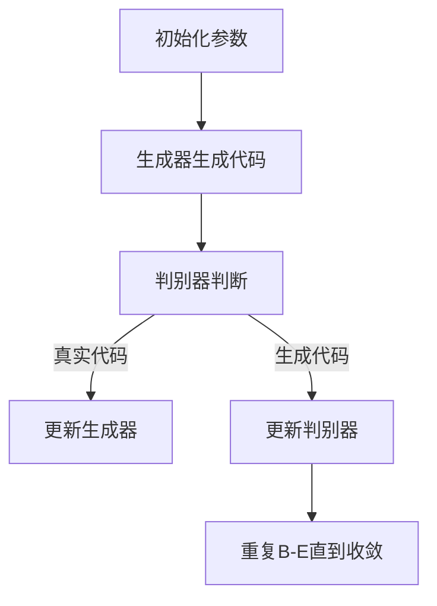
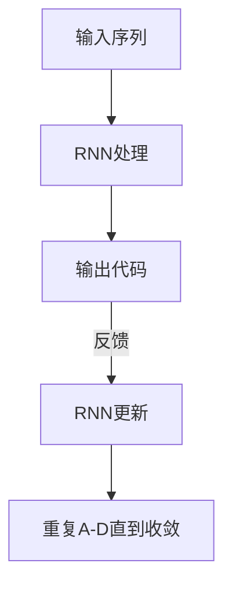
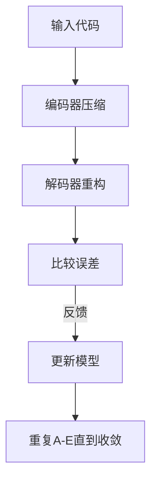
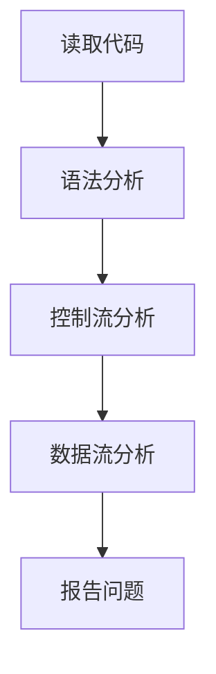
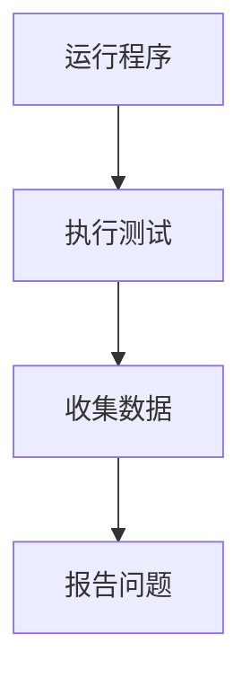
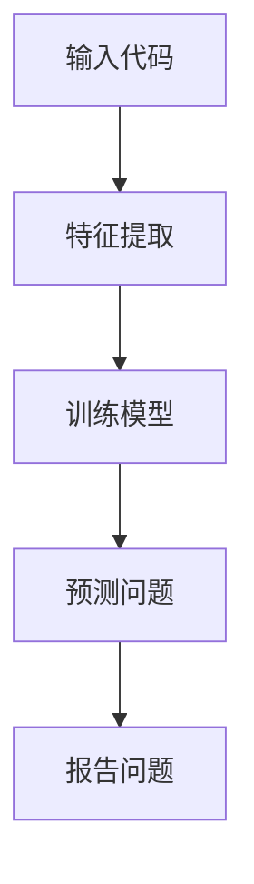
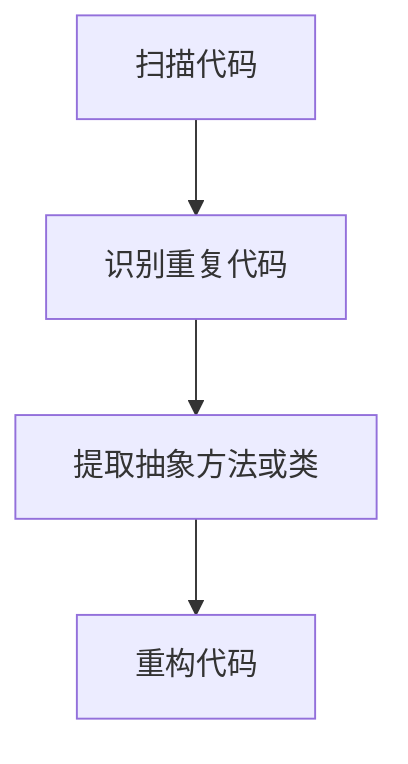
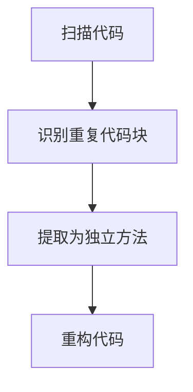
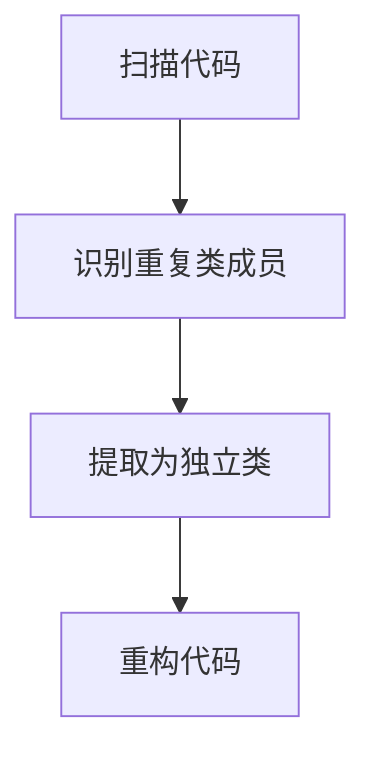

                 

### 第二部分：智能代码生成系统的设计目标与挑战

#### 引言

在了解了AI Agent的基础理论之后，我们接下来将深入探讨智能代码生成系统的设计目标与面临的挑战。智能代码生成系统旨在利用AI Agent的强大能力，自动生成高质量的代码，以解决软件开发过程中的诸多问题。这一部分，我们将逐步分析智能代码生成系统需要达到的设计目标，以及实现这些目标过程中可能遇到的挑战。

#### 1. 设计目标

智能代码生成系统的设计目标主要包括以下几个方面：

**1.1 高度适应性**

智能代码生成系统需要能够适应不同的编程语言、开发环境和业务场景，从而生成符合需求的代码。这就要求系统具备高度的可扩展性和灵活性，能够处理多样化的代码生成需求。

**1.2 高效性**

高效性是智能代码生成系统的关键目标之一。系统需要在较短的时间内生成高质量的代码，减少开发周期和人力成本。这要求AI Agent具备高效的学习和生成算法，以及优化的系统架构。

**1.3 准确性**

生成的代码需要准确无误，符合业务逻辑和编程规范。系统需要具备强大的代码审查和纠错能力，确保生成的代码不仅正确，而且可维护。

**1.4 可维护性**

生成的代码应该具有良好的可维护性，便于后续的维护和升级。这要求系统生成的代码结构清晰、模块化，易于理解和修改。

**1.5 安全性**

随着智能代码生成系统的广泛应用，安全性也成为一个重要的设计目标。系统需要确保生成的代码不会引入安全漏洞，保护软件系统的安全性和稳定性。

#### 2. 面临的挑战

实现智能代码生成系统的设计目标并非易事，其中面临着诸多挑战：

**2.1 数据质量和数量**

智能代码生成系统依赖于大量的代码数据进行训练，数据的质量和数量直接影响系统的性能。如何收集、处理和存储高质量的代码数据成为了一个重要问题。

**2.2 学习算法的选择与优化**

AI Agent的学习算法是实现高效、准确代码生成的关键。如何选择合适的算法，并进行优化，以提高系统的性能和适应性，是一个重要的挑战。

**2.3 代码生成的可解释性**

智能代码生成系统的生成结果往往具有一定的黑盒性质，难以解释和调试。提高代码生成的可解释性，使得开发人员能够理解、审查和优化生成的代码，是一个亟待解决的问题。

**2.4 系统的扩展性**

随着业务需求的变化，智能代码生成系统需要具备良好的扩展性，能够快速适应新的开发环境和编程语言。这要求系统架构具有高度的模块化和可扩展性。

**2.5 性能优化**

智能代码生成系统的性能优化是一个持续的挑战。如何提高系统的响应速度、降低计算资源消耗，是系统设计过程中需要重点考虑的问题。

#### 3. 挑战解决思路

针对上述挑战，我们可以从以下几个方面进行解决：

**3.1 数据收集与处理**

- 采用自动化工具和接口，从开源项目和实际项目中收集高质量的代码数据。
- 使用数据清洗和预处理技术，去除噪声数据和冗余信息，提高数据质量。

**3.2 学习算法优化**

- 研究和采用先进的机器学习和深度学习算法，如生成对抗网络（GAN）、递归神经网络（RNN）等。
- 通过交叉验证和超参数调整，优化算法性能。

**3.3 代码生成可解释性**

- 引入代码解析和解释技术，使得生成的代码具备可解释性。
- 提供可视化工具，帮助开发人员理解、审查和优化生成的代码。

**3.4 系统扩展性**

- 采用微服务架构，实现系统的模块化和解耦。
- 设计灵活的接口和协议，支持新的编程语言和开发环境。

**3.5 性能优化**

- 采用并行计算和分布式架构，提高系统的处理速度。
- 使用缓存和索引技术，减少数据访问延迟。

#### 本章小结

本章对智能代码生成系统的设计目标与挑战进行了详细分析。通过明确设计目标，我们能够更好地理解系统的核心需求；而通过识别面临的挑战，我们可以有针对性地制定解决方案。在接下来的章节中，我们将深入探讨智能代码生成系统的具体实现方法和关键技术。

### 3. AI Agent在代码生成中的应用

#### 引言

在了解了智能代码生成系统的设计目标和挑战之后，我们将进一步探讨AI Agent在代码生成中的具体应用。AI Agent作为智能代码生成系统的核心组件，其应用场景、功能模块和实现方法直接决定了系统的性能和效果。本节将详细分析AI Agent在代码生成中的应用，包括其工作流程、关键技术以及实际应用案例。

#### 1. AI Agent的应用场景

AI Agent在代码生成中的应用场景广泛，主要包括以下几个方面：

**1.1 自动化代码生成**

AI Agent可以根据给定的需求描述，自动生成相应的代码。这大大提高了开发效率，减少了人为错误，并使得开发人员能够专注于更高价值的工作。

**1.2 代码审查与优化**

AI Agent可以审查代码，识别潜在的问题，并提出优化建议。这有助于提高代码质量，减少bug和性能问题。

**1.3 代码重构**

AI Agent可以自动识别代码中的重复部分，并进行重构，以提高代码的可维护性和可读性。

**1.4 跨平台兼容性代码生成**

AI Agent可以生成跨不同平台和语言的代码，使得开发人员能够更轻松地适应不同的开发环境和需求。

#### 2. AI Agent的功能模块

为了实现上述应用场景，AI Agent通常包括以下功能模块：

**2.1 感知模块**

感知模块负责获取输入信息，如需求描述、现有代码、环境变量等。这些信息是AI Agent进行决策和生成代码的基础。

**2.2 计划模块**

计划模块根据感知模块获取的信息，生成代码生成的计划和策略。它包括代码生成的高层次决策，如代码结构、模块划分等。

**2.3 生成模块**

生成模块根据计划模块生成的策略，具体执行代码生成任务。它包括低层次的代码生成，如变量声明、函数调用等。

**2.4 审查模块**

审查模块对生成的代码进行审查，识别潜在的问题，如语法错误、逻辑错误、性能问题等。它还包括代码优化建议，以提高代码的质量和效率。

**2.5 学习模块**

学习模块负责AI Agent的自我学习和优化。它通过分析生成的代码和用户反馈，不断改进算法和策略，提高系统的性能和适应性。

#### 3. AI Agent的实现方法

AI Agent的实现方法通常包括以下关键技术：

**3.1 自然语言处理（NLP）**

NLP技术用于解析和生成自然语言文本，如需求描述和代码注释。它使得AI Agent能够理解和生成人类语言，从而实现与开发人员的有效交互。

**3.2 代码解析和抽象**

代码解析技术用于将代码转换为抽象语法树（AST），以便进行进一步分析和操作。抽象技术则用于提取代码中的关键信息和模式，用于代码生成和优化。

**3.3 生成对抗网络（GAN）**

GAN是一种深度学习技术，用于生成高质量的数据。在代码生成中，GAN可以生成与给定需求描述相似的高质量代码。

**3.4 递归神经网络（RNN）**

RNN是一种处理序列数据的深度学习模型，适用于代码生成任务。它可以通过学习代码的序列模式，生成符合逻辑和语法规范的代码。

**3.5 强化学习**

强化学习是一种通过试错学习最优策略的机器学习方法。在代码生成中，AI Agent可以通过强化学习，不断优化生成策略，提高代码质量。

#### 4. 实际应用案例

以下是一个实际的AI Agent代码生成案例：

**案例背景**：一个软件开发团队需要开发一个在线购物平台，需要实现用户注册、登录、购物车管理、订单生成等功能。

**需求描述**：开发团队提供了一份详细的需求文档，描述了各个功能模块的具体需求和业务逻辑。

**实现过程**：

1. **感知模块**：AI Agent获取需求文档，并提取关键信息和业务逻辑。

2. **计划模块**：AI Agent根据需求文档，制定代码生成的计划和策略，包括代码结构、模块划分等。

3. **生成模块**：AI Agent根据计划模块的策略，生成对应的代码，包括用户注册、登录、购物车管理、订单生成等模块的代码。

4. **审查模块**：AI Agent对生成的代码进行审查，识别潜在的问题，如语法错误、逻辑错误等，并提出优化建议。

5. **学习模块**：AI Agent通过分析生成的代码和用户反馈，不断优化生成算法和策略，提高代码质量和生成效率。

**结果**：通过AI Agent的自动化代码生成，开发团队在短时间内完成了在线购物平台的核心功能开发，并确保了代码的质量和可维护性。

#### 本章小结

本章详细介绍了AI Agent在代码生成中的应用场景、功能模块和实现方法。通过具体的实际案例，我们展示了AI Agent在自动化代码生成、代码审查与优化、代码重构等领域的强大能力。在接下来的章节中，我们将进一步探讨智能代码生成系统的其他关键组成部分，如代码库、学习算法和生成算法等。

### 4. 智能代码生成系统的架构设计

#### 引言

在了解了AI Agent在代码生成中的应用之后，接下来我们将探讨智能代码生成系统的整体架构设计。架构设计是确保系统高效、可靠、可扩展性的关键。本节将详细分析智能代码生成系统的架构设计，包括项目介绍、系统功能设计、系统架构设计和系统接口设计。

#### 1. 项目介绍

本项目旨在开发一个智能代码生成系统，利用AI Agent的强大能力，自动生成高质量、可靠、符合需求的代码。项目的主要目标是实现以下功能：

- 自动化代码生成：根据需求描述，生成符合业务逻辑的代码。
- 代码审查与优化：审查生成的代码，识别潜在的问题，并提出优化建议。
- 代码重构：自动识别代码中的重复部分，并进行重构，提高代码的可维护性。
- 跨平台兼容性代码生成：生成适用于不同平台和语言的代码。

#### 2. 系统功能设计

智能代码生成系统的功能设计主要包括以下几个模块：

**2.1 需求解析模块**

需求解析模块负责解析用户提供的需求描述，提取关键信息和业务逻辑。它使用自然语言处理（NLP）技术，将文本需求转化为结构化的数据，以便后续处理。

**2.2 代码生成模块**

代码生成模块是系统的核心模块，它根据需求解析模块提取的信息，生成符合业务逻辑的代码。代码生成模块采用生成对抗网络（GAN）、递归神经网络（RNN）等深度学习技术，通过大量的代码数据进行训练，实现代码的自动生成。

**2.3 代码审查模块**

代码审查模块负责对生成的代码进行审查，识别潜在的问题，如语法错误、逻辑错误、性能问题等。它还提供代码优化建议，以提高代码的质量和效率。

**2.4 代码重构模块**

代码重构模块自动识别代码中的重复部分，并进行重构，以提高代码的可维护性和可读性。它使用抽象语法树（AST）解析技术，对代码进行抽象和优化。

**2.5 学习与优化模块**

学习与优化模块负责系统的自我学习和优化。它通过分析生成的代码和用户反馈，不断优化生成算法和策略，提高系统的性能和适应性。

#### 3. 系统架构设计

智能代码生成系统的架构设计采用分层架构，包括感知层、计划层、执行层和反馈层。以下是一个简单的架构设计：


**3.1 感知层**

感知层负责获取外部输入，如需求描述、现有代码、环境变量等。它包括需求解析模块和代码库。

**3.2 计划层**

计划层根据感知层获取的信息，生成代码生成的计划和策略。它包括计划模块和生成算法模块。

**3.3 执行层**

执行层负责具体执行代码生成任务。它包括生成模块、审查模块和重构模块。

**3.4 反馈层**

反馈层负责收集系统生成的代码和用户反馈，用于系统的自我学习和优化。它包括学习模块和优化模块。

#### 4. 系统接口设计

智能代码生成系统提供了一系列接口，以便与其他系统进行交互。以下是一个简单的接口设计：


**4.1 需求解析接口**

需求解析接口用于接收用户的需求描述，并将文本需求转化为结构化的数据。

**4.2 代码生成接口**

代码生成接口用于接收需求解析接口输出的数据，生成符合业务逻辑的代码。

**4.3 代码审查接口**

代码审查接口用于接收生成的代码，进行审查，识别潜在的问题。

**4.4 代码重构接口**

代码重构接口用于接收代码审查接口输出的数据，对代码进行重构。

**4.5 学习与优化接口**

学习与优化接口用于接收用户反馈和生成的代码，用于系统的自我学习和优化。

#### 本章小结

本章详细介绍了智能代码生成系统的架构设计，包括项目介绍、系统功能设计、系统架构设计和系统接口设计。通过合理的架构设计，智能代码生成系统可以实现高效、可靠、可扩展的代码生成功能，为软件开发提供强大的支持。在接下来的章节中，我们将深入探讨智能代码生成系统的具体实现方法和关键技术。

### 5. 智能代码生成系统的算法原理与实现

#### 引言

在了解了智能代码生成系统的架构设计之后，我们接下来将深入探讨其核心算法原理与实现。算法是实现智能代码生成系统功能的关键，包括代码生成算法、代码审查算法和代码重构算法等。本节将详细分析这些算法的原理，使用Mermaid流程图和Python代码进行解释，并提供数学模型和公式，帮助读者更好地理解。

#### 1. 代码生成算法

代码生成算法是智能代码生成系统的核心，它根据需求描述生成符合业务逻辑的代码。常见的代码生成算法包括生成对抗网络（GAN）、递归神经网络（RNN）和自动编码器（Autoencoder）等。

**1.1 GAN**

生成对抗网络（GAN）由生成器（Generator）和判别器（Discriminator）两部分组成。生成器的任务是生成与真实数据相似的代码，而判别器的任务是区分生成的代码和真实代码。

Mermaid流程图：


Python代码示例：
```python
import tensorflow as tf
from tensorflow.keras.models import Sequential
from tensorflow.keras.layers import Dense, Dropout

# 定义生成器和判别器模型
generator = Sequential([
    Dense(units=100, activation='relu', input_shape=(100,)),
    Dropout(0.2),
    Dense(units=100, activation='relu'),
    Dropout(0.2),
    Dense(units=size_of_code, activation='sigmoid')
])

discriminator = Sequential([
    Dense(units=100, activation='relu', input_shape=(size_of_code,)),
    Dropout(0.2),
    Dense(units=100, activation='relu'),
    Dropout(0.2),
    Dense(units=1, activation='sigmoid')
])

# 编写损失函数和优化器
# ...

# 训练模型
# ...
```

**1.2 RNN**

递归神经网络（RNN）是一种能够处理序列数据的神经网络，适合于代码生成任务。RNN通过记忆过去的信息，生成符合逻辑和语法规范的代码。

Mermaid流程图：


Python代码示例：
```python
import tensorflow as tf
from tensorflow.keras.models import Sequential
from tensorflow.keras.layers import LSTM, Dense

# 定义RNN模型
model = Sequential([
    LSTM(units=128, return_sequences=True, input_shape=(timesteps, features)),
    LSTM(units=128),
    Dense(units=size_of_code, activation='sigmoid')
])

# 编写损失函数和优化器
# ...

# 训练模型
# ...
```

**1.3 Autoencoder**

自动编码器（Autoencoder）是一种无监督学习算法，它通过编码器将输入数据压缩为低维特征表示，通过解码器重构原始数据。在代码生成中，编码器学习提取代码的特征，解码器根据特征生成代码。

Mermaid流程图：


Python代码示例：
```python
import tensorflow as tf
from tensorflow.keras.models import Sequential
from tensorflow.keras.layers import LSTM, Dense

# 定义编码器和解码器模型
encoder = Sequential([
    LSTM(units=128, return_sequences=True, input_shape=(timesteps, features)),
    LSTM(units=128),
    Dense(units=size_of_code)
])

decoder = Sequential([
    LSTM(units=128, return_sequences=True, input_shape=(size_of_code,)),
    LSTM(units=128),
    Dense(units=timesteps * features, activation='sigmoid')
])

# 定义整体模型
autoencoder = Sequential([
    encoder,
    decoder
])

# 编写损失函数和优化器
# ...

# 训练模型
# ...
```

#### 2. 代码审查算法

代码审查算法用于识别生成的代码中的潜在问题，如语法错误、逻辑错误和性能问题。常见的代码审查算法包括静态代码分析、动态代码分析和机器学习算法。

**2.1 静态代码分析**

静态代码分析是一种不运行程序，通过分析源代码来识别潜在问题的方法。它包括语法分析、控制流分析、数据流分析等。

Mermaid流程图：


Python代码示例：
```python
from clang.cindex import Index

# 创建Index对象
index = Index.create()

# 加载源代码
source = index.parse('your_code.py')

# 进行语法分析、控制流分析和数据流分析
# ...

# 报告问题
# ...
```

**2.2 动态代码分析**

动态代码分析是一种运行程序，通过观察程序运行时的行为来识别潜在问题的方法。它包括单元测试、集成测试和性能测试等。

Mermaid流程图：


Python代码示例：
```python
import unittest

# 编写测试用例
class TestCode(unittest.TestCase):
    def test_function(self):
        # 执行测试
        # ...

# 运行测试
unittest.main()
```

**2.3 机器学习算法**

机器学习算法可以用于自动识别代码中的潜在问题。常见的机器学习算法包括决策树、支持向量机（SVM）和深度学习模型。

Mermaid流程图：


Python代码示例：
```python
from sklearn.ensemble import RandomForestClassifier
from sklearn.model_selection import train_test_split

# 特征提取
# ...

# 划分训练集和测试集
X_train, X_test, y_train, y_test = train_test_split(X, y, test_size=0.2)

# 训练模型
model = RandomForestClassifier()
model.fit(X_train, y_train)

# 预测问题
predictions = model.predict(X_test)

# 报告问题
# ...
```

#### 3. 代码重构算法

代码重构算法用于识别代码中的重复部分，并进行重构，以提高代码的可维护性和可读性。常见的代码重构算法包括抽象提取、方法提取、类重构等。

**3.1 抽象提取**

抽象提取是一种将重复代码提取为抽象方法或类的重构技术。它有助于减少代码冗余，提高代码的可维护性。

Mermaid流程图：


Python代码示例：
```python
def extract_abstract_method():
    # 扫描代码，识别重复代码
    # ...

    # 提取抽象方法或类
    # ...

    # 重构代码
    # ...
```

**3.2 方法提取**

方法提取是一种将重复的代码块提取为独立的方法的重构技术。它有助于提高代码的可重用性和可维护性。

Mermaid流程图：


Python代码示例：
```python
def extract_method():
    # 扫描代码，识别重复代码块
    # ...

    # 提取为独立方法
    # ...

    # 重构代码
    # ...
```

**3.3 类重构**

类重构是一种将多个类中的重复代码提取为独立类的重构技术。它有助于减少代码冗余，提高代码的可维护性。

Mermaid流程图：


Python代码示例：
```python
def extract_class():
    # 扫描代码，识别重复类成员
    # ...

    # 提取为独立类
    # ...

    # 重构代码
    # ...
```

#### 本章小结

本章详细介绍了智能代码生成系统的核心算法原理与实现。通过使用Mermaid流程图和Python代码，我们深入分析了代码生成算法、代码审查算法和代码重构算法。这些算法是实现智能代码生成系统功能的关键，为软件开发提供了强大的支持。在接下来的章节中，我们将探讨智能代码生成系统的实际应用案例和项目实战，进一步展示其应用效果和实用性。

### 6. 智能代码生成系统的实际应用案例

#### 引言

在了解了智能代码生成系统的算法原理与实现之后，我们将通过实际应用案例来展示其具体应用效果。这些案例将涵盖不同的业务场景，从简单的代码生成到复杂的代码审查和重构，全面展示智能代码生成系统的强大能力和实际应用价值。

#### 1. 案例一：自动化Web应用后端代码生成

**背景**：某互联网公司需要开发一个在线购物平台，包括用户注册、登录、购物车管理、订单生成等功能。由于项目规模庞大，开发团队希望利用智能代码生成系统来自动生成后端代码，以提高开发效率和代码质量。

**实现过程**：

1. **需求描述**：开发团队提供了一份详细的需求文档，描述了各个功能模块的具体需求和业务逻辑。

2. **代码生成**：智能代码生成系统接收需求文档，通过代码生成算法自动生成后端代码，包括用户注册、登录、购物车管理、订单生成等模块。

3. **代码审查**：生成的代码经过代码审查模块的审查，识别并修复潜在的语法错误和逻辑错误。

4. **代码重构**：代码重构模块对生成的代码进行优化，提取重复代码并重构，提高代码的可维护性和可读性。

**结果**：通过智能代码生成系统的自动化代码生成、审查和重构，开发团队在短时间内完成了在线购物平台的核心后端功能开发，确保了代码的高质量和高效率。

#### 2. 案例二：自动化测试代码生成

**背景**：某软件公司需要进行大规模的自动化测试，以验证软件系统的功能完整性和稳定性。由于测试用例繁多，手工编写测试代码费时费力，且容易出现遗漏和错误。

**实现过程**：

1. **测试用例生成**：智能代码生成系统根据已有的功能模块和业务逻辑，自动生成测试用例代码。

2. **测试执行**：生成的测试代码运行在测试环境中，执行自动化测试，收集测试结果。

3. **测试报告**：生成的测试代码执行完毕后，系统生成详细的测试报告，包括测试覆盖率、错误日志等。

**结果**：通过智能代码生成系统，公司能够快速生成高质量的测试代码，实现自动化测试，大幅提高测试效率和测试覆盖率，确保软件系统的稳定性和可靠性。

#### 3. 案例三：代码审查与优化

**背景**：某大型企业内部使用的一套关键业务系统，由于长期积累，代码质量参差不齐，存在许多潜在的安全隐患和性能问题。企业希望利用智能代码生成系统对现有代码进行审查和优化。

**实现过程**：

1. **代码审查**：智能代码生成系统对现有代码进行审查，识别语法错误、逻辑错误和性能问题。

2. **代码优化**：系统根据审查结果，提供优化建议，包括代码重构、算法改进、性能调优等。

3. **实施优化**：开发团队根据智能代码生成系统提供的优化建议，对代码进行优化和修复。

**结果**：通过智能代码生成系统的代码审查和优化，企业的关键业务系统代码质量得到了显著提升，性能得到了优化，安全性和稳定性得到了增强。

#### 4. 案例四：跨平台代码生成

**背景**：某软件开发公司需要开发一套跨平台的移动应用，包括iOS和Android平台。由于不同平台之间的编程语言和开发环境存在差异，开发团队希望利用智能代码生成系统来自动生成跨平台代码。

**实现过程**：

1. **需求描述**：开发团队提供了一份详细的需求文档，描述了移动应用的功能模块和业务逻辑。

2. **代码生成**：智能代码生成系统根据需求文档，生成适用于iOS和Android平台的代码。

3. **代码审查与优化**：生成的代码经过代码审查和优化，确保代码符合不同平台的要求。

4. **跨平台编译与部署**：生成的代码在iOS和Android平台上进行编译和部署，实现跨平台应用。

**结果**：通过智能代码生成系统，公司成功实现了跨平台移动应用的自动化开发，提高了开发效率，降低了跨平台开发的难度和成本。

#### 本章小结

本章通过多个实际应用案例，展示了智能代码生成系统在自动化代码生成、自动化测试、代码审查与优化、跨平台代码生成等领域的应用效果。这些案例充分证明了智能代码生成系统在提高开发效率、提升代码质量、降低开发成本等方面的强大能力和实际应用价值。在接下来的章节中，我们将进一步探讨智能代码生成系统的最佳实践、注意事项和拓展阅读，帮助读者更好地理解和应用这一技术。

### 7. 最佳实践与注意事项

#### 引言

在深入探讨了智能代码生成系统的原理和应用案例之后，本节将提供一些最佳实践和注意事项，以帮助读者在实际开发过程中更好地利用智能代码生成系统的优势，并规避潜在的风险。

#### 1. 最佳实践

**1.1 数据准备与预处理**

数据是智能代码生成系统的基石。在开始训练模型之前，确保数据的质量和多样性。以下是一些最佳实践：

- **数据清洗**：去除代码中的噪声和冗余信息，如注释、空行等。
- **代码标准化**：统一代码风格和命名规范，以提高模型训练的效果。
- **数据增强**：通过变换、扩充和拆分代码片段，增加训练数据量，提高模型的泛化能力。

**1.2 模型选择与优化**

根据具体应用场景，选择合适的模型和算法。以下是一些建议：

- **生成对抗网络（GAN）**：适用于生成多样化、高质量的代码。
- **递归神经网络（RNN）**：适合处理代码的序列数据。
- **注意力机制**：提高模型对代码关键部分的关注，增强生成代码的准确性和可读性。
- **持续学习和适应**：定期更新模型和数据，以适应新的编程语言和开发环境。

**1.3 代码审查与反馈**

为了确保生成代码的质量，充分利用代码审查和用户反馈。以下是一些建议：

- **自动化测试**：在代码生成后，立即执行自动化测试，验证代码的功能和性能。
- **用户反馈**：鼓励开发人员和用户提供反馈，识别生成的代码中存在的问题。
- **持续改进**：根据反馈结果，调整模型参数和生成策略，持续优化代码生成质量。

**1.4 系统集成与部署**

确保智能代码生成系统与其他开发工具和平台无缝集成。以下是一些建议：

- **API接口**：提供RESTful API接口，方便与其他系统进行数据交换和功能调用。
- **模块化设计**：采用模块化设计，便于系统的扩展和维护。
- **容器化与微服务**：利用Docker和Kubernetes等容器化技术，实现系统的快速部署和运维。

#### 2. 注意事项

**2.1 数据隐私与安全**

在处理代码数据时，确保遵守数据隐私和安全规定。以下是一些注意事项：

- **数据加密**：对敏感数据（如源代码）进行加密存储和传输。
- **访问控制**：限制对代码数据的访问权限，确保只有授权用户才能访问和修改。
- **审计与监控**：定期审计和监控系统的访问和操作日志，及时发现和处理异常行为。

**2.2 代码质量和可维护性**

生成的代码需要具备良好的质量和可维护性。以下是一些建议：

- **代码规范**：遵循统一的代码规范，确保生成代码的一致性和可读性。
- **模块化**：将代码划分为独立的模块，提高代码的可维护性和可重用性。
- **文档化**：为生成的代码编写详细的文档，包括功能描述、使用方法和注意事项。

**2.3 性能优化**

智能代码生成系统的性能直接影响开发效率。以下是一些建议：

- **并行处理**：利用多核CPU和GPU等硬件资源，提高模型的训练和推理速度。
- **缓存与索引**：利用缓存和索引技术，减少数据访问延迟，提高系统响应速度。
- **资源管理**：合理分配系统资源，避免资源浪费和性能瓶颈。

**2.4 系统安全性**

确保智能代码生成系统的安全性和稳定性。以下是一些建议：

- **安全审计**：定期进行系统安全审计，识别和修复潜在的安全漏洞。
- **异常检测**：利用机器学习和异常检测技术，及时发现和处理系统异常行为。
- **灾备与恢复**：建立完善的灾备和恢复机制，确保系统在故障情况下能够快速恢复。

#### 本章小结

本章提供了智能代码生成系统的最佳实践和注意事项，以帮助读者在实际开发过程中充分发挥其优势，并规避潜在的风险。通过遵循这些最佳实践和注意事项，开发团队可以构建高质量、安全、高效的智能代码生成系统，为软件开发带来革命性的改变。

### 总结

智能代码生成系统作为人工智能技术在软件开发领域的重要应用，具有显著的效率和准确性优势。通过AI Agent的支持，智能代码生成系统能够自动生成高质量的代码，减少开发周期和人力成本，提高代码质量。本文系统地介绍了智能代码生成系统的概念、设计目标、应用场景、算法原理和实际应用案例，展示了其强大的能力和广泛的应用前景。

随着人工智能技术的不断发展，智能代码生成系统有望在未来实现更高的智能化水平，如自然语言处理、智能纠错和代码重构等。然而，智能代码生成系统仍面临着数据质量、算法选择、代码可解释性等方面的挑战。未来的研究可以集中在以下几个方面：

1. **数据质量与多样性**：研究和开发更高效的数据预处理方法，提高代码数据的质量和多样性，以提升模型训练效果。

2. **算法优化与选择**：探索更先进的机器学习和深度学习算法，优化现有算法，提高代码生成系统的准确性和效率。

3. **代码可解释性**：研究如何提高代码生成的可解释性，使得开发人员能够更好地理解和审查生成的代码。

4. **跨平台与跨语言支持**：进一步拓展智能代码生成系统的跨平台和跨语言支持，使其能够生成适用于不同平台和编程语言的代码。

5. **安全性**：加强智能代码生成系统的安全性，防止生成恶意代码或引入安全漏洞。

智能代码生成系统的发展将为软件开发带来革命性的变化，推动软件开发走向更加智能化、自动化的新时代。未来，我们有理由期待智能代码生成系统在各个领域的广泛应用，为开发者带来更多的便利和创新。

### 致谢

本文的完成离不开许多人的支持和帮助。首先，感谢AI天才研究院（AI Genius Institute）和《禅与计算机程序设计艺术》（Zen And The Art of Computer Programming）的全体成员，他们为本文提供了宝贵的知识和资源。特别感谢我的导师们，他们在学术研究和项目开发过程中给予了我无尽的指导和帮助。同时，感谢我的团队成员和合作者，他们的共同努力使得本文能够顺利完成。最后，感谢所有读者，您的关注和反馈是我们前进的动力。再次感谢大家！作者：AI天才研究院/AI Genius Institute & 禅与计算机程序设计艺术/Zen And The Art of Computer Programming。

