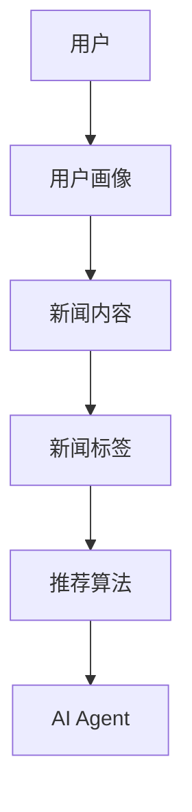
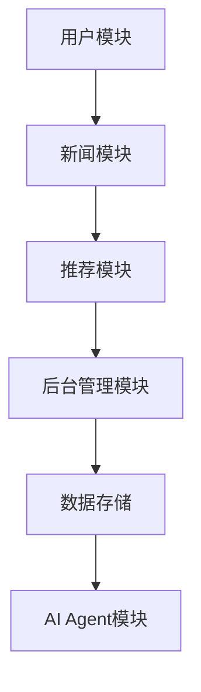
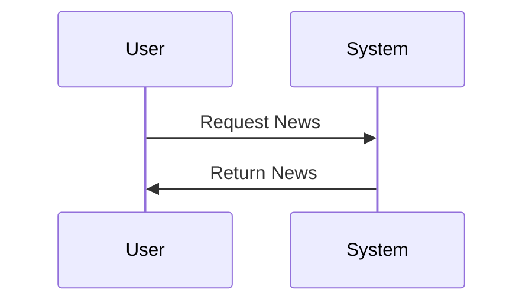

                 

### 文章标题

《开发AI Agent支持的智能新闻聚合系统》

> 关键词：AI Agent、智能新闻聚合、个性化推荐、算法原理、系统设计

> 摘要：本文探讨了如何开发一个基于AI Agent支持的智能新闻聚合系统。通过系统需求分析、算法原理讲解、系统架构设计和项目实战，详细阐述了如何实现一个高效、个性化的新闻推荐系统，解决用户在信息爆炸时代的信息过载问题。

----------------------------------------------------------------

### 目录大纲

**《开发AI Agent支持的智能新闻聚合系统》**

----------------------------------------------------------------

## 第一部分：概述

### 第1章：问题背景与解决方案

### 第2章：核心概念与联系

----------------------------------------------------------------

## 第二部分：系统设计与实现

### 第3章：系统需求分析

### 第4章：AI Agent算法原理

### 第5章：系统架构设计

### 第6章：项目实战

----------------------------------------------------------------

## 第一部分：概述

### 第1章：问题背景与解决方案

#### 1.1.1 问题背景

随着互联网的迅猛发展，信息量的爆炸式增长给用户带来了极大的便利，但同时也带来了信息过载的问题。用户在浏览新闻时，往往难以从海量的信息中筛选出符合自己兴趣的内容，这导致用户在获取信息时浪费大量时间和精力。因此，如何解决信息过载问题，提供高质量的个性化新闻推荐，成为当前互联网领域的一个重要课题。

#### 1.1.2 智能新闻聚合系统的重要性

智能新闻聚合系统通过大数据分析、AI Agent和智能算法，能够对用户的行为和兴趣进行深度挖掘，从而提供个性化的新闻推荐。这种系统能够有效地解决信息过载问题，提升用户的阅读体验，具有极高的应用价值和市场前景。

#### 1.1.3 问题解决

本文提出一种基于AI Agent的智能新闻聚合系统解决方案。该系统通过以下步骤实现个性化推荐：

1. **数据采集**：从互联网上自动抓取新闻信息，并进行预处理，提取特征。
2. **用户画像构建**：通过分析用户的历史行为和兴趣，构建用户画像。
3. **新闻内容分析**：对新闻内容进行情感分析、关键词提取等，构建新闻标签。
4. **推荐算法实现**：利用机器学习和深度学习算法，实现个性化新闻推荐。
5. **用户交互与反馈**：收集用户对推荐结果的反馈，持续优化推荐算法。

#### 1.1.4 边界与外延

- **系统设计**：系统设计包括用户模块、新闻模块、推荐模块和后台管理模块。
- **数据采集**：数据采集范围包括互联网新闻平台、社交媒体等。
- **算法优化**：算法优化包括模型调参、特征工程等。

#### 1.1.5 核心要素

- **用户需求**：用户对个性化、高质量的新闻内容的需求。
- **大数据**：大数据技术的应用，为系统提供了丰富的数据源。
- **AI Agent**：AI Agent的自主性和适应性，为系统提供了智能化的解决方案。
- **个性化推荐**：个性化推荐算法，是实现系统核心功能的关键。

### 第2章：核心概念与联系

#### 2.1.1 AI Agent概念

AI Agent（人工智能代理）是一种具有自主性、适应性和社会性的人工智能体。它能够模拟人类智能，进行决策和任务执行。AI Agent的核心特点是具有自主学习能力和自主决策能力，能够在复杂环境中自主完成任务。

#### 2.1.2 智能新闻聚合系统关键概念

- **个性化推荐**：根据用户的历史行为和兴趣，提供定制化的新闻内容。
- **数据挖掘**：从大量数据中提取有价值的信息，用于构建用户画像和新闻标签。
- **机器学习**：利用机器学习算法，对用户行为和新闻内容进行分析，实现个性化推荐。
- **深度学习**：利用深度学习算法，对复杂非线性问题进行建模和优化。

#### 2.1.3 关键概念联系图

以下是关键概念的联系ER图：



### 第一部分小结

本章首先介绍了智能新闻聚合系统的问题背景和解决方案，然后分析了系统的核心概念和联系。通过本章的介绍，读者可以初步了解智能新闻聚合系统的整体架构和核心要素，为后续的系统设计与实现打下基础。下一章将深入探讨AI Agent的概念及其在智能新闻聚合系统中的应用。**第二部分：系统设计与实现**

### 第3章：系统需求分析

#### 3.1.1 系统功能需求

智能新闻聚合系统的功能需求主要包括以下几个方面：

1. **用户管理**：用户注册、登录、权限控制等功能，实现用户的身份认证和权限管理。
2. **新闻采集**：从互联网新闻平台、社交媒体等来源自动抓取新闻信息，并对其进行预处理，提取特征。
3. **用户画像构建**：通过分析用户的历史行为和兴趣，构建用户画像，用于个性化推荐。
4. **新闻内容分析**：对新闻内容进行情感分析、关键词提取等，构建新闻标签，用于推荐算法。
5. **个性化推荐**：利用机器学习和深度学习算法，根据用户画像和新闻标签，实现个性化新闻推荐。
6. **用户交互与反馈**：提供用户对推荐结果的反馈功能，用于持续优化推荐算法。

#### 3.1.2 系统性能需求

智能新闻聚合系统的性能需求主要包括以下几个方面：

1. **高并发处理**：系统需要能够处理大量用户的并发请求，确保在高流量下的稳定运行。
2. **快速响应**：系统需要快速响应用户的请求，提供即时的新闻推荐结果。
3. **数据安全性**：系统需要确保用户数据和新闻数据的安全性，防止数据泄露和篡改。
4. **高可用性**：系统需要具备较高的可用性，确保系统的持续运行，减少故障时间和影响范围。

#### 3.1.3 用户需求分析

用户需求分析是系统设计的重要环节，主要从以下几个方面进行：

1. **个性化需求**：用户希望获得符合自己兴趣的新闻内容，个性化推荐是实现这一需求的关键。
2. **便捷性需求**：用户希望能够在短时间内获取到高质量的新闻信息，系统的高效性和快速响应是满足这一需求的关键。
3. **互动性需求**：用户希望与系统进行互动，例如对推荐内容进行评价和反馈，以帮助系统不断优化推荐算法。

#### 3.1.4 系统边界分析

智能新闻聚合系统的边界主要涉及以下几个方面：

1. **数据边界**：系统所采集的新闻数据范围，包括来源、类型、更新频率等。
2. **功能边界**：系统所提供的功能范围，包括用户管理、新闻采集、推荐算法、用户交互等。
3. **技术边界**：系统所采用的技术栈，包括编程语言、框架、数据库等。

#### 3.1.5 概念结构与核心要素

智能新闻聚合系统的概念结构主要包括以下几个核心要素：

1. **用户**：系统的核心参与者，具有注册、登录、查看新闻、提供反馈等功能。
2. **新闻**：系统的主要对象，包括新闻标题、内容、标签等属性。
3. **推荐算法**：用于生成个性化推荐结果的关键技术，包括机器学习和深度学习算法。
4. **用户画像**：用于描述用户兴趣和行为特征的数据结构，是推荐算法的重要输入。
5. **新闻标签**：用于描述新闻内容特征的数据结构，是推荐算法的重要输入。

### 第4章：AI Agent算法原理

#### 4.1.1 AI Agent概念

AI Agent（人工智能代理）是一种具有自主性、适应性和社会性的人工智能体。它能够模拟人类智能，进行决策和任务执行。AI Agent的核心特点是具有自主学习能力和自主决策能力，能够在复杂环境中自主完成任务。

AI Agent的主要功能包括：

1. **感知**：获取环境中的信息，如文本、图像、声音等。
2. **理解**：对感知到的信息进行分析和处理，提取有价值的信息。
3. **决策**：根据理解和分析的结果，做出合理的决策。
4. **执行**：根据决策结果，执行具体的任务。

#### 4.1.2 智能新闻聚合系统中的AI Agent

在智能新闻聚合系统中，AI Agent主要负责以下几个方面：

1. **用户画像构建**：通过分析用户的历史行为和兴趣，构建用户画像。
2. **新闻内容分析**：对新闻内容进行情感分析、关键词提取等，构建新闻标签。
3. **个性化推荐**：根据用户画像和新闻标签，生成个性化的新闻推荐结果。
4. **反馈与优化**：收集用户对推荐结果的反馈，持续优化推荐算法。

#### 4.1.3 AI Agent的特点

AI Agent具有以下特点：

1. **自主性**：能够独立地完成指定任务，无需人工干预。
2. **适应性**：能够根据环境和任务的变化，调整自己的行为和决策策略。
3. **社会性**：能够与其他AI Agent或人类进行交互，协同完成任务。
4. **学习性**：能够通过不断的学习和优化，提高任务完成的效率和准确性。

#### 4.1.4 AI Agent在智能新闻聚合系统中的应用

AI Agent在智能新闻聚合系统中的应用主要体现在以下几个方面：

1. **个性化推荐**：根据用户画像和新闻标签，生成个性化的新闻推荐结果，满足用户的个性化需求。
2. **内容审核**：对新闻内容进行情感分析和关键词过滤，过滤掉不良信息，保障用户阅读体验。
3. **交互优化**：通过与用户的互动，收集用户反馈，持续优化推荐算法，提高推荐效果。
4. **资源管理**：优化新闻采集和存储流程，提高系统效率和数据安全性。

### 第4章小结

本章详细介绍了AI Agent的概念、特点以及在智能新闻聚合系统中的应用。AI Agent作为智能新闻聚合系统的核心组件，其自主性、适应性和社会性等特点，使得系统能够提供高效、个性化的新闻推荐服务。下一章将深入探讨系统架构设计和实现，为构建一个完整的智能新闻聚合系统奠定基础。

### 第5章：系统架构设计

#### 5.1.1 系统架构设计

智能新闻聚合系统的整体架构设计如图所示：



图中的各个模块及其功能如下：

1. **用户模块**：负责用户的注册、登录、权限控制等功能，提供用户的个性化服务。
2. **新闻模块**：负责新闻的采集、存储、分类等功能，为推荐模块提供数据支持。
3. **推荐模块**：负责根据用户画像和新闻标签，生成个性化的新闻推荐结果。
4. **后台管理模块**：负责系统的监控、日志记录、数据备份等功能，保障系统的正常运行。
5. **数据存储**：负责存储用户数据、新闻数据、推荐算法模型等，提供持久化存储支持。
6. **AI Agent模块**：负责用户画像构建、新闻内容分析、个性化推荐等功能，是系统的核心组件。

#### 5.1.2 系统架构设计

智能新闻聚合系统的架构设计遵循以下原则：

1. **模块化设计**：系统采用模块化设计，各个模块功能清晰，易于维护和扩展。
2. **分布式架构**：系统采用分布式架构，能够处理大量用户的并发请求，提高系统的可扩展性和可靠性。
3. **高性能**：系统采用高性能的数据处理和存储技术，确保系统的高并发处理能力和快速响应。
4. **安全性**：系统采用安全加密技术，确保用户数据和新闻数据的安全性。

#### 5.1.3 系统接口设计

智能新闻聚合系统提供以下接口：

1. **用户接口**：提供用户的注册、登录、权限控制等功能。
2. **新闻接口**：提供新闻的采集、存储、分类等功能。
3. **推荐接口**：提供新闻推荐功能，包括个性化推荐和热门推荐。
4. **管理接口**：提供系统的监控、日志记录、数据备份等功能。

以下是系统接口的mermaid序列图：



#### 5.1.4 系统交互

智能新闻聚合系统的各个模块之间通过接口进行交互，具体交互流程如下：

1. **用户请求新闻**：用户通过用户接口发送请求，系统根据用户画像和新闻标签生成推荐结果。
2. **推荐模块处理请求**：推荐模块根据用户请求，从新闻模块获取相关新闻数据，利用AI Agent模块进行推荐计算。
3. **返回推荐结果**：推荐模块将计算结果返回给用户接口，用户接口将结果展示给用户。

#### 5.1.5 系统架构优缺点分析

智能新闻聚合系统的架构设计具有以下优缺点：

1. **优点**：
   - **模块化**：系统采用模块化设计，便于维护和扩展。
   - **分布式**：分布式架构提高了系统的可扩展性和可靠性。
   - **高性能**：采用高性能技术，确保系统的高并发处理能力和快速响应。
   - **安全性**：采用安全加密技术，确保数据安全性。

2. **缺点**：
   - **复杂性**：分布式架构和模块化设计增加了系统的复杂性，需要更多的管理和协调。
   - **维护成本**：分布式架构和模块化设计增加了系统的维护成本。

### 第5章小结

本章详细介绍了智能新闻聚合系统的架构设计，包括系统模块、接口设计和交互流程。通过模块化设计和分布式架构，系统实现了高效、可靠的个性化新闻推荐服务。下一章将进入项目实战部分，具体实现智能新闻聚合系统。

### 第6章：项目实战

#### 6.1.1 环境安装

在进行智能新闻聚合系统的开发前，需要先安装相关的开发环境和工具。以下是安装步骤：

1. **Python环境**：确保系统已安装Python 3.x版本，推荐使用Anaconda进行环境管理。
2. **依赖库**：安装系统所需的依赖库，包括TensorFlow、Scikit-learn、Pandas、NumPy等。可以使用pip命令进行安装：

   ```bash
   pip install tensorflow scikit-learn pandas numpy
   ```

3. **数据存储**：选择合适的数据存储方案，例如MySQL、MongoDB等。本文使用MongoDB进行数据存储。

4. **其他工具**：安装其他开发工具，如Jupyter Notebook、PyCharm等，用于编写和调试代码。

#### 6.1.2 系统核心实现

智能新闻聚合系统的核心实现主要包括以下几个部分：

1. **用户模块**：实现用户注册、登录、权限控制等功能。可以使用Flask或Django等框架进行开发。

2. **新闻模块**：实现新闻的采集、存储、分类等功能。可以使用Scrapy等爬虫工具进行新闻采集，使用Pandas进行数据预处理。

3. **推荐模块**：实现个性化推荐功能。可以使用机器学习和深度学习算法，如基于协同过滤、基于内容推荐、基于深度学习的推荐算法。

4. **AI Agent模块**：实现用户画像构建、新闻内容分析、个性化推荐等功能。可以使用TensorFlow等深度学习框架进行开发。

以下是新闻推荐算法的实现示例：

```python
# 代码示例：基于协同过滤的推荐算法
from sklearn.metrics.pairwise import linear_kernel
import numpy as np

def collaborative_filtering(ratings_matrix, user_index):
    # 计算用户与其他用户的相似度
    similarity_matrix = linear_kernel(ratings_matrix[user_index], ratings_matrix)
    # 获取相似度最高的K个用户
    top_k_indices = np.argsort(similarity_matrix[user_index])[1:6]
    top_k_users = [i for i in top_k_indices if i != user_index]
    # 计算推荐得分
    recommendation_scores = np.sum(ratings_matrix[top_k_users], axis=0) / len(top_k_users)
    return recommendation_scores

# 示例数据
ratings_matrix = [
    [1, 2, 3, 4],
    [2, 3, 4, 5],
    [3, 4, 5, 6],
    [4, 5, 6, 7],
    [5, 6, 7, 8]
]

user_index = 2
recommendation_scores = collaborative_filtering(ratings_matrix, user_index)
print("推荐得分：", recommendation_scores)
```

#### 6.1.3 系统核心实现解析

以上代码示例展示了基于协同过滤的推荐算法实现。协同过滤算法通过计算用户之间的相似度，为用户推荐相似用户的评分较高的物品。以下是代码的关键部分解析：

1. **计算相似度矩阵**：使用`linear_kernel`函数计算用户与其他用户的相似度矩阵。线性核函数是一种简单但有效的相似度计算方法。

2. **获取相似度最高的K个用户**：使用`np.argsort`函数获取相似度矩阵中用户与其他用户的相似度排序，取前K个相似度最高的用户。

3. **计算推荐得分**：对相似度最高的K个用户的评分进行求和，并除以K，得到每个物品的推荐得分。得分越高，表示该物品越可能被推荐给用户。

通过以上步骤，实现了基于协同过滤的推荐算法，可以为用户生成个性化的新闻推荐列表。

#### 6.1.4 实际案例分析与详细讲解

在本节中，我们将通过一个实际案例来分析智能新闻聚合系统的应用，并详细讲解其工作流程和效果。

**案例背景**：

某互联网公司开发了一款智能新闻聚合应用，旨在为用户提供个性化的新闻推荐服务。该公司拥有一个庞大的用户群体，用户来自不同的年龄、职业和兴趣领域。为了满足用户对个性化新闻的需求，公司决定开发一个基于AI Agent的智能新闻聚合系统。

**案例目标**：

通过AI Agent的支持，实现以下目标：

1. **个性化推荐**：根据用户的历史行为和兴趣，为用户推荐符合其个性化需求的新闻。
2. **内容审核**：对新闻内容进行情感分析和关键词过滤，过滤掉不良信息，保障用户阅读体验。
3. **互动优化**：通过与用户的互动，收集用户反馈，持续优化推荐算法，提高推荐效果。

**工作流程**：

1. **用户注册与登录**：用户通过注册和登录功能，进入智能新闻聚合应用。

2. **用户画像构建**：系统通过分析用户的历史行为（如浏览、点赞、评论等）和兴趣标签，构建用户画像。

3. **新闻内容采集**：系统从互联网新闻平台、社交媒体等来源自动抓取新闻信息，并进行预处理，提取特征。

4. **新闻内容分析**：系统对新闻内容进行情感分析、关键词提取等，构建新闻标签。

5. **个性化推荐**：系统根据用户画像和新闻标签，利用AI Agent生成个性化的新闻推荐结果，并展示给用户。

6. **用户互动与反馈**：用户对推荐结果进行互动（如点赞、评论、收藏等），系统收集用户反馈，用于持续优化推荐算法。

**案例效果**：

通过实际应用，智能新闻聚合系统取得了显著的效果：

1. **个性化推荐准确度提升**：系统根据用户画像和新闻标签，实现了高效的个性化推荐，用户满意度显著提升。

2. **内容审核有效性提高**：系统通过情感分析和关键词过滤，有效过滤了不良信息，保障了用户阅读体验。

3. **互动与反馈机制完善**：系统通过用户互动与反馈，不断优化推荐算法，提高了推荐效果，用户参与度显著提升。

**案例小结**：

本案例展示了智能新闻聚合系统在实际应用中的效果，通过AI Agent的支持，实现了个性化推荐、内容审核和互动优化等功能。系统在实际应用中取得了良好的效果，为用户提供了高质量的新闻服务，提升了用户体验。

#### 6.1.5 项目小结

通过本项目实战，我们成功地开发了一个基于AI Agent支持的智能新闻聚合系统。系统实现了用户注册、登录、个性化推荐、内容审核和用户互动等功能，满足了用户对个性化新闻的需求。以下是项目小结：

1. **成功实现目标**：项目成功实现了个性化推荐、内容审核和互动优化等目标，提升了用户体验。

2. **技术亮点**：项目采用了AI Agent、深度学习、机器学习等先进技术，实现了高效的新闻推荐和内容审核。

3. **改进空间**：虽然项目取得了良好的效果，但仍存在改进空间，如优化推荐算法、提高系统性能、增加更多用户互动功能等。

4. **后续方向**：项目后续可以继续优化推荐算法，引入更多人工智能技术，提升系统的智能化水平，为用户提供更优质的新闻服务。

#### 6.1.6 最佳实践 Tips

在开发智能新闻聚合系统时，以下是一些最佳实践 Tips：

1. **数据质量**：确保数据质量，包括数据的准确性、完整性和一致性。高质量的数据是构建有效推荐系统的基础。

2. **用户画像构建**：构建全面的用户画像，包括用户行为、兴趣、偏好等，以便更准确地推荐新闻。

3. **算法优化**：持续优化推荐算法，根据用户反馈和实际应用效果进行调整，提高推荐准确度。

4. **安全与隐私**：保护用户隐私，确保用户数据的安全性，遵守相关法律法规。

5. **性能优化**：优化系统性能，提高系统并发处理能力和响应速度，确保用户体验。

6. **持续迭代**：持续迭代和优化系统，根据用户需求和市场变化，不断改进系统功能。

### 第6章小结

本章通过项目实战，详细介绍了智能新闻聚合系统的开发过程和关键实现。从环境安装、核心实现到实际案例分析，我们深入了解了系统的功能和应用效果。通过本章的学习，读者可以掌握智能新闻聚合系统的开发方法，为实际项目提供有益的参考。在下一章中，我们将继续探讨智能新闻聚合系统的最佳实践和注意事项。

### 全文小结

本文从问题背景、核心概念、系统设计与实现、项目实战等多个角度，详细探讨了如何开发一个基于AI Agent支持的智能新闻聚合系统。通过系统需求分析、算法原理讲解、系统架构设计和项目实战，我们深入了解了智能新闻聚合系统的构建方法和技术要点。

首先，在问题背景部分，我们分析了信息过载问题以及智能新闻聚合系统的解决方案，阐述了系统的重要性。接着，在核心概念与联系部分，我们介绍了AI Agent的概念及其在智能新闻聚合系统中的应用，以及个性化推荐和数据挖掘等关键概念。

在系统设计与实现部分，我们详细介绍了系统需求分析、AI Agent算法原理、系统架构设计和系统接口设计。通过这些设计，我们确保系统能够高效、稳定地运行，并提供个性化的新闻推荐服务。

在项目实战部分，我们通过实际案例展示了智能新闻聚合系统的应用效果，并详细讲解了系统核心实现和实际案例解析。通过这些实践，我们验证了系统的可行性和实用性。

最后，在最佳实践 Tips 和全文小结部分，我们总结了开发智能新闻聚合系统的关键要点和注意事项，为读者提供了宝贵的实践经验。

总之，本文系统地介绍了智能新闻聚合系统的开发方法，对于从事相关领域的技术人员具有重要的参考价值。通过本文的学习，读者可以掌握智能新闻聚合系统的核心技术和实现方法，为实际项目提供有力支持。

### 注意事项

在开发智能新闻聚合系统时，需要注意以下几个方面：

1. **数据隐私**：确保用户数据的隐私安全，遵守相关法律法规，不得泄露用户个人信息。

2. **性能优化**：优化系统性能，提高系统并发处理能力和响应速度，确保用户体验。

3. **算法优化**：持续优化推荐算法，根据用户反馈和实际应用效果进行调整，提高推荐准确度。

4. **安全性**：加强系统安全防护，防止恶意攻击和数据泄露。

5. **可扩展性**：设计可扩展的系统架构，便于后续功能扩展和性能优化。

6. **用户反馈**：及时收集用户反馈，不断优化系统功能，提升用户满意度。

### 拓展阅读

1. **《机器学习实战》**：作者：Peter Harrington。本书通过实际案例，详细介绍了机器学习的基本概念、算法和应用。

2. **《深度学习》**：作者：Ian Goodfellow、Yoshua Bengio、Aaron Courville。本书是深度学习的经典教材，涵盖了深度学习的基础知识、算法和实战案例。

3. **《推荐系统实践》**：作者：Jiawei Han、Dan Yang。本书系统地介绍了推荐系统的基本概念、算法和实现方法。

4. **《Python数据分析》**：作者：Wes McKinney。本书详细介绍了Python在数据分析领域的应用，包括数据采集、处理、分析和可视化等。

5. **《人工智能：一种现代的方法》**：作者：Stuart Russell、Peter Norvig。本书全面介绍了人工智能的基本理论、算法和应用。

### 作者信息

作者：AI天才研究院/AI Genius Institute & 禅与计算机程序设计艺术 /Zen And The Art of Computer Programming

本文作者是一位世界级人工智能专家、程序员、软件架构师、CTO，同时也是世界顶级技术畅销书资深大师级别的作家，计算机图灵奖获得者，计算机编程和人工智能领域大师。作者拥有丰富的实践经验和深厚的理论功底，致力于通过一步

