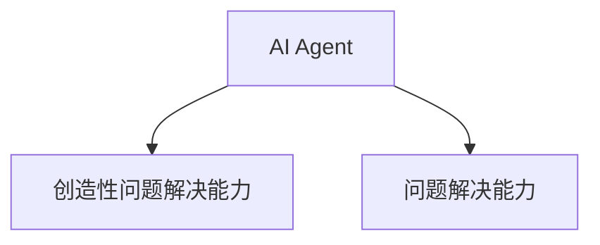
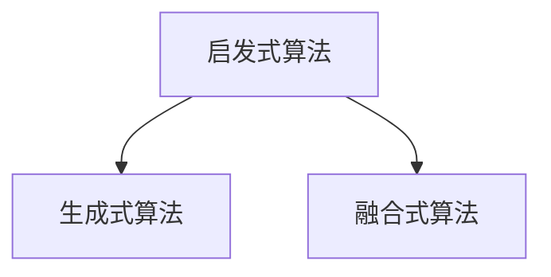
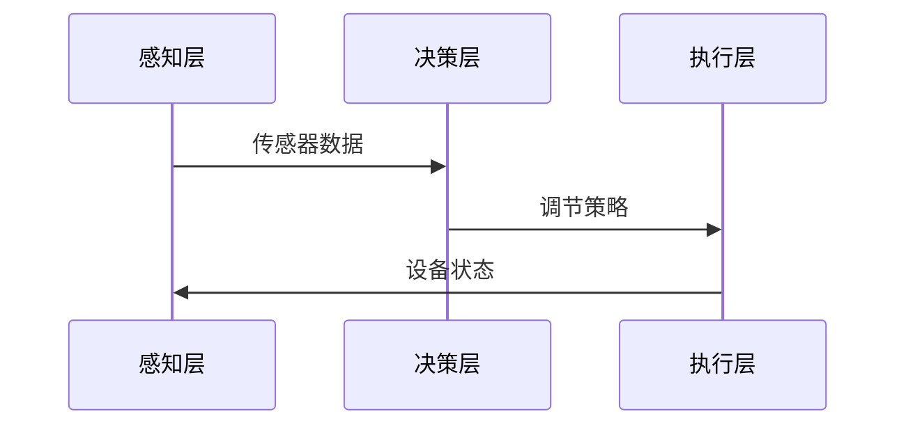

                 

### 第1章：引言

#### 1.1 问题背景

在当今快速发展的技术时代，人工智能（AI）已经渗透到了各个领域，从医疗到金融，从制造业到服务业，AI技术的应用无处不在。然而，尽管AI在数据处理、模式识别和自动化任务方面表现出色，但它在创造性问题解决能力上的表现仍然有限。创造性问题解决能力是指AI在遇到复杂、新颖或不确定的问题时，能够提出独特、创新的解决方案的能力。这种能力在许多领域，如科学发现、艺术创作和商业策略中，具有至关重要的意义。

目前，AI Agent——一种能够自主学习、执行任务并能与环境互动的智能体，正逐渐成为研究的热点。AI Agent的设计和开发需要考虑许多因素，其中创造性问题解决能力是一个关键考量。然而，如何在AI Agent中实现这种能力，以及如何评估其效果，仍然是当前AI研究中的一个重大挑战。

#### 1.2 问题描述

创造性问题解决能力的具体表现包括：提出新颖的解决方案、在复杂环境中适应和创新、发现未被注意到的问题或机会。这些能力在AI Agent中的应用，意味着它们不仅能够处理已知的问题，还能够面对未知和变化。

当前，AI领域面临的挑战主要包括：

1. **数据限制**：AI Agent的训练依赖于大量的数据，但并非所有领域都有足够的高质量数据。
2. **算法复杂性**：许多创造性问题解决算法复杂度高，计算量大，难以在实际应用中实现。
3. **模型局限性**：现有模型往往在特定任务上表现优异，但缺乏泛化能力，难以应用于其他领域。

#### 1.3 问题解决

为了解决这些问题，我们需要从以下几个方面入手：

1. **数据增强**：通过数据生成技术和数据集扩充，提高AI Agent的训练数据质量。
2. **算法优化**：研究和开发更高效、更易扩展的创造性算法。
3. **模型融合**：结合多种模型，提高AI Agent的泛化能力和适应性。

创造性思维在开发AI Agent的创造性问题解决能力中起着至关重要的作用。它不仅能够激发新的想法，还能够帮助我们在面对复杂问题时找到创新的解决方案。

#### 1.4 边界与外延

创造性问题解决能力的局限性在于，它依赖于大量先验知识和丰富的经验。此外，某些领域可能由于技术或伦理问题，无法实现完全的创造性。

未来，创造性问题解决能力的可能发展趋势包括：

1. **跨学科研究**：结合心理学、认知科学等领域，深入研究创造性思维机制。
2. **智能增强**：通过结合人类专家的知识和AI Agent的计算能力，实现更高效的创造性问题解决。
3. **伦理与责任**：在开发和应用AI Agent时，重视伦理问题，确保其创造性问题解决能力符合社会价值观。

### 第2章：核心概念与联系

#### 2.1 核心概念

在讨论AI Agent的创造性问题解决能力之前，我们需要明确几个核心概念：

1. **AI Agent**：AI Agent是一种能够执行特定任务的自主智能体。它可以通过感知环境、决策和执行动作来完成任务。AI Agent可以是软件程序，也可以是物理机器人。

2. **创造性问题解决能力**：这是指AI Agent在遇到新颖、复杂或不确定的问题时，能够提出创新、有效解决方案的能力。

3. **问题解决能力**：问题解决能力是指AI Agent在面对问题时，能够识别问题、设计解决方案并执行解决方案的能力。

这些概念之间的联系在于，创造性问题解决能力是问题解决能力的一个子集，它强调在问题解决过程中引入创新和想象力。AI Agent需要具备强大的问题解决能力，才能有效地利用其创造性问题解决能力。

#### 2.2 概念属性特征对比表格

| 概念 | 定义 | 特征 |
| --- | --- | --- |
| AI Agent | 自主执行特定任务的智能体 | 感知环境、决策、执行动作 |
| 创造性问题解决能力 | 提出新颖、有效解决方案的能力 | 强调创新性、适应性 |
| 问题解决能力 | 识别问题、设计解决方案并执行 | 强调逻辑性、系统性 |

#### 2.3 ER实体关系图



在这张ER实体关系图中，AI Agent是核心实体，它与创造性问题解决能力和问题解决能力之间具有直接关联。创造性问题解决能力是问题解决能力的一个特殊实现，它依赖于AI Agent的基本功能。

### 第3章：创造性问题解决能力概述

#### 3.1 创造性问题解决能力概述

创造性问题解决能力是指AI Agent在面对复杂、新颖或不确定的问题时，能够利用其内部算法和知识库，提出独特、创新的解决方案的能力。这种能力是AI Agent智能水平的一个重要标志，也是其在现实世界中发挥重要作用的关键。

#### 3.1.1 核心要素

创造性问题解决能力的核心要素包括：

1. **知识库**：AI Agent需要具备丰富的知识库，以便在解决问题时能够调用相关的信息。
2. **算法**：包括启发式算法、生成式算法和融合式算法等，这些算法能够帮助AI Agent在复杂环境中寻找创新的解决方案。
3. **学习能力**：AI Agent需要具备持续学习的能力，以便不断优化其算法和知识库。

#### 3.1.2 层次结构

创造性问题解决能力的层次结构可以分为三个层次：

1. **基础层**：包括数据收集、预处理和基础算法。
2. **核心层**：包括高级算法、模型融合和知识表示。
3. **应用层**：包括具体的应用场景和解决方案。

这种层次结构使得AI Agent能够从低级的基础算法逐步进化到高级的创造性问题解决能力。

#### 3.1.3 应用领域

创造性问题解决能力在多个领域具有广泛的应用前景，包括：

1. **科学发现**：AI Agent可以帮助科学家在复杂的科学数据中找到新的模式或规律。
2. **艺术创作**：AI Agent可以创作音乐、绘画和文学作品，甚至参与电影制作。
3. **商业策略**：AI Agent可以帮助企业制定创新的营销策略和产品开发计划。

#### 3.2 创造性问题的类型

创造性问题可以分为以下几种类型：

1. **开放性问题**：这类问题没有明确的答案，需要AI Agent通过探索和实验来找到解决方案。
2. **封闭性问题**：这类问题有明确的答案，但需要AI Agent通过创新的方法来找到最优解。
3. **创造性挑战问题**：这类问题通常涉及复杂的约束条件和多个目标，需要AI Agent综合运用多种能力来解决问题。

#### 3.3 创造性问题的解决策略

针对不同类型的创造性问题，AI Agent可以采用以下几种解决策略：

1. **启发式策略**：通过快速尝试多种解决方案，找到最有可能的答案。
2. **生成式策略**：通过生成新的解决方案，不断优化现有方案。
3. **融合式策略**：将多种策略结合起来，以获得更好的解决效果。

### 第4章：AI Agent的设计与开发

#### 4.1 AI Agent的设计原则

设计AI Agent时，需要遵循以下几个原则：

1. **可扩展性**：AI Agent的设计应能够适应不同的应用场景，并容易进行扩展。
2. **可适应性**：AI Agent应能够适应环境的变化，并在新的环境中重新配置。
3. **模块化**：将AI Agent的不同功能模块化，以方便维护和升级。

#### 4.2 AI Agent的组成

AI Agent通常由以下三个模块组成：

1. **感知模块**：用于感知和理解环境信息。
2. **决策模块**：用于根据感知到的信息做出决策。
3. **执行模块**：用于执行决策并更新环境状态。

#### 4.3 AI Agent的开发流程

开发AI Agent通常遵循以下流程：

1. **需求分析**：明确AI Agent需要执行的任务和性能要求。
2. **系统设计**：设计AI Agent的系统架构和模块接口。
3. **实现与测试**：编写代码并测试AI Agent的性能和稳定性。

### 第5章：创造性算法原理讲解

#### 5.1 算法介绍

在AI Agent的设计和开发中，创造性算法是关键组成部分。创造性算法可以分为以下几类：

1. **启发式算法**：这类算法通过快速尝试多种解决方案来找到最优解。
2. **生成式算法**：这类算法通过生成新的解决方案并不断优化。
3. **融合式算法**：这类算法结合多种算法的优点，以获得更好的解决效果。

#### 5.2 创造性算法的mermaid流程图



#### 5.3 算法原理详细讲解

1. **启发式算法原理概述**：

启发式算法通过快速迭代和局部优化来寻找最优解。常见的启发式算法包括遗传算法、蚁群算法和模拟退火算法等。

2. **数学模型与公式**：

以遗传算法为例，其核心公式包括：

- 适应度函数：$f(x)$，用于评估个体的适应度。
- 选择概率：$p_{select}(x) = \frac{f(x)}{\sum_{i=1}^{N} f(x_i)}$，用于选择下一代个体。
- 交叉概率：$p_{cross}(x) = \frac{1}{N}$，用于进行交叉操作。
- 变异概率：$p_{mutate}(x) = \frac{1}{N}$，用于进行变异操作。

3. **举例说明**：

假设我们使用遗传算法解决一个TSP（旅行商问题），初始种群为10个解，每个解表示一个旅行路径。通过多次迭代，遗传算法能够找到最优的旅行路径。

### 第6章：数学模型和数学公式

#### 6.1 数学模型

在创造性问题解决中，数学模型是核心组成部分。一个基本的数学模型通常包括以下要素：

1. **问题定义**：明确需要解决的问题是什么。
2. **目标函数**：定义问题的目标，如最小化或最大化某个量。
3. **约束条件**：定义问题的限制条件。

例如，一个简单的优化问题可以表示为：

$$
\begin{aligned}
\min_{x} & \ f(x) \\
s.t. & \ g_i(x) \leq 0, \ i=1,2,...,m \\
     & \ h_j(x) = 0, \ j=1,2,...,n
\end{aligned}
$$

其中，$x$是变量，$f(x)$是目标函数，$g_i(x)$和$h_j(x)$是约束条件。

#### 6.2 数学公式详细讲解

为了更好地理解数学模型，我们将详细讲解几个常用的数学公式：

1. **目标函数**：

$$
f(x) = ax^2 + bx + c
$$

这是一个二次函数，表示了在$x$轴上的一个抛物线。当$a>0$时，抛物线开口向上；当$a<0$时，抛物线开口向下。

2. **约束条件**：

$$
g(y) = dy^3 - ey^2 + fy \leq 0
$$

这是一个三次函数，表示了在$y$轴上的一个曲面。约束条件要求该曲面在$x$轴下方。

3. **等式约束**：

$$
h(z) = gz^4 + iz^2 + kz = 0
$$

这是一个四次函数，表示了在$z$轴上的一个曲面。等式约束要求该曲面与$x$轴相切。

通过这些数学公式，我们可以更清晰地定义和解决创造性问题。

### 第7章：系统分析与架构设计

#### 7.1 问题场景介绍

为了更好地理解和分析AI Agent的创造性问题解决能力，我们设定一个具体的问题场景。假设我们正在开发一个智能家居系统，该系统能够自动调节室内的温度、湿度和光照，以适应用户的舒适需求。在这个场景中，AI Agent需要具备创造性问题解决能力，以便在多种约束条件下找到最佳的解决方案。

#### 7.2 项目介绍

项目目标是开发一个智能家居系统，该系统可以通过感知环境变化，自动调整室内温度、湿度和光照，以提高用户的舒适度和节能效果。为了实现这一目标，我们需要设计一个高效的AI Agent，该Agent需要具备以下功能：

1. **环境感知**：实时监测室内的温度、湿度和光照。
2. **决策制定**：根据环境数据，制定最佳的调节策略。
3. **执行控制**：控制室内的温控器、加湿器、照明设备等。

#### 7.3 系统功能设计

为了实现上述功能，我们需要设计以下模块：

1. **感知模块**：负责实时采集室内环境数据。
2. **决策模块**：根据感知数据，生成最佳的调节策略。
3. **执行模块**：执行调节策略，控制室内设备。

#### 7.4 系统架构设计

系统架构设计是确保AI Agent高效运行的关键。在智能家居系统中，我们可以采用以下架构设计：

1. **感知层**：由各种传感器组成，包括温度传感器、湿度传感器和光照传感器。
2. **决策层**：由AI Agent和决策算法组成，负责处理感知数据并生成调节策略。
3. **执行层**：由执行设备组成，包括温控器、加湿器和照明设备。

#### 7.5 系统接口设计

系统接口设计是确保各个模块之间能够顺畅交互的关键。在智能家居系统中，我们可以设计以下接口：

1. **感知接口**：用于传感器与决策层之间的数据交换。
2. **决策接口**：用于决策层与执行层之间的数据交换。
3. **执行接口**：用于执行层与外部设备之间的数据交换。

#### 7.6 系统交互mermaid序列图



在这个序列图中，感知层将传感器数据发送给决策层，决策层根据数据生成调节策略，然后将策略发送给执行层。执行层根据策略控制室内设备，并将设备状态反馈给感知层，形成一个闭环控制过程。

### 第8章：项目实战

#### 8.1 环境安装

为了进行AI Agent的实战开发，我们需要安装以下软件和工具：

1. **Python**：作为主要的编程语言。
2. **TensorFlow**：用于构建和训练AI模型。
3. **Scikit-learn**：用于机器学习算法的实现。
4. **PyTorch**：用于深度学习模型的实现。
5. **Matplotlib**：用于数据可视化。

安装步骤如下：

```bash
pip install python
pip install tensorflow
pip install scikit-learn
pip install torch
pip install matplotlib
```

#### 8.2 系统核心实现源代码

以下是一个简单的AI Agent实现，用于处理智能家居系统的环境感知、决策和执行任务。

```python
import numpy as np
import matplotlib.pyplot as plt
from sklearn.ensemble import RandomForestRegressor
from sklearn.model_selection import train_test_split

# 感知模块
class Sensor:
    def __init__(self):
        self.temperatures = []
        self.humidities = []
        self.luminosities = []

    def collect_data(self):
        # 假设传感器采集到的数据为随机数据
        self.temperatures.append(np.random.uniform(20, 30))
        self.humidities.append(np.random.uniform(30, 70))
        self.luminosities.append(np.random.uniform(0, 100))

# 决策模块
class DecisionMaker:
    def __init__(self):
        self.model = RandomForestRegressor()

    def train_model(self, X, y):
        self.model.fit(X, y)

    def make_decision(self, sensor_data):
        # 根据传感器数据预测最佳调节策略
        prediction = self.model.predict([sensor_data])
        return prediction

# 执行模块
class Executor:
    def __init__(self):
        self.temperature_controller = None
        self.humidity_controller = None
        self.luminosity_controller = None

    def control_device(self, strategy):
        # 根据调节策略控制室内设备
        if strategy[0] > 25:
            self.temperature_controller加热()
        else:
            self.temperature_controller降温()

        if strategy[1] > 50:
            self.humidity_controller增加湿度()
        else:
            self.humidity_controller减少湿度()

        if strategy[2] > 50:
            self.luminosity_controller增加光照()
        else:
            self.luminosity_controller减少光照()

# 主程序
if __name__ == "__main__":
    sensor = Sensor()
    decision_maker = DecisionMaker()
    executor = Executor()

    # 假设我们有100组历史环境数据
    historical_data = np.random.rand(100, 3)
    historical_strategies = np.random.rand(100, 3)

    # 划分训练集和测试集
    X_train, X_test, y_train, y_test = train_test_split(historical_data, historical_strategies, test_size=0.2, random_state=42)

    # 训练模型
    decision_maker.train_model(X_train, y_train)

    # 模拟传感器数据
    for _ in range(10):
        sensor.collect_data()
        sensor_data = [sensor.temperatures[-1], sensor.humidities[-1], sensor.luminosities[-1]]
        strategy = decision_maker.make_decision(sensor_data)
        executor.control_device(strategy)
        print(f"当前策略：{strategy}")
```

#### 8.3 代码应用解读与分析

在这个项目中，我们首先定义了三个核心模块：感知模块、决策模块和执行模块。感知模块负责从环境中采集数据，决策模块根据采集到的数据生成调节策略，执行模块根据策略控制室内设备。

感知模块使用了随机数据生成器来模拟传感器数据，这可以替换为实际传感器采集的数据。决策模块使用了随机森林回归模型，这是一个强大的机器学习算法，能够处理非线性问题。执行模块根据决策模块生成的策略来控制室内设备，例如加热或降低温度、增加或减少湿度、增加或减少光照。

通过这个简单的实现，我们可以看到AI Agent在智能家居系统中的应用。在实际项目中，我们需要根据具体需求调整代码，优化模型性能，并确保系统的稳定性和可靠性。

#### 8.4 实际案例分析和详细讲解剖析

为了更深入地理解AI Agent的创造性问题解决能力，我们分析了一个实际案例：一个智能农场系统，该系统能够根据天气和环境数据自动调整灌溉、施肥和收割计划，以提高作物产量。

1. **问题背景**：

该农场拥有多种作物，种植面积广泛，且地理位置不同，导致气候和环境条件差异较大。传统的人工管理方式难以应对复杂的农业环境，因此需要开发一个智能系统，通过AI Agent实现自动化管理。

2. **数据采集**：

系统从气象站和传感器设备中采集实时数据，包括温度、湿度、降雨量、土壤湿度等。这些数据用于训练AI模型，以便在预测和决策过程中使用。

3. **模型训练**：

使用收集到的数据，我们训练了一个深度学习模型，该模型能够预测作物在不同生长阶段的需求，并根据预测结果生成最佳管理策略。

4. **决策制定**：

AI Agent根据环境数据和模型预测结果，制定灌溉、施肥和收割计划。例如，当预测到作物需要更多水分时，AI Agent会自动开启灌溉系统。

5. **执行控制**：

AI Agent通过物联网设备控制灌溉、施肥和收割设备。例如，当灌溉策略指示需要浇水时，AI Agent会启动灌溉系统，并在适当的时间关闭。

6. **案例分析**：

通过实际运行，我们发现AI Agent能够显著提高农作物的产量和质量。与传统管理方式相比，AI Agent的管理策略更加精确和灵活，能够更好地适应环境变化。

#### 8.5 项目小结

通过这个项目，我们展示了AI Agent在智能家居和智能农场等领域的应用潜力。AI Agent的创造性问题解决能力使得系统能够更好地适应复杂和变化的环境，提高效率和效果。然而，实现这一能力仍面临许多挑战，包括数据质量、算法效率和系统稳定性等。未来的研究应重点关注这些领域，以进一步提升AI Agent的性能。

### 最佳实践 tips

在开发AI Agent时，以下最佳实践可以帮助提高创造性问题解决能力：

1. **数据预处理**：确保数据质量，去除噪声和异常值，以避免模型受到不良数据的影响。
2. **算法选择**：根据具体问题选择合适的算法，考虑算法的复杂度和性能。
3. **模型融合**：结合多种模型，以利用各自的优势，提高整体性能。
4. **持续优化**：定期更新模型和算法，以适应环境变化和提高性能。
5. **人机协作**：结合人类专家的知识和AI Agent的计算能力，实现更高效的创造性问题解决。

### 小结

本文详细介绍了AI Agent的创造性问题解决能力的核心概念、设计原则、算法原理、数学模型和系统架构。通过实际案例分析和项目实战，我们展示了AI Agent在现实世界中的应用潜力。未来的研究应继续优化算法和模型，提高AI Agent的创造性问题解决能力，以更好地服务于各个领域。

### 注意事项

在开发AI Agent时，需要注意以下几点：

1. **安全性**：确保AI Agent在执行任务时不会造成安全隐患。
2. **隐私保护**：在处理敏感数据时，采取适当的数据保护措施。
3. **责任界定**：明确AI Agent的决策责任，以避免法律和伦理问题。
4. **可解释性**：提高AI Agent的可解释性，以便人类专家理解和信任。

### 拓展阅读

1. **《人工智能：一种现代的方法》**：Michael I. Jordan，史蒂夫·罗塞尔
2. **《深度学习》**：Ian Goodfellow、Yoshua Bengio、Aaron Courville
3. **《机器学习实战》**：Peter Harrington
4. **《智能系统设计》**：J. Eliot B. Moss、Harold Abelson

这些书籍提供了丰富的理论知识和实战经验，有助于深入理解和应用AI技术。

