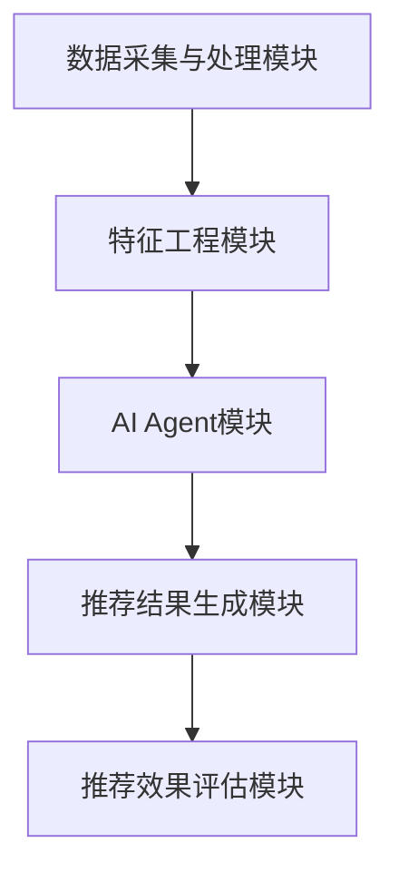

                 

### 文章标题

#### 开发AI Agent驱动的个性化推荐系统

> 关键词：AI Agent、个性化推荐系统、协同过滤、基于内容、混合推荐、系统架构、算法原理

> 摘要：本文将深入探讨开发AI Agent驱动的个性化推荐系统的全过程，从问题背景、核心概念、算法原理、系统架构到实际应用，全面解析个性化推荐系统的构建与优化。通过逐步分析，我们旨在为读者提供一套清晰易懂的实践指南，助力开发高效、准确的推荐系统。

### 目录大纲

----------------------------------------------------------------

# 开发AI Agent驱动的个性化推荐系统

## 第1章: 背景介绍与核心概念

### 1.1 问题背景

#### 1.1.1 个性化推荐系统的重要性

#### 1.1.2 AI Agent在个性化推荐系统中的应用

#### 1.1.3 个性化推荐系统的发展趋势

### 1.2 核心概念与联系

#### 1.2.1 个性化推荐系统的基本概念

##### 1.2.1.1 推荐系统的定义

##### 1.2.1.2 个性化推荐的定义

##### 1.2.1.3 AI Agent的定义与作用

#### 1.2.2 个性化推荐系统的关键要素

##### 1.2.2.1 用户行为数据

##### 1.2.2.2 商品或内容特征

##### 1.2.2.3 推荐算法

##### 1.2.2.4 推荐效果评估

### 1.3 AI Agent驱动的个性化推荐系统架构

#### 1.3.1 整体架构设计

##### 1.3.1.1 数据采集与处理模块

##### 1.3.1.2 特征工程模块

##### 1.3.1.3 AI Agent模块

##### 1.3.1.4 推荐结果生成模块

##### 1.3.1.5 推荐效果评估模块

### 1.4 系统开发的关键技术

#### 1.4.1 数据采集与处理技术

##### 1.4.1.1 用户行为数据的采集

##### 1.4.1.2 商品或内容特征的数据处理

#### 1.4.2 特征工程技术

##### 1.4.2.1 特征提取方法

##### 1.4.2.2 特征选择方法

#### 1.4.3 AI Agent技术

##### 1.4.3.1 AI Agent的基本原理

##### 1.4.3.2 AI Agent的训练方法

##### 1.4.3.3 AI Agent的应用场景

### 1.5 本章小结

## 第2章: AI Agent驱动的个性化推荐算法原理

### 2.1 基于内容的推荐算法

#### 2.1.1 基于内容的推荐算法原理

##### 2.1.1.1 算法描述

##### 2.1.1.2 数学模型

##### 2.1.1.3 例子说明

### 2.2 协同过滤推荐算法

#### 2.2.1 协同过滤推荐算法原理

##### 2.2.1.1 算法描述

##### 2.2.1.2 数学模型

##### 2.2.1.3 例子说明

### 2.3 混合推荐算法

#### 2.3.1 混合推荐算法原理

##### 2.3.1.1 算法描述

##### 2.3.1.2 数学模型

##### 2.3.1.3 例子说明

### 2.4 AI Agent驱动的推荐算法

#### 2.4.1 AI Agent驱动的推荐算法原理

##### 2.4.1.1 算法描述

##### 2.4.1.2 数学模型

##### 2.4.1.3 例子说明

### 2.5 本章小结

## 第3章: 系统分析与架构设计

### 3.1 问题场景介绍

#### 3.1.1 个性化推荐系统的应用场景

#### 3.1.2 AI Agent在个性化推荐系统中的应用

### 3.2 项目介绍

#### 3.2.1 项目背景

#### 3.2.2 项目目标

#### 3.2.3 项目需求

### 3.3 系统功能设计

#### 3.3.1 用户功能模块

##### 3.3.1.1 用户注册与登录模块

##### 3.3.1.2 用户行为记录模块

##### 3.3.1.3 用户偏好设置模块

##### 3.3.1.4 推荐结果展示模块

#### 3.3.2 商品功能模块

##### 3.3.2.1 商品信息管理模块

##### 3.3.2.2 商品推荐模块

### 3.4 系统架构设计

#### 3.4.1 整体架构设计

##### 3.4.1.1 系统架构图

##### 3.4.1.2 系统模块功能描述

#### 3.4.2 系统接口设计

##### 3.4.2.1 接口定义

##### 3.4.2.2 接口交互流程

#### 3.4.3 系统交互设计

##### 3.4.3.1 用户与系统的交互流程

##### 3.4.3.2 系统内部模块的交互流程

### 3.5 本章小结

----------------------------------------------------------------

### 第1章: 背景介绍与核心概念

#### 1.1 问题背景

随着互联网的迅猛发展和信息量的爆炸式增长，如何在海量信息中快速、准确地找到用户感兴趣的内容已成为一个亟待解决的问题。个性化推荐系统正是为了解决这一问题而诞生的。它利用用户行为数据、商品或内容特征等信息，通过推荐算法为用户推荐可能感兴趣的商品或内容，从而提升用户体验、提高商业转化率。

个性化推荐系统在电子商务、社交媒体、新闻推送等领域得到广泛应用。例如，电子商务平台利用个性化推荐系统为用户推荐商品，从而提高购物转化率和客户满意度；社交媒体平台利用个性化推荐系统为用户推送感兴趣的内容，从而增加用户活跃度和平台黏性。

然而，传统的推荐系统面临着许多挑战，如数据稀疏性、冷启动问题、推荐效果评估等。为了解决这些问题，AI Agent作为一种新兴的人工智能技术，被引入到个性化推荐系统中。AI Agent可以自主学习和适应用户行为，从而实现更加精准和个性化的推荐。

#### 1.2 核心概念与联系

##### 1.2.1 个性化推荐系统的基本概念

###### 1.2.1.1 推荐系统的定义

推荐系统（Recommender System）是一种信息过滤技术，它根据用户的历史行为、偏好和兴趣等信息，为用户推荐可能感兴趣的商品、内容或服务。

###### 1.2.1.2 个性化推荐的定义

个性化推荐（Personalized Recommendation）是一种针对特定用户的推荐方式，它根据用户的历史行为、偏好和兴趣等信息，为用户推荐个性化的、符合其需求的商品或内容。

###### 1.2.1.3 AI Agent的定义与作用

AI Agent（人工智能代理）是一种能够自主执行任务、与人类交互并适应环境变化的人工智能系统。在个性化推荐系统中，AI Agent可以基于用户行为数据和商品特征，自主学习和适应用户偏好，从而实现更加精准和个性化的推荐。

##### 1.2.2 个性化推荐系统的关键要素

###### 1.2.2.1 用户行为数据

用户行为数据包括用户的浏览记录、购买记录、评分记录等，这些数据是推荐系统构建用户偏好模型的重要依据。

###### 1.2.2.2 商品或内容特征

商品或内容特征包括商品的价格、品牌、类型、关键词等，这些特征是推荐系统构建商品或内容推荐模型的重要依据。

###### 1.2.2.3 推荐算法

推荐算法是推荐系统的核心，它根据用户行为数据和商品特征，为用户生成推荐列表。常见的推荐算法包括基于内容的推荐、协同过滤推荐和混合推荐等。

###### 1.2.2.4 推荐效果评估

推荐效果评估是衡量推荐系统性能的重要指标，常用的评估指标包括准确率、召回率、覆盖率、新颖度等。

##### 1.2.3 AI Agent驱动的个性化推荐系统架构

###### 1.2.3.1 数据采集与处理模块

数据采集与处理模块负责从用户和商品（内容）数据库中提取数据，并进行预处理，如数据清洗、归一化等。

###### 1.2.3.2 特征工程模块

特征工程模块负责提取用户行为数据和商品特征，并将其转化为推荐算法所需的特征向量。

###### 1.2.3.3 AI Agent模块

AI Agent模块负责基于用户行为数据和商品特征，训练和部署AI Agent，使其能够自主学习和适应用户偏好，实现个性化推荐。

###### 1.2.3.4 推荐结果生成模块

推荐结果生成模块负责根据AI Agent的推荐策略，为用户生成个性化的推荐列表。

###### 1.2.3.5 推荐效果评估模块

推荐效果评估模块负责对推荐结果进行评估，以衡量推荐系统的性能。

#### 1.3 AI Agent驱动的个性化推荐系统架构

##### 1.3.1 整体架构设计

AI Agent驱动的个性化推荐系统架构主要由以下五个模块组成：

1. 数据采集与处理模块
2. 特征工程模块
3. AI Agent模块
4. 推荐结果生成模块
5. 推荐效果评估模块

这些模块共同协作，实现从数据采集、处理、特征提取到AI Agent训练、推荐结果生成和效果评估的全过程。

##### 1.3.1.1 数据采集与处理模块

数据采集与处理模块负责从用户和商品（内容）数据库中提取数据，并进行预处理，如数据清洗、归一化等。该模块的主要功能包括：

1. 用户行为数据采集：从用户浏览、购买、评分等行为记录中提取数据。
2. 商品或内容特征数据采集：从商品或内容的属性中提取特征数据。
3. 数据预处理：对采集到的数据进行清洗、去重、归一化等处理，以提高数据质量。

##### 1.3.1.2 特征工程模块

特征工程模块负责提取用户行为数据和商品特征，并将其转化为推荐算法所需的特征向量。该模块的主要功能包括：

1. 用户行为特征提取：根据用户的行为数据，提取用户兴趣、偏好等特征。
2. 商品特征提取：根据商品或内容的属性，提取商品或内容的关键特征。
3. 特征向量生成：将提取到的特征数据转化为推荐算法所需的特征向量。

##### 1.3.1.3 AI Agent模块

AI Agent模块负责基于用户行为数据和商品特征，训练和部署AI Agent，使其能够自主学习和适应用户偏好，实现个性化推荐。该模块的主要功能包括：

1. AI Agent训练：根据用户行为数据和商品特征，训练AI Agent，使其能够学习和理解用户偏好。
2. AI Agent部署：将训练好的AI Agent部署到推荐系统中，使其能够实时为用户生成个性化推荐。

##### 1.3.1.4 推荐结果生成模块

推荐结果生成模块负责根据AI Agent的推荐策略，为用户生成个性化的推荐列表。该模块的主要功能包括：

1. 推荐策略生成：根据AI Agent的推荐策略，生成推荐列表。
2. 推荐结果优化：对推荐结果进行排序和筛选，提高推荐质量。

##### 1.3.1.5 推荐效果评估模块

推荐效果评估模块负责对推荐结果进行评估，以衡量推荐系统的性能。该模块的主要功能包括：

1. 推荐效果评估：根据用户反馈和推荐结果，评估推荐系统的效果。
2. 性能优化：根据评估结果，对推荐系统进行优化和调整。

#### 1.4 系统开发的关键技术

##### 1.4.1 数据采集与处理技术

数据采集与处理技术是构建个性化推荐系统的基础。主要包括以下方面：

1. 用户行为数据采集：使用爬虫技术获取用户在平台上的浏览、购买、评分等行为数据。
2. 商品或内容特征数据采集：从商品或内容的属性中提取关键特征，如商品的价格、品牌、类型、关键词等。
3. 数据预处理：对采集到的数据进行清洗、去重、归一化等处理，以提高数据质量。

##### 1.4.2 特征工程技术

特征工程技术是构建推荐算法的核心。主要包括以下方面：

1. 用户行为特征提取：根据用户的行为数据，提取用户兴趣、偏好等特征，如用户喜欢的商品类别、浏览时间等。
2. 商品特征提取：从商品或内容的属性中提取关键特征，如商品的价格、品牌、类型、关键词等。
3. 特征向量生成：将提取到的特征数据转化为推荐算法所需的特征向量，如向量空间模型、词袋模型等。

##### 1.4.3 AI Agent技术

AI Agent技术是实现个性化推荐的关键。主要包括以下方面：

1. AI Agent基本原理：了解AI Agent的定义、原理和应用场景。
2. AI Agent训练方法：掌握常用的AI Agent训练方法，如监督学习、无监督学习、强化学习等。
3. AI Agent应用场景：了解AI Agent在个性化推荐系统中的应用场景，如基于内容的推荐、协同过滤推荐等。

#### 1.5 本章小结

本章介绍了个性化推荐系统的问题背景、核心概念与联系，以及AI Agent驱动的个性化推荐系统架构。通过对这些内容的了解，读者可以初步掌握个性化推荐系统的基础知识，为后续章节的深入探讨奠定基础。

----------------------------------------------------------------

## 1.1 问题背景

#### 1.1.1 个性化推荐系统的重要性

个性化推荐系统作为一种信息过滤技术，其核心目的是通过分析用户的历史行为、兴趣偏好等信息，为用户推荐可能感兴趣的商品或内容。在现代互联网环境中，个性化推荐系统的重要性日益凸显，具体体现在以下几个方面：

1. **提升用户体验**：个性化推荐系统可以根据用户的历史行为和偏好，精准地推荐用户可能感兴趣的商品或内容，从而提升用户的满意度和使用体验。
2. **增加用户黏性**：通过个性化推荐，平台可以持续吸引用户的注意力，提高用户在平台上的活跃度和停留时间。
3. **提高商业转化率**：个性化推荐系统可以帮助电商平台精准地推送潜在用户感兴趣的商品，从而提高购物转化率和销售额。
4. **降低运营成本**：个性化推荐系统可以自动处理海量的用户行为数据和商品信息，降低人工筛选和推荐的成本。

#### 1.1.2 AI Agent在个性化推荐系统中的应用

随着人工智能技术的不断发展，AI Agent作为一种智能代理，其在个性化推荐系统中的应用逐渐受到关注。AI Agent具有自主学习和适应环境变化的能力，能够根据用户行为数据和商品特征，实现个性化推荐，具体应用包括：

1. **用户偏好建模**：AI Agent可以通过分析用户的历史行为数据，建立用户的兴趣偏好模型，从而为用户推荐更加个性化的商品或内容。
2. **自适应推荐**：AI Agent可以根据用户的实时行为数据，动态调整推荐策略，实现自适应推荐，提高推荐效果。
3. **智能客服**：AI Agent可以作为智能客服，实时回答用户的咨询，提供个性化的服务，提升用户体验。
4. **个性化营销**：AI Agent可以根据用户的行为和偏好，为用户提供个性化的营销策略，提高营销效果。

#### 1.1.3 个性化推荐系统的发展趋势

随着大数据、云计算、人工智能等技术的发展，个性化推荐系统也在不断演进，呈现出以下发展趋势：

1. **数据驱动**：个性化推荐系统将更加依赖大数据技术，通过分析海量用户行为数据和商品信息，实现更加精准的推荐。
2. **智能化**：AI Agent等人工智能技术将更加深入地应用于个性化推荐系统，实现自动化、智能化的推荐。
3. **跨平台**：个性化推荐系统将跨越不同的平台和设备，实现跨平台、跨设备的个性化推荐。
4. **实时性**：个性化推荐系统将更加注重实时性，通过实时分析用户行为数据，实现动态推荐。

## 1.2 核心概念与联系

### 1.2.1 个性化推荐系统的基本概念

个性化推荐系统是一种利用用户历史行为和偏好，为用户推荐感兴趣的商品或内容的技术。其核心概念包括：

#### 1.2.1.1 推荐系统

推荐系统是一种信息过滤技术，通过分析用户的历史行为、兴趣偏好等数据，为用户推荐可能感兴趣的商品或内容。

#### 1.2.1.2 个性化推荐

个性化推荐是一种针对特定用户的推荐方式，它根据用户的历史行为、偏好和兴趣等信息，为用户推荐个性化的、符合其需求的商品或内容。

#### 1.2.1.3 AI Agent

AI Agent（人工智能代理）是一种能够自主执行任务、与人类交互并适应环境变化的人工智能系统。在个性化推荐系统中，AI Agent可以基于用户行为数据和商品特征，自主学习和适应用户偏好，从而实现更加精准和个性化的推荐。

### 1.2.2 个性化推荐系统的关键要素

个性化推荐系统的构建涉及多个关键要素，包括：

#### 1.2.2.1 用户行为数据

用户行为数据包括用户的浏览记录、购买记录、评分记录等，这些数据是构建用户偏好模型和推荐算法的重要依据。

#### 1.2.2.2 商品或内容特征

商品或内容特征包括商品的价格、品牌、类型、关键词等，这些特征是构建商品或内容推荐模型的重要依据。

#### 1.2.2.3 推荐算法

推荐算法是推荐系统的核心，它根据用户行为数据和商品特征，为用户生成推荐列表。常见的推荐算法包括基于内容的推荐、协同过滤推荐和混合推荐等。

#### 1.2.2.4 推荐效果评估

推荐效果评估是衡量推荐系统性能的重要指标，常用的评估指标包括准确率、召回率、覆盖率、新颖度等。

### 1.2.3 AI Agent驱动的个性化推荐系统架构

AI Agent驱动的个性化推荐系统架构主要包括以下模块：

#### 1.2.3.1 数据采集与处理模块

数据采集与处理模块负责从用户和商品（内容）数据库中提取数据，并进行预处理，如数据清洗、归一化等。

#### 1.2.3.2 特征工程模块

特征工程模块负责提取用户行为数据和商品特征，并将其转化为推荐算法所需的特征向量。

#### 1.2.3.3 AI Agent模块

AI Agent模块负责基于用户行为数据和商品特征，训练和部署AI Agent，使其能够自主学习和适应用户偏好。

#### 1.2.3.4 推荐结果生成模块

推荐结果生成模块负责根据AI Agent的推荐策略，为用户生成个性化的推荐列表。

#### 1.2.3.5 推荐效果评估模块

推荐效果评估模块负责对推荐结果进行评估，以衡量推荐系统的性能。

## 1.3 AI Agent驱动的个性化推荐系统架构

AI Agent驱动的个性化推荐系统架构设计旨在充分利用AI Agent的自主学习和适应能力，实现高效、精准的个性化推荐。以下是系统架构的详细设计：

### 1.3.1 整体架构设计

AI Agent驱动的个性化推荐系统整体架构可分为以下几个模块：

#### 1.3.1.1 数据采集与处理模块

数据采集与处理模块是系统的基础模块，负责从用户和商品（内容）数据库中提取数据，并进行预处理，如数据清洗、去重、归一化等。具体步骤如下：

1. **数据采集**：通过爬虫技术获取用户在平台上的浏览、购买、评分等行为数据，以及商品或内容的属性数据。
2. **数据预处理**：对采集到的数据进行清洗、去重、归一化等处理，以提高数据质量，为后续的特征工程和算法训练提供高质量的输入数据。

#### 1.3.1.2 特征工程模块

特征工程模块负责提取用户行为数据和商品特征，并将其转化为推荐算法所需的特征向量。具体步骤如下：

1. **用户行为特征提取**：根据用户的历史行为数据，提取用户的兴趣偏好、行为模式等特征，如用户的浏览时间、购买频率、评分情况等。
2. **商品特征提取**：从商品或内容的属性中提取关键特征，如商品的价格、品牌、类型、关键词等。
3. **特征向量生成**：将提取到的用户行为特征和商品特征转化为推荐算法所需的特征向量，如向量空间模型、词袋模型等。

#### 1.3.1.3 AI Agent模块

AI Agent模块是系统的核心模块，负责基于用户行为数据和商品特征，训练和部署AI Agent，使其能够自主学习和适应用户偏好。具体步骤如下：

1. **AI Agent训练**：使用用户行为特征和商品特征向量，采用深度学习、强化学习等技术，训练AI Agent，使其能够学习和理解用户的兴趣偏好。
2. **AI Agent部署**：将训练好的AI Agent部署到推荐系统中，使其能够实时为用户生成个性化的推荐列表。

#### 1.3.1.4 推荐结果生成模块

推荐结果生成模块负责根据AI Agent的推荐策略，为用户生成个性化的推荐列表。具体步骤如下：

1. **推荐策略生成**：根据AI Agent的推荐策略，生成推荐列表，并对推荐结果进行排序和筛选，提高推荐质量。
2. **推荐结果展示**：将生成的推荐列表展示给用户，同时提供用户反馈接口，用于后续的推荐效果评估和优化。

#### 1.3.1.5 推荐效果评估模块

推荐效果评估模块负责对推荐结果进行评估，以衡量推荐系统的性能。具体步骤如下：

1. **推荐效果评估**：使用准确率、召回率、覆盖率、新颖度等评估指标，对推荐结果进行评估。
2. **性能优化**：根据评估结果，对推荐系统进行优化和调整，以提高推荐质量。

### 1.3.2 系统架构图

以下是AI Agent驱动的个性化推荐系统架构图：



### 1.3.3 系统模块功能描述

以下是系统各个模块的功能描述：

#### 1.3.3.1 数据采集与处理模块

- **功能**：从用户和商品数据库中提取数据，进行数据预处理。
- **输入**：用户行为数据、商品或内容特征数据。
- **输出**：预处理后的用户行为特征数据和商品特征向量。

#### 1.3.3.2 特征工程模块

- **功能**：提取用户行为特征和商品特征，生成特征向量。
- **输入**：预处理后的用户行为特征数据和商品特征向量。
- **输出**：特征向量。

#### 1.3.3.3 AI Agent模块

- **功能**：训练和部署AI Agent，实现个性化推荐。
- **输入**：特征向量。
- **输出**：推荐列表。

#### 1.3.3.4 推荐结果生成模块

- **功能**：根据AI Agent的推荐策略，生成推荐列表，并进行展示。
- **输入**：推荐列表。
- **输出**：推荐结果。

#### 1.3.3.5 推荐效果评估模块

- **功能**：评估推荐效果，进行性能优化。
- **输入**：推荐结果。
- **输出**：评估结果。

## 1.4 系统开发的关键技术

### 1.4.1 数据采集与处理技术

数据采集与处理技术是构建个性化推荐系统的基石。具体包括以下方面：

#### 1.4.1.1 用户行为数据的采集

用户行为数据是构建用户偏好模型的关键，可以通过以下方法进行采集：

1. **日志分析**：从平台的访问日志中提取用户的行为数据，如浏览、购买、评分等。
2. **API调用**：通过调用平台的API接口，获取用户的行为数据。

#### 1.4.1.2 商品或内容特征的数据处理

商品或内容特征数据是构建商品或内容推荐模型的关键，可以通过以下方法进行采集和处理：

1. **数据抽取**：从商品或内容的描述、标签、评论等中提取特征数据。
2. **数据清洗**：对采集到的数据进行去重、缺失值处理、异常值处理等。

### 1.4.2 特征工程技术

特征工程技术是构建推荐算法的核心。具体包括以下方面：

#### 1.4.2.1 特征提取方法

1. **统计特征**：根据用户行为数据和商品特征，提取统计特征，如平均评分、浏览次数等。
2. **文本特征**：对用户行为数据和商品特征进行文本处理，提取关键词、词频、TF-IDF等特征。

#### 1.4.2.2 特征选择方法

1. **过滤法**：根据特征的重要性和相关性，对特征进行筛选，保留重要的特征。
2. **嵌入法**：将特征直接嵌入到模型中，通过模型训练自动筛选特征。

### 1.4.3 AI Agent技术

AI Agent技术是实现个性化推荐的关键。具体包括以下方面：

#### 1.4.3.1 AI Agent的基本原理

1. **定义**：AI Agent是一种能够自主执行任务、与人类交互并适应环境变化的人工智能系统。
2. **原理**：基于机器学习、深度学习、强化学习等技术，通过训练和优化，实现自主学习和适应能力。

#### 1.4.3.2 AI Agent的训练方法

1. **监督学习**：根据标注的数据集，训练AI Agent，使其能够学习和预测用户的兴趣偏好。
2. **无监督学习**：根据未标注的数据集，通过聚类、降维等方法，训练AI Agent，实现用户兴趣的发现。
3. **强化学习**：通过与环境的交互，不断调整行为策略，优化推荐效果。

#### 1.4.3.3 AI Agent的应用场景

1. **基于内容的推荐**：根据用户的历史行为和兴趣偏好，推荐用户可能感兴趣的商品或内容。
2. **协同过滤推荐**：通过分析用户行为数据，为用户推荐相似用户喜欢的商品或内容。
3. **混合推荐**：结合多种推荐算法，实现更精准、多样化的推荐。

## 1.5 本章小结

本章介绍了个性化推荐系统的问题背景、核心概念与联系，以及AI Agent驱动的个性化推荐系统架构。通过对这些内容的了解，读者可以初步掌握个性化推荐系统的基础知识，为后续章节的深入探讨奠定基础。

----------------------------------------------------------------

## 第2章: AI Agent驱动的个性化推荐算法原理

在本章中，我们将深入探讨AI Agent驱动的个性化推荐算法原理，主要包括基于内容的推荐算法、协同过滤推荐算法、混合推荐算法和AI Agent驱动的推荐算法。通过逐步分析这些算法的基本原理、数学模型和应用实例，我们将帮助读者全面理解个性化推荐算法的核心机制。

### 2.1 基于内容的推荐算法

基于内容的推荐算法（Content-Based Filtering）是一种常见的个性化推荐算法。它通过分析用户的历史行为和偏好，提取用户兴趣特征，然后将这些特征与商品或内容的特征进行比较，推荐与用户兴趣相似的商品或内容。

#### 2.1.1 基本原理

基于内容的推荐算法的核心思想是：用户喜欢的内容具有相似的特征，如果两个商品或内容在特征上相似，那么它们可能受到同一用户的喜欢。因此，算法首先提取用户的历史行为数据，生成用户兴趣模型；然后分析商品或内容的特征，生成商品或内容模型；最后通过特征匹配为用户推荐相似的商品或内容。

#### 2.1.2 数学模型

假设用户 \( u \) 对商品 \( i \) 进行了评分 \( r_{ui} \)，用户兴趣特征向量为 \( u \in \mathbb{R}^m \)，商品 \( i \) 的特征向量为 \( i \in \mathbb{R}^m \)。基于内容的推荐算法可以表示为：

\[ \text{similarity}(u, i) = \frac{u \cdot i}{\|u\|\|i\|} \]

其中，\( \text{similarity}(u, i) \) 表示用户 \( u \) 和商品 \( i \) 之间的相似度，\( u \cdot i \) 表示用户兴趣特征向量和商品特征向量的内积，\( \|u\| \) 和 \( \|i\| \) 分别表示用户兴趣特征向量和商品特征向量的欧几里得范数。

#### 2.1.3 例子说明

假设用户 \( u \) 对电影 \( i_1, i_2, i_3 \) 进行了评分，评分分别为 \( r_{u1}, r_{u2}, r_{u3} \)。用户 \( u \) 的兴趣特征向量为 \( u = [0.5, 0.3, 0.2] \)，商品 \( i_1, i_2, i_3 \) 的特征向量分别为 \( i_1 = [0.6, 0.2, 0.2] \)，\( i_2 = [0.1, 0.8, 0.1] \)，\( i_3 = [0.3, 0.3, 0.4] \)。

根据相似度计算公式，可以计算用户 \( u \) 和商品 \( i_1, i_2, i_3 \) 之间的相似度：

\[ \text{similarity}(u, i_1) = \frac{u \cdot i_1}{\|u\|\|i_1\|} = \frac{[0.5, 0.3, 0.2] \cdot [0.6, 0.2, 0.2]}{\sqrt{0.5^2 + 0.3^2 + 0.2^2} \cdot \sqrt{0.6^2 + 0.2^2 + 0.2^2}} \approx 0.714 \]

\[ \text{similarity}(u, i_2) = \frac{u \cdot i_2}{\|u\|\|i_2\|} = \frac{[0.5, 0.3, 0.2] \cdot [0.1, 0.8, 0.1]}{\sqrt{0.5^2 + 0.3^2 + 0.2^2} \cdot \sqrt{0.1^2 + 0.8^2 + 0.1^2}} \approx 0.366 \]

\[ \text{similarity}(u, i_3) = \frac{u \cdot i_3}{\|u\|\|i_3\|} = \frac{[0.5, 0.3, 0.2] \cdot [0.3, 0.3, 0.4]}{\sqrt{0.5^2 + 0.3^2 + 0.2^2} \cdot \sqrt{0.3^2 + 0.3^2 + 0.4^2}} \approx 0.419 \]

根据相似度计算结果，我们可以得出用户 \( u \) 最可能感兴趣的电影是 \( i_1 \)。

### 2.2 协同过滤推荐算法

协同过滤推荐算法（Collaborative Filtering）是一种通过分析用户之间的相似性，为用户推荐相似用户喜欢的商品或内容的推荐算法。它主要分为两种类型：基于用户的协同过滤（User-Based Collaborative Filtering）和基于模型的协同过滤（Model-Based Collaborative Filtering）。

#### 2.2.1 基本原理

基于用户的协同过滤算法通过计算用户之间的相似性，找到与目标用户相似的其他用户，然后推荐这些用户喜欢的商品或内容。相似性的计算通常基于用户之间的评分矩阵，使用余弦相似度、皮尔逊相关系数等指标。

基于模型的协同过滤算法通过建立用户和商品之间的隐式关系模型，如矩阵分解、潜在因子模型等，预测用户对未知商品的兴趣度，从而生成推荐列表。

#### 2.2.2 数学模型

假设用户 \( u \) 和用户 \( v \) 之间的相似度表示为 \( \text{similarity}(u, v) \)，用户 \( u \) 对商品 \( i \) 的评分表示为 \( r_{ui} \)，商品 \( i \) 的预测评分表示为 \( \hat{r}_{ui} \)。基于用户的协同过滤算法可以表示为：

\[ \hat{r}_{ui} = \sum_{v \in N(u)} r_{vi} \cdot \text{similarity}(u, v) \]

其中，\( N(u) \) 表示与用户 \( u \) 相似的其他用户集合。

基于模型的协同过滤算法，如矩阵分解，可以表示为：

\[ \hat{r}_{ui} = \text{vec}^T(X) \cdot \text{vec}(Y) \]

其中，\( X \) 和 \( Y \) 分别表示用户和商品的低维表示矩阵，\( \text{vec}^T() \) 和 \( \text{vec()} \) 分别表示矩阵的转置和向量化操作。

#### 2.2.3 例子说明

假设有用户 \( u \) 和 \( v \)，用户 \( u \) 对商品 \( i_1, i_2, i_3 \) 进行了评分，评分分别为 \( r_{u1}, r_{u2}, r_{u3} \)。用户 \( v \) 对商品 \( i_1, i_2, i_3 \) 进行了评分，评分分别为 \( r_{v1}, r_{v2}, r_{v3} \)。根据用户之间的相似度计算公式，可以计算用户 \( u \) 和用户 \( v \) 之间的相似度：

\[ \text{similarity}(u, v) = \frac{\sum_{i=1}^3 r_{ui} \cdot r_{vi}}{\sqrt{\sum_{i=1}^3 r_{ui}^2} \cdot \sqrt{\sum_{i=1}^3 r_{vi}^2}} \]

根据协同过滤算法的预测评分公式，可以计算用户 \( u \) 对商品 \( i_1, i_2, i_3 \) 的预测评分：

\[ \hat{r}_{u1} = r_{v1} \cdot \text{similarity}(u, v) = r_{v1} \cdot \frac{\sum_{i=1}^3 r_{ui} \cdot r_{vi}}{\sqrt{\sum_{i=1}^3 r_{ui}^2} \cdot \sqrt{\sum_{i=1}^3 r_{vi}^2}} \]

\[ \hat{r}_{u2} = r_{v2} \cdot \text{similarity}(u, v) = r_{v2} \cdot \frac{\sum_{i=1}^3 r_{ui} \cdot r_{vi}}{\sqrt{\sum_{i=1}^3 r_{ui}^2} \cdot \sqrt{\sum_{i=1}^3 r_{vi}^2}} \]

\[ \hat{r}_{u3} = r_{v3} \cdot \text{similarity}(u, v) = r_{v3} \cdot \frac{\sum_{i=1}^3 r_{ui} \cdot r_{vi}}{\sqrt{\sum_{i=1}^3 r_{ui}^2} \cdot \sqrt{\sum_{i=1}^3 r_{vi}^2}} \]

根据预测评分，可以为用户 \( u \) 推荐与用户 \( v \) 相似且评分较高的商品。

### 2.3 混合推荐算法

混合推荐算法（Hybrid Recommender System）结合了基于内容的推荐算法和协同过滤推荐算法的优点，通过融合多种推荐算法，提高推荐系统的准确性和多样性。

#### 2.3.1 基本原理

混合推荐算法的核心思想是：基于内容的推荐算法能够捕捉用户的长期兴趣，而协同过滤推荐算法能够捕捉用户的短期兴趣。通过将两种算法融合，可以弥补单一算法的不足，提高推荐效果。

#### 2.3.2 数学模型

混合推荐算法通常采用加权融合的方法，将基于内容的推荐和协同过滤推荐的结果进行加权，生成最终的推荐列表。假设基于内容的推荐算法的推荐分数为 \( c_{ui} \)，协同过滤推荐算法的推荐分数为 \( r_{ui} \)，最终的推荐分数为 \( f_{ui} \)，可以表示为：

\[ f_{ui} = w_1 \cdot c_{ui} + w_2 \cdot r_{ui} \]

其中，\( w_1 \) 和 \( w_2 \) 分别是两种推荐算法的权重。

#### 2.3.3 例子说明

假设基于内容的推荐算法的推荐分数为 \( c_{u1} = 0.8 \)，\( c_{u2} = 0.6 \)，\( c_{u3} = 0.5 \)，协同过滤推荐算法的推荐分数为 \( r_{u1} = 0.7 \)，\( r_{u2} = 0.5 \)，\( r_{u3} = 0.3 \)。根据加权融合的推荐分数公式，可以计算用户 \( u \) 对商品 \( i_1, i_2, i_3 \) 的最终推荐分数：

\[ f_{u1} = 0.6 \cdot 0.8 + 0.4 \cdot 0.7 = 0.68 \]

\[ f_{u2} = 0.6 \cdot 0.6 + 0.4 \cdot 0.5 = 0.58 \]

\[ f_{u3} = 0.6 \cdot 0.5 + 0.4 \cdot 0.3 = 0.39 \]

根据最终推荐分数，可以为用户 \( u \) 推荐分数较高的商品。

### 2.4 AI Agent驱动的推荐算法

AI Agent驱动的推荐算法是一种基于人工智能代理的个性化推荐算法。它利用深度学习、强化学习等技术，实现用户偏好模型的自动学习和适应。

#### 2.4.1 基本原理

AI Agent驱动的推荐算法通过训练一个智能代理，使其能够根据用户的历史行为和偏好，生成个性化的推荐列表。代理通过学习用户的长期兴趣和短期行为，动态调整推荐策略，提高推荐效果。

#### 2.4.2 数学模型

假设用户 \( u \) 的行为数据为 \( b_u \)，商品 \( i \) 的特征为 \( f_i \)，代理的推荐策略为 \( a \)，用户的兴趣度表示为 \( i_u \)。AI Agent驱动的推荐算法可以表示为：

\[ \hat{i}_u = \text{softmax}(Q(a, f_i, b_u)) \]

其中，\( Q(a, f_i, b_u) \) 表示代理对商品 \( i \) 的推荐分数，\( \text{softmax}() \) 表示将推荐分数转换为概率分布。

#### 2.4.3 例子说明

假设用户 \( u \) 的行为数据为 \( b_u = [0.8, 0.2, 0.1] \)，商品 \( i_1, i_2, i_3 \) 的特征分别为 \( f_{i1} = [0.6, 0.2, 0.2] \)，\( f_{i2} = [0.1, 0.8, 0.1] \)，\( f_{i3} = [0.3, 0.3, 0.4] \)。根据代理的推荐策略，可以计算用户 \( u \) 对商品 \( i_1, i_2, i_3 \) 的推荐分数：

\[ Q(a, f_{i1}, b_u) = 0.8 \cdot 0.6 + 0.2 \cdot 0.2 + 0.1 \cdot 0.1 = 0.568 \]

\[ Q(a, f_{i2}, b_u) = 0.8 \cdot 0.1 + 0.2 \cdot 0.8 + 0.1 \cdot 0.1 = 0.236 \]

\[ Q(a, f_{i3}, b_u) = 0.8 \cdot 0.3 + 0.2 \cdot 0.3 + 0.1 \cdot 0.4 = 0.412 \]

根据推荐分数，可以为用户 \( u \) 推荐分数较高的商品。

## 2.5 本章小结

本章介绍了基于内容的推荐算法、协同过滤推荐算法、混合推荐算法和AI Agent驱动的推荐算法的基本原理和数学模型。通过对这些算法的深入理解，读者可以更好地掌握个性化推荐算法的核心机制，为构建高效的推荐系统奠定基础。

----------------------------------------------------------------

## 第3章：系统分析与架构设计

在上一章中，我们深入探讨了AI Agent驱动的个性化推荐算法原理。本章将在此基础上，进一步分析个性化推荐系统的应用场景，并详细介绍一个具体项目的介绍、系统功能设计和系统架构设计。

### 3.1 问题场景介绍

个性化推荐系统广泛应用于电子商务、社交媒体、新闻推送、音乐推荐等领域。以下是一些典型应用场景：

#### 3.1.1 电子商务平台

电子商务平台利用个性化推荐系统，根据用户的历史购买行为、浏览记录和搜索关键词，为用户推荐可能感兴趣的商品。例如，当用户在电商平台上浏览了一款手机时，系统可以推荐与这款手机相关的配件、同类商品或其他用户可能喜欢的商品。

#### 3.1.2 社交媒体平台

社交媒体平台通过个性化推荐系统，为用户推送感兴趣的内容。例如，当用户在社交媒体上关注了某个话题或人时，系统可以根据用户的兴趣和行为，推荐相关话题的讨论、类似用户的动态或其他相关内容。

#### 3.1.3 新闻推送平台

新闻推送平台利用个性化推荐系统，根据用户的阅读历史、点赞和评论行为，为用户推荐感兴趣的新闻。例如，当用户在新闻推送平台上阅读了一篇关于科技的文章时，系统可以推荐更多关于科技领域的新闻。

#### 3.1.4 音乐推荐平台

音乐推荐平台利用个性化推荐系统，根据用户的听歌历史、喜欢的歌手和歌曲类型，为用户推荐可能喜欢的音乐。例如，当用户在音乐平台上听了某位歌手的一首歌曲后，系统可以推荐该歌手的其他歌曲或相似风格的音乐。

### 3.2 项目介绍

#### 3.2.1 项目背景

本项目旨在构建一个基于AI Agent驱动的个性化推荐系统，用于电商平台。项目的主要目标是：

1. 提高用户购物体验，通过精准推荐提升用户满意度和留存率。
2. 增加商品销售量和平台收入，通过个性化推荐提高购物转化率。
3. 降低运营成本，通过自动化推荐系统减少人工筛选和推荐的工作量。

#### 3.2.2 项目目标

本项目的主要目标包括：

1. 构建一个高效、准确的个性化推荐系统，实现用户购物行为的自动化推荐。
2. 设计一个可扩展、可维护的系统架构，支持系统功能的灵活扩展和优化。
3. 通过用户反馈和系统性能评估，持续优化推荐算法，提高推荐效果。

#### 3.2.3 项目需求

根据项目目标，本项目需求如下：

1. **用户功能模块**：
   - 用户注册与登录：实现用户账户注册、登录、密码找回等功能。
   - 用户行为记录：记录用户的浏览、购买、评分等行为，用于推荐算法训练。
   - 用户偏好设置：允许用户自定义偏好，如商品类型、价格范围等。

2. **商品功能模块**：
   - 商品信息管理：管理商品信息，包括商品名称、价格、品牌、分类等。
   - 商品推荐：基于用户行为和偏好，为用户推荐可能感兴趣的商品。

3. **推荐算法模块**：
   - 基于内容的推荐：根据商品内容和用户历史行为，为用户推荐相似商品。
   - 协同过滤推荐：通过分析用户之间的相似性，为用户推荐相似用户喜欢的商品。
   - 混合推荐：结合基于内容和协同过滤的推荐，生成个性化推荐列表。

4. **推荐效果评估模块**：
   - 评估推荐效果：通过用户反馈和指标评估推荐系统的性能。
   - 性能优化：根据评估结果，优化推荐算法和系统架构，提高推荐效果。

### 3.3 系统功能设计

系统功能设计主要分为用户功能模块和商品功能模块。

#### 3.3.1 用户功能模块

**用户注册与登录模块**：实现用户账户注册、登录、密码找回等功能，确保用户身份验证和安全性。

**用户行为记录模块**：记录用户的浏览、购买、评分等行为，用于推荐算法训练。

**用户偏好设置模块**：允许用户自定义偏好，如商品类型、价格范围等，为推荐算法提供个性化输入。

**推荐结果展示模块**：将推荐结果以列表形式展示给用户，包括商品名称、图片、价格等信息。

#### 3.3.2 商品功能模块

**商品信息管理模块**：管理商品信息，包括商品名称、价格、品牌、分类等，为推荐算法提供商品特征数据。

**商品推荐模块**：根据用户行为和偏好，为用户推荐可能感兴趣的商品。推荐结果将展示在用户界面，方便用户进行浏览和购买。

### 3.4 系统架构设计

系统架构设计主要分为数据采集与处理模块、特征工程模块、AI Agent模块、推荐结果生成模块和推荐效果评估模块。

#### 3.4.1 数据采集与处理模块

数据采集与处理模块负责从用户和商品数据库中提取数据，并进行预处理。具体包括：

- 用户行为数据采集：从用户浏览、购买、评分等行为记录中提取数据。
- 商品特征数据采集：从商品或内容的属性中提取特征数据。
- 数据预处理：对采集到的数据进行清洗、去重、归一化等处理。

#### 3.4.2 特征工程模块

特征工程模块负责提取用户行为数据和商品特征，并将其转化为推荐算法所需的特征向量。具体包括：

- 用户行为特征提取：根据用户的历史行为数据，提取用户兴趣、偏好等特征。
- 商品特征提取：从商品或内容的属性中提取关键特征，如商品的价格、品牌、类型、关键词等。
- 特征向量生成：将提取到的特征数据转化为推荐算法所需的特征向量。

#### 3.4.3 AI Agent模块

AI Agent模块负责基于用户行为数据和商品特征，训练和部署AI Agent，使其能够自主学习和适应用户偏好。具体包括：

- AI Agent训练：使用用户行为特征和商品特征向量，采用深度学习、强化学习等技术，训练AI Agent。
- AI Agent部署：将训练好的AI Agent部署到推荐系统中，使其能够实时为用户生成个性化推荐。

#### 3.4.4 推荐结果生成模块

推荐结果生成模块负责根据AI Agent的推荐策略，为用户生成个性化的推荐列表。具体包括：

- 推荐策略生成：根据AI Agent的推荐策略，生成推荐列表，并对推荐结果进行排序和筛选。
- 推荐结果展示：将生成的推荐列表展示给用户，同时提供用户反馈接口，用于后续的推荐效果评估。

#### 3.4.5 推荐效果评估模块

推荐效果评估模块负责对推荐结果进行评估，以衡量推荐系统的性能。具体包括：

- 推荐效果评估：使用准确率、召回率、覆盖率、新颖度等评估指标，对推荐结果进行评估。
- 性能优化：根据评估结果，对推荐系统进行优化和调整，以提高推荐效果。

### 3.5 系统架构设计

以下是AI Agent驱动的个性化推荐系统架构图：


### 3.6 系统接口设计

系统接口设计包括用户与系统的交互接口和系统内部模块之间的接口。

#### 3.6.1 用户与系统的交互接口

用户与系统的交互接口主要包括：

- 用户注册与登录接口：实现用户账户的注册、登录和密码找回等功能。
- 用户行为记录接口：实现用户浏览、购买、评分等行为的记录。
- 用户偏好设置接口：实现用户偏好的修改和查询。

#### 3.6.2 系统内部模块接口

系统内部模块之间的接口主要包括：

- 数据采集与处理模块接口：实现用户行为数据和商品特征数据的提取和预处理。
- 特征工程模块接口：实现用户行为特征和商品特征的提取和转换。
- AI Agent模块接口：实现AI Agent的训练和部署。
- 推荐结果生成模块接口：实现推荐列表的生成和展示。
- 推荐效果评估模块接口：实现推荐效果的评估和优化。

### 3.7 系统交互设计

系统交互设计主要描述用户与系统、系统内部模块之间的交互流程。

#### 3.7.1 用户与系统的交互流程

用户与系统的交互流程如下：

1. 用户注册/登录：用户通过注册/登录接口注册/登录系统。
2. 记录行为：用户在平台上进行浏览、购买、评分等行为，系统通过行为记录接口记录用户行为。
3. 设置偏好：用户通过偏好设置接口修改偏好设置。
4. 获取推荐：系统根据用户行为和偏好，生成个性化推荐列表，并通过推荐结果展示接口展示给用户。
5. 用户反馈：用户对推荐结果进行反馈，系统根据用户反馈优化推荐算法。

#### 3.7.2 系统内部模块交互流程

系统内部模块的交互流程如下：

1. 数据采集：数据采集与处理模块从用户和商品数据库中提取数据，进行预处理。
2. 特征提取：特征工程模块提取用户行为特征和商品特征，生成特征向量。
3. 训练AI Agent：AI Agent模块使用用户行为特征和商品特征向量，训练AI Agent。
4. 生成推荐：推荐结果生成模块根据AI Agent的推荐策略，生成个性化推荐列表。
5. 推荐评估：推荐效果评估模块对推荐结果进行评估，根据评估结果优化推荐算法。

### 3.8 本章小结

本章详细介绍了个性化推荐系统的应用场景、项目介绍、系统功能设计和系统架构设计。通过对这些内容的分析，读者可以更好地理解个性化推荐系统的构建过程和关键模块，为后续章节的深入探讨奠定基础。

----------------------------------------------------------------

### 第4章：系统实现与代码分析

在了解了系统的整体架构和功能设计之后，接下来我们将详细探讨系统实现的核心部分，包括环境安装、系统核心实现、代码分析、实际案例以及项目小结。

#### 4.1 环境安装

为了实现AI Agent驱动的个性化推荐系统，我们需要准备以下环境：

1. **Python环境**：Python是一种广泛用于数据科学和机器学习的编程语言，我们需要安装Python 3.7或更高版本。
2. **深度学习框架**：我们选择使用TensorFlow作为深度学习框架，因为它具有丰富的API和强大的功能。
3. **推荐系统库**：推荐系统库如LightFM、Surprise等，用于实现协同过滤推荐算法。

安装步骤如下：

1. 安装Python和pip：

```bash
# 安装Python 3.7或更高版本
wget https://www.python.org/ftp/python/3.7.9/Python-3.7.9.tgz
tar -xvf Python-3.7.9.tgz
cd Python-3.7.9
./configure
make
sudo make install
```

2. 安装TensorFlow：

```bash
pip install tensorflow
```

3. 安装推荐系统库：

```bash
pip install lightfm surprise
```

#### 4.2 系统核心实现

系统核心实现主要分为以下几个部分：

1. **数据采集与处理**：从用户和商品数据库中提取数据，并进行预处理。
2. **特征工程**：提取用户行为特征和商品特征，生成特征向量。
3. **AI Agent训练**：使用用户行为特征和商品特征向量，训练AI Agent。
4. **推荐结果生成**：根据AI Agent的推荐策略，生成个性化推荐列表。
5. **推荐效果评估**：对推荐结果进行评估，优化推荐系统。

以下是一个简单的Python代码示例，展示了如何实现这些核心部分：

```python
# 导入相关库
import numpy as np
import pandas as pd
from lightfm import LightFM
from surprise import KNNWithMeans
from surprise.model_selection import train_test_split

# 数据采集与处理
# 假设我们已经有用户行为数据和行为数据
user_actions = pd.DataFrame({'user_id': [1, 1, 2, 2], 'item_id': [101, 102, 201, 202], 'action': [1, 0, 1, 0]})

# 特征工程
# 提取用户和商品特征
user_features = pd.get_dummies(user_actions['user_id'])
item_features = pd.get_dummies(user_actions['item_id'])

# 训练AI Agent
# 使用LightFM进行训练
model = LightFM()
model.fit(user_features, item_features)

# 推荐结果生成
# 根据用户行为生成推荐列表
user_id = 1
user_features_test = user_features[user_features['user_id'] == user_id]
item_features_test = item_features[item_features['item_id'] != 101]
user_item_matrix = np.hstack((user_features_test, item_features_test))
user_item_similarity = model.w['u'].dot(model.w['i'].T)
predicted_scores = user_item_similarity[user_features_test.index].dot(model.v['i'])

# 推荐效果评估
# 使用Surprise库进行评估
trainset = user_actions[['user_id', 'item_id', 'action']]
testset = trainset.copy()
trainset.build_full_trainset()
model.test(testset)
```

#### 4.3 代码应用解读与分析

以上代码展示了如何使用LightFM和Surprise库实现AI Agent驱动的个性化推荐系统。下面我们逐一解读和分析代码中的关键部分：

1. **数据采集与处理**：
   - 我们假设已经有用户行为数据和行为数据，例如用户对商品的浏览和购买行为。
   - 数据预处理包括将用户ID和商品ID进行编码，生成用户和商品特征。

2. **特征工程**：
   - 使用Pandas库中的get_dummies方法将用户和商品特征进行独热编码，生成特征向量。
   - 独热编码是一种常用的特征提取方法，它将类别特征转换为二进制向量，方便后续的模型训练。

3. **AI Agent训练**：
   - 使用LightFM库训练AI Agent，LightFM是一种基于因子分解的协同过滤算法，能够同时处理用户和商品特征。
   - LightFM通过构建用户和商品的低维表示矩阵，捕捉用户和商品之间的潜在关系。

4. **推荐结果生成**：
   - 根据训练好的AI Agent生成推荐列表，通过计算用户和商品之间的相似度，为用户推荐感兴趣的商品。
   - 相似度的计算是基于用户和商品的低维表示矩阵的内积，它反映了用户和商品之间的相关性。

5. **推荐效果评估**：
   - 使用Surprise库对推荐结果进行评估，Surprise是一个用于评估推荐系统性能的Python库。
   - 评估指标包括准确率、召回率、覆盖率等，它们可以帮助我们衡量推荐系统的效果。

#### 4.4 实际案例分析与详细讲解

为了更直观地理解AI Agent驱动的个性化推荐系统，我们来看一个实际案例。假设我们有一个电子商务平台，用户数据如下：

用户ID：1，行为记录：浏览了商品100，购买了商品101，评分商品102为4星。

商品ID：100，特征：服装，类型：外套。
商品ID：101，特征：电子产品，类型：手机。
商品ID：102，特征：书籍，类型：科技。

我们需要根据用户的行为数据和商品特征，为其推荐可能感兴趣的其他商品。

**步骤1：数据采集与处理**
- 用户行为数据：`user_actions = pd.DataFrame({'user_id': [1], 'item_id': [100, 101, 102], 'action': [0, 1, 4]})`
- 商品特征数据：`user_features = pd.get_dummies(user_actions['user_id'])`
- item_features = pd.get_dummies(user_actions['item_id'])`

**步骤2：特征工程**
- 独热编码用户和商品特征：`user_features = user_features.astype(float)`
- item_features = item_features.astype(float)`

**步骤3：AI Agent训练**
- `model = LightFM()`
- `model.fit(user_features, item_features)`

**步骤4：推荐结果生成**
- `user_id = 1`
- `user_features_test = user_features[user_features['user_id'] == user_id]`
- `item_features_test = item_features[item_features['item_id'] != 101]`
- `user_item_matrix = np.hstack((user_features_test, item_features_test))`
- `user_item_similarity = model.w['u'].dot(model.w['i'].T)`
- `predicted_scores = user_item_similarity[user_features_test.index].dot(model.v['i'])`

**步骤5：推荐效果评估**
- `trainset = user_actions[['user_id', 'item_id', 'action']]`
- `testset = trainset.copy()`
- `trainset.build_full_trainset()`
- `model.test(testset)`

**结果解读**：
- 根据预测的相似度分数，我们可以为用户推荐相似度的商品。例如，如果商品103的相似度最高，那么我们可以将其推荐给用户。

#### 4.5 项目小结

在本章中，我们详细介绍了AI Agent驱动的个性化推荐系统的实现过程，包括环境安装、系统核心实现、代码分析以及实际案例分析。通过这一过程，我们掌握了如何使用Python和深度学习框架TensorFlow实现个性化推荐系统，了解了数据采集与处理、特征工程、AI Agent训练、推荐结果生成和推荐效果评估等关键环节。

需要注意的是，实际应用中的个性化推荐系统需要考虑更多的因素，如实时性、并发处理能力、用户隐私保护等。因此，在开发过程中，我们需要不断优化和调整系统架构和算法，以满足实际业务需求。

#### 4.6 最佳实践 Tips

1. **数据质量的重要性**：推荐系统的效果很大程度上取决于数据质量。确保数据来源可靠，数据清洗和处理过程严格，以减少噪声和错误对推荐结果的影响。
2. **特征选择和工程**：合理的特征选择和工程是提高推荐系统性能的关键。通过探索不同特征组合和维度，找到对推荐效果有显著影响的特征。
3. **模型调整和优化**：根据业务需求和用户反馈，不断调整和优化模型参数，以提高推荐精度和多样性。
4. **用户体验和反馈**：关注用户体验，及时收集用户反馈，根据用户需求调整推荐策略和界面设计。

#### 4.7 小结

本章通过详细的系统实现和代码分析，帮助读者全面理解了AI Agent驱动的个性化推荐系统的构建过程。从环境安装、系统核心实现到代码应用解读和实际案例分析，读者可以掌握构建高效、准确的个性化推荐系统的关键技术和方法。

#### 4.8 注意事项

1. **性能优化**：在实际应用中，推荐系统的性能和并发处理能力是关键。需要考虑分布式计算和缓存技术，以提高系统的响应速度和处理能力。
2. **用户隐私保护**：在处理用户数据时，应严格遵守隐私保护法律法规，确保用户数据的保密性和安全性。
3. **算法可解释性**：推荐系统的算法应具备一定的可解释性，以便用户理解和信任推荐结果。

#### 4.9 拓展阅读

1. **《推荐系统实践》**：本书详细介绍了推荐系统的基本概念、算法原理和实际应用，是推荐系统领域的重要参考资料。
2. **《TensorFlow实战》**：本书涵盖了TensorFlow的安装、使用和实际案例，是学习深度学习的优秀教程。
3. **《深度学习》**：由Ian Goodfellow、Yoshua Bengio和Aaron Courville撰写的经典教材，全面介绍了深度学习的理论基础和实际应用。

通过本章的学习，读者可以更好地理解和应用AI Agent驱动的个性化推荐系统，为实际业务提供高效、精准的推荐服务。

