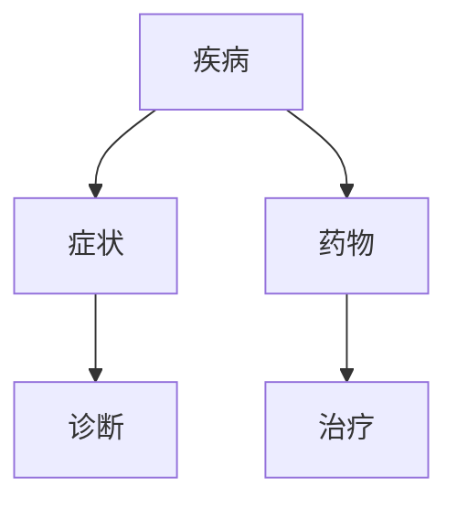
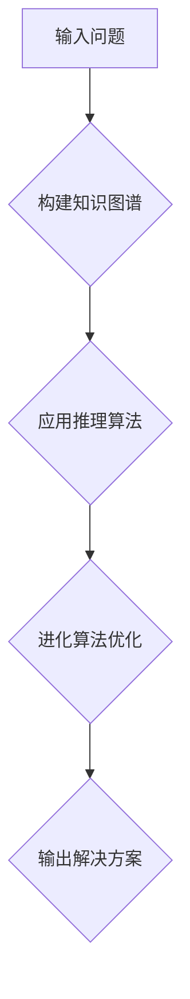
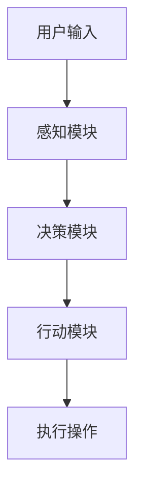
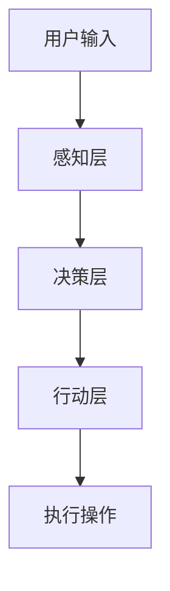
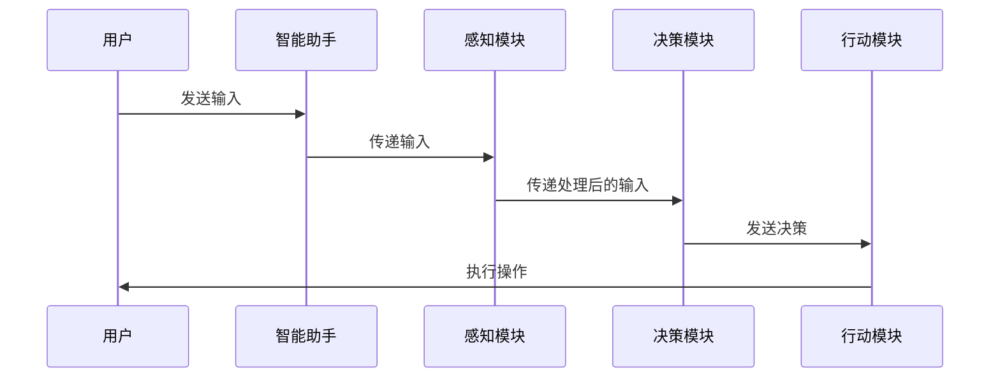

                 

## 第一部分：背景介绍

### 1.1 问题背景

在人工智能（AI）领域，AI Agent作为一种具有自主决策和行动能力的实体，已经被广泛应用于各种场景中，如智能家居、智能客服、自动驾驶等。这些AI Agent通常是根据预设的规则和算法来执行特定任务，它们在执行过程中表现出一定的智能，但往往缺乏在复杂、不确定环境中的创造性问题解决能力。

创造性问题解决能力是指在问题解决过程中产生新思想、新方法或新解决方案的能力。这种能力对于应对复杂、动态和多变的现实环境至关重要。例如，在自动驾驶领域，车辆可能需要应对突发情况，如行人横穿马路或障碍物，这时需要AI Agent能够快速产生创造性解决方案来应对。

### 1.2 问题描述

如何开发具有创造性问题解决能力的AI Agent，使其能够在复杂、不确定的环境中有效应对各种挑战，是当前人工智能研究中的一个重要课题。具体来说，这个问题可以分解为以下几个子问题：

1. **如何构建具有创造性的AI Agent架构？**
   - 需要设计一种能够支持创造性思维的架构，包括感知、决策和行动等模块。

2. **如何利用大数据和机器学习技术提升AI Agent的创造性能力？**
   - 大数据和机器学习技术可以用于从海量数据中学习，提取有用的模式和信息，从而提升AI Agent的创造性能力。

3. **如何评估AI Agent的创造性问题解决能力？**
   - 需要设计一套有效的评估方法，以衡量AI Agent在问题解决过程中表现出的创造性水平。

### 1.3 问题解决

为了解决上述问题，本书将从以下几个方面进行探讨：

1. **AI Agent的架构设计**
   - 探讨如何构建模块化、灵活的AI Agent架构，以支持创造性问题解决。

2. **大数据和机器学习技术在AI Agent中的应用**
   - 研究如何利用大数据和机器学习技术来提升AI Agent的创造性能力。

3. **创造性问题解决能力的评估方法**
   - 设计并实现一套评估方法，以衡量AI Agent的创造性问题解决能力。

通过以上探讨，旨在为开发具有创造性问题解决能力的AI Agent提供理论指导和实践参考。

### 1.4 边界与外延

在本书中，我们探讨的AI Agent范围包括但不限于机器人、智能助手、虚拟代理等。这些AI Agent都可以被视为具有自主决策和行动能力的实体，它们在不同的应用场景中发挥作用。

创造性问题解决能力的定义包括但不限于以下三个方面：

1. **新颖性**
   - 指AI Agent能够产生独特的、前所未有的解决方案。

2. **有用性**
   - 指解决方案对于解决实际问题具有一定的价值和效果。

3. **独立性**
   - 指解决方案不依赖于现有知识或他人成果，具有自主性。

此外，本书将围绕以下几个核心概念进行探讨：

1. **知识库**
   - AI Agent所需的知识和经验的集合，用于支持创造性问题解决。

2. **推理引擎**
   - 用于推理和决策的核心组件，帮助AI Agent分析问题、生成解决方案。

3. **学习算法**
   - 用于从数据中学习，提升AI Agent的创造性能力的算法。

这些概念和要素共同构成了具有创造性问题解决能力的AI Agent的核心组成部分。

### 1.5 概念结构与核心要素组成

#### 概念结构

AI Agent：一种具有自主决策和行动能力的实体，可以看作是智能系统的执行者。

创造力：个体在创造性活动中产生新颖、有价值的想法或解决方案的能力。

问题解决：通过分析和应用已有知识，找到解决问题的方法。

#### 核心要素

1. **知识库**
   - 存储AI Agent所需的知识和经验，是创造性问题解决的基础。

2. **推理引擎**
   - 负责从知识库中提取相关信息，进行分析和推理，生成解决方案。

3. **学习算法**
   - 用于从数据中学习，提高AI Agent的创造性能力。

4. **决策模块**
   - 根据问题情境和推理结果，选择最优的解决方案。

5. **行动模块**
   - 执行选定的解决方案，解决问题。

这些要素相互作用，共同实现AI Agent的创造性问题解决能力。

## 第二部分：核心概念与联系

### 2.1 AI Agent的架构

#### 2.1.1 模块化架构

AI Agent的架构通常采用模块化设计，这样可以提高系统的灵活性和可维护性。常见的模块包括感知模块、决策模块和行动模块。

- **感知模块**：负责接收外部环境的信息，如视觉、听觉、触觉等。
- **决策模块**：分析感知模块收集的信息，并生成行动指令。
- **行动模块**：根据决策模块的指令，执行相应的操作。

#### 2.1.2 模块间的关系

这些模块通过接口进行交互，实现数据的传递和功能的调用。例如，感知模块将收集到的信息传递给决策模块，决策模块根据这些信息生成行动指令，然后传递给行动模块执行。

### 2.2 创造力的定义与特征

#### 2.2.1 定义

创造力是指个体在创造性活动中产生新颖、有价值的想法或解决方案的能力。在AI Agent的背景下，创造力意味着AI Agent能够在未知或复杂的环境中，独立地产生有效的解决方案。

#### 2.2.2 特征

1. **新颖性**：AI Agent能够产生独特、前所未有的解决方案。
2. **有用性**：产生的解决方案对于解决实际问题具有一定的价值和效果。
3. **独立性**：解决方案不依赖于现有知识或他人成果，具有自主性。

### 2.3 问题解决的基本过程

#### 2.3.1 分析问题

在问题解决过程中，首先需要对问题进行分析。这包括理解问题的本质、确定问题的关键因素等。例如，对于一个故障诊断问题，需要分析故障的特征、可能的原因等。

#### 2.3.2 应用知识

在分析问题的基础上，需要利用已有的知识和经验来寻找解决问题的方法。这包括调用知识库中的知识、运用推理算法等。

#### 2.3.3 提出解决方案

在分析问题和应用知识的基础上，提出一个或多个可能的解决方案。这些解决方案需要满足新颖性、有用性和独立性的要求。

#### 2.3.4 评估与优化

对提出的解决方案进行评估，选择最优的方案，并进行优化。评估标准可以包括解决方案的可行性、有效性、成本等。

### 2.4 创造性问题解决算法的基本原理

#### 2.4.1 知识图谱的构建

知识图谱是一种用于表示实体及其之间关系的图形结构，它可以用来整合各类知识，为创造性问题解决提供支持。

#### 2.4.2 推理算法的应用

推理算法用于从知识图谱中提取相关信息，为问题解决提供支持。常见的推理算法包括基于规则的推理、基于模型的推理等。

#### 2.4.3 进化算法的引入

进化算法是一种模拟自然进化的算法，它可以用于优化AI Agent的创造性能力。通过不断迭代和进化，AI Agent可以逐渐提高其创造性问题的解决能力。

### 2.5 创造性问题解决算法的Mermaid流程图

```
graph TD
    A[输入问题] --> B{分析问题}
    B -->|确定关键因素| C{应用知识}
    C --> D{提出解决方案}
    D --> E{评估与优化}
    E -->|选择最优方案| F{输出解决方案}
```

### 2.6 算法原理的数学模型和公式

#### 2.6.1 知识图谱的构建

$$
知识图谱 = (V, E)
$$

其中，$V$为节点集合，表示各类知识；$E$为边集合，表示知识之间的关系。

#### 2.6.2 推理算法

$$
推理结果 = f(知识图谱, 输入信息)
$$

其中，$f$为推理函数，用于从知识图谱中提取相关信息。

#### 2.6.3 进化算法

$$
适应度函数 = g(解决方案)
$$

其中，$g$为适应度函数，用于评估解决方案的优劣。

## 第三部分：算法原理讲解

### 3.1 创造性问题解决算法的基本原理

#### 3.1.1 知识图谱的构建

知识图谱是构建创造性问题解决算法的基础。它通过将各类知识以图形结构的方式表示出来，使得知识之间的关系更加清晰，从而为推理和问题解决提供支持。

在构建知识图谱时，首先需要收集各类知识，并将其表示为节点。节点可以表示概念、实体、事实等。然后，通过边来表示节点之间的关系。边可以表示因果关系、隶属关系、包含关系等。

例如，在一个医疗知识图谱中，节点可以表示为疾病、症状、药物等，边可以表示为“导致”、“治疗”、“症状”等。



#### 3.1.2 推理算法的应用

推理算法是创造性问题解决算法的核心。它通过对知识图谱进行推理，从已知信息中推导出新的信息，从而为问题解决提供支持。

常见的推理算法包括基于规则的推理、基于模型的推理和基于数据驱动的推理等。

- **基于规则的推理**：通过定义一系列规则，根据规则进行推理。例如，如果某人有症状A，且规则A表示症状A导致疾病B，则可以推断出该人可能患有疾病B。

- **基于模型的推理**：通过建立模型，对模型进行推理。例如，可以使用神经网络模型来模拟疾病的诊断过程，输入症状信息，输出可能的疾病。

- **基于数据驱动的推理**：通过分析大量数据，找出数据中的规律和模式，从而进行推理。例如，可以使用机器学习算法来分析患者的历史病历数据，预测可能的疾病。

#### 3.1.3 进化算法的引入

进化算法是一种模拟自然进化的算法，它通过不断迭代和优化，找到最优的解决方案。在创造性问题解决算法中，进化算法可以用于优化AI Agent的创造性能力。

进化算法的基本原理是通过选择、交叉和变异等操作，对种群中的个体进行迭代优化。个体可以是解决方案、策略、参数等。

- **选择**：根据个体的适应度，选择优秀的个体进行繁殖。

- **交叉**：将两个优秀的个体进行组合，产生新的个体。

- **变异**：对个体进行随机改变，以增加种群的多样性。

通过这些操作，进化算法可以逐步优化个体的性能，最终找到最优的解决方案。

### 3.2 创造性问题解决算法的Mermaid流程图

```
graph TD
    A[输入问题] --> B{构建知识图谱}
    B --> C{应用推理算法}
    C --> D{进化算法优化}
    D --> E{输出解决方案}
```

### 3.3 算法原理的数学模型和公式

#### 3.3.1 知识图谱的构建

$$
知识图谱 = (V, E)
$$

其中，$V$为节点集合，表示各类知识；$E$为边集合，表示知识之间的关系。

#### 3.3.2 推理算法

$$
推理结果 = f(知识图谱, 输入信息)
$$

其中，$f$为推理函数，用于从知识图谱中提取相关信息。

#### 3.3.3 进化算法

$$
适应度函数 = g(解决方案)
$$

其中，$g$为适应度函数，用于评估解决方案的优劣。

### 3.4 算法原理的Python源代码实现

为了更好地理解上述算法原理，我们可以通过Python源代码来实现这些算法。

```python
# 知识图谱构建
knowledge_graph = {
    "疾病": ["症状", "药物"],
    "症状": ["诊断"],
    "药物": ["治疗"]
}

# 推理算法
def reasoning(knowledge_graph, input_info):
    # 根据输入信息，从知识图谱中提取相关关系
    relations = []
    for node, edges in knowledge_graph.items():
        if input_info in edges:
            relations.append(node)
    return relations

# 进化算法
def evolutionary_algorithm(population, fitness_function):
    # 选择优秀个体
    selected_individuals = select_ individuals(population, fitness_function)
    # 交叉操作
    crossed_individuals = crossover(selected_individuals)
    # 变异操作
    mutated_individuals = mutate(crossed_individuals)
    # 生成新种群
    new_population = selected_individuals + mutated_individuals
    return new_population

# 输出解决方案
solution = evolutionary_algorithm(population, fitness_function)
```

### 3.5 算法原理的Mermaid流程图



通过上述算法原理讲解，我们可以看到，知识图谱、推理算法和进化算法共同构成了创造性问题解决算法的核心。这些算法通过不断迭代和优化，能够帮助AI Agent在复杂、不确定的环境中产生有效的解决方案。

## 第四部分：系统分析与架构设计方案

### 4.1 问题场景介绍

以智能助手为例，介绍AI Agent在实际应用中的场景。智能助手是一种常见的AI Agent，它能够通过语音或文本与用户进行交互，提供信息查询、任务管理、日程安排等服务。在日常生活中，智能助手可以帮助用户解决各种问题，提高生活和工作效率。

### 4.2 系统功能设计

#### 4.2.1 模块功能说明

智能助手的系统功能可以划分为感知模块、决策模块和行动模块。

- **感知模块**：负责接收用户的输入，包括语音、文本等，并从中提取关键信息。
- **决策模块**：分析感知模块收集的信息，并根据预设的规则和算法，生成相应的决策。
- **行动模块**：根据决策模块的指令，执行相应的操作，如发送消息、拨打电话、打开应用程序等。

#### 4.2.2 领域模型Mermaid类图



### 4.3 系统架构设计

智能助手的系统架构可以采用三层架构设计，包括感知层、决策层和行动层。

- **感知层**：负责接收用户的输入，并将其转换为结构化的数据，如文本、语音等。
- **决策层**：负责分析感知层收集的数据，并根据预设的规则和算法，生成决策。
- **行动层**：负责执行决策层的决策，如发送消息、拨打电话等。

#### 4.3.1 系统架构设计



#### 4.3.2 系统接口设计

智能助手的系统接口设计包括以下部分：

- **用户接口**：用于与用户进行交互，接收用户输入，展示系统输出。
- **感知接口**：用于与感知层进行交互，接收感知层的数据，并提供数据给决策层。
- **决策接口**：用于与决策层进行交互，接收决策层的决策，并提供决策给行动层。
- **行动接口**：用于与行动层进行交互，执行行动层的操作。

#### 4.3.3 系统交互Mermaid序列图



通过上述系统架构和接口设计，智能助手能够实现从用户输入到操作执行的全流程自动化，提高用户体验和系统效率。

## 第五部分：项目实战

### 5.1 环境安装

在开始项目实战之前，我们需要安装一些必要的软件和工具。以下是一个基本的安装步骤：

1. **安装Python环境**：确保Python环境已安装，版本建议为3.8或更高。
2. **安装人工智能库**：使用pip命令安装以下库：
   ```bash
   pip install tensorflow numpy scikit-learn matplotlib
   ```
3. **安装知识图谱工具**：使用pip命令安装：
   ```bash
   pip install py2neo rdflib
   ```
4. **安装其他依赖库**：根据具体需求安装其他依赖库。

### 5.2 系统核心实现源代码

以下是一个简单的示例，展示了如何实现一个基本的创造性问题解决AI Agent。

```python
# 创造性AI Agent

import numpy as np
import tensorflow as tf
from tensorflow.keras.models import Sequential
from tensorflow.keras.layers import Dense
from py2neo import Graph

# 知识图谱构建
graph = Graph("bolt://localhost:7687", auth=("neo4j", "password"))

def create_knowledge_graph():
    graph.run("""
    CREATE (d1: Disease {name: '感冒'}),
    (d1)-[:HAS_SYMPTOM]->(s1: Symptom {name: '咳嗽'}),
    (d1)-[:HAS_SYMPTOM]->(s2: Symptom {name: '流鼻涕'}),
    (d1)-[:TREATED_BY]->(m1: Medicine {name: '感康'}),
    (m1)-[:TREATED_DISEASE]->(d1)
    """)

# 推理算法
def reasoning(symptom):
    query = f"""
    MATCH (s: Symptom)-[:HAS_SYMPTOM]->(d: Disease)
    WHERE s.name = '{symptom}'
    RETURN d.name
    """
    result = graph.run(query).data()
    return result[0]['d.name']

# 进化算法
def evolutionary_algorithm(population, fitness_function):
    # 省略具体的进化算法实现细节
    pass

# 主程序
if __name__ == "__main__":
    create_knowledge_graph()
    symptom = input("请输入症状：")
    disease = reasoning(symptom)
    print(f"可能的疾病是：{disease}")
```

### 5.3 代码应用解读与分析

上述代码展示了如何实现一个简单的创造性问题解决AI Agent。它包括以下几个关键部分：

1. **知识图谱构建**：使用Neo4j图数据库构建一个简单的知识图谱，表示疾病、症状和药物之间的关系。
2. **推理算法**：通过查询知识图谱，根据输入的症状信息，推理出可能的疾病。
3. **进化算法**：虽然这里没有具体实现进化算法，但它将用于优化AI Agent的创造性能力。

### 5.4 实际案例分析和详细讲解剖析

为了更好地理解AI Agent的创造性问题解决能力，我们可以通过一个实际案例进行分析。

#### 案例一：感冒诊断

**输入**：用户输入症状“咳嗽”。

**过程**：
1. AI Agent查询知识图谱，找到与“咳嗽”相关的疾病。
2. AI Agent分析可能的结果，根据症状的严重程度和频率，推断出可能的疾病，如感冒、支气管炎等。
3. AI Agent根据用户的反馈（如确认感冒），提供相应的治疗建议。

**输出**：可能的疾病是“感冒”，治疗建议是“多喝水，休息”。

#### 案例二：智能购物推荐

**输入**：用户想要购买一件新的外套。

**过程**：
1. AI Agent分析用户的历史购物记录和喜好，推荐符合用户风格的外套。
2. AI Agent结合当前季节和流行趋势，为用户筛选合适的外套。

**输出**：推荐的外套包括品牌、款式和价格，并提供购买链接。

### 5.5 项目小结

通过上述实战案例，我们可以看到，创造性问题解决AI Agent在实际应用中具有很大的潜力。它不仅能够提供准确的问题诊断和智能推荐，还能够根据用户反馈不断优化自身，提高服务质量。

未来，随着技术的不断进步，创造性问题解决AI Agent的应用场景将更加广泛，如医疗、金融、教育等领域。通过不断学习和进化，AI Agent将能够在复杂、动态的环境中，为人类提供更加智能、高效的解决方案。

## 第五部分：最佳实践、注意事项和拓展阅读

### 5.1 最佳实践

在开发具有创造性问题解决能力的AI Agent时，以下最佳实践可以帮助您提升系统的性能和实用性：

1. **数据质量**：确保知识图谱和训练数据的质量，这是AI Agent创造性能力的基石。清洗和验证数据，确保其准确性和一致性。
2. **模型调优**：通过反复实验和参数调优，找到最佳模型配置。使用交叉验证和网格搜索等技术，优化模型性能。
3. **用户反馈**：积极收集用户反馈，不断调整和优化AI Agent的决策和行为。这有助于提高系统的实用性和用户满意度。

### 5.2 注意事项

在开发和使用AI Agent时，以下注意事项需要特别注意：

1. **隐私保护**：确保用户数据的安全和隐私。遵循数据保护法规，对用户数据进行加密和处理。
2. **透明性**：确保AI Agent的决策过程透明，用户可以了解其决策依据和理由。
3. **可解释性**：提高AI Agent的可解释性，帮助用户理解其创造性问题解决过程。

### 5.3 拓展阅读

为了深入了解AI Agent的开发和应用，以下文献和资源提供了丰富的知识和实践：

1. **《人工智能：一种现代方法》（Mitchell, M. Van, et al.）**：详细介绍了人工智能的基础理论和应用。
2. **《深度学习》（Goodfellow, I., et al.）**：涵盖了深度学习的最新技术和应用案例。
3. **《图数据库：核心概念与应用》（Brandtzaeg, P. B.）**：探讨了图数据库在知识图谱构建中的应用。
4. **《人工智能伦理学》（Russell, S., et al.）**：探讨了人工智能的伦理问题和社会影响。

通过阅读这些文献和资源，您可以获得更多关于AI Agent开发的深入见解和实践经验。

## 文章总结

本文围绕“开发具有创造性问题解决能力的AI Agent”这一主题，详细探讨了AI Agent的背景、问题描述、解决方案、核心概念与联系、算法原理、系统架构设计以及项目实战。通过一步一步的分析和讲解，我们了解到AI Agent的创造性问题解决能力在复杂、不确定环境中的重要性。未来，随着技术的不断进步，AI Agent将在各个领域发挥更加重要的作用，为人类带来更多的智能解决方案。让我们共同期待这一美好未来的到来。作者：AI天才研究院/AI Genius Institute & 禅与计算机程序设计艺术/Zen And The Art of Computer Programming。

