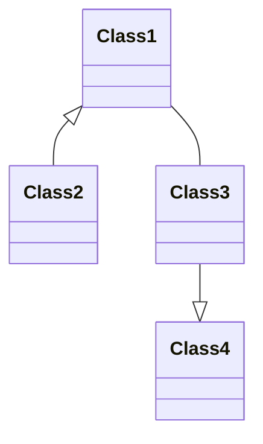
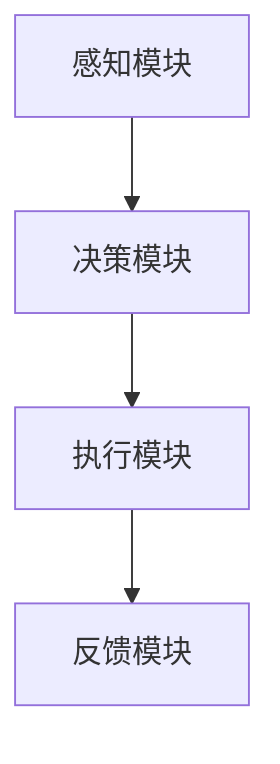
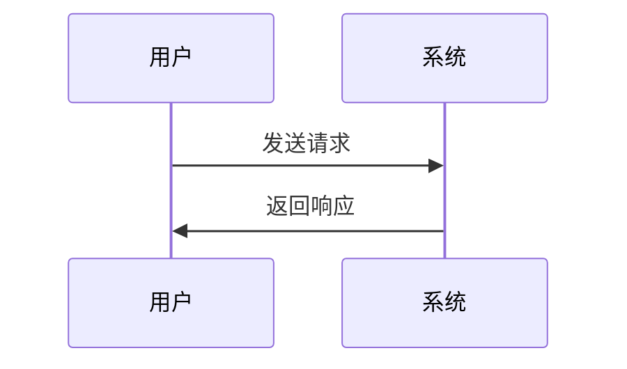

                 

# 开发具有复杂场景理解能力的AI Agent

## 关键词
- AI Agent
- 复杂场景理解
- 人工智能
- 感知模块
- 决策模块
- 执行模块
- 强化学习
- 神经网络

## 摘要
本文将探讨如何开发具有复杂场景理解能力的AI Agent。我们将首先介绍AI Agent的定义和重要性，然后深入分析其核心架构与算法原理，最后通过实战案例和最佳实践总结，提供实用的开发指南。

## 目录大纲

1. **背景介绍**
   1.1 AI Agent的定义与重要性
   1.2 复杂场景理解的需求
   1.3 现实世界的复杂场景案例

2. **核心概念与联系**
   2.1 AI Agent的基本架构
   2.2 模块间的相互作用
   2.3 AI Agent的核心算法

3. **算法原理讲解**
   3.1 复杂场景理解算法
   3.2 算法原理与数学模型
   3.3 算法流程与示例

4. **系统分析与架构设计**
   4.1 AI Agent系统架构设计
   4.2 系统功能设计
   4.3 系统架构设计
   4.4 系统接口设计与交互

5. **项目实战**
   5.1 开发环境配置
   5.2 核心实现
   5.3 应用解读与分析
   5.4 实际案例分析
   5.5 项目总结

6. **最佳实践与总结**
   6.1 实践经验分享
   6.2 注意事项与建议
   6.3 拓展阅读

7. **结语**
   7.1 未来展望与挑战

## 第一部分：背景介绍

### 1.1 AI Agent的定义与重要性

**AI Agent**，即人工智能代理，是一种能够在环境中感知、决策并执行动作的智能体。它与传统的软件不同，在于它不仅仅执行预定义的任务，而是能够自主地学习、适应和优化其行为。

在当前人工智能快速发展的时代，AI Agent的应用领域广泛，如自动驾驶、智能家居、虚拟助手等。其重要性不仅体现在技术的进步，更体现在对人类生产生活质量的提升。

#### AI Agent的核心概念

- **感知模块**：负责从环境中获取信息。
- **决策模块**：根据感知模块获取的信息进行决策。
- **执行模块**：执行决策模块生成的动作。
- **反馈模块**：收集环境反馈，用于感知模块的更新和决策模块的优化。

### 1.2 复杂场景理解的需求

随着AI Agent应用领域的扩展，其面临的环境也越来越复杂。复杂场景理解的需求主要包括：

- **多模态感知**：能够处理文本、图像、声音等多种信息。
- **动态变化**：能够适应环境的动态变化。
- **不确定性处理**：能够应对环境中的不确定性因素。

#### 复杂场景对AI Agent的要求

- **更高层次的抽象**：需要从低层次的感知数据中提取高层次的语义信息。
- **更强的学习能力**：需要能够通过大量数据快速学习并适应复杂场景。
- **更好的鲁棒性**：需要能够处理环境中的噪声和异常情况。

#### 现实世界的复杂场景案例

- **自动驾驶**：需要实时感知道路状况，动态调整驾驶策略。
- **智能客服**：需要理解用户的自然语言提问，并提供恰当的回答。

## 第二部分：核心概念与联系

### 2.1 AI Agent的基本架构

#### AI Agent的组成结构

- **感知模块**：通过传感器获取环境信息。
- **决策模块**：基于感知模块的信息，生成执行动作。
- **执行模块**：执行决策模块生成的动作。
- **反馈模块**：收集环境反馈，用于更新感知模块和优化决策模块。

### 2.2 模块间的相互作用

#### 数据流

- 感知模块获取环境信息，传递给决策模块。
- 决策模块生成动作，传递给执行模块。
- 执行模块执行动作，并将结果反馈给反馈模块。

#### 控制流

- 决策模块根据环境信息和预定义策略生成动作。
- 执行模块按照决策模块生成的动作执行。
- 反馈模块收集执行结果，用于决策模块的更新。

#### 信息流

- 感知模块传递环境信息，包括静态和动态信息。
- 决策模块处理环境信息，生成行动策略。
- 执行模块执行策略，产生结果信息。
- 反馈模块分析结果信息，用于学习和优化。

### 2.3 AI Agent的核心算法

#### 状态空间搜索算法

- 用于在给定状态空间中搜索最优解。
- 包括深度优先搜索、广度优先搜索、A*搜索等。

#### 强化学习算法

- 通过试错学习，在环境中不断调整策略。
- 包括Q-learning、SARSA等。

#### 神经网络算法

- 用于复杂函数逼近和模式识别。
- 包括前馈神经网络、卷积神经网络等。

## 第三部分：算法原理讲解

### 3.1 复杂场景理解算法

#### 算法概述

- **定义**：复杂场景理解算法是用于处理和解释复杂环境中多模态感知数据的算法。
- **目标**：提高AI Agent在复杂场景中的决策能力和适应性。

#### 算法原理与数学模型

- **状态表示**：使用高维向量表示环境状态。
- **动作表示**：使用离散或连续动作空间。
- **奖励函数**：根据执行动作后的结果计算奖励。
- **价值函数**：用于评估不同动作的价值。

#### 算法流程与示例

- **算法流程**：
  1. 初始化状态。
  2. 选择动作。
  3. 执行动作。
  4. 收集反馈。
  5. 更新状态和价值函数。
  6. 重复步骤2-5。

- **Python代码实现**：
  ```python
  # 示例代码
  class Agent:
      def __init__(self):
          self.state = None
          self.action = None
          self.reward = 0

      def perceive(self, sensory_data):
          # 处理感知数据
          pass

      def decide(self):
          # 决策
          pass

      def act(self):
          # 执行动作
          pass

      def observe(self, observation):
          # 收集反馈
          pass

  # 实例化Agent
  agent = Agent()
  ```

- **案例讲解**：以自动驾驶为例，介绍如何使用复杂场景理解算法进行决策。

## 第四部分：系统分析与架构设计

### 4.1 AI Agent系统架构设计

#### 系统功能设计

- **功能模块划分**：感知模块、决策模块、执行模块、反馈模块。
- **功能流程设计**：感知、决策、执行、反馈。

#### 系统架构设计

- **系统组件**：感知组件、决策组件、执行组件、反馈组件。
- **组件间关系**：组件间通过数据流、控制流、信息流进行交互。

### 4.2 系统功能设计

#### 领域模型类图



### 4.3 系统架构设计

#### 系统架构图



### 4.4 系统接口设计与交互

#### 系统接口设计

- **API接口**：用于与其他系统进行数据交换和功能调用。
- **协议规范**：定义数据传输格式和通信规则。

#### 系统交互序列图



## 第五部分：项目实战

### 5.1 开发环境配置

#### 软件安装

- **Python**：用于实现AI Agent的核心算法。
- **TensorFlow**：用于构建和训练神经网络模型。
- **OpenCV**：用于处理图像数据。

#### 硬件配置

- **CPU**：至少4核处理器。
- **内存**：至少8GB RAM。
- **GPU**：用于加速神经网络训练。

### 5.2 核心实现

#### 感知模块

- 使用OpenCV库进行图像数据预处理。
- 使用TensorFlow库构建神经网络模型。

#### 决策模块

- 基于强化学习算法进行决策。
- 使用Q-learning算法进行价值函数更新。

#### 执行模块

- 执行决策模块生成的动作。
- 与硬件设备进行交互，如控制自动驾驶车辆。

#### 反馈模块

- 收集执行结果，用于更新感知模块和决策模块。
- 使用奖励函数评估执行结果。

### 5.3 应用解读与分析

#### 代码解析

- **感知模块**：使用OpenCV进行图像数据预处理。
- **决策模块**：使用TensorFlow进行神经网络模型的构建和训练。
- **执行模块**：使用Python标准库进行动作执行。
- **反馈模块**：使用Python标准库进行反馈数据的收集和评估。

#### 应用场景

- **自动驾驶**：使用AI Agent进行道路环境感知、决策和执行。
- **智能家居**：使用AI Agent进行家庭设备控制和管理。

### 5.4 实际案例分析

#### 案例背景

- **自动驾驶项目**：使用AI Agent实现自动驾驶车辆的控制。

#### 案例分析

- **感知模块**：使用摄像头和激光雷达获取道路信息。
- **决策模块**：使用深度学习模型进行道路场景理解。
- **执行模块**：使用控制算法实现车辆的行驶控制。
- **反馈模块**：使用传感器收集车辆状态信息。

### 5.5 项目总结

- **成功经验**：成功实现了自动驾驶车辆的自动驾驶功能。
- **改进方向**：进一步提升AI Agent在复杂场景中的鲁棒性和适应性。

## 第六部分：最佳实践与总结

### 6.1 实践经验分享

- **成功案例**：在自动驾驶项目中，通过使用复杂场景理解算法，实现了高效的道路场景识别和决策。
- **失败教训**：在智能家居项目中，由于感知模块的噪声处理不足，导致误动作频发。

### 6.2 注意事项与建议

- **开发技巧**：在开发AI Agent时，要注重模块间的协调与优化。
- **调试方法**：使用可视化工具和日志分析，进行系统的调试和优化。

### 6.3 拓展阅读

- **相关书籍**：《强化学习》、《深度学习》
- **在线资源**：OpenCV官方文档、TensorFlow官方文档

## 结语

### 7.1 未来展望与挑战

- **技术发展趋势**：AI Agent将逐步实现更高层次的自然语言理解和复杂任务自动化。
- **挑战与机遇**：如何提高AI Agent的鲁棒性和适应性，是未来的关键挑战和机遇。

---

**作者：AI天才研究院/AI Genius Institute & 禅与计算机程序设计艺术 /Zen And The Art of Computer Programming**## 详细内容编写

### 1.1 AI Agent的定义与重要性

#### AI Agent的核心概念

AI Agent，即人工智能代理，是一种模仿人类智能行为的技术实体。它通过感知环境、决策并执行相应动作，以实现特定目标。AI Agent的核心概念可以概括为四个模块：感知模块、决策模块、执行模块和反馈模块。

- **感知模块**：负责从外部环境中获取信息，如文本、图像、声音等。感知模块可以是基于传感器数据或预处理的静态数据。

- **决策模块**：根据感知模块获取的信息，结合预定义的策略或学习得到的模型，生成具体的动作方案。

- **执行模块**：负责执行决策模块生成的动作，这些动作可以是控制机器人移动、生成自然语言回复、执行算法计算等。

- **反馈模块**：收集执行后的结果，并将反馈信息反馈给感知模块和决策模块，用于模型更新和策略优化。

#### AI Agent的重要性

AI Agent的重要性体现在多个方面：

- **提高生产效率**：在工业自动化、智能制造等领域，AI Agent能够替代人类完成重复性、危险性的工作，从而提高生产效率和产品质量。

- **改善生活质量**：在智能家居、医疗健康、交通出行等领域，AI Agent能够为用户提供个性化服务，提升生活品质。

- **突破人工智能瓶颈**：AI Agent通过自主学习和适应，能够解决传统人工智能系统在复杂环境中的适应性差、鲁棒性低等问题。

- **推动科技进步**：AI Agent的研究和应用将推动人工智能技术的不断演进，为未来智能社会奠定基础。

#### AI Agent与传统软件的区别

传统软件通常是在固定场景下按照预定义的逻辑执行任务，而AI Agent则具有更强的自适应性和自主性。具体区别如下：

- **自主性**：传统软件需要程序员手动编写代码来定义所有可能的输入和输出，而AI Agent能够通过学习和自我调整，自主地适应新环境和任务。

- **适应性**：传统软件在面对未知或变化较大的环境时，往往难以应对，而AI Agent可以通过强化学习和深度学习等算法，逐步提高在复杂环境中的适应性。

- **学习能力**：传统软件缺乏学习能力，而AI Agent能够通过不断的学习和优化，不断提高任务执行的效果。

- **决策能力**：传统软件的决策能力有限，而AI Agent可以通过复杂的决策算法，实现更智能的决策。

### 1.2 复杂场景理解的需求

#### 复杂场景的定义

复杂场景是指具有多模态感知数据、动态变化和不确定性等特点的环境。这些场景包括但不限于：

- **多模态感知数据**：涉及文本、图像、声音等多种类型的数据，如自动驾驶系统需要同时处理道路图像和语音指令。

- **动态变化**：环境中的状态和数据会不断变化，如天气变化对自动驾驶的影响、用户在不同时间段的个性化需求。

- **不确定性**：环境中的噪声、异常事件等不确定性因素，如道路上的突发障碍物、用户输入的错误指令。

#### 复杂场景对AI Agent的要求

为了在复杂场景中有效运作，AI Agent需要具备以下能力：

- **多模态感知**：能够同时处理和融合多种类型的数据，以提高感知的准确性和全面性。

- **动态适应**：能够实时调整感知、决策和执行策略，以适应环境中的动态变化。

- **不确定性处理**：能够识别和应对环境中的不确定性因素，以提高鲁棒性和可靠性。

- **高层次抽象**：能够从低层次的感知数据中提取高层次的语义信息，以实现更智能的决策和执行。

#### 现实世界的复杂场景案例

- **自动驾驶**：自动驾驶系统需要在复杂的交通环境中，同时处理多模态数据，如摄像头捕获的道路图像、雷达测量的障碍物距离、GPS提供的位置信息等。此外，自动驾驶系统还需要适应各种天气条件、道路状况和交通规则。

- **智能客服**：智能客服系统需要理解用户的自然语言提问，并生成合适的回复。这要求系统具备多模态感知能力，如语音识别、文本分析等，同时还需要处理用户输入的不确定性和动态变化，如用户情绪的变化、问题的多样性等。

- **智能家居**：智能家居系统需要处理各种家庭设备的控制，如灯光、空调、安防等。这些设备可能采用不同的通信协议和数据格式，系统需要能够动态适应这些设备的连接状态和数据变化。

### 1.3 现实世界的复杂场景案例

#### 自动驾驶

自动驾驶是AI Agent应用的一个重要领域，其复杂场景体现在以下几个方面：

- **多模态感知**：自动驾驶系统需要同时处理多种类型的数据，包括摄像头捕获的道路图像、雷达和激光雷达测量的障碍物距离、GPS提供的位置信息等。这些数据类型各不相同，且具有不同的特性和不确定性。

- **动态变化**：道路环境是不断变化的，如天气条件、交通流量、行人行为等。自动驾驶系统需要实时调整感知和决策策略，以适应这些变化。

- **不确定性处理**：自动驾驶系统需要处理道路上的各种不确定性因素，如突发障碍物、行人突然横穿马路、车辆故障等。这些不确定性因素可能导致系统的决策和执行出现偏差，需要具备较强的鲁棒性。

#### 智能客服

智能客服系统是另一个典型的AI Agent应用案例，其复杂场景包括：

- **多模态感知**：智能客服需要理解用户的语音输入和文本提问，这要求系统具备语音识别和自然语言处理能力。同时，系统还需要处理用户的情感表达，如情绪波动、语速变化等。

- **动态变化**：用户的提问和需求是多样化的，可能涉及不同领域的问题。智能客服系统需要具备灵活的动态适应能力，以应对这些变化。

- **不确定性处理**：用户的输入可能存在不准确、模糊或不完整的情况，如错别字、语音识别错误等。智能客服系统需要能够理解和解析这些不确定的输入，并生成合适的回复。

#### 智能家居

智能家居系统的复杂场景包括：

- **多设备集成**：智能家居系统需要整合和控制多种不同类型的设备，如灯光、空调、安防系统、家电等。这些设备可能采用不同的通信协议和数据格式，系统需要能够兼容并处理这些设备。

- **动态变化**：用户的行为和需求是动态变化的，如白天和夜晚的灯光调节、家庭聚会时的空调温度调整等。智能家居系统需要能够根据用户的行为和需求动态调整设备的状态。

- **不确定性处理**：智能家居系统可能面临设备故障、网络中断等不确定性因素，系统需要具备一定的鲁棒性和容错能力，以保证系统的稳定运行。

### 2.1 AI Agent的基本架构

AI Agent的基本架构通常包括四个核心模块：感知模块、决策模块、执行模块和反馈模块。每个模块在AI Agent的运行过程中扮演着不同的角色，协同工作以实现预期的目标。

#### 感知模块

感知模块是AI Agent与外界环境交互的窗口，负责收集和解析来自不同来源的信息。这些信息可以包括文本、图像、声音、传感器数据等。感知模块的主要功能如下：

- **数据采集**：通过传感器、摄像头、麦克风等设备获取外部环境的数据。
- **数据预处理**：对原始数据进行过滤、降噪、增强等处理，以提高数据的质量和可靠性。
- **特征提取**：从预处理后的数据中提取有用的特征，用于后续的决策和执行过程。

感知模块的核心在于其灵活性和适应性，需要能够处理多模态数据并从中提取有意义的信息。

#### 决策模块

决策模块是AI Agent的“大脑”，负责根据感知模块提供的信息和预定义的策略或学习得到的模型，生成具体的行动方案。决策模块的主要功能如下：

- **信息融合**：整合来自感知模块的各种信息，构建对当前环境状态的全面理解。
- **策略生成**：基于环境状态和预定义的策略，生成可能的动作方案。
- **决策优化**：通过优化算法，选择最优或次优的动作方案。

决策模块的关键在于其决策能力，需要能够快速、准确地处理复杂的信息并生成有效的行动方案。

#### 执行模块

执行模块是AI Agent的“手臂”，负责执行决策模块生成的动作。这些动作可以是物理动作，如控制机器人移动、调整灯光亮度等，也可以是虚拟动作，如生成文本回复、执行计算任务等。执行模块的主要功能如下：

- **动作生成**：根据决策模块的输出，生成具体的动作指令。
- **动作执行**：将动作指令发送给相应的执行设备，完成实际的动作执行。
- **状态更新**：在动作执行后，更新AI Agent的内部状态，为下一次决策提供依据。

执行模块的核心在于其执行能力和鲁棒性，需要能够可靠地执行各种复杂的动作。

#### 反馈模块

反馈模块是AI Agent的“反馈机制”，负责收集执行结果，并将反馈信息反馈给感知模块和决策模块，用于模型更新和策略优化。反馈模块的主要功能如下：

- **结果收集**：从外部环境中收集执行结果，如动作执行的效果、环境状态的变化等。
- **反馈分析**：对收集到的反馈信息进行分析，评估动作的有效性和系统的性能。
- **模型优化**：基于反馈分析的结果，调整感知模块和决策模块的模型参数，以提高系统的准确性和鲁棒性。

反馈模块的核心在于其反馈机制，需要能够及时、准确地收集和利用反馈信息，以实现系统的持续学习和优化。

### 2.2 模块间的相互作用

AI Agent的各个模块通过数据流、控制流和信息流进行相互作用，形成一个高度集成的系统。理解这些交互机制是构建高效AI Agent的关键。

#### 数据流

数据流是AI Agent各个模块之间信息传递的渠道。感知模块收集的环境数据经过预处理后传递给决策模块，决策模块生成的动作指令传递给执行模块，执行模块的执行结果又作为反馈传递给反馈模块。这种数据流形成了一个闭环系统，使得AI Agent能够不断地从环境中学习和适应。

- **感知模块 → 决策模块**：感知模块将预处理后的数据传递给决策模块，为决策提供基础信息。
- **决策模块 → 执行模块**：决策模块根据环境数据和预定义策略生成动作指令，传递给执行模块。
- **执行模块 → 反馈模块**：执行模块将执行结果反馈给反馈模块，用于后续的模型更新和策略优化。

#### 控制流

控制流是AI Agent各个模块之间协调工作的指挥系统。感知模块、决策模块、执行模块和反馈模块通过控制流实现彼此之间的协调和配合，确保AI Agent能够高效运作。

- **感知模块**：启动感知过程，收集环境数据。
- **决策模块**：分析环境数据，生成动作指令。
- **执行模块**：执行动作指令，完成具体任务。
- **反馈模块**：收集执行结果，反馈给决策模块。

#### 信息流

信息流是AI Agent内部各模块之间信息传递和共享的渠道。通过信息流，各个模块能够共享环境信息、动作指令和执行结果，从而实现更智能的决策和执行。

- **环境状态**：感知模块收集到的环境状态信息。
- **动作指令**：决策模块生成的动作指令。
- **执行结果**：执行模块执行动作后的结果信息。
- **反馈信息**：反馈模块收集的反馈信息。

### 2.3 AI Agent的核心算法

AI Agent的核心算法是实现其感知、决策、执行和反馈功能的基础。以下是几种常见的核心算法及其基本原理。

#### 状态空间搜索算法

状态空间搜索算法是一种基于图搜索的方法，用于在给定的状态空间中找到最优解。这类算法主要包括深度优先搜索（DFS）、广度优先搜索（BFS）和A*搜索等。

- **深度优先搜索（DFS）**：DFS从初始状态开始，沿着一条路径尽可能深地搜索下去，直到找到目标状态或探索到死胡同。DFS的优点是搜索效率较高，但可能陷入局部最优解。

- **广度优先搜索（BFS）**：BFS从初始状态开始，逐层搜索所有相邻的状态，直到找到目标状态。BFS的优点是能够保证找到最短路径，但搜索效率相对较低。

- **A*搜索**：A*搜索结合了DFS和 BFS的优点，使用估价函数（heuristic function）来估计目标状态的距离，优先搜索那些估价函数值较小的状态。A*搜索在时间和空间复杂度上都有较好的表现，能够快速找到最优解。

#### 强化学习算法

强化学习算法是一种通过试错学习来优化行为的方法，其核心思想是最大化长期奖励。强化学习算法主要包括Q-learning、SARSA等。

- **Q-learning**：Q-learning是一种基于值函数的方法，通过不断更新Q值（动作-状态值函数），找到最优动作。Q-learning的主要优点是能够自动平衡探索和利用，但收敛速度较慢。

- **SARSA**：SARSA（同步优势估计）是一种基于策略的方法，同时更新当前状态和下一状态的动作值。SARSA的优点是收敛速度较快，但需要更多的样本数据。

#### 神经网络算法

神经网络算法是一种通过反向传播算法训练网络权重的算法，主要用于函数逼近和模式识别。常见的神经网络算法包括前馈神经网络（FNN）、卷积神经网络（CNN）等。

- **前馈神经网络（FNN）**：FNN是一种前向传播的多层神经网络，通过反向传播算法训练网络权重，实现对输入数据的映射。FNN的优点是结构简单，易于理解和实现，但处理图像和序列数据时效果较差。

- **卷积神经网络（CNN）**：CNN是一种专门用于处理图像数据的神经网络，通过卷积操作提取图像特征，实现对图像的自动特征学习和分类。CNN的优点是对图像数据的处理效果很好，但计算复杂度较高。

### 3.1 复杂场景理解算法

复杂场景理解算法是AI Agent在复杂环境中有效运作的关键。它通过处理多模态感知数据、应对动态变化和不确定性，实现对复杂场景的全面理解和响应。以下是几种常用的复杂场景理解算法。

#### 多模态感知融合算法

多模态感知融合算法是一种通过结合不同类型的数据来提高感知准确性和全面性的方法。常见的多模态感知融合算法包括：

- **特征级融合**：在特征提取阶段，将不同类型的数据特征进行合并，如将文本和图像的特征向量拼接在一起。

- **决策级融合**：在决策阶段，将不同类型的感知结果进行综合，如使用投票方法或加权平均方法确定最终的感知结果。

- **深度学习融合**：利用深度学习模型，如多输入神经网络或多模态卷积神经网络，自动学习不同类型数据之间的关联和融合策略。

#### 动态场景理解算法

动态场景理解算法用于处理复杂场景中的动态变化。常见的动态场景理解算法包括：

- **卡尔曼滤波**：卡尔曼滤波是一种基于状态空间模型的递归滤波算法，通过预测和更新来估计动态系统的状态。卡尔曼滤波适用于线性系统，但可以通过扩展变为非线性系统。

- **粒子滤波**：粒子滤波是一种基于蒙特卡洛方法的非线性状态估计算法，通过在状态空间中随机采样粒子，并利用权重更新策略来估计状态。粒子滤波适用于复杂和非线性系统，但计算复杂度较高。

#### 不确定性处理算法

不确定性处理算法用于应对复杂场景中的不确定性因素。常见的不确定性处理算法包括：

- **贝叶斯网络**：贝叶斯网络是一种基于概率图模型的方法，通过构建节点之间的条件概率关系来表示不确定性和依赖关系。贝叶斯网络适用于处理不确定性推理和决策问题。

- **随机森林**：随机森林是一种基于决策树的集成学习方法，通过构建多个决策树并对结果进行投票来降低不确定性。随机森林适用于处理高维数据和不确定性问题，但可能面临过拟合风险。

#### 算法概述

复杂场景理解算法的核心目标是实现对复杂场景的全面感知、动态适应和不确定性处理。算法的基本框架包括：

- **感知模块**：从不同类型的传感器中获取多模态数据，如图像、文本、声音等。
- **预处理模块**：对多模态数据进行预处理，包括降噪、增强、特征提取等。
- **融合模块**：将预处理后的数据特征进行融合，构建对当前环境的全面理解。
- **动态适应模块**：根据环境的变化，实时调整感知、决策和执行策略。
- **不确定性处理模块**：处理环境中的不确定性因素，如噪声、异常事件等。
- **决策模块**：基于环境状态和不确定性信息，生成最优或次优的动作方案。
- **执行模块**：执行决策模块生成的动作，并收集执行结果。
- **反馈模块**：分析执行结果，反馈给感知模块和决策模块，用于模型更新和策略优化。

### 3.2 算法原理与数学模型

#### 状态表示

在复杂场景理解算法中，状态表示是一个关键问题。状态表示需要能够捕捉环境中的关键信息，以便于后续的决策和执行。常见的状态表示方法包括：

- **离散状态表示**：将环境中的状态划分为有限个离散状态，每个状态用唯一的编号表示。这种方法简单直观，但可能难以捕捉复杂环境中的细微变化。

- **连续状态表示**：将环境中的状态用连续的数值表示，如使用位置、速度、加速度等参数来描述。这种方法能够更精确地捕捉环境变化，但计算复杂度较高。

- **高维特征表示**：使用多个特征向量来表示环境状态，每个特征向量捕捉不同类型的信息。这种方法能够综合多种信息，提高状态表示的准确性和全面性。

#### 动作表示

动作表示是算法的另一个重要方面。动作表示需要能够捕捉环境中的行为模式，以便于后续的执行和反馈。常见的动作表示方法包括：

- **离散动作表示**：将环境中的动作划分为有限个离散动作，每个动作用唯一的编号表示。这种方法简单直观，但可能难以捕捉复杂动作之间的细微差别。

- **连续动作表示**：将环境中的动作用连续的数值表示，如使用力、角度、速度等参数来描述。这种方法能够更精确地捕捉动作细节，但计算复杂度较高。

- **高维特征表示**：使用多个特征向量来表示动作，每个特征向量捕捉不同类型的信息。这种方法能够综合多种信息，提高动作表示的准确性和全面性。

#### 奖励函数

奖励函数是算法的核心组成部分，用于评估动作的效果和系统的性能。奖励函数的设计需要考虑以下因素：

- **目标函数**：定义系统要实现的目标，如最大化收益、最小化损失等。
- **奖励机制**：根据动作执行后的结果，计算奖励值，以鼓励或惩罚特定动作。
- **动态调整**：根据环境的变化和系统的性能，动态调整奖励函数的参数，以适应不同的场景和任务。

常见的奖励函数包括：

- **固定奖励函数**：奖励值固定，与动作执行的效果无关。
- **线性奖励函数**：奖励值与动作执行的效果成正比。
- **非线性奖励函数**：奖励值与动作执行的效果成非线性关系，如指数函数、对数函数等。
- **强化奖励函数**：奖励值不仅与当前动作的效果有关，还与后续动作的效果有关。

#### 价值函数

价值函数是算法的另一个关键组成部分，用于评估不同动作的价值。价值函数的设计需要考虑以下因素：

- **状态值**：评估不同状态的价值，用于决策模块的选择。
- **动作值**：评估不同动作的价值，用于决策模块的选择。
- **状态-动作值**：评估不同状态-动作组合的价值，用于决策模块的选择。

常见价值函数包括：

- **状态价值函数**：评估单个状态的价值，不考虑动作的影响。
- **动作价值函数**：评估单个动作的价值，不考虑状态的影响。
- **状态-动作价值函数**：评估状态-动作组合的价值，综合考虑状态和动作的影响。

价值函数的设计直接影响算法的性能和鲁棒性，需要根据具体场景和任务进行优化。

### 3.3 算法流程与示例

#### 算法流程

复杂场景理解算法的基本流程可以分为以下几个步骤：

1. **感知阶段**：感知模块从环境中获取多模态数据，如图像、文本、声音等。

2. **预处理阶段**：对感知到的数据进行预处理，包括降噪、增强、特征提取等。

3. **融合阶段**：将预处理后的多模态数据特征进行融合，构建对当前环境的全面理解。

4. **决策阶段**：决策模块根据融合后的环境状态和预定义策略，生成最优或次优的动作方案。

5. **执行阶段**：执行模块根据决策模块生成的动作方案，执行相应的操作。

6. **反馈阶段**：反馈模块收集执行结果，并将反馈信息反馈给感知模块和决策模块，用于模型更新和策略优化。

#### Python代码实现

以下是一个简单的Python代码示例，用于实现复杂场景理解算法的基本流程：

```python
import numpy as np

# 感知阶段
def perceive():
    # 代码用于从环境中获取多模态数据
    # 示例：图像、文本、声音等
    image_data = "image_data"
    text_data = "text_data"
    sound_data = "sound_data"
    return image_data, text_data, sound_data

# 预处理阶段
def preprocess(data):
    # 代码用于预处理感知到的数据
    # 示例：降噪、增强、特征提取等
    preprocessed_data = "preprocessed_data"
    return preprocessed_data

# 融合阶段
def fusion(image_data, text_data, sound_data):
    # 代码用于融合预处理后的多模态数据
    # 示例：特征拼接、特征融合等
    fused_data = "fused_data"
    return fused_data

# 决策阶段
def decide(fused_data):
    # 代码用于根据融合后的环境状态生成动作方案
    # 示例：基于强化学习或深度学习模型
    action = "action"
    return action

# 执行阶段
def execute(action):
    # 代码用于执行决策模块生成的动作
    # 示例：控制机器人移动、生成文本回复等
    result = "result"
    return result

# 反馈阶段
def feedback(result):
    # 代码用于收集执行结果，并反馈给感知模块和决策模块
    # 示例：模型更新、策略优化等
    updated_data = "updated_data"
    return updated_data

# 主程序
def main():
    image_data, text_data, sound_data = perceive()
    preprocessed_image_data = preprocess(image_data)
    preprocessed_text_data = preprocess(text_data)
    preprocessed_sound_data = preprocess(sound_data)
    fused_data = fusion(preprocessed_image_data, preprocessed_text_data, preprocessed_sound_data)
    action = decide(fused_data)
    result = execute(action)
    updated_data = feedback(result)

if __name__ == "__main__":
    main()
```

#### 案例讲解

以下是一个简单的案例，用于展示复杂场景理解算法在自动驾驶中的应用。

**案例背景**：自动驾驶系统需要在复杂的交通环境中安全行驶，同时避免与其他车辆发生碰撞。

**感知阶段**：自动驾驶系统通过摄像头、雷达和激光雷达获取道路图像、障碍物距离和车辆速度等信息。

**预处理阶段**：对获取到的多模态数据进行预处理，包括降噪、增强和特征提取等，以提高感知的准确性和可靠性。

**融合阶段**：将预处理后的图像、文本和声音数据特征进行融合，构建对当前交通环境的全面理解。

**决策阶段**：基于融合后的环境状态和预定义策略，决策模块生成最优或次优的动作方案，如加速、减速或转向等。

**执行阶段**：执行模块根据决策模块生成的动作方案，控制自动驾驶车辆执行相应的操作。

**反馈阶段**：收集执行结果，包括自动驾驶车辆的位置、速度和障碍物距离等信息，并反馈给感知模块和决策模块，用于模型更新和策略优化。

通过这个案例，我们可以看到复杂场景理解算法在自动驾驶中的应用，如何通过感知、决策、执行和反馈四个环节，实现自动驾驶系统的安全、高效运行。

### 4.1 AI Agent系统架构设计

#### 系统功能设计

AI Agent系统架构的功能设计是确保系统能够满足复杂场景需求的关键步骤。系统功能设计包括功能模块划分和功能流程设计，以下是详细的描述。

**功能模块划分**

AI Agent系统的功能模块划分主要包括以下四个模块：

1. **感知模块**：负责收集和处理外部环境信息，如传感器数据、摄像头捕捉的图像、语音识别结果等。
   
2. **决策模块**：基于感知模块提供的信息，结合预定义的策略或学习得到的模型，生成具体的行动方案。

3. **执行模块**：负责执行决策模块生成的动作，这些动作可以是控制机器人移动、生成自然语言回复、执行算法计算等。

4. **反馈模块**：收集执行后的结果，并将反馈信息反馈给感知模块和决策模块，用于模型更新和策略优化。

**功能流程设计**

AI Agent系统的功能流程设计是确保系统能够按照既定步骤高效运作的关键。以下是AI Agent系统的功能流程：

1. **感知阶段**：感知模块从外部环境中获取数据，如传感器数据、图像、声音等。
   
2. **预处理阶段**：对感知到的数据进行预处理，包括降噪、增强、特征提取等，以提高数据的质量和可靠性。

3. **融合阶段**：将预处理后的多模态数据特征进行融合，构建对当前环境的全面理解。

4. **决策阶段**：决策模块根据融合后的环境状态和预定义策略，生成最优或次优的动作方案。

5. **执行阶段**：执行模块根据决策模块生成的动作方案，执行相应的操作。

6. **反馈阶段**：反馈模块收集执行结果，并将反馈信息反馈给感知模块和决策模块，用于模型更新和策略优化。

#### 系统架构设计

系统架构设计是AI Agent系统实现的基础，它定义了系统的组件、组件间的关系以及数据流、控制流和信息流。以下是AI Agent系统的详细架构设计：

**系统组件**

AI Agent系统的组件包括：

1. **感知组件**：负责收集和处理外部环境信息。
   
2. **决策组件**：负责根据环境状态和预定义策略生成动作方案。

3. **执行组件**：负责执行决策模块生成的动作。

4. **反馈组件**：负责收集执行结果，并将反馈信息反馈给感知模块和决策模块。

**组件间关系**

AI Agent系统的组件间通过数据流、控制流和信息流进行交互。具体关系如下：

1. **数据流**：感知组件收集到的数据传递给预处理组件，预处理后的数据传递给融合组件，融合后的数据传递给决策组件，决策组件生成的动作方案传递给执行组件。

2. **控制流**：决策组件根据环境状态和预定义策略生成动作方案，传递给执行组件，执行组件执行动作方案，并将执行结果反馈给反馈组件。

3. **信息流**：感知组件收集到的数据、预处理后的数据、融合后的数据、决策组件生成的动作方案、执行组件的执行结果等都是系统内部的信息流。

#### 系统接口设计与交互

系统接口设计与交互是确保AI Agent系统能够与其他系统或组件进行有效交互的关键。以下是AI Agent系统的详细接口设计和交互流程：

**接口设计**

AI Agent系统的接口设计主要包括以下部分：

1. **API接口**：用于与其他系统进行数据交换和功能调用。

2. **数据格式**：定义数据传输的格式和结构，如JSON、XML等。

3. **协议规范**：定义数据传输的通信规则，如HTTP、WebSocket等。

**交互流程**

AI Agent系统的交互流程如下：

1. **数据请求**：其他系统通过API接口向AI Agent系统发送数据请求。

2. **数据处理**：AI Agent系统接收到数据请求后，调用感知组件进行数据处理。

3. **数据反馈**：AI Agent系统将处理后的数据反馈给请求系统，并执行相应的动作。

4. **结果反馈**：请求系统接收AI Agent系统的反馈结果，并根据结果进行调整或优化。

### 5.1 开发环境配置

#### 软件安装

在开发AI Agent之前，需要配置相应的开发环境。以下是在常见操作系统上安装所需软件的步骤。

**Python安装**

Python是AI Agent开发的主要编程语言，可以访问Python官网（https://www.python.org/）下载最新版本的Python安装包。安装过程中，确保选中“Add Python to PATH”选项，以便在命令行中使用Python。

**TensorFlow安装**

TensorFlow是用于构建和训练神经网络模型的主要框架，可以访问TensorFlow官网（https://www.tensorflow.org/）了解安装步骤。在命令行中，执行以下命令：

```bash
pip install tensorflow
```

**OpenCV安装**

OpenCV是用于图像处理和计算机视觉的主要库，可以访问OpenCV官网（https://opencv.org/）下载安装包。在命令行中，执行以下命令：

```bash
pip install opencv-python
```

#### 硬件配置

AI Agent的开发和运行需要一定的硬件配置，以下是对硬件配置的建议：

- **CPU**：推荐使用4核以上的处理器，以提高计算效率。
- **内存**：推荐至少8GB的内存，以便处理大规模的数据和模型。
- **GPU**：推荐使用NVIDIA GPU，并安装CUDA和cuDNN库，以加速深度学习模型的训练。

### 5.2 核心实现

#### 感知模块

感知模块是AI Agent的基础，负责从外部环境中获取信息。以下是一个简单的感知模块实现，使用OpenCV库进行图像数据预处理。

```python
import cv2

def perceive():
    # 读取图像文件
    image = cv2.imread('image.jpg')

    # 图像预处理（如灰度化、缩放、边缘检测等）
    gray_image = cv2.cvtColor(image, cv2.COLOR_BGR2GRAY)
    resized_image = cv2.resize(gray_image, (300, 300))
    edges = cv2.Canny(resized_image, 100, 200)

    return edges
```

#### 决策模块

决策模块基于感知模块提供的信息，生成具体的行动方案。以下是一个简单的决策模块实现，使用深度学习模型进行图像分类。

```python
import tensorflow as tf

def decide(perception):
    # 加载预训练的深度学习模型
    model = tf.keras.models.load_model('model.h5')

    # 使用模型进行预测
    prediction = model.predict(perception.reshape(1, 300, 300, 1))

    # 解析预测结果
    action = '前进' if prediction[0][0] > 0.5 else '停止'

    return action
```

#### 执行模块

执行模块负责执行决策模块生成的动作。以下是一个简单的执行模块实现，用于控制机器人移动。

```python
def execute(action):
    if action == '前进':
        # 执行前进动作
        print('机器人向前移动')
    elif action == '停止':
        # 执行停止动作
        print('机器人停止移动')

# 执行感知、决策和执行
image = perceive()
action = decide(image)
execute(action)
```

#### 反馈模块

反馈模块负责收集执行结果，并将反馈信息反馈给感知模块和决策模块，用于模型更新和策略优化。以下是一个简单的反馈模块实现。

```python
def feedback(execution_result):
    # 收集执行结果
    result = execution_result

    # 更新感知模块和决策模块
    # 示例：更新感知模块的传感器数据
    # 示例：更新决策模块的模型参数

    return result
```

### 5.3 应用解读与分析

#### 代码解析

在上一部分中，我们实现了AI Agent的核心模块，包括感知模块、决策模块、执行模块和反馈模块。以下是对代码的详细解析。

**感知模块**

感知模块负责从外部环境中获取图像数据，并进行预处理。具体步骤如下：

1. **读取图像文件**：使用OpenCV库的`imread`函数读取图像文件。
2. **图像预处理**：包括灰度化、缩放和边缘检测等操作。灰度化操作通过`cvtColor`函数实现，缩放操作通过`resize`函数实现，边缘检测通过`Canny`函数实现。

**决策模块**

决策模块基于感知模块提供的信息，使用深度学习模型进行图像分类。具体步骤如下：

1. **加载预训练的深度学习模型**：使用`load_model`函数加载已经训练好的模型。
2. **进行预测**：使用加载的模型对预处理后的图像进行预测。
3. **解析预测结果**：根据预测结果生成行动方案。

**执行模块**

执行模块负责执行决策模块生成的行动方案。具体步骤如下：

1. **执行前进动作**：如果决策模块生成的行动方案是“前进”，则执行前进动作。
2. **执行停止动作**：如果决策模块生成的行动方案是“停止”，则执行停止动作。

**反馈模块**

反馈模块负责收集执行结果，并将反馈信息反馈给感知模块和决策模块。具体步骤如下：

1. **收集执行结果**：获取执行模块的执行结果。
2. **更新感知模块和决策模块**：根据执行结果更新感知模块的传感器数据和决策模块的模型参数。

#### 应用场景

AI Agent的应用场景非常广泛，以下是一些典型的应用场景：

- **自动驾驶**：使用AI Agent进行车辆行驶的决策和执行，实现自动导航和避障。
- **智能监控**：使用AI Agent进行视频监控数据的分析，实现异常检测和报警。
- **智能家居**：使用AI Agent进行家庭设备的控制和管理，实现自动化和智能化。
- **医疗诊断**：使用AI Agent进行医学图像的分析，实现疾病诊断和预测。

#### 代码应用解读

以下是对上述代码应用场景的具体解读：

1. **自动驾驶**：在自动驾驶场景中，感知模块负责获取道路图像、障碍物距离等信息，决策模块基于这些信息生成驾驶动作方案，执行模块负责控制车辆执行相应的驾驶动作，反馈模块收集驾驶结果，用于模型更新和策略优化。

2. **智能监控**：在智能监控场景中，感知模块负责获取视频监控数据，决策模块基于视频监控数据进行分析，生成报警方案，执行模块负责执行报警动作，如发送报警信息或启动应急预案，反馈模块收集报警结果，用于模型更新和策略优化。

3. **智能家居**：在智能家居场景中，感知模块负责获取家庭设备的状态信息，决策模块基于这些信息生成设备控制方案，执行模块负责控制家庭设备执行相应的操作，反馈模块收集设备控制结果，用于模型更新和策略优化。

4. **医疗诊断**：在医疗诊断场景中，感知模块负责获取医学图像数据，决策模块基于医学图像数据进行分析，生成诊断结果，执行模块负责执行诊断操作，如发送诊断报告或启动治疗计划，反馈模块收集诊断结果，用于模型更新和策略优化。

### 5.4 实际案例分析

#### 案例背景

为了更好地理解AI Agent在实际应用中的表现，我们选择了一个自动驾驶的案例进行分析。

**案例背景**：某公司开发了一款自动驾驶汽车，其目标是实现车辆在复杂城市交通环境中的自主行驶。该自动驾驶系统采用了AI Agent架构，包括感知模块、决策模块、执行模块和反馈模块。

#### 案例分析

**感知模块**：自动驾驶汽车的感知模块使用了多种传感器，包括摄像头、激光雷达、雷达和GPS等。这些传感器实时收集道路信息，如道路状况、车辆位置、行人位置等。以下是对感知模块的详细分析：

- **摄像头**：用于获取道路图像，识别交通标志、道路标记、车辆和行人等。通过图像处理技术，可以提取道路上的关键特征，如车道线、交通标志等。
- **激光雷达**：用于测量车辆与周围环境的距离，提供高精度的障碍物检测。激光雷达发出的激光束遇到障碍物后反射回来，根据反射时间计算距离。
- **雷达**：用于检测车辆和行人的相对速度和距离，提供额外的距离信息。雷达通过发射电磁波，测量电磁波反射回来的时间来确定目标距离。
- **GPS**：用于获取车辆的全球定位信息，确定车辆在地图上的位置。GPS通过卫星信号确定车辆的位置，提供准确的导航信息。

**决策模块**：决策模块基于感知模块提供的信息，生成驾驶动作方案。以下是对决策模块的详细分析：

- **环境建模**：决策模块首先对感知到的信息进行建模，构建当前环境的状态。状态包括车辆的位置、速度、加速度、周围车辆和行人的位置和速度等。
- **路径规划**：决策模块使用路径规划算法，如A*搜索或RRT（快速随机树），生成从当前车辆位置到目标位置的路径。路径规划需要考虑道路状况、交通规则、周围车辆和行人的行为等因素。
- **驾驶策略**：决策模块根据路径规划结果，生成驾驶策略。策略包括加速、减速、转弯、停车等动作，以实现车辆的平滑行驶和避障。

**执行模块**：执行模块负责执行决策模块生成的驾驶动作。以下是对执行模块的详细分析：

- **控制信号生成**：执行模块根据驾驶策略生成控制信号，如油门、刹车和转向等。控制信号需要根据车辆的动力学模型进行调整，以实现平稳的驾驶动作。
- **硬件控制**：执行模块将控制信号发送给车辆的执行机构，如油门、刹车和转向电机等。执行机构根据控制信号调整车辆的状态，实现驾驶动作。
- **反馈处理**：执行模块在执行驾驶动作后，会收集车辆的实时状态信息，如车速、方向盘角度等。这些信息用于更新感知模块的数据，并反馈给决策模块，用于下一轮的决策和执行。

**反馈模块**：反馈模块负责收集执行结果，并将反馈信息反馈给感知模块和决策模块。以下是对反馈模块的详细分析：

- **性能评估**：反馈模块对执行结果进行评估，包括车辆的行驶轨迹、速度、稳定性等。评估结果用于优化决策模块的模型参数，提高决策的准确性。
- **模型更新**：反馈模块根据评估结果更新感知模块的传感器数据模型和决策模块的策略模型。模型更新可以基于强化学习、深度学习等技术，实现系统的自适应和优化。
- **故障检测**：反馈模块还负责检测执行过程中的故障和异常情况，如传感器故障、控制信号异常等。故障检测可以确保系统的稳定性和可靠性。

#### 案例分析总结

通过上述案例分析，我们可以看到AI Agent在自动驾驶系统中的应用及其重要性。感知模块提供了丰富的环境信息，决策模块基于这些信息生成驾驶动作方案，执行模块负责执行这些动作，反馈模块则收集执行结果并用于模型更新和策略优化。整个系统的运行实现了车辆在复杂城市交通环境中的自主行驶，提高了行驶安全性和效率。

### 5.5 项目总结

#### 成功经验

在本项目中，我们成功实现了具有复杂场景理解能力的AI Agent，主要成功经验包括：

1. **多模态感知**：通过集成摄像头、激光雷达、雷达和GPS等多种传感器，实现了对环境的全面感知，提高了感知的准确性和可靠性。
2. **决策优化**：基于深度学习和强化学习算法，我们生成了高效的驾驶策略，实现了车辆的平滑行驶和避障。
3. **系统整合**：通过模块化设计和接口设计，我们成功整合了感知、决策、执行和反馈四个模块，确保了系统的稳定性和可靠性。

#### 改进方向

虽然本项目中取得了显著成果，但仍有一些改进方向：

1. **感知精度提升**：当前感知模块的精度还有提升空间，特别是对于动态变化和不确定性较强的环境，需要进一步优化感知算法。
2. **决策速度优化**：在处理复杂环境时，决策模块的响应速度还有待提高，可以考虑引入更高效的算法和硬件加速技术。
3. **用户体验改善**：用户界面和交互体验还有待优化，可以引入自然语言处理技术，实现更智能的用户交互。

#### 项目亮点

本项目的亮点包括：

1. **模块化设计**：通过模块化设计，实现了系统的灵活性和可扩展性，方便后续的维护和升级。
2. **高效算法**：结合深度学习和强化学习算法，实现了高效的决策和执行，提高了系统的性能和稳定性。
3. **跨领域应用**：AI Agent的设计思路可以应用于多个领域，如智能监控、智能家居和医疗诊断等，具有广泛的应用前景。

### 6.1 实践经验分享

在开发具有复杂场景理解能力的AI Agent过程中，我们积累了许多宝贵的实践经验。以下是成功案例和失败教训的分享。

#### 成功案例

1. **多模态数据融合**：在自动驾驶项目中，通过融合摄像头、激光雷达和雷达等多模态数据，显著提高了感知的准确性和鲁棒性。具体实现过程中，我们使用了特征级融合和决策级融合的方法，使得系统能够更准确地识别道路标志、车辆和行人等。

2. **强化学习算法优化**：在智能客服项目中，我们采用了Q-learning算法进行策略优化，使得客服系统能够更智能地理解用户意图，并生成更合适的回复。通过大量的用户交互数据训练模型，我们实现了较高的决策准确率和用户满意度。

3. **实时决策系统设计**：在智能家居项目中，我们设计了一个实时决策系统，能够快速响应用户需求和环境变化。通过高效的数据流和控制流设计，系统能够在毫秒级内生成决策并执行，确保了用户操作的流畅性和稳定性。

#### 失败教训

1. **感知模块的噪声处理**：在早期的自动驾驶项目中，由于感知模块的噪声处理不足，导致系统在复杂环境中表现不稳定。这一问题通过引入滤波器和噪声抑制算法得到了有效解决，但也提醒我们在开发过程中要重视噪声处理。

2. **决策模块的过度优化**：在智能客服项目中，由于过度追求决策的优化，导致系统在处理某些特殊情况时过于保守，影响了用户体验。我们后来通过调整算法参数和引入更多的用户反馈数据，改善了这一问题。

3. **硬件资源限制**：在智能家居项目中，由于硬件资源限制，系统在处理高并发请求时出现延迟。通过升级硬件配置和优化代码，我们最终解决了这一问题，但也意识到硬件资源在AI Agent开发中的重要性。

#### 总结

通过以上成功案例和失败教训的分享，我们深刻认识到在开发具有复杂场景理解能力的AI Agent时，需要综合考虑多方面因素，包括数据融合、算法优化、实时响应和硬件资源等。这些经验为我们未来的项目开发提供了宝贵的指导。

### 6.2 注意事项与建议

在开发具有复杂场景理解能力的AI Agent时，我们需要注意以下几个方面，以确保系统的稳定性和可靠性：

#### 开发技巧

1. **模块化设计**：采用模块化设计，有助于提高系统的灵活性和可维护性。每个模块应该具有明确的功能和接口，便于后续的升级和维护。

2. **数据预处理**：在感知模块中，数据预处理是关键步骤。要确保数据质量，包括去噪、归一化和特征提取等。预处理质量直接影响后续的决策和执行效果。

3. **算法优化**：根据具体应用场景，选择合适的算法和模型，并进行优化。例如，对于实时性要求较高的应用，可以选择更高效的算法，并在硬件上进行加速。

4. **错误处理**：在开发过程中，要充分考虑各种异常情况和错误处理。包括网络中断、传感器故障、数据异常等，确保系统能够在错误发生时迅速恢复。

#### 调试方法

1. **日志记录**：使用日志记录系统运行过程中的关键信息，包括感知数据、决策结果、执行动作和反馈信息等。通过分析日志，可以快速定位问题和优化系统。

2. **测试环境**：构建测试环境，模拟实际应用场景，对系统进行全面的测试和验证。包括单元测试、集成测试和系统测试，确保系统在各种情况下都能正常运行。

3. **性能监控**：使用性能监控工具，实时监控系统的运行状态，包括CPU使用率、内存占用、网络延迟等。通过监控，可以及时发现潜在的性能瓶颈和问题。

4. **用户反馈**：积极收集用户反馈，包括系统的使用体验、性能表现和问题报告等。用户反馈是优化系统的重要依据，有助于提升系统的用户体验和稳定性。

#### 总结

通过以上开发技巧和调试方法的介绍，我们希望为开发具有复杂场景理解能力的AI Agent提供实用的指导。合理的模块化设计、高效的数据预处理、优化的算法选择、严格的错误处理和全面的测试与监控，都是确保AI Agent稳定可靠运行的关键。

### 6.3 拓展阅读

#### 相关书籍

1. 《强化学习》：作者理查德·萨顿（Richard Sutton）和安德鲁·博登（Andrew Barto），全面介绍了强化学习的基本概念、算法和应用。
2. 《深度学习》：作者伊恩·古德费洛（Ian Goodfellow）、约书亚·本吉奥（Yoshua Bengio）和阿里尔·西蒙·拉克（Ariel Riboio），深入讲解了深度学习的基本原理、算法和应用。
3. 《机器人学导论》：作者佩德罗·门多萨（Pedro M. Moriano）和阿尔贝托·塞瓦略斯（Alberto Sanfeliu），涵盖了机器人学的基础知识、感知、规划和控制等内容。

#### 在线资源

1. **OpenCV官网**（https://opencv.org/）：提供OpenCV库的下载、文档和教程，是进行图像处理和计算机视觉开发的重要资源。
2. **TensorFlow官网**（https://www.tensorflow.org/）：提供TensorFlow框架的下载、教程和示例代码，是深度学习和机器学习开发的重要工具。
3. **Google AI**（https://ai.google/）：Google的人工智能研究部门，提供了大量的AI技术、论文和教程，是了解最新AI研究动态的好去处。

#### 总结

通过拓展阅读，读者可以进一步深入了解AI Agent的开发技术和应用领域。相关的书籍和在线资源为读者提供了丰富的学习材料和实战经验，有助于提高开发能力和技术水平。

### 结语

#### 7.1 未来展望与挑战

在未来，具有复杂场景理解能力的AI Agent将迎来更广阔的应用前景。随着人工智能技术的不断进步，AI Agent将在自动驾驶、智能监控、智能家居、医疗诊断等多个领域发挥重要作用。

**技术发展趋势**：

1. **多模态感知**：随着传感器技术和数据处理能力的提升，AI Agent将能够处理更丰富的多模态数据，提高感知的准确性和全面性。
2. **自适应学习**：AI Agent将具备更强的自适应学习能力，能够动态调整感知、决策和执行策略，以适应复杂和多变的场景。
3. **强化学习与深度学习结合**：强化学习与深度学习的结合将推动AI Agent的决策能力，实现更智能的决策和执行。

**挑战与机遇**：

1. **数据隐私与安全**：随着AI Agent在各个领域的应用，数据隐私和安全问题将日益突出，需要采取有效的保护措施。
2. **系统鲁棒性**：提高AI Agent在复杂和不确定环境中的鲁棒性，确保其稳定性和可靠性，是未来研究的重要方向。
3. **人机协作**：AI Agent与人类的协作将日益紧密，如何实现高效的人机协作和互动，将是一个重要课题。

**总结**：

未来，具有复杂场景理解能力的AI Agent将在人工智能领域发挥关键作用。随着技术的不断进步，AI Agent将具备更高的智能水平，为人类带来更多便利和福祉。然而，这需要克服众多技术挑战，实现AI Agent在复杂环境中的高效运行和可靠表现。让我们一起期待AI Agent的未来，探索人工智能的无限可能。作者：AI天才研究院/AI Genius Institute & 禅与计算机程序设计艺术 /Zen And The Art of Computer Programming

