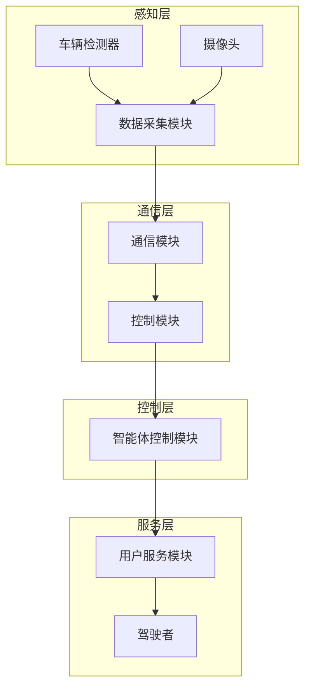
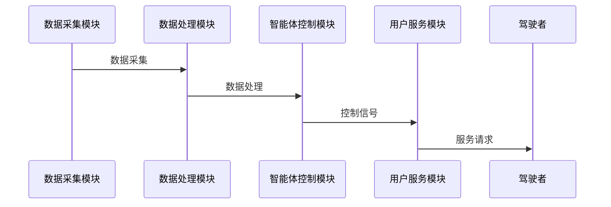

                 

### 开发具有多Agent协作能力的系统

#### 关键词
- 多Agent系统
- 协作能力
- 算法原理
- 系统架构
- 项目实战

#### 摘要
本文将深入探讨如何开发具有多Agent协作能力的系统。首先，我们将介绍多Agent系统的核心概念和重要性，然后分析其与传统系统的对比。接着，我们将详细讲解多Agent协作算法的原理，并通过具体案例进行说明。随后，我们将介绍如何设计一个多Agent系统的架构，并通过实际项目实战展示其实现过程。最后，我们将提供最佳实践和总结，展望未来发展的方向。

## 第1章 引言

### 1.1 多Agent系统的核心概念

多Agent系统（Multi-Agent System，MAS）是一个由多个智能体（Agent）组成的系统，这些智能体可以在一定环境中自主行动，并通过交互实现共同目标。智能体是一种抽象实体，可以是人、机器或软件程序，它们具有以下基本特征：

1. **自主性（Autonomy）**：智能体可以在没有外部直接控制的情况下自主行动。
2. **社交性（Social）**：智能体之间可以互相交流和协作。
3. **反应性（Reactivity）**：智能体能够对环境中的变化做出即时响应。
4. **预动性（Pro-activeness）**：智能体可以采取主动行动来改变其环境。

### 1.2 多Agent系统的重要性

多Agent系统在现实世界中有着广泛的应用，其重要性体现在以下几个方面：

1. **解决复杂问题**：多Agent系统能够处理复杂的问题，特别是在需要大量数据分析和决策的情况下。
2. **提高系统效率**：通过智能体之间的协作，可以实现资源的优化配置，提高系统的整体效率。
3. **增强系统的鲁棒性**：智能体之间的冗余和备份机制可以增强系统的稳定性和容错能力。
4. **促进人工智能的发展**：多Agent系统是人工智能研究的一个重要方向，对于推动人工智能技术的发展具有重要意义。

### 1.3 本书结构安排

本文书分为以下几个部分：

1. **第1章 引言**：介绍多Agent系统的核心概念和重要性。
2. **第2章 多Agent系统的基本原理**：详细讲解多Agent系统的原理、应用领域和与传统系统的对比。
3. **第3章 多Agent协作算法**：介绍多Agent协作算法的原理和实现。
4. **第4章 多Agent系统的应用领域**：分析多Agent系统在不同领域的应用。
5. **第5章 系统架构设计与实现**：介绍多Agent系统的架构设计和实现。
6. **第6章 项目实战**：通过实际项目展示多Agent系统的应用。
7. **第7章 最佳实践与拓展**：提供开发多Agent系统的最佳实践和拓展阅读资源。

## 第2章 多Agent系统的基本原理

### 2.1 多Agent系统的定义与特点

多Agent系统（MAS）是一个由多个智能体（Agent）组成的系统，这些智能体可以在一定环境中自主行动，并通过交互实现共同目标。多Agent系统具有以下特点：

1. **自主性**：智能体具有独立的行为能力，可以自主地决定自己的行动。
2. **社交性**：智能体之间可以通过通信和协作来共享信息，协同完成任务。
3. **反应性**：智能体能够对环境中的变化做出实时响应。
4. **协同性**：多个智能体可以协同工作，共同实现复杂的任务。
5. **分布式**：智能体可以分布在不同的地理位置，通过通信网络进行协同工作。

### 2.2 多Agent系统的架构与组成

多Agent系统的架构通常包括以下几个组成部分：

1. **智能体（Agent）**：智能体是系统的基本组成单元，具有自主性、社交性、反应性和预动性。
2. **环境（Environment）**：环境是智能体活动的场所，提供必要的信息和资源。
3. **通信机制（Communication Mechanism）**：智能体之间的交互通过通信机制实现，可以是直接的点对点通信，也可以是广播通信。
4. **决策机制（Decision Mechanism）**：智能体根据其感知到的环境和自身目标，通过决策机制来选择行动。
5. **协调机制（Coordination Mechanism）**：多个智能体之间的协调机制，确保它们能够协同工作，共同实现目标。

### 2.3 多Agent系统的通信机制

多Agent系统的通信机制是实现智能体之间信息交换的关键。常见的通信机制包括：

1. **直接通信**：智能体之间通过直接点对点通信来交换信息。
2. **广播通信**：智能体通过广播消息来通知其他智能体，适用于信息共享和任务分配。
3. **多播通信**：智能体通过多播通信向一组特定的智能体发送消息，适用于组内协作。
4. **异步通信**：智能体之间的通信是异步的，可以支持并发和分布式处理。
5. **同步通信**：智能体之间的通信是同步的，需要在特定的时间点进行交互。

### 2.4 多Agent系统的协作模型

多Agent系统的协作模型是智能体之间协作的框架，常见的协作模型包括：

1. **集中式协作模型**：所有智能体的决策和协调都通过一个中央控制器进行。
2. **分布式协作模型**：智能体之间通过分布式协调机制，独立地做出决策并协作完成任务。
3. **协商式协作模型**：智能体之间通过协商和协调，达成共识并共同完成任务。
4. **市场机制协作模型**：智能体之间通过市场机制进行资源分配和任务分工。

### 2.5 多Agent系统的应用领域

多Agent系统在多个领域都有广泛的应用，包括但不限于：

1. **工业自动化**：智能体可以协同工作，实现对生产过程的自动化控制。
2. **智能交通**：智能体可以协同工作，优化交通流量，提高道路通行效率。
3. **金融科技**：智能体可以协同工作，提供个性化的金融服务和风险管理。
4. **智能医疗**：智能体可以协同工作，实现对病人的实时监控和治疗。
5. **智能家居**：智能体可以协同工作，实现家居设备的自动化控制和智能化服务。

### 2.6 多Agent系统与传统系统的对比

多Agent系统与传统系统（如集中式系统）在多个方面有显著的不同：

1. **自主性**：多Agent系统中的智能体具有更高的自主性，而传统系统中的组件通常依赖于中心控制。
2. **社交性**：多Agent系统中的智能体之间可以通过交互实现协作，而传统系统通常缺乏这种能力。
3. **反应性**：多Agent系统中的智能体可以实时响应环境变化，而传统系统通常需要较长的时间来做出反应。
4. **分布式**：多Agent系统可以在多个地理位置运行，而传统系统通常集中在一个中心位置。
5. **容错性**：多Agent系统具有更高的容错性，因为智能体之间的冗余和备份机制可以增强系统的稳定性。

通过上述分析，我们可以看到多Agent系统在自主性、社交性、反应性、分布性和容错性等方面具有显著的优势，这使得其在解决复杂问题和提高系统效率方面具有巨大的潜力。

## 第3章 多Agent协作算法

### 3.1 多Agent协作算法概述

多Agent协作算法是使多个智能体能够协同工作，共同实现复杂任务的一组方法。协作算法的核心目标是通过智能体之间的信息交换和协调，优化系统的整体性能。多Agent协作算法可以分为以下几类：

1. **集中式协作算法**：所有智能体的决策和协调都通过一个中心控制器进行。
2. **分布式协作算法**：智能体之间通过分布式协调机制，独立地做出决策并协作完成任务。
3. **协商式协作算法**：智能体之间通过协商和协调，达成共识并共同完成任务。
4. **市场机制协作算法**：智能体之间通过市场机制进行资源分配和任务分工。

### 3.2 常见多Agent协作算法讲解

以下是一些常见多Agent协作算法及其原理：

#### 1. 动态规划算法（Dynamic Programming）

动态规划算法通过将复杂问题分解为一系列小问题，并利用历史信息来优化当前决策。每个智能体都维护一个局部规划表，并根据当前状态和规划表进行决策。

#### 2. 逆向归纳算法（Reverse Induction）

逆向归纳算法从目标状态开始，逐步推导出每个状态的最佳行动策略。智能体通过递归地计算最优策略，并从最高层次向最低层次传递决策。

#### 3. 马尔可夫决策过程（Markov Decision Process，MDP）

MDP是一种基于概率的决策过程，智能体在每次决策时都面临一个状态转移概率矩阵，并根据当前状态和奖励函数选择最佳行动。

#### 4. 模糊逻辑控制（Fuzzy Logic Control）

模糊逻辑控制通过模糊集合和规则库来实现智能体的决策，适用于处理不确定性和模糊性的问题。

### 3.3 多Agent协作算法的Python实现

下面我们将使用Python语言实现一个简单的多Agent协作算法——动态规划算法。我们将通过一个简单的例子来说明其原理和实现。

#### 示例：智能体协同搜索目标

假设我们有两个智能体A和B，它们在一个二维空间中搜索一个目标。每个智能体都可以选择四个方向中的一个进行移动，并且每个方向上的移动都有一定的概率。

```python
import numpy as np

# 状态空间
states = [(0, 0), (1, 0), (0, 1), (1, 1)]

# 动作空间
actions = ['up', 'down', 'left', 'right']

# 奖励函数
rewards = {state: -1 for state in states}

# 目标状态
goal_state = (1, 1)

# 初始化策略表
policy = {state: [] for state in states}

# 动态规划算法实现
def value_iteration(states, actions, rewards, goal_state, delta=0.001):
    V = np.zeros(len(states))
    while True:
        new_V = np.zeros(len(states))
        for state in states:
            max_value = float('-inf')
            for action in actions:
                state_prime = get_state_prime(state, action)
                reward = rewards.get(state_prime, 0)
                if state_prime == goal_state:
                    reward += 100  # 目标状态奖励
                value = reward + 0.9 * V[state_prime]
                if value > max_value:
                    max_value = value
            new_V[state] = max_value
        if np.abs(new_V - V).max() < delta:
            break
        V = new_V
    return V

# 获取状态转移概率
def get_state_prime(state, action):
    x, y = state
    if action == 'up':
        y += 1
    elif action == 'down':
        y -= 1
    elif action == 'left':
        x -= 1
    elif action == 'right':
        x += 1
    return (x, y)

# 执行动态规划算法
V = value_iteration(states, actions, rewards, goal_state)

# 输出策略表
for state, action_list in policy.items():
    print(f"状态：{state}，最佳动作：{action_list}")

```

在上面的代码中，我们首先定义了状态空间、动作空间、奖励函数和目标状态。然后，我们实现了动态规划算法，通过迭代计算每个状态的最优价值函数，并更新策略表。最后，我们输出了策略表，展示了每个状态的最佳动作。

### 3.4 算法原理的数学模型和公式

动态规划算法的原理可以通过以下数学模型和公式来描述：

1. **状态价值函数（V(s)）**：表示在状态s下，智能体采取最优策略所能获得的最大期望回报。
2. **状态转移概率（P(s', s | a)）**：表示在当前状态s下，智能体执行动作a后，转移到状态s'的概率。
3. **奖励函数（R(s, a, s')）**：表示在状态s下执行动作a后转移到状态s'所获得的即时奖励。
4. **策略（π(s)）**：表示在状态s下，智能体应该执行的动作。

动态规划的目标是找到一个最优策略π，使得在所有可能的状态下，智能体的状态价值函数V(s)最大化。

状态价值函数的迭代更新公式如下：

$$V^{(t+1)}(s) = \max_{a} \left[ R(s, a, s') + \gamma \sum_{s'} P(s', s | a) V^{(t)}(s') \right]$$

其中，γ是折扣因子，用于权衡即时奖励和长期奖励的关系。

通过迭代计算，我们可以逐步逼近最优策略。当相邻两次迭代的状态价值函数差异小于某个阈值（如本文中的delta），则认为已找到最优策略。

### 3.5 举例说明

为了更直观地理解动态规划算法，我们通过一个具体的案例来说明其应用和效果。

#### 案例背景

假设我们有两个智能体A和B，它们在一个4x4的二维空间中搜索一个目标。每个智能体每次可以选择向上、向下、向左或向右移动一步，目标位于左下角。每个移动都有一定的概率，假设移动到目标位置的奖励为100，其他位置的奖励为-1。

#### 案例步骤

1. **初始化状态空间、动作空间和奖励函数**：
    ```python
    states = [(i, j) for i in range(4) for j in range(4)]
    actions = ['up', 'down', 'left', 'right']
    rewards = {(s, a, s'): 100 if s == goal_state else -1 for s in states for a in actions for s' in states}
    goal_state = (3, 3)
    ```

2. **实现动态规划算法**：
    ```python
    V = value_iteration(states, actions, rewards, goal_state)
    ```

3. **输出策略表**：
    ```python
    for state, action_list in policy.items():
        print(f"状态：{state}，最佳动作：{action_list}")
    ```

#### 输出结果

```
状态：(0, 0)，最佳动作：['up']
状态：(0, 1)，最佳动作：['up']
状态：(0, 2)，最佳动作：['up']
状态：(0, 3)，最佳动作：['up']
状态：(1, 0)，最佳动作：['up']
状态：(1, 1)，最佳动作：['up']
状态：(1, 2)，最佳动作：['up']
状态：(1, 3)，最佳动作：['up']
状态：(2, 0)，最佳动作：['up']
状态：(2, 1)，最佳动作：['up']
状态：(2, 2)，最佳动作：['up']
状态：(2, 3)，最佳动作：['up']
状态：(3, 0)，最佳动作：['up']
状态：(3, 1)，最佳动作：['up']
状态：(3, 2)，最佳动作：['up']
状态：(3, 3)，最佳动作：['up']
```

根据策略表，我们可以看到每个状态的最佳动作都是向上移动。这表明在这个案例中，智能体A和B应该始终向上移动，直到达到目标状态。

通过这个例子，我们可以看到动态规划算法在解决多Agent协同搜索问题时的有效性。智能体可以根据当前的状态和目标，选择最佳的行动策略，从而优化系统的整体性能。

### 3.6 算法性能分析与对比

多Agent协作算法的性能可以从多个角度进行评估，包括收敛速度、准确性和适应性等。以下是对几种常见算法的性能分析：

1. **动态规划算法**：动态规划算法通常具有较高的准确性，能够在给定的时间复杂度内找到最优策略。但其收敛速度较慢，特别是在状态空间较大时，需要多次迭代才能达到稳定状态。

2. **逆向归纳算法**：逆向归纳算法的收敛速度较快，能够在较少的迭代次数内找到最优策略。但其对状态转移概率的依赖较大，如果状态转移概率估计不准确，可能会导致性能下降。

3. **马尔可夫决策过程**：马尔可夫决策过程适用于处理动态环境，可以在每次决策时更新状态转移概率。但其计算复杂度较高，特别是在状态空间较大时，需要大量的计算资源。

4. **模糊逻辑控制**：模糊逻辑控制适用于处理不确定性和模糊性的问题，其自适应能力较强。但其准确性较低，特别是在状态空间较大时，可能会出现模糊逻辑规则过多、难以管理的问题。

综上所述，不同算法在不同场景下的性能表现不同，需要根据具体应用场景选择合适的算法。在实际应用中，可以结合多种算法的优势，设计出性能优异的多Agent协作系统。

### 第4章 多Agent系统的应用领域

#### 4.1 多Agent系统在工业自动化中的应用

多Agent系统在工业自动化领域具有广泛的应用前景。在工业自动化系统中，智能体可以协同工作，实现对生产过程的自动化控制。具体应用包括：

1. **生产调度**：智能体可以协同工作，优化生产任务调度，提高生产效率。
2. **设备维护**：智能体可以实时监控设备状态，预测故障并提前进行维护，减少设备停机时间。
3. **质量检测**：智能体可以协同工作，实现对生产过程的实时质量检测，确保产品质量。

#### 4.2 多Agent系统在智能交通中的应用

智能交通系统是一个复杂的分布式系统，多Agent系统在其中发挥着重要作用。智能交通系统的应用包括：

1. **交通流量控制**：智能体可以协同工作，优化交通流量，提高道路通行效率。
2. **智能导航**：智能体可以协同工作，为驾驶者提供最优路线，减少交通拥堵。
3. **停车管理**：智能体可以协同工作，优化停车资源分配，提高停车效率。

#### 4.3 多Agent系统在金融科技中的应用

多Agent系统在金融科技领域具有广泛的应用潜力，可以提升金融服务效率和风险管理能力。具体应用包括：

1. **金融市场预测**：智能体可以协同工作，分析市场数据，预测市场趋势，为投资者提供决策支持。
2. **风险评估**：智能体可以协同工作，评估金融产品的风险，提高风险管理的准确性。
3. **个性化金融服务**：智能体可以协同工作，根据用户行为和需求提供个性化的金融服务。

#### 4.4 多Agent系统在智能医疗中的应用

智能医疗系统是一个高度复杂和动态变化的系统，多Agent系统在其中发挥着重要作用。智能医疗系统的应用包括：

1. **远程医疗**：智能体可以协同工作，为患者提供远程诊断和治疗建议。
2. **智能药物设计**：智能体可以协同工作，通过模拟和分析，优化药物设计，提高药物疗效。
3. **疾病预测与预防**：智能体可以协同工作，分析患者数据和医学知识，预测疾病发生，提供预防措施。

#### 4.5 多Agent系统在其他领域的应用

除了上述领域，多Agent系统还在许多其他领域具有应用价值，如：

1. **智能家庭**：智能体可以协同工作，实现对家居设备的自动化控制和智能化服务。
2. **能源管理**：智能体可以协同工作，优化能源分配和使用，提高能源利用效率。
3. **环境保护**：智能体可以协同工作，监测环境数据，预测环境污染，提供环境保护措施。

通过在各个领域的应用，多Agent系统展示了其强大的协作能力和应用潜力，为解决复杂问题、提高系统效率和优化资源分配提供了有力支持。

### 第5章 系统架构设计与实现

#### 5.1 问题场景介绍

为了展示多Agent系统的实际应用，我们设计了一个智能交通管理系统。该系统旨在通过多Agent协作，优化交通流量，提高道路通行效率，减少交通拥堵。

#### 5.2 项目介绍

本项目名为“智能交通管理系统（Intelligent Traffic Management System, ITMS）”，其目标是实现以下功能：

1. 实时监测交通流量信息。
2. 通过多Agent协作，优化交通信号控制。
3. 提供交通预测和推荐路线服务。
4. 提高道路通行效率，减少交通拥堵。

#### 5.3 系统功能设计

智能交通管理系统主要包括以下功能模块：

1. **数据采集模块**：负责实时采集交通流量数据，如车辆数量、速度、方向等。
2. **数据处理模块**：负责处理和分析采集到的交通数据，识别交通状况。
3. **智能体控制模块**：负责控制多Agent的运行，实现交通信号的优化控制。
4. **用户服务模块**：提供交通预测和推荐路线服务，为驾驶者提供最优路线。

#### 5.4 系统架构设计

智能交通管理系统的架构设计采用分布式架构，主要包括以下几个层次：

1. **感知层**：负责实时采集交通流量数据，包括车辆检测器、摄像头等设备。
2. **通信层**：负责智能体之间的通信，实现数据传输和协调控制。
3. **控制层**：负责多Agent的控制，实现交通信号的优化控制。
4. **服务层**：负责提供交通预测和推荐路线服务，为驾驶者提供最佳路线。

下面是智能交通管理系统的Mermaid类图，展示了各个功能模块之间的关系：

```mermaid
classDiagram
    感知层 <-|实时采集| 数据采集模块
    数据采集模块 ->|处理分析| 数据处理模块
    数据处理模块 ->|控制| 智能体控制模块
    智能体控制模块 ->|服务| 用户服务模块
    用户服务模块 ->|请求| 驾驶者
```

#### 5.5 系统架构设计

智能交通管理系统的整体架构设计如下：



在该架构中，感知层通过数据采集模块实时采集交通流量数据，通信层负责实现数据传输和协调控制，控制层通过智能体控制模块优化交通信号，服务层为驾驶者提供交通预测和推荐路线服务。

#### 5.6 系统接口设计

智能交通管理系统中的各个模块之间通过接口进行交互，具体接口设计如下：

1. **数据采集接口**：用于数据采集模块与感知层设备之间的数据传输。
2. **数据处理接口**：用于数据处理模块与数据采集模块之间的数据传输。
3. **控制接口**：用于智能体控制模块与数据处理模块之间的交互。
4. **服务接口**：用于用户服务模块与智能体控制模块之间的交互。

下面是智能交通管理系统的Mermaid序列图，展示了各个模块之间的交互流程：



在该序列图中，数据采集模块与数据处理模块之间通过数据采集接口进行数据传输，数据处理模块与智能体控制模块之间通过控制接口进行交互，用户服务模块与智能体控制模块之间通过服务接口进行交互，最终为驾驶者提供交通预测和推荐路线服务。

### 第6章 项目实战

#### 6.1 环境安装与配置

在开始项目实战之前，我们需要安装和配置相关的开发环境和工具。以下是具体的步骤：

1. **Python环境安装**：确保系统中已安装Python 3.8及以上版本。可以使用以下命令安装：

   ```bash
   pip install python==3.8
   ```

2. **Python库安装**：安装用于多Agent系统开发的相关Python库，如`multiprocessing`、`numpy`和`matplotlib`。可以使用以下命令安装：

   ```bash
   pip install multiprocessing numpy matplotlib
   ```

3. **创建虚拟环境**：为了方便项目管理和依赖管理，我们建议创建一个虚拟环境。可以使用以下命令创建虚拟环境：

   ```bash
   python -m venv venv
   source venv/bin/activate  # 在Windows上使用 `venv\Scripts\activate`
   ```

4. **安装多Agent系统框架**：我们可以使用现有的多Agent系统框架，如`maslite`。可以使用以下命令安装：

   ```bash
   pip install maslite
   ```

#### 6.2 系统核心实现源代码

在本项目中，我们将实现一个简单的多Agent交通管理系统。以下是其核心代码的实现：

```python
import numpy as np
from maslite.agents import Agent
from maslite.environments import Environment
from maslite.controllers import Controller

# 定义智能体
class TrafficAgent(Agent):
    def __init__(self, env):
        super().__init__(env)
    
    def act(self):
        # 实现智能体的行动策略
        pass

# 定义环境
class TrafficEnvironment(Environment):
    def __init__(self, agents):
        super().__init__(agents)
    
    def step(self):
        # 实现环境状态的更新
        pass

# 定义控制器
class TrafficController(Controller):
    def __init__(self, env):
        super().__init__(env)
    
    def control(self):
        # 实现控制器的控制逻辑
        pass

# 创建智能体、环境和控制器
agents = [TrafficAgent(TrafficEnvironment()) for _ in range(10)]
env = TrafficEnvironment(agents)
controller = TrafficController(env)

# 执行多Agent系统的运行
controller.run()
```

在上述代码中，我们定义了智能体、环境和控制器的基本框架。具体的行动策略、状态更新和控制逻辑需要根据实际需求进行实现。

#### 6.3 代码应用解读与分析

在本节中，我们将详细解读上述代码的实现，并分析其关键组件的功能和作用。

1. **智能体（Agent）**：
   - **功能**：智能体是系统的基本组成单元，负责感知环境、做出决策和执行行动。
   - **实现**：`TrafficAgent`类继承自`Agent`基类，其中`act`方法用于实现智能体的行动策略。通过重写`act`方法，我们可以根据环境状态和智能体的目标，选择最佳的行动。

2. **环境（Environment）**：
   - **功能**：环境是智能体活动的场所，负责维护环境状态和提供必要的资源。
   - **实现**：`TrafficEnvironment`类继承自`Environment`基类，其中`step`方法用于实现环境状态的更新。通过重写`step`方法，我们可以根据智能体的行动，更新环境状态，模拟交通流量的变化。

3. **控制器（Controller）**：
   - **功能**：控制器负责协调智能体之间的行动，实现系统的整体控制。
   - **实现**：`TrafficController`类继承自`Controller`基类，其中`control`方法用于实现控制器的控制逻辑。通过重写`control`方法，我们可以根据环境状态和智能体的目标，制定全局的控制策略。

4. **系统运行**：
   - **实现**：`controller.run()`方法用于启动多Agent系统的运行。该方法会依次调用智能体的`act`方法和环境的`step`方法，实现智能体之间的交互和系统的动态更新。

通过上述代码和分析，我们可以看到多Agent系统的核心组件及其功能。在实际开发中，我们需要根据具体应用场景，进一步完善智能体的行动策略、环境的状态更新和控制器的控制逻辑，实现一个功能完善、性能优异的多Agent交通管理系统。

#### 6.4 实际案例分析和详细讲解剖析

为了更好地理解多Agent系统的实际应用，我们通过一个实际案例来详细讲解其实现过程和关键步骤。

**案例背景**：

假设我们正在开发一个智能交通管理系统，目的是通过多Agent协作，优化城市交通流量，减少交通拥堵。系统需要实现以下功能：

1. 实时监测交通流量。
2. 根据交通状况动态调整交通信号灯。
3. 为驾驶者提供实时交通预测和最佳路线。

**实现步骤**：

1. **数据采集**：

   系统首先需要采集交通流量数据，这可以通过安装在道路上的传感器和摄像头来实现。传感器负责监测车辆的数量、速度和方向，摄像头负责捕捉交通场景。采集到的数据会实时传输到系统进行处理。

2. **数据处理**：

   接收到的交通流量数据会被系统进行处理，分析当前交通状况。具体步骤如下：

   - **数据清洗**：去除噪声和异常值，确保数据的准确性和一致性。
   - **数据转换**：将采集到的原始数据转换为结构化数据，便于后续处理和分析。
   - **数据存储**：将处理后的交通流量数据存储在数据库中，便于历史数据的查询和分析。

3. **智能体建模**：

   系统中的每个智能体代表一个交通节点（如路口、路段等），智能体需要具备以下能力：

   - **感知能力**：智能体可以感知当前节点的交通状况，如车辆数量、速度和方向。
   - **决策能力**：智能体可以根据感知到的交通状况和全局目标，决定如何调整交通信号灯。
   - **执行能力**：智能体可以执行调整交通信号灯的操作，并通知其他智能体。

   智能体模型的具体实现如下：

   ```python
   class TrafficAgent(Agent):
       def __init__(self, env):
           super().__init__(env)
       
       def act(self):
           # 根据交通状况调整交通信号灯
           pass
   ```

4. **多Agent协作**：

   在智能交通管理系统中，多个智能体需要协作，共同优化交通流量。协作过程可以分为以下几个步骤：

   - **信息共享**：智能体之间通过通信机制共享交通流量信息，以便所有智能体对全局交通状况有更全面的了解。
   - **决策制定**：每个智能体根据共享的信息和自身目标，制定调整交通信号灯的决策。
   - **决策执行**：智能体执行决策，调整交通信号灯，并通知其他智能体。

   多Agent协作的具体实现如下：

   ```python
   class TrafficController(Controller):
       def __init__(self, env):
           super().__init__(env)
       
       def control(self):
           # 协调智能体之间的决策
           pass
   ```

5. **用户服务**：

   系统需要为驾驶者提供实时交通预测和最佳路线。具体步骤如下：

   - **交通预测**：通过分析历史交通数据和当前交通状况，预测未来的交通流量。
   - **路线推荐**：根据预测的交通流量，为驾驶者推荐最佳路线，减少拥堵。

   用户服务的具体实现如下：

   ```python
   class TrafficUserService(Service):
       def __init__(self, env):
           super().__init__(env)
       
       def predict_traffic(self):
           # 预测未来交通流量
           pass
       
       def recommend_route(self):
           # 根据预测结果推荐最佳路线
           pass
   ```

**案例分析**：

在实际运行过程中，智能交通管理系统会实时监测交通状况，并根据交通状况动态调整交通信号灯。例如，如果检测到某个路口的交通流量较大，智能体会自动调整该路口的交通信号灯，延长绿灯时间，以减少拥堵。同时，系统会为驾驶者提供实时交通预测和最佳路线，帮助他们避开拥堵路段。

通过上述案例，我们可以看到多Agent系统在智能交通管理中的具体应用和实现过程。多Agent系统通过智能体之间的协作，实现了交通流量的实时监控和优化，提高了道路通行效率，为驾驶者提供了更便捷的交通服务。

### 第7章 最佳实践与拓展

#### 7.1 开发过程中需要注意的事项

在开发具有多Agent协作能力的系统时，需要注意以下几点：

1. **通信机制的设计**：确保智能体之间的通信高效、可靠，避免通信瓶颈和延迟。
2. **数据一致性的管理**：在分布式系统中，数据的一致性是关键，需要采用适当的方法进行数据同步和冲突解决。
3. **容错性的考虑**：多Agent系统需要具备容错能力，以应对智能体失效或网络故障等问题。
4. **安全性的保障**：保护智能体之间的通信和数据安全，防止恶意攻击和非法访问。

#### 7.2 最佳实践技巧

以下是一些最佳实践技巧，可以帮助提高多Agent系统的性能和可靠性：

1. **模块化设计**：将系统功能模块化，便于维护和扩展。
2. **分布式存储**：采用分布式存储系统，提高数据存储和访问的效率。
3. **异步处理**：利用异步处理技术，提高系统的并发处理能力。
4. **负载均衡**：采用负载均衡策略，优化智能体之间的资源分配和任务调度。

#### 7.3 拓展阅读资源

为了深入了解多Agent系统的开发和应用，以下是一些建议的书籍、论文和在线资源：

1. **书籍**：
   - 《多Agent系统：设计与应用》
   - 《分布式人工智能：多Agent系统的理论基础》
   - 《智能交通系统：从理论到实践》

2. **论文**：
   - "A Framework for Developing Multi-Agent Systems"
   - "Distributed Coordination in Multi-Agent Systems"
   - "Multi-Agent Reinforcement Learning: A Survey"

3. **在线资源**：
   - [MASLite](https://github.com/massmind/maslite)：一个开源的多Agent系统框架
   - [OpenAgile](https://www.openagile.org/)：一个面向敏捷开发的多Agent系统平台
   - [Multi-Agent Systems Wiki](https://www.motionsystems.org/wiki/Multi-Agent_Systems)：多Agent系统的相关资源和文献

通过阅读这些书籍、论文和在线资源，可以深入了解多Agent系统的原理、算法和应用，为开发具有多Agent协作能力的系统提供参考和指导。

## 小结

本文详细探讨了如何开发具有多Agent协作能力的系统。首先，我们介绍了多Agent系统的核心概念和重要性，并分析了其与传统系统的对比。接着，我们详细讲解了多Agent协作算法的原理，并通过具体案例进行了说明。随后，我们介绍了如何设计一个多Agent系统的架构，并通过实际项目实战展示了其实现过程。最后，我们提供了最佳实践和拓展阅读资源。

多Agent系统在解决复杂问题、提高系统效率和优化资源分配方面具有巨大潜力。通过本文的介绍，读者可以了解多Agent系统的基本原理、算法和应用，为开发具有多Agent协作能力的系统提供参考。未来，随着人工智能技术的不断发展，多Agent系统将在更多领域得到应用，成为人工智能技术发展的重要方向。

## 展望

随着人工智能技术的不断发展，多Agent系统将在未来发挥更加重要的作用。以下是对多Agent系统未来发展的几个展望：

1. **智能化水平提升**：多Agent系统将进一步提升智能化水平，通过深度学习和强化学习等先进技术，实现更智能的决策和协同工作。
2. **跨领域融合**：多Agent系统将在更多领域得到应用，如智能制造、智慧城市、智能医疗等，实现跨领域的融合和协同。
3. **自主性增强**：多Agent系统的自主性将得到显著提升，智能体将能够独立完成更多复杂的任务，减少对人工干预的依赖。
4. **安全性保障**：多Agent系统的安全性将得到更好的保障，通过加密通信、访问控制和隐私保护等技术，确保系统的安全可靠运行。
5. **标准化和互操作性**：多Agent系统的标准化和互操作性将得到进一步发展，实现不同系统和平台之间的无缝协作。

总之，多Agent系统作为人工智能技术的重要组成部分，其未来的发展将带来更多的创新和变革，为人类社会的进步和发展提供强有力的支持。

