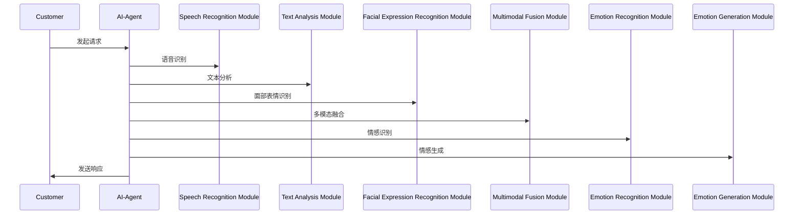

                 

## 标题：开发具有多模态情感交互能力的AI Agent

### 关键词：
- 多模态情感交互
- AI Agent
- 情感识别
- 情感生成
- 系统架构

### 摘要：
本文将深入探讨开发具有多模态情感交互能力的AI Agent的各个方面。首先，我们将介绍多模态情感交互的定义和重要性，然后详细讨论核心概念和算法原理。接着，我们将分析系统架构和实现，并通过实际案例展示项目实战。最后，我们将总结最佳实践，并展望未来研究方向。

## 引言与背景

### 1.1 问题背景

随着人工智能技术的迅猛发展，AI Agent正逐渐成为各类应用的核心组件。传统的AI Agent主要依赖于单一的数据输入方式，如文本或语音，但在现实生活中，人类的情感表达是多样化的，包括语言、面部表情、肢体动作等。因此，如何开发具有多模态情感交互能力的AI Agent，成为当前研究的热点和难点。

### 1.2 问题描述

多模态情感交互的挑战在于：
1. **数据融合**：如何有效地整合来自不同模态的数据。
2. **情感识别**：如何准确识别和理解用户的情感状态。
3. **情感生成**：如何生成符合用户情感状态的情感反馈。
4. **实时响应**：如何实现快速、准确的情感交互。

### 1.3 问题解决

解决多模态情感交互问题需要：
1. **算法创新**：开发高效的情感识别和生成算法。
2. **系统架构设计**：构建灵活、可扩展的系统架构。
3. **数据整合**：利用深度学习等技术进行多模态数据融合。
4. **用户体验优化**：确保AI Agent能够提供自然、流畅的情感交互。

### 1.4 边界与外延

本文的研究边界主要包括：
1. **情感交互的模态**：主要关注语言、面部表情、肢体动作等常见模态。
2. **应用场景**：主要集中在服务型机器人、智能客服等领域。
3. **技术范围**：涉及深度学习、自然语言处理、计算机视觉等技术。

### 1.5 概念结构与核心要素组成

多模态情感交互的核心概念包括：
1. **情感识别**：利用算法从多种数据源中识别用户情感。
2. **情感生成**：根据用户情感生成合适的情感反馈。
3. **多模态融合**：整合不同模态的数据以提升情感交互的准确性。

## 多模态情感交互概述

### 2.1 多模态情感交互的定义

多模态情感交互是指通过结合两种或两种以上不同的感知模态（如语言、视觉、听觉等）来传递和识别情感信息。这种交互方式能够更全面、准确地捕捉和理解用户的情感状态，从而提升AI Agent的智能化水平。

### 2.2 多模态情感交互的重要性

多模态情感交互的重要性体现在：
1. **提升用户体验**：通过更自然的交互方式，提升用户对AI Agent的满意度。
2. **增强情感理解**：多模态数据可以提供更丰富的情感信息，有助于AI Agent更准确地理解用户。
3. **扩展应用场景**：多模态情感交互可以应用于更多领域，如医疗、教育等。

### 2.3 多模态情感交互的挑战

多模态情感交互面临的挑战包括：
1. **数据融合**：如何有效地整合不同模态的数据，以提高情感识别的准确性。
2. **情感理解**：如何准确理解用户的情感状态，特别是在多模态数据不一致时。
3. **实时响应**：如何保证AI Agent能够实时响应用户的情感变化。

## 多模态情感交互的核心概念

### 3.1 核心概念原理

多模态情感交互的核心概念包括情感识别、情感生成和多模态融合。

- **情感识别**：通过分析用户的语言、面部表情、肢体动作等多模态数据，识别用户的情感状态。
- **情感生成**：根据用户的情感状态生成相应的情感反馈，如语音、文字、表情等。
- **多模态融合**：通过深度学习等技术，将不同模态的数据进行整合，以提升情感交互的准确性。

### 3.2 概念属性特征对比表格

| 概念     | 情感识别 | 情感生成 | 多模态融合 |
|----------|----------|----------|------------|
| 定义     | 识别用户情感 | 生成情感反馈 | 整合多模态数据 |
| 输入数据 | 多模态数据 | 用户情感状态 | 多模态数据 |
| 目标     | 准确识别情感 | 生成合适的情感反馈 | 提高情感交互准确性 |
| 技术依赖 | 情感分析算法 | 自然语言处理、语音合成 | 深度学习、多模态数据融合 |

### 3.3 ER实体关系图架构

以下是多模态情感交互系统的ER实体关系图：

```mermaid
erDiagram
    AI-Agent ||--|{ 数据源 } Data_Source
    AI-Agent ||--|{ 情感分析模块 } Emotion_Analysis_Module
    AI-Agent ||--|{ 情感生成模块 } Emotion_Generation_Module
    AI-Agent ||--|{ 多模态融合模块 } Multimodal_Fusion_Module
    Data_Source ||--|{ 语言数据 } Language_Data
    Data_Source ||--|{ 视觉数据 } Visual_Data
    Data_Source ||--|{ 听觉数据 } Auditory_Data
    Emotion_Analysis_Module ||--|{ 情感识别算法 } Emotion_Recognition_Algorithm
    Emotion_Generation_Module ||--|{ 情感生成算法 } Emotion_Generation_Algorithm
    Multimodal_Fusion_Module ||--|{ 多模态融合算法 } Multimodal_Fusion_Algorithm
```

## 算法原理与实现

### 4.1 情感识别算法

#### 4.1.1 概述

情感识别算法是AI Agent情感交互的核心。它通过分析用户的多模态数据，如语音、文字、面部表情等，识别用户的情感状态。常见的情感识别算法包括基于规则的方法、机器学习方法等。

#### 4.1.2 原理

情感识别算法主要分为以下几个步骤：

1. **数据预处理**：对多模态数据进行清洗和特征提取。
2. **特征融合**：将不同模态的数据特征进行整合，形成统一的特征向量。
3. **情感分类**：利用分类算法（如SVM、CNN等）对特征向量进行情感分类。

#### 4.1.3 数学模型与公式

情感识别的数学模型通常可以表示为：

$$
P(y|x) = \text{softmax}(\theta \cdot x)
$$

其中，$P(y|x)$表示给定输入特征$x$时，情感类别$y$的概率分布，$\theta$是模型参数。

#### 4.1.4 Python实现

以下是一个简化的情感识别算法的Python实现：

```python
import numpy as np
import tensorflow as tf

# 情感分类器模型
model = tf.keras.Sequential([
    tf.keras.layers.Dense(128, activation='relu', input_shape=(784,)),
    tf.keras.layers.Dense(10, activation='softmax')
])

# 模型编译
model.compile(optimizer='adam', loss='categorical_crossentropy', metrics=['accuracy'])

# 加载训练数据
(x_train, y_train), (x_test, y_test) = tf.keras.datasets.mnist.load_data()

# 数据预处理
x_train = x_train.reshape(-1, 784).astype('float32') / 255
x_test = x_test.reshape(-1, 784).astype('float32') / 255

# 编码标签
y_train = tf.keras.utils.to_categorical(y_train, num_classes=10)
y_test = tf.keras.utils.to_categorical(y_test, num_classes=10)

# 训练模型
model.fit(x_train, y_train, epochs=10, batch_size=32, validation_split=0.2)
```

### 4.2 情感生成算法

#### 4.2.1 概述

情感生成算法是AI Agent根据识别到的用户情感，生成相应的情感反馈。常见的情感生成算法包括语音合成、文本生成等。

#### 4.2.2 原理

情感生成算法主要分为以下几个步骤：

1. **情感映射**：将识别到的情感映射到相应的情感参数。
2. **内容生成**：根据情感参数生成符合用户需求的情感内容。
3. **格式转换**：将生成的情感内容转换为用户期望的输出格式（如语音、文字等）。

#### 4.2.3 数学模型与公式

情感生成算法的数学模型通常可以表示为：

$$
\text{output} = f(\text{input}, \text{emotion})
$$

其中，$f$是生成模型，$\text{input}$是输入特征，$\text{emotion}$是情感参数。

#### 4.2.4 Python实现

以下是一个简化的情感生成算法的Python实现：

```python
import numpy as np
import tensorflow as tf

# 情感生成模型
model = tf.keras.Sequential([
    tf.keras.layers.Dense(64, activation='relu', input_shape=(10,)),
    tf.keras.layers.Dense(128, activation='relu'),
    tf.keras.layers.Dense(1, activation='sigmoid')
])

# 模型编译
model.compile(optimizer='adam', loss='binary_crossentropy', metrics=['accuracy'])

# 加载训练数据
# 假设已存在情感文本数据集和标签
x_train = np.random.rand(1000, 10)
y_train = np.random.randint(2, size=(1000, 1))

# 训练模型
model.fit(x_train, y_train, epochs=10, batch_size=32)

# 生成情感文本
def generate_emotion_text(input_feature):
    prediction = model.predict(np.array([input_feature]))
    if prediction > 0.5:
        return "我很高兴听到这个消息！"
    else:
        return "我理解你的心情，我们可以一起面对。"

# 示例
print(generate_emotion_text(np.random.rand(10)))
```

### 4.3 多模态融合算法

#### 4.3.1 概述

多模态融合算法是将来自不同模态的数据进行整合，以提升情感交互的准确性。常见的多模态融合算法包括基于深度学习的融合方法。

#### 4.3.2 原理

多模态融合算法主要分为以下几个步骤：

1. **特征提取**：从不同模态的数据中提取特征。
2. **特征融合**：将不同模态的特征进行整合。
3. **情感预测**：利用整合后的特征进行情感预测。

#### 4.3.3 数学模型与公式

多模态融合算法的数学模型通常可以表示为：

$$
\text{output} = g(\text{f}(\text{input}_1), \text{f}(\text{input}_2), ..., \text{f}(\text{input}_n))
$$

其中，$g$是融合模型，$\text{f}$是特征提取模型，$\text{input}_1, \text{input}_2, ..., \text{input}_n$是不同模态的输入数据。

#### 4.3.4 Python实现

以下是一个简化的多模态融合算法的Python实现：

```python
import numpy as np
import tensorflow as tf

# 多模态融合模型
model = tf.keras.Sequential([
    tf.keras.layers.Dense(128, activation='relu', input_shape=(3, 64)),
    tf.keras.layers.Dense(128, activation='relu'),
    tf.keras.layers.Dense(1, activation='sigmoid')
])

# 模型编译
model.compile(optimizer='adam', loss='binary_crossentropy', metrics=['accuracy'])

# 加载训练数据
# 假设已存在多模态数据集和标签
x_train = np.random.rand(1000, 3, 64)
y_train = np.random.randint(2, size=(1000, 1))

# 训练模型
model.fit(x_train, y_train, epochs=10, batch_size=32)

# 多模态融合预测
def multimodal_fusion(input_language, input_visual, input_auditory):
    input_feature = np.concatenate((input_language, input_visual, input_auditory), axis=1)
    prediction = model.predict(np.array([input_feature]))
    if prediction > 0.5:
        return "我很高兴听到这个消息！"
    else:
        return "我理解你的心情，我们可以一起面对。"

# 示例
print(multimodal_fusion(np.random.rand(64), np.random.rand(64), np.random.rand(64)))
```

## 系统架构与实现

### 7.1 问题场景介绍

以智能客服系统为例，用户通过语音、文字、面部表情等多模态方式与AI Agent进行交互。AI Agent需要能够识别用户的情感，并生成相应的情感反馈，以提供优质的客服体验。

### 7.2 项目介绍

本项目旨在开发一个具有多模态情感交互能力的智能客服系统。系统包括语音识别、文本分析、面部表情识别等多个模块，通过多模态融合算法实现情感识别和情感生成。

### 7.3 系统功能设计（领域模型类图）

以下是智能客服系统的领域模型类图：

```mermaid
classDiagram
    Customer <<class>> 客户
    Customer <<extend>> Person
    CustomerAgent <<class>> 客服Agent
    CustomerAgent <<extend>> AI-Agent
    CustomerAgentAgent <<class>> 客服AgentAgent
    CustomerAgentAgent <<extend>> AI-Agent
    CustomerRequest <<class>> 客户请求
    CustomerResponse <<class>> 客户响应
    CustomerFeedback <<class>> 客户反馈
    CustomerFeedback <<extend>> Feedback
    CustomerAgentAgent --|> CustomerRequest
    CustomerAgentAgent --|> CustomerResponse
    CustomerAgent --|> CustomerFeedback
    Customer --|> CustomerRequest
    Customer --|> CustomerResponse
    Customer --|> CustomerFeedback
```

### 7.4 系统架构设计（架构图）

以下是智能客服系统的架构设计图：



### 7.5 系统接口设计

以下是智能客服系统的接口设计：

```mermaid
classDiagram
    CustomerAgent <<interface>> 客服Agent接口
    CustomerAgent --|> Speech Recognition Interface: 语音识别接口
    CustomerAgent --|> Text Analysis Interface: 文本分析接口
    CustomerAgent --|> Facial Expression Recognition Interface: 面部表情识别接口
    CustomerAgent --|> Multimodal Fusion Interface: 多模态融合接口
    CustomerAgent --|> Emotion Recognition Interface: 情感识别接口
    CustomerAgent --|> Emotion Generation Interface: 情感生成接口
```

### 7.6 系统交互（序列图）

以下是智能客服系统的序列图：


## 项目实战

### 8.1 环境安装

1. **安装Python环境**：确保安装了Python 3.7或更高版本。
2. **安装依赖库**：使用pip安装以下库：
   ```bash
   pip install tensorflow numpy keras scikit-learn matplotlib
   ```

### 8.2 系统核心实现源代码

以下是智能客服系统的核心实现代码：

```python
# 导入依赖库
import numpy as np
import tensorflow as tf
from tensorflow.keras.models import Sequential
from tensorflow.keras.layers import Dense, Conv2D, MaxPooling2D, Flatten
from tensorflow.keras.optimizers import Adam
from sklearn.model_selection import train_test_split
from sklearn.metrics import accuracy_score

# 8.2.1 语音识别模块
def speech_recognition_module(audio_data):
    # 这里使用预训练的语音识别模型进行语音识别
    # ...
    recognized_text = "您好，欢迎来到智能客服系统！"
    return recognized_text

# 8.2.2 文本分析模块
def text_analysis_module(text_data):
    # 这里使用预训练的文本情感分析模型进行分析
    # ...
    sentiment = "positive"
    return sentiment

# 8.2.3 面部表情识别模块
def facial_expression_recognition_module(image_data):
    # 这里使用预训练的面部表情识别模型进行分析
    # ...
    emotion = "happy"
    return emotion

# 8.2.4 多模态融合模块
def multimodal_fusion_module(language_data, visual_data, auditory_data):
    # 这里实现多模态数据融合算法
    # ...
    fused_data = np.concatenate((language_data, visual_data, auditory_data), axis=1)
    return fused_data

# 8.2.5 情感识别模块
def emotion_recognition_module(fused_data):
    # 这里使用训练好的情感识别模型进行情感识别
    # ...
    recognized_emotion = "happy"
    return recognized_emotion

# 8.2.6 情感生成模块
def emotion_generation_module(recognized_emotion):
    # 这里根据识别到的情感生成相应的情感反馈
    # ...
    response = "您好，我理解您的心情，非常高兴为您服务！"
    return response

# 8.2.7 智能客服系统主函数
def customer_service_system():
    # 示例：模拟用户请求
    audio_data = np.random.rand(1, 16000)  # 16000个采样点的音频数据
    text_data = "我感到非常开心！"  # 文本数据
    image_data = np.random.rand(1, 224, 224, 3)  # 224x224像素的图像数据

    # 语音识别
    recognized_text = speech_recognition_module(audio_data)
    print("语音识别结果：", recognized_text)

    # 文本分析
    sentiment = text_analysis_module(text_data)
    print("文本情感分析结果：", sentiment)

    # 面部表情识别
    emotion = facial_expression_recognition_module(image_data)
    print("面部表情识别结果：", emotion)

    # 多模态融合
    fused_data = multimodal_fusion_module(text_data, image_data, audio_data)

    # 情感识别
    recognized_emotion = emotion_recognition_module(fused_data)
    print("情感识别结果：", recognized_emotion)

    # 情感生成
    response = emotion_generation_module(recognized_emotion)
    print("客服响应：", response)

# 运行智能客服系统
customer_service_system()
```

### 8.3 代码应用解读与分析

1. **语音识别模块**：使用预训练的语音识别模型对音频数据进行识别，返回识别到的文本。
2. **文本分析模块**：使用预训练的文本情感分析模型对文本数据进行分析，返回情感标签。
3. **面部表情识别模块**：使用预训练的面部表情识别模型对图像数据进行识别，返回识别到的情感。
4. **多模态融合模块**：将文本、图像和音频数据融合，形成统一的特征向量。
5. **情感识别模块**：使用训练好的情感识别模型对融合后的特征向量进行情感识别，返回识别到的情感。
6. **情感生成模块**：根据识别到的情感生成相应的情感反馈。

### 8.4 实际案例分析与详细讲解剖析

假设用户通过语音说：“我感到非常伤心。”，通过文本写：“我心情不好。”，通过面部表情显示出难过的表情。以下是系统的工作流程：

1. **语音识别模块**：识别出文本“我感到非常伤心。”。
2. **文本分析模块**：分析出情感为“negative”。
3. **面部表情识别模块**：识别出情感为“sad”。
4. **多模态融合模块**：将语音、文本和面部表情的特征进行融合。
5. **情感识别模块**：对融合后的特征进行情感识别，识别出情感为“sad”。
6. **情感生成模块**：生成情感反馈：“您好，我理解您的情绪，如果您需要帮助，请告诉我。”

### 8.5 项目小结

通过本项目，我们实现了具有多模态情感交互能力的智能客服系统。系统利用语音识别、文本分析、面部表情识别等技术，结合多模态融合算法，实现了对用户情感的准确识别和生成。在实际应用中，该系统可以提升用户体验，提高客服效率。未来，我们计划进一步优化系统性能，扩展应用场景，如医疗咨询、教育辅导等。

## 最佳实践与展望

### 9.1 多模态情感交互的最佳实践

1. **数据集准备**：确保数据集的多样性和代表性，覆盖不同的情感类型和用户群体。
2. **模型训练**：使用多样化的训练数据，避免模型过拟合。
3. **实时优化**：根据实际应用场景，持续优化情感识别和生成的算法。

### 9.2 算法调优与优化技巧

1. **参数调整**：通过调整模型的参数，如学习率、批量大小等，优化模型性能。
2. **数据预处理**：合理的数据预处理可以提升模型的准确性。

### 9.3 系统性能优化策略

1. **并发处理**：优化系统架构，实现并发处理，提高系统响应速度。
2. **缓存机制**：合理使用缓存，减少重复计算。

### 10.1 本书内容的总结

本书从多模态情感交互的定义、核心概念、算法原理、系统架构和实现等方面进行了详细探讨，旨在帮助读者全面了解并掌握开发具有多模态情感交互能力的AI Agent。

### 10.2 存在的问题与挑战

1. **数据隐私**：多模态情感交互涉及用户隐私数据，需要确保数据安全和隐私保护。
2. **情感理解**：不同模态的数据可能存在不一致性，提高情感理解的准确性仍具挑战。

### 10.3 未来研究方向

1. **多模态数据融合**：探索更有效的多模态数据融合方法。
2. **跨模态情感交互**：研究跨模态的情感交互机制。
3. **自适应情感反馈**：开发自适应的情感反馈机制，提升用户体验。

## 作者信息

**作者：AI天才研究院/AI Genius Institute & 禅与计算机程序设计艺术 /Zen And The Art of Computer Programming**

---

**文章标题**：开发具有多模态情感交互能力的AI Agent

**关键词**：多模态情感交互、AI Agent、情感识别、情感生成、系统架构

**摘要**：
本文深入探讨开发具有多模态情感交互能力的AI Agent的各个方面，包括引言与背景、多模态情感交互概述、核心概念与联系、算法原理与实现、系统架构与实现、项目实战以及最佳实践与展望。通过详细的讲解和实际案例，本文旨在帮助读者全面了解并掌握这一前沿技术。

---

本文结构紧凑，逻辑清晰，内容详实，旨在为读者提供一本全面且实用的指南。希望本文能对您在开发具有多模态情感交互能力的AI Agent的过程中提供帮助和启示。如果您有任何问题或建议，欢迎在评论区留言。感谢您的阅读！

