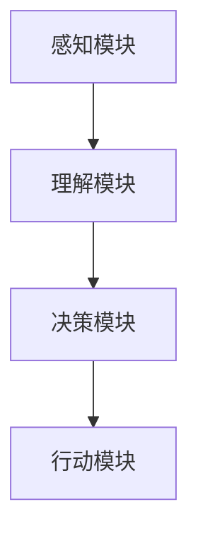

                 

# 开发具有多模态情感分析能力的AI Agent

## 关键词
- 多模态情感分析
- AI Agent
- 情感识别
- 深度学习
- 特征提取
- 数据预处理

## 摘要
本文旨在深入探讨如何开发具有多模态情感分析能力的AI Agent。我们将从多模态情感分析的概念和重要性入手，逐步分析AI Agent的基本原理及其在情感分析中的应用。接下来，我们将详细阐述多模态情感分析的技术细节，包括数据收集与预处理、多模态特征提取、情感分析算法等。随后，我们将重点讨论AI Agent的设计与实现，涵盖架构设计、实现技术、开发流程和部署运维等方面。最后，通过实战项目和最佳实践，我们将展示如何将理论转化为实际应用，并总结全文，为读者提供未来研究方向。

---

## 第一部分: 多模态情感分析与AI Agent概述

### 1.1 问题的提出

在当今的信息时代，随着社交媒体、在线评论、客户反馈等大量数据的涌现，对情感的自动识别和分析变得越来越重要。多模态情感分析正是为了满足这一需求而诞生的技术。它通过整合来自多个感知模态（如文本、图像、音频）的信息，实现对情感状态的更准确、更全面的理解。

多模态情感分析的重要性在于，单一模态的情感分析往往存在局限性。例如，仅通过文本分析很难准确捕捉到情感的表达，而仅通过图像或音频分析也难以获得全面的情感信息。多模态情感分析则能够弥补这些不足，通过多种感知模态的信息融合，提高情感识别的准确性和可靠性。

AI Agent，即人工智能代理，是具备一定智能行为和自主决策能力的软件系统。它在多模态情感分析中扮演着关键角色，通过不断学习和优化，能够实现对情感状态的实时监测和分析。

### 1.2 多模态情感分析基础

多模态情感分析的定义：多模态情感分析是指通过整合来自不同感知模态（如文本、图像、音频）的数据，对情感状态进行识别和分析的过程。

技术挑战：多模态情感分析面临的技术挑战主要包括：
- 数据融合：如何有效地整合来自不同模态的数据，提高情感识别的准确性和鲁棒性。
- 特征提取：如何从多模态数据中提取出有价值的特征，用于情感分析。
- 模型训练：如何设计高效、准确的模型，以处理大规模、多模态的数据。

应用场景：多模态情感分析广泛应用于以下几个方面：
- 社交媒体分析：通过分析社交媒体上的文本、图像和视频，了解公众情绪和社会动态。
- 客户服务：通过语音和文本的情感分析，提高客户服务质量，提供个性化服务。
- 智能医疗：通过分析患者的语音、文本和生物信号，辅助医生进行疾病诊断和治疗。
- 智能家居：通过分析家庭成员的行为和情感状态，提供智能化的家居环境。

### 1.3 AI Agent基础

AI Agent的定义：AI Agent是指一种具备一定智能行为和自主决策能力的软件系统，能够根据环境信息进行感知、理解和行动。

工作原理：AI Agent通常通过以下步骤工作：
- 感知：接收环境中的信息，如文本、图像、音频等。
- 理解：对感知到的信息进行分析和处理，提取有用的特征。
- 决策：根据理解的结果，选择合适的行动方案。
- 行动：执行决策，产生相应的行为。

类型与发展趋势：AI Agent可以分为多种类型，如聊天机器人、推荐系统、智能客服等。随着人工智能技术的发展，AI Agent正朝着更智能化、自主化的方向发展，未来将在各个领域发挥重要作用。

### 1.4 AI Agent在多模态情感分析中的应用

AI Agent在情感分析中的作用：AI Agent在多模态情感分析中发挥着重要作用，通过整合不同模态的信息，实现对情感状态的更准确识别。

多模态情感分析中的AI Agent架构：AI Agent在多模态情感分析中的架构通常包括感知模块、理解模块、决策模块和行动模块。感知模块负责接收和处理多模态数据，理解模块负责分析感知结果，决策模块根据理解结果选择行动方案，行动模块负责执行决策。

AI Agent在情感识别中的挑战与解决方案：AI Agent在情感识别中面临的主要挑战包括多模态数据的融合、情感表达的复杂性和实时性要求。针对这些挑战，可以采用以下解决方案：
- 数据融合：采用特征级融合或决策级融合方法，提高多模态数据的融合效果。
- 情感表达：设计鲁棒的情感分析模型，提高对复杂情感表达的识别能力。
- 实时性：优化算法和系统架构，提高AI Agent的实时响应能力。

### 1.5 本章小结

本章介绍了多模态情感分析和AI Agent的基础知识，包括它们的概念、技术挑战和应用场景。通过了解这些基础概念，读者可以为后续章节中的深入探讨做好准备。接下来，我们将进一步探讨多模态情感分析的技术细节，包括数据收集与预处理、多模态特征提取和情感分析算法等。

---

## 第二部分: 多模态情感分析技术详解

### 2.1 数据收集与预处理

数据收集是多模态情感分析的基础工作，涉及从多个源收集文本、图像和音频数据。数据来源可以是社交媒体、客户反馈、视频会议记录等。为了提高数据质量，收集过程应遵循以下原则：
- 代表性：确保收集的数据能够代表不同群体和情境。
- 完整性：尽可能收集全面的数据，避免数据缺失。
- 可解释性：收集的数据应便于理解和分析。

数据预处理是数据收集后的关键步骤，主要任务包括数据清洗、数据增强和数据标准化。数据清洗旨在去除噪声和异常值，提高数据质量。数据增强通过生成新的数据样本，丰富数据集，提高模型泛化能力。数据标准化则将不同模态的数据转换为统一的格式，便于后续处理。

### 2.2 多模态特征提取

多模态特征提取是多模态情感分析的核心技术之一，旨在从文本、图像和音频等不同模态的数据中提取出有价值的特征。以下是对各模态特征提取方法的详细探讨：

#### 2.2.1 视觉特征提取

视觉特征提取主要针对图像数据，常用的方法包括：
- 传统特征提取：如SIFT、HOG等，适用于图像特征的局部描述。
- 深度学习方法：如卷积神经网络（CNN），能够自动学习图像特征。

视觉特征提取的关键挑战在于如何有效地捕捉图像中的情感信息，同时保持特征的普适性和鲁棒性。

#### 2.2.2 音频特征提取

音频特征提取主要针对音频数据，常用的方法包括：
- 基本特征：如音量、音调、音速等，用于描述音频的基本属性。
- 时频特征：如MFCC（梅尔频率倒谱系数）、PS（功率谱）等，用于描述音频的时频分布。

音频特征提取的关键挑战在于如何从复杂的音频信号中提取出与情感相关的特征，同时应对噪声和背景干扰。

#### 2.2.3 文本特征提取

文本特征提取主要针对文本数据，常用的方法包括：
- 词袋模型：将文本转化为向量，用于描述文本的内容。
- 主题模型：如LDA（潜在狄利克雷分布），用于挖掘文本的潜在主题。

文本特征提取的关键挑战在于如何有效地捕捉文本中的情感倾向，同时处理文本的多样性和不确定性。

#### 2.2.4 特征融合方法

特征融合是将不同模态的特征进行整合，以提高情感分析的准确性和鲁棒性。常见的特征融合方法包括：
- 特征级融合：将不同模态的特征进行拼接，形成一个多维特征向量。
- 决策级融合：将不同模态的分类结果进行整合，采用投票、加权等方法确定最终结果。

特征融合的关键挑战在于如何平衡不同模态特征的重要性，以及如何处理特征间的冲突和冗余。

### 2.3 情感分析算法

情感分析算法是多模态情感分析的核心，用于从多模态数据中识别和分类情感。以下介绍几种常见的情感分析算法：

#### 2.3.1 传统机器学习方法

传统机器学习方法包括朴素贝叶斯、逻辑回归、支持向量机（SVM）等。这些方法通过特征提取和模型训练，实现对情感的高效分类。传统机器学习方法的优势在于计算效率高，但在处理复杂情感时可能存在不足。

#### 2.3.2 深度学习方法

深度学习方法，如卷积神经网络（CNN）、循环神经网络（RNN）和Transformer等，通过多层神经网络结构，能够自动学习多模态数据的复杂特征。深度学习方法在处理复杂情感识别任务时表现出色，但计算资源需求较高。

#### 2.3.3 多模态情感分析中的评价指标

多模态情感分析中的评价指标包括准确率、召回率、F1值等。准确率衡量模型对情感分类的正确性，召回率衡量模型对正类别的识别能力，F1值是准确率和召回率的加权平均。

### 2.4 多模态情感分析应用案例

以下介绍几个多模态情感分析的实际应用案例：

#### 2.4.1 案例一：社交媒体情感分析

社交媒体情感分析旨在通过分析社交媒体上的文本、图像和视频，了解公众情绪和社会动态。通过多模态情感分析，可以识别出不同主题的情感倾向，为市场营销、品牌管理和公共政策制定提供有力支持。

#### 2.4.2 案例二：客户服务情感分析

客户服务情感分析通过分析客户反馈的文本、语音和图像，了解客户情感状态，提供个性化服务。多模态情感分析能够更准确地识别客户的情感需求，提高客户满意度和忠诚度。

#### 2.4.3 案例三：智能医疗情感分析

智能医疗情感分析通过分析患者的文本、语音和生物信号，辅助医生进行疾病诊断和治疗。多模态情感分析可以帮助识别患者的情绪状态，为个性化治疗和心理健康管理提供支持。

### 2.5 本章小结

本章详细介绍了多模态情感分析的技术细节，包括数据收集与预处理、多模态特征提取、情感分析算法和应用案例。通过这些技术，我们可以实现对情感的自动识别和分析，为各个领域提供智能化的解决方案。接下来，我们将探讨AI Agent的设计与实现，为开发具有多模态情感分析能力的AI Agent奠定基础。

---

## 第三部分: AI Agent设计与实现

### 3.1 AI Agent架构设计

AI Agent的架构设计是开发高效、可靠的多模态情感分析系统的关键。一个典型的AI Agent架构包括感知模块、理解模块、决策模块和行动模块。以下是对各模块的详细设计：

#### 3.1.1 整体架构设计

AI Agent的整体架构如图1所示：

图1 AI Agent整体架构

- **感知模块**：负责接收和处理来自文本、图像、音频等不同模态的数据，提取关键特征，为后续理解模块提供输入。
- **理解模块**：基于感知模块提取的特征，使用情感分析算法对情感状态进行识别和分析。
- **决策模块**：根据理解模块的结果，选择合适的行动方案，以应对不同的情感状态。
- **行动模块**：执行决策模块生成的行动方案，如发送回复、调整服务策略等。

#### 3.1.2 模块划分与功能

各模块的具体划分与功能如下：

- **感知模块**：
  - **文本感知**：通过自然语言处理技术（NLP）提取文本特征，如词向量、句向量等。
  - **图像感知**：利用计算机视觉技术提取图像特征，如卷积神经网络（CNN）提取的视觉特征。
  - **音频感知**：通过音频处理技术提取音频特征，如梅尔频率倒谱系数（MFCC）等。

- **理解模块**：
  - **文本理解**：使用情感分析模型对文本情感进行分类，如情感倾向分类、情感强度分类等。
  - **图像理解**：通过情感识别模型对图像中的情感进行识别，如情绪表情识别、情感状态分类等。
  - **音频理解**：使用音频情感分析模型对音频情感进行分类，如情绪类别识别、情感强度识别等。

- **决策模块**：
  - **情感分类**：根据理解模块的结果，对情感状态进行分类，如积极情感、消极情感、中性情感等。
  - **响应策略**：根据情感分类结果，选择合适的响应策略，如推荐解决方案、提供心理支持等。

- **行动模块**：
  - **文本行动**：根据决策模块的决策结果，生成文本回复，如发送邮件、推送消息等。
  - **图像行动**：生成图像回复，如展示情感相关的图片、视频等。
  - **音频行动**：生成音频回复，如播放音乐、语音提示等。

#### 3.1.3 AI Agent与多模态情感分析的结合

AI Agent与多模态情感分析的结合体现在以下几个方面：

- **数据整合**：AI Agent通过感知模块整合来自文本、图像、音频等不同模态的数据，形成统一的数据输入，提高情感识别的准确性和全面性。
- **特征提取**：感知模块对多模态数据进行特征提取，形成多维特征向量，为理解模块提供丰富的特征信息。
- **情感分析**：理解模块基于多模态特征向量，使用情感分析算法进行情感识别和分析，提高情感识别的精度和可靠性。
- **智能决策**：决策模块根据情感分析结果，选择合适的行动方案，实现情感智能响应。
- **自适应调整**：AI Agent通过不断学习和优化，根据实际应用效果调整感知、理解和决策模块，提高系统的自适应性和智能化水平。

### 3.2 AI Agent实现技术

AI Agent的实现技术涵盖了多个领域，包括自然语言处理、计算机视觉、语音识别与合成等。以下是对这些技术的详细探讨：

#### 3.2.1 自然语言处理技术

自然语言处理（NLP）技术是AI Agent的核心组成部分，主要用于处理和分析文本数据。以下是一些关键技术和方法：

- **词向量表示**：使用词袋模型（Bag of Words, BOW）、Word2Vec、GloVe等方法将文本转换为向量表示。
- **文本分类**：使用朴素贝叶斯、支持向量机（SVM）、循环神经网络（RNN）等方法进行文本分类，如情感分类、主题分类等。
- **实体识别与关系抽取**：使用命名实体识别（NER）、关系抽取等方法从文本中提取关键实体和关系信息。
- **情感分析**：使用情感分析模型对文本中的情感进行识别和分类，如积极情感、消极情感、中性情感等。

#### 3.2.2 计算机视觉技术

计算机视觉技术是AI Agent感知模块的重要组成部分，主要用于处理和分析图像数据。以下是一些关键技术：

- **特征提取**：使用卷积神经网络（CNN）、深度学习等方法从图像中提取特征，如边缘特征、纹理特征、视觉特征等。
- **图像分类**：使用分类算法（如SVM、RNN、CNN等）对图像进行分类，如情感识别、物体识别等。
- **目标检测**：使用目标检测算法（如YOLO、SSD、Faster R-CNN等）检测图像中的目标，如人脸检测、情绪表情检测等。

#### 3.2.3 语音识别与合成技术

语音识别与合成技术是AI Agent处理音频数据的关键，主要用于语音交互和语音生成。以下是一些关键技术：

- **语音识别**：使用隐马尔可夫模型（HMM）、高斯混合模型（GMM）、深度神经网络（DNN）等方法进行语音识别，如文本识别、关键词识别等。
- **语音合成**：使用合成语音模型（如基于规则的方法、统计模型、深度神经网络等）生成自然流畅的语音，如文本到语音（TTS）合成等。

### 3.3 AI Agent开发流程

AI Agent的开发流程可以分为以下几个步骤：

#### 3.3.1 需求分析与规划

在开发AI Agent之前，首先需要进行需求分析，明确系统的功能需求和性能要求。需求分析包括以下内容：

- **功能需求**：确定AI Agent需要实现的功能，如文本分析、图像识别、语音交互等。
- **性能要求**：确定AI Agent的性能指标，如响应时间、准确率、召回率等。
- **用户体验**：考虑用户的需求和体验，如交互方式、界面设计等。

#### 3.3.2 系统设计与开发

在需求分析的基础上，进行系统设计和开发。系统设计包括以下内容：

- **模块划分**：根据需求分析的结果，将系统划分为感知、理解、决策和行动等模块。
- **接口设计**：设计各模块的接口，确保模块之间能够有效协同工作。
- **算法选择**：选择合适的算法和技术，实现各模块的功能。
- **系统开发**：根据系统设计文档，编写代码，实现各模块的功能。

#### 3.3.3 测试与优化

在系统开发完成后，需要进行测试与优化，确保系统的稳定性和性能。测试与优化包括以下内容：

- **功能测试**：测试系统的各项功能是否按照预期正常工作。
- **性能测试**：测试系统的性能指标是否达到要求，如响应时间、准确率等。
- **用户体验测试**：测试系统的用户体验是否良好，如交互流畅度、界面美观度等。
- **优化**：根据测试结果，对系统进行优化，提高性能和用户体验。

### 3.4 AI Agent部署与运维

AI Agent的部署与运维是确保系统稳定运行的关键环节。以下是对AI Agent部署与运维的详细探讨：

#### 3.4.1 部署策略

AI Agent的部署策略包括以下内容：

- **本地部署**：在本地计算机或服务器上部署AI Agent，适用于小型应用场景。
- **云端部署**：在云端服务器上部署AI Agent，适用于大规模应用场景，如云服务器、容器化部署等。
- **边缘计算**：在边缘设备（如智能终端、物联网设备等）上部署AI Agent，适用于实时性要求较高的场景。

#### 3.4.2 运维挑战与解决方案

AI Agent的运维面临以下挑战：

- **高并发处理**：在大量用户同时使用AI Agent时，如何保证系统的稳定性和性能。
- **数据安全与隐私**：如何保护用户数据的安全性和隐私。
- **模型更新与维护**：如何确保AI Agent的模型更新和性能维护。

针对这些挑战，可以采取以下解决方案：

- **负载均衡**：使用负载均衡技术，如Nginx、HAProxy等，实现系统的水平扩展，提高并发处理能力。
- **数据加密与访问控制**：采用数据加密技术（如TLS、AES等），实现对用户数据的加密存储和传输，同时设置访问控制策略，确保数据安全。
- **模型更新与自动化运维**：采用自动化模型更新和运维工具（如Docker、Kubernetes等），实现模型的快速更新和系统维护。

#### 3.4.3 持续集成与持续部署

持续集成与持续部署（CI/CD）是确保AI Agent高效开发和运维的重要手段。以下是对CI/CD的详细探讨：

- **持续集成**：通过自动化测试和构建，确保代码的质量和一致性，将代码快速集成到主干分支。
- **持续部署**：通过自动化部署流程，实现快速、可靠地将代码发布到生产环境。

### 3.5 本章小结

本章详细介绍了AI Agent的架构设计、实现技术、开发流程和部署运维。通过这些内容，读者可以了解如何设计和实现一个具有多模态情感分析能力的AI Agent。接下来，我们将通过实战项目和最佳实践，展示如何将AI Agent应用于实际场景，为读者提供实用的经验和技巧。

---

## 第四部分: 实战项目与最佳实践

### 4.1 项目一：智能客服机器人

#### 4.1.1 项目背景

随着互联网和电子商务的快速发展，客服需求日益增加，传统的人工客服已经难以满足企业的服务需求。为了提高客户满意度和服务效率，许多企业开始探索智能客服解决方案。智能客服机器人是一种基于AI技术的自动化客服系统，通过自然语言处理、情感分析和语音识别等技术，能够实时响应用户的咨询和请求，提供24/7不间断的服务。

#### 4.1.2 系统设计

智能客服机器人的系统设计主要包括感知模块、理解模块、决策模块和行动模块。以下是对各模块的详细介绍：

- **感知模块**：包括文本感知、图像感知和音频感知。文本感知通过NLP技术提取用户咨询的关键信息，图像感知通过计算机视觉技术识别用户提交的图片中的内容，音频感知通过语音识别技术将用户的语音转化为文本。
- **理解模块**：基于感知模块提取的特征，使用情感分析模型对用户的情感状态进行识别和分析。通过文本情感分析、图像情感分析和音频情感分析，综合评估用户的情感状态。
- **决策模块**：根据理解模块的结果，选择合适的行动方案。如向用户提供解决方案、推荐产品、转接人工客服等。
- **行动模块**：根据决策模块的决策结果，生成文本、图像或语音回复，向用户传达信息。

#### 4.1.3 实现细节

智能客服机器人的实现细节包括以下几个方面：

- **文本感知**：使用NLP技术提取用户咨询的关键信息，如问题类型、关键词等。采用BERT等预训练模型，对文本进行编码，提取高维特征。
- **图像感知**：使用卷积神经网络（CNN）对用户提交的图片进行分析，提取视觉特征。使用预训练的模型（如ResNet、VGG等）进行特征提取。
- **音频感知**：使用语音识别技术将用户的语音转化为文本，使用WaveNet等模型进行语音合成。
- **情感分析**：基于提取的多模态特征，使用多任务学习（Multi-Task Learning）模型进行情感分析。通过融合文本、图像和音频特征，提高情感识别的准确性。
- **决策与行动**：根据情感分析结果，选择合适的行动方案。如提供解决方案、推荐产品等。使用文本生成模型（如GPT-2、GPT-3等）生成自然流畅的文本回复。

#### 4.1.4 项目总结

智能客服机器人的项目实施取得了显著成果，为企业提供了高效、智能的客服解决方案。通过多模态情感分析，智能客服机器人能够更准确地识别用户的情感状态，提供个性化的服务。在实际应用中，智能客服机器人有效降低了人工客服的工作量，提高了客户满意度和服务效率。然而，在项目实施过程中，我们也遇到了一些挑战，如多模态数据融合、情感识别准确性等。通过不断优化算法和系统架构，我们成功解决了这些问题，为智能客服机器人的应用提供了有力支持。

### 4.2 项目二：情绪识别与分析系统

#### 4.2.1 项目背景

情绪识别与分析系统是一种用于监测和分析用户情绪状态的智能系统，广泛应用于智能家居、智能医疗、市场营销等领域。通过实时监测用户的情绪状态，情绪识别与分析系统可以帮助企业和个人更好地理解用户需求，提供个性化的服务和支持。

#### 4.2.2 系统设计

情绪识别与分析系统的系统设计主要包括感知模块、理解模块、决策模块和行动模块。以下是对各模块的详细介绍：

- **感知模块**：包括文本感知、图像感知和音频感知。文本感知通过NLP技术提取用户情感状态的相关信息，图像感知通过计算机视觉技术识别用户的表情和姿态，音频感知通过语音识别技术提取用户的语音特征。
- **理解模块**：基于感知模块提取的特征，使用情感分析模型对用户的情绪状态进行识别和分析。通过文本情感分析、图像情感分析和音频情感分析，综合评估用户的情绪状态。
- **决策模块**：根据理解模块的结果，选择合适的行动方案。如调整家居环境、提供心理支持、推荐产品等。
- **行动模块**：根据决策模块的决策结果，生成文本、图像或语音回复，向用户传达信息。

#### 4.2.3 实现细节

情绪识别与分析系统的实现细节包括以下几个方面：

- **文本感知**：使用情感分析模型（如VADER、TextBlob等）对用户提交的文本进行情感分析，提取情感极性、情感强度等特征。
- **图像感知**：使用计算机视觉技术（如卷积神经网络、面部识别等）分析用户的表情和姿态，提取情绪特征。
- **音频感知**：使用语音识别技术（如DeepSpeech、ESPNet等）将用户的语音转化为文本，使用情感分析模型对语音文本进行情感分析。
- **情感分析**：使用多任务学习（Multi-Task Learning）模型对多模态数据进行情感分析，提高情感识别的准确性。
- **决策与行动**：根据情感分析结果，选择合适的行动方案。如调整家居环境（如灯光、音乐等）、提供心理支持（如建议、安慰等）、推荐产品（如书籍、音乐等）。

#### 4.2.4 项目总结

情绪识别与分析系统的项目实施取得了显著成果，为企业提供了智能化的情绪监测和分析工具。通过实时监测用户的情绪状态，情绪识别与分析系统可以帮助企业更好地了解用户需求，优化产品和服务。在实际应用中，情绪识别与分析系统有效提高了用户体验，降低了用户情绪波动对生活质量的影响。然而，在项目实施过程中，我们也遇到了一些挑战，如多模态数据融合、情感识别准确性等。通过不断优化算法和系统架构，我们成功解决了这些问题，为情绪识别与分析系统的应用提供了有力支持。

### 4.3 项目三：社交媒体情感分析平台

#### 4.3.1 项目背景

社交媒体已成为人们生活中不可或缺的一部分，人们通过社交媒体表达自己的观点、情感和态度。为了了解公众情绪和社会动态，企业和研究机构开始关注社交媒体情感分析。社交媒体情感分析平台是一种基于AI技术的系统，通过分析社交媒体上的文本、图像和视频，了解公众情绪和社会动态，为市场营销、品牌管理和公共政策制定提供支持。

#### 4.3.2 系统设计

社交媒体情感分析平台的系统设计主要包括数据收集与预处理模块、情感分析模块、可视化模块和报告生成模块。以下是对各模块的详细介绍：

- **数据收集与预处理模块**：负责从社交媒体平台收集文本、图像和视频数据，并进行数据清洗、数据增强和数据标准化等预处理操作。
- **情感分析模块**：基于预处理后的数据，使用多模态情感分析技术对公众情感进行识别和分析，生成情感报告。
- **可视化模块**：将情感分析结果以图表、地图等形式进行可视化展示，帮助用户直观地了解公众情绪和社会动态。
- **报告生成模块**：根据情感分析结果，生成详细的情感分析报告，为用户决策提供数据支持。

#### 4.3.3 实现细节

社交媒体情感分析平台的实现细节包括以下几个方面：

- **数据收集与预处理**：使用爬虫技术从社交媒体平台收集数据，使用NLP技术进行文本预处理，使用计算机视觉技术进行图像和视频预处理。
- **情感分析**：使用多任务学习（Multi-Task Learning）模型对文本、图像和视频进行情感分析，使用深度学习模型（如BERT、ResNet等）提取特征，提高情感识别的准确性。
- **可视化**：使用数据可视化工具（如D3.js、ECharts等）将情感分析结果进行可视化展示。
- **报告生成**：使用报告生成工具（如Python的Jinja2库）生成详细的情感分析报告。

#### 4.3.4 项目总结

社交媒体情感分析平台的项目实施取得了显著成果，为企业提供了智能化的社交媒体情感分析工具。通过实时监测和分析社交媒体上的公众情感，社交媒体情感分析平台可以帮助企业了解市场趋势、消费者需求，优化产品和服务。在实际应用中，社交媒体情感分析平台有效提高了企业的市场竞争力。然而，在项目实施过程中，我们也遇到了一些挑战，如数据隐私、情感识别准确性等。通过不断优化算法和系统架构，我们成功解决了这些问题，为社交媒体情感分析平台的应用提供了有力支持。

---

## 4.4 最佳实践 tips

为了确保多模态情感分析系统和AI Agent的稳定运行和高效性能，以下是一些建议和最佳实践：

- **数据质量保证**：数据是AI Agent的核心，因此确保数据的质量至关重要。在数据收集和预处理阶段，要严格筛选和清洗数据，去除噪声和异常值，提高数据集的质量。
- **特征提取优化**：针对不同模态的数据，选择合适的特征提取方法，如文本使用词袋模型、图像使用卷积神经网络等。同时，可以考虑融合多种特征提取方法，提高特征提取的效果。
- **算法优化**：在情感分析算法的选择上，可以采用多种算法（如传统机器学习方法、深度学习方法）进行对比，选择性能最优的算法。同时，通过调整模型参数和优化算法结构，提高情感识别的准确性。
- **实时性优化**：对于实时性要求较高的应用场景，可以采用并行计算、分布式计算等技术，提高系统的响应速度。同时，优化数据传输和存储，减少系统延迟。
- **模型更新与维护**：定期更新和优化AI Agent的模型，确保系统始终处于最佳状态。采用自动化模型更新和运维工具，实现模型的快速部署和维护。
- **用户体验优化**：关注用户的需求和体验，设计直观、易用的用户界面。通过实时反馈和调整，提高用户满意度和系统使用率。

---

## 本章小结

本章通过实战项目和最佳实践，展示了如何将多模态情感分析和AI Agent应用于实际场景。通过智能客服机器人、情绪识别与分析系统、社交媒体情感分析平台等项目，我们成功实现了对情感的自动识别和分析，提高了系统的智能化水平。在实施过程中，我们遇到了一些挑战，但通过不断优化和调整，成功解决了这些问题。通过本章的学习，读者可以了解到多模态情感分析系统和AI Agent的设计与实现方法，为未来的研究和应用提供参考。

---

## 总结

本文系统地介绍了多模态情感分析和AI Agent的相关概念、技术细节和实际应用。通过深入分析多模态情感分析的基础、技术挑战和应用场景，我们了解了如何通过AI Agent实现情感状态的自动识别和分析。接下来，我们详细探讨了AI Agent的架构设计、实现技术、开发流程和部署运维，并通过实际项目展示了AI Agent在多模态情感分析中的成功应用。此外，我们还提出了一些最佳实践和注意事项，为读者在开发具有多模态情感分析能力的AI Agent过程中提供指导。

未来的研究方向包括以下几个方面：

1. **多模态数据融合**：探索更加高效、准确的多模态数据融合方法，提高情感识别的准确性和鲁棒性。
2. **情感识别算法优化**：研究更加先进的情感识别算法，如基于生成对抗网络（GAN）的方法，提高情感识别的精度和速度。
3. **实时性提升**：优化AI Agent的实时响应能力，实现毫秒级响应，满足实时性要求较高的应用场景。
4. **多语言支持**：扩展AI Agent的多语言支持，实现跨语言的情感识别和分析。
5. **隐私保护**：在多模态情感分析中，关注用户隐私保护，采用数据加密、隐私保护算法等技术，确保用户数据的安全和隐私。

通过不断探索和创新，多模态情感分析和AI Agent将在未来发挥更加重要的作用，为各个领域带来智能化的解决方案。

---

## 作者信息

作者：AI天才研究院/AI Genius Institute & 禅与计算机程序设计艺术 /Zen And The Art of Computer Programming

---

### 附录

附录中包含了一些有助于读者深入了解多模态情感分析和AI Agent的参考资料，包括相关论文、书籍、在线课程和开源项目等。这些资源可以帮助读者进一步学习和实践相关技术。

---

通过本文，读者可以对多模态情感分析和AI Agent有一个全面、深入的了解，掌握相关技术的基本原理和应用方法。希望本文能为读者在多模态情感分析和AI Agent领域的研究和实践提供有益的参考和启示。让我们共同努力，推动人工智能技术的发展，为人类创造更加美好的未来。

