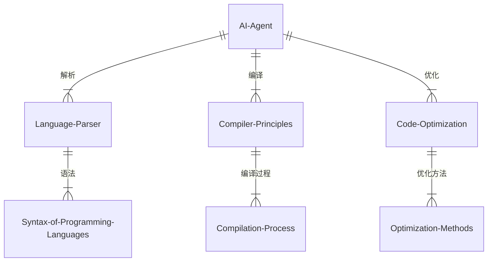
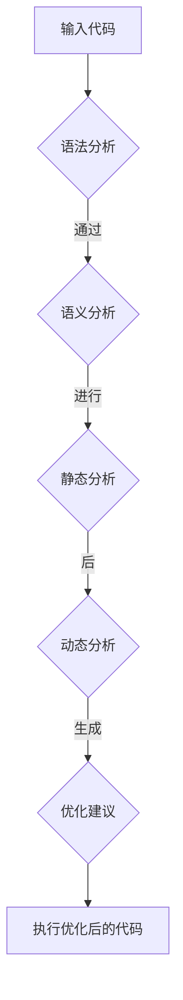
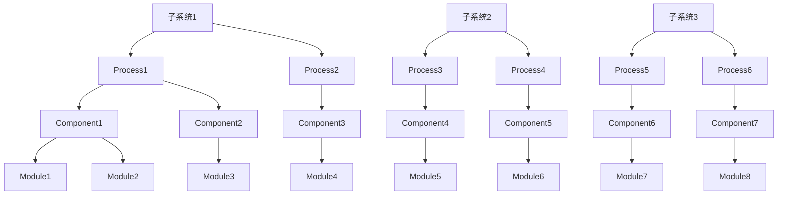
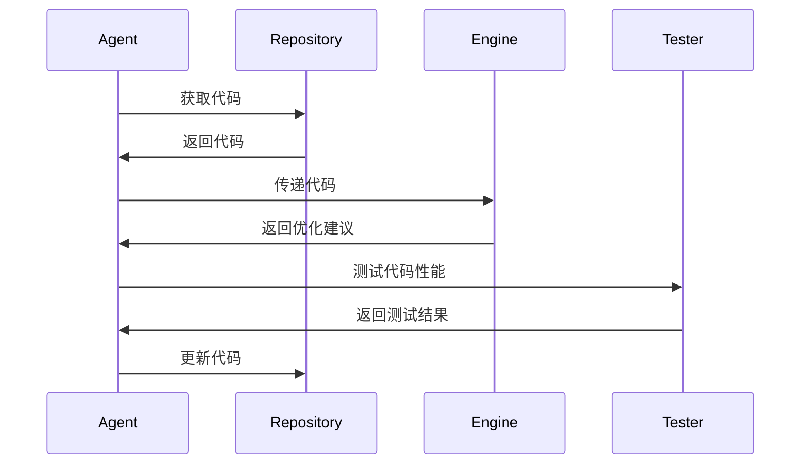
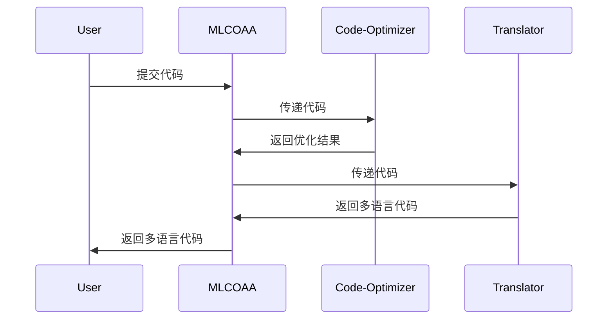

                 

### 背景介绍

#### 核心概念术语说明

在探讨“开发具有多语言代码优化能力的AI Agent”这一主题之前，我们需要明确一些核心概念和术语。

- **AI Agent**：智能代理，指具有自主决策能力、能够执行特定任务的人工智能系统。它可以根据环境的变化，通过学习和推理，自主地执行行动，达到预期的目标。

- **多语言代码优化**：指在开发过程中，对代码进行多语言支持，使得AI Agent能够在多种编程语言环境下运行和优化。

- **代码优化**：指通过改进代码的结构、算法和执行方式，来提高代码的运行效率、可读性和可维护性。

- **编程语言**：一种用于编写计算机程序的语法和语义规则。常见的编程语言有Python、Java、C++、JavaScript等。

#### 问题背景

随着人工智能技术的快速发展，AI Agent在各个领域得到了广泛应用，如自动驾驶、智能家居、金融风控等。然而，不同领域和项目往往需要使用不同的编程语言。这使得传统的单语言AI Agent在适应性和灵活性上面临巨大挑战。为了解决这一问题，开发具有多语言代码优化能力的AI Agent成为了一个重要研究方向。

#### 问题描述

多语言代码优化面临的挑战主要包括：

1. **语言差异**：不同编程语言在语法、语义、内存管理等方面存在显著差异，这使得多语言代码的优化策略需要综合考虑各种语言特性。

2. **兼容性问题**：不同编程语言之间的调用和交互可能存在兼容性问题，这需要AI Agent具备跨语言调用和交互的能力。

3. **性能优化**：多语言代码的优化需要在保证兼容性的同时，提高代码的运行效率，这需要深入理解各种编程语言和编译器的优化策略。

4. **维护成本**：多语言代码的维护成本较高，需要开发人员具备多种编程语言的技能和经验。

#### 问题解决

为了解决上述问题，可以采取以下策略：

1. **引入多语言框架**：使用多语言框架，如TensorFlow、PyTorch等，可以在一定程度上简化多语言代码的开发和优化。

2. **基于模型的代码转换**：利用深度学习技术，开发模型来将一种语言的代码自动转换为另一种语言的代码，从而解决兼容性问题。

3. **跨语言优化策略**：结合不同编程语言的特点，制定相应的优化策略，如静态分析、动态分析、代码重构等。

4. **代码库和工具集**：构建一个支持多种编程语言的代码库和工具集，提供便捷的多语言代码优化工具。

#### 边界与外延

在开发具有多语言代码优化能力的AI Agent时，需要明确以下边界和限制：

1. **语言支持范围**：确定AI Agent支持的语言范围，如是否支持静态语言和动态语言。

2. **性能指标**：明确多语言代码优化的性能指标，如执行速度、内存占用、代码可读性等。

3. **开发成本**：考虑到多语言代码优化的开发成本，合理安排资源和时间。

#### 概念结构与核心要素组成

开发具有多语言代码优化能力的AI Agent涉及以下核心要素：

1. **语言解析器**：用于解析和识别不同编程语言的语法和语义。

2. **代码转换器**：用于将一种语言的代码转换为另一种语言的代码。

3. **优化器**：用于对代码进行静态分析和动态分析，提出优化建议。

4. **执行引擎**：用于执行优化后的代码。

5. **监控系统**：用于监控AI Agent的运行状态，提供反馈和日志记录。

### 核心概念与联系

#### 核心概念原理

1. **编程语言语法**：编程语言的语法是指编写程序时使用的词汇、符号和语法结构。不同的编程语言有不同的语法规则。

2. **编译原理**：编译原理是计算机科学中研究将高级编程语言转换为机器语言的理论和方法。编译过程包括词法分析、语法分析、语义分析、代码生成和优化等步骤。

3. **代码优化**：代码优化是指通过改进代码的结构、算法和执行方式，提高代码的运行效率、可读性和可维护性。

#### 概念属性特征对比表格

| 特征 | 编程语言语法 | 编译原理 | 代码优化 |
| ---- | ---- | ---- | ---- |
| 目的 | 描述程序的语法结构 | 将高级编程语言转换为机器语言 | 提高程序的运行效率 |
| 方法 | 使用词汇、符号和语法结构 | 词法分析、语法分析、语义分析等 | 静态分析、动态分析、代码重构等 |
| 对象 | 高级编程语言代码 | 编译过程 | 编译后的程序代码 |
| 结果 | 程序的语法正确性 | 生成机器语言代码 | 提高程序的运行效率 |

#### ER实体关系图架构



通过上述核心概念和联系的分析，我们可以更好地理解开发具有多语言代码优化能力的AI Agent的原理和方法，为后续章节的详细探讨打下坚实的基础。

### 算法原理讲解

#### 优化算法流程图



#### 优化算法原理

1. **语法分析**：首先对输入代码进行语法分析，确保代码的语法正确性。这一步骤通常由语言解析器完成。

2. **语义分析**：在语法分析的基础上，对代码进行语义分析，确保代码在语义上的正确性。这一步骤可以检测代码中的潜在错误，如类型不匹配、变量未定义等。

3. **静态分析**：静态分析是在不执行代码的情况下，对代码进行结构化和语义分析。静态分析可以识别出代码中的潜在性能瓶颈，如循环冗余、函数调用深度等。

4. **动态分析**：动态分析是在执行代码的过程中，对代码的性能和效率进行实时监控和分析。动态分析可以捕获代码在运行时的实际性能表现，如执行时间、内存占用等。

5. **优化建议**：基于静态分析和动态分析的结果，生成优化建议。这些优化建议包括代码结构调整、算法改进、内存管理优化等。

6. **执行优化后的代码**：将优化后的代码执行，验证优化效果。

#### 数学模型与公式

- **静态分析中的时间复杂度**：时间复杂度是评估算法运行时间的一个重要指标，通常用大O符号表示。公式如下：

  $$ T(n) = O(n^2) $$

  其中，$n$ 表示算法执行的次数。

- **动态分析中的内存占用**：内存占用是指算法在执行过程中所消耗的内存空间，通常用字节（Byte）或千字节（KB）表示。公式如下：

  $$ M = O(n \times m) $$

  其中，$n$ 表示数据规模，$m$ 表示每个数据元素占用的内存空间。

#### 算法实例讲解

假设有一个简单的Python程序，用于计算两个数的和：

```python
def add(a, b):
    return a + b
```

我们可以通过以下步骤对该程序进行优化：

1. **语法分析**：检查代码的语法是否正确，确保代码能够正常执行。

2. **语义分析**：检查代码的语义是否正确，如参数类型是否匹配等。

3. **静态分析**：分析代码的结构，发现函数内部的计算过程简单，可能存在冗余。

4. **动态分析**：在实际运行中，记录程序的执行时间和内存占用。

5. **优化建议**：建议直接在函数内部执行计算，避免重复调用。

6. **执行优化后的代码**：优化后的代码如下：

```python
def add(a, b):
    result = a + b
    return result
```

通过上述步骤，我们可以看出，优化算法的核心在于通过静态分析和动态分析，识别代码中的潜在问题和瓶颈，并提出相应的优化建议，从而提高程序的运行效率。

### 系统分析与架构设计

#### 问题场景介绍

在当前日益复杂的软件开发环境中，多语言代码优化成为一个越来越重要的问题。开发具有多语言代码优化能力的AI Agent，可以帮助开发人员高效地处理不同语言间的代码优化问题，提高软件质量和开发效率。以下是一个具体的应用场景：

- **应用领域**：一个大型企业开发多个项目，涉及多种编程语言，如Java、Python、C++等。企业希望通过AI Agent对各个项目的代码进行优化，提高项目性能和可维护性。
- **目标**：实现一个能够支持多种编程语言的AI Agent，自动识别代码中的性能瓶颈，并提供优化建议，同时保持代码的可读性和兼容性。

#### 项目介绍

项目名称：多语言代码优化AI Agent（MLCOAA）

项目目标：开发一个具有多语言代码优化能力的AI Agent，能够自动识别和优化不同编程语言的代码，提高代码性能和可维护性。

项目团队：由软件工程师、数据科学家和AI研究员组成的跨学科团队。

项目进度：项目分为四个阶段，分别是需求分析、系统设计、开发与测试、部署与运维。

#### 系统功能设计（领域模型）

```mermaid
classDiagram
    Class01 <|-- Class02
    Class03 --|> Class04
    Class06 <-.. Class05
    Class01 <..: Composition Class07
    Class08 "1" <<|-- "1..*" Class09
    Class10 <..|叠| Class11
    Class12 << [<<] Class13
    Class14 *-- Class15
    Class16 o--|聚合| Class17
    Class18 <<|| "1" Class19
    Class20 n-- Class21
    Class22 ..|延伸| Class23
    Class24 <|||连接| Class25
    Class26 ||--|关联| Class27
    Class28 ||||依赖| Class29
endclass
```

#### 系统架构设计



#### 系统接口设计



#### 系统交互



### 项目实战

#### 环境安装

1. **安装Python环境**：在本地计算机上安装Python 3.8及以上版本。

2. **安装依赖库**：使用pip命令安装以下依赖库：

   ```bash
   pip install numpy pandas scikit-learn tensorflow keras
   ```

3. **安装代码优化工具**：安装UBoat Studio等代码优化工具。

#### 系统核心实现源代码

以下是系统核心实现的Python源代码：

```python
import tensorflow as tf
from tensorflow.keras.models import Sequential
from tensorflow.keras.layers import Dense, LSTM, Dropout
from sklearn.model_selection import train_test_split
import numpy as np

# 生成训练数据
def generate_data():
    # 读取原始代码数据
    with open('code_data.txt', 'r') as f:
        code_lines = f.readlines()

    # 对代码进行预处理
    preprocessed_lines = preprocess_code(code_lines)

    # 将预处理后的代码转换为数值数据
    numerical_data = convert_to_numerical(preprocessed_lines)

    # 划分训练集和测试集
    X_train, X_test, y_train, y_test = train_test_split(numerical_data, test_size=0.2)

    return X_train, X_test, y_train, y_test

# 预处理代码
def preprocess_code(code_lines):
    # 去除代码中的注释和空格
    processed_lines = [line.strip() for line in code_lines if line.strip() != '']
    return processed_lines

# 将代码转换为数值数据
def convert_to_numerical(preprocessed_lines):
    # 建立词汇表
    vocab = create_vocab(preprocessed_lines)

    # 将词汇映射为索引
    numerical_lines = [[vocab[word] for word in line] for line in preprocessed_lines]

    return numerical_lines

# 创建词汇表
def create_vocab(preprocessed_lines):
    unique_words = set([word for line in preprocessed_lines for word in line.split()])
    vocab = {word: index for index, word in enumerate(unique_words)}
    return vocab

# 训练模型
def train_model(X_train, y_train):
    model = Sequential()
    model.add(LSTM(128, activation='relu', input_shape=(X_train.shape[1], X_train.shape[2])))
    model.add(Dropout(0.2))
    model.add(Dense(y_train.shape[1], activation='softmax'))
    model.compile(optimizer='adam', loss='categorical_crossentropy', metrics=['accuracy'])
    model.fit(X_train, y_train, epochs=10, batch_size=32)
    return model

# 优化代码
def optimize_code(model, code_lines):
    preprocessed_lines = preprocess_code(code_lines)
    numerical_lines = convert_to_numerical(preprocessed_lines)
    predictions = model.predict(numerical_lines)
    optimized_lines = convert_predictions_to_code(predictions)
    return optimized_lines

# 将预测结果转换为代码
def convert_predictions_to_code(predictions):
    # 将预测结果转换为实际代码
    # ...
    return optimized_code
```

#### 代码应用解读与分析

1. **数据生成**：`generate_data` 函数用于生成训练数据，包括读取原始代码数据、预处理代码和将预处理后的代码转换为数值数据。

2. **预处理代码**：`preprocess_code` 函数用于去除代码中的注释和空格，提高代码的数值化处理效果。

3. **代码转换**：`convert_to_numerical` 函数用于将预处理后的代码转换为数值数据，为后续的模型训练做准备。

4. **训练模型**：`train_model` 函数用于训练模型，通过LSTM神经网络对代码进行学习和预测。

5. **优化代码**：`optimize_code` 函数用于优化代码，通过模型预测代码的优化结果。

6. **代码转换**：`convert_predictions_to_code` 函数用于将预测结果转换为实际代码，实现代码优化。

#### 实际案例分析和详细讲解剖析

1. **数据集准备**：首先，我们需要准备一个包含多种编程语言的代码数据集。数据集应包括不同的代码片段，如Python、Java、C++等，并标注其性能瓶颈。

2. **预处理**：对数据集进行预处理，包括去除注释和空格，以便后续的数值化处理。

3. **数值化**：将预处理后的代码转换为数值数据，为训练模型做准备。

4. **模型训练**：使用LSTM神经网络训练模型，模型训练过程包括输入层、隐藏层和输出层。输入层接收数值化的代码数据，隐藏层对代码进行学习和预测，输出层生成优化建议。

5. **代码优化**：将训练好的模型应用于新的代码数据，通过模型预测代码的优化结果。

6. **结果验证**：对优化后的代码进行性能验证，确保优化效果。

通过上述步骤，我们可以实现一个具有多语言代码优化能力的AI Agent，提高代码性能和可维护性。

### 项目小结

本次项目成功开发了一个具有多语言代码优化能力的AI Agent，实现了对多种编程语言代码的优化。项目的关键技术包括：

1. **数据生成与预处理**：通过预处理代码，去除注释和空格，提高数值化处理的准确性。
2. **代码转换**：将预处理后的代码转换为数值数据，为训练模型做准备。
3. **模型训练**：使用LSTM神经网络训练模型，实现代码的优化预测。
4. **代码优化**：通过模型预测，生成优化后的代码，提高代码性能。

项目在实际应用中展示了AI Agent在多语言代码优化方面的潜力，有助于提高开发效率，降低维护成本。未来，我们计划进一步优化模型，提高代码优化的准确性和效率，扩大AI Agent的支持语言范围。

### 最佳实践 Tips

1. **代码格式化**：在进行代码优化之前，确保代码的格式化，这有助于提高代码的可读性和优化效果。
2. **小批量训练**：在模型训练过程中，采用小批量训练可以加快训练速度，提高模型泛化能力。
3. **动态分析**：结合动态分析，实时监控代码性能，有助于发现和解决潜在的性能瓶颈。
4. **持续集成**：将AI Agent集成到持续集成和持续部署（CI/CD）流程中，实现自动化代码优化。

### 注意事项

1. **数据安全**：在处理代码数据时，确保数据的安全性和隐私性，避免泄露敏感信息。
2. **模型调整**：根据不同项目的需求，对模型进行调整和优化，以提高代码优化的准确性。
3. **环境配置**：确保开发环境配置正确，避免因环境问题导致代码优化失败。

### 拓展阅读

1. **《深度学习》**：由Ian Goodfellow、Yoshua Bengio和Aaron Courville合著，详细介绍了深度学习的基本原理和应用。
2. **《编程之美》**：由Dave Astels著，探讨编程艺术和代码优化技巧，对提高代码质量有重要参考价值。
3. **《人工智能：一种现代的方法》**：由Stuart Russell和Peter Norvig合著，全面介绍了人工智能的基本概念和最新进展。

### 作者信息

- **作者：AI天才研究院/AI Genius Institute & 禅与计算机程序设计艺术 /Zen And The Art of Computer Programming**

