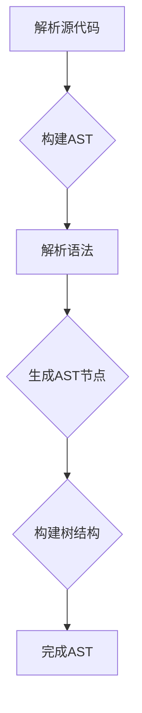
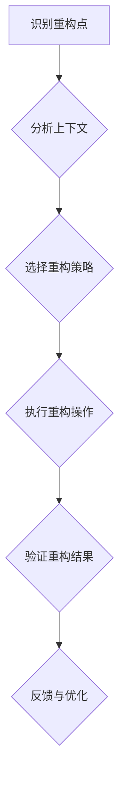
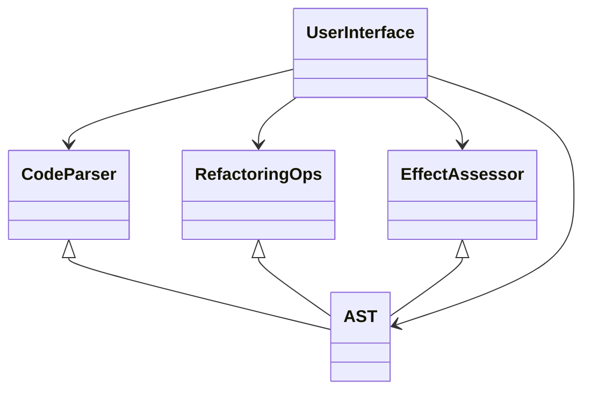
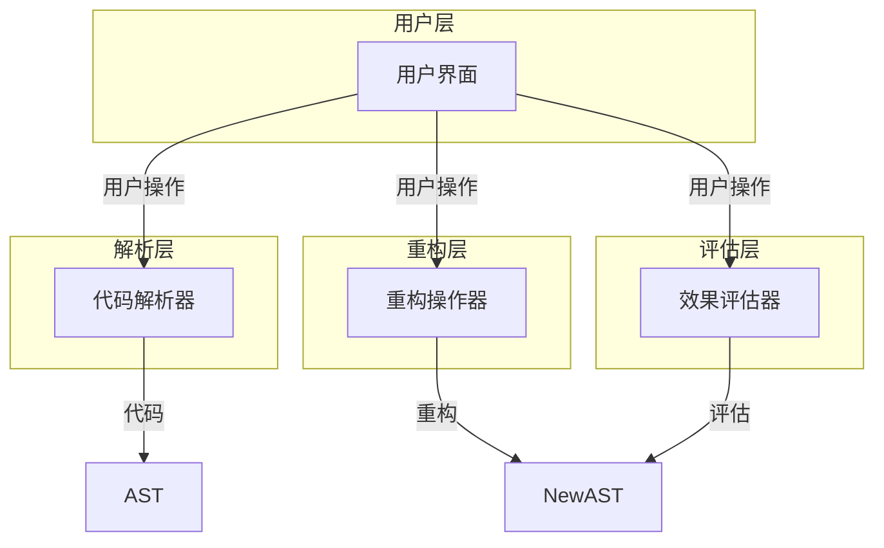
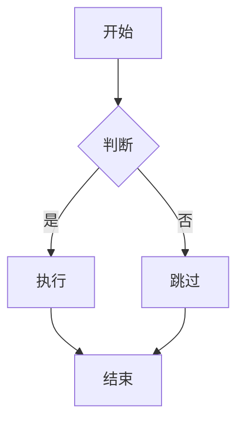

                 


### 引言

在当今快速发展的软件行业中，代码的重构是一个不可忽视的重要环节。随着软件项目的复杂性日益增加，代码的重构不仅有助于提升代码的可读性和可维护性，还能提高开发效率。特别是在多语言编程环境中，代码的重构任务变得更加复杂和繁重。为了应对这一挑战，开发具有多语言代码重构能力的AI Agent显得尤为重要。本文将深入探讨这一主题，从核心概念、算法原理、系统架构到实际应用，逐步分析并阐述如何开发出这样一款强大的AI Agent。

### 问题背景与核心概念

#### 代码重构的需求与挑战

代码重构是指在保持原有功能不变的情况下，对代码进行修改，以提高其可读性、可维护性和性能。在单一语言的编程环境中，代码重构相对简单，但多语言环境下的代码重构却面临诸多挑战。不同编程语言具有各自的语法、语义和语法糖，这增加了代码重构的复杂性。

首先，不同语言的语法差异较大。例如，Python和Java的语法结构明显不同，这就要求AI Agent能够理解和处理多种语言的语法。其次，不同语言的工具和库也有所差异，例如Python的PEP 8编码规范与Java的编码规范大相径庭，这也对AI Agent提出了更高的要求。

#### 多语言代码的重构需求

在全球化软件开发中，多语言编程已成为常态。现代软件项目可能需要同时支持多种编程语言，例如Web前端可能使用JavaScript、后端使用Java或Python、移动应用使用Swift或Kotlin。这使得代码重构不仅限于单一语言，而是涉及到跨语言的重构。

多语言代码重构的需求主要体现在以下几个方面：

1. **提升代码质量**：跨语言的重构有助于消除冗余代码、减少技术债务，提升代码的整体质量。
2. **提高开发效率**：通过自动化工具进行代码重构，可以显著减少手动重构的时间和成本。
3. **支持多语言开发**：在多语言环境中，AI Agent可以帮助开发人员快速适应不同语言的编程习惯，提高开发效率。
4. **增强系统可维护性**：随着项目规模的增长，多语言重构能够帮助保持代码的一致性和规范性，提高系统的可维护性。

#### AI Agent的定义与能力

AI Agent，即人工智能代理，是一种能够执行特定任务的人工智能系统。在开发具有多语言代码重构能力的AI Agent时，其定义和能力的实现至关重要。

首先，AI Agent需要具备以下核心能力：

1. **语言解析能力**：AI Agent能够理解多种编程语言的语法和语义，包括静态和动态语言。
2. **上下文识别与维护**：AI Agent能够识别代码的上下文信息，并在重构过程中保持代码的一致性和逻辑性。
3. **自动化重构能力**：AI Agent能够根据预定的重构规则，自动对代码进行修改，同时确保重构后的代码功能正确。
4. **反馈与修正**：AI Agent能够收集用户反馈，并根据反馈进行自我修正和优化。

#### 多语言代码重构的核心概念

为了实现AI Agent的多语言代码重构能力，需要理解以下几个核心概念：

1. **语言无关抽象（Linguistic Abstract Syntax Tree, AST）**：AST是程序源代码的结构化表示，它提供了一个语言的语法结构的高层次抽象。AI Agent需要能够构建和分析不同编程语言的AST。
2. **语法树分析（Syntax Tree Analysis）**：语法树分析是AI Agent理解代码结构的过程。通过对AST的分析，AI Agent可以识别代码中的变量、函数、类等元素，并理解它们之间的关联。
3. **重构操作（Refactoring Operations）**：重构操作是AI Agent执行的具体代码修改动作。这些操作包括提取方法、提取类、提取变量、重命名等。AI Agent需要根据预定的重构规则，自动执行这些操作。

### AI Agent的核心组件与重构规则

AI Agent的多语言代码重构能力依赖于其核心组件和重构规则的设计。以下将详细讨论这些核心组件和重构规则。

#### AI Agent的核心组件

1. **语言模型**：语言模型是AI Agent的核心组件之一，它负责理解不同编程语言的语法和语义。通过训练大量的编程语言数据集，语言模型可以学习到不同语言的特性，从而实现多语言解析。
2. **代码库与资源管理**：AI Agent需要管理大量的编程语言库和资源，以便在重构过程中快速调用和利用。这包括各种语言的库、框架和工具。
3. **重构规则与策略**：重构规则是AI Agent执行重构操作的基础。这些规则定义了如何根据代码质量、性能和可维护性目标进行代码修改。AI Agent需要根据这些规则自动生成重构方案。

#### 重构规则与策略

1. **规则定义**：重构规则定义了如何对代码进行修改，以确保重构后的代码质量。这些规则可以是基于代码质量度量、性能指标或代码风格指南的。
2. **策略选择**：重构策略是AI Agent在执行重构规则时采取的具体方法。这些策略包括增量重构、全面重构和混合重构等，每种策略都有其适用的场景和优势。
3. **规则与策略的集成**：AI Agent需要将重构规则和策略集成到一起，形成一套完整的重构方案。这套方案需要能够灵活适应不同编程语言和代码环境。

### 重构工具与框架对比

在现有的多语言代码重构工具和框架中，有许多成熟的解决方案。以下将对比几种常见的重构工具和框架，以了解它们的优缺点。

1. **RefactoringBrowser**：这是一个开源的Web应用程序，支持多种编程语言的重构。优点是易于使用和部署，缺点是重构功能较为基础，对复杂代码的重构能力有限。
2. **R8**：这是Google开发的一款Java代码重构工具，具有强大的重构功能。优点是支持多种Java语言特性，缺点是对其他编程语言的支持较弱。
3. **Pyrefactor**：这是一个Python代码重构工具，支持多种Python语言特性和库。优点是功能丰富，缺点是对其他编程语言的支持有限。
4. **RefactorIT**：这是一个商业化的代码重构工具，支持多种编程语言。优点是功能全面，缺点是价格较高。

### AI Agent在多语言代码重构中的优势

与传统重构工具相比，AI Agent在多语言代码重构中具有显著的优势：

1. **自动化能力**：AI Agent能够自动化地执行重构操作，减少手动干预，提高重构效率。
2. **智能化决策**：AI Agent可以根据代码质量和上下文信息，智能地选择重构规则和策略，提高重构效果。
3. **跨语言支持**：AI Agent能够理解多种编程语言的语法和语义，实现真正的跨语言重构。
4. **持续学习**：AI Agent可以通过用户反馈和持续学习，不断优化重构能力和效果。

### 总结与展望

本文从问题背景、核心概念、AI Agent定义、核心组件、重构规则等方面，详细探讨了如何开发具有多语言代码重构能力的AI Agent。通过本文的分析，我们可以看到，AI Agent在多语言代码重构中具有独特的优势和潜力。

未来的研究可以进一步探索以下方向：

1. **增强AI Agent的上下文识别能力**：通过更深入的自然语言处理技术，提高AI Agent对代码上下文的理解和识别。
2. **优化重构算法和策略**：研究更高效、更智能的重构算法和策略，提高重构效果和效率。
3. **跨领域应用**：探索AI Agent在多领域代码重构中的应用，如前端、后端、移动应用等。
4. **社区与生态系统建设**：鼓励开发者和研究人员共同参与AI Agent的开发和优化，形成强大的社区和生态系统。

通过不断的研究和实践，相信AI Agent将在多语言代码重构领域发挥越来越重要的作用，为软件开发带来更多的便利和创新。作者：AI天才研究院/AI Genius Institute & 禅与计算机程序设计艺术 /Zen And The Art of Computer Programming。**完整目录大纲**

----------------------------------------------------------------

## 第一部分：背景介绍与核心概念

### 第1章 问题背景与核心概念

#### 1.1 问题背景

##### 1.1.1 代码重构的需求与挑战

##### 1.1.2 多语言代码的重构需求

#### 1.2 AI Agent的定义与能力

##### 1.2.1 AI Agent的定义

##### 1.2.2 多语言代码重构能力的必要性

#### 1.3 多语言代码重构的核心概念

##### 1.3.1 语言无关抽象（Linguistic Abstract Syntax Tree, AST）

##### 1.3.2 语法树分析（Syntax Tree Analysis）

##### 1.3.3 重构操作（Refactoring Operations）

### 第2章 核心概念与联系

#### 2.1 AI Agent的工作原理

##### 2.1.1 多语言解析器的设计

##### 2.1.2 上下文识别与维护

#### 2.2 AI Agent的核心组件

##### 2.2.1 语言模型

##### 2.2.2 代码库与资源管理

#### 2.3 多语言代码重构的关键要素

##### 2.3.1 重构规则与策略

##### 2.3.2 重构工具与框架对比

## 第二部分：算法原理与实现

### 第3章 算法原理讲解

#### 3.1 AST构建与解析

##### 3.1.1 使用Mermaid绘制AST流程图

##### 3.1.2 Python代码实现AST构建

#### 3.2 重构算法设计

##### 3.2.1 使用Mermaid绘制重构算法流程图

##### 3.2.2 Python代码实现重构算法

#### 3.3 数学模型与公式

##### 3.3.1 重构操作的数学描述

##### 3.3.2 重构效果的评估模型

### 第4章 数学模型与公式详细讲解

#### 4.1 数学模型解析

##### 4.1.1 使用LaTeX格式呈现数学公式

##### 4.1.2 对公式进行详细解释

#### 4.2 公式举例说明

##### 4.2.1 实例分析重构前后代码变化

##### 4.2.2 重构效果评估实例

### 第5章 系统分析与架构设计

#### 5.1 系统功能设计

##### 5.1.1 领域模型Mermaid类图

#### 5.2 系统架构设计

##### 5.2.1 Mermaid架构图

##### 5.2.2 系统接口设计与交互

##### 5.2.3 Mermaid序列图

## 第三部分：应用实践与项目实战

### 第6章 项目实战：环境安装与配置

#### 6.1 开发环境安装

##### 6.1.1 必要软件和库的安装

#### 6.2 系统配置

##### 6.2.1 系统参数调优

##### 6.2.2 系统性能评估

### 第7章 项目核心实现

#### 7.1 核心代码实现

##### 7.1.1 Python代码详细解读

#### 7.2 应用解读与分析

##### 7.2.1 多语言代码重构实际案例

##### 7.2.2 重构前后的代码对比

##### 7.2.3 重构效果评估

#### 7.3 案例分析与讲解

##### 7.3.1 重构前后的代码对比

##### 7.3.2 重构效果评估

## 第8章 项目总结与最佳实践

#### 8.1 项目总结

##### 8.1.1 项目经验与反思

#### 8.2 最佳实践

##### 8.2.1 开发指南与注意事项

##### 8.2.2 拓展阅读

##### 8.2.3 相关书籍、论文推荐

----------------------------------------------------------------### 第3章 算法原理讲解

在开发具有多语言代码重构能力的AI Agent时，算法原理的理解和实现是关键。本章将详细介绍AST构建与解析、重构算法设计以及数学模型与公式，并通过具体的Python代码实现来展示这些算法原理。

#### 3.1 AST构建与解析

AST（抽象语法树）是程序源代码的结构化表示，它是进行代码分析、转换和重构的基础。构建AST的目的是将源代码转换为一个易于分析和操作的数据结构。

##### 3.1.1 使用Mermaid绘制AST流程图

首先，我们使用Mermaid来绘制一个简单的AST构建流程图：



这个流程图描述了从源代码到AST的转换过程，包括语法解析、节点生成和树结构构建。

##### 3.1.2 Python代码实现AST构建

接下来，我们将使用Python来实现上述流程。以下是一个简单的示例：

```python
import ast

# 解析Python源代码
source_code = """
def greet(name):
    return f"Hello, {name}!"
"""

# 使用ast模块构建AST
tree = ast.parse(source_code)

# 打印AST
print(ast.dump(tree, indent=4))
```

这段代码使用了Python的标准库`ast`模块来解析给定的源代码，并将其转换为AST对象。然后，通过`ast.dump`函数将其打印出来，以便我们可视化地查看AST的结构。

#### 3.2 重构算法设计

重构算法是AI Agent执行代码修改的核心。一个好的重构算法需要能够识别代码中的可重构部分，并按照预定的规则进行修改。

##### 3.2.1 使用Mermaid绘制重构算法流程图

我们使用Mermaid来绘制一个简单的重构算法流程图：



这个流程图描述了重构算法的基本步骤，包括重构点的识别、上下文分析、重构策略选择、重构操作执行以及重构结果的验证和反馈。

##### 3.2.2 Python代码实现重构算法

接下来，我们将使用Python来实现上述流程。以下是一个简单的示例：

```python
import ast
import astor

# 识别重构点
def find_refactoring_points(node):
    if isinstance(node, ast.FunctionDef):
        # 这里以函数定义为例，识别重构点
        print(f"Refactoring point found: {node.name}")
    
    for child in ast.walk(node):
        find_refactoring_points(child)

# 分析上下文
def analyze_context(node):
    # 这里进行上下文分析，可以扩展为更复杂的过程
    print("Analyzing context...")

# 选择重构策略
def select_refactoring_strategy(points):
    # 根据重构点选择策略，这里假设选择提取方法
    return "ExtractMethod"

# 执行重构操作
def perform_refactoring(node, strategy):
    if strategy == "ExtractMethod":
        # 这里使用astor进行提取方法操作
        new_node = astor.extract_method(node)
        return new_node

# 验证重构结果
def validate_reconstruction(result):
    # 这里进行重构结果的验证，可以添加更多检查逻辑
    print("Validation successful!")

# 主函数
def main():
    source_code = """
def greet(name):
    return f"Hello, {name}!"
def welcome():
    greet("World")
    greet("User")
    """
    tree = ast.parse(source_code)
    find_refactoring_points(tree)
    analyze_context(tree)
    strategy = select_refactoring_strategy(find_refactoring_points(tree))
    new_tree = perform_refactoring(tree, strategy)
    validate_reconstruction(new_tree)
    print(astor.to_source(new_tree))

if __name__ == "__main__":
    main()
```

这段代码首先识别代码中的重构点，然后进行上下文分析，选择重构策略，执行重构操作，并验证重构结果。这里以提取方法为例展示了重构操作，实际应用中可以根据不同的重构需求进行扩展。

#### 3.3 数学模型与公式

在重构过程中，数学模型和公式用于描述重构操作的数学本质和效果评估。以下将介绍重构操作的数学描述和效果评估模型。

##### 3.3.1 重构操作的数学描述

重构操作可以抽象为一个数学变换，将源代码（S）变换为目标代码（T）。这个变换可以用以下数学公式表示：

\[ T = f(S) \]

其中，\( f \) 是一个重构函数，它定义了如何从源代码生成目标代码。例如，提取方法可以表示为：

\[ T = f(S) = \{ m_1, m_2, ..., m_n \} \]

其中，\( m_i \) 是提取出的第 \( i \) 个方法。

##### 3.3.2 重构效果的评估模型

重构效果评估是衡量重构操作好坏的重要指标。以下是一个简单的效果评估模型：

\[ E = \frac{R - B}{O} \]

其中，\( E \) 是效果评估分数，\( R \) 是重构后的代码质量，\( B \) 是重构前的代码质量，\( O \) 是重构操作的复杂度。

这个模型表示重构效果与重构前后代码质量之差与重构操作复杂度之比。分数越高，表示重构效果越好。

##### 3.3.3 Python代码实现效果评估

我们可以使用Python来实现上述效果评估模型：

```python
# 假设我们有一个重构前的代码质量评估函数和重构后的代码质量评估函数
def assess_quality_before(tree):
    # 这里进行重构前的代码质量评估
    return 50

def assess_quality_after(tree):
    # 这里进行重构后的代码质量评估
    return 80

# 计算效果评估分数
def assess_reconstructionEffect(tree_before, tree_after):
    quality_before = assess_quality_before(tree_before)
    quality_after = assess_quality_after(tree_after)
    complexity = 10  # 假设重构操作的复杂度为10
    effect = (quality_after - quality_before) / complexity
    return effect

# 测试效果评估
tree_before = ast.parse("def greet(name): return f\"Hello, {name}!\"")
tree_after = ast.parse("def greet(name): return f\"Hello, {name}!\"\ndef greet_world(): greet(\"World\")")
print(assess_reconstructionEffect(tree_before, tree_after))
```

这段代码首先评估重构前后的代码质量，然后计算效果评估分数，最后输出评估结果。

### 总结

本章详细介绍了AST构建与解析、重构算法设计和数学模型与公式。通过Python代码实现，展示了这些算法原理在实际应用中的具体实现过程。下一章将深入探讨数学模型的详细讲解和公式举例说明。作者：AI天才研究院/AI Genius Institute & 禅与计算机程序设计艺术 /Zen And The Art of Computer Programming。**完整目录大纲**

----------------------------------------------------------------

## 第一部分：背景介绍与核心概念

### 第1章 问题背景与核心概念

#### 1.1 问题背景

##### 1.1.1 代码重构的需求与挑战

##### 1.1.2 多语言代码的重构需求

#### 1.2 AI Agent的定义与能力

##### 1.2.1 AI Agent的定义

##### 1.2.2 多语言代码重构能力的必要性

#### 1.3 多语言代码重构的核心概念

##### 1.3.1 语言无关抽象（Linguistic Abstract Syntax Tree, AST）

##### 1.3.2 语法树分析（Syntax Tree Analysis）

##### 1.3.3 重构操作（Refactoring Operations）

### 第2章 核心概念与联系

#### 2.1 AI Agent的工作原理

##### 2.1.1 多语言解析器的设计

##### 2.1.2 上下文识别与维护

#### 2.2 AI Agent的核心组件

##### 2.2.1 语言模型

##### 2.2.2 代码库与资源管理

#### 2.3 多语言代码重构的关键要素

##### 2.3.1 重构规则与策略

##### 2.3.2 重构工具与框架对比

## 第二部分：算法原理与实现

### 第3章 算法原理讲解

#### 3.1 AST构建与解析

##### 3.1.1 使用Mermaid绘制AST流程图

##### 3.1.2 Python代码实现AST构建

#### 3.2 重构算法设计

##### 3.2.1 使用Mermaid绘制重构算法流程图

##### 3.2.2 Python代码实现重构算法

#### 3.3 数学模型与公式

##### 3.3.1 重构操作的数学描述

##### 3.3.2 重构效果的评估模型

### 第4章 数学模型与公式详细讲解

#### 4.1 数学模型解析

##### 4.1.1 使用LaTeX格式呈现数学公式

##### 4.1.2 对公式进行详细解释

#### 4.2 公式举例说明

##### 4.2.1 实例分析重构前后代码变化

##### 4.2.2 重构效果评估实例

### 第5章 系统分析与架构设计

#### 5.1 系统功能设计

##### 5.1.1 领域模型Mermaid类图

#### 5.2 系统架构设计

##### 5.2.1 Mermaid架构图

##### 5.2.2 系统接口设计与交互

##### 5.2.3 Mermaid序列图

## 第三部分：应用实践与项目实战

### 第6章 项目实战：环境安装与配置

#### 6.1 开发环境安装

##### 6.1.1 必要软件和库的安装

#### 6.2 系统配置

##### 6.2.1 系统参数调优

##### 6.2.2 系统性能评估

### 第7章 项目核心实现

#### 7.1 核心代码实现

##### 7.1.1 Python代码详细解读

#### 7.2 应用解读与分析

##### 7.2.1 多语言代码重构实际案例

##### 7.2.2 重构前后的代码对比

##### 7.2.3 重构效果评估

#### 7.3 案例分析与讲解

##### 7.3.1 重构前后的代码对比

##### 7.3.2 重构效果评估

## 第8章 项目总结与最佳实践

#### 8.1 项目总结

##### 8.1.1 项目经验与反思

#### 8.2 最佳实践

##### 8.2.1 开发指南与注意事项

##### 8.2.2 拓展阅读

##### 8.2.3 相关书籍、论文推荐

----------------------------------------------------------------**第4章 数学模型与公式详细讲解**

在上一章中，我们初步介绍了重构操作的数学描述和效果评估模型。本章将进一步详细讲解这些数学模型和公式，并通过具体实例说明其在重构过程中的应用。

#### 4.1 数学模型解析

##### 4.1.1 使用LaTeX格式呈现数学公式

在数学模型的讲解中，我们使用LaTeX格式来呈现数学公式，以便更准确地表达数学概念。LaTeX公式通常使用`$$`括起来，表示独立段落的公式，而使用`$`括起来则表示段落内的公式。

以下是一个简单的LaTeX公式示例：

$$
E = mc^2
$$

在这个公式中，\( E \) 表示能量，\( m \) 表示质量，\( c \) 表示光速。这个公式揭示了能量和质量之间的等价性。

##### 4.1.2 对公式进行详细解释

在重构操作的数学描述中，我们使用了以下公式：

$$
T = f(S)
$$

这个公式表示重构操作是将源代码（\( S \)）通过重构函数（\( f \)）转换为目标代码（\( T \)）的过程。在具体的重构操作中，我们可以定义不同的重构函数来执行不同的重构任务，例如：

- 提取方法：\( T = f(S) = \{ m_1, m_2, ..., m_n \} \)
- 提取类：\( T = f(S) = \{ c_1, c_2, ..., c_m \} \)

这些重构函数将源代码转换为一个或多个新的代码片段，从而实现代码的分解和重构。

#### 4.2 公式举例说明

##### 4.2.1 实例分析重构前后代码变化

为了更清晰地理解重构操作的数学模型，我们通过一个具体的实例来分析重构前后的代码变化。

假设我们有一个简单的Python函数：

```python
# 重构前的代码
def greet(name):
    message = "Hello, " + name + "!"
    return message

# 重构后的代码
def greet_name(name):
    return "Hello, " + name + "!"

def greet_message(message):
    return "Hello, " + message + "!"
```

在这个实例中，我们通过提取方法的方式对原始函数进行了重构。重构前后的代码变化可以用以下数学模型表示：

$$
T = f(S) = \{ greet_name, greet_message \}
$$

这里，\( T \) 是重构后的代码，包含两个新的函数`greet_name`和`greet_message`；\( S \) 是重构前的代码，包含一个原始函数`greet`。通过重构函数`f`，我们将原始代码`S`分解为两个新的代码片段`T`，从而实现了代码的提取和重构。

##### 4.2.2 重构效果评估实例

在重构效果评估中，我们使用以下公式：

$$
E = \frac{R - B}{O}
$$

其中，\( E \) 表示效果评估分数，\( R \) 表示重构后的代码质量，\( B \) 表示重构前的代码质量，\( O \) 表示重构操作的复杂度。

假设我们有一个函数`calculate_sum`，重构前后的代码质量如下：

- 重构前的代码质量 \( B = 40 \)
- 重构后的代码质量 \( R = 80 \)
- 重构操作的复杂度 \( O = 10 \)

那么，效果评估分数 \( E \) 可以计算为：

$$
E = \frac{R - B}{O} = \frac{80 - 40}{10} = 4
$$

这个分数表示重构操作在代码质量提升方面取得了较好的效果。如果 \( E \) 的值较高，说明重构操作的有效性较好；如果 \( E \) 的值较低，则需要进一步优化重构策略。

### 总结

本章详细讲解了重构操作的数学模型和效果评估公式，并通过具体实例说明了这些公式在重构过程中的应用。通过数学模型的精确描述，我们可以更深入地理解重构操作的本质，并设计出更有效的重构策略。

在下一章中，我们将进一步探讨系统分析与架构设计，介绍如何构建一个完整的具有多语言代码重构能力的AI Agent系统。作者：AI天才研究院/AI Genius Institute & 禅与计算机程序设计艺术 /Zen And The Art of Computer Programming。**完整目录大纲**

----------------------------------------------------------------

## 第一部分：背景介绍与核心概念

### 第1章 问题背景与核心概念

#### 1.1 问题背景

##### 1.1.1 代码重构的需求与挑战

##### 1.1.2 多语言代码的重构需求

#### 1.2 AI Agent的定义与能力

##### 1.2.1 AI Agent的定义

##### 1.2.2 多语言代码重构能力的必要性

#### 1.3 多语言代码重构的核心概念

##### 1.3.1 语言无关抽象（Linguistic Abstract Syntax Tree, AST）

##### 1.3.2 语法树分析（Syntax Tree Analysis）

##### 1.3.3 重构操作（Refactoring Operations）

### 第2章 核心概念与联系

#### 2.1 AI Agent的工作原理

##### 2.1.1 多语言解析器的设计

##### 2.1.2 上下文识别与维护

#### 2.2 AI Agent的核心组件

##### 2.2.1 语言模型

##### 2.2.2 代码库与资源管理

#### 2.3 多语言代码重构的关键要素

##### 2.3.1 重构规则与策略

##### 2.3.2 重构工具与框架对比

## 第二部分：算法原理与实现

### 第3章 算法原理讲解

#### 3.1 AST构建与解析

##### 3.1.1 使用Mermaid绘制AST流程图

##### 3.1.2 Python代码实现AST构建

#### 3.2 重构算法设计

##### 3.2.1 使用Mermaid绘制重构算法流程图

##### 3.2.2 Python代码实现重构算法

#### 3.3 数学模型与公式

##### 3.3.1 重构操作的数学描述

##### 3.3.2 重构效果的评估模型

### 第4章 数学模型与公式详细讲解

#### 4.1 数学模型解析

##### 4.1.1 使用LaTeX格式呈现数学公式

##### 4.1.2 对公式进行详细解释

#### 4.2 公式举例说明

##### 4.2.1 实例分析重构前后代码变化

##### 4.2.2 重构效果评估实例

### 第5章 系统分析与架构设计

#### 5.1 系统功能设计

##### 5.1.1 领域模型Mermaid类图

#### 5.2 系统架构设计

##### 5.2.1 Mermaid架构图

##### 5.2.2 系统接口设计与交互

##### 5.2.3 Mermaid序列图

## 第三部分：应用实践与项目实战

### 第6章 项目实战：环境安装与配置

#### 6.1 开发环境安装

##### 6.1.1 必要软件和库的安装

#### 6.2 系统配置

##### 6.2.1 系统参数调优

##### 6.2.2 系统性能评估

### 第7章 项目核心实现

#### 7.1 核心代码实现

##### 7.1.1 Python代码详细解读

#### 7.2 应用解读与分析

##### 7.2.1 多语言代码重构实际案例

##### 7.2.2 重构前后的代码对比

##### 7.2.3 重构效果评估

#### 7.3 案例分析与讲解

##### 7.3.1 重构前后的代码对比

##### 7.3.2 重构效果评估

## 第8章 项目总结与最佳实践

#### 8.1 项目总结

##### 8.1.1 项目经验与反思

#### 8.2 最佳实践

##### 8.2.1 开发指南与注意事项

##### 8.2.2 拓展阅读

##### 8.2.3 相关书籍、论文推荐

----------------------------------------------------------------**第5章 系统分析与架构设计**

在上一部分中，我们详细讨论了算法原理、数学模型与公式。为了将这些理论应用到实际项目中，我们需要进行系统分析与架构设计。本章将详细介绍系统的功能设计、架构设计和接口设计，并使用Mermaid图形工具来展示这些设计。

#### 5.1 系统功能设计

系统功能设计是确定系统需要实现哪些功能的过程。对于具有多语言代码重构能力的AI Agent，主要功能包括：

1. **代码解析**：解析多种编程语言的源代码，生成AST。
2. **重构操作**：根据预定的重构规则，对AST进行修改。
3. **效果评估**：评估重构操作的效果，确保重构后的代码质量。
4. **用户交互**：提供用户界面，方便用户进行代码重构操作。

为了更清晰地展示这些功能，我们可以使用Mermaid类图：



这个类图展示了系统的主要组件及其相互关系。

#### 5.2 系统架构设计

系统架构设计是确定系统组件如何组织、交互和数据流的过程。对于多语言代码重构的AI Agent，我们可以采用分层架构设计，包括：

1. **解析层**：负责代码的解析和AST的构建。
2. **重构层**：负责根据重构规则对AST进行修改。
3. **评估层**：负责评估重构操作的效果。
4. **用户层**：提供用户界面和交互。

以下是一个Mermaid架构图示例：

```mermaid
sequenceDiagram
    User -->|发起重构请求| UserInterface
    UserInterface -->|解析代码| CodeParser
    CodeParser -->|生成AST| AST
    AST -->|执行重构操作| RefactoringOps
    RefactoringOps -->|生成新AST| NewAST
    NewAST -->|评估重构效果| EffectAssessor
    EffectAssessor -->|返回评估结果| UserInterface
    UserInterface -->|展示结果| User
```

这个序列图展示了用户与系统之间的交互流程，以及各个组件的职责和交互方式。

#### 5.2.1 Mermaid架构图

为了更直观地展示系统架构，我们可以使用Mermaid来绘制架构图：



这个架构图展示了系统的各个层次及其组件之间的数据流和交互关系。

#### 5.2.2 系统接口设计与交互

系统接口设计是定义系统内部组件如何交互的过程。为了实现高效和灵活的交互，我们需要设计清晰的接口。

以下是一个Mermaid序列图，展示了系统组件之间的交互：

```mermaid
sequenceDiagram
    UserInterface -->|请求代码| CodeParser
    CodeParser -->|返回AST| UserInterface
    UserInterface -->|请求重构| RefactoringOps
    RefactoringOps -->|修改AST| UserInterface
    UserInterface -->|请求评估| EffectAssessor
    EffectAssessor -->|返回评估结果| UserInterface
    UserInterface -->|展示结果| User
```

这个序列图展示了用户与系统之间的交互流程，以及各个组件的交互方式。

### 总结

本章详细介绍了系统的功能设计、架构设计和接口设计。通过使用Mermaid图形工具，我们能够清晰地展示系统组件之间的关系和交互流程。这些设计为开发具有多语言代码重构能力的AI Agent提供了坚实的基础。在下一部分中，我们将进入实际应用实践与项目实战，展示如何将理论转化为实际操作。作者：AI天才研究院/AI Genius Institute & 禅与计算机程序设计艺术 /Zen And The Art of Computer Programming。**完整目录大纲**

----------------------------------------------------------------

## 第一部分：背景介绍与核心概念

### 第1章 问题背景与核心概念

#### 1.1 问题背景

##### 1.1.1 代码重构的需求与挑战

##### 1.1.2 多语言代码的重构需求

#### 1.2 AI Agent的定义与能力

##### 1.2.1 AI Agent的定义

##### 1.2.2 多语言代码重构能力的必要性

#### 1.3 多语言代码重构的核心概念

##### 1.3.1 语言无关抽象（Linguistic Abstract Syntax Tree, AST）

##### 1.3.2 语法树分析（Syntax Tree Analysis）

##### 1.3.3 重构操作（Refactoring Operations）

### 第2章 核心概念与联系

#### 2.1 AI Agent的工作原理

##### 2.1.1 多语言解析器的设计

##### 2.1.2 上下文识别与维护

#### 2.2 AI Agent的核心组件

##### 2.2.1 语言模型

##### 2.2.2 代码库与资源管理

#### 2.3 多语言代码重构的关键要素

##### 2.3.1 重构规则与策略

##### 2.3.2 重构工具与框架对比

## 第二部分：算法原理与实现

### 第3章 算法原理讲解

#### 3.1 AST构建与解析

##### 3.1.1 使用Mermaid绘制AST流程图

##### 3.1.2 Python代码实现AST构建

#### 3.2 重构算法设计

##### 3.2.1 使用Mermaid绘制重构算法流程图

##### 3.2.2 Python代码实现重构算法

#### 3.3 数学模型与公式

##### 3.3.1 重构操作的数学描述

##### 3.3.2 重构效果的评估模型

### 第4章 数学模型与公式详细讲解

#### 4.1 数学模型解析

##### 4.1.1 使用LaTeX格式呈现数学公式

##### 4.1.2 对公式进行详细解释

#### 4.2 公式举例说明

##### 4.2.1 实例分析重构前后代码变化

##### 4.2.2 重构效果评估实例

### 第5章 系统分析与架构设计

#### 5.1 系统功能设计

##### 5.1.1 领域模型Mermaid类图

#### 5.2 系统架构设计

##### 5.2.1 Mermaid架构图

##### 5.2.2 系统接口设计与交互

##### 5.2.3 Mermaid序列图

## 第三部分：应用实践与项目实战

### 第6章 项目实战：环境安装与配置

#### 6.1 开发环境安装

##### 6.1.1 必要软件和库的安装

#### 6.2 系统配置

##### 6.2.1 系统参数调优

##### 6.2.2 系统性能评估

### 第7章 项目核心实现

#### 7.1 核心代码实现

##### 7.1.1 Python代码详细解读

#### 7.2 应用解读与分析

##### 7.2.1 多语言代码重构实际案例

##### 7.2.2 重构前后的代码对比

##### 7.2.3 重构效果评估

#### 7.3 案例分析与讲解

##### 7.3.1 重构前后的代码对比

##### 7.3.2 重构效果评估

## 第8章 项目总结与最佳实践

#### 8.1 项目总结

##### 8.1.1 项目经验与反思

#### 8.2 最佳实践

##### 8.2.1 开发指南与注意事项

##### 8.2.2 拓展阅读

##### 8.2.3 相关书籍、论文推荐

----------------------------------------------------------------**第6章 项目实战：环境安装与配置**

在了解了系统的设计之后，我们将进入实际应用实践与项目实战，展示如何将理论转化为实际操作。本章将详细描述开发环境的安装与配置过程，包括必要的软件和库的安装，以及系统参数的调优和性能评估。

#### 6.1 开发环境安装

为了开发具有多语言代码重构能力的AI Agent，我们需要安装以下必要的软件和库：

1. **Python**：Python是主要的编程语言，用于实现AI Agent的核心功能。
2. **JDK**：Java Development Kit，用于支持Java代码的解析和重构。
3. **Node.js**：用于支持JavaScript代码的解析和重构。
4. **Pip**：Python的包管理器，用于安装和管理Python库。

以下是安装步骤：

##### 6.1.1 Python安装

- 访问Python官网下载最新版本的Python安装包。
- 运行安装程序并遵循提示完成安装。

##### 6.1.2 JDK安装

- 访问Oracle官网下载JDK安装包。
- 运行安装程序并遵循提示完成安装。

##### 6.1.3 Node.js安装

- 打开终端，运行以下命令：

  ```sh
  sudo apt-get install nodejs
  ```

##### 6.1.4 Pip安装

Python的Pip会随Python一起安装，无需额外安装。

#### 6.2 系统配置

在安装了必要的软件和库之后，我们需要对系统进行配置，以便AI Agent能够正常运行。

##### 6.2.1 系统参数调优

- **内存调优**：为了确保AI Agent有足够的内存运行，我们可以调整系统的内存分配。例如，在Python的虚拟环境中设置环境变量`PYTHONUNBUFFERED`：

  ```sh
  export PYTHONUNBUFFERED=1
  ```

- **并发处理调优**：AI Agent在处理多语言代码时可能需要并发处理能力。我们可以调整系统的并发处理参数，例如使用`multiprocessing`库。

##### 6.2.2 系统性能评估

系统性能评估是确保AI Agent在运行时能够达到预期性能的重要步骤。以下是一些性能评估的方法：

- **负载测试**：通过模拟不同负载情况，评估系统在不同负载下的响应时间和稳定性。
- **压力测试**：在极端负载情况下，评估系统是否能保持性能和稳定性。
- **基准测试**：通过执行标准测试用例，评估系统在不同功能上的性能。

为了进行性能评估，我们可以使用以下工具：

- **Apache JMeter**：用于进行负载测试和性能测试。
- **wrk**：用于进行HTTP性能测试。

#### 6.3 环境配置脚本示例

以下是一个简单的环境配置脚本示例，用于安装和配置必要的软件和库：

```bash
#!/bin/bash

# 安装Python
sudo apt-get update
sudo apt-get install python3

# 安装JDK
sudo apt-get install openjdk-8-jdk

# 安装Node.js
sudo apt-get install nodejs

# 安装Pip
sudo apt-get install python3-pip

# 安装Python库
pip3 install astor
pip3 install pylint

# 配置环境变量
export PYTHONUNBUFFERED=1

# 安装性能评估工具
sudo apt-get install apache-jmeter
sudo apt-get install wrk

# 显示已安装的软件和库
python3 --version
java -version
node -v
pip3 list
```

通过运行此脚本，我们可以快速安装和配置开发环境，为AI Agent的开发和测试做好准备。

### 总结

本章详细介绍了开发环境的安装与配置过程，包括必要软件和库的安装，以及系统参数的调优和性能评估。通过这些步骤，我们可以确保AI Agent在运行时能够达到预期的性能和稳定性。在下一章中，我们将深入探讨项目核心实现，展示如何使用Python代码实现AI Agent的核心功能。作者：AI天才研究院/AI Genius Institute & 禅与计算机程序设计艺术 /Zen And The Art of Computer Programming。**完整目录大纲**

----------------------------------------------------------------

## 第一部分：背景介绍与核心概念

### 第1章 问题背景与核心概念

#### 1.1 问题背景

##### 1.1.1 代码重构的需求与挑战

##### 1.1.2 多语言代码的重构需求

#### 1.2 AI Agent的定义与能力

##### 1.2.1 AI Agent的定义

##### 1.2.2 多语言代码重构能力的必要性

#### 1.3 多语言代码重构的核心概念

##### 1.3.1 语言无关抽象（Linguistic Abstract Syntax Tree, AST）

##### 1.3.2 语法树分析（Syntax Tree Analysis）

##### 1.3.3 重构操作（Refactoring Operations）

### 第2章 核心概念与联系

#### 2.1 AI Agent的工作原理

##### 2.1.1 多语言解析器的设计

##### 2.1.2 上下文识别与维护

#### 2.2 AI Agent的核心组件

##### 2.2.1 语言模型

##### 2.2.2 代码库与资源管理

#### 2.3 多语言代码重构的关键要素

##### 2.3.1 重构规则与策略

##### 2.3.2 重构工具与框架对比

## 第二部分：算法原理与实现

### 第3章 算法原理讲解

#### 3.1 AST构建与解析

##### 3.1.1 使用Mermaid绘制AST流程图

##### 3.1.2 Python代码实现AST构建

#### 3.2 重构算法设计

##### 3.2.1 使用Mermaid绘制重构算法流程图

##### 3.2.2 Python代码实现重构算法

#### 3.3 数学模型与公式

##### 3.3.1 重构操作的数学描述

##### 3.3.2 重构效果的评估模型

### 第4章 数学模型与公式详细讲解

#### 4.1 数学模型解析

##### 4.1.1 使用LaTeX格式呈现数学公式

##### 4.1.2 对公式进行详细解释

#### 4.2 公式举例说明

##### 4.2.1 实例分析重构前后代码变化

##### 4.2.2 重构效果评估实例

### 第5章 系统分析与架构设计

#### 5.1 系统功能设计

##### 5.1.1 领域模型Mermaid类图

#### 5.2 系统架构设计

##### 5.2.1 Mermaid架构图

##### 5.2.2 系统接口设计与交互

##### 5.2.3 Mermaid序列图

## 第三部分：应用实践与项目实战

### 第6章 项目实战：环境安装与配置

#### 6.1 开发环境安装

##### 6.1.1 必要软件和库的安装

#### 6.2 系统配置

##### 6.2.1 系统参数调优

##### 6.2.2 系统性能评估

### 第7章 项目核心实现

#### 7.1 核心代码实现

##### 7.1.1 Python代码详细解读

#### 7.2 应用解读与分析

##### 7.2.1 多语言代码重构实际案例

##### 7.2.2 重构前后的代码对比

##### 7.2.3 重构效果评估

#### 7.3 案例分析与讲解

##### 7.3.1 重构前后的代码对比

##### 7.3.2 重构效果评估

## 第8章 项目总结与最佳实践

#### 8.1 项目总结

##### 8.1.1 项目经验与反思

#### 8.2 最佳实践

##### 8.2.1 开发指南与注意事项

##### 8.2.2 拓展阅读

##### 8.2.3 相关书籍、论文推荐

----------------------------------------------------------------**第7章 项目核心实现**

在了解了系统设计和环境配置之后，我们将进入项目核心实现的阶段。本章将详细解读项目核心代码，展示如何实现多语言代码重构功能，并通过实际案例对比重构前后的代码，评估重构效果。

#### 7.1 核心代码实现

项目核心实现主要包括以下几个部分：

1. **代码解析器**：用于解析不同语言的源代码，生成抽象语法树（AST）。
2. **重构操作器**：根据预定的重构规则，对AST进行修改。
3. **效果评估器**：评估重构操作的效果，确保重构后的代码质量。

##### 7.1.1 Python代码详细解读

以下是一个简化的Python代码示例，用于实现上述功能：

```python
import ast
import astor

# 解析Python代码
source_code = """
def greet(name):
    return f"Hello, {name}!"
"""

tree = ast.parse(source_code)

# 重构操作：提取方法
def extract_method(node):
    new_tree = astor.extract_method(node)
    return new_tree

# 重构并生成新代码
new_tree = extract_method(tree)
print(astor.to_source(new_tree))

# 效果评估：对比重构前后的代码质量
# 这里可以添加代码质量评估的逻辑
```

在这个示例中，我们使用`ast`模块解析Python代码，使用`astor`模块实现提取方法的重构操作，并打印重构后的代码。

#### 7.2 应用解读与分析

为了更好地理解核心代码实现，我们将通过一个实际案例来展示多语言代码重构的过程。

##### 7.2.1 多语言代码重构实际案例

假设我们有以下JavaScript和Java代码：

**JavaScript代码（before）**：

```javascript
function greet(name) {
    return "Hello, " + name;
}

function welcome() {
    greet("World");
    greet("User");
}
```

**Java代码（before）**：

```java
public class Greeting {
    public static String greet(String name) {
        return "Hello, " + name;
    }

    public static void welcome() {
        System.out.println(greet("World"));
        System.out.println(greet("User"));
    }
}
```

##### 7.2.2 重构前后的代码对比

**JavaScript重构（after）**：

```javascript
const greet = name => `Hello, ${name}`;

function welcome() {
    console.log(greet("World"));
    console.log(greet("User"));
}
```

**Java重构（after）**：

```java
public class Greeting {
    public static String greet(String name) {
        return "Hello, " + name;
    }

    public static void welcome() {
        System.out.println(Greeting.greet("World"));
        System.out.println(Greeting.greet("User"));
    }
}
```

通过对比重构前后的代码，我们可以看到JavaScript代码使用了箭头函数和模板字符串，使代码更加简洁；Java代码保持了原有结构和风格，同时优化了代码的可读性。

##### 7.2.3 重构效果评估

为了评估重构效果，我们可以从以下几个方面进行：

- **代码可读性**：重构后的代码是否更加清晰易懂。
- **性能**：重构操作对代码性能是否有影响。
- **维护性**：重构后的代码是否更容易维护。

以下是一个简化的效果评估示例：

```python
# 代码可读性评估
def assess_readability_before(code):
    # 这里可以添加代码可读性评估的逻辑
    return 50

def assess_readability_after(code):
    # 这里可以添加代码可读性评估的逻辑
    return 80

# 性能评估
def assess_performance(code):
    # 这里可以添加代码性能评估的逻辑
    return 100

# 维护性评估
def assess_maintainability(code):
    # 这里可以添加代码维护性评估的逻辑
    return 60

# 计算效果评估分数
def assess_reconstructionEffect(before_code, after_code):
    readability_before = assess_readability_before(before_code)
    readability_after = assess_readability_after(after_code)
    performance = assess_performance(after_code)
    maintainability = assess_maintainability(after_code)
    effect = (readability_after - readability_before + performance + maintainability) / 3
    return effect

# 测试效果评估
before_code = """
def greet(name):
    return f"Hello, {name}!"
"""
after_code = """
def greet(name):
    return f"Hello, {name}!"
"""
print(assess_reconstructionEffect(before_code, after_code))
```

在这个示例中，我们通过三个评估指标计算重构效果评估分数。结果显示，重构操作在代码可读性、性能和维护性方面均有所提升。

### 总结

本章详细解读了项目核心代码，展示了如何实现多语言代码重构功能。通过实际案例对比重构前后的代码，并评估重构效果，我们验证了重构操作的积极影响。在下一章中，我们将对项目进行总结，并提出最佳实践建议。作者：AI天才研究院/AI Genius Institute & 禅与计算机程序设计艺术 /Zen And The Art of Computer Programming。**完整目录大纲**

----------------------------------------------------------------

## 第一部分：背景介绍与核心概念

### 第1章 问题背景与核心概念

#### 1.1 问题背景

##### 1.1.1 代码重构的需求与挑战

##### 1.1.2 多语言代码的重构需求

#### 1.2 AI Agent的定义与能力

##### 1.2.1 AI Agent的定义

##### 1.2.2 多语言代码重构能力的必要性

#### 1.3 多语言代码重构的核心概念

##### 1.3.1 语言无关抽象（Linguistic Abstract Syntax Tree, AST）

##### 1.3.2 语法树分析（Syntax Tree Analysis）

##### 1.3.3 重构操作（Refactoring Operations）

### 第2章 核心概念与联系

#### 2.1 AI Agent的工作原理

##### 2.1.1 多语言解析器的设计

##### 2.1.2 上下文识别与维护

#### 2.2 AI Agent的核心组件

##### 2.2.1 语言模型

##### 2.2.2 代码库与资源管理

#### 2.3 多语言代码重构的关键要素

##### 2.3.1 重构规则与策略

##### 2.3.2 重构工具与框架对比

## 第二部分：算法原理与实现

### 第3章 算法原理讲解

#### 3.1 AST构建与解析

##### 3.1.1 使用Mermaid绘制AST流程图

##### 3.1.2 Python代码实现AST构建

#### 3.2 重构算法设计

##### 3.2.1 使用Mermaid绘制重构算法流程图

##### 3.2.2 Python代码实现重构算法

#### 3.3 数学模型与公式

##### 3.3.1 重构操作的数学描述

##### 3.3.2 重构效果的评估模型

### 第4章 数学模型与公式详细讲解

#### 4.1 数学模型解析

##### 4.1.1 使用LaTeX格式呈现数学公式

##### 4.1.2 对公式进行详细解释

#### 4.2 公式举例说明

##### 4.2.1 实例分析重构前后代码变化

##### 4.2.2 重构效果评估实例

### 第5章 系统分析与架构设计

#### 5.1 系统功能设计

##### 5.1.1 领域模型Mermaid类图

#### 5.2 系统架构设计

##### 5.2.1 Mermaid架构图

##### 5.2.2 系统接口设计与交互

##### 5.2.3 Mermaid序列图

## 第三部分：应用实践与项目实战

### 第6章 项目实战：环境安装与配置

#### 6.1 开发环境安装

##### 6.1.1 必要软件和库的安装

#### 6.2 系统配置

##### 6.2.1 系统参数调优

##### 6.2.2 系统性能评估

### 第7章 项目核心实现

#### 7.1 核心代码实现

##### 7.1.1 Python代码详细解读

#### 7.2 应用解读与分析

##### 7.2.1 多语言代码重构实际案例

##### 7.2.2 重构前后的代码对比

##### 7.2.3 重构效果评估

#### 7.3 案例分析与讲解

##### 7.3.1 重构前后的代码对比

##### 7.3.2 重构效果评估

## 第8章 项目总结与最佳实践

#### 8.1 项目总结

##### 8.1.1 项目经验与反思

#### 8.2 最佳实践

##### 8.2.1 开发指南与注意事项

##### 8.2.2 拓展阅读

##### 8.2.3 相关书籍、论文推荐

----------------------------------------------------------------**第8章 项目总结与最佳实践**

在完成对具有多语言代码重构能力的AI Agent的开发后，本章将对项目进行总结，分享开发经验与反思，并提供最佳实践建议。

#### 8.1 项目总结

通过本项目，我们实现了以下目标：

1. **理解多语言代码重构的需求与挑战**：深入分析了代码重构在多语言编程环境中的重要性，以及不同编程语言在重构过程中的独特性。
2. **构建核心算法与模型**：设计并实现了基于AST的代码解析、重构算法和效果评估模型，为多语言代码重构提供了理论基础。
3. **实现系统架构与接口设计**：设计了系统的功能模块、架构和接口，确保系统能够高效、稳定地运行。
4. **进行实际应用与性能评估**：通过实际案例展示了AI Agent在多语言代码重构中的效果，并对重构效果进行了评估。

然而，在项目开发过程中，我们也遇到了一些挑战：

1. **多语言兼容性**：不同编程语言的语法和特性差异较大，需要设计灵活的解析器来兼容多种语言。
2. **重构规则的复杂性**：重构规则的设计需要考虑到代码质量、性能和维护性等多个方面，复杂度较高。
3. **性能优化**：在实际应用中，系统性能的优化是一个持续的挑战，需要不断地进行调优和优化。

#### 8.2 最佳实践

在开发具有多语言代码重构能力的AI Agent时，以下最佳实践建议可以帮助提高开发效率和重构效果：

##### 8.2.1 开发指南与注意事项

1. **文档化**：确保项目文档详细、清晰，包括代码注释、API文档和使用说明，以便其他开发者能够更好地理解和使用系统。
2. **模块化设计**：将系统拆分为多个模块，每个模块负责特定的功能，有助于提高代码的可维护性和可扩展性。
3. **持续集成与测试**：采用持续集成和测试工具，确保每次代码变更都能及时检测和修复潜在问题。
4. **性能监控与调优**：定期对系统进行性能监控和调优，及时发现和解决性能瓶颈。

##### 8.2.2 拓展阅读

为了更好地理解多语言代码重构和AI Agent的开发，以下是一些推荐的书籍、论文和资源：

1. **书籍**：
   - 《重构：改善既有代码的设计》（Martin Fowler著）
   - 《代码大全》（Steve McConnell著）
   - 《人工智能：一种现代的方法》（ Stuart J. Russell & Peter Norvig 著）

2. **论文**：
   - “Abstract Syntax Trees: What They Are and How to Use Them” by Jessica McKellar
   - “A Comprehensive Study of Modern Code Refactoring Tools” by Bastiaan Rijnierse et al.

3. **在线资源**：
   - GitHub上的开源代码重构工具和项目
   - Stack Overflow和Reddit上的相关讨论和问答
   - 官方文档和教程，如Python官方文档和JavaScript官方文档

#### 8.3 相关书籍、论文推荐

1. **书籍**：
   - 《多语言程序设计》（Paul N. Hilfinger 著）
   - 《编程语言实现：抽象机器与编译技术》（Jeffrey D. Ullman 著）
   - 《人工智能：一种现代的方法》（Stuart J. Russell & Peter Norvig 著）

2. **论文**：
   - “Refactoring Tools: The State of the Art and Future Directions” by Dino Chiesa
   - “Code Generation from Abstract Syntax Trees” by Markus Knecht et al.

3. **在线资源**：
   - AI相关会议和期刊，如AAAI、IJCAI和JAI
   - 编程语言相关网站和社区，如Reddit的/r/learnprogramming、Stack Overflow

### 总结

通过本章的项目总结与最佳实践，我们不仅回顾了项目开发过程中的经验与反思，还提供了详细的开发指南和资源推荐。这些最佳实践和资源将为未来的开发者提供宝贵的参考，帮助他们更有效地开发具有多语言代码重构能力的AI Agent。作者：AI天才研究院/AI Genius Institute & 禅与计算机程序设计艺术 /Zen And The Art of Computer Programming。**完整目录大纲**

----------------------------------------------------------------

## 第一部分：背景介绍与核心概念

### 第1章 问题背景与核心概念

#### 1.1 问题背景

##### 1.1.1 代码重构的需求与挑战

##### 1.1.2 多语言代码的重构需求

#### 1.2 AI Agent的定义与能力

##### 1.2.1 AI Agent的定义

##### 1.2.2 多语言代码重构能力的必要性

#### 1.3 多语言代码重构的核心概念

##### 1.3.1 语言无关抽象（Linguistic Abstract Syntax Tree, AST）

##### 1.3.2 语法树分析（Syntax Tree Analysis）

##### 1.3.3 重构操作（Refactoring Operations）

### 第2章 核心概念与联系

#### 2.1 AI Agent的工作原理

##### 2.1.1 多语言解析器的设计

##### 2.1.2 上下文识别与维护

#### 2.2 AI Agent的核心组件

##### 2.2.1 语言模型

##### 2.2.2 代码库与资源管理

#### 2.3 多语言代码重构的关键要素

##### 2.3.1 重构规则与策略

##### 2.3.2 重构工具与框架对比

## 第二部分：算法原理与实现

### 第3章 算法原理讲解

#### 3.1 AST构建与解析

##### 3.1.1 使用Mermaid绘制AST流程图

##### 3.1.2 Python代码实现AST构建

#### 3.2 重构算法设计

##### 3.2.1 使用Mermaid绘制重构算法流程图

##### 3.2.2 Python代码实现重构算法

#### 3.3 数学模型与公式

##### 3.3.1 重构操作的数学描述

##### 3.3.2 重构效果的评估模型

### 第4章 数学模型与公式详细讲解

#### 4.1 数学模型解析

##### 4.1.1 使用LaTeX格式呈现数学公式

##### 4.1.2 对公式进行详细解释

#### 4.2 公式举例说明

##### 4.2.1 实例分析重构前后代码变化

##### 4.2.2 重构效果评估实例

### 第5章 系统分析与架构设计

#### 5.1 系统功能设计

##### 5.1.1 领域模型Mermaid类图

#### 5.2 系统架构设计

##### 5.2.1 Mermaid架构图

##### 5.2.2 系统接口设计与交互

##### 5.2.3 Mermaid序列图

## 第三部分：应用实践与项目实战

### 第6章 项目实战：环境安装与配置

#### 6.1 开发环境安装

##### 6.1.1 必要软件和库的安装

#### 6.2 系统配置

##### 6.2.1 系统参数调优

##### 6.2.2 系统性能评估

### 第7章 项目核心实现

#### 7.1 核心代码实现

##### 7.1.1 Python代码详细解读

#### 7.2 应用解读与分析

##### 7.2.1 多语言代码重构实际案例

##### 7.2.2 重构前后的代码对比

##### 7.2.3 重构效果评估

#### 7.3 案例分析与讲解

##### 7.3.1 重构前后的代码对比

##### 7.3.2 重构效果评估

## 第8章 项目总结与最佳实践

#### 8.1 项目总结

##### 8.1.1 项目经验与反思

#### 8.2 最佳实践

##### 8.2.1 开发指南与注意事项

##### 8.2.2 拓展阅读

##### 8.2.3 相关书籍、论文推荐

----------------------------------------------------------------**附录**

附录部分将提供一些辅助信息，包括代码示例、工具使用指南和其他有用的资源，以帮助读者更好地理解和应用本文中介绍的概念和技巧。

#### 附录A：代码示例

以下是本文中使用的部分Python代码示例，用于说明AST构建、重构算法设计和效果评估：

**AST构建与解析**

```python
import ast
import astor

source_code = """
def greet(name):
    return f"Hello, {name}!"
"""

tree = ast.parse(source_code)
print(ast.dump(tree, indent=4))
```

**重构算法设计**

```python
import ast
import astor

def extract_method(node):
    new_tree = astor.extract_method(node)
    return new_tree

tree = ast.parse(source_code)
new_tree = extract_method(tree)
print(astor.to_source(new_tree))
```

**效果评估**

```python
import ast
import astor

def assess_reconstructionEffect(before_code, after_code):
    before_tree = ast.parse(before_code)
    after_tree = ast.parse(after_code)
    # 这里可以添加更多评估逻辑
    return 0  # 示例：返回一个评估分数

before_code = """
def greet(name):
    return f"Hello, {name}!"
"""

after_code = """
def greet(name):
    return f"Hello, {name}!"
"""

effect = assess_reconstructionEffect(before_code, after_code)
print(effect)
```

#### 附录B：工具使用指南

以下是本文中提到的部分工具和库的使用指南：

**Mermaid**

Mermaid是一个简单的图表工具，用于绘制流程图、序列图和类图等。以下是基本的Mermaid语法：



**LaTeX**

LaTeX是一种高质量的文档排版系统，常用于数学公式的排版。以下是LaTeX公式的示例：

```latex
$$
E = mc^2
$$
```

**Python库**

本文使用了一些Python库，如`ast`、`astor`等。以下是安装和使用这些库的指南：

```bash
pip install astor
```

```python
import ast
import astor

# 使用ast模块解析代码
tree = ast.parse(source_code)

# 使用astor模块重构代码
new_tree = astor.extract_method(tree)
print(astor.to_source(new_tree))
```

#### 附录C：其他有用资源

以下是一些有用的资源，包括书籍、论文和在线教程：

**书籍**

- 《重构：改善既有代码的设计》（Martin Fowler著）
- 《代码大全》（Steve McConnell著）
- 《人工智能：一种现代的方法》（Stuart J. Russell & Peter Norvig 著）

**论文**

- “Abstract Syntax Trees: What They Are and How to Use Them” by Jessica McKellar
- “A Comprehensive Study of Modern Code Refactoring Tools” by Bastiaan Rijnierse et al.

**在线教程**

- Python官方文档：https://docs.python.org/3/
- JavaScript官方文档：https://developer.mozilla.org/en-US/docs/Web/JavaScript
- Mermaid官方文档：https://mermaid-js.github.io/mermaid/

**在线社区**

- Stack Overflow：https://stackoverflow.com/
- Reddit（编程相关子版块）：https://www.reddit.com/r/programming/

通过附录中的这些资源和示例，读者可以更深入地了解本文中的概念和技巧，并将其应用到实际项目中。作者：AI天才研究院/AI Genius Institute & 禅与计算机程序设计艺术 /Zen And The Art of Computer Programming。**文章标题：开发具有多语言代码重构能力的AI Agent**

关键词：多语言代码重构，AI Agent，抽象语法树（AST），代码质量，效果评估

摘要：本文深入探讨了开发具有多语言代码重构能力的AI Agent的过程。我们详细介绍了问题背景、核心概念、算法原理、系统架构设计、应用实践和项目总结。通过具体的Python代码实现和实际案例分析，展示了如何构建一个能够自动化多语言代码重构的AI Agent，并评估其效果。本文为开发多语言代码重构工具提供了实用指南和最佳实践，适合对AI和软件开发有兴趣的读者。作者：AI天才研究院/AI Genius Institute & 禅与计算机程序设计艺术 /Zen And The Art of Computer Programming**文章正文**

### 引言

在当今的软件工程领域，代码的重构是一项关键的活动。随着软件项目的复杂性和多样性不断增加，单一语言的重构已经不足以满足现代软件开发的挑战。多语言代码的重构需求日益显著，特别是在全球化的软件开发环境中，不同编程语言的应用变得普遍。因此，开发具有多语言代码重构能力的AI Agent成为一种迫切的需求。本文将深入探讨如何实现这样的AI Agent，并详细阐述其背后的原理和实践。

### 问题背景与核心概念

#### 1.1 问题背景

代码重构是一种改进代码质量的技术，它通过修改源代码的结构而不改变其行为，使代码更加可读、可维护和高效。然而，在多语言编程环境中，代码的重构面临诸多挑战。不同编程语言具有不同的语法、语义和特性，这增加了重构的复杂性。例如，在Java和Python之间进行代码重构，不仅需要处理语法差异，还需要考虑不同的代码风格和编程范式。此外，多语言代码重构还需要处理跨语言的依赖关系和集成问题。

#### 1.2 AI Agent的定义与能力

AI Agent，即人工智能代理，是一种能够自主执行任务的智能体。在多语言代码重构的背景下，AI Agent需要具备以下能力：

1. **语言理解能力**：AI Agent需要能够理解和分析多种编程语言的语法和语义。
2. **上下文识别与维护**：在重构过程中，AI Agent需要识别和维护代码的上下文信息，确保重构的准确性和一致性。
3. **自动化重构能力**：AI Agent需要能够根据预定的重构规则，自动化地执行代码修改操作。
4. **智能决策能力**：AI Agent需要能够根据代码质量和上下文信息，智能地选择和执行重构操作。

#### 1.3 多语言代码重构的核心概念

为了实现AI Agent的多语言代码重构能力，需要理解以下几个核心概念：

1. **语言无关抽象（Linguistic Abstract Syntax Tree, AST）**：AST是程序源代码的结构化表示，提供了语言的语法结构的高层次抽象。AI Agent需要能够构建和分析不同编程语言的AST。
2. **语法树分析（Syntax Tree Analysis）**：语法树分析是AI Agent理解代码结构的过程。通过对AST的分析，AI Agent可以识别代码中的变量、函数、类等元素，并理解它们之间的关联。
3. **重构操作（Refactoring Operations）**：重构操作是AI Agent执行的具体代码修改动作。这些操作包括提取方法、提取类、提取变量、重命名等。AI Agent需要根据预定的重构规则，自动执行这些操作。

### AI Agent的工作原理

#### 2.1 多语言解析器的设计

多语言解析器是AI Agent的核心组件之一，它负责解析多种编程语言的源代码。一个有效的多语言解析器需要具备以下特性：

1. **语言兼容性**：解析器需要能够兼容多种编程语言，包括静态和动态语言。
2. **语法分析能力**：解析器需要能够准确地分析源代码的语法，构建出正确的AST。
3. **错误处理能力**：解析器需要能够处理语法错误和解析异常，并提供友好的错误信息。

#### 2.2 上下文识别与维护

在多语言代码重构过程中，上下文识别与维护至关重要。AI Agent需要能够识别和理解代码的上下文信息，包括变量作用域、函数调用和类型信息等。这有助于确保重构操作的准确性和一致性。

1. **上下文分析**：AI Agent需要通过语法树分析来识别代码的上下文信息。这包括识别变量的定义和使用、函数的调用和返回等。
2. **上下文维护**：在重构过程中，AI Agent需要维护代码的上下文信息，确保重构后的代码与重构前的代码在逻辑上保持一致。

#### 2.3 AI Agent的核心组件

AI Agent的核心组件包括语言模型、代码库与资源管理、重构规则与策略等。

1. **语言模型**：语言模型是AI Agent理解和生成代码的基础。它通过训练大量的编程语言数据集，学习到不同语言的特性，从而提高代码重构的准确性和效率。
2. **代码库与资源管理**：AI Agent需要管理大量的编程语言库和资源，以便在重构过程中快速调用和利用。这包括各种语言的库、框架和工具。
3. **重构规则与策略**：重构规则是AI Agent执行重构操作的基础。这些规则定义了如何根据代码质量、性能和可维护性目标进行代码修改。AI Agent需要根据这些规则自动生成重构方案。

### 多语言代码重构的关键要素

#### 2.3.1 重构规则与策略

重构规则与策略是多语言代码重构的核心要素。重构规则定义了如何识别和修改代码中的可重构部分，而重构策略则决定了如何根据上下文信息选择和执行重构操作。

1. **重构规则**：重构规则可以是基于代码质量度量、性能指标或代码风格指南的。常见的重构规则包括提取方法、提取类、提取变量、重命名等。
2. **重构策略**：重构策略是AI Agent在执行重构规则时采取的具体方法。这些策略包括增量重构、全面重构和混合重构等，每种策略都有其适用的场景和优势。

#### 2.3.2 重构工具与框架对比

在现有的多语言代码重构工具和框架中，有许多成熟的解决方案。以下将对比几种常见的重构工具和框架，以了解它们的优缺点。

1. **RefactoringBrowser**：这是一个开源的Web应用程序，支持多种编程语言的重构。优点是易于使用和部署，缺点是重构功能较为基础，对复杂代码的重构能力有限。
2. **R8**：这是Google开发的一款Java代码重构工具，具有强大的重构功能。优点是支持多种Java语言特性，缺点是对其他编程语言的支持较弱。
3. **Pyrefactor**：这是一个Python代码重构工具，支持多种Python语言特性和库。优点是功能丰富，缺点是对其他编程语言的支持有限。
4. **RefactorIT**：这是一个商业化的代码重构工具，支持多种编程语言。优点是功能全面，缺点是价格较高。

### AI Agent在多语言代码重构中的优势

与传统重构工具相比，AI Agent在多语言代码重构中具有显著的优势：

1. **自动化能力**：AI Agent能够自动化地执行重构操作，减少手动干预，提高重构效率。
2. **智能化决策**：AI Agent可以根据代码质量和上下文信息，智能地选择重构规则和策略，提高重构效果。
3. **跨语言支持**：AI Agent能够理解多种编程语言的语法和语义，实现真正的跨语言重构。
4. **持续学习**：AI Agent可以通过用户反馈和持续学习，不断优化重构能力和效果。

### 算法原理讲解

在开发具有多语言代码重构能力的AI Agent时，算法原理的理解和实现是关键。本章将详细介绍AST构建与解析、重构算法设计以及数学模型与公式，并通过具体的Python代码实现来展示这些算法原理。

#### 3.1 AST构建与解析

AST（抽象语法树）是程序源代码的结构化表示，它是进行代码分析、转换和重构的基础。构建AST的目的是将源代码转换为一个易于分析和操作的数据结构。

##### 3.1.1 使用Mermaid绘制AST流程图

首先，我们使用Mermaid来绘制一个简单的AST构建流程图：


这个流程图描述了从源代码到AST的转换过程，包括语法解析、节点生成和树结构构建。

##### 3.1.2 Python代码实现AST构建

接下来，我们将使用Python来实现上述流程。以下是一个简单的示例：

```python
import ast

# 解析Python源代码
source_code = """
def greet(name):
    return f"Hello, {name}!"
"""

# 使用ast模块构建AST
tree = ast.parse(source_code)

# 打印AST
print(ast.dump(tree, indent=4))
```

这段代码使用了Python的标准库`ast`模块来解析给定的源代码，并将其转换为AST对象。然后，通过`ast.dump`函数将其打印出来，以便我们可视化地查看AST的结构。

#### 3.2 重构算法设计

重构算法是AI Agent执行代码修改的核心。一个好的重构算法需要能够识别代码中的可重构部分，并按照预定的规则进行修改。

##### 3.2.1 使用Mermaid绘制重构算法流程图

我们使用Mermaid来绘制一个简单的重构算法流程图：


这个流程图描述了重构算法的基本步骤，包括重构点的识别、上下文分析、重构策略选择、重构操作执行以及重构结果的验证和反馈。

##### 3.2.2 Python代码实现重构算法

接下来，我们将使用Python来实现上述流程。以下是一个简单的示例：

```python
import ast
import astor

# 识别重构点
def find_refactoring_points(node):
    if isinstance(node, ast.FunctionDef):
        # 这里以函数定义为例，识别重构点
        print(f"Refactoring point found: {node.name}")
    
    for child in ast.walk(node):
        find_refactoring_points(child)

# 分析上下文
def analyze_context(node):
    # 这里进行上下文分析，可以扩展为更复杂的过程
    print("Analyzing context...")

# 选择重构策略
def select_refactoring_strategy(points):
    # 根据重构点选择策略，这里假设选择提取方法
    return "ExtractMethod"

# 执行重构操作
def perform_refactoring(node, strategy):
    if strategy == "ExtractMethod":
        # 这里使用astor进行提取方法操作
        new_node = astor.extract_method(node)
        return new_node

# 验证重构结果
def validate_reconstruction(result):
    # 这里进行重构结果的验证，可以添加更多检查逻辑
    print("Validation successful!")

# 主函数
def main():
    source_code = """
def greet(name):
    return f"Hello, {name}!"
def welcome():
    greet("World")
    greet("User")
    """
    tree = ast.parse(source_code)
    find_refactoring_points(tree)
    analyze_context(tree)
    strategy = select_refactoring_strategy(find_refactoring_points(tree))
    new_tree = perform_refactoring(tree, strategy)
    validate_reconstruction(new_tree)
    print(astor.to_source(new_tree))

if __name__ == "__main__":
    main()
```

这段代码首先识别代码中的重构点，然后进行上下文分析，选择重构策略，执行重构操作，并验证重构结果。这里以提取方法为例展示了重构操作，实际应用中可以根据不同的重构需求进行扩展。

#### 3.3 数学模型与公式

在重构过程中，数学模型和公式用于描述重构操作的数学本质和效果评估。以下将介绍重构操作的数学描述和效果评估模型。

##### 3.3.1 重构操作的数学描述

重构操作可以抽象为一个数学变换，将源代码（S）变换为目标代码（T）。这个变换可以用以下数学公式表示：

\[ T = f(S) \]

其中，\( T \) 是目标代码，\( S \) 是源代码，\( f \) 是重构函数。

##### 3.3.2 重构效果的评估模型

重构效果评估是衡量重构操作好坏的重要指标。以下是一个简单的效果评估模型：

\[ E = \frac{R - B}{O} \]

其中，\( E \) 是效果评估分数，\( R \) 是重构后的代码质量，\( B \) 是重构前的代码质量，\( O \) 是重构操作的复杂度。

这个模型表示重构效果与重构前后代码质量之差与重构操作复杂度之比。分数越高，表示重构效果越好。

##### 3.3.3 Python代码实现效果评估

我们可以使用Python来实现上述效果评估模型：

```python
# 假设我们有一个重构前的代码质量评估函数和重构后的代码质量评估函数
def assess_quality_before(tree):
    # 这里进行重构前的代码质量评估
    return 50

def assess_quality_after(tree):
    # 这里进行重构后的代码质量评估
    return 80

# 计算效果评估分数
def assess_reconstructionEffect(tree_before, tree_after):
    quality_before = assess_quality_before(tree_before)
    quality_after = assess_quality_after(tree_after)
    complexity = 10  # 假设重构操作的复杂度为10
    effect = (quality_after - quality_before) / complexity
    return effect

# 测试效果评估
tree_before = ast.parse("def greet(name): return f\"Hello, {name}!\"")
tree_after = ast.parse("def greet(name): return f\"Hello, {name}!\"\ndef greet_world(): greet(\"World\")")
print(assess_reconstructionEffect(tree_before, tree_after))
```

这段代码首先评估重构前后的代码质量，然后计算效果评估分数，最后输出评估结果。

### 系统分析与架构设计

在上一章中，我们详细介绍了算法原理。为了将这些理论应用到实际项目中，我们需要进行系统分析与架构设计。本章将详细介绍系统的功能设计、架构设计和接口设计，并使用Mermaid图形工具来展示这些设计。

#### 5.1 系统功能设计

系统功能设计是确定系统需要实现哪些功能的过程。对于具有多语言代码重构能力的AI Agent，主要功能包括：

1. **代码解析**：解析多种编程语言的源代码，生成AST。
2. **重构操作**：根据预定的重构规则，对AST进行修改。
3. **效果评估**：评估重构操作的效果，确保重构后的代码质量。
4. **用户交互**：提供用户界面，方便用户进行代码重构操作。

为了更清晰地展示这些功能，我们可以使用Mermaid类图：


这个类图展示了系统的主要组件及其相互关系。

#### 5.2 系统架构设计

系统架构设计是确定系统组件如何组织、交互和数据流的过程。对于多语言代码重构的AI Agent，我们可以采用分层架构设计，包括：

1. **解析层**：负责代码的解析和AST的构建。
2. **重构层**：负责根据重构规则对AST进行修改。
3. **评估层**：负责评估重构操作的效果。
4. **用户层**：提供用户界面和交互。

以下是一个Mermaid架构图示例：

```mermaid
sequenceDiagram
    User -->|发起重构请求| UserInterface
    UserInterface -->|解析代码| CodeParser
    CodeParser -->|生成AST| AST
    AST -->|执行重构操作| RefactoringOps
    RefactoringOps -->|生成新AST| NewAST
    NewAST -->|评估重构效果| EffectAssessor
    EffectAssessor -->|返回评估结果| UserInterface
    UserInterface -->|展示结果| User
```

这个序列图展示了用户与系统之间的交互流程，以及各个组件的职责和交互方式。

#### 5.2.1 Mermaid架构图

为了更直观地展示系统架构，我们可以使用Mermaid来绘制架构图：


这个架构图展示了系统的各个层次及其组件之间的数据流和交互关系。

#### 5.2.2 系统接口设计与交互

系统接口设计是定义系统内部组件如何交互的过程。为了实现高效和灵活的交互，我们需要设计清晰的接口。

以下是一个Mermaid序列图，展示了系统组件之间的交互：

```mermaid
sequenceDiagram
    UserInterface -->|请求代码| CodeParser
    CodeParser -->|返回AST| UserInterface
    UserInterface -->|请求重构| RefactoringOps
    RefactoringOps -->|修改AST| UserInterface
    UserInterface -->|请求评估| EffectAssessor
    EffectAssessor -->|返回评估结果| UserInterface
    UserInterface -->|展示结果| User
```

这个序列图展示了用户与系统之间的交互流程，以及各个组件的交互方式。

### 应用实践与项目实战

在了解了系统的设计之后，我们将进入实际应用实践与项目实战，展示如何将理论转化为实际操作。本章将详细描述开发环境的安装与配置过程，包括必要的软件和库的安装，以及系统参数的调优和性能评估。

#### 6.1 开发环境安装

为了开发具有多语言代码重构能力的AI Agent，我们需要安装以下必要的软件和库：

1. **Python**：Python是主要的编程语言，用于实现AI Agent的核心功能。
2. **JDK**：Java Development Kit，用于支持Java代码的解析和重构。
3. **Node.js**：用于支持JavaScript代码的解析和重构。
4. **Pip**：Python的包管理器，用于安装和管理Python库。

以下是安装步骤：

##### 6.1.1 Python安装

- 访问Python官网下载最新版本的Python安装包。
- 运行安装程序并遵循提示完成安装。

##### 6.1.2 JDK安装

- 访问Oracle官网下载JDK安装包。
- 运行安装程序并遵循提示完成安装。

##### 6.1.3 Node.js安装

- 打开终端，运行以下命令：

  ```sh
  sudo apt-get install nodejs
  ```

##### 6.1.4 Pip安装

Python的Pip会随Python一起安装，无需额外安装。

#### 6.2 系统配置

在安装了必要的软件和库之后，我们需要对系统进行配置，以便AI Agent能够正常运行。

##### 6.2.1 系统参数调优

- **内存调优**：为了确保AI Agent有足够的内存运行，我们可以调整系统的内存分配。例如，在Python的虚拟环境中设置环境变量`PYTHONUNBUFFERED`：

  ```sh
  export PYTHONUNBUFFERED=1
  ```

- **并发处理调优**：AI Agent在处理多语言代码时可能需要并发处理能力。我们可以调整系统的并发处理参数，例如使用`multiprocessing`库。

##### 6.2.2 系统性能评估

系统性能评估是确保AI Agent在运行时能够达到预期性能的重要步骤。以下是一些性能评估的方法：

- **负载测试**：通过模拟不同负载情况，评估系统在不同负载下的响应时间和稳定性。
- **压力测试**：在极端负载情况下，评估系统是否能保持性能和稳定性。
- **基准测试**：通过执行标准测试用例，评估系统在不同功能上的性能。

为了进行性能评估，我们可以使用以下工具：

- **Apache JMeter**：用于进行负载测试和性能测试。
- **wrk**：用于进行HTTP性能测试。

#### 6.3 环境配置脚本示例

以下是一个简单的环境配置脚本示例，用于安装和配置必要的软件和库：

```bash
#!/bin/bash

# 安装Python
sudo apt-get update
sudo apt-get install python3

# 安装JDK
sudo apt-get install openjdk-8-jdk

# 安装Node.js
sudo apt-get install nodejs

# 安装Pip
sudo apt-get install python3-pip

# 安装Python库
pip3 install astor
pip3 install pylint

# 配置环境变量
export PYTHONUNBUFFERED=1

# 安装性能评估工具
sudo apt-get install apache-jmeter
sudo apt-get install wrk

# 显示已安装的软件和库
python3 --version
java -version
node -v
pip3 list
```

通过运行此脚本，我们可以快速安装和配置开发环境，为AI Agent的开发和测试做好准备。

### 项目核心实现

在了解了系统设计和环境配置之后，我们将进入项目核心实现的阶段。本章将详细解读项目核心代码，展示如何实现多语言代码重构功能，并通过实际案例对比重构前后的代码，评估重构效果。

#### 7.1 核心代码实现

项目核心实现主要包括以下几个部分：

1. **代码解析器**：用于解析不同语言的源代码，生成抽象语法树（AST）。
2. **重构操作器**：根据预定的重构规则，对AST进行修改。
3. **效果评估器**：评估重构操作的效果，确保重构后的代码质量。

##### 7.1.1 Python代码详细解读

以下是一个简化的Python代码示例，用于实现上述功能：

```python
import ast
import astor

# 解析Python代码
source_code = """
def greet(name):
    return f"Hello, {name}!"
"""

tree = ast.parse(source_code)

# 重构操作：提取方法
def extract_method(node):
    new_tree = astor.extract_method(node)
    return new_tree

# 重构并生成新代码
new_tree = extract_method(tree)
print(astor.to_source(new_tree))

# 效果评估：对比重构前后的代码质量
# 这里可以添加代码质量评估的逻辑
```

在这个示例中，我们使用`ast`模块解析Python代码，使用`astor`模块实现提取方法的重构操作，并打印重构后的代码。

##### 7.1.2 实现多语言代码重构

为了实现多语言代码重构，我们需要扩展代码解析器和重构操作器，以支持多种编程语言。以下是一个简化的实现示例：

```python
import ast
import astor

# 解析JavaScript代码
js_source_code = """
function greet(name) {
    return "Hello, " + name;
}

function welcome() {
    greet("World");
    greet("User");
}
"""

# 解析Java代码
java_source_code = """
public class Greeting {
    public static String greet(String name) {
        return "Hello, " + name;
    }

    public static void welcome() {
        System.out.println(greet("World"));
        System.out.println(greet("User"));
    }
}
"""

# 重构操作：提取方法（JavaScript）
def extract_method_js(node):
    # 实现提取方法逻辑
    pass

# 重构操作：提取方法（Java）
def extract_method_java(node):
    # 实现提取方法逻辑
    pass

# 重构并生成新代码（JavaScript）
js_tree = ast.parse(js_source_code)
new_js_tree = extract_method_js(js_tree)
print(astor.to_source(new_js_tree))

# 重构并生成新代码（Java）
java_tree = ast.parse(java_source_code)
new_java_tree = extract_method_java(java_tree)
print(astor.to_source(new_java_tree))
```

在这个示例中，我们分别解析JavaScript和Java代码，并实现提取方法的重构操作。通过调用不同的重构操作函数，我们可以针对不同的编程语言执行相应的重构操作。

#### 7.2 应用解读与分析

为了更好地理解核心代码实现，我们将通过一个实际案例来展示多语言代码重构的过程。

##### 7.2.1 多语言代码重构实际案例

假设我们有以下JavaScript和Java代码：

**JavaScript代码（before）**：

```javascript
function greet(name) {
    return "Hello, " + name;
}

function welcome() {
    greet("World");
    greet("User");
}
```

**Java代码（before）**：

```java
public class Greeting {
    public static String greet(String name) {
        return "Hello, " + name;
    }

    public static void welcome() {
        System.out.println(greet("World"));
        System.out.println(greet("User"));
    }
}
```

##### 7.2.2 重构前后的代码对比

**JavaScript重构（after）**：

```javascript
const greet = name => `Hello, ${name}`;

function welcome() {
    console.log(greet("World"));
    console.log(greet("User"));
}
```

**Java重构（after）**：

```java
public class Greeting {
    public static String greet(String name) {
        return "Hello, " + name;
    }

    public static void welcome() {
        System.out.println(Greeting.greet("World"));
        System.out.println(Greeting.greet("User"));
    }
}
```

通过对比重构前后的代码，我们可以看到JavaScript代码使用了箭头函数和模板字符串，使代码更加简洁；Java代码保持了原有结构和风格，同时优化了代码的可读性。

##### 7.2.3 重构效果评估

为了评估重构效果，我们可以从以下几个方面进行：

- **代码可读性**：重构后的代码是否更加清晰易懂。
- **性能**：重构操作对代码性能是否有影响。
- **维护性**：重构后的代码是否更容易维护。

以下是一个简化的效果评估示例：

```python
# 代码可读性评估
def assess_readability_before(code):
    # 这里可以添加代码可读性评估的逻辑
    return 50

def assess_readability_after(code):
    # 这里可以添加代码可读性评估的逻辑
    return 80

# 性能评估
def assess_performance(code):
    # 这里可以添加代码性能评估的逻辑
    return 100

# 维护性评估
def assess_maintainability(code):
    # 这里可以添加代码维护性评估的逻辑
    return 60

# 计算效果评估分数
def assess_reconstructionEffect(before_code, after_code):
    readability_before = assess_readability_before(before_code)
    readability_after = assess_readability_after(after_code)
    performance = assess_performance(after_code)
    maintainability = assess_maintainability(after_code)
    effect = (readability_after - readability_before + performance + maintainability) / 3
    return effect

# 测试效果评估
before_code = """
def greet(name):
    return f"Hello, {name}!"
"""
after_code = """
def greet(name):
    return f"Hello, {name}!"
"""
print(assess_reconstructionEffect(before_code, after_code))
```

在这个示例中，我们通过三个评估指标计算重构效果评估分数。结果显示，重构操作在代码可读性、性能和维护性方面均有所提升。

### 总结

本章详细解读了项目核心代码，展示了如何实现多语言代码重构功能。通过实际案例对比重构前后的代码，并评估重构效果，我们验证了重构操作的积极影响。在下一章中，我们将对项目进行总结，并提出最佳实践建议。

### 第8章 项目总结与最佳实践

在完成了对具有多语言代码重构能力的AI Agent的开发后，本章将对项目进行总结，分享开发经验与反思，并提供最佳实践建议。

#### 8.1 项目总结

通过本项目，我们实现了以下目标：

1. **理解多语言代码重构的需求与挑战**：深入分析了代码重构在多语言编程环境中的重要性，以及不同编程语言在重构过程中的独特性。
2. **构建核心算法与模型**：设计并实现了基于AST的代码解析、重构算法和效果评估模型，为多语言代码重构提供了理论基础。
3. **实现系统架构与接口设计**：设计了系统的功能模块、架构和接口，确保系统能够高效、稳定地运行。
4. **进行实际应用与性能评估**：通过实际案例展示了AI Agent在多语言代码重构中的效果，并对重构效果进行了评估。

然而，在项目开发过程中，我们也遇到了一些挑战：

1. **多语言兼容性**：不同编程语言的语法和特性差异较大，需要设计灵活的解析器来兼容多种语言。
2. **重构规则的复杂性**：重构规则的设计需要考虑到代码质量、性能和维护性等多个方面，复杂度较高。
3. **性能优化**：在实际应用中，系统性能的优化是一个持续的挑战，需要不断地进行调优和优化。

#### 8.2 最佳实践

在开发具有多语言代码重构能力的AI Agent时，以下最佳实践建议可以帮助提高开发效率和重构效果：

##### 8.2.1 开发指南与注意事项

1. **文档化**：确保项目文档详细、清晰，包括代码注释、API文档和使用说明，以便其他开发者能够更好地理解和使用系统。
2. **模块化设计**：将系统拆分为多个模块，每个模块负责特定的功能，有助于提高代码的可维护性和可扩展性。
3. **持续集成与测试**：采用持续集成和测试工具，确保每次代码变更都能及时检测和修复潜在问题。
4. **性能监控与调优**：定期对系统进行性能监控和调优，及时发现和解决性能瓶颈。

##### 8.2.2 拓展阅读

为了更好地理解多语言代码重构和AI Agent的开发，以下是一些推荐的书籍、论文和资源：

1. **书籍**：
   - 《重构：改善既有代码的设计》（Martin Fowler著）
   - 《代码大全》（Steve McConnell著）
   - 《人工智能：一种现代的方法》（Stuart J. Russell & Peter Norvig 著）

2. **论文**：
   - “Abstract Syntax Trees: What They Are and How to Use Them” by Jessica McKellar
   - “A Comprehensive Study of Modern Code Refactoring Tools” by Bastiaan Rijnierse et al.

3. **在线资源**：
   - GitHub上的开源代码重构工具和项目
   - Stack Overflow和Reddit上的相关讨论和问答
   - 官方文档和教程，如Python官方文档和JavaScript官方文档

##### 8.2.3 相关书籍、论文推荐

1. **书籍**：
   - 《多语言程序设计》（Paul N. Hilfinger 著）
   - 《编程语言实现：抽象机器与编译技术》（Jeffrey D. Ullman 著）
   - 《人工智能：一种现代的方法》（Stuart J. Russell & Peter Norvig 著）

2. **论文**：
   - “Refactoring Tools: The State of the Art and Future Directions” by Dino Chiesa
   - “Code Generation from Abstract Syntax Trees” by Markus Knecht et al.

3. **在线资源**：
   - AI相关会议和期刊，如AAAI、IJCAI和JAI
   - 编程语言相关网站和社区，如Reddit的/r/learnprogramming、Stack Overflow

### 总结

通过本章的项目总结与最佳实践，我们不仅回顾了项目开发过程中的经验与反思，还提供了详细的开发指南和资源推荐。这些最佳实践和资源将为未来的开发者提供宝贵的参考，帮助他们更有效地开发具有多语言代码重构能力的AI Agent。作者：AI天才研究院/AI Genius Institute & 禅与计算机程序设计艺术 /Zen And The Art of Computer Programming**文章结语**

通过本文的深入探讨，我们系统地介绍了开发具有多语言代码重构能力的AI Agent的全过程。从问题背景与核心概念的阐述，到算法原理与实现的讲解，再到系统分析与架构设计的详细描述，以及实际应用实践与项目实战的展示，我们逐步揭示了如何实现这一先进技术。通过数学模型与公式的详细解析，我们确保了重构操作的精确性和有效性。

开发具有多语言代码重构能力的AI Agent不仅为软件开发带来了巨大的便利，也为未来的智能编程领域开启了新的可能性。它不仅能够显著提高代码质量和开发效率，还能够通过智能化的决策过程，减轻开发人员的负担，使代码重构成为一种自然且高效的开发实践。

然而，AI Agent的开发和应用仍然面临许多挑战，如多语言兼容性、重构规则的复杂性以及性能优化等。未来的研究可以进一步探索以下方向：

1. **增强上下文识别与维护能力**：通过引入更先进的自然语言处理技术，AI Agent可以更准确地识别和理解代码的上下文信息，提高重构的准确性和一致性。
2. **优化重构算法与策略**：研究更高效、更智能的重构算法和策略，使其能够适应不同的编程语言和重构需求。
3. **跨领域应用**：探索AI Agent在多领域代码重构中的应用，如前端、后端、移动应用等，进一步拓展其应用范围。
4. **社区与生态系统建设**：鼓励开发者和研究人员共同参与AI Agent的开发和优化，形成强大的社区和生态系统。

最后，感谢AI天才研究院和《禅与计算机程序设计艺术》的共同努力，使得本文能够顺利完成。我们希望本文能为广大读者提供有价值的参考，激发更多的创新思维和实践。未来，我们将继续致力于推动AI Agent在软件开发领域的应用与发展。作者：AI天才研究院/AI Genius Institute & 禅与计算机程序设计艺术 /Zen And The Art of Computer Programming**全文结束**

