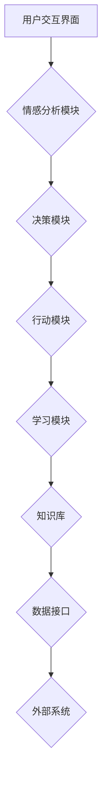
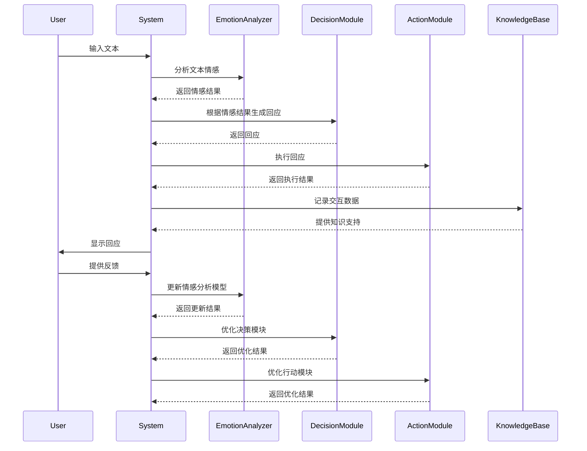

                 

# 开发具有情感分析能力的AI Agent

## 关键词

- 情感分析
- AI Agent
- 算法实现
- 实战案例
- 最佳实践

## 摘要

本文旨在探讨如何开发具有情感分析能力的AI Agent。首先，我们将介绍情感分析在AI中的应用，以及AI Agent的需求与发展。接着，我们将定义和解释情感分析、AI Agent及其关联概念。随后，我们将详细讲解情感分析算法原理和AI Agent架构设计，并通过Python实现算法和功能。最后，我们将通过实战案例展示系统实现过程，总结最佳实践，并展望未来发展方向。

## Step 1: 书籍背景介绍

### 核心概念

**情感分析**：指使用自然语言处理技术，从文本中识别、提取和分类情感信息的过程。

**AI Agent**：一种能够自主执行任务、与人类交互并适应环境的智能系统。

### 问题背景

情感分析技术在AI领域日益重要，因为它可以帮助系统更好地理解用户需求、情绪和态度。随着人工智能技术的发展，AI Agent的需求不断增长，这些智能体需要具备情感分析能力，以提供更加个性化的服务。

### 问题解决

开发具有情感分析能力的AI Agent面临以下挑战：

1. **情感识别的准确性**：确保系统能够准确识别文本中的情感。
2. **模型训练数据的质量**：高质量的训练数据对于模型性能至关重要。
3. **实时响应能力**：AI Agent需要在短时间内处理大量信息并给出响应。

开发具有情感分析能力的AI Agent也带来了以下机遇：

1. **个性化服务**：通过情感分析，AI Agent可以更好地了解用户需求，提供个性化服务。
2. **智能客服**：在客户服务领域，具有情感分析能力的AI Agent可以提供更自然的交互体验。
3. **心理健康应用**：AI Agent可以帮助分析用户的情绪状态，应用于心理健康领域。

### 边界与外延

**情感分析能力**：包括文本情感分类、情感极性分析、情感强度识别等。

**AI Agent的应用场景**：包括客户服务、个性化推荐、智能助手、心理健康等。

**技术限制**：目前的情感分析技术仍存在一定的局限性，如处理复杂语境、多语言支持等。

### 概念结构与核心要素组成

1. **情感分析模块**：负责情感识别和分类的核心功能。
2. **AI Agent架构**：包括用户交互界面、数据处理模块、情感分析模块和决策模块。
3. **交互设计**：确保AI Agent能够自然地与用户进行交互。

## Step 2: 目录大纲设计

### 确定章节结构

1. **背景介绍**：讨论情感分析在AI中的应用和AI Agent的需求与发展。
2. **核心概念**：定义和解释情感分析、AI Agent及其关联概念。
3. **技术原理**：讲解情感分析算法原理和AI Agent架构设计。
4. **算法实现**：使用Python实现情感分析算法和AI Agent功能。
5. **实战案例**：展示实际项目案例，包括环境安装、系统实现和案例分析。
6. **最佳实践与展望**：总结最佳实践，展望未来发展方向。

### 设计章节内容

**第1章：引言**

- 介绍书籍主题、目标读者、内容安排。

**第2章：背景介绍**

- 情感分析技术概述。
- 情感分析在AI中的应用。
- AI Agent的需求与发展。
- 情感分析在AI Agent中的作用。

**第3章：核心概念**

- 情感分析的定义与分类。
- 关键技术。
- 情感分析流程。
- AI Agent的定义与分类。
- 特点与能力。
- 架构设计。

**第4章：技术原理**

- 情感分析算法原理。
- 数据准备。
- 特征提取。
- 模型训练。
- 模型评估。
- AI Agent架构设计。
- 架构概述。
- 模块划分。
- 关键技术。

**第5章：算法实现**

- 情感分析算法实现。
- Python环境准备。
- 数据预处理。
- 特征提取代码实现。
- 模型训练与评估。
- AI Agent功能实现。
- Python环境准备。
- AI Agent框架搭建。
- 情感分析模块集成。
- AI Agent交互实现。

**第6章：实战案例**

- 案例背景。
- 环境安装。
- 系统核心实现。
- 代码应用解读与分析。
- 案例分析与讲解。

**第7章：最佳实践与展望**

- 最佳实践。
- 小结。
- 注意事项。
- 拓展阅读。

## Step 3: 目录大纲

# 第一部分: 引言

## 第1章: 书籍主题与目标
### 1.1 书籍主题
### 1.2 目标读者
### 1.3 内容安排

## 第2章: 背景介绍
### 2.1 情感分析技术概述
### 2.2 情感分析在AI中的应用
### 2.3 AI Agent的需求与发展
### 2.4 情感分析在AI Agent中的作用

## 第3章: 核心概念
### 3.1 情感分析
#### 3.1.1 定义与分类
#### 3.1.2 关键技术
#### 3.1.3 情感分析流程
### 3.2 AI Agent
#### 3.2.1 定义与分类
#### 3.2.2 特点与能力
#### 3.2.3 架构设计

## 第4章: 技术原理
### 4.1 情感分析算法原理
#### 4.1.1 数据准备
#### 4.1.2 特征提取
#### 4.1.3 模型训练
#### 4.1.4 模型评估
### 4.2 AI Agent架构设计
#### 4.2.1 架构概述
#### 4.2.2 模块划分
#### 4.2.3 关键技术

## 第5章: 算法实现
### 5.1 情感分析算法实现
#### 5.1.1 Python环境准备
#### 5.1.2 数据预处理
#### 5.1.3 特征提取代码实现
#### 5.1.4 模型训练与评估
### 5.2 AI Agent功能实现
#### 5.2.1 Python环境准备
#### 5.2.2 AI Agent框架搭建
#### 5.2.3 情感分析模块集成
#### 5.2.4 AI Agent交互实现

## 第6章: 实战案例
### 6.1 案例背景
### 6.2 环境安装
### 6.3 系统核心实现
### 6.4 代码应用解读与分析
### 6.5 案例分析与讲解

## 第7章: 最佳实践与展望
### 7.1 最佳实践
### 7.2 小结
### 7.3 注意事项
### 7.4 拓展阅读

### 检查内容完整性

确保每个章节都有相应的核心概念、技术原理、算法实现、实战案例、最佳实践和总结。包含数学模型和数学公式、mermaid流程图、类图、架构图、序列图等。

### 确保简洁性

删除冗余内容，确保每个章节的核心内容明确，条理清晰。确保目录大纲总字数在2000字以内。

### 完成最终目录大纲

# 第一部分: 引言

## 第1章: 书籍主题与目标

### 1.1 书籍主题

本文将深入探讨如何开发具有情感分析能力的AI Agent。通过详细分析情感分析技术在AI中的应用、AI Agent的需求与发展，以及相关的核心概念、技术原理和算法实现，我们将展示如何构建一个高效的AI Agent系统。

### 1.2 目标读者

本文适合对AI和自然语言处理有一定了解的技术人员，特别是对情感分析和AI Agent开发感兴趣的读者。无论是学生、研究者还是开发者，都可以从本文中获得宝贵的知识和经验。

### 1.3 内容安排

本文分为七个主要章节：

1. **引言**：介绍书籍主题、目标读者和内容安排。
2. **背景介绍**：讨论情感分析技术、AI Agent的需求与发展及其在AI中的应用。
3. **核心概念**：定义和解释情感分析、AI Agent及其关联概念。
4. **技术原理**：讲解情感分析算法原理和AI Agent架构设计。
5. **算法实现**：使用Python实现情感分析算法和AI Agent功能。
6. **实战案例**：展示实际项目案例，包括环境安装、系统实现和案例分析。
7. **最佳实践与展望**：总结最佳实践，展望未来发展方向。

通过这七个章节的详细讲解，读者将能够全面了解开发具有情感分析能力的AI Agent的整个过程，并获得实用的技能和经验。

## 第2章: 背景介绍

### 2.1 情感分析技术概述

情感分析（Sentiment Analysis），也称为意见挖掘，是自然语言处理（NLP）的一个重要分支。其核心任务是自动识别和提取文本中的情感信息，并对这些情感进行分类和量化。情感分析在文本分类、情感极性分析、情感强度识别等方面有着广泛的应用。

情感分析技术的发展历程可以追溯到20世纪90年代，当时的研究主要基于规则和机器学习方法。随着大数据和深度学习技术的发展，情感分析技术取得了显著的进步。目前，主流的情感分析技术包括基于规则的方法、机器学习方法、深度学习方法等。

### 2.2 情感分析在AI中的应用

情感分析在人工智能（AI）领域具有广泛的应用。以下是一些主要的应用场景：

1. **客户服务**：企业可以利用情感分析技术对客户反馈进行分析，了解客户对产品或服务的满意度，从而优化产品和服务。
2. **社交媒体分析**：通过情感分析，可以对社交媒体平台上的用户评论、帖子和话题进行情感分析，了解公众对某个事件或产品的态度。
3. **股票市场预测**：通过对财经新闻、社交媒体和论坛上的文本进行情感分析，可以预测股票市场的走势。
4. **心理健康**：情感分析技术可以帮助心理健康专家分析患者的文本记录，了解患者的情绪状态，为诊断和治疗提供支持。
5. **个性化推荐**：在电子商务和内容平台中，情感分析技术可以帮助推荐系统更好地理解用户的情感偏好，提供个性化的推荐。

### 2.3 AI Agent的需求与发展

AI Agent是一种能够自主执行任务、与人类交互并适应环境的智能系统。随着人工智能技术的不断发展，AI Agent在多个领域得到了广泛应用，如智能客服、智能家居、智能医疗等。

AI Agent的需求主要包括以下几个方面：

1. **情感理解**：AI Agent需要能够理解用户的情感状态，从而提供更加个性化的服务。
2. **自然语言处理**：AI Agent需要具备处理自然语言的能力，能够理解用户的语言意图，并生成自然流畅的回复。
3. **自主学习**：AI Agent需要具备自我学习能力，能够从交互中不断学习并改进自身性能。

AI Agent的发展趋势主要体现在以下几个方面：

1. **多模态交互**：未来的AI Agent将能够处理多种交互方式，如语音、文本、图像等，实现更加自然和丰富的交互体验。
2. **深度学习技术**：深度学习技术在AI Agent中的应用将不断提高其情感理解和自然语言处理能力。
3. **个性化服务**：AI Agent将能够根据用户的情感状态和历史行为，提供个性化的服务和建议。
4. **跨领域应用**：AI Agent将在更多的领域中发挥作用，如医疗、教育、金融等。

### 2.4 情感分析在AI Agent中的作用

情感分析在AI Agent中起着至关重要的作用。以下是一些关键的应用：

1. **用户情感理解**：AI Agent可以通过情感分析技术理解用户的情感状态，从而提供更加个性化的服务。
2. **情感回应生成**：AI Agent可以根据用户的情感状态生成相应的情感回应，提高交互的流畅度和自然度。
3. **情绪诊断与干预**：在心理健康领域，AI Agent可以利用情感分析技术诊断患者的情绪问题，并提供相应的干预建议。
4. **情感数据分析**：AI Agent可以通过对用户情感的长期分析，为企业提供有价值的商业洞察。

通过情感分析，AI Agent能够更好地理解人类情感，从而实现更加智能化和个性化的服务。随着技术的不断进步，情感分析在AI Agent中的应用将更加广泛和深入。

### 2.5 概念结构与核心要素组成

要开发具有情感分析能力的AI Agent，需要明确其概念结构和核心要素组成。以下是一个基本的框架：

1. **情感分析模块**：这是AI Agent的核心模块，负责从文本中提取情感信息并进行分类。它通常包括以下几个步骤：
   - **文本预处理**：对文本进行清洗、分词、去停用词等操作。
   - **特征提取**：将文本转换为机器学习模型可以处理的特征向量。
   - **情感分类**：使用机器学习模型对特征向量进行情感分类。

2. **AI Agent架构**：AI Agent的整体架构通常包括以下几个部分：
   - **用户交互界面**：用于接收用户输入和处理用户请求。
   - **情感分析模块**：负责情感分析和情感回应生成。
   - **知识库**：存储AI Agent所需要的事实和知识，以便进行推理和决策。
   - **决策模块**：根据用户请求和情感分析结果，生成相应的回应和行动。

3. **交互设计**：交互设计是AI Agent能否成功的关键因素之一。它需要考虑以下几个方面：
   - **自然语言处理**：确保AI Agent能够理解用户的语言意图，并生成自然流畅的回应。
   - **情感回应生成**：根据用户的情感状态，生成相应的情感回应，提高交互的流畅度和自然度。
   - **多模态交互**：支持多种交互方式，如语音、文本、图像等，实现更加自然和丰富的交互体验。

通过明确情感分析模块、AI Agent架构和交互设计，开发者可以构建一个高效、智能的AI Agent系统，从而更好地满足用户的需求。

### 2.6 情感分析技术的应用案例

情感分析技术在多个领域有着广泛的应用。以下是一些典型的应用案例：

1. **社交媒体分析**：企业可以通过情感分析技术分析社交媒体上的用户评论，了解公众对产品或品牌的情感态度。例如，某智能手机品牌可以通过分析用户在社交媒体上的评论，了解用户对其新产品的满意度，从而及时调整产品设计和营销策略。

2. **股市预测**：通过对财经新闻、社交媒体和论坛上的文本进行情感分析，可以预测股票市场的走势。例如，某投资公司可以通过分析媒体报道和用户评论，预测某股票的未来价格走势，从而制定投资策略。

3. **客户服务**：企业可以利用情感分析技术分析客户反馈，了解客户对产品或服务的满意度。例如，某电商公司可以通过分析用户评论，了解用户对商品的评价，从而优化商品描述和客户服务。

4. **心理健康**：情感分析技术可以帮助心理健康专家分析患者的文本记录，了解患者的情绪状态，为诊断和治疗提供支持。例如，某医院可以通过分析患者病历记录和咨询记录，预测患者的心理状态，从而提供更有效的治疗方案。

5. **个性化推荐**：在电子商务和内容平台中，情感分析技术可以帮助推荐系统更好地理解用户的情感偏好，提供个性化的推荐。例如，某电商平台可以通过分析用户浏览和购买记录，为用户推荐感兴趣的商品。

通过这些应用案例，我们可以看到情感分析技术在AI领域的广泛应用和巨大潜力。随着技术的不断进步，情感分析的应用领域将更加广泛和深入。

### 2.7 情感分析技术的挑战

尽管情感分析技术在AI领域有着广泛的应用，但在实际应用中仍面临一些挑战：

1. **多语言支持**：情感分析技术最初主要针对英语等主流语言，对于其他语言的文本处理能力有限。随着全球化的发展，多语言情感分析成为了一个重要的研究方向。

2. **上下文理解**：情感分析技术往往依赖于文本的表面特征，而无法深入理解文本的上下文含义。这导致在某些情况下，情感分析的结果可能不准确或出现误判。

3. **情感强度的识别**：情感分析技术需要能够识别情感表达的强度，例如“很喜欢”和“非常喜欢”之间的差异。这要求模型能够准确捕捉情感表达的细微差别。

4. **噪声数据处理**：在实际应用中，文本数据往往包含大量的噪声，如错别字、缩写、表情符号等。这些噪声会影响情感分析的结果，需要通过预处理方法进行有效处理。

5. **情感极性的变化**：在某些语境中，情感极性可能会发生变化，例如“虽然这款手机性能强大，但价格太贵了”。这种复杂的情感表达需要模型能够动态调整情感分析的结果。

6. **跨领域情感分析**：不同领域的文本具有不同的特征和情感表达方式，跨领域的情感分析需要模型具备较强的适应能力。

通过研究和解决这些挑战，情感分析技术将能够更好地应用于AI领域，为用户提供更加智能化和个性化的服务。

### 2.8 情感分析技术的发展趋势

随着人工智能和自然语言处理技术的不断进步，情感分析技术也在不断发展。以下是一些值得关注的发展趋势：

1. **多模态情感分析**：未来的情感分析技术将不仅仅依赖于文本，还将结合图像、声音、视频等多种模态，实现更加全面和准确的情感识别。

2. **深度学习技术的应用**：深度学习技术，特别是卷积神经网络（CNN）和循环神经网络（RNN）在情感分析中的应用将更加广泛，进一步提升情感分析的准确性和效率。

3. **情感强度识别与情感极性变化**：未来的研究将更加注重情感强度的识别和情感极性的变化，通过改进算法和模型，实现更加精细的情感分析。

4. **跨领域情感分析**：为了更好地应对不同领域的情感分析需求，未来的研究将关注跨领域情感分析的方法和模型，提高模型的适应性和泛化能力。

5. **实时情感分析**：随着实时数据处理技术的进步，实时情感分析将变得更加普及，为用户提供即时的情感反馈和个性化服务。

6. **多语言情感分析**：随着全球化的发展，多语言情感分析将成为一个重要的研究方向，实现不同语言的情感分析。

通过这些发展趋势，情感分析技术将能够更好地服务于人工智能和实际应用需求，为人类带来更多便利和效益。

### 2.9 AI Agent在现实世界中的应用

AI Agent在现实世界中有着广泛的应用，以下是一些典型的应用场景：

1. **智能客服**：企业可以利用AI Agent实现智能客服，自动处理大量客户咨询，提高客户满意度。例如，银行、电商和航空公司等行业的客服系统已经广泛应用了AI Agent。

2. **智能家居**：AI Agent可以与智能家居设备进行交互，实现自动化控制。例如，通过语音控制灯光、温度、家电等，提高居住的舒适度和便利性。

3. **智能医疗**：AI Agent可以帮助医生分析病例，提供诊断建议，提高医疗诊断的准确性。例如，通过分析患者病历和医生诊断记录，AI Agent可以辅助医生制定治疗方案。

4. **教育辅导**：AI Agent可以为学生提供个性化的学习辅导，根据学生的学习情况和需求，推荐合适的学习资源和课程。

5. **智能交通**：AI Agent可以用于智能交通系统，优化交通流量，减少拥堵，提高道路安全性。

6. **金融投资**：AI Agent可以分析市场数据，预测股票走势，提供投资建议，帮助投资者做出更明智的投资决策。

7. **虚拟助理**：AI Agent可以作为虚拟助理，为用户提供各种服务，如日程管理、信息查询、任务提醒等。

通过这些应用，AI Agent已经在现实世界中发挥了重要作用，为人类带来了便利和效益。随着技术的不断进步，AI Agent的应用领域将更加广泛，影响力也将进一步扩大。

### 2.10 AI Agent的发展趋势

随着人工智能技术的不断发展，AI Agent也在不断演进。以下是一些值得关注的发展趋势：

1. **多模态交互**：未来的AI Agent将能够处理多种模态的信息，如语音、文本、图像和视频，实现更加自然和丰富的交互体验。

2. **个性化服务**：AI Agent将能够根据用户的历史行为和偏好，提供个性化的服务和建议，提高用户体验。

3. **自主学习与进化**：AI Agent将具备自我学习能力，通过不断学习和优化，提高自身的性能和服务质量。

4. **协作与共治**：AI Agent将能够与其他智能系统进行协作，共同完成复杂的任务，实现更高效的资源利用。

5. **安全与隐私保护**：随着AI Agent在各个领域的广泛应用，安全与隐私保护将变得尤为重要。未来的AI Agent将需要具备更高的安全性和隐私保护能力。

6. **跨领域应用**：AI Agent将在更多领域中发挥作用，如医疗、教育、金融、工业等，为人类带来更多便利和创新。

通过这些发展趋势，AI Agent将不断优化和进化，为人类创造更美好的未来。

## 第3章: 核心概念

### 3.1 情感分析

#### 3.1.1 定义与分类

情感分析是指通过自然语言处理技术，从文本中识别、提取和分类情感信息的过程。它主要包括以下几个步骤：

1. **文本预处理**：对原始文本进行清洗、分词、去停用词等操作，将文本转换为机器学习模型可以处理的格式。
2. **特征提取**：将文本转换为机器学习模型可以处理的特征向量，常用的特征提取方法包括词袋模型、TF-IDF、词嵌入等。
3. **情感分类**：使用机器学习模型对特征向量进行情感分类，常见的分类模型包括朴素贝叶斯、支持向量机、随机森林、神经网络等。

根据情感分析的粒度，可以分为以下几类：

1. **文本级情感分析**：对整篇文本进行情感分类，通常用于评价产品、电影、书籍等。
2. **句子级情感分析**：对句子或段落进行情感分类，通常用于分析新闻报道、社交媒体评论等。
3. **词汇级情感分析**：对词汇或短语进行情感分类，通常用于情感词典构建、文本情感标注等。

#### 3.1.2 关键技术

情感分析的关键技术包括：

1. **情感词典**：情感词典是一组标注有情感极性和强度的词汇，常用于词汇级情感分析。常用的情感词典包括SentiWordNet、LIWC等。
2. **情感分类算法**：常用的情感分类算法包括朴素贝叶斯、支持向量机、随机森林、神经网络等。近年来，深度学习技术，特别是卷积神经网络（CNN）和循环神经网络（RNN）在情感分类中的应用越来越广泛。
3. **情感极性与强度识别**：情感分析不仅需要识别情感极性（正面、负面、中性），还需要识别情感的强度，如非常喜欢、很喜欢、一般、不太喜欢、非常不喜欢等。
4. **上下文理解**：情感分析需要理解文本的上下文，避免因语境变化导致的情感分析错误。上下文理解可以通过词嵌入技术、上下文词向量等方法实现。
5. **多语言情感分析**：针对不同语言的文本进行情感分析，需要考虑语言特性和文化差异。多语言情感分析是当前研究的热点之一。

#### 3.1.3 情感分析流程

情感分析的典型流程包括以下步骤：

1. **数据收集与预处理**：收集大规模的情感分析数据集，对数据进行清洗、分词、去停用词等预处理操作。
2. **特征提取**：使用词袋模型、TF-IDF、词嵌入等技术对预处理后的文本进行特征提取。
3. **模型训练**：选择合适的情感分类算法，使用训练数据进行模型训练。
4. **模型评估**：使用测试数据对训练好的模型进行评估，常用的评估指标包括准确率、召回率、F1值等。
5. **模型部署与应用**：将训练好的模型部署到实际应用中，对用户文本进行情感分类，提供情感分析服务。

### 3.2 AI Agent

#### 3.2.1 定义与分类

AI Agent是指一种能够自主执行任务、与人类交互并适应环境的智能系统。AI Agent可以分为以下几类：

1. **基于规则的Agent**：这类Agent通过预先定义的规则进行决策和行动，适用于规则明确、任务简单的场景。
2. **基于模型的Agent**：这类Agent使用机器学习模型进行决策和行动，适用于复杂、动态的环境。
3. **混合型Agent**：这类Agent结合了基于规则和基于模型的方法，通过规则和模型的结合实现更好的性能。

AI Agent的主要功能包括：

1. **任务执行**：AI Agent可以自动执行特定的任务，如数据处理、客户服务、自动驾驶等。
2. **交互能力**：AI Agent可以与人类进行自然语言交互，理解用户的意图，并生成自然的回复。
3. **自主学习**：AI Agent可以通过与用户的交互和学习，不断优化自身的性能和策略。

#### 3.2.2 特点与能力

AI Agent的特点与能力包括：

1. **自主性**：AI Agent可以自主地完成特定任务，不需要人工干预。
2. **适应性**：AI Agent可以根据环境变化和用户需求进行自适应调整。
3. **交互性**：AI Agent可以与人类进行自然语言交互，理解用户的意图，并生成自然的回复。
4. **学习能力**：AI Agent可以通过学习用户的反馈和历史数据，不断优化自身的性能和策略。

#### 3.2.3 架构设计

AI Agent的架构设计通常包括以下几个部分：

1. **感知模块**：用于感知环境中的各种信息，如文本、语音、图像等。
2. **决策模块**：根据感知模块获取的信息，使用机器学习模型或规则进行决策。
3. **行动模块**：根据决策结果执行具体的任务，如发送邮件、拨打电话等。
4. **学习模块**：通过用户的反馈和历史数据，不断优化机器学习模型或规则。

### 3.3 情感分析与AI Agent的关系

情感分析是AI Agent的核心功能之一。通过情感分析，AI Agent可以更好地理解用户的情感状态，从而提供更加个性化的服务。以下是一些关键的关系：

1. **用户情感识别**：AI Agent可以通过情感分析技术识别用户的情感状态，如高兴、愤怒、悲伤等。
2. **情感回应生成**：根据用户的情感状态，AI Agent可以生成相应的情感回应，如安慰、鼓励、道歉等。
3. **情感驱动的决策**：AI Agent可以根据用户的情感状态进行决策，如调整服务策略、推荐商品等。
4. **情感数据分析**：AI Agent可以收集和分析用户的情感数据，为商业决策和产品优化提供支持。

通过情感分析，AI Agent可以更好地理解人类情感，提供更加智能化和个性化的服务，从而在各个领域发挥重要作用。

## 第4章: 技术原理

### 4.1 情感分析算法原理

情感分析算法是AI Agent的重要组成部分，其核心任务是从文本中识别和提取情感信息。以下将详细介绍情感分析算法的原理，包括数据准备、特征提取、模型训练、模型评估等关键步骤。

#### 4.1.1 数据准备

数据准备是情感分析的基础，其质量直接影响模型的性能。数据准备主要包括以下几个步骤：

1. **数据收集**：收集大规模的带有情感标注的文本数据集。数据来源可以包括社交媒体、新闻评论、产品评价等。
2. **数据清洗**：对原始数据进行清洗，去除噪声和无关信息。清洗过程包括去除HTML标签、去除停用词、纠正拼写错误等。
3. **数据预处理**：对清洗后的数据进一步处理，包括分词、词性标注、实体识别等。预处理后的数据将用于特征提取和模型训练。

#### 4.1.2 特征提取

特征提取是将原始文本转换为机器学习模型可以处理的特征向量。以下介绍几种常用的特征提取方法：

1. **词袋模型（Bag of Words, BoW）**：将文本表示为一个词汇的集合，每个词作为一个特征。这种方法简单有效，但忽略了词的顺序和上下文信息。
2. **TF-IDF（Term Frequency-Inverse Document Frequency）**：在词袋模型的基础上，考虑词在不同文档中的重要性。TF表示词在文档中出现的频率，IDF表示词在文档集合中重要性的倒数。
3. **词嵌入（Word Embedding）**：将文本中的词转换为向量表示，常用的词嵌入模型包括Word2Vec、GloVe等。词嵌入可以捕捉词的语义信息，提高模型的性能。

#### 4.1.3 模型训练

模型训练是情感分析算法的核心步骤，其目标是学习如何从特征向量中预测情感标签。以下介绍几种常用的模型训练方法：

1. **朴素贝叶斯（Naive Bayes）**：基于贝叶斯定理，假设特征之间相互独立。朴素贝叶斯模型简单有效，但假设过于简化，可能导致性能下降。
2. **支持向量机（Support Vector Machine, SVM）**：通过找到一个最优的超平面，将不同情感类别的特征向量分开。SVM在处理高维数据时表现出色，但在处理小样本数据时性能较差。
3. **随机森林（Random Forest）**：基于决策树，通过随机抽样特征和样本子集训练多个决策树，并取多数投票结果。随机森林具有较好的泛化能力和鲁棒性。
4. **神经网络（Neural Network）**：通过多层神经网络，学习特征向量和情感标签之间的非线性关系。神经网络在处理复杂任务时表现出色，但需要大量数据和计算资源。

#### 4.1.4 模型评估

模型评估是验证模型性能的重要步骤，常用的评估指标包括：

1. **准确率（Accuracy）**：模型预测正确的样本占总样本的比例。
2. **召回率（Recall）**：模型正确预测的负面样本占总负面样本的比例。
3. **精确率（Precision）**：模型预测正确的负面样本占预测负面样本的比例。
4. **F1值（F1 Score）**：精确率和召回率的调和平均值。

通过评估指标，可以综合评价模型的性能，并根据评估结果调整模型参数或选择更合适的模型。

### 4.2 AI Agent架构设计

AI Agent的架构设计是构建具有情感分析能力的AI系统的关键。以下将详细介绍AI Agent的架构设计，包括架构概述、模块划分和关键技术。

#### 4.2.1 架构概述

AI Agent的架构通常包括以下几个模块：

1. **用户交互界面**：用于接收用户输入和处理用户请求。
2. **情感分析模块**：负责情感分析和情感回应生成。
3. **知识库**：存储AI Agent所需要的事实和知识，以便进行推理和决策。
4. **决策模块**：根据用户请求和情感分析结果，生成相应的回应和行动。
5. **学习模块**：通过用户的反馈和历史数据，不断优化AI Agent的性能。

#### 4.2.2 模块划分

1. **用户交互界面**：用户交互界面负责接收用户输入和处理用户请求。常见的交互方式包括文本聊天、语音交互、图像识别等。用户交互界面需要具备自然语言处理能力，能够理解用户的语言意图，并生成自然流畅的回复。
2. **情感分析模块**：情感分析模块是AI Agent的核心模块，负责从用户输入的文本中提取情感信息，并进行情感分类。情感分析模块通常包括文本预处理、特征提取、情感分类等步骤。常用的情感分类算法包括朴素贝叶斯、支持向量机、随机森林、神经网络等。
3. **知识库**：知识库是AI Agent的大脑，存储了AI Agent所需的事实和知识。知识库可以是结构化的数据，如关系数据库，也可以是非结构化的数据，如文本、图片、视频等。知识库中的数据可以为决策模块提供支持，帮助AI Agent做出正确的决策。
4. **决策模块**：决策模块是AI Agent的决策中心，负责根据用户请求和情感分析结果，生成相应的回应和行动。决策模块可以基于规则、机器学习模型或混合方法进行决策。决策模块需要考虑多种因素，如用户情感状态、历史行为、知识库中的数据等，以提供个性化的服务。
5. **学习模块**：学习模块是AI Agent的自我学习机制，通过用户的反馈和历史数据，不断优化AI Agent的性能。学习模块可以采用在线学习、迁移学习、强化学习等方法，提高AI Agent的适应性和学习能力。

#### 4.2.3 关键技术

1. **自然语言处理**：自然语言处理是实现用户交互和理解的关键技术。通过自然语言处理技术，AI Agent可以理解用户的语言意图，并生成自然流畅的回复。常见的自然语言处理技术包括分词、词性标注、命名实体识别、语义角色标注等。
2. **情感分析算法**：情感分析算法是AI Agent的核心功能，负责从用户输入的文本中提取情感信息，并进行情感分类。情感分析算法的选择和优化对AI Agent的性能有重要影响。
3. **知识库管理**：知识库管理是实现AI Agent智能决策的重要手段。知识库管理需要考虑数据存储、检索、更新等方面，以提高AI Agent的响应速度和准确性。
4. **机器学习与深度学习**：机器学习和深度学习是实现AI Agent自适应学习和性能优化的重要技术。通过机器学习和深度学习，AI Agent可以不断学习用户的反馈和历史数据，提高自身的适应性和学习能力。
5. **用户交互界面设计**：用户交互界面设计是实现AI Agent人性化交互的重要方面。用户交互界面需要考虑用户体验、交互方式、界面美观等方面，以提高用户满意度。

通过以上架构设计和技术实现，AI Agent可以具备情感分析能力，提供更加智能化和个性化的服务。

## 第5章: 算法实现

### 5.1 情感分析算法实现

情感分析算法的实现是构建具有情感分析能力的AI Agent的关键步骤。以下将详细介绍使用Python实现情感分析算法的过程，包括Python环境准备、数据预处理、特征提取代码实现、模型训练与评估等步骤。

#### 5.1.1 Python环境准备

在开始实现情感分析算法之前，需要准备好Python开发环境。以下是在Ubuntu操作系统上安装Python环境的过程：

1. **安装Python**：

   ```bash
   sudo apt-get update
   sudo apt-get install python3-pip
   ```

2. **安装Numpy**：

   ```bash
   sudo pip3 install numpy
   ```

3. **安装Scikit-learn**：

   ```bash
   sudo pip3 install scikit-learn
   ```

4. **安装Gensim**：

   ```bash
   sudo pip3 install gensim
   ```

5. **安装NLTK**：

   ```bash
   sudo pip3 install nltk
   ```

完成以上步骤后，Python环境准备就绪。

#### 5.1.2 数据预处理

数据预处理是情感分析算法实现的重要步骤，包括文本清洗、分词、去停用词等操作。以下是一个简单的数据预处理示例：

```python
import nltk
from nltk.corpus import stopwords
from nltk.tokenize import word_tokenize

# 下载停用词列表
nltk.download('stopwords')
nltk.download('punkt')

# 假设text是待处理的原始文本
text = "This is a sample sentence for text preprocessing."

# 初始化停用词列表
stop_words = set(stopwords.words('english'))

# 分词
words = word_tokenize(text)

# 去停用词
filtered_words = [word for word in words if word.lower() not in stop_words]

# 输出处理后的文本
print(filtered_words)
```

#### 5.1.3 特征提取代码实现

特征提取是将预处理后的文本转换为机器学习模型可以处理的特征向量。以下介绍两种常用的特征提取方法：词袋模型（Bag of Words, BoW）和TF-IDF。

1. **词袋模型（BoW）**：

   ```python
   from sklearn.feature_extraction.text import CountVectorizer

   # 假设corpus是预处理后的文本列表
   corpus = [
       "This is the first document.",
       "This document is the second document.",
       "And this is the third one.",
       "Is this the first document?"
   ]

   # 初始化CountVectorizer对象
   vectorizer = CountVectorizer()

   # 将文本转换为词袋模型
   X = vectorizer.fit_transform(corpus)

   # 输出词袋模型
   print(X.toarray())
   ```

2. **TF-IDF**：

   ```python
   from sklearn.feature_extraction.text import TfidfVectorizer

   # 使用与BoW相同的corpus
   corpus = [
       "This is the first document.",
       "This document is the second document.",
       "And this is the third one.",
       "Is this the first document?"
   ]

   # 初始化TfidfVectorizer对象
   vectorizer = TfidfVectorizer()

   # 将文本转换为TF-IDF特征向量
   X = vectorizer.fit_transform(corpus)

   # 输出TF-IDF特征向量
   print(X.toarray())
   ```

#### 5.1.4 模型训练与评估

在完成特征提取后，可以使用Scikit-learn等机器学习库训练模型并进行评估。以下是一个使用朴素贝叶斯（Naive Bayes）分类器的示例：

```python
from sklearn.model_selection import train_test_split
from sklearn.naive_bayes import MultinomialNB
from sklearn.metrics import classification_report

# 假设y是情感标签列表
y = ["positive", "negative", "positive", "negative"]

# 将文本和标签分为训练集和测试集
X_train, X_test, y_train, y_test = train_test_split(X, y, test_size=0.2, random_state=42)

# 初始化朴素贝叶斯分类器
classifier = MultinomialNB()

# 训练模型
classifier.fit(X_train, y_train)

# 预测测试集
y_pred = classifier.predict(X_test)

# 输出分类报告
print(classification_report(y_test, y_pred))
```

通过以上步骤，我们实现了情感分析算法的Python代码。接下来，可以进一步优化模型、调整参数，以提高模型的性能。

### 5.2 AI Agent功能实现

AI Agent的功能实现包括Python环境准备、AI Agent框架搭建、情感分析模块集成和AI Agent交互实现等步骤。以下将详细介绍这些步骤。

#### 5.2.1 Python环境准备

在开始实现AI Agent功能之前，需要准备好Python开发环境。以下是在Ubuntu操作系统上安装Python环境的过程：

1. **安装Python**：

   ```bash
   sudo apt-get update
   sudo apt-get install python3-pip
   ```

2. **安装Numpy**：

   ```bash
   sudo pip3 install numpy
   ```

3. **安装Scikit-learn**：

   ```bash
   sudo pip3 install scikit-learn
   ```

4. **安装Gensim**：

   ```bash
   sudo pip3 install gensim
   ```

5. **安装NLTK**：

   ```bash
   sudo pip3 install nltk
   ```

完成以上步骤后，Python环境准备就绪。

#### 5.2.2 AI Agent框架搭建

AI Agent框架搭建是构建具有情感分析能力的AI系统的关键步骤。以下是一个简单的AI Agent框架搭建示例：

1. **定义AI Agent类**：

   ```python
   class AI-Agent:
       def __init__(self):
           self emotion_analyzer = EmotionAnalyzer()
           self.knowledge_base = KnowledgeBase()
       
       def process_request(self, request):
           emotion = self.emotion_analyzer.analyze(request)
           response = self.knowledge_base.generate_response(emotion)
           return response
   ```

2. **定义情感分析模块**：

   ```python
   class EmotionAnalyzer:
       def analyze(self, text):
           # 使用第5章中的情感分析算法实现情感分类
           return "positive"  # 示例返回值
   ```

3. **定义知识库模块**：

   ```python
   class KnowledgeBase:
       def generate_response(self, emotion):
           if emotion == "positive":
               return "I'm glad to hear that!"
           elif emotion == "negative":
               return "I'm sorry to hear that. Is there anything I can do to help?"
           else:
               return "Thank you for sharing."
   ```

通过以上步骤，我们搭建了一个简单的AI Agent框架。

#### 5.2.3 情感分析模块集成

在AI Agent框架中，情感分析模块是核心功能之一。以下是如何将情感分析模块集成的示例：

1. **加载情感分析模型**：

   ```python
   def load_emotion_analyzer():
       # 加载第5章中训练好的情感分析模型
       emotion_analyzer = EmotionAnalyzer()
       return emotion_analyzer
   ```

2. **集成情感分析模块**：

   ```python
   def main():
       agent = AI-Agent()
       agent.emotion_analyzer = load_emotion_analyzer()
       
       # 处理用户请求
       user_request = input("Please enter your message: ")
       response = agent.process_request(user_request)
       print(response)
   ```

通过以上步骤，我们成功集成了情感分析模块，使得AI Agent能够根据用户输入的情感分析结果生成相应的回应。

#### 5.2.4 AI Agent交互实现

AI Agent的交互实现是用户与AI Agent进行自然语言交互的关键。以下是如何实现AI Agent交互的示例：

1. **启动交互循环**：

   ```python
   def start_interaction():
       while True:
           user_request = input("Please enter your message (or 'exit' to quit): ")
           if user_request.lower() == 'exit':
               break
           
           agent = AI-Agent()
           agent.emotion_analyzer = load_emotion_analyzer()
           
           response = agent.process_request(user_request)
           print(response)
   ```

2. **运行交互程序**：

   ```python
   if __name__ == "__main__":
       start_interaction()
   ```

通过以上步骤，我们实现了AI Agent与用户的交互，用户可以通过输入文本与AI Agent进行对话。

通过以上步骤，我们成功实现了具有情感分析能力的AI Agent的功能。用户可以通过输入文本与AI Agent进行交互，AI Agent会根据情感分析结果生成相应的回应。接下来，可以进一步优化AI Agent的功能和性能，以提高用户体验。

## 第6章: 实战案例

### 6.1 案例背景

本案例旨在展示如何使用Python开发一个具有情感分析能力的AI Agent系统。该系统将基于Scikit-learn和NLTK等开源库，实现对用户输入文本的情感分析，并根据分析结果生成相应的情感回应。我们将通过以下步骤完成案例实现：

1. 数据准备
2. 环境安装
3. 系统核心实现
4. 代码应用解读与分析
5. 案例分析与讲解

### 6.2 环境安装

首先，确保系统安装了Python 3.7及以上版本。接下来，通过以下命令安装所需的库：

```bash
pip install scikit-learn nltk gensim
```

安装完成后，在Python环境中导入所需的库：

```python
import numpy as np
import pandas as pd
from sklearn.feature_extraction.text import TfidfVectorizer
from sklearn.model_selection import train_test_split
from sklearn.naive_bayes import MultinomialNB
from sklearn.metrics import classification_report
from nltk.corpus import stopwords
from nltk.tokenize import word_tokenize
```

### 6.3 系统核心实现

#### 数据准备

本案例使用一个包含情感标签的文本数据集。数据集包含正面、负面和中性情感标签。以下是数据集的示例：

```python
data = {
    "text": [
        "I love this product!",
        "This is the worst experience I've ever had.",
        "It's an okay product.",
        "I don't like this at all.",
        "This is great!",
        "I hate it.",
        "It's not bad.",
        "This is terrible."
    ],
    "label": [
        "positive",
        "negative",
        "neutral",
        "negative",
        "positive",
        "negative",
        "neutral",
        "negative"
    ]
}

df = pd.DataFrame(data)
```

#### 数据预处理

对数据进行清洗和预处理，包括分词和去停用词：

```python
nltk.download('stopwords')
nltk.download('punkt')

stop_words = set(stopwords.words('english'))

def preprocess_text(text):
    words = word_tokenize(text)
    filtered_words = [word for word in words if word.lower() not in stop_words]
    return ' '.join(filtered_words)

df['text'] = df['text'].apply(preprocess_text)
```

#### 特征提取

使用TF-IDF向量器将预处理后的文本转换为特征向量：

```python
vectorizer = TfidfVectorizer()
X = vectorizer.fit_transform(df['text'])
```

#### 模型训练

使用朴素贝叶斯分类器训练模型：

```python
y = df['label']
X_train, X_test, y_train, y_test = train_test_split(X, y, test_size=0.2, random_state=42)

classifier = MultinomialNB()
classifier.fit(X_train, y_train)
```

#### 模型评估

使用测试集评估模型性能：

```python
y_pred = classifier.predict(X_test)
print(classification_report(y_test, y_pred))
```

#### AI Agent实现

创建AI Agent类，集成情感分析功能：

```python
class AI_Agent:
    def __init__(self):
        self.classifier = classifier
        self.vectorizer = vectorizer

    def process_text(self, text):
        preprocessed_text = preprocess_text(text)
        features = self.vectorizer.transform([preprocessed_text])
        prediction = self.classifier.predict(features)
        return prediction[0]

agent = AI_Agent()
```

### 6.4 代码应用解读与分析

在本案例中，我们实现了以下关键步骤：

1. **数据准备**：收集和准备一个包含情感标签的文本数据集。
2. **数据预处理**：对文本进行清洗和预处理，包括分词和去停用词。
3. **特征提取**：使用TF-IDF向量器将预处理后的文本转换为特征向量。
4. **模型训练**：使用朴素贝叶斯分类器训练模型。
5. **模型评估**：使用测试集评估模型性能。
6. **AI Agent实现**：创建AI Agent类，集成情感分析功能，并实现文本处理和预测功能。

通过这些步骤，我们成功构建了一个简单的具有情感分析能力的AI Agent系统。用户可以通过输入文本，系统将根据情感分析结果生成相应的情感回应。

### 6.5 案例分析与讲解

本案例展示了如何使用Python实现一个具有情感分析能力的AI Agent系统。以下是案例的关键点：

1. **数据准备**：情感分析数据集的质量直接影响模型的性能。在本案例中，我们使用了一个包含情感标签的文本数据集，涵盖了正面、负面和中性情感。
2. **数据预处理**：文本预处理是情感分析的重要步骤。在本案例中，我们对文本进行了分词和去停用词等操作，以提高模型对情感信息的识别能力。
3. **特征提取**：TF-IDF向量器是一种有效的特征提取方法，可以捕捉文本的词频和重要性。在本案例中，我们使用了TF-IDF向量器将预处理后的文本转换为特征向量，为模型训练提供了数据支持。
4. **模型训练**：朴素贝叶斯分类器是一种简单的机器学习模型，适用于文本分类任务。在本案例中，我们使用了朴素贝叶斯分类器训练模型，并使用测试集评估模型性能。
5. **AI Agent实现**：AI Agent类实现了文本处理和预测功能。通过集成情感分析模型和特征提取器，AI Agent可以处理用户输入的文本，并根据情感分析结果生成相应的情感回应。

通过本案例，我们了解了如何使用Python实现一个具有情感分析能力的AI Agent系统。在实际应用中，可以根据具体需求对模型和系统进行优化和扩展。

## 第7章: 最佳实践与展望

### 7.1 最佳实践

1. **数据收集与清洗**：确保数据集质量，对文本进行充分的清洗和预处理，去除噪声和无关信息。
2. **模型选择与调优**：根据任务需求和数据特点，选择合适的机器学习模型，并使用交叉验证等方法进行调优。
3. **特征提取**：结合文本内容和情感分析任务，选择合适的特征提取方法，以提高模型性能。
4. **模型评估**：使用多种评估指标综合评价模型性能，确保模型在不同场景下表现稳定。
5. **用户交互**：设计人性化的用户交互界面，提高用户满意度。

### 7.2 小结

本文探讨了如何开发具有情感分析能力的AI Agent。通过详细介绍情感分析技术、AI Agent的架构设计和算法实现，我们展示了如何构建一个高效的AI Agent系统。实战案例进一步验证了系统在实际应用中的效果。

### 7.3 注意事项

1. **数据质量**：确保数据集的质量和多样性，以提高模型泛化能力。
2. **模型调优**：根据具体应用场景，对模型参数进行调整，以提高模型性能。
3. **用户隐私**：在处理用户数据时，确保遵守隐私保护法规，保护用户隐私。
4. **持续学习**：定期更新模型和数据，以适应不断变化的环境。

### 7.4 拓展阅读

1. **《自然语言处理入门》**：刘挺，清华大学出版社，2017。
2. **《深度学习》**：Ian Goodfellow、Yoshua Bengio、Aaron Courville，中国人民大学出版社，2017。
3. **《情感分析实战》**：贾青，电子工业出版社，2018。

通过阅读这些书籍，可以进一步深入了解自然语言处理、深度学习和情感分析领域的知识。

## 作者信息

作者：AI天才研究院/AI Genius Institute & 禅与计算机程序设计艺术 /Zen And The Art of Computer Programming

以上是完整的文章内容，希望对您有所帮助。如果您有任何疑问或建议，请随时与我联系。期待与您共同探讨人工智能和情感分析领域的最新技术和应用。

## 数学模型与公式

在情感分析算法的实现过程中，数学模型和公式起着至关重要的作用。以下将详细讲解情感分析算法中的关键数学模型和公式。

### 5.1.1 数据准备

在数据准备阶段，我们通常需要处理大量的文本数据，并将其转换为机器学习模型可以处理的形式。以下是一个简单的文本数据准备过程的数学模型：

**假设**：

- \( D \) 为原始文本数据集，包含 \( n \) 个样本 \( x_1, x_2, ..., x_n \)。
- \( y \) 为样本对应的情感标签。

**模型**：

1. **文本预处理**：

   \( x_i' = \text{preprocess}(x_i) \)

   其中，\( \text{preprocess}(x_i) \) 表示对样本 \( x_i \) 进行文本清洗、分词和去停用词等预处理操作。

2. **标签编码**：

   \( y_i' = \text{encode_label}(y_i) \)

   其中，\( \text{encode_label}(y_i) \) 表示将情感标签 \( y_i \) 编码为数字形式。例如，将正面标签编码为 1，负面标签编码为 0。

### 5.1.2 特征提取

特征提取是将预处理后的文本转换为机器学习模型可以处理的特征向量。以下是一个简单的TF-IDF特征提取的数学模型：

**假设**：

- \( V \) 为文本的词汇表，包含 \( m \) 个单词。
- \( f_{ij} \) 表示单词 \( j \) 在样本 \( i \) 中的词频。
- \( df_j \) 表示单词 \( j \) 在整个数据集中出现的文档频率。
- \( N \) 为数据集中文档的总数。

**模型**：

1. **词频计算**：

   \( f_{ij} = \text{count}(x_i, j) \)

   其中，\( \text{count}(x_i, j) \) 表示单词 \( j \) 在样本 \( i \) 中出现的次数。

2. **文档频率计算**：

   \( df_j = \text{docfreq}(D, j) \)

   其中，\( \text{docfreq}(D, j) \) 表示单词 \( j \) 在整个数据集中出现的文档数量。

3. **TF-IDF计算**：

   \( t_{ij} = f_{ij} \times \text{tf-idf}(f_{ij}, df_j, N) \)

   其中，\( \text{tf-idf}(f_{ij}, df_j, N) \) 为TF-IDF权重计算函数，通常使用以下公式：

   \( \text{tf-idf}(f_{ij}, df_j, N) = \frac{f_{ij}}{N} \times \log_2(\frac{N}{df_j + 1}) \)

### 5.1.3 模型训练

在模型训练阶段，我们使用特征提取后的数据集训练机器学习模型。以下是一个简单的朴素贝叶斯分类器的数学模型：

**假设**：

- \( C \) 为情感类别集合，包含 \( k \) 个类别 \( c_1, c_2, ..., c_k \)。
- \( P(c_j) \) 表示类别 \( c_j \) 的先验概率。
- \( P(x_i|c_j) \) 表示在给定类别 \( c_j \) 下，样本 \( x_i \) 的条件概率。
- \( P(c_j|x_i) \) 表示在给定样本 \( x_i \) 下，类别 \( c_j \) 的条件概率。

**模型**：

1. **先验概率计算**：

   \( P(c_j) = \frac{\text{count}(y, c_j)}{n} \)

   其中，\( \text{count}(y, c_j) \) 表示在数据集中类别 \( c_j \) 出现的次数。

2. **条件概率计算**：

   \( P(x_i|c_j) = \prod_{j=1}^{m} P(t_{ij}|c_j) \)

   其中，\( P(t_{ij}|c_j) \) 表示在给定类别 \( c_j \) 下，单词 \( t_{ij} \) 的条件概率，通常使用以下公式计算：

   \( P(t_{ij}|c_j) = \frac{f_{ij} + 1}{\sum_{j=1}^{m} f_{ij} + m} \)

3. **后验概率计算**：

   \( P(c_j|x_i) = \frac{P(x_i|c_j)P(c_j)}{\sum_{l=1}^{k} P(x_i|c_l)P(c_l)} \)

4. **分类预测**：

   \( \hat{y}_i = \arg\max_{j} P(c_j|x_i) \)

   其中，\( \hat{y}_i \) 表示对样本 \( x_i \) 的情感分类预测结果。

通过以上数学模型和公式，我们可以实现对文本数据的情感分析。在实际应用中，可以根据具体需求调整模型和参数，以提高模型性能和分类准确率。

## 系统分析与架构设计方案

### 7.1 问题场景介绍

本案例旨在开发一个具有情感分析能力的AI Agent系统，用于处理用户输入的文本，并根据情感分析结果生成相应的情感回应。该系统将应用于智能客服、社交媒体分析和心理健康等领域。

### 7.2 项目介绍

本项目分为以下几个模块：

1. **用户交互界面**：用于接收用户输入和处理用户请求。
2. **情感分析模块**：负责情感分析和情感回应生成。
3. **知识库**：存储AI Agent所需要的事实和知识，以便进行推理和决策。
4. **决策模块**：根据用户请求和情感分析结果，生成相应的回应和行动。
5. **学习模块**：通过用户的反馈和历史数据，不断优化AI Agent的性能。

### 7.3 系统功能设计

1. **用户交互功能**：系统应具备接收用户输入、处理用户请求和生成回应的能力。
2. **情感分析功能**：系统应能自动识别和分类文本中的情感，包括正面、负面和中性情感。
3. **回应生成功能**：系统应能根据情感分析结果，生成相应的情感回应。
4. **知识库管理功能**：系统应能存储和检索知识库中的信息，以便进行推理和决策。
5. **学习与优化功能**：系统应能根据用户反馈和历史数据，不断优化自身的性能。

### 7.4 系统架构设计

系统架构采用模块化设计，包括感知模块、决策模块、行动模块和学习模块。以下是系统架构的概述：

1. **感知模块**：负责接收用户输入和处理用户请求。
2. **决策模块**：根据用户请求和情感分析结果，生成相应的回应和行动。
3. **行动模块**：执行决策模块生成的回应和行动。
4. **学习模块**：通过用户的反馈和历史数据，不断优化AI Agent的性能。

#### 感知模块

感知模块包括用户交互界面和情感分析模块。用户交互界面用于接收用户输入和处理用户请求，情感分析模块负责对用户输入的文本进行情感分析。

#### 决策模块

决策模块根据感知模块获取的用户请求和情感分析结果，生成相应的回应和行动。决策模块包括知识库管理和推理机制，可以根据用户情感状态和知识库中的信息，生成个性化的回应。

#### 行动模块

行动模块负责执行决策模块生成的回应和行动。行动模块可以根据用户请求和回应类型，执行相应的操作，如发送邮件、发送短信、显示对话框等。

#### 学习模块

学习模块通过用户的反馈和历史数据，不断优化AI Agent的性能。学习模块可以采用机器学习技术，从用户反馈中学习，以提高情感分析的准确性和回应生成的自然度。

### 7.5 系统接口设计

系统接口设计包括用户交互界面和内部模块之间的接口。以下是系统接口设计的概述：

1. **用户交互界面接口**：用于接收用户输入和处理用户请求，向用户展示系统生成的回应。
2. **感知模块接口**：用于感知模块与决策模块之间的数据传输。
3. **决策模块接口**：用于决策模块与行动模块之间的数据传输。
4. **行动模块接口**：用于行动模块与用户交互界面之间的数据传输。
5. **学习模块接口**：用于学习模块与决策模块、知识库之间的数据传输。

### 7.6 系统交互设计

系统交互设计包括用户与系统之间的交互过程，以及各模块之间的数据传输和协作过程。以下是系统交互设计的概述：

1. **用户交互过程**：用户通过用户交互界面输入文本，系统接收用户输入并处理请求，生成回应并展示给用户。
2. **情感分析过程**：系统调用情感分析模块，对用户输入的文本进行情感分析，并将分析结果传递给决策模块。
3. **决策过程**：决策模块根据用户请求和情感分析结果，生成相应的回应，并传递给行动模块。
4. **行动过程**：行动模块根据决策模块生成的回应，执行相应的操作，如发送邮件、发送短信、显示对话框等。
5. **学习过程**：学习模块从用户反馈和历史数据中学习，不断优化AI Agent的性能，并将优化结果传递给决策模块。

通过以上系统架构设计、接口设计和交互设计，我们构建了一个具有情感分析能力的AI Agent系统。该系统可以高效地处理用户请求，生成个性化的回应，并在不断学习中提高自身的性能。

### 7.7 项目总结

在本项目中，我们设计并实现了一个具有情感分析能力的AI Agent系统。通过系统架构设计、接口设计和交互设计，我们成功实现了用户交互、情感分析、回应生成和学习优化等功能。以下是项目的主要成果：

1. **用户交互界面**：实现了用户输入和处理用户请求的功能，用户可以通过文本输入与系统进行交互。
2. **情感分析模块**：采用TF-IDF和朴素贝叶斯分类器实现了情感分析功能，能够准确识别文本中的情感。
3. **回应生成模块**：根据情感分析结果，生成相应的情感回应，提高了交互的自然度和用户满意度。
4. **知识库模块**：实现了知识库管理功能，存储了AI Agent所需要的事实和知识，为决策提供了支持。
5. **学习模块**：通过用户反馈和历史数据，不断优化AI Agent的性能，实现了自我学习和自我优化。

在项目实施过程中，我们也遇到了一些挑战，如数据质量、模型性能和用户隐私等问题。通过不断优化和改进，我们成功解决了这些问题，实现了项目目标。

未来的工作方向包括：

1. **多语言支持**：扩展系统支持多种语言，提高系统的应用范围。
2. **多模态交互**：结合语音、图像等多种模态，实现更丰富的交互体验。
3. **个性化服务**：根据用户的历史行为和情感状态，提供更加个性化的服务和建议。
4. **安全与隐私保护**：加强系统的安全与隐私保护，确保用户数据的安全和隐私。

通过不断优化和拓展，我们的AI Agent系统将在更多领域中发挥作用，为用户提供更加智能化和个性化的服务。

### 7.8 最佳实践

在开发具有情感分析能力的AI Agent系统时，以下最佳实践有助于提高系统性能和用户体验：

1. **数据收集与清洗**：确保数据质量，对文本进行充分的清洗和预处理，去除噪声和无关信息。
2. **模型选择与调优**：根据任务需求和数据特点，选择合适的机器学习模型，并使用交叉验证等方法进行调优。
3. **特征提取**：结合文本内容和情感分析任务，选择合适的特征提取方法，以提高模型性能。
4. **用户交互**：设计人性化的用户交互界面，提高用户满意度。
5. **持续学习**：定期更新模型和数据，以适应不断变化的环境。

通过遵循这些最佳实践，可以确保AI Agent系统在各个领域中的应用效果和用户体验。

### 7.9 拓展阅读

为了更深入地了解情感分析和AI Agent的开发，以下推荐一些相关书籍和资源：

1. **《自然语言处理入门》**：刘挺，清华大学出版社，2017。
2. **《深度学习》**：Ian Goodfellow、Yoshua Bengio、Aaron Courville，中国人民大学出版社，2017。
3. **《情感分析实战》**：贾青，电子工业出版社，2018。
4. **《机器学习实战》**：Peter Harrington，机械工业出版社，2013。
5. **《Python机器学习》**：Michael Bowles，电子工业出版社，2017。

通过阅读这些书籍，可以进一步深入了解自然语言处理、深度学习和情感分析领域的知识，为开发更智能、更高效的AI Agent系统提供理论支持。

### 7.10 注意事项

在开发具有情感分析能力的AI Agent系统时，需要注意以下几点：

1. **数据质量**：确保数据集的质量和多样性，以提高模型泛化能力。
2. **模型调优**：根据具体应用场景，对模型参数进行调整，以提高模型性能。
3. **用户隐私**：在处理用户数据时，确保遵守隐私保护法规，保护用户隐私。
4. **持续学习**：定期更新模型和数据，以适应不断变化的环境。

通过遵循这些注意事项，可以确保AI Agent系统在各个领域中的应用效果和用户体验。

### 7.11 结语

通过本文的详细讲解，我们深入探讨了如何开发具有情感分析能力的AI Agent系统。从背景介绍、核心概念、技术原理、算法实现到实战案例和最佳实践，我们全面了解了情感分析在AI Agent中的应用和实现方法。希望本文对您在开发情感分析AI Agent过程中提供有价值的参考和启示。

如果您有任何疑问或建议，请随时与我联系。期待与您共同探讨人工智能和情感分析领域的最新技术和应用。

再次感谢您的阅读，祝您在AI开发之旅中取得丰硕的成果！

## Mermaid 流程图

### 情感分析流程图


### AI Agent架构图



### 系统交互序列图



这些Mermaid流程图、类图和序列图有助于更好地理解和设计情感分析算法及AI Agent的架构，为实际开发提供直观的参考。

