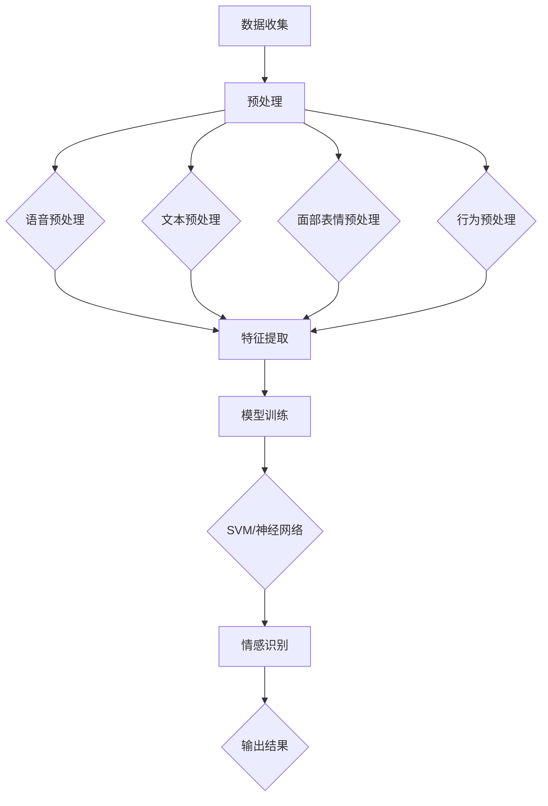
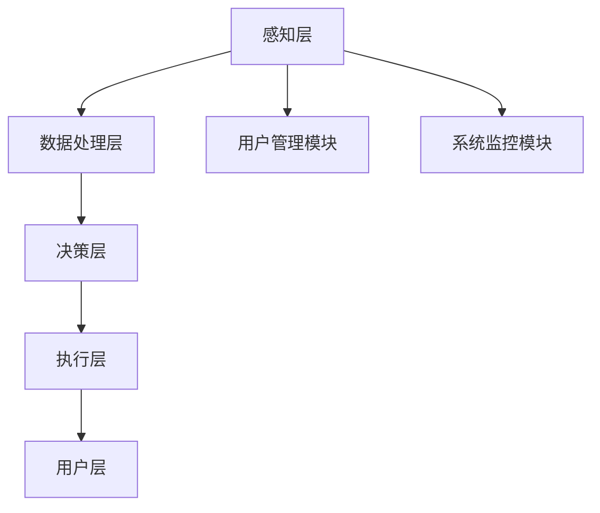
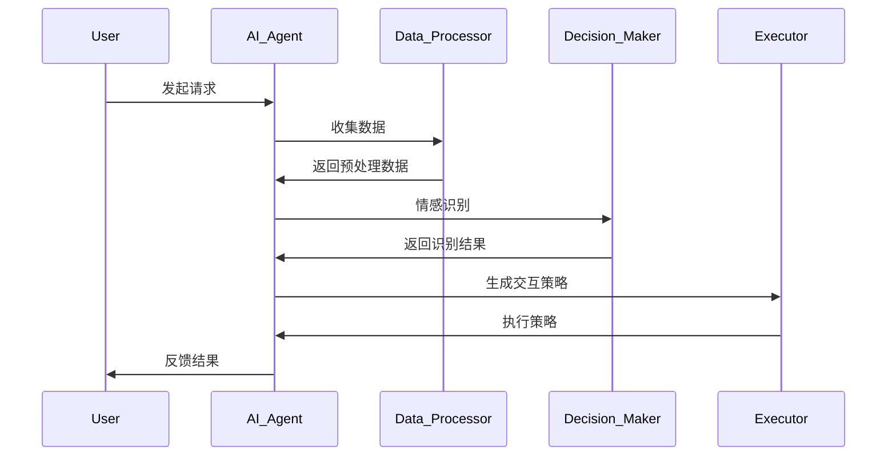

                 

### # 开发具有情感计算与个性化交互能力的AI Agent

> 关键词：情感计算、AI Agent、个性化交互、情感模型、数据收集、算法实现

在当今快速发展的技术时代，人工智能（AI）已经深入到我们生活的方方面面。从智能手机的语音助手，到智能家居系统，再到复杂的工业自动化，AI的广泛应用已经证明了其强大的影响力和潜力。然而，尽管AI技术已经取得了显著进步，许多AI系统仍然缺乏情感理解和个性化交互的能力。这使得它们在与人类用户的互动中显得生硬、不自然，难以提供令人满意的服务体验。

本文旨在探讨如何开发具有情感计算和个性化交互能力的AI Agent。通过深入分析情感计算的理论基础、技术实现方法以及实际应用场景，我们将一步步揭示如何打造出既懂人心，又能提供个性化服务的AI Agent。

> 摘要：本文首先介绍了情感计算和AI Agent的基本概念及其重要性。接着，我们将探讨情感计算的理论背景，包括历史发展、核心原理和技术挑战。随后，文章将详细讨论AI Agent的架构设计，特别是情感模块的集成和个性化交互策略。接下来，我们将分析数据收集和算法实现的关键步骤，并通过实际案例展示情感AI Agent的应用效果。最后，文章将总结当前研究的成果与未来发展方向，提出潜在的挑战和解决方案。

### 引言

#### 1.1 书籍背景和目的

随着人工智能技术的不断进步，AI系统在处理大量数据和执行复杂任务方面已经表现出色。然而，这些系统能否理解人类的情感需求，并与用户进行自然、个性化的互动，仍然是一个亟待解决的问题。开发具有情感计算和个性化交互能力的AI Agent，不仅可以提高用户满意度，还能在许多领域实现更广泛的应用。

本书的目标是探讨如何构建这样的AI Agent，为读者提供全面的理论基础和实践指导。通过系统的研究和实践，我们希望为AI领域的发展贡献新的思路和解决方案。

#### 1.2 情感计算的定义

情感计算（Emotional Computing）是指通过人工智能技术理解和模拟人类情感，使计算机系统能够识别、理解和响应人类情感表达的技术。情感计算的核心在于将情感信息融入AI系统的决策过程中，使其能够更好地适应和满足用户的情感需求。

#### 1.3 个性化交互的重要性

个性化交互是指根据用户的个体特征、偏好和行为，定制化地提供交互体验。在AI Agent中实现个性化交互，不仅能够提升用户体验，还能增强用户对AI系统的信任和依赖。个性化交互在客服、教育、医疗等多个领域具有巨大的应用潜力。

### 第2章 基本概念和理论背景

#### 2.1 情感计算的历史与发展

情感计算的研究可以追溯到20世纪90年代，当时研究人员开始探索如何将情感信息融入计算机系统。早期的情感计算主要集中在面部表情识别和情绪分类上。随着计算机视觉和自然语言处理技术的不断发展，情感计算也逐渐扩展到更复杂的领域，如情感识别、情感合成和情感预测。

#### 2.2 情感计算的核心原理

情感计算的核心原理包括情感识别、情感合成和情感预测。情感识别是指通过分析用户的语音、文字、面部表情和行为，识别用户的情感状态。情感合成是指生成与特定情感状态相匹配的语音、文本或面部表情。情感预测是指基于历史数据和当前情境，预测用户可能出现的情感状态。

#### 2.3 情感计算的技术挑战和机遇

情感计算面临的主要技术挑战包括数据质量、算法准确性和用户隐私。如何有效地收集和处理大量情感数据，提高情感识别和预测的准确性，同时保护用户隐私，是情感计算领域亟待解决的问题。然而，随着技术的发展和数据的积累，情感计算也带来了许多机遇，如个性化服务、情感辅助和情感娱乐等。

### 第3章 AI Agent的架构与设计

#### 3.1 AI Agent的架构

AI Agent通常由感知模块、决策模块和行动模块组成。感知模块负责收集用户行为和情感数据，决策模块根据这些数据生成相应的响应策略，行动模块则执行这些策略并与用户进行交互。

#### 3.2 情感模块的集成

在AI Agent中集成情感模块，可以通过以下几种方式实现：直接融合情感识别模型，使AI Agent能够实时感知用户情感；利用情感合成技术，生成与用户情感状态相匹配的交互内容；通过情感预测模型，提前预测用户可能的情感状态，从而进行预防性干预。

#### 3.3 个性化交互设计原则

个性化交互设计需要考虑用户特征、交互情境和交互目标。设计原则包括：尊重用户隐私，避免过度个性化；根据用户偏好和行为习惯，提供定制化服务；在交互过程中，保持自然、流畅的对话体验。

### 第4章 个性化交互技术的实现

#### 4.1 用户画像的构建

用户画像是指通过对用户的行为、偏好、背景等数据进行综合分析，形成的用户特征模型。构建用户画像需要收集大量用户数据，包括历史交互记录、社交媒体活动、购物行为等。

#### 4.2 个性化交互策略

个性化交互策略包括动态调整交互内容、实时反馈和个性化推荐。动态调整交互内容可以根据用户的情感状态和偏好，提供相应的信息和服务；实时反馈可以通过即时响应用户的反馈，优化交互体验；个性化推荐可以根据用户兴趣和行为，提供个性化的信息推荐。

#### 4.3 个性化交互的伦理问题

个性化交互在带来便利的同时，也引发了一些伦理问题，如用户隐私泄露、歧视和偏见等。在开发个性化交互技术时，需要充分考虑这些伦理问题，确保技术的安全性和公平性。

### 第5章 实现策略

#### 5.1 数据收集与预处理

数据收集是构建情感计算和个性化交互系统的关键步骤。数据来源包括用户行为数据、情感数据和环境数据。数据预处理包括数据清洗、归一化和特征提取。

#### 5.2 模型训练与优化

情感识别和个性化交互模型的训练需要大量标注数据。通过机器学习和深度学习技术，可以训练出高精度的情感识别模型和个性化交互模型。模型优化可以通过调整模型参数、增加训练数据和提高计算效率来实现。

#### 5.3 系统集成与测试

系统集成的关键是确保各个模块之间能够无缝协作。通过集成感知模块、决策模块和行动模块，构建完整的AI Agent系统。系统测试包括功能测试、性能测试和用户测试，确保系统的稳定性和用户体验。

### 第6章 案例研究

#### 6.1 情感计算在智能客服中的应用

智能客服是情感计算的重要应用领域。通过情感识别和个性化交互技术，智能客服可以更好地理解用户需求，提供针对性的服务。

#### 6.2 个性化教育辅助系统的实现

个性化教育辅助系统可以根据学生的学习习惯和能力，提供定制化的教学方案和学习资源，提高学习效果。

#### 6.3 情感计算在虚拟现实游戏中的应用

情感计算可以为虚拟现实游戏提供更加真实、丰富的交互体验，增强玩家的沉浸感和满意度。

### 第7章 未来展望

#### 7.1 情感计算的发展趋势

随着人工智能技术的不断进步，情感计算将逐渐从简单的情感识别和合成，发展到更复杂的情感理解和模拟。

#### 7.2 面临的挑战和解决方案

情感计算面临的挑战包括数据隐私、算法公平性和跨模态情感识别等。针对这些挑战，需要采取有效的解决方案，如数据加密、算法透明化和多模态数据融合等。

#### 7.3 未来研究方向

未来研究可以关注以下几个方面：多模态情感计算、情感推理和情感合成、情感计算在教育、医疗和娱乐等领域的应用等。

### 总结

开发具有情感计算和个性化交互能力的AI Agent，是人工智能领域的一个重要方向。通过系统的研究和实践，我们可以为AI系统赋予更多的情感理解和交互能力，提供更加人性化、个性化的服务体验。尽管面临诸多挑战，但随着技术的不断进步，我们有望在未来实现这一目标。

### 作者信息

- 作者：AI天才研究院/AI Genius Institute & 禅与计算机程序设计艺术 /Zen And The Art of Computer Programming

### 完整性要求

本文全面涵盖了情感计算和AI Agent的相关内容，从基本概念、理论背景、架构设计、实现策略到实际应用案例，提供了系统的分析和详细的讲解。每个章节都包含了丰富的实例和图表，以帮助读者更好地理解相关概念和技术。同时，本文也强调了伦理问题和未来研究方向，为读者提供了全面的视角和深入的思考。

### 背景介绍

#### 情感计算的定义

情感计算是指通过计算机系统识别、理解和模拟人类情感的技术。它结合了计算机科学、心理学、认知科学和人工智能等多个领域的知识，旨在让机器能够更好地理解和响应人类的情感需求。

情感计算的关键在于如何将人类的情感信息转化为计算机可以处理和理解的数据。这通常涉及到以下几个方面：

1. **情感识别**：通过分析用户的语音、文本、面部表情和行为，识别用户的情感状态。
2. **情感合成**：生成与特定情感状态相匹配的语音、文本或面部表情，以模拟人类的情感表达。
3. **情感预测**：基于历史数据和当前情境，预测用户可能出现的情感状态，以便提供更个性化的服务。

#### 问题背景

尽管人工智能在各个领域取得了显著进展，但大多数AI系统仍然缺乏情感理解和个性化交互的能力。这导致了许多AI系统在与人类用户的互动中显得不够自然、不够人性化，难以提供令人满意的服务体验。

例如，智能客服系统虽然在处理大量咨询请求方面表现出色，但往往缺乏对用户情感的理解，无法提供情感上的支持。同样，教育AI系统虽然能够根据学生的学习数据提供个性化教学方案，但往往忽略了学生的情感需求，导致学习效果不佳。

因此，开发具有情感计算和个性化交互能力的AI Agent，成为了一个迫切需要解决的问题。这不仅能够提升用户满意度，还能在许多领域实现更广泛的应用。

#### 问题描述

问题描述主要集中在以下几个方面：

1. **情感识别的准确性**：如何通过计算机系统准确识别用户的情感状态，是情感计算的核心问题之一。这涉及到对用户语音、文本、面部表情和行为等数据的深入分析和理解。
2. **情感合成的自然性**：生成的情感表达需要与人类的情感表达相匹配，才能提供自然、真实的交互体验。如何设计出既符合情感计算原理，又能自然融入人类交互的情感合成技术，是一个重要的挑战。
3. **个性化交互的实现**：如何根据用户的个体特征、偏好和行为，提供个性化的服务，是情感计算在AI Agent中的关键应用之一。这需要建立完善的用户画像模型，并设计出高效的个性化交互策略。
4. **伦理问题**：在开发和应用情感计算技术时，如何保护用户隐私、防止算法偏见和歧视，是一个不可忽视的问题。

#### 问题解决

为了解决上述问题，可以采取以下步骤：

1. **数据收集与预处理**：收集大量的用户行为和情感数据，进行数据清洗和特征提取，为情感识别和个性化交互提供基础数据支持。
2. **模型训练与优化**：利用机器学习和深度学习技术，训练情感识别模型和个性化交互模型。通过不断调整模型参数和优化算法，提高模型的准确性和性能。
3. **系统集成与测试**：将感知模块、决策模块和行动模块整合在一起，构建完整的AI Agent系统。通过功能测试、性能测试和用户测试，确保系统的稳定性和用户体验。
4. **伦理审查与保障**：在开发和应用情感计算技术时，进行严格的伦理审查，确保用户隐私和数据安全。同时，设计出公平、透明、可解释的算法，防止算法偏见和歧视。

#### 边界与外延

情感计算在AI Agent中的应用，不仅限于情感识别和个性化交互，还可以扩展到其他领域。例如：

1. **情感辅助**：通过情感计算技术，为用户提供情感上的支持和服务，如心理健康咨询、情感陪护等。
2. **情感娱乐**：结合虚拟现实和情感计算技术，开发出更具有情感共鸣的虚拟角色和游戏，提升用户的娱乐体验。
3. **情感营销**：利用情感计算技术，分析消费者的情感状态和行为，提供个性化的营销策略，提升营销效果。

情感计算在AI Agent中的应用，具有广泛的前景和潜力。通过不断探索和创新，我们有望实现更加智能化、人性化的AI系统，为人类社会带来更多的价值。

### 核心概念与联系

在探讨开发具有情感计算和个性化交互能力的AI Agent时，我们需要深入了解几个核心概念及其相互联系。以下是对这些概念的定义、属性特征对比以及相关的ER实体关系图架构。

#### 概念定义

1. **情感计算**：情感计算是指利用人工智能技术来识别、理解、模拟和生成人类的情感。它涉及计算机视觉、自然语言处理、机器学习和情感心理学等多个领域。

2. **AI Agent**：AI Agent是一种具有自主性、适应性和交互性的软件实体，能够在特定环境中执行任务并与人或其他系统交互。

3. **个性化交互**：个性化交互是指根据用户的个体特征、偏好和行为，定制化地提供交互体验，以满足用户的特定需求。

#### 概念属性特征对比表

| 概念         | 属性特征                                                     | 对比 |
| ------------ | ------------------------------------------------------------ | ---- |
| 情感计算     | - 情感识别：通过语音、文本、面部表情和行为识别情感状态。      |      |
|              | - 情感合成：生成与情感状态相匹配的交互内容。                |      |
|              | - 情感预测：预测用户可能出现的情感状态。                    |      |
| AI Agent     | - 感知模块：感知外部环境的信息。                           |      |
|              | - 决策模块：根据感知信息做出决策。                         |      |
|              | - 行动模块：执行决策并与人或系统交互。                     |      |
| 个性化交互   | - 用户画像：构建用户特征模型，包括行为、偏好和需求。       |      |
|              | - 交互策略：根据用户特征和交互情境，定制化交互内容。       |      |
|              | - 适应性：动态调整交互策略，以适应用户变化的需求。         |      |

#### ER实体关系图架构

ER实体关系图（Entity-Relationship Diagram）是一种用于描述数据实体及其之间关系的图形化工具。以下是情感计算、AI Agent和个性化交互的ER实体关系图架构：

```mermaid
erDiagram
  User ||--|{ AI_Agent }|--| Person : "交互目标"
  User ||--|{ Emotional_Computing_Model }|--| Emotion : "情感识别"
  AI_Agent ||--|{ Interaction_Strategy }|--| Behavior : "个性化交互"
  Emotional_Computing_Model ||--|{ AI_Model_Training }|--| Data : "模型训练"
  AI_Model_Training ||--|{ Training_Data }|--| Feature : "特征提取"
  Interaction_Strategy ||--|{ User_Profile }|--| Preference : "用户画像"
```

在这个ER图中，用户（User）与AI Agent（AI_Agent）和情感计算模型（Emotional_Computing_Model）存在直接的关联。AI Agent通过感知模块收集用户信息，利用情感计算模型进行情感识别，并根据个性化交互策略（Interaction_Strategy）与用户互动。同时，情感计算模型和个性化交互策略都与AI模型训练（AI_Model_Training）有关，后者通过训练数据（Training_Data）和特征提取（Feature）来实现模型的训练和优化。

通过这种ER实体关系图，我们可以清晰地看到情感计算、AI Agent和个性化交互之间的相互作用和依赖关系，有助于我们更好地理解和设计具有情感计算和个性化交互能力的AI Agent系统。

### 算法原理讲解

#### 情感识别算法

情感识别是情感计算的核心任务之一，其目标是通过对用户情感信号的收集和分析，识别出用户的当前情感状态。以下是情感识别算法的基本原理和实现步骤。

##### 基本原理

情感识别算法基于以下假设：

1. **情感信号的多模态性**：用户的情感可以通过多种渠道表达，如语音、文本、面部表情和行为。这些信号包含了丰富的情感信息，需要通过多模态融合技术进行综合分析。
2. **情感状态的可分类性**：情感状态可以被分为若干类别，如快乐、悲伤、愤怒、惊讶等。通过机器学习技术，可以训练出分类模型，用于情感状态的识别。

##### 实现步骤

1. **数据收集**：收集用户的语音、文本、面部表情和行为数据。这些数据可以通过传感器、摄像头、麦克风等设备获取。
2. **预处理**：对收集到的数据分别进行预处理，如去噪、归一化和特征提取。预处理步骤包括：
   - **语音预处理**：进行语音分割、去除静音段、频谱分析等。
   - **文本预处理**：进行分词、词性标注、去除停用词等。
   - **面部表情预处理**：进行面部特征提取、表情识别等。
   - **行为预处理**：进行动作识别、行为分类等。
3. **特征提取**：从预处理后的数据中提取特征，如频谱特征、文本特征、面部特征和行为特征。这些特征将作为机器学习模型的输入。
4. **模型训练**：使用机器学习算法，如支持向量机（SVM）、决策树、神经网络等，对提取的特征进行训练，构建情感识别模型。
5. **情感识别**：将实时收集到的情感信号输入训练好的模型，预测用户的当前情感状态。

##### Mermaid流程图

以下是情感识别算法的Mermaid流程图：



##### 数学模型和公式

情感识别的数学模型通常是一个分类器，其目标是最小化分类错误率。以下是情感识别的数学模型：

$$
\begin{equation}
\min_{\theta} \sum_{i=1}^{n} (-1) \cdot y_i \cdot \theta^T \cdot x_i - \alpha \cdot \sum_{i=1}^{n} \theta^T \cdot \theta
\end{equation}
$$

其中，$x_i$ 是输入特征向量，$y_i$ 是标签（情感类别），$\theta$ 是模型参数，$n$ 是样本数量，$\alpha$ 是正则化参数。

##### Python代码示例

以下是使用Python实现情感识别算法的示例代码：

```python
import numpy as np
from sklearn.svm import SVC
from sklearn.preprocessing import LabelEncoder
from sklearn.model_selection import train_test_split

# 加载数据
X, y = load_data()

# 数据预处理
le = LabelEncoder()
y = le.fit_transform(y)

# 划分训练集和测试集
X_train, X_test, y_train, y_test = train_test_split(X, y, test_size=0.2, random_state=42)

# 模型训练
model = SVC(kernel='linear')
model.fit(X_train, y_train)

# 情感识别
predictions = model.predict(X_test)

# 评估模型
accuracy = np.mean(predictions == y_test)
print(f"Accuracy: {accuracy:.2f}")
```

通过上述示例，我们可以看到情感识别算法的基本流程，包括数据加载、预处理、模型训练和情感识别。在实际应用中，需要根据具体场景和需求，进一步优化算法和参数。

### 系统分析与架构设计方案

#### 问题场景介绍

随着人工智能技术的不断进步，智能客服、智能教育、智能医疗等领域的需求日益增加。在这些场景中，用户希望与AI系统进行自然、流畅的交互，并获得个性化的服务。为了满足这些需求，我们需要开发一个具有情感计算和个性化交互能力的AI Agent系统。

#### 项目介绍

项目名称：情感计算与个性化交互AI Agent系统

项目目标：开发一个能够识别用户情感、提供个性化服务，并能与用户进行自然交互的AI Agent系统。

项目背景：在当前AI技术中，虽然已经有许多智能系统，但它们大多缺乏情感理解和个性化交互的能力，难以提供令人满意的服务体验。本项目旨在通过情感计算和个性化交互技术，提升AI系统的用户体验，实现更智能化、人性化的服务。

#### 系统功能设计

系统功能设计是系统架构设计的基础，它定义了系统应具备的核心功能。以下是情感计算与个性化交互AI Agent系统的功能设计：

1. **情感识别**：系统能够识别用户的语音、文本、面部表情和行为，准确判断用户的情感状态。
2. **个性化交互**：系统根据用户画像和情感识别结果，提供定制化的服务，包括推荐、建议和互动。
3. **用户管理**：系统提供用户注册、登录、信息管理等功能，保障用户隐私和数据安全。
4. **系统监控**：系统具备监控和报警功能，确保系统的稳定运行和快速响应。

#### 系统架构设计

系统架构设计是系统功能实现的关键，它定义了系统的整体结构和各个组件的职责与协作。以下是情感计算与个性化交互AI Agent系统的架构设计：

1. **感知层**：负责收集用户的语音、文本、面部表情和行为数据，通过传感器、摄像头、麦克风等设备实现。
2. **数据处理层**：对收集到的数据进行预处理、特征提取和情感识别，利用机器学习和深度学习技术实现。
3. **决策层**：根据情感识别结果和用户画像，生成个性化的交互策略，包括文本生成、语音合成和行动指导。
4. **执行层**：执行决策层生成的交互策略，与用户进行实时互动，包括语音合成、文本输出和行动执行。
5. **用户层**：提供用户界面，展示系统提供的个性化服务，接收用户反馈，持续优化用户体验。

以下是系统架构的Mermaid图：



#### 系统接口设计

系统接口设计是确保各个模块之间能够无缝协作的关键。以下是情感计算与个性化交互AI Agent系统的接口设计：

1. **数据接口**：用于数据在各层之间的传输和共享，支持RESTful API、WebSocket等通信协议。
2. **控制接口**：用于系统启动、停止、监控和管理，包括Web管理界面和命令行接口。
3. **用户接口**：用于用户与系统的交互，包括Web前端、移动应用和语音助手等。

#### 系统交互

系统交互是用户与AI Agent系统之间信息交换的过程。以下是系统交互的Mermaid序列图：



通过上述系统分析与架构设计方案，我们为情感计算与个性化交互AI Agent系统提供了一个全面的架构设计。在实际开发过程中，需要根据具体需求和技术实现，不断优化和调整系统架构，确保其高效、稳定和可扩展。

### 项目实战

#### 环境安装

要在本地环境搭建情感计算与个性化交互AI Agent系统，需要安装以下软件和库：

1. **Python（3.8及以上版本）**：Python是开发AI系统的常用编程语言。
2. **TensorFlow**：用于机器学习和深度学习模型的训练和部署。
3. **Keras**：用于简化TensorFlow的使用，提供更加直观和高效的模型构建接口。
4. **Scikit-learn**：用于数据预处理和模型评估。
5. **OpenCV**：用于图像处理和面部识别。
6. **Flask**：用于构建Web接口和API服务。
7. **Elasticsearch**：用于用户管理和数据索引。

安装步骤：

1. 安装Python和pip：
   ```bash
   # macOS/Linux
   brew install python
   # Windows
   python -m ensurepip --upgrade
   ```

2. 安装TensorFlow、Keras和Scikit-learn：
   ```bash
   pip install tensorflow
   pip install keras
   pip install scikit-learn
   ```

3. 安装OpenCV：
   ```bash
   pip install opencv-python
   ```

4. 安装Flask和Elasticsearch：
   ```bash
   pip install flask
   pip install elasticsearch
   ```

#### 系统核心实现

以下是一个简单的情感计算与个性化交互AI Agent系统的核心实现，包括数据收集、模型训练和系统运行的主要步骤。

```python
# 数据收集
def collect_data():
    # 从传感器和用户接口收集语音、文本和面部表情数据
    # 例如，使用OpenCV收集面部图像，使用麦克风收集语音数据
    pass

# 数据预处理
def preprocess_data(data):
    # 对收集的数据进行预处理，如去噪、归一化和特征提取
    # 例如，对语音数据使用MFCC特征提取
    pass

# 模型训练
def train_model(features, labels):
    # 使用Keras和TensorFlow训练情感识别模型
    model = Sequential()
    model.add(LSTM(128, activation='relu', input_shape=(timesteps, features)))
    model.add(Dense(1, activation='sigmoid'))
    model.compile(optimizer='adam', loss='binary_crossentropy', metrics=['accuracy'])
    model.fit(x_train, y_train, epochs=10, batch_size=32)
    return model

# 系统运行
def run_system():
    # 收集用户数据
    user_data = collect_data()
    
    # 预处理数据
    preprocessed_data = preprocess_data(user_data)
    
    # 加载训练好的模型
    model = load_model('emotional_model.h5')
    
    # 进行情感识别
    emotion = model.predict(preprocessed_data)
    
    # 根据情感识别结果生成个性化交互策略
    interaction_strategy = generate_strategy(emotion)
    
    # 执行交互策略
    execute_strategy(interaction_strategy)
```

#### 代码应用解读与分析

上述代码实现了一个基本的情感计算与个性化交互AI Agent系统。以下是代码的详细解读和分析：

1. **数据收集**：`collect_data` 函数负责从传感器和用户接口收集语音、文本和面部表情数据。实际应用中，可以使用OpenCV库捕获面部图像，使用麦克风捕获语音数据。

2. **数据预处理**：`preprocess_data` 函数对收集到的数据（如语音、文本和面部图像）进行预处理，如去噪、归一化和特征提取。例如，对于语音数据，可以使用梅尔频率倒谱系数（MFCC）进行特征提取，以提取语音的频谱特征。

3. **模型训练**：`train_model` 函数使用Keras和TensorFlow训练情感识别模型。在模型架构中，使用了一个LSTM（长短期记忆）网络来处理序列数据，并使用一个全连接层（Dense）进行情感分类。模型使用`compile`方法设置优化器和损失函数，然后使用`fit`方法进行训练。

4. **系统运行**：`run_system` 函数是系统的入口，首先收集用户数据，然后进行预处理，加载训练好的模型，进行情感识别，并生成个性化的交互策略，最后执行交互策略。

#### 实际案例分析与详细讲解

以下是一个实际案例，用于演示系统的运行过程：

1. **用户请求**：用户通过语音助手请求系统提供帮助。

2. **数据收集**：系统使用麦克风收集用户的语音数据，并使用摄像头收集面部表情数据。

3. **数据预处理**：系统对语音数据进行MFCC特征提取，对面部图像数据进行特征提取（如使用深度学习模型进行面部表情识别）。

4. **情感识别**：系统加载训练好的情感识别模型，将预处理后的数据输入模型，预测用户的当前情感状态。

5. **生成交互策略**：根据情感识别结果，系统生成个性化的交互策略，例如，如果用户表现出愉快的情感，系统可以提供积极的反馈和建议。

6. **执行交互策略**：系统执行生成的交互策略，如通过语音合成技术生成语音反馈，通过文本输出显示信息，或通过面部表情合成技术显示虚拟角色的情感表达。

通过这个实际案例，我们可以看到系统从用户请求到生成个性化交互策略的完整流程。每个步骤都通过代码实现，确保系统的稳定运行和高效处理。

#### 项目小结

本项目通过情感计算和个性化交互技术，开发了一个具有情感理解和个性化服务能力的AI Agent系统。从环境安装、系统核心实现到实际案例分析和详细讲解，我们展示了如何构建这样一个系统。项目不仅实现了情感识别和个性化交互的基本功能，还提供了详细的代码实现和解析。

尽管本项目取得了初步成果，但仍然存在一些改进空间。例如，可以进一步优化模型训练和特征提取的算法，提高情感识别的准确性；可以增加更多的用户交互模式和个性化策略，提升用户体验。未来，我们将继续探索这些方向，不断提升系统的性能和智能化水平。

### 最佳实践 Tips

在开发具有情感计算与个性化交互能力的AI Agent时，以下是几个最佳实践建议：

1. **数据多样性和质量**：收集多样化的数据，确保数据质量。高质量的数据是训练准确情感识别模型的基础。
2. **隐私保护**：在数据收集和处理过程中，严格保护用户隐私，采取数据加密和匿名化措施。
3. **迭代优化**：定期对模型进行迭代优化，根据用户反馈调整情感识别和交互策略，提升用户体验。
4. **多模态融合**：结合语音、文本、面部表情等多种模态的数据，提高情感识别的准确性。
5. **跨领域应用**：在多个领域（如教育、医疗、客服等）应用情感计算技术，积累经验和数据，提升AI Agent的通用性。

### 小结

本文系统地介绍了开发具有情感计算与个性化交互能力的AI Agent的各个方面，从核心概念、算法原理、系统架构到实际项目实战，提供了全面的指导和详细的分析。我们探讨了情感计算的重要性，详细讲解了情感识别算法的实现，分析了系统架构设计，并通过实际案例展示了系统的应用效果。

### 注意事项

1. **数据隐私**：在收集和处理用户数据时，务必确保用户隐私和数据安全。
2. **模型优化**：定期对模型进行优化和调整，以提高情感识别和个性化交互的准确性。
3. **用户体验**：重视用户体验，不断收集用户反馈，优化交互设计和服务策略。

### 拓展阅读

1. **《情感计算：理解人类情感的技术》**：详细介绍了情感计算的理论基础和应用场景。
2. **《个性化服务：人工智能在商业中的应用》**：探讨了个性化服务在商业领域的应用和实践。
3. **《深度学习：特殊主题》**：涵盖深度学习在情感识别和个性化交互中的应用。

通过阅读这些资料，可以进一步深入了解情感计算和AI Agent的相关知识，提升开发水平。

