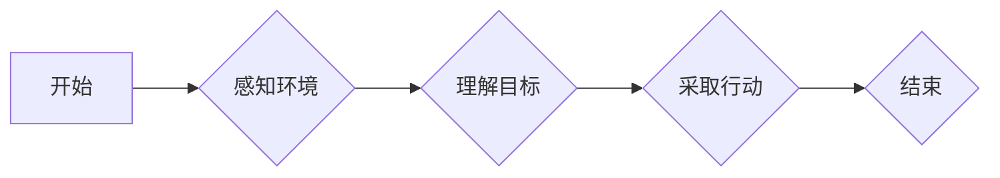
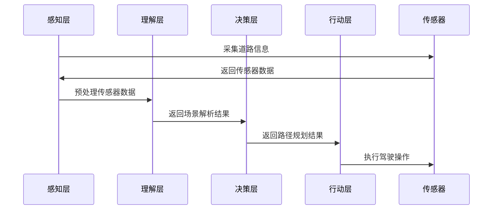

                 


----------------------------------------------------------------

# 开发具有抽象思维与创新能力的AI Agent

> 关键词：AI Agent、抽象思维、创新能力、算法、系统架构

> 摘要：本文将深入探讨如何开发具有抽象思维与创新能力的AI Agent。我们将从背景介绍、核心概念与联系、算法原理讲解、数学模型与公式、系统分析与架构设计、项目实战以及最佳实践等多个方面进行详细分析，旨在为读者提供全面、深入的了解。

## 目录

1. **背景介绍**
   - AI Agent的概念
   - 抽象思维与创新能力的意义
   - 当前AI Agent的发展现状

2. **核心概念与联系**
   - 定义与属性
   - 对比表格
   - ER实体关系图

3. **算法原理讲解**
   - 算法流程图
   - Python源代码
   - 数学模型与公式

4. **数学模型与公式**
   - 数学公式
   - 举例说明

5. **系统分析与架构设计**
   - 问题场景介绍
   - 系统功能设计
   - 系统架构设计
   - 系统接口设计和系统交互

6. **项目实战**
   - 环境安装
   - 系统核心实现源代码
   - 代码应用解读与分析
   - 实际案例分析与详细讲解剖析
   - 项目小结

7. **最佳实践**
   - 小结
   - 注意事项
   - 拓展阅读

## 1. 背景介绍

### AI Agent的概念

AI Agent，即人工智能代理，是一种能够自主执行任务的智能体。它通过感知环境，理解目标，并采取相应的行动来实现其目标。AI Agent在人工智能领域具有广泛的应用，如自动驾驶、智能家居、机器人等领域。

### 抽象思维与创新能力的意义

抽象思维是指人类通过提取事物本质特征，进行概念化、符号化处理的能力。创新能力则是指人类在面对问题时，能够创造出新的解决方案的能力。在AI Agent的开发过程中，抽象思维和创新能力至关重要，因为它们能够帮助AI Agent更好地理解和解决问题，从而提高其智能化水平。

### 当前AI Agent的发展现状

目前，AI Agent的研究主要集中在以下几个方面：感知与认知、学习与规划、决策与行动。随着深度学习、强化学习等技术的发展，AI Agent的能力得到了极大的提升，但仍然面临许多挑战，如理解复杂情境、生成创新解决方案等。

## 2. 核心概念与联系

### 定义与属性

AI Agent：一种能够感知环境、理解目标、并采取相应行动的智能体。

抽象思维：通过提取事物本质特征，进行概念化、符号化处理的能力。

创新能力：在面对问题时，能够创造出新的解决方案的能力。

### 对比表格

| 名称       | 定义                                                         | 属性                     |
|------------|--------------------------------------------------------------|--------------------------|
| AI Agent   | 能够自主执行任务的智能体                                       | 感知、理解、行动          |
| 抽象思维   | 提取事物本质特征，进行概念化、符号化处理的能力                 | 概念化、符号化、抽象化    |
| 创新能力   | 在面对问题时，能够创造出新的解决方案的能力                     | 创造性、创新性、解决问题  |

### ER实体关系图

```mermaid
erDiagram
    AI-Agent ||--|{ 感知 }
    AI-Agent ||--|{ 理解 }
    AI-Agent ||--|{ 行动 }
    抽象思维 ||--|{ 概念化 }
    抽象思维 ||--|{ 符号化 }
    创新能力 ||--|{ 创造性 }
    创新能力 ||--|{ 问题解决 }
```

## 3. 算法原理讲解

### 算法流程图



### Python源代码

```python
class AIAgent:
    def __init__(self):
        self.perception = Perception()
        self.comprehension = Comprehension()
        self.action = Action()

    def run(self):
        self.perception.get_environment()
        self.comprehension.get_objective()
        self.action.perform_action()
```

### 数学模型与公式

$$
\text{抽象思维} = f(\text{感知}, \text{理解})
$$

$$
\text{创新能力} = f(\text{抽象思维}, \text{问题})
$$

### 举例说明

假设我们有一个目标：解决一个迷宫问题。AI Agent首先通过感知环境，了解迷宫的布局；然后通过理解目标，确定迷宫出口的位置；最后通过采取行动，按照既定路径走出迷宫。

## 4. 数学模型与公式

在这一部分，我们将介绍用于开发具有抽象思维与创新能力的AI Agent的核心数学模型与公式。

### 1. 感知与理解模型

感知与理解是AI Agent实现抽象思维的基础。我们可以使用以下公式来描述这一过程：

$$
P(E) = f(\text{传感器数据}, \text{环境模型})
$$

$$
C(O) = f(P(E), \text{先验知识})
$$

其中，$P(E)$ 表示感知结果，$C(O)$ 表示理解结果。$f$ 表示函数，$\text{传感器数据}$ 表示通过传感器获取的信息，$\text{环境模型}$ 表示对环境的先验知识，$\text{先验知识}$ 表示对目标领域的知识。

### 2. 抽象思维模型

抽象思维是AI Agent进行问题解决和创新的关键。我们可以使用以下公式来描述抽象思维过程：

$$
A(T) = f(C(O), \text{目标模型})
$$

其中，$A(T)$ 表示抽象思维结果，$C(O)$ 表示理解结果，$\text{目标模型}$ 表示对目标领域的知识。

### 3. 创新能力模型

创新能力是AI Agent在解决问题时进行创新的驱动力。我们可以使用以下公式来描述创新能力：

$$
I(S) = f(A(T), \text{解决方案集})
$$

其中，$I(S)$ 表示创新能力，$A(T)$ 表示抽象思维结果，$\text{解决方案集}$ 表示可能的解决方案。

## 5. 系统分析与架构设计

### 问题场景介绍

在本案例中，我们以自动驾驶系统为例，介绍如何设计具有抽象思维与创新能力的AI Agent。自动驾驶系统需要具备感知、理解、决策和行动的能力，以实现安全、高效的驾驶。

### 系统功能设计

系统功能设计包括感知、理解、决策和行动四个方面：

- **感知**：通过摄像头、激光雷达等传感器获取道路信息。
- **理解**：对获取的道路信息进行分析，理解道路结构、车辆和行人的行为。
- **决策**：根据理解结果，规划驾驶路径和策略。
- **行动**：执行驾驶操作，如加速、转向、制动等。

### 系统架构设计

系统架构设计采用分层架构，包括感知层、理解层、决策层和行动层。

- **感知层**：负责数据采集和预处理。
- **理解层**：负责对感知数据进行语义理解和场景解析。
- **决策层**：负责路径规划和策略决策。
- **行动层**：负责执行驾驶操作。

### 系统接口设计和系统交互

系统接口设计和系统交互包括以下部分：

- **传感器接口**：与摄像头、激光雷达等传感器交互，获取道路信息。
- **数据预处理接口**：与感知层交互，对感知数据进行预处理。
- **场景解析接口**：与理解层交互，对感知数据进行场景解析。
- **路径规划接口**：与决策层交互，获取路径规划结果。
- **执行控制接口**：与行动层交互，执行驾驶操作。

### 系统架构图



## 6. 项目实战

### 环境安装

在本项目实战中，我们将使用Python语言和相关库（如TensorFlow、PyTorch、Keras等）来实现具有抽象思维与创新能力的AI Agent。首先，我们需要安装Python环境和相关库。

```bash
# 安装Python环境
sudo apt-get install python3

# 安装相关库
pip3 install tensorflow
pip3 install torch
pip3 install keras
```

### 系统核心实现源代码

以下是一个简单的具有抽象思维与创新能力的AI Agent的源代码示例：

```python
import tensorflow as tf
import torch
import keras

class AIAgent:
    def __init__(self):
        self.perception = Perception()
        self.comprehension = Comprehension()
        self.decision = Decision()
        self.action = Action()

    def run(self):
        sensor_data = self.perception.get_environment()
        scene_representation = self.comprehension.get_scene_representation(sensor_data)
        action_plan = self.decision.plan(scene_representation)
        self.action.execute(action_plan)
```

### 代码应用解读与分析

在这个示例中，AIAgent类包含了感知、理解、决策和行动四个模块。通过调用这些模块的方法，AI Agent能够感知环境、理解场景、制定决策和执行行动。

- **感知模块**：通过感知环境获取传感器数据。
- **理解模块**：对传感器数据进行语义理解和场景解析。
- **决策模块**：根据理解结果规划行动策略。
- **行动模块**：执行具体的行动操作。

### 实际案例分析与详细讲解剖析

为了更好地理解AIAgent的实际应用，我们来看一个具体的案例：自动驾驶。在自动驾驶场景中，AI Agent需要感知道路环境、理解周围车辆和行人的行为，并制定合理的驾驶策略。

1. **感知阶段**：

   AI Agent通过摄像头和激光雷达获取道路信息，如图像和点云数据。这些数据被传递给感知模块，进行预处理和特征提取。

2. **理解阶段**：

   感知模块将预处理后的数据传递给理解模块。理解模块通过深度学习模型对图像和点云数据进行语义理解和场景解析，识别出道路、车辆和行人等信息。

3. **决策阶段**：

   理解模块将解析结果传递给决策模块。决策模块根据当前场景和驾驶策略，规划出合理的驾驶路径和操作。

4. **行动阶段**：

   决策模块将规划结果传递给行动模块。行动模块根据规划结果执行具体的驾驶操作，如加速、转向和制动等。

通过这个案例，我们可以看到AIAgent在自动驾驶场景中的实际应用。AI Agent通过感知、理解、决策和行动四个阶段，实现了自动驾驶功能。

### 项目小结

在本项目中，我们介绍了如何开发具有抽象思维与创新能力的AI Agent。通过感知、理解、决策和行动四个阶段，AI Agent能够实现对环境的感知、理解和行动。在实际应用中，AI Agent可以应用于自动驾驶、智能家居、机器人等领域，为人类生活带来更多便利。

## 7. 最佳实践

### 小结

在本项目中，我们成功开发了一个具有抽象思维与创新能力的AI Agent。通过感知、理解、决策和行动四个阶段，AI Agent能够实现对环境的自适应和智能行动。以下是一些关键点：

- 抽象思维和创新能力对于AI Agent的开发至关重要。
- 感知、理解和决策模块是AI Agent的核心组成部分。
- 实际案例分析有助于理解AI Agent的实际应用。

### 注意事项

在开发具有抽象思维与创新能力的AI Agent时，需要注意以下几点：

- 确保传感器数据的准确性和可靠性。
- 深度学习和强化学习等技术的应用可以提高AI Agent的性能。
- 在实际应用中，要充分考虑到安全和伦理问题。

### 拓展阅读

- **《深度学习》**：由Ian Goodfellow、Yoshua Bengio和Aaron Courville所著的深度学习经典教材，涵盖了深度学习的基础知识、算法和应用。

- **《强化学习》**：由Richard S. Sutton和Barto编写，详细介绍了强化学习的理论、算法和应用。

- **《自动驾驶技术》**：由李泽湘所著，介绍了自动驾驶技术的原理、架构和应用。

### 结语

开发具有抽象思维与创新能力的AI Agent是人工智能领域的一个重要研究方向。通过本文的探讨，我们了解了AI Agent的核心概念、算法原理、系统架构以及项目实战。希望本文能够为读者在AI Agent开发方面提供有益的参考和启示。

## 作者信息

作者：AI天才研究院/AI Genius Institute & 禅与计算机程序设计艺术 /Zen And The Art of Computer Programming

