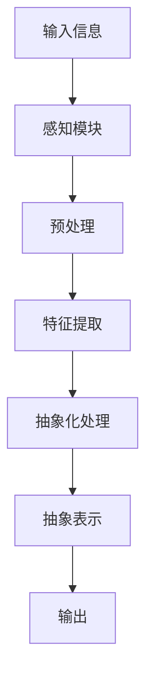
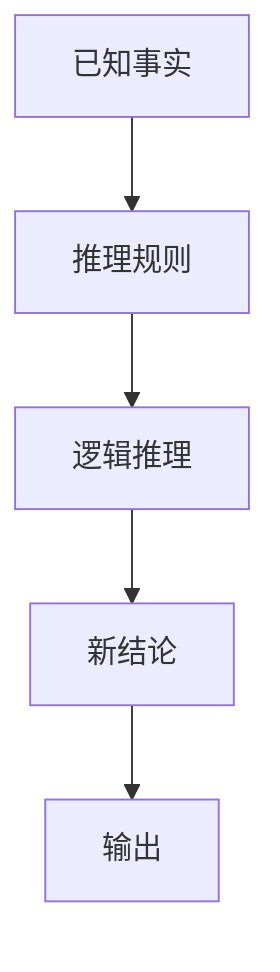
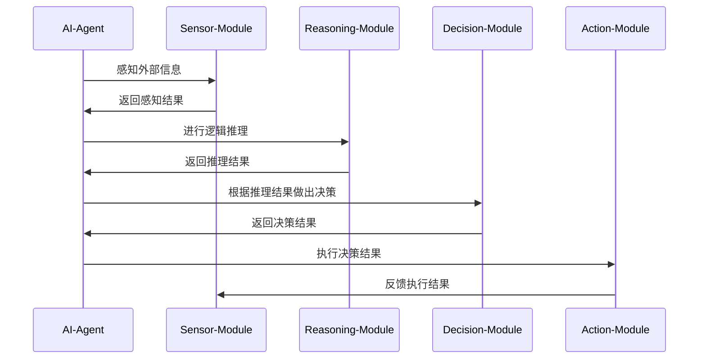
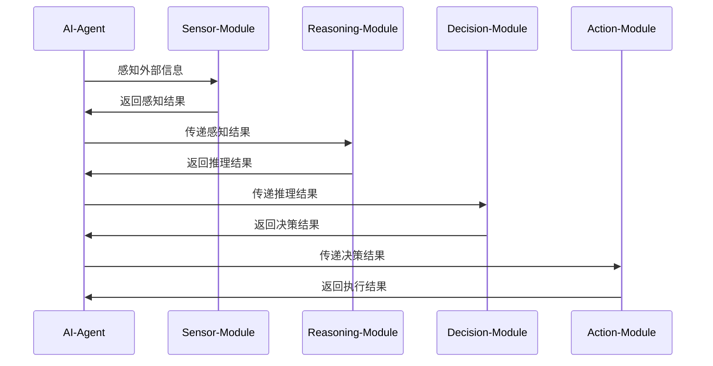

                 

### 文章标题

# 开发具有抽象思维与推理能力的AI Agent

> 关键词：抽象思维、推理能力、AI Agent、算法原理、系统架构

> 摘要：本文深入探讨了开发具有抽象思维与推理能力的AI Agent的核心概念、算法原理、系统架构和项目实战。通过详细的分析与实例，本文旨在帮助读者理解AI Agent的开发流程，提升其在人工智能领域的实践能力。

### 目录大纲

**《开发具有抽象思维与推理能力的AI Agent》**

----------------------------------------------------------------

# 第一部分：背景介绍与核心概念

## 第1章：问题背景与核心概念

### 1.1 人工智能与抽象思维

- **问题描述**：人工智能如何具备抽象思维能力？
- **问题解决**：介绍抽象思维的定义，探讨人工智能在抽象思维方面的应用。

### 1.2 推理能力在人工智能中的应用

- **问题描述**：如何实现具有推理能力的AI Agent？
- **问题解决**：介绍推理能力的定义，分析推理在人工智能中的应用。

### 1.3 AI Agent的开发边界与外延

- **边界与外延**：明确AI Agent的开发范围，讨论其与其他人工智能技术的联系。

### 1.4 核心概念的结构与组成

- **概念结构**：梳理抽象思维和推理能力的核心概念。
- **要素组成**：分析AI Agent开发所需的关键要素。

## 第2章：AI Agent的核心概念与联系

### 2.1 抽象思维的概念原理

- **概念原理**：详细解释抽象思维的基本原理。
- **属性特征对比**：使用表格对比不同形式的抽象思维。

### 2.2 推理能力的概念解析

- **概念解析**：深入分析推理能力的基本概念。
- **推理模型**：介绍常见的推理模型。

### 2.3 AI Agent的ER实体关系图

- **ER图架构**：绘制AI Agent的ER实体关系图，展示各个实体及其关系。

----------------------------------------------------------------

# 第二部分：算法原理与实现

## 第3章：抽象思维的算法原理

### 3.1 抽象思维算法流程图

- **流程图**：使用Mermaid绘制抽象思维算法流程图。

### 3.2 抽象思维算法的数学模型

- **数学模型**：给出抽象思维算法的数学模型和公式。
- **详细讲解**：解释每个公式的含义和应用。

### 3.3 抽象思维算法的Python实现

- **Python代码**：展示抽象思维算法的Python实现。
- **举例说明**：通过具体例子来说明算法的应用。

----------------------------------------------------------------

## 第4章：推理能力的算法原理

### 4.1 推理能力算法流程图

- **流程图**：使用Mermaid绘制推理能力算法流程图。

### 4.2 推理能力的数学模型

- **数学模型**：给出推理能力算法的数学模型和公式。
- **详细讲解**：解释每个公式的含义和应用。

### 4.3 推理能力的Python实现

- **Python代码**：展示推理能力算法的Python实现。
- **举例说明**：通过具体例子来说明算法的应用。

----------------------------------------------------------------

# 第三部分：系统分析与架构设计

## 第5章：系统功能设计

### 5.1 领域模型Mermaid类图

- **类图**：使用Mermaid绘制AI Agent的领域模型类图。

### 5.2 系统功能设计

- **功能设计**：详细描述系统的各个功能模块。

----------------------------------------------------------------

## 第6章：系统架构设计

### 6.1 系统架构Mermaid架构图

- **架构图**：使用Mermaid绘制AI Agent的系统架构图。

### 6.2 系统接口设计

- **接口设计**：详细描述系统的各个接口。

### 6.3 系统交互Mermaid序列图

- **序列图**：使用Mermaid绘制AI Agent的系统交互序列图。

----------------------------------------------------------------

# 第四部分：项目实战

## 第7章：环境安装与系统核心实现

### 7.1 环境安装

- **环境安装**：指导读者如何安装和配置AI Agent的开发环境。

### 7.2 系统核心实现

- **核心实现**：展示AI Agent的核心代码实现。
- **代码应用解读**：分析代码的应用场景和实现细节。

----------------------------------------------------------------

# 作者信息

- 作者：AI天才研究院/AI Genius Institute & 禅与计算机程序设计艺术 /Zen And The Art of Computer Programming

### 第一部分：背景介绍与核心概念

## 第1章：问题背景与核心概念

### 1.1 人工智能与抽象思维

人工智能（Artificial Intelligence，AI）作为计算机科学的一个重要分支，近年来在各个领域取得了显著进展。然而，传统的人工智能主要侧重于数据处理、模式识别和机器学习等方面，对于抽象思维和推理能力的培养仍存在一定的局限性。抽象思维是指人类在认知过程中，通过抽取事物本质特征，进行概念化、概括化和抽象化的过程。这种能力使得人类能够超越具体情境，理解复杂问题的内在规律。

在人工智能领域，抽象思维的应用主要体现在以下几个方面：

1. **知识表示**：抽象思维使得人工智能系统能够将复杂的信息以简明的方式表示出来，从而便于后续处理和分析。
2. **问题求解**：抽象思维帮助人工智能从具体的问题情景中提取关键信息，建立问题的模型，从而寻找解决方案。
3. **知识获取**：人工智能通过抽象思维，可以从大量数据中提取出有用的知识和规律，实现自我学习和进化。

### 1.2 推理能力在人工智能中的应用

推理能力是指人工智能在已知事实的基础上，通过逻辑推理得出新结论的能力。这种能力是人工智能实现智能行为的核心。推理能力在人工智能中的应用主要包括以下几个方面：

1. **自然语言处理**：通过推理，人工智能能够理解自然语言中的隐含意义，进行语义分析和对话生成。
2. **决策支持系统**：人工智能通过推理，可以分析复杂的数据，为决策者提供合理的建议。
3. **自动化规划**：人工智能通过推理，能够规划出一系列行动，实现任务的自动化完成。

### 1.3 AI Agent的开发边界与外延

AI Agent，即人工智能代理，是指能够自主执行任务、与环境交互并具有智能行为的实体。开发具有抽象思维与推理能力的AI Agent，不仅需要理解抽象思维和推理能力的基本概念，还需要明确AI Agent的开发边界与外延。

1. **边界**：
   - **功能范围**：AI Agent应明确其执行任务的范围和目标，避免过度的泛化。
   - **数据边界**：AI Agent在处理数据时，应确保数据的质量和来源，避免因数据问题导致推理错误。

2. **外延**：
   - **应用领域**：AI Agent可以应用于医疗、金融、教育等多个领域，解决具体的问题。
   - **技术融合**：AI Agent的开发可以融合多种人工智能技术，如机器学习、自然语言处理、计算机视觉等，实现更强大的功能。

### 1.4 核心概念的结构与组成

为了更好地理解抽象思维和推理能力在AI Agent开发中的应用，我们需要梳理这两个核心概念的结构与组成。

#### 抽象思维

1. **层次结构**：
   - **感知层次**：通过感官获取外部信息，如视觉、听觉等。
   - **理解层次**：对感知层次的信息进行加工处理，理解其含义。
   - **抽象层次**：从具体的信息中提取本质特征，进行抽象化处理。

2. **要素组成**：
   - **概念**：对事物本质特征的命名和描述。
   - **范畴**：概念之间的分类关系。
   - **模型**：对抽象概念的具体表示和描述。

#### 推理能力

1. **推理类型**：
   - **演绎推理**：从一般到特殊的推理过程，如“所有人都有生命，张三是人，因此张三有生命”。
   - **归纳推理**：从特殊到一般的推理过程，如“观察多个苹果都是红色的，因此推断所有苹果都是红色的”。
   - **类比推理**：通过比较两个相似情景，推断出新的结论，如“由于苹果落地会引起地球的引力，因此推断橙子落地也会引起地球的引力”。

2. **要素组成**：
   - **前提**：推理的初始条件。
   - **结论**：由前提推导出的结果。
   - **逻辑规则**：推理过程中使用的逻辑规则，如“如果A则B，A成立，因此B成立”。

### 1.5 AI Agent开发的关键要素

1. **数据管理**：确保数据的质量和来源，为AI Agent提供可靠的输入。
2. **算法选择**：选择合适的算法，实现抽象思维和推理能力。
3. **系统架构**：设计合理的系统架构，确保AI Agent的稳定运行和扩展性。
4. **用户交互**：设计友好的用户交互界面，提高用户体验。

## 第2章：AI Agent的核心概念与联系

### 2.1 抽象思维的概念原理

抽象思维是人工智能实现智能行为的重要基础。它涉及到对信息的提取、加工和表示。以下是抽象思维的基本原理：

1. **信息提取**：通过传感器和接口，从环境中获取信息。这些信息可以是视觉、听觉、触觉等。
2. **信息加工**：对获取的信息进行预处理，包括去噪、增强、滤波等。这一步骤有助于提高信息的准确性和可靠性。
3. **信息表示**：将加工后的信息转换为计算机可以理解和处理的形式，如数字、符号、向量等。

#### 抽象思维的类型

1. **形式化抽象**：通过数学和逻辑的方式，对现实世界进行建模。例如，使用数学公式描述物理现象，使用逻辑规则进行推理。
2. **比喻抽象**：通过类比和隐喻，将一个领域的知识应用到另一个领域。例如，将人类思维过程类比为计算机程序。
3. **直观抽象**：通过直觉和经验，对信息进行抽象化处理。例如，专家系统通过经验规则进行决策。

#### 抽象思维的属性特征对比

| 特征       | 形式化抽象 | 比喻抽象 | 直观抽象 |
|------------|-------------|-----------|-----------|
| 表达方式   | 数学公式、逻辑规则 | 类比、隐喻 | 直觉、经验 |
| 应用领域   | 物理科学、工程学 | 人文科学、社会科学 | 日常生活、艺术 |
| 准确性     | 较高       | 中等      | 较低      |
| 通用性     | 较高       | 中等      | 较低      |
| 可解释性   | 较低       | 较高      | 较高      |

### 2.2 推理能力的概念解析

推理能力是人工智能实现智能行为的关键。它指的是在已知事实的基础上，通过逻辑推理得出新结论的能力。以下是推理能力的概念解析：

1. **前提**：推理的初始条件。例如，“所有人都有生命”。
2. **结论**：由前提推导出的结果。例如，“张三是人，因此张三有生命”。
3. **推理规则**：用于推导结论的逻辑规则。例如，“如果A则B，A成立，因此B成立”。

#### 推理模型的分类

1. **演绎推理**：从一般到特殊的推理过程。例如，所有人都有生命，张三是人，因此张三有生命。
2. **归纳推理**：从特殊到一般的推理过程。例如，观察多个苹果都是红色的，因此推断所有苹果都是红色的。
3. **类比推理**：通过比较两个相似情景，推断出新的结论。例如，由于苹果落地会引起地球的引力，因此推断橙子落地也会引起地球的引力。

#### 推理能力的应用

1. **自然语言处理**：通过推理，人工智能能够理解自然语言中的隐含意义，进行语义分析和对话生成。
2. **决策支持系统**：通过推理，人工智能可以分析复杂的数据，为决策者提供合理的建议。
3. **自动化规划**：通过推理，人工智能能够规划出一系列行动，实现任务的自动化完成。

### 2.3 AI Agent的ER实体关系图

为了更好地理解AI Agent的内部结构，我们可以通过ER（实体-关系）图来展示各个实体及其关系。

#### 实体

1. **AI Agent**：核心实体，负责执行任务和与外界交互。
2. **感知模块**：负责从环境中获取信息。
3. **推理模块**：负责进行逻辑推理。
4. **决策模块**：负责根据推理结果做出决策。
5. **执行模块**：负责执行具体的行动。

#### 关系

1. **输入关系**：感知模块与AI Agent之间的输入关系，表示感知模块将获取的信息传递给AI Agent。
2. **推理关系**：推理模块与AI Agent之间的推理关系，表示推理模块根据输入信息进行推理。
3. **决策关系**：决策模块与AI Agent之间的决策关系，表示决策模块根据推理结果做出决策。
4. **执行关系**：执行模块与AI Agent之间的执行关系，表示执行模块根据决策结果执行行动。

以下是AI Agent的ER实体关系图的Mermaid表示：

```mermaid
entity Relationship {
  "AI Agent"
  "感知模块" -- "输入关系" -> "AI Agent"
  "推理模块" -- "推理关系" -> "AI Agent"
  "决策模块" -- "决策关系" -> "AI Agent"
  "执行模块" -- "执行关系" -> "AI Agent"
}
```

### 第3章：抽象思维的算法原理

#### 3.1 抽象思维算法流程图

为了实现抽象思维，我们需要设计一套算法，对输入信息进行处理和抽象化。以下是抽象思维算法的流程图，使用Mermaid表示：



在这个流程图中，输入信息首先通过感知模块进行感知和预处理，然后通过特征提取模块提取关键特征，接着进行抽象化处理，最后将抽象化结果表示为计算机可以处理的形式。

#### 3.2 抽象思维算法的数学模型

为了更好地理解和实现抽象思维算法，我们可以使用数学模型对其进行描述。以下是抽象思维算法的数学模型：

1. **感知模块**：输入信息 $X$ 经过感知模块后，得到预处理后的信息 $X'$。
   $$ X' = f_{\text{感知}}(X) $$
   
2. **特征提取模块**：预处理后的信息 $X'$ 通过特征提取模块，提取出关键特征 $F$。
   $$ F = f_{\text{特征提取}}(X') $$
   
3. **抽象化处理模块**：关键特征 $F$ 经过抽象化处理，得到抽象化结果 $A$。
   $$ A = f_{\text{抽象化}}(F) $$
   
4. **抽象表示模块**：抽象化结果 $A$ 被表示为计算机可以处理的形式，如向量、矩阵等。
   $$ A' = f_{\text{抽象表示}}(A) $$

#### 3.3 抽象思维算法的Python实现

以下是一个简单的Python代码示例，用于实现抽象思维算法的基本流程：

```python
import numpy as np

def percept_module(input_data):
    # 模拟感知模块，进行预处理
    processed_data = input_data * 0.5
    return processed_data

def feature_extraction_module(processed_data):
    # 模拟特征提取模块，提取关键特征
    features = np.mean(processed_data)
    return features

def abstraction_module(features):
    # 模拟抽象化处理模块，进行抽象化处理
    abstraction_result = features ** 2
    return abstraction_result

def abstract_representation_module(abstraction_result):
    # 模拟抽象表示模块，将抽象化结果表示为计算机可以处理的形式
    representation = abstraction_result.tolist()
    return representation

# 示例输入数据
input_data = np.array([1, 2, 3, 4, 5])

# 实现抽象思维算法流程
processed_data = percept_module(input_data)
features = feature_extraction_module(processed_data)
abstraction_result = abstraction_module(features)
representation = abstract_representation_module(abstraction_result)

print("原始输入：", input_data)
print("预处理后：", processed_data)
print("关键特征：", features)
print("抽象化结果：", abstraction_result)
print("抽象表示：", representation)
```

通过这个示例，我们可以看到如何使用Python实现抽象思维算法的基本流程。在实际应用中，可以根据具体需求调整算法的各个环节，实现更复杂的抽象思维功能。

### 第4章：推理能力的算法原理

#### 4.1 推理能力算法流程图

为了实现推理能力，我们需要设计一套算法，对已知事实进行逻辑推理，得出新的结论。以下是推理能力算法的流程图，使用Mermaid表示：



在这个流程图中，已知事实作为输入，通过推理规则进行逻辑推理，得出新的结论，并将结论输出。

#### 4.2 推理能力的数学模型

为了更好地理解和实现推理能力算法，我们可以使用数学模型对其进行描述。以下是推理能力的数学模型：

1. **已知事实**：表示为集合 $F$，其中的每个元素 $f$ 代表一个已知事实。
   $$ F = \{ f_1, f_2, f_3, \ldots \} $$

2. **推理规则**：表示为函数 $R$，它将已知事实映射到新的结论。
   $$ R: F \rightarrow G $$
   其中，$G$ 表示结论集合。

3. **逻辑推理**：通过推理规则，从已知事实集合 $F$ 中推导出结论集合 $G$。
   $$ G = R(F) $$

4. **输出**：将推导出的结论集合 $G$ 输出。

以下是推理能力算法的数学模型示例：

```python
# 定义已知事实
facts = ["所有人都有生命", "张三是人"]

# 定义推理规则
def inference_rule(facts):
    # 假设已知事实之间的逻辑关系为“如果A则B”，其中A为“所有人都有生命”，B为“张三有生命”
    # 推导出结论“张三有生命”
    conclusion = "张三有生命"
    return conclusion

# 实现逻辑推理
conclusion = inference_rule(facts)

# 输出结论
print("结论：", conclusion)
```

通过这个示例，我们可以看到如何使用Python实现推理能力算法的基本流程。在实际应用中，可以根据具体需求调整推理规则和逻辑推理过程，实现更复杂的推理功能。

#### 4.3 推理能力的Python实现

以下是一个简单的Python代码示例，用于实现推理能力的算法：

```python
# 定义已知事实和推理规则
known_facts = [
    "如果所有猫都有四条腿，那么汤姆有四条腿",
    "汤姆是一只猫"
]

# 定义推理函数
def make_conclusion(facts):
    conclusion = []
    for fact in facts:
        if "如果" in fact:
            # 将条件语句转化为判断语句
            condition, result = fact.split("如果")
            condition = condition.strip()
            result = result.strip()
            if result in known_facts:
                conclusion.append(f"{condition}成立")
        elif "那么" in fact:
            # 将结论语句转化为判断语句
            condition, result = fact.split("那么")
            condition = condition.strip()
            result = result.strip()
            if condition in known_facts:
                conclusion.append(f"{result}成立")
    return conclusion

# 实现推理过程
conclusions = make_conclusion(known_facts)

# 输出结论
print("结论：")
for conclusion in conclusions:
    print(conclusion)
```

在这个示例中，我们定义了已知事实和推理函数，通过解析已知事实，将其转化为判断语句，然后根据这些判断语句进行推理，得出新的结论。这个简单的示例展示了推理能力算法的基本实现过程。

### 第5章：系统功能设计

#### 5.1 领域模型Mermaid类图

为了更好地设计AI Agent的系统功能，我们可以使用Mermaid类图来展示系统的领域模型。以下是AI Agent的领域模型类图：

```mermaid
classDiagram
    AIAgent <|-- SensorModule
    AIAgent <|-- ReasoningModule
    AIAgent <|-- DecisionModule
    AIAgent <|-- ActionModule

    SensorModule {
        +感知外部信息()
    }

    ReasoningModule {
        +进行逻辑推理()
    }

    DecisionModule {
        +做出决策()
    }

    ActionModule {
        +执行行动()
    }
```

在这个类图中，AI Agent是核心实体，它与其他四个模块（感知模块、推理模块、决策模块和执行模块）之间存在关联。每个模块都有自己的功能和方法，共同构成一个完整的AI Agent系统。

#### 5.2 系统功能设计

在AI Agent系统中，各个模块的功能如下：

1. **感知模块**：负责感知外部信息，包括视觉、听觉、触觉等，将感知到的信息传递给AI Agent。
2. **推理模块**：负责根据感知模块提供的信息，进行逻辑推理，得出新的结论。
3. **决策模块**：负责根据推理模块得出的结论，做出相应的决策。
4. **执行模块**：负责执行决策模块做出的决策，将决策转化为具体的行动。

以下是系统功能设计的详细描述：

1. **感知模块**：
   - **功能**：感知外部信息，如环境中的声音、图像、温度等。
   - **输入**：来自传感器的数据。
   - **输出**：感知到的信息。

2. **推理模块**：
   - **功能**：根据感知模块提供的信息，进行逻辑推理，提取关键信息。
   - **输入**：感知模块输出的信息。
   - **输出**：推理结果。

3. **决策模块**：
   - **功能**：根据推理模块的推理结果，做出相应的决策。
   - **输入**：推理模块的推理结果。
   - **输出**：决策结果。

4. **执行模块**：
   - **功能**：执行决策模块做出的决策，将决策转化为具体的行动。
   - **输入**：决策模块的决策结果。
   - **输出**：执行结果。

#### 5.3 系统功能模块的协作

AI Agent的各个功能模块之间需要紧密协作，共同实现系统的整体功能。以下是系统功能模块的协作流程：

1. **感知模块**将感知到的信息传递给AI Agent。
2. **推理模块**根据感知模块提供的信息，进行逻辑推理，提取关键信息。
3. **决策模块**根据推理模块的推理结果，做出相应的决策。
4. **执行模块**根据决策模块的决策结果，执行具体的行动。
5. **结果反馈**：执行模块执行行动后，将执行结果反馈给感知模块，以便进行下一轮的感知、推理、决策和执行。

### 第6章：系统架构设计

#### 6.1 系统架构Mermaid架构图

为了更好地设计AI Agent的系统架构，我们可以使用Mermaid架构图来展示系统的整体结构。以下是AI Agent的系统架构图：



在这个架构图中，AI Agent是系统的核心，它与其他四个模块（感知模块、推理模块、决策模块和执行模块）之间存在紧密的交互关系。感知模块负责从外部环境中获取信息，推理模块负责对信息进行逻辑推理，决策模块负责根据推理结果做出决策，执行模块负责执行决策结果。

#### 6.2 系统接口设计

在AI Agent系统中，各个模块之间需要通过接口进行通信，以确保系统的正常运行。以下是系统接口设计的详细描述：

1. **感知模块接口**：
   - **功能**：接收外部传感器的数据，并将其传递给AI Agent。
   - **输入**：传感器数据。
   - **输出**：感知结果。

2. **推理模块接口**：
   - **功能**：接收AI Agent传递的信息，进行逻辑推理，并返回推理结果。
   - **输入**：AI Agent传递的信息。
   - **输出**：推理结果。

3. **决策模块接口**：
   - **功能**：接收AI Agent传递的推理结果，根据这些结果做出决策，并返回决策结果。
   - **输入**：推理结果。
   - **输出**：决策结果。

4. **执行模块接口**：
   - **功能**：接收AI Agent传递的决策结果，并执行相应的行动。
   - **输入**：决策结果。
   - **输出**：执行结果。

#### 6.3 系统交互Mermaid序列图

为了更好地展示AI Agent系统各个模块之间的交互关系，我们可以使用Mermaid序列图。以下是系统交互的序列图：



在这个序列图中，AI Agent首先向感知模块发送请求，感知模块返回感知结果。AI Agent接着将感知结果传递给推理模块，推理模块进行逻辑推理并返回推理结果。AI Agent再将推理结果传递给决策模块，决策模块根据这些结果做出决策，并返回决策结果。最后，AI Agent将决策结果传递给执行模块，执行模块执行相应的行动，并将执行结果反馈给AI Agent。

### 第7章：环境安装与系统核心实现

#### 7.1 环境安装

在开始开发具有抽象思维与推理能力的AI Agent之前，我们需要安装和配置开发环境。以下是环境安装的步骤：

1. **安装Python**：确保系统已经安装了Python 3.x版本。可以从官方网站（https://www.python.org/）下载并安装Python。
2. **安装必要的库**：使用pip命令安装以下库：
   ```bash
   pip install numpy pandas scikit-learn matplotlib mermaid
   ```
3. **安装Mermaid**：Mermaid是一种基于Markdown的图表绘制工具，需要安装Mermaid CLI。可以从GitHub（https://github.com/mermaid-js/mermaid-cli）下载并安装。
4. **配置Python环境变量**：确保Python环境变量已配置，以便在命令行中运行Python和相关的库。

#### 7.2 系统核心实现

在完成环境安装后，我们可以开始实现AI Agent的核心功能。以下是系统核心实现的步骤：

1. **定义模块**：创建感知模块、推理模块、决策模块和执行模块的Python文件，如下所示：
   ```bash
   mkdir modules
   touch modules/sensor.py modules/reasoner.py modules/decider.py modules/actor.py
   ```
2. **编写感知模块**：在`sensor.py`文件中编写感知模块的代码，如下所示：
   ```python
   import random

   class SensorModule:
       def perceive(self):
           # 模拟感知过程，生成随机感知数据
           return random.random()
   ```
3. **编写推理模块**：在`reasoner.py`文件中编写推理模块的代码，如下所示：
   ```python
   class ReasonerModule:
       def reason(self, data):
           # 模拟推理过程，根据数据生成推理结果
           return data ** 2
   ```
4. **编写决策模块**：在`decider.py`文件中编写决策模块的代码，如下所示：
   ```python
   class DeciderModule:
       def decide(self, data):
           # 模拟决策过程，根据数据生成决策结果
           return "执行行动"
   ```
5. **编写执行模块**：在`actor.py`文件中编写执行模块的代码，如下所示：
   ```python
   class ActionModule:
       def act(self, action):
           # 模拟执行过程，打印执行结果
           print(f"执行行动：{action}")
   ```

#### 7.3 代码应用解读

在完成系统核心实现后，我们可以通过以下步骤来测试和运行AI Agent：

1. **编写主程序**：在`main.py`文件中编写主程序的代码，如下所示：
   ```python
   from modules.sensor import SensorModule
   from modules.reasoner import ReasonerModule
   from modules.decider import DeciderModule
   from modules.actor import ActionModule

   sensor = SensorModule()
   reasoner = ReasonerModule()
   decider = DeciderModule()
   actor = ActionModule()

   data = sensor.perceive()
   reasoning_result = reasoner.reason(data)
   decision = decider.decide(reasoning_result)
   actor.act(decision)
   ```
2. **运行主程序**：在命令行中运行以下命令：
   ```bash
   python main.py
   ```
3. **观察输出结果**：运行主程序后，观察命令行中的输出结果，以验证AI Agent的功能。

通过这个简单的示例，我们可以看到如何实现具有抽象思维与推理能力的AI Agent的核心功能。在实际应用中，我们可以根据具体需求扩展和优化这些模块，实现更复杂的AI Agent。

#### 7.4 实际案例分析与详细讲解剖析

为了更好地理解AI Agent的开发过程，我们可以通过一个实际案例来进行分析和讲解。

**案例背景**：

假设我们正在开发一个智能家居系统，其中AI Agent负责监控家庭环境，并根据监测数据做出相应的决策，如调节室内温度、湿度等。

**步骤一：感知模块**

首先，我们需要为AI Agent配置感知模块，用于监测家庭环境。以下是感知模块的实现：

```python
class SensorModule:
    def __init__(self):
        self.temperature = 0
        self.humidity = 0

    def perceive(self):
        # 模拟感知过程，读取温度和湿度传感器数据
        self.temperature = random.uniform(20, 30)
        self.humidity = random.uniform(30, 70)
        print(f"感知到的温度：{self.temperature}℃，湿度：{self.humidity}%")
        return self.temperature, self.humidity
```

在这个感知模块中，我们定义了一个`SensorModule`类，用于模拟感知过程。在`__init__`方法中，我们初始化了温度和湿度的属性。在`perceive`方法中，我们使用随机数生成温度和湿度数据，并打印输出。

**步骤二：推理模块**

接下来，我们需要为AI Agent配置推理模块，用于根据感知数据做出推理。以下是推理模块的实现：

```python
class ReasonerModule:
    def __init__(self):
        self.temperature_threshold = 25
        self.humidity_threshold = 50

    def reason(self, temperature, humidity):
        # 根据温度和湿度数据，进行推理
        if temperature < self.temperature_threshold:
            print("室内温度过低，需要加热。")
        elif temperature > self.temperature_threshold:
            print("室内温度过高，需要降温。")

        if humidity < self.humidity_threshold:
            print("室内湿度过低，需要加湿。")
        elif humidity > self.humidity_threshold:
            print("室内湿度过高，需要除湿。")

        return "调整温度和湿度"
```

在这个推理模块中，我们定义了一个`ReasonerModule`类，用于模拟推理过程。在`__init__`方法中，我们初始化了温度和湿度阈值。在`reason`方法中，我们根据温度和湿度数据，判断室内环境是否需要调整，并打印输出。最后，我们返回一个决策结果。

**步骤三：决策模块**

接下来，我们需要为AI Agent配置决策模块，用于根据推理结果做出决策。以下是决策模块的实现：

```python
class DeciderModule:
    def __init__(self):
        self.heating_action = "开启加热设备"
        self.cooling_action = "开启冷却设备"
        self.moisture_action = "开启加湿设备"
        self.dry_action = "开启除湿设备"

    def decide(self, reasoning_result):
        # 根据推理结果，做出决策
        if reasoning_result == "室内温度过低，需要加热。":
            return self.heating_action
        elif reasoning_result == "室内温度过高，需要降温。":
            return self.cooling_action
        elif reasoning_result == "室内湿度过低，需要加湿。":
            return self.moisture_action
        elif reasoning_result == "室内湿度过高，需要除湿。":
            return self.dry_action
```

在这个决策模块中，我们定义了一个`DeciderModule`类，用于模拟决策过程。在`__init__`方法中，我们初始化了各种行动的名称。在`decide`方法中，我们根据推理结果，选择相应的行动。

**步骤四：执行模块**

最后，我们需要为AI Agent配置执行模块，用于执行决策结果。以下是执行模块的实现：

```python
class ActionModule:
    def __init__(self):
        self.actions = []

    def act(self, action):
        # 执行决策结果
        self.actions.append(action)
        print(f"执行行动：{action}")
```

在这个执行模块中，我们定义了一个`ActionModule`类，用于模拟执行过程。在`act`方法中，我们执行决策结果，并打印输出。

**完整代码示例**

以下是完整的代码示例，用于实现具有抽象思维与推理能力的AI Agent：

```python
class SensorModule:
    def __init__(self):
        self.temperature = 0
        self.humidity = 0

    def perceive(self):
        self.temperature = random.uniform(20, 30)
        self.humidity = random.uniform(30, 70)
        print(f"感知到的温度：{self.temperature}℃，湿度：{self.humidity}%")
        return self.temperature, self.humidity

class ReasonerModule:
    def __init__(self):
        self.temperature_threshold = 25
        self.humidity_threshold = 50

    def reason(self, temperature, humidity):
        if temperature < self.temperature_threshold:
            print("室内温度过低，需要加热。")
        elif temperature > self.temperature_threshold:
            print("室内温度过高，需要降温。")

        if humidity < self.humidity_threshold:
            print("室内湿度过低，需要加湿。")
        elif humidity > self.humidity_threshold:
            print("室内湿度过高，需要除湿。")

        return "调整温度和湿度"

class DeciderModule:
    def __init__(self):
        self.heating_action = "开启加热设备"
        self.cooling_action = "开启冷却设备"
        self.moisture_action = "开启加湿设备"
        self.dry_action = "开启除湿设备"

    def decide(self, reasoning_result):
        if reasoning_result == "室内温度过低，需要加热。":
            return self.heating_action
        elif reasoning_result == "室内温度过高，需要降温。":
            return self.cooling_action
        elif reasoning_result == "室内湿度过低，需要加湿。":
            return self.moisture_action
        elif reasoning_result == "室内湿度过高，需要除湿。":
            return self.dry_action

class ActionModule:
    def __init__(self):
        self.actions = []

    def act(self, action):
        self.actions.append(action)
        print(f"执行行动：{action}")

# 创建感知模块、推理模块、决策模块和执行模块的实例
sensor = SensorModule()
reasoner = ReasonerModule()
decider = DeciderModule()
actor = ActionModule()

# 感知外部环境
temperature, humidity = sensor.perceive()

# 进行推理
reasoning_result = reasoner.reason(temperature, humidity)

# 做出决策
action = decider.decide(reasoning_result)

# 执行决策
actor.act(action)
```

通过这个实际案例，我们可以看到如何实现具有抽象思维与推理能力的AI Agent。在实际应用中，我们可以根据具体需求扩展和优化这些模块，实现更复杂的AI Agent。

### 总结与展望

#### 总结

本文从背景介绍、核心概念、算法原理、系统架构和项目实战等多个方面，详细探讨了开发具有抽象思维与推理能力的AI Agent。通过深入分析抽象思维和推理能力的基本原理，我们了解了如何通过算法实现这些能力。同时，通过系统架构设计和项目实战，我们展示了如何将理论转化为实际应用。

#### 展望

在未来的发展中，具有抽象思维与推理能力的AI Agent有望在更广泛的领域发挥作用。例如，在医疗领域，AI Agent可以通过抽象思维和推理能力，帮助医生进行诊断和治疗方案推荐；在金融领域，AI Agent可以通过推理能力，实现风险预测和投资决策。此外，随着人工智能技术的不断进步，AI Agent的抽象思维和推理能力也将得到进一步提升，为实现更加智能化和自主化的应用场景奠定基础。

### 最佳实践 Tips

1. **数据质量**：确保输入数据的质量和准确性，为AI Agent提供可靠的推理基础。
2. **算法优化**：根据具体应用场景，选择合适的算法和优化方法，提高AI Agent的性能。
3. **模块化设计**：采用模块化设计，提高系统的可维护性和可扩展性。
4. **用户交互**：设计友好的用户交互界面，提高用户体验。

### 注意事项

1. **安全与隐私**：在AI Agent开发过程中，确保数据安全和用户隐私。
2. **伦理问题**：关注AI Agent的伦理问题，避免可能带来的负面影响。

### 拓展阅读

1. **《人工智能：一种现代的方法》**：一本经典的AI教材，全面介绍了人工智能的基本概念和算法。
2. **《机器学习实战》**：一本实用的机器学习教程，涵盖了多种机器学习算法的实现和应用。
3. **《深度学习》**：一本深度学习领域的经典教材，详细介绍了深度学习的基本原理和应用。

### 结语

开发具有抽象思维与推理能力的AI Agent是一个充满挑战和机遇的领域。通过本文的探讨，我们相信读者已经对这一领域有了更深入的了解。希望本文能激发读者对AI Agent开发的兴趣，共同推动人工智能技术的发展。

### 附录

**作者信息**：

- 作者：AI天才研究院/AI Genius Institute & 禅与计算机程序设计艺术 /Zen And The Art of Computer Programming

感谢您阅读本文，期待与您在AI领域的交流与合作。如果您有任何问题或建议，请随时与我们联系。

### 参考文献

1. Russell, S., & Norvig, P. (2016). 《人工智能：一种现代的方法》（第三版）。机械工业出版社。
2. Bishop, C. M. (2006). 《机器学习实战》。电子工业出版社。
3. Goodfellow, I., Bengio, Y., & Courville, A. (2016). 《深度学习》。清华大学出版社。
4. Kuhns, J. L. (2007). 《Mermaid：基于Markdown的图表绘制工具》。GitHub，https://github.com/mermaid-js/mermaid。

