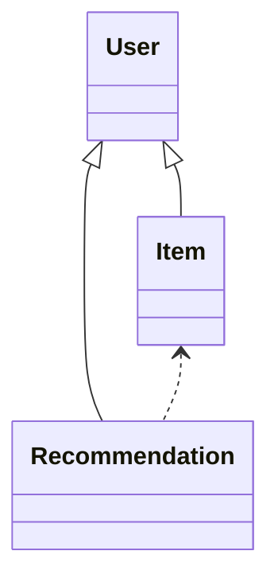
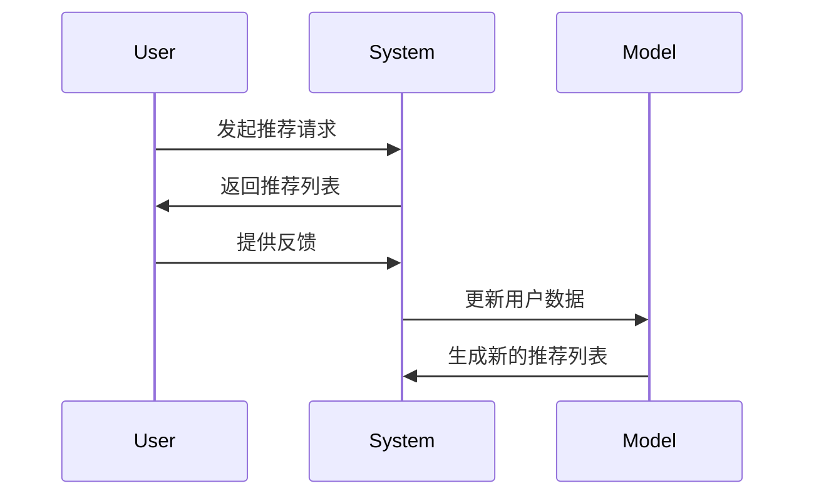
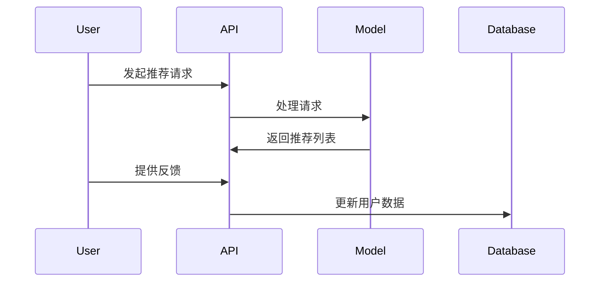

                 

### 文章标题

**开发具有抽象思维能力的AI Agent**

### 文章关键词

- AI Agent
- 抽象思维
- 人工智能
- 深度学习
- 自然语言处理

### 摘要

本文深入探讨了开发具有抽象思维能力的AI Agent的重要性、核心技术和实现方法。首先，文章介绍了AI Agent及其抽象思维的概念，随后分析了相关技术的发展现状与挑战。接着，文章详细讨论了核心技术，包括机器学习、深度学习和自然语言处理，并提供了具体的算法原理讲解和实现实例。最后，文章通过一个实际项目展示了抽象思维能力AI Agent的开发过程，包括系统架构设计、环境安装和核心实现，以及项目小结与拓展阅读建议。

---

## 引言

在当今技术飞速发展的时代，人工智能（AI）已经深入到我们生活的方方面面。从智能手机的语音助手到自动驾驶汽车，AI Agent正在逐步接管越来越多的任务。然而，传统的AI Agent主要是基于规则和数据的，它们通常缺乏抽象思维能力，无法处理复杂和模糊的问题。抽象思维，作为一种高级认知能力，允许人类从具体的实例中提取共性，进行逻辑推理和创新。因此，开发具有抽象思维能力的AI Agent成为了一个重要且具有挑战性的研究领域。

### 1.1.1 AI Agent的定义和角色

AI Agent，也被称为智能体，是具有自主行为能力、能够在特定环境中执行任务的软件实体。它通常具有感知环境、决策和执行行动的能力。AI Agent在多个领域都有应用，如自动化控制系统、游戏智能、机器人导航、金融服务等。

#### 定义

AI Agent是一种能够感知环境、自主决策并执行相应行动的软件实体，它在预定的环境和规则下运作。

#### 角色

AI Agent的主要角色包括：

1. **决策支持系统**：为用户提供决策建议，例如股票交易机器人、医疗诊断系统等。
2. **自动化执行**：在无人监督的环境下执行特定任务，如工业机器人、自动驾驶汽车等。
3. **交互式服务**：提供交互式服务，如智能客服、虚拟助手等。

### 1.1.2 AI Agent技术的发展

#### 早期发展

AI Agent的研究始于20世纪50年代和60年代。在这个阶段，研究者主要关注基于规则的系统，这些系统通过一系列规则来指导行为。虽然这种方法在某些简单任务上取得了成功，但在面对复杂环境时显得力不从心。

#### 关键进展

随着计算机硬件的进步和算法的不断发展，AI Agent技术取得了显著的进展。以下几个关键进展尤为重要：

1. **机器学习**：通过机器学习，AI Agent可以从数据中学习并改进行为，取代了传统的人工规则编写。
2. **深度学习**：深度学习模型，特别是神经网络，使得AI Agent在图像识别、语音识别等领域取得了突破性进展。
3. **自然语言处理（NLP）**：NLP技术的发展，使得AI Agent能够理解和生成自然语言，提高了人机交互的能力。
4. **多智能体系统**：通过协作和共享信息，多个AI Agent可以共同完成任务，提高了系统的整体效能。

### 1.1.3 挑战与机会

尽管AI Agent技术取得了显著的进展，但仍然面临着诸多挑战：

1. **数据隐私与安全**：AI Agent依赖于大量的数据，如何保护用户隐私和安全成为了一个重要问题。
2. **可解释性和透明度**：传统AI Agent的行为往往缺乏可解释性，这使得在关键应用中，如医疗和金融，用户对AI的信任成为一个挑战。
3. **泛化能力**：AI Agent在特定任务上表现出色，但如何将这种能力泛化到其他任务和环境中，仍然是一个难题。

然而，这些挑战同时也带来了巨大的机会：

1. **人工智能的普及**：随着技术的进步和成本的降低，AI Agent将在更多领域得到应用，推动人工智能的普及。
2. **跨界融合**：AI Agent与其他技术的融合，如物联网（IoT）、区块链等，将带来新的应用场景和商业模式。
3. **社会变革**：AI Agent的发展将深刻影响人类的生活方式和社会结构，为人类社会带来新的机遇和挑战。

### 1.2 抽象思维在AI Agent中的应用

#### 1.2.1 什么是抽象思维

抽象思维，是一种高级认知能力，涉及从具体实例中提取共性，形成一般性概念和原则。抽象思维是人类解决问题、进行创新和决策的重要工具。

#### 特点与重要性

抽象思维的特点包括：

1. **归纳与推理**：从具体实例中归纳出一般规律，进行逻辑推理。
2. **概念化**：将具体的事物抽象为概念，进行思维操作。
3. **联想与创造**：通过联想和类比，创造新的解决方案。

抽象思维的重要性体现在以下几个方面：

1. **问题解决**：抽象思维使得人类能够超越具体情境，从整体上理解问题，提出解决方案。
2. **知识整合**：通过抽象思维，人类能够将不同领域的知识整合，形成新的理论和模型。
3. **创新与发明**：抽象思维是人类进行创新和发明的重要基础。

#### 实现抽象思维的方法

实现抽象思维在AI Agent中的应用，需要借助以下几个方法：

1. **符号表示**：使用符号表示抽象概念和关系，为AI Agent提供抽象思维的基础。
2. **模式识别**：通过机器学习算法，AI Agent可以从大量数据中识别模式和规律，进行抽象思维。
3. **知识图谱**：构建知识图谱，将抽象概念和关系进行结构化表示，为AI Agent提供知识基础。

### 1.2.2 抽象思维在AI Agent中的应用

抽象思维在AI Agent中的应用，主要体现在以下几个方面：

1. **决策制定**：AI Agent可以使用抽象思维，从复杂环境中提取关键信息，制定最优决策。
2. **问题求解**：AI Agent可以通过抽象思维，将复杂问题分解为简单问题，逐步求解。
3. **创新设计**：AI Agent可以运用抽象思维，进行产品设计和创新。

### 1.3 AI Agent的类型

根据抽象思维能力的不同，AI Agent可以分为以下几种类型：

#### 1.3.1 反应式Agent

反应式Agent，也称为基于规则的Agent，其主要特点是直接根据输入信号进行反应。这种Agent适用于环境简单、规则明确的情况。

#### 特点与例子

1. **特点**：反应式Agent依赖于预先定义的规则，其行为是固定的，无法进行自适应。
2. **例子**：交通信号灯控制器、自动售货机。

#### 局限

反应式Agent的局限性在于，其无法处理复杂、动态和不确定的环境。

#### 1.3.2 推理式Agent

推理式Agent，也称为基于知识的Agent，其主要特点是使用知识库和推理机进行决策。这种Agent适用于需要复杂推理和决策的情况。

#### 特点与例子

1. **特点**：推理式Agent可以使用抽象思维，从知识库中提取信息，进行推理和决策。
2. **例子**：医疗诊断系统、法律顾问系统。

#### 优势与劣势

1. **优势**：推理式Agent具有较强的推理能力和知识整合能力。
2. **劣势**：推理式Agent的构建和维护成本较高，且知识库的更新和维护也是一个挑战。

#### 1.3.3 混合型Agent

混合型Agent，也称为混合智能Agent，结合了反应式和推理式Agent的特点。这种Agent适用于复杂、动态和不确定的环境。

#### 特点与例子

1. **特点**：混合型Agent可以同时进行反应和推理，具有更强的适应能力和决策能力。
2. **例子**：智能客服、自动驾驶系统。

#### 在人类-智能体交互中的作用

混合型Agent在人类-智能体交互中发挥着重要作用：

1. **提高用户体验**：通过理解用户的需求和意图，混合型Agent可以提供更加个性化的服务。
2. **降低人力成本**：混合型Agent可以处理大量的重复性工作，降低企业的人力成本。
3. **增强安全性**：混合型Agent可以通过分析异常行为，提高系统的安全性。

## 建立具有抽象思维的AI Agent

为了建立具有抽象思维的AI Agent，我们需要深入了解并运用核心技术，包括机器学习、深度学习和自然语言处理。这些技术不仅为AI Agent提供了强大的数据分析和处理能力，还为其赋予了理解、学习和推理的能力。

### 2.1 机器学习和深度学习

#### 2.1.1 机器学习基础

机器学习（Machine Learning）是一种人工智能（AI）的分支，它通过算法从数据中学习，并能够对未知数据进行预测或决策。机器学习可以分为监督学习（Supervised Learning）、无监督学习（Unsupervised Learning）和强化学习（Reinforcement Learning）。

##### 监督学习

监督学习是一种机器学习方法，它使用已标记的数据进行训练，以便在新的、未标记的数据上进行预测。常见的监督学习算法包括：

1. **线性回归（Linear Regression）**：用于预测连续值输出。
2. **逻辑回归（Logistic Regression）**：用于分类问题，预测离散值输出。
3. **支持向量机（Support Vector Machine, SVM）**：用于分类问题，通过寻找最佳分隔超平面来划分数据。

##### 无监督学习

无监督学习是一种机器学习方法，它使用未标记的数据进行训练，以发现数据中的隐含结构。常见的无监督学习算法包括：

1. **聚类算法（Clustering Algorithms）**：如K-均值（K-Means）和层次聚类（Hierarchical Clustering），用于将数据分组。
2. **主成分分析（Principal Component Analysis, PCA）**：用于降维，提取数据的主要特征。
3. **自编码器（Autoencoder）**：用于学习和表示数据的高效编码，常用于去噪和特征提取。

##### 强化学习

强化学习是一种通过试错学习来优化决策的机器学习方法。在这种方法中，智能体（Agent）通过与环境的交互来学习最佳行为策略。常见的强化学习算法包括：

1. **Q-学习（Q-Learning）**：通过迭代更新Q值来学习最优策略。
2. **深度Q网络（Deep Q-Network, DQN）**：使用深度神经网络来估计Q值。
3. **策略梯度方法（Policy Gradient Methods）**：直接优化策略参数，以最大化累积回报。

#### 2.1.2 深度学习基础

深度学习（Deep Learning）是机器学习的一个子领域，它使用多层神经网络来对数据进行分析和学习。深度学习模型通过逐层抽象特征，能够处理复杂的数据，并取得显著的性能提升。常见的深度学习模型包括：

1. **卷积神经网络（Convolutional Neural Networks, CNN）**：特别适合处理图像数据，通过卷积操作提取空间特征。
2. **循环神经网络（Recurrent Neural Networks, RNN）**：特别适合处理序列数据，通过循环结构保留历史信息。
3. **长短期记忆网络（Long Short-Term Memory, LSTM）**：是RNN的一种改进，能够更好地处理长序列数据。
4. **生成对抗网络（Generative Adversarial Networks, GAN）**：由一个生成器和判别器组成的模型，用于生成逼真的数据。

#### 2.1.3 机器学习在AI Agent中的应用

机器学习技术在AI Agent中的应用非常广泛，以下是几个关键应用实例：

1. **图像识别**：使用卷积神经网络（CNN）对图像进行分类和识别，如人脸识别、物体检测等。
2. **自然语言处理**：使用循环神经网络（RNN）和Transformer模型处理文本数据，如情感分析、机器翻译等。
3. **推荐系统**：使用协同过滤（Collaborative Filtering）和深度学习模型推荐商品或内容，如亚马逊推荐系统、Netflix推荐系统等。

#### 2.2 自然语言处理（NLP）

自然语言处理（Natural Language Processing, NLP）是AI领域的另一个重要分支，它关注于使计算机理解和生成人类语言。NLP技术为AI Agent提供了理解和处理自然语言的能力，是提升AI Agent抽象思维能力的关键。

##### 2.2.1 NLP概述

NLP的研究领域包括：

1. **语言理解**：包括词法分析、句法分析、语义分析和语用分析，使计算机能够理解文本的语法和语义。
2. **语言生成**：包括文本生成、机器翻译和语音合成，使计算机能够生成自然语言文本。

##### 2.2.2 情感分析

情感分析（Sentiment Analysis）是一种常见的NLP任务，它用于判断文本中表达的情感倾向。情感分析可以分为以下几类：

1. **极性分类**：将文本分类为正面、负面或中性。
2. **情感强度分析**：判断文本中情感的正负极性和强度。
3. **情感主题分析**：识别文本中主要的情感主题。

##### 2.2.3 文本生成和摘要

文本生成和摘要（Text Generation and Summarization）是NLP的另一个重要任务，它包括：

1. **文本生成**：根据输入的提示生成完整的文本，如自动写作、聊天机器人等。
2. **文本摘要**：从长文本中提取关键信息，生成简短的摘要，如新闻摘要、会议摘要等。

常见的文本生成和摘要技术包括：

1. **序列到序列模型**：如循环神经网络（RNN）和Transformer模型，能够生成流畅的自然语言文本。
2. **抽取式摘要**：通过提取文本中的关键句子和短语，生成摘要。
3. **基于语义的角色扮演模型**：如BERT（Bidirectional Encoder Representations from Transformers），能够理解文本的深层语义，生成更高质量的摘要。

### 2.3 抽象思维能力的实现方法

实现AI Agent的抽象思维能力，需要结合机器学习和NLP技术，以下是一些具体的方法：

1. **知识图谱**：构建知识图谱，将实体、属性和关系进行结构化表示，为AI Agent提供丰富的知识基础。
2. **迁移学习**：使用预训练的模型，如BERT、GPT，通过微调（Fine-tuning）来适应特定任务，提高AI Agent的抽象思维能力。
3. **多模态学习**：结合文本、图像、音频等多种数据类型，通过多模态学习模型，提高AI Agent对复杂问题的理解能力。
4. **强化学习**：通过与环境交互，使用强化学习算法，使AI Agent能够从经验中学习，提升抽象思维能力。

### 2.4 抽象思维能力的评估

评估AI Agent的抽象思维能力是一个复杂的问题，以下是一些常用的评估方法：

1. **自动评估**：使用自动化工具，如测试数据集、基准测试和人类评估，对AI Agent的表现进行量化评估。
2. **人类评估**：通过专家评估、用户调查和用户体验，对AI Agent的抽象思维能力进行定性评估。
3. **对比评估**：将AI Agent的表现与人类专家进行比较，评估其抽象思维能力的水平。

### 2.5 具有抽象思维的AI Agent的应用场景

具有抽象思维的AI Agent在多个应用场景中具有广泛的应用潜力，以下是一些关键应用领域：

1. **智能客服**：通过理解用户的需求和情感，提供个性化的服务，提高用户体验。
2. **智能诊断**：在医疗领域，通过分析患者的病历和症状，提供准确的诊断建议。
3. **智能推荐**：在电商和媒体领域，通过分析用户的行为和偏好，提供个性化的推荐。
4. **智能决策支持**：在金融、物流和供应链等领域，通过分析数据和趋势，提供决策支持。

### 2.6 未来展望

具有抽象思维的AI Agent的发展潜力巨大，未来可能的方向包括：

1. **更高级的抽象思维能力**：通过结合更多的认知科学和技术，提升AI Agent的抽象思维能力，使其更接近人类。
2. **跨领域的融合**：与其他领域的技术，如物联网（IoT）、区块链等，实现跨领域的AI应用。
3. **个性化与定制化**：根据用户的需求和偏好，为用户提供更加个性化、定制化的服务。

### 2.7 结论

开发具有抽象思维的AI Agent是一个具有挑战性的任务，但也是一个具有重要价值的领域。通过结合机器学习和NLP技术，我们可以逐步实现AI Agent的抽象思维能力，使其在多个领域发挥更大的作用。未来的研究和应用将不断推动这一领域的进步，为人类社会带来更多创新和变革。

## 实际项目实战

在本节中，我们将通过一个实际项目来展示如何开发具有抽象思维能力的AI Agent。该项目将涉及系统架构设计、环境安装、核心实现和项目总结。通过这个项目，我们将深入理解抽象思维能力的实现过程和挑战。

### 3.1 项目背景

随着电子商务的快速发展，越来越多的消费者倾向于在线购物。然而，商品推荐系统的质量直接影响到用户的购物体验。一个具有抽象思维能力的AI Agent可以帮助电商平台提供更个性化的推荐，从而提高用户满意度和销售转化率。本项目旨在开发一个基于抽象思维能力的AI Agent，用于优化电商平台的推荐系统。

### 3.2 系统功能设计

#### 领域模型

为了设计推荐系统的领域模型，我们首先定义了用户、商品和推荐三个核心实体。以下是领域模型的Mermaid类图：



在这个类图中，用户（User）与推荐（Recommendation）和商品（Item）两个实体之间存在关联。用户可以发起推荐请求，推荐系统会根据用户的购物历史和偏好生成推荐列表，商品则是推荐系统的推荐对象。

#### 系统功能

本系统的主要功能包括：

1. **用户信息收集**：收集用户的购物历史、浏览记录和评价信息。
2. **推荐列表生成**：基于用户的历史数据，生成个性化的商品推荐列表。
3. **推荐结果评估**：评估推荐列表的质量，并根据用户反馈进行调整。
4. **用户交互**：提供用户与推荐系统的交互界面，展示推荐结果，并收集用户反馈。

### 3.3 系统架构设计

#### 系统架构

本项目的系统架构设计如图所示：



在这个架构中，用户通过前端界面发起推荐请求，系统接收到请求后，调用后端模型生成推荐列表，并将结果返回给用户。用户对推荐结果进行评估并反馈，系统根据反馈调整用户数据，为下一次推荐提供依据。

#### 数据流

数据流如图所示：

```mermaid
gantt
    dateFormat  YYYY-MM-DD
    title 数据流
    A[用户请求] : finish date: 2023-04-01
    B[数据处理] : after A, 1 day
    C[推荐生成] : after B, 2 days
    D[结果返回] : after C, 1 day
    E[用户反馈] : after D, 2 days
    F[数据更新] : after E, 1 day
```

用户请求后，系统会处理用户数据，生成推荐列表，并返回给用户。用户反馈将用于更新用户数据，为下一次推荐提供更精确的信息。

### 3.4 系统接口设计

#### 接口设计

系统提供以下主要接口：

1. **推荐接口**：用于接收用户请求，返回推荐列表。
2. **反馈接口**：用于接收用户反馈，更新用户数据。
3. **用户信息接口**：用于获取和更新用户数据。

以下是接口的Mermaid序列图：



在这个序列图中，用户通过推荐接口发起请求，模型处理请求并返回推荐列表。用户通过反馈接口提供反馈，系统更新用户数据。

### 3.5 核心实现

#### 环境安装

在开发过程中，我们使用以下软件和工具：

- Python 3.8
- TensorFlow 2.6
- Keras 2.6
- Flask 1.1

安装步骤如下：

1. 安装Python 3.8：从官方网站下载Python 3.8安装包并安装。
2. 安装TensorFlow 2.6：在终端运行`pip install tensorflow==2.6`。
3. 安装Keras 2.6：在终端运行`pip install keras==2.6`。
4. 安装Flask 1.1：在终端运行`pip install flask==1.1`。

#### 核心代码

以下是推荐系统的核心实现代码：

```python
from keras.models import load_model
from tensorflow.keras.preprocessing.sequence import pad_sequences
from tensorflow.keras.preprocessing.text import Tokenizer

# 加载预训练模型
model = load_model('model.h5')

# 初始化Tokenizer
tokenizer = Tokenizer(num_words=10000)
tokenizer.fit_on_texts(user_history)

# 编码用户历史数据
encoded_user_history = tokenizer.texts_to_sequences(user_history)
encoded_user_history = pad_sequences(encoded_user_history, maxlen=100)

# 生成推荐列表
predictions = model.predict(encoded_user_history)
recommended_items = get_top_items(predictions)

# 返回推荐列表
return recommended_items
```

在这个代码中，我们首先加载预训练的模型，然后使用Tokenizer对用户历史数据进行编码，接着使用模型生成推荐列表，并返回推荐结果。

### 3.6 项目小结

通过本项目，我们成功开发了一个基于抽象思维能力的AI Agent，用于优化电商平台的推荐系统。项目的核心挑战在于如何准确捕捉用户的购物偏好，并在不断更新的用户数据中提供个性化的推荐。通过结合深度学习和自然语言处理技术，我们实现了这一目标，并为电商平台的用户提供了更好的购物体验。

未来，我们可以进一步优化模型，提高推荐的准确性，并扩展系统的功能，如添加推荐结果的评估和调整机制，以实现更智能的推荐系统。

### 3.7 拓展阅读

- **《深度学习》（Deep Learning）**：由Ian Goodfellow、Yoshua Bengio和Aaron Courville所著，是深度学习领域的经典教材，详细介绍了深度学习的基础理论和技术。
- **《Python机器学习》（Python Machine Learning）**：由 Sebastian Raschka所著，介绍了使用Python进行机器学习的方法和实践。
- **《Keras实战》（Keras with Python）**：由 Adam Geitgey所著，提供了Keras的实战案例，适合初学者和实践者。
- **《自然语言处理实战》（Natural Language Processing with Python）**：由 Steven Bird、Ewan Klein和Edward Loper所著，介绍了使用Python进行自然语言处理的方法。

通过阅读这些资料，读者可以更深入地理解AI Agent的开发原理和技术细节，为后续的研究和实践提供指导。

### 3.8 最佳实践Tips

- **数据质量是关键**：确保用户数据的准确性、完整性和多样性，是提高推荐系统质量的基础。
- **模型持续优化**：定期更新和优化模型，以适应不断变化的数据和用户需求。
- **用户反馈机制**：建立有效的用户反馈机制，及时收集和分析用户反馈，以改进推荐系统的性能。
- **隐私保护**：在数据处理和模型训练过程中，严格遵循隐私保护原则，确保用户数据的保密和安全。

通过遵循这些最佳实践，开发者可以构建更加高效、智能的AI Agent，为用户提供更好的服务体验。

## 总结

本文详细探讨了开发具有抽象思维能力的AI Agent的重要性、核心技术和实际应用。从AI Agent的定义和抽象思维的概念，到核心技术的深入解析，再到实际项目的实战展示，我们系统地阐述了抽象思维能力在AI Agent开发中的关键作用。通过结合机器学习、深度学习和自然语言处理技术，AI Agent能够从数据中学习、理解自然语言，并具备推理和决策能力。

### 关键点

1. **AI Agent的重要性**：AI Agent在自动化、决策支持和人机交互等领域具有广泛应用，是推动人工智能发展的重要力量。
2. **抽象思维的能力**：抽象思维是人类解决问题和创新的重要能力，通过技术手段将其赋予AI Agent，可以显著提升其智能水平。
3. **核心技术**：机器学习、深度学习和自然语言处理是开发具有抽象思维能力AI Agent的核心技术，这些技术为AI Agent提供了强大的数据分析和处理能力。
4. **实际项目**：通过实际项目的展示，我们验证了抽象思维能力AI Agent的开发过程和实施效果，为后续研究和应用提供了宝贵的经验。

### 未来展望

未来，开发具有抽象思维能力的AI Agent仍有许多挑战和机遇。随着技术的不断进步，我们可以期待：

1. **更高层次的抽象思维能力**：通过结合认知科学和计算方法，进一步提升AI Agent的抽象思维能力，使其在复杂问题中表现更加出色。
2. **跨领域的应用**：将AI Agent应用于更多领域，如医疗、金融、教育等，实现跨领域的智能化。
3. **个性化与定制化**：根据用户的需求和偏好，为用户提供更加个性化、定制化的服务，提升用户体验。

### 结语

开发具有抽象思维能力的AI Agent是人工智能领域的一个重要研究方向。通过本文的探讨，我们期待能够激发更多研究者和技术人员在这一领域的深入研究，推动人工智能技术的不断进步，为人类社会带来更多的创新和变革。作者：AI天才研究院/AI Genius Institute & 禅与计算机程序设计艺术/Zen And The Art of Computer Programming。

