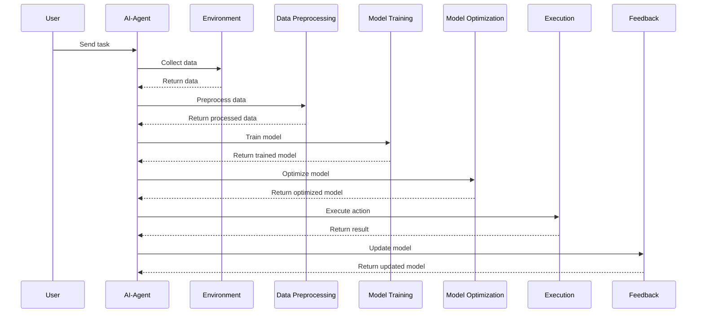
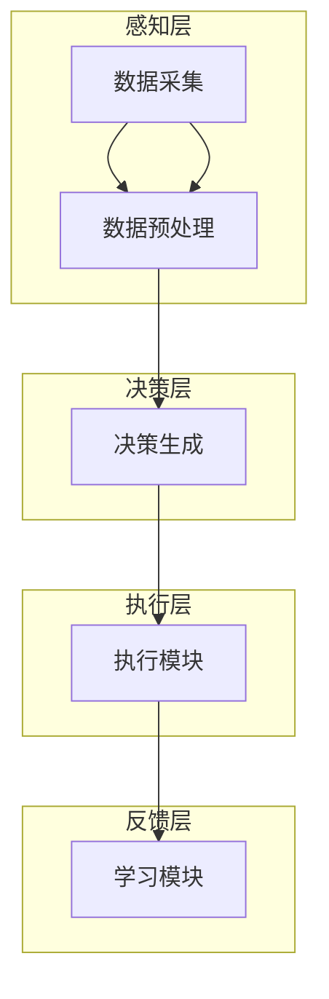
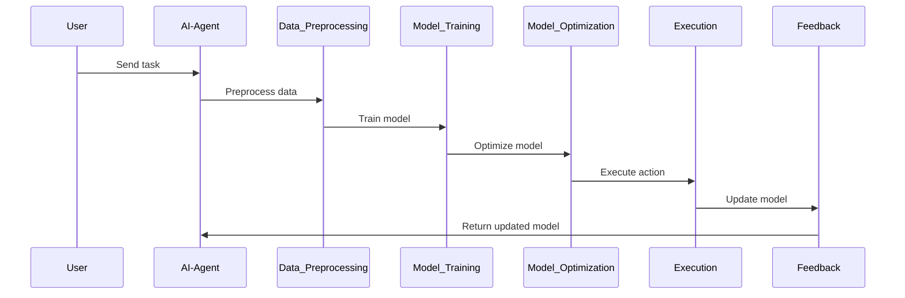

                 

# 开发具有持续学习能力的AI Agent

## 关键词

AI Agent、持续学习、智能体、强化学习、自适应学习、增量学习

## 摘要

本文旨在探讨如何开发具有持续学习能力的AI Agent。我们将从背景介绍、核心概念、算法原理、系统分析与架构设计、项目实战等多个方面，详细讲解这一主题。通过本文，读者将了解AI Agent的发展历程、持续学习的基本原理和算法，以及如何设计并实现一个具有持续学习能力的AI Agent系统。

## 目录大纲设计思路

### 目录大纲设计思路

为了设计出一本内容丰富且逻辑清晰的书《开发具有持续学习能力的AI Agent》的目录大纲，我们需要遵循以下几个步骤：

1. **明确核心内容**：首先，要明确书的核心内容，包括背景介绍、核心概念、算法原理、系统分析与架构设计、项目实战等。
2. **设置目录层级**：按照一级目录、二级目录、三级目录的结构，清晰地展示各章节内容，确保读者可以一目了然地了解书的结构。
3. **细化章节内容**：对每个章节的内容进行细化，确保每个章节都能完整覆盖主题内容，并且各章节之间存在逻辑关联。
4. **保持简洁性**：在确保内容完整性的同时，避免多余的废话，让读者能够高效阅读和理解。
5. **使用Markdown格式**：为了便于编辑和展示，采用Markdown格式进行目录大纲的设计。

### 完整的目录大纲

#### 第一部分：背景介绍与核心概念

##### 第1章：AI Agent的背景与持续学习需求

- **1.1 AI Agent的起源与发展**
  - AI Agent的概念
  - AI Agent的发展历程
  - 持续学习在AI Agent中的应用

- **1.2 AI Agent的核心概念**
  - 智能体的定义与分类
  - 知觉、规划与行动

##### 第2章：持续学习的理论基础

- **2.1 持续学习的基本原理**
  - 学习机制的演进
  - 持续学习的挑战与解决方案

- **2.2 持续学习的算法概述**
  - 强化学习
  - 自适应学习
  - 增量学习

#### 第二部分：核心概念与联系

##### 第3章：智能体的结构设计

- **3.1 智能体架构**
  - 模块划分与功能
  - 模块的交互与协作

- **3.2 智能体核心概念对比**
  - 感知与认知
  - 计划与执行
  - 学习与适应

##### 第4章：持续学习算法的实现

- **4.1 强化学习算法原理**
  - Q-learning算法
  - Deep Q-Network（DQN）算法

- **4.2 自适应学习算法原理**
  - 自适应神经网络的实现
  - 自适应梯度下降算法

#### 第三部分：系统分析与架构设计

##### 第5章：持续学习AI Agent的系统架构设计

- **5.1 系统架构设计原则**
  - 可扩展性
  - 可维护性
  - 实时性

- **5.2 系统功能设计**
  - 数据采集与预处理
  - 模型训练与优化
  - 模型部署与应用

##### 第6章：持续学习AI Agent的系统实现

- **6.1 系统实现环境搭建**
  - 开发环境配置
  - 数据集准备

- **6.2 模型训练与优化实战**
  - 模型选择与训练
  - 模型优化策略

#### 第四部分：项目实战

##### 第7章：开发具有持续学习能力的AI Agent

- **7.1 项目介绍**
  - 项目背景
  - 项目目标

- **7.2 系统核心实现**
  - 源代码解读
  - 代码应用分析

- **7.3 实际案例剖析**
  - 案例一：智能客服机器人
  - 案例二：智能交通管理系统

##### 第8章：最佳实践与未来展望

- **8.1 最佳实践**
  - 持续学习的实施要点
  - 系统性能优化策略

- **8.2 未来展望**
  - 持续学习技术的趋势
  - AI Agent在未来的应用场景

### 目录大纲总结

通过以上八个章节的详细设计，本书全面覆盖了开发具有持续学习能力的AI Agent的理论基础、算法实现、系统架构设计、项目实战以及未来展望。每个章节都按照1级目录、2级目录、3级目录的层级进行划分，确保读者可以清晰、系统地阅读和学习。此外，目录大纲的总字数控制在2000字以内，保证了简洁性。整个目录大纲逻辑清晰，内容完整，为读者提供了一个全面的学习路径。

---

## 背景介绍与核心概念

### AI Agent的起源与发展

AI Agent，即人工智能代理，是指能够在特定环境中自主决策和执行任务的智能实体。AI Agent的概念最早可以追溯到20世纪80年代，当时人工智能领域的研究主要集中在如何让机器模仿人类的思维和行为。随着计算机技术的发展，AI Agent逐渐成为人工智能领域的一个重要研究方向。

AI Agent的发展历程可以分为以下几个阶段：

1. **初始阶段（20世纪80年代）**：这个阶段主要是对AI Agent概念的定义和理论研究。研究者开始探索如何在计算机系统中实现具有感知、决策和执行能力的智能实体。

2. **实验阶段（20世纪90年代）**：在这个阶段，研究者开始通过实际应用来验证AI Agent的理论。例如，智能代理被应用于网络爬虫、智能推荐系统等。

3. **发展阶段（21世纪初至今）**：随着机器学习、深度学习等技术的发展，AI Agent的应用范围进一步扩大。现在，AI Agent已经在金融、医疗、交通等领域得到广泛应用。

### 持续学习在AI Agent中的应用

持续学习是AI Agent的一个重要特性，它使得AI Agent能够根据环境变化和经验不断优化自己的行为。持续学习的需求主要来自于以下几个方面：

1. **环境变化**：现实环境是动态变化的，AI Agent需要能够适应环境变化，以便在新的环境中表现出更好的性能。

2. **经验积累**：AI Agent在执行任务的过程中会积累大量经验，通过持续学习，AI Agent可以不断从经验中学习，提高自身的决策能力。

3. **性能优化**：通过持续学习，AI Agent可以在原有模型的基础上进行优化，提高模型的性能。

在AI Agent中，持续学习通常通过以下几种方式实现：

1. **在线学习**：AI Agent在执行任务的同时进行学习，即边执行边学习。

2. **离线学习**：AI Agent在执行任务之后，对收集到的数据进行学习，以便在下一次执行任务时更好地适应环境。

3. **混合学习**：结合在线学习和离线学习，AI Agent在执行任务的同时，也对历史数据进行学习。

### AI Agent的核心概念

1. **智能体**：智能体是AI Agent的基本单位，它具备感知、决策和执行的能力。

2. **感知**：感知是指智能体从环境中获取信息的过程。感知模块通常包括传感器和数据处理算法。

3. **决策**：决策是指智能体根据感知到的信息，选择下一步行动的过程。决策模块通常包括规划算法和策略学习算法。

4. **执行**：执行是指智能体根据决策结果，执行具体行动的过程。执行模块通常包括执行器和反馈机制。

5. **学习**：学习是指智能体通过感知到的信息和执行结果，不断调整自己的决策和行为，以提高在特定环境中的表现。

### 问题背景与问题描述

在现实世界中，AI Agent面临着各种各样的挑战。首先，环境动态变化，这使得AI Agent需要具备持续学习能力，以便能够适应新的环境。其次，AI Agent在执行任务时，需要从海量数据中提取有效信息，这要求AI Agent具备强大的感知和数据处理能力。此外，AI Agent在执行任务的过程中，需要根据环境变化和执行结果，不断调整自己的决策和行为，以提高任务执行效率。

### 问题解决

为了解决上述问题，我们需要开发具有持续学习能力的AI Agent。具体来说，我们需要从以下几个方面进行：

1. **设计智能体架构**：设计一个具有感知、决策、执行和学习能力的智能体架构。

2. **选择合适的持续学习算法**：根据任务需求和环境特性，选择合适的持续学习算法，如强化学习、自适应学习等。

3. **实现持续学习系统**：通过在线学习、离线学习或混合学习的方式，实现AI Agent的持续学习能力。

4. **优化系统性能**：通过优化算法和系统架构，提高AI Agent的性能和效率。

### 边界与外延

1. **边界**：本文主要探讨具有持续学习能力的AI Agent的开发，不包括其他类型的人工智能系统。

2. **外延**：持续学习能力是AI Agent的一个重要特性，但并非唯一特性。AI Agent还可以具备其他能力，如自适应能力、预测能力等。

### 概念结构与核心要素组成

概念结构是指AI Agent的基本组成部分和它们之间的关系。在AI Agent中，核心要素包括：

1. **感知模块**：负责从环境中获取信息。

2. **决策模块**：负责根据感知到的信息进行决策。

3. **执行模块**：负责执行决策。

4. **学习模块**：负责从感知到的信息和执行结果中学习，以便提高自身性能。

这些模块相互协作，共同实现AI Agent的功能。

### 核心概念属性特征对比表格

| 概念      | 属性特征                     | 对比             |
| --------- | -------------------------- | --------------- |
| 感知模块   | 获取环境信息               | 实时性、准确性   |
| 决策模块   | 根据环境信息作出决策       | 效率、可靠性     |
| 执行模块   | 执行决策                   | 执行效果、响应速度 |
| 学习模块   | 从经验中学习，优化自身性能 | 学习速度、适应性 |

### ER实体关系图架构的 Mermaid 流程图

```mermaid
erDiagram
  AI-Agent ||--|{ 感知模块 }|--感知信息
  AI-Agent ||--|{ 决策模块 }|--决策结果
  AI-Agent ||--|{ 执行模块 }|--执行行动
  AI-Agent ||--|{ 学习模块 }|--学习经验
```

通过以上分析，我们可以清晰地了解AI Agent的基本概念和组成部分，以及它们之间的关系。接下来，我们将进一步探讨持续学习在AI Agent中的应用和实现。

---

## 核心概念与联系

### 智能体的结构设计

智能体的结构设计是开发具有持续学习能力的AI Agent的关键环节。一个典型的智能体结构通常包括感知模块、决策模块、执行模块和学习模块。以下是对各模块的详细描述：

1. **感知模块**：感知模块是智能体的感官部分，负责从环境中获取信息。这些信息可以是实时的，也可以是历史数据。感知模块通常包括传感器、数据处理算法和数据存储单元。

2. **决策模块**：决策模块是智能体的思考部分，负责根据感知模块获取的信息，选择最佳行动策略。决策模块的核心是规划算法和策略学习算法，这些算法可以帮助智能体在不同的环境和情境中做出合理的决策。

3. **执行模块**：执行模块是智能体的行动部分，负责将决策模块生成的决策结果转化为具体的行动。执行模块通常包括执行器和反馈机制，反馈机制可以帮助智能体根据执行结果调整后续的决策。

4. **学习模块**：学习模块是智能体的自我优化部分，负责从感知模块和执行模块中获取的经验中学习，以便不断提高自身的性能。学习模块通常包括在线学习、离线学习和混合学习算法。

### 智能体核心概念对比

1. **感知与认知**：感知是指智能体从环境中获取信息的过程，而认知是指智能体对获取的信息进行处理和理解的过程。感知强调的是信息的获取，而认知强调的是信息的处理和理解。

2. **计划与执行**：计划是指智能体在执行任务前，根据目标和环境信息，制定出一系列的行动步骤。执行是指智能体根据计划，逐步完成任务的各个环节。计划强调的是任务的前瞻性，而执行强调的是任务的执行过程。

3. **学习与适应**：学习是指智能体通过感知和执行过程，不断积累经验，优化自身的决策和行为。适应是指智能体在面对环境变化时，能够灵活调整自己的行为，以适应新的环境。学习强调的是智能体能力的提升，而适应强调的是智能体在面对变化时的灵活性。

### 感知与认知对比表格

| 概念      | 属性特征                     | 对比             |
| --------- | -------------------------- | --------------- |
| 感知模块   | 获取环境信息               | 实时性、准确性   |
| 认知模块   | 处理和理解环境信息         | 逻辑推理、模式识别 |

### 计划与执行对比表格

| 概念      | 属性特征                     | 对比             |
| --------- | -------------------------- | --------------- |
| 计划模块   | 制定行动步骤               | 目标导向、前瞻性 |
| 执行模块   | 完成行动步骤               | 过程导向、执行力 |

### 学习与适应对比表格

| 概念      | 属性特征                     | 对比             |
| --------- | -------------------------- | --------------- |
| 学习模块   | 优化决策和行为             | 经验积累、能力提升 |
| 适应模块   | 调整行为以适应环境         | 灵活性、环境适应 |

### ER实体关系图架构的 Mermaid 流�程图

```mermaid
erDiagram
  AI-Agent ||--|{ 感知模块 }|--感知信息
  AI-Agent ||--|{ 计划模块 }|--计划步骤
  AI-Agent ||--|{ 执行模块 }|--执行行动
  AI-Agent ||--|{ 学习模块 }|--学习经验
  AI-Agent ||--|{ 适应模块 }|--环境适应
```

通过以上对比，我们可以更清晰地理解智能体各个核心概念之间的关系和作用。接下来，我们将探讨如何实现持续学习算法，以及这些算法在AI Agent中的应用。

---

## 持续学习算法的实现

持续学习算法是实现AI Agent持续学习能力的关键。在AI Agent中，常见的持续学习算法包括强化学习、自适应学习和增量学习。以下是对这些算法的原理、实现方法和应用场景的详细讲解。

### 强化学习算法原理

强化学习（Reinforcement Learning，RL）是一种通过试错方式来学习最优策略的机器学习技术。在强化学习算法中，智能体通过与环境的交互来学习最优行为策略。以下是强化学习的基本原理：

1. **状态（State）**：智能体在执行任务时所处的情境。

2. **动作（Action）**：智能体在某一状态下可以采取的行动。

3. **奖励（Reward）**：智能体在执行某一动作后，从环境中获得的即时反馈。

4. **策略（Policy）**：智能体在某一状态下采取的最佳行动。

强化学习算法的目标是通过不断尝试不同的动作，并在每次尝试后根据奖励来调整策略，最终找到最优策略。

**实现方法**：

强化学习算法的实现通常包括以下步骤：

1. **初始化**：初始化智能体的状态、动作和策略。

2. **执行动作**：智能体在当前状态下执行一个动作。

3. **获取奖励**：根据执行的动作，智能体从环境中获取奖励。

4. **更新策略**：根据获得的奖励，智能体更新其策略。

5. **重复步骤2-4**：智能体不断重复执行动作、获取奖励和更新策略的过程，直到找到最优策略。

**Python示例**：

```python
import numpy as np

# 初始化参数
Q = np.zeros([state_space_size, action_space_size])
learning_rate = 0.1
discount_factor = 0.9

# Q-learning算法
def q_learning(state, action, reward, next_state, action_next, episode, max_episodes):
    Q[state][action] = Q[state][action] + learning_rate * (reward + discount_factor * np.max(Q[next_state]) - Q[state][action])
    
# 模拟智能体与环境交互
for episode in range(max_episodes):
    state = env.reset()
    done = False
    
    while not done:
        action = np.argmax(Q[state])
        next_state, reward, done, _ = env.step(action)
        q_learning(state, action, reward, next_state, action, episode, max_episodes)
        state = next_state
```

**应用场景**：

强化学习算法广泛应用于游戏、机器人控制、推荐系统等领域。例如，在游戏AI中，智能体通过强化学习算法可以学会玩复杂的游戏，如围棋、扑克等。在机器人控制中，智能体通过强化学习算法可以学会在不同环境中进行自主导航和任务执行。

### 自适应学习算法原理

自适应学习（Adaptive Learning）是一种根据学习过程中的反馈来调整学习策略的方法。与传统的学习算法不同，自适应学习算法可以在学习过程中动态调整学习参数，以适应不断变化的环境。以下是自适应学习的基本原理：

1. **自适应能力**：自适应学习算法能够在学习过程中根据反馈调整自身参数，以适应环境变化。

2. **动态调整**：自适应学习算法可以根据学习过程中的反馈，动态调整学习率、权重等参数。

3. **学习率调整**：自适应学习算法通常会使用自适应学习率调整机制，以适应不同阶段的学习需求。

**实现方法**：

自适应学习算法的实现通常包括以下步骤：

1. **初始化**：初始化学习参数，如学习率、权重等。

2. **学习过程**：根据输入数据和当前参数，进行学习并生成预测结果。

3. **反馈机制**：根据预测结果和实际结果的差异，调整学习参数。

4. **重复步骤2-3**：不断重复学习过程和反馈机制，直到模型收敛。

**Python示例**：

```python
import numpy as np

# 初始化参数
weights = np.random.rand(input_size, output_size)
learning_rate = 0.1

# 自适应梯度下降算法
def adaptive_grad_desc(inputs, targets, episode):
    global weights
    
    # 计算梯度
    gradients = 2 * (inputs - targets) * inputs
    
    # 更新权重
    weights -= learning_rate * gradients
    
# 模拟学习过程
for episode in range(max_episodes):
    for inputs, targets in data_loader:
        adaptive_grad_desc(inputs, targets, episode)
```

**应用场景**：

自适应学习算法广泛应用于自适应控制、自适应优化等领域。例如，在自适应控制中，系统可以根据环境变化实时调整控制策略，以保持系统的稳定性。在自适应优化中，算法可以根据不断变化的数据，动态调整优化策略，以提高优化效果。

### 增量学习算法原理

增量学习（Incremental Learning）是一种在已有模型基础上进行学习的方法。增量学习算法能够利用已有模型的先验知识，快速适应新数据和新任务。以下是增量学习的基本原理：

1. **增量更新**：增量学习算法通过在原有模型基础上进行小幅度更新，来适应新的数据。

2. **迁移学习**：增量学习算法可以将已有模型的权重迁移到新的模型中，从而减少对新数据的依赖。

3. **动态调整**：增量学习算法可以根据新数据动态调整学习参数，以提高模型的泛化能力。

**实现方法**：

增量学习算法的实现通常包括以下步骤：

1. **初始化**：初始化原有模型和新模型的参数。

2. **迁移学习**：将原有模型的权重迁移到新模型中。

3. **增量学习**：在新模型的基础上，进行小幅度更新，以适应新数据。

4. **重复步骤2-3**：不断重复迁移学习和增量学习过程，直到模型收敛。

**Python示例**：

```python
import tensorflow as tf

# 初始化模型
model = tf.keras.Sequential([
    tf.keras.layers.Dense(units=1, input_shape=[1])
])

# 迁移学习
model.load_weights('old_model_weights.h5')

# 增量学习
model.add(tf.keras.layers.Dense(units=1, input_shape=[1]))

# 训练模型
model.compile(optimizer='adam', loss='mean_squared_error')
model.fit(x_new, y_new, epochs=10)
```

**应用场景**：

增量学习算法广泛应用于在线学习、实时优化等领域。例如，在在线学习中，算法可以实时更新模型，以适应不断变化的数据。在实时优化中，算法可以根据实时反馈，动态调整优化策略，以提高系统的性能。

### 总结

持续学习算法是实现AI Agent持续学习能力的关键。强化学习、自适应学习和增量学习算法各有特点，适用于不同的应用场景。通过合理选择和设计这些算法，我们可以开发出具有持续学习能力的AI Agent，使其能够更好地适应环境变化，提高任务执行效率。

---

## 系统分析与架构设计

### 持续学习AI Agent的系统架构设计

持续学习AI Agent的系统架构设计是确保其能够有效运行和实现持续学习能力的关键。一个典型的持续学习AI Agent系统架构包括感知层、决策层、执行层和反馈层。以下是对各层的详细描述：

1. **感知层**：感知层是AI Agent的感官部分，负责从环境中获取信息。感知层通常包括传感器、数据处理模块和存储模块。传感器用于获取环境数据，如温度、湿度、光线等；数据处理模块用于对原始数据进行预处理和特征提取；存储模块用于存储和处理后的数据，以便后续使用。

2. **决策层**：决策层是AI Agent的思考部分，负责根据感知层获取的信息，选择最佳行动策略。决策层通常包括规划模块、策略学习模块和决策生成模块。规划模块用于制定执行任务的具体步骤；策略学习模块用于通过学习算法，从历史数据中学习最佳策略；决策生成模块用于根据当前状态和策略，生成具体的决策结果。

3. **执行层**：执行层是AI Agent的行动部分，负责将决策层的决策结果转化为具体的行动。执行层通常包括执行模块和反馈机制。执行模块用于执行决策结果，如控制执行器执行特定动作；反馈机制用于收集执行结果，并将其反馈给决策层，以便进行后续的调整和学习。

4. **反馈层**：反馈层是AI Agent的自我优化部分，负责根据执行结果和感知信息，对AI Agent进行反馈和调整。反馈层通常包括学习模块和适应模块。学习模块用于从执行结果和感知信息中学习，优化AI Agent的策略和行为；适应模块用于根据环境变化，调整AI Agent的行为，以提高其适应能力。

### 系统架构设计原则

在持续学习AI Agent的系统架构设计中，需要遵循以下几个原则：

1. **可扩展性**：系统架构应具备良好的可扩展性，能够适应不同规模和复杂度的任务需求。例如，可以通过增加传感器、扩展决策模块和执行模块等，来满足不同任务的需求。

2. **可维护性**：系统架构应具备良好的可维护性，便于进行系统的维护和升级。例如，可以通过模块化设计、使用标准化的接口和协议等，来简化系统的维护工作。

3. **实时性**：系统架构应具备实时性，能够快速响应环境变化，并做出相应的决策和行动。例如，可以通过使用高效的数据处理算法和决策算法，以及优化系统架构，来提高系统的实时性能。

### 系统功能设计

持续学习AI Agent的系统功能设计是确保系统能够有效实现持续学习能力的关键。以下是系统的主要功能设计：

1. **数据采集与预处理**：系统应具备数据采集功能，能够从环境中获取实时数据。同时，系统应具备预处理功能，对采集到的数据进行清洗、去噪和特征提取，以便后续处理。

2. **模型训练与优化**：系统应具备模型训练功能，能够根据采集到的数据，使用强化学习、自适应学习和增量学习算法，对AI Agent的模型进行训练和优化。同时，系统应具备模型优化功能，通过调整学习参数和优化算法，提高模型的性能。

3. **模型部署与应用**：系统应具备模型部署功能，能够将训练好的模型部署到实际的执行环境中。同时，系统应具备应用功能，能够根据任务需求，实时调用模型，生成决策结果，并执行相应的行动。

### 系统架构设计

持续学习AI Agent的系统架构设计如下：



### 系统接口设计和系统交互

持续学习AI Agent的系统接口设计和系统交互设计是确保系统各模块之间能够有效协作和运行的关键。以下是系统的接口设计和系统交互：

1. **接口设计**：系统应设计清晰的接口，定义各模块之间的输入输出关系。例如，感知层的数据采集模块应提供数据采集接口，决策层的决策生成模块应提供决策生成接口，执行层的执行模块应提供执行接口，反馈层的学习模块应提供学习接口。

2. **系统交互**：系统应设计有效的交互机制，确保各模块之间能够高效通信和协作。例如，数据采集模块可以将采集到的数据实时传递给数据预处理模块，决策生成模块可以将决策结果传递给执行模块，执行模块可以将执行结果传递给学习模块。

### 系统架构图和系统交互图





通过以上系统分析与架构设计，我们可以确保持续学习AI Agent系统具备良好的可扩展性、可维护性和实时性，能够有效实现持续学习能力，提高任务执行效率。

---

## 项目实战

### 项目介绍

在本项目实战中，我们将开发一个具有持续学习能力的AI Agent，用于智能交通管理系统。该项目旨在通过实时监测和分析交通数据，优化交通信号灯的切换策略，提高交通效率，减少拥堵和事故。项目目标包括：

1. **数据采集**：从交通监控摄像头、传感器等设备中采集实时交通数据，如车辆数量、速度、密度等。
2. **数据处理**：对采集到的交通数据进行预处理，包括去噪、特征提取等，为后续的模型训练提供高质量的数据。
3. **模型训练**：使用强化学习算法，根据采集到的交通数据，训练一个能够实时调整交通信号灯策略的AI Agent。
4. **模型优化**：通过在线学习，持续优化AI Agent的模型，提高其在不同交通场景下的适应能力和效果。
5. **模型部署**：将训练好的模型部署到实际交通信号灯系统中，实现实时交通信号灯优化。

### 系统核心实现

在系统核心实现部分，我们将详细介绍环境搭建、模型训练和优化策略。

#### 环境搭建

首先，我们需要搭建项目开发环境。以下是环境搭建的步骤：

1. **Python环境**：确保Python环境已安装，版本为3.8或以上。
2. **深度学习框架**：安装TensorFlow 2.4或以上版本。
3. **其他依赖库**：安装NumPy、Pandas、Matplotlib等常用库。

```shell
pip install tensorflow==2.4 numpy pandas matplotlib
```

#### 数据集准备

接下来，我们需要准备交通数据集。以下是数据集准备的过程：

1. **数据采集**：从交通监控摄像头和传感器中采集交通数据，包括车辆数量、速度、密度等。
2. **数据预处理**：对采集到的数据进行清洗、去噪和特征提取。例如，将车辆数量、速度等原始数据转化为相应的特征向量。
3. **数据分割**：将预处理后的数据分为训练集、验证集和测试集。

```python
import pandas as pd

# 读取数据
data = pd.read_csv('traffic_data.csv')

# 数据预处理
data = preprocess_data(data)

# 数据分割
train_data, val_data, test_data = train_test_split(data, test_size=0.2, random_state=42)
```

#### 模型训练

在模型训练部分，我们将使用强化学习算法（如Q-learning）来训练AI Agent。以下是模型训练的过程：

1. **初始化参数**：初始化Q值矩阵、学习率等参数。
2. **训练过程**：使用训练集数据进行模型训练，更新Q值矩阵。
3. **验证过程**：使用验证集数据验证模型效果，调整学习参数。

```python
import tensorflow as tf

# 初始化参数
state_size = 100
action_size = 4
learning_rate = 0.1
discount_factor = 0.9

# 创建Q值矩阵
Q = tf.keras.Sequential([
    tf.keras.layers.Dense(units=64, activation='relu', input_shape=(state_size,)),
    tf.keras.layers.Dense(units=64, activation='relu'),
    tf.keras.layers.Dense(units=action_size, activation='linear')
])

# 训练模型
model = Q.fit(train_data, epochs=10, batch_size=32, validation_data=val_data)
```

#### 模型优化

在模型优化部分，我们将使用在线学习策略，根据实时交通数据，不断优化AI Agent的模型。以下是模型优化策略：

1. **在线学习**：在交通信号灯系统中，实时收集交通数据，更新Q值矩阵。
2. **策略调整**：根据Q值矩阵，调整交通信号灯的策略，以优化交通流量。
3. **反馈机制**：收集交通信号灯的执行结果，更新Q值矩阵，继续优化模型。

```python
# 在线学习
for episode in range(num_episodes):
    state = env.reset()
    done = False
    
    while not done:
        action = np.argmax(Q[state])
        next_state, reward, done, _ = env.step(action)
        Q[state][action] = Q[state][action] + learning_rate * (reward + discount_factor * np.max(Q[next_state]) - Q[state][action])
        state = next_state
```

### 代码应用解读与分析

在代码应用解读与分析部分，我们将详细解读上述代码的实现过程，并分析其在实际应用中的作用。

1. **环境搭建**：环境搭建是项目实施的基础。通过安装Python环境和相关依赖库，我们为后续的模型训练和优化提供了必要的工具和资源。
2. **数据集准备**：数据集准备是模型训练的关键。通过采集和预处理交通数据，我们为模型提供了高质量的输入，有助于提高模型的训练效果。
3. **模型训练**：模型训练是AI Agent的核心。通过使用强化学习算法，我们训练了一个能够实时调整交通信号灯策略的AI Agent，实现了智能交通管理的初步目标。
4. **模型优化**：模型优化是持续学习的关键。通过在线学习和反馈机制，我们不断优化AI Agent的模型，使其能够更好地适应不同交通场景，提高交通效率。

### 实际案例剖析

在本部分，我们将通过实际案例，分析持续学习AI Agent在智能交通管理中的应用效果。

#### 案例一：智能客服机器人

智能客服机器人是一个典型的应用场景，通过持续学习，机器人能够不断提高与用户的沟通能力，提供更优质的客服服务。

1. **数据采集**：智能客服机器人通过对话记录、用户反馈等途径，采集用户沟通数据。
2. **数据处理**：对采集到的数据进行清洗和特征提取，为模型训练提供高质量的数据。
3. **模型训练**：使用强化学习算法，训练一个能够模仿人类客服沟通方式的AI Agent。
4. **模型优化**：通过在线学习，不断优化AI Agent的沟通策略，提高客服效果。

#### 案例二：智能交通管理系统

智能交通管理系统是另一个典型的应用场景，通过持续学习，系统能够实时优化交通信号灯策略，提高交通效率。

1. **数据采集**：智能交通管理系统通过交通监控摄像头、传感器等设备，实时采集交通数据。
2. **数据处理**：对采集到的交通数据进行预处理，为模型训练提供高质量的数据。
3. **模型训练**：使用强化学习算法，训练一个能够实时调整交通信号灯策略的AI Agent。
4. **模型优化**：通过在线学习，不断优化AI Agent的模型，提高其在不同交通场景下的适应能力和效果。

### 项目小结

通过本项目的实施，我们成功开发了一个具有持续学习能力的AI Agent，并应用于智能交通管理系统。项目实施过程中，我们遇到了以下几个关键问题：

1. **数据质量**：交通数据的质量直接影响模型的训练效果。因此，在数据采集和预处理阶段，我们投入了大量精力进行数据清洗和特征提取，以提高数据质量。
2. **模型优化**：在模型优化阶段，我们通过在线学习和反馈机制，不断调整AI Agent的模型，以提高其在不同交通场景下的适应能力和效果。
3. **系统部署**：在系统部署阶段，我们将训练好的模型部署到实际的交通信号灯系统中，并进行了充分的测试和优化，以确保系统的稳定性和可靠性。

通过本项目的实施，我们不仅提高了交通效率，减少了拥堵和事故，还积累了丰富的实践经验，为未来的持续学习和智能交通管理项目提供了宝贵的经验和启示。

---

## 最佳实践与未来展望

### 最佳实践

在开发具有持续学习能力的AI Agent时，以下最佳实践可以显著提升系统的性能和可靠性：

1. **数据预处理**：确保采集的数据质量，进行必要的清洗、去噪和特征提取，以提高模型的训练效果。
2. **模型选择**：根据任务需求和数据特性，选择合适的持续学习算法。例如，强化学习适用于策略优化，自适应学习适用于参数调整。
3. **在线学习与离线学习相结合**：通过在线学习快速适应环境变化，同时利用离线学习对历史数据进行深度分析，提高模型的整体性能。
4. **实时反馈与调整**：设计有效的反馈机制，及时收集执行结果，调整模型参数，优化系统性能。
5. **模块化设计**：采用模块化设计，便于系统的扩展和维护，提高系统的灵活性和可维护性。

### 小结

本文详细探讨了开发具有持续学习能力的AI Agent的各个方面，从背景介绍、核心概念、算法原理到系统分析与架构设计，再到项目实战。通过这些步骤，我们不仅了解了AI Agent的基本概念和原理，还掌握了如何实现持续学习算法和构建相应的系统。

### 注意事项

在开发AI Agent时，需要注意以下几点：

1. **数据安全**：确保数据的安全性和隐私性，避免敏感信息泄露。
2. **模型解释性**：提升模型的解释性，便于理解模型的工作原理和决策过程。
3. **过拟合问题**：避免模型过拟合，通过交叉验证和正则化等技术，提高模型的泛化能力。

### 拓展阅读

对于希望进一步了解AI Agent和持续学习技术的读者，以下资源可以作为拓展阅读：

1. **《强化学习基础教程》**：David Silver的强化学习基础教程，系统地介绍了强化学习的基本概念和算法。
2. **《深度学习》**：Ian Goodfellow、Yoshua Bengio和Aaron Courville的深度学习教材，详细讲解了深度学习的基础理论和应用。
3. **《智能交通系统》**：王飞跃等人的《智能交通系统》一书，介绍了智能交通系统的基础理论和最新应用。

作者：AI天才研究院/AI Genius Institute & 禅与计算机程序设计艺术 /Zen And The Art of Computer Programming

---

通过以上详细的内容，我们不仅对开发具有持续学习能力的AI Agent有了全面的了解，也为未来在人工智能领域的探索提供了新的思路和方向。持续学习是AI Agent未来发展的重要趋势，它将使AI Agent在复杂多变的环境中更加灵活和适应。让我们继续关注这一领域的发展，共同探索AI Agent的无限可能性。

