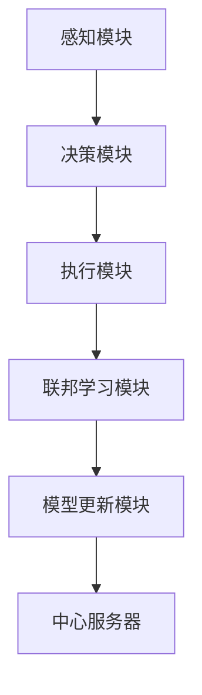

                 

# 开发具有联邦学习能力的AI Agent

## 概述

随着人工智能技术的飞速发展，AI Agent作为智能体在各个领域得到了广泛应用。从自动驾驶到智能家居，从智能客服到金融风控，AI Agent正在逐步改变我们的生活和工作方式。然而，随着数据量的不断增大和数据隐私保护的日益重视，传统的中心化学习模式逐渐暴露出其局限性。联邦学习作为一种新兴的分布式学习技术，能够在保护数据隐私的同时，实现模型训练和优化。因此，开发具有联邦学习能力的AI Agent成为了当前研究的热点。

本文将围绕这一主题，逐步展开讨论。首先，我们将介绍联邦学习和AI Agent的基本概念，阐述其背景和发展现状。接着，我们将探讨联邦学习在AI Agent中的应用场景及其面临的挑战。然后，我们将详细介绍如何实现具有联邦学习能力的AI Agent，包括联邦学习框架的选择、开发环境的搭建以及具体的实现步骤。此外，我们还将通过一个实际项目案例，详细讲解如何开发具有联邦学习能力的AI Agent。最后，我们将总结最佳实践，并对未来进行展望。

## 关键词

- 联邦学习
- AI Agent
- 分布式学习
- 数据隐私
- 模型优化

## 摘要

本文旨在探讨如何开发具有联邦学习能力的AI Agent。首先，我们介绍了联邦学习和AI Agent的基本概念，包括其背景、发展现状和主要挑战。接着，我们详细介绍了联邦学习框架的选择、开发环境的搭建以及AI Agent的设计与实现。通过一个实际项目案例，我们展示了如何开发具有联邦学习能力的AI Agent，并对其进行了详细的分析和讲解。最后，我们总结了开发具有联邦学习能力AI Agent的最佳实践，并对未来进行了展望。

# 第一部分：联邦学习与AI Agent概述

## 第1章：联邦学习基础

### 1.1.1 联邦学习的基本概念

#### 联邦学习的定义

联邦学习（Federated Learning）是一种分布式学习技术，它允许多个边缘设备在没有共享全局数据的情况下，通过协作学习共同训练出一个共享的模型。具体来说，每个设备在其本地数据集上独立训练模型，并将模型更新发送到一个中心服务器。中心服务器收集这些更新，并全局优化模型。

#### 联邦学习与中心化学习的比较

与传统的中心化学习相比，联邦学习具有以下优势：

1. **隐私保护**：联邦学习在本地设备上训练模型，不需要将敏感数据上传到中心服务器，从而保护了用户隐私。
2. **去中心化**：联邦学习可以在不依赖于中心化架构的情况下，实现分布式计算，降低了对中心服务器的依赖。
3. **通信效率**：联邦学习通过聚合本地模型更新来实现全局优化，减少了通信次数和通信数据量，提高了通信效率。

然而，联邦学习也面临一些挑战，如数据质量、算法优化、通信安全性等。

#### 联邦学习的主要挑战

1. **数据质量**：联邦学习依赖于本地设备的数据质量，数据不一致、噪声和缺失都会影响模型性能。
2. **算法优化**：如何设计有效的联邦学习算法，以平衡本地模型的多样性、全局模型的稳定性和模型性能，是当前研究的热点。
3. **通信安全性**：在联邦学习过程中，如何确保数据传输的安全性和模型的隐私性，是另一个重要挑战。

### 1.1.2 联邦学习的历史与现状

#### 联邦学习的起源与发展

联邦学习的概念最早由谷歌在2016年提出，其主要目的是为了解决移动设备上的机器学习问题。随后，微软、华为等公司也相继加入研发，推动了联邦学习的快速发展。

#### 联邦学习的应用领域

目前，联邦学习已在多个领域得到了广泛应用：

1. **移动设备**：在智能手机、平板电脑等移动设备上，通过联邦学习实现个性化推荐、语音识别、图像识别等功能。
2. **智能家居**：在家居环境中，通过联邦学习实现智能家居设备的互联互通，提高用户体验。
3. **物联网**：在物联网设备中，通过联邦学习实现设备之间的协同工作，提高系统的整体性能。
4. **金融风控**：在金融领域，通过联邦学习实现风险控制、欺诈检测等应用。

### 1.1.3 联邦学习的优势与局限性

#### 联邦学习的优势

1. **隐私保护**：联邦学习在本地设备上训练模型，不需要共享敏感数据，有效保护了用户隐私。
2. **去中心化**：联邦学习实现了分布式计算，降低了中心化架构的依赖，提高了系统的可靠性和可扩展性。
3. **通信效率**：联邦学习通过本地模型更新的聚合，减少了通信次数和数据量，提高了通信效率。

#### 联邦学习的局限性

1. **数据质量**：联邦学习依赖于本地设备的数据质量，数据不一致、噪声和缺失会影响模型性能。
2. **算法优化**：如何设计有效的联邦学习算法，以平衡本地模型的多样性、全局模型的稳定性和模型性能，是当前研究的挑战。
3. **通信安全性**：如何确保数据传输的安全性和模型的隐私性，是另一个重要挑战。

## 第2章：AI Agent基础

### 2.1.1 AI Agent的定义与分类

#### AI Agent的定义

AI Agent，即人工智能代理，是指能够在特定环境中自主执行任务的计算机程序。它具备感知、决策、执行等能力，能够根据环境变化调整自身行为，以实现预定的目标。

#### AI Agent的分类

AI Agent可以根据其应用场景和功能进行分类，常见的分类方法如下：

1. **按应用场景分类**：如智能客服、自动驾驶、智能家居等。
2. **按功能分类**：如感知类（如视觉、听觉）、决策类（如规划、推理）、执行类（如控制、动作）等。

#### AI Agent的工作原理

AI Agent的工作原理主要包括以下几个环节：

1. **感知**：通过传感器收集环境信息，如图像、声音、温度等。
2. **决策**：根据感知到的环境信息和预定的目标，利用算法生成行动方案。
3. **执行**：根据决策结果，通过执行器（如电机、显示屏）实施行动。

### 2.1.2 AI Agent的核心技术与应用

#### 强化学习在AI Agent中的应用

强化学习是一种通过不断试错来学习最优策略的方法。在AI Agent中，强化学习可用于以下场景：

1. **智能控制**：如自动驾驶、机器人控制等。
2. **推荐系统**：如个性化推荐、广告投放等。

#### 深度学习在AI Agent中的应用

深度学习是一种模拟人脑神经网络结构的学习方法。在AI Agent中，深度学习可用于以下场景：

1. **计算机视觉**：如图像识别、目标检测等。
2. **自然语言处理**：如文本分类、机器翻译等。

#### AI Agent在智能控制中的应用

AI Agent在智能控制中的应用主要包括以下几个方面：

1. **自动驾驶**：通过感知环境信息，自主规划行驶路径，实现自动驾驶。
2. **智能家居**：通过感知用户行为，自主调整家居设备，提升用户体验。

# 第3章：联邦学习在AI Agent中的应用

### 3.1.1 联邦学习与AI Agent的结合

联邦学习与AI Agent的结合，旨在实现一种既具备AI Agent自主性，又能够有效保护数据隐私的智能系统。具体来说，联邦学习在AI Agent中的应用具有以下优势：

1. **隐私保护**：联邦学习在本地设备上训练模型，不需要共享敏感数据，有效保护了用户隐私。
2. **去中心化**：联邦学习实现了分布式计算，降低了中心化架构的依赖，提高了系统的可靠性和可扩展性。
3. **通信效率**：联邦学习通过本地模型更新的聚合，减少了通信次数和数据量，提高了通信效率。

#### 联邦学习在AI Agent中的应用场景

联邦学习在AI Agent中的应用场景广泛，以下为一些典型的应用：

1. **移动设备**：如智能手机、平板电脑等，通过联邦学习实现个性化推荐、语音识别、图像识别等功能。
2. **智能家居**：通过联邦学习实现智能家居设备的互联互通，提高用户体验。
3. **物联网**：在物联网设备中，通过联邦学习实现设备之间的协同工作，提高系统的整体性能。
4. **金融风控**：在金融领域，通过联邦学习实现风险控制、欺诈检测等应用。

#### 联邦学习在AI Agent开发中的挑战

1. **数据隐私保护**：如何在保证模型性能的同时，有效保护用户数据隐私，是联邦学习在AI Agent开发中面临的主要挑战。
2. **通信效率**：如何在有限的通信资源下，实现高效的模型更新和优化，是另一个重要挑战。
3. **算法优化**：如何设计有效的联邦学习算法，以平衡本地模型的多样性、全局模型的稳定性和模型性能，是当前研究的重点。

## 第二部分：联邦学习能力的AI Agent实现

### 第4章：联邦学习框架介绍

#### 4.1.1 联邦学习框架概述

联邦学习框架是用于实现联邦学习算法和机制的软件工具集。一个典型的联邦学习框架通常包括以下几个主要组件：

1. **中心服务器**：负责协调和管理全局模型训练过程，收集和聚合本地模型更新。
2. **客户端**：负责在本地设备上加载全局模型，进行本地训练，并生成本地模型更新。
3. **通信模块**：负责客户端和服务器之间的通信，包括模型更新、参数同步等。

#### 4.1.2 联邦学习框架选型

在选择联邦学习框架时，需要考虑以下几个因素：

1. **框架成熟度**：选择成熟、活跃的框架，可以确保获得更好的社区支持和文档资源。
2. **功能需求**：根据具体应用场景，选择具备所需功能的框架，如支持不同的通信协议、算法优化等。
3. **性能与效率**：选择性能稳定、计算效率高的框架，可以确保模型训练的效率和效果。

#### 4.1.3 开源联邦学习框架介绍

目前，开源联邦学习框架中较为流行的包括以下几种：

1. **TensorFlow Federated (TFF)**：由谷歌开发，支持多种联邦学习算法和模型。
2. **PySyft**：支持联邦学习的基础设施和工具集，可以与PyTorch、TensorFlow等框架结合使用。
3. **Federated Learning Framework (FLF)**：一个由麻省理工学院开发的联邦学习框架，支持多种联邦学习算法。

#### 4.1.4 商业联邦学习框架介绍

除了开源框架外，商业联邦学习框架也是企业选择的一种方案。以下为几种流行的商业框架：

1. **FedAI**：由阿里巴巴开发，支持多种联邦学习算法和模型，具备较强的性能和易用性。
2. **联邦学习云服务**：一些云计算服务提供商，如亚马逊AWS、微软Azure等，也提供了联邦学习服务。

## 第5章：AI Agent开发环境搭建

#### 5.1.1 开发环境准备

在进行AI Agent开发之前，需要准备相应的开发环境。以下为一些基本的硬件和软件要求：

1. **硬件要求**：
   - CPU：建议使用英特尔的酷睿i7及以上处理器。
   - GPU：建议使用NVIDIA的GeForce RTX 2070及以上显卡，以便进行深度学习模型的训练。
   - 内存：至少16GB内存，建议32GB及以上。

2. **软件环境安装**：
   - 操作系统：建议使用Linux系统，如Ubuntu 18.04及以上版本。
   - 编译器：安装CMake、GCC、GCC++等编译工具。
   - Python环境：安装Python 3.7及以上版本，以及相关的库和框架，如TensorFlow、PyTorch、Scikit-learn等。

#### 5.1.2 开发工具与库

在进行AI Agent开发时，需要使用一些常用的开发工具和库。以下为一些常用的工具和库：

1. **开发工具**：
   - PyCharm：一个功能强大的Python集成开发环境（IDE），支持多种编程语言。
   - Jupyter Notebook：一个交互式的Python开发环境，便于编写和运行代码。

2. **机器学习库与框架**：
   - TensorFlow：一个开源的机器学习框架，支持深度学习和强化学习等算法。
   - PyTorch：一个开源的机器学习库，以动态计算图为基础，支持自动微分和GPU加速。
   - Scikit-learn：一个开源的机器学习库，提供了丰富的机器学习算法和工具。

## 第6章：联邦学习能力AI Agent的设计与实现

### 6.1.1 AI Agent需求分析

在开发具有联邦学习能力的AI Agent之前，我们需要明确AI Agent的功能需求和性能需求。以下为一些常见的需求：

#### 功能需求

1. **感知**：AI Agent需要具备感知环境的能力，如视觉感知、声音感知等。
2. **决策**：AI Agent需要根据感知到的环境信息，生成行动方案。
3. **执行**：AI Agent需要根据决策结果，执行相应的行动。
4. **学习**：AI Agent需要具备学习能力，通过不断学习和调整，提高决策和执行的效果。

#### 性能需求

1. **响应速度**：AI Agent需要在短时间内生成行动方案，并执行相应行动。
2. **准确率**：AI Agent的决策和执行需要具有较高的准确率，以实现预期目标。
3. **稳定性**：AI Agent需要在不同的环境中保持稳定的表现，不受环境变化的影响。

### 6.1.2 AI Agent架构设计

为了实现具有联邦学习能力的AI Agent，我们需要设计一个合理的系统架构。以下为一个简单的AI Agent架构设计：

#### AI Agent系统架构图

```
+---------------------------+
|        AI Agent           |
+---------------------------+
|  +----------+     +----------+  |
|  |   感知   |     |   决策   |  |
|  +----------+     +----------+  |
|  | 视觉感知 |     | 行动方案 |  |
|  +----------+     +----------+  |
|  |   执行   |     |  参数调整 |  |
|  +----------+     +----------+  |
|  |   动作   |     |   学习   |  |
|  +----------+     +----------+  |
+---------------------------+
       ^      |      ^
       |      |      |
       |      |      |
       +------+------+
              |
              |
              |
         +----------------+
         |   联邦学习     |
         +----------------+
              |         |
              |         |
              |         |
              |         |
              |         |
         +----------------+
         |   模型更新     |
         +----------------+
```

#### AI Agent模块划分

根据上述架构设计，我们可以将AI Agent划分为以下几个模块：

1. **感知模块**：负责感知环境信息，如视觉、声音等。
2. **决策模块**：根据感知到的环境信息，生成行动方案。
3. **执行模块**：根据决策结果，执行相应行动。
4. **联邦学习模块**：负责联邦学习过程的协调和管理。
5. **模型更新模块**：负责模型更新的下载、解析和应用。

### 6.1.3 联邦学习能力实现

#### 联邦学习算法选择

在联邦学习过程中，选择合适的算法至关重要。以下为几种常见的联邦学习算法：

1. **联邦平均算法（Federated Averaging）**：最简单的联邦学习算法，通过计算本地模型参数的平均值来更新全局模型。
2. **模型剪枝（Model Pruning）**：通过降低模型参数的精度，减少模型大小，提高通信效率。
3. **梯度压缩（Gradient Compression）**：通过限制梯度的大小，减少通信量。
4. **联邦迁移学习（Federated Transfer Learning）**：利用预训练模型，快速适应新任务。

#### 联邦学习流程设计

联邦学习流程主要包括以下几个步骤：

1. **初始化**：初始化全局模型和本地模型。
2. **本地训练**：在本地设备上加载全局模型，进行本地训练，并生成本地模型更新。
3. **模型更新**：将本地模型更新发送到中心服务器，进行全局优化。
4. **模型更新下载**：从中心服务器下载更新后的全局模型，并更新本地模型。
5. **迭代**：重复上述步骤，直至达到预定的迭代次数或模型性能满足要求。

## 第7章：项目实战：开发具有联邦学习能力的AI Agent

### 7.1.1 项目背景

随着物联网（IoT）和边缘计算的发展，越来越多的智能设备被部署在边缘环境中。这些设备生成的海量数据对于中心服务器而言，处理和存储的负担日益加重。同时，数据隐私和安全性问题也日益凸显。为了解决这些问题，我们设计并实现了一个具有联邦学习能力的AI Agent，通过在边缘设备上进行本地训练和模型更新，实现高效的数据隐私保护和智能决策。

### 7.1.2 项目目标

本项目的目标如下：

1. **实现边缘设备的联邦学习功能**：在边缘设备上，实现联邦学习算法的本地训练和模型更新，降低对中心服务器的依赖。
2. **保障数据隐私**：通过联邦学习，确保边缘设备的数据不传输到中心服务器，保障数据隐私和安全。
3. **提升模型性能**：通过联邦学习，提高模型在边缘设备上的性能和准确率。

### 7.1.3 系统功能设计

为了实现项目目标，我们设计了以下主要功能模块：

1. **感知模块**：负责收集边缘设备的环境数据，如温度、湿度、光照等。
2. **决策模块**：根据感知到的环境数据，生成相应的行动方案。
3. **执行模块**：根据决策模块生成的行动方案，执行相应的操作。
4. **联邦学习模块**：负责联邦学习算法的本地训练和模型更新。
5. **模型更新模块**：负责从中心服务器下载更新后的全局模型，并更新本地模型。

#### 领域模型类图

```mermaid
classDiagram
    类A[感知模块] --|{关联}|> 类B[决策模块]
    类B --|{关联}|> 类C[执行模块]
    类C --|{关联}|> 类D[联邦学习模块]
    类D --|{关联}|> 类E[模型更新模块]
    类F[中心服务器] --|{依赖}|> 类D
endclassDiagram
```

### 7.1.4 系统架构设计

为了实现项目目标，我们设计了以下系统架构：

#### 系统架构图



#### 系统组件说明

1. **感知模块**：负责收集边缘设备的环境数据，如温度、湿度、光照等。
2. **决策模块**：根据感知到的环境数据，生成相应的行动方案。
3. **执行模块**：根据决策模块生成的行动方案，执行相应的操作。
4. **联邦学习模块**：负责联邦学习算法的本地训练和模型更新。
5. **模型更新模块**：负责从中心服务器下载更新后的全局模型，并更新本地模型。
6. **中心服务器**：负责全局模型的训练和更新，以及边缘设备的联邦学习协调。

### 7.1.5 系统接口设计

为了实现各个模块之间的协同工作，我们设计了以下系统接口：

1. **感知接口**：用于感知模块与其他模块之间的数据传输。
2. **决策接口**：用于决策模块与执行模块之间的交互。
3. **执行接口**：用于执行模块与其他模块之间的交互。
4. **联邦学习接口**：用于联邦学习模块与模型更新模块之间的交互。
5. **模型更新接口**：用于模型更新模块与中心服务器之间的交互。

#### 系统接口定义

```python
class SensorInterface:
    def get_data(self):
        pass

class DecisionInterface:
    def generate_action(self, data):
        pass

class ExecutorInterface:
    def execute_action(self, action):
        pass

class FederatedLearningInterface:
    def train_model(self, data):
        pass

class ModelUpdateInterface:
    def download_model(self, model):
        pass
```

### 7.1.6 系统接口实现

以下是系统接口的具体实现：

```python
class SensorInterface:
    def get_data(self):
        # 实现感知数据获取
        pass

class DecisionInterface:
    def generate_action(self, data):
        # 实现决策逻辑
        pass

class ExecutorInterface:
    def execute_action(self, action):
        # 实现执行逻辑
        pass

class FederatedLearningInterface:
    def train_model(self, data):
        # 实现联邦学习训练
        pass

class ModelUpdateInterface:
    def download_model(self, model):
        # 实现模型下载
        pass
```

### 7.1.7 实际案例分析与讲解

#### 案例背景

假设我们有一批智能家居设备，如智能空调、智能灯具和智能门锁等。这些设备分布在用户家中，需要根据用户的生活习惯和环境变化，进行智能控制。为了实现这一目标，我们设计并实现了一个具有联邦学习能力的AI Agent，通过在边缘设备上进行本地训练和模型更新，实现高效的数据隐私保护和智能决策。

#### 案例分析与实现

1. **感知模块**：智能空调、智能灯具和智能门锁等设备实时收集环境数据，如室内温度、湿度、光照强度等，通过感知接口将数据传输给决策模块。

2. **决策模块**：决策模块根据感知到的环境数据，结合用户设定的偏好参数，生成相应的行动方案。例如，当室内温度过高时，智能空调将自动启动制冷模式。

3. **执行模块**：执行模块根据决策模块生成的行动方案，控制设备执行相应的操作。例如，当智能空调启动制冷模式时，它会调整制冷温度和风速。

4. **联邦学习模块**：联邦学习模块在本地设备上，利用收集到的环境数据和用户反馈，进行模型训练和优化。通过联邦学习算法，将本地模型更新发送给中心服务器，实现模型的全局优化。

5. **模型更新模块**：模型更新模块从中心服务器下载更新后的全局模型，并更新本地模型。这样，在下次决策时，决策模块将使用更新后的模型，提高决策的准确率和效率。

#### 案例分析与讲解

通过上述案例，我们可以看到，具有联邦学习能力的AI Agent在智能家居系统中发挥了重要作用。以下为具体分析和讲解：

1. **数据隐私保护**：通过联邦学习，边缘设备无需将敏感数据上传到中心服务器，有效保护了用户隐私。同时，中心服务器也无需获取用户的具体数据，降低了数据泄露的风险。

2. **去中心化**：联邦学习实现了去中心化计算，边缘设备可以在本地进行模型训练和优化，降低了中心服务器的负担。同时，当边缘设备数量增加时，系统仍能保持良好的扩展性和可靠性。

3. **模型性能提升**：通过联邦学习，边缘设备能够利用本地数据，进行模型训练和优化，提高模型的准确率和性能。此外，中心服务器可以根据全局数据，优化全局模型，进一步

