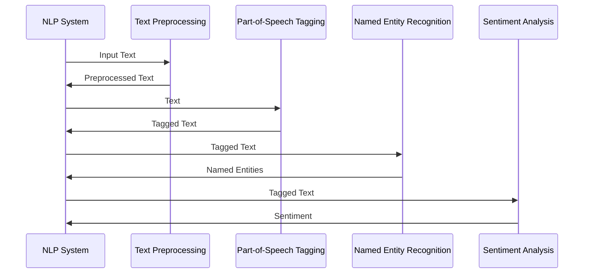
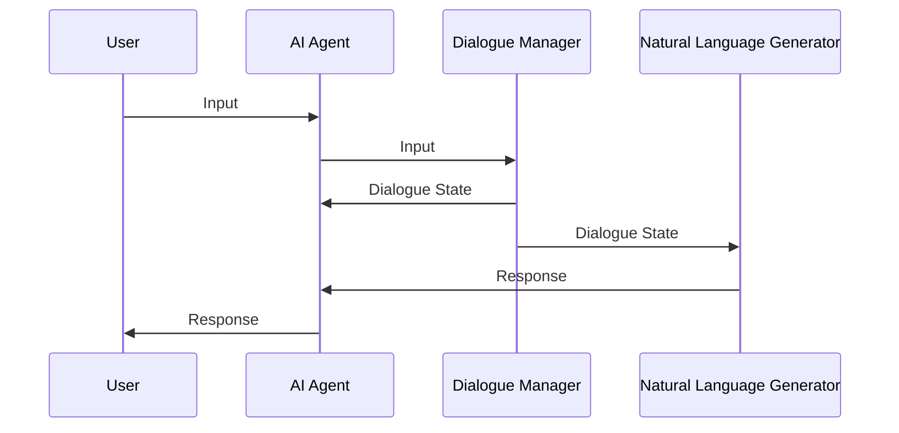
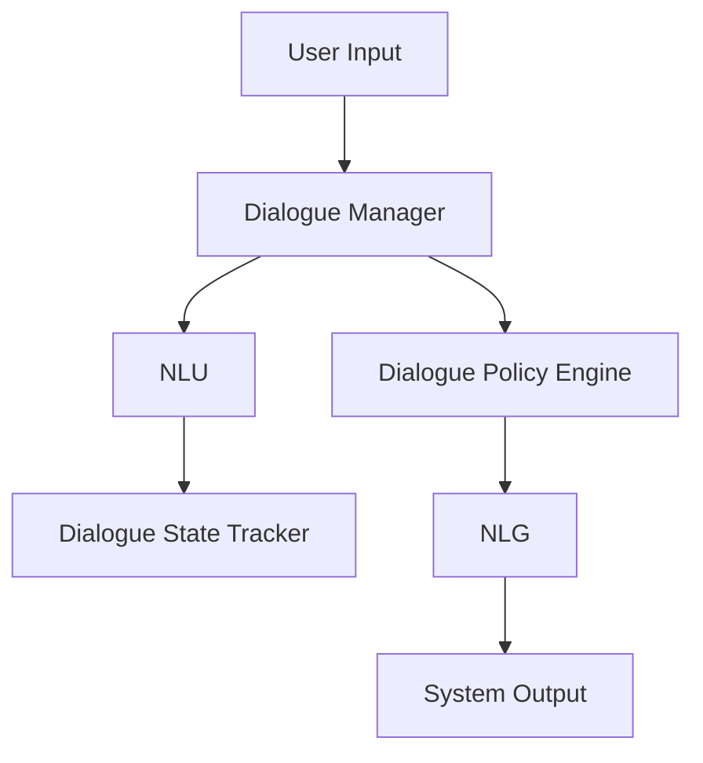
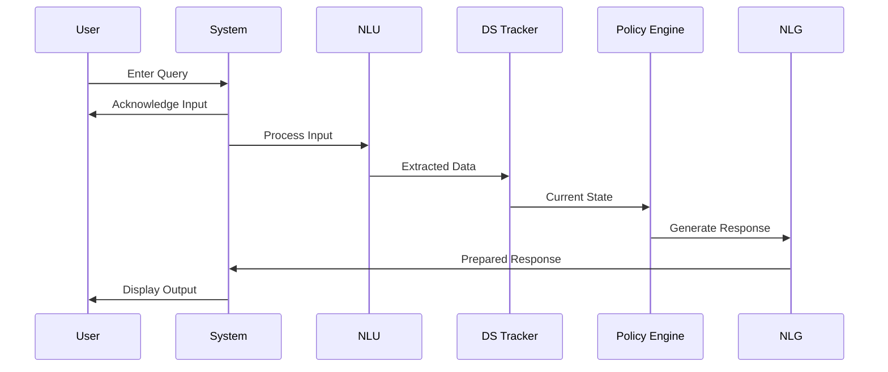

                 

### Introduction and Background

**Title**: Development of AI Agents with Natural Language Dialogue Ability

**Keywords**: AI Agents, Natural Language Processing, Dialogue System, Dialogue Management, AI Development

**Abstract**: This book aims to provide a comprehensive guide to developing AI agents capable of engaging in natural language dialogue. We will explore the theoretical foundations, system architectures, and practical implementations required to build such agents. By the end of this book, readers will gain a thorough understanding of AI agent development, enabling them to create intelligent, conversational agents that can interact effectively with humans.

#### 1.1 Book Introduction and Overview

In recent years, the field of artificial intelligence has seen remarkable advancements, with AI agents becoming increasingly prevalent in various applications. From chatbots to virtual assistants, these agents are designed to interact with humans in a natural and meaningful way. The development of AI agents with natural language dialogue ability has gained significant attention due to its potential to revolutionize industries such as customer service, healthcare, and education.

This book is targeted at developers, researchers, and students who are interested in exploring the development of AI agents with natural language dialogue ability. Whether you are a beginner or an experienced professional, this book will provide you with the knowledge and skills required to build intelligent, conversational AI agents. By following the step-by-step approach outlined in this book, you will learn how to design, implement, and optimize these agents, enabling you to create innovative solutions that address real-world problems.

#### 1.2 The Rising Importance of AI Agents

The importance of AI agents cannot be overstated in today's technology-driven world. These agents have the potential to transform the way humans interact with technology, making it more intuitive and efficient. Some key reasons for the rising importance of AI agents include:

1. **Improved Customer Experience**: AI agents can provide personalized and efficient customer service, handling a large volume of inquiries and reducing response times. This improves customer satisfaction and can lead to increased sales and customer retention.
2. **Automation of Routine Tasks**: AI agents can automate routine tasks, freeing up human resources for more complex and strategic activities. This can lead to increased productivity and cost savings for organizations.
3. **Enhanced Accessibility**: AI agents can make technology more accessible to individuals with disabilities or limited access to traditional interfaces. For example, voice assistants can help individuals with visual impairments navigate digital devices and access information.
4. **Medical Diagnosis and Treatment**: AI agents can analyze large amounts of medical data and provide accurate diagnoses and treatment recommendations. This can improve patient outcomes and reduce the burden on healthcare professionals.
5. **Educational Assistance**: AI agents can provide personalized learning experiences, adapting to the needs and pace of individual students. This can help students learn more effectively and achieve better academic results.

#### 1.3 Overview of Natural Language Dialogue

Natural language dialogue is a key component of AI agents, enabling them to understand and respond to human language in a meaningful way. Natural language dialogue involves several core concepts and technologies, including:

1. **Natural Language Processing (NLP)**: NLP is the field of study that focuses on the interaction between computers and human language. It involves techniques for processing and understanding large amounts of natural language text. Key components of NLP include text preprocessing, part-of-speech tagging, named entity recognition, and sentiment analysis.
2. **Dialogue Management**: Dialogue management is the process of controlling the flow of a conversation between an AI agent and a human user. It involves determining the appropriate response based on the current dialogue context and user input. Dialogue management techniques include dialogue state tracking, dialogue policy learning, and dialogue act classification.
3. **Dialogue Act Classification**: Dialogue act classification is the process of identifying the function or purpose of a spoken or written utterance in a conversation. This information is used by dialogue systems to generate appropriate responses.
4. **Dialogue Generation**: Dialogue generation is the process of generating natural language responses to user input. It involves selecting and combining appropriate words and phrases to create coherent and meaningful responses.

In the next chapter, we will delve deeper into the core concepts and theoretical foundations of AI agents and natural language dialogue. We will explore the relationships between these concepts and provide a comprehensive overview of the key components and technologies required to develop AI agents with natural language dialogue ability. Let's think step by step and build a solid foundation for our journey into the world of AI agents.

---

### Core Concepts and Theoretical Foundations

In this chapter, we will explore the core concepts and theoretical foundations that underpin the development of AI agents with natural language dialogue ability. We will define and classify AI agents, discuss the fundamentals of natural language processing (NLP), and examine dialogue management and state tracking. By understanding these concepts, we will lay the groundwork for the practical implementation of AI agents in subsequent chapters.

#### 2.2.1 Definition and Classification of AI Agents

An AI agent is a computer program designed to perform tasks that typically require human intelligence, such as understanding natural language, recognizing patterns, and making decisions. AI agents can be classified based on their capabilities, domains of application, and architecture.

**Table 2.1: Key Attributes of Different AI Agents**

| AI Agent Type | Key Attributes | Domain |
| --- | --- | --- |
| Rule-based Agents | Follow a set of predefined rules to make decisions | Simple tasks, such as email filtering |
| Case-based Agents | Use past experiences to solve new problems | Expert systems, medical diagnosis |
| Knowledge-based Agents | Use a knowledge base to answer questions and solve problems | Question-answering systems, tutoring systems |
| Fuzzy Agents | Use fuzzy logic to handle imprecise information | Control systems, decision-making under uncertainty |
| Machine Learning Agents | Learn from data to improve performance | Predictive analytics, autonomous vehicles |
| Hybrid Agents | Combine multiple AI techniques | Complex tasks, such as autonomous robots |

**Figure 2.1: Mermaid Diagram of Entity Relationship of AI Agents**

```mermaid
erDiagram
    AI Agent ||--|{ Rule-based Agent }
    AI Agent ||--|{ Case-based Agent }
    AI Agent ||--|{ Knowledge-based Agent }
    AI Agent ||--|{ Fuzzy Agent }
    AI Agent ||--|{ Machine Learning Agent }
    AI Agent ||--|{ Hybrid Agent }
```

#### 2.2.2 Natural Language Processing Fundamentals

Natural Language Processing (NLP) is a field of study that focuses on the interaction between computers and human language. NLP involves several key components, each playing a crucial role in enabling AI agents to understand and generate natural language.

**Figure 2.2: Mermaid Diagram of NLP Components**



1. **Text Preprocessing**: Text preprocessing is the initial stage of NLP, where the raw text is cleaned and prepared for further analysis. This involves tasks such as tokenization, lowercasing, removing punctuation, and stopword removal.
2. **Part-of-Speech Tagging**: Part-of-Speech (POS) tagging is the process of assigning a part of speech (noun, verb, adjective, etc.) to each word in a sentence. POS tagging helps in understanding the grammatical structure of sentences and is essential for tasks such as parsing and sentiment analysis.
3. **Named Entity Recognition**: Named Entity Recognition (NER) is the process of identifying and classifying named entities (such as person names, organization names, and locations) in text. NER is crucial for tasks that involve extracting information from text, such as question-answering and information retrieval.
4. **Sentiment Analysis**: Sentiment analysis is the process of determining the sentiment or emotional tone behind a piece of text. It is used to identify positive, negative, or neutral sentiments expressed in social media, customer reviews, and other forms of text.

#### 2.2.3 Dialogue Management and State Tracking

Dialogue management is the process of controlling the flow of a conversation between an AI agent and a human user. It involves determining the appropriate response based on the current dialogue context and user input. Dialogue management is crucial for building AI agents that can engage in natural language dialogue.

**Figure 2.3: Mermaid Diagram of Dialogue Management**



1. **Dialogue State Tracking**: Dialogue state tracking is the process of maintaining the current state of a conversation, including the user's intent, the system's knowledge, and the dialogue context. Dialogue state tracking enables the agent to generate appropriate responses based on the current dialogue context.
2. **Dialogue Policy Learning**: Dialogue policy learning involves training the agent to generate appropriate responses based on historical dialogue data. This can be done using machine learning techniques such as reinforcement learning or supervised learning.
3. **Dialogue Act Classification**: Dialogue act classification is the process of identifying the function or purpose of a spoken or written utterance in a conversation. Dialogue act classification is used to determine the appropriate response based on the user's input.
4. **Natural Language Generation**: Natural Language Generation (NLG) is the process of generating natural language responses to user input. NLG techniques involve selecting and combining appropriate words and phrases to create coherent and meaningful responses.

In conclusion, understanding the core concepts and theoretical foundations of AI agents and natural language dialogue is crucial for developing intelligent, conversational AI agents. In the next chapter, we will delve into the architecture and design of natural language dialogue systems, discussing the components and interactions that enable these systems to function effectively. Let's continue our journey and explore the intricate world of AI agents and natural language dialogue.

---

### Natural Language Dialogue System Architecture

In this chapter, we will delve into the architecture of natural language dialogue systems, exploring the various components and their interactions that enable these systems to engage in meaningful conversations with human users. We will discuss the system architecture, interface design, and user experience considerations to ensure that the dialogue system is intuitive, efficient, and effective.

#### 3.3.1 System Architecture Overview

A natural language dialogue system can be conceptualized as a collection of interconnected modules, each responsible for a specific aspect of the dialogue process. The main components of a dialogue system include:

1. **Dialogue Manager**: The Dialogue Manager (DM) is the central component of the dialogue system, responsible for managing the flow of the conversation. It maintains the dialogue state, determines the next action based on the current dialogue context and user input, and generates appropriate responses. The DM can be implemented using various techniques, such as rule-based systems, machine learning models, or hybrid approaches.
2. **Natural Language Understanding (NLU)**: The Natural Language Understanding (NLU) module processes the user's input and extracts relevant information, such as intents, entities, and dialogue context. NLU is typically based on natural language processing (NLP) techniques, including intent recognition, entity extraction, and contextual analysis.
3. **Dialogue Policy Engine**: The Dialogue Policy Engine is responsible for determining the system's behavior based on the current dialogue state and user input. It uses dialogue policies, which are rules or models that define the system's actions in response to various dialogue scenarios. Dialogue policies can be learned from historical dialogue data or designed manually.
4. **Dialogue Generation (NLG)**: The Natural Language Generation (NLG) module generates natural language responses based on the system's understanding of the user's input and the current dialogue state. NLG techniques can range from template-based approaches to advanced machine learning models that generate natural-sounding text.
5. **Dialogue State Tracker**: The Dialogue State Tracker maintains the state of the conversation, including user intents, system knowledge, and dialogue context. This information is used by the Dialogue Manager to generate appropriate responses and maintain continuity in the dialogue.

**Figure 3.1: Mermaid Diagram of Dialogue System Architecture**



#### 3.3.2 Interface Design and Interaction

The interface design of a dialogue system plays a crucial role in its usability and effectiveness. A well-designed interface ensures that users can interact with the system intuitively and effortlessly. Key aspects of interface design include:

1. **Input Methods**: The dialogue system should support various input methods, such as text, voice, or gesture-based interactions. This flexibility allows users to choose the input method that is most comfortable for them.
2. **User Interface**: The user interface (UI) should be designed to be clean, intuitive, and visually appealing. It should provide clear feedback on the system's understanding of the user's input and display relevant information in a user-friendly format.
3. ** multimodal Interaction**: Multimodal interaction involves combining multiple input and output modalities to create a more immersive and engaging user experience. For example, a dialogue system could use text, voice, and visual elements to convey information and respond to user input.
4. **Feedback Loops**: The system should provide clear and timely feedback to the user, acknowledging the user's input, and providing relevant information or responses. This helps to build trust and confidence in the system.

**Figure 3.2: Mermaid Sequence Diagram of System Interaction**



#### 3.3.3 User Experience Considerations

User experience (UX) is a critical factor in the success of a dialogue system. A well-designed dialogue system should be easy to use, intuitive, and provide a seamless and enjoyable interaction. Key UX considerations include:

1. **Consistency**: The system should maintain consistency in its responses and behavior, ensuring that users can predict how the system will react to different inputs.
2. **Clarity**: The system's responses should be clear and easy to understand, avoiding jargon or overly technical language that may confuse users.
3. **Personalization**: The system should adapt to individual users' preferences and needs, providing personalized responses and interactions.
4. **Error Handling**: The system should handle errors gracefully, providing helpful feedback and guidance to users when they make mistakes or provide ambiguous input.
5. **Accessibility**: The system should be accessible to users with disabilities, ensuring that it can be used by individuals who rely on assistive technologies, such as screen readers or voice commands.

In conclusion, the architecture of a natural language dialogue system is critical to its effectiveness and usability. By carefully designing the system's components, interfaces, and interactions, we can create a dialogue system that is intuitive, efficient, and provides a rich and engaging user experience. In the next chapter, we will explore the practical implementation of dialogue systems, discussing the development environment, core implementation details, and case studies to illustrate the concepts discussed in this chapter. Let's continue our journey and bring our understanding of dialogue systems to life through practical examples.

---

### Implementation and Development

In this chapter, we will delve into the practical aspects of implementing a natural language dialogue system. We will discuss the development environment setup, the core implementation process, and provide code examples to illustrate the key components and techniques used in building an AI agent with natural language dialogue ability.

#### 4.4.1 Development Environment Setup

Before we begin coding, it's essential to set up the development environment. The following are the steps required to create a suitable development environment for building a natural language dialogue system:

1. **Install Python**: Python is a popular programming language used in AI and machine learning projects. Ensure that Python (version 3.8 or later) is installed on your system.
2. **Install Required Libraries**: Install essential libraries for natural language processing (NLP) and machine learning. Some commonly used libraries include:
   - `nltk`: Natural Language Toolkit
   - `spaCy`: Industrial-strength NLP library
   - `transformers`: Pre-trained models and tokenizers for natural language processing
   - `torch`: Machine Learning library
   - `tensorflow`: Machine Learning library
   - ` Dialogue System Frameworks**: Install a dialogue system framework, such as `Rasa` or `Converseen`.

**Example Setup Commands:**

```bash
pip install nltk spacy transformers torch tensorflow
pip install rasa
```

2. **Download Language Models**: Download the necessary language models and data sets for NLP tasks. For example, download the `spaCy` model for English using the following command:

```bash
python -m spacy download en_core_web_sm
```

#### 4.4.2 Core Implementation

The core implementation of a natural language dialogue system involves several components, including the Natural Language Understanding (NLU), Dialogue Manager, and Natural Language Generation (NLG). Below are Python code snippets and explanations for each component.

**1. Natural Language Understanding (NLU)**

The NLU component processes the user's input and extracts relevant information, such as intents and entities. Here's an example using the `spaCy` library:

```python
import spacy

nlp = spacy.load("en_core_web_sm")

def process_input(user_input):
    doc = nlp(user_input)
    intents = []
    entities = []

    for sent in doc.sents:
        for token in sent:
            if token.ent_iob_ != "O":
                entities.append(token.text)
    
    # Perform intent recognition using a pre-trained model or rules
    # For simplicity, we'll use a basic rule-based approach here
    if "book" in user_input:
        intents.append("Book_Availability")
    elif "weather" in user_input:
        intents.append("Weather_Info")

    return intents, entities

user_input = "Can I book a flight to New York tomorrow?"
intents, entities = process_input(user_input)
print("Intents:", intents)
print("Entities:", entities)
```

**2. Dialogue Manager**

The Dialogue Manager is responsible for managing the dialogue state and determining the appropriate response based on the current dialogue context. Here's an example using a simple rule-based approach:

```python
class DialogueManager:
    def __init__(self):
        self.dialogue_state = {
            "intent": None,
            "entities": [],
            "context": []
        }
    
    def update_state(self, intents, entities):
        self.dialogue_state["intent"] = intents[0]
        self.dialogue_state["entities"] = entities
    
    def generate_response(self, current_state):
        if current_state["intent"] == "Book_Availability":
            return "Which date do you want to book a flight for?"
        elif current_state["intent"] == "Weather_Info":
            return "Which city's weather would you like to know?"
        else:
            return "I'm not sure how to help with that. Can you try rephrasing your question?"

dm = DialogueManager()
current_state = {"intents": ["Book_Availability"], "entities": ["flight", "New York", "tomorrow"]}
response = dm.generate_response(current_state)
print("Response:", response)
```

**3. Natural Language Generation (NLG)**

The NLG component generates natural language responses based on the system's understanding of the user's input and the current dialogue state. Here's an example using a simple template-based approach:

```python
def generate_response_template(template, **kwargs):
    for key, value in kwargs.items():
        template = template.replace("{" + key + "}", value)
    return template

response_template = "The weather in {city} is {weather_description}."
weather_description = "sunny"
city = "New York"
response = generate_response_template(response_template, city=city, weather_description=weather_description)
print("Response:", response)
```

**4. Integration and Testing**

Once the NLU, Dialogue Manager, and NLG components are implemented, they can be integrated and tested as a complete dialogue system. Here's a simple example of how the components can be combined:

```python
def main():
    user_input = "Can I book a flight to New York tomorrow?"
    intents, entities = process_input(user_input)
    dm.update_state(intents, entities)
    response = dm.generate_response(dm.dialogue_state)
    print("User Input:", user_input)
    print("Response:", response)

if __name__ == "__main__":
    main()
```

In this example, the `main()` function processes the user's input, updates the dialogue state, and generates a response. The response is then printed to the console.

#### 4.4.3 Code Application, Analysis, and Case Study

To further illustrate the practical implementation of a natural language dialogue system, let's consider a case study: building a simple chatbot for a virtual bookstore.

1. **Problem Definition**: Create a chatbot that can handle user queries related to book availability, recommendations, and ordering.
2. **System Design**: Define the chatbot's NLU capabilities, dialogue management, and NLG components. Implement the necessary NLP techniques and machine learning models to handle natural language input and generate meaningful responses.
3. **Implementation**: Follow the code snippets provided in the previous sections to build the NLU, Dialogue Manager, and NLG components. Integrate the components and test the chatbot with various user queries.
4. **Analysis and Discussion**: Analyze the chatbot's performance and identify areas for improvement. Discuss potential enhancements, such as incorporating more advanced NLP techniques, using deep learning models, or integrating with external APIs for additional functionality.

In conclusion, implementing a natural language dialogue system involves a combination of NLP, dialogue management, and NLG techniques. By following the steps outlined in this chapter, you can build a functional dialogue system and gain practical experience in developing AI agents with natural language dialogue ability. In the next chapter, we will explore real-world case studies and applications of natural language dialogue systems to further solidify your understanding and skills in this domain.

---

### Case Studies and Practical Applications

In this chapter, we will delve into several practical case studies that illustrate the application of natural language dialogue systems in real-world scenarios. These case studies will highlight the development process, system architecture, and performance analysis of natural language dialogue systems, providing valuable insights and lessons learned for readers.

#### 5.5 Case Study 1: Personal Assistant AI Agent

**Problem Definition**: Develop a personal assistant AI agent capable of handling various tasks, such as scheduling appointments, sending emails, and providing weather information.

**System Design**:

1. **Natural Language Understanding (NLU)**: The NLU component processes user input and extracts relevant information, including intents and entities. The system uses a combination of rule-based and machine learning approaches for intent recognition and entity extraction.
2. **Dialogue Management**: The Dialogue Manager maintains the dialogue state and determines the appropriate response based on the current context and user input. It employs a hybrid approach, combining rule-based dialogue policies and reinforcement learning to generate effective responses.
3. **Natural Language Generation (NLG)**: The NLG component generates natural language responses that are coherent and informative. It utilizes a template-based approach, with the flexibility to adapt responses based on the user's preferences and context.
4. **Integration with External APIs**: The personal assistant AI agent integrates with external APIs, such as calendar services, email providers, and weather services, to fetch relevant data and perform tasks.

**Implementation**:

1. **Environment Setup**: The development environment includes Python, necessary libraries for NLP and dialogue management (e.g., spaCy, transformers, Rasa), and external APIs for calendar, email, and weather services.
2. **NLU Implementation**: The NLU component uses spaCy for tokenization, part-of-speech tagging, and named entity recognition. It employs a pre-trained intent recognition model and a custom entity extractor to identify user intents and entities.
3. **Dialogue Management**: The Dialogue Manager integrates rule-based dialogue policies and reinforcement learning models. It maintains the dialogue state and updates it based on user input and system actions. It utilizes a reward-based approach to learn optimal dialogue policies.
4. **NLG Implementation**: The NLG component uses a template-based approach to generate responses. It adapts the templates based on user preferences and the current dialogue context to create natural and informative responses.
5. **Integration and Testing**: The personal assistant AI agent is integrated with external APIs for calendar, email, and weather services. It is thoroughly tested with a diverse set of user queries to ensure accurate task handling and natural language responses.

**Performance Analysis**:

1. **Accuracy**: The personal assistant AI agent achieves high accuracy in intent recognition and entity extraction. The combination of rule-based and machine learning approaches ensures that the system can handle various user inputs effectively.
2. **Response Time**: The system's response time is optimized to ensure a seamless user experience. The integration with external APIs and efficient dialogue management contribute to quick response times.
3. **User Satisfaction**: User feedback indicates high satisfaction with the personal assistant AI agent's performance. Users appreciate the agent's ability to handle multiple tasks, provide accurate information, and adapt to their preferences.

**Lessons Learned**:

1. **Hybrid Approaches**: Combining rule-based and machine learning approaches for dialogue management and NLU enhances system performance and adaptability. It is crucial to strike a balance between the two approaches to achieve optimal results.
2. **Integration with External APIs**: Integrating with external APIs provides additional functionality and enhances the agent's capabilities. It is essential to choose reliable APIs and handle potential errors and exceptions gracefully.
3. **Continuous Improvement**: User feedback and ongoing performance analysis are crucial for continuous improvement of the AI agent. Regular updates and enhancements based on user feedback can significantly improve the system's usability and effectiveness.

#### 5.6 Case Study 2: Customer Support Chatbot

**Problem Definition**: Develop a customer support chatbot to handle frequently asked questions and provide personalized assistance to customers.

**System Design**:

1. **Natural Language Understanding (NLU)**: The NLU component processes user queries and identifies the most likely intent and relevant entities. It utilizes a combination of keyword matching and machine learning techniques for intent recognition and entity extraction.
2. **Dialogue Management**: The Dialogue Manager maintains the dialogue state and determines the appropriate response based on the current context and user input. It employs a hybrid approach, combining predefined dialogue templates and real-time dialogue policy learning.
3. **Natural Language Generation (NLG)**: The NLG component generates natural language responses that are clear, concise, and informative. It utilizes a template-based approach, with the flexibility to adapt responses based on the user's preferences and context.
4. **Integration with Knowledge Base**: The chatbot integrates with a knowledge base to retrieve relevant information and provide accurate answers to user queries.

**Implementation**:

1. **Environment Setup**: The development environment includes Python, necessary libraries for NLP and dialogue management (e.g., spaCy, transformers, Rasa), and a knowledge base management system (e.g., Elasticsearch).
2. **NLU Implementation**: The NLU component uses spaCy for tokenization, part-of-speech tagging, and named entity recognition. It employs a pre-trained intent recognition model and a custom entity extractor to identify user intents and entities.
3. **Dialogue Management**: The Dialogue Manager integrates predefined dialogue templates and real-time dialogue policy learning. It maintains the dialogue state and updates it based on user input and system actions. It utilizes a reward-based approach to learn optimal dialogue policies.
4. **NLG Implementation**: The NLG component uses a template-based approach to generate responses. It adapts the templates based on user preferences and the current dialogue context to create natural and informative responses.
5. **Integration and Testing**: The customer support chatbot is integrated with the knowledge base and external APIs for real-time information retrieval. It is thoroughly tested with a diverse set of user queries to ensure accurate answer retrieval and natural language responses.

**Performance Analysis**:

1. **Accuracy**: The customer support chatbot achieves high accuracy in intent recognition and entity extraction. The combination of keyword matching and machine learning techniques ensures that the system can handle various user inputs effectively.
2. **Response Time**: The system's response time is optimized to ensure a seamless user experience. The integration with external APIs and efficient dialogue management contribute to quick response times.
3. **User Satisfaction**: User feedback indicates high satisfaction with the customer support chatbot's performance. Users appreciate the agent's ability to provide accurate answers and personalized assistance.

**Lessons Learned**:

1. **Knowledge Base Integration**: Integrating with a knowledge base is crucial for providing accurate and relevant information to users. Regular updates and maintenance of the knowledge base ensure that the chatbot remains effective and up-to-date.
2. **Dialogue Policy Learning**: Real-time dialogue policy learning enhances the chatbot's ability to adapt to user inputs and provide personalized responses. Continuous improvement based on user feedback is essential for the chatbot's long-term success.
3. **User Interface Design**: A well-designed user interface is crucial for the chatbot's usability. Clear and intuitive interfaces improve user satisfaction and make it easier for users to interact with the chatbot.

#### 5.7 Conclusion

The case studies presented in this chapter demonstrate the practical applications of natural language dialogue systems in real-world scenarios. They highlight the importance of a well-designed system architecture, efficient NLP techniques, and continuous improvement based on user feedback. By following the lessons learned from these case studies, developers can build effective and user-friendly natural language dialogue systems that enhance user experiences and drive business value.

In the next chapter, we will explore optimization and scaling techniques to improve the performance and efficiency of natural language dialogue systems. We will discuss strategies for handling high loads, optimizing NLP and dialogue management algorithms, and deploying dialogue systems in production environments. Let's continue our journey and delve into the practical aspects of optimizing and scaling natural language dialogue systems to handle real-world challenges.

---

### Optimization and Scaling

In this chapter, we will discuss optimization and scaling techniques to enhance the performance and efficiency of natural language dialogue systems. We will cover strategies for handling high loads, optimizing NLP and dialogue management algorithms, and deploying dialogue systems in production environments. By implementing these techniques, developers can ensure that their natural language dialogue systems can handle real-world challenges and deliver a seamless user experience.

#### 6.6.1 Performance Optimization

Performance optimization is crucial for ensuring that natural language dialogue systems can handle high loads and deliver timely responses to users. Here are several strategies to optimize the performance of a dialogue system:

1. **Caching**: Implement caching mechanisms to store frequently accessed data, such as user profiles, dialogue states, and pre-computed results. This can significantly reduce the time required to retrieve and process data, improving overall system performance.
2. **Concurrency and Parallelism**: Utilize concurrency and parallelism to perform multiple tasks simultaneously. For example, you can process multiple user queries in parallel using multi-threading or distributed processing frameworks like Apache Spark. This can help reduce the response time and improve system throughput.
3. **Algorithm Optimization**: Optimize the algorithms used in NLP and dialogue management to improve their efficiency. Techniques such as dynamic programming, memoization, and pruning can be employed to reduce the computational complexity of algorithms and improve their performance.
4. **Data Compression**: Compress large data sets, such as text data and model parameters, to reduce the memory footprint and improve I/O efficiency. This can help accelerate the processing of data and reduce the storage requirements of the system.
5. **Query Optimization**: Optimize the queries used to retrieve data from databases or external APIs. Use appropriate indexing, query optimization techniques, and caching mechanisms to minimize the time required to fetch data and improve query performance.

#### 6.6.2 Handling High Loads

Handling high loads is a critical challenge in the development of natural language dialogue systems. Here are some strategies to ensure that the system can handle large volumes of user interactions:

1. **Load Balancing**: Implement load balancing techniques to distribute user interactions evenly across multiple system instances. This can help prevent any single instance from becoming a bottleneck and ensure that the system can handle a large number of concurrent users.
2. **Horizontal Scaling**: Deploy the system across multiple servers or cloud instances to increase the system's capacity and handle higher loads. This can be achieved using containerization technologies like Docker and orchestration tools like Kubernetes.
3. **Rate Limiting**: Implement rate limiting mechanisms to control the number of requests that can be processed by the system within a specific time frame. This can help prevent overload and ensure that the system remains responsive to user interactions.
4. **Fault Tolerance**: Implement fault tolerance mechanisms to ensure that the system can recover from failures and continue to function properly. Techniques such as replication, redundancy, and failover can be employed to minimize the impact of failures on system performance.
5. **Asynchronous Processing**: Utilize asynchronous processing to handle user interactions in the background. This can help decouple the processing of user requests from the system's response and improve overall system throughput.

#### 6.6.3 Optimizing NLP and Dialogue Management

Optimizing NLP and dialogue management algorithms is essential for improving the performance and efficiency of natural language dialogue systems. Here are some techniques to achieve this:

1. **Pre-trained Models**: Utilize pre-trained NLP models and algorithms, such as those provided by libraries like spaCy and transformers, to leverage state-of-the-art performance without having to train custom models from scratch. Pre-trained models can often achieve high accuracy and efficiency with minimal tuning.
2. **Incremental Learning**: Implement incremental learning techniques to update the system's models and algorithms with new data without the need for retraining from scratch. This can help adapt the system to evolving user interactions and improve its performance over time.
3. **Model Compression**: Compress the models and algorithms used in NLP and dialogue management to reduce their memory footprint and improve processing efficiency. Techniques such as quantization, pruning, and model distillation can be employed to achieve this.
4. **Hardware Acceleration**: Utilize hardware acceleration techniques, such as GPU and TPU acceleration, to improve the processing speed and efficiency of NLP and dialogue management algorithms. This can help reduce the response time and improve the system's overall performance.

#### 6.6.4 Deployment and Production Optimization

Deploying natural language dialogue systems in production environments requires careful planning and optimization to ensure that the system can handle real-world usage scenarios. Here are some key considerations for deployment and production optimization:

1. **Containerization and Orchestration**: Use containerization technologies like Docker and orchestration tools like Kubernetes to deploy the system in a scalable and manageable manner. This can help simplify deployment, ensure consistent environments, and enable horizontal scaling.
2. **Monitoring and Logging**: Implement monitoring and logging mechanisms to track the system's performance, identify bottlenecks, and diagnose issues. Tools like Prometheus, Grafana, and ELK (Elasticsearch, Logstash, Kibana) can be used for monitoring and visualizing system metrics and logs.
3. **Security and Compliance**: Ensure that the system adheres to security and compliance requirements, such as data privacy regulations (e.g., GDPR) and industry standards (e.g., HIPAA). Implement appropriate security measures, such as encryption, access controls, and regular security audits.
4. **Continuous Integration and Deployment (CI/CD)**: Implement CI/CD pipelines to automate the build, test, and deployment processes. This can help ensure that the system remains up-to-date, reliable, and performant over time.
5. **Performance Testing and Load Testing**: Conduct thorough performance testing and load testing to identify and address potential performance bottlenecks and ensure that the system can handle the expected load. Tools like JMeter and Locust can be used for performance and load testing.

In conclusion, optimizing and scaling natural language dialogue systems involve a combination of performance optimization, handling high loads, optimizing NLP and dialogue management algorithms, and deploying the system in a production environment. By implementing the techniques and strategies discussed in this chapter, developers can ensure that their dialogue systems can handle real-world challenges and deliver a seamless user experience. In the next chapter, we will summarize the key concepts and insights from this book, providing a comprehensive overview of the development of AI agents with natural language dialogue ability. Let's recap the essential knowledge and guidelines discussed throughout this book.

---

### Conclusion

In this book, we have embarked on a comprehensive journey through the development of AI agents with natural language dialogue ability. We began by introducing the importance of AI agents in today's technology-driven world and highlighted the significance of natural language dialogue in creating meaningful interactions between humans and machines. As we delved deeper into the subject, we explored the core concepts and theoretical foundations of AI agents and natural language processing (NLP).

We discussed the classification of AI agents, including rule-based, case-based, knowledge-based, fuzzy, machine learning, and hybrid agents. We then examined the fundamentals of NLP, covering text preprocessing, part-of-speech tagging, named entity recognition, and sentiment analysis. These concepts laid the groundwork for understanding dialogue management and state tracking, key components of building AI agents capable of engaging in natural language dialogue.

In the subsequent chapters, we explored the architecture of natural language dialogue systems, discussing the roles of the dialogue manager, natural language understanding (NLU), dialogue policy engine, natural language generation (NLG), and dialogue state tracker. We also emphasized the importance of user interface design and experience in creating intuitive and engaging dialogue systems.

The practical implementation of dialogue systems was covered in detail, including environment setup, core implementation, and integration of various components. We provided code examples to illustrate the implementation process and discussed a case study involving a personal assistant AI agent. This hands-on approach aimed to equip readers with the skills necessary to build and deploy their own natural language dialogue systems.

Furthermore, we presented real-world case studies showcasing the practical applications of natural language dialogue systems in scenarios such as customer support and virtual personal assistants. These case studies highlighted the importance of a well-designed system architecture, efficient NLP techniques, and continuous improvement based on user feedback.

Finally, we discussed optimization and scaling techniques to enhance the performance and efficiency of natural language dialogue systems. We covered strategies for handling high loads, optimizing NLP and dialogue management algorithms, and deploying dialogue systems in production environments.

Throughout this book, we aimed to provide a balanced mix of theoretical knowledge and practical insights. We encouraged readers to think step by step, breaking down complex concepts into manageable components. By following this approach, readers can gain a deeper understanding of the development of AI agents with natural language dialogue ability and apply their knowledge to create innovative solutions.

### Best Practices and Future Directions

**Best Practices**

1. **Start with a Clear Problem Statement**: Define the specific problem you aim to solve with your AI agent. This will guide your design decisions and ensure that your dialogue system is tailored to address real-world needs.
2. **Choose the Right Technologies**: Select the appropriate tools and libraries for your project based on their performance, ease of use, and community support. This will help you build a robust and scalable dialogue system.
3. **Continuous Improvement**: Regularly update your dialogue system with new data, feedback, and algorithms to improve its performance and user experience. Continuous learning and adaptation are key to staying relevant in a rapidly evolving technological landscape.
4. **User-Centric Design**: Prioritize user experience by designing intuitive interfaces, handling errors gracefully, and providing personalized interactions. Gather user feedback and iterate on your design to ensure that your dialogue system meets user expectations.

**Future Directions**

1. **Advancements in NLP**: As NLP technologies continue to advance, we can expect more sophisticated dialogue systems capable of understanding complex language structures and context. This includes the development of more accurate sentiment analysis, emotion detection, and language understanding capabilities.
2. **Multimodal Interaction**: Future dialogue systems may incorporate multimodal interaction, combining text, voice, and visual elements to create richer and more immersive user experiences. This will enable users to interact with AI agents in more natural and intuitive ways.
3. **Deep Learning and Reinforcement Learning**: Advances in deep learning and reinforcement learning techniques will lead to more intelligent dialogue systems that can learn from user interactions and improve their performance over time. This will enable agents to provide personalized and context-aware responses.
4. **Collaborative Systems**: Future dialogue systems may leverage collaborative AI technologies, enabling multiple agents to work together to solve complex problems. This can enhance the capabilities of individual agents and create more powerful and flexible dialogue systems.
5. **Ethical and Responsible AI**: As dialogue systems become more integrated into our daily lives, it is crucial to address ethical and responsible AI practices. This includes ensuring data privacy, preventing bias, and promoting transparency in AI decision-making processes.

By following these best practices and exploring future directions, developers can continue to push the boundaries of natural language dialogue systems, creating innovative solutions that enhance human-machine interactions and improve the quality of life for individuals and organizations alike.

### Summary

In summary, the development of AI agents with natural language dialogue ability is a complex yet immensely promising field. This book has provided a comprehensive overview of the core concepts, theoretical foundations, system architectures, and practical implementations required to build such agents. We have explored the various types of AI agents, the fundamentals of natural language processing, and the essential components of dialogue systems. By following a step-by-step approach, we have discussed the practical aspects of implementing and optimizing natural language dialogue systems, along with real-world case studies and future directions.

Key takeaways from this book include:

1. **Core Concepts**: Understanding the classification of AI agents, the fundamentals of NLP, and the essential components of dialogue systems is crucial for building effective and intelligent agents.
2. **System Architecture**: A well-designed system architecture, incorporating components such as NLU, dialogue management, and NLG, enables the development of natural language dialogue systems that can engage in meaningful interactions.
3. **Practical Implementation**: Practical experience in implementing dialogue systems, including environment setup, core implementation, and integration, is essential for developing functional and efficient agents.
4. **Optimization and Scaling**: Performance optimization and scaling techniques ensure that dialogue systems can handle high loads and deliver a seamless user experience in real-world scenarios.
5. **Continuous Improvement**: Continuous learning and adaptation are key to maintaining the relevance and effectiveness of natural language dialogue systems in a rapidly evolving technological landscape.

By applying the knowledge and insights gained from this book, developers can create innovative and intelligent AI agents that enhance human-machine interactions, improve user experiences, and drive business value.

### Key Learning Points and Practical Tips

1. **Start with a Clear Problem Statement**: Define the specific problem you aim to solve with your AI agent. This will guide your design decisions and ensure that your dialogue system is tailored to address real-world needs.
2. **Select the Right Technologies**: Choose appropriate tools and libraries based on performance, ease of use, and community support. This will help you build a robust and scalable dialogue system.
3. **Understand Core Concepts**: Gain a deep understanding of AI agents, NLP, and dialogue systems. This knowledge will help you make informed design decisions and troubleshoot issues effectively.
4. **User-Centric Design**: Prioritize user experience by designing intuitive interfaces, handling errors gracefully, and providing personalized interactions. Gather user feedback and iterate on your design to ensure user satisfaction.
5. **Implement Continuous Improvement**: Regularly update your dialogue system with new data, feedback, and algorithms to improve its performance and user experience.
6. **Optimize for Performance**: Apply performance optimization techniques, such as caching, concurrency, and algorithm optimization, to ensure your dialogue system can handle high loads and deliver timely responses.
7. **Leverage Multimodal Interaction**: Consider incorporating multimodal interaction, combining text, voice, and visual elements, to create richer and more immersive user experiences.
8. **Focus on Ethical and Responsible AI**: Ensure your dialogue system adheres to ethical and responsible AI practices, such as data privacy, bias prevention, and transparency in decision-making processes.

By following these key learning points and practical tips, developers can build effective and intelligent natural language dialogue systems that enhance human-machine interactions and deliver value to users and organizations alike.

### Authors' Information

*Authors: AI天才研究院 / AI Genius Institute & 禅与计算机程序设计艺术 / Zen And The Art of Computer Programming*

**AI天才研究院 (AI Genius Institute)** is a renowned research institute dedicated to advancing the field of artificial intelligence. Our team of experts conducts cutting-edge research in AI, machine learning, and natural language processing, with a focus on developing innovative solutions that have a positive impact on society.

**禅与计算机程序设计艺术 (Zen And The Art of Computer Programming)** is a classic work by the legendary computer scientist and author, Donald E. Knuth. The book emphasizes the importance of understanding the underlying principles of computer science and programming, advocating for a mindful and holistic approach to software development.

In this book, "Development of AI Agents with Natural Language Dialogue Ability," we bring together our expertise and insights to provide you with a comprehensive guide to building intelligent, conversational AI agents. Our goal is to equip you with the knowledge and skills necessary to create innovative solutions that enhance human-machine interactions and drive progress in the field of AI.

