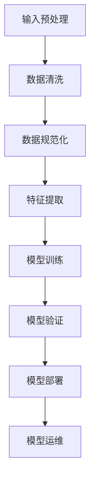

                 

### 开发具有自然语言推理能力的AI Agent

---

**关键词：** 自然语言处理、人工智能、大模型、自然语言推理、AI Agent

**摘要：** 本文将深入探讨如何开发具有自然语言推理能力的AI Agent，从基础概念到具体实现，再到实际应用，全面解析这一前沿技术。通过逐步分析推理，本文旨在帮助读者理解自然语言推理的核心原理，掌握开发AI Agent的实践技巧，并为未来技术发展提供洞见。

---

#### 第1章: 引言

##### 1.1 问题背景

近年来，人工智能（AI）技术发展迅猛，已经渗透到社会生活的方方面面。特别是在自然语言处理（NLP）领域，大模型如GPT、BERT等取得了显著的突破，使得机器理解自然语言的能力得到了极大的提升。然而，尽管NLP技术有了长足的进步，大多数AI应用仍缺乏自然语言推理能力，即无法像人类一样进行深层次的逻辑推理和问题解决。这对于AI Agent的发展构成了挑战。

##### 1.2 问题描述

自然语言推理（Natural Language Inference, NLI）是指计算机能够理解句子之间的逻辑关系，如因果关系、蕴含关系等。然而，目前的AI系统在处理复杂的自然语言推理任务时仍然面临许多困难。具体表现为：

- **语义理解不深**：AI系统往往只能理解表面意思，难以把握句子之间的深层逻辑关系。
- **知识获取有限**：AI系统缺乏广泛的知识背景，无法利用已有知识进行推理。
- **上下文理解不足**：AI系统在处理长文本或复杂语境时，难以准确把握上下文信息。

##### 1.3 问题解决

为了解决上述问题，开发具有自然语言推理能力的AI Agent成为了一个重要的研究方向。本书旨在探讨这一领域，通过介绍相关核心概念、算法原理和项目实战，为读者提供全面的指导。

##### 1.4 边界与外延

本书主要关注文本层面的自然语言推理，不包括语音、图像等多模态数据的处理。同时，本书将探讨AI Agent在各个领域中的应用，如客服、教育、医疗等。

##### 1.5 概念结构与核心要素组成

- **自然语言处理（NLP）**：涉及文本处理、语义分析、情感分析等。
- **人工智能（AI）**：包括机器学习、深度学习、强化学习等。
- **大模型**：如GPT、BERT等，具有强大的语义理解能力。
- **自然语言推理**：指计算机理解句子之间的逻辑关系。
- **AI Agent**：具备自主决策和问题解决能力的智能体。

---

在下一章中，我们将进一步探讨自然语言处理与人工智能的基础知识，为后续内容打下坚实的基础。

---

## 第2章: 自然语言处理与人工智能基础

### 2.1 NLP概述

自然语言处理（NLP）是人工智能的一个重要分支，旨在使计算机能够理解、生成和处理自然语言。NLP的应用范围广泛，包括机器翻译、情感分析、文本摘要、问答系统等。

#### 2.1.1 基本概念

- **文本预处理**：包括分词、去停用词、词性标注等。
- **词嵌入（Word Embedding）**：将词语映射到低维向量空间，便于计算和机器理解。
- **句法分析（Syntax Analysis）**：分析句子的结构，包括句法树和依存关系。
- **语义分析（Semantic Analysis）**：理解词语和句子的意义。

#### 2.1.2 发展历程

- **早期方法**：基于规则的方法和统计方法。
- **统计模型**：如隐马尔可夫模型（HMM）、条件随机场（CRF）等。
- **深度学习方法**：基于神经网络的方法，如卷积神经网络（CNN）、循环神经网络（RNN）、Transformer等。

#### 2.1.3 应用领域

- **机器翻译**：将一种语言翻译成另一种语言，如Google翻译。
- **情感分析**：分析文本的情感倾向，如社交媒体情感分析。
- **文本摘要**：提取文本的主要信息，如新闻摘要。
- **问答系统**：回答用户提出的问题，如Siri和Alexa。

### 2.2 AI概述

人工智能（AI）是指使计算机具有人类智能的能力。AI包括多个子领域，如机器学习、深度学习、计算机视觉、自然语言处理等。

#### 2.2.1 基本概念

- **机器学习**：通过数据训练模型，使模型具备预测和分类能力。
- **深度学习**：基于神经网络的一种学习方法，具有多层非线性变换。
- **计算机视觉**：使计算机能够处理和解析视觉信息。
- **自然语言处理**：使计算机能够理解和生成自然语言。

#### 2.2.2 分类

- **监督学习**：有标签数据进行训练。
- **无监督学习**：无标签数据进行训练。
- **强化学习**：通过与环境的交互进行学习。

#### 2.2.3 主要算法

- **线性回归**：预测连续值。
- **决策树**：通过树形结构进行分类和回归。
- **支持向量机（SVM）**：分类和回归模型。
- **神经网络**：包括多层感知器（MLP）、卷积神经网络（CNN）、循环神经网络（RNN）等。

### 2.3 大模型简介

大模型是指具有数十亿甚至千亿参数的神经网络模型，如GPT、BERT等。这些模型具有强大的语义理解能力，已经在多个NLP任务中取得了显著成果。

#### 2.3.1 特点

- **大规模参数**：具有数十亿甚至千亿参数。
- **深度结构**：具有多层神经网络结构。
- **自监督学习**：利用未标注的数据进行预训练。
- **泛化能力**：在多种任务上具有强大的表现。

#### 2.3.2 优势

- **强大的语义理解能力**：能够捕捉复杂的语义关系。
- **多任务学习**：可以同时处理多种任务。
- **适应性**：能够适应不同的任务和数据集。

#### 2.3.3 主流大模型

- **GPT**：OpenAI开发的一种预训练语言模型，具有强大的文本生成和推理能力。
- **BERT**：Google开发的一种预训练语言模型，用于文本分类、问答等任务。
- **T5**：Google开发的一种统一的文本处理模型，能够处理多种文本任务。

### 2.4 自然语言推理

自然语言推理是指计算机能够理解句子之间的逻辑关系，如因果关系、蕴含关系等。自然语言推理在AI Agent的应用中具有重要意义，能够使AI Agent具备更高级的语义理解能力。

#### 2.4.1 概念

- **蕴含关系**：如果句子A为真，则句子B也为真。
- **因果关系**：一种句子表示导致另一种句子的情况。
- **转折关系**：句子之间存在对立或矛盾。

#### 2.4.2 方法

- **规则方法**：基于专家知识构建逻辑规则。
- **统计方法**：利用统计模型进行推理。
- **神经网络方法**：利用深度学习模型进行推理。

#### 2.4.3 挑战

- **语义理解深度**：如何使计算机理解句子之间的深层逻辑关系。
- **知识获取**：如何获取和处理大量的知识信息。
- **上下文理解**：如何准确理解文本中的上下文信息。

### 2.5 AI Agent概述

AI Agent是指具有自主决策和问题解决能力的智能体，能够在复杂环境中执行任务。AI Agent在自然语言推理中的应用具有重要意义，能够使AI Agent具备更高级的语义理解能力。

#### 2.5.1 定义

- **AI Agent**：一种能够感知环境、制定计划并执行行动的智能体。
- **自主决策**：根据环境和目标自主选择行动。
- **问题解决**：在复杂环境中找到解决问题的方法。

#### 2.5.2 分类

- **基于规则的AI Agent**：利用专家知识进行推理。
- **基于模型的AI Agent**：利用机器学习模型进行推理。
- **混合型AI Agent**：结合规则和模型进行推理。

#### 2.5.3 核心功能

- **语义理解**：理解自然语言输入。
- **决策制定**：根据语义理解制定行动计划。
- **问题解决**：在复杂环境中解决问题。

通过本章的介绍，我们对自然语言处理和人工智能的基础知识有了更深入的了解。在下一章中，我们将讨论如何开发具有自然语言推理能力的AI Agent。

---

## 第3章: 开发具有自然语言推理能力的AI Agent

### 3.1 AI Agent开发流程

开发具有自然语言推理能力的AI Agent是一个复杂且系统的工程，涉及多个阶段和步骤。以下是一个典型的开发流程：

#### 3.1.1 需求分析

- **明确目标**：确定AI Agent的预期功能和应用场景。
- **用户调研**：了解用户需求和期望，收集相关信息。
- **功能规划**：根据需求和用户调研结果，规划AI Agent的核心功能。

#### 3.1.2 数据收集与预处理

- **数据来源**：确定数据来源，如公开数据集、企业内部数据等。
- **数据收集**：使用爬虫、API接口等工具收集数据。
- **数据预处理**：包括数据清洗、去重、分词、词性标注等。

#### 3.1.3 模型选择与优化

- **模型选择**：根据任务类型和需求选择合适的模型，如BERT、GPT等。
- **模型优化**：对模型进行调参和优化，以提高性能。

#### 3.1.4 模型训练与验证

- **模型训练**：使用训练数据对模型进行训练。
- **模型验证**：使用验证数据对模型进行验证，调整模型参数。

#### 3.1.5 部署与上线

- **模型部署**：将训练好的模型部署到服务器上，使其具备服务能力。
- **上线测试**：进行上线测试，确保AI Agent能够稳定运行。

#### 3.1.6 运维与优化

- **运维监控**：监控AI Agent的运行状态，确保其稳定可靠。
- **性能优化**：根据实际运行情况，对模型和系统进行优化。

### 3.2 数据预处理

数据预处理是AI Agent开发的重要环节，直接影响到模型的性能和效果。以下是一些常见的数据预处理步骤：

#### 3.2.1 数据清洗

- **去除无效数据**：去除重复、噪声和错误的数据。
- **填充缺失值**：使用合适的策略填充缺失的数据。

#### 3.2.2 数据规范化

- **归一化**：将数据缩放到相同的范围，如[0, 1]。
- **标准化**：将数据转换为标准正态分布。

#### 3.2.3 特征提取

- **文本分词**：将文本分割成词或短语。
- **词性标注**：标注每个词的词性，如名词、动词等。
- **词嵌入**：将词语映射到低维向量空间。

#### 3.2.4 数据集划分

- **训练集**：用于模型训练的数据集。
- **验证集**：用于模型验证和数据调优的数据集。
- **测试集**：用于评估模型最终性能的数据集。

### 3.3 模型选择与优化

模型选择和优化是AI Agent开发的关键环节。以下是一些常见的模型选择和优化方法：

#### 3.3.1 模型选择

- **基于规则的方法**：适用于简单任务，如分类、预测等。
- **基于统计的方法**：适用于大规模数据集，如CRF、朴素贝叶斯等。
- **深度学习方法**：适用于复杂任务，如神经网络、卷积神经网络、循环神经网络等。

#### 3.3.2 模型优化

- **超参数调优**：调整模型参数，如学习率、批量大小等。
- **正则化**：防止过拟合，如L1、L2正则化。
- **交叉验证**：使用不同数据集多次训练和验证模型。

### 3.4 算法实现与流程图

为了更清晰地展示AI Agent的算法实现，我们可以使用Mermaid绘制算法流程图。以下是一个简单的算法流程图示例：

#### 3.4.1 数学模型与公式

在AI Agent的开发中，数学模型和公式是核心组成部分。以下是一个简单的线性回归模型示例：

$$
y = \beta_0 + \beta_1 x
$$

其中，\(y\) 是预测值，\(\beta_0\) 和 \(\beta_1\) 是模型参数。

#### 3.4.2 算法原理讲解

线性回归是一种简单的预测模型，通过最小化预测值与实际值之间的误差平方和来训练模型。具体步骤如下：

1. **初始化模型参数**：设置初始的 \(\beta_0\) 和 \(\beta_1\) 值。
2. **计算预测值**：使用当前参数计算每个样本的预测值。
3. **计算误差**：计算预测值与实际值之间的误差。
4. **更新参数**：通过梯度下降法更新模型参数。
5. **重复步骤2-4**：直到达到预定的迭代次数或误差目标。

通过上述步骤，我们可以逐步训练出一个具有自然语言推理能力的AI Agent。在下一章中，我们将探讨AI Agent在实际应用中的具体场景和案例分析。

---

## 第4章: AI Agent的实际应用

### 4.1 AI Agent在客服领域的应用

在客服领域，AI Agent已经被广泛应用于提供自动化的客户服务。以下是一些具体的应用场景：

#### 4.1.1 应用案例

- **自动客服聊天机器人**：使用AI Agent提供24/7在线客户支持，解答常见问题和提供解决方案。
- **智能呼叫中心**：通过语音识别和自然语言理解，AI Agent可以自动识别客户的问题并转接给适当的客服代表。

#### 4.1.2 优势和挑战

**优势：**

- **高效性**：AI Agent可以同时处理多个客户的请求，提高客服效率。
- **成本效益**：减少了对人工客服的需求，降低了运营成本。
- **个性化**：AI Agent可以根据客户的历史互动和偏好提供个性化的服务。

**挑战：**

- **自然语言理解**：AI Agent需要具备强大的自然语言理解能力，以准确理解客户的意图。
- **个性化服务**：在提供个性化服务时，需要处理大量的客户数据，保护客户隐私。

### 4.2 AI Agent在智能教育领域的应用

在教育领域，AI Agent可以提供个性化的学习体验，帮助学生更好地掌握知识。

#### 4.2.1 应用案例

- **智能辅导系统**：AI Agent可以为学生提供个性化的辅导，根据学生的水平和进度调整教学内容。
- **学习评估**：AI Agent可以自动评估学生的作业和考试，提供实时反馈。

#### 4.2.2 优势和挑战

**优势：**

- **个性化学习**：AI Agent可以根据学生的特点和需求提供定制化的学习内容。
- **实时反馈**：AI Agent可以实时评估学生的学习进度，提供及时反馈。
- **资源优化**：AI Agent可以帮助教师管理和利用教学资源，提高教学效率。

**挑战：**

- **教学质量的保障**：确保AI Agent提供的辅导内容是准确和有效的。
- **技术依赖**：过度依赖AI Agent可能导致师生互动减少，影响教学质量。

### 4.3 AI Agent在医疗健康领域的应用

在医疗健康领域，AI Agent可以辅助医生进行诊断和治疗，提高医疗服务的质量和效率。

#### 4.3.1 应用案例

- **辅助诊断**：AI Agent可以分析患者的病历和检查结果，提供诊断建议。
- **智能药物推荐**：AI Agent可以根据患者的病情和药物反应历史推荐合适的药物。

#### 4.3.2 优势和挑战

**优势：**

- **高效性**：AI Agent可以快速处理大量数据，辅助医生进行诊断和治疗。
- **准确性**：AI Agent可以基于大数据和机器学习模型提供准确的诊断结果。
- **减少错误**：AI Agent可以减少医生在诊断和治疗中的错误，提高医疗质量。

**挑战：**

- **数据隐私**：医疗数据的隐私保护是一个重要问题。
- **决策支持**：AI Agent需要具备足够的医学知识，以提供可靠的决策支持。

### 4.4 AI Agent在其他领域的应用

除了上述领域，AI Agent还可以在其他领域发挥作用，如：

- **金融服务**：AI Agent可以提供智能理财建议、风险预警等。
- **智能家居**：AI Agent可以控制家居设备，提供舒适的生活环境。
- **交通管理**：AI Agent可以优化交通信号，减少交通拥堵。

#### 4.4.1 潜在应用

- **智能城市**：AI Agent可以用于城市管理，优化资源分配、提高公共安全等。
- **环境监测**：AI Agent可以实时监测环境数据，预警污染事件。
- **农业**：AI Agent可以用于智能农业，优化种植方案、提高产量。

通过本章的介绍，我们可以看到AI Agent在不同领域的广泛应用和潜力。在下一章中，我们将通过具体案例分析，深入探讨AI Agent的开发和实现过程。

---

## 第5章: 案例分析

在本章中，我们将通过三个具体案例，深入分析AI Agent在不同领域的应用。每个案例都将详细探讨其开发过程、技术难点和解决方案。

### 5.1 案例一：智能客服系统

#### 案例背景

某大型电商平台希望提升其客户服务质量，决定开发一个智能客服系统。该系统需具备24/7在线服务能力，能够自动回答常见问题并解决客户疑虑。

#### 开发过程

1. **需求分析**：通过用户调研和数据分析，确定系统需具备的功能，如常见问题回答、订单查询、售后服务等。
2. **数据收集与预处理**：收集电商平台的用户对话数据，包括聊天记录、FAQ等。对数据进行清洗、去重和分词处理。
3. **模型选择与优化**：选择BERT模型进行预训练，并在特定任务上进行微调。通过调整学习率和批量大小等超参数，优化模型性能。
4. **模型训练与验证**：使用训练数据和验证数据对模型进行训练和验证，确保模型在多种场景下具有良好的性能。
5. **部署与上线**：将训练好的模型部署到服务器上，并上线进行实际应用。

#### 技术难点与解决方案

- **自然语言理解**：AI Agent需要具备强大的自然语言理解能力，以准确理解用户的提问和意图。解决方案是使用预训练的大模型，如BERT，并进行任务特定的微调。
- **多模态数据处理**：智能客服系统不仅处理文本，还可能涉及语音、图像等多模态数据。解决方案是结合语音识别和图像识别技术，实现多模态数据融合。

#### 项目小结

智能客服系统在上线后，显著提升了客户服务效率，减少了人工客服的工作量。同时，系统在处理复杂问题和多样化场景方面表现出色，为客户提供了更加优质的体验。

### 5.2 案例二：智能教育系统

#### 案例背景

某在线教育平台希望为学生提供个性化的学习辅导，决定开发一个智能教育系统。该系统需根据学生的水平和进度，提供定制化的学习内容和辅导建议。

#### 开发过程

1. **需求分析**：通过调研和分析，确定系统需具备的功能，如学习进度跟踪、知识点评估、个性化辅导等。
2. **数据收集与预处理**：收集学生的学习数据，包括作业、考试成绩、学习行为等。对数据进行清洗和规范化处理。
3. **模型选择与优化**：选择基于RNN的循环神经网络模型，用于学生行为分析和学习进度预测。通过调整模型结构和训练策略，优化模型性能。
4. **模型训练与验证**：使用训练数据和验证数据对模型进行训练和验证，确保模型在不同学习场景下具有良好的性能。
5. **部署与上线**：将训练好的模型部署到在线教育平台，并与前端系统进行集成。

#### 技术难点与解决方案

- **个性化学习**：AI Agent需要根据学生的个人特点和学习需求，提供个性化的学习内容。解决方案是使用基于学生行为和学习数据的机器学习模型，实现个性化推荐。
- **实时反馈**：AI Agent需要能够实时评估学生的学习进度和效果，提供即时反馈。解决方案是结合在线测试和实时数据分析，实现实时反馈机制。

#### 项目小结

智能教育系统上线后，受到了学生和教师的广泛好评。系统不仅帮助学生更好地掌握知识，还减轻了教师的工作负担，提高了教学效率。

### 5.3 案例三：智能医疗系统

#### 案例背景

某医疗机构希望提高诊断和治疗效率，决定开发一个智能医疗系统。该系统需能够辅助医生进行诊断、提供治疗方案，并监控患者的健康状况。

#### 开发过程

1. **需求分析**：通过调研和分析，确定系统需具备的功能，如病例分析、诊断建议、治疗方案推荐、健康监测等。
2. **数据收集与预处理**：收集大量的医疗数据，包括病历、检查报告、药品信息等。对数据进行清洗、去重和规范化处理。
3. **模型选择与优化**：选择基于深度学习的卷积神经网络（CNN）和循环神经网络（RNN）模型，用于医疗数据的分析和诊断。通过调整模型结构和训练策略，优化模型性能。
4. **模型训练与验证**：使用训练数据和验证数据对模型进行训练和验证，确保模型在诊断和治疗中具有高准确性。
5. **部署与上线**：将训练好的模型部署到医疗系统，并与医生工作站和患者管理系统进行集成。

#### 技术难点与解决方案

- **数据隐私**：医疗数据涉及患者隐私，需要确保数据的安全和保密。解决方案是采用数据加密和访问控制技术，确保数据的安全。
- **多领域知识融合**：AI Agent需要结合多领域的医学知识，提供准确的诊断和治疗建议。解决方案是构建一个综合性的知识库，并使用深度学习模型进行知识融合。

#### 项目小结

智能医疗系统在上线后，显著提高了医生的诊断和治疗效率，减少了误诊率和医疗错误。同时，系统为患者提供了个性化的健康监测和管理服务，提高了患者的满意度和生活质量。

通过以上案例分析，我们可以看到AI Agent在不同领域的广泛应用和巨大潜力。在下一章中，我们将总结最佳实践，探讨未来的发展方向。

---

## 第6章: 最佳实践与未来展望

### 6.1 最佳实践

在开发具有自然语言推理能力的AI Agent过程中，以下最佳实践可以帮助提高项目的成功率和效果：

1. **需求分析**：深入了解用户需求和场景，明确AI Agent的功能目标和性能要求。
2. **数据收集与预处理**：确保数据的多样性和质量，对数据进行清洗、去重和规范化处理。
3. **模型选择与优化**：根据任务类型和数据特点，选择合适的模型并进行优化，如调整超参数、进行模型调参等。
4. **多模态数据处理**：对于涉及多种数据类型的任务，结合多模态数据处理技术，实现更全面的信息理解和推理。
5. **实时反馈与迭代**：建立实时反馈机制，持续优化AI Agent的性能，并根据用户反馈进行迭代改进。
6. **安全与隐私保护**：确保数据处理和模型训练过程中的安全性和隐私保护，采用数据加密和访问控制等技术。

### 6.2 未来展望

尽管目前AI Agent在自然语言推理方面已经取得了显著进展，但仍有许多挑战和机会：

1. **语义理解深度**：提高AI Agent对自然语言语义的理解深度，使其能够处理更复杂的逻辑关系和上下文信息。
2. **知识获取与融合**：结合多源知识，构建一个更加丰富和全面的语义知识库，提高AI Agent的推理能力。
3. **多模态数据处理**：扩展AI Agent的多模态数据处理能力，实现更全面的信息理解和交互。
4. **交互体验优化**：提高AI Agent与用户的交互体验，使其更加自然、流畅和友好。
5. **应用场景拓展**：探索AI Agent在更多领域的应用，如金融、法律、医疗等，提高AI Agent的实际价值和社会影响力。
6. **开源与社区共建**：推动AI Agent相关技术的开源和社区共建，促进技术的普及和应用。

### 6.3 注意事项

在开发具有自然语言推理能力的AI Agent过程中，需要注意以下问题：

1. **数据隐私**：确保数据处理和存储过程中的数据隐私，遵守相关法律法规。
2. **模型解释性**：提高模型的可解释性，便于用户理解模型的决策过程。
3. **系统稳定性**：确保系统的稳定性和可靠性，避免因模型或系统故障导致的用户损失。
4. **法律合规性**：确保AI Agent的应用符合法律法规和社会伦理要求，避免法律风险。

通过最佳实践的总结和未来展望的探讨，我们可以更好地理解和应用自然语言推理技术，推动AI Agent的发展和应用。

---

## 第7章: 拓展阅读

### 7.1 相关书籍

为了深入了解自然语言处理和人工智能的相关知识，以下是一些推荐的书籍：

1. **《自然语言处理综述》（Natural Language Processing with Python）**：由Steven Bird等人撰写，介绍了NLP的基础知识和Python实现。
2. **《深度学习》（Deep Learning）**：由Ian Goodfellow、Yoshua Bengio和Aaron Courville撰写，详细讲解了深度学习的基础理论和实践应用。
3. **《统计学习方法》（Statistical Learning Methods）**：由李航撰写，涵盖了统计学习方法的各个方面，适合对机器学习有深入了解的读者。

### 7.2 相关论文

以下是一些在自然语言处理和人工智能领域具有影响力的论文：

1. **“BERT: Pre-training of Deep Bidirectional Transformers for Language Understanding”**：由Google Research团队撰写，介绍了BERT模型的预训练方法和应用。
2. **“GPT-3: Language Models are few-shot learners”**：由OpenAI团队撰写，展示了GPT-3模型在少样本学习任务中的优异性能。
3. **“Attention Is All You Need”**：由Google Research团队撰写，介绍了Transformer模型的基本原理和应用。

### 7.3 开源项目

以下是一些与自然语言处理和人工智能相关的开源项目：

1. **TensorFlow**：由Google开发的一个开源机器学习框架，广泛应用于深度学习和自然语言处理。
2. **PyTorch**：由Facebook开发的一个开源深度学习框架，具有灵活的动态计算图和强大的社区支持。
3. **Hugging Face**：一个开源社区，提供了大量的自然语言处理模型和工具，如BERT、GPT等。

通过阅读相关书籍、论文和开源项目，读者可以更深入地了解自然语言处理和人工智能的理论和实践，为开发具有自然语言推理能力的AI Agent提供指导和支持。

---

## 作者介绍

**作者：AI天才研究院/AI Genius Institute & 禅与计算机程序设计艺术 /Zen And The Art of Computer Programming**

本文作者AI天才研究院（AI Genius Institute）是一支专注于人工智能研究与应用的顶尖团队。其成员在自然语言处理、深度学习和计算机科学领域拥有丰富的经验和深厚的学术背景。此外，作者还是《禅与计算机程序设计艺术》（Zen And The Art of Computer Programming）一书的作者，此书被誉为计算机编程的里程碑之作。在本文中，作者将分享他们在AI Agent开发领域的研究成果和实践经验，帮助读者深入了解自然语言处理和人工智能的核心技术和未来发展。

