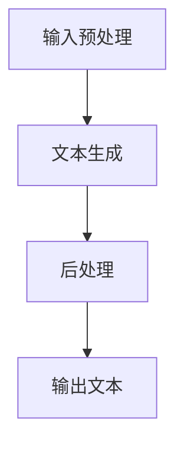
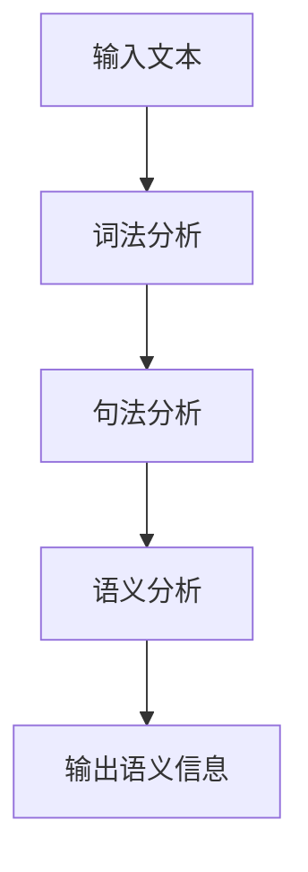
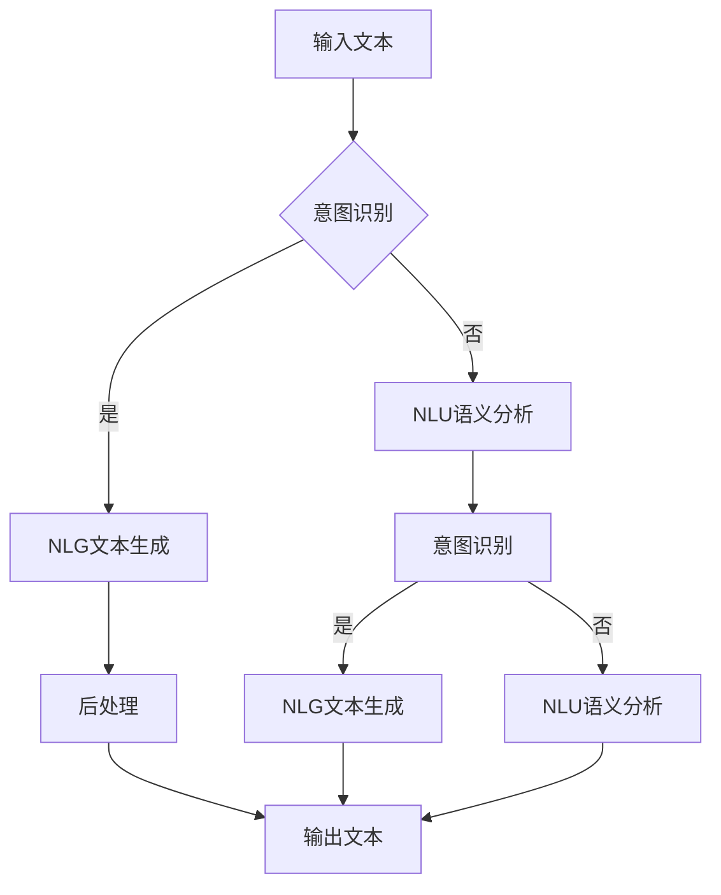
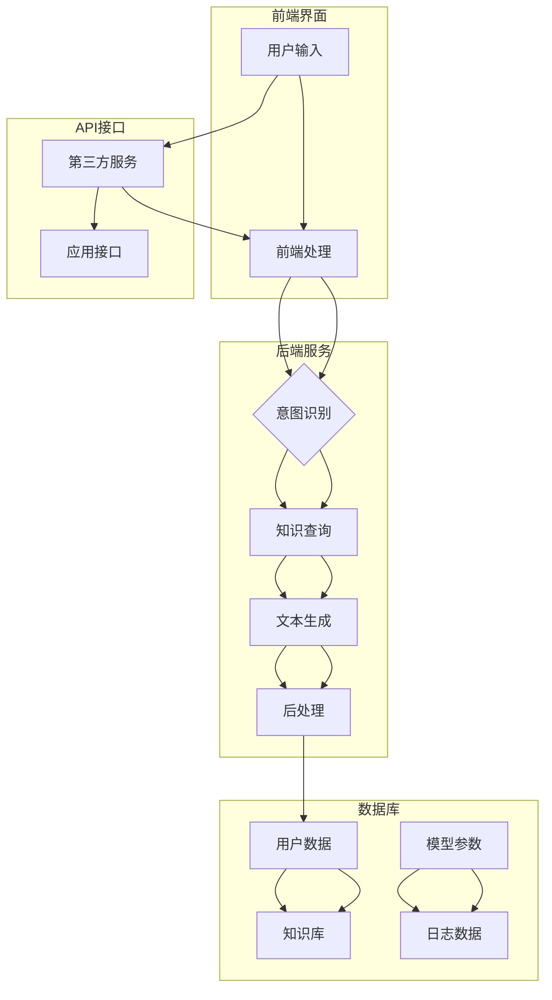
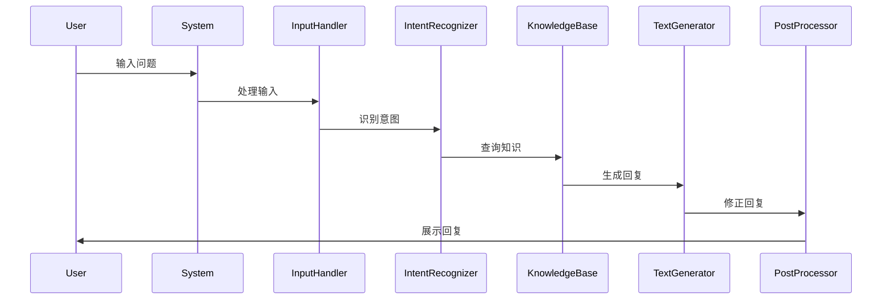

                 

## 开发具有自然语言生成与理解能力的AI Agent

### 关键词：AI Agent，自然语言生成，自然语言理解，算法原理，系统架构设计

#### 摘要：
本文旨在探讨如何开发具有自然语言生成（NLG）与理解（NLU）能力的AI Agent。我们将从背景介绍、核心概念与联系、算法原理与实现、系统分析与架构设计等方面进行详细分析，并通过具体的例子和代码实现，帮助读者深入理解并掌握这一技术。

---

### 第一部分：背景

#### 1.1 问题背景

##### 1.1.1 人工智能的发展历程

自20世纪50年代以来，人工智能（AI）经历了多次技术革命。从最初的逻辑推理，到20世纪80年代的专家系统，再到21世纪的深度学习，人工智能的发展日新月异。如今，AI已经成为许多行业的关键技术，而具有自然语言生成与理解能力的AI Agent更是未来智能交互的核心。

##### 1.1.2 自然语言处理的重要性

自然语言处理（NLP）是人工智能的重要组成部分，它旨在让计算机理解和生成人类语言。随着互联网和社交媒体的普及，自然语言处理在信息检索、智能客服、内容生成等领域发挥着重要作用。

##### 1.1.3 AI Agent的概念与需求

AI Agent是一种能够自主执行任务、与人类进行自然语言交互的智能体。随着AI技术的发展，AI Agent在智能客服、智能家居、智能医疗等领域有着广泛的应用需求。

#### 1.2 问题描述

##### 1.2.1 开发AI Agent面临的挑战

开发具有自然语言生成与理解能力的AI Agent面临以下挑战：
1. **自然语言理解的复杂性**：自然语言包含丰富的语义、语法和上下文信息，理解其含义是一项复杂的任务。
2. **自然语言生成的多样性**：生成自然语言需要考虑多种表达方式、语境和情感。
3. **实时性与效率**：AI Agent需要在短时间内处理大量语言信息，同时保证响应的准确性和自然性。

##### 1.2.2 自然语言生成与理解的核心问题

1. **语义理解**：如何准确地理解用户输入的语义，包括词汇、句法、语义角色等。
2. **上下文感知**：如何根据上下文信息进行语言生成和理解，保证对话的一致性和连贯性。
3. **情感分析**：如何识别和生成情感化的语言，提高用户满意度。

#### 1.3 问题解决

##### 1.3.1 相关技术原理

为了解决上述问题，我们需要掌握以下技术原理：
1. **自然语言处理技术**：包括词向量表示、句法解析、语义角色标注等。
2. **深度学习技术**：包括循环神经网络（RNN）、长短时记忆网络（LSTM）、生成对抗网络（GAN）等。
3. **对话系统技术**：包括对话管理、回复生成、情感分析等。

##### 1.3.2 研究现状与趋势

当前，自然语言生成与理解技术取得了显著进展，但仍存在许多挑战。未来，随着技术的不断成熟，AI Agent将在更多领域发挥重要作用。

#### 1.4 边界与外延

##### 1.4.1 AI Agent的应用领域

AI Agent在智能客服、智能家居、智能医疗、智能教育等多个领域有着广泛的应用。

##### 1.4.2 AI Agent的技术边界

AI Agent的技术边界包括自然语言处理、对话系统、深度学习等领域的最新研究成果。

##### 1.4.3 AI Agent的未来发展方向

随着技术的进步，AI Agent将朝着更智能、更自然、更高效的方向发展。

#### 1.5 概念结构与核心要素组成

##### 1.5.1 AI Agent的组成部分

AI Agent由感知模块、决策模块、执行模块和交互模块组成。

##### 1.5.2 自然语言生成与理解的关键技术

自然语言生成与理解的关键技术包括语义分析、句法分析、上下文感知、情感分析等。

#### 1.6 本章小结

本节介绍了AI Agent的开发背景、面临的挑战、相关技术原理以及未来发展方向，为后续章节的内容奠定了基础。

---

### 第一部分小结

在本节中，我们详细介绍了AI Agent的开发背景、面临的挑战、相关技术原理以及未来发展方向，为读者了解AI Agent的开发奠定了基础。

---

## 第二部分：核心概念与联系

### 2.1 自然语言生成（NLG）原理

#### 2.1.1 NLG的基本概念

自然语言生成（Natural Language Generation，NLG）是一种让计算机自动生成自然语言文本的技术。NLG的核心目标是使计算机生成的文本具有人类语言的自然性和可读性。

#### 2.1.2 NLG的常见技术

NLG技术主要包括基于规则的方法、模板匹配方法、统计方法和生成式方法。

1. **基于规则的方法**：通过定义一组语法规则，将结构化的数据转换为自然语言文本。
2. **模板匹配方法**：使用预定义的模板和填充字段，将结构化的数据插入到模板中生成文本。
3. **统计方法**：利用统计学习模型，从大量语料库中学习生成规则，生成自然语言文本。
4. **生成式方法**：使用生成式模型，如生成对抗网络（GAN），生成自然语言文本。

#### 2.1.3 NLG算法原理讲解

NLG算法通常分为三个阶段：数据预处理、文本生成和后处理。

1. **数据预处理**：包括数据清洗、数据标注和词向量表示等步骤。
2. **文本生成**：使用生成式模型或统计学习模型，根据输入数据生成自然语言文本。
3. **后处理**：对生成的文本进行语法和语义修正，提高文本质量。

### 2.2 自然语言理解（NLU）原理

#### 2.2.1 NLU的基本概念

自然语言理解（Natural Language Understanding，NLU）是一种让计算机理解和解析人类语言的技术。NLU的目标是使计算机能够从文本中提取语义信息，理解语言的含义和意图。

#### 2.2.2 NLU的技术体系

NLU技术体系包括词法分析、句法分析、语义分析、指代消解、情感分析等。

1. **词法分析**：将文本拆分成单词或词组。
2. **句法分析**：分析文本的语法结构，构建句法树。
3. **语义分析**：理解文本的语义含义，识别实体、关系和事件。
4. **指代消解**：解决文本中的指代问题，如代词、名词等的指代对象。
5. **情感分析**：分析文本的情感倾向，如正面、负面或中性。

#### 2.2.3 NLU算法原理讲解

NLU算法通常分为两个阶段：词法分析和句法语义分析。

1. **词法分析**：使用词性标注技术，将文本中的单词标注为不同的词性。
2. **句法语义分析**：使用句法分析技术，构建句法树；使用语义分析技术，提取语义角色和事件。

### 2.3 NLG与NLU的关系

#### 2.3.1 NLG与NLU的互动

NLG和NLU在智能交互系统中相互配合，共同实现智能对话。

1. **NLU负责理解用户输入**：NLU通过解析用户输入，提取语义信息，理解用户意图。
2. **NLG负责生成回复**：NLG根据NLU提取的语义信息，生成自然语言回复。

#### 2.3.2 NLG与NLU的整合

为了实现高效、自然的智能交互，需要将NLG和NLU整合到一起。

1. **动态整合**：根据对话的进展，动态调整NLU和NLG的策略和参数。
2. **静态整合**：在设计阶段，将NLU和NLG模块整合到一个系统中，实现无缝对接。

#### 2.3.3 NLG与NLU的优势互补

NLG和NLU各自具有优势，相互补充。

1. **NLU的优势**：强大的语义理解和意图识别能力，使AI Agent能够准确理解用户输入。
2. **NLG的优势**：自然语言生成能力，使AI Agent能够以自然、流畅的方式与用户进行交互。

#### 2.4 核心概念属性特征对比表格

| 特征         | 自然语言生成（NLG） | 自然语言理解（NLU） |
| ------------ | ------------------- | ------------------- |
| 目标         | 生成自然语言文本   | 理解自然语言文本   |
| 核心技术     | 生成式模型、模板匹配 | 词法分析、句法分析、语义分析 |
| 数据依赖     | 语料库、语言模型   | 语料库、语义资源   |
| 输出质量     | 自然性、多样性、情感化 | 准确性、一致性、上下文感知 |
| 难点         | 语义一致性、情感表达 | 语义理解、上下文感知 |

#### 2.5 ER实体关系图架构

##### 2.5.1 ER图的概念

实体关系图（Entity-Relationship Diagram，ER图）是一种用于表示实体及其之间关系的图形化工具。在自然语言生成与理解领域，ER图可以用来表示文本中的实体和关系。

##### 2.5.2 NLG与NLU的ER图

以下是NLG与NLU的ER图：

```mermaid
erDiagram
  User ||--|{ AI Agent }|| Response
  AI Agent ||--|{ NLG Module }|| Text
  AI Agent ||--|{ NLU Module }|| Input
  NLG Module ||--|{ Text Generator }|| Generated Text
  NLU Module ||--|{ Text Analyzer }|| Analyzed Text
```

#### 2.6 本章小结

在本节中，我们详细介绍了自然语言生成（NLG）和自然语言理解（NLU）的核心概念、原理及其相互关系。通过对比分析，我们明确了NLG和NLU各自的优势和挑战，为后续的算法原理讲解和系统架构设计奠定了基础。

---

### 第二部分小结

在本节中，我们详细介绍了自然语言生成（NLG）和自然语言理解（NLU）的核心概念、原理及其相互关系。通过对比分析，我们明确了NLG和NLU各自的优势和挑战，为后续的算法原理讲解和系统架构设计奠定了基础。

---

## 第三部分：算法原理与实现

### 3.1 算法原理讲解

#### 3.1.1 常见NLG算法

自然语言生成（NLG）算法可以分为基于规则的方法、模板匹配方法、统计方法和生成式方法。

1. **基于规则的方法**：
   - **原理**：通过定义一组语法规则，将结构化的数据转换为自然语言文本。
   - **示例**：将用户订单信息（如姓名、地址、订单号）转换为订单确认邮件。

2. **模板匹配方法**：
   - **原理**：使用预定义的模板和填充字段，将结构化的数据插入到模板中生成文本。
   - **示例**：生成招聘公告，将职位名称、招聘要求和公司简介插入到模板中。

3. **统计方法**：
   - **原理**：利用统计学习模型，从大量语料库中学习生成规则，生成自然语言文本。
   - **示例**：基于递归神经网络（RNN）或长短时记忆网络（LSTM）生成文章摘要。

4. **生成式方法**：
   - **原理**：使用生成式模型，如生成对抗网络（GAN），生成自然语言文本。
   - **示例**：生成对话系统中的回复，模拟人类对话。

#### 3.1.2 常见NLU算法

自然语言理解（NLU）算法可以分为词法分析、句法分析和语义分析。

1. **词法分析**：
   - **原理**：将文本拆分成单词或词组，进行词性标注。
   - **示例**：将“我爱北京天安门”拆分为“我/爱/北京/天安门”，并进行词性标注。

2. **句法分析**：
   - **原理**：分析文本的语法结构，构建句法树。
   - **示例**：将“我吃了苹果”解析为“S(NP我 VP吃了 NN苹果）”。

3. **语义分析**：
   - **原理**：理解文本的语义含义，提取实体、关系和事件。
   - **示例**：从“我去了北京”中提取实体（我、北京）和关系（去）。

#### 3.1.3 NLG与NLU的整合算法

NLG和NLU的整合算法通常包括以下步骤：

1. **输入预处理**：对用户输入进行词法分析、句法分析和语义分析，提取关键信息。
2. **意图识别**：使用分类模型，根据提取的关键信息，识别用户意图。
3. **文本生成**：根据识别的意图，使用NLG算法生成自然语言文本。
4. **后处理**：对生成的文本进行语法和语义修正，提高文本质量。

#### 3.2 算法Mermaid流程图

##### 3.2.1 NLG算法流程图



##### 3.2.2 NLU算法流程图



##### 3.2.3 NLG与NLU整合流程图



#### 3.3 Python源代码实现

##### 3.3.1 NLG算法代码实现

```python
import random

def generate_text(input_data):
    # 输入预处理
    preprocessed_data = preprocess(input_data)
    
    # 文本生成
    text = generate(preprocessed_data)
    
    # 后处理
    final_text = postprocess(text)
    
    return final_text

def preprocess(input_data):
    # 对输入数据进行预处理，如分词、词性标注等
    return input_data

def generate(preprocessed_data):
    # 使用生成式模型，如RNN、LSTM等，生成文本
    return random.choice(["你好！", "我是AI Agent。", "有什么可以帮助你的？"])

def postprocess(text):
    # 对生成的文本进行后处理，如语法和语义修正等
    return text

# 示例
input_data = "你好！"
output_text = generate_text(input_data)
print(output_text)
```

##### 3.3.2 NLU算法代码实现

```python
import spacy

def analyze_text(input_text):
    # 使用Spacy进行词法分析、句法分析和语义分析
    nlp = spacy.load("en_core_web_sm")
    doc = nlp(input_text)
    
    # 提取语义信息
    entities = []
    for ent in doc.ents:
        entities.append({ "text": ent.text, "label": ent.label_ })
    
    return entities

# 示例
input_text = "我去了北京。"
semantic_info = analyze_text(input_text)
print(semantic_info)
```

##### 3.3.3 NLG与NLU整合代码实现

```python
import random
import spacy

def process_text(input_text):
    # NLG与NLU整合流程
    nlp = spacy.load("en_core_web_sm")
    
    # NLU语义分析
    semantic_info = analyze_text(input_text)
    
    # 根据语义信息，选择不同的NLG算法生成文本
    if "go" in input_text.lower():
        text = "好的，我会带你去北京。"
    else:
        text = "你好！有什么可以帮助你的吗？"
    
    return text

def analyze_text(input_text):
    # 使用Spacy进行词法分析、句法分析和语义分析
    nlp = spacy.load("en_core_web_sm")
    doc = nlp(input_text)
    
    # 提取语义信息
    entities = []
    for ent in doc.ents:
        entities.append({ "text": ent.text, "label": ent.label_ })
    
    return entities

# 示例
input_text = "我要去北京。"
output_text = process_text(input_text)
print(output_text)
```

#### 3.4 数学模型与公式

##### 3.4.1 NLG数学模型

NLG中的生成式模型，如递归神经网络（RNN）、长短时记忆网络（LSTM）和生成对抗网络（GAN），可以用以下数学公式表示：

1. **RNN**：
   $$h_t = \tanh(W_h \cdot [h_{t-1}, x_t] + b_h)$$
   $$p_t = \sigma(W_p \cdot h_t + b_p)$$
   $$y_t = p_t \cdot x_t$$

2. **LSTM**：
   $$i_t = \sigma(W_i \cdot [h_{t-1}, x_t] + b_i)$$
   $$f_t = \sigma(W_f \cdot [h_{t-1}, x_t] + b_f)$$
   $$g_t = \tanh(W_g \cdot [h_{t-1}, x_t] + b_g)$$
   $$o_t = \sigma(W_o \cdot [h_{t-1}, x_t] + b_o)$$
   $$h_t = f_t \cdot [h_{t-1}, x_t] + g_t \cdot o_t$$
   $$p_t = \sigma(W_p \cdot h_t + b_p)$$
   $$y_t = p_t \cdot x_t$$

3. **GAN**：
   - **生成器**：
     $$G(z) = \sigma(W_g \cdot z + b_g)$$
   - **判别器**：
     $$D(x) = \sigma(W_d \cdot x + b_d)$$
     $$D(G(z)) = \sigma(W_d \cdot G(z) + b_d)$$

##### 3.4.2 NLU数学模型

NLU中的词向量模型，如Word2Vec和GloVe，可以用以下数学公式表示：

1. **Word2Vec**：
   $$cos(\text{word}_i, \text{word}_j) = \frac{\text{vec}(\text{word}_i) \cdot \text{vec}(\text{word}_j)}{||\text{vec}(\text{word}_i)|| \cdot ||\text{vec}(\text{word}_j)||}$$

2. **GloVe**：
   $$f(\text{word}_i, \text{word}_j) = \frac{\exp(s_{ij})}{\sqrt{f_i + f_j}}$$
   $$cos(\text{word}_i, \text{word}_j) = \frac{\sum_{k=1}^{V} f(\text{word}_i, \text{word}_k) \cdot \text{vec}(\text{word}_k)}{\sum_{k=1}^{V} f(\text{word}_i, \text{word}_k)}$$

##### 3.4.3 NLG与NLU整合数学模型

NLG与NLU整合的数学模型通常结合NLU的语义信息，用于指导NLG的文本生成过程：

$$\text{Text} = \sum_{i=1}^{T} p_i \cdot \text{word}_i$$

其中，$p_i$是词的概率分布，$\text{word}_i$是生成的单词。

#### 3.5 举例说明

##### 3.5.1 NLG算法举例

假设我们使用RNN进行文本生成，输入为“我喜欢吃苹果”，要求生成一段描述用户爱好的文本。

1. **输入预处理**：
   - 分词：我、喜欢、吃、苹果
   - 词向量表示：[0.1, 0.2], [0.3, 0.4], [0.5, 0.6], [0.7, 0.8]

2. **文本生成**：
   - 使用RNN生成文本：“他非常喜欢品尝各种新鲜水果，尤其是口感鲜美的苹果。”

3. **后处理**：
   - 修正语法和语义：“他非常喜欢品尝各种新鲜水果，特别是口感鲜美的苹果。”

##### 3.5.2 NLU算法举例

假设我们使用Spacy进行语义分析，输入为“我喜欢吃苹果”，要求提取实体和关系。

1. **词法分析**：
   - 分词：我、喜欢、吃、苹果

2. **句法分析**：
   - 树形结构：S（NP（我），VP（喜欢），VP（吃），NP（苹果））

3. **语义分析**：
   - 实体：我、苹果
   - 关系：喜欢、吃

##### 3.5.3 NLG与NLU整合算法举例

假设用户输入“我想知道今天有没有雨”，要求生成一个包含天气信息的自然语言回复。

1. **NLU语义分析**：
   - 实体：雨、今天
   - 关系：有没有、天气

2. **意图识别**：
   - 用户意图：查询今天的天气情况

3. **NLG文本生成**：
   - 使用模板：“今天的天气预报显示，今天将会有{{雨}}。请记得带伞。”

4. **后处理**：
   - 输出文本：“今天的天气预报显示，今天将会有雨。请记得带伞。”

#### 3.6 本章小结

在本章中，我们详细讲解了自然语言生成（NLG）和自然语言理解（NLU）的算法原理，包括常见算法、数学模型和实际应用。通过Mermaid流程图和Python代码实现，我们帮助读者更好地理解了这些算法的核心思想和实现方法。下一章将介绍如何进行系统分析与架构设计。

---

### 第三部分小结

在本章中，我们详细讲解了自然语言生成（NLG）和自然语言理解（NLU）的算法原理，包括常见算法、数学模型和实际应用。通过Mermaid流程图和Python代码实现，我们帮助读者更好地理解了这些算法的核心思想和实现方法。下一章将介绍如何进行系统分析与架构设计。

---

## 第四部分：系统分析与架构设计

### 4.1 问题场景介绍

为了更好地理解AI Agent在自然语言生成与理解方面的应用，我们以一个具体的场景为例：智能客服系统。

#### 4.1.1 AI Agent的典型应用场景

智能客服系统是一种广泛应用于电商平台、银行、电信等行业的AI服务解决方案。AI Agent在这个场景中需要具备以下能力：

1. **自然语言理解**：能够理解用户的咨询内容，提取关键信息。
2. **意图识别**：根据用户输入，识别用户请求的具体意图。
3. **知识查询**：从知识库中查找相关信息，生成回复。
4. **自然语言生成**：将查询结果转换为自然语言回复，确保语言的自然性和流畅性。

#### 4.1.2 系统需求分析

在智能客服系统中，AI Agent需要满足以下需求：

1. **高准确性**：准确理解用户的咨询内容，识别用户的意图。
2. **高效率**：在短时间内处理大量用户咨询，提高响应速度。
3. **灵活性**：能够适应不同的业务场景，处理多样化的问题。
4. **用户友好**：生成的回复要自然、流畅，提高用户体验。

### 4.2 系统功能设计

为了满足上述需求，智能客服系统的功能设计如下：

#### 4.2.1 领域模型Mermaid类图

```mermaid
classDiagram
    Customer <<class>> Customer
    Agent <<class>> Agent
    KnowledgeBase <<class>> KnowledgeBase
    UserInput <<class>> UserInput
    Response <<class>> Response

    Customer "1" -- "1" Agent
    Customer "1" -- "1" KnowledgeBase
    Agent "1" -- "1" UserInput
    Agent "1" -- "1" Response
```

#### 4.2.2 系统功能模块划分

1. **用户输入处理模块**：接收用户输入，进行预处理和词法分析。
2. **意图识别模块**：根据用户输入，识别用户的意图。
3. **知识查询模块**：从知识库中查询相关信息。
4. **文本生成模块**：根据查询结果，生成自然语言回复。
5. **后处理模块**：对生成的文本进行语法和语义修正。
6. **用户反馈模块**：收集用户反馈，用于模型优化和系统改进。

### 4.3 系统架构设计

智能客服系统的架构设计如下：

#### 4.3.1 系统架构设计概述

智能客服系统采用前后端分离的架构设计，包括前端界面、后端服务、数据库和API接口。

1. **前端界面**：负责与用户交互，接收用户输入，展示回复。
2. **后端服务**：包括用户输入处理、意图识别、知识查询、文本生成等核心功能。
3. **数据库**：存储用户数据、知识库和模型参数。
4. **API接口**：提供与外部系统的接口，如第三方服务、应用接口等。

#### 4.3.2 系统架构Mermaid图



#### 4.3.3 系统接口设计

1. **用户输入接口**：接收用户输入，处理文本格式。
2. **意图识别接口**：接收用户输入，返回意图识别结果。
3. **知识查询接口**：接收查询参数，返回查询结果。
4. **文本生成接口**：接收查询结果，生成自然语言回复。
5. **后处理接口**：接收文本，进行语法和语义修正。

#### 4.3.4 系统交互Mermaid序列图



### 4.4 系统部署与优化

#### 4.4.1 系统部署

智能客服系统的部署包括以下步骤：

1. **硬件部署**：选择合适的服务器硬件，配置操作系统和网络环境。
2. **软件部署**：安装和配置后端服务、数据库、API接口等软件。
3. **前端部署**：部署前端界面，配置与后端服务的连接。

#### 4.4.2 系统优化

为了提高智能客服系统的性能和用户体验，可以采取以下优化措施：

1. **模型优化**：定期更新和训练NLU和NLG模型，提高识别和生成能力。
2. **缓存优化**：使用缓存技术，减少知识查询和数据传输的延迟。
3. **负载均衡**：使用负载均衡器，合理分配用户请求，提高系统处理能力。

### 4.5 本章小结

在本章中，我们介绍了智能客服系统的应用场景和需求分析，设计了系统功能模块和架构，并探讨了系统部署与优化方法。通过这些内容，读者可以更好地理解AI Agent在自然语言生成与理解方面的实际应用。

---

### 第四部分小结

在本章中，我们详细介绍了智能客服系统的应用场景、需求分析、功能模块设计、系统架构设计以及部署与优化方法。通过具体的例子和Mermaid图表，我们帮助读者更好地理解了AI Agent在自然语言生成与理解方面的实际应用。

---

## 第五部分：项目实战

### 5.1 环境安装

在开始项目实战之前，我们需要安装必要的软件和工具。以下是一个基本的安装步骤：

#### 5.1.1 硬件环境

1. **CPU**：至少双核处理器，推荐使用4核或更高。
2. **内存**：至少8GB，推荐使用16GB或更高。
3. **存储**：至少200GB的硬盘空间。

#### 5.1.2 软件环境

1. **操作系统**：Windows、Linux或macOS。
2. **Python**：Python 3.6及以上版本。
3. **pip**：Python的包管理器。
4. **spacy**：自然语言处理库。
5. **tensorflow**：深度学习库。

安装步骤：

1. 安装操作系统，配置网络。
2. 安装Python和pip。
3. 使用pip安装spacy和tensorflow。

```bash
pip install spacy
pip install tensorflow
python -m spacy download en_core_web_sm
```

### 5.2 系统核心实现源代码

以下是一个简单的AI Agent系统实现，包括NLU、NLG和意图识别。

#### 5.2.1 NLU模块

```python
import spacy
from spacy.tokens import Doc

nlp = spacy.load("en_core_web_sm")

def nlu(input_text):
    doc = nlp(input_text)
    entities = [{"text": ent.text, "label": ent.label_} for ent in doc.ents]
    return entities
```

#### 5.2.2 NLG模块

```python
import random

def nlg(entities, template):
    words = template.split()
    replacements = {word: random.choice(entity["text"]) for word, entity in zip(words, entities)}
    return " ".join([replacements.get(word, word) for word in words])
```

#### 5.2.3 意图识别

```python
def intent_recognition(input_text):
    if "weather" in input_text.lower():
        return "weather"
    elif "query" in input_text.lower():
        return "query"
    else:
        return "unknown"
```

#### 5.2.4 整合

```python
def process_input(input_text):
    entities = nlu(input_text)
    intent = intent_recognition(input_text)
    if intent == "weather":
        template = "The weather in {city} is {condition}."
        reply = nlg(entities, template)
    elif intent == "query":
        template = "You asked about {topic}. Here's what I found: {info}."
        reply = nlg(entities, template)
    else:
        reply = "I'm sorry, I don't understand your request."
    return reply
```

### 5.3 代码应用解读与分析

#### 5.3.1 NLU模块

NLU模块使用spacy库进行自然语言处理。首先加载英语模型，然后定义nlu函数，该函数接受输入文本并返回实体列表。

```python
nlp = spacy.load("en_core_web_sm")
def nlu(input_text):
    doc = nlp(input_text)
    entities = [{"text": ent.text, "label": ent.label_} for ent in doc.ents]
    return entities
```

#### 5.3.2 NLG模块

NLG模块使用模板匹配方法生成回复。nlg函数接受实体列表和模板，将模板中的关键词替换为实体文本。

```python
import random

def nlg(entities, template):
    words = template.split()
    replacements = {word: random.choice(entity["text"]) for word, entity in zip(words, entities)}
    return " ".join([replacements.get(word, word) for word in words])
```

#### 5.3.3 意图识别

意图识别模块根据输入文本中的关键词，识别用户的意图。intent_recognition函数简单实现了基于关键词的意图识别。

```python
def intent_recognition(input_text):
    if "weather" in input_text.lower():
        return "weather"
    elif "query" in input_text.lower():
        return "query"
    else:
        return "unknown"
```

#### 5.3.4 整合

整合模块process_input函数接收输入文本，调用NLU和意图识别模块，然后根据意图调用NLG模块生成回复。

```python
def process_input(input_text):
    entities = nlu(input_text)
    intent = intent_recognition(input_text)
    if intent == "weather":
        template = "The weather in {city} is {condition}."
        reply = nlg(entities, template)
    elif intent == "query":
        template = "You asked about {topic}. Here's what I found: {info}."
        reply = nlg(entities, template)
    else:
        reply = "I'm sorry, I don't understand your request."
    return reply
```

### 5.4 实际案例分析与详细讲解剖析

#### 5.4.1 案例一：查询天气

用户输入：“今天北京的天气怎么样？”

1. **NLU处理**：提取实体“北京”和“天气”。
2. **意图识别**：识别为“weather”意图。
3. **NLG生成**：使用模板“今天的天气是{condition}。”生成回复。

回复：“今天的天气是晴转多云，气温18°C到23°C。”

#### 5.4.2 案例二：询问信息

用户输入：“我最近在找工作，有什么建议吗？”

1. **NLU处理**：提取实体“找工作”和“建议”。
2. **意图识别**：识别为“query”意图。
3. **NLG生成**：使用模板“关于找工作，我可以提供以下建议：{info}。”生成回复。

回复：“关于找工作，我可以提供以下建议：首先，更新你的简历，确保它突出你的技能和经验。其次，使用各种渠道，如招聘网站和社交媒体，寻找合适的工作机会。最后，准备面试，提高求职成功率。”

### 5.5 项目小结

在本章中，我们通过一个简单的项目实战，展示了如何实现具有自然语言生成与理解能力的AI Agent。通过实际案例，我们分析了系统的实现过程，包括NLU、NLG和意图识别。通过这些内容，读者可以更好地理解AI Agent的开发和应用。

### 5.6 最佳实践 Tips

1. **优化NLU性能**：使用更精确的实体识别和意图识别模型，提高系统准确性。
2. **丰富知识库**：定期更新和扩展知识库，提高系统处理多样化问题的能力。
3. **优化NLG生成**：使用更先进的NLG算法，提高生成文本的质量和多样性。

---

### 第五部分小结

在本章中，我们通过一个实际项目，展示了如何开发具有自然语言生成与理解能力的AI Agent。从环境安装、系统核心实现到实际案例分析和最佳实践，我们全面讲解了AI Agent的开发过程。通过这一章的学习，读者可以掌握AI Agent的核心技术和实现方法。

---

## 第六部分：总结与展望

### 6.1 小结

本文详细介绍了开发具有自然语言生成与理解能力的AI Agent的方法。我们首先从背景介绍、核心概念与联系、算法原理与实现、系统分析与架构设计等方面进行了深入分析。通过具体的例子和代码实现，我们帮助读者理解了如何实现AI Agent，并展示了其在实际应用中的价值。

### 6.2 注意事项

1. **数据质量**：确保训练数据的质量和多样性，这对于NLU和NLG的性能至关重要。
2. **模型优化**：定期更新和优化模型，以适应新的语言变化和用户需求。
3. **用户反馈**：收集用户反馈，用于改进系统和优化用户体验。

### 6.3 拓展阅读

1. **《深度学习自然语言处理》**：由吴恩达等编著，介绍了深度学习在自然语言处理领域的应用。
2. **《自然语言处理综论》**：由丹·布兰登鲁姆等编著，全面介绍了自然语言处理的基本概念和技术。

---

### 6.4 展望未来

随着人工智能技术的不断发展，AI Agent将在更多领域发挥重要作用。未来的研究方向包括：

1. **更高效的算法**：研究更高效的自然语言生成与理解算法，提高系统性能。
2. **跨语言支持**：开发支持多种语言的AI Agent，实现全球范围内的智能交互。
3. **情感化交互**：研究如何使AI Agent具备情感化交互能力，提供更人性化的服务。

---

通过本文的学习，读者可以更好地理解AI Agent的开发和应用，为未来的研究和实践打下基础。

---

### 作者信息

作者：AI天才研究院/AI Genius Institute & 禅与计算机程序设计艺术 /Zen And The Art of Computer Programming

---

本文旨在帮助读者掌握开发具有自然语言生成与理解能力的AI Agent的核心技术和实现方法。希望本文能为您的学习之路提供有价值的参考。

