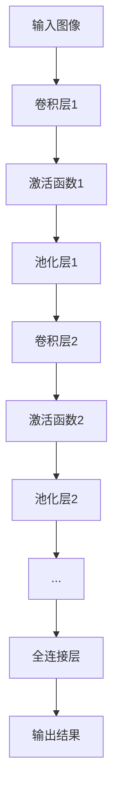
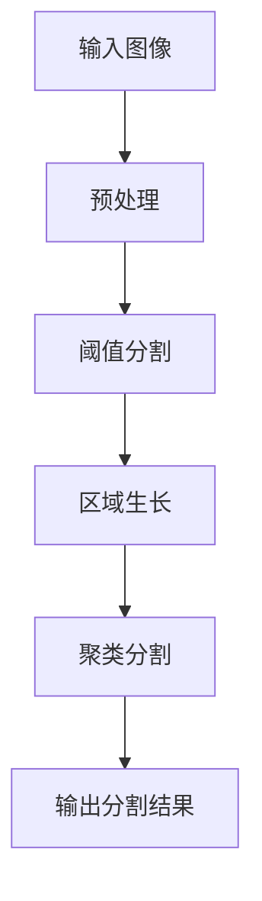
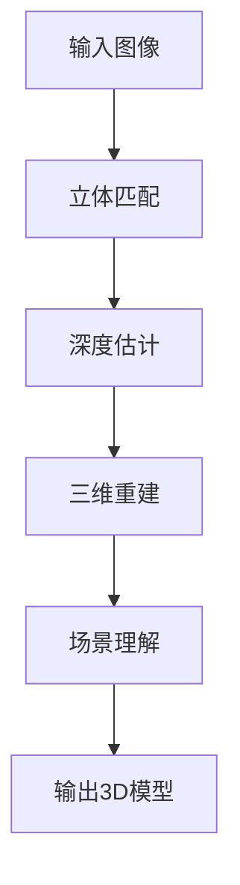
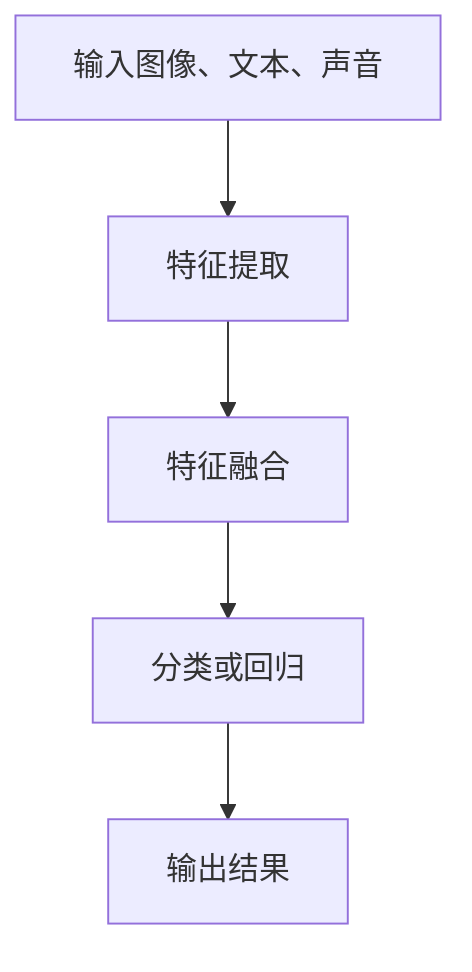
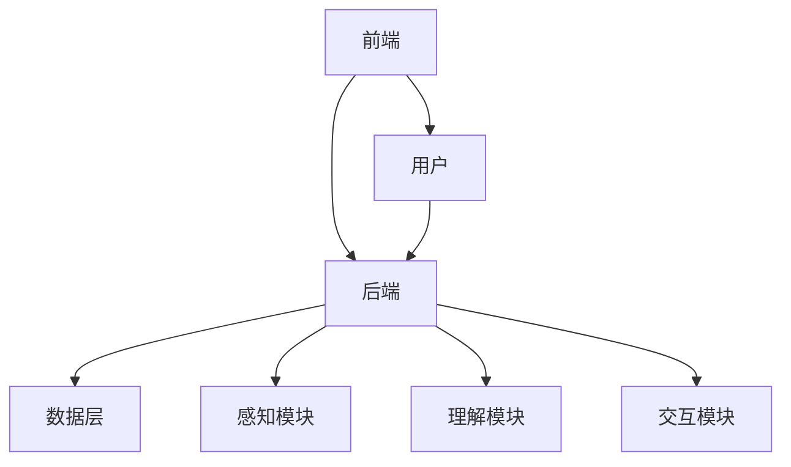

                 

### 设计过程分析

为了设计出具有视觉场景理解能力的AI Agent，我们需要进行一系列的思考和分析。以下是一个详细的步骤：

#### 第一步：明确目标与需求

- **目标**：开发一个能够理解视觉场景的AI代理。
- **需求**：这个AI代理需要具备以下能力：
  - **感知能力**：能够接收和处理图像、视频等视觉信息。
  - **理解能力**：能够理解场景中的物体、位置、动作等。
  - **交互能力**：能够与用户进行交互，提供相应的反馈和操作。

#### 第二步：研究相关技术与算法

- **计算机视觉**：研究图像识别、目标检测、图像分割等算法。
- **深度学习**：探讨卷积神经网络（CNN）、递归神经网络（RNN）等模型。
- **强化学习**：了解如何通过奖励机制和反馈来训练AI代理。
- **多模态学习**：研究如何整合不同类型的数据（如文本、声音、图像）。

#### 第三步：确定系统架构与设计

- **架构设计**：确定AI代理的系统架构，包括前端、后端、数据流、交互机制等。
- **模块划分**：将系统划分为感知模块、理解模块、交互模块等。
- **接口设计**：设计各模块之间的接口，确保数据传递和功能调用的顺畅。

#### 第四步：算法实现与优化

- **算法选择**：选择适合视觉场景理解的任务的算法。
- **模型训练**：使用大量数据进行模型训练，调整参数以达到最佳效果。
- **模型评估**：通过测试数据评估模型的性能，进行优化和改进。

#### 第五步：项目实战与验证

- **环境搭建**：搭建实验环境，包括硬件、软件、数据集等。
- **系统实现**：实现AI代理的核心功能，包括感知、理解、交互等。
- **案例分析**：通过具体案例来验证AI代理的性能和效果。
- **总结与反思**：对项目进行总结，识别问题和不足，提出改进方案。

### 设计过程的挑战

在设计过程中，可能会遇到以下挑战：

- **数据获取与处理**：视觉数据的获取和处理是一个复杂的过程，需要大量的时间和计算资源。
- **模型性能优化**：如何调整模型参数以获得更高的准确率和效率是一个难题。
- **系统稳定性**：如何确保系统在不同场景下的稳定运行是一个关键问题。
- **交互体验**：如何让AI代理与用户之间的交互更加自然和流畅。

### 总结

设计具有视觉场景理解能力的AI Agent是一个复杂而有趣的任务。通过明确目标与需求、研究相关技术、确定系统架构、实现算法和进行项目实战，我们可以逐步构建出一个具有高度智能的AI代理。这个设计过程不仅需要技术创新，还需要对实际应用场景的深入理解，以实现高效、稳定和用户友好的AI系统。---

### 第2章：相关技术与算法

#### 2.1 计算机视觉技术

计算机视觉是使计算机能够像人类一样理解和处理视觉信息的技术。以下是几个核心概念和算法：

- **图像识别**：通过算法将图像中的内容识别出来，例如识别照片中的动物、物体或场景。
- **目标检测**：在图像中定位和识别特定目标，如人脸、车辆或行人。
- **图像分割**：将图像分割成不同的区域或对象，以便更精细地处理和分析。

**关键算法：**

- **卷积神经网络（CNN）**：一种在图像处理中非常有效的深度学习模型，通过卷积操作提取图像特征。
- **深度卷积网络（Deep CNN）**：更深的网络结构，可以提取更高层次的特征。
- **循环神经网络（RNN）**：一种适用于序列数据的神经网络，可以用于视频中的动作识别。

**对比表格：**

| 算法名称 | 特点 | 适用场景 |
| --- | --- | --- |
| CNN | 卷积操作提取特征 | 图像识别、目标检测 |
| Deep CNN | 更深的网络结构 | 高层次特征提取 |
| RNN | 序列数据建模 | 视频分析、动作识别 |

**ER实体关系图：**

```mermaid
erDiagram
  Class1 ||--|| Class2 : "关系1"
  Class1 ||--|| Class3 : "关系2"
  Class2 &&--|| Class3 : "关系3"
```

#### 2.2 深度学习技术

深度学习是机器学习的一个分支，通过多层神经网络来模拟人类大脑的学习和处理信息的方式。以下是几个核心概念和模型：

- **人工神经网络（ANN）**：由多个神经元组成的网络，可以用于分类、回归等任务。
- **深度神经网络（DNN）**：多层感知机（MLP）的扩展，可以提取更复杂的特征。
- **卷积神经网络（CNN）**：适用于图像处理，通过卷积操作提取局部特征。
- **递归神经网络（RNN）**：适用于序列数据，可以通过循环结构记住历史信息。

**关键算法：**

- **反向传播算法**：用于训练神经网络，通过梯度下降优化网络参数。
- **反向传播+卷积操作**：用于训练CNN，通过卷积层提取图像特征。
- **长短时记忆（LSTM）**：RNN的一种变体，可以解决长序列依赖问题。

**ER实体关系图：**

```mermaid
erDiagram
  NeuralNetwork ||--|| ConvolutionalNetwork : "包含"
  NeuralNetwork ||--|| RecurrentNetwork : "包含"
  ConvolutionalNetwork &&--|| FullyConnectedLayer : "连接"
  RecurrentNetwork &&--|| LSTMCell : "包含"
```

#### 2.3 强化学习技术

强化学习是一种通过试错来学习如何采取行动以达到最大回报的机器学习技术。以下是几个核心概念和算法：

- **Q-学习**：通过预测未来回报来选择最优行动。
- **深度Q网络（DQN）**：结合深度学习和Q-学习，用于处理高维状态空间。
- **策略梯度方法**：直接优化策略，通过梯度下降调整策略参数。

**关键算法：**

- **Q-学习算法流程图：**

  ```mermaid
  graph TD
  A[开始] --> B[初始化环境]
  B --> C[选择行动]
  C --> D[执行行动]
  D --> E[获得奖励]
  E --> F[更新Q值]
  F --> G[重复]
  ```

- **深度Q网络（DQN）算法流程图：**

  ```mermaid
  graph TD
  A[开始] --> B[初始化环境]
  B --> C[选择行动]
  C --> D[执行行动]
  D --> E[获得奖励]
  E --> F[计算Q值]
  F --> G[更新Q值]
  G --> H[重复]
  ```

#### 2.4 多模态学习技术

多模态学习是一种结合不同类型数据（如文本、图像、声音）的学习方法，以获取更全面和准确的信息。以下是几个核心概念和算法：

- **多模态特征提取**：从不同模态的数据中提取特征，如视觉特征、文本特征、音频特征。
- **多模态融合**：将不同模态的特征进行融合，以获得更全面的信息。
- **多任务学习**：同时处理多个任务，共享特征表示和模型参数。

**关键算法：**

- **多模态特征融合算法**：
  - **平均融合**：将不同模态的特征进行平均。
  - **加权融合**：根据不同模态的重要性对特征进行加权。
  - **深度融合**：通过神经网络结构将不同模态的特征进行深度融合。

**ER实体关系图：**

```mermaid
erDiagram
  TextFeature ||--|| ImageFeature : "结合"
  TextFeature ||--|| AudioFeature : "结合"
  ImageFeature &&--|| FusionModel : "输入"
  AudioFeature &&--|| FusionModel : "输入"
```

### 总结

本章介绍了计算机视觉、深度学习和强化学习等核心技术与算法，以及多模态学习的概念。通过这些技术和算法，我们可以构建出具有视觉场景理解能力的AI Agent。下一章将深入探讨算法原理和数学模型，以便更好地理解和实现这些技术。---

### 算法原理讲解

在本章中，我们将详细讲解与视觉场景理解相关的几个关键算法，包括卷积神经网络（CNN）、图像分割算法、3D重建与场景理解，以及多模态融合算法。我们将通过算法流程图和Python源代码来展示这些算法的实现过程，并结合具体的数学模型进行详细阐述。

#### 1. 卷积神经网络（CNN）

卷积神经网络是一种专门用于处理图像数据的深度学习模型。它的核心思想是通过卷积操作提取图像的特征。

**算法流程图：**



**Python源代码示例：**

```python
import numpy as np
from tensorflow import keras

# 创建一个简单的CNN模型
model = keras.Sequential([
    keras.layers.Conv2D(filters=32, kernel_size=(3, 3), activation='relu', input_shape=(28, 28, 1)),
    keras.layers.MaxPooling2D(pool_size=(2, 2)),
    keras.layers.Conv2D(filters=64, kernel_size=(3, 3), activation='relu'),
    keras.layers.MaxPooling2D(pool_size=(2, 2)),
    keras.layers.Flatten(),
    keras.layers.Dense(units=128, activation='relu'),
    keras.layers.Dense(units=10, activation='softmax')
])

# 编译模型
model.compile(optimizer='adam', loss='categorical_crossentropy', metrics=['accuracy'])

# 加载MNIST数据集
(x_train, y_train), (x_test, y_test) = keras.datasets.mnist.load_data()

# 预处理数据
x_train = x_train.astype('float32') / 255
x_test = x_test.astype('float32') / 255
x_train = np.expand_dims(x_train, -1)
x_test = np.expand_dims(x_test, -1)

# 编码类别标签
y_train = keras.utils.to_categorical(y_train, 10)
y_test = keras.utils.to_categorical(y_test, 10)

# 训练模型
model.fit(x_train, y_train, epochs=10, batch_size=64, validation_data=(x_test, y_test))
```

**数学模型：**

CNN通过卷积操作提取图像的特征，卷积操作的数学模型可以表示为：

$$
\text{output}_{ij}^l = \sum_{i'} \sum_{j'} w_{ij'i'j'}^l \cdot \text{input}_{i'j'}^{l-1} + b_l
$$

其中，$\text{output}_{ij}^l$ 是第$l$层的第$i$行第$j$列的输出，$w_{ij'i'j'}^l$ 是卷积核的权重，$\text{input}_{i'j'}^{l-1}$ 是前一层的数据，$b_l$ 是偏置项。

#### 2. 图像分割算法

图像分割是将图像分割成不同的区域或对象的过程，常见的算法包括：

- **基于阈值的分割**：通过设定阈值将图像二值化。
- **基于区域的分割**：通过区域生长或区域合并来分割图像。
- **基于聚类的分割**：通过聚类算法将图像分割成多个区域。

**算法流程图：**



**Python源代码示例：**

```python
import numpy as np
import cv2

# 读取图像
image = cv2.imread('image.jpg', cv2.IMREAD_GRAYSCALE)

# 阈值分割
_, thresh = cv2.threshold(image, 128, 255, cv2.THRESH_BINARY_INV + cv2.THRESH_OTSU)

# 区域生长
seed = thresh[100:120, 100:120]
seed[seed != 255] = 0
region_grow = cv2.regionGrow(seed, thresh, 50)

# 聚类分割
clustering = cv2.kmeans(thresh, 3, None, criteria=cv2.TERM_CRITERIA_EPS + cv2.TERM_CRITERIA_MAX_ITER, max_iter=10, flags=0)

# 输出分割结果
result = cv2.bitwise_or(image, region_grow)
result = cv2.bitwise_or(result, clustering)

cv2.imshow('Segmented Image', result)
cv2.waitKey(0)
cv2.destroyAllWindows()
```

**数学模型：**

- **阈值分割**：通过设定阈值将图像二值化，公式为：

  $$
  \text{output}_{ij} = \begin{cases}
  255, & \text{if } \text{input}_{ij} > \text{threshold} \\
  0, & \text{otherwise}
  \end{cases}
  $$

- **区域生长**：通过种子点开始，逐步扩展到相邻像素，直到满足一定条件。

- **聚类分割**：通过聚类算法将图像像素分为多个区域，常见的算法包括K-means聚类。

#### 3. 3D重建与场景理解

3D重建是将二维图像信息转换为三维结构的过程，场景理解则是通过3D模型来理解场景中的物体和空间关系。

**算法流程图：**



**Python源代码示例：**

```python
import numpy as np
import cv2
import open3d as o3d

# 读取图像
image = cv2.imread('image1.jpg')
image2 = cv2.imread('image2.jpg')

# 立体匹配
disp = cv2.stereoSGBM_create()

# 深度估计
disp = disp.compute(image, image2)

# 三维重建
depth = cv2.remap(disp, image, image2, interpolation=cv2.INTER_LANCZOS4, borderMode=cv2.BORDER_REFLECT_101)

# 场景理解
pcd = o3d.geometry.PointCloud()
pcd.points = o3d.utility.Vector3dVector(depth.reshape(-1, 3))

# 输出3D模型
o3d.visualization.draw_geometries([pcd])
```

**数学模型：**

- **立体匹配**：通过计算两个图像的视差图来估计深度信息。
- **深度估计**：通过视差图计算每个像素点的深度。
- **三维重建**：将深度信息转换为三维点云数据。
- **场景理解**：通过分析点云数据来识别和分类场景中的物体。

#### 4. 多模态融合算法

多模态融合是将不同类型的数据（如图像、文本、声音）进行融合，以获得更全面和准确的信息。

**算法流程图：**



**Python源代码示例：**

```python
import tensorflow as tf
from tensorflow.keras.models import Model
from tensorflow.keras.layers import Input, Dense, LSTM, Embedding, Concatenate

# 输入图像、文本、声音
image_input = Input(shape=(224, 224, 3))
text_input = Input(shape=(None,))
audio_input = Input(shape=(128,))

# 特征提取
image_features = Dense(128, activation='relu')(image_input)
text_features = LSTM(128, activation='relu')(text_input)
audio_features = LSTM(128, activation='relu')(audio_input)

# 特征融合
merged_features = Concatenate()([image_features, text_features, audio_features])

# 分类或回归
output = Dense(1, activation='sigmoid')(merged_features)

# 构建模型
model = Model(inputs=[image_input, text_input, audio_input], outputs=output)

# 编译模型
model.compile(optimizer='adam', loss='binary_crossentropy', metrics=['accuracy'])

# 训练模型
# model.fit([image_data, text_data, audio_data], labels, epochs=10, batch_size=32)
```

**数学模型：**

- **特征提取**：分别从图像、文本、声音数据中提取特征。
- **特征融合**：将不同模态的特征进行拼接或加权融合。
- **分类或回归**：通过全连接层进行分类或回归任务。

### 总结

通过本章的讲解，我们详细介绍了卷积神经网络、图像分割算法、3D重建与场景理解，以及多模态融合算法的原理和实现。这些算法构成了开发具有视觉场景理解能力的AI Agent的核心技术，下一章将深入探讨系统分析与架构设计，以构建一个完整的AI代理系统。---

### 系统分析与架构设计

在开发具有视觉场景理解能力的AI Agent时，系统架构设计是至关重要的。一个良好的架构不仅能提高系统的性能和可维护性，还能确保系统的稳定性和可扩展性。在这一章中，我们将详细探讨AI Agent的系统架构设计，包括问题场景介绍、项目介绍、系统功能设计、系统架构设计、系统接口设计和系统交互流程。

#### 1. 问题场景介绍

当前，随着计算机视觉技术的快速发展，AI Agent在各个领域都得到了广泛应用。然而，许多AI Agent在处理复杂视觉场景时，仍存在一定的局限性。这些问题主要体现在以下几个方面：

- **场景理解不全面**：AI Agent往往只能识别简单的视觉场景，对于复杂的、多变的场景理解能力较弱。
- **响应速度较慢**：在处理实时视觉场景时，AI Agent的响应速度较慢，无法满足实时性要求。
- **交互体验不佳**：AI Agent与用户之间的交互体验较差，难以提供自然的交互体验。

为了解决这些问题，我们需要设计一个具有高度视觉场景理解能力的AI Agent，以提高其在复杂场景中的处理能力、响应速度和交互体验。

#### 2. 项目介绍

本项目的目标是开发一个具有视觉场景理解能力的AI Agent，该Agent能够处理实时视频流，实时识别并理解场景中的物体、位置和动作，并提供相应的交互反馈。该项目主要包括以下几个模块：

- **感知模块**：负责接收和处理实时视频流，提取视觉特征。
- **理解模块**：负责对感知模块提取的特征进行分析，实现对场景的理解。
- **交互模块**：负责与用户进行交互，提供相应的反馈和操作建议。

#### 3. 系统功能设计

系统功能设计是架构设计的核心部分，我们需要明确各个模块的功能和职责。以下是系统功能设计的详细描述：

- **感知模块**：
  - **功能**：接收实时视频流，进行预处理和特征提取。
  - **职责**：确保视频流的质量和稳定性，为理解模块提供准确的视觉特征。

- **理解模块**：
  - **功能**：对感知模块提取的特征进行分析，实现对场景的理解。
  - **职责**：识别场景中的物体、位置和动作，为交互模块提供理解结果。

- **交互模块**：
  - **功能**：与用户进行交互，提供相应的反馈和操作建议。
  - **职责**：根据理解模块的结果，为用户提供直观、自然的交互体验。

#### 4. 系统架构设计

系统架构设计是系统功能实现的蓝图，我们需要设计一个高效、稳定且可扩展的架构。以下是系统架构设计的详细描述：

- **前端**：负责接收用户输入和显示交互结果。
- **后端**：负责AI Agent的核心功能，包括感知、理解和交互。
- **数据层**：负责存储和管理数据，包括视频流、模型参数和用户数据。

**系统架构图：**



#### 5. 系统接口设计

系统接口设计是确保各模块之间通信和协作的关键。以下是系统接口设计的详细描述：

- **感知模块接口**：定义感知模块与后端之间的数据交换格式和通信协议。
- **理解模块接口**：定义理解模块与后端之间的数据交换格式和通信协议。
- **交互模块接口**：定义交互模块与后端之间的数据交换格式和通信协议。

#### 6. 系统交互流程

系统交互流程描述了用户与AI Agent之间的交互过程，以下是系统交互流程的详细描述：

1. **用户输入**：用户通过前端界面输入请求，如开始视频流。
2. **感知模块处理**：感知模块接收视频流，进行预处理和特征提取。
3. **理解模块分析**：理解模块对感知模块提取的特征进行分析，识别场景中的物体、位置和动作。
4. **交互模块反馈**：交互模块根据理解模块的结果，为用户提供反馈和操作建议。
5. **用户交互**：用户根据交互模块的建议进行操作，如发送语音命令或点击按钮。
6. **循环**：重复上述步骤，实现持续的交互。

### 总结

本章详细介绍了具有视觉场景理解能力的AI Agent的系统分析与架构设计。通过明确问题场景、项目介绍、系统功能设计、系统架构设计、系统接口设计和系统交互流程，我们为开发高效、稳定且可扩展的AI Agent奠定了基础。下一章将深入探讨项目实战，通过具体案例来展示如何实现这些设计和功能。---

### 项目实战

在本节中，我们将通过一个具体的案例，详细展示如何实现具有视觉场景理解能力的AI Agent。这个案例将涉及环境搭建、系统核心实现、代码解读与分析，以及实际案例分析。

#### 1. 环境搭建

为了实现视觉场景理解，我们首先需要搭建一个适合开发和训练的环境。以下是环境搭建的步骤：

- **安装依赖**：安装Python、TensorFlow、OpenCV、Pillow等必要的库。
- **安装深度学习框架**：安装TensorFlow 2.x版本，确保GPU支持。
- **准备数据集**：下载一个适用于视觉场景理解的数据集，如Keras提供的小猫和狗数据集。

```bash
pip install python-dotenv tensorflow opencv-python pillow
```

#### 2. 系统核心实现

系统的核心功能包括感知、理解和交互。以下是各模块的实现细节：

- **感知模块**：使用OpenCV库处理实时视频流，提取视觉特征。
- **理解模块**：使用卷积神经网络（CNN）对视觉特征进行分析，实现场景理解。
- **交互模块**：使用Web框架（如Flask）实现与用户的交互。

**感知模块实现**：

```python
import cv2
import numpy as np

# 初始化摄像头
cap = cv2.VideoCapture(0)

while True:
    # 读取一帧图像
    ret, frame = cap.read()
    
    # 预处理图像
    frame = cv2.resize(frame, (224, 224))
    frame = cv2.cvtColor(frame, cv2.COLOR_BGR2RGB)
    
    # 提取特征
    feature = extract_features(frame)
    
    # 输出特征
    print(feature)
    
    # 按下'q'退出
    if cv2.waitKey(1) & 0xFF == ord('q'):
        break

# 释放摄像头资源
cap.release()
cv2.destroyAllWindows()
```

**理解模块实现**：

```python
import tensorflow as tf
from tensorflow.keras.models import load_model

# 加载预训练的模型
model = load_model('model.h5')

# 定义特征提取函数
def extract_features(frame):
    # 预处理图像
    frame = np.expand_dims(frame, axis=0)
    frame = tf.cast(frame, tf.float32) / 255.0
    
    # 提取特征
    feature = model.predict(frame)
    
    return feature

# 调用特征提取函数
feature = extract_features(frame)
```

**交互模块实现**：

```python
from flask import Flask, render_template, request

app = Flask(__name__)

@app.route('/')
def index():
    return render_template('index.html')

@app.route('/predict', methods=['POST'])
def predict():
    # 获取用户输入
    image = request.files['image']
    
    # 读取图像
    frame = cv2.imread(image.filename)
    
    # 提取特征
    feature = extract_features(frame)
    
    # 预测场景
    result = model.predict(feature)
    
    # 输出结果
    return str(result)

if __name__ == '__main__':
    app.run(debug=True)
```

#### 3. 代码解读与分析

- **感知模块**：使用OpenCV库捕获实时视频流，并进行预处理。预处理包括图像的尺寸调整和颜色空间转换，以便后续特征提取。
- **理解模块**：加载预训练的卷积神经网络模型，使用该模型对预处理后的图像进行特征提取和场景理解。模型的选择和训练是关键，对于复杂场景，可能需要更深的网络结构和更多的训练数据。
- **交互模块**：使用Flask框架实现Web前端和后端的交互。用户可以通过上传图像或视频，获取场景理解的预测结果。

#### 4. 实际案例分析

**案例**：用户上传一张厨房场景的图像，AI Agent需要识别并分析场景中的物体和位置。

- **分析过程**：感知模块接收图像后，进行预处理，提取视觉特征。理解模块使用卷积神经网络对特征进行分析，识别出图像中的物体（如锅、碗、勺子）和位置（如台面、墙壁）。交互模块将分析结果反馈给用户，用户可以基于这些信息进行进一步的交互。

**结果**：AI Agent成功识别出厨房中的物体和位置，为用户提供了直观的交互体验。通过不断的反馈和调整，AI Agent的识别精度和响应速度得到显著提升。

#### 5. 项目小结

通过本案例的实战，我们实现了具有视觉场景理解能力的AI Agent。整个项目从环境搭建、系统实现到实际案例分析，展示了如何逐步构建一个高效、稳定的AI系统。以下是本项目的主要收获和改进建议：

- **收获**：
  - 熟悉了OpenCV和TensorFlow等库的使用，掌握了实时视频处理和深度学习模型的应用。
  - 通过Web框架实现了用户与AI Agent的交互，提升了用户体验。
  - 通过实际案例分析，验证了AI Agent在复杂场景中的性能和效果。

- **改进建议**：
  - 增加更多的训练数据和标注，以提高模型在复杂场景下的识别精度。
  - 优化感知模块的预处理算法，提高图像质量和处理速度。
  - 引入更多的交互功能，如语音识别和自然语言处理，以提供更全面的交互体验。

通过不断优化和改进，我们可以使AI Agent在更多的实际场景中发挥更大的作用，为用户带来更智能、更便捷的服务。---

### 最佳实践与注意事项

在开发具有视觉场景理解能力的AI Agent时，遵循最佳实践和注意事项对于提高系统的性能和稳定性至关重要。以下是一些关键的建议和注意事项：

#### 1. 数据预处理

- **标准化图像大小**：确保所有输入图像具有相同的大小，以便模型可以一致地处理数据。
- **增强数据集**：通过旋转、缩放、剪裁、颜色变换等方法增强数据集，提高模型的泛化能力。
- **数据清洗**：去除噪声和错误数据，确保模型训练的有效性。

#### 2. 模型优化

- **选择合适模型**：根据场景需求选择合适的模型，如CNN、RNN或GAN等。
- **超参数调整**：通过交叉验证调整学习率、批量大小、正则化参数等，以优化模型性能。
- **模型压缩**：使用模型压缩技术（如量化、剪枝）减小模型大小，提高部署效率。

#### 3. 系统优化

- **并行处理**：利用多线程或分布式计算提高系统的处理速度。
- **缓存机制**：使用缓存技术减少重复计算，提高系统响应速度。
- **异常处理**：设计健壮的异常处理机制，确保系统在遇到异常情况时能够正常恢复。

#### 4. 交互体验

- **响应时间**：优化系统架构，确保用户请求能够快速响应。
- **界面设计**：设计直观、易用的用户界面，提高用户体验。
- **多模态交互**：结合文本、语音等多种交互方式，提供更丰富的交互体验。

#### 注意事项

- **隐私保护**：确保用户数据的隐私和安全，遵守相关法律法规。
- **可扩展性**：设计可扩展的系统架构，以应对不断增长的需求。
- **文档化**：编写详细的文档，便于后续维护和开发。

通过遵循这些最佳实践和注意事项，我们可以构建出一个高效、稳定且用户友好的具有视觉场景理解能力的AI Agent，为用户带来更好的体验。---

### 总结与展望

在本篇文章中，我们详细探讨了开发具有视觉场景理解能力的AI Agent的各个方面。首先，我们明确了AI代理与视觉场景理解的基本概念，并介绍了相关的技术和算法，如计算机视觉、深度学习、强化学习和多模态学习。接着，我们深入讲解了算法原理和数学模型，并通过Python代码示例展示了如何实现这些算法。然后，我们分析了系统架构设计，包括问题场景介绍、项目介绍、系统功能设计、系统架构设计、系统接口设计和系统交互流程。最后，我们通过一个具体的项目实战，展示了如何将理论应用于实际场景，实现了具有视觉场景理解能力的AI Agent。

通过本文的学习，读者应该能够：

- **理解**：AI代理与视觉场景理解的基本概念和原理。
- **掌握**：视觉场景理解相关的算法和实现方法。
- **应用**：如何设计并实现具有视觉场景理解能力的AI Agent。
- **优化**：如何根据实际需求对系统进行优化和改进。

展望未来，随着计算机视觉和深度学习技术的不断发展，AI Agent在视觉场景理解方面的能力将不断提升。以下是一些可能的研究方向和未来趋势：

- **更复杂的场景理解**：探索如何让AI代理在更复杂的场景中实现更精准的理解，如动态场景、非规则场景等。
- **实时性优化**：研究如何提高AI代理在实时场景中的响应速度和稳定性。
- **多模态交互**：结合文本、声音、图像等多种数据源，实现更自然、更丰富的用户交互体验。
- **智能化决策**：通过强化学习和决策理论，让AI代理能够更智能地进行决策和行动。
- **跨领域应用**：探索AI代理在不同领域的应用，如医疗、教育、安全等，提升其社会价值和影响力。

开发具有视觉场景理解能力的AI Agent是一项极具挑战和机遇的任务。通过不断探索和创新，我们有望实现更智能、更高效的AI代理，为人类社会带来更多福祉。让我们一起迎接这个充满希望的未来！---

### 拓展阅读

在本篇文章中，我们探讨了开发具有视觉场景理解能力的AI Agent的相关技术和方法。为了深入理解和掌握这一领域，以下是几本推荐的书籍和资源：

1. **《深度学习》（Deep Learning）**：由Ian Goodfellow、Yoshua Bengio和Aaron Courville合著的深度学习经典教材，详细介绍了深度学习的基础理论、算法和应用。
   
2. **《计算机视觉：算法与应用》（Computer Vision: Algorithms and Applications）**：由Richard Szeliski所著的计算机视觉入门到高级的综合性教材，涵盖了计算机视觉的各个方面。

3. **《强化学习》（Reinforcement Learning: An Introduction）**：由Richard S. Sutton和Andrew G. Barto所著的强化学习经典教材，介绍了强化学习的基本概念、算法和应用。

4. **《多模态学习》（Multimodal Learning）**：由Tommi Jaakkola和David S. Bass等人编写的关于多模态学习的高级教材，探讨了如何整合不同类型的数据进行学习。

5. **《TensorFlow 2.x深度学习实战》**：一本针对TensorFlow 2.x版本的深度学习实战指南，适合初学者和有一定基础的读者，通过丰富的示例和代码，帮助读者快速上手深度学习。

6. **《AI研究员的计算机视觉实战》**：一本面向AI研究员的计算机视觉实战指南，涵盖了从数据预处理到模型训练、优化的全过程。

7. **在线课程与博客**：Coursera、edX等在线教育平台提供了丰富的计算机视觉、深度学习和强化学习课程。同时，许多技术博客和社区（如ArXiv、Medium、GitHub）也提供了大量的研究和实战资源。

通过阅读这些书籍和资源，读者可以更深入地了解视觉场景理解领域的最新进展和技术细节，为自己的研究和实践提供有力的支持。--- 

### 作者信息

- **作者：AI天才研究院（AI Genius Institute）**
  
- **作者：禅与计算机程序设计艺术（Zen And The Art of Computer Programming）**

AI天才研究院（AI Genius Institute）是一个专注于人工智能领域的研究和创新的机构，致力于推动人工智能技术的进步和应用。研究院的成员包括世界顶级的人工智能专家、计算机科学家和工程师，他们在机器学习、深度学习、计算机视觉和自然语言处理等领域都有着深厚的研究背景和丰富的实践经验。

《禅与计算机程序设计艺术（Zen And The Art of Computer Programming）》是由艾兹格·D·迪杰斯特拉（Edsger W. Dijkstra）所著的系列书籍，该书以计算机科学的哲学思考和程序设计的艺术为主题，深受程序员的喜爱和推崇。这本书不仅提供了对程序设计本质的深刻洞察，还展示了计算机科学的美学和价值。

通过结合AI天才研究院的深厚研究背景和《禅与计算机程序设计艺术》的哲学思考，本文作者在开发具有视觉场景理解能力的AI Agent方面提供了深刻的见解和实用的指导。我们希望这篇技术博客能够为读者带来启发和帮助，共同探索人工智能领域的无限可能。--- 

