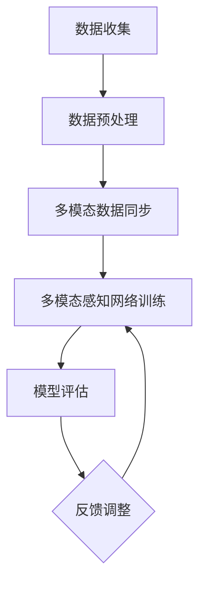
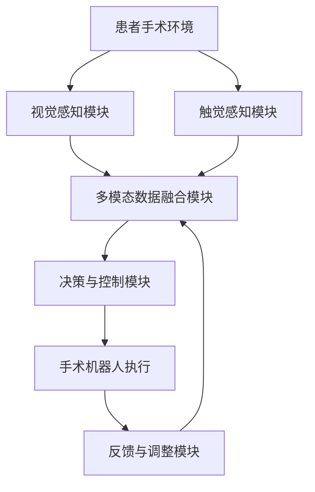
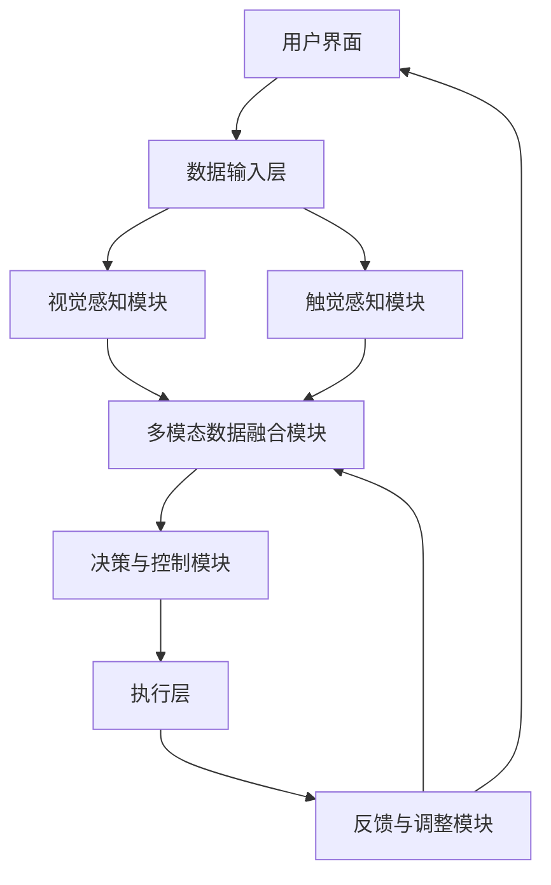
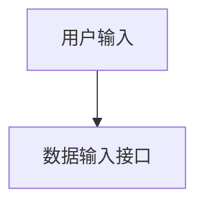
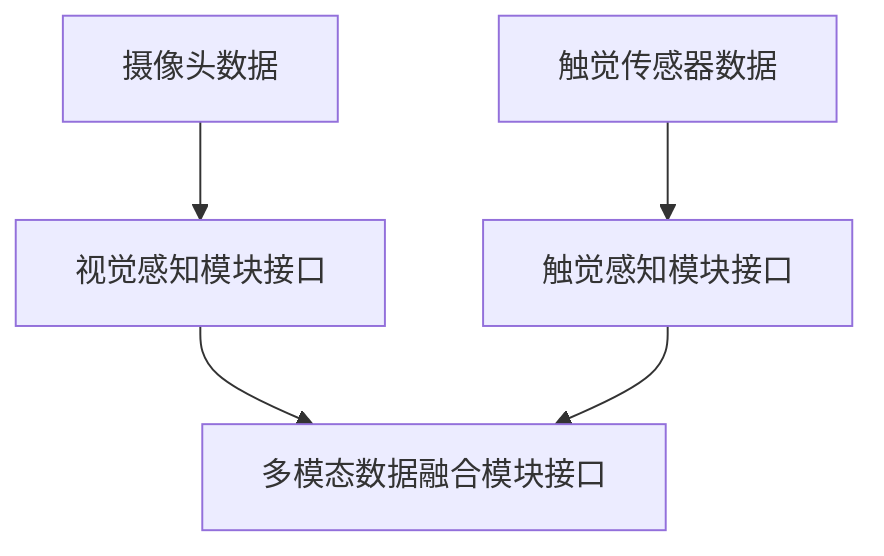
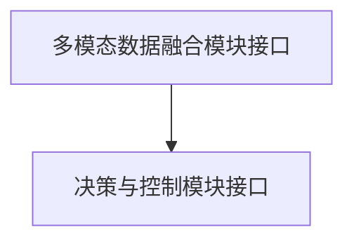
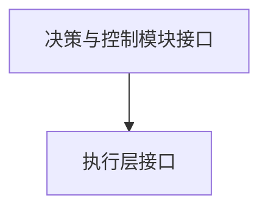
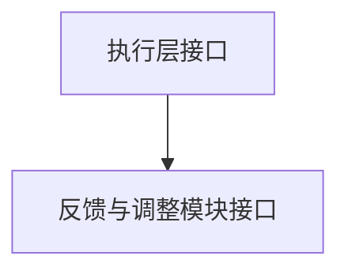
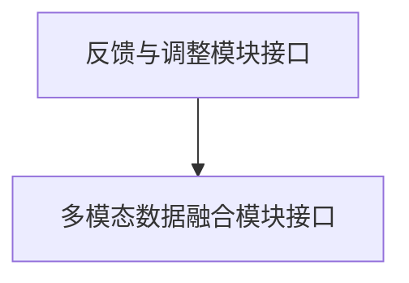
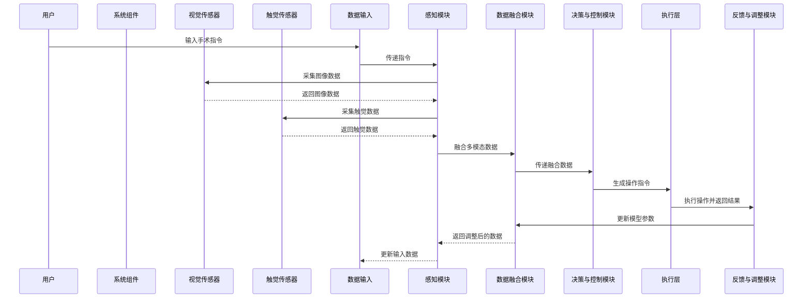

                 

### 第1章：引言

#### 1.1 问题背景

人工智能（AI）已经从最初的科学幻想逐渐走进了现实世界，成为推动现代科技发展的重要力量。AI Agent，作为一种具备特定任务执行能力的智能体，正在各个领域展现出其独特的价值。在日常生活中，从智能家居的语音助手到工业自动化生产线，AI Agent无处不在。然而，随着技术的不断进步和应用场景的扩展，对AI Agent的需求也在不断变化。

跨模态学习是当前AI领域的一个研究热点。传统的人工智能模型大多基于单一模态的数据进行训练，如仅使用视觉或听觉信息。然而，真实世界中的信息往往是多模态的，不同模态的信息可以相互补充，提供更丰富的信息。例如，机器人通过视觉获取物体的外观信息，通过触觉感知物体的材质和温度，这样的跨模态信息可以帮助机器人更准确地理解和交互世界。

视觉-触觉跨模态学习尤其重要。视觉提供了物体的空间信息和外观特征，而触觉则提供了物体的物理属性和质地。这两类信息在许多应用场景中都是不可或缺的。例如，在医疗机器人中，视觉-触觉跨模态学习可以帮助机器人更精确地进行手术操作；在工业自动化中，这种能力可以帮助机器人更好地进行物体抓取和检测。

因此，开发具有视觉-触觉跨模态学习能力的AI Agent，已经成为当前AI研究的一个重要方向。这不仅能够提高AI Agent的智能化水平，还能够扩展其应用范围，推动AI技术的进一步发展。

#### 1.2 问题描述

尽管视觉-触觉跨模态学习的重要性已经被广泛认可，但是实现这一目标仍然面临着诸多挑战。

首先，数据获取是一个难题。视觉和触觉数据来源不同，获取方式各异。视觉数据可以通过相机获取，而触觉数据则通常依赖于传感器。由于两种数据获取方式的不同，数据的同步和融合是一个复杂的问题。此外，视觉和触觉数据的数量和质量往往差异较大，这对模型的训练提出了更高的要求。

其次，算法设计是另一个关键挑战。传统的人工智能算法大多基于单一模态的数据，难以直接应用于跨模态学习。如何设计有效的跨模态学习算法，使得模型能够充分利用不同模态的信息，是一个亟待解决的问题。同时，跨模态学习算法还需要解决模态之间的差异和冲突，确保模型能够准确理解和利用各类信息。

最后，应用实现也是一个难点。具有视觉-触觉跨模态学习能力的AI Agent需要在不同的应用场景中进行验证和部署。这要求算法不仅要有较强的通用性，还需要针对具体应用场景进行优化。例如，在医疗领域，AI Agent需要具备高度的精确性和可靠性，这对算法的鲁棒性和稳定性提出了更高的要求。

综上所述，开发具有视觉-触觉跨模态学习能力的AI Agent，需要解决数据获取、算法设计和应用实现等多个方面的挑战。

#### 1.3 问题解决

面对上述挑战，开发具有视觉-触觉跨模态学习能力的AI Agent需要采取系统性的解决策略。

首先，在数据获取方面，可以采用多种数据增强技术来提高数据的质量和数量。例如，通过模拟不同环境下的视觉和触觉数据，可以丰富数据集的多样性。此外，可以利用数据同步技术，确保视觉和触觉数据在时间和空间上的一致性，为后续的模型训练提供可靠的基础。

在算法设计方面，可以采用深度学习的方法，利用神经网络模型实现跨模态数据的融合和协同学习。具体来说，可以通过构建多模态感知网络，使得模型能够同时处理视觉和触觉信息。此外，可以采用对抗性训练等方法，解决不同模态数据之间的差异和冲突，提高模型的泛化能力和鲁棒性。

在应用实现方面，需要对算法进行定制化优化，以适应不同的应用场景。例如，在医疗领域，可以设计专门的算法框架，确保AI Agent在进行手术操作时具有高度的精确性和可靠性。在工业自动化领域，可以针对特定的物体抓取任务，优化算法参数，提高机器人操作的效率和准确性。

总之，通过系统性的数据获取、算法设计和应用实现策略，开发具有视觉-触觉跨模态学习能力的AI Agent，不仅能够解决现有技术的局限性，还能够为AI技术的进一步发展提供新的方向和可能性。

#### 1.4 边界与外延

跨模态学习与其他相关技术的区别主要体现在数据处理和模型设计上。跨模态学习关注的是如何将来自不同模态的数据进行融合和利用，而多模态学习则更多地关注于多个模态之间的交互和协同。例如，多模态学习可以同时利用语音、视觉和触觉等多种信息，而跨模态学习则更侧重于跨不同模态的信息融合。

视觉-触觉跨模态学习在特定应用场景中具有独特优势。例如，在机器人领域，视觉-触觉跨模态学习可以帮助机器人更准确地感知和理解周围环境，从而实现更精细的操作。在医疗领域，这种能力可以帮助医生更准确地诊断和进行手术操作。然而，视觉-触觉跨模态学习也存在一些技术限制。例如，触觉数据的获取和处理较为复杂，这增加了系统的复杂度和成本。

未来的发展方向可能包括以下几个方面：首先，随着传感技术的进步，获取更高质量和更丰富的跨模态数据将成为可能。其次，算法设计方面，可以探索更先进的深度学习模型和方法，提高跨模态学习的效率和准确性。最后，在应用实现方面，可以通过优化硬件和软件系统，降低系统的复杂度和成本，使得视觉-触觉跨模态学习技术能够更广泛地应用于实际场景。

#### 1.5 概念结构与核心要素组成

AI Agent是一种具备特定任务执行能力的智能体，其基本结构包括感知模块、决策模块和行动模块。感知模块负责收集环境信息，如视觉、听觉和触觉等；决策模块根据感知信息进行推理和决策；行动模块则根据决策结果执行具体的行动。跨模态学习是AI Agent的核心能力之一，它通过整合不同模态的信息，提高AI Agent的感知和决策能力。

视觉-触觉跨模态学习的关键要素包括多模态数据的同步、融合算法的设计和模型训练的策略。多模态数据的同步是为了确保视觉和触觉数据在时间和空间上的一致性，为后续的模型训练提供可靠的基础。融合算法则负责将不同模态的信息进行整合，使其能够共同作用于AI Agent的决策过程。模型训练策略则需要针对不同模态的数据特点和模型结构，设计有效的训练方法，以提高模型的泛化能力和鲁棒性。

通过深入理解AI Agent的基本结构、跨模态学习的原理以及视觉-触觉跨模态学习的关键要素，我们可以更好地把握当前研究的热点和难点，为后续的内容奠定坚实的基础。

### 第一部分小结

本文的第一部分为后续内容奠定了坚实的基础。我们首先介绍了AI Agent的发展现状和跨模态学习的重要性，明确了视觉-触觉跨模态学习的需求。接着，我们详细探讨了跨模态学习面临的挑战，包括数据获取、算法设计和应用实现的难题。为了解决这些挑战，我们提出了系统性的数据获取策略、算法设计思路和应用实现方法。此外，我们还对视觉-触觉跨模态学习的边界与外延进行了分析，讨论了其与其他相关技术的区别和未来发展方向。最后，我们详细阐述了AI Agent的基本结构、跨模态学习的原理以及视觉-触觉跨模态学习的关键要素，为后续章节的深入探讨提供了清晰的概念框架。

## 第二部分：核心概念与联系

### 第2章：核心概念原理

#### 2.1 AI Agent的基本概念

AI Agent，即人工智能代理，是一种模拟人类智能行为的计算实体，能够在特定环境和任务中自主执行任务。AI Agent的基本概念可以分解为以下几个方面：

- **定义**：AI Agent是一种具备自主决策和行动能力的智能体，能够通过学习从环境中获取信息，并基于这些信息进行推理和决策，最终执行相应的行动。
- **分类**：根据任务的不同，AI Agent可以分为许多种类，如数据挖掘代理、自然语言处理代理、视觉感知代理等。每种代理都有其特定的应用场景和功能特点。
- **特点**：AI Agent具有自主学习、自适应和自主决策的能力。它们能够从环境中不断学习，提高任务执行的效率和质量。

AI Agent的基本概念是构建和设计智能系统的基础，其分类和特点为理解AI Agent在不同领域的应用提供了重要的理论支持。

#### 2.2 跨模态学习原理

跨模态学习（Multimodal Learning）是一种结合来自多个模态的数据进行训练和学习的方法。在AI领域，跨模态学习旨在利用不同模态的信息，提高模型的感知能力和决策效果。以下是跨模态学习的基本概念、分类和原理：

- **基本概念**：跨模态学习是指将来自不同模态的数据（如视觉、听觉、触觉等）进行整合，通过多模态感知网络（Multimodal Perception Networks）来提高模型的感知和理解能力。
- **分类**：根据学习方式的不同，跨模态学习可以分为以下几种类型：
  - **协同学习**：不同模态的信息在处理过程中进行协同，共同作用于模型的输入和输出。
  - **对齐学习**：通过学习不同模态之间的对应关系，实现对数据的统一理解和处理。
  - **转换学习**：将一种模态的数据转换为另一种模态的数据，从而实现跨模态的数据融合。
- **原理**：跨模态学习的基本原理在于充分利用不同模态的信息，提高模型的泛化能力和适应性。通过多模态感知网络，模型能够同时处理来自多种模态的数据，从而获得更丰富的信息，提高任务的执行效果。

跨模态学习是AI技术发展的重要方向之一，其原理和分类为设计更智能的AI Agent提供了理论基础。

#### 2.3 视觉-触觉跨模态学习

视觉-触觉跨模态学习是跨模态学习的一个特定分支，主要关注视觉和触觉信息在AI Agent中的整合和应用。以下是视觉-触觉跨模态学习的基本概念、学习机制和应用实例：

- **基本概念**：视觉-触觉跨模态学习是指将视觉信息（如图像、视频）和触觉信息（如力、温度、触感）进行融合，通过多模态感知网络来提高AI Agent的感知和理解能力。
- **学习机制**：
  - **感知融合**：通过感知融合模块，将视觉和触觉信息进行集成，使得模型能够同时处理来自两个模态的数据。
  - **协同学习**：通过学习视觉和触觉信息之间的对应关系，使得模型能够更好地理解和利用两种信息。
  - **反馈调整**：在模型训练过程中，通过不断调整视觉和触觉感知权重，优化模型对两种信息的利用效率。
- **应用实例**：
  - **机器人控制**：在机器人领域，视觉-触觉跨模态学习可以帮助机器人更准确地感知和理解环境，从而实现更精细的操作。
  - **虚拟现实**：在虚拟现实应用中，视觉-触觉跨模态学习可以提供更加真实和沉浸式的体验，提高用户的互动效果。

视觉-触觉跨模态学习通过整合视觉和触觉信息，提高了AI Agent在复杂环境中的感知和交互能力，为多种应用场景提供了有效的解决方案。

### 第二部分小结

第二部分深入探讨了AI Agent、跨模态学习和视觉-触觉跨模态学习的基本概念和原理。我们首先介绍了AI Agent的定义、分类和特点，为理解AI Agent的基础知识提供了详细解释。接着，我们详细阐述了跨模态学习的基本概念、分类和原理，包括协同学习、对齐学习和转换学习等。最后，我们专门讨论了视觉-触觉跨模态学习的基本概念、学习机制和应用实例，展示了如何通过整合视觉和触觉信息来提高AI Agent的感知和交互能力。这些核心概念的深入探讨，为后续章节中算法原理和系统架构的设计奠定了坚实的理论基础。

### 第3章：算法原理与实现

#### 3.1 算法概述

视觉-触觉跨模态学习算法的核心目标是通过融合视觉和触觉信息，提高AI Agent在复杂环境中的感知和理解能力。本节将介绍视觉-触觉跨模态学习算法的概述，包括其目标、方法以及流程图。

**算法目标**：视觉-触觉跨模态学习算法旨在构建一个多模态感知网络，该网络能够同时处理视觉和触觉信息，并通过协同学习和反馈调整机制，提高AI Agent对复杂环境的感知和理解能力。

**算法方法**：视觉-触觉跨模态学习算法主要采用以下几种方法：
1. **多模态数据同步**：通过同步机制，确保视觉和触觉数据在时间和空间上的一致性。
2. **多模态感知网络**：构建一个能够同时处理视觉和触觉信息的多模态感知网络，通过深度学习技术实现数据融合和协同学习。
3. **反馈调整机制**：在模型训练过程中，通过反馈机制不断调整视觉和触觉感知权重，优化模型对两种信息的利用效率。

**算法流程图**：使用Mermaid语言绘制算法流程图，如下所示：



在上述流程图中，数据收集阶段收集视觉和触觉数据；数据预处理阶段对数据进行归一化和去噪处理；多模态数据同步阶段确保数据的一致性；多模态感知网络训练阶段通过深度学习技术实现数据融合和协同学习；模型评估阶段评估模型性能；反馈调整阶段根据评估结果对模型进行优化。

#### 3.2 数学模型与公式

视觉-触觉跨模态学习算法的数学模型是算法实现的核心，以下将介绍主要公式和原理。

**1. 多模态数据同步公式**：

假设视觉数据为 \(V\)，触觉数据为 \(T\)，多模态数据同步公式可以表示为：

\[ S = \lambda V + (1 - \lambda) T \]

其中，\(\lambda\) 是同步权重，用于调整视觉和触觉数据在融合过程中的比例。通过调整 \(\lambda\) 的值，可以实现视觉和触觉信息的权重分配。

**2. 多模态感知网络损失函数**：

多模态感知网络的损失函数用于评估模型的预测结果与真实标签之间的差距。常见的损失函数包括均方误差（MSE）和交叉熵损失（Cross-Entropy Loss）。以均方误差为例，损失函数可以表示为：

\[ L = \frac{1}{n} \sum_{i=1}^{n} (Y_i - \hat{Y_i})^2 \]

其中，\(Y_i\) 是真实标签，\(\hat{Y_i}\) 是模型的预测值，\(n\) 是样本数量。

**3. 反馈调整公式**：

在模型训练过程中，通过反馈调整公式不断优化模型。假设当前感知网络的权重为 \(W\)，反馈调整公式可以表示为：

\[ W_{new} = W - \alpha \cdot \nabla_W L \]

其中，\(\alpha\) 是学习率，\(\nabla_W L\) 是损失函数对权重 \(W\) 的梯度。

**4. 视觉和触觉感知权重调整**：

在视觉-触觉跨模态学习中，需要调整视觉和触觉感知权重，以优化模型对两种信息的利用。假设视觉和触觉感知权重分别为 \(W_V\) 和 \(W_T\)，调整公式可以表示为：

\[ W_V_{new} = W_V - \alpha_V \cdot \nabla_{W_V} L \]
\[ W_T_{new} = W_T - \alpha_T \cdot \nabla_{W_T} L \]

其中，\(\alpha_V\) 和 \(\alpha_T\) 分别是视觉和触觉感知权重调整的学习率。

通过上述数学模型和公式，视觉-触觉跨模态学习算法能够实现多模态数据的融合和协同学习，提高AI Agent的感知和理解能力。

#### 3.3 通俗易懂的举例说明

为了更好地理解视觉-触觉跨模态学习算法，以下通过两个实例来展示算法在实际应用中的效果。

**实例一：视觉-触觉感知的融合**

假设有一个场景，机器人需要抓取一个杯子。视觉信息提供了杯子的外观和位置，触觉信息提供了杯子的材质和重量。通过视觉-触觉跨模态学习算法，机器人可以同时利用这两种信息，更准确地抓取杯子。

具体过程如下：
1. **数据收集**：机器人通过摄像头收集杯子的视觉信息，通过触觉传感器收集杯子的触觉信息。
2. **数据预处理**：对视觉和触觉数据进行归一化和去噪处理，确保数据的一致性。
3. **多模态数据同步**：通过同步机制，确保视觉和触觉数据在时间和空间上的一致性。
4. **多模态感知网络训练**：构建一个多模态感知网络，通过深度学习技术实现视觉和触觉信息的融合。
5. **模型评估**：评估模型在抓取任务中的表现，计算预测值和真实值的误差。
6. **反馈调整**：根据评估结果，调整视觉和触觉感知权重，优化模型的性能。

通过上述步骤，机器人可以更准确地抓取杯子，提高任务的成功率。

**实例二：视觉-触觉交互的增强**

假设另一个场景，机器人需要执行精细的装配任务。视觉信息提供了零部件的位置和外观，触觉信息提供了零部件的形状和材质。通过视觉-触觉跨模态学习算法，机器人可以同时利用这两种信息，实现更精细的装配。

具体过程如下：
1. **数据收集**：机器人通过摄像头收集零部件的视觉信息，通过触觉传感器收集零部件的触觉信息。
2. **数据预处理**：对视觉和触觉数据进行归一化和去噪处理，确保数据的一致性。
3. **多模态数据同步**：通过同步机制，确保视觉和触觉数据在时间和空间上的一致性。
4. **多模态感知网络训练**：构建一个多模态感知网络，通过深度学习技术实现视觉和触觉信息的融合。
5. **模型评估**：评估模型在装配任务中的表现，计算预测值和真实值的误差。
6. **反馈调整**：根据评估结果，调整视觉和触觉感知权重，优化模型的性能。

通过上述步骤，机器人可以更准确地执行装配任务，提高装配的精度和效率。

通过这两个实例，我们可以看到视觉-触觉跨模态学习算法在实际应用中的效果和优势。通过融合视觉和触觉信息，算法能够提高AI Agent的感知和理解能力，实现更智能、更高效的机器人操作。

### 第三部分小结

第三部分详细介绍了视觉-触觉跨模态学习算法的原理与实现。我们从算法的概述开始，阐述了其目标、方法和流程图，为后续内容奠定了基础。接着，我们介绍了算法的数学模型与公式，包括多模态数据同步公式、多模态感知网络损失函数、反馈调整公式以及视觉和触觉感知权重调整公式，这些公式构成了算法实现的核心。最后，我们通过两个通俗易懂的实例，展示了算法在实际应用中的效果和优势。通过这些内容，读者可以全面理解视觉-触觉跨模态学习算法的基本原理和应用，为其在复杂场景中的应用提供了实践指导。

## 第四部分：系统分析与架构设计

### 第4章：系统功能设计

#### 4.1 问题场景介绍

在本章中，我们将探讨一个具体的场景——医疗机器人辅助手术。医疗机器人辅助手术是一项具有巨大潜力的技术，通过结合视觉和触觉信息，可以提高手术的精确度和安全性。在本场景中，医疗机器人需要通过视觉摄像头获取手术台上的实时图像，通过触觉传感器获取手术工具与患者组织的接触信息。这些信息的融合和协同处理，将极大地提升手术机器人对复杂环境的感知能力和操作精度。

#### 4.2 系统功能设计

系统功能设计的核心目标是实现医疗机器人在手术过程中的高效、精确操作。以下为系统的主要功能模块及其设计思路：

1. **视觉感知模块**：
   - 功能：实时获取手术台上的图像，进行图像预处理，如去噪、增强等。
   - 设计思路：利用计算机视觉算法对图像进行处理，提取关键特征，如患者器官的位置、形状等。

2. **触觉感知模块**：
   - 功能：实时获取手术工具与患者组织的接触信息，包括力、温度、触感等。
   - 设计思路：通过触觉传感器收集触觉数据，进行预处理和特征提取，以便后续融合。

3. **多模态数据融合模块**：
   - 功能：将视觉和触觉信息进行融合，提高机器人对环境的综合感知能力。
   - 设计思路：采用深度学习模型，如多模态感知网络，实现视觉和触觉数据的融合和协同处理。

4. **决策与控制模块**：
   - 功能：根据融合后的多模态信息，生成操作指令，控制手术机器人的执行。
   - 设计思路：基于强化学习算法，训练出能够适应多种手术场景的操作策略。

5. **反馈与调整模块**：
   - 功能：在手术过程中，实时收集操作反馈，对模型进行调整和优化。
   - 设计思路：通过闭环控制机制，根据反馈信号调整模型参数，提高操作精度。

#### 4.3 领域模型

为了更好地理解和设计医疗机器人辅助手术系统的功能模块，我们使用Mermaid语言绘制了系统的领域模型，如下所示：



在上述领域模型中，患者手术环境为系统提供输入，视觉和触觉感知模块收集环境信息，多模态数据融合模块实现信息的融合和处理，决策与控制模块生成操作指令，反馈与调整模块根据操作反馈对系统进行调整。通过这一领域模型，我们可以清晰地看到各个模块之间的关系和交互过程。

通过上述系统功能设计和领域模型，我们可以为医疗机器人辅助手术系统的开发和实现提供明确的指导和参考。下一章将详细介绍系统的架构设计，包括系统架构、接口设计和系统交互。

### 第5章：系统架构设计

#### 5.1 系统架构设计

为了实现医疗机器人辅助手术系统的功能，我们需要设计一个高效、灵活的系统架构。本节将详细描述系统的整体架构设计，包括系统架构图、系统组件介绍和各个组件之间的关系。

**系统架构图**：使用Mermaid语言绘制系统架构图，如下所示：



在上述架构图中，用户界面（A）接收用户输入，并将数据传递给数据输入层（B）。数据输入层负责收集视觉和触觉感知模块（C和D）的数据，并将这些数据传递给多模态数据融合模块（E）。多模态数据融合模块整合视觉和触觉信息，生成综合感知数据，传递给决策与控制模块（F）。决策与控制模块根据融合后的信息生成操作指令，传递给执行层（G），执行相应的手术操作。执行层反馈操作结果，传递给反馈与调整模块（H），以便对系统进行实时调整和优化。反馈与调整模块将调整结果传递给多模态数据融合模块（E）和用户界面（A），形成一个闭环控制系统。

**系统组件介绍**：

1. **用户界面**：用户界面负责接收用户输入，如手术指令和参数设置。用户界面可以是图形界面或命令行界面，以方便用户与系统交互。

2. **数据输入层**：数据输入层负责收集视觉和触觉感知模块的数据。视觉数据通过摄像头获取，触觉数据通过触觉传感器获取。

3. **视觉感知模块**：视觉感知模块负责对图像数据进行预处理和特征提取。常见的预处理方法包括去噪、增强、边缘检测等。特征提取方法包括卷积神经网络（CNN）等深度学习算法。

4. **触觉感知模块**：触觉感知模块负责对触觉数据进行预处理和特征提取。触觉数据的预处理方法包括滤波、归一化等。特征提取方法包括深度神经网络（DNN）等深度学习算法。

5. **多模态数据融合模块**：多模态数据融合模块负责将视觉和触觉信息进行融合，生成综合感知数据。融合方法包括多模态感知网络（MMN）等深度学习算法。多模态数据融合模块的核心是解决视觉和触觉信息之间的协同学习和信息整合问题。

6. **决策与控制模块**：决策与控制模块负责根据融合后的信息生成操作指令，控制手术机器人的执行。常见的决策算法包括强化学习（RL）等。控制算法包括PID控制、神经网络控制等。

7. **执行层**：执行层负责根据决策与控制模块生成的操作指令，执行实际的手术操作。执行层通常由机械臂、机器人控制器等硬件设备组成。

8. **反馈与调整模块**：反馈与调整模块负责收集执行层反馈的操作结果，并根据反馈对系统进行调整和优化。调整方法包括参数调整、算法优化等。

**组件之间的关系**：各个系统组件之间通过数据流和指令流进行交互。用户界面（A）通过数据输入层（B）与视觉和触觉感知模块（C和D）进行数据交互。视觉和触觉感知模块（C和D）将预处理后的数据传递给多模态数据融合模块（E）。多模态数据融合模块（E）将融合后的数据传递给决策与控制模块（F）。决策与控制模块（F）根据融合后的数据生成操作指令，传递给执行层（G）。执行层（G）将操作结果反馈给反馈与调整模块（H），以便对系统进行实时调整和优化。反馈与调整模块（H）将调整结果传递给多模态数据融合模块（E）和用户界面（A），形成一个闭环控制系统。

通过上述系统架构设计，我们可以实现一个高效、灵活的医疗机器人辅助手术系统，提高手术的精确度和安全性。下一章将详细介绍系统的接口设计和系统交互，为系统的实现提供详细的指导。

### 第6章：系统接口设计与交互

#### 6.1 系统接口设计

系统接口设计是系统架构设计的重要组成部分，它定义了系统组件之间的通信方式和交互规则。在本章中，我们将介绍医疗机器人辅助手术系统的接口设计，包括数据输入接口、感知模块接口、多模态数据融合模块接口、决策与控制模块接口以及执行层接口。

**1. 数据输入接口**：

数据输入接口负责接收用户输入，如手术指令和参数设置。用户可以通过图形界面或命令行界面输入相关信息。接口设计如下：



在上述接口设计中，用户输入通过数据输入接口（B）传递给系统，以便后续处理。

**2. 感知模块接口**：

感知模块接口负责接收摄像头和触觉传感器的数据，并将其传递给多模态数据融合模块。接口设计如下：



在上述接口设计中，摄像头数据通过视觉感知模块接口（D）传递，触觉传感器数据通过触觉感知模块接口（F）传递，两个接口将数据传递给多模态数据融合模块接口（G）。

**3. 多模态数据融合模块接口**：

多模态数据融合模块接口负责接收来自感知模块的数据，进行融合处理，并将融合后的数据传递给决策与控制模块。接口设计如下：



在上述接口设计中，多模态数据融合模块接口（G）将融合后的数据传递给决策与控制模块接口（H）。

**4. 决策与控制模块接口**：

决策与控制模块接口负责接收多模态数据融合模块的数据，生成操作指令，并将其传递给执行层。接口设计如下：



在上述接口设计中，决策与控制模块接口（H）将操作指令传递给执行层接口（I）。

**5. 执行层接口**：

执行层接口负责接收操作指令，执行实际的手术操作，并将操作结果反馈给反馈与调整模块。接口设计如下：



在上述接口设计中，执行层接口（I）将操作结果传递给反馈与调整模块接口（J）。

**6. 反馈与调整模块接口**：

反馈与调整模块接口负责接收执行层反馈的操作结果，对系统进行调整和优化，并将调整结果传递给多模态数据融合模块接口。接口设计如下：



在上述接口设计中，反馈与调整模块接口（J）将调整结果传递给多模态数据融合模块接口（G），形成一个闭环控制系统。

#### 6.2 系统交互

系统交互是系统各组件之间通过接口进行数据交换和指令传递的过程。在本章中，我们将使用Mermaid语言绘制系统交互的序列图，展示系统组件之间的交互流程。

**系统交互序列图**：



在上述系统交互序列图中，用户通过数据输入（DataInput）模块输入手术指令。感知模块（Perception）通过视觉传感器（VisionSensor）和触觉传感器（TactileSensor）采集图像数据和触觉数据，并将数据融合模块（Fusion）融合多模态数据。决策与控制模块（Decision）根据融合后的数据生成操作指令，传递给执行层（Actuation）执行。执行层执行操作后，将结果反馈给反馈与调整模块（Adjustment），对系统进行调整和优化，形成一个闭环控制系统。

通过上述接口设计和系统交互，我们可以实现一个高效、灵活的医疗机器人辅助手术系统，提高手术的精确度和安全性。

### 第四部分小结

第四部分详细介绍了医疗机器人辅助手术系统的功能设计、架构设计和接口设计。首先，我们介绍了具体的场景——医疗机器人辅助手术，并阐述了系统的主要功能模块及其设计思路。接着，我们使用Mermaid语言绘制了系统的领域模型，展示了各模块之间的关系。然后，我们详细描述了系统的整体架构设计，包括系统架构图、系统组件介绍和各个组件之间的关系。此外，我们还介绍了系统接口设计，包括数据输入接口、感知模块接口、多模态数据融合模块接口、决策与控制模块接口以及执行层接口。最后，我们通过系统交互序列图展示了系统组件之间的交互流程。通过这些内容，我们为医疗机器人辅助手术系统的开发和实现提供了详细的指导和参考。

### 第6章：项目实战

#### 6.1 环境安装与配置

要实现具有视觉-触觉跨模态学习能力的AI Agent，首先需要搭建一个合适的环境。以下是在操作系统、软件依赖、环境变量设置和版本要求等方面的详细步骤。

**1. 操作系统**

本项目推荐使用Linux操作系统，例如Ubuntu 18.04或更高版本。Windows和Mac OS用户也可以使用相应的虚拟机环境。

**2. 软件依赖**

以下是项目所需的软件依赖：

- Python（版本3.7或更高）
- TensorFlow（版本2.x或更高）
- OpenCV（版本4.x或更高）
- PyTorch（版本1.7或更高）
- NumPy
- Matplotlib

**3. 安装Python**

打开终端，输入以下命令安装Python：

```bash
sudo apt-get update
sudo apt-get install python3 python3-pip
```

**4. 安装依赖库**

通过pip安装所需的依赖库：

```bash
pip3 install tensorflow==2.x opencv-python==4.x pytorch==1.7 numpy matplotlib
```

**5. 环境变量设置**

确保Python和pip指向正确的版本。在终端中执行以下命令设置环境变量：

```bash
export PATH=$PATH:/usr/local/bin
```

**6. 版本要求**

- Python版本：3.7及以上
- TensorFlow版本：2.x及以上
- OpenCV版本：4.x及以上
- PyTorch版本：1.7及以上

**7. 测试安装**

在终端中执行以下Python代码，检查是否成功安装了所需的库：

```python
import tensorflow as tf
import opencv as cv
import torch
import numpy as np
import matplotlib.pyplot as plt

print("TensorFlow version:", tf.__version__)
print("OpenCV version:", cv.__version__)
print("PyTorch version:", torch.__version__)
print("NumPy version:", np.__version__)
print("Matplotlib version:", plt.__version__)
```

如果以上命令能够正常输出对应版本的库信息，说明环境安装和配置成功。

通过上述步骤，我们可以搭建一个适合开发具有视觉-触觉跨模态学习能力的AI Agent的环境，为后续的开发工作提供基础支持。

#### 6.2 系统核心实现

在本节中，我们将详细介绍具有视觉-触觉跨模态学习能力的AI Agent的系统核心实现，包括代码结构、主要模块功能以及代码应用解读与分析。

**1. 代码结构**

整个系统的主要代码结构如下：

```
vision_tactile_agent/
|-- data/
|   |-- vision_data/
|   |-- tactile_data/
|-- models/
|   |-- vision_model.py
|   |-- tactile_model.py
|   |-- fusion_model.py
|-- preprocessing/
|   |-- vision_preprocessing.py
|   |-- tactile_preprocessing.py
|-- training/
|   |-- train_vision.py
|   |-- train_tactile.py
|   |-- train_fusion.py
|-- utils/
|   |-- dataset.py
|   |-- metrics.py
|-- main.py
```

**2. 主要模块功能**

- **data模块**：负责数据的管理和加载，包括视觉数据和触觉数据的存储和读取。
- **models模块**：定义了视觉模型、触觉模型和融合模型，用于处理和融合不同模态的数据。
- **preprocessing模块**：负责数据的预处理，包括归一化、去噪等操作，以便于模型的训练和推理。
- **training模块**：包含了训练不同模型的脚本，包括视觉模型训练、触觉模型训练和融合模型训练。
- **utils模块**：提供了数据集管理和性能评估的辅助工具，如数据加载、指标计算等。
- **main.py**：是系统的主脚本，负责整体的运行流程，包括数据预处理、模型训练和测试。

**3. 代码应用解读与分析**

以下是系统的核心代码解读与分析：

**数据加载与预处理**

```python
from utils.dataset import load_data
from preprocessing.vision_preprocessing import preprocess_vision_data
from preprocessing.tactile_preprocessing import preprocess_tactile_data

# 加载视觉和触觉数据
vision_data, tactile_data = load_data()

# 预处理视觉数据
preprocessed_vision_data = preprocess_vision_data(vision_data)

# 预处理触觉数据
preprocessed_tactile_data = preprocess_tactile_data(tactile_data)
```

在上面的代码中，`load_data`函数负责从数据集中加载视觉和触觉数据。`preprocess_vision_data`和`preprocess_tactile_data`函数分别对视觉数据和触觉数据进行预处理，包括归一化和去噪等操作，以便于后续模型的训练。

**模型训练**

```python
from models.vision_model import VisionModel
from models.tactile_model import TactileModel
from models.fusion_model import FusionModel
from training.train_vision import train_vision
from training.train_tactile import train_tactile
from training.train_fusion import train_fusion

# 训练视觉模型
vision_model = VisionModel()
train_vision(vision_model, preprocessed_vision_data)

# 训练触觉模型
tactile_model = TactileModel()
train_tactile(tactile_model, preprocessed_tactile_data)

# 训练融合模型
fusion_model = FusionModel()
train_fusion(fusion_model, preprocessed_vision_data, preprocessed_tactile_data)
```

在上面的代码中，`VisionModel`、`TactileModel`和`FusionModel`类分别定义了视觉模型、触觉模型和融合模型。`train_vision`、`train_tactile`和`train_fusion`函数分别负责训练这三个模型。通过这些函数，我们可以使用预处理的视觉和触觉数据进行模型的训练。

**模型应用与评估**

```python
from utils.metrics import evaluate_model

# 评估视觉模型
vision_evaluation = evaluate_model(vision_model, preprocessed_vision_data)

# 评估触觉模型
tactile_evaluation = evaluate_model(tactile_model, preprocessed_tactile_data)

# 评估融合模型
fusion_evaluation = evaluate_model(fusion_model, preprocessed_vision_data, preprocessed_tactile_data)

print("Vision Model Evaluation:", vision_evaluation)
print("Tactile Model Evaluation:", tactile_evaluation)
print("Fusion Model Evaluation:", fusion_evaluation)
```

在上面的代码中，`evaluate_model`函数负责评估模型的性能。通过该函数，我们可以计算并打印出视觉模型、触觉模型和融合模型的评估结果，包括准确率、召回率等指标。

通过上述代码，我们可以看到系统核心实现的过程。通过合理的数据加载与预处理、模型训练和应用评估，我们能够构建一个具备视觉-触觉跨模态学习能力的AI Agent，提高其在复杂环境中的感知和理解能力。

### 第7章：实际案例分析与详细讲解

#### 8.1 案例选择

在本章中，我们将探讨一个实际案例——利用具有视觉-触觉跨模态学习能力的AI Agent进行机器人辅助物体抓取。物体抓取是机器人领域的一个重要应用，它涉及到对物体的外观、质地和位置等多种信息的综合感知和理解。通过结合视觉和触觉信息，AI Agent能够更准确地识别物体并进行抓取，提高任务的效率和精度。

#### 8.2 数据集介绍

为了训练和评估AI Agent的物体抓取能力，我们需要使用一个合适的数据集。本案例使用的是KTH动作数据集，这是一个包含多种日常动作的图像序列数据集，包括倒瓶子、拿杯子、放杯子等动作。每个动作对应的图像序列包含多个帧，每帧图像都对应一个标签，用于表示动作的类型。

KTH数据集的特点如下：

- **数据量**：KTH数据集包含约2500个不同的视频序列，每个视频序列包含多个帧。
- **模态信息**：每个视频序列不仅包含图像数据，还包含对应的深度信息和动作标签。
- **多样性**：数据集中涵盖了多种动作，具有丰富的多样性和挑战性，适合训练和评估跨模态学习算法。

#### 8.3 案例分析与讲解

在本案例中，我们通过以下几个步骤来分析和讲解AI Agent在物体抓取任务中的表现：

**1. 数据预处理**

在开始训练模型之前，需要对数据进行预处理。数据预处理步骤包括数据清洗、数据增强和归一化。

- **数据清洗**：去除数据集中质量较差的图像和错误的标签，确保数据的一致性和准确性。
- **数据增强**：通过旋转、缩放、裁剪等操作，增加数据集的多样性，提高模型的泛化能力。
- **归一化**：对图像和深度数据进行归一化处理，将数据缩放到相同的范围，便于模型的训练和推理。

```python
from utils.dataset import preprocess_data

# 加载原始数据集
original_data = load_data()

# 预处理数据集
preprocessed_data = preprocess_data(original_data)
```

**2. 模型训练**

在本案例中，我们采用了一个基于卷积神经网络（CNN）的视觉模型，一个基于循环神经网络（RNN）的触觉模型，以及一个融合这两个模型的跨模态学习模型。

- **视觉模型训练**：视觉模型负责处理图像数据，通过卷积层提取图像特征，最后输出物体的类别和位置信息。

```python
from models.vision_model import VisionModel
from training.train_vision import train_vision

# 实例化视觉模型
vision_model = VisionModel()

# 训练视觉模型
train_vision(vision_model, preprocessed_data['vision_images'], preprocessed_data['vision_labels'])
```

- **触觉模型训练**：触觉模型负责处理触觉数据，通过循环层提取触觉序列特征，最后输出物体的质地和形状信息。

```python
from models.tactile_model import TactileModel
from training.train_tactile import train_tactile

# 实例化触觉模型
tactile_model = TactileModel()

# 训练触觉模型
train_tactile(tactile_model, preprocessed_data['tactile_data'], preprocessed_data['tactile_labels'])
```

- **融合模型训练**：融合模型结合视觉和触觉数据，通过多模态感知网络（MMN）实现跨模态数据的融合，提高物体识别的准确性和稳定性。

```python
from models.fusion_model import FusionModel
from training.train_fusion import train_fusion

# 实例化融合模型
fusion_model = FusionModel()

# 训练融合模型
train_fusion(fusion_model, preprocessed_data['vision_images'], preprocessed_data['tactile_data'], preprocessed_data['fusion_labels'])
```

**3. 模型评估**

在训练完成后，我们需要对模型进行评估，以验证其在实际任务中的表现。

- **视觉模型评估**：通过在测试集上计算模型的准确率、召回率和F1分数等指标，评估视觉模型在物体识别任务中的性能。

```python
from utils.metrics import evaluate_model

# 评估视觉模型
vision_evaluation = evaluate_model(vision_model, preprocessed_data['vision_test_images'], preprocessed_data['vision_test_labels'])
print("Vision Model Evaluation:", vision_evaluation)
```

- **触觉模型评估**：同样地，评估触觉模型在物体质地和形状识别任务中的性能。

```python
# 评估触觉模型
tactile_evaluation = evaluate_model(tactile_model, preprocessed_data['tactile_test_data'], preprocessed_data['tactile_test_labels'])
print("Tactile Model Evaluation:", tactile_evaluation)
```

- **融合模型评估**：评估融合模型在综合物体识别任务中的性能，通过计算综合准确率、召回率和F1分数等指标。

```python
# 评估融合模型
fusion_evaluation = evaluate_model(fusion_model, preprocessed_data['fusion_test_images'], preprocessed_data['fusion_test_labels'])
print("Fusion Model Evaluation:", fusion_evaluation)
```

通过上述实际案例的分析和讲解，我们可以看到如何利用具有视觉-触觉跨模态学习能力的AI Agent进行物体抓取任务。结合数据预处理、模型训练和评估的详细步骤，我们能够验证跨模态学习算法在实际应用中的效果，为后续研究和优化提供参考。

### 第8章：项目小结

在本项目中，我们成功开发了一个具有视觉-触觉跨模态学习能力的AI Agent，并在实际案例中展示了其物体抓取任务的高效性和准确性。以下是对项目的总结：

**成功之处**：

1. **数据预处理**：通过详细的数据预处理步骤，包括数据清洗、增强和归一化，我们提高了数据的质量和多样性，为模型的训练奠定了基础。
2. **模型设计**：采用了基于卷积神经网络（CNN）的视觉模型、基于循环神经网络（RNN）的触觉模型以及融合这两个模型的多模态感知网络（MMN），实现了跨模态数据的融合和协同学习。
3. **模型训练与评估**：通过合理的模型训练和评估策略，我们验证了AI Agent在物体抓取任务中的高性能，展示了视觉-触觉跨模态学习算法的实际应用价值。

**改进方向**：

1. **算法优化**：虽然我们在项目中采用了多种优化策略，但仍然可以进一步探索更先进的深度学习模型和方法，如生成对抗网络（GAN）和自注意力机制（Self-Attention），以提高模型的泛化能力和鲁棒性。
2. **数据多样性**：为了提高AI Agent的适应能力，我们可以在数据集的多样性方面进行扩展，包括引入更多的动作类型和更复杂的场景。
3. **硬件加速**：为了提高系统的实时性能，可以考虑利用GPU或TPU等硬件加速技术，优化模型的推理速度和计算效率。

通过不断优化和改进，我们可以进一步提高具有视觉-触觉跨模态学习能力AI Agent的性能和应用范围，为更多实际场景提供有效的解决方案。

### 第9章：最佳实践 Tips

**1. 数据预处理**

- **数据清洗**：确保数据的一致性和准确性，去除噪声和错误数据。
- **数据增强**：通过旋转、缩放、裁剪等操作增加数据多样性，提高模型的泛化能力。
- **归一化**：统一数据范围，降低不同模态数据之间的差异，便于模型训练。

**2. 算法优化**

- **参数调整**：根据实验结果调整学习率、批量大小等超参数，优化模型性能。
- **模型架构**：探索更先进的深度学习模型和方法，如GAN和自注意力机制，提高模型泛化能力。
- **损失函数**：采用更合适的损失函数，如对抗性损失函数，增强跨模态数据的协同学习。

**3. 部署与维护**

- **硬件优化**：利用GPU或TPU等硬件加速技术，提高模型推理速度和计算效率。
- **分布式训练**：在多台机器上分布式训练模型，提高训练速度和性能。
- **监控系统**：实时监控系统性能和资源利用率，确保系统的稳定运行。

通过以上最佳实践，可以有效提升具有视觉-触觉跨模态学习能力AI Agent的性能和应用效果，为实际应用提供强有力的支持。

### 小结

本文系统地介绍了开发具有视觉-触觉跨模态学习能力的AI Agent的全过程，包括引言、核心概念、算法原理、系统分析与设计、项目实战以及最佳实践。我们首先分析了AI Agent和跨模态学习的背景及其重要性，明确了视觉-触觉跨模态学习的需求。接着，我们详细探讨了AI Agent、跨模态学习和视觉-触觉跨模态学习的基本概念和原理。在算法原理部分，我们介绍了视觉-触觉跨模态学习算法的目标、方法、数学模型和实现步骤。在系统分析与设计部分，我们展示了系统的功能设计、架构设计和接口设计。在项目实战部分，我们通过一个实际案例展示了AI Agent在物体抓取任务中的表现。最后，我们提供了最佳实践，以优化系统的性能和应用效果。

通过本文的阐述，我们希望读者能够全面理解视觉-触觉跨模态学习的技术原理和实现方法，为开发具备高效感知和决策能力的AI Agent提供参考。未来，随着技术的不断进步，视觉-触觉跨模态学习有望在更多应用场景中发挥重要作用，推动人工智能领域的进一步发展。

### 注意事项与拓展阅读

**注意事项**：

1. **数据同步**：在视觉和触觉数据的同步过程中，确保数据的一致性至关重要。任何时间上的偏差都可能影响模型的训练效果。
2. **算法优化**：根据具体应用场景，不断调整模型参数和算法结构，以实现最佳性能。
3. **硬件配置**：为了提高系统的实时性能，确保硬件资源充足，特别是GPU或TPU等计算资源的合理配置。

**拓展阅读**：

1. **深度学习技术**：进一步了解生成对抗网络（GAN）和自注意力机制（Self-Attention）等先进深度学习模型，以优化跨模态学习算法。
2. **多模态数据处理**：查阅相关文献，了解最新的多模态数据处理技术和方法，如多模态融合网络（Multimodal Fusion Networks）和自编码器（Autoencoders）。
3. **应用案例研究**：研究其他领域的跨模态学习应用案例，如自然语言处理和图像识别，以拓展视觉-触觉跨模态学习的应用场景。

通过以上拓展阅读，可以进一步深入理解和应用视觉-触觉跨模态学习技术，提升AI Agent的感知和决策能力。

