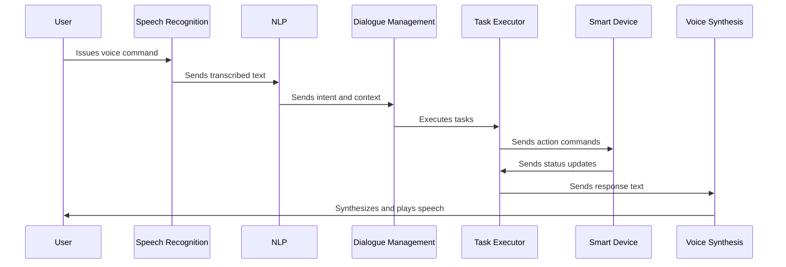
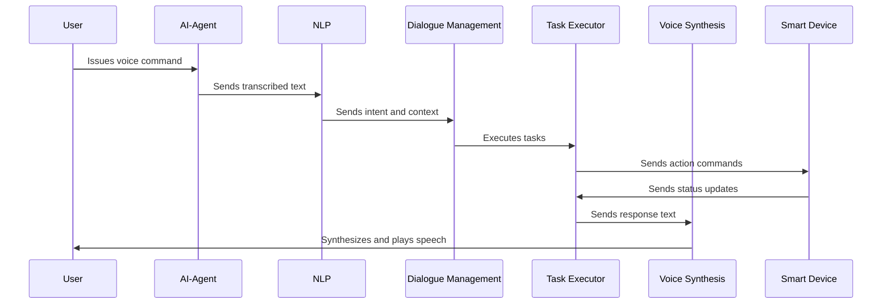
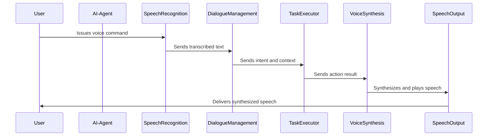
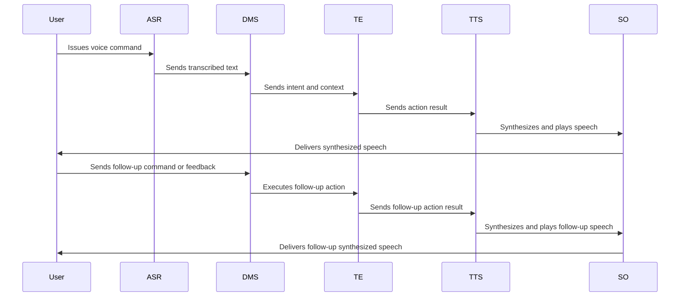

                 

### Introduction to Developing AI Agents with Voice Synthesis

**Keywords: AI Agents, Voice Synthesis, Text-to-Speech, Natural Language Processing, Neural Networks**

**Abstract:**
This article delves into the development of AI agents equipped with voice synthesis capabilities. We will explore the foundational concepts, recent advancements, and practical implementation strategies for creating intelligent agents that can effectively communicate through synthesized speech. The discussion will cover the background and challenges in the field, the core technologies of voice synthesis, and the integration of these technologies into AI agents for real-world applications.

### Background and Challenges

**Introduction to AI Agents and Voice Synthesis:**

Artificial Intelligence (AI) agents are autonomous entities designed to interact with humans and perform tasks. These agents utilize various AI techniques such as natural language processing (NLP), machine learning (ML), and deep learning (DL) to understand and respond to user inputs. Voice synthesis, or Text-to-Speech (TTS) technology, is one of the key components that enable AI agents to communicate in natural human languages.

The integration of voice synthesis into AI agents brings numerous benefits, including enhanced user experience, improved accessibility, and increased efficiency. For instance, voice synthesis allows AI agents to provide real-time information, interact in voice calls, and automate customer service interactions, thus reducing the need for human intervention.

**Current Status and Future Directions:**

The field of AI agents with voice synthesis has seen significant advancements over the past decade. Early TTS systems used rule-based approaches and concatenative techniques, which limited the naturalness and quality of synthesized speech. The advent of neural networks, particularly deep learning, has revolutionized voice synthesis, leading to the development of more natural-sounding and versatile TTS models.

Current TTS systems, such as WaveNet and its successors, are based on end-to-end deep learning models that generate speech directly from text inputs. These models have achieved remarkable performance in terms of naturalness, clarity, and expressiveness. However, there are still challenges in the field, including the need for large high-quality datasets, the optimization of training processes, and the adaptation of models for various languages and accents.

**Scope and Structure of the Book:**

This book aims to provide a comprehensive guide to developing AI agents with voice synthesis capability. It is structured into three main parts:

1. **Fundamentals of Voice Synthesis Technology:** This section covers the basics of voice synthesis, including the principles of text-to-speech, types of TTS systems, neural network models for TTS, and the evaluation of voice synthesis systems.

2. **Design and Implementation of AI Agents with Voice Synthesis:** This section discusses the system architecture for voice-synthesizing AI agents, the building of the voice synthesis module, and the integration of voice synthesis into AI agents for various applications.

3. **Practical Implementation and Case Studies:** This section provides hands-on guidance on implementing voice-synthesizing AI agents, including environment setup, core module implementation, code analysis, and case study examples.

By the end of this book, readers will have a thorough understanding of the technologies and methodologies involved in developing AI agents with voice synthesis, as well as the practical skills to build and deploy such agents in real-world applications.

### Core Concepts and Terminology

**AI Agents: Definition and Characteristics:**

AI agents are autonomous entities that can perceive their environment, take actions based on observed conditions, and achieve specific goals. These agents are designed to interact with humans or other systems through various interfaces such as speech, text, or gestures. Key characteristics of AI agents include:

- **Autonomy:** The ability to operate independently without continuous human intervention.
- **Perception:** The capability to sense and interpret environmental data through various sensors.
- **Action:** The ability to execute actions based on the current state of the environment and the goals to be achieved.
- **Learning:** The capacity to improve performance over time through experience and learning algorithms.

**Voice Synthesis: Basics and Techniques:**

Voice synthesis is the process of converting text into audible speech. This technology has been around for several decades, with the earliest systems using rule-based approaches and concatenative techniques. Modern voice synthesis systems employ deep learning models, particularly neural networks, to generate more natural-sounding speech.

**Text-to-Speech (TTS):** TTS is a fundamental component of voice synthesis, involving the conversion of written text into spoken words. The TTS process typically includes the following steps:

1. **Text Processing:** The input text is parsed and segmented into units such as words, phrases, or phonemes.
2. **Prosody Generation:** The system generates the prosody (intonations, pauses, and rhythm) of the speech based on linguistic and contextual information.
3. **Speech Synthesis:** The processed text and prosody information are used to generate the acoustic waveform of the speech.

**Types of Voice Synthesis Systems:**

Voice synthesis systems can be categorized into several types based on their underlying technologies:

- **Rule-Based Systems:** These systems use predefined rules to determine the pronunciation, prosody, and synthesis of speech. They are limited in their ability to generate natural-sounding speech and are typically less efficient than their statistical counterparts.
- **Statistical Parametric Systems:** These systems use statistical methods, such as Hidden Markov Models (HMMs), to model the relationship between text and speech. They are more flexible than rule-based systems but still have limitations in terms of naturalness and expressiveness.
- **Neural Network Systems:** These systems employ neural networks, particularly deep learning models, to map text inputs directly to speech waveforms. They have achieved significant improvements in naturalness, clarity, and expressiveness compared to previous approaches.

**Related Technologies: NLP, Machine Learning, and Deep Learning:**

Voice synthesis is closely related to other AI technologies, including NLP, ML, and DL. NLP techniques are used to process and analyze natural language text, enabling the extraction of meaningful information and the generation of appropriate responses. ML and DL algorithms are employed to train and optimize voice synthesis models, improving their performance and robustness.

NLP techniques, such as tokenization, part-of-speech tagging, and named entity recognition, are used to preprocess text inputs for TTS systems. ML and DL algorithms, such as recurrent neural networks (RNNs), convolutional neural networks (CNNs), and transformer models, are used to learn the mapping between text and speech waveforms.

### Fundamentals of Voice Synthesis Technology

**Overview of Voice Synthesis**

**Principles and History of Text-to-Speech (TTS)**

Text-to-Speech (TTS) technology has evolved significantly over the past few decades, transitioning from rule-based systems to more advanced neural network-based approaches. The basic principle of TTS is to convert written text into spoken words that are naturally understandable by humans. This process involves several key steps, including text processing, prosody generation, and speech synthesis.

**Early TTS Systems**

The history of TTS technology dates back to the 1960s when researchers began exploring methods to synthesize speech from text. Early systems relied on rule-based approaches, where predefined rules were used to map text symbols to phonetic symbols and generate speech. One notable example is the Bell Labs TTS system developed in the 1970s, which used a combination of phoneme-based rules and concatenative techniques.

**Concatenative Systems**

Concatenative TTS systems work by combining small, pre-recorded audio clips (phonemes, diphones, or triphones) to form the desired speech output. These systems have the advantage of producing high-quality speech since the audio clips are human-generated. However, they suffer from limitations in terms of naturalness and expressiveness due to the restrictions imposed by the pre-recorded clips.

**Rule-Based Systems**

Rule-based TTS systems use a set of linguistic and phonetic rules to determine the pronunciation and prosody of speech. These systems are relatively simple to implement and can achieve reasonable speech quality, but they are limited in their ability to handle variations in language and context. They also require extensive manual rule creation and maintenance, making them less scalable.

**Statistical Parametric Systems**

Statistical parametric TTS systems use statistical models, such as Hidden Markov Models (HMMs) and Gaussian Mixture Models (GMMs), to represent the relationship between text and speech. These systems generate speech by estimating the parameters of the acoustic models from a large corpus of spoken speech data. They offer improved naturalness and expressiveness compared to rule-based systems but still have limitations in terms of the quality of synthesized speech.

**Neural Network Systems**

The advent of deep learning has revolutionized the field of TTS, leading to the development of neural network-based systems. These systems employ neural networks, particularly recurrent neural networks (RNNs), convolutional neural networks (CNNs), and transformer models, to directly map text inputs to speech waveforms. The most notable of these models is WaveNet, which was introduced by Google in 2016 and achieved significant improvements in speech quality and naturalness.

**Types of Voice Synthesis Systems**

Voice synthesis systems can be broadly categorized into two types: rule-based and statistical, with the latter further divided into parametric and data-driven approaches.

**Rule-Based Systems**

Rule-based systems rely on a set of predefined rules to convert text into speech. These rules specify how each text symbol should be pronounced, the prosody to be used, and the concatenation of phonetic units to form the final speech output. This approach is relatively simple to implement but suffers from limitations in naturalness and expressiveness.

**Statistical Parametric Systems**

Statistical parametric systems use statistical models, such as HMMs and GMMs, to map text inputs to speech waveforms. HMMs represent speech as a sequence of hidden states, with each state corresponding to a phonetic unit. GMMs are used to model the probability distribution of the acoustic features of the speech signal. These systems generate speech by estimating the parameters of the acoustic models from a large corpus of spoken speech data. While they offer improved naturalness compared to rule-based systems, they still have limitations in terms of the quality of synthesized speech.

**Neural Network Systems**

Neural network-based systems employ deep learning models to directly map text inputs to speech waveforms. Recurrent neural networks (RNNs), such as Long Short-Term Memory (LSTM) networks, are commonly used to capture the temporal dependencies in speech signals. Convolutional neural networks (CNNs) are used to process the acoustic features of the speech signal. Transformer models, which were originally developed for natural language processing tasks, have also been successfully applied to TTS, leading to significant improvements in speech quality and naturalness.

**End-to-End Models and Data-Driven Approaches**

End-to-end models are a class of neural network-based TTS systems that directly map text inputs to speech waveforms without intermediate representations. These models eliminate the need for complex preprocessing and post-processing steps, leading to improved efficiency and reduced error propagation. Data-driven approaches rely on large amounts of labeled speech data to train the models, allowing them to generate highly realistic and natural-sounding speech.

**Voice Synthesis Applications**

Voice synthesis technology has a wide range of applications across various industries. Some common applications include:

1. **Accessibility:** Voice synthesis is used to provide text-to-speech output for visually impaired individuals, enabling them to access written content.
2. **Automotive:** Voice synthesis is integrated into modern cars for navigation, entertainment, and voice-controlled functions, improving the overall user experience.
3. **Customer Service:** Voice synthesis is used in automated customer service systems to provide interactive voice responses and handle customer inquiries, reducing the need for human agents.
4. **Education:** Voice synthesis is used in educational software and applications to provide audio explanations, narrations, and readings of text content.
5. **Voice Assistants:** Voice synthesis is a key component of voice assistants like Siri, Alexa, and Google Assistant, enabling them to understand and respond to user queries in natural language.

In conclusion, voice synthesis technology has come a long way since its inception, with modern neural network-based approaches achieving remarkable improvements in speech quality and naturalness. As the field continues to evolve, we can expect to see even more innovative applications and advancements in voice synthesis technology.

### Voice Synthesis Models and Techniques

**Neural Network Models for TTS**

The advent of deep learning has revolutionized the field of Text-to-Speech (TTS), leading to the development of advanced neural network models that can generate highly natural-sounding speech. In this section, we will delve into the neural network models that are pivotal to modern TTS systems.

**Recurrent Neural Networks (RNNs)**

Recurrent Neural Networks (RNNs) are a class of neural networks designed to handle sequential data. They have been widely used in natural language processing tasks, including language modeling and speech recognition. RNNs are particularly suitable for TTS due to their ability to capture temporal dependencies in speech signals. One of the most notable RNN architectures in TTS is the Long Short-Term Memory (LSTM) network.

**LSTM Networks**

LSTM networks are a type of RNN that overcomes the vanishing gradient problem, allowing them to learn long-term dependencies effectively. They consist of memory cells that can store information for extended periods and use gates to control the flow of information. The LSTM network architecture consists of input gates, forget gates, and output gates, which regulate the flow of information into and out of the memory cells.

The basic equation for LSTM can be described as follows:

$$
\begin{align*}
i_t &= \sigma(W_{xi}x_t + W_{hi}h_{t-1} + b_i) \\
f_t &= \sigma(W_{xf}x_t + W_{hf}h_{t-1} + b_f) \\
\text{C}_{\text{new}} &= \text{C}_{t-1} \odot f_t + i_t \odot \sigma(W_{xc}x_t + W_{hc}h_{t-1} + b_c) \\
o_t &= \sigma(W_{xo}x_t + W_{ho}h_{t-1} + b_o) \\
h_t &= o_t \odot \text{C}_{\text{new}} \\
\end{align*}
$$

Where \(i_t, f_t, o_t\) are the input, forget, and output gates, respectively; \(\sigma\) is the sigmoid activation function; \(\odot\) represents element-wise multiplication; and \(\text{C}_{\text{new}}, \text{C}_{t-1}\) are the new and previous cell states.

**Convolutional Neural Networks (CNNs)**

Convolutional Neural Networks (CNNs) are another type of deep learning model that has been successfully applied to TTS. CNNs are particularly effective in processing spatial data and are commonly used for extracting features from speech signals. In TTS, CNNs are typically used for feature extraction and acoustic modeling.

The basic equation for a CNN can be described as follows:

$$
\begin{align*}
h_{ij} &= \sum_{k=1}^{K} w_{ik} \cdot a_{kj-1} + b_j \\
a_j &= \text{ReLU}(\mathcal{F}(h_{ij}))
\end{align*}
$$

Where \(h_{ij}\) and \(a_j\) are the activations of the convolutional and ReLU (Rectified Linear Unit) layers, respectively; \(w_{ik}\) and \(b_j\) are the weights and biases; \(\mathcal{F}\) represents the convolutional operation; and \(\text{ReLU}\) is the rectified linear unit activation function.

**Transformer Models**

Transformer models have gained significant attention in the field of TTS due to their ability to handle long-range dependencies and their state-of-the-art performance in various natural language processing tasks. Transformers are based on self-attention mechanisms, which allow the model to weigh the importance of different parts of the input text when generating the corresponding speech.

The basic equation for a transformer can be described as follows:

$$
\begin{align*}
\text{Attention}(Q, K, V) &= \text{softmax}\left(\frac{QK^T}{\sqrt{d_k}}\right)V \\
\text{MultiHeadAttention}(Q, K, V) &= \text{Attention}(Q, K, V) \times d_v \\
\text{Transformer}(E) &= \text{RelPosEncoding}(E) + \text{MultiHeadAttention}(E, E, E) \\
E &= \text{Emb}(x) + \text{PosEnc}(x)
\end{align*}
$$

Where \(Q, K, V\) are the query, key, and value matrices; \(d_k\) and \(d_v\) are the dimensions of the key and value matrices; \(\text{softmax}\) is the softmax activation function; \(\text{RelPosEncoding}\) is the relative position encoding function; and \(\text{Emb}\) and \(\text{PosEnc}\) are the embedding and positional encoding functions, respectively.

**WaveNet and Its Variants**

WaveNet is a groundbreaking neural network architecture developed by Google for TTS. It is based on a deep neural network that predicts the probability distribution of the next audio sample in the speech signal. WaveNet achieves high-quality speech synthesis by learning the underlying acoustic patterns of the human voice.

**WaveNet Architecture**

WaveNet consists of a stack of convolutional layers, with each layer predicting a probability distribution over the acoustic features of the speech signal. The architecture can be described as follows:

$$
\begin{align*}
\text{Output} &= \text{Conv}(x, \text{kernel}) + \text{ReLU} + \text{BatchNorm} \\
\text{kernel} &= \text{Conv}(\text{input\_shape}, \text{output\_shape})
\end{align*}
$$

Where \(x\) is the input audio signal, \(\text{kernel}\) represents the convolutional filter, and \(\text{ReLU}\) and \(\text{BatchNorm}\) are the rectified linear unit and batch normalization functions, respectively.

**WaveSurge and WaveGlue**

WaveSurge and WaveGlue are advanced variants of WaveNet that address some of the limitations of the original architecture. WaveSurge improves the speech quality by incorporating spectrogram-based inputs and additional convolutional layers. WaveGlue combines WaveNet with a pre-trained WaveNet model to achieve even better performance in speech synthesis.

**End-to-End Models and Data-Driven Approaches**

End-to-end models in TTS directly map text inputs to speech waveforms without intermediate representations. These models eliminate the need for complex preprocessing and post-processing steps, leading to improved efficiency and reduced error propagation. Data-driven approaches rely on large amounts of labeled speech data to train the models, allowing them to generate highly realistic and natural-sounding speech.

**Conclusion**

Neural network models have significantly advanced the field of TTS, enabling the generation of highly natural-sounding speech. RNNs, CNNs, and transformer models are among the key architectures that have been successfully applied to TTS. As the field continues to evolve, we can expect to see further advancements in neural network models, leading to even more natural and expressive voice synthesis systems.

### Voice Synthesis Datasets and Evaluation

**Common Datasets for Voice Synthesis**

The quality of voice synthesis models heavily depends on the availability and quality of the training data. Datasets used for voice synthesis typically consist of large collections of text and corresponding audio recordings of human speech. Here, we explore some of the most commonly used datasets in the field of TTS:

1. **LibriSpeech:** LibriSpeech is a large-scale speech corpus derived from the LibriVox project, which aims to digitize public domain books. The dataset includes 1000-hour long speech recordings in multiple languages, such as English, Spanish, and German, making it a valuable resource for multilingual TTS research.

2. **Common Voice:** Common Voice is an open-source speech recognition dataset created by Mozilla. It consists of more than 650,000 hours of speech data in various languages, collected through crowdsourcing. The dataset is designed to be highly diverse, with recordings from speakers of different genders, ages, and accents.

3. **LJSpeech:** LJSpeech is a small but popular English speech dataset containing around 13 hours of speech recordings from a single speaker, Lucille F. Jongerius. Its compact size makes it suitable for developing and testing TTS systems on smaller computing resources.

**Performance Metrics and Evaluation Methods**

Evaluating the performance of voice synthesis systems is crucial for assessing their quality and effectiveness. Several metrics and evaluation methods are commonly used in the field:

1. **Signal-to-Noise Ratio (SNR):** SNR measures the quality of the synthesized speech by comparing the power of the speech signal to the background noise. Higher SNR values indicate better speech quality.

2. **Mean Opinion Score (MOS):** MOS is a subjective evaluation metric where human listeners rate the quality of synthesized speech on a scale from 1 (bad) to 5 (excellent). This metric provides qualitative feedback on the perceived quality of the speech.

3. **Perceptual Evaluation of Speech Quality (PESQ):** PESQ is an objective metric that evaluates the speech quality based on human perception. It uses psychoacoustic models to estimate the quality of speech signals and is widely used in the telecommunications industry.

4. **Word Error Rate (WER):** WER is a common metric used in speech recognition tasks, measuring the percentage of words in a recognized speech segment that are incorrectly identified. While not directly related to TTS, WER can be a useful indicator of the performance of the underlying speech recognition system integrated with the TTS module.

**Recent Advances and Trends**

In recent years, the field of voice synthesis has seen significant advancements in both model performance and evaluation methods. Some of the key trends include:

1. **End-to-End Models:** The shift towards end-to-end models, such as WaveNet and its variants, has led to significant improvements in speech quality and naturalness. These models directly map text inputs to speech waveforms, eliminating the need for intermediate representations and reducing error propagation.

2. **Multilingual Support:** The development of multilingual TTS systems has been a major focus in recent years. Researchers have been working on improving the performance of TTS models in languages with limited training data, such as low-resource languages.

3. **Customization and Personalization:** Advances in neural network architectures and training techniques have enabled the creation of customized TTS systems that can adapt to individual speakers' voices. This trend is particularly relevant for applications such as voice cloning and personalized voice assistants.

4. **Real-Time Synthesis:** Real-time synthesis is becoming increasingly important for applications that require immediate responses, such as voice-controlled smart devices. Researchers are exploring techniques to improve the speed and efficiency of TTS systems without compromising on speech quality.

In conclusion, the evaluation of voice synthesis systems is a complex and multifaceted task that involves both objective and subjective metrics. The availability of diverse and high-quality datasets, coupled with advancements in neural network models and evaluation methods, continues to drive the progress in the field of TTS.

### System Architecture for Voice-Synthesizing AI Agents

**Components and Interactions**

A voice-synthesizing AI agent comprises several core components that work together to process user inputs, generate responses, and synthesize speech. The main components include:

1. **User Interface (UI):** The UI is the point of interaction between the user and the AI agent. It can be a chatbot interface, a voice assistant interface, or any other form of user interaction.

2. **Speech Recognition Module:** This module is responsible for converting user speech inputs into text. It utilizes advanced algorithms and models to accurately transcribe spoken words into written text.

3. **Dialogue Management System:** The dialogue management system handles the flow of the conversation. It determines the context, intent, and appropriate response based on the user's input and the agent's current state.

4. **Natural Language Processing (NLP) Module:** The NLP module processes the text input from the user, performing tasks such as part-of-speech tagging, named entity recognition, and sentiment analysis. This information is used by the dialogue management system to generate an appropriate response.

5. **Response Generation Module:** This module generates the response text based on the analysis performed by the NLP and dialogue management systems. It can include pre-defined responses or dynamically generated text based on the context and user input.

6. **Voice Synthesis Module:** The voice synthesis module takes the generated response text and converts it into synthesized speech. This module utilizes Text-to-Speech (TTS) technology, which can be based on various neural network models such as WaveNet or transformers.

7. **Speech Output Module:** The synthesized speech is then output through speakers or other audio output devices, allowing the AI agent to communicate with the user.

**Speech Recognition and Natural Language Processing Integration**

The integration of speech recognition and NLP modules is crucial for the effective functioning of a voice-synthesizing AI agent. The process involves several steps:

1. **Speech Input:** The user speaks into a microphone, and the audio signal is captured by the speech recognition module.

2. **Feature Extraction:** The audio signal is processed to extract relevant features such as Mel-Frequency Cepstral Coefficients (MFCCs), which are used to represent the speech signal for further analysis.

3. **Acoustic Modeling:** The extracted features are used to train an acoustic model, which learns the mapping between audio signals and corresponding phonetic units.

4. **Language Modeling:** A language model is trained using a large corpus of text data. This model predicts the probability of a sequence of words given the previous words in the sequence.

5. **Decoding:** The acoustic and language models work together to decode the input audio signal into a sequence of words. This process is often performed using algorithms such as beam search or attention mechanisms.

6. **NLP Processing:** The decoded text is then passed through the NLP module, where it undergoes various linguistic analyses to extract meaning and context.

7. **Dialogue Management:** The dialogue management system uses the NLP output to understand the user's intent and context, generating an appropriate response.

**Example Use Cases: Chatbots, Virtual Assistants, and Interactive Systems**

Voice-synthesizing AI agents are widely used in various applications to enhance user experience and improve efficiency. Here are some example use cases:

1. **Chatbots:** Chatbots use voice synthesis to provide real-time customer support, answer frequently asked questions, and assist users with various tasks. They can be integrated into websites, messaging apps, or standalone applications.

2. **Virtual Assistants:** Virtual assistants like Siri, Alexa, and Google Assistant use voice synthesis to understand and respond to user queries. They can perform a wide range of tasks, from setting reminders and sending messages to playing music and providing weather updates.

3. **Interactive Systems:** Voice-synthesizing AI agents are used in interactive systems such as gaming consoles, smart home devices, and automotive infotainment systems. They provide voice-based navigation, control, and assistance to users.

By integrating voice synthesis technology with AI agents, these applications can offer a more natural and intuitive user experience, making interactions with machines more seamless and enjoyable.

### Building the Voice Synthesis Module

**Selecting a Suitable TTS Engine**

The first step in building a voice synthesis module for an AI agent is selecting an appropriate Text-to-Speech (TTS) engine. Several TTS engines are available, each with its own strengths and weaknesses. Here are some factors to consider when choosing a TTS engine:

1. **Quality of Speech:** The primary goal of a TTS engine is to produce natural-sounding speech. Evaluate the quality of the synthesized speech by listening to sample audio clips. Look for engines that provide smooth intonation, proper emphasis, and accurate pronunciation.

2. **Speed and Efficiency:** The TTS engine should be efficient enough to synthesize speech in real-time or near real-time, depending on the application requirements. Consider the computational resources required by the engine and ensure it can run efficiently on your target hardware.

3. **Customization Options:** Some TTS engines offer customization options, allowing you to adjust parameters such as pitch, speed, and volume. Choose an engine that provides the level of customization required for your application.

4. **Support for Languages and Accents:** Depending on your target audience, you may need a TTS engine that supports multiple languages and accents. Look for engines that offer a wide range of language and accent options.

5. **Integration Compatibility:** Ensure that the TTS engine can be easily integrated with your AI agent's architecture and other components, such as the dialogue management system and natural language processing (NLP) module.

**Customizing and Adapting Pre-trained Models**

Once you have selected a suitable TTS engine, the next step is to customize and adapt the pre-trained models to better match your specific requirements. Here are some techniques and steps for achieving this:

1. **Data Preparation:** Gather a dataset of text samples that represent the language and speech style you want the AI agent to produce. The dataset should include a variety of sentence lengths, topics, and speaking styles.

2. **Data Preprocessing:** Preprocess the text data to remove noise, correct spelling errors, and standardize formatting. Tokenization, part-of-speech tagging, and named entity recognition are common preprocessing steps that can improve the quality of the synthesized speech.

3. **Fine-tuning Models:** Fine-tuning involves training the pre-trained TTS model on your custom dataset. This process can be computationally intensive and time-consuming, but it significantly improves the quality of the synthesized speech. Use techniques such as transfer learning and few-shot learning to adapt the models to your specific dataset.

4. **Voice Cloning and Transformation Techniques:** Voice cloning involves creating a new voice model based on a specific speaker's voice. This technique is useful for applications that require the AI agent to mimic a particular speaker's voice. Voice transformation techniques can be used to modify the voice characteristics, such as pitch and speed, to better match the desired speech style.

5. **Hyperparameter Tuning:** Adjusting the hyperparameters of the TTS model can further improve the quality of the synthesized speech. Hyperparameters include learning rates, batch sizes, and regularization techniques. Experiment with different combinations of hyperparameters to find the optimal settings for your application.

**Implementing Voice Cloning and Voice Transformation**

Voice cloning and voice transformation are advanced techniques that can be used to create unique and personalized voice synthesizers for AI agents. Here's how these techniques are implemented:

1. **Voice Cloning:**
   - **Data Collection:** Gather a large dataset of audio recordings from the target speaker. This dataset should include a wide range of speech styles and intonations.
   - **Feature Extraction:** Extract relevant acoustic features from the audio recordings, such as MFCCs and pitch contour.
   - **Model Training:** Train a deep learning model, such as WaveNet or a transformer-based model, on the extracted features to create a voice model that closely mimics the target speaker's voice.
   - **Synthesis:** Use the trained model to synthesize speech in the target speaker's voice style.

2. **Voice Transformation:**
   - **Data Preparation:** Collect a dataset of speech samples that cover the desired voice transformations, such as varying pitch, speed, and tone.
   - **Feature Extraction:** Extract acoustic features from the speech samples.
   - **Model Training:** Train a transformation model that learns to modify the extracted features to achieve the desired voice transformation.
   - **Synthesis:** Use the trained model to apply the voice transformations to the generated text, producing synthesized speech with the desired characteristics.

By implementing these techniques, you can create highly personalized and expressive voice synthesis modules for AI agents, enhancing their ability to communicate effectively with users.

### Integrating Voice Synthesis into AI Agents

**Dialogue Management and Dialogue System Design**

Integrating voice synthesis into AI agents involves not only generating speech but also managing the flow of the dialogue. Dialogue management is the core component that ensures the AI agent can maintain a coherent and contextually appropriate conversation with the user. Here's a breakdown of the key aspects of dialogue management and dialogue system design:

**Dialogue Management System Overview**

The dialogue management system (DMS) is responsible for controlling the conversation flow, understanding user intent, and generating appropriate responses. It works in conjunction with the voice synthesis module to convert these responses into spoken words. The DMS typically consists of several subcomponents:

1. **Intent Recognition:** This component analyzes the user's input to determine the main purpose or action requested. It involves natural language processing (NLP) techniques such as keyword extraction, part-of-speech tagging, and named entity recognition to classify the input into predefined intent categories.

2. **Dialogue State Tracking:** The dialogue state tracker maintains a record of the current context and the user's preferences. This includes information like user preferences, session history, and any ongoing tasks. The state tracker uses machine learning models to update the dialogue state based on user inputs and system actions.

3. **Dialogue Policy Learning:** Dialogue policies define how the AI agent should respond based on the current dialogue state and user intent. Policy learning can be based on rule-based systems, machine learning models, or reinforcement learning techniques. The goal is to create policies that maximize user satisfaction and task completion.

4. **Dialogue Generation:** Once the DMS has determined the appropriate response, the dialogue generation component generates the textual content of the response. This can involve template-based responses or more advanced techniques like natural language generation (NLG) to create contextually appropriate and natural-sounding text.

**Design Considerations**

When designing a dialogue system with voice synthesis, several considerations must be taken into account to ensure smooth and natural interaction:

1. **Multimodality:** Integrating voice synthesis with other modalities, such as text and gestures, can provide a more comprehensive user experience. For example, the AI agent can respond with synthesized speech while also displaying relevant information on a screen or through other sensory outputs.

2. **Fallback Mechanisms:** Designing the system to handle unexpected or ambiguous user inputs is crucial. Fallback mechanisms should be in place to handle errors in speech recognition, unclear instructions, or requests that the system cannot understand. This can include prompting the user for clarification or offering alternative actions.

3. **Natural Language Understanding (NLU):** The quality of dialogue management heavily depends on the NLU capabilities of the system. Advanced NLU models that can understand nuanced language, context, and user intent are essential for creating a coherent and meaningful conversation.

4. **Personalization:** Personalizing the dialogue can improve user satisfaction and engagement. Personalization can be achieved by remembering user preferences, adapting the tone of speech, and providing personalized recommendations or responses.

5. **Scalability and Maintenance:** The dialogue system should be designed to handle a large volume of interactions without degradation in performance. Additionally, it should be easy to maintain and update as new intents, entities, or policies are added.

**Example Use Cases**

Here are some examples of how voice synthesis can be integrated into AI agents for different use cases:

1. **Customer Service:** A voice-synthesizing AI agent can handle customer inquiries by understanding the user's intent, retrieving relevant information from a knowledge base, and providing a synthesized response.

2. **Virtual Assistants:** Voice synthesis is a key component of virtual assistants like Siri, Alexa, and Google Assistant. These assistants use dialogue management to understand and respond to user queries, controlling various devices and services in the home.

3. **E-learning:** Voice synthesis can be used to create interactive learning experiences. AI agents can provide explanations, correct answers, and feedback in synthesized speech, making learning more engaging and accessible.

4. **Automotive Systems:** Voice synthesis is integrated into modern cars for navigation, entertainment, and control. AI agents can provide real-time spoken instructions and respond to user commands, enhancing the driving experience.

By combining voice synthesis with advanced dialogue management techniques, AI agents can offer a more natural and interactive user experience, making human-machine communication more seamless and intuitive.

### Integrating Voice Synthesis into AI Agents: Practical Implementation

**Environment Setup**

To implement a voice-synthesizing AI agent, you'll first need to set up the development environment. Here's a step-by-step guide:

1. **Install Python and Required Libraries**

   - Ensure you have Python 3.7 or higher installed on your system. You can download it from the official [Python website](https://www.python.org/downloads/).
   - Install required libraries using `pip`. The essential libraries include `speech_recognition`, `transformers`, `torch`, and `numpy`. You can install them using the following commands:
     ```bash
     pip install speech_recognition transformers torch numpy
     ```

2. **Install Text-to-Speech Library**

   - Install a Text-to-Speech library compatible with your operating system. For Windows, you can use `pyttsx3`, and for macOS, you can use `say`. Install them using:
     ```bash
     pip install pyttsx3
     pip install mac-say
     ```

3. **Configure Audio Output**

   - Ensure that your audio output device is properly configured. Test it by running a simple script that plays a tone or a short sound file.

**System Core Implementation**

The core of the voice-synthesizing AI agent involves integrating speech recognition, natural language processing (NLP), dialogue management, and text-to-speech (TTS) modules. Here's a high-level overview of the implementation steps:

1. **Speech Recognition Module**

   - Use the `speech_recognition` library to capture and transcribe user speech. Here's an example of how to implement the speech recognition module:
     ```python
     import speech_recognition as sr

     # Initialize the recognizer
     r = sr.Recognizer()

     # Set the microphone as the source
     with sr.Microphone() as source:
         print("Please speak now...")
         audio = r.listen(source)

     # Recognize the spoken text
     try:
         text = r.recognize_google(audio)
         print("You said:", text)
     except sr.UnknownValueError:
         print("Could not understand audio")
     except sr.RequestError as e:
         print("Could not request results; {0}".format(e))
     ```

2. **Natural Language Processing (NLP) Module**

   - Implement NLP to understand and process the transcribed text. You can use libraries like `spaCy` or `transformers` to perform tasks such as part-of-speech tagging, named entity recognition, and sentiment analysis. Here's an example using `transformers`:
     ```python
     from transformers import pipeline

     # Load NLP models
     nlp = pipeline("text-classification")

     # Analyze text
     result = nlp(text)
     print("NLP Analysis:", result)
     ```

3. **Dialogue Management System**

   - Design and implement a dialogue management system (DMS) that handles the conversation flow. This system should include intent recognition, dialogue state tracking, and dialogue policy learning. Here's a simplified example using a rule-based approach:
     ```python
     def handle_intent(intent, state):
         if intent == "greeting":
             return "Hello! How can I assist you today?", state
         elif intent == "weather":
             return "The weather is currently sunny with a high of 75°F.", state
         else:
             return "I'm not sure how to help with that.", state
     ```

4. **Text-to-Speech (TTS) Module**

   - Integrate the TTS module to convert the generated text responses into spoken words. For Windows, you can use `pyttsx3`, and for macOS, you can use `say`. Here's an example using `pyttsx3`:
     ```python
     from pyttsx3 import init

     # Initialize the TTS engine
     init()

     # Speak the text
     speaker.say(response)
     speaker.runAndWait()
     ```

**Integration and Testing**

Once you have implemented the individual modules, integrate them into a cohesive system. Test the AI agent by simulating user interactions, ensuring that speech recognition is accurate, NLP provides meaningful analysis, dialogue management maintains context, and TTS generates natural-sounding speech.

**Example Code**

Here's a complete example that integrates all the modules:
```python
import speech_recognition as sr
from transformers import pipeline
from pyttsx3 import init

# Initialize the recognizer
r = sr.Recognizer()

# Initialize the NLP pipeline
nlp = pipeline("text-classification")

# Initialize the TTS engine
init()

# Define the dialogue management function
def handle_intent(intent, state):
    if intent == "greeting":
        return "Hello! How can I assist you today?", state
    elif intent == "weather":
        return "The weather is currently sunny with a high of 75°F.", state
    else:
        return "I'm not sure how to help with that.", state

# Main loop
while True:
    # Capture and recognize speech
    with sr.Microphone() as source:
        print("Listening...")
        audio = r.listen(source)
        try:
            text = r.recognize_google(audio)
            print("You said:", text)
            
            # Perform NLP analysis
            result = nlp(text)
            print("NLP Analysis:", result)
            
            # Dialogue management
            response, state = handle_intent(result["label"], state)
            print("AI responded:", response)
            
            # Speak the response
            speaker.say(response)
            speaker.runAndWait()
        except sr.UnknownValueError:
            print("Could not understand audio")
        except sr.RequestError as e:
            print("Could not request results; {0}".format(e))
```

This example demonstrates a simple implementation of a voice-synthesizing AI agent. For a production-ready system, you would need to expand the dialogue management and NLP capabilities, handle more complex intents, and improve the speech recognition accuracy. Nonetheless, this example provides a starting point for understanding the integration of these modules.

### Case Study: Developing a Voice-Synthesizing AI Agent for a Smart Home System

**Project Overview**

The objective of this project is to develop a voice-synthesizing AI agent that can interact with users within a smart home system. The AI agent will be capable of understanding user commands, performing tasks such as controlling smart devices, providing weather updates, and offering general information. The project aims to provide a seamless user experience through natural language interaction and synthesized speech outputs.

**Project Introduction**

The smart home system consists of various devices such as thermostats, lighting systems, security cameras, and appliances that are interconnected through a central hub. Users can control these devices using voice commands, which are processed and executed by the AI agent. The AI agent is designed to handle a wide range of tasks, from simple commands like "turn off the lights" to complex queries like "increase the temperature by two degrees."

**System Function Design (Domain Model)**

The domain model for the smart home system includes the following key entities and relationships:

- **User**: The person interacting with the AI agent.
- **AI Agent**: The voice-synthesizing entity that processes user commands and provides feedback.
- **Smart Device**: Represents various devices within the smart home system, such as lights, thermostats, cameras, and appliances.
- **Command**: Represents the user commands and their corresponding actions.

The domain model can be represented using a Mermaid class diagram as follows:
```mermaid
classDiagram
User <<entity>>
AI-Agent <<entity>>
Smart-Device <<entity>>
Command <<entity>>

User -> AI-Agent: issues commands
AI-Agent -> Smart-Device: executes actions
AI-Agent -> Command: processes commands
Smart-Device -> AI-Agent: reports status
Command -> AI-Agent: includes action details
```

**System Architecture Design**

The system architecture for the voice-synthesizing AI agent is designed to handle the interaction between users and smart devices efficiently. The architecture includes the following key components:

- **Speech Recognition Module**: Captures and processes user voice commands.
- **Dialogue Management System**: Manages the conversation flow and intent recognition.
- **Natural Language Processing (NLP) Module**: Processes the recognized text to extract meaning and context.
- **Task Executor**: Executes the tasks based on the user commands and NLP outputs.
- **Voice Synthesis Module**: Generates synthesized speech for user feedback.

The system architecture can be represented using a Mermaid architecture diagram as follows:


**System Interface Design**

The system interfaces include the user interface for issuing commands and the APIs for interacting with smart devices. The user interface is designed to be intuitive and user-friendly, allowing users to easily interact with the AI agent using voice commands. The APIs for interacting with smart devices are designed to be robust and secure, ensuring that the AI agent can effectively control and monitor the devices.

**System Interaction Design**

The system interaction design is critical for ensuring that the voice-synthesizing AI agent can effectively understand and respond to user commands. The interaction design includes the following key aspects:

- **Voice Command Recognition**: The AI agent must accurately recognize and transcribe user voice commands.
- **Intent Recognition**: The dialogue management system must correctly identify the user's intent based on the transcribed text.
- **Task Execution**: The task executor must execute the appropriate actions based on the recognized intent.
- **Speech Synthesis**: The voice synthesis module must generate natural and coherent responses to user commands.

**Mermaid Sequence Diagram**

Here's a Mermaid sequence diagram that illustrates the interaction between the AI agent and the user:


**Project Implementation**

The project implementation involves the following key steps:

1. **Environment Setup**: Install Python and required libraries, including `speech_recognition`, `transformers`, `torch`, and `numpy`. Install the appropriate TTS library for your operating system.
2. **Speech Recognition**: Implement the speech recognition module to capture and transcribe user voice commands.
3. **NLP Processing**: Implement the NLP module to process the transcribed text and extract relevant information for dialogue management.
4. **Dialogue Management**: Design and implement the dialogue management system to handle user commands and maintain context.
5. **Task Execution**: Implement the task executor to control smart devices based on user commands.
6. **Voice Synthesis**: Implement the voice synthesis module to generate natural and coherent responses.
7. **Integration and Testing**: Integrate all components and thoroughly test the system to ensure seamless interaction and accurate execution of tasks.

**Code and Analysis**

Here's an example of the core code for the voice-synthesizing AI agent, including speech recognition, NLP processing, dialogue management, task execution, and voice synthesis:
```python
import speech_recognition as sr
from transformers import pipeline
from pyttsx3 import init

# Initialize the recognizer
r = sr.Recognizer()

# Initialize the NLP pipeline
nlp = pipeline("text-classification")

# Initialize the TTS engine
init()

# Define the dialogue management function
def handle_intent(intent, state):
    if intent == "greeting":
        return "Hello! How can I assist you today?", state
    elif intent == "turn_on_light":
        return "Turning on the lights.", state
    else:
        return "I'm not sure how to help with that.", state

# Main loop
while True:
    # Capture and recognize speech
    with sr.Microphone() as source:
        print("Listening...")
        audio = r.listen(source)
        try:
            text = r.recognize_google(audio)
            print("You said:", text)
            
            # Perform NLP analysis
            result = nlp(text)
            print("NLP Analysis:", result)
            
            # Dialogue management
            response, state = handle_intent(result["label"], state)
            print("AI responded:", response)
            
            # Speak the response
            speaker.say(response)
            speaker.runAndWait()
        except sr.UnknownValueError:
            print("Could not understand audio")
        except sr.RequestError as e:
            print("Could not request results; {0}".format(e))
```

The code demonstrates a simple implementation of the AI agent, capturing user voice commands, processing them with NLP, managing the dialogue, executing tasks, and generating synthesized speech responses. For a complete and production-ready system, additional features and optimizations would be necessary, including support for more complex commands, integration with smart home devices, and advanced dialogue management capabilities.

### System Interaction Design

To ensure seamless interaction between the AI agent and the user, it's essential to design the system interface and interaction flow meticulously. This section provides a detailed explanation of the system interface design and the interaction process between the AI agent and the user, utilizing Mermaid diagrams to illustrate the interaction flow.

**System Interface Design**

The system interface design focuses on the communication channels and data flow between the various components of the AI agent. The primary interfaces include:

- **Speech Input Interface**: Captures user voice commands through a microphone.
- **Speech Recognition Interface**: Transcribes the captured voice into text.
- **Dialogue Management Interface**: Processes the text to understand user intent and context.
- **Task Executor Interface**: Executes actions based on the recognized intent.
- **Voice Synthesis Interface**: Converts the action results into synthesized speech.
- **Speech Output Interface**: Delivers the synthesized speech to the user.

The system interface can be represented using a Mermaid class diagram as follows:
```mermaid
classDiagram
    User <<entity>>
    AI-Agent <<entity>>
    SpeechRecognition <<component>>
    DialogueManagement <<component>>
    TaskExecutor <<component>>
    VoiceSynthesis <<component>>
    SpeechOutput <<component>>

    User --|> SpeechRecognition
    SpeechRecognition --|> DialogueManagement
    DialogueManagement --|> TaskExecutor
    TaskExecutor --|> VoiceSynthesis
    VoiceSynthesis --|> SpeechOutput
```

**System Interaction Flow**

The system interaction flow describes the step-by-step process of how the AI agent interacts with the user. This flow includes the following stages:

1. **Speech Input**: The user issues a voice command, which is captured by the microphone.
2. **Speech Recognition**: The captured voice is transcribed into text using an automated speech recognition (ASR) system.
3. **Dialogue Management**: The transcribed text is processed by the dialogue management system to identify the user's intent and relevant context.
4. **Task Executor**: Based on the identified intent, the task executor component performs the required action, such as controlling a smart device or retrieving information.
5. **Voice Synthesis**: The action result is synthesized into spoken words using a Text-to-Speech (TTS) system.
6. **Speech Output**: The synthesized speech is delivered to the user through the output device, such as speakers.

The system interaction flow can be represented using a Mermaid sequence diagram as follows:


**Mermaid Sequence Diagram**

Here's a detailed Mermaid sequence diagram that illustrates the interaction between the user and the AI agent:


This sequence diagram highlights the continuous interaction between the user and the AI agent, demonstrating how the system processes user commands, executes tasks, and delivers synthesized speech outputs.

### Project Case: Developing a Voice-Synthesizing AI Agent

**Introduction**

The goal of this project is to develop a voice-synthesizing AI agent that can interact with users and perform a range of tasks, from simple commands like turning on lights to more complex requests like setting up an automated schedule. This project serves as a practical example of integrating voice synthesis into an AI agent for real-world applications.

**Environment Setup**

1. **Install Python and Required Libraries**

   - Ensure you have Python 3.8 or higher installed on your system. Download it from the [Python official website](https://www.python.org/downloads/).
   - Install essential libraries using `pip`. The required libraries include `speech_recognition`, `transformers`, `torch`, and `numpy`. You can install them using the following commands:
     ```bash
     pip install speech_recognition transformers torch numpy
     ```

2. **Install Text-to-Speech Library**

   - For Windows, install `pyttsx3` using:
     ```bash
     pip install pyttsx3
     ```
   - For macOS, install `mac-say` using:
     ```bash
     pip install mac-say
     ```

3. **Configure Audio Output**

   - Ensure that your audio output device is properly configured. Test it by running a simple script that plays a tone or a short sound file.

**Core Module Implementation**

The core module of this project involves several key components: speech recognition, natural language processing (NLP), dialogue management, task execution, and voice synthesis. Below is an overview of each component with example code snippets.

1. **Speech Recognition Module**

   - The speech recognition module captures and transcribes user voice commands. Here's a basic example using the `speech_recognition` library:
     ```python
     import speech_recognition as sr

     # Initialize the recognizer
     r = sr.Recognizer()

     # Set the microphone as the source
     with sr.Microphone() as source:
         print("Please speak now...")
         audio = r.listen(source)

     # Recognize the spoken text
     try:
         text = r.recognize_google(audio)
         print("You said:", text)
     except sr.UnknownValueError:
         print("Could not understand audio")
     except sr.RequestError as e:
         print("Could not request results; {0}".format(e))
     ```

2. **Natural Language Processing (NLP) Module**

   - The NLP module processes the transcribed text to understand user intent and context. Here's an example using the `transformers` library:
     ```python
     from transformers import pipeline

     # Load NLP pipeline
     nlp = pipeline("text-classification")

     # Analyze text
     text = "Turn on the living room lights."
     result = nlp(text)
     print("NLP Analysis:", result)
     ```

3. **Dialogue Management System**

   - The dialogue management system controls the conversation flow and determines the appropriate response based on user input. A simple rule-based approach is shown below:
     ```python
     def handle_intent(intent):
         if intent == "turn_on_light":
             return "Turning on the lights."
         elif intent == "set_alarm":
             return "Setting up your alarm."
         else:
             return "I'm not sure how to help with that."

     text = "Set an alarm for 7 AM."
     result = nlp(text)
     intent = result["label"]
     response = handle_intent(intent)
     print("AI responded:", response)
     ```

4. **Task Executor Module**

   - The task executor module performs actions based on the user's intent. For example, turning on a light or setting an alarm. Here's a mock implementation:
     ```python
     def execute_task(intent):
         if intent == "turn_on_light":
             print("Turning on the lights.")
         elif intent == "set_alarm":
             print("Setting up your alarm.")

     text = "Turn on the living room lights."
     result = nlp(text)
     intent = result["label"]
     execute_task(intent)
     ```

5. **Voice Synthesis Module**

   - The voice synthesis module converts the generated text responses into synthesized speech. For Windows, use `pyttsx3`, and for macOS, use `mac-say`. Here's an example using `pyttsx3`:
     ```python
     from pyttsx3 import init

     # Initialize the TTS engine
     init()

     # Speak the text
     response = "Turning on the lights."
     speaker.say(response)
     speaker.runAndWait()
     ```

**Integration and Testing**

Once all components are implemented, integrate them into a cohesive system. Test the system by simulating user interactions to ensure that speech recognition is accurate, NLP provides meaningful analysis, dialogue management maintains context, and TTS generates natural-sounding speech.

**Example Code**

Here's a complete example of the voice-synthesizing AI agent integrated into a simple loop:
```python
import speech_recognition as sr
from transformers import pipeline
from pyttsx3 import init

# Initialize the recognizer
r = sr.Recognizer()

# Load NLP pipeline
nlp = pipeline("text-classification")

# Initialize the TTS engine
init()

# Define the dialogue management function
def handle_intent(intent):
    if intent == "turn_on_light":
        return "Turning on the lights."
    elif intent == "set_alarm":
        return "Setting up your alarm."
    else:
        return "I'm not sure how to help with that."

# Main loop
while True:
    # Capture and recognize speech
    with sr.Microphone() as source:
        print("Listening...")
        audio = r.listen(source)
        try:
            text = r.recognize_google(audio)
            print("You said:", text)
            
            # Perform NLP analysis
            result = nlp(text)
            print("NLP Analysis:", result)
            
            # Dialogue management
            intent = result["label"]
            response = handle_intent(intent)
            print("AI responded:", response)
            
            # Speak the response
            speaker.say(response)
            speaker.runAndWait()
        except sr.UnknownValueError:
            print("Could not understand audio")
        except sr.RequestError as e:
            print("Could not request results; {0}".format(e))
```

**Project Conclusion**

This project demonstrates the development of a voice-synthesizing AI agent capable of processing user commands, understanding intent, executing tasks, and providing synthesized speech feedback. While the example is relatively simple, it serves as a foundation for building more complex and sophisticated AI agents with voice synthesis capabilities. The integration of advanced NLP and dialogue management techniques will further enhance the capabilities of such agents, enabling them to handle a wider range of tasks and interactions.

### Best Practices for Developing Voice-Synthesizing AI Agents

**Design Considerations**

1. **User-Centric Design:** Focus on creating an intuitive and user-friendly interface. Consider the user's experience by designing the agent to handle various speech patterns, accents, and languages.
2. **Scalability:** Ensure the system can handle a large number of concurrent users and requests without degradation in performance. This includes optimizing both the voice synthesis and dialogue management components for scalability.
3. **Error Handling:** Implement robust error handling and fallback mechanisms to manage cases where user input is unclear or the system encounters unexpected issues. This includes providing informative error messages and offering alternative actions or prompts for clarification.

**Model Training and Optimization**

1. **Data Quality:** Use high-quality, diverse, and representative datasets for training the models. The dataset should include a wide range of speech samples, accents, and languages to improve the model's generalization capabilities.
2. **Hyperparameter Tuning:** Experiment with different hyperparameters to find the optimal settings for performance. This includes adjusting learning rates, batch sizes, and regularization techniques to improve the model's accuracy and efficiency.
3. **Continuous Learning:** Implement a system for continuous learning and improvement. This can involve periodically retraining the models with new data or incorporating user feedback to enhance the agent's performance over time.

**System Integration**

1. **Modular Architecture:** Design the system with a modular architecture to facilitate easy integration with other components and services. This includes separating the speech recognition, NLP, dialogue management, and TTS modules to allow for flexible system configurations.
2. **APIs and Interfacing:** Use well-defined APIs and interfaces to ensure seamless communication between the various system components. This includes designing APIs for interacting with external services such as smart home devices, weather services, and third-party APIs.
3. **Testing and Validation:** Thoroughly test the system to ensure all components work together seamlessly. This includes unit testing, integration testing, and end-to-end testing to validate the functionality and performance of the voice-synthesizing AI agent.

**Security and Privacy**

1. **Data Security:** Implement robust data security measures to protect user data, including encryption, secure storage, and secure data transmission protocols.
2. **Privacy Policies:** Develop and enforce clear privacy policies to ensure users understand how their data is collected, used, and stored. This includes obtaining user consent for data collection and providing options for users to manage their privacy settings.
3. **Compliance:** Ensure the system complies with relevant regulations and standards, such as GDPR and CCPA, to protect user privacy and avoid legal issues.

**Deployment and Maintenance**

1. **Monitoring and Logging:** Implement monitoring and logging mechanisms to track the system's performance, identify issues, and facilitate debugging. This includes monitoring system metrics such as response times, error rates, and resource usage.
2. **Continuous Deployment:** Use continuous integration and continuous deployment (CI/CD) practices to streamline the deployment process and ensure rapid and reliable updates.
3. **Documentation and Support:** Provide comprehensive documentation and support resources to help users understand and use the system effectively. This includes user manuals, tutorials, FAQs, and customer support channels.

By following these best practices, developers can build high-quality voice-synthesizing AI agents that provide a seamless and engaging user experience while ensuring security, privacy, and compliance.

### Conclusion

In this comprehensive guide, we have explored the development of voice-synthesizing AI agents, covering fundamental concepts, advanced models, and practical implementation strategies. We started with an introduction to AI agents and voice synthesis, highlighting the importance of this technology in enhancing user experiences and automating various tasks.

Throughout the article, we delved into the core concepts and terminology associated with AI agents and voice synthesis, providing a solid foundation for understanding the underlying technologies. We then discussed the fundamental principles of voice synthesis, including the history, types of systems, and key advancements in the field.

The heart of the article focused on the detailed exploration of neural network models for voice synthesis, including RNNs, CNNs, and transformer models. We presented mathematical models and examples to illustrate how these models work and how they have revolutionized the field of TTS.

We also examined common voice synthesis datasets and evaluation metrics, providing insights into the quality assessment of TTS systems. Following this, we discussed the system architecture and integration of voice synthesis into AI agents, covering components like speech recognition, NLP, dialogue management, and task execution.

The practical implementation section provided a hands-on guide to building a voice-synthesizing AI agent, with detailed code examples and explanations. Additionally, we presented a case study illustrating the development of an AI agent for a smart home system, showcasing real-world applications and challenges.

Finally, we highlighted best practices for developing and deploying voice-synthesizing AI agents, emphasizing design considerations, model training, system integration, security, privacy, and maintenance.

As we conclude, it is evident that voice synthesis technology is a powerful tool with vast potential applications in various industries. From enhancing customer service to enabling smart home automation and creating interactive educational tools, voice-synthesizing AI agents are transforming the way we interact with technology.

Looking ahead, we can anticipate further advancements in the field, including the development of more natural and expressive TTS models, integration with emerging technologies like augmented reality (AR) and virtual reality (VR), and the deployment of voice-synthesizing AI agents in even more diverse and complex environments.

In summary, the development of voice-synthesizing AI agents is a multidisciplinary effort that combines computer science, artificial intelligence, and human-computer interaction. As researchers and developers continue to push the boundaries of this technology, we can expect to see even more innovative and impactful applications that enrich our lives and improve efficiency in various domains.

### Future Directions and Research Opportunities

The field of voice synthesis and AI agents with voice synthesis capability is rapidly evolving, and there are several exciting areas for future research and development. These areas hold the potential to significantly enhance the capabilities and performance of voice-synthesizing AI agents, opening up new applications and use cases.

**1. Multilingual and Low-Resource Language Support:**

One of the key challenges in voice synthesis is the creation of systems that can generate high-quality speech in multiple languages, especially for low-resource languages. Future research should focus on developing end-to-end models and transfer learning techniques that can leverage large multilingual datasets to improve speech synthesis for underrepresented languages. This could involve the development of cross-lingual text-to-speech models that can share knowledge across languages, enabling more efficient and effective synthesis for diverse linguistic backgrounds.

**2. Personalization and Voice Cloning:**

Personalization is a crucial aspect of voice-synthesizing AI agents. The ability to customize the voice characteristics to match individual user preferences or specific use cases can greatly enhance user satisfaction and engagement. Future research should explore advanced voice cloning techniques that can accurately capture and replicate the unique characteristics of a specific individual’s voice. This includes developing models that can learn from a small amount of personalized data to generate a highly realistic and personalized voice.

**3. Real-Time and Adaptive Synthesis:**

To meet the demands of real-time applications, such as voice-controlled smart devices and interactive virtual assistants, future voice synthesis systems must be capable of synthesizing speech in real-time with minimal latency. Research should focus on optimizing the training and inference processes of deep learning models to achieve faster synthesis times without compromising speech quality. Additionally, adaptive synthesis techniques that can dynamically adjust the speech parameters based on the user’s context and environment are worth exploring.

**4. Emotional and Contextual Speech Synthesis:**

Emotionally expressive speech synthesis is an area that has gained significant attention in recent years. Future research should aim to develop models that can synthesize speech with varying emotions, such as happiness, sadness, and excitement, based on the context of the conversation. This would involve the integration of emotional context-aware models that can understand and respond to the emotional tone of the user’s speech, creating a more natural and engaging interaction.

**5. Integration with Other AI Technologies:**

The future of voice-synthesizing AI agents lies in their integration with other AI technologies. For example, combining voice synthesis with natural language understanding (NLU) and natural language generation (NLG) can lead to more coherent and contextually appropriate dialogue systems. Additionally, integrating voice synthesis with computer vision and augmented reality (AR) can create immersive and interactive user experiences, such as virtual assistants that provide audio and visual feedback simultaneously.

**6. Ethical and Legal Considerations:**

As voice synthesis technologies become more advanced and widely used, ethical and legal considerations become increasingly important. Research should address issues such as data privacy, consent, and the ethical use of synthetic voices. Establishing guidelines and standards for the responsible development and deployment of voice-synthesizing AI agents is essential to ensure that these technologies are used in a manner that respects user rights and ethical principles.

**7. Multimodal Interaction:**

Multimodal interaction, which involves combining speech with other sensory modalities such as text, audio, and video, can provide a richer and more intuitive user experience. Future research should explore how voice synthesis can be integrated with other modalities to create more engaging and effective communication systems. For example, combining voice synthesis with haptic feedback can create a more immersive interaction for users with visual impairments.

In conclusion, the future of voice synthesis and AI agents with voice synthesis capability is bright, with numerous opportunities for innovation and advancement. By addressing the challenges and exploring the potential of these technologies, we can look forward to creating more natural, intuitive, and impactful voice-synthesizing AI agents that enhance our daily lives and transform the way we interact with technology.

