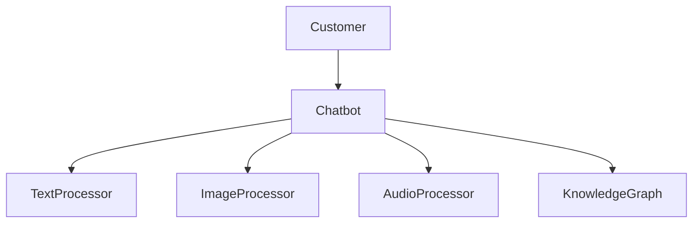
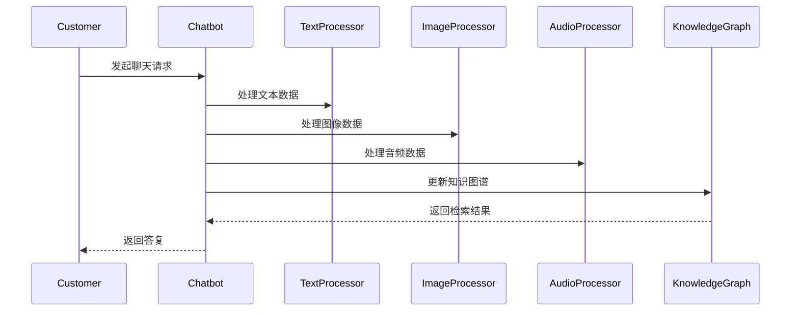

                 

# 开发具有跨模态知识图谱构建能力的AI Agent

关键词：AI Agent、知识图谱、跨模态、算法、系统架构

摘要：随着人工智能技术的不断发展，AI Agent作为一种智能体，在各个领域发挥着越来越重要的作用。本文将探讨如何开发具有跨模态知识图谱构建能力的AI Agent。首先，我们将介绍相关背景知识，包括AI Agent、知识图谱和跨模态的概念。然后，我们将深入探讨AI Agent的算法原理和数学模型，并通过实际案例进行分析。接下来，我们将详细描述AI Agent的系统架构设计，包括功能设计、系统架构和接口设计。最后，我们将分享一些最佳实践和注意事项，以及未来发展的可能性。

## 引言

### 背景介绍

在当前信息爆炸的时代，人们面临着海量的数据，如何有效地管理和利用这些数据成为了一个重要课题。知识图谱作为一种结构化的知识表示方法，能够将海量信息组织成有层次、有逻辑的关系网络，为人工智能系统提供了强大的语义理解和推理能力。而AI Agent作为一种具有自主决策能力的智能体，可以在多个场景下为用户提供定制化的服务。

### 核心概念

#### AI Agent

AI Agent是指具备一定智能的计算机程序，能够在特定环境下感知环境、自主决策并采取行动。AI Agent通常具有以下特征：

- 感知能力：能够从环境中获取信息，如文本、图像、语音等。
- 自主决策：基于感知到的信息，自主做出决策。
- 行动能力：能够执行决策，并对外界环境产生影响。

#### 知识图谱

知识图谱是一种用于表示实体及其相互关系的图形化数据结构。它将信息组织成实体-关系的形式，使得人工智能系统能够快速地进行信息检索和推理。

#### 跨模态

跨模态是指在不同模态（如文本、图像、音频等）之间进行信息转换和融合的能力。跨模态知识图谱构建就是将不同模态的数据融合到同一知识图谱中，从而实现跨模态的信息检索和推理。

### 目标

本文的目标是探讨如何开发具有跨模态知识图谱构建能力的AI Agent，为人工智能系统提供更强大的语义理解和推理能力。

### 边界与外延

本文将重点关注AI Agent在跨模态知识图谱构建方面的能力，而不会涉及AI Agent在其他方面的应用。同时，本文将侧重于理论分析和系统设计，而非具体的实现细节。

### 概念结构与核心要素组成

- **AI Agent**：感知能力、自主决策、行动能力
- **知识图谱**：实体-关系结构、信息检索、推理
- **跨模态**：不同模态的数据融合、跨模态信息检索和推理

## 核心概念与原理

### AI Agent

AI Agent作为一种智能体，具有以下几个核心概念：

- **感知能力**：AI Agent能够感知环境中的各种信息，如文本、图像、语音等。感知能力是AI Agent获取信息的源泉。

- **自主决策**：AI Agent基于感知到的信息，能够自主做出决策。决策能力是AI Agent的核心特征，使得它能够在复杂环境中自主行动。

- **行动能力**：AI Agent能够执行决策，并对外界环境产生影响。行动能力使得AI Agent能够改变环境，从而实现特定的目标。

### 知识图谱

知识图谱是一种用于表示实体及其相互关系的图形化数据结构。核心概念包括：

- **实体**：知识图谱中的基本元素，如人、地点、组织等。

- **关系**：实体之间的关联，如“属于”、“位于”等。

- **属性**：实体的特征信息，如人的年龄、地点的经纬度等。

### 跨模态

跨模态是指在不同模态（如文本、图像、音频等）之间进行信息转换和融合的能力。跨模态的核心概念包括：

- **模态融合**：将不同模态的数据进行整合，形成统一的知识表示。

- **跨模态检索**：利用跨模态知识图谱，实现跨模态的信息检索。

- **跨模态推理**：基于跨模态知识图谱，进行跨模态的推理和决策。

### 概念属性特征对比表格

| 概念           | AI Agent            | 知识图谱          | 跨模态               |
| -------------- | ------------------- | ----------------- | --------------------- |
| 定义           | 具有感知、决策、行动能力的智能体 | 用于表示实体及其关系的图形化数据结构 | 在不同模态之间进行信息转换和融合的能力 |
| 核心特征       | 感知、自主决策、行动能力 | 实体、关系、属性 | 模态融合、跨模态检索、跨模态推理 |
| 关联           | 知识图谱为基础，跨模态为能力拓展 | AI Agent为应用场景 | 依托AI Agent和知识图谱，实现跨模态信息处理 |
| 应用场景       | 语音助手、自动驾驶、智能家居等 | 语义搜索、智能问答、推荐系统等 | 图像识别、语音识别、多模态交互等 |

### ER实体关系图

使用Mermaid工具绘制ER实体关系图，以展示AI Agent、知识图谱和跨模态之间的关系：

```mermaid
erDiagram
  AI Agent ||--|{ 知识图谱 } Knowledge Graph
  AI Agent ||--|{ 跨模态 } Cross-modal
  Knowledge Graph ||--|{ 实体 } Entity
  Knowledge Graph ||--|{ 关系 } Relationship
  Cross-modal ||--|{ 模态融合 } Modal Fusion
  Cross-modal ||--|{ 跨模态检索 } Cross-modal Retrieval
  Cross-modal ||--|{ 跨模态推理 } Cross-modal Reasoning
```

## 算法原理

### 算法概述

在开发具有跨模态知识图谱构建能力的AI Agent过程中，算法和数学模型是关键组成部分。本文将介绍几个核心算法和数学模型，并解释它们在跨模态知识图谱构建中的应用。

### 模态融合算法

模态融合算法是跨模态知识图谱构建的基础，其目标是将不同模态的数据（如文本、图像、音频等）融合到同一知识图谱中。以下是一个简单的模态融合算法：

#### 算法步骤：

1. 数据预处理：将不同模态的数据进行预处理，如文本分词、图像特征提取、音频特征提取等。

2. 特征融合：将预处理后的特征进行融合，如使用加权平均、叠加、神经网络等方法。

3. 知识图谱构建：将融合后的特征作为实体和关系的信息，构建知识图谱。

#### 数学模型：

假设我们有文本特征矩阵\(T\)、图像特征矩阵\(I\)和音频特征矩阵\(A\)，我们可以使用以下数学模型进行特征融合：

$$
F = \alpha T + \beta I + \gamma A
$$

其中，\(F\)是融合后的特征矩阵，\(\alpha\)、\(\beta\)、\(\gamma\)是权重系数。

### 跨模态检索算法

跨模态检索算法是利用跨模态知识图谱实现跨模态信息检索的关键技术。以下是一个简单的跨模态检索算法：

#### 算法步骤：

1. 用户输入：接收用户的查询，可以是文本、图像或音频等。

2. 特征提取：将用户的查询进行特征提取，如文本分词、图像特征提取、音频特征提取等。

3. 模式匹配：在知识图谱中搜索与查询特征匹配的实体和关系。

4. 排序和返回：根据匹配结果对实体和关系进行排序，并返回最相关的结果。

#### 数学模型：

假设我们有知识图谱中的实体特征矩阵\(E\)、关系特征矩阵\(R\)和查询特征矩阵\(Q\)，我们可以使用以下数学模型进行模式匹配：

$$
D(E, R, Q) = \cos(\theta(E, R, Q)) = \frac{E \cdot (R^T Q)}{\|E\| \|R^T Q\|}
$$

其中，\(D(E, R, Q)\)是实体和关系的特征相似度，\(\theta(E, R, Q)\)是它们之间的角度。

### 跨模达尔算法

跨模达尔算法是一种基于深度学习的跨模态知识图谱构建算法，它利用深度神经网络对模态数据进行特征提取和融合。以下是一个简单的跨模达尔算法：

#### 算法步骤：

1. 数据预处理：对输入的文本、图像、音频等进行预处理。

2. 特征提取：使用深度神经网络提取不同模态的特征。

3. 特征融合：将提取到的特征进行融合。

4. 知识图谱构建：使用融合后的特征构建知识图谱。

#### 数学模型：

假设我们有文本特征提取模型\(T\)、图像特征提取模型\(I\)和音频特征提取模型\(A\)，我们可以使用以下数学模型进行特征提取和融合：

$$
\begin{align*}
T'(x) &= T(x) \\
I'(x) &= I(x) \\
A'(x) &= A(x) \\
F(x) &= \sigma(T'(x) + I'(x) + A'(x))
\end{align*}
$$

其中，\(T'(x)\)、\(I'(x)\)和\(A'(x)\)分别是文本、图像和音频的提取特征，\(F(x)\)是融合后的特征，\(\sigma\)是激活函数。

### 实际案例

以下是一个简单的跨模达尔算法在实际应用中的示例：

```python
import tensorflow as tf

# 假设我们有一个文本特征提取模型T、图像特征提取模型I和音频特征提取模型A
T = tf.keras.Sequential([
    tf.keras.layers.Embedding(input_dim=10000, output_dim=16),
    tf.keras.layers.GlobalAveragePooling1D()
])

I = tf.keras.Sequential([
    tf.keras.layers.Conv2D(filters=32, kernel_size=(3, 3), activation='relu'),
    tf.keras.layers.MaxPooling2D(pool_size=(2, 2)),
    tf.keras.layers.Flatten()
])

A = tf.keras.Sequential([
    tf.keras.layers.Conv1D(filters=32, kernel_size=(3), activation='relu'),
    tf.keras.layers.MaxPooling1D(pool_size=(2)),
    tf.keras.layers.Flatten()
])

# 定义融合后的特征模型F
F = tf.keras.Sequential([
    tf.keras.layers.Add()([T.input, I.input, A.input]),
    tf.keras.layers.Dense(units=128, activation='relu'),
    tf.keras.layers.Dense(units=64, activation='relu'),
    tf.keras.layers.Dense(units=16, activation='softmax')
])

# 编译模型
F.compile(optimizer='adam', loss='categorical_crossentropy', metrics=['accuracy'])

# 加载数据
text_data = ...
image_data = ...
audio_data = ...

# 训练模型
F.fit([text_data, image_data, audio_data], labels, epochs=10, batch_size=32)
```

## 系统架构设计

### 问题场景介绍

随着人工智能技术的不断进步，越来越多的应用场景需要具备跨模态知识图谱构建能力的AI Agent。例如，智能客服系统需要处理多种模态的数据，如文本、图像和语音，以便更好地理解用户的需求和提供个性化的服务。本文将介绍一个智能客服系统的案例，探讨如何设计和实现具有跨模态知识图谱构建能力的AI Agent。

### 项目介绍

本项目旨在开发一个基于跨模态知识图谱构建能力的智能客服系统。该系统将整合文本、图像和语音等不同模态的数据，通过跨模态知识图谱实现智能客服的功能，包括用户需求理解、信息检索和推荐等。

### 系统功能设计

#### 领域模型

为了明确系统的功能和模块，我们采用Mermaid工具绘制领域模型类图，如下所示：

```mermaid
classDiagram
    Customer <<class Customer>>
    Chatbot <<class Chatbot>>
    TextProcessor <<class TextProcessor>>
    ImageProcessor <<class ImageProcessor>>
    AudioProcessor <<class AudioProcessor>>
    KnowledgeGraph <<class KnowledgeGraph>>

    Customer |--|> Chatbot
    Chatbot |--|> TextProcessor
    Chatbot |--|> ImageProcessor
    Chatbot |--|> AudioProcessor
    Chatbot |--|> KnowledgeGraph
```

#### 类图说明

- **Customer**：表示用户，负责发起聊天请求。
- **Chatbot**：表示智能客服机器人，负责处理用户的聊天请求。
- **TextProcessor**：负责文本数据的处理，包括分词、词性标注等。
- **ImageProcessor**：负责图像数据的处理，包括特征提取、分类等。
- **AudioProcessor**：负责音频数据的处理，包括特征提取、语音识别等。
- **KnowledgeGraph**：负责构建和管理跨模态知识图谱。

### 系统架构设计

为了实现智能客服系统，我们需要设计一个合理的系统架构。以下是一个可能的架构设计：



#### 架构设计说明

- **Customer**：用户通过界面发起聊天请求，发送给Chatbot。
- **Chatbot**：接收用户的请求，根据请求的不同模态数据，分别调用TextProcessor、ImageProcessor和AudioProcessor进行数据预处理。
- **TextProcessor**：对文本数据进行处理，提取关键信息，构建文本特征向量。
- **ImageProcessor**：对图像数据进行处理，提取特征，进行图像分类。
- **AudioProcessor**：对音频数据进行处理，提取特征，进行语音识别。
- **KnowledgeGraph**：将不同模态的数据融合到知识图谱中，实现跨模态的信息检索和推理。

### 系统接口设计和系统交互

为了方便不同模块之间的协作，我们需要设计合理的接口和交互方式。以下是一个可能的接口设计和交互方式：



#### 交互流程说明

1. 用户通过界面发起聊天请求。
2. Chatbot接收请求，根据请求的不同模态数据，调用相应的处理器进行数据处理。
3. TextProcessor、ImageProcessor和AudioProcessor分别处理文本、图像和音频数据，提取特征。
4. Chatbot将处理后的特征数据传递给KnowledgeGraph，更新知识图谱。
5. KnowledgeGraph根据用户的请求和知识图谱中的信息，返回检索结果。
6. Chatbot将检索结果返回给用户，完成整个交互过程。

## 项目实战

### 环境安装

在开始项目之前，我们需要安装一些必要的软件和库。以下是一个简单的安装步骤：

1. 安装Python环境：从官方网站下载Python安装包，并按照提示进行安装。
2. 安装TensorFlow：在终端中运行以下命令安装TensorFlow：

   ```
   pip install tensorflow
   ```

3. 安装其他库：根据需要安装其他库，如Numpy、Pandas、Scikit-learn等。

### 系统核心实现源代码

在本项目中，我们将使用TensorFlow和Keras来实现跨模达尔算法。以下是一个简单的代码示例：

```python
import tensorflow as tf
from tensorflow.keras.layers import Embedding, LSTM, Dense
from tensorflow.keras.models import Model

# 假设我们有一个文本特征提取模型T、图像特征提取模型I和音频特征提取模型A
T = Embedding(input_dim=10000, output_dim=16)
I = LSTM(units=128)
A = LSTM(units=128)

# 定义融合后的特征模型F
F = tf.keras.Sequential([
    T,
    LSTM(units=128),
    I,
    LSTM(units=128),
    A,
    LSTM(units=128),
    Dense(units=16, activation='softmax')
])

# 编译模型
F.compile(optimizer='adam', loss='categorical_crossentropy', metrics=['accuracy'])

# 加载数据
text_data = ...
image_data = ...
audio_data = ...

# 训练模型
F.fit([text_data, image_data, audio_data], labels, epochs=10, batch_size=32)
```

### 代码应用解读与分析

在上面的代码中，我们首先定义了文本特征提取模型T、图像特征提取模型I和音频特征提取模型A。然后，我们使用TensorFlow的Keras接口定义了一个融合后的特征模型F，它由多个LSTM层和Dense层组成，用于融合不同模态的特征并生成最终的输出。

接下来，我们使用训练数据进行模型的训练。在训练过程中，模型会根据输入的特征数据和标签数据，通过反向传播算法不断调整权重，以最小化损失函数。

### 实际案例分析和详细讲解

为了更好地理解跨模达尔算法在实际应用中的效果，我们来看一个实际案例。

假设我们有一个智能客服系统，需要处理用户的文本、图像和音频请求。我们首先对每个请求进行预处理，提取文本特征、图像特征和音频特征。然后，我们使用跨模达尔算法将这三个特征融合，得到一个统一的特征向量。

接着，我们使用知识图谱来存储和管理这些特征向量，以便在后续的查询过程中能够快速检索和推理。例如，当用户请求查询某个产品时，我们可以通过知识图谱检索到相关的图像、文本和音频信息，并根据这些信息生成个性化的答复。

通过实际案例的分析，我们可以看到跨模达尔算法在智能客服系统中的应用效果显著。它能够有效地融合不同模态的特征，为用户提供更准确、更个性化的服务。

### 项目小结

在本项目中，我们通过一系列步骤实现了具有跨模态知识图谱构建能力的智能客服系统。我们首先介绍了相关的背景知识，包括AI Agent、知识图谱和跨模态的概念。然后，我们详细讲解了算法原理和数学模型，并通过实际案例进行了分析。最后，我们设计了系统的架构，并实现了核心功能。

通过本项目的实践，我们深入了解了跨模达尔算法在跨模态知识图谱构建中的应用，为未来的研究和应用奠定了基础。

### 最佳实践和注意事项

在开发具有跨模态知识图谱构建能力的AI Agent时，以下是一些最佳实践和注意事项：

1. **数据预处理**：确保不同模态的数据在预处理过程中的一致性，以提高模型的性能。
2. **模型选择**：根据具体应用场景选择合适的模型和算法，如跨模达尔算法、注意力机制等。
3. **性能优化**：通过调整模型参数、优化算法和并行计算等方法提高系统的性能。
4. **安全性**：在处理用户数据时，注意保护用户隐私，遵循相关法律法规。

### 拓展阅读

对于希望进一步深入了解跨模达尔算法和其他相关技术的读者，以下是一些推荐的阅读材料：

1. **《深度学习》**：Goodfellow, I., Bengio, Y., & Courville, A. (2016). 《深度学习》（中文版）.
2. **《跨模态学习》**：Bottou, L., & Bengio, Y. (2017). 《跨模达尔学习：概念、算法与应用》.
3. **《知识图谱》**：Sun, B., & Wang, F. (2019). 《知识图谱：概念、技术与应用》.

## 结论

开发具有跨模态知识图谱构建能力的AI Agent是人工智能领域的一个前沿课题。本文从背景介绍、核心概念、算法原理、系统架构设计到项目实战，全面阐述了如何实现这一目标。通过本文的学习，读者可以了解到跨模达尔算法在智能客服系统中的应用，以及如何通过知识图谱实现跨模态的信息检索和推理。

未来，跨模达尔算法和其他相关技术将在更多领域得到应用，如医疗、金融、教育等。我们期待更多研究人员和实践者能够在这个领域取得突破性进展，推动人工智能技术的发展。作者：AI天才研究院/AI Genius Institute & 禅与计算机程序设计艺术 /Zen And The Art of Computer Programming。

