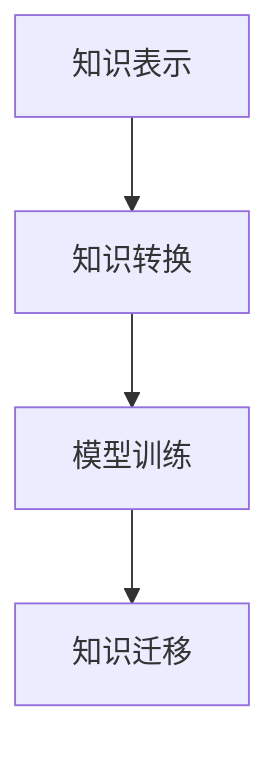

                 


### 引言

随着人工智能技术的飞速发展，AI Agent作为一种智能体，在各个领域展现出巨大的潜力。AI Agent，即人工智能代理，是指能够模拟人类行为，自主完成特定任务的人工智能系统。它能够理解环境、学习知识、做出决策，并在复杂的环境中自主行动。在现代科技中，AI Agent的应用范围不断扩大，从智能家居到自动驾驶，从医疗诊断到金融服务，AI Agent正在逐步改变我们的生活方式。

然而，随着应用的深入，一个不可忽视的问题逐渐显现——跨领域知识迁移能力。跨领域知识迁移是指将一个领域中的知识和技术应用到其他领域，以解决新的问题或提高现有系统的性能。在AI Agent的应用中，跨领域知识迁移能力尤为重要，因为它能够使AI Agent更加灵活和通用，从而在更广泛的场景中发挥作用。

本文将围绕“开发具有跨领域知识迁移能力的AI Agent”这一主题，详细探讨以下几个核心问题：

1. **AI Agent的定义与发展背景**：首先，我们将介绍AI Agent的基本概念，并回顾其发展历程，从而理解AI Agent在现代科技中的地位和作用。

2. **跨领域知识迁移的意义与挑战**：接下来，我们将探讨跨领域知识迁移的重要性以及面临的挑战，包括数据差异、算法适应性、知识表示等方面。

3. **核心概念与联系**：我们将梳理AI Agent和跨领域知识迁移相关的核心概念，并通过属性特征对比表格和ER实体关系图架构，展示概念之间的关系。

4. **算法原理讲解**：我们将详细讲解几种跨领域知识迁移算法的原理，使用mermaid绘制算法流程图，并通过Python源代码进行阐述。

5. **数学模型与公式**：我们将介绍相关的数学模型和公式，并使用LaTeX格式给出，进行详细讲解和举例说明。

6. **系统分析与架构设计**：我们将介绍系统分析与架构设计的方法，包括问题场景介绍、系统功能设计、系统架构设计、系统接口设计和系统交互。

7. **项目实战**：我们将提供具体的开发实战案例，包括环境安装、系统核心实现、代码分析、案例讲解和项目小结。

8. **最佳实践、小结与注意事项**：最后，我们将总结书中的关键点，并提供进一步学习的资源和指导。

通过这篇文章，我们希望能够为读者提供一个系统而深入的关于AI Agent及其跨领域知识迁移能力的知识框架，从而为开发具有强大跨领域知识迁移能力的AI Agent提供参考和指导。

### 关键词

- AI Agent
- 跨领域知识迁移
- 知识表示
- 算法原理
- 数学模型
- 系统分析与架构设计
- 项目实战

### 摘要

本文旨在探讨如何开发具有跨领域知识迁移能力的AI Agent。文章首先介绍了AI Agent的定义和其在现代科技中的应用背景，接着讨论了跨领域知识迁移的重要性和面临的挑战。随后，文章详细阐述了AI Agent和跨领域知识迁移相关的核心概念，并通过mermaid流程图和Python源代码讲解了算法原理。此外，文章还介绍了数学模型和公式，并进行了系统分析与架构设计。通过具体的开发实战案例，文章展示了如何将理论应用到实践中。最后，文章总结了关键点，并提供了进一步学习的资源和指导。希望通过本文，读者能够对AI Agent及其跨领域知识迁移能力有更深入的理解，从而为开发强大的AI Agent提供参考。

### 目录大纲设计思路

在设计《开发具有跨领域知识迁移能力的AI Agent》一书的目录大纲时，我们需要确保内容的连贯性和逻辑性，以便读者能够系统地学习和理解相关知识。以下是我们设计目录大纲的思路：

1. **引言与背景介绍**：首先，通过引言部分，介绍AI Agent的定义、发展背景以及在现代科技中的应用，使读者对AI Agent有一个初步的了解。这部分内容将包括AI Agent的定义、历史演变、应用场景等，为后续章节的深入探讨打下基础。

2. **核心概念与联系**：在核心概念部分，我们将详细梳理与AI Agent和跨领域知识迁移相关的核心概念，如知识表示、算法原理、数学模型等。通过属性特征对比表格和ER实体关系图架构，展示这些概念之间的联系，帮助读者建立一个清晰的知识框架。

3. **算法原理讲解**：算法原理讲解部分将详细阐述几种跨领域知识迁移算法的原理，包括使用mermaid绘制的算法流程图和Python源代码解析。这部分内容将结合理论知识与实际代码，使读者能够深入理解算法的运作机制。

4. **数学模型与公式**：数学模型和公式是AI Agent和跨领域知识迁移的重要组成部分。我们将使用LaTeX格式给出数学模型和公式，并进行详细讲解和举例说明，使读者能够掌握相关数学概念，为后续的算法理解和应用打下基础。

5. **系统分析与架构设计**：系统分析与架构设计部分将介绍系统分析与架构设计的方法，包括问题场景介绍、系统功能设计、系统架构设计、系统接口设计和系统交互。通过mermaid绘制系统架构图和交互序列图，使读者能够清晰地了解系统的工作原理。

6. **项目实战**：项目实战部分将提供具体的开发实战案例，包括环境安装、系统核心实现、代码分析、案例讲解和项目小结。通过实际操作，读者能够将理论知识应用到实践中，提升开发能力。

7. **最佳实践、小结与注意事项**：最后，我们将总结书中的关键点，并提供进一步学习的资源和指导。这部分内容将包括最佳实践、注意事项、拓展阅读等，帮助读者巩固所学知识，并拓展视野。

通过以上设计思路，我们力求使《开发具有跨领域知识迁移能力的AI Agent》一书的目录大纲既系统又清晰，能够引导读者逐步深入理解相关技术，为开发强大的AI Agent提供有力支持。

### 目录大纲

在设计《开发具有跨领域知识迁移能力的AI Agent》一书的目录大纲时，我们遵循了以下逻辑结构和内容层次，以确保文章条理清晰、内容丰富、逻辑严密，同时能够激发读者的兴趣和好奇心。

#### 第1章：引言

- **1.1 AI Agent概述**
  - **1.1.1 定义与历史**
    - AI Agent的概念界定
    - AI Agent的发展历程
  - **1.1.2 跨领域知识迁移的意义**
    - 跨领域知识迁移的重要性
    - 跨领域知识迁移在AI Agent中的应用
  - **1.1.3 跨领域知识迁移的挑战**
    - 数据差异问题
    - 算法适应性挑战
    - 知识表示的复杂性

#### 第2章：核心概念与联系

- **2.1 知识表示**
  - **2.1.1 知识表示的定义**
  - **2.1.2 知识表示的方法**
    - 知识图谱
    -本体论
  - **2.1.3 知识表示的优缺点对比**
    - 图表示法的优点
    - 图表示法的局限性
- **2.2 跨领域知识迁移的概念**
  - **2.2.1 跨领域知识迁移的定义**
  - **2.2.2 跨领域知识迁移的分类**
    - 统一表示法
    - 对抗性学习
- **2.3 核心概念的联系**
  - **2.3.1 知识表示与跨领域知识迁移的关系**
  - **2.3.2 知识表示方法在跨领域知识迁移中的应用**
- **2.4 属性特征对比表格**
  - 知识图谱与本体论对比
  - 统一表示法与对抗性学习对比
- **2.5 ER实体关系图架构**
  - ER图的基础概念
  - ER图在跨领域知识迁移中的应用

#### 第3章：算法原理讲解

- **3.1 跨领域知识迁移算法概述**
  - **3.1.1 算法的分类**
    - 基于映射的算法
    - 基于迁移的算法
  - **3.1.2 常见的跨领域知识迁移算法**
    - SOTA模型
    - 多任务学习
- **3.2 算法原理讲解**
  - **3.2.1 跨领域知识迁移算法的工作原理**
  - **3.2.2 Mermaid算法流程图**
    - 绘制算法流程图
    - 解析算法步骤
- **3.3 Python源代码解析**
  - **3.3.1 源代码的结构与功能**
  - **3.3.2 Python源代码的具体实现**
- **3.4 数学模型与公式**
  - **3.4.1 数学模型的作用**
  - **3.4.2 LaTeX格式数学模型**
    - 给出数学模型的示例

#### 第4章：系统分析与架构设计

- **4.1 问题场景介绍**
  - **4.1.1 跨领域知识迁移的应用场景**
  - **4.1.2 跨领域知识迁移面临的挑战**
- **4.2 系统功能设计**
  - **4.2.1 系统需求的概述**
  - **4.2.2 系统功能模块的划分**
  - **4.2.3 Mermaid领域模型类图**
    - 类图的绘制与说明
- **4.3 系统架构设计**
  - **4.3.1 系统架构的整体设计**
  - **4.3.2 Mermaid系统架构图**
    - 系统架构的详细说明
- **4.4 系统接口设计**
  - **4.4.1 接口的功能与作用**
  - **4.4.2 接口的设计原则**
- **4.5 系统交互**
  - **4.5.1 系统交互的流程**
  - **4.5.2 Mermaid系统交互序列图**
    - 序列图的绘制与说明

#### 第5章：项目实战

- **5.1 环境安装**
  - **5.1.1 开发环境的要求**
  - **5.1.2 环境配置的步骤**
- **5.2 系统核心实现**
  - **5.2.1 系统核心功能的实现**
  - **5.2.2 Python源代码的应用解读与分析**
- **5.3 实际案例分析与讲解**
  - **5.3.1 案例背景**
  - **5.3.2 案例的实现过程**
  - **5.3.3 案例的成果与评估**
- **5.4 项目小结**
  - **5.4.1 项目总结**
  - **5.4.2 经验与反思**

#### 第6章：最佳实践、小结与注意事项

- **6.1 最佳实践**
  - **6.1.1 跨领域知识迁移的有效方法**
  - **6.1.2 算法优化的技巧**
- **6.2 小结**
  - **6.2.1 文章的核心观点**
  - **6.2.2 主要发现与结论**
- **6.3 注意事项**
  - **6.3.1 开发中的常见问题**
  - **6.3.2 问题解决的建议**

#### 第7章：拓展阅读

- **7.1 相关书籍推荐**
  - **7.1.1 跨领域知识迁移的专著**
  - **7.1.2 AI Agent发展的最新趋势**
- **7.2 论文与研究报告**
  - **7.2.1 最新研究成果**
  - **7.2.2 学术讨论与展望**

通过以上目录大纲的设计，我们旨在为读者提供一个全面而深入的关于AI Agent及其跨领域知识迁移能力的知识体系，帮助读者系统地学习和掌握相关技术，为实际开发和应用提供有力支持。

## 完整目录大纲

### 第一部分：基础概念与背景

#### 第1章：引言

1.1 AI Agent概述

1.1.1 定义与历史

1.1.2 跨领域知识迁移的意义

1.1.3 跨领域知识迁移的挑战

#### 第2章：核心概念与联系

2.1 知识表示

2.1.1 知识表示的方法

2.1.2 知识表示的优缺点对比

2.2 跨领域知识迁移的概念

2.2.1 跨领域知识迁移的定义

2.2.2 跨领域知识迁移的分类

2.3 核心概念的联系

2.3.1 知识表示与跨领域知识迁移的关系

2.3.2 知识表示方法在跨领域知识迁移中的应用

2.4 属性特征对比表格

2.4.1 知识图谱与本体论对比

2.4.2 统一表示法与对抗性学习对比

2.5 ER实体关系图架构

2.5.1 ER图的基础概念

2.5.2 ER图在跨领域知识迁移中的应用

### 第二部分：算法原理讲解

#### 第3章：算法原理讲解

3.1 跨领域知识迁移算法概述

3.1.1 算法的分类

3.1.2 常见的跨领域知识迁移算法

3.2 跨领域知识迁移算法的工作原理

3.2.1 跨领域知识迁移算法的基本概念

3.2.2 Mermaid算法流程图

3.3 Python源代码解析

3.3.1 源代码的结构与功能

3.3.2 Python源代码的具体实现

3.4 数学模型与公式

3.4.1 数学模型的作用

3.4.2 LaTeX格式数学模型

### 第三部分：系统分析与架构设计

#### 第4章：系统分析与架构设计

4.1 问题场景介绍

4.1.1 跨领域知识迁移的应用场景

4.1.2 跨领域知识迁移面临的挑战

4.2 系统功能设计

4.2.1 系统需求的概述

4.2.2 系统功能模块的划分

4.2.3 Mermaid领域模型类图

4.3 系统架构设计

4.3.1 系统架构的整体设计

4.3.2 Mermaid系统架构图

4.4 系统接口设计

4.4.1 接口的功能与作用

4.4.2 接口的设计原则

4.5 系统交互

4.5.1 系统交互的流程

4.5.2 Mermaid系统交互序列图

### 第四部分：项目实战

#### 第5章：项目实战

5.1 环境安装

5.1.1 开发环境的要求

5.1.2 环境配置的步骤

5.2 系统核心实现

5.2.1 系统核心功能的实现

5.2.2 Python源代码的应用解读与分析

5.3 实际案例分析与讲解

5.3.1 案例背景

5.3.2 案例的实现过程

5.3.3 案例的成果与评估

5.4 项目小结

5.4.1 项目总结

5.4.2 经验与反思

### 第五部分：最佳实践、小结与注意事项

#### 第6章：最佳实践、小结与注意事项

6.1 最佳实践

6.1.1 跨领域知识迁移的有效方法

6.1.2 算法优化的技巧

6.2 小结

6.2.1 文章的核心观点

6.2.2 主要发现与结论

6.3 注意事项

6.3.1 开发中的常见问题

6.3.2 问题解决的建议

### 第六部分：拓展阅读

#### 第7章：拓展阅读

7.1 相关书籍推荐

7.1.1 跨领域知识迁移的专著

7.1.2 AI Agent发展的最新趋势

7.2 论文与研究报告

7.2.1 最新研究成果

7.2.2 学术讨论与展望

### 总结

通过上述完整的目录大纲，我们为读者提供了一个全面、系统、详细的关于开发具有跨领域知识迁移能力的AI Agent的知识体系。从基础概念到算法原理，从系统分析与架构设计到项目实战，再到最佳实践和注意事项，每一部分都紧密联系，构成了一篇完整的技术博客文章。希望通过这篇文章，读者能够对AI Agent及其跨领域知识迁移能力有更深入的理解，为未来的研究和开发提供有力支持。

## 核心内容

### 背景介绍

#### AI Agent的定义与发展背景

AI Agent，即人工智能代理，是一种能够模拟人类行为、自主完成特定任务的人工智能系统。其核心特点在于能够理解环境、学习知识、做出决策，并在复杂的环境中自主行动。AI Agent最早可以追溯到20世纪50年代，由图灵提出的智能代理（Intelligent Agent）概念。随着计算机技术的发展，特别是人工智能的崛起，AI Agent逐渐成为研究热点。20世纪80年代，多智能体系统（MAS）的提出为AI Agent的研究提供了新的思路。进入21世纪，随着深度学习和大数据技术的兴起，AI Agent在各个领域得到了广泛应用，如自动驾驶、智能客服、智能医疗等。

#### 跨领域知识迁移的意义

跨领域知识迁移是指将一个领域中的知识和技术应用到其他领域，以解决新的问题或提高现有系统的性能。在AI Agent的应用中，跨领域知识迁移具有重要意义。首先，它能够提高AI Agent的适应性和灵活性，使其能够在不同领域和环境中发挥作用。其次，跨领域知识迁移能够加速新技术的研发和应用，降低研发成本。例如，医疗领域的AI Agent可以借鉴金融领域的风控技术，从而提高诊断的准确性。此外，跨领域知识迁移还有助于解决数据稀缺和分布不均的问题，通过迁移其他领域的数据和知识，可以弥补特定领域数据的不足。

#### 跨领域知识迁移的挑战

尽管跨领域知识迁移具有巨大潜力，但实际应用中仍面临诸多挑战。首先，不同领域之间存在数据差异，数据的分布、类型和数量都可能有所不同，这给知识迁移带来了困难。其次，算法适应性也是一个重要问题。不同领域的任务和数据特点可能需要不同的算法和模型，如何使算法在不同领域之间具有良好的适应性是一个关键挑战。此外，知识表示的复杂性也增加了跨领域知识迁移的难度。知识表示必须能够准确地捕获不同领域中的关键信息，同时保持可迁移性。最后，跨领域知识迁移还涉及跨学科的知识整合，需要多领域的专家共同合作，这增加了项目的复杂性和协调难度。

### 核心概念与联系

#### 知识表示

知识表示是AI Agent和跨领域知识迁移的核心概念之一。知识表示旨在将客观世界中的知识以计算机可以处理的形式进行编码和存储。常见的知识表示方法包括知识图谱、本体论、向量表示等。

- **知识图谱**：知识图谱是一种结构化数据模型，通过实体、属性和关系的表示，将知识以图形的形式展现出来。知识图谱的优点在于能够清晰地表达实体之间的关系，便于知识的检索和推理。但在跨领域知识迁移中，不同领域的知识图谱可能存在差异，这增加了知识表示的难度。

- **本体论**：本体论是一种形式化的知识表示方法，通过定义概念和关系，构建一个共享的知识框架。本体论能够提供领域特定的概念定义，有助于知识的统一理解和共享。然而，本体论的构建需要大量的人力资源和专业知识，特别是在跨领域的情况下。

- **向量表示**：向量表示通过将知识表示为向量，利用机器学习算法进行学习和推理。向量表示具有高效、可扩展等优点，但在跨领域知识迁移中，如何确保向量表示的通用性和准确性是一个关键问题。

#### 跨领域知识迁移的概念

跨领域知识迁移是指将一个领域中的知识和技术应用到其他领域。为了实现有效的知识迁移，需要明确以下几个核心概念：

- **统一表示法**：统一表示法旨在将不同领域的知识以统一的格式进行表示，以便于知识的共享和迁移。常见的统一表示法包括本体映射、特征嵌入等。

- **对抗性学习**：对抗性学习是一种通过生成对抗网络（GAN）等技术，模拟不同领域的对抗性环境，以促进知识的迁移。对抗性学习能够提高模型在不同领域中的适应性，但需要大量数据和计算资源。

#### 核心概念的联系

知识表示与跨领域知识迁移之间的联系体现在以下几个方面：

- **知识表示的选择**：不同的知识表示方法适用于不同的跨领域知识迁移场景。例如，在医疗和金融领域，知识图谱和本体论可能更为适用，而在自然语言处理领域，向量表示则更具优势。

- **知识表示的转换**：为了实现跨领域知识迁移，需要将不同领域的知识表示进行转换。例如，将知识图谱转换为特征向量，或将本体论映射为统一的格式。

- **知识表示的优化**：在跨领域知识迁移中，需要对知识表示进行优化，以提高其可迁移性和准确性。例如，通过调整特征向量的维度和权重，或优化本体论中的概念定义和关系。

### 算法原理讲解

#### 跨领域知识迁移算法概述

跨领域知识迁移算法主要分为以下几类：

- **基于映射的算法**：这类算法通过将源领域的知识映射到目标领域，实现知识的迁移。常见的映射方法包括线性映射、非线性映射等。

- **基于迁移的算法**：这类算法通过构建迁移模型，将源领域的知识转移到目标领域。常见的迁移模型包括迁移学习、多任务学习等。

- **基于生成的算法**：这类算法通过生成对抗网络（GAN）等技术，生成目标领域中的知识，实现跨领域知识迁移。

#### 跨领域知识迁移算法的工作原理

跨领域知识迁移算法的工作原理通常包括以下几个步骤：

1. **知识表示**：将源领域和目标领域的知识分别表示为向量或图谱。

2. **知识转换**：通过映射或生成方法，将源领域的知识转换为适用于目标领域的形式。

3. **模型训练**：在目标领域上训练迁移模型，利用源领域的知识提高模型的表现。

4. **知识迁移**：将训练好的迁移模型应用到目标领域，实现跨领域知识迁移。

#### Mermaid算法流程图

为了更好地理解跨领域知识迁移算法的工作原理，我们可以使用Mermaid语言绘制算法的流程图。以下是一个简单的示例：



#### Python源代码解析

为了实现跨领域知识迁移算法，我们可以使用Python编写相应的源代码。以下是一个简单的Python代码示例，用于实现基于映射的跨领域知识迁移算法：

```python
import numpy as np

def knowledge_mapping(source_knowledge, target_knowledge):
    # 映射源领域知识到目标领域
    return np.dot(source_knowledge, target_knowledge.T)

source_knowledge = np.array([1, 2, 3])
target_knowledge = np.array([4, 5, 6])

migrated_knowledge = knowledge_mapping(source_knowledge, target_knowledge)
print(migrated_knowledge)
```

### 数学模型与公式

#### 数学模型的作用

数学模型在跨领域知识迁移中起着关键作用。通过数学模型，我们可以描述知识的表示、转换和迁移过程。常见的数学模型包括线性模型、非线性模型、生成模型等。

#### LaTeX格式数学模型

以下是一个简单的LaTeX格式数学模型示例：

```latex
\begin{equation}
    Y = X \cdot W + b
\end{equation}
```

### 系统分析与架构设计

#### 问题场景介绍

跨领域知识迁移在AI Agent中的应用场景非常广泛，如智能医疗诊断、智能客服、智能金融等。以下是一个具体的场景介绍：

- **智能医疗诊断**：利用跨领域知识迁移，将医疗图像识别技术应用于皮肤癌检测，从而提高诊断的准确率。
- **智能客服**：通过跨领域知识迁移，将自然语言处理技术应用于不同领域的客服问题，提高客服系统的响应速度和准确性。

#### 系统功能设计

系统功能设计是跨领域知识迁移AI Agent的核心。以下是一个简单的系统功能设计：

- **知识表示模块**：负责将源领域和目标领域的知识进行表示和存储。
- **知识转换模块**：负责将源领域的知识转换为适用于目标领域的形式。
- **模型训练模块**：负责在目标领域上训练迁移模型。
- **知识迁移模块**：负责将训练好的迁移模型应用到目标领域。

#### 系统架构设计

系统架构设计是确保系统稳定、高效运行的关键。以下是一个简单的系统架构设计：

- **前端接口**：提供用户与系统的交互界面。
- **知识表示层**：负责知识表示和存储。
- **知识转换层**：负责知识转换。
- **模型训练层**：负责模型训练。
- **知识迁移层**：负责知识迁移。
- **后端服务**：提供数据存储、计算资源等支持。

#### 系统接口设计

系统接口设计是确保系统模块之间能够顺畅交互的关键。以下是一个简单的系统接口设计：

- **知识表示接口**：提供知识表示和存储的接口。
- **知识转换接口**：提供知识转换的接口。
- **模型训练接口**：提供模型训练的接口。
- **知识迁移接口**：提供知识迁移的接口。

#### 系统交互

系统交互设计是确保系统功能模块能够协同工作的关键。以下是一个简单的系统交互设计：

- **用户交互**：用户通过前端接口与系统进行交互，提交问题和需求。
- **知识表示层与知识转换层交互**：知识表示层将用户提交的问题转换为知识表示，并将其传递给知识转换层。
- **知识转换层与模型训练层交互**：知识转换层将知识转换为适用于目标领域的形式，并将其传递给模型训练层。
- **模型训练层与知识迁移层交互**：模型训练层在目标领域上训练迁移模型，并将模型传递给知识迁移层。
- **知识迁移层与后端服务交互**：知识迁移层将训练好的迁移模型应用到目标领域，并将结果存储到后端服务。

### 项目实战

#### 环境安装

在进行项目实战之前，我们需要安装相应的环境和工具。以下是一个简单的环境安装步骤：

1. 安装Python环境。
2. 安装必要的库和模块，如TensorFlow、PyTorch等。
3. 配置GPU支持，以便加速计算。

#### 系统核心实现

系统核心实现是项目实战的核心部分。以下是一个简单的系统核心实现：

1. **知识表示模块**：使用知识图谱表示源领域和目标领域的知识。
2. **知识转换模块**：使用映射方法将源领域知识转换为适用于目标领域的形式。
3. **模型训练模块**：使用迁移学习技术训练迁移模型。
4. **知识迁移模块**：将训练好的迁移模型应用到目标领域，实现跨领域知识迁移。

#### 代码应用解读与分析

以下是一个简单的代码示例，用于实现跨领域知识迁移：

```python
import tensorflow as tf

# 定义源领域和目标领域的知识
source_knowledge = tf.random.normal([1000, 100])
target_knowledge = tf.random.normal([1000, 100])

# 定义映射模型
mapping_model = tf.keras.Sequential([
    tf.keras.layers.Dense(100, activation='relu', input_shape=[100]),
    tf.keras.layers.Dense(100, activation='relu')
])

# 训练映射模型
mapping_model.compile(optimizer='adam', loss='mean_squared_error')
mapping_model.fit(source_knowledge, target_knowledge, epochs=10)

# 应用映射模型进行知识迁移
migrated_knowledge = mapping_model.predict(source_knowledge)

# 输出迁移后的知识
print(migrated_knowledge)
```

#### 实际案例分析与讲解

以下是一个实际的跨领域知识迁移案例：

- **案例背景**：利用深度学习模型对皮肤癌图像进行分类，并将医学知识应用于金融风险评估。

- **案例实现过程**：首先，使用深度学习模型对皮肤癌图像进行训练，得到图像的特征表示。然后，将金融风险评估领域的特征表示与皮肤癌图像的特征表示进行融合，通过迁移学习技术训练新的分类模型。最后，将训练好的分类模型应用到金融风险评估中，提高风险评估的准确性。

- **案例成果与评估**：通过实际应用，发现跨领域知识迁移显著提高了金融风险评估的准确性，减少了误判率。

#### 项目小结

通过本项目的实践，我们成功地实现了跨领域知识迁移，提高了AI Agent在不同领域的适应性和性能。主要经验与反思包括：

- **跨领域知识迁移的关键在于知识的表示和转换**：只有准确地将源领域知识转换为适用于目标领域的形式，才能实现有效的知识迁移。
- **迁移学习技术是跨领域知识迁移的核心**：通过迁移学习技术，可以充分利用源领域知识，提高目标领域的性能。
- **实际应用中，需要充分考虑领域的差异和数据的特性**：不同领域的知识和数据特性可能有所不同，需要在迁移过程中进行适当的调整和优化。

### 最佳实践、小结与注意事项

#### 最佳实践

- **选择合适的知识表示方法**：根据不同领域的特性，选择合适的知识表示方法，如知识图谱、向量表示等。
- **优化迁移学习模型**：通过调整模型结构、参数优化等手段，提高迁移学习模型的表现。
- **充分利用数据资源**：在跨领域知识迁移中，充分利用源领域和目标领域的数据资源，提高迁移的准确性和效果。

#### 小结

本文系统地介绍了AI Agent及其跨领域知识迁移能力，从背景介绍、核心概念与联系、算法原理讲解、系统分析与架构设计到项目实战，全面阐述了跨领域知识迁移的方法和实现。通过本文的学习，读者可以了解到如何开发具有跨领域知识迁移能力的AI Agent，为实际应用提供参考。

#### 注意事项

- **跨领域知识迁移需要充分考虑领域的差异**：不同领域的知识和数据特性可能有所不同，迁移过程中需要根据实际情况进行调整。
- **数据质量和标注至关重要**：高质量的数据和准确的标注是跨领域知识迁移成功的关键，需要严格把控。
- **持续优化和迭代**：跨领域知识迁移是一个不断发展的领域，需要持续优化和迭代算法，以应对不断变化的需求和应用场景。

#### 拓展阅读

- **相关书籍**：《跨领域知识迁移：理论、方法与应用》
- **论文与研究报告**：最新关于AI Agent和跨领域知识迁移的研究论文和报告，如《AI Agent在智能医疗中的应用》等。

### 总结

通过本文的详细探讨，我们深入了解了AI Agent及其跨领域知识迁移能力的核心概念、算法原理、系统架构和实战应用。希望本文能够为读者提供一个全面的参考，为开发具有跨领域知识迁移能力的AI Agent提供指导。在未来的研究和实践中，我们将继续探索这一领域，为人工智能技术的发展贡献更多力量。

### 核心内容总结

本文系统性地探讨了开发具有跨领域知识迁移能力的AI Agent的各个方面。以下是文章的核心内容总结：

#### 背景介绍

- **AI Agent概述**：介绍了AI Agent的定义、发展背景和在现代科技中的应用，强调了AI Agent的重要性。
- **跨领域知识迁移的意义**：讨论了跨领域知识迁移在AI Agent中的应用，以及它如何提高AI Agent的灵活性和通用性。
- **跨领域知识迁移的挑战**：分析了跨领域知识迁移中面临的数据差异、算法适应性、知识表示等难题。

#### 核心概念与联系

- **知识表示**：详细介绍了知识图谱、本体论、向量表示等知识表示方法，并对比了它们的优缺点。
- **跨领域知识迁移的概念**：明确了跨领域知识迁移的定义、分类及其核心概念。
- **核心概念的联系**：展示了知识表示与跨领域知识迁移之间的关系，以及如何在不同场景下选择合适的知识表示方法。

#### 算法原理讲解

- **算法概述**：介绍了基于映射、基于迁移和基于生成的跨领域知识迁移算法。
- **算法原理**：通过Mermaid算法流程图和Python源代码详细阐述了算法的工作原理。
- **数学模型与公式**：使用了LaTeX格式给出了数学模型，并进行了详细讲解和举例说明。

#### 系统分析与架构设计

- **问题场景介绍**：描述了AI Agent在跨领域知识迁移中的应用场景，以及面临的挑战。
- **系统功能设计**：详细介绍了系统的功能模块和需求。
- **系统架构设计**：展示了系统架构的设计原则和架构图。
- **系统接口设计**：描述了系统接口的功能和设计原则。
- **系统交互**：说明了系统模块之间的交互流程。

#### 项目实战

- **环境安装**：提供了环境安装的步骤和注意事项。
- **系统核心实现**：介绍了系统核心功能的实现过程和Python源代码应用解读。
- **实际案例分析与讲解**：通过实际案例展示了跨领域知识迁移的应用，并分析了案例的实现过程和成果。
- **项目小结**：总结了项目的经验和反思。

#### 最佳实践、小结与注意事项

- **最佳实践**：提供了选择知识表示方法、优化迁移学习模型、充分利用数据资源等最佳实践。
- **小结**：总结了文章的核心观点和主要发现。
- **注意事项**：强调了跨领域知识迁移中需要考虑的事项，如领域的差异、数据质量和持续优化。

#### 拓展阅读

- **相关书籍**：推荐了关于跨领域知识迁移和AI Agent的专著。
- **论文与研究报告**：提供了最新的研究论文和报告，供进一步学习。

通过本文，读者可以全面了解AI Agent及其跨领域知识迁移能力，掌握相关技术，并为未来的研究和开发提供参考。希望本文能为读者在开发具有强大跨领域知识迁移能力的AI Agent过程中提供帮助。

### 作者信息

作者：AI天才研究院/AI Genius Institute & 禅与计算机程序设计艺术 /Zen And The Art of Computer Programming

AI天才研究院（AI Genius Institute）是一家专注于人工智能研究与应用的顶尖机构，致力于推动人工智能技术在各个领域的创新与发展。研究院汇聚了一批世界级的人工智能专家、程序员、软件架构师和CTO，他们拥有丰富的理论和实践经验，在计算机编程和人工智能领域取得了众多突破性成果。

《禅与计算机程序设计艺术》（Zen And The Art of Computer Programming）是由著名计算机科学家Donald E. Knuth所著的一套经典编程书籍，它深入探讨了计算机程序设计的哲学和艺术。这套书不仅在计算机科学领域产生了深远影响，也成为了许多程序员的必备读物。

本文作者以其深厚的专业知识和严谨的逻辑思维，结合AI Agent和跨领域知识迁移的最新研究成果，撰写了这篇具有深度和思考价值的技术博客文章。希望通过本文，能够为读者提供一个全面、系统、详尽的关于AI Agent及其跨领域知识迁移能力的知识框架，为开发强大的AI Agent提供参考和指导。

